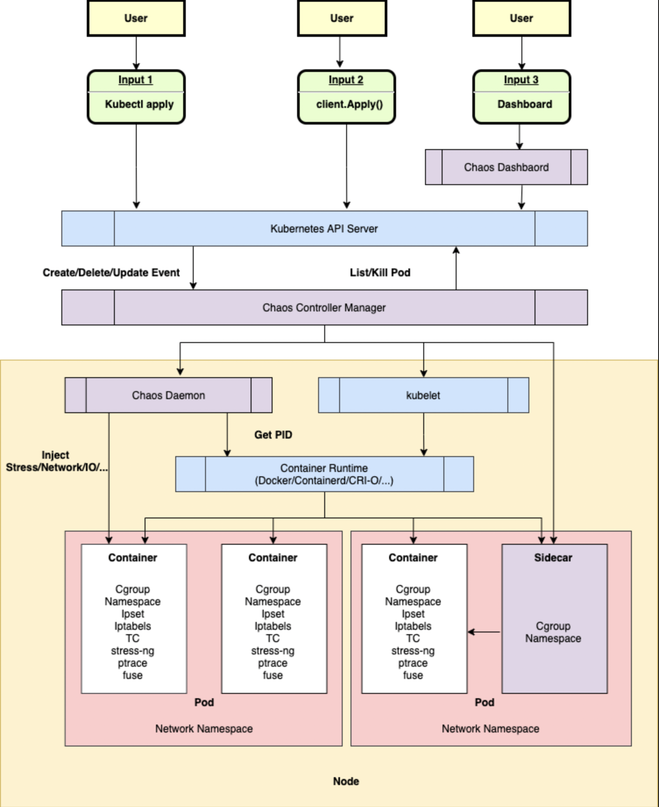

# Chaos Mesh Self-assessment

Authors: Yash Mathur (@mathur-14), Aditya Deepak Joshi (@AdityaDJoshi), Ushan Abeysekera (@ua2047), Jia Huang (@iamgeeyuh)

Contributors/Reviewers: Pranava Kumar Vemula (@Rana-KV), Eddie Knight (@eddie-knight)

The Self-assessment is the initial document for Chaos Mesh to begin thinking about the security of the project, determining gaps in its security, and preparing any security documentation for their users.

## Table of contents

- [Chaos Mesh Self-assessment](#chaos-mesh-self-assessment)
  - [Table of contents](#table-of-contents)
  - [Metadata](#metadata)
    - [Security links](#security-links)
  - [Overview](#overview)
    - [Background](#background)
    - [Actors](#actors)
    - [Actions](#actions)
    - [Goals](#goals)
    - [Non-goals](#non-goals)
  - [Self-assessment use](#self-assessment-use)
  - [Security functions and features](#security-functions-and-features)
  - [Project compliance](#project-compliance)
  - [Secure development practices](#secure-development-practices)
  - [Security issue resolution](#security-issue-resolution)
  - [Appendix](#appendix)

## Metadata

|                   |                                                                                                                                |
| ----------------- | ------------------------------------------------------------------------------------------------------------------------------ |
| Software          | https://github.com/chaos-mesh/chaos-mesh                                                                                       |
| Security Provider | No, Chaos Mesh offers various types of fault simulation and has an enormous capability to orchestrate fault scenarios.         |
| Languages         | Go, Typescript, Javascript, Shell                                                                                              |
| SBOM              | Chaos Mesh automatically generates SBOMs as assets with each release: https://github.com/chaos-mesh/chaos-mesh/releases/latest |

### Security links

| Doc                                                                 | URL                                                                                                                                                                                                     |
| ------------------------------------------------------------------- | ------------------------------------------------------------------------------------------------------------------------------------------------------------------------------------------------------- |
| Manage user permissions                                             | https://chaos-mesh.org/docs/manage-user-permissions/                                                                                                                                                    |
| Configure namespace for Chaos Experiments                           | https://chaos-mesh.org/docs/configure-enabled-namespace/                                                                                                                                                |
| GCP OAuth Authentication                                            | https://chaos-mesh.org/docs/gcp-authentication/                                                                                                                                                         |
| Chaos Mesh manages permissions using the native RBAC feature in K8s | https://kubernetes.io/docs/reference/access-authn-authz/rbac/                                                                                                                                           |
| Vulnerability Disclosure Policy                                     | https://github.com/chaos-mesh/chaos-mesh/blob/master/SECURITY.md#disclosure-policy                                                                                                                      |
| Vulnerability Reporting Process                                     | https://github.com/chaos-mesh/chaos-mesh/blob/master/SECURITY.md#reporting-a-vulnerability                                                                                                              |
| Default Configuration                                               | https://chaos-mesh.org/docs/configure-development-environment/#configuration-requirements          (Note: [Go version Vulnerability](https://github.com/chaos-mesh/chaos-mesh/releases/tag/v2.5.2) ) |
| Versions Supported by Security Updates                              | [Supported Versions](https://github.com/chaos-mesh/chaos-mesh/security#supported-versions             )                    [All Versions](https://chaos-mesh.org/supported-releases/)                |

## Overview

Chaos Mesh is an open source cloud-native Chaos Engineering platform. It offers various types of fault simulation and has an enormous capability to orchestrate fault scenarios. Using Chaos Mesh, you can conveniently simulate various abnormalities that might occur in reality during the development, testing, and production environments and find potential problems in the system. 

### Background

Chaos engineering is a discipline within software development and operations that focuses on proactively testing systems for their resilience to failure or unexpected conditions. The primary goal is to uncover weaknesses or vulnerabilities in a system's design or architecture before they cause significant issues in real-world scenarios.

Chaos engineering involves intentionally introducing controlled and measured disruptions or faults into a system to observe how it responds under stress. By doing so, engineers can identify weaknesses, bottlenecks, or failure points and then work on improving the system's reliability, robustness, and fault tolerance.

### Actors
- User: The individual initiating Chaos experiments and interacting with the Chaos Dashboard to manipulate and observe the experiments.
- Chaos Controller Manager: Responsible for scheduling and managing Chaos experiments. It includes multiple Controllers handling different Chaos experiment types and workflows.
- Chaos Daemon: The executive component running in DaemonSet mode. It carries out specific fault injections by interfering with network devices, file systems, and kernels within the target Pod Namespace.
- Chaos Dashboard: A web-based user interface that provides a graphical interface for users to interact with the Chaos Mesh system. Users can use the dashboard to create, manage, and monitor chaos experiments visually.

### Actions
User input and observation:
- User (Actor) Interaction: Initiating operations and interactions via the Chaos Dashboard or YAML configuration file.
  - Chaos Resource Changes: Triggering changes in Chaos resources (e.g., creating or modifying NetworkChaos resources). This is subject to authentication and authorization checks.

Monitor resource changes, schedule Workflow, and carry out Chaos experiments:
- Chaos Controller Manager (Actor): Accepting events from the Kubernetes API Server.
  - Workflow Scheduling: Scheduling and managing Chaos experiments and workflows.
  - Chaos Experiment Execution: Triggering specific fault injections, such as Pod failures, network issues, CPU/memory race simulations, etc.
  - Tenant Isolation Checks: Ensuring the services are operating on the correct namespaces.

Injection of specific node faults:
- Chaos Daemon (Actor): Accepting commands from Chaos Controller Manager to execute fault injections.
  - Specific Fault Injections: Hacking into the target Pod's Namespace to perform fault injections based on defined Chaos resources.
  - Chaos Resource Changes: Triggering changes in Chaos resources (e.g., creating or modifying NetworkChaos resources).

Monitor resource changes, schedule Workflow, and carry out Chaos experiments:
- Chaos Controller Manager (Actor): Accepting events from the Kubernetes API Server.
  - Workflow Scheduling: Scheduling and managing Chaos experiments and workflows.
  - Chaos Experiment Execution: Triggering specific fault injections, such as Pod failures, network issues, CPU/memory race simulations, etc.
  - Tenant Isolation Checks: Ensuring the services are operating on the correct namespaces.

Injection of specific node faults:
- Chaos Daemon (Actor): Accepting commands from Chaos Controller Manager to execute fault injections.
  - Specific Fault Injections: Hacking into the target Pod's Namespace to perform fault injections based on defined Chaos resources.

### Goals
- Fault Injection for Resilience Testing: Chaos Mesh aims to enable controlled and orchestrated fault injections within cloud-native environments to improve system resilience. This includes simulating various fault scenarios such as network failures, application faults, and platform failures.
- Chaos Experiment Orchestration: The project's goal is to provide a comprehensive platform to orchestrate Chaos experiments. This involves scheduling, managing, and monitoring Chaos experiments and workflows.
- Visualization and User-Friendly Interfaces: It intends to offer a user-friendly Chaos Dashboard for visualization and manipulation of Chaos experiments. This includes simplified user interactions to define and monitor experiments.
- Security and Permission Management: Chaos Mesh implements RBAC for permission management, ensuring that only authorized users can initiate and manage Chaos experiments. This enhances security by limiting access based on roles and permissions.

### Non-goals
- Resource Utilization Control: Chaos Mesh does not aim to restrict or control the amount of resources utilized by Chaos experiments. For instance, it does not intend to prevent a user from causing excessive resource usage that could potentially incur financial costs or overload servers.
- Limiting Data Storage: The project does not aim to enforce limitations on the amount of data stored or handled during Chaos experiments. It does not prevent users from storing large amounts of data that might impact infrastructure or incur costs.
- Complete System Control: Chaos Mesh does not seek to exert control over all aspects of the system but rather focuses on Chaos Engineering-specific functionalities. It doesn't aim to govern every potential action within a Kubernetes environment but rather focuses on controlled fault injections for testing system resilience.

## Self-assessment use

This self-assessment is created by the Chaos Mesh team to perform an internal analysis of the project's security.  It is not intended to provide a security audit of Chaos Mesh, or function as an independent assessment or attestation of Chaos Mesh's security health.

This document serves to provide Chaos Mesh users with an initial understanding of Chaos Mesh's security, where to find existing security documentation, Chaos Mesh plans for security, and general overview of Chaos Mesh security practices, both for development of Chaos Mesh as well as security of Chaos Mesh.

This document provides the CNCF TAG-Security with an initial understanding of Chaos Mesh to assist in a joint-assessment, necessary for projects under incubation.  Taken together, this document and the joint-assessment serve as a cornerstone for if and when Chaos Mesh seeks graduation and is preparing for a security audit.

## Security functions and features

* Critical.

  Role-Based Access Control (RBAC): RBAC in Chaos Mesh ensures that only authorized users can perform specific actions within the system. It controls access to resources based on the roles of individual users, thus limiting the potential damage that can be caused by malicious actors or accidental misuse.

  Authentication and Authorization: These mechanisms verify the identity of users and ensure that they have the appropriate permissions to perform actions. This is crucial to prevent unauthorized access to the system and to control what actions each user can perform.

* Security Relevant. 

  Pod Security Policies: In Kubernetes environments, pod security policies define the conditions that pods must meet to run. Configuring these policies helps ensure that Chaos Mesh operates within a secure environment.

  Chaos Mesh Experiment Configurations: The configuration of chaos experiments themselves, including defining scope, duration, and intensity, is crucial. Proper configuration ensures that these experiments do not unintentionally compromise system stability or security.

  Network Security Configurations: These include settings related to firewalls, network segmentation, and access controls. Proper configuration can prevent unauthorized access such as Role-Based Access Control [RBAC](https://kubernetes.io/docs/reference/access-authn-authz/rbac/). and limit the scope of potential network-based attacks. The roles determine which users can create, configure, and run experiments.

  Resource Quotas and Limits: Setting appropriate resource quotas and limits in Kubernetes helps prevent resource exhaustion attacks, where an attacker could attempt to overwhelm the system by consuming excessive resources. Tenant Isolation can separate each tenant and their Kubernetes resources into their own namespaces so that users of these tenant services have appropriate access that also only for their respective namespaces

## Project compliance

* In the most recent security self assessment of Chaos Mesh, there is a notable absence of documented adherence to recognized security standards, including but not limited to PCI-DSS, COBIT, ISO, GDPR, etc. Ongoing initiatives are directed towards assessing and aligning Chaos Mesh with these standards, emphasizing a commitment to industry best practices in security and privacy. This adherence is discussed under CII Best Practices under [Appendix](#appendix).
* Although not meeting any particular standards, Chaos Mesh relies on TLS encryption to ensure robustness and security to safeguard against man in the middle attacks.

## Secure development practices

* Development Pipeline.

  1. Clone the repo to remote device and make a change
  2. Unit test
  3. Perform manual tests in Chaos Mesh
  4. Commit and push to remote branch. Commit must be signed
  5. Create a pull request
  6. Get a code review by two reviewers
  7. Goto step 1 if changes are required

* Communication Channels:

  * Internal:
    - Slack: https://cloud-native.slack.com/archives/C0193VAV272
    - GitHub Issues: https://github.com/chaos-mesh/chaos-mesh/issues/new?assignees=&labels=&template=question.md
    - GitHub Discussion: https://github.com/chaos-mesh/chaos-mesh/discussions/new
    - Email: https://github.com/chaos-mesh/chaos-mesh/blob/master/MAINTAINERS.md

  * Inbound:
    - Slack: https://cloud-native.slack.com/archives/C0193VAV272
    - GitHub Issues: https://github.com/chaos-mesh/chaos-mesh/issues/new?assignees=&labels=&template=question.md
    - GitHub Discussion: https://github.com/chaos-mesh/chaos-mesh/discussions/new

  * Outbound:
    - Chaos Mesh Blog: https://chaos-mesh.org/blog
    - Twitter: https://twitter.com/chaos_mesh
    - Community Meeting: https://community.cncf.io/chaos-mesh-community/
    - Development Meeting: https://community.cncf.io/chaos-mesh-community/

* Ecosystem. 

    Chaos Mesh is primarily designed for Kubernetes environments. It leverages Kubernetes features and concepts, like Custom Resource Definitions (CRDs), to manage chaos experiments as Kubernetes resources. This tight integration makes it an essential tool for organizations that use Kubernetes for orchestration.

## Security issue resolution

Reports of security issues should be made to the Chaos Mesh Security Team: chaos-mesh-security@lists.cncf.io

Known public security vulnerabilities will be disclosed as soon as possible after receiving the report. 

Vulnerabilities discovered for the first time will be disclosed in accordance with the following process:

1. The received security vulnerability report shall be handed over to the security team for follow-up coordination and repair work.
2. After the vulnerability is confirmed, the team creates a draft Security Advisory on Github that lists the details of the vulnerability.
3. Invite related personnel to discuss the fix.
4. Fork the temporary private repository on Github, and collaborate to fix the vulnerability.
5. After the fixed code is merged into all supported versions, the vulnerability will be publicly posted in the GitHub Advisory Database.

## Appendix

Known Issues Over Time
* The maintainers of Chaos Mesh have a record of all their issues on [this page](https://github.com/chaos-mesh/chaos-mesh/issues). Any issues including but not limited to security vulnerabilities discovered in the past are documented here. Some repetitive issues do arise, but these are related to the testing of pod killing in certain applications
* The repository has a [security policy](https://github.com/chaos-mesh/chaos-mesh/security/policy) that outlines their ability to provide security updates to the two most recent minor versions. Secondly, their security advisories page exists, and has a no previous security threats sign on it. 
* That being said a broad understanding from reviewers about chaos mesh's security [is](https://www.googlecloudcommunity.com/gc/Cloud-Product-Articles/Comparing-CNCF-Chaos-Engineering-Tools/ta-p/500693) that it uses some Linux utilities to implement the low-level chaos types. Similarly, it needs to use the Docker API in the host machine. Therefore, the daemon Pods (deployed as DaemonSet) will run as privileged containers, and will mount the ``/var/run/docker.sock`` socket file. The controller manager Pod will require permissions to manage MutatingWebhookConfiguration, besides some other expected role-based access control (RBAC) permissions, if the sidecar injection is enabled.

CII Best Practices (based on: [link](https://www.bestpractices.dev/en/criteria/0))
* Chaos Mesh does not have a CII best practices badge. According to the criteria defined by the CII best practices handbook Chaos Mesh satisfies the required criteria in the Basics, Change Control, Reporting, and Quality guidelines. 
* As for the Security field it is unknown if there is a security engineer on board to perform said secure developments as well as design against Man In The Middle (MITM) Attacks. Secondly, the good cryptographic practices clause also cannot be commented upon as the usage of the such is unknown. 

Reference
* Security Issue Resolution: https://github.com/chaos-mesh/chaos-mesh/blob/master/SECURITY.md
* Development Pipeline: https://github.com/chaos-mesh/chaos-mesh/blob/master/CONTRIBUTING.md
* Light Weight Threat Model of Chaos Mesh: [link](lightweight-threat-model.md)

Case Studies
* In terms of Case Studies, Chaos Mesh has glowing and amazing testimonials. It has a dedicated [adopters](https://github.com/chaos-mesh/chaos-mesh/blob/master/ADOPTERS.md) page covering 40 major adopters encompassing domains such as automobiles, gaming as well as social media giants like ByteDance. 
* Further notable examples like TenCent also come to mind, as mentioned in their [Kubecon China Presentation](https://www.youtube.com/watch?v=3zY6plaH6m0), how Oscar(the proprietary cloud infrastructure of Tencent) has Chaos Mesh under the hood as part of its chaos injection layer. 

Related Projects / Vendors
* Chaos Mesh is often compared to other CNCF projects or cloud-native storage solutions such as Litmus, Chaos Toolkit, Gremlin and sometimes Pumba.
* Gremlin is most recently being compared in this [blog](https://dev.to/indika_wimalasuriya/gremlin-vs-chaos-mesh-the-ultimate-chaos-engineering-showdown-2mb) with it being described as expensive, slightly rigid and having a not so nice UI. That being said Chaos mesh sometimes has comparatively less number of features, and slightly complicated to setup with users' existing systems.
  
* When compared with Chaos Toolkit another [blog](https://blog.container-solutions.com/comparing-chaos-engineering-tools) has to say, Similar security constraints characterize all these tools, as they employ comparable capabilities and methods for experiment execution. Notably, Chaos Toolkit and Litmus provide users the option to craft more fine-grained experiments, setting them apart. On the other hand, Pumba and Chaos Mesh act as more opinionated executors, resulting in less flexibility regarding security.

* Crucially, the required security constraints for an experiment are determined by the actions performed during the experiment. For example, experiments involving network latency might demand elevated privileges, while less intrusive actions, such as killing a pod, have fewer security implications. Hence, even though the tools themselves can be considered secure, users must ensure that each experiment is well-designed from a security standpoint. 

Future of Chaos Mesh
* The future of this repo is extremely bright, as evidenced by their growing community, the stars on github as well as the [package health review of chaos-mesh](https://snyk.io/advisor/python/chaos-mesh) which hints at their regular maintenance and the overall health of the package. 
* Also mentioned in the Kubecon presentation was the fact that the next areas to be worked on are: Observability, Multi Cluster Chaos, Codebase Refining and a Building a solution like ChAP in conjunction with other OSS projects.