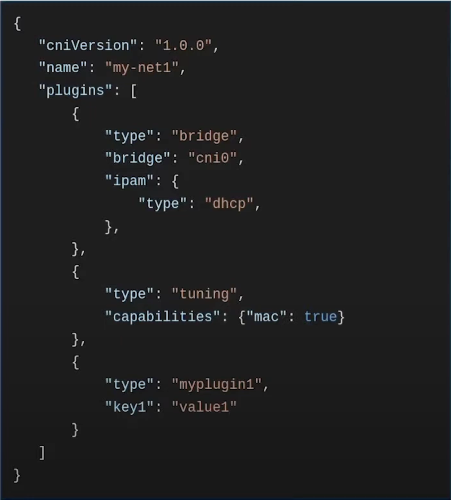

# Self-assessment

# Self-assessment outline

## Table of contents

* [Metadata](#metadata)
  * [Security links](#security-links)
* [Overview](#overview)
  * [Actors](#actors)
  * [Actions](#actions)
  * [Background](#background)
  * [Goals](#goals)
  * [Non-goals](#non-goals)
* [Self-assessment use](#self-assessment-use)
* [Security functions and features](#security-functions-and-features)
* [Project compliance](#project-compliance)
* [Secure development practices](#secure-development-practices)
* [Security issue resolution](#security-issue-resolution)
* [Appendix](#appendix)

## Metadata

|   |  |
| -- | -- |
| Software | [A link to CNI's repository.](https://github.com/containernetworking/cni)  |
| Security Provider | No |
| Languages | Go |
| SBOM | None generated by the CNI project at the moment |
| | |

### Security links

| Doc | url |
| -- | -- |
| Security file | [README.md#Security](https://github.com/containernetworking/cni/blob/main/README.md#Security) |
| Default and optional configs | [CNI Specification](https://www.cni.dev/docs/spec/) outlines required keys, optional keys, and protocol parameters |

## Overview
**Container Network Interface**  
CNI, a project under the Cloud Native Computing Foundation, includes a set of guidelines and software libraries
used for developing plugins that set up network interfaces within Linux and Windows containers. Its primary goal
is managing container network connectivity and deallocating resources once a container is removed. This specific
focus has led to broad support for CNI and a straightforward implementation process due to its simple specification.

### Background
With the rapid development of application containers on Linux, networking in this area is still not well addressed
as it is highly environment-specific. To deal with this problem, developers seek to create a network layer that is
pluggable for container runtimes. Ultimately, CNI, along with libraries for Go and a set of plugins, was introduced
as a common interface between network plugins and container execution.

### Actors

The following are the actors found in CNI project:
- **CNI Plugin**: A program that applies a specified network configuration. It interfaces with a variety of networking solutions to provide flexible networking capabilities.
- **Container**: A network isolation domain, though the actual isolation technology is not defined by the specification.
- **Container Runtime**: Is responsible for executing CNI plugins. It interacts with plugins to apply network configurations to individual containers.
- **Network**: A group of endpoints that are uniquely addressable that can communicate amongst each other. This could be either an individual container (as specified above), a machine, or some other network device (e.g. a router). Containers can be conceptually added to or removed from one or more networks.It includes configuration data such as IP addresses, routing rules, and network policies.

### Actions

#### Action Overview
1. A format for administrators defines network configurations
2. A protocol for container runtimes makes requests to network plugins with parameters from environment variables and network configuration
3. With the supplied configuration, a procedure executes the plugins.
4. CNI plugins may also have a procedure to delegate functionality to other plugins
5. Data types for plugins return their results to the runtime

#### Action 1: Network Configuration Format
CNI defines a network configuration format for administrators. It contains directives for both the container runtime as well as the plugins
to consume. At plugin execution time, this configuration format is interpreted by the runtime and transformed in to a form to be passed to the plugins.
- **Example configuration**:
   
  

    
  

   

#### Action 2: Execution Protocol
The CNI protocol is based on execution of binaries invoked by the container runtime. CNI defines the protocol between the plugin binary and the runtime. CNI defines 4 operations: ADD, DEL, CHECK, and VERSION. These are passed to the plugin via the CNI_COMMAND environment variable.

#### Action 3: Execution of Network Configurations
A container time interprets a network configuration and executes plugins accordingly. A runtime can add, delete, or check a network configuration in a container, which results in a series of plugin ADD, DELETE, or CHECK executions correspondingly.

#### Action 4: Plugin Delegation
There are some operations that, for whatever reason, cannot reasonably be implemented as a discrete chained plugin. Rather, a CNI plugin may wish to delegate some functionality to another plugin. One common example of this is IP address management.

#### Action 5: Result Types
Plugins can return one of three result types:
* Success
* Error
* _Version

### Goals

**General**
* CNI defines a common interface between the network plugins and container execution
* CNI is language-agnostic and a vendor-neutral specification
* Backwards compatible: plugins are able to easily implement all versions of the specification and some helper code is available to convert between versions.

**Security**
* Limit which file paths are included when searching for a CNI plugin on a system.

### Non-goals

**General**
* Dynamic updates to existing network configurations
* Dynamic policies for network bandwidth and firewall rules

**Security**
* Stop a container runtime from executing CNI plugins
* Restrict what a plugin does
* Manage the security of the container it interacts with

## Self-assessment use

This self-assessment is created by the CNI team to perform an internal analysis of the
project's security.  It is not intended to provide a security audit of CNI, or
function as an independent assessment or attestation of CNI's security health.

This document serves to provide CNI users with an initial understanding of
CNI's security, where to find existing security documentation, CNI plans for
security, and general overview of CNI security practices, both for development of
CNI as well as security of CNI.

This document provides the CNCF TAG-Security with an initial understanding of CNI
to assist in a joint-assessment, necessary for projects under incubation.  Taken
together, this document and the joint-assessment serve as a cornerstone for if and when
CNI seeks graduation and is preparing for a security audit.

## Security functions and features

- **Critical:**
    - As documented in the [required keys for plugin configuration objects](https://www.cni.dev/docs/spec/#plugin-configuration-objects), the 'type' string containing the name of a CNI plugin cannot contain disallowed characters in file paths (e.g., '/' or '\\'). Disallowing such characters prevents using characters such as "../" to references binaries elsewhere on the system.
- **Security relevant:**
    - As documented in the [protocol parameters passed to plugins](https://www.cni.dev/docs/spec/#parameters), the environment variable CNI_PATH contains the list of paths to search for CNI plugin executables. This limits where CNI can look which could prevent unintended binaries from being executed.

## Project compliance

CNI does not document meeting any particular security standards or sub-sections.

## Secure development practices

### Development Pipeline

The [Contributing](https://www.cni.dev/docs/contributing/) document contains details on development workflow.
The main points are summarized below.

* Contributions are made via GitHub pull requests
* Work is done in a topic branch (usually branched from main)
* Contributors must sign off their commits which indicates they agree to the Developer Certificate of Origin ([DCO](https://www.cni.dev/docs/dco/))
* There is a test suite provided that should be run for any new features or bug fixes.
* Pull requests should include tests for new code and old code
* Pull requests trigger a [workflow](https://github.com/containernetworking/cni/actions/workflows/test.yaml). The jobs covered include:
	* Linting
	* Build for linux architectures
	* Running tests on Linux amd64
	* Building and running tests on Windows
* In general, pull requests are merged once one or two maintainers endorse it.

### Communication Channels

* **Internal**
  Team members communicate with each other through the [Weekly maintainers meeting using Jitsi](https://meet.jit.si/CNIMaintainersMeeting), [#cni and #cni-dev channel on the CNCF slack](https://slack.cncf.io/), [cni-dev Google Group](https://groups.google.com/forum/#!forum/cni-dev), or [GitHub issues](https://github.com/containernetworking/cni/issues)
* **Inbound**
  Users communicate with the team though the [#cni and #cni-dev channel on the CNCF slack](https://slack.cncf.io/), [cni-dev Google Group](https://groups.google.com/forum/#!forum/cni-dev), or [GitHub issues](https://github.com/containernetworking/cni/issues).
* **Outbound**
  Team members communicate with users through the [#cni channel on the CNCF slack](https://slack.cncf.io/), [cni-dev Google Group](https://groups.google.com/forum/#!forum/cni-dev).

### Ecosystem
* CNI is a vendor-neutral specification so it can be used by any system that chooses to implement it. It is used by Kubernetes, Mesos, CloudFoundry, CRI-O, and [more](https://www.cni.dev/docs/#who-is-using-cni).

## Security issue resolution

### Responsible Disclosures Process

As documented under the [Contact section of CNI's documentation](https://www.cni.dev/docs/#contact), issues can be reported privately via email to the email addresses listed in the [MAINTAINERS](https://github.com/containernetworking/cni/blob/master/MAINTAINERS) file.
There is no publicly available document outlining a standard process for handling/responding to reports.

### Incident Response Process

There is no publicly available document outlining an incident response process.

## Appendix

### Known Issues Over Time

* [**CVE-2021-20206**](https://nvd.nist.gov/vuln/detail/CVE-2021-20206) (CVSS v3.1 Base Score: 7.2 High Severity) **Arbitrary path injection via type field in CNI configuration.**
A path name flaw allowed execution of binaries elsewhere on the system including binaries that are not CNI plugins. This was fixed in libcni version 0.8.1 by [tightening up the plugin-finding logic](https://github.com/containernetworking/cni/pull/808).
* [**CVE-2019-9946**](https://nvd.nist.gov/vuln/detail/CVE-2019-9946) (CVSS v3.0 Base Score: 7.5 High Severity) **Incorrect rule insertion by CNI 'portmap'.**
An issue with CNI portmap was found with Kubernetes, which allowed it to match incoming traffic even if better, more specific rules existed later in the chain. This was fixed in version 0.7.5 by [appending instead of prepending rules](https://github.com/containernetworking/plugins/pull/269).

### CII Best Practices

[**Current Progress**](https://www.bestpractices.dev/en/projects/2446) (Last updated January 2021):
- CNI does not meet a passing level (only 72% of the way there)
- Progress should be updated as there are currently several practices marked with ‘?’
- There are no primary developers identified as having knowledge of designing secure software or preventing and handling vulnerabilities.
- They do not use static code analyzers to automatically catch vulnerabilities in code.

### Case Studies

1. **Cilium Integration with Kubernetes:**
   - Description: Cilium is used in Kubernetes environments for network security and observability. It leverages CNI's plugin-based network connectivity management to provide networking and security in Kubernetes clusters. Cilium specifically enhances Kubernetes by offering API-aware network security, load balancing, and visibility for microservices. The integration of Cilium with Kubernetes via CNI demonstrates CNI’s compatibility and effectiveness in real-world applications​​.
   - Key Points:
     - Enhances Kubernetes network security and observability.
     - Leverages CNI for seamless integration.
     - Provides API-aware network security, load balancing, and visibility for microservices.
   - Link: [Cilium users and real world case studies](https://cilium.io/adopters/#:~:text=URL%3A%20https%3A%2F%2Fcilium)

2. **Isovalent’s Use of CNI for Kubernetes Networking:**
   - Description: Isovalent, the company behind Cilium, utilizes CNI for networking in Kubernetes environments. This case study highlights the advanced networking capabilities of CNI as employed by Isovalent. The use of CNI in Isovalent’s Kubernetes networking solutions showcases the flexibility and scalability of CNI in handling complex networking requirements​​.
   - Key Points:
     - Isovalent employs CNI in Kubernetes networking.
     - Demonstrates CNI’s flexibility and scalability in complex networking environments.
   - Link: [Top 20 Cilium Use Cases - Isovalent](https://isovalent.com/blog/post/top-20-cilium-use-cases/)

These case studies provide insights into how CNI is used in practice, emphasizing its role and effectiveness in Kubernetes networking and security.

## Related Projects/Vendors

- **Kubernetes:** Utilizes CNI for container networking.
- **Mesos:** Integrates CNI for networking solutions.
- **Cloud Foundry:** Adopts CNI for managing container network interfaces.
- **Podman:** Implements CNI to configure network settings for containers.
- **CRI-O:** Leverages CNI as part of its container runtime interface.

# CNI Security Threat Modeling

## Table of Contents
1. [Introduction](#introduction)
2. [System Overview](#system-overview)
3. [Threat Identification](#threat-identification)
4. [Threat Analysis](#threat-analysis)
5. [Mitigation Strategies](#mitigation-strategies)
6. [Conclusion](#conclusion)

## Introduction
This document presents a threat model for the Container Network Interface (CNI) project, aiming to identify potential security threats and propose mitigation strategies.

## System Overview
- **Description**: CNI provides networking for containers.
- **Components**:
  - **CNI Plugins**: Interface with various networking solutions.
  - **Container Runtimes**: Interact with plugins to configure network settings for containers.
  - **Network Settings**: Configuration data that determines how networking is handled in containerized environments.

## Threat Identification
- **Unauthorized Access**
- **Misconfiguration**
- **Data Leakage**
- **Service Interruption**

## Threat Analysis
### Unauthorized Access
- **Impact**: High
- **Likelihood**: Medium
- **Description**: Potential unauthorized access to network configurations.

### Misconfiguration
- **Impact**: High
- **Likelihood**: High
- **Description**: Incorrect network settings leading to vulnerabilities.

### Data Leakage
- **Impact**: Medium
- **Likelihood**: Medium
- **Description**: Exposure of sensitive information through network traffic.

### Service Interruption
- **Impact**: High
- **Likelihood**: Low
- **Description**: Potential DoS attacks affecting network availability.

## Mitigation Strategies
### Unauthorized Access
- Implement robust authentication and authorization mechanisms.
- Regularly audit access logs.

### Misconfiguration
- Provide clear documentation on secure configuration practices.
- Implement configuration validation tools.

### Data Leakage
- Enforce encryption for network traffic.
- Regularly update security certificates.

### Service Interruption
- Implement network redundancy and load balancing.
- Monitor network traffic for unusual patterns.

## Conclusion
Ongoing evaluation and updates to this model are necessary to adapt to evolving security threats in the CNI project.

# Action Items

- Create a publicly available SBOM
- Security policy: Include what response can be expected after a vulnerability has been reported and consider creating a file or page dedicated to the vulnerability reporting process. ([Security Policy Template/Example](https://github.com/cncf/tag-security/blob/main/project-resources/templates/SECURITY.md)).
- Incident Response: Create a publicly available document outlining how security issues are triaged, how any parties are notified, and details surrounding the publication and release of a patch. ([Incident Response Template/Example](https://github.com/cncf/tag-security/blob/main/project-resources/templates/incident-response.md))
