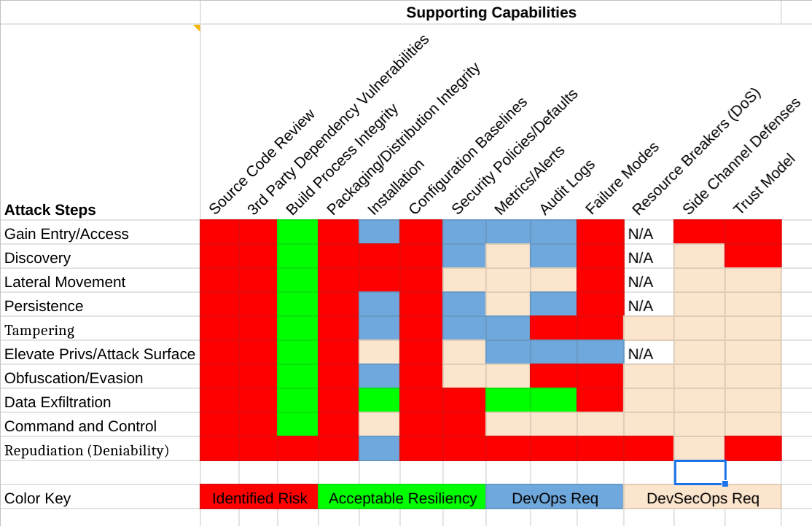

<!-- cSpell:ignore attck addgetnetgrent JPMC -->
# Cloud Custodian Joint-review

This joint-review relied heavily on the
[self-assessment](https://docs.google.com/document/d/1s88ifDtFJzGX1O_ve6HM6_vbTkpsWDKWRDuxt9RHdcs)
provided by the Cloud Custodian (c7n) project. The Security TAG volunteers
collaborated with the project volunteers to review the self-assessment, and
discussed the operational scenarios pertinent to a typical c7n user.

The general opinion of the volunteer review team is that the c7n project
clearly demonstrates a commitment to security, and a willingness to improve
security for the benefit of the user community.  That said, the project
volunteers could use additional security volunteers to assist in ongoing
reviews, security control enhancements, and when needed to debug and fix
security flaws.  As a utility tool, the review team feels the primary threat to
the project is compromise of the code itself, and packaging and distribution of
the tool or its dependencies - rather than an attack on individual c7n
deployments. A secondary concern would be the disabling or DoS of a deployment by
an internal or external actor - thus giving the user a false sense of security
when c7n is disabled. A tertiary concern is the provisioning of too permissive
a policy within the cloud environment for c7n; this would make it an attractive
target for lateral movement and other activities for an attacker who had gained
access via some other means. Finally, comprehensive support for Kubernetes is
not currently available; the review team would like to see more active support
for Kubernetes and other CNCF projects as c7n matures.

A “hands-on” penetration test was not performed, nor was a comprehensive code
review, code fuzzing, or code audit.  The review team strongly recommends
pursuing this as a follow up with appropriate CNCF support and guidance.

## Table of Contents
<!-- markdownlint-disable -->
* [Cloud Custodian Joint-review](#cloud-custodian-joint-review)
   * [Table of Contents](#table-of-contents)
   * [Metadata](#metadata)
   * [Reviewers and Participants](#reviewers-and-participants)
      * [Security links](#security-links)
   * [Overview](#overview)
      * [Background](#background)
      * [Project Goals](#project-goals)
      * [Project Non-goals](#project-non-goals)
   * [Joint-Review Use](#joint-review-use)
   * [Intended Use Case](#intended-use-case)
   * [Target Users](#target-users)
      * [Target Capabilities and How Custodian Impacts.](#target-capabilities-and-how-custodian-impacts)
   * [Operation](#operation)
   * [Project Design](#project-design)
      * [Features](#features)
      * [Components](#components)
         * [Security Functions and Features](#security-functions-and-features)
   * [Configuration and Set-Up](#configuration-and-set-up)
   * [Project Compliance](#project-compliance)
   * [Security Analysis](#security-analysis)
      * [Attacker Motivations](#attacker-motivations)
      * [MITRE ATT&amp;CK Review](#mitre-attck-review)
      * [Predisposing Conditions](#predisposing-conditions)
      * [Expected Attacker Capabilities](#expected-attacker-capabilities)
      * [Attack Risks and Effects](#attack-risks-and-effects)
      * [Example Attack Scenarios](#example-attack-scenarios)
      * [Security Degradation](#security-degradation)
      * [Compensating Mechanisms](#compensating-mechanisms)
      * [STRIDE Evaluation](#stride-evaluation)
         * [STRIDE Classification Considered](#stride-classification-considered)
         * [Control Recommendation (SEVERITY: Medium)](#control-recommendation-severity-medium)
         * [Control Recommendation (SEVERITY: Medium)](#control-recommendation-severity-medium-1)
   * [Threat Model](#threat-model)
* [Secure Development Practices](#secure-development-practices)
   * [Security Issue Resolution](#security-issue-resolution)
      * [Currently Open Security Issues and Vulnerabilities](#currently-open-security-issues-and-vulnerabilities)
   * [Hands-on Review](#hands-on-review)
   * [Roadmap](#roadmap)
      * [Recommended Project Next Steps](#recommended-project-next-steps)
      * [Recommended CNCF Requests](#recommended-cncf-requests)
   * [Appendix](#appendix)
      * [Case Studies](#case-studies)
<!-- markdownlint-enable -->

## Metadata
<!-- markdownlint-disable MD034 -->
| Project Home                    | https://github.com/cloud-custodian                                                                               |
|---------------------------------|------------------------------------------------------------------------------------------------------------------|
| Security Provider               | Yes, however many users implement Cloud Custodian for non security purposes, i.e., cost optimization, governance |
| Languages                       | Python, YAML |
| Incubation PR                   | https://github.com/cncf/toc/pull/480 |
| TAG-Security Assessment Request | https://github.com/cncf/tag-security/issues/307 |
| Self-Assessment Document        | https://docs.google.com/document/d/1s88ifDtFJzGX1O_ve6HM6_vbTkpsWDKWRDuxt9RHdcs/ |
| SBOM                            | [poetry configuration in pyproject.toml](https://github.com/cloud-custodian/cloud-custodian/blob/master/pyproject.toml), [poetry lock file](https://github.com/cloud-custodian/cloud-custodian/blob/master/poetry.lock), [pip requirements file](https://github.com/cloud-custodian/cloud-custodian/blob/master/requirements.txt), [release process](https://cloudcustodian.io/docs/developer/packaging.html) |

<!-- markdownlint-enable MD034 -->
## Reviewers and Participants
<!-- cSpell:disable -->
|  |  |
| -- | -- |
| Project Security Lead | @kapilt |
| Security TAG Lead Reviewer | @rficcaglia |
| Additional Reviewers | @iaxes, @chasemp, @itaysk, @ultrasaurus, @TheFoxAtWork |
<!-- cSpell:enable -->
(Date of review closure can/should be determined directly from Git commit timestamps.)

### Security links

| Item | Ref or URL |
| -- | -- |
| Security Mailing List  | security@cloudcustodian.io |
| Threat Model (2019) | [Google Doc Linked Here](https://docs.google.com/document/d/1S9zQZaT6G1TA3IAx6YNL0f7G938xaFZ-bziszhuxMZg) |

## Overview

Cloud Custodian is a YAML domain specific language (DSL)-based stateless rules
engine for cloud auditing, management, and governance.

Cloud Custodian’s policy-as-code:

* Enables deployment of detection controls that enforce or report compliance to
  organizational policies.
* Supports real-time detection, reporting/notification, and remediation via an
  API audit trail integration and serverless runtime support.
* Provides consistent outputs and telemetry (blob, logs, trace, metrics) across
  policies with outputs to provider native services.
* Requires minimal installation requirements, and can be used as a CLI
  query/investigative or operations tool in a compliance-as-code environment.

### Background

Cloud Custodian is a YAML DSL-based stateless rules engine operated via a CLI,
easily triggered from a cloud-resident cron task or containerized workload.  It
supports the practice of policy-as-code — policy being expressed as rules that
the CLI uses to check cloud configurations.  The code artifacts serve as
documentation of the configuration policies in effect in a given environment.

NOTE: Humans must map written compliance or security documented policies to
specific Cloud Custodian YAML first.

At the moment, Cloud Custodian supports the most common public cloud providers:
AWS, Azure, and GCP. Executed against these environments, with the
corresponding YAML rules, Cloud Custodian can check cloud settings via cloud
APIs for encryption and access requirements, tagging policies, cost management,
removal of abandoned resources, and automated management of resources during
off-hours.

Cloud Custodian currently has [prototyped Kubernetes cluster support as
documented here](https://github.com/cloud-custodian/cloud-custodian/pull/2760).

### Project Goals

Cloud Custodian integrates with the cloud APIs of each provider to provide
checks for enforcement of resource provisioning and configuration policy goals.
It can be run as a simple cron job on a server to execute against existing
resources.  Cloud Custodian is essentially a rules engine for managing public
cloud accounts and resources. It allows users to define custom YAML policies as
code.  It fills a gap where someone needs rules to constrain resource
deployment and needs to detect and/or remediate unexpected or unauthorized
resource configuration changes, both in a single cloud or multi-cloud
environment.

### Project Non-goals

Cloud Custodian is not a linter, nor a container runtime engine, nor a general
purpose policy engine, or an inventory database.  It is not very opinionated on
what policies should be defined - only that policy expression is sufficient to
define things like a CIS Benchmark policy, or define remediation policies for
policy violations.

While it can be used as a security tool, the project itself has asserted it is
useful for cost optimization and other non-security purposes. It might be more
accurately described as a configuration checking tool, where security is just
one type of configuration it can check.

It is left to the user to understand how to map security policy in human terms
to configuration checks in machine terms (c7n YAML policies).

## Joint-Review Use

This joint-review relied heavily on materials, primarily a [Google
Doc](https://docs.google.com/document/d/1s88ifDtFJzGX1O_ve6HM6_vbTkpsWDKWRDuxt9RHdcs),
created by the project team. This document does not intend to provide a
security audit of c7n and is not intended to be used in lieu of a security
audit.  This document provides users of c7n with a risk and threat overview of
c7n. When taken with the self-assessment, this joint-review may provide the
community with context and a starting point as part of a formal security audit.

## Intended Use Case

The intended use of Cloud Custodian is cloud management. In particular, Cloud
Cloud Custodian allows users to audit, monitor, and operationalize configuration
checks.

Rules can be defined in the c7n YAML that define remediation actions when a
rule is triggered based on configuration checks.

## Target Users

Per the Security TAG user personas, Cloud Custodian serves the needs of:

* Enterprise Operator: Cloud Custodian provides reporting and unified metrics
  that can be consumed by a variety of dashboard platforms, allowing an
  enterprise operator to not only survey and manage resources, but use the
  monitoring tools of their choice. This allows an Enterprise Operator to make
  administrative decisions and take action according to an organization’s
  policies.
* Quota Operator: Because Cloud Custodian leverages the simplicity of YAML and
  a CLI, a Quota Operator with more of a financial background than an
  engineering background can still use it. The same Custodian outputs the
  Enterprise Operator can use to produce a centralized survey of an
  organization’s resources and resource activity, a Quota Operator can use to
  determine resource boundaries from the same reports and metrics. When a
  resource exceeds its quota, Cloud Custodian can be configured to notify a
  Quota Operator of it.
* Third-Party Security Product/System: Cloud Custodian’s YAML configuration
  file enables resource tagging based on filters, and depending on the policy,
  these tags can be configured to trigger specific actions.
* Platform Implementer: Since Cloud Custodian enables event-based real-time
  policy enforcement, a Platform Implementer can use the CLI to serve the
  intersecting needs of the Enterprise Operator, Quota Operator, Security and
  Compliance Administrators, and Developers. Event-based and real-time Cloud
  Custodian policies can output reports and metrics for monitoring, respond to
  policy changes and tag affected resources, enforce compliance, and prevent
  development from unintentionally harming an organization’s cloud.

### Target Capabilities and How Custodian Impacts

| Competency Title                              | Competency Type | Competency Description |
|-----------------------------------------------|-----------------|------------------------|
| Asset and Inventory Management                | Organizational  | Cloud Custodian adds capabilities related to the process of identifying, developing, operating, maintaining, upgrading, and disposing of cloud native resources. |
| Business Continuity                           | Organizational  | Cloud Custodian adds capabilities related to business continuity planning and continuity of operations to help ensure an organization can prevent and overcome serious incidents or disasters and quickly resume normal operations within a reasonable time frame. |
| Collection Operations                         | Technical       | Cloud Custodian adds capabilities related to executing the collection of cybersecurity information to develop intelligence using appropriate strategies. |
| Data Management                               | Organizational  | Cloud Custodian adds capabilities related to the development and execution of data management plans, programs, practices, processes, architectures, and tools across all stages of the data lifecycle. Includes processes around the creation, storage, archiving, discovery, access, disposal, enhancement, and reuse of data and information assets. |
| Data Privacy                                  | Organizational  | Cloud Custodian adds capabilities related to the proper handling of data to protect individuals’ privacy, including addressing whether and how data is shared and with whom; how data is collected and stored; and legal and regulatory compliance. |
| Data Security                                 | Technical       | Cloud Custodian adds capabilities related to the methods and procedures that protect data and information systems by ensuring their confidentiality, integrity, and availability. |
| Digital Forensics                             | Technical       | Cloud Custodian adds capabilities related to the application of tools and techniques used in data recovery and preservation of electronic evidence. Includes the collection, processing, preservation, analysis, and presentation of computer-related evidence in support of network vulnerability mitigation and criminal, fraud, counterintelligence, or law enforcement investigations. |
| Encryption                                    | Technical       | Cloud Custodian adds capabilities related to the cryptographic process of transforming data to ensure that it can only be read by the person who is authorized to access it; specifically by helping ensure configuration is configured correctly. |
| Enterprise Architecture                       | Technical       | Cloud Custodian adds capabilities in support of the principles, concepts, and methods of enterprise architecture to align technology strategy, plans, and systems with the mission, goals, structure, and processes of the organization. |
| Incident Management                           | Technical       | Cloud Custodian adds capabilities related to the tactics, technologies, principles, and processes to analyze, prioritize, and handle cybersecurity incidents. |
| Information Systems and Network Security      | Technical       | Cloud Custodian adds capabilities related to the methods, tools, and procedures—including development of information security plans—to detect, respond, and protect information, information systems, and networks from risks and to provide or restore security of information systems and network services. |
| Information Technology Assessment             | Technical       | Cloud Custodian adds capabilities related to the principles, methods, and tools (for example, surveys, system performance measures) to assess the effectiveness and practicality of technology systems. |
| Infrastructure Design                         | Technical       | Cloud Custodian adds capabilities related to the architecture and topology of software, hardware, and networks,, their components and associated protocols and standards, and how they operate and integrate with one another and with associated controlling software. |
| Intelligence Analysis                         | Technical       | Cloud Custodian adds capabilities related to the application of individual and collective cognitive methods to collect, process, and interpret data about an enemy to answer tactical questions about current operations or to predict future behavior. |
| Law, Policy, and Compliance                   | Organizational  | Cloud Custodian adds capabilities related to compliance with laws, regulations, and policies that can impact organizational activities. |
| Modeling and Simulation                       | Technical       | Cloud Custodian adds capabilities related to modeling and simulation tools and techniques to plan and conduct test and evaluation programs, characterize systems support decisions involving requirements, evaluate design alternatives, or support operational preparation. |
| Operations Support                            | Technical       | Cloud Custodian adds capabilities related to the policies and procedures used to ensure the production or delivery of products and services, including tools and mechanisms for distributing new or enhanced hardware and software. |
| Policy Development                            | Leadership      | Cloud Custodian adds capabilities related to the process of creating, auditing, and enforcing cloud policies for an organization. |
| Process/Workload/Resource Control                               | Organizational  | Cloud Custodian adds capabilities related to the active changing of processes/workloads/resources based on the results of Cloud Custodian monitoring. |
| Risk Management                               | Organizational  | Cloud Custodian adds capabilities in support of risk assessment and mitigation, including assessment of failures and their consequences.                 |
| System Administration                         | Technical       | Cloud Custodian adds capabilities related to the installation, configuration, troubleshooting, and maintenance of cloud systems to ensure their confidentiality, integrity, and availability. Includes the management of accounts, resources, as well as access control, passwords, and resource creation and administration. |
| Systems Testing and Evaluation                | Technical       | Cloud Custodian adds capabilities related to the principles, methods, and tools for developing, administering, and analyzing systems test procedures to evaluate, verify, and validate technical, functional, and performance characteristics (including interoperability) of systems or elements of systems incorporating technology. Includes the identification of critical operational issues. |
| Threat Analysis                               | Technical       | Cloud Custodian adds capabilities related to the identification and assessment of adversaries’ or foreign intelligence entities’ cybersecurity attack capabilities and activities. Includes awareness and evaluation of internal and external information vulnerabilities that may be at risk to cyber-attacks and the production of findings to help initialize or support law enforcement and counterintelligence investigations or activities. |
| Vulnerabilities Assessment                    | Technical       | Cloud Custodian adds capabilities related to the principles, methods, and tools for assessing vulnerabilities and developing or recommending appropriate mitigation countermeasures. |

## Operation

Cloud Custodian can be bound to serverless event streams across multiple cloud
providers that maps to security, operations, and governance use cases.  Cloud
Custodian adheres to a compliance-as-code principle, to allow validation,
dry-run, and change control to policies.

## Project Design

### Features

* Support for public cloud services and resources with a library of actions and
  filters to build policies with.
* Supports filtering on resources with nested boolean conditions.
* Dry run any policy to see what it would do.
* Automatically provisions serverless functions and event sources (AWS
  CloudWatchEvents, AWS Config Rules, Azure EventGrid, GCP AuditLog & Pub/Sub,
  etc).
* Cloud provider native metrics outputs on resources that matched a policy.
* Structured outputs into cloud native object storage of which resources
  matched a policy.
* Cache usage to minimize api calls.
* Supports multi-account/subscription/project usage.

### Components

|         Name        | Comments |
|:-------------------:|:-----------------------------:|
| Policies            | “Simple YAML configuration files that enable users to specify policies on a resource type and are constructed from a vocabulary of filters and actions. “|
| Cloud Logs          | “Logs enables you to centralize the logs from all of your systems, applications, and services that you use, in a single, highly scalable service.”|
| Cloud Metrics       | “Metrics can load all the metrics in your account (both AWS resource metrics and application metrics that you provide) for search, graphing, and alarms.  Metric data is kept for 15 months, enabling you to view both up-to-the-minute data and historical data.”|
| Object Storage      | “Object Storage is storage for the Internet. It is designed to make web-scale computing easier for developers.  Cloud Storage has a simple web services interface that you can use to store and retrieve any amount of data, at any time, from anywhere on the web. It gives any developer access to the same highly scalable, reliable, fast, inexpensive data storage infrastructure that Amazon uses to run its own global network of websites. The service aims to maximize benefits of scale and to pass those benefits on to developers.” |
| Cloud Functions     | “Serverless Computing is a compute service that lets you run code without provisioning or managing servers. Functions execute your code only when needed and scales automatically, from a few requests per day to thousands per second. You pay only for the compute time you consume - there is no charge when your code is not running. With AWS Lambda, you can run code for virtually any type of application or backend service - all with zero administration.”|
| Configuration Rules | “Using Configurations, you can assess your resource configurations and resource changes for compliance against the built-in or custom rules.Create your own custom rules in functions as a service that define your internal best practices and guidelines for resource configurations.”|

#### Security Functions and Features

The project makes the following assumptions regarding mature operational
practices when using Custodian in order to limit the attack surface:

* Hardened compute execution environment with minimal additional software
  components running and minimal inbound access.
* Custodian requires cloud credentials (role, service account/principal) with
  elevated permissions for introspection and remediation. Access to those
  credentials should be restricted to the Custodian compute execution
  environment.
* Custodian cloud credentials should be limited in scope to what is necessary
  for Custodian policy execution, i.e. minimized access.
* As the policy files are considered trusted inputs -- and per IaaC best
  practices -- an audit trail is implemented to validate the assurance of the
  supply chain through rigorous version and change control mechanisms.

At a project level, to mitigate primary threats to the project and code, the
project uses GitHub’s security alerts (dependabot) scanning for CVEs on the
dependency graph. Additionally, PRs are reviewed by a growing number of
committers to prevent malicious code to be accepted into the code base.

Beyond these, there are few security-specific features, as the project assumes
the host cloud and corporate environment itself is hardened and trusted.  It
remains to see how useful these assumptions would be in a Zero Trust
Architecture (ZTA).

## Configuration and Set-Up

Cloud Custodian requires a cloud provider IAM policy to access the resources
(via API) that it needs to check.  In remediation cases, it will need write
access.  Cloud Custodian needs a policy YAML available to it from the shell.
Logs may be created (via stdout or specific cloud logging mechanisms) and these
need to be configured and provisioned accordingly (including the filtering of
any sensitive data based on logging verbosity.)  The sensitivity of the
resultant output (including logging to stdout) depends on the use case and may
need to be appropriately restricted.

Since Cloud Custodian delegates all security responsibilities to the user and
their cloud IAM and execution environment, there is little documentation about
potential security risks/trade-offs of the default IAM policy or other cloud
environment configuration.

## Project Compliance

As of September 2021 there is no external audit or compliance report available
to review.

[A threat model was constructed previously by the project](https://docs.google.com/document/d/1S9zQZaT6G1TA3IAx6YNL0f7G938xaFZ-bziszhuxMZg/).

## Security Analysis



### Attacker Motivations

|          Actor          | Description |
|:-----------------------:|:-------:|
| Malicious Internal User | An individual, such as an administrator or developer, who leverages their privileged access to Cloud Custodian to create a disruption. |
| Internal Attacker       | An attacker who transited one or more trust boundaries and has access to the cloud provider environment in which Cloud Custodian is hosted in. |
| External Attacker       | An attacker who is external to the cloud provider environment in which Cloud Custodian is hosted in and is unauthenticated. |
| Administrator           | An actual administrator of an account in a given cloud provider environment, tasked with operating and maintaining Cloud Custodian as a whole.     |
| Policy Developer        | A developer who is deploying changes to Cloud Custodian policies, either directly or via source code repositories. |
| Project Developer       | A developer who is deploying changes to Cloud Custodian itself, either directly via Custodian’s source code repositories, or by injecting malicious dependency code into the build/packaging/distribution.                                 |
| End User                | An external user of Cloud Custodian. |

### MITRE ATT&CK Review

Please refer to the [Mitre ATT&CK matrix for Enterprise Cloud](https://attack.mitre.org/matrices/enterprise/cloud/)

TTPs Considered include:

* [Drive-by Compromise](https://attack.mitre.org/techniques/T1189/) - it is
  easy to imagine a watering hole attack on c7n users to update to a new version
  or apply a c7n security patch which leads to distribution of a malicious
  Custodian package.
* [Phishing](https://attack.mitre.org/techniques/T1566/), [Internal
  Spearphishing](https://attack.mitre.org/techniques/T1534/) - an attacker may
  use widespread knowledge of an organization's use of c7n as a means to target
  email "alerts" about c7n policy findings to legitimate operators who then
  engage with the attacker's spoofed or legitimate looking site to conduct
  further attacks. c7n's mailer utility could be abused to send malicious but
  seemingly legitimate emails to admins. Even if there is no links to use for
  operator compromise, just confusing or redirecting admins could be part of a
  well-orchestrated attack plan.
* [Trusted Relationship](https://attack.mitre.org/techniques/T1199/) - while
  not a relationship, per se, admins who casually download c7n source or
  package distributions from the project site can be easily fooled into
  downloading malicious packages.  However, like codecov, the actual project
  github repo could be compromised and distribute malicious code or policies.
* [User Execution](https://attack.mitre.org/techniques/T1204) - certainly the
  users (or service accounts) allowed to execute c7n, and the frequency and
  modality (ie cli vs serverless task) should be explicitly defined and ideally
  enforced by some automated means; unusual users executing c7n, or at an
  increased frequency should raise alarms; not running c7n for a prolonged
  period could indicate a DoS or other tampering.
* [Account Manipulation](https://attack.mitre.org/techniques/T1098/), [Create
  Account](https://attack.mitre.org/techniques/T1136/), [Domain Policy
  Modification](https://attack.mitre.org/techniques/T1484/) - certainly if c7n
  is running with an IAM/AD/LDAP role with write permissions to access control
  services, c7n itself could be used for privilege elevation attacks, simply by
  manipulating the c7n policy YAML. See Valid Accounts item below.
* [Implant Internal Image](https://attack.mitre.org/techniques/T1525/) - it is
  plausible that a docker or other container distribution of c7n could become
  available which is malicious.  Inspection of running containers could be
  easily overlooked and specifically whitelisted as a security tool if seen
  running what looks to be a legitimate c7n task.  This could lull DevSecOps
  into a false sense of security as c7 would be regarded as a trusted tool.
* [Valid Accounts](https://attack.mitre.org/techniques/T1078/) - this is the
  most likely organizational risk using c7n.  Since c7n itself does not provide
  a tool or documentation on using a least privilege, minimal permission policy,
  this is left as an exercise to the user.  Users who casually grant expansive
  permissions to c7n risk attackers exploiting this privileged access.  Worse, if
  users do not separate read only c7n actions from remedial write actions, then
  any abuse of the permissions - even accidental misuse - could increase risks
  to resources and other accounts and security services.
* [Impair Defenses](https://attack.mitre.org/techniques/T1562/) - certainly
  attackers may attempt to disable or impede c7n, either by preventing
  execution, or by tampering with the YAML file content, or to prevent alerting
  or remediation mechanisms, or to DoS the resources running c7n.  Worse, if
  write permissions are granted to c7n's service/user role, c7n itself could be
  used to disable or impede other security services.  Even innocuous additions
  to policy YAML could be perceived as legitimate attempts to increase security,
  but could be abused to increase noise-to-signal and lull DevSecOps into
  ignoring "false alarms" or induce alert fatigue. There should be a thoughtful
  balance of actively monitoring c7n alerts to ensure proper controls and
  operation, but not so much that subtle anomalies are missed.
* [Modify Cloud Compute
  Infrastructure](https://attack.mitre.org/techniques/T1578/), [Data
  Staging](https://attack.mitre.org/techniques/T1074/), [Data
  Destruction](https://attack.mitre.org/techniques/T1485/) - as with Account
  Manipulation, if c7n is running with an IAM/AD/LDAP role with write
  permissions to IaaS or PaaS services, c7n itself could be used for
  infrastructure attacks, simply by manipulating the c7n policy YAML. This
  includes creating temporary resources for staging exfiltration, or deleting
  data storage resources.
* [Unused Cloud Regions](https://attack.mitre.org/techniques/T1535/) -
  operators should have checks on regions running c7n who should not be running
  c7n. Similar to this is multiple "organizations" or "subscriptions" that are
  rarely reviewed.
* [Unsecured Credentials](https://attack.mitre.org/techniques/T1552/) - c7n
  documentation and self-assessment largely delegates this to the operator.  As
  such, it is plausible lazy operators would use hard coded keys or other
  credentials in scripts or repos, exposing potentially expansive permissions.
* [Discovery](https://attack.mitre.org/tactics/TA0007/) - broadly speaking, all
  of the techniques enumerated under the Discovery tactic are exposed by a
  malicious c7n user, or by use of tampered c7n code or YAML. This is c7n's
  intended purpose so in the hands of a sloppy operator or successful threat
  actor, c7n itself becomes a potent discovery and monitoring tool. Simply
  intercepting or cc:ing oneself to the alerts or logs could allow for effective
  reconnaissance.
* [Data from Cloud Storage Object](https://attack.mitre.org/techniques/T1530/);
  as noted above, logs or outputs from c7n may be sensitive and should be
  controlled or purged appropriately
* [Resource Hijacking](https://attack.mitre.org/techniques/T1496/) - if c7n
  code is modified or a false package distributed, a seemingly legitimate c7n
  task could run that performed other actions, like crypto mining or other
  resource abuses.  As a trusted security tool, c7n activity may go unnoticed or
  casually inspected.

### Predisposing Conditions

Custodian is intended to run in a trusted compute execution node with trusted
inputs (policy YAML) and minimized cloud credentials. The dependencies of the
python code and the python interpreter themselves must also be trusted.

Custodian typically requires broad read access across an environment to inspect
infrastructure configuration. Additionally, when evaluating a policy specifying
remediation actions, credentials with write access are necessary.

A variety of potential attackers exist when Cloud Custodian is in use. Given
Cloud Custodians monitoring and enforcement nature, malicious actors may be
interested in leveraging the reporting of Cloud Custodian to understand the
architecture of an environment it is deployed within as well as potentially
disabling or negatively modifying the policy enforcement within the
environment.

### Expected Attacker Capabilities

Assumptions based on Zero Trust environments:

* An attacker is already present within an organization’s cloud compute
  environments.
* An attacker potentially has access to cloud credentials.
* The Cloud Custodian execution environment has already been exploited.

Attackers could be insiders who already maintain regular privileged access to
the environment and have reasonable familiarity with their organization’s
deployment of Cloud Custodian. As such, it is expected these attackers will be
intimately aware of the Cloud Custodian configuration, policies, deployment,
serverless usage, and reporting integration. It is also assumed they may retain
ownership permissions to the repository where the configurations for the Cloud
Custodian deployment is kept.

Since c7n does not run as a daemon exposed to the internet (or any network), a
comprehensive analysis of an external attack is not covered within this
document. By definition, a successful external attacker who gains access to the
c7n execution environment will likely take advantage of the same attack paths
as an insider.

### Attack Risks and Effects

Cloud Custodian’s serverless capabilities enable broad access to affect both
the availability and confidentiality of the environment it is deployed within.
Explicit control and review over Cloud Custodian YAML is an absolute necessity
to reduce the success of attack by a malicious insider or opportunistic
external intruder.

As a result of the elevated permissions Cloud Custodian requires in order to
execute within a given cloud environment, organizations which fail to
appropriately secure the identity and access management of their cloud
environment may negate any security value Cloud Custodian can provide them.

Likewise, improper understanding and configuration of Cloud Custodian may
restrict any organization’s successful use of c7n. It is essential
organizations and operators of Cloud Custodian understand their environment’s
unique needs and tailor policies for those use cases, else they may inflict
self-denial-of-service.

Both internal and external scenarios vary for different cloud providers. Many
of the conceptual components of a threat scenario are shared between the
clouds, but their manifestations differ based on their specific
implementations.

While external attackers are also possible - especially if Custodian is running
in a persistent node (e.g. EC2 instance running cron), or even if it is running
in a docker container that pulls the latest code from the project which was
compromised - a comprehensive analysis of an external attack is not covered
within this document. A successful external attack will gain access to the
environment and take advantage of the same attack paths as an insider, with a
notable exception that they may not also have access to the policy code
repository. That being said, if an external attacker were to successfully have
improper configurations and policies merged into the source code of the
organization’s Cloud Custodian deployment repository, they may grant themselves
broader access into an environment and therefore fully replicate insider attack
possibilities.

### Example Attack Scenarios
<!-- markdownlint-disable MD033 -->
* Denial of Service, Tampering: Use `lambda:PutFunctionConcurrency` to set a
  Lambda Function's concurrency setting to `0` which would disable event based
  compliance checking.
* Information Disclosure: Redirecting Cloud Custodian log output
  (`logs:CreateLogStream`, `logs:PutLogEvents`, `logs:CreateLogGroup`) to a
  misconfigured or non-compliant S3 bucket (CLI: `custodian run --output-dir
  s3://<my-bucket>/<my-prefix> <policyfile>.yml`), revealing to an attacker
  detailed metadata about the cloud environment as well as positive Cloud
  Custodian findings on how it is non-compliant (i.e. vulnerable).
* Spoofing, Elevation of Privileges: Use `lambda:CreateFunction` and
  `lambda:InvokeFunction`, thereby allowing for arbitrary code to be introduced
  and executed when triggered.
* Alternatively, use `lambda:UpdateFunctionCode` to update code for an existing
  Lambda Function which would bypass the need for `iam:PassRole`. Then use
  `lambda:InvokeFunction` to invoke whatever code that you want using the IAM role
  that the Lambda Function is already attached to.  The `iam:PassRole` permissions
  are only checked at function creation, not when the function is updated.
* Attacker uses a Cloud Custodian Lambda function to leverage (`iam:PassRole`) to
  change Ports on NACLs and Security Groups of PCI Cat 1 applications
  (potentially leading to Information Disclosure).
* Repudiation: User creates a Cloud Custodian Lambda function that assumes IAM
  roles from Cloud Custodian to gain keys from the key management service.
* Denial of Service: User creates two Cloud Custodian policies that run in
  CloudTrail Mode (AWS lambdas are triggered by cloudtrail events to terminate
  things). Example one policy that terminates instances with encryption turned
  on and another that kills instances without encryption.
<!-- markdownlint-enable MD033 -->

### Security Degradation

The project itself is a key target. With a small community, and even smaller
approver and project review team, the likelihood that malicious policy content
or code or dependencies will be released is non-zero.  This would significantly
compromise users of Custodian who regularly update from the project git
repository or use their python package distribution.

The policy content maintained by the organization is a secondary target.
Except at very large organizations, it is likely 1 or 2 users would maintain
the entire policy repository with little to no oversight. It is unrealistic to
expect smaller organizations to effectively review every policy change.

The cloud permissions granted to Custodian are broad. Neither a secure default
policy, nor policy generation or checker/linter tool, nor even adequate
documentation exists to guide the new user on how to effectively lock down
their policy to the absolute minimum.  Even then, the mixing of broad read and
write permissions in one policy is itself a risk.  Attackers are likely to use
Custodian once inside, via other attacks, to move laterally and cover their
tracks.

Probably the largest impact of an attack would be to allow attackers to
effectively disable Custodian and prevent detection or remediation of their
other attacks, potentially even providing a false sense of compliance if no
Custodian alerts are reported.

### Compensating Mechanisms

The distribution package, commits, or policies are not cryptographically
controlled and the python environment itself is difficult to place under a
trusted computing base.  The project does use Github dependabot for CVE
identification and PR generation, but only 3 PRs have been committed, the last
in June 2021 at the time of this writing. Github actions are enabled for
linting and SAST scans. It is unclear of any committers are dedicated to
reviewing these results regularly.

In terms of Custodian’s runtime decision processing, Custodian does not use the
cloud API source event as a sole basis for decisions. Instead, it will resolve
any resources within the event by ID via the cloud control plane, obtaining the
source of truth of the current state of the resource before evaluating the
policy filters to ensure the resource matches. If all checks pass, Custodian
then proceeds with actions. This does open up a TOCTOU attack, however.

### STRIDE Evaluation
<!-- markdownlint-disable MD024 -->

#### STRIDE Classification Considered

Denial of Service
Spoofing
Elevation of Privilege
Tampering
Information Disclosure
Repudiation

#### Control Recommendation (SEVERITY: Medium)

New policies should require a GitHub merge and a code review by a second
developer who is not also the author, requiring collusion for success.

#### Control Recommendation (SEVERITY: Medium)

Never allow Cloud Custodian to have more than Poll mode access to prevent a
Denial of Service attack.
<!-- markdownlint-enable MD024 -->

## Threat Model

In addition to the components table above, the MITRE ATT&CK TTPS considered
above, and the STRIDE evaluation above, below is an overview of key attack
boundaries and data flows:


Interesting sequences may include:

* `A->G`
* `A->H`
* `B->G`
* `B->D` (->G see below)
* `B->E` (->F see below)
* `B->E` (->G see below)
* `B->F`
* `B->G->B`
* `(C | D)->G`
* `(C | D)->H`
* `E->F`
* `E->G`
* `E->H`
* `G->E` (ie modify the sls image or code fork)

<!-- markdownlint-disable MD025 -->
# Secure Development Practices
<!-- markdownlint-enable MD025 -->

The Review Team examined c7n's [CII badge
attestations](https://bestpractices.coreinfrastructure.org/en/projects/3402)
and github actions source code.  The review team suggests further review of
using the OSSF Security Scorecard and/or AllStars initiative, and perhaps look
at Muse.dev.

Code fuzzing should be a project priority, and the review team discussed this
with the project team and LinuxFoundation/CNCF leadership, who generously made
fuzzing resources available to the c7n project.  [PR 6832 addresses
this](https://github.com/cloud-custodian/cloud-custodian/pull/6832).

Subsequent followup is recommended.

Specific development practices and contact mechanisms are documented in the
project's self-assessment (linked above).

## Security Issue Resolution

Mailing list: security@cloudcustodian.io

Currently, there are five total maintainers with two members tasked with
full-time response as part of their job

It is unclear if there is an embargo policy and what disclosure timelines are.
The self-assessment does indicate "Emails are addressed within three business
days" and that "A public disclosure date is then negotiated by the Cloud
Custodian Security Team". Further clarity and following CNCF guidelines would
be recommended.

### Currently Open Security Issues and Vulnerabilities

As of September 2021, [there are no published CVEs.](https://cve.mitre.org/cgi-bin/cvekey.cgi?keyword=%22custodian%22)

There are also [no open dependabot PRs](https://github.com/cloud-custodian/cloud-custodian/pulls?q=is%3Apr+is%3Aopen+dependabot)
<!-- markdownlint-disable MD034 -->
For the docker image the following was reported by the github action run:
https://github.com/cloud-custodian/cloud-custodian/runs/3476474527
<!-- markdownlint-enable MD034 -->
```bash
cloudcustodian/c7n:dev (ubuntu 20.04)
=====================================
Total: 32 (UNKNOWN: 0, LOW: 2, MEDIUM: 20, HIGH: 10, CRITICAL: 0)
+----------------------+------------------+----------+--------------------------+---------------+--------------------------------+
|       LIBRARY        | VULNERABILITY ID | SEVERITY |    INSTALLED VERSION     | FIXED VERSION |             TITLE              |
+----------------------+------------------+----------+--------------------------+---------------+--------------------------------+
| bash                 | CVE-2019-18276   | HIGH     | 5.0-6ubuntu1.1           |               | bash: when effective UID is    |
|                      |                  |          |                          |               | not equal to its real UID      |
|                      |                  |          |                          |               | the...                         |
+----------------------+------------------+----------+--------------------------+---------------+--------------------------------+
| coreutils            | CVE-2016-2781    | MEDIUM   | 8.30-3ubuntu2            |               | coreutils: Non-privileged      |
|                      |                  |          |                          |               | session can escape to the      |
|                      |                  |          |                          |               | parent session in chroot       |
+----------------------+------------------+----------+--------------------------+---------------+--------------------------------+
| libc-bin             | CVE-2020-6096    | HIGH     | 2.31-0ubuntu9.2          |               | glibc: signed comparison       |
|                      |                  |          |                          |               | vulnerability in the ARMv7     |
|                      |                  |          |                          |               | memcpy function                |
+                      +------------------+          +                          +---------------+--------------------------------+
|                      | CVE-2021-3326    |          |                          |               | glibc: Assertion failure       |
|                      |                  |          |                          |               | in ISO-2022-JP-3 gconv         |
|                      |                  |          |                          |               | module related to combining    |
|                      |                  |          |                          |               | characters                     |
+                      +------------------+----------+                          +---------------+--------------------------------+
|                      | CVE-2016-10228   | MEDIUM   |                          |               | glibc: iconv program can       |
|                      |                  |          |                          |               | hang when invoked with the -c  |
|                      |                  |          |                          |               | option                         |
+                      +------------------+          +                          +---------------+--------------------------------+
|                      | CVE-2019-25013   |          |                          |               | glibc: buffer over-read in     |
|                      |                  |          |                          |               | iconv when processing invalid  |
|                      |                  |          |                          |               | multi-byte input sequences     |
|                      |                  |          |                          |               | in...                          |
+                      +------------------+          +                          +---------------+--------------------------------+
|                      | CVE-2020-27618   |          |                          |               | glibc: iconv when processing   |
|                      |                  |          |                          |               | invalid multi-byte input       |
|                      |                  |          |                          |               | sequences fails to advance     |
|                      |                  |          |                          |               | the...                         |
+                      +------------------+          +                          +---------------+--------------------------------+
|                      | CVE-2020-29562   |          |                          |               | glibc: assertion failure in    |
|                      |                  |          |                          |               | iconv when converting invalid  |
|                      |                  |          |                          |               | UCS4                           |
+                      +------------------+----------+                          +---------------+--------------------------------+
|                      | CVE-2021-27645   | LOW      |                          |               | glibc: Use-after-free in       |
|                      |                  |          |                          |               | addgetnetgrentX function in    |
|                      |                  |          |                          |               | netgroupcache.c                |
+----------------------+------------------+----------+                          +---------------+--------------------------------+
| libc6                | CVE-2020-6096    | HIGH     |                          |               | glibc: signed comparison       |
|                      |                  |          |                          |               | vulnerability in the ARMv7     |
|                      |                  |          |                          |               | memcpy function                |
+                      +------------------+          +                          +---------------+--------------------------------+
|                      | CVE-2021-3326    |          |                          |               | glibc: Assertion failure       |
|                      |                  |          |                          |               | in ISO-2022-JP-3 gconv         |
|                      |                  |          |                          |               | module related to combining    |
|                      |                  |          |                          |               | characters                     |
+                      +------------------+----------+                          +---------------+--------------------------------+
|                      | CVE-2016-10228   | MEDIUM   |                          |               | glibc: iconv program can       |
|                      |                  |          |                          |               | hang when invoked with the -c  |
|                      |                  |          |                          |               | option                         |
+                      +------------------+          +                          +---------------+--------------------------------+
|                      | CVE-2019-25013   |          |                          |               | glibc: buffer over-read in     |
|                      |                  |          |                          |               | iconv when processing invalid  |
|                      |                  |          |                          |               | multi-byte input sequences     |
|                      |                  |          |                          |               | in...                          |
+                      +------------------+          +                          +---------------+--------------------------------+
|                      | CVE-2020-27618   |          |                          |               | glibc: iconv when processing   |
|                      |                  |          |                          |               | invalid multi-byte input       |
|                      |                  |          |                          |               | sequences fails to advance     |
|                      |                  |          |                          |               | the...                         |
+                      +------------------+          +                          +---------------+--------------------------------+
|                      | CVE-2020-29562   |          |                          |               | glibc: assertion failure in    |
|                      |                  |          |                          |               | iconv when converting invalid  |
|                      |                  |          |                          |               | UCS4                           |
+                      +------------------+----------+                          +---------------+--------------------------------+
|                      | CVE-2021-27645   | LOW      |                          |               | glibc: Use-after-free in       |
|                      |                  |          |                          |               | addgetnetgrentX function in    |
|                      |                  |          |                          |               | netgroupcache.c                |
+----------------------+------------------+----------+--------------------------+---------------+--------------------------------+
| libgcrypt20          | CVE-2021-33560   | HIGH     | 1.8.5-5ubuntu1           |               | libgcrypt: mishandles ElGamal  |
|                      |                  |          |                          |               | encryption because it lacks    |
|                      |                  |          |                          |               | exponent blinding to address   |
|                      |                  |          |                          |               | a...                           |
+----------------------+------------------+          +--------------------------+---------------+--------------------------------+
| libpcre3             | CVE-2017-11164   |          | 2:8.39-12build1          |               | pcre: OP_KETRMAX feature       |
|                      |                  |          |                          |               | in the match function in       |
|                      |                  |          |                          |               | pcre_exec.c                    |
+                      +------------------+          +                          +---------------+--------------------------------+
|                      | CVE-2019-20838   |          |                          |               | pcre: buffer over-read in JIT  |
|                      |                  |          |                          |               | when UTF is disabled           |
+                      +------------------+----------+                          +---------------+--------------------------------+
|                      | CVE-2020-14155   | MEDIUM   |                          |               | pcre: integer overflow in      |
|                      |                  |          |                          |               | libpcre                        |
+----------------------+------------------+          +--------------------------+---------------+--------------------------------+
| libpython3.8-minimal | CVE-2021-23336   |          | 3.8.10-0ubuntu1~20.04    |               | python: Web cache poisoning    |
|                      |                  |          |                          |               | via urllib.parse.parse_qsl and |
|                      |                  |          |                          |               | urllib.parse.parse_qs by using |
|                      |                  |          |                          |               | a semicolon...                 |
+----------------------+                  +          +                          +---------------+                                +
| libpython3.8-stdlib  |                  |          |                          |               |                                |
|                      |                  |          |                          |               |                                |
|                      |                  |          |                          |               |                                |
|                      |                  |          |                          |               |                                |
+----------------------+------------------+----------+--------------------------+---------------+--------------------------------+
| libsqlite3-0         | CVE-2020-9794    | HIGH     | 3.31.1-4ubuntu0.2        |               | An out-of-bounds read was      |
|                      |                  |          |                          |               | addressed with improved bounds |
|                      |                  |          |                          |               | checking. This issue is...     |
+                      +------------------+          +                          +---------------+--------------------------------+
|                      | CVE-2020-9991    |          |                          |               | This issue was addressed with  |
|                      |                  |          |                          |               | improved checks. This issue is |
|                      |                  |          |                          |               | fixed in...                    |
+                      +------------------+----------+                          +---------------+--------------------------------+
|                      | CVE-2020-9849    | MEDIUM   |                          |               | An information disclosure      |
|                      |                  |          |                          |               | issue was addressed with       |
|                      |                  |          |                          |               | improved state management.     |
|                      |                  |          |                          |               | This issue...                  |
+----------------------+------------------+          +--------------------------+---------------+--------------------------------+
| libtasn1-6           | CVE-2018-1000654 |          | 4.16.0-2                 |               | libtasn1: Infinite loop in     |
|                      |                  |          |                          |               | _asn1_expand_object_id(ptree)  |
|                      |                  |          |                          |               | leads to memory exhaustion     |
+----------------------+------------------+          +--------------------------+---------------+--------------------------------+
| login                | CVE-2013-4235    |          | 1:4.8.1-1ubuntu5.20.04.1 |               | shadow-utils: TOCTOU race      |
|                      |                  |          |                          |               | conditions by copying and      |
|                      |                  |          |                          |               | removing directory trees       |
+----------------------+                  +          +                          +---------------+                                +
| passwd               |                  |          |                          |               |                                |
|                      |                  |          |                          |               |                                |
|                      |                  |          |                          |               |                                |
+----------------------+------------------+          +--------------------------+---------------+--------------------------------+
| python-pip-whl       | CVE-2020-26137   |          | 20.0.2-5ubuntu1.6        |               | python-urllib3: CRLF injection |
|                      |                  |          |                          |               | via HTTP request method        |
+----------------------+------------------+          +--------------------------+---------------+--------------------------------+
| python3.8            | CVE-2021-23336   |          | 3.8.10-0ubuntu1~20.04    |               | python: Web cache poisoning    |
|                      |                  |          |                          |               | via urllib.parse.parse_qsl and |
|                      |                  |          |                          |               | urllib.parse.parse_qs by using |
|                      |                  |          |                          |               | a semicolon...                 |
+----------------------+                  +          +                          +---------------+                                +
| python3.8-minimal    |                  |          |                          |               |                                |
|                      |                  |          |                          |               |                                |
|                      |                  |          |                          |               |                                |
|                      |                  |          |                          |               |                                |
+----------------------+                  +          +                          +---------------+                                +
| python3.8-venv       |                  |          |                          |               |                                |
|                      |                  |          |                          |               |                                |
|                      |                  |          |                          |               |                                |
|                      |                  |          |                          |               |                                |
+----------------------+------------------+----------+--------------------------+---------------+--------------------------------+
```

## Hands-on Review

Although some of the reviews have previously used c7n in AWS, both as cli and
in Lambda, Cloud Custodian did not receive a joint hands-on review from
TAG-Security.

## Roadmap

The [project
roadmap](https://github.com/cloud-custodian/cloud-custodian/projects) is broken
out into core roadmap, as well as for individual infrastructure providers using
GitHub projects. However, the maintenance of this roadmap board seems a bit
stale since the only In Progress item was last updated Jan 22, 2020.

### TAG Recommendation

* Project should consider recruiting a security lead or security
  reviewer from the TAG or broader community responsible for reviewing all
  PRs and the security of the repo over time.
  This would mitigate some of the risks the project has concerning
  code or repo compromise. As c7n increases its footprint across enterprises, it
  becomes a very attractive target for nation state actors.
* Documentation improvements should be made to advise and assist operators on
  how to explicitly lock down the execution environment, even if it is seen as
  an inherited responsibility. Specific least-privilege examples should be given
  and examples of dangerous IAM roles and YAML policies discussed.
* The default IAM policies recommended/documented should render c7n minimally
  operable or even inoperable, and require thoughtful addition of least
  privilege permissions.  A linter or IAM generator script would be a possible
  enhancement, or links to community examples of such tools.
* The docker image, python environment, all Custodian commits, and external
  python and YAML files should be controlled using cryptographic mechanisms for
  integrity. As this is an area of active research in the community, there are
  many possible tools to address the supply chain and distribution of the c7n
  tool and docker image securely.
* The c7n code should itself implement some sort of YAML policy integrity and,
  possibly, efficacy/safety check(s). This may prevent casual tampering of YAML
  policies once deployed in an organization. For example signing and signature
  check with Cosign/Sigstore or [JWT](https://github.com/open-policy-agent/opa/issues/1757).
* The project should determine if operators can run separate instances of c7n
  for detection vs. remediation, and document how to best deploy under
  segregation of duties principles. This may minimize "blast radius" in the
  event that a detective c7n environment is compromised.  Presumably the
  remediation environment, and policies, could be more tightly controlled, and
  more meticulously scrutinized and tested and monitored.
* Finally, the review team suggests that Kubernetes should receive more
  attention in the project roadmap, as well as support for other CNCF projects,
  as well as non-CNCF open source, cloud native frameworks (e.g. Istio).

### Recommended CNCF Requests

The review team recommends that CNCF continue to offer fuzzing resources, and
hopes the project avails itself of these.

The team also recommends an internship funded to create adding a secure default
policy, and/or linter/checker, and additional documentation be created to guide
new users on locking down their policies.

Finally, we hope that CNCF will fund a formal code audit and lab setup
assessment which can subject c7n to real world attacks in a Kubernetes
environment, once the project is ready for this with full Kubernetes support.

## Appendix

### Case Studies

Cloud Custodian is used by thousands of organizations to enforce a fleet of
policies that control cloud costs, avoid potential breaches, and meet
regulatory requirements across an ever-increasing number of cloud services
and providers. Here are a few case studies:

* HBO Max uses Cloud Custodian
  ([Video](https://www.youtube.com/watch?v=fomDROZ2T-o)) to speed their security
  development and automate and enforce hundreds of security rules and policies
  across multiple cloud accounts and regions.
* JPMC uses Cloud Custodian
  ([Video](https://www.youtube.com/watch?v=ITwqLY3YfCk)) as standard governance
  as a code tool for their cloud environments across various technology groups.
* Zapier uses Cloud Custodian
  ([Video](https://www.youtube.com/watch?v=NB5GnHmgsa0)) to track, alert,  and
  take actions on security misconfiguration.
* Code42 uses Cloud Custodian to [automate
  enforcement](https://www.code42.com/blog/tips-from-the-trenches-cloud-custodian-automating-aws-security-cost-and-compliance/)
  of various AWS cost, security, and compliance policies.
  
### Related Projects / Vendors

In some sense OPA conftest could be used for some of the same checks.  For
kubernetes kube-bench is the obvious choice.  The primary alternative is the
native cloud tooling, eg AWS Config.  c7n attempts to be cloud agnostic and/or
multi-cloud which makes this more attractive to larger organizations who use
multiple clouds.  However, lack of robust Kubernetes support may be seen as a
problem by those same organizations.
