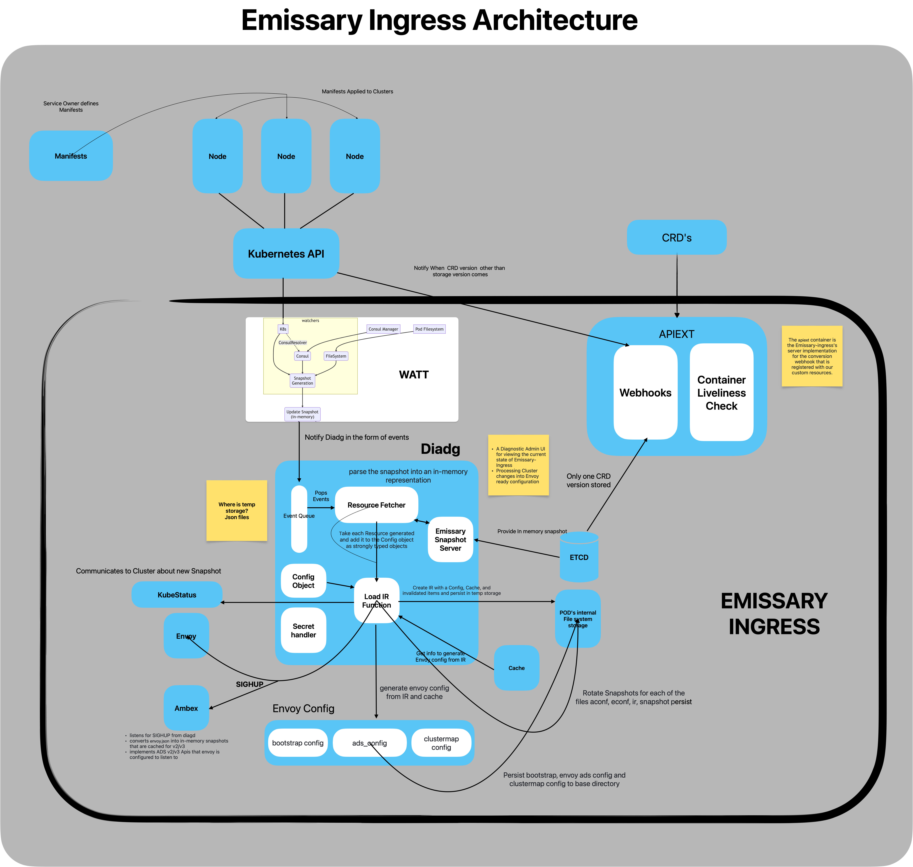

# Emissary Ingress Self-assessment

This assessment was created by community members as part of the [Security Pals](https://github.com/cncf/tag-security/issues/1102) process and is currently pending changes from the maintainer team.

Authors: Yashaswi Makula (@yashaswi2000), Disha Sheshappa (@Disha-S-Gowda), Sai Prasanth Virigineni (@Saipv17), Jarred Carter (@jcart657).

Contributors/Reviewers: Pranava Kumar Vemula (@Rana-KV), Alice Wasko (@AliceProxy), Eddie Knight (@eddie-knight), Ragashree (@ragashreeshekar)

## Table of contents

* [Metadata](#metadata)
  * [Security links](#security-links)
* [Overview](#overview)
  * [Actors](#actors)
  * [Actions](#actions)
  * [Background](#background)
  * [Goals](#goals)
  * [Non-goals](#non-goals)
* [Self-assessment use](#self-assessment-use)
* [Security functions and features](#security-functions-and-features)
* [Project compliance](#project-compliance)
* [Secure development practices](#secure-development-practices)
* [Security issue resolution](#security-issue-resolution)
* [Appendix](#appendix)
* [Threat Model](#emissary-ingress-lightweight-threat-model)

## Metadata

|   |  |
| -- | -- |
| Assessment Stage | Incomplete |
| Software | [emissary](https://github.com/emissary-ingress/emissary)  |
| Security Provider | No |
| Languages | Python, Golang, make, shell, html, dockerfile |
| SBOM | Software bill of materials - (Not being generated currently, issue created [link](https://github.com/emissary-ingress/emissary/issues/5466#issue-2027137698)). https://app.fossa.com/attribution/2a534448-1fa3-442b-b385-caa8c1178c99 |
| | |

### Security links

| Doc | url |
| -- | -- |
| Security file | https://github.com/emissary-ingress/emissary/blob/master/DevDocumentation/SECURITY_RELEASE_PROCESS.md |
| Default and optional configs | https://www.getambassador.io/docs/emissary/latest/topics/running/environment |

## Overview

Formerly known as the Ambassador API Gateway,[Emissary-Ingress](https://www.getambassador.io)([emissary](https://github.com/emissary-ingress/emissary/tree/master )) project is an open-source API gateway that is native to Kubernetes that lets you control inbound traffic to your apps in a Kubernetes cluster. Ingress in Kubernetes refers to controlling external access to services that are operated within the cluster.

### Background

Understanding the importance and effects of Emissary Ingress in handling incoming traffic inside Kubernetes clusters would be made easier with some familiarity with the ideas surrounding Kubernetes (Ingress, Services, etc.). Within Kubernetes, Emissary Ingress functions as an Ingress controller. The Kubernetes cluster's ingress controllers manage incoming external traffic and route it to the relevant services.

[Envoy Proxy](https://www.envoyproxy.io) serves as the foundational data layer for Kubernetes traffic control as well as administration in Emissary Ingress. Designed specifically to manage incoming traffic in Kubernetes settings. With its simple user interfaces and Kubernetes-native options, Emissary Ingress simplifies and facilitates the use of Envoy Proxy in Kubernetes installations. 			Advanced traffic routing capabilities are made possible by this open source project, which offers customisable routing based on hostnames, HTTP URLs, headers, and other parameters. To provide traffic splitting criteria, Emissary Ingress makes use of the Ingress resources provided by Kubernetes or custom annotations. These rules may be predicated on a number of variables, such as HTTP pathways, headers, or the proportion of traffic that is routed to distinct service versions. This makes managing load and traffic control between multiple services easier. It also has the capabilities like SSL termination, [rate limiting](https://www.getambassador.io/docs/emissary/latest/topics/running/services/rate-limit-service), [TLS](https://www.getambassador.io/docs/emissary/latest/howtos/tls-termination), [load balancing](https://www.getambassador.io/docs/emissary/latest/topics/running/load-balancer), traffic splitting, [authentication](https://www.getambassador.io/docs/emissary/latest/topics/running/services/auth-service) and routing, emissary-ingress serves as a control plane for managing traffic that arrives. It is designed to function effectively in a micro services architecture, enabling adaptable traffic control and routing settings.

Emissary Ingress allows for flexible traffic distribution by supporting dynamic routing depending on a variety of parameters, including HTTP pathways, headers, and hostnames. It also allows traffic to be switched between multiple service versions, making canary deployments, A/B testing, and incremental rollouts smoother and provides flexibility and scalability by enabling specific control over service routing and traffic flow. Because it can manage TLS certificates and handle SSL termination, it improves the security of incoming traffic and enables protected routing traffic.  Kubernetes's capabilities are improved by Emissary Ingress, which makes it simpler to handle incoming traffic, put routing plans into place, and improve security. In order to properly utilise Emissary-ingress, we usually want to install it within our Kubernetes cluster, set it up to handle incoming traffic based on the needs of our application, and then manage it using Kubernetes resources such as custom settings, annotations, or Ingress objects.

### Actors

| | |
| -- | -- |
| Platform Adminstrators| Those who modify the configurations of the API gateway. Main focus on maintaining the Platform|
| Application Developers| Can Modify the Configuration of the API Gateway. Access only limited to Mapping and Routing Configurations|
| External Users| All the users whose request go through API Gateway|
|Apiext Server| Implements the Webhook Conversion interface for CRDs.|
|Diagd (Diagnostic Admin UI and Config Processor)| Provides a diagnostic admin UI, processes cluster changes into Envoy-ready configuration.|
|Ambex (gRPC Server for Envoy xDS)| Implements xDS APIs for dynamic Envoy configuration.|
|Envoy Proxy| Handles routing for all user traffic, dynamically updated using xDS services.|
|Watch All The Things (Watt)| Watches for changes in the Kubernetes cluster, Consul, and the file system.|
|Entry Point (Entrypoint Binary and Busyambassador) | Manages the startup and coordination of various components in the container.|
|Emissary- Ingress container| Houses various components responsible for managing and configuring Envoy Proxy.|
|Kubernetes Cluster| Provides the infrastructure for deploying and managing applications including Emissary-ingress.|
| | |

### Actions

Emissary-ingress allows users and services to perform the following core actions:

Action      | Actors | Description     |
| :---       |    :----  |          :--- |
| Handling Ingress Traffic      |  Envoy Proxy      | Envoy Proxy checks the format of HTTP requests for protocol standard compliance, then validates the identity of incoming requests based on the preferred method of authentication (API tokens, certificates, et cetera) and RBAC. Rate limiting features limit service abuse. Envoy handles incoming and outgoing traffic amidst Kubernetes providing information about services and cluster management. Envoy handles rate limiting and TLS termination for abuse protection and data encryption/decryption for data passage to and from backend services.   |
| Request to Service Routing   | Envoy Proxy       | Envoy routes incoming requests to its corresponding backend service based on rules and administrator configurations. It also validate headers for destination routing and injection prevention. it also enforces any host-based routing rules.      |
|Load Balancing | Envoy Proxy | Emissary configures Envoy to make load balancing decisions based on rule configurations while Envoy implements the load balancing via request distribution across multiple instances of a service. Health checks of backend services are checked regularly and adjusted as necessary to avoid system freezing or downtime. Access to this service is restricted given the nature of the data handled (personally identifiable information [PII], backend service information, et cetera).|
|Monitoring and Logging | Watt, Envoy Proxy, Platform Adminstrators | Watt will get its information from Kubernetes’ K8s cluster by watching for configuration settings within K8s resources, as well as Emissary’s CRD Resources. A consulWatcher is started if a user has configured a mapping to use ConsulRevolver. Admins utilize logging features to monitor and log activities that occur within Emissary and review them as needed for suspicious activities and/or incidents that require immediate attention and remediation. |
|Data Flow | Watt | Watt begins end-to-end data flow from developer configurations to Envoy configurations.
|Change detection and notification| Kubernetes Cluster, Watt| Kubernetes Cluster Accepts Custom Resource Definitions (CRDs) for Emissary-ingress configuration. Triggers events on changes to standard Kubernetes resources (e.g., services, ingress). |
| startup and execution| Emissary-ingress Container, Entry Point |  Emissary-ingress Container Utilizes **busyambassador** as an entry point to coordinate different processes. it runs the **entrypoint** binary to manage various goroutines and child processes. |
| Webhook custom flow | Apiext Server | Apiext Server listens for requests from the Kubernetes API Server for CRD conversion. Communicates with the Emissary-ingress CRD schemas. |
| Configuration Conversions | Diagd | Diagd listens for CONFIG events and pushes them onto a queue, and generates snapshots from in-memory representations of resources. It converts and validates configurations for Envoy Proxy, Rotates and persists snapshots and Notifies Envoy and Ambex about new snapshots. |
| Enable Dynamic Configuration | Ambex | Ambex Listens for SIGHUP signals from Diagd to trigger configuration updates and implements ADS v2/v3 APIs for dynamic configuration. |

### Goals
Goal of emissary-ingress is to act as more native to kubernetes solution for a API Gateway, which supports functions like Layer 7 load balancer + Kubernetes Ingress built on Envoy Proxy. emissary achieves these functionalities leveraging envoy features and kubernetes features.

#### General Goals
* provide a ingress solution with easy to setup configuration.
* Self service capabilities that decouples developers from the platform team.
* A control plane for envoy that provides extensive configuration capabilities interms of routing,
  filtering, rate limiting, TLS support.
* Integrations and extensibility of features like authServices, rate limiting, service mesh, access controls.
* Maintaining resiliance and performance as a API gateway.

#### Security Goals 
* Safeguard the declarative settings to prevent any unauthorized entity from altering them, which might potentially disrupt the routing pathways of the service. 
* Make sure that the communication between Emissary-ingress components and other services is secured using robust protocols, such as Transport Layer Security (TLS). 
* Supply logs and auditing trails for activities and events occurring inside Emissary-ingress to facilitate security monitoring and incident response. 
* Implement robust authentication mechanisms to prevent unauthorized login to the cluster. 
* Assuring that standard settings adhere to security best practices and do not expose superfluous services or functionality. 

### Non-goals

#### General Non-goals
- Similar to Istio or Linkerd, Emissary is not a full-service mesh. Rather than handling east-west service-to-service traffic, it just manages incoming traffic.
- It is not the goal to tightly integrate with non-cloud native programs, such as conventional SOAP services. It has native Kubernetes integration.
- Dedicated tools are more appropriate for managing fine-grained policy engines in content-based routing as opposed to its configuration-driven methodology.
- It cannot end TLS on its own without adding a product such as cert-manager to manage the certificate lifecycle.

#### Security Non-goals
- Emissary-ingress doesn't protect against risks such as Kubernetes API Server Bypass, which could have in a few number of ways with bad actors modifiying cluster configurations.
https://kubernetes.io/docs/concepts/security/api-server-bypass-risks/
- Emissary-ingress does not bear responsibility for the security of the apps to which it directs traffic.   Application security is within the responsibility of application developers and operators. 
- Emissary-ingress could not natively support third user authentication. 
- Emissary-ingress primarily concerns itself with the administration of incoming external traffic at the boundary and may not have direct authority over or ensure the security of internal network connections. 
- Emissary-ingress does not provide encryption key management for apps. 
- Emissary-ingress does not focus on Certificate configuration/management and its recommended to use [Cert-managers](https://www.getambassador.io/docs/edge-stack/latest/howtos/cert-manager#using-cert-manager)

## Self-Assessment Use

This self-assessment is not intended to provide a security audit of emissary-ingress, or
function as an independent assessment or attestation of emissary-ingress's security health.

This document serves to provide emissary-ingress users with an initial understanding of
emissary-ingress's security, where to find existing security documentation, emissary-ingress plans for
security, and general overview of emissary-ingress security practices, both for development of
emissary-ingress as well as security of emissary-ingress.

This document provides the CNCF TAG-Security with an initial understanding of emissary-ingress
to assist in a joint-assessment, necessary for projects under incubation.  Taken
together, this document and the joint-assessment serve as a cornerstone for if and when
emissary-ingress seeks graduation and is preparing for a security audit.

## Security Functions and Features

* Authentication: Emissary-ingress utilizes AuthService, a custom resource allowing users to provide an endpoint for authentication services. Once configured, each request hitting Emissary triggers Envoy to send a copy of that request to the service specified within an AuthService custom resource. This allows the service to inspect virtually any aspect of the request, including the header, protocol, and scheme. The service can then modify headers as it desires for request header sanitizing or the addition of them, further allowing requests to be routed or denied with a custom error response sent back to the request sender.
* Rate Limiting: The RateLimitService is a custom resource that also allows users to provide information about services that Emissary should reach out to for incoming requests regarding rate limiting decisions. Service implementations should be provided and will allow users to attach custom labels to requests, attach labels to request properties (client IP, hostnames, et cetera), and rate limit based on keys.
* TLS Support: A wide variety of configuration options for TLS is available to users and allows them to specify the minimum or maximum version of TLS allowed, require client certificates, specify a list of permitted cipher suites and ECDH curves, and provide a certificate revocation list.
* Availability: Built-in configuration options for CORS and circuit breaker configurations are available for use to help prevent service overloading. Configuring the maximum number of simultaneous connections, requests, pending requests, and retries prevent system abuse alongside IP allow and deny list configurations. For more specific use cases, several other miscellaneous options are available, including Lua scripts that run on each request. For example, with Lua, users commonly remove request headers before reaching AuthService and RatelimitService so that they can add custom headers that correspond to billing or authentication purposes, preventing end users from spoofing them.
* Observability: Access logs are placed on stdout for reading using kubectl logs. Format and local destination can be configured to the administrator’s wishes while using envoy_log_ settings. Information collected includes service, driver (HTTP or TLS), driver configuration, additional log headers, the maximum number of seconds to buffer access before sending logs to ALS, and a soft size limit for the access log buffer, it also supports exporting logs using a CRD [LogService](https://www.getambassador.io/docs/edge-stack/latest/topics/running/services/log-service#log-service)

## Project compliance

Not applicable

## Secure development practices

Emissary-Ingress is in progress with 94% in Open Source Security Foundation (OpenSSF) best practices. 

* Development Pipeline.  A description of the testing and assessment processes that
  All code is maintained in [GitHub](https://github.com/emissary-ingress/emissary) and changes must be reviewed by maintainers.
  - All the source code is publicly available on github
  - Development process is done through PRs on the master branch only, and Issue led [Issue Template](https://github.com/emissary-ingress/emissary/blob/master/.github/ISSUE_TEMPLATE/Feature_request.md).
  - Extensive documentation, resolution and targetted versions for the changes are required to be added to the Issue.
  - Every PR requires thorough testing, lint checks and corresponding Docs updation.
  - Commits need to be signed off and commit msgs are expected to be descriptive, include Issue links.
  - Each PR requires minimum 2 reviewer sign offs to be merged, and Maintainers will merge the PR.
  - All of the release branches are long-lived and have branch protection enabled, which will be used for security fixes or bug fixes.
  - Backport statergy: majority of the time patch branch will be based off from master and most Pull Requests will target master. ensuring bugs and fixes arent missed in the Next shipping version.
  - All PR requests trigger jobs that perform as listed here [jobs](https://github.com/emissary-ingress/emissary/blob/master/.github/workflows/execute-tests-and-promote.yml#L318):
    - Unit Tests
    - linting checks for code quality.
    - Checks for Envoy protobuf changes to find impact on code.
    - Validation of Envoy version.
    - Integration Tests.
    - Validation of Helm chart changes.
    - Builds and updates container image and the registry.
    - Container image scanning for vunerabilities(trivy)
    - E2E tests are also run frequently.
* Release process:
  - emissary-ingress has well organised security release process with dedicated team that responds to vulnerabilites quickly as described in [Secure release process](https://github.com/emissary-ingress/emissary/blob/master/DevDocumentation/SECURITY_RELEASE_PROCESS.md)

* Communication Channels.
  * Team members communicate with each other through the [Community Slack](https://a8r.io/slack), [Github issues](https://github.com/emissary-ingress/emissary/issues) or [Zoom meetings](https://ambassadorlabs.zoom.us/j/86139262248?pwd=bzZlcU96WjAxN2E1RFZFZXJXZ1FwQT09).
  * Users communicate with the team through the [Community Slack](https://a8r.io/slack), [Github issues](https://github.com/emissary-ingress/emissary/issues) or [Zoom troubleshooting meetings](https://us02web.zoom.us/j/83032365622).
  * Team members communicate with users through the [Community Slack](https://a8r.io/slack).

* Ecosystem
 Emissary-ingress is a specialized control plane for Envoy Proxy. In this architecture, Emissary-ingress translates configuration (in the form of Kubernetes Custom Resources) to Envoy configuration. All actual traffic is directly handled by the high-performance Envoy Proxy. It can route traffic to kubernetes services and directly to the pods aswell as integrate with service meshes like consul, linkerd, isito.

## Security issue resolution

**Responsible Disclosures Process**

Related security flaws/vulnerabilities be privately/publicly reported via email to [secalert@datawire.io](mailto:secalert@datawire.io) where Emissary Ingress has a dedicated team called Emissary Security Team (EMST) which is responsible with handling them. In addition, users may visit [status.getambassador](https://status.getambassador.io/) where any active problems are mentioned.

**Incident Response**

Emissary Ingress maintains details/actions taken regarding to incident response and vunerability reporting in [SECURITY_RELEASE_PROCESS.md](https://github.com/emissary-ingress/emissary/blob/master/DevDocumentation/SECURITY_RELEASE_PROCESS.md)

EMST(maintainers) will pick a Fix Lead who will investigate a known or existing CVE to determine the problem and the circumstances in which it may be exploited. Fix Lead is also responsible for disclosing to the community about the issue, driving the schedules for completion ASAP(for public disclosure with vulnerability having a CVSS score >= 4).[communication](https://github.com/emissary-ingress/emissary/blob/master/DevDocumentation/SECURITY_RELEASE_PROCESS.md#patch-release-and-public-communication)
- vunerability on master: will considered a release blocker and fix will be added into the next release
- vunerability on released version: patch release created, fix also applied on master. 
- [further details](https://github.com/emissary-ingress/emissary/blob/master/DevDocumentation/SECURITY_RELEASE_PROCESS.md#released-versions-and-the-master-branch)

Fix Lead is responisble to create the Fix team within 24 hours, and start working on a private "security repo". while Fix Team is responsible for the Fix in 1 to 7 days depending on the CVSS. for CVSS < 4 team maybe slow the release process. Fix Lead will announce the fix/mitigation in emissary slack channels informing users about the security issue and patches/fix to be applied or adopted. [organisation,development,disclosure](https://github.com/emissary-ingress/emissary/blob/master/DevDocumentation/SECURITY_RELEASE_PROCESS.md#fix-development-process)

Emissary also had a retrospection process described here [retropective](https://github.com/emissary-ingress/emissary/blob/master/DevDocumentation/SECURITY_RELEASE_PROCESS.md#retrospective)
Since Emissary is a distributor of Envoy Proxy and same or next day patches available, whenever a new CVE is discovered in Envoy, and have time to update to the most recent builds of Envoy and prepare a release for release as soon as the specifics of the security flaw are made public. 

## Appendix

* Known Issues Over Time. List or summarize statistics of past vulnerabilities
  with links. If none have been reported, provide data, if any, about your track
record in catching issues in code review or automated testing.
  - [2.2.1](https://www.getambassador.io/docs/emissary/latest/about/known-issues#221) TLS certificates using elliptic curves were incorrectly flagged as invalid. This issue is corrected in Emissary-ingress 2.2.2.
  - [security compliance issues](https://github.com/emissary-ingress/emissary/issues?q=is%3Aissue+label%3Asecurity%2Fcompliance+is%3Aopen) lists the active issues in security and compliance.
* [CII Best Practices](https://www.bestpractices.dev/en/projects).
  Emissary-Ingress is in progress with 94% in Open Source Security Foundation (OpenSSF) best practices. .
* Case Studies.
  emissary is used by various companies in areas such as API gateways, ingress solution, they also often leverage its integration with various service meshes.
  - AppDirect is a subscription commerce platform that helps businesses buy, sell, and manage technology. It combines data, infrastructure, and identity and access management functions.
    - They were facing issues with multi tenancy and client integrations while trying to migrate their systems to microservice based  architecture backed by kubernetes.
    - They concluded that they need an API gateway that would do authentication, TLS support, tracing, canary support.
    - Envoy was fitting the description for their use case but given how complex configuring it is and building a control plane from scratch 
      isnt an easy task, they chose to use emissary.
    - emissary-ingress was adopted into their model where its extensively used for tracing, metrics, rate-limiting, and many more features it offers.
  - GoSpotCheck is a mobile task management platform for teams that connects frontline employees with corporate goals and directives, creates a shared view of the field, and helps leaders make better decisions, faster.
    - They were trying to migrate from heroku to kubernetes and were looking for solutions to Host the existing applications migrating from Heroku, Accommodate the new microservices architecture, Support multiple independent development teams.
    - An early need identified was an ingress controller and/or API gateway. it had to be native to Kubernetes and cloud-vendor neutral.
    - it needed to be able to route traffic in development, staging, and production clusters. Some of the services needed routing based on the domain name, and others needed routing based on the path. multiple teams both working and adopting the new platform at different speeds, so using the features had to be autonomous. It had to integrate well with Fastly(WAF). Using Helm charts for deploying applications, so the gateway would have to allow configuration through code. Needed observability of the gateway itself and the traffic coming through it, in Prometheus metric format.
    - Emissary-ingress was the perfect fit for their usecase, it was capable of doing everything in their requirements and was adopted into the system. And stayed constant through the evolution of the system.
* Related Projects / Vendors.
  - Amazon API Gateway: a fully managed service that makes it easy for developers to create, publish, maintain, monitor, and secure APIs at any scale. The management interfaces on traditional API gateways are not designed for developer self-service, and provide limited safety and usability for developers. whereas emissary-ingress supports self-service and designed to work in cloud native env.
  - Kong: a lightweight, fast, and flexible cloud-native API gateway.Kong Gateway runs in front of any RESTful API and can be extended through modules and plugins. It’s designed to run on decentralized architectures, including hybrid-cloud and multi-cloud deployments.
  Kong is defined more towards API managment rather than for managing microservices which is the major difference with emissary-ingress.
  - Isito: an open-source service mesh, built on Envoy. A service mesh is designed to manage East/West traffic (traffic between servers and your data center), while an API gateway manages North/South traffic (in and out of your data center). North/South traffic is quite different from East/West traffic (i.e., you don't control the client in the North/South use case). which emissary-ingress's prime focus.
  Isito can be integrated with emissary such that isito handles east/west while emissary-ingress handles north/south.
* References
- [Amazon Web Services](https://aws.amazon.com/api-gateway/)
- [Kong](https://docs.konghq.com/gateway/latest/)
- [Isto](https://istio.io/latest/about/service-mesh/)

## Recommendations
  - unknown status of dynamic code analysis as: It is SUGGESTED that at least one dynamic analysis tool be applied to any proposed major production release of the software before its release.
  - Not updated in CII Best Practices: unknown status of The process for reporting vulnerabilities on the project site.
  - Not updated in CII Best Practices: If private vulnerability reports are supported, the project MUST include how to send the information in a way that is kept private. (missing URL)

## Emissary-Ingress Lightweight Threat Model

[_TAG-Security_](https://github.com/cncf/tag-security) _\<2023-11-24\>_

_\<_[_https://github.com/Rana-KV/tag-security/issues/3_](https://github.com/Rana-KV/tag-security/issues/3)_\>_

### Overview

- Project: emissary-Ingress [https://github.com/emissary-ingress/emissary/tree/master](https://github.com/emissary-ingress/emissary/tree/master)
- Intended usage: open-source Kubernetes-native API Gateway
- Project data classification: Critical
- Highest risk impact: cluster breach, org takeover?
- Owner(s) and/or maintainer(s):
  - Alex Gervais alexgervais
  - Alice Wasko aliceproxy
  - David Dymko ddymko
  - Flynn kflynn
  - Hamzah Qudsi haq204
  - Lance Austin lanceea
  - Luke Shumaker lukeshu
  - Rafael Schloming rhs
- Attendees and representation:
  - \<name (representation, email/GitHub contacts)\>

### Threat Modeling Notes

The emissary-Ingress (emissary) project is an open-source API gateway that is native to Kubernetes and lets you control inbound traffic to your apps in a Kubernetes cluster. It is powered by an envoy proxy, and the emissary acts as a control plane which looks for changes to CRDs and updates the envoy proxy configurations in real-time. It is resilient and high performance comes from using Kubernetes and Envoy. Supports different types of protocols integrates well with service meshes and also provides features like authentication, TLS termination, rate limiting, and WAF integrations.

### Data Dictionary

| **Name** | **Classification/Sensitivity** | **Comments** |
| --- | --- | --- |
| Data type | High/Moderate/other | More info |
| CRDs | High | Kubernetes custom resources that define configs |
| Snapshots | Moderate | Diagnostics state outputs |
| Ir | Moderate | Intermediate envoy representations |
| RBAC Bindings | High | Authentication and authorization rules |
| Secrets | High | Security sensitive config like certs |
| Logs, Traces, Metrics | Low |

### Control Families

#### Deployment Architecture (pod and namespace configuration)

-  Emissary has ambassador_id in CRDs which tells emissary what specific resources to monitor for changes.
Pods

- **emissary-ingress** - Main Emissary pod with control plane and Envoy proxy.
- **emissary-apiext** - Webhook conversion server pod.

Services

- **emissary-ingress** : Core Emissary ingress controller
- **emissary-apiext** : Kubernetes conversion webhook

Threats:

Compromised deployment allows traffic inspection or routing manipulation

#### Networking (internal and external)

- Controls: pod networking and Kubernetes services for internal communication(internal). Envoy proxies handle all external ingress traffic and routing
- Data: Sensitive snapshot and configuration data shared between control plane components
- Threats: A simple attack is accessing diagd/Ambex ports or interfaces meant only for Envoy. Could intercept sensitive external requests or route to malicious backends.

#### Cryptography

- **Controls** : all the network traffic outgoing from the emissary ingress is encrypted using TLS.
  - it uses certificates to authenticate clients requesting the services.
  - Data transfer from ingress to backend services in the cluster is encrypted using TLS.
  - The Container image of the Emissary ingress should be immutable.
  - The data stored in the Kubernetes storage ETCD should be Encrypted.
  - The communication to and from ETCD should be encrypted.
  - a web hook exposed from the APIEXT should verify the source when it gets a request.
- **Data** : The Initial configurations of the Emissary Ingress stored in ETCD.
  - The Snapshot of changes in the cluster is being transferred from WATT to Diadg via ETCD.
  - The CRD version snapshot is stored in ETCD and being transferred to Webhook.
  - The data signal and notifications are being sent from WATT and Diadg.
  - The Envoy config is transferred and persisted in file system internal to pods.
- **Threat** :
  - The Container image can be altered by the attacker in the storage or while being transferred.
  - The data stored in ETCD is not encrypted by default, Any attacker who has access to ETCD through other means can hamper the Emissary ingress data stored in ETCD.
  - The communication to and from ETCD is not encrypted, Attacker can intercept the traffic and hamper the data.
  - The Webhook exposed from APIEXT does not have any mechanism to verify the source of its request. This allows the attacker to change the CRD's.
  - Attackers may attempt to hijack an established TLS session to gain unauthorized access.
  - If the certificate authority (CA) that issued the TLS certificate is compromised, attackers could create fraudulent certificates for the target domain.

#### Multi-tenancy Isolation

- Controls: Relies on Kubernetes namespaces, RBAC, network policies for isolation. Tenant application traffic and access credentials are isolated.
- Data: isolated namespaces for each tenant and their routing, filters, configuration data.
- Threats: Loss of RBAC controls risks tenant data leakage, compromised namespace could provide visibility across tenants.

#### Secrets Management

- Controls:
  - N/A
- Data:
  - Secrets management is not directly handled by the emissary ingress. It functions with kubernetes clusters which make use of Kubernetes secrets management features to handle sensitive data securely.
- Threats:
  - When hackers or unauthorized programs have access to the Kubernetes secrets which are used by the emissary ingress then it may result in the data breaches.

#### Authentication and Authorization

- Controls:
  - The roles are assigned by authorizations and the Kubernetes RBAC. which manages access controls for emissary-ingress.
  - Emissary could be configured by an AuthService to utilize a third party service for authorization and authentication.

- Data:
  - Sensitive information like authentication tokens and certificates used by emissary may be kept safely as secrets in Kubernetes.
  - RBAC rules are established inside the cluster and interact with Kubernetes resources.
- Threats:
  - Incorrectly set RBAC rules may result in providing inappropriate privileges.
  - Credential theft can gain access to the Kubernetes cluster

#### Storage

- Control:
  - A snapshot of the custom resources is stored in Kubernetes Storage, **ETCD**.
  - Cache storage and Pod's internal file system storage is also used for emissary ingress functions.
- Data:
  - Config changes applied to Clusters are stored in the form of Snapshots
  - ETCD stores snapshots of CRD.
  - **Cache** stores supporting data to generate Envoy Config from Intermediate representation..
  - **Pod's filesystem storage** is used to store the Intermediate representation.
  - Final Envoy Configs generated are stored in Kubernetes storage **Pod's filesystem storage**.
- Threat:
  - Snice the CRD's snapshot is mainly stored in ETCD and serves as input for Emissary Ingress. It becomes a single point of failure. If by any chance snapshot is maliciously altered, Envoy proxy's config will also be altered.
  - Attackers can gain administrative access to ETCD servers through other services running in the cluster. Will have complete control over the emissary ingress data as well.
  - If ETCD becomes unavailable, Emissary Ingress will not be able to operate.
  - Data stored in ETCD and Pod's filesystem is not encrypted.

#### Audit and Logging

- Control:
  - Encryption of logs in transit and at rest via keys and certificates
  - [RBAC services](https://www.getambassador.io/docs/emissary/latest/topics/running/ingress-controller#:~:text=Emissary%2Dingress%20will%20need%20RBAC,watch%2C%20and%20update%20Ingress%20resources.&text=This%20is%20included%20by%20default,resource%20with%20the%20correct%20ingress.) are utilized within Emissiary and Kubernetes to prevent unauthorized access. This type of access is required to get, list, watch, and update Ingress resources.
  - [Client certificate validation](https://www.getambassador.io/docs/emissary/latest/howtos/client-cert-validation) via CA certificate can be enabled for extra security to validate clients against the server. This allows for client-side mTLS where both Emissary-ingress and the client provide and validate each other's certificates.
- Data:
  - HTTP access
  - Headers with and without sensitive data
- Threats:
  - Tampering and deletion via disabling of log backup policies
  - Overwriting of log data

### Threat Scenarios

We aim to identify threats at the lowest common denominator of deployment: consider the project at runtime, in a standard (non-hardened) deployment, on a major cloud provider.

Threats should be as broadly applicable as possible to consumers of the project.

#### Theoretical Threats(STRIDE)

- SPOOFING
  - Threat-01-S: An outside attacker could do IP address spoofing to bypass access controls and gain information about resources he should not.
  - Threat-02-S: An internal attacker with malicious intent could pose as admin, or user with elevated privileges and gain access to emissary configurations modifying traffic flow.

- authenticating by mutual TLS could mitigate this by checking user identities.

- TAMPERING
  - Threat-03-T: An attacker could gain access to Dynamic configuration used by envoy(aDS) and tamper with it leading to rerouting traffic and altered proxy behavior
  - Threat-04-T: An attacker who gained access could tamper with the emissary's dependencies such as envoy-proxy binaries and could affect the behaviour of the system adversely.

- Using tight integrity verification methods like checksums, signature verifications, audit logging and monitoring and security updates.

- Repudiation
  - Threat-05-R: An internal user could take advantage of a vulnerability and perform unauthorized actions such as changing the CRDs or modifying hosts, causing deviation in system behavior and denying any responsibility for it.

- Logging and audits need to be comprehensive and use immutable logging systems and verifiable signatures, making it very hard to tamper with it.

- Information Disclosure
  - Threat-06-I: Information leak through metrics, logs.

Emissary-ingress metrics, and logs could have sensitive information, which could be leaked if inadequate controls are in place over access controls. Leading to data breaches.

- Appropriate access controls in place, encryption for sensitive data and encryption for data in transit could act as mitigations.

- Denial of Service
  - Threat-07-D: Causing system Outage

An internal attacker could find vulnerabilities in poorly configured RBAC and scale emissary pods down to 0, causing system outages.

- Threat-08-D: Crashing control plane

An attacker could find vulnerabilities that can be leveraged to repeatedly crash the control plane components like ambex, and diag.

- Rate limiting, proxy redundancy, restrictive RBAC policies and availability zone spreads can help.

- Elevation of Privilege
  - Threat-09-E: An attacker exploiting elevation of privilege in Emissary Ingress might gain unauthorized access to and modify various Kubernetes CRDs, affecting the overall security of the whole cluster.

- Deploy a robust tracking and log system to identify any illegal login attempts, abnormal activities, or changes in authorization that may suggest an increase in privileges.

### Potential Controls Summary

Mapping of threats to potential controls or remediations

| **Threat** | **Description** | **Controls** | **References** |
| --- | --- | --- | --- |
| Deployment Architecture |
| Compromised deployment allows traffic inspection or routing manipulation or change in CRD definitions. | Pod and namespace configuration of Emissary-ingress components deployed into a namespace | strong access controls, monitoring for unexpected traffic patterns, regularly audit configurations for unauthorized changes. |
| Networking |
| Unauthorized Diagd, Ambex ports, or interfaces meant only for Envoy for external request interception | The routing of traffic to malicious backend services Intercepting of sensitive external requests or routing requests to malicious backends | Emissary uses Pod networking and Kubernetes services for internal communication. The Envoy proxy handles all external ingress traffic and routing |
| Storage |
| Storage as Single Point of failure | Since all the data is mainly stored in ETDC. If by any chance data becomes faulty data will be lost permanently. | Regularly backup etcd data to prevent permanent data loss. Use tools like etcdctl to automate the backup process. | [https://kubernetes.io/docs/tasks/administer-cluster/securing-a-cluster/](https://kubernetes.io/docs/tasks/administer-cluster/securing-a-cluster/) |
| Attack due to common resource | Attackers can gain administrative access to ETDC servers through other services running in the cluster. Will have complete control over the emissary ingress data as well. | Enable encryption for ETDC communication using Transport Layer Security (TLS). This ensures that data in transit is secure. Implement client authentication for ETDC to ensure that only authorized entities can access the ETDC cluster. | [https://kubernetes.io/docs/tasks/administer-cluster/securing-a-cluster/](https://kubernetes.io/docs/tasks/administer-cluster/securing-a-cluster/)|
| Resource Exhaustion attack | If other services in the kubernetes cluster exhaust the storage in ETDC, Emissary Ingress data might get lost and Emissary ingress will not be able to operate properly. | implement storage quotas to limit the amount of storage that can be consumed by individual services. | [https://kubernetes.io/docs/tasks/administer-cluster/securing-a-cluster/](https://kubernetes.io/docs/tasks/administer-cluster/securing-a-cluster/)|
| Cryptography |
| Image Alteration attack | The Container image can be altered by the attacker in the storage or while being transferred.| Use secure container registries, such as those supporting HTTPS, and consider image signing and verification mechanisms.| [https://kubernetes.io/docs/tasks/administer-cluster/encrypt-data/](https://kubernetes.io/docs/tasks/administer-cluster/encrypt-data/)|
| Attack on data at rest | The data stored in ETDC is not encrypted by default, Any attacker who has access to ETDC through other means can hamper the Emissary ingress data stored in ETDC.| To encrypt data stored in ETDC, use the --experimental-encryption-provider-config flag when starting the API server, specifying encryption providers.| [https://kubernetes.io/docs/tasks/administer-cluster/encrypt-data/](https://kubernetes.io/docs/tasks/administer-cluster/encrypt-data/) |
| Attack on data in transit | The communication to and from ETDC is not encrypted, Attacker can intercept the traffic and hamper the data. | Enable encryption for etcd communication using Transport Layer Security (TLS). This ensures that data in transit is secure. | [https://kubernetes.io/docs/tasks/tls/managing-tls-in-a-cluster/](https://kubernetes.io/docs/tasks/tls/managing-tls-in-a-cluster/)|
| Multi-Tenancy Isolation |
| Loss of RBAC controls risks tenant data leakage, and compromised namespace could provide visibility across tenants. | Multi tenancy isolation is critical in platforms that provide shared production environments. | Emissary CRD's have a ambassador_id field that needs to be set to configure multi tenancy. Tight and highly restrictive RBAC policies should restrict this. |
| Repudiation |
| Role-Based Access Control | Emissary-ingress will need RBAC permissions to get, list, watch, and update Ingress resources | Enact strict RBAC services – which are already provided within Emissary and Kubernetes – to prevent unauthorized access. This type of access is required to get, list, watch, and update Ingress resources. | [Emissary-ingress](https://www.getambassador.io/docs/emissary/latest/topics/running/ingress-controller#:~:text=Emissary%2Dingress%20will%20need%20RBAC,watch%2C%20and%20update%20Ingress%20resources.&text=This%20is%20included%20by%20default,resource%20with%20the%20correct%20ingress.) |
| Audit and Logging |
| Integrity | Tampering and deletion of logs via the disabling of log backup policies and/or the overwriting of log data | Entries should be stored in an immutable format such that data cannot be appended or deleted regardless of user privilege | [Emissary-ingress](https://www.getambassador.io/docs/emissary/latest/topics/running/ambassador#security) |
