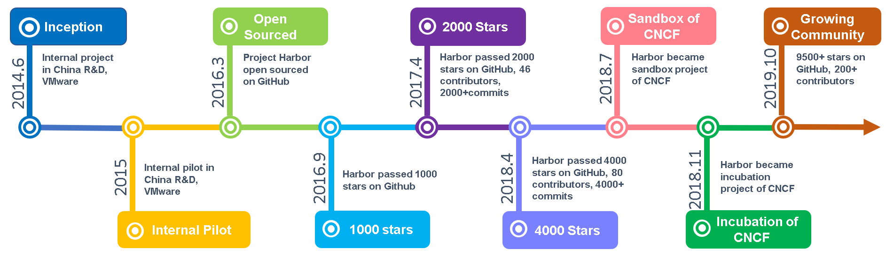
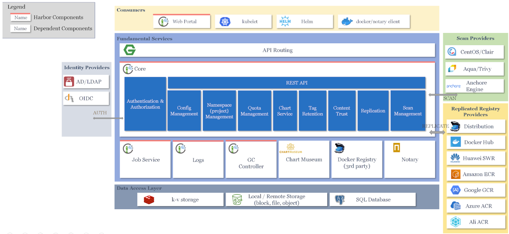
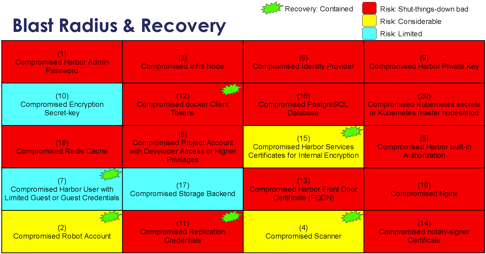

# CNCF TAG-Security	Harbor Project Self Assessment
*March 2020*
*Primary Author: Michael Michael, Harbor Maintainer ([@michmike](https://github.com/michmike), [@michmike77](https://twitter.com/michmike77))*
*Security Reviewers: Andres Vega, Justin Cappos, Chase Pettet, Vinay Venkataraghavan, Robert Ficaglia, Martin Vrachev, Payam Tarverdyan Chychi, Cameron Seader.*

This document details the design goals and security implications of Harbor to aid in the security assessment by CNCF TAG-Security.

<!-- TOC START min:1 max:3 link:true asterisk:false update:true -->
- [CNCF TAG-Security	Harbor Project Self Assessment](#cncf-tag-securityharbor-project-self-assessment)
- [Metadata](#metadata)
- [Overview](#overview)
  - [Background](#background)
  - [Goals](#goals)
    - [Security Goals](#security-goals)
  - [Non-Goals](#non-goals)
  - [History](#history)
- [Intended Use](#intended-use)
  - [Target Users](#target-users)
  - [Use Cases](#use-cases)
- [Project & Design](#project--design)
  - [System Design](#system-design)
    - [Identity Provider Integration](#identity-provider-integration)
    - [Components & Dependencies](#components--dependencies)
  - [Operations](#operations)
    - [Breakdown of Access, Tokens, and Creds in Harbor](#breakdown-of-access-tokens-and-creds-in-harbor)
  - [Configuration and Set-Up](#configuration-and-set-up)
    - [Default Configuration](#default-configuration)
  - [Project Compliance](#project-compliance)
- [Security Analysis](#security-analysis)
  - [Attacker Motivations](#attacker-motivations)
  - [Predisposing Conditions](#predisposing-conditions)
  - [Expected Attacker Capabilities](#expected-attacker-capabilities)
  - [Attack Risks and Effects](#attack-risks-and-effects)
  - [Security Degradation](#security-degradation)
  - [Blast Radius and Recovery](#blast-radius-and-recovery)
  - [Compensating Mechanisms](#compensating-mechanisms)
    - [Compartmentalization](#compartmentalization)
    - [RBAC](#rbac)
    - [Forensics](#forensics)
- [Secure Development Practices](#secure-development-practices)
  - [Development Pipeline](#development-pipeline)
    - [Tooling](#tooling)
  - [Communication Channels](#communication-channels)
  - [Ecosystem](#ecosystem)
  - [Security Issue Resolution](#security-issue-resolution)
  - [Responsible Disclosures Process](#responsible-disclosures-process)
  - [Incident Response](#incident-response)
  - [Security Testing](#security-testing)
- [Roadmap](#roadmap)
  - [Project Next Steps](#project-next-steps)
- [Appendix](#appendix)
  - [Known Issues Over Time](#known-issues-over-time)
  - [CII Best Practices](#cii-best-practices)
  - [Case Studies](#case-studies)
  - [Competition](#competition)
  - [Missing Features](#missing-features)
<!-- TOC END -->


# Metadata
<table>
  <tr>
   <td>Software
   </td>
   <td><a href="https://github.com/goharbor/harbor">https://github.com/goharbor/harbor</a>
<p>
<a href="http://goharbor.io">http://goharbor.io</a>
   </td>
  </tr>
  <tr>
   <td>Security Provider
   </td>
   <td>Yes, Harbor acts as a software repository that performs security posture assessment of container images, enforces policy compliance to ensure images are free of vulnerabilities, and serves artifacts securely. Harbor leverages a combination of security policies with role based access control to deliver on these capabilities.
   </td>
  </tr>
  <tr>
   <td>Relevant Links
   </td>
   <td>
<ul>

<li><a href="https://github.com/cncf/tag-security/issues/369">TAG-Security Assessment Issue</a>

<li><a href="https://github.com/cncf/toc/pull/311">TOC Graduation PR</a>

<li><a href="https://docs.google.com/presentation/d/12B5dGc8lMxKeKBFS8pGoldBtZaIWBtDYUFSNcG0mnCc/edit?ts=5d9f4ab2#slide=id.g5d0c4feb44_0_0">TOC Presentation Slides</a>

<li><a href="https://vmware.zoom.us/rec/share/tMxPcZqu_0dLUreQ2m_xf6QKN6DEeaa81XQW8vUExBv13NRq4mJSY6p9EjctgJcv">TAG-Security Live Discussion 4/13/2020</a> (pwd l3%#\*x4Y)

<li><a href="https://docs.google.com/presentation/d/1MT2x_8j7OqI1t1EnEqCCrb4h5lqR9wiDNYDDT34t4_Q/edit?usp=sharing">Harbor Assessment by TAG-Security 4/22/2020</a>
</li>
</ul>
   </td>
  </tr>
</table>

# Overview

The Harbor project is an enterprise-grade container registry that enables enterprises to assess the security posture of container images and enforce that images are compliant with being free from vulnerabilities as defined in the configured vulnerability databases.

---
**NOTE**

Vulnerabilities are only detected in an artifact or container image as the result of static analysis. This static analysis is performed by a scanner like CoreOS’s Clair or Aqua’s Trivy. If the vulnerabilities are already published and the scanner can pick them up, images are being analyzed against those vulnerabilities. In the case of Zero Day CVEs, these take time to be published in [vulnerability databases](https://github.com/quay/clair/blob/master/Documentation/drivers-and-data-sources.md#data-sources-for-the-built-in-drivers) and may take hours or days to be picked up by Trivy or Clair. Each scanner has their own vulnerability databases that they use for scanning.

---

The project was started by a group of VMware engineers in 2014. Since then, it has grown over time into a popular open source container image registry that is able to secure images with role-based access control, scan images for vulnerabilities, and sign images for authenticity and traceability. As a CNCF Incubating project, Harbor delivers compliance, performance, and interoperability to help you consistently and securely manage images across cloud native compute platforms like Kubernetes and Docker.

Harbor is a packaged solution, meaning an end user will download Harbor from our GitHub release site and install on their own hardware. The end user is responsible for management, operations, upgrades, and Day 2 operations (Day 2 Operations generally describes the monitoring, logging, maintenance, and troubleshooting that keeps apps, services, and hosts up and running). In that sense, Harbor can be considered a private enterprise registry as it is not a public service offered by the Harbor Project team.

The Harbor project provides the following benefits:


*   Compliance - Image compliance is enforced by enabling Harbor project administrators to prevent images from being deployed if they were scanned and found to have vulnerabilities. Compliance is only enforced at a point in time using the available data. Data in this case includes the policy set by the administrator (e.g. Don’t allow images with high severity vulnerabilities to be pulled from Harbor), the vulnerability database the scanner will use, and the scan results against images from Trivy or Clair. Once an image is deployed, Harbor no longer plays a role in compliance with the running image on a Kubernetes cluster (even if 10 minutes after an image is deployed, a Harbor scan is executed and we found this image to be vulnerable. A Harbor administrator can configure [webhooks](https://goharbor.io/docs/1.10/working-with-projects/project-configuration/configure-webhooks/) to be notified when such vulnerabilities are found, but they have to execute actions outside of Harbor to enforce compliance. For example, they have to patch or quarantine their Kubernetes pods). Products like Aqua CSP have an integrated solution that can help customers enforce compliance for running images in a cluster.
*   Performance - Highly modular architecture (more on that in later sections) and scalable core services enable Harbor to scale and serve hundreds of Kubernetes clusters and Terabytes of storage. Performance and Scalability is covered in this [document](https://docs.google.com/document/d/15gX7EeeXQThEvVMGpL-0a1mOwGuByLtMfvXNJaKT0A0/edit#heading=h.r0hfdgftnmiz).
*   Interoperability - Harbor integrates with many other registries for replication (more on that in later sections) as well as integrates with popular static analysis scanners (more on that in later sections). These options enable project administrators to choose which tools they wish to use for their use cases.

As you are reading this document, please pay specific attention to three very important sections. These sections break down the different sets of credentials and access in Harbor, what happens if any of them are compromised, and the steps towards recovery and mitigation. In addition, these sections talk about compensating circumstances that limit exposure or risk.


1. [Breakdown of Access, Tokens, and Creds in Harbor](#breakdown-of-access-tokens-and-creds-in-harbor)
2. [Blast Radius and Recovery](#blast-radius-and-recovery)
3. [Compensating Mechanisms](#compensating-mechanisms)

## Background

Harbor is an open source container image registry that can securely store images, helm charts, and other OCI-compliant cloud native artifacts with role-based access control, scan images for vulnerabilities, and sign images for authenticity and traceability. Harbor signs images by leveraging [TUF Notary](https://github.com/theupdateframework/notary). Harbor users that chose to utilize the Notary integration and capabilities have some key advantages like Survivable Key Comporose, Freshness Guarantees, Configurable Trust Thresholds, Signing Delegation, Use of Existing Distribution, and Untrusted Mirrors and Transport. Read more about those advantages [here](https://github.com/theupdateframework/notary#goals).

As of the writing of this assessment, Harbor (latest released version is v1.10) supports only two artifact types, [container images and Helm charts](https://goharbor.io/docs/1.10/working-with-projects/working-with-images/). With Harbor v2.0 (to be released in April 2020), Harbor will be fully OCI compliant. We will support any [OCI compliant artifact type](https://docs.google.com/document/d/14M-f5Q_5lxQu4Cd3pNn7E--mzbQeq2lBJ-QNiEVbT74/edit), providing them many of the capabilities that Harbor offers today → RBAC, quotas, retention policy, replication, policy, and more. Scanning will be available to images and CNAB bundles. Some of the artifact types supported include: docker images, docker manifest lists, Helm charts, CNAB bundles, OPA bundles.


## Goals

The goal of the Harbor project is to be an all-in-one registry that can be used to store and serve cloud native [OCI-compliant](https://github.com/opencontainers/runtime-spec/blob/master/spec.md) artifacts. You can see a [comparison with other registry solutions](https://goharbor.io/docs/1.10/build-customize-contribute/registry-landscape/) on how Harbor stacks up on what we consider various capabilities of a registry. Harbor is designed as a complementary service to Kubernetes deployments and aligns well with other projects in the cloud native ecosystem.

By design, Harbor is intended to be complementary and well aligned with the cloud native community and other projects in the CNCF ecosystem. As a cloud native registry for docker containers and Helm charts, it supports, utilizes, or depends on the following projects and use cases:


1. Kubernetes
    1. Kubernetes deployments can leverage Harbor as their cloud native registry for Helm charts and docker containers
    2. Kubernetes operators can create their cloud native artifact security policy on Harbor and create the guard rails that allow developers to use Harbor in a self service way
2. Helm - Harbor can store and serve Helm charts by integrating with the Helm Chart Repository Server ChartMuseum
3. Notary - Harbor depends on Notary for signing images and establishing trust and ownership for image creators and consumers. This is an optional component in Harbor. Administrators may not want to take a dependency on Notary or may not need image signing or any of the Notary advantages mentioned earlier, so Harbor offers a choice in enabling this feature or not.
4. CoreOS Clair - The built-in vulnerability & static analysis scanner in Harbor. This is a hard dependency for Harbor. Harbor is bundled and includes Clair for release v1.10 and v2.0.
5. Aqua Trivy - A first-generation optional pluggable scanning adapter that Harbor users can utilize to assess the security posture of docker containers. This is a hard dependency for Harbor starting with version 2.0 that will ship in April 2020.
6. Anchore Engine - A first-generation optional pluggable scanning adapter that Harbor users can utilize to assess the security posture of docker containers. This is an optional component if the user wants to leverage Anchore’s security scanners.
7. [DoSec ](https://github.com/dosec-cn/harbor-scanner/blob/master/README_en.md)(Beijing Xiaoyou Technology Co., Ltd) - A first-generation optional pluggable scanning adapter that was independently built by a security company which focuses on cloud-native and container security tooling. This is an optional component if the user wants to leverage DoSec’s security scanner.

For more information on the pluggable scanners in Harbor, visit our [pluggable scanner compatibility list.](https://goharbor.io/docs/1.10/install-config/harbor-compatibility-list/#scanner-adapters)

The Harbor project also plans to integrate, store, or make use of other cloud native projects like Prometheus, CNAB bundles (coming with Harbor v2.0 in April 2020), Kubernetes Operators, OCI Registry (coming with Harbor v2.0 in April 2020), Dragonfly (coming in summer 2020), and Kraken  (coming in summer 2020).


### Security Goals


*   Protect artifacts in the registry from being replaced with malicious content by preventing unauthorized access. (e.g insert a backdoor in a container image)
    *   Mitigation: Harbor enables enterprises to integrate with OIDC and LDAP for authentication. Read the “Identity Provider Integration” section for more details. Authorization is protected in the Harbor Database. SSL is enabled by default for access to Harbor API and UI and for core service to service communication in Harbor (the SSL for core service to service communication is a feature of Harbor v.2.0 that’s going to be released in late April 2020)
*   Protect from bad actors gaining access to Harbor and modifying policies that would allow unsigned images or images with vulnerabilities to be pulled
    *   Mitigation: Harbor has robust RBAC with specific actions that each user is entitled to do. RBAC and roles are fully contained within Harbor’s DB regardless of the authentication scheme used. IdP integration tells us reliably who the account is (pure auth) and Harbor will dictate what they are entitled to do. You can also associate LDAP or OIDC groups with a Harbor role to make management easier.
*   Protect from bad actors to be able to pull an artifact they don’t have access to
    *   Mitigation: Harbor auth will prevent someone with no access from connecting to Harbor, and project RBAC will control permissions in a project for Harbor authenticated users
*   Protect from bad actors high-jacking the pluggable scanner and returning incorrect data about the vulnerability status of an artifact
    *   We talk about the circumstances of this situation in the blast radius section below. An additional protection offered by Harbor includes the fact that the credentials pluggable scanners use to communicate with Harbor are rotated per scan job (Harbor engine rotates the accounts before it kicks off a scan job and the credentials are only valid for the duration of the job). This means an attack where the credentials are stolen will be short lived as those credentials are also short lived.
*   Protect from bad actors high-jacking the webhook pipeline and returning incorrect data to subscribers
    *   Mitigation: Harbor auth will prevent someone with no access from connecting to Harbor, and project RBAC will control permissions for webhook config. In addition, the webhook calls can be protected by SSL and Harbor can verify the remote certificate.


## Non-Goals


*   Harbor is not meant to be a content store for all existing artifacts such as legacy data types (Java WAR files, JARs, any other data type that’s not OCI-Compliant) unsuitable for the cloud-native world or those that are not OCI-compliant. The OCI specs are located at [https://github.com/opencontainers/runtime-spec/blob/master/spec.md](https://github.com/opencontainers/runtime-spec/blob/master/spec.md) and at [https://github.com/opencontainers/image-spec](https://github.com/opencontainers/image-spec)
*   Harbor cannot protect itself from bad actors that want to DDOS Harbor in such a way that Kubernetes clusters can’t pull the images they need for workloads to run. If a bad actor is successful, end users will not know about it until Kubernetes workloads stop deploying because images can’t be pulled. Health monitoring and outside-in monitoring and synthetic transactions against Harbor and the firewall solution will help network operations discover there is an issue.
    *   We rely on network administrators to protect Harbor using a hardware/software firewall or other global traffic manager tools. This is actually the recommended practice for both Harbor and Kubernetes environments
    *   Harbor is also generally only available on the intranet
    *   The Harbor administrator can also configure rate-limiting on nginx, protecting the Harbor API and User Interface from bad actors.


## History

**Harbor Through the Years**


*   In June 2014, Harbor started as a project within VMware's China R&D organization, where it was leveraged for a handful of internal projects to manage container images. To allow more developers in the community to use and contribute to the project, VMware open-sourced Harbor in March of 2016 and it has steadily gained traction since.
*   Harbor has been integrated into three commercial VMware products; vSphere Integrated Containers (VIC), Pivotal Container Services (aka PKS or VMware Enterprise PKS), and VMware Essential PKS.
*   Many companies include Harbor in their own cloud native solutions and Harbor has 20+ Product Implementations (some of these products include VMware Tanzu Kubernetes Grid, Pivotal Container Service, Rancher and [others](https://docs.google.com/document/d/15gX7EeeXQThEvVMGpL-0a1mOwGuByLtMfvXNJaKT0A0/edit#heading=h.jsq9yt83ywpd))
*   In April 2018, Harbor passed 4000 stars on GitHub and currently has 59 community contributors worldwide, 30 of which have made non-trivial contributions to the project.
*   In July 2018, Harbor became a sandbox project of CNCF
*   In Nov 2018, Harbor became an incubating project of CNCF
*   In Oct 2019, Harbor has 7600 stars on GitHub with 200+ contributors worldwide.
*   Harbor v1.10, released in Dec 2019, enabled the integration with third party pluggable scanners, opening up the ecosystem of cloud native security solutions that work with Harbor. Aqua Security, Anchore Engine & Enterprise and DoSec are the first security solutions to integrate with Harbor via our pluggable scanner service.
*   Harbor v2.0, estimated to release in April 2020, will make Harbor fully OCI compliant, supporting any OCI-compliant cloud native artifact

# Intended Use

## Target Users

Harbor has three main personas. For a detailed listing of all personas and their permissions, we have documented them in [managing users](https://goharbor.io/docs/1.10/administration/managing-users/) and [user permissions by role](https://goharbor.io/docs/1.10/administration/managing-users/user-permissions-by-role/).


*   End User/Developer
    *   A developer that has access to consume artifacts from Harbor. Typically they push and pull containers from Harbor using a docker-compliant client. They also have access to the Harbor user interface and API for container management, but their permissions are restricted.
*   Project Administrator
    *   A scoped version of a Harbor user with elevated permissions that has full access and permissions for a project. This includes project configuration, project policy, and user management.
*   Enterprise Operator / Security Administrator
    *   The Harbor administrator, responsible for the health and maintenance of the entire system. They install, configure, and maintain Harbor and its policy engine after installation. You can learn more about administration [here](https://goharbor.io/docs/1.10/administration/)


## Use Cases

Harbor can be used as a repository for OCI-compliant artifacts. The only other artifact that we will support is Helm Charts through ChartMuseum. However, over time we will deprecate that capability as Helm compliance with OCI matures. Until then, we will enable users to push Helm Charts into Harbor both through ChartMuseum and as an OCI artifact. No other non-OCI-compliant file type can be pushed to Harbor. OCI-compliance is defined by the OCI working group as having adhered to both the OCI [image spec](https://github.com/opencontainers/image-spec) as well the [OCI runtime spec](https://github.com/opencontainers/runtime-spec/blob/master/spec.md).

Specific uses cases include:


*   Store docker container images and Helm charts within Harbor that can be pulled down to your environment at any given time
*   The Harbor registry can be a key component of your CI/CD pipeline. You can use Harbor to push your artifacts so that Harbor can scan them for vulnerabilities before deploying those artifacts to your Kubernetes clusters. On top of that, Harbor policies like image retention and quota management can help make sure storage requirements don’t balloon. Retention and quota management policies are both configured at the project level, meaning they are applied consistently across all artifacts within a project. You can set different policies for each project.
*   We understand that sometimes workloads are deployed at the edge, in branch offices, in other public cloud provider regions, etc. It is important that a local cache exists with images needed by those workloads. Harbor can operate in a hub-and-spoke model, where you use a central Harbor instance to scan all images and then replicate them to the locations where the Kubernetes clusters are located. Harbor can replicate hosted images and charts within Harbor to / from another Harbor instance or a 3rd-party on-premise or hosted registry (Dockerhub, GCR, ACR, ECR, Quay) through scheduled tasking
*   Scan images for the latest vulnerabilities directly from within Harbor using one of our many vetted 3rd party OSS (Aqua Trivy, Anchor Engine, CoreOS Clair) or commercial [scanners ](https://goharbor.io/docs/1.10/install-config/harbor-compatibility-list/#scanner-adapters)(Aqua CSP, Anchore Enterprise, DoSec). The plug-and-play nature of the scanning framework means you can use the default scanner, CoreOS Clair, that comes with the Harbor installer or pair one of our supported pluggable scanners with Harbor.
*   Host CNABs, OPAs, or arbitrary cloud native artifacts that follow the OCI specifications and further gate access through whitelisting specific mediaTypes.
*   Automatically garbage collect images in a non-blocking manner so that does not interfere with ongoing operations and does not have to put the registry into read-only mode


# Project & Design


## System Design

Harbor consists of a series of core proprietary components as well as several 3rd party open source software (Docker distribution, Clair, Notary, Chartmuseum, Helm etc.) running as containers to stand up a registry instance, capable of running on a wide array of popular Linux distros. You can find a complete listing of all Harbor dependencies [here](https://docs.google.com/document/d/15gX7EeeXQThEvVMGpL-0a1mOwGuByLtMfvXNJaKT0A0/edit#heading=h.ogwp628ik1nb) as well as a summary in the section directly below. Harbor can run as Docker compose as well as a Kubernetes deployment via Helm charts and has recently seen a 3rd release version in the form of an Operator (see our announcement [here](https://github.com/goharbor/harbor-operator/)) This service is exposed to the end user via a web console and a rich set of APIs that allows you to use Docker CLI and other OCI-compatible client tooling to push and pull images. It has namespace management through a construct called ‘project’ and users gain access to their projects through full RBAC support. Policies enforcing image scanning and vulnerabilities (leveraging OSS project Trivy) and image signing (TUF Notary) are applied across these projects to enforce artifacts can only be pulled from the Harbor registry if they meet the policy requirements.

**Harbor Architecture**



### Identity Provider Integration

Harbor supports different modes for authenticating users and managing user accounts. For production deployments, we recommend leveraging an Identity Provider (IdP). In cases where Harbor use cases require authenticating against many IdPs, we recommend using [Dex](https://github.com/dexidp/dex) as a connectivity component to other identity providers through Dex’s connectors.


*   [Database Authentication](https://goharbor.io/docs/1.10/administration/configure-authentication/db-auth/): You create and manage user accounts directly in Harbor. The user accounts are stored in the Harbor database.
    *   User email and optional group information are used by Harbor to identify a user in the IdP
*   [LDAP/Active Directory Authentication](https://goharbor.io/docs/1.10/administration/configure-authentication/ldap-auth/): You connect Harbor to an external LDAP/Active Directory server. The user accounts are created and managed by your LDAP/AD provider.
    *   User email and optional group information are used by Harbor to identify a user in the IdP. The username is also from the DN (according to the UID setting in Harbor)
*   [OIDC Provider Authentication](https://goharbor.io/docs/1.10/administration/configure-authentication/oidc-auth/): You connect Harbor to an external OIDC provider. The user accounts are created and managed by your ODIC provider.

RBAC and roles are fully contained within Harbor’s Database regardless of the authentication scheme used. IdP integration tells us reliably who the account is (pure auth) and Harbor will dictate what they are entitled to do. This means that IdP’s only perform authentication. Authorization is always performed by Harbor and the authorization configuration is in the Harbor Database.

For logging and forensics with IdPs, please visit the appropriate [section](#forensics).


### Components & Dependencies

<table>
  <tr>
   <td>Component
   </td>
   <td>Description
   </td>
   <td>Licensing & Restrictions
   </td>
  </tr>
  <tr>
   <td>API Routing Layer (Nginx)
   </td>
   <td>A reverse proxy (and load balancer) serves as the endpoint of Harbor, Docker and Notary clients. Users will leverage this endpoint to access Harbor’s API or UI
   </td>
   <td>Free and open-source software, released under the terms of a BSD-like license
   </td>
  </tr>
  <tr>
   <td>Core Services
   </td>
   <td>Hosts Harbor’s API and UI resources. Additionally, an interceptor for registry API to block Docker pull/push in particular use cases (e.g., image fails vulnerability scan)
   </td>
   <td>Harbor utilizes the Apache LICENSE-2.0 license
   </td>
  </tr>
  <tr>
   <td>Admin Service
   </td>
   <td>Serves API for components to retrieve/manage the configurations
   </td>
   <td>Harbor utilizes the Apache LICENSE-2.0 license
   </td>
  </tr>
  <tr>
   <td>Job Service
   </td>
   <td>Serves API to be called by Core service for asynchronous job
   </td>
   <td>Harbor utilizes the Apache LICENSE-2.0 license
   </td>
  </tr>
  <tr>
   <td>Registry v2.7.1
   </td>
   <td>Open Source Docker Distribution, whose authorization is set to the token API of Core service
   </td>
   <td>Apache LICENSE-2.0
   </td>
  </tr>
  <tr>
   <td>CoreOS Clair v2.0.8
   </td>
   <td>Open Source vulnerability scanner by CoreOS whose API will be called by job service to pull image layers from Registry for static analysis. This is the built-in vulnerability & static analysis scanner.
   </td>
   <td>Apache LICENSE-2.0
   </td>
  </tr>
  <tr>
   <td>CNCF Notary v0.6.1
   </td>
   <td>Components of Docker’s content trust open source project. Harbor depends on Notary for signing images and establishing trust and ownership for image creators and consumers
   </td>
   <td>Apache LICENSE-2.0
   </td>
  </tr>
  <tr>
   <td>PostgresSQL Database v9.6.10-1.ph2
   </td>
   <td>Database used for storing user data
   </td>
   <td>PostgreSQL License, a liberal Open Source license, similar to the BSD or MIT licenses
   </td>
  </tr>
  <tr>
   <td>Redis v4.0.10-1.ph2
   </td>
   <td>In-memory key-value store
   </td>
   <td>Redis is open source software released under the terms of the three clause BSD license
   </td>
  </tr>
  <tr>
   <td>Chart-museum v0.9.0 (Helm v2.9.1)
   </td>
   <td>Helm Chart Repository Server ChartMuseum powers the Helm Charts service capabilities inside Harbor
   </td>
   <td>Apache LICENSE-2.0
   </td>
  </tr>
  <tr>
   <td>Photon OS (current version is photon 2.0)
   </td>
   <td>The docker images packaged in the installer are based on Photon OS. A user can reconfigure these images to be based on alpine
   </td>
   <td>The Photon OS ISO and OVA images are distributed under the <a href="https://github.com/vmware/photon/blob/2.0/installer/EULA.txt">Photon OS EULA</a>.
<p>
With the exception of the 'libtdnf' source code, Photon OS source code is distributed under GNU GPL v2. The 'libtdnf' source code is distributed under GNU LGPL v2.1
   </td>
  </tr>
  <tr>
   <td>Aqua Trivy (out-of-tree pluggable scanning adapter)
   </td>
   <td>A first-generation pluggable scanning adapter that Harbor users can utilize to assess the security posture of docker containers
   </td>
   <td>GNU Affero General Public License v3.0
   </td>
  </tr>
  <tr>
   <td>Anchore Engine & Enterprise (out-of-tree pluggable scanning adapter)
   </td>
   <td>A first-generation pluggable scanning adapter that Harbor users can utilize to assess the security posture of docker containers
   </td>
   <td>Apache LICENSE-2.0 for Anchore Engine. Anchore Enterprise is a commercially available product.
   </td>
  </tr>
  <tr>
   <td>DoSec (out-of-tree pluggable scanning adapter)
   </td>
   <td>A first-generation pluggable scanning adapter that was independently built by a security company which focuses on cloud-native and container security tooling
   </td>
   <td>Commercially available product
   </td>
  </tr>
  <tr>
   <td>swagger-UI v3.22.1
   </td>
   <td>Swagger UI is a collection of HTML, Javascript, and CSS assets that dynamically generate beautiful documentation for the Harbor API
   </td>
   <td>Apache LICENSE-2.0
   </td>
  </tr>
</table>


Complete details into the [Harbor architecture were included in the Harbor due diligence document ](https://docs.google.com/document/d/15gX7EeeXQThEvVMGpL-0a1mOwGuByLtMfvXNJaKT0A0/edit#heading=h.63l45s6wo6dt)for Graduation.


## Operations

Areas where keys / tokens need to be safely managed internally in Harbor are interaction with Docker Distribution (Harbor under the covers uses the Docker Distribution at [https://github.com/docker/distribution](https://github.com/docker/distribution) as the toolset to pack, ship, store, and deliver content), image scanning, signing, and replication. The table in the section below breaks down all the keys and certs used in Harbor.

Harbor uses a proprietary token service to generate a token for the Docker client to push and pull images from the Docker distribution, please see [this](https://github.com/docker/distribution/blob/master/docs/spec/auth/token.md). This is the same token service used to generate tokens for robot accounts.


    Using a proprietary token service was a legacy implementation detail of Harbor. We needed a token service that supports customized claims (for example see below) and data so we used our own. At the time we created this, we were not able to find a 3rd party token service that we could use. The token we create is a JWT token
**Token Claims Example**
```
"access": [
{
"type": "repository",
"name": "library/ubuntu",
"actions": [
"push",
"*",
"pull"
]}}
```

Image signing is done with [Notary](https://github.com/theupdateframework/notary), which requires a certificate for HTTPS connection to Harbor. Customer provides the certificate (can be generated with OpenSSL) during installation which can then be updated at any time by replacing the .crt and .key in the designated paths and then restarting Harbor. The notary service within Harbor needs a separate cert for the actual signing of the image and this cert is generated by Harbor itself. There are 2 processes running in notary, notary-server and notary-signer. Notary-server is the only client for notary-signer. The certificate for notary-signer is generated each time the user installs Harbor, by install I mean both first-time installation and upgrade. In the event an administrator would like to replenish the notary-signer certificate the easiest way is to do it is by upgrading or re-installing Harbor. Notary handles the cryptographic signature of images, utilizing the notary-signer component. This [page ](https://github.com/theupdateframework/notary/blob/master/docs/service_architecture.md)has more details on the Notary architecture.

Image scanning is achieved either via the built-in scanner (Clair is the only built-in scanner up to v1.10. With Harbor 2.0, Trivy and Clair are included as built-in scanners) or by pairing Harbor with a 3rd party image scanner that is exposed as an API endpoint to Harbor. The scanner is authorized for use with Harbor through a generated bearer token which allows the scanner to pull images across from Harbor. The bearer token cannot be refreshed with Harbor v1.10, however, with version Harbor v2.0 (to be released in April 2020), we are replacing the bearer token with robot accounts whose tokens can be refreshed at any time. Here is an overview on how robot accounts will be used in this scenario for Harbor 2.0. You can also read more about robot accounts [here](https://goharbor.io/docs/1.10/working-with-projects/project-configuration/create-robot-accounts/).


1. Harbor can run either on-demand or scheduled scan jobs. When a scan job is started, its job is to scan a collection of artifacts for vulnerabilities. The scanner will receive a pointer to these artifacts via API
2. The first step Harbor does before sending a scan request to the scanner (Trivy adaptor or Clair adaptor for example), is creating a set of credentials so that scanners can get the artifacts from Harbor. In order to create these credentials, Harbor will call an internal interface to create a robot account. The creds for the robot account are sent to the scanner to allow them to pull content from Harbor (using the pointers mentioned in step 1). So scanners are not using Harbor API to generate robot accounts, one is generated for them by Harbor engine.
1. This robot account has access scope for pull and scanner_pull which is a special access privilege created just for scanners, i.e. it will allow for skip the policy checker (CVEs blocking pulls etc) when called through the scanner pull.
    1. Only Harbor system administrators can add a new scanner.
    2. Scanners only get a robot account for projects they are enabled to run and only for the duration of the scan job
    3. Nobody else can access the scanner robot account besides scan jobs as other users would not know the robot account token (the token is not saved anywhere and for more info see the table below)
1. The actual authN/authZ for the robot accounts happens in harbor core components
2. Once the scan request is completed, the robot account is deleted by Harbor. The lifetime of these credentials would be the same as that of the scan job. This process is followed to control the lifetime of the credentials and tie them to the specific job they are trying to accomplish. A new robot account is created for the next scan job. We create a new robot account for each scan job since those accounts are shared with an external system, the scanning adapter. It is more secure to recreate them than depend on the scanning adapter to securely store them.

When replication is enabled in Harbor, the security administrator has to provide Harbor with credentials to be able to connect with the target registry. The target registry is any external registry that Harbor supports, including another Harbor instance, Google Registry, Azure Registry, AWS Registry, etc. In order to replicate artifacts to a target registry, the system needs an Access ID as well as the Access Secret (think of these as the username and password) for that target endpoint which is encrypted by AES and then stored securely in Harbor DB and encrypted via aes/base64. This access key will hold all necessary permissions for the target registry including access to storage etc. security administrators can update the Access ID and Access secret at any time.


### Breakdown of Access, Tokens, and Creds in Harbor


*   If a Harbor instance is compromised and the keys are leaked or stolen, the directive is to replace all the certificates using the methods outlined in the table below. This is the secure way to recover
*   There is fate sharing involved in protecting some of these secrets. It really boils down to where they are stored. If they are stored in the file system, they can be compromised together. If stored in Kubernetes secrets, the same. If stored in a Database, compromising the database compromised all secrets stored in it. The Harbor team will explore integration with popular Vault solutions in the near future. That integration will ensure that in a Kubernetes environment, our secrets are securely stored in a Vault.
*   In cases where credentials are rotated there is a secure way for a device with credential X to change to having credential Y such that all parties that trusted X now trust Y instead (and no longer trust X)
*   All rotations of credentials are manual-driven by an action
*   If the JWT tokens mentioned below are forged / incorrect / invalidated by the issuer (Harbor is the issuer), the consumer of these will get an access denied. Harbor can recreate them and the consumer would get a new secret token.
*   Recommendations are made such that when deploying Harbor in production the security best practices to harden a Kubernetes cluster are followed. This way limitations of Kubernetes secrets are mitigated.
*   For internal TLS, we leverage net/http lib of golang to establish TLS connection, which doesn't support CRL.  CA hierarchy can be supported per our understanding as long as the root and intermediate CA are pasted into one file, but we have not tested that. mutual auth is not fully supported. We had explored that in the past but found it unfriendly to users so decided to disable it in v2.0.0

<table>
  <tr>
   <td>
Type?
   </td>
   <td>Encryption Standards
   </td>
   <td>Who provides it?
   </td>
   <td>Can it be updated/rotated?
   </td>
   <td>How is it stored in Harbor?
   </td>
   <td>How is it used?
   </td>
   <td>What happens if forged? Or read-only leak?
   </td>
  </tr>
  <tr>
   <td>Harbor Private key
<p>
(long-lived)
   </td>
   <td>Public key is x.509. Private key is 4096 bits
   </td>
   <td>Harbor generates it during installation
   </td>
   <td>If you remove the keys, they will be updated during installation/upgrades/reinstall. This is secure because the only way to update it via re-install or upgrade.
   </td>
   <td>In Kubernetes it is a secret. In Docker-compose it is a file with restrictions permissions
   </td>
   <td>Harbor uses it for signing JWT tokens
   </td>
   <td>If it’s leaked to a malicious user, it can forge a token and use it to pull/push artifacts.
   </td>
  </tr>
  <tr>
   <td>Encryption Secret Key
<p>
(long-lived)
   </td>
   <td>AES encryption key 128 bits
   </td>
   <td>Harbor generates it during installation
   </td>
   <td>Cannot be updated/rotated because decryptions won’t work
   </td>
   <td>In Kubernetes it is a secret. In Docker-compose it is a file with restrictions permissions
   </td>
   <td>Used for AES encryption in Harbor. There are use cases where  Harbor needs to store the credentials of other registries for replication. We encrypt such credentials and store them in DB.
   </td>
   <td>If a malicious user accesses Harbor’s DB and sees the encrypted data, for example, secrets for accessing remote registry for replication, he can use this key to decrypt it.
   </td>
  </tr>
  <tr>
   <td>Replication Credentials;  Access ID, Access Secret
<p>
(long-lived)
   </td>
   <td>Secret is encrypted by AES
   </td>
   <td>Security administrator of Harbor
   </td>
   <td>Yes, via GUI or API. This is the credentials for accessing remote registries, so when the remote registry's credentials are updated the admin needs to update it via UI or API in Harbor as well.
   </td>
   <td>Encrypted by AES/Base64 and stored in Harbor database
   </td>
   <td>Credentials used for connecting Harbor to an external registry for replication to/from Harbor.  This access could be read only or read/write.
   </td>
   <td>This value is encrypted, a malicious user needs to have the key (the line above) to decrypt it and see the content.
   </td>
  </tr>
  <tr>
   <td>Robot creds
<p>
(relatively short-lived)
   </td>
   <td>JWT token with custom claims signed by the private key of Harbor
   </td>
   <td>Harbor generates it via proprietary token service
   </td>
   <td>Yes, by deleting and re-creating the robot account using the same name. The name can also be changed, but that’s an entirely new cred now, not a rotation
   </td>
   <td>This is not stored anywhere in Harbor
   </td>
   <td>Used by robot accounts and pluggable scanners to connect to Harbor
   </td>
   <td>A malicious user can use this token for pull/push images, based on the permission of this token.
   </td>
  </tr>
  <tr>
   <td>Docker client tokens
<p>
(short-lived, expires in 30 minutes)
   </td>
   <td>JWT token with custom claims signed by the private key of Harbor
   </td>
   <td>Harbor generates it via proprietary token service
   </td>
   <td>No
   </td>
   <td>This is not stored anywhere in Harbor
   </td>
   <td>Used for push and pull of images from the Docker distribution
   </td>
   <td>A malicious user can use this token for pull/push images, based on the permission of this token.
   </td>
  </tr>
  <tr>
   <td>Harbor FQDN Certificate
<p>
(long-lived)
   </td>
   <td>x.509 TLS certificate
   </td>
   <td>Customer provides this during Harbor installation
   </td>
   <td>Yes by replacing the .crt and .key in the designated paths and then restarting Harbor
   </td>
   <td>In Kubernetes it is a secret. In Docker-compose it is a file with restrictions permissions
   </td>
   <td>Notary uses this certificate for HTTPS connection to Harbor.  This is also the certificate used for HTTPS access to Harbor UI and API
   </td>
   <td>MiTM between Client and Harbor
   </td>
  </tr>
  <tr>
   <td>Notary-signer Certificate
<p>
(long-lived)
   </td>
   <td>x.509 TLS certificate
   </td>
   <td>This cert (used by notary-signer) is generated by Harbor itself each time the user installs/upgrades Harbor.
   </td>
   <td>In the event an administrator would like to replenish the notary-signer certificate the easiest way is to do it is by upgrading or re-installing Harbor
   </td>
   <td>In Kubernetes it is a secret. In Docker-compose it is a file with restrictions permissions
   </td>
   <td>The notary service within Harbor needs a separate cert for the actual signing of the image.
   </td>
   <td>MiTM between notary server and signer, if the malicious user can access the internal network where they communicate. In the TOFU mechanism if the Secure communication is compromised the Notary private key will be at risk.
   </td>
  </tr>
  <tr>
   <td>Core Harbor Services Certificates. There is one per Harbor core service (~7)
<p>
(long-lived)
   </td>
   <td>x.509 TLS certificate
   </td>
   <td>Harbor provides a script to help customers generate it. But customer provides this during Harbor installation
   </td>
   <td>Yes by replacing the .crt and .key in the designated paths and then restarting Harbor
   </td>
   <td>In Kubernetes it is a secret. In Docker-compose it is a file with restrictions permissions
   </td>
   <td>Certificate used for SSL connection between Harbor core services (A Harbor v2.0 feature). This is for intra-service communication
   </td>
   <td>MiTM between Harbor’s internal components, if the malicious user can access the internal network where they communicate
   </td>
  </tr>
</table>


## Configuration and Set-Up

For  detailed installation and configuration steps, the documents can be found [here](https://goharbor.io/docs/1.10/install-config/). In a nutshell, Harbor supports two deployment methods: Docker-Compose and a Helm Chart installation method for Kubernetes environments. We are also working on an operator for Harbor which is currently a work in progress (see our announcement [here](https://github.com/goharbor/harbor-operator/)). The installation documentation linked above has the up-to-date information on installing Harbor.

By default, Harbor does not ship with certificates. Users must supply their own certificates for HTTPs access. In production environments, it is recommended practice to always use HTTPS (enabled by default). Ultimately, the Harbor installer has configuration options for http and https. It is up to the admin configuring installation to fill in the right set of details and supply the certificate. In addition, if you enable Content Trust with Notary for signing images, you must use HTTPS, you don’t have a choice. HTTPS requires use of certificates that are either signed by a trusted 3rd party CA or self signed. The steps to enable HTTPS in Harbor are detailed [here](https://goharbor.io/docs/1.10/install-config/configure-https/). The project does support deploying with HTTP enabled for UI/API access but this is usually only for air-gapped non-production environments that do not have a connection to the external internet so it is less prone to man-in-the-middle attacks.

Furthermore, the latest release of Harbor v2.0, coming in April 2020, will optionally allow for all internal components of Harbor (core, jobservice, registry, registry controller) to communicate with each other via HTTPS-based RESTful API. If the administrator does not want to use SSL, all core services of Harbor (think pod to pod traffic) will communicate over http. We also updated our installers to make it easier for operators to configure these certificates:


*   Docker-Compose: We added an option in the docker-compose installer (through the use of a script) for users to generate self-signed certificates. Users can also bring their own certificates and keys and configure them during Harbor installation.
*   Helm Chart: Users will need to generate the certificates and keys and configure the secrets in the values.yaml configuration of the Chart.

We have not tested Harbor with a service mesh like Istio. Some of our users view Istio as a key component of application workloads versus an infrastructure solution like Harbor.


### Default Configuration


*   By default, Harbor does not ship with certificates. Users must supply their own certificates for HTTPs access. Since the default and recommended installation of Harbor uses HTTPS for secure connection to the registry and secure transmission of data, the installer has to provide the certificates.
*   Default deployment also disables self-registration which would have allowed any user to sign up for an account with a valid email address. By disabling this feature, administrators have to manage end user accounts in Harbor and add them to the projects to which they shall be entitled. Only an administrator can enable self-registration again. To read more about RBAC and entitlement, look in the “Compensating Mechanisms” section.
*   On the next release of Harbor v2.0, we will also be removing the ability for a user to query a password reset to prevent accidentally disclosing information when used maliciously for phishing.
*   Harbor 2.0 will also allow for enforcing TLS communication between all internal components as described above.


## Project Compliance

Harbor does not meet any compliance standards today. However, as we interact with more service providers that are putting Harbor in production (example by OVH Cloud [here](https://www.ovh.com/blog/managing-harbor-at-cloud-scale-the-story-behind-harbor-kubernetes-operator/)) and delivering it as a service, we understand there may be a need to acquire some of these certifications. We will continue exploring this vertical and their needs of Harbor and prioritize any requests. Currently, there haven’t been any regarding compliance certifications.

---
**NOTE**

There is only 1 public reference of a service provider today. However we are working privately with a few more service providers that don't want to be named publicly yet. There are also some enterprises that are internally acting as service providers and have the same use cases.

---

Harbor has achieved the Silver level criteria for CII Best Practices, [https://bestpractices.coreinfrastructure.org/en/projects/2095?criteria_level=1](https://bestpractices.coreinfrastructure.org/en/projects/2095?criteria_level=1). The [silver badge](https://bestpractices.coreinfrastructure.org/en/projects/2095?criteria_level=1) is displayed at [https://github.com/goharbor/harbor/blob/master/README.md](https://github.com/goharbor/harbor/blob/master/README.md), Harbor’s primary repository.


# Security Analysis
## Attacker Motivations

There are multiple reasons why hackers would want to attack the Harbor registry as it is a critical component of the container delivery supply chain. Also refer to the “Security Goals” section above.


*   Attackers can try to gain entry to hosted images and charts and either alter the content of these artifacts (a series of stacked layers) or inject vulnerabilities into the artifacts. This is the most critical vulnerability as it affects potentially production applications that are deployed from images hosted in Harbor. The motivation is to get applications running in Kubernetes to run arbitrary or vulnerable code.
*   Attackers can try to gain access to projects outside of their permissions or elevate their rights to use advanced policies and features outside of their role-based access level.
*   Another attacker vector includes DOS’ing the Harbor infrastructure, preventing artifacts from being pushed or pulled by developers. This essentially stalls the software delivery pipeline at the CI/CD layer and in Kubernetes environments. This can be a great thing for the attack chain since I can move laterally exploiting known vulns in deployed images while blocking devs from deploying patched images
*   Harbor also holds sensitive information about its users such as credentials and image entitlements that would be of interest to hackers.
*   In certain multi-tenant deployments where a Harbor instance is shared amongst different organizations or different customers, certain members have restricted access even within their own projects as they cannot view other members in the same project and logs of historical operations.
*   Attackers can use package and image info for recon itself. They don’t have to change anything but just learn from one single source all the targets to go after in their attack planning


## Predisposing Conditions


1. The keys are stored as plaintext, some credentials are set via environment variables in docker-compose deployment. So if an attacker gains root access of the Docker host, sensitive data will be at risk. This is an issue with docker-compose only.
    1. Recommendations are made such that when deploying Harbor in production the security best practices to harden a cluster are followed. For example we recommended a Kubernetes deployment in production, with all the proper security measures (node security, etcd SSL, encryption at rest, RBAC policies, namespaces, and more). We have not tested with any vault solutions (even though Kubernetes interoperates well with many vault vendors), but this is on our roadmap so that we can make recommendations in that area as well. In addition, many customers are deploying a single enterprise app per cluster. This means they are deploying an entire Kubernetes cluster for an app like Harbor or Harbor in conjunction with other infrastructure services.This reduces the attack surface as the cluster has no other tenants and can be properly hardened.
2. Harbor supports authn integration with external services such as LDAP, OIDC provider, so compromising the external IDP will give attackers access to Harbor. Compromise of the IDP results in loss of access control integrity for Harbor.


## Expected Attacker Capabilities

There are currently no known vulnerabilities and operators have the ability to use TLS for communication between all internal components. TLS is not enforced, but the Harbor team has documented the risks of an insecure setup and made it harder for operators to deploy insecurely. Areas that are potentially susceptible to attacks would be credential handling, robot accounts, replication to other registries, and token-based single sign-on. However, all of these use some form of token based authentication and we assume the attacker cannot easily break existing cryptographic algorithms like AES or SHA256


## Attack Risks and Effects

Harbor allows for secure authentication through either local DB, LDAP/AD, or OIDC connection via a vetted external vendor that you must select during the initial phase of installation. If the IdP supports it, you can also have the additional security of MFA, but Harbor does not provide MFA natively. It does not allow cutting across these after deployment, ie. you cannot change to LDAP or OIDC after you have created local users in Harbor DB. There are also different types of users (system administrator, project administrator, developer, limited guest, and guest) with different privileges to minimize the effects of accidental operations.

We currently don't have an option for multi-signature trust or admission webhook that can kick off an approval workflow in a service management tool. We understand those options would make our user accounts more powerful and secure and we can look into it in the future.


## Security Degradation

Exploiting vulnerabilities in user management and authentication can lead to maliciously changing users’ permission levels, accessing restricted artifacts, modifying artifacts to introduce malware/vulnerabilities and deleting artifacts or bringing the registry down. If an attacker gains access to artifacts on the registry, he can pull these down to their environment and alter the content before re-pushing to the registry. If an attacker intercepts tokens used for communicating with docker clients, he can break artifact pushing and pulling and render the registry unusable. If hackers gain access to the Harbor database, he could manipulate critical metadata such as adding or deleting existing users or change the authentication mode or information related to the OIDC endpoint or LDAP server. This is why there are multiple roles with varying access levels and previous exploits around self registration and permissions elevation have all been patched.


## Blast Radius and Recovery

In this section, we will discuss the blast radius when bad things happen. Cases where an attacker is likely to be able to gain additional access after a compromise are listed below. A key component of this section is to also identify the steps a Harbor administrator should take in such a situation.

If a customer has enabled Notary, image provenance is not broken unless in the case where the notary-signer component of Notary is compromised (this case is outlined in the table below). In all other cases, images that are signed by Notary will continue to assure their users of the origin of the image. In the early sections of this document we also talked about other benefits Notary brings to Harbor.

Mandatory reading prior to this section is the “Breakdown of Access, Tokens, and Creds in Harbor” section. You can view an index overview of the blast radius and recovery table below. It is color coded in terms of risk during a successful attack.

**Blast Radius Index**


<table>
  <tr>
   <td>
   </td>
   <td>Type of Attack
   </td>
   <td>Attacker’s Level of Access
   </td>
   <td>Recovery Steps
   </td>
  </tr>
  <tr>
   <td>1
   </td>
   <td>Compromised Harbor administrator password
   </td>
   <td>Has access to all the APIs of Harbor.
<p>
Only thing he does not have access to is other users’ passwords. This means that as a result of this attack, they cannot falsely accuse another party of malfeasance
   </td>
   <td>Shut Harbor down. Game over :)
<p>
The only course of action is a brand new Harbor installation with all the policies and IA&M recreated and all artifacts repopulated.
   </td>
  </tr>
  <tr>
   <td>2
   </td>
   <td>Compromised Robot Account
   </td>
   <td>Has the same access level of the robot account, such as push/pull artifacts and images within the scope of a single project.
<p>
With that level of access, potentially the ability to push an image if that was a privilege granted on the robot account, the attacker could create arbitrary, malicious images that would be trusted and run by parties pulling images from Harbor
   </td>
   <td>The project admin or system admin can disable or delete the robot account to recover.
<p>
Use forensics to identify what bad actors have modified and restore images as necessary
   </td>
  </tr>
  <tr>
   <td>3
   </td>
   <td>Compromised infrastructure node or operating system where Harbor is deployed (e.g. compromised Kubernetes worker node)
   </td>
   <td>Has access to the database and can modify or remove the data. The attacker for example can delete login accounts (users can’t login), projects (images can’t be pulled), artifacts (images can’t be pulled), robot accounts (CI/CD can’t login to Harbor), change configuration and policy (if you change policy, desired config,  and certain security restrictions like the enforcement of not allowing images to be pulled unless they are free from vulnerabilities may not apply), and more. All the Harbor configuration data is stored in the database and can be deleted or altered by the attacker.
<p>
He can also shut down Harbor to make it inaccessible (DOS) to the end-user. Harbor cannot operate without a database.
<p>
If the attacker manages to get the encryption key (stored as secret in k8s), it's possible to decrypt the encrypted data in the DB such as credentials for external registries, such as Docker Hub.
   </td>
   <td>If the attacker gains access to the encryption key, this is game over since that key cannot be updated. The only course of action is a brand new Harbor installation with all the policies and IA&M recreated and all artifacts repopulated.
<p>
Can restore the database from a backup location that is known to be free from unauthorized modifications and secure both the database and the node it is on.
   </td>
  </tr>
  <tr>
   <td>4
   </td>
   <td>Compromised pluggable scanner
   </td>
   <td>The attacker can report healthy vulnerability scanning without actually checking. They may forge a false scan report to make a safe image look vulnerable and cannot be deployed due to policy setting, or make a vulnerable image look safe to bypass the policy.
<p>
Can DOS vulnerability scanning or can return no data at all. If we can’t verify safety of images, we assume they are safe if there has been at least one successful scan in the past. We do have an error log when a scan fails which can be monitored and alerts can be triggered; the alerts can have the last successful scan date in them as well. In addition we have a security policy that can be applied, enforcing that an image can’t be pulled unless you have at least 1 successful scan.
   </td>
   <td>Re-deploy the pluggable scanner in a secure environment and link it again in Harbor
   </td>
  </tr>
  <tr>
   <td>5
   </td>
   <td>Compromised Harbor built-in authorization. This is a similar attack to compromising an infrastructure node or the Database (built-in authorization is stored in the Harbor database)
   </td>
   <td>Has access to the database and can modify or remove the date. The exposure and level of access is the same as Attack #3.
   </td>
   <td>Can restore the database from a backup location that is known to be free from unauthorized modifications and secure both the database and the node it is on.
<p>
Use forensics to identify what bad actors have modified and restore images or policies.
   </td>
  </tr>
  <tr>
   <td>6
   </td>
   <td>Compromised Identity Provider (out of scope of Harbor but added here for completeness)
   </td>
   <td>When Harbor is configured to use an IDP for authn, the attacker can log in to Harbor any user and have the freedom of the privileges of that user. That user can be a project admin, a system admin, or a regular user (see the following rows for more details on the impact)
<p>
If the attacker gains system admin permission, the attacker will have system admin access to all the APIs of Harbor
   </td>
   <td>Immediately remove access in Harbor for the compromised IdP. This means removing the setting that configures the use of the IDP for AuthN. Now, a "valid" user in the IDP will not be able to login to Harbor. Secure the IdP and reconfigure user access.
<p>
Use forensics to identify what bad actors have modified and restore images or policies.
   </td>
  </tr>
  <tr>
   <td>7
   </td>
   <td>Compromised Harbor user with limited guest or guest credentials
   </td>
   <td>The attacker can download or get the collection of all artifacts available to this account. The attacker cannot compromise any policies or alter any data or artifacts
   </td>
   <td>Remove access in Harbor for the compromised users. Recreate the user or reset their password to a secure password.
   </td>
  </tr>
  <tr>
   <td>8
   </td>
   <td>Compromised project account with developer access or higher privileges
   </td>
   <td>The attacker can download or get the collection of all artifacts available to this account. The attacker can also compromise any project policies (security policies, download policies, signing policies) and can alter any data or artifacts by pushing new artifacts that have vulnerabilities in them
   </td>
   <td>Remove access in Harbor for the compromised users. Recreate the user or reset their password to a secure password.
<p>
Update any policies that were changed and delete any artifacts they pushed to Harbor. Harbor keeps track of push times in the access log. The access log also includes who pushed the artifacts, and can be used to run forensics on this type of attack.
<p>
Also delete any robot accounts they created or any I&AM modifications
   </td>
  </tr>
  <tr>
   <td>9
   </td>
   <td>Compromised Harbor private key
   </td>
   <td>The attacker can create a valid token to issue pull/push action to the artifacts.
<p>
With that level of access, the attacker could create arbitrary, malicious images that would be trusted and run by parties pulling images from Harbor
   </td>
   <td>If you remove the private key, they will be updated during installation/upgrades/reinstall. This is secure because the only way to update it via re-install or upgrade.
<p>
Run forensics to see what changes were made by the attacker based on the logs and push times on images.
   </td>
  </tr>
  <tr>
   <td>10
   </td>
   <td>Compromised encryption secret-key
   </td>
   <td>The encryption key is used to encrypt/decrypt data in the database. So an attacker will get no additional access if they only get the encryption key.
<p>
However if the attacker is also able to gain access to the Database as well, they will get access to all the secrets stored in Harbor (replication accounts). The attacker can decrypt those secrets and read the passwords in clear text. For example, in the database we have encrypted the Access Password for all the replication providers as well as the CLI secret. If an attacker gets access to those, they can login to Harbor using the CLI secret or login to the Replication Provider’s registry using their password. The attacker can then create arbitrary, malicious images in the target replication provider or in Harbor (using the cli secret) that would be trusted and run by parties pulling images from Harbor or those replication providers
   </td>
   <td>Admin can update this encryption key, rendering all encrypted secrets in Harbor invalid.
<p>
Next step is to update all the passwords for replication accounts both at the provider and in Harbor after you secure the Harbor database.
<p>
In addition, the OIDC CLI secrets will be invalid. So if a Harbor user is onboarded to Harbor via OIDC, they need to login again and re-create their CLI secret.
   </td>
  </tr>
  <tr>
   <td>11
   </td>
   <td>Compromised replication credentials
   </td>
   <td>Same as attack #10
   </td>
   <td>Same as attack #10
   </td>
  </tr>
  <tr>
   <td>12
   </td>
   <td>Compromised docker client tokens
   </td>
   <td>The attacker can issue pull/push actions to artifacts before the token expires (30 minute expiration)
   </td>
   <td>Run forensics to see what changes were made by the attacker based on the logs and push times on images. Delete all the impacted images
   </td>
  </tr>
  <tr>
   <td>13
   </td>
   <td>Compromised Harbor front door certificate (FQDN)
   </td>
   <td>SSL encryption between the end-user and Harbor is compromised. The attacker can read the JWT tokens for robot accounts, intercept usernames and passwords for replication providers that are being configured, and other tasks between the user and Harbor.
   </td>
   <td>Recreate and update all robot accounts that were created since the attack. Update all passwords to replication providers.
   </td>
  </tr>
  <tr>
   <td>14
   </td>
   <td>Compromised notary-signer certificate
   </td>
   <td>A MITM attack can be performed between notary server and signer, the attacker may get other keys and use them to forge signatures, and modify the signature status of an artifact.
   </td>
   <td>Replenish the notary-signer certificate by upgrading or re-installing Harbor
   </td>
  </tr>
  <tr>
   <td>15
   </td>
   <td>Compromised core Harbor services certificates for internal encryption
   </td>
   <td>MITM attack, the attacker may be able to forge requests sent to jobservice to trigger jobs (replication, scanning) or garbage collection.
   </td>
   <td>Replace the certificates with new ones and then restart Harbor
   </td>
  </tr>
  <tr>
   <td>16
   </td>
   <td>Compromised PostgreSQL database
   </td>
   <td>Same as attack #5
   </td>
   <td>Same as attack #5
   </td>
  </tr>
  <tr>
   <td>17
   </td>
   <td>Compromised storage backend
   </td>
   <td>The attacker can remove blob data and make artifacts invalid or inject vulnerabilities. However, because the data is content addressable and the sha256 of the artifact is stored in Harbor’s database, the attacker will not be able to modify any of the artifacts.
   </td>
   <td>Restore the storage from backup or push a new version of the artifacts from the CI/CD system and delete any old and compromised artifacts. After deletion, run a garbage collection job to remove unused layers of images
   </td>
  </tr>
  <tr>
   <td>18
   </td>
   <td>Compromised Redis cache
   </td>
   <td>User sessions are stored in Redis, so the attacker can perform a DOS attack to make Harbor's portal inaccessible, or tamper the session, steal user's info or elevate user's permission by pointing a regular user's session key to a session of an admin user.
<p>
Redis also stores the job queue for job service and job's status, so a DOS attack to jobservice is also possible, which means that no scan/replication/GC/tag retention can be triggered. The attacker can also update the job's schedule and forge a job if they know the data structure of a job persisted in redis.
   </td>
   <td>Flush the Redis cache or deploy and re-secure the Redis cache and configure the new installation in Harbor.
<p>
Run forensics to see what changes were made by the attacker based on the logs and push times on images.
   </td>
  </tr>
  <tr>
   <td>19
   </td>
   <td>Compromised Nginx
   </td>
   <td>Because nginx is acting like a reverse proxy, compromising nginx will enable MITM attacks. Please refer to attack #13
   </td>
   <td>Redeploy the nginx pod with the default configuration from Harbor. Update the front door HTTPS certificate
   </td>
  </tr>
  <tr>
   <td>20
   </td>
   <td>Compromised Kubernetes secrets or Kubernetes master nodes/etcd
   </td>
   <td>Already covered by attacks #9, #10, #13, #14, #15, #16, #17.
<p>
This is because the cert and keys and credentials are stored as secrets
   </td>
   <td>Already covered by attacks #9, #10, #13, #14, #15, #16, #17.
<p>
This is because the cert and keys and credentials are stored as secrets
   </td>
  </tr>
</table>


## Compensating Mechanisms

Harbor only uses proven cryptographic protocols without known serious weaknesses and tries to adhere to NIST recommended practices where applicable. For example, all instances of SHA-1 in the project have either been removed or replaced with SHA-2/SHA-3 in Harbor v1.10. Harbor v2.0 can now use TLS for all communication between internal components so that no cryptographic hashes are transmitted over plain HTTP at any point during its usage. Admin can also mandate image scan on push of artifacts to Harbor. In addition, policy can further prevent any images that are either unscanned or scanned with vulnerabilities of a certain criticality or higher from being pulled down.

Note: Image digests qualify as sha256. We depend on docker on how image digests are [calculated](https://docs.docker.com/registry/spec/api/#content-digests).


*   Harbor uses TLS v1.2
    *   Notary, clair, docker registry, trivy can be configured to require TLSv1.2.
    *   Chartmuseum is not configurable, and we are going to deprecate it in the next 2 releases
*   Nginx ciphers: ssl_ciphers '!aNULL:kECDH+AESGCM:ECDH+AESGCM:RSA+AESGCM:kECDH+AES:ECDH+AES:RSA+AES:';
*   Password Hash: SHA256 with PDKDF2
*   Credentials Encryption: AES128
*   Signing Token: RS256
*   Harbor is using SHA-2/SHA-3 throughout


### Compartmentalization

Cure53, our security pentester also noted this in their report:“It is worth pointing out that even if one part of the application is compromised, it does not necessarily mean that the server is also directly prone to successful attacks. The separation of duty principle is implemented in a praiseworthy manner”

Different components and services in Harbor have their own tasks and areas of scope. For example, in the case of robot accounts, because the permissions are encoded in the robot token (used as password), if an attacker hacked the private key they can modify the permission of the robot account. But the attacker is not able to compromise another area of Harbor without successfully performing another attack. Meaning the attacker cannot gain project admin permissions by leveraging this attack. In another example, if a local Harbor user’s credentials were leaked (when not using an IdP), that does not enable the attacker to elevate its privilege.

In the Blast Radius and Recovery section we also talk about what happens when a successful attack is performed.


### RBAC

Harbor has implemented its own RBAC. Today, this is not a pluggable component of our architecture, but in the future we can look into a dependency to OPA or other policy enforcement libraries.


*   Users have different access and ability to do certain actions depending on the role they are assigned to in a project. The user permissions per role are explained [here](https://goharbor.io/docs/1.10/administration/managing-users/user-permissions-by-role/).
*   Entitlement: [Each user assigned to a project](https://goharbor.io/docs/1.10/working-with-projects/create-projects/add-users/) can have one of many Roles in Harbor (limited guest, guest, developer, master, project admin). Roles are scoped to a project, so in a project a user can only have one role. User permissions per role are documented [here](https://goharbor.io/docs/1.10/administration/managing-users/user-permissions-by-role/) and are the foundation of project RBAC in Harbor


### Forensics


*   When an external IdP is used, logging and forensics around failed auth is logged in the IdP
*   When Harbor built-in authentication is used instead of an IdP (this is rare in production environments), Harbor will log failed authentication attempts
*   When the Harbor server returns 403 (forbidden), it is included in the Harbor project’s access log


# Secure Development Practices


## Development Pipeline

All new features must pass human review as well as automated testing. The project implements continuous integration through the use of Travis CI and Github actions, which runs on every single commit to DEV and Master [https://travis-ci.org/goharbor/harbor](https://travis-ci.com/github/goharbor/harbor). PRs also have to go through unit testing for backend services and UI tests.


### Tooling


*   Golint and Govet for managing compiler warnings, coding style, and correctness
*   Gosec is used before each release as part of the internal security review
*   Black Duck Binary analysis is run every night for application security testing used to find security vulnerabilities that can make an application susceptible to attack


## Communication Channels

The recommended channel for community support is via Slack.

*   CNCF Slack
    *   The [#Harbor](https://cloud-native.slack.com/messages/harbor) channel has over 700 members.
    *   The [#Harbor-Dev](https://cloud-native.slack.com/messages/harbor-dev) channel has over 200 members.
    *   Multiple working group channels exist for engineering discussions or special projects.
*   WeChat
    *   There are 3 Harbor groups with membership of 476, 486, and 46 people, respectively.
*   CNCF Lists
    *   [Harbor users](https://lists.cncf.io/g/harbor-users/topics) has 88 members with 68 threads.
    *   [Harbor developers](https://lists.cncf.io/g/harbor-dev/topics) has 71 members with 56 threads.
    *   A separate mailing list exists for security related discussions and it is documented in a later section of this document.
*   New vulnerability issues can be reported to a private mailing list that includes only the Harbor Security Team as per our policy at [https://github.com/goharbor/harbor/security/policy](https://github.com/goharbor/harbor/security/policy)

Harbor also has a [dedicated community manager](https://docs.google.com/spreadsheets/d/1Pr8cyp8RLrNGx9WBAgQvBzUUmqyOv69R7QAFKhacJEM/edit#gid=262035321), Jonas Rosland from VMware.

Bugs, Issues, and Feature requests can be reported via [GitHub issues](https://github.com/goharbor/harbor/issues/new/choose). Most of the issues get replies within a week. Feature prioritization and severity of issues help the Harbor team decide when to fix an issue. For example, high priority bugs (security issues for example) are fixed immediately (in the next release of Harbor).


## Ecosystem

Please see the Goals section at the beginning of this document to understand how Harbor aligns with the cloud native ecosystem.


## Security Issue Resolution


## Responsible Disclosures Process

Harbor has a comprehensive vulnerability and security policy that is outlined at [https://github.com/goharbor/harbor/security/policy](https://github.com/goharbor/harbor/security/policy). We have already battle tested this policy and our Incident Response more than a few times and it has worked very well for both the Harbor team, our users, as well as the security researchers that reported vulnerabilities and attack vectors. You can view our published advisories at [https://github.com/goharbor/harbor/security/advisories?state=published](https://github.com/goharbor/harbor/security/advisories?state=published).

Our policy states that anyone who finds a vulnerability should report it to the Harbor security team through cncf-harbor-security@lists.cncf.io with the details of the vulnerability. The email will be fielded by the Harbor Security Team, which is made up of Harbor maintainers who have committer and release permissions. Emails will be addressed within 3 business days, including a detailed plan to investigate the issue and any potential workarounds to perform in the meantime.


## Incident Response

If a vulnerability is acknowledged and the timeline for a fix is determined, the Security Team will work on a plan to communicate with the appropriate community, including identifying mitigating steps that affected users can take to protect themselves until the fix is rolled out. The Security Team will also create a[ CVSS](https://www.first.org/cvss/specification-document) using the[ CVSS Calculator](https://www.first.org/cvss/calculator/3.0). The Security Team makes the final call on the calculated CVSS; it is better to move quickly than making the CVSS perfect. The CVE will initially be set to private and Security Team will provide early disclosure of the vulnerability by emailing the cncf-harbor-distributors-announce@lists.cncf.io mailing list. A public disclosure date is then negotiated by the Harbor Security Team, the bug submitter, and the distributors list. Once the fix is confirmed, the Security Team will patch the vulnerability in the next patch or minor release, and backport a patch release into all earlier supported releases.


## Security Testing

Harbor has undergone two security and penetration testing exercises. The first was funded and executed by VMware in August 2019, and the latest funded by CNCF and executed in October 2019 by external security researcher [Cure53](https://cure53.de/).

The Cure53 report is already published in our [GitHub repo](https://github.com/goharbor/harbor/blob/master/docs/security/Harbor_Security_Audit_Oct2019.pdf) and we have already addressed and fixed all the critical vulnerabilities in the v1.10 release of Harbor (Dec 2019). At the time we published the report, we issued security advisories, and made sure our users were notified to patch their Harbor instances. The key results of the report were:


*   1 Critical Vulnerability
*   3 High Vulnerabilities
*   1 Medium Vulnerability
*   1 Low Issue

To emphasize the first few sentences from the report's conclusion (A total budget spent

on the project amounted to eighteen person-days split across 7 security researchers):


*   [-ve] Cure53 managed to spot six security-relevant findings. Four were classified as security vulnerabilities and two should be seen as general weaknesses
*   [-ve] While the Harbor software made a well-rounded impression, the results in terms of security posture are not yet optimal, calling for more hardening work across various areas
    *   [Commentary by Harbor Security Team] We are addressing all high and critical vulnerabilities found in Harbor v1.10
*   [-ve] Cure53 demonstrated that Harbor suffers from a number of security issues that are usually found in completely untested applications
    *   [Commentary by Harbor Security Team] We are addressing all high and critical vulnerabilities found in Harbor v1.10
*   [+ve] Can certainly call Harbor a modern web application that follows various up-to-date and modern security practices
*   [+ve] While the words above may sound harsh and the found vulnerabilities are in fact severe, they do not signify that the Harbor complex is in a particularly bad shape. For example, the number of findings is very low and the overall pentest results and general impressions about the codebase are rather positive. Lack of further “Critical” input sanitization issues is definitely a good indicator as well.
*   [+ve] Furthermore, Cure53 feels obliged to state that the Harbor code is clean, easy to follow and yields itself well to auditing. Similarly, the platform is built upon containerized microservices that raise the security level in a non-negligible way. It is worth pointing out that even if one part of the application is compromised, it does not necessarily mean that the server is also directly prone to successful attacks. The separation of duty principle is implemented in a praiseworthy manner. It is also important to note that Cure53 did not find flaws in the areas that the Harbor was most worried about as a result of previous vulnerabilities residing there. In fact, these were almost completely issue-free. Access control via RBAC with its different user models and groups is tightly implemented, uploaded files are handled safely and dangerous features such as webhooks are secure and robust
    *   The Areas that the Harbor team was most worried were: web UI, injection attacks, code execution attacks, RBAC & multitenancy & privilege escalation, integrity tests, programmatic DoS, service robustness, DB hardening, security of k8s deployment
*   [+ve] To conclude, Cure53 feels that Harbor is fully legitimized in calling its software compound secure and trustworthy. The examined scope items exhibit strong security posture, even though this CNFC-funded project revealed that some problems exist

Overall, the security pentest report indicates that with a few fixes (which were already addressed in v1.10) Harbor will achieve limiting the attack surface, taking appropriate care of user-supplied input with security-driven best practices, as well as - to a certain extent - the usage of the Go language ecosystem.


# Roadmap


## Project Next Steps

The Harbor project roadmap includes plans for better support of additional cloud native artifacts like CNABs and OPAs, better image distribution through proxy cache and integration with p2p tools like Alibaba Dragonfly and Uber Kraken, as well a Harbor operator that deploys in HA mode for better management of multiple Harbor instances.

You can read more about the roadmap and release mechanics in this [section](https://docs.google.com/document/d/15gX7EeeXQThEvVMGpL-0a1mOwGuByLtMfvXNJaKT0A0/edit#heading=h.xinaypdue5n0), which includes links to our publicly disclosed roadmap. More information on the project’s [committed roadmap](https://github.com/goharbor/harbor/blob/master/ROADMAP.md) and key customer requests that are being addressed are located in the [up-to-date project board](https://github.com/orgs/goharbor/projects/1).

There are currently no CNCF Requests. However, we will continue to leverage the CNCF benefit of getting external security researchers to security-test our product on the cadence recommended by CNCF, thus increasing the security of Harbor and the cloud native ecosystem.


# Appendix


## Known Issues Over Time

Harbor has undergone internal as well external penetration tests by 3rd party security vendors and have since patched all discovered vulnerabilities. Other past vulnerabilities found by our user have all been fixed and tracked [here](https://github.com/goharbor/harbor/security/advisories).


## CII Best Practices

Harbor has achieved the [CII silver badge](https://bestpractices.coreinfrastructure.org/en/projects/2095?criteria_level=1) and is in the process of working towards attaining a gold badge. The [silver badge](https://bestpractices.coreinfrastructure.org/en/projects/2095?criteria_level=1) is displayed at [https://github.com/goharbor/harbor/blob/master/README.md](https://github.com/goharbor/harbor/blob/master/README.md), Harbor’s primary repository.


## Case Studies

We would like to point to the [graduation due diligence document](https://docs.google.com/document/d/15gX7EeeXQThEvVMGpL-0a1mOwGuByLtMfvXNJaKT0A0/edit#heading=h.o5d3wu304umt) that includes a comprehensive list of real-world use cases, adopters, and production customers of Harbor. During the TOC presentation, we also had two production customer testimonials from Hyland Software and vPay. Project adopters are also captured in the Harbor repo at [https://github.com/goharbor/harbor/blob/master/ADOPTERS.md](https://github.com/goharbor/harbor/blob/master/ADOPTERS.md)

An abbreviated bullet list of adopters and case studies includes:


1. Hyland Software, a leader in content services platforms is [using Harbor in production](https://github.com/goharbor/community/issues/115#issuecomment-547429202):
    1. Hyland has approximately 2400 Tags spread across 670 images in 175 different projects. Approximately 10% of which store helm charts in Harbor
    2. Hyland's Harbor instance currently stores about 2.5 Terabytes of container and chart data
    3. Approximately 1000 Developers at Hyland interact with Harbor on a day-to-day basis
2. vPay, a leading payment solutions provider is using Harbor in production with 150+ images and 95GB of total storage utilized. Harbor is currently replicated across two sites in the United States using the Harbor-to-Harbor replication feature
3. OVH, a large cloud provider in France, has built a [managed service for Harbor](https://labs.ovh.com/private-registry) as part of their kubernetes offering. OVH chose Harbor over other competitors due to its capabilities in image scanning, content trust, fine-grain RBAC among others. Specifically, Harbor is deployed as a managed structure built seamlessly on top of other infrastructure services such as Nova and Swift. There are currently 600+ beta testers of the managed service, with 100 day-to-day active ones. OVHcloud also started developing a Harbor operator geared toward more complex, stateful deployments and have since open-sourced this work under the goharbor [repo](https://github.com/goharbor/harbor-operator/). They have also [published a blog post](https://www.ovh.com/blog/managing-harbor-at-cloud-scale-the-story-behind-harbor-kubernetes-operator/) documenting their journey with Harbor and why they chose Harbor as the technology to build their registry as a service capability.
4. Netease (One of the largest internet companies in China)
    4. Uses Harbor as the container repository in NetEase Qingzhou Microservice and has it deployed on K8s with an HA deployment.
    5. There are more than 2000 nodes in the K8s cluster with one Harbor cluster instance serving 10000-30000 containers.
    6. Harbor is used in Qingzhou serving NetEase cloud music, NetEase Kaola and other internal and external services
5. Qihoo 360 (Large internet security company in China) is using Harbor to serve a Kubernetes cluster of 1000 nodes and 10,000 PODs
6. DIDI (Ride sharing company operating in Asia) has 20 TB of container images hosted on Harbor
7. A company that wishes not to be disclosed has Harbor v1.5 in production with 35 thousand images. They plan to upgrade to Harbor v1.9 by the end of October


## Competition

There are numerous registries available for developers and platform architecture teams to leverage. We’ve analyzed the various options available and summarized them in the link below in the form of a comparison guide. This guide provides our best estimation of features and functionality available on other container registry platforms. Should you find mistakes please submit a PR to update the table.

[https://github.com/goharbor/harbor/blob/master/docs/1.10/build-customize-contribute/registry-landscape.md](https://github.com/goharbor/harbor/blob/master/docs/1.10/build-customize-contribute/registry-landscape.md)

As you can see from the table, Harbor scores very well when compared with other cloud native repositories. This speaks to the community of Harbor and its ability to deliver features that are important to our users in a timely manner.


## Missing Features

There are a couple of features that Harbor is missing as compared to the competition and we have identified them below. The Harbor community is working on delivering these features in the next 6-12 months. Look for more details in the [roadmap section](https://docs.google.com/document/d/15gX7EeeXQThEvVMGpL-0a1mOwGuByLtMfvXNJaKT0A0/edit#heading=h.xinaypdue5n0) in this document as well as our [roadmap on our project board.](https://docs.google.com/document/d/15gX7EeeXQThEvVMGpL-0a1mOwGuByLtMfvXNJaKT0A0/edit#heading=h.xinaypdue5n0)


1. Proxy Cache support → **To be delivered in early H2CY2020 with Harbor v2.1**
2. Ability to have a single repository for all cloud native artifacts (from Kubernetes operators, CNAB bundles, to storing other platform libraries for golang, java, etc for development needs) → **<span style="text-decoration:underline;">Being delivered with Harbor v2.0 in April 2020</span>**

<!-- Docs to Markdown version 1.0β22 -->
