# **Keycloak Project**

The following self-assessment is intended to help with project assessment / review and recommendation for approval into CNCF Sandbox

Keycloak (version 8) received an external Penetration Test from Cure53 during fall of 2019. This test was funded by REWE Digital GmbH. [https://cure53.de/pentest-report_keycloak.pdf](https://cure53.de/pentest-report_keycloak.pdf)

“In Cure53’s expert opinion, the results documented in this November 2019 report affirm that Keycloak is a mature and solid project. Even though it cannot be ruled out that some components of the application are suffering from issues similar to the ones described in the tickets - mostly because of the size and complexity of this project, Cure53 is confident about Keycloak moving forward securely. The outcomes show that the developer team at the Keycloak entities designs and proposes features with high awareness about the field of security. Summing up, with absence of serious problems and a generally limited presence of risks, the application makes a stable impression in relation to the core security aspects.”


##


##
**Metadata**


<table>
  <tr>
   <td>Getting Started / Trying Out
   </td>
   <td><a href="https://www.keycloak.org/getting-started">https://www.keycloak.org/getting-started</a>
   </td>
  </tr>
  <tr>
   <td>Software Repositories
   </td>
   <td><a href="https://github.com/keycloak/keycloak">https://github.com/keycloak/keycloak</a> - main repository
<p>
<a href="https://github.com/keycloak">https://github.com/keycloak</a> - umbrella github organization
<p>
<a href="https://github.com/keycloak/keycloak-gatekeeper">https://github.com/louketo/</a>louketo-proxy - lightweight proxy adapter meant for kubernetes (golang based)
<p>
<a href="https://github.com/keycloak/keycloak-operator">https://github.com/keycloak/keycloak-operator</a> - operator for kubernetes (WIP)
<p>
<a href="https://github.com/codecentric/helm-charts/tree/master/charts/keycloak">https://github.com/codecentric/helm-charts/tree/master/charts/keycloak</a> - Helm Chart
<p>
<a href="https://github.com/keycloak/keycloak-containers">https://github.com/keycloak/keycloak-containers</a> - container/docker
   </td>
  </tr>
  <tr>
   <td>Community
   </td>
   <td><a href="https://www.keycloak.org/">https://www.keycloak.org</a> - website
<p>
<a href="https://www.keycloak.org/community.html">https://www.keycloak.org/community.html</a> - channels
<p>
<a href="https://www.keycloak.org/documentation.html">https://www.keycloak.org/documentation.html</a> - documentation
<p>
<a href="https://quay.io/organization/keycloak">https://quay.io/organization/keycloak</a> - containers
<p>
<a href="https://www.keycloak.org/extensions">https://www.keycloak.org/extensions</a> - extensions
   </td>
  </tr>
  <tr>
   <td>Overview videos
   </td>
   <td>Keycloak Pitch [1m 42s]
<p>
<a href="https://www.youtube.com/watch?v=GZTN_VXjoQw">https://www.youtube.com/watch?v=GZTN_VXjoQw</a>
<p>
Keycloak Introduction [32min 11s]
<p>
<a href="https://www.youtube.com/watch?v=duawSV69LDI">https://www.youtube.com/watch?v=duawSV69LDI</a>
   </td>
  </tr>
  <tr>
   <td>Security Provider
   </td>
   <td>Yes. IAM, Authorization Server (OAuth 2.0, UMA 2.0), Identity Provider (OpenID Connect, SAML 2.0),
   </td>
  </tr>
</table>


##
**Overview**


### Background

Keycloak is an OpenSource Identity and Access Management Solution for Modern Applications, API and Services. It primarily aims to make security easy for developers and covers modern security needs of applications with minimal effort. It also empowers developers, administrators and users by allowing them to leverage modern authentication and authorization standards (ex. OAuth2, OpenID Connect, WebAuthn). Existing security infrastructure like SAML2 based IdPs, LDAP servers, Kerberos/SPNEGO, custom user storage solutions are easy to integrate while making their presence transparent to applications and end users. Keycloak is highly customizable, provides a set of out of the box User Interfaces and integrations and can be made to look like an integral part of a given application. Since its origin, it has aimed to be a self-contained, easy to run and lightweight solution.

The quickest way to understand the Keycloak project's capabilities is by viewing the below videos:

Keycloak Pitch [1m 42s]

[https://www.youtube.com/watch?v=GZTN_VXjoQw](https://www.youtube.com/watch?v=GZTN_VXjoQw)

Keycloak Introduction [32min 11s]

[https://www.youtube.com/watch?v=duawSV69LDI](https://www.youtube.com/watch?v=duawSV69LDI)


### Goals
The goals of Keycloak are:
*   To provide an implementation for modern security standards; specifically OAuth2, OIDC and related specifications. Keycloak implements User Managed Access (UMA2) for authorization purposes which also builds on top of the same standard family.
*   To be a SAML 2.0 compatible Identity Provider as this is still the most dominant and established standard in the end user authentication space.
*   To provide all required authentication, authorization and identity management capabilities for applications out-of-the-box without requiring additional coding. This includes typical security features like login screens, registration, user management, user account self management, password policies, etc.
*   To focus on Cloud Native and modern use cases and related modern application types.
*   To remain a language agnostic solution. By providing implementation of key standards like OpenID Connect or OAuth2,  Keycloak can be integrated into any technology stack with the necessary integration libraries. As such it can serve as an IAM solution for any language. Keycloak is a Java based solution and its development language is an implementation detail.
*   To be highly extendable and customizable.  Keycloak [maintains a set of SPIs](https://www.keycloak.org/docs/latest/server_development/index.html#preface) and endorses community developed [extensions and plugins](https://www.keycloak.org/extensions.html). [*Currently this makes some extensions require Java knowledge although long term the project will be moving to Webhooks/REST/gRPC APIs extension model]
*   To provide high availability and scalable solutions. Keycloak aims to allow handling authentication for millions of users deployed across a multi-cluster environment.
*   To be provide a solution with a high level of security addressing administrator requirements for an IdP. Such as key rotation, Vault support, etc.


### Non-goals

Keycloak is an opinionated solution that seeks to avoid code and function creep. Keycloak aims to remain fairly lightweight, easy to use and quick to adopt, delivering on the 80/20 principle.

Keycloak is not intended to be an “all capable” IDM solution supporting every protocol and use case. The Keycloak project purposefully prevents feature creep and keeps other technologies (CAS, WS-Fed, etc.) outside of the core codebase, while maintaining an ecosystem of additional [extensions](https://www.keycloak.org/extensions).

*   Keycloak doesn’t aim to cover every single authentication or authorization standard. Only most relevant, widely adopted and future facing ones.
*   Keycloak doesn’t aim to provide SDKs and integration libraries for all languages. Wherever a given language, framework or technology stack provides decent OpenID Connect integration with proper usability, Keycloak will rather leverage it instead of providing a custom one.
*   Keycloak doesn’t provide its own implementation of cryptographic libraries. Relies on proven and pluggable ones from JVM and it’s runtime layers
*   Keycloak doesn’t aim to be Kerberos server, LDAP or etc.
*   Keycloak doesn't aim to be an Web Application Firewall, even though it offers some protection mechanisms.
*   Keycloak doesn’t aim to be a certificate authority, ACME implementation or etc.
*   Keycloak doesn’t intend to solve all integrations or problems like high availability on it’s own. Wherever possible, it leverages already available, proven and trusted OpenSource solutions.


### Authentication and OpenID Connect

A review of the [documentation around OpenID Connect](https://www.keycloak.org/docs/latest/server_admin/#_oidc) can be helpful to best understand how Keycloak approaches authentication:

_“[OpenID Connect](https://openid.net/connect/) (OIDC) is an authentication protocol that is an extension of [OAuth 2.0](https://tools.ietf.org/html/rfc6749). While OAuth 2.0 is only a framework for building authorization protocols and is mainly incomplete, OIDC is a full-fledged authentication and authorization protocol. OIDC also makes heavy use of the [Json Web Token](https://jwt.io/) (JWT) set of standards. These standards define an identity token JSON format and ways to digitally sign and encrypt that data in a compact and web-friendly way._

_There are really two types of use cases when using OIDC. The first is an application that asks the Keycloak server to authenticate a user for them. After a successful login, the application will receive an identity token and an access token. The identity token contains information about the user such as username, email, and other profile information. The access token is digitally signed by the realm and contains access information (like user role mappings) that the application can use to determine what resources the user is allowed to access on the application._

_The second type of use cases is that of a client that wants to gain access to remote services. In this case, the client asks Keycloak to obtain an access token it can use to invoke on other remote services on behalf of the user. Keycloak authenticates the user then asks the user for consent to grant access to the client requesting it. The client then receives the access token. This access token is digitally signed by the realm. The client can make REST invocations on remote services using this access token. The REST service extracts the access token, verifies the signature of the token, then decides based on access information within the token whether or not to process the request.“_

The lifespan of different tokens being used in related OAuth2 flows (access token, refresh token and id token) can be configured. They can also be manually invalidated by the end user or administrator. This allows developers or administrators to adapt authentication schemes to different use cases or needs. Either allowing users to very rarely be required to authenticate again or being able to cut off their access to applications very quickly. In the case of backend services, long lived tokens with months or a year-long lifespan can be used - usually referred to as “offline tokens” or “service tokens”.

More information can be found in the [OpenID Connect flows](https://www.keycloak.org/docs/latest/server_admin/#_oidc-auth-flows) documentation.


### Authorization

While RBAC (Role Based Access Control), and to a certain extent ABAC, can be achieved using OAuth2/OIDC/SAML by including relevant role or attribute information in OAuth2 claims or SAML assertion, Keycloak does provide centralized authorization capabilities.

This includes
*   Attribute-based access control (ABAC)
*   Role-based access control (RBAC)
*   User-based access control (UBAC)
*   Context-based access control (CBAC)
*   Rule-based access control
    *   Using JavaScript
*   Time-based access control
*   Support for custom access control mechanisms (ACMs) through a Policy Provider Service Provider Interface (SPI)

A comprehensive description is available separately within the [“Authorization Services Guide”](https://www.keycloak.org/docs/latest/authorization_services/).

Centralized Authorization capabilities are provided in separate layer to Authentication. There is certain level of pluggability by implementing [Custom Policies in JavaScript](https://www.keycloak.org/docs/latest/authorization_services/#_policy_js), [deploying them on the server ](https://www.keycloak.org/docs/latest/server_development/#_script_providers)or providing a custom [Policy Evaluation scheme](https://www.keycloak.org/docs/latest/authorization_services/#_policy_evaluation_api)
##
**Intended Use**


Keycloak is an OpenSource Identity and Access Management Solution for Modern Applications, API and Services. It focuses on ease of deployment, providing a complete set of modern lightweight Identity Provider capabilities and allowing Developers to incorporate all relevant security capabilities into their applications with minimal effort.


### Target Users
*   For **Operators and security administrators** to provide IAM/IDM capabilities for modern applications and APIs. Including user and role provisioning, integrating with other parts of infrastructure (other Identity Providers, LDAP Servers, custom user storage), base set of audit and logging capabilities, user session management, enforcing required user actions (eg. password update) or custom authentication flows to adhere to specific company policies, define password policies, manage registered clients applications, etc.
*   For **Application Developers** to allow for strong and modern security in their applications with minimal effort. Developers can leverage a set of out-of-the-box capabilities such as login, registration, user self management or administration and UI provisioning.  Use of Keycloak can reduce risk of security flaws if such features are separately implemented in applications by developers. It further improves application security and maintenance by allowing upgrades and adopting necessary enhancements into the application by upgrading IdP without requiring changes into application codebase itself.
*   For **Application End Users** to provide them with strong modern authentication means (SCA, MFA, W3C WebAuthn) and advanced user self management capabilities (edit profile, register and manage additional multi factor authentication means, manage their SSO sessions, manage their application consents)


### Use Cases
*   Standalone Identity Provider (OpenID Connect, SAML 2.0)
*   Standalone Authorization Server (OAuth 2.0)
*   Central Authorization solution (User Managed Access - UMA 2.0).
    *   Policy Evaluation Point, custom, chained policies (ABAC, Rules, Custom, etc.)
*   Offloading application from implementing typical capabilities by providing integrations and set of hosted screens and services which can be themed/skinned to look like an integral part of application
    *   Security (authn/authz)
    *   Identity and Access Management capabilities (User/Role/Attribute management, password policies, etc.)
    *   Authentication / Registration capabilities
    *   Modern authentication capabilities (W3C WebAuthN, MFA)
    *   User Self Service (changing profile, password, registering authentication tokens, sessions and consent management)
*   Shields developer from legacy or custom infrastructure integrations which can be plugged in and leveraged while being hidden from application. Allowing developers to develop using modern protocols (OpenID Connect/OAuth 2.0) while still delivering on traditional integration needs
    *   Flexible LDAP and Kerberos (SPNEGO) integration
    *   Custom User Storage implementations
    *   Social Login Providers (Sign in via FB, Google, Github, Twitter, etc) with flexible attribute mapping
    *   External Identity Providers (SAML 2.0, OpenID Connect, custom)
*   Exposing users with strong authentication capabilities and self management of their accounts
    *   W3C WebAuthN / FIDO
    *   Multi Factor authentication
    *   Managing multi factor authentication means (eg. registering/revoking tokens)
    *   Management of active SSO sessions
    *   Management of consents given to applications


### Operational aspects


#### Installation

Keycloak is provided as a Container deployed separately via Docker/Podman or on Kubernetes. As this is a Java based solution there is also a  ZIP based distribution which can be unpacked and run with a single command if JVM is present.

The getting started section of website gives the shortest path to try out the project via different means:

[https://www.keycloak.org/getting-started](https://www.keycloak.org/getting-started)

Although in essence it is as simple as:
```
${docker/podman} run -p 8080:8080 -e KEYCLOAK_USER=admin -e KEYCLOAK_PASSWORD=admin quay.io/keycloak/keycloak:10.0.1
```


It is worth noting that for security reasons, Keycloak is required to explicitly provide an admin password. When using the ZIP distribution, administrators can set a password via CLI or Web UI during the first server boot. Although this is also restricted to be performed via localhost access only.

Additional information is covered in the [Server Installation Guide](https://www.keycloak.org/docs/latest/server_installation/) although it currently mostly focuses on ZIP distribution. Additional documentation related to container image is available [here](https://hub.docker.com/r/jboss/keycloak/). Keycloak also provides a [Kubernetes Operator.](https://operatorhub.io/operator/keycloak-operator)

Keycloak is a highly configurable and customizable solution.  The documentation goes into great detail on how to manage server configuration. Key aspects of dealing with the server are highlighted below:


#### Interacting with Keycloak

All operations performed with Keycloak by an administrator or developer are exposed via REST API, Web UIs or CLI (both consuming mentioned REST APIs). All REST APIs are [documented here](https://www.keycloak.org/docs-api/9.0/rest-api/index.html)

Example: Adding new user
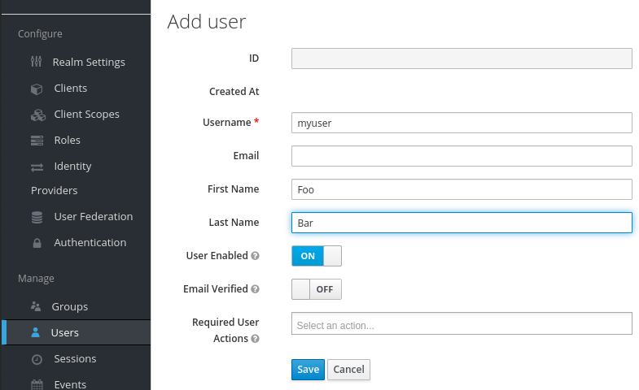


Example: Registering new application Client:
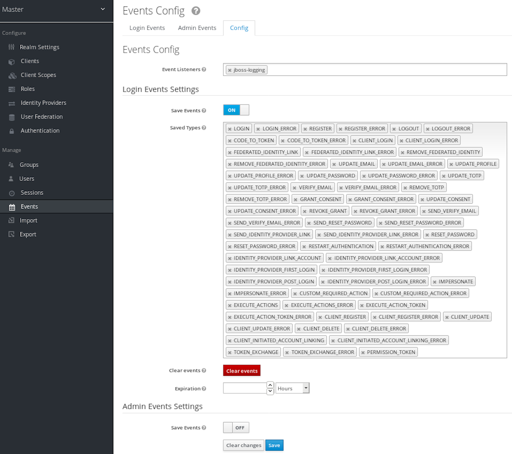


Example: Configuring audit/logging by administrator based on exposed event types:
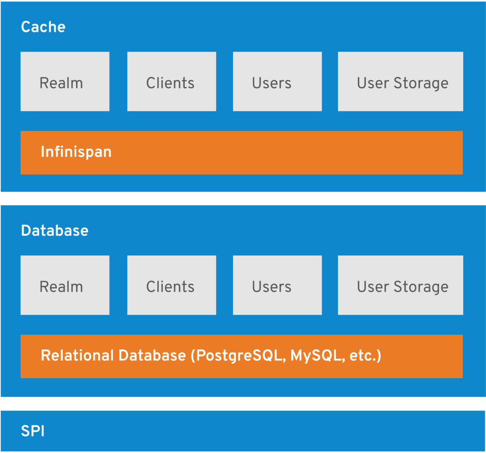


Example: User registering new Authenticator:
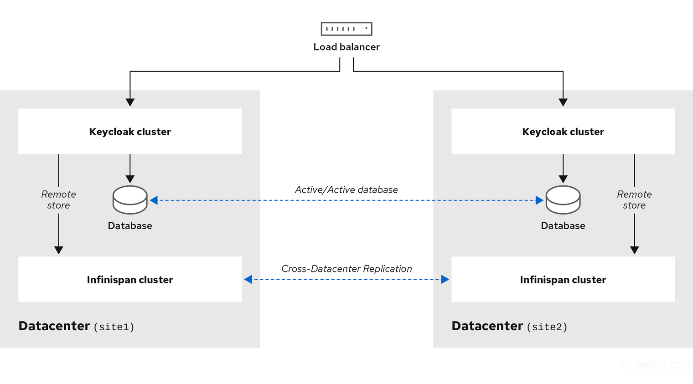


The whole UI of Keycloak is currently undergoing a complete rewrite from Angular to ReactJS incorporating new wireframes. Discussion of the UI, including all new Designs, and related community discussions are captured here:

[https://www.keycloak.org/keycloak-community/design/admin-console/#/](https://www.keycloak.org/keycloak-community/design/admin-console/#/)

For example, a new set of planned screens related to managing clients:

[https://www.keycloak.org/keycloak-community/design/admin-console/#/clients/settings](https://www.keycloak.org/keycloak-community/design/admin-console/#/clients/settings)


#### Customizations and extensions

Keycloak is built in a highly modular manner leveraging SPI for most of the internal components (more about it later in Design section).

In addition, because it provides a set of OOTB screens (login, registration, user self management, administration) it is meant to be customized to look like an integral part of a given application or system. Therefore, administrators can customize every aspect of Keycloak UI via templates and themes.

As a highly customizable solution Keycloak, provides a separate Guide on [Server Development](https://www.keycloak.org/docs/latest/server_development/), focusing on explaining mentioned themes, templates and SPIs and the means to leverage or alter them.

A few key SPIs and extension mechanisms worth mentioning cover:
*   Authentication - allowing to highly alter authentication flow
    *   IdentityBrokering (federation of identities from external authentication sources - eg. SAML/OIDC IdPs)
    *   Required Actions - defining different actions users are meant to perform during authentication
    *   Modifying / Extending Registration flow
    *   Modifying Forgot Password / Credential flow
    *   Authentication of clients
*   Action Token SPI - An action token is a special instance of JSON Web Token (JWT) that permits its bearer to perform some actions, e. g. to reset a password or validate email address. They are usually sent to users in the form of a link that points to an endpoint processing action tokens for a particular realm.
*   Event Listener SPI - allowing handling of different user, client or admin initiated operations
*   Mappers - implementing own mappers to bridge information from external stores (eg. LDAP attributes) or tokens (external SAML IdP) and mapping it to attributes or claims in Keycloak.
*   User Storage SPI - can be used to write extensions to Keycloak to connect to external user databases and credential stores.
*   Vault SPI -  to write custom extensions for Keycloak to connect to arbitrary vault implementation.

There is a list of community implemented and maintained custom extensions which are not provided OOTB within server distribution on project website:

[https://www.keycloak.org/extensions](https://www.keycloak.org/extensions)

Those custom extensions include:
*   CAS Login Protocol
*   Client Authorization
*   Discord Identity Provider
*   France Connect Identity Provider
*   Full export endpoint
*   Github SSH key mapper
*   HiOrg-Server Identity Provider
*   JSON Remote Claim Mapper
*   Japanese documentation translation
*   Keycloak Connect GraphQL
*   Keycloak Metrics SPI
*   Keycloak PassportJS Auth Strategy
*   Keycloak Python Client
*   keycloak-config-cli - Configuration as Code for Keycloak realms
*   MQTT event listener
*   WS-Federation protocol
*   privacyIDEA two factor authentication


#### Logging and auditing aspects

Keycloak exposes a comprehensive set of [system events](https://www.keycloak.org/docs/latest/server_admin/index.html#auditing-and-events) which can be tracked for audit purposes:

Login events:
*   Login - A user has logged in.
*   Register - A user has registered.
*   Logout - A user has logged out.
*   Code to Token - An application/client has exchanged a code for a token.
*   Refresh Token - An application/client has refreshed a token.

Account events:
*   Social Link - An account has been linked to a social provider.
*   Remove Social Link - A social provider has been removed from an account.
*   Update Email - The email address for an account has changed.
*   Update Profile - The profile for an account has changed.
*   Send Password Reset - A password reset email has been sent.
*   Update Password - The password for an account has changed.
*   Update TOTP - The TOTP settings for an account have changed.
*   Remove TOTP - TOTP has been removed from an account.
*   Send Verify Email - An email verification email has been sent.
*   Verify Email - The email address for an account has been verified.

For all events there is a corresponding error event.


#### Delegated Administration

Administrative users of Keycloak can be defined with a subset of management permissions. For example, allowing users to only manage application clients. A comprehensive overview is provided in in the [server admin docs permission section](https://www.keycloak.org/docs/latest/server_admin/index.html#_admin_permissions). This capability is also provided based on the [Authorization Services](https://www.keycloak.org/docs/latest/authorization_services/) part of Keycloak implemented with UMA (User Managed Access).

Available global roles:
*   admin - top level realm role
*   create-realm - allowing realm which serves as namespace for server instance

Realm specific roles:
*   view-realm
*   view-users
*   view-clients
*   view-events
*   manage-realm
*   manage-users
*   create-client
*   manage-clients
*   manage-events
*   view-identity-providers
*   manage-identity-providers
*   Impersonation

Realm admin roles:
*   view-realm
*   view-users
*   view-clients
*   view-events
*   manage-realm
*   manage-users
*   create-client
*   manage-clients
*   manage-events
*   view-identity-providers
*   manage-identity-providers
*   impersonation

Keycloak also allows applying user specific policies for given resources. Policies can be custom, based on attributes (full ABAC), or even custom implemented:


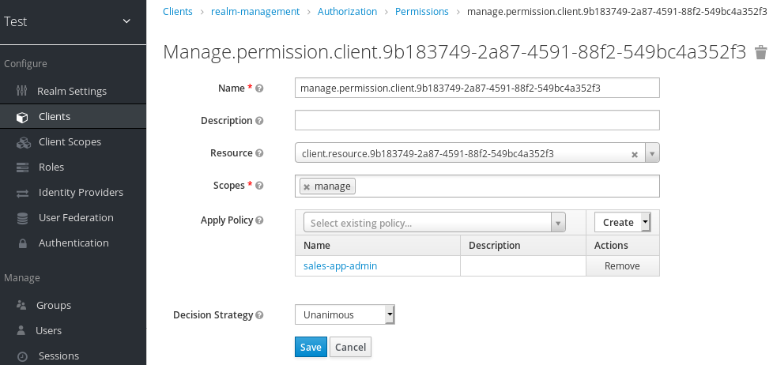


This is based on comprehensive Centralized Authorization UMA policies which can be evaluated in the UI to troubleshoot permission issues:


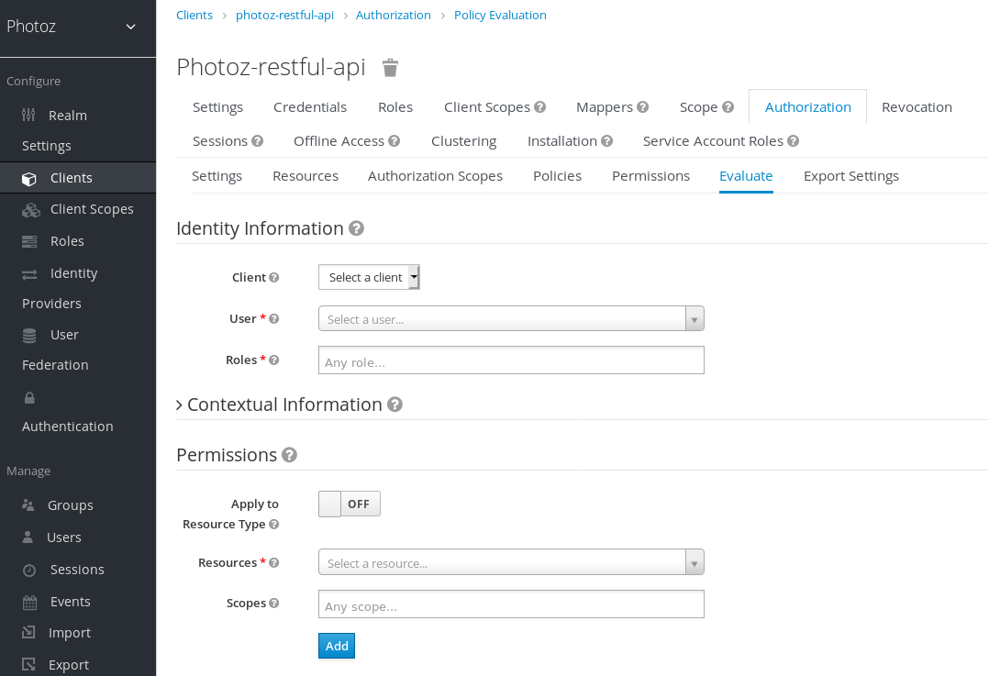


#### Highly configurable and Highly Available

Keycloak can be configured to provide High Availability in a local cluster or in multi cluster / multi site scenario and with Load Balancer integration. The [server installation doc covers this in a section for clustering](https://www.keycloak.org/docs/latest/server_installation/#_clustering)

In order to prioritize significant performance gain OOTB in Keycloak, clustering is configured in a way to not propagate user sessions between nodes by default. In the event of node failure, such that the authentication session is lost, the user is required to re-authenticate and establish a new session. This is configurable and sessions can be replicated between cluster nodes making node failure transparent and not impacting users.

Keycloak provides Multi-Cluster configuration which relies on separate Database synchronization and Cache synchronization solutions to solve the split-brain problem between clusters.


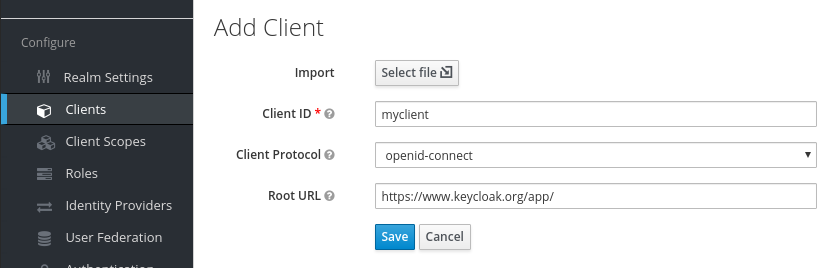


The current architecture is based on requirements of the Database and relies on invalidation of caches (more in Design section). Part of Keycloak.X's effort plan for 2020/21 is to implement a completely new storage layer, aiming to leverage etcd as OOTB storage when deployed on Kubernetes and not requiring RDBMS at all in such deployments.


##
**Project Design**


## High level architecture:

Keycloak follows a modular and layered approach. For security and scalability reasons it chose not to reimplement but reuse existing trusted runtime components. Keycloak also defaults to reuse default libraries and solutions if present in layers below.


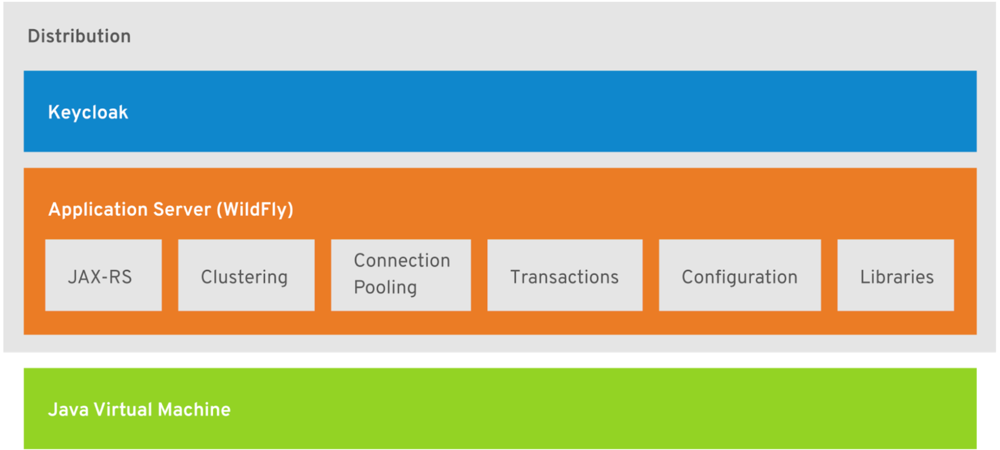


Keycloak is built on top of Java Virtual Machine as a trusted runtime environment. It is maintained by several key industry players and receives timely security fixes. As a very widely adopted solution, it is also highly scrutinized and investigated from a security perspective.

Keycloak is essentially a Java Application running within Application Server  ([WildFly](https://wildfly.org/)) which is an upstream version of widely adopted Red Hat Enterprise Application Platform (former JBoss AS). Keycloak leverages key features around clustering, REST API implementation, SSL, Data Sources, Transaction handling, etc. from Wildfly. This gives several advantages related to using proven technologies. As Keycloak relies on Crypto libraries provided by JVM and WildFly it can be made FIPS compliant by adopting relevant configuration profiles in those.

The Keycloak project is currently undergoing a complete re-architecture designed to migrate to [Quarkus.io](https://quarkus.io) as a runtime. This will allow  for natively compiled binaries (natively compiled Java) and a very small memory footprint or startup time comparable with GoLang. [This is captured](https://github.com/keycloak/keycloak-community/tree/master/design/keycloak.x) by the [Keycloak.X](https://www.keycloak.org/2019/10/keycloak-x.html) effort. With prototype server distribution being developed [here](https://github.com/keycloak/keycloak/tree/master/distribution/server-x). In the transition period, a mixed and highly optimized mode still running within VM will be possible.

All major design proposals are tracked for review and discussion in this [dedicated Github repository](https://github.com/keycloak/keycloak-community/tree/master/design).

Keycloak architecture is highly modular and pluggable. All Core parts are implemented using Service Provider Interface architecture (SPIs) having a total of 86 of them. This makes it easy to extend the server with custom plugins, and replace default implementations of core components. All key SPIs are documented in the [Server Development Guide](https://www.keycloak.org/docs/latest/server_development/index.html#_providers).

Keycloak is highly customizable. It provides several SPIs enabling the extension or alteration of server behavior according to individual needs. Any UI exposed by Keycloak can be customized with custom stylesheets, but also with custom HTML templates. This has already been described in
[Operational Aspects section](#heading=h.fvxvw696zrq8) of this document


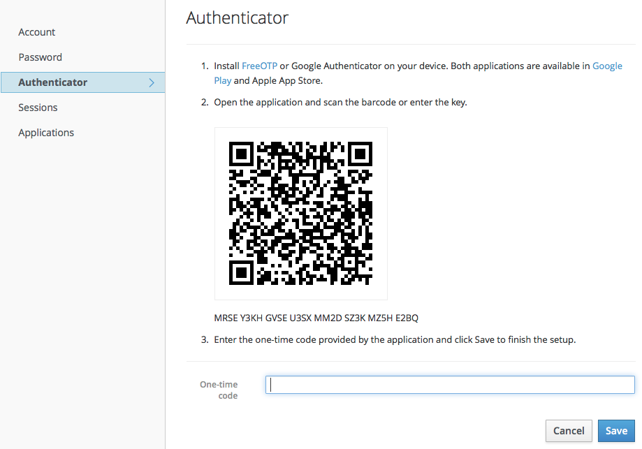


## Internal Architecture

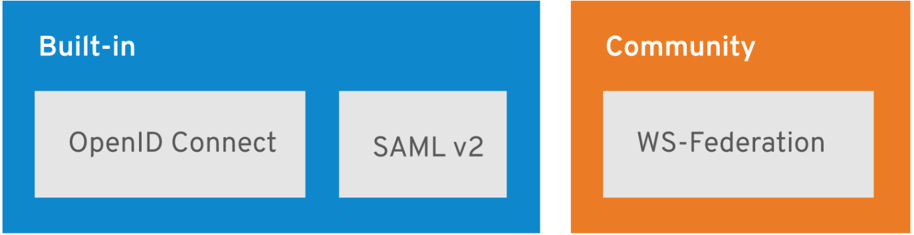


Keycloak currently requires a Relational Database to work. It comes with a simple embedded H2 Database for quick prototyping or with easy OOTB PostgreSQL integration when provisioned via container based environments. RDBMS is used to persist realm configurations and information about users, roles, clients, consents or mappings of attributes in the token. For future releases, a major redesign is planned to drop this requirement and allow greater pluggability of storage layers. By default when deployed on Kubernetes, Keycloak will attach itself to etcd as primary storage solution. Requiring additional, more scalable solutions for production deployments when storing millions of users is necessary.

The data storage layer is designed to rely heavily on invalidation of caches to minimize Database queries. This also allows for HA deployments with [clustering](https://www.keycloak.org/docs/latest/server_installation/index.html#_clustering) and [Cross Data Center](https://www.keycloak.org/docs/latest/server_installation/index.html#crossdc-mode) replication mode. All ways to interact with the server are integrated via [REST APIs documented here](https://www.keycloak.org/docs-api/7.0/rest-api/index.html). Keycloak relies on OpenID Connect to secure access to those APIs.

Keycloak supports OpenID Connect and SAML2 out of the box. There number of additional extensions kept outside of the core codebase - like [WS-Federation or CAS](html).


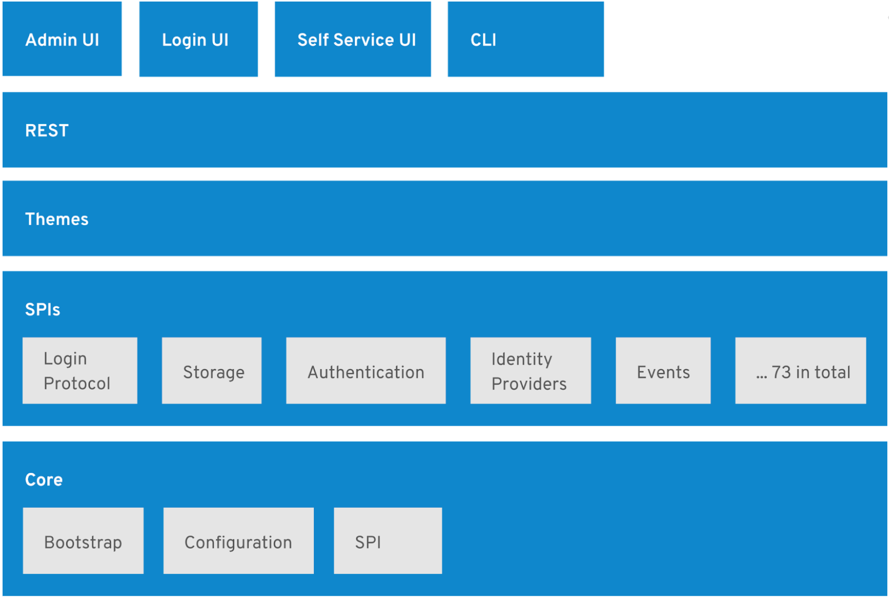


##
**Configuration and Set-Up**
*   Default/GettingStarted
    *   Aggregated information for getting started in different environments: [https://www.keycloak.org/getting-started](https://www.keycloak.org/getting-started)
    *   Keycloak Operator for Kubernetes [docs in progress]: [https://github.com/keycloak/keycloak-operator](https://github.com/keycloak/keycloak-operator)
    *   Helm Chart: [https://github.com/codecentric/helm-charts/tree/master/charts/keycloak](https://github.com/codecentric/helm-charts/tree/master/charts/keycloak)
    *   Set of Quickstart applications: [https://github.com/keycloak/keycloak-quickstarts](https://github.com/keycloak/keycloak-quickstarts)
*   Highlights:
    *   Follows a number of OOTB security best practices listed below:
        *   There is no default account/password
        *   Creating initial account is protected by being exposed only via localhost access (for UI) and via direct access to host (command line script)
        *   Security of OAuth 2.0 based protocol relies heavily on TLS and this is called out in documentation:
            *   [https://www.keycloak.org/docs/latest/server_installation/index.html#setting-up-https-ssl](https://www.keycloak.org/docs/latest/server_installation/index.html#setting-up-https-ssl)
*   Advanced/Secure setup
    *   Customizable, flexible and pluggable [Authentication flows](https://www.keycloak.org/docs/latest/server_admin/index.html#_authentication-flows)
    *   There is no explicit hardening guide although the configuration guide calls out a [number of best practices](https://www.keycloak.org/docs/latest/server_admin/index.html#threat-model-mitigation )
    *   Server comes with simple [Brute Force detection and mitigation mechanism](https://www.keycloak.org/docs/latest/server_admin/index.html#password-guess-brute-force-attacks)
    *   More Advanced Configuration: [https://www.keycloak.org/docs/latest/server_installation/index.html](https://www.keycloak.org/docs/latest/server_installation/index.html)
    *   Reference Server Administration Guide: [https://www.keycloak.org/docs/latest/server_admin/index.html](https://www.keycloak.org/docs/latest/server_admin/index.html)
    *   The below documentation covers hardening and addressing Threat Model of OAuth2 itself: [https://www.keycloak.org/docs/latest/server_admin/index.html#threat-model-mitigation](https://www.keycloak.org/docs/latest/server_admin/index.html#threat-model-mitigation)

##
**Project Compliance**

*   There was no specific audit for a given compliance standard
*   Keycloak is GDPR compatible as user information can be removed on request and purged from the database however it depends on the particular deployment and processes around it.
*   Keycloak provides audit capabilities by event logging, allowing to aggregate and record into system logger all typical admin and user level operations.
*   Keycloak doesn’t provide any additional custom crypto libraries or crypto implementations. It relies on WildFly Application Server and Java Virtual Machine which can be configured to be made FIPS compliant. All crypto providers in Keycloak are also pluggable so FIPS compliance could be achieved by using certified libraries.
*   Keycloak aims to certify against OpenID Financial API Specification Profiles. This is still a Work in Progress.
    *   [https://github.com/jsoss-tag/keycloak-fapi](https://github.com/jsoss-tag/keycloak-fapi)
    *   [https://github.com/keycloak/keycloak-community/pull/105](https://github.com/keycloak/keycloak-community/pull/105)
    *   [https://github.com/keycloak/keycloak-community/blob/master/design/client-policies.md](https://github.com/keycloak/keycloak-community/blob/master/design/client-policies.md)

##
**Security Analysis**

*   Keycloak (version 8) received an external Penetration Test during the fall of 2019 performed by Cure53 and funded by REWE Digital GmbH. [https://cure53.de/pentest-report_keycloak.pdf](https://cure53.de/pentest-report_keycloak.pdf)
    *   “In Cure53’s expert opinion, the results documented in this November 2019 report affirm that Keycloak is a mature and solid project. Even though it cannot be ruled out that some components of the application are suffering from issues similar to the ones described in the tickets - mostly because of the size and complexity of this project, Cure53 is confident about Keycloak moving forward securely. The outcomes show that the developer team at the Keycloak entities designs and proposes features with high awareness about the field of security. Summing up, with absence of serious problems and a generally limited presence of risks, the application makes a stable impression in relation to the core security aspects.”
    *   Keycloak follows a fast paced release cycle of major versions, progression between major versions (7->8->9) doesn’t typically introduce major redesigns or breaking changes. Therefore, overall and high level findings can be generalized also for Keycloak 9.
*   Keycloak has a dedicated section in Documentation for addressing the OAuth 2.0 Threat Model from IETF:
    *   [https://www.keycloak.org/docs/latest/server_admin/index.html#threat-model-mitigation](https://www.keycloak.org/docs/latest/server_admin/index.html#threat-model-mitigation)
    *   [https://tools.ietf.org/html/rfc6819](https://tools.ietf.org/html/rfc6819)
*   Attacker Motivations - Keycloak as Identity Provider / Authorization Server and Identity and Access Management solution is a critical piece of infrastructure. Compromising the Keycloak deployment would likely compromise the whole deployment by permitting a malicious actor to take over users identities, application sessions or stealing password hashes (if the backend DB is compromised as well).
*   Predisposing Conditions
    *   Existing CVEs in selected areas of JVM, WildFly Application Server or any library included in those layers or introduced by Keycloak itself, especially around networking, HTTP(s), object serialization and REST APIs (JOSE specs)
    *   Lack of SSL/HTTPS. OAuth 2.0 based flows heavily rely on exchanging tokens and information via already secured communication channels. Developers often make shortcuts during development that are deployed to production while quickly prototyping. It is essential that all related configurations is carefully verified before being introduced in production.
    *   Not following best practices around OAuth 2.0 - like not properly defined redirect URIs for registered clients or redirection URIs which exposes application to token or session hijacking attacks.
    *   Not securing the backend properly. Outside access to DB or host or etc.
    *   Not keeping configuration up to date
        *   For example keeping up with the latest guidelines around strength of hashing algorithms or number of hashing iterations
    *   Not keeping up with updates.
        *   The Keycloak container image relies on several layers of the software stack which must be kept up-to-date:  OS, JVM, WildFly Application Server, Keycloak itself.
        *   At each layer there are new weaknesses regularly identified. Most of those have no direct impact on Keycloak although they need to be assessed and fixes incorporated
            *   Ex. XML/JSON parsing libs has remote code execution weaknesses identified. With proper validation they are rarely exploitable in Keycloak although such CVEs happened.
        *   Specifications are evolving. Certain aspects of the initial OAuth2 specification are now considered insecure (to be addressed and incorporated in 2.1 version). Although certain best practices, like replacing Implicit Flow with Hybrid Flow or using PKCE, are included in Keycloak. Other examples would be updates to recommendations around hashing algorithms. Most key aspects of these changes will become the default option in Keycloak and are to be selected as part of any software update.
*   Expected Attacker Capabilities
    *   Very good understanding of OAuth 2.0 protocol family flows and capabilities
    *   Very good understanding of all typical Web Application attack vectors (CSRF, XSS, etc.)
        *   For example, the most common attack vector would be exploiting any weaknesses in input validation of Keycloak APIs if they could lead into remote code execution on the server side.
        *   Similarly, in this area there were several CVEs identified in jackson-bind components related to XML parsing. This can potentially open up the attack surface by altering SAML tokens and exploiting such CVEs.
        *   Some examples of CVEs identified in Keycloak are available in NVD
            *   [https://nvd.nist.gov/vuln/search/results?form_type=Advanced&cves=on&cpe_version=cpe%3A%2Fa%3Aredhat%3Akeycloak%3A4.3.0](https://nvd.nist.gov/vuln/search/results?form_type=Advanced&cves=on&cpe_version=cpe%3A%2Fa%3Aredhat%3Akeycloak%3A4.3.0)
            *   [https://www.cvedetails.com/product/46161/Redhat-Keycloak.html?vendor_id=25](https://www.cvedetails.com/product/46161/Redhat-Keycloak.html?vendor_id=25)
*   Attack Risks and Effects
    *   As this is an Identity Provider for Web Applications, all typical attack vectors, risk and effects would apply:
        *   [OWASP Top 10 Web Application Security Risks](https://owasp.org/www-project-top-ten/)
        *   [OWASP Top 10 API Security Risks](https://owasp.org/www-project-api-security/)
        *   Any other Web Application or API Security related best practices or key standards.
*   Security Degradation
    *   It is worth distinguishing the compromise of Keycloak itself from the compromise of applications secured with Keycloak (for example by hijacking session token). The latter doesn’t need to lead to the former while being the core goal of the attacker, the resulting compromise affects only one client or particular users while not compromising the IdP itself.
    *   Rendering server unavailable
        *   Potentially easiest attack on the server is DDOS impacting its availability.
        *   Impact
            *   End users not able to authenticate to applications
            *   Applications not being able to reach out to server for additional validation calls. At a minimum they should still be able to verify already issued tokens using the cached public key from the server and make authorization decisions based on existing included claims. Issuing new, refreshed access tokens for applications and end users won’t be possible due to the availability impact.
        *   Prevention and mitigation mechanisms
            *   Implementing proper HA deployment with Clustering or even Datacenter duplication or distribution
            *   Fronting Keycloak with proper rate limiting solutions at the Load Balancer or Firewall level
    *   Impacting server integrity and sensitive data Exposure
        *   Keycloak as an Identity Provider contains user sensitive data.
        *   Impact
            *   At different levels of granularity, gaining access to data in the server can be very impactful
            *   User access - leaking profile information and allowing to reset password and take over given user accounts. Although for user triggered password reset email validation can provide necessary mitigation
            *   Session takeover - getting access to user session can allow attacker to take over access to given application and related resources
            *   Gaining administrator access to the master realm is a potentially catastrophic event as it gives countless attack venues to exploit.
        *   Prevention and mitigation mechanisms
            *   Not leveraging the master realm administrator account. Instead  creating dedicated realms with administrator accounts containing a subset of permissions
            *   Server [Key rotation](https://www.keycloak.org/docs/latest/server_admin/#rotating-keys). Ability to introduce new server keys and invalidate old ones in case leak has been detected
            *   User session invalidation and [refresh token revocation policy ](https://www.keycloak.org/docs/latest/server_admin/#_revocation-policy)allowing to not trust refresh tokens issued earlier then given timestamp
            *   TLS preventing Man-in-the-Middle attacks
            *   MFA and W3C WebAuthentication - providing Strong Customer Authentication mechanisms for end users and Keycloak administrators.
            *   [Password Credentials hashing](https://www.keycloak.org/docs/latest/server_admin/#password-database-compromised) with pluggable SPIs to integrate third party vaults
            *   [Limiting token audience](https://www.keycloak.org/docs/latest/server_admin/#limit-token-audience) to allow potential reuse prevention of leaked application sessions.
            *   Possibility to introduce database encryption at RDBMs level
            *   [Brute force detection](https://www.keycloak.org/docs/latest/server_admin/#password-guess-brute-force-attacks) - basic mechanism preventing password guessing techniques.
            *   Keycloak follows best practices to try to not leak any indicator about which software version the given running instance is using.
*   Compensating Mechanisms
    *   This highly depends on the feature and capability. Each time a new one is designed there is a fairly long discussion with many community members to ensure particular architecture will not lead to compromising security.
        *   See number of comments in the discussion on MutiFactor and Setup Authentication design proposal: [https://github.com/keycloak/keycloak-community/pull/5](https://github.com/keycloak/keycloak-community/pull/5)
    *   There are several key risks and related mitigations listed in “[Threat Model Mitigation](https://www.keycloak.org/docs/latest/server_admin/#threat-model-mitigation)” section of the documentation. Few examples in bullets below
    *   Eg. [Password database compromised](https://www.keycloak.org/docs/latest/server_admin/#password-database-compromised)
        *   _“Keycloak does not store passwords in raw text. It stores a hash of them using the PBKDF2 algorithm. It actually uses a default of 20,000 hashing iterations! This is the security community’s recommended number of iterations. This can be a rather large performance hit on your system as PBKDF2, by design, gobbles up a significant amount of CPU. It is up to you to decide how serious you want to be to protect your password database.”_
    *   Eg. [Compromised keys](https://www.keycloak.org/docs/latest/server_admin/#compromised-keys)
        *   _“Keycloak has the signing keys stored just locally and they are never shared with the client applications, users or other entities. However if you think that your realm signing key was compromised, you should first generate new keypair as described above and then immediately remove the compromised keypair.”_
        *   _“Then to ensure that client applications won’t accept the tokens signed by the compromised key, you should update and push not-before policy for the realm, which is doable from the admin console. Pushing new policy will ensure that client applications won’t accept the existing tokens signed by the compromised key, but also the client application will be forced to download the new keypair from the Keycloak, hence the tokens signed by the compromised key won’t be valid anymore. Note that your REST and confidential clients must have set Admin URL, so that Keycloak is able to send them the request about pushed not-before policy.”_
    *   Eg. Advising regular [Key Rotation](https://www.keycloak.org/docs/latest/server_admin/#rotating-keys) and providing necessary means to handle it:
        *   _“Once new keys are available all new tokens and cookies will be signed with the new keys. When a user authenticates to an application the SSO cookie is updated with the new signature. When OpenID Connect tokens are refreshed new tokens are signed with the new keys. This means that over time all cookies and tokens will use the new keys and after a while the old keys can be removed.”_
    *   _Eg. [Compromised Access and Refresh Tokens](https://www.keycloak.org/docs/latest/server_admin/#compromised-access-and-refresh-tokens):_
        *   _“ (...) Another thing you can do to mitigate leaked access tokens is to shorten their lifespans. You can specify this within the [timeouts page](https://www.keycloak.org/docs/latest/server_admin/#_timeouts). Short lifespans (minutes) for access tokens for clients and applications to refresh their access tokens after a short amount of time. If an admin detects a leak, they can logout all user sessions to invalidate these refresh tokens or set up a revocation policy. Making sure refresh tokens always stay private to the client and are never transmitted ever is very important as well._
        *   _You can also mitigate against leaked access tokens and refresh tokens by issuing these tokens as holder-of-key tokens. See [OAuth 2.0 Mutual TLS Client Certificate Bound Access Token](https://www.keycloak.org/docs/latest/server_admin/#_mtls-client-certificate-bound-tokens) to learn how._
        *   **_If an access token or refresh token is compromised, the first thing you should do is go to the admin console and push a not-before revocation policy to all applications. This will enforce that any tokens issued prior to that date are now invalid. Pushing a new not-before policy will also ensure that an application will be forced to download new public keys from Keycloak, hence it is also useful for the case, when you think that realm signing key was compromised. More info in the [keys chapter](https://www.keycloak.org/docs/latest/server_admin/#realm_keys)._**
        *   **_You can also disable specific applications, clients, and users if you feel that any one of those entities is completely compromised.”_**
    *   _Eg. _[Compromised Authorization Code](https://www.keycloak.org/docs/latest/server_admin/#compromised-authorization-code)
        *   _“For the [OIDC Auth Code Flow](https://www.keycloak.org/docs/latest/server_admin/#_oidc-auth-flows), it would be very hard for an attacker to compromise Keycloak authorization codes. Keycloak generates a cryptographically strong random value for its authorization codes so it would be very hard to guess an access token. An authorization code can only be used once to obtain an access token. In the admin console you can specify how long an authorization code is valid for on the [timeouts page](https://www.keycloak.org/docs/latest/server_admin/#_timeouts). This value should be really short, as short as a few seconds and just long enough for the client to make the request to obtain a token from the code._
        *   _You can also mitigate against leaked authorization codes by applying PKCE to clients. See [Proof Key for Code Exchange (PKCE)](https://www.keycloak.org/docs/latest/server_admin/#_proof-key-for-code-exchange) to learn how.”_
    *   _Eg. _Authorization Services and [handling custom polices implemented in JavaScript](https://www.keycloak.org/docs/latest/authorization_services/index.html#_policy_js)
        *   _“By default, JavaScript Policies can not be uploaded to the server. You should prefer deploying your JS Policies directly to the server as described in [JavaScript Providers](https://www.keycloak.org/docs/latest/server_development/#_script_providers). If you still want to use the Keycloak Administration Console to manage your JS policies you should enable the ‘Upload Scripts’ feature.”_
        *   This is done to mitigate any issues around handling (escaping/sandboxing) custom JavaScript code for those policies within the browser (within Admin UI).
*   User impersonation
    *   Server provides ability for the administrator with a given set of permissions to [impersonate a particular user](https://www.keycloak.org/docs/latest/server_admin/#impersonation) and act on their behalf. Security of aspects of this can be configured on few different levels
    *   Impersonation can be [disabled at the server instance level](https://www.keycloak.org/docs/latest/server_installation/#profiles) as part of startup configuration with: “-Dkeycloak.profile.feature.impersonation=disabled” option. This has been introduced deliberately at this level understanding some organizations would prefer not having such powerful capability enabled at all.
    *   Impersonation can be [disabled at the realm level ](https://www.keycloak.org/docs/latest/server_admin/#_per_realm_admin_permissions)by removing the “Impersonation” role for given admin account
    *   At the auditing level there are dedicated “Impersonate” and “Impersonate_Error” events to capture such activity for audit purposes
    *   Impersonated user session[ provide details](https://www.keycloak.org/docs/latest/server_admin/#_protocol-mappers_oidc-user-session-note-mappers) on “Impersonator” - keeping track of who initiated impersonated session on behalf of given user
*   Typical configuration mistakes to avoid
    *   Man-In-the Middle - caution during server provisioning. There are means introduced to ensure that the initial administrator password is not leaked (no defaults, required to be set via localhost, leveraging scripts provided in the server to do so).
    *   Lack of TLS - which can lead to a Man-in-the-Middle attack.  TLS is required by the OAuth2 specification. Establishing TLS for the server during provisioning is a must for production deployments.
    *   Setting a weak password for admin - there is a very flexible and powerful password strength policy validation although it is not enabled by default to enforce initial one for admin account
    *   Using master realm for applications and administrator user within master realm for all provisioning and configuration purposes. This is equivalent to using or running under a “root” account in linux.
    *   Setting very long token lifespans for “convenience”. Although this reduces back and forth communication between the application and the server, it increases the risk of session takeover.
    *   Convenience. There are a number of shortcuts typically used during trials, debugging or development which if not disabled for production purposes will be a major attack vector. For example
        *   Using public clients for everything - as they don’t require client credentials.
        *   Using confidential clients for everything - as they do require credentials they shouldn’t be used with purely client side apps (like JS based UIs)
        *   Using wildcards (*) for redirect URL validation. As OAuth2 is based on HTTP redirects it is a critical part of the core security model to very strictly validate allowed URIs.
        *   Disabling or not enabling certain features like password validation, brute force attacks, event logging etc.
    *   Not updating the server and not keeping track or keeping up with CVEs.
    *   Taking password hashing iterations to extreme - either reducing or increasing too much. Making a bad tradeoff between performance and security impact.
    *   Not maintaining proper size of information in the token - possibly adding huge performance impact on memory consumption leading to the server being less prone on the availability front.
    *   Not being aware or following general security best practices like enforcing Multi Factor Authentication or certain password entropy.
    *   Not limiting the token audience and the scope of applications to prevent API misuse.
*   OAuth 2.0 and OpenID Connect area is moving ahead.
    *   [https://aaronparecki.com/2019/12/12/21/its-time-for-oauth-2-dot-1](https://aaronparecki.com/2019/12/12/21/its-time-for-oauth-2-dot-1)
    *   [https://aaronparecki.com/2020/03/11/14/oauth-2-1](https://aaronparecki.com/2020/03/11/14/oauth-2-1)
    *   Both applications and Keycloak need to be monitored and updated on an ongoing basis to follow current best practices and new additions or recommendations.

##
**Secure Development Practices**

*   Without tests and documentation, any code does not get merged.
*   PR reviews by senior maintainers and successful CI runs are required for merging. This at times leads to longer [PR merging times and  a longer review queue](https://github.com/keycloak/keycloak/pulls). With current project size and adoption in the industry it is a balancing act.
*   All key features are required to first get discussed and reviewed in community channels prior to implementation work otherwise PRs won’t get accepted.
    *   Example of public design proposal for step up and multifactor authentication improvements:  \
[https://github.com/keycloak/keycloak-community/blob/master/design/multi-factor-admin-and-step-up.md](https://github.com/keycloak/keycloak-community/blob/master/design/multi-factor-admin-and-step-up.md)
    *   Design specifications: [https://github.com/keycloak/keycloak-community/tree/master/specifications](https://github.com/keycloak/keycloak-community/tree/master/specifications)
    *   Design proposals: \
[https://github.com/keycloak/keycloak-community/tree/master/design](https://github.com/keycloak/keycloak-community/tree/master/design)
*   Project goes against NIH mindset and leverages trusted software components and libraries
    *   It leverages WildFly Application Server as a runtime and closely following latest releases to consume all new patches: [https://wildfly.org](https://wildfly.org/)
        *   This is upstream technology behind Red Hat Enterprise Application Server with high profile and high scale deployments.
    *   Whenever possible leverages community collaboration with wider scrutiny.
        *   Latest example is W3C WebAuthn work where Keycloak project teamed up with community behind WebAuthn4J project:
            *   [https://github.com/webauthn4j/webauthn4j](https://github.com/webauthn4j/webauthn4j)
*   Community communication channels
    *   [https://www.keycloak.org/community](https://www.keycloak.org/community)
*   Dedicated security issue reporting process [https://www.keycloak.org/security.html](https://www.keycloak.org/security.html)
*   Cloud Native ecosystem standardized on OAuth 2.0/OpenID Connect and JWT tokens. There is no other standard currently being utilized for those use cases. OpenID Connect Authorization Service is a critical component of any deployment in the Cloud Native space.
    *   Kubernetes embraces Keycloak for API Server security and calls out Keycloak (among other options) in it's documentation.
    *   Istio Service Mesh embraces OpenID Connect for end user authentication. In Keycloak's community survey, over 60% of claimed deployments were done in Cloud related environments (Kubernetes, OpenShift, Public Cloud, Containers) vs only around 30% were traditional ZIP distribution with JVM.
    *   Existing contributions to the project indicate this
        *   Keycloak GateKeeper which is a proxy generic OpenID Connect adapter implemented in GoLang has been created mainly to be deployed in a sidecar on Kubernetes.

##
**Security Issue Resolution**

*   Project has a publicly defined process described here: \
[https://www.keycloak.org/security.html](https://www.keycloak.org/security.html)
    *   Project lead and key maintainers subscribed.
*   Issues are being raised via dedicated mailing list with limited access by key maintainers and triaged
*   All lower severity issues are being fixed upstream and rolled into the next release. If applicable fix is being processed under embargo and issue published when release is being made.
*   For most critical issues an exception is being made with a micro release containing necessary patches.
    *   In this case patches are not visible in the public repository until after the release

##
**Roadmap**

*   Blog post with project roadmap from September 2019: [https://www.keycloak.org/2019/09/2019-roadmap.html](https://www.keycloak.org/2019/09/2019-roadmap.html)
*   Part of the roadmap is growing organically with contributions, proposals and PRs
*   From CNCF
    *   Access or funding for CI environment (currently mix of Travis for community and internal RH CI as part of RH-SSO development)
    *   By endorsing Keycloak as a CNCF project we hope to boost integrations with other Cloud Native technologies and enhance collaboration within this ecosystem.

##
**Appendix**

*   CNCF submission:
    *   [https://github.com/cncf/toc/pull/405](https://github.com/cncf/toc/pull/405)
    *   [https://github.com/cncf/toc/issues/406](https://github.com/cncf/toc/issues/406)
*   Endorsements made as part of [CNCF submission PR](https://github.com/cncf/toc/pull/405):
    *   "We at **Bosch** use Keycloak as an identity and access management system. We provide dedicated Keycloak instances internally as an SaaS offering with dozens of instances already running supporting a wide range of customer requirements. It runs in a Kubernetes environment, using CNCF technologies like Helm, Prometheus, Grafana, Loki and fluentd. We have successfully contributed features we need to Keycloak and are really happy about how our contributions are handled by the Keycloak team. We are planning to add more contributions, especially around around the Keycloak operator we plan to introduce. With the roadmap including things like Keycloak running on top of Quarkus, we think Keycloak is on the best way to become more cloud native. We would love to see it in the CNCF."
    *   “I would also love to see Keycloak as part of CNCF. We have been using Keycloak, with Redhat SSO, for three years in a large project and It has server us very well, mainly due to its extreme flexibility for integrations and customizations. Complementing my previous post, in our keycloak installation we have about **42 million users**. About 350 clients distributed in 4 realms that serve both company employees and costumers.”
    *   "We at **Zalando** (CNCF End User Supporter) are using Keycloak across some departments, with lots of extensions to support our cases. We deploy it via Kubernetes, and we see that having Keycloak joining CNCF would be a great step for the project, which could leverage being close to all the graduated systems from CNCF, receiving support and resources from the experts that manage to accomplish those graduations."
    *   "We use Keycloak in **Cisco IT**. It is the main component of the CIAM implementation we have. We chose Keycloak because of its vibrant and helpful community. Keycloak is at the heart of many IAM implementations and I think it would greatly benefit the community if Keycloak is accepted in CNCF."
    *   "**[Backbase](https://www.backbase.com/)** use Keycloak at the heart of our IAM solution for many Banks, Credit Unions and other FIs globally, and normally deploys it on Kubernetes in a cloud-based environment. The community around Keycloak is also well established, friendly, active and helpful, and we are proud to have contributed back to Keycloak. The Keycloak core team are open to contribution and have a mature process for managing this. We think Keycloak is a great fit for the CNCF and is an important and mature part of the open source IAM space."
    *   "+1 Super Supportive! We (**Government of British Columbia**) have been using KeyCloak in production for about 2years. It solved a major pain point for developers working with the various government identity providers. CNCF all the way."
    *   "We have been using Keycloak (RedHat SSO) for at least a couple of years if not longer, at **Fresenius Medical Care North America IT Group**. It's been very helpful for us to offer OAuth JWT based authentication to our applications as a facade to our legacy Access Management and Identify Management systems in the back end. I would like to see Keycload pick up more support, so that it can keep up or exceed industry leading solution."
    *   "In **Cloudtrust** ([https://github.com/cloudtrust](https://github.com/cloudtrust)), we are intensively using Keycloak as the core component of our IdP. Our identity provider is offered in SaaS mode, and hosted on a multi-site OKD / OpenShift platform, with high availability as one of the main constraints. Deploying and managing Keycloak in this context is pretty easy, and extending the features in order to cover our specific business needs is really neat. We also had to extend core features (multi-token support, SAML artifact-binding support), and the community is efficient and responsive for discussing the design, and reviewing the PR before merging it into the product. We do continue extending features, and pushing additional core features. We strongly believe that choosing Keycloak is one of the key success factors of our cloud-hosted platform."
    *   "+1 for **U.S Air Force**."
    *   **Hitachi** : "＋１We are using Keycloak in production for the financial and public sectors to secure API/microservice." "+1 Keycloak is essential to secure API/microserivce by OAuth/OIDC on cloud. Keycloak also has wide range of features to secure API, and keycloak community is very active and friendly, the community accepts proposal other than original members. FYI: Presentations about why keycloak is good to secure APIs, and community is active.
        *   [https://www.slideshare.net/ssuserbeb7c0/apidays-paris-2019-financialgrade-api-securityprofile](https://www.slideshare.net/ssuserbeb7c0/apidays-paris-2019-financialgrade-api-securityprofile)
        *   [https://www.slideshare.net/YuichiNakamura10/implementing-security-requirements-for-banking-api-system-using-open-source-software-oss](https://www.slideshare.net/YuichiNakamura10/implementing-security-requirements-for-banking-api-system-using-open-source-software-oss)"
    *   **NTT Communications** : "+1 Yes, Keycloak is very promising and deserves it. It is easy to use, well-documented, and has enough features to be used in cloud native environment."
    *   **Nomura Research Institute, Ltd**. : "We're using keycloak in cloud native environment, including k8s and so on."
*   Additional real world deployments the Keycloak team is aware of:
    *   AT&T: [https://apimarket.att.com/auth/realms/att/account](https://apimarket.att.com/auth/realms/att/account)
    *   Sonatype: [https://auth.sonatype.com/auth/](https://auth.sonatype.com/auth/)
    *   Hy-Vee: [https://accounts.hy-vee.com/auth/](https://accounts.hy-vee.com/auth/)
    *   UK Home Office: [Presentation of their use of Keycloak](https://www.youtube.com/watch?v=nuf46N5vU34)
    *   Telia: [https://developer.telia.io/](https://developer.telia.io/)
    *   Please Open It: [https://please-open.it/](https://please-open.it/)
    *   Landen: [https://cloud-iam.landen.co/](https://cloud-iam.landen.co/)
    *   Investopedia: [https://www.investopedia.com/auth/realms/investopedia/](https://www.investopedia.com/auth/realms/investopedia/)
    *   Blazemeter: [https://auth.blazemeter.com/auth/realms/blazect/](https://auth.blazemeter.com/auth/realms/blazect/)
    *   Truck Assist: [https://truckassist.com.au/auth/realms/truckassist](https://truckassist.com.au/auth/realms/truckassist)
    *   Personal Genome: [https://personalgenomes.ca/auth/realms/PGPCanada/](https://personalgenomes.ca/auth/realms/PGPCanada/)
    *   Red Hat: [https://sso.redhat.com/auth/realms/redhat-external](https://sso.redhat.com/auth/realms/redhat-external)
*   Usage of Keycloak (as RH-SSO) at Red Hat: [https://developers.redhat.com/blog/2019/02/14/red-hat-sso-high-availability-hybrid-cloud/](https://developers.redhat.com/blog/2019/02/14/red-hat-sso-high-availability-hybrid-cloud/)
*   Presentation made to CNCF TOC: [https://docs.google.com/presentation/d/1bijEpuwaaa6jR1D5PAjyW731-j6Xc1TFHJuUh_FwwK8/edit#slide=id.g4215684a04_0_0](https://docs.google.com/presentation/d/1bijEpuwaaa6jR1D5PAjyW731-j6Xc1TFHJuUh_FwwK8/edit#slide=id.g4215684a04_0_0)
*   Governance: [https://github.com/keycloak/keycloak/blob/master/GOVERNANCE.md](https://github.com/keycloak/keycloak/blob/master/GOVERNANCE.md)
*   Maintainers: [https://github.com/keycloak/keycloak/blob/master/MAINTAINERS.md](https://github.com/keycloak/keycloak/blob/master/MAINTAINERS.md)
*   List of known Adopters: [https://github.com/keycloak/keycloak/blob/master/ADOPTERS.md](https://github.com/keycloak/keycloak/blob/master/ADOPTERS.md)
*   Project is aiming to migrate off current architecture based on top of WildFly Application Server. Using Quarkus.io ([https://quarkus.io](https://quarkus.io)) project which would allow compilation of java code into native binaries. When running on JVM bringing in significant footprint and starting time reduction.
*   Project is leveraging free [Travis CI](https://github.com/keycloak/keycloak/blob/master/.travis.yml) which has several limitations in the free tier. It leverages the fact that Red Hat when productizing community sources is running a fully fledged CI and testing matrix. This is something aimed to be addressed within CNCF by getting access and funding to a proper CI environment.
*   It is productized by Red Hat into Red Hat Single Sign-On product  \
[https://access.redhat.com/products/red-hat-single-sign-on](https://access.redhat.com/products/red-hat-single-sign-on)
*   Key difference to number of other OpenSource OAuth2/OIDC providers
    *   Lightweight and self contained. Thanks to being JVM based it can run on all platforms. While many competing OpenSource solutions are tight to particular components requiring either particular distribution of Linux or at best Docker to run.
    *   Comes with UI (Admin UI, User Self Service, Authentication/Login/Registration/Consent screens). All those UIs are thin clients to REST APIs. Therefore for any operation either UI or REST API call or CLI can be used. UIs are thin clients in Angular (slowly being rewritten in ReactJS). Many competing solutions require application developers to implement those UIs.
    *   Little to no code integration. In the majority of other OpenSource solutions you need to implement your own Login/Authentication screens. In Keycloak once you register new OAuth2/OIDC/SAML2 client application you can copy paste piece of JSON and if using one of OOTB adapters (NodeJS, SpringBoot, WildFly) you are done and can enable many features by simply switching configuration in the UI. Essentially if you run it with docker you can provide a high number of typical Access Management features for your application or secure your service in a few minutes.
    *   Developer and modern token based security for microservices focused. While covering well legacy integrations (custom user store, LDAP, identity brokering from external IdPs) core focus is on easily security Applications, APIs and Services.
