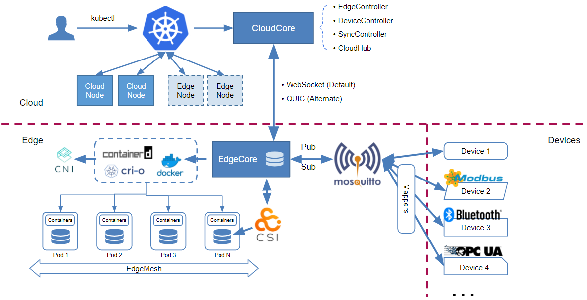

# Self-assessment

This document details the design goals and security implications of KubeEdge to
aid in the security assessment by CNCF TAG-Security.

## Table of contents

* [Metadata](#metadata)
  * [Security links](#security-links)
* [Overview](#overview)
  * [Background](#background)
  * [Goals](#goals)
  * [Non-goals](#non-goals)
* [Self-assessment use](#self-assessment-use)
* [Security functions and features](#security-functions-and-features)
* [Project compliance](#project-compliance)
* [Secure development practices](#secure-development-practices)
* [Security issue resolution](#security-issue-resolution)
* [Appendix](#appendix)

## Metadata

|                   |                                                                                                                               |
| ----------------- |-------------------------------------------------------------------------------------------------------------------------------|
| Software          | <https://github.com/kubeedge/kubeedge>                                                                                        |
| Website           | <https://kubeedge.io>                                                                                                         |
| Security Provider | No                                                                                                                            |
| Languages         | Go                                                                                                                            |
| SBOM              | Check [go.mod](https://github.com/kubeedge/kubeedge/blob/master/go.mod) for libraries, packages, versions used by the project |

### Security links

| Doc                          | url                                                                                                                                                                                                                                         |
| ---------------------------- |---------------------------------------------------------------------------------------------------------------------------------------------------------------------------------------------------------------------------------------------|
| Security file                | [SECURITY.md](https://github.com/kubeedge/kubeedge/blob/master/.github/SECURITY.md)                                                                                                                                                                 |
| Default and optional configs | [CloudCore](https://github.com/kubeedge/kubeedge/blob/master/pkg/apis/componentconfig/cloudcore/v1alpha1/default.go) and [EdgeCore](https://github.com/kubeedge/kubeedge/blob/master/pkg/apis/componentconfig/edgecore/v1alpha1/default.go) |

## Overview

KubeEdge is an open source system for extending native containerized application
orchestration capabilities to hosts at the edge. It's built upon Kubernetes and
provides fundamental infrastructure support for networking, application
deployment and metadata synchronization between cloud and edge.

Since joining CNCF, KubeEdge has attracted more
than [1000+ Contributors](https://kubeedge.devstats.cncf.io/d/18/overall-project-statistics-table?orgId=1)
from 80+ different Organizations with 3,900+ Commits; got 5,600+ Stars on Github
and 1,600+ Forks. It has been adopted by China Mobile, China Telecom, RAISECOM,
WoCloud, Xinghai IoT, KubeSphere, HUAWEI CLOUD, Harmony Cloud, DaoCloud, SAIC
Motor, SF Express, etc.

### Background

As 5G and AI technologies grow, enterprises are increasingly demanding
intelligent upgrade, and the application scenarios of edge computing are
becoming more and more extensive. It is challenging to realize unified
management and control of edge computing resources and cloud-edge synergy, such
as how to run intelligent applications and algorithms on edge devices with
limited resources(e.g. cameras and drones), how to solve the problems caused by
the access of mass heterogeneous edge devices in intelligent transportation and
intelligent energy, and how to ensure high reliability of services in off line
scenarios.

KubeEdge provides solutions for cloud-edge synergy and has been widely adopted
in industries including transportation, energy, Internet, CDN, Manufacturing,
Smart Campus, etc. KubeEdge provides:

- Seamless Cloud-Edge Communication for both metadata and data.
- Edge Autonomy: Autonomous operation of Edge even during disconnection from
  cloud.
- Low Resource Readiness: KubeEdge can work in constrained resource situations (
  low memory, low bandwidth, low compute).
- Simplified Device Communication: Easy communication between application and
  devices for IoT and IIoT.

### Goals

The main goals of KubeEdge are as follows:

- Building an open edge computing platform with cloud native technologies.
- Helping users extending their business architecture, applications, services,
  etc. from cloud to edge but ensuring same user experience.
- Implementing extensible architecture based on Kubernetes.
- Integrating with CNCF projects, including (but not limited to) Containerd,
  cri-o, Prometheus, Envoy, etc.
- Seamlessly develop, deploy, and run complex workloads at the edge with
  optimized resources.

### Non-goals

The scenarios solved by KubeEdge do not include the problems of getting through
the underlying physical network of edge nodes and ensuring the reliability
communication of cloud side network infrastructure. However, for the scenarios
where edge network is off-line, KubeEdge provides the autonomy of edge off-line
nodes.

### Project & Design

The following diagram shows the logical architecture for KubeEdge:

KubeEdge consists of below major components:

- CloudCore (in the cloud)
  - CloudHub: a websocket server responsible for watching changes at the cloud
    side, caching and sending messages to EdgeHub.
  - EdgeController: an extended Kubernetes controller which manages edge nodes
    and pods metadata so that the data can be targeted to a specific edge node.
  - DeviceController: an extended Kubernetes controller which manages devices so
    that the device metadata/status data can be synced between edge and cloud.
  - SyncController: an extended Kubernetes controller responsible for reliable
    data transmission between cloud and edge. It periodically checks meta data
    that persists on edge and cloud, and triggers reconcile if necessary.
  - DynamicController: an extended kubernetes controller based on Kubernetes
    dynamic client, which allows clients on the edge node to list/watch common
    Kubernetes resource and custom resources.
- EdgeCore (on the edge)
  - EdgeHub: a websocket client responsible for interacting with cloud services
    for edge computing (EdgeHub and CloudHub are symmetric components for
    edge-cloud communications). This includes syncing cloud resource updates to
    the edge, and reporting edge host and device status changes to the cloud.
  - MetaManager: the message processor between Edged and EdgeHub. It is also
    responsible for storing/retrieving metadata to/from a lightweight database (
    SQLite).
  - Edged: an agent that runs on edge nodes and manages containerized
    applications.
  - DeviceTwin: responsible for storing device status and syncing device status
    to the cloud. It also provides query interfaces for applications.
  - EventBus: a MQTT client to interact with MQTT servers (MOSQUITTO), offering
    pub-sub messaging capabilities to other components.
  - ServiceBus: a HTTP client to interact with HTTP servers (REST), offering
    HTTP client capabilities to components of cloud to reach HTTP servers
    running at edge.
  - MetaServer: MetaServer starts an HTTPS server with mutual TLS certs and acts
    as an edge api-server for Kubernetes operators. It proxies the Kubernetes
    resource request to the dynamic controller in the cloud.

## Self-assessment use

This self-assessment is created by the KubeEdge team to perform an internal
analysis of the project's security. It is not intended to provide a security
audit of KubeEdge, or function as an independent assessment or attestation of
KubeEdge's security health.

This document serves to provide KubeEdge users with an initial understanding of
KubeEdge's security, where to find existing security documentation, KubeEdge
plans for security, and general overview of KubeEdge security practices, both
for development of KubeEdge as well as security of KubeEdge.

This document provides the CNCF TAG-Security with an initial understanding of
KubeEdge to assist in a joint-review, necessary for projects under incubation.
Taken together, this document and the joint-review serve as a cornerstone for if
and when KubeEdge seeks graduation and is preparing for a security audit.

## Security functions and features

As described
in [KubeEdge Security Audit](https://github.com/kubeedge/community/blob/master/sig-security/sig-security-audit/KubeEdge-security-audit-2022.pdf)
under section `KubeEdge trust architecture`, we analyzed the security functions
and features thoroughly. We isolate these parts into components because they
form boundaries in the system where distinct trust relationships meet:

- CloudCore. CloudCore is connected to EdgeCore by way of EdgeHub.
- EdgeCore. The HTTP server in EdgeCore.
- MQTT broker part of EdgeCore that communicates with Devices. The MQTT broker
  part of EdgeCore accepts inputs from the Devices. Privileges flow from low to
  high in that an attacker in control of a device should not be able to cause
  adversarial affect on EdgeCore.
- Edged part EdgeCore which involves running of pods and, thus, containers.

## Project compliance

Not applicable

## Secure development practices

KubeEdge has achieved the passing level criteria
for [CII Best Practices](https://bestpractices.coreinfrastructure.org/en/projects/3018)
.

### Development Pipeline

All code is maintained in [GitHub](https://github.com/kubeedge/kubeedge) and
changes must be reviewed by maintainers and must pass all Unit Tests, e2e tests,
CI Fuzz, static checks, verifications on go fmt, go lint, go vet, vendors, and
fossa checks. Code changes are submitted via Pull Requests (PRs) and must be
signed. Commits to the `master` branch directly are not allowed.

### Communication Channels

- Internal. How do team members communicate with each other?

Team members communicate with each other frequently
through [Slack Channel](https://join.slack.com/t/kubeedge/shared_invite/enQtNjc0MTg2NTg2MTk0LWJmOTBmOGRkZWNhMTVkNGU1ZjkwNDY4MTY4YTAwNDAyMjRkMjdlMjIzYmMxODY1NGZjYzc4MWM5YmIxZjU1ZDI)
, [KubeEdge sync meeting](https://zoom.us/my/kubeedge), and team members will
open a new [issue](https://github.com/kubeedge/kubeedge/issues) to further
discuss if necessary.

- Inbound. How do users or prospective users communicate with the team?

Users or prospective users usually communicate with the team
through [Slack Channel](https://kubeedge.slack.com/archives/CDXVBS085), you can
open a new [issue](https://github.com/kubeedge/kubeedge/issues) to get further
help from the team,
and [KubeEdge mailing list](https://groups.google.com/forum/#!forum/kubeedge) is
also available. Besides, we have
regular [community meeting](https://zoom.us/my/kubeedge) (includes SIG meetings)
alternative between Europe friendly time and Pacific friendly time. All these
meetings are publicly accessible and meeting records are uploaded to YouTube.

Regular Community Meetings:

- Europe Time: **Wednesdays at 16:30-17:30 Beijing Time**
  . ([Convert to your timezone.](https://www.thetimezoneconverter.com/?t=16%3A30&tz=GMT%2B8&))
- Pacific Time: **Wednesdays at 10:00-11:00 Beijing Time**
  . ([Convert to your timezone.](https://www.thetimezoneconverter.com/?t=10%3A00&tz=GMT%2B8&))

- Outbound. How do you communicate with your users? (e.g. xxx-announce@
  mailing list)

KubeEdge communicates with users
through [Slack Channel](https://kubeedge.slack.com/archives/CUABZBD55)
, [issues](https://github.com/kubeedge/kubeedge/issues)
, [KubeEdge sync meetings](https://zoom.us/my/kubeedge)
, [KubeEdge mailing list](https://groups.google.com/forum/#!forum/kubeedge). As
for security issues, we provide the following channel:

- Security email group

  You can email
  to [kubeedge security team](mailto:cncf-kubeedge-security@lists.cncf.io) to
  report a vulnerability, and the team will disclose to the distributors through
  [distributor announcement list](mailto:cncf-kubeedge-distrib-announce@lists.cncf.io)
  . Check [here](https://github.com/kubeedge/kubeedge/security/policy) for more
  details.

### Ecosystem

KubeEdge helps users extend their business architecture, applications, services,
etc. from cloud to edge while ensuring same user experience, implements
extensible architecture based on Kubernetes and integrates with CNCF projects,
including (but not limited to) Containerd, cri-o, Prometheus, Envoy, etc.

KubeEdge also integrates project KubeSphere to align with the cloud native
ecosystem. KubeSphere is a distributed operating system for cloud-native
application management, using Kubernetes as its kernel. It provides a
plug-and-play architecture, allowing third-party applications to be seamlessly
integrated into its ecosystem.

More KubeEdge adopters are listed
in [ADOPTERS File](https://github.com/kubeedge/kubeedge/blob/master/ADOPTERS.md)
. More Vendors are listed in
section [Related Projects / Vendors](#related-projects--vendors).

## Security issue resolution

### Responsible Disclosures Process

KubeEdge project vulnerability handling related processes are recorded
in [Security Policy](https://github.com/kubeedge/kubeedge/security/policy),
Related security vulnerabilities can be reported and communicated via
email `cncf-kubeedge-security@lists.cncf.io`.

### Incident Response

See the [KubeEdge releases page](https://github.com/kubeedge/kubeedge/releases)
for information on supported versions of KubeEdge. Once the fix is confirmed,
the Security Team will patch the vulnerability in the next patch or minor
release, and backport a patch release into the latest three minor releases.

The release of low to medium severity bug fixes will include the fix details in
the patch release notes. Any public announcements sent for these fixes will be
linked to the release notes.

## Appendix

### Known Issues Over Time

For details, please see:

<https://github.com/kubeedge/kubeedge/security/advisories>

### [CII Best Practices](https://www.coreinfrastructure.org/programs/best-practices-program/)

KubeEdge has achieved an Open Source Security Foundation (OpenSSF) best
practices badge at `passing` level, see more details
at [KubeEdge's OpenSSF best practices](https://bestpractices.coreinfrastructure.org/en/projects/3018)
.

### Case Studies

KubeEdge has been widely adopted in industries including transportation, energy,
Internet, CDN, manufacturing, smart campus etc.

* Tiansuan Constellation Program is a cloud native satellite computing platform
  initiated by the Shenzhen Institute of BUPT with Spacety Co., Ltd. KubeEdge
  brings in orbit-earth collaboration for the Tiansuan-1 Satellite in the
  platform, enabling new service scenarios such as image inference, incremental
  deep learning, and federated learning.
* In China’s highway electronic toll collection (ETC) system, KubeEdge helps
  manage nearly 100,000 edge nodes and more than 500,000 edge applications in 29
  of China’s 34 provinces, municipalities, and autonomous regions. With these
  applications, the system processes more than 300 million data records daily
  and supports continuous update of ETC services on highways. Time used passing
  through toll stations is reduced from 29s to 3s for trucks, and from 15s to 2s
  for cars.
* As the the world’s longest sea crossing bridge,
  the [Hong Kong–Zhuhai–Macao bridge](https://en.wikipedia.org/wiki/Hong_Kong–Zhuhai–Macau_Bridge)
  is an open-sea fixed link that spans the LingDing and JiuZhou channels,
  stretching for 55 km. KubeEdge helps manage the edge nodes deployed on the
  bridge that collect up to 14 different types of sensor data, including light
  intensity, carbon dioxide, atmospheric pressure, noise, temperature, humidity,
  PM 2.5 (fine particulate matter), PM 10 (particulate matter), rain and snow,
  acceleration, angular velocity, Euler angle, magnetic field, and sound. In
  addition, KubeEdge enables business apps, as well as device mapper and AI
  interference programs, to be deployed at the edge. See more
  details [here](https://www.altoros.com/blog/kubeedge-monitoring-edge-devices-at-the-worlds-longest-sea-bridge/)
  .
* In the corporation with the Shanghai automotive industry, on the
  next-generation car-cloud collaborative architecture, SAIC MAXUS full-size
  luxury, smart, pure electric MPV MIFA 9 has become the first ever vehicle with
  KubeEdge Inside. Based on the capabilities provided by KubeEdge, such as
  light-weighted architecture, optimized for unstable cloud-edge network at
  scale, simplified heterogeneous IoT device management, edge autonomy in the
  case of disconnection, the platform can manage 100,000 + nodes and millions of
  edge devices. 200,000 new vehicles per year are now installed with KubeEdge.
* e-Cloud of China Telecom uses KubeEdge to manage CDN edge nodes, automatically
  deploy and upgrade CDN edge services, and implement edge service disaster
  recovery (DR) when they migrates their CDN services to the cloud. See more
  details [here](https://www.cncf.io/blog/2022/03/18/e-cloud-large-scale-cdn-using-kubeedge)
  .
* China Mobile On-line Marketing Service Center, a secondary organ of the China
  Mobile Communications Group, which holds the world’s largest call center with
  44,000 agents, 900 million users, and 53 customer service centers, builds a
  cloud-edge synergy architecture consisting of two centers and multiple edges
  based on KubeEdge. See more
  details [here](https://www.cncf.io/blog/2021/08/16/china-mobile-kubeedge-based-customer-service-platform-featuring-edge-cloud-synergy)
  .
* Xinghai IoT is an IoT company that provides comprehensive smart building
  solutions by leveraging a construction IoT platform, intelligent hardware, and
  AI. Xinghai IoT built a smart campus with cloud-edge-device synergy based on
  KubeEdge and its own Xinghai IoT cloud platform, greatly improving the
  efficiency of campus management. With AI assistance, nearly 30% of the
  repetitive work is automated. In the future, Xinghai IoT will continue to
  collaborate with KubeEdge to launch KubeEdge-based smart campus solutions.
* [SF Express](https://www.sf-express.com/), the largest integrated logistics
  service provider in China and the fourth largest in the world, has completely
  transformed their supply chains. Based on KubeEdge, SF Express smart supply
  chain system realizes edge-cloud synergy, edge data collection, real-time edge
  data processing, massive IoT device management, and creates a more stable,
  secure, and reliable edge industrial IoT system.

### Related Projects / Vendors

#### Related Projects

As the CNCF's first Cloud Native Edge Computing incubating project (announced in
2020), KubeEdge continues to focus on extending cloud native capabilities to the
edge. At the same time, KubeEdge can also be integrated with other CNCF projects
to enrich cloud native ecosystem.

As there are many related cloud native edge projects, this article will narrow
down to the following CNCF edge projects. **Akri** is an open source project
that exposes leaf devices as resources in a Kubernetes cluster. It leverages and
extends the
Kubernetes [device plugin framework](https://kubernetes.io/docs/concepts/extend-kubernetes/compute-storage-net/device-plugins/)
, which was created with the cloud in mind and focuses on advertising static
resources such as GPUs and other system hardware. Akri took this framework and
applied it to the edge, where there is a diverse set of leaf devices with unique
communication protocols and intermittent availability.

**K3s** is a CNCF sandbox project that delivers a lightweight certified
Kubernetes distribution and can be run at the edge. A K3s user can manipulate
Kubernetes resources by calling the K3s API on the server node. A server node is
defined as a machine (bare-metal or virtual) running the `k3s server` command. A
worker node is defined as a machine running the `k3s agent` command. Agent nodes
are registered with a websocket connection initiated by the `k3s agent` process,
and the connection is maintained by a client-side load balancer running as part
of the agent process.

**OpenYurt** and **SuperEdge** also provide cloud native capabilities in the
edge computing area and overlap with the KubeEdge project.

On the edge side, KubeEdge can manage kinds of applications by adapting to
runtimes listed as follows.

As KubeEdge adapts to the Container Runtime Interface (CRI), KubeEdge can be
integrated easily with runtimes like **
Containerd**, **CRI-O**, etc. In the FaaS (Function as a Service) area, **
OpenFunction** can be integrated to provide capabilities that let you focus on
your business logic without having to maintain the underlying runtime
environment and infrastructure. You can generate event-driven and dynamically
scaling serverless workloads by simply submitting business-related source code
in the form of functions.

As WebAssembly is increasingly used in Edge Computing scenarios where it is
difficult to deploy Linux containers or when the application performance is
vital, KubeEdge provides a lightweight alternative to Linux containers in edge
native environments by integrating with **WasmEdge**. WasmEdge is a lightweight,
high-performance, and extensible WebAssembly runtime for cloud native, edge, and
decentralized applications. It powers serverless apps, embedded functions,
microservices, smart contracts, and IoT devices.

For the images registry infrastructure, KubeEdge can work with **Harbor** to
manage images efficiently. Harbor is an open source trusted cloud native
registry project that stores, signs, and scans content. Harbor extends the open
source Docker Distribution by adding the functionalities usually required by
users such as security, identity and management. Having a registry closer to the
build and run environment can improve the image transfer efficiency.

#### Vendors and products

The KubeEdge project is also working with many other vendors to integrate
KubeEdge into their solutions to enrich the Cloud Native Edge Computing
ecosystem.

EdgeStack, an intelligent edge computing platform of HarmonyCloud, builds a
edge-cloud synergy system through the integration with KubeEdge, which can
support access of millions of edge nodes and devices. It is designed for
large-scale, massive access, low bandwidth, low latency, high performance, and
high stability of edge computing. At present, it has landed in communications,
transportation, finance, and many other fields.

The DaoCloud Edge Computing platform uses KubeEdge to manage edge applications.
With cloud-edge synergy, this platform responds to edge application requests in
real time, and constantly monitors node, device, and application status. The
cloud is responsible for edge node registration, management, and application and
configuration delivery. At the edge runs edge applications to which edge
autonomy is available. For devices, multi-protocol access is supported and
standard APIs are provided to connect to devices.

Based on KubeEdge, Intelligent EdgeFabric (IEF) of Huawei Cloud embeds cloud
native into edge computing, supporting ultimate lightweight deployments, edge
intelligence, and powerful computing power. It has been widely used in smart
campus, industrial quality inspection, mining, and smart transportation where
the collaboration between edge and cloud yields brilliant results.

QingCloud KubeSphere Enterprise Container Platform (QKCP), is an enterprise
container management platform from KubeSphere open source community. Based on
KubeEdge, applications and workloads are uniformly distributed and managed on
the cloud and edge nodes, meeting the needs for application delivery, O&M, and
management on a large number of edge and device devices.

EMQ is a software provider of open-source IoT data infrastructure. As the core
product of EMQ, EMQX is a reliable open-source MQTT messaging platform, supports
100M concurrent IoT device connections per cluster while maintaining 1M message
per second throughput and sub-millisecond latency, uses KubeEdge in edge side to
manage middle-ware deployments.

As a distributed cloud, Inspur Cloud can provide users with cloud products and
service capabilities, and extend cloud native capabilities to the edge based on
KubeEdge.

Click2Cloud is a provider of cloud-based products and services. It offers
managed cloud to optimize, manage, and enhance cloud efficiency. In the edge
computing area, KubeEdge helps Click2Cloud provide users with more edge
computing solutions.

Inovex is able to better fulfill the vision of transforming the potentials
provided by digitization into excellent solutions by integrating KubeEdge.
