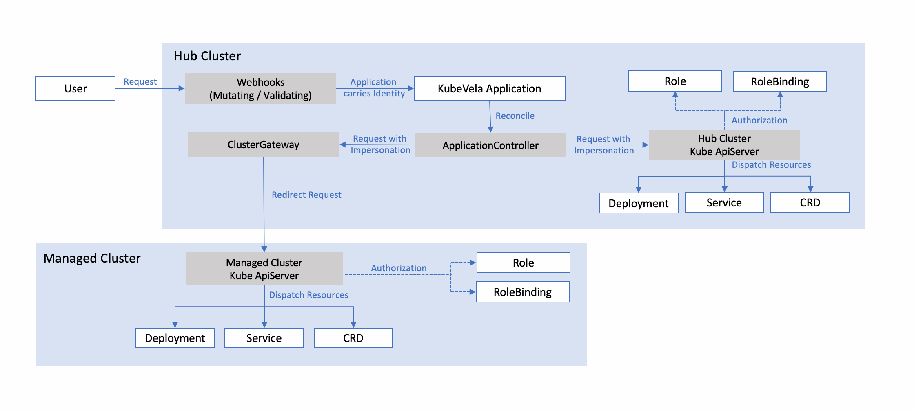

# KubeVela security self-assessment

This document elaborates and explores the design goals for KubeVela as well as
it’s security analysis to aid in the security assessment by the CNCF.

## Table of contents

- [KubeVela security self-assessment](#kubevela-security-self-assessment)
  - [Table of contents](#table-of-contents)
  - [Metadata](#metadata)
    - [Security links](#security-links)
  - [Overview](#overview)
    - [Background](#background)
    - [Goal](#goal)
    - [Non-goals](#non-goals)
    - [Project \& Design](#project--design)
      - [Webhook](#webhook)
      - [Application Controller](#application-controller)
      - [Cluster Gateway](#cluster-gateway)
  - [Self-assessment use](#self-assessment-use)
  - [Security functions and features](#security-functions-and-features)
    - [Security Relevant](#security-relevant)
  - [Project compliance](#project-compliance)
  - [Secure development practices](#secure-development-practices)
    - [Development Pipeline](#development-pipeline)
    - [Communication Channels](#communication-channels)
    - [Ecosystem](#ecosystem)
  - [Security issue resolution](#security-issue-resolution)
    - [Responsible Disclosures Process](#responsible-disclosures-process)
    - [Incident Response](#incident-response)
  - [Appendix](#appendix)
    - [Known Issues Over Time](#known-issues-over-time)
    - [CII Best Practices](#cii-best-practices)
    - [Case Studies](#case-studies)
    - [Related Projects / Vendors](#related-projects--vendors)
      - [Related Projects](#related-projects)
      - [Vendors and products](#vendors-and-products)

## Metadata

|                   |                                                                                                                                                                                                                                                                                                                               |
| ----------------- | ----------------------------------------------------------------------------------------------------------------------------------------------------------------------------------------------------------------------------------------------------------------------------------------------------------------------------- |
| Software          | [https://github.com/kubevela/kubevela](https://github.com/kubevela/kubevela)                                                                                                                                                                                                                                                  |
| Security Provider | No                                                                                                                                                                                                                                                                                                                            |
| Languages         | Go, CUE                                                                                                                                                                                                                                                                                                                       |
| SBOM              | Checkout the [go.mod](https://github.com/kubevela/kubevela/blob/master/go.mod) for libraries, packages, versions used by the project.   Check out the [assets](https://github.com/kubevela/kubevela/releases) for vela CLI.   Check out the [OSS Bucket](https://addons.kubevela.net/index.yaml) for extension catalog. |
|                   |                                                                                                                                                                                                                                                                                                                               |

### Security links

| Doc                          | url                                                                                                                                                                  |
| ---------------------------- | -------------------------------------------------------------------------------------------------------------------------------------------------------------------- |
| Security file                | [https://github.com/kubevela/kubevela/blob/master/SECURITY.md](https://github.com/kubevela/kubevela/blob/master/SECURITY.md)                                         |
| Default and optional configs | [https://github.com/kubevela/kubevela/blob/master/cmd/core/app/options/options.go](https://github.com/kubevela/kubevela/blob/master/cmd/core/app/options/options.go) |

## Overview

KubeVela is a modern application delivery platform that makes deploying and operating applications across today's hybrid, multi-cloud environments easier, faster and more reliable.

### Background

Technology wise, KubeVela is an application delivery engine built with Kubernetes control plane. KubeVela can orchestrate, deploy, and operate application components and cloud resources with a workflow based application delivery model and technology.

For user scenarios, KubeVela is designed to manage applications with multiple target Kubernetes clusters and hybrid-cloud environments as first-class citizens. In the community, we observed most users are adopting KubeVela as their internal “PaaS”, or as part of their CI/CD pipeline, or as an extensible DevOps kernel for building their own IDP. 

The application delivery abstraction of KubeVela is powered by [Open Application Model](https://oam.dev/)(OAM). Specifically, KubeVela implements the model with CUElang and executes the model in the control plane cluster to perform abstraction rendering, packaging and templating, workflow orchestration, and deployment actions. Specifically, the deployment stage can be “direct apply” or “GitOps pull”. The cloud resources management capability in KubeVela is enabled by the Terraform plugin.

### Goal

- Enable simple and robust application delivery across hybrid environments including Kubernetes, cloud, or even IoT devices. This also enables the community to have a vendor agnostic application platform.
- Provide a modular, extensible, and portable control plane for building IDP (Internal Developer Platform) with developer friendly, app delivery focused, yet consistent APIs. This app delivery control plane can adapt to any existing infrastructure or extend with modular and reusable building blocks per users’ needs.
- Build an open, inclusive, and vibrant OSS developer community focused on solving real-world application delivery and operation problems, sharing the reusable building blocks and best practices.

### Non-goals

KubeVela is a extensible control plane for application delivery and management, it leverages the underlying workloads such as Kubernetes Deployment or any custom resources to manage the infrastructure. As a result, KubeVela will not cover the security of the underlying workloads and infrastructure.

### Project & Design

The following diagram shows the logical architecture for KubeVela:

 

#### Webhook

The Webhook component registers as a validating and mutating admission webhook and receives requests from the API server to validate and mutate Application changes. If the users request the API server with user information, the mutating webhook will carry the identity with the Application for authentication.

#### Application Controller

The Application Controller watches Applications and creates, updates, and deletes Kubernetes resources based on KubeVela Application. The Application Controller requests the Kube APIServer with impersonation, so that the APIServer authorizes the identity carried by the Application with Role and RoleBinding, and then dispatch the resources with the right permissions.

#### Cluster Gateway

If the Application tries to dispatch resources in multiple clusters, the Application Controller will request Cluster Gateway with impersonation. The Cluster Gateway will then redirect the request to the managed clusters, so that the permissions will be verified in the managed cluster.

## Self-assessment use

This self-assessment is created by the KubeVela team to perform an internal analysis of the
project's security.  It is not intended to provide a security audit of KubeVela, or
function as an independent assessment or attestation of KubeVela's security health.

This document serves to provide KubeVela users with an initial understanding of
KubeVela's security, where to find existing security documentation, KubeVela plans for
security, and general overview of KubeVela security practices, both for development of
KubeVela as well as security of KubeVela.

This document provides the CNCF TAG-Security with an initial understanding of KubeVela
to assist in a joint-review, necessary for projects under incubation.  Taken
together, this document and the joint-review serve as a cornerstone for if and when
KubeVela seeks graduation and is preparing for a security audit.

## Security functions and features

To make sure KubeVela can provide secure delivery capability, there are a series of architecture design adopted. These designs are especially useful for KubeVela users who needs multi-tenancy or strict restrictions to the privileges.

1. **The KubeVela core controller uses [native Kubernetes RBAC and impersonation mechanism](https://kubevela.net/docs/platform-engineers/auth/advance) to enforce user identity on applications**, leveraging the mutating webhook. It means the delivery process of each KubeVela application will use the identity of its belonging user, instead of the core controller itself. This will help prevent tenants from accessing other resources or namespaces that they do not have access to. This feature can be enabled through switching on the feature gate `AuthenticateApplication`.

2. KubeVela supports ClientIdentityPenetration in cluster-gateway, which **keeps the delivery identity consistent across multiple clusters** by passing the identity from the hub cluster request to managed cluster requests. It can be treated as an extension for the native single cluster RBAC in Kubernetes. To facilitate the management of user privileges across clusters, in VelaCLI we also provide commands like `vela auth list-privileges` or `vela auth grant-privileges` which supports viewing or editing privileges in multiple clusters concurrently within a single command. In addition to that, passing identity from hub cluster to managed clusters could lead to potential leak for the identity information when the hub and the managed clusters are not mutually trustful, for example in the edge computing cases. To tackle this issue, we provide flags including `—authentication-with-user`, `—authentication-default-user`, `—authentication-group-pattern` to configure which identity information should be passed or filtered.

3. In the cases where the delivery process needs to have extremely strong restriction for the privileges, **KubeVela also gives optional choices for the restriction of delivery behaviors**. The `—allow-cross-namespace-resource` can be used to forbidden cross namespace delivery and restrict the resources managed by the application to live within the same namespace as itself. The `—allow-resource-types` flag supports only allow particular types of resources to be delivered. `—ref-objects-available-scope` and `DisableReferObjectsFromURL` can be used to limit the source of referred objects, like forbidden to load resources from url dynamically.

Apart from the above efforts, KubeVela is still evolving itself to make fit for more challenging environments. We are planning to [adopt policy management tools](https://github.com/kubevela/kubevela/issues/4155) like OPA or Kyverno to allow users making customized rules. In cluster-gateway, we have proposed to [enhance the ClientIdentityPenetration to ClientIdentityExchanger](https://github.com/oam-dev/cluster-gateway/issues/120) which allows the consistency of multi-cluster identity can be reached by more advanced settings. In the use cases of KubeVela workflow, we are also integrating image scanning projects to provide best practices on building, securing and delivering container images.

### Security Relevant

- Every parameter in the KubeVela Application will be checked with the pre-defined definitions to make sure the security of the inputs.

## Project compliance

Not applicable.

## Secure development practices

### Development Pipeline

All code is maintained in [GitHub](https://github.com/kubevela/kubevela), changes must be reviewed by reviewers and merged by maintainers. Before merged, all the changes must pass static checks, license checks, verifications on gofmt and cuefmt, go lint, go vet, and pass all unit tests, e2e tests and scanned by Trivy. Code changes are submitted via Pull Requests (PRs) and must be signed. Commits to the master branch directly are not allowed.

### Communication Channels

- Internal. How do team members communicate with each other?

Team members communicate with each other through [CNCF Slack kubevela channel](https://cloud-native.slack.com/archives/C01BLQ3HTJA) and discuss in the [issues](https://github.com/kubevela/kubevela/issues) or [discussions](https://github.com/kubevela/kubevela/discussions) if need.

- Inbound. How do users or prospective users communicate with the team?

Users or prospective users usually communicate with the team through [CNCF Slack kubevela channel](https://cloud-native.slack.com/archives/C01BLQ3HTJA). Users can open [issues](https://github.com/kubevela/kubevela/issues) or [discussions](https://github.com/kubevela/kubevela/discussions) to get further help from the team. To accomodate different timezones and languages, KubeVela team also schedule [community calls](https://github.com/kubevela/community#community-meetings) every two weeks at different times zone and use English and Chinese languages one by one. All these meetings are publicly accessible and meeting records are uploaded to YouTube and Bilibili.
Regular Community Meetings:

| Tuesday 19:00 PM China Standard Time (CST) - [See it in your local time](https://www.timeanddate.com/worldclock/fixedtime.html?iso=20221227T04&p1=234) |
| ------------------------------------------------------------------------------------------------------------------------------------------------------ |
| Tuesday 07:30 AM Pacific Time (PST) - [See it in your local time](https://www.timeanddate.com/worldclock/fixedtime.html?iso=20221220T0730&p1=234)      |

- Outbound. How do you communicate with your users? (e.g. flibble-announce@
mailing list)

KubeVela communicates with users through [CNCF Slack kubevela channel](https://cloud-native.slack.com/archives/C01BLQ3HTJA), [issues](https://github.com/kubevela/kubevela/issues) and [community calls](https://github.com/kubevela/community#community-meetings). As for security issues, you can email [security@mail.kubevela.io](mailto:security@mail.kubevela.io).

### Ecosystem

KubeVela is focused on enabling developers to deliver and manage microservice applications on today’s hybrid cloud and multi-clusters environments in a resilient, portable and scalable approach. It allows developers to focus on application itself, not solving the complex Infrastructure challenges needed for microservice architectures, thereby making them more productive. KubeVela utilizes and brings together many CNCF technologies like:

- [Kubernetes](https://kubernetes.io/), KubeVela leverages Kubernetes and it’s API as the control plane.
- [Helm](https://github.com/helm/helm) used to deploy KubeVela's control plane to Kubernetes.
- [FluxCD](https://github.com/fluxcd/flux2) and [ArgoCD](https://github.com/argoproj/argo-cd) used to deploy Helm charts or perform GitOps style deployment stages; they're add-on options for end users. 
- [DEX](https://github.com/dexidp/dex) for identity service and connecting to different user systems such as LDAP.
- [Open Cluster Management](https://github.com/open-cluster-management-io/OCM) for multi-cluster management and resources delivery.
- [OpenKruise](https://github.com/openkruise) for enhanced workload management and rollout.
- [Crossplane](https://github.com/crossplane/crossplane) as an alternative cloud resource provision add-on besides Terraform.
- [Prometheus](https://github.com/prometheus) to collect and analyze both system and user level metrics.
- [Cert-Manager](https://github.com/cert-manager/cert-manager) used for certificating applications as well as KubeVela itself.
- [K3s](https://github.com/k3s-io/k3s) used to provide a lightweight KubeVela control plane for local development.
- [KEDA](https://keda.sh/) used to provide auto-scaling features for different workloads.

## Security issue resolution

### Responsible Disclosures Process

KubeVela project vulnerability handling related processes are recorded in [Security Doc](https://github.com/kubevela/kubevela/blob/master/SECURITY.md), related security vulnerabilities can be reported and communicated via email [security@mail.kubevela.io](mailto:security@mail.kubevela.io).

### Incident Response

See the [KubeVela Releases](https://github.com/kubevela/kubevela/releases) for information on supported versions. Once the fix is confirmed, the security group will patch the vulnerability in the next patch or minor release, and backport a patch release into the latest minor releases, in which the fix details will be included.

## Appendix

### Known Issues Over Time

Please refer to [KubeVela Security Advisories](https://github.com/kubevela/kubevela/security/advisories) for more details.

### [CII Best Practices](https://www.coreinfrastructure.org/programs/best-practices-program/)

KubeVela has achieved an Open Source Security Foundation (OpenSSF) best practices badge at passing level, see more details at [KubeVela's openssf best practices](https://bestpractices.coreinfrastructure.org/en/projects/4602).

### Case Studies

- [Alibaba](https://www.alibaba.com/): Using KubeVela as the core to deliver and manage applications across hybrid, multi-cluster environments.
- [China Merchants Bank](http://www.cmbchina.com/): Using KubeVela to build a hybrid cloud application platform to unify the whole process from build, ship and run.
- [Li Auto Inc](https://ir.lixiang.com/): Using KubeVela to build a united resource delivery platform and cloud native application platform for their internal developer platform.
- [4Paradigm](https://www.4paradigm.com/): Using KubeVela to build a machine learning platform for AIOps.
- [Bytedance](https://www.bytedance.com/): Using OAM/KubeVela and Crossplane to provide advance Gaming PaaS abilities.
- [Springer Nature](https://www.springernature.com/): Using KubeVela to build a CloudFoundry style PaaS for internal usage.
- [YOUZAN](https://www.youzan.com/): Using KubeVela to build Cloud Native application management platform with rollout and multi-cluster capability.
- [XPeng Motors](https://heyxpeng.com/): Using KubeVela to build Cloud Native application platform for their internal developer platform.

### Related Projects / Vendors

#### Related Projects

KubeVela is an application-centric control plane to deploy and operate modern applications across hybrid-cloud and multi-clusters. Similar projects include;

- [Waypoint](https://github.com/hashicorp/waypoint) is an application-centric platform by Hashicorp that has similarities to KubeVela in terms of application delivery process. Though a significant difference is that KubeVela provides IaC based extensibility which is more lightweight than Waypoint’s extension mechanism. Another big difference is KubeVela’s deployment model is workflow based and composed of pluggable components and steps in a K8s resource YAML, while Waypoint’s model is non-workflow based and HCL specific.
- [Dagger](https://dagger.io/) is a portable kit for CI/CD pipelines that has similar application delivery model and extensibility capabilities with KubeVela. The difference is that KubeVela focuses on CD stage only and has no opinion on the user's choice of CI platform, while Dagger is designed as a higher level abstraction for both CI and CD process.

More comparisons and frequently asked questions can be found [here](https://kubevela.io/docs/#kubevela-vs-other-software).

#### Vendors and products

- [Alibaba Cloud Distributed Cloud Container Platform (ACK One)](https://www.alibabacloud.com/product/ack-one) is a cloud-native platform based on KubeVela. It is developed for enterprises that require hybrid cloud environments, multi-cluster management, and distributed computing. KubeVela helps ACK One to manage Kubernetes clusters deployed in different regions and maintain computing resources in a centralized manner.
- [Serverless Application Engine (SAE)](https://www.aliyun.com/product/sae) is a fully managed, O&M-free, and highly elastic PaaS platform. SAE uses KubeVela to help its users with application delivery. KubeVela orchestrates the capabilities in SAE so that it provides enhanced capabilities for the users.
- [Harmony Cloud](https://harmonycloud.cn/) uses KubeVela to build application model. With KubeVela, it can help the HarmonyCloud PaaS product (HC-PaaS) achieve the standardization of the system environment, automate basic resource management, application release and operation, standardize the delivery process, and decouple applications and operating environments.
- [Napptive Cloud](https://napptive.com/) uses KubeVela to offer a cloud native application platform focused on providing a simplified method to operate on Kubernetes clusters and deploy complex applications without needing to work with low-level Kubernetes entities. 
