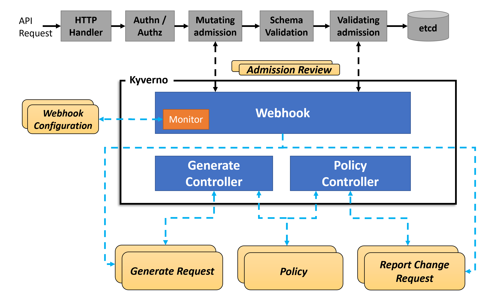
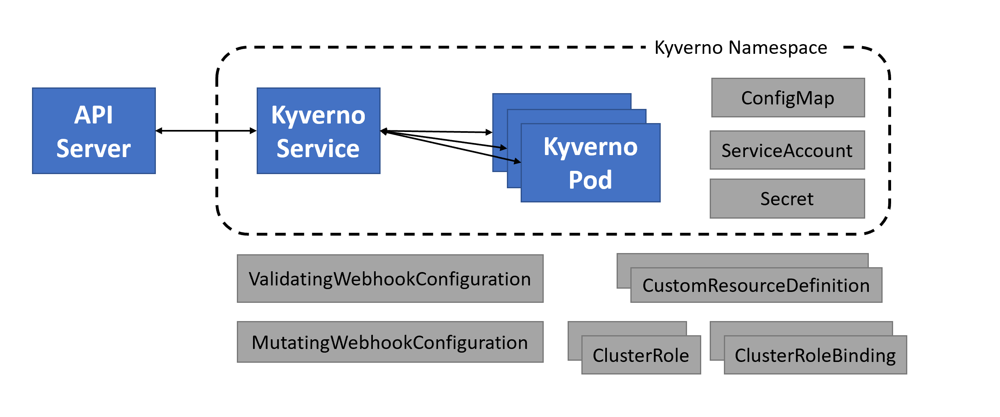

# CNCF TAG-Security Kyverno Security Self Assessment

**Completed**: *tbd*

**Security reviewers**: *tbd*

**Project security lead**: Jim Bugwadia

**Source code**: https://github.com/kyverno/kyverno

**Web site**: https://kyverno.io/


# Table of contents

* [Metadata](#metadata)
  * [Security links](#security-links)
* [Overview](#overview)
  * [Background](#background)
  * [Goals](#goals)
  * [Non-goals](#non-goals)
* [Self-assessment use](#self-assessment-use)
* [Security functions and features](#security-functions-and-features)
* [Project compliance](#project-compliance)
* [Secure development practices](#secure-development-practices)
* [Security issue resolution](#security-issue-resolution)
* [Appendix](#appendix)


### Security links

Provide the list of links to existing security documentation for the project. You may
use the table below as an example:
| Doc | url |
| -- | -- |
| Default and optional configs | https://kyverno.io/docs/installation/#configuring-kyverno |


## Overview

Kyverno secures and automates Kubernetes configurations using declarative policies defined as Kubernetes resources.

### Background

Kubernetes has a powerful declarative configuration management system that allows users to specify the desired state of resources that Kubernetes controllers reconcile with the current state. For flexibility and to address a wide set of use cases, Kubernetes provides several configuration options for each resource. This creates a few challenges for users:
1. Only a small subset of configuration options are commonly used. 
2. Kubernetes is not secure by default, and security best practices need to be configured for workloads.
3. Chances of misconfigurations, or lack of proper configuration, increase as its not clear whether developers or operators are responsible for other `advanced` settings.

### Goal

The goal of the Kyverno project is to simplify Kubernetes configuration security and automate configuration processes that otherwise require manual handoffs and coordination across Kubernetes cluster operators and developers.

### Non-goals

Kyverno is not a general purpose policy engine, but is designed for Kubernetes.

## Self-assessment use

This self-assessment is created by the Kyverno team to perform an internal analysis of the
project's security.  It is not intended to provide a security audit of Kyverno, or
function as an independent assessment or attestation of Kyverno's security health.

This document serves to provide Kyverno users with an initial understanding of
Kyverno's security, where to find existing security documentation, Kyverno plans for
security, and general overview of Kyverno security practices, both for development of
Kyverno as well as security of Kyverno.

This document provides the CNCF SIG-Security with an initial understanding of Kyverno
to assist in a joint-review, necessary for projects under incubation.  Taken
together, this document and the joint-review serve as a cornerstone for if and when
Kyverno seeks graduation and is preparing for a security audit.


## Logical Architecture

The following diagram shows the logical architecture for Kyverno. Each major component is described below:



### Webhook

The `Webhook` component registers as a validating and mutating admission webhook and receives `AdmissionReview` requests from the API server to validate and mutate configuration changes, based on policies. Users can configure which namespaces and resources the webhooks will receive via command line options or the ConfigMap.

The `Webhook` also creates and updates `GenerateRequest` and `PolicyChangeRequest` resources to trigger updates via other Kyverno controllers.

### Webhook Monitor

On startup, Kyverno's `Webhook Monitor` component generates a self-signed certificate, or uses a user-provided certificate, and auto-creates the webhook configurations required to register Kyverno as an admission webhook. The component also periodically monitors if Kyverno is receiving webhook events and recreates the certificate and webhook registration if needed.

### Generate Controller

The `Generate Controller` watches `GenerateRequest` resources and creates, updates, and deletes Kubernetes resources based on Kyverno [generate rules](https://kyverno.io/docs/writing-policies/generate/). The `Generate Controller` also watches for changes in policy definitions to update generated resources.

### Policy Controller

The `Policy Controller` watches `ReportChangeRequest` resources and creates, updates, and delete Kyverno [Policy Report](https://kyverno.io/docs/policy-reports/) resources. The `Generate Controller` also watches for changes in policies definitions to update generated resources.


## Physical Architecture

Kyverno can be installed using a [Helm chart](https://artifacthub.io/packages/helm/kyverno/kyverno) or YAML files (see [installation doc](https://kyverno.io/docs/installation/)).  

The Kyverno application consists of a:
1. Service
2. Deployment
3. Roles
4. Role Bindings
5. Custom Resource Definitions

When Kyverno runs, it will check for a named `Secret` with a certificate to use for webhook registration. If the secret does not exist, Kyverno will generate a self-signed certificate and store it in the secret. Kyverno will then generate or update the mutating and validating webhook configurations.

The diagram below shows the Kyverno physical architecture:




## Security functions and features

* Critical.  A listing critical security components of the project with a brief 
description of their importance.  It is recommended these be used for threat modeling.  
These are considered critical design elements that make the product itself secure and
are not configurable.  Projects are encouraged to track these as primary impact items
for changes to the project.

* Security Relevant.  A listing of security relevant components of the project with
  brief description.  These are considered important to enhance the overall security of
the project, such as deployment configurations, settings, etc.  These should also be
included in threat modeling.

### Kyverno Roles 

Kyverno installs with the roles defined at: https://github.com/kyverno/kyverno/blob/main/definitions/k8s-resource/clusterroles.yaml.

Below is a description of each role:

#### kyverno:admin-policies

```sh
kubectl describe clusterrole kyverno:admin-policies

Name:         kyverno:admin-policies
Labels:       rbac.authorization.k8s.io/aggregate-to-admin=true
Annotations:  <none>
PolicyRule:
  Resources                   Non-Resource URLs  Resource Names  Verbs
  ---------                   -----------------  --------------  -----
  clusterpolicies.kyverno.io  []                 []              [*]
  policies.kyverno.io         []                 []              [*]
```

#### kyverno:admin-policyreport

```sh
kubectl describe clusterrole kyverno:admin-policyreport

Name:         kyverno:admin-policyreport
Labels:       rbac.authorization.k8s.io/aggregate-to-admin=true
Annotations:  <none>
PolicyRule:
  Resources                                     Non-Resource URLs  Resource Names  Verbs
  ---------                                     -----------------  --------------  -----
  clusterpolicyreports.wgpolicyk8s.io/v1alpha1  []                 []              [*]
  policyreports.wgpolicyk8s.io/v1alpha1         []                 []              [*]

```

#### kyverno:admin-reportchangerequest

```sh
kubectl describe clusterrole kyverno:admin-reportchangerequest

Name:         kyverno:admin-reportchangerequest
Labels:       rbac.authorization.k8s.io/aggregate-to-admin=true
Annotations:  <none>
PolicyRule:
  Resources                               Non-Resource URLs  Resource Names  Verbs
  ---------                               -----------------  --------------  -----
  clusterreportchangerequests.kyverno.io  []                 []              [*]
  reportchangerequests.kyverno.io         []                 []              [*]

```

#### kyverno:customresources

```sh
kubectl describe clusterrole kyverno:customresources

Name:         kyverno:customresources
Labels:       <none>
Annotations:  <none>
PolicyRule:
  Resources                                       Non-Resource URLs  Resource Names  Verbs
  ---------                                       -----------------  --------------  -----
  clusterpolicies.*/status                        []                 []              [create delete get list patch update watch]
  clusterpolicies.*                               []                 []              [create delete get list patch update watch]
  clusterpolicyreports.*/status                   []                 []              [create delete get list patch update watch]
  clusterpolicyreports.*                          []                 []              [create delete get list patch update watch]
  clusterreportchangerequests.*/status            []                 []              [create delete get list patch update watch]
  clusterreportchangerequests.*                   []                 []              [create delete get list patch update watch]
  generaterequests.*/status                       []                 []              [create delete get list patch update watch]
  generaterequests.*                              []                 []              [create delete get list patch update watch]
  policies.*/status                               []                 []              [create delete get list patch update watch]
  policies.*                                      []                 []              [create delete get list patch update watch]
  policyreports.*/status                          []                 []              [create delete get list patch update watch]
  policyreports.*                                 []                 []              [create delete get list patch update watch]
  reportchangerequests.*/status                   []                 []              [create delete get list patch update watch]
  reportchangerequests.*                          []                 []              [create delete get list patch update watch]
  customresourcedefinitions.apiextensions.k8s.io  []                 []              [delete]

```


#### kyverno:generatecontroller

```sh
kubectl describe clusterrole kyverno:generatecontroller

Name:         kyverno:generatecontroller
Labels:       <none>
Annotations:  <none>
PolicyRule:
  Resources          Non-Resource URLs  Resource Names  Verbs
  ---------          -----------------  --------------  -----
  namespaces.*       []                 []              [create update delete list get watch]
  configmaps.*       []                 []              [create update delete list get]
  limitranges.*      []                 []              [create update delete list get]
  networkpolicies.*  []                 []              [create update delete list get]
  resourcequotas.*   []                 []              [create update delete list get]
  secrets.*          []                 []              [create update delete list get]
```


#### kyverno:policycontroller


```sh
kubectl describe clusterrole kyverno:policycontroller

Name:         kyverno:policycontroller
Labels:       <none>
Annotations:  <none>
PolicyRule:
  Resources  Non-Resource URLs  Resource Names  Verbs
  ---------  -----------------  --------------  -----
  *.*        []                 []              [get list update watch]

```

#### kyverno:userinfo

```sh
kubectl describe clusterrole kyverno:userinfo

Name:         kyverno:userinfo
Labels:       <none>
Annotations:  <none>
PolicyRule:
  Resources              Non-Resource URLs  Resource Names  Verbs
  ---------              -----------------  --------------  -----
  clusterrolebindings.*  []                 []              [watch list]
  clusterroles.*         []                 []              [watch list]
  configmaps.*           []                 []              [watch list]
  namespaces.*           []                 []              [watch list]
  rolebindings.*         []                 []              [watch list]
  roles.*                []                 []              [watch list]
```


#### kyverno:webhook

```sh
kubectl describe clusterrole kyverno:webhook

Name:         kyverno:webhook
Labels:       <none>
Annotations:  <none>
PolicyRule:
  Resources                                                Non-Resource URLs  Resource Names                  Verbs
  ---------                                                -----------------  --------------                  -----
  signers.certificates.k8s.io                              []                 [kubernetes.io/legacy-unknown]  [approve]
  certificatesigningrequests.*/approval                    []                 []                              [create delete get list patch update watch]
  certificatesigningrequests.*                             []                 []                              [create delete get list patch update watch]
  events.*                                                 []                 []                              [create delete get list patch update watch]
  mutatingwebhookconfigurations.*                          []                 []                              [create delete get list patch update watch]
  validatingwebhookconfigurations.*                        []                 []                              [create delete get list patch update watch]
  certificatesigningrequests.certificates.k8s.io/approval  []                 [kubernetes.io/legacy-unknown]  [create delete get update watch]
  certificatesigningrequests.certificates.k8s.io/status    []                 [kubernetes.io/legacy-unknown]  [create delete get update watch]
  certificatesigningrequests.certificates.k8s.io           []                 [kubernetes.io/legacy-unknown]  [create delete get update watch]
```


### Threat Modeling

| Threats | Risk | Solution |
| -- | -- | -- |
| Bad policies | Temporary Denial of Service | ?? |
| Kyverno image is compromised | ?? | ?? |


## Project compliance

Kyverno does not currently document meeting particular compliance standards.

## Secure development practices

### Development Pipeline

All code is mantained in Git, and changes must be reviewed by maintainers and must pass all unit and e2e tests. Code changes are submitted via Pull Requests (PRs) and must be signed. Commits to `main` are not allowed.

### Communication Channels. 

  * Internal: [GitHub Discussions](https://github.com/kyverno/kyverno/discussions)
  * Inbound: [#kyverno slack channel](https://kubernetes.slack.com/archives/CLGR9BJU9), [mailing list](https://groups.google.com/g/kyverno)
  * Outbound: [#kyverno slack channel](https://kubernetes.slack.com/archives/CLGR9BJU9), [mailing list](https://groups.google.com/g/kyverno)

### Ecosystem

## Security issue resolution

* Responsible Disclosures Process. A outline of the project's responsible
  disclosures process should suspected security issues, incidents, or
vulnerabilities be discovered both external and internal to the project. The
outline should discuss communication methods/strategies.

  * Vulnerability Response Process. Who is responsible for responding to a
    report. What is the reporting process? How would you respond?

* Incident Response. A description of the defined procedures for triage,
  confirmation, notification of vulnerability or security incident, and
patching/update availability.

## Appendix

* Known Issues Over Time. List or summarize statistics of past vulnerabilities
  with links. If none have been reported, provide data, if any, about your track
record in catching issues in code review or automated testing.

* [CII Best Practices](https://www.coreinfrastructure.org/programs/best-practices-program/).
  Best Practices. A brief discussion of where the project is at
  with respect to CII best practices and what it would need to
  achieve the badge.

* Case Studies. Provide context for reviewers by detailing 2-3 scenarios of
  real-world use cases.

* Related Projects / Vendors. Reflect on times prospective users have asked
  about the differences between your project and projectX. Reviewers will have
the same question.
