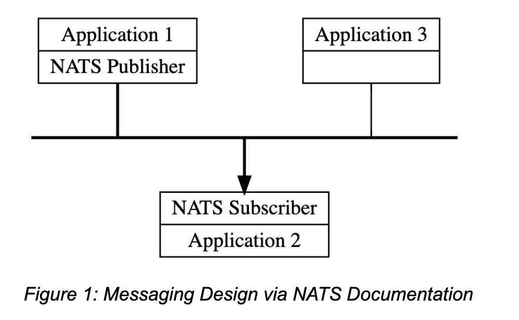

# Self-assessment for NATS
The Self-assessment is the initial document for the NATS project to begin thinking about the
security of the project, determining gaps in their security, and preparing any security
documentation for their users. This document is ideal for projects currently in the
CNCF **sandbox** as well as projects that are looking to receive a joint assessment and
currently in CNCF **incubation**.

# Self-assessment outline

## Table of contents

* [Metadata](#metadata)
  * [Security links](#security-links)
* [Overview](#overview)
  * [Actors](#actors)
  * [Actions](#actions)
  * [Background](#background)
  * [Goals](#goals)
  * [Non-goals](#non-goals)
* [Self-assessment use](#self-assessment-use)
* [Security functions and features](#security-functions-and-features)
* [Project compliance](#project-compliance)
* [Secure development practices](#secure-development-practices)
* [Security issue resolution](#security-issue-resolution)
* [Appendix](#appendix)

## Metadata

A table at the top for quick reference information, later used for indexing.

|   |  |
| -- | -- |
| Software |  https://github.com/nats-io/nats-server |
| Security Provider | No  |
| Languages | 99.6% Go 0.4% Other |
| SBOM | https://github.com/Ricardo-A-Zapata/tag-security/blob/main/assessments/projects/nats/doc/SBOM%20report.html  |
| | |

### Security links

Provide the list of links to existing security documentation for the project. You may
use the table below as an example:
| Doc | url |
| -- | -- |
| Security file |https://docs.nats.io/nats-concepts/security |
| Default and optional configs |  https://docs.nats.io/running-a-nats-service/configuration|

## Overview

NATS is a high-performance messaging system designed for cloud-native and edge computing environments, offering lightweight, secure, and scalable communication across distributed systems. Its unique design emphasizes simplicity, performance, and reliability, distinguishing it as a preferred choice for modern, responsive, and interconnected applications. With its lightweight footprint and robust security features, NATS facilitates seamless, secure communication in microservices, IoT applications, and real-time streaming data pipelines.

## Background

Traditional messaging and communication methods in distributed systems often faced challenges in scalability, performance, and flexibility, especially in networks spread across cloud platforms, on-premise systems, edge computing, and mobile applications. There was a clear need for a scalable, easy-to-deploy, and maintainable technology to facilitate efficient and reliable communication between services, microservices, and devices. This led to the development of NATS (Neural Autonomic Transport System).

As an open-source project under the Cloud Native Computing Foundation (CNCF), NATS prioritizes simplicity, performance, scalability, and ease of use. Its server, written in Go, and client libraries, available in multiple programming languages, make NATS a versatile platform for secure, multi-tenant communication across various environments. It is well-suited for both small and large-scale applications. The self-healing and scalable nature of NATS allows for dynamic adjustments to system topology, ensuring uninterrupted operation.

Figure 1: Messaging Design via NATS Documentation [uploaded as a seperate image in folder]

NATS uses subject-based messaging in its publish-subscribe model, where messages are routed by subjects - simple string identifiers. This method allows publishers to send messages to specific subjects and subscribers to express interest in particular subjects, enhancing communication flexibility. The system's ability to handle wildcard subscriptions further allows subscribers to receive messages from a range of related subjects. This decoupling of publishers and subscribers, central to NATS' scalable architecture, is particularly advantageous in cloud and microservices environments. Efficient message routing, combined with the system's simplicity and ease of use, positions NATS as a robust solution for the dynamic needs of modern distributed systems.

## Actors
### NATS Client Applications
These are the applications that use NATS client libraries to interact with the NATS server. They perform operations like publishing, subscribing, requesting, and replying to messages. These client applications can be parts of a single distributed application or entirely separate applications.

The client applications are isolated in the sense that they interact with the NATS server via network protocols. Their internal state or vulnerabilities do not directly affect the NATS servers or other client applications, provided the communication is secured and authenticated.

#### Client Types
- **Publishers**: These are client applications responsible for sending messages to NATS subjects.
- **Subscribers**: These clients listen to subjects and receive messages published to them.
- **Requesters**: In a request-reply pattern, these clients send requests and await responses.
- **Receivers**: These handle requests sent by requesters and send back responses.

Each of these client roles can be considered separate actors within the NATS ecosystem, especially when they are part of distinct applications or services.

### NATS Service Infrastructure (Servers)
The NATS server processes form the backbone of the NATS service infrastructure. These servers handle the routing and delivery of messages among client applications. They can be configured in various topologies, ranging from a single server to a global super-cluster.

NATS servers are isolated by design, running as separate processes possibly on different machines or containers. Each server can be secured and monitored individually. Even in clustered configurations, the failure or compromise of one server doesn't directly affect the others, maintaining overall system integrity.

#### Server Configurations
- **Single NATS Servers**: Individual server instances handling message routing.
- **Clustered NATS Servers**: Multiple NATS servers interconnected for scalability and fault tolerance.
- **NATS Superclusters**: Large-scale deployments spanning multiple clusters and possibly across geographical regions, for global scalability and resilience.

Within this infrastructure, each server instance, cluster, and supercluster can be considered a distinct actor, especially in terms of security and operational management.

### NATS Streaming Servers
While NATS primarily focuses on real-time messaging, NATS Streaming adds durable, at-least-once delivery, providing additional capabilities for scenarios requiring reliable and historic message replay.

### Administrative and Operational Tools
These include tools for monitoring, managing, and configuring NATS servers and clients. They play a crucial role in the maintenance and oversight of the NATS ecosystem.

## Actions

In the NATS messaging system, actions are the steps performed by different actors to provide specific services or functionalities. These actions are not overly detailed at the function call level but focus on security checks, use of sensitive data, and interactions between actors. We can examine these actions at both the Core NATS and JetStream levels.

### Core NATS Actions
**Publish/Subscribe:**
- Publishers send messages on subjects, and any active subscriber listening to those subjects receives the messages. The simplicity of this model, with ‘at most once' quality of service, reduces the complexity of security checks.
- Messages in NATS consist of a subject, a payload (in the form of a byte array), optional header fields, and an optional 'reply' address field. The maximum size of messages can be configured in the server settings, with a default of 1 MB, which can be increased if necessary.

**Request-Reply:**
- NATS supports this pattern using its core communication mechanism of publish and subscribe. A request is published on a given subject using a reply subject, and responders listen on that subject to send responses back. This allows for dynamic scaling and observability of the system.
- In cases where there are no subscribers to respond to a request, NATS clients can opt into receiving 'no_responder' messages. This feature is useful for immediate feedback when a request cannot be processed due to the absence of available services or responders.

**Queue Groups:**
- Queue groups in NATS are used for load balancing and ensuring that messages are distributed among multiple subscribers in a controlled manner.
- Subscribers can register as part of a queue group. When a message is sent to a subject associated with a queue group, only one subscriber from the group is randomly chosen to consume the message. This distributed queue mechanism enables built-in load balancing within NATS.

### JetStream Actions
JetStream extends Core NATS functionalities with enhanced qualities of service and new features.

- **Streaming:** JetStream provides temporal decoupling between publishers and subscribers, allowing subscribers to receive messages published even when they were not actively connected, overcoming the limitations of basic pub/sub systems.
- **Replay Policies:** Offers multiple replay options for consumers, including replaying all messages in a stream, the last message, messages from a specific sequence number, or a specific start time.
- **Retention Policies and Limits:** JetStream supports setting retention policies and limits on streams, such as maximum message age, stream size, and number of messages, to manage the growth of streams.
- **Subject Mapping Transformations:** Allows for transformations to be applied to messages as they are ingested into a stream, enhancing message routing and organization.
- **Persistent and Consistent Storage:** Offers options for memory or file storage, and uses a distributed quorum algorithm for fault tolerance and immediate consistency in message storage.
- **Stream Replication:** Supports setting a replication factor for streams to balance risk with resource usage and performance.
- **Mirroring and Sourcing between Streams:** Enables mirroring streams for disaster recovery and defining streams that source from other streams.
- **De-Coupled Flow Control:** Provides de-coupled flow control over streams, with sophisticated acknowledgment mechanisms for both publishers and subscribers.
- **Exactly Once Semantics:** Offers an 'exactly once' quality of service to ensure reliable and duplicate-free message delivery, even in specific failure scenarios.
- **Consumers:** Introduces various types of consumers, like fast push and horizontally scalable pull consumers, along with different acknowledgment types to enhance message processing reliability.

## Goals
The intended goals of the projects including the security guarantees the project is meant to provide (e.g., Flibble only allows parties with an authorization key to change data it stores).

### General Goals
- **Effortless M:N Connectivity:** NATS manages addressing and discovery based on subjects and not hostname and ports.
- **Deploy Anywhere:** NATS can be deployed nearly anywhere. It runs well within deployment frameworks or without.
- **Secure:** NATS is secure by default and makes no requirements on network perimeter security models. NATS supports basic security features: authentication, authorization, and encryption (TLS).
- **Scalable:** NATS infrastructure and clients communicate all topology changes in real-time. This means that NATS clients do not need to change when NATS deployments change. NATS handles endpoint locations transparently.
- **Hybrid Deployments:** NATS allows a hybrid mix of SaaS/Utility computing with separately owned and operated systems. NATS service can be shared with core microservices, streams, and stream processing.
- **Adaptability:** NATS will work as modern systems unify cloud, Edge, IoT, and beyond.

### Security Goals
- **Encryption:** NATS servers support TLS encryption for secure connections, ensuring that data in transit is protected against interception and unauthorized access.
- **Authentication:** Client connections to NATS servers can be secured using various authentication methods, including username/password, tokens, TLS certificates, and more, to validate client identities.
- **Authorization:** NATS provides mechanisms for clients to require authorization for the subjects they wish to publish or subscribe to, adding an additional layer of security and control over message access.
- **At Most Once QoS:** Core NATS offers an 'at most once' quality of service, similar to the TCP/IP model. In this approach, messages are delivered at most once, with no guarantee of delivery if the subscriber is not actively listening. This model is suitable for scenarios where message delivery is critical but not at the expense of system performance.
- **At Least/Exactly Once QoS:** For higher quality of service needs, NATS JetStream offers 'at least once' and 'exactly once' delivery guarantees. These are essential for applications that require reliable message delivery, such as persistent streaming and de-coupled flow control. This level of service ensures that messages are not lost and are delivered accurately, either once or with the assurance of no duplication.

## Non-goals

### General
- **Message Storage Limitations:** While NATS JetStream offers message persistence features, NATS does not aim to provide unlimited message storage. There are practical limits to storage capacity, and the system is not designed to serve as an indefinite or long-term data storage solution.
- **Delivery Model of Core NATS:** Core NATS operates on an "at most once" delivery model, similar to TCP/IP. It is not designed to guarantee message delivery if the subscriber is not actively listening or if there's no subject match. The responsibility for ensuring message receipt in such scenarios is not a goal of Core NATS.
- **Suitability for Real-Time Monitoring or Complex Event Processing:** NATS is focused on efficient message passing and may not be suitable as a real-time monitoring or complex event processing system. While it can be part of such systems, it does not inherently provide complex analytics or processing capabilities on the data it transmits.

### Security
- **End-to-End Application Security:** While NATS provides robust security features like TLS encryption, authentication, and authorization, it does not aim to be a comprehensive solution for end-to-end application security. The responsibility for securing the application layer, including the secure handling of data before it is published and after it is consumed, lies outside NATS’ scope.
- **Full Compliance with All Data Privacy Regulations:** NATS provides mechanisms that can aid in complying with various data privacy regulations, but it is not designed to automatically ensure compliance with all such regulations (like GDPR, HIPAA). It's up to the users to configure and use NATS in a manner that meets the specific regulatory requirements of their domain.

## Self-assessment use

This self-assessment is created by the NATS team to perform an internal analysis of the project's security. It is not intended to provide a security audit of NATS, or function as an independent assessment or attestation of NATS's security health.
This document serves to provide NATS users with an initial understanding of NATS's security, where to find existing security documentation, NATS plans for security, and general overview of NATS security practices, both for development of NATS as well as security of NATS.
This document provides the CNCF TAG-Security with an initial understanding of NATS to assist in a joint-assessment, necessary for projects under incubation. Taken together, this document and the joint-assessment serve as a cornerstone for if and when NATS seeks graduation and is preparing for a security audit.

## Security functions and features

Threat modeling link: 
[ https://github.com/Ricardo-A-Zapata/tag-security/blob/main/assessments/projects/nats/doc/threat-modeling.md ](https://github.com/Ricardo-A-Zapata/tag-security/blob/main/assessments/projects/nats/doc/threat-modeling.md)

NATS Security Document:
https://docs.nats.io/nats-concepts/security

### Critical
Critical security components of the project with a brief description of their importance. These are used for threat modeling and are considered critical design elements that make the product itself secure and are not configurable.

- **TLS Encryption:** Ensures secure, encrypted connections.
- **Client Authentication:** Supports multiple methods including Token Authentication, Username/Password credentials, TLS Certificate, NKEY with Challenge, and Decentralized JWT Authentication/Authorization.
- **Authorization:** Authenticated clients are identified as users with specific authorizations.
- **Accounts for Multi-tenancy:** Provides independent 'subject namespace' for each account, controlling import/export of messages and services.
- **Decentralized JWT Authentication/Authorization Administration:** Enables account holders to manage their users and authorizations independently.
- **JetStream Persistence Layer:** Offers encryption at rest for stored data.

### Security Relevant
NATS has achieved the passing level criteria in Open Source Security Foundation (OpenSSF) best practices badge. https://www.bestpractices.dev/en/projects/1895

- **Custom Authentication Integration:** Ability to integrate with existing authentication/authorization systems or create custom authentication.
- **Server Configuration:** Configurable settings for user permissions, subject wildcards, and connection restrictions.
- **Encryption at Rest in JetStream:** Protects stored data from unauthorized access.
- **Signed JWTs for User Authorization:** Enhances security by using JWTs for user authorization.
- **Decentralized User and Authorization Management:** Each account can independently manage its users and authorizations, enhancing security flexibility.

## Project compliance
According to the NATS security documentation, there is no mention of the project complying with specific security standards.

## Secure development practices

### Development Pipeline
- **Source Code Maintenance:** All source code is maintained in GitHub and changes must be reviewed by maintainers.
- **Commit Signing:** Contributors are generally encouraged to sign their commits.
- **Testing:** Each push and every pull request are tested using Travis CI and other relevant CI platforms.
- **Release Testing:** Releases are primarily tested on individual laptops, Docker images, and Travis CI.
- **Review Process:** Other reviewers, including committers, may comment on the changes and suggest modifications. Changes can be added by simply pushing more commits to the same branch.
- **Approval Requirements:** Generally, LGTMs are required by at least two committers to approve a change for merge. This varies depending on the size/scope/complexity of the change.
- **Coding Standards:** NATS follows widely-adopted standards for code formatting and style in each implementation language. Please refer to the CONTRIBUTING.md in individual NATS projects for specifics that apply to each.

### Communication Channels
- **Internal:**
  - **Slack Channel:** the NATS slack.
  - **Github Issues:** [nats-io/nats-server issues](https://github.com/nats-io/nats-server/issues)
  - **Google Meets:** [NATS Google Group](https://groups.google.com/forum/#!topic/natsio)
- **Inbound:**
  - **Slack Channel:** [NATS Slack](https://slack.nats.io/)
  - **Github Issues:** [nats-io/nats-server issues](https://github.com/nats-io/nats-server/issues)
  - **Stackoverflow:** [Stackoverflow NATS.IO queries](https://stackoverflow.com/search?tab=newest&q=NATS.IO)
- **Outbound:**
  - **Twitter:** [NATS Twitter](https://twitter.com/nats_io/)

### Ecosystem
NATS, as a messaging system, plays a significant role in the cloud-native ecosystem due to its design and capabilities that align well with cloud-native principles and practices.
- **Microservices Architecture:** NATS is particularly well-suited for microservices architectures commonly used in cloud-native environments. Its lightweight, high-performance nature makes it ideal for the communication needs of loosely coupled, independently deployable microservices.
- **Containerized Environments:** NATS integrates seamlessly with containerized environments and orchestration platforms like Kubernetes. This integration is crucial for automated deployment, scaling, and management of containerized NATS instances, making it a natural fit for cloud-native workflows.

## Security issue resolution

### Responsible Disclosures Process
Security issues can be reported through various channels:
- **GitHub Reporting:** Report security issues at [NATS Server Security on GitHub](https://github.com/nats-io/nats-server/security).
- **Email Reporting:** Security researchers can email at [security@nats.io](mailto:security@nats.io) to report security issues confidentially.

### Vulnerability Response Process
- **Tracking Known Issues:** The NATS Project aims to make it easy for administrators to track any known security issues. This includes using appropriate ecosystem identifiers such as CVE numbers and posting information to relevant forums and the advisories page when public statements are to be made.
- **Handling Security-Impacting Issues:** If it is known that a fix addresses a security-impacting issue, the NATS team may hold the fix until the release is available. This ensures that the fixed code is available in compiled forms as soon as possible, minimizing the risk window between the identification of the issue and its resolution.

### Incident Response
- **Development Language and Security:** The core parts of NATS are developed in Go, a type-safe compiled language with protections against common security issues like buffer overflows. This choice of language inherently reduces certain types of security risks.
- **Client Libraries and Security Properties:** NATS offers client libraries in a variety of languages, each with its security properties, which are considered in the overall security approach of the project.

## Appendix

### Known Issues Over Time
- **Authentication Bypass Vulnerability:** A notable vulnerability in NATS was the authentication bypass in versions before 2.9.23 and 2.10.x before 2.10.2. This issue was due to an implicit $G user in an authorization block, which could be exploited for unauthenticated access under certain configurations.

### [CII Best Practices]([https://www.coreinfrastructure.org/programs/best-practices-program/](https://www.bestpractices.dev/en/projects/1895))
- NATS has achieved a "Passing" status for CII Best Practices as of June 8th. More information can be found [here](https://www.bestpractices.dev/en/projects/1895).

### Case Studies
- **[Appsecco's Security Workflow Automation:](https://nats.io/blog/appsecco-chooses-nats/)**
  - Appsecco, a security-focused company, implemented NATS for security workflow automation in cloud-based environments. 
  - NATS was utilized for orchestrating various units of their workflow, leveraging features like consumer groups, wildcard subscriptions, failure resiliency, low latency, and high throughput.
  - Transition from RabbitMQ and Kafka to NATS for its lightweight, fast message queue system compatible with Kubernetes Pods.
  - The NATS server was integral for message passing, with the API Server initiating scan workflows and the Feedback Function creating a dynamic and responsive system.

- **[Persistent Logs with NATS Streaming:](https://nats.io/blog/use-cases-for-persistent-logs-with-nats-streaming/#:~:text=Guest%20Post%3A%20Use%20cases%20for,persistent%20logs%20with%20NATS%20Streaming)**
  - In this use case, a log is an ordered sequence of messages that are append-only and cannot be altered post-creation. 
  - NATS Streaming ensures that logs are durable and maintained even beyond server restarts.
  - Subscribers can receive messages off a stream in an ordered fashion, and in cases of disconnection, NATS Streaming allows clients to pick up where they left off.
  - It addresses issues like processing success but ACK failure by redelivering the same message until acknowledgment is received.
  - NATS Streaming facilitates load balancing across multiple clients subscribed to the same stream.

### Related Projects / Vendors
- To understand NATS better, it's useful to compare it with other notable technologies like Apache Kafka, RabbitMQ, Apache Pulsar, and gRPC.
- The "Compare NATS" section on the NATS documentation provides a comprehensive comparison between NATS and these messaging technologies. For more details, visit the [NATS Comparison Documentation](https://docs.nats.io/nats-concepts/overview/compare-nats).

