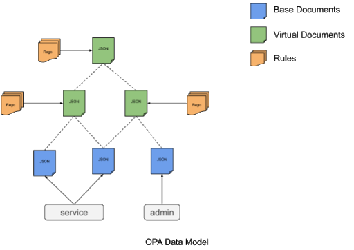

# OPA security self-assessment

April 24th 2019

*_Author_*: Ash Narkar ([@ashutosh-narkar](https://github.com/ashutosh-narkar))

*_Contributors/Reviewers_*: Justin Cappos (@JustinCappos), Brandon Lum (@lumjjb),
Robert Ficcaglia (@rficcaglia), Sarah Allen (@ultrasaurus)

This document elaborates and explores the design goals for the Open Policy Agent (OPA)
as well as its security analysis to aid in the security assessment by CNCF TAG-Security.

## Overview

The Open Policy Agent (OPA) is a general-purpose policy engine that enables unified,
context-aware policy enforcement across the stack. OPA empowers administrators
with greater control and flexibility so that organizations can automate policy
enforcement at any layer and author policies that take external data or
context into account.

## Background

Every organization has unique policies that affect the entire stack. These
policies are vital to long term success because they codify important requirements
around cost, performance, security, legal regulation, and more.

Enforcement of policy via human review is error-prone, yet common practice.
Organizations often rely on tribal knowledge and documentation to define policies
and ensure that they are enforced correctly. Some hard code policy decisions in
software. These approaches tightly couple the policy enforcement to other
required business logic in the underlying software. This practice:

* complicates the release process

* makes software policy compliance difficult to audit

* makes it difficult to modify policies

* limits visibility of policy throughout the system

Systems frequently lack the flexibility and expressiveness required to automate
policy enforcement.  Every system may have its own complex authorization logic
and as the number of systems grow, ensuring that authorization rules are being
accurately enforced becomes a hassle for administrators.

A better model isolates policy as a separate component of the architecture just
like databases, monitoring, logging, messaging. And this decoupling makes it
possible to get better control and visibility of policy and security throughout
the system. Standards such as XACML promote a similar philosophy and this
document will [later](#related-projects-/-vendors) provide a comparison between
OPA and other authorization systems.

### Goals

OPA’s goal is to provide consistent policy enforcement. OPA helps disparate
services to author and enforce security policies using a common framework which
can be applied at whatever layer in the stack as needed by the target system.
OPA aims to policy-enable other projects and services, regardless of domain.
Additionally OPA targets to achieve the following:

* Decouple policy enforcement from decision making

    * Services offload policy decisions to OPA by executing queries and enforce
	the decision returned by OPA

* Run at the edge to make policy decisions for host-local consumers

    * OPA was designed to run at the edge, eg. as a sidecar next to every
	microservice. This helps to achieve high availability and low latency for
	authorization decisions

* Zero runtime dependencies

    * OPA stores policies and data in-memory

    * Alternatively, OPA can be configured to fetch policy and data from
	external sources but this is optional

* Multiple deployment models

    * Host-level daemon, sidecar, embed as a Go library

    * Allows for easy integrations with other systems

### Non-Goals

* OPA does not provide a control plane for management and distribution of
policies. However OPA does provide the necessary tools and APIs to build a
policy management framework

* Provide a framework to issue identities to workloads. OPA does not
perform authentication

### Intended Use

For situations where your software service supports an authorization plugin
model or you can modify it to ask for authorization decisions from an external
service, you integrate your software service with the Open Policy Agent (OPA).
Every time your software needs an authorization decision, it asks OPA.  You run
OPA on the same host as your software service (as a host-local daemon or sidecar)
so OPA shares fate with your software service, providing high-availability and
high-performance of authorization decision-making, even in the presence of
network failures.

### Use cases

Examples of common use cases for OPA:

* Admission control in Kubernetes, Docker

* Microservice API authorization

* Unit testing Terraform plans

    * OPA makes it possible to write policies that test the changes Terraform is
	about to make before it makes them

* Access control for data in Ceph, Kafka, Minio, SQL, Elasticsearch

    * OPA provides fine-grained access control over Kafka topics

* OPA enables authoring of custom security policies to protect data stored in
Ceph, Minio etc.

### Operation

With OPA, policy decisions are decoupled from applications and services so that
policy logic can be modified easily and upgraded on-the-fly without requiring
expensive, time consuming development and release cycles.

OPA provides simple APIs to offload policy decisions from applications and
services. Policy decisions are computed by OPA and returned to callers as
structured data. Callers integrate with OPA by executing policy queries that
can include arbitrary input values. For example, an API gateway might supply
incoming API requests as input and expect boolean values
(representing allow/deny decisions) as output. On the other hand, a container
orchestrator might supply workload resources as input and expect a map of
clusters and weights to drive workload placement as output. In general, a
service will query OPA for a policy decision and then OPA based on the policies
and data it has access to, will evaluate the query and provide a decision back
to the service which then enforces the decision.


## Project Design

### Data and Policies

The primary unit of data in OPA is a document, which is similar to a JSON value.
Documents typically correspond to single, self-contained objects and are capable
of representing both primitive types (strings, numbers, booleans, and null) as
well as structured types (objects, and arrays). Document is a term that refers
to both the policy and data that may be provided by the user, and sometimes
refers to intermediate results that may be generated during evaluation.

#### Base Documents

Base documents contain static, structured data stored in memory and optionally
saved to disk for resiliency. A service will publish and update base documents
in order to describe its current state, and users can do the same to include
relevant data about the state of their own deployment context. Users can publish
and update base documents using OPA’s Data API.

#### Policies

At the core of OPA is a high-level declarative language Rego. Rego allows
administrators to enforce policies across multiple domains such as API
authorization, admission control, workload placement, storage, and networking.
OPA’s language is purpose-built for expressing policy decisions. The language
has rich support for processing complex data structures as well as performing
search and aggregation across context required for policy decisions.
The language also provides support for encapsulation and composition so that
complex policies can be shared and re-used. Finally, the language includes a
standard library of built-in functions for performing math operations,
string manipulation, date/time parsing, and more.

Each Rego file defines a policy module which is a collection of rules that
describe the expected state of a service. Both the service and its users can
publish and update policy modules using OPA’s Policy API.

#### Rules and Virtual Documents

Virtual documents embody the results of evaluating the rules included in
policy modules. Virtual documents are computed when users publish new policy
modules, update existing modules, run queries, and when any relevant base
document is published or updated. Rules allow policy authors to write questions
with yes-no answers (that is, predicates) and to generate structured values from
raw data found in base documents as well as from intermediate data found in
other virtual documents.

#### The *data* Document

All documents pushed into OPA or computed by rules are nested under a built-in
root document named data. Since the data document includes both base and virtual
documents, it is possible to query for both at the same time. The easiest way to
illustrate this is to query for all of data at once. Note, OPA does NOT allow
base and virtual documents to overlap. For example, if you try to load a rule
that defines a virtual document at path a/b/c (which is already defined by a
base document), OPA will return an error. Similarly, if you try to load a base
document into a path that is already defined by a virtual document, OPA will
also return an error.

#### The *input* Document

In some cases, policies require input values. In addition to the built-in data
document, OPA also has a built-in input document. When you query OPA, you can set
the value of the input document. For example, when using OPA for HTTP API
authorization, the following information about the incoming HTTP request can be
provided to OPA as input:

```json
{
  "method": "GET",
  "path": "/servers/s2",
  "user": "alice"
}
```

OPA can then evaluate a rule based on the policies and data it has access to
and the given input.

The below figure illustrates OPA’s Data Model and covers the concepts discussed
in the previous section.



### Deployment

OPA can be embedded as a Go library, or it can be deployed alongside the user’s
service – either directly as an operating system daemon or inside a container.
In this way, transactions will have low latency and availability will be
determined through shared fate with the user’s service.

When OPA starts for the first time, it will not contain any policies or data.
Policies and data can be added, removed, and modified at any time. For example:
by deployment automation software or by administrators as needed.

OPA has no runtime dependencies which means OPA does not need to connect to an
external DB or it does not need to talk to any external service once deployed
to make a policy decision.

### Features

Along with the core policy engine, OPA provides rich tooling to build, test,
debug policies. For example, there is a test framework to unit test policies,
interactive shell to write queries, a trace functionality which shows the steps
in the policy evaluation, expression profiler, IDE Integrations etc.

Although OPA does not provide a control plane for management and distribution
of policies, it does provide management APIs that:

1. Periodically download bundles of policy and data from remote HTTP servers

2. Report status updates to remote HTTP servers

3. Report decision logs to remote HTTP servers

OPA’s [configuration guide](https://www.openpolicyagent.org/docs/latest/configuration/)
provides detailed information about how the above features can be enabled.

To make it easy to author and try out policies using Rego, OPA has a [Rego Playground](https://play.openpolicyagent.org/).

## Security analysis

Organizations have to strike a fine balance between giving employees enough
power to deliver software to customers quickly but not too much that the
business suffers from security holes, financial liabilities,
and operational mistakes.

The challenge with achieving least-privilege authorization
(not too many permissions and not too few) is the number, complexity,
dynamicity, and heterogeneity of the software systems that organizations
are embracing.  A single organization may have thousands of software components
that require authorization. Each domain, vendor, and product has its own
authorization paradigm, expressiveness, and interface for administrators to
control those authorization policies.

OPA provides a unified approach to authorization giving organizations
context-aware visibility and control over their authorization posture in
dynamic environments. Using mechanisms such as Admission Control, OPA provides
guardrails so that organizations can impart enough power to their employees to
promote rapid innovation without compromising on security and safety.

OPA aims to solve the problem of fine-grained authorization in diverse
deployment models and technologies. It however does not tackle authentication.
OPA assumes that a user or service making a request is authenticated and then
attempts to answer the question *“What can the user or service do ?”*.

### Attacker Motivations

Today, many organizations follow a microservice-oriented architecture to design
and build their software systems and use the public cloud for deployment.
A typical public cloud account can have hundreds of microservices, thousands of
APIs, and possibly millions of resources. Because of the size and complexity and
ever-changing nature of the deployed services, an attacker can get access to
unauthorized resources and sensitive data by exploiting the simplistic static
policies that may have been enforced by the administrator.

An attacker could:

* Get access to a sensitive api endpoint. For example, an attacker can get
access to the payment gateway for a financial institution and cause permanent
damage

* Change the behavior of the system

    * Modify how containers are configured and deployed

    * Change host-level permissions

#### OPA Attack Surface

Following are the vulnerabilities in OPA that an attacker could exploit:

* When a user is setting up OPA for the first time, it does not contain any
policies or data. An attacker can access an unauthorized service while OPA is
still loading; however, a user would typically set this up with their
own policies.

* By default, OPA does not restrict access to any of its REST API endpoints
that are used to fetch, create and update policy and data. It’s possible that
an attacker can corrupt the policy and data loaded into OPA, thereby bypassing
OPA’s authorization checks altogether

* If OPA is deployed in an insecure environment, its effectiveness can be
compromised by an attacker

* OPA can be configured to fetch policies and data from remote HTTP servers
using its *bundle* feature. The files inside the bundle are tar.gz compressed.
An attacker who has access to the remote server or MitM the connection between
OPA and the remote server.  This can cause a Denial of Service (DoS) by
providing a bundle file that will consume the server’s memory and therefore
crash OPA or be used to add, remove, or delete OPA policies

* OPA trusts the authenticity of the policies and data it is provided with.
An attacker can potentially feed corrupt policies and data to OPA

* Policies that rely on existing status of cluster resources can be raced due
to the design of the validating webhook and eventual consistency model.
Attackers can potentially bypass these policies by crafting a series of
requests. Suggestions to warn against such policies - or a warning to require
routine checking during runtime may be required

* If policies for different components interact, the user must author the
policies in such a way that there are not problematic interactions

The following issues raised during the assessment have been addressed:

* OPA decision logs may contain sensitive information like usernames, passwords
provided in the input to the policy. OPA now allows the user to mask sensitive
fields in the input from showing up in the decision logs by allowing the user
to define a policy that specifies the fields to mask

* To make it easier for users to get familiar with Rego and also to make the
policy authoring experience convenient and less error prone, we
created [The Rego Playground](https://play.openpolicyagent.org/) and more
recently we’ve updated the [OPA documentation](https://www.openpolicyagent.org/docs/latest/policy-language/)
to make the policy examples interactive !

### Compensating Mechanisms

* The OPA daemon can be configured to authenticate and authorize requests. This
could prove beneficial especially in scenarios where the deployment environment
is untrusted. More details on deploying OPA securely can be found [here](https://www.openpolicyagent.org/docs/latest/security/).
Additionally OAuth2.0 client credentials can be used to authenticate
OPA’s REST APIs. See [this](https://github.com/open-policy-agent/opa/issues/1205)
issue.

* Since OPA does not contain any policies by default when started, it’s
recommended that the application fail-close in case of any non-200 response
from OPA.

* To prevent an attacker from loading corrupt policies into OPA, users are
recommended to sign their policies using a mechanism that best suits their
use-case. Related issue [here](https://github.com/open-policy-agent/opa/issues/1757).

* Since large bundles of policy and data have the potential to consume all of
the host’s memory, OPA puts a restriction on the size of bundles that can
be downloaded.

## Secure development practices

OPA has a well documented development workflow which can be
found [here](https://github.com/open-policy-agent/opa/blob/master/docs/devel/DEVELOPMENT.md).

Some highlights:

* All source code is checked into GitHub

* Every pull request kicks off a build which performs unit tests, benchmark
tests and language best practices enforcement

* Each pull request requires an approval from a core member before merging

    * The reviewer makes sure all checks and tests are passing

    * The reviewer pays close attention to any new exported methods or
	interface definitions

    * The reviewer sees that the code follows standard coding practices such as
	adding comments, grouping common logic in functions

    * Based on the changes made, reviewer sees that the docs are updated
	accordingly

* Pushes to master are forbidden by convention

* OPA asserts that it meets the passing criteria in the [Core Infrastructure Initiative (CII) badging process](https://bestpractices.coreinfrastructure.org/en/projects/1768)

* Release process is partially automated with manual portions assisted by scripts

* More information about the release process can be found [here](https://github.com/open-policy-agent/opa/blob/master/docs/devel/RELEASE.md)

* SHA-512 checksum files for release artifacts are not provided

### Communication Channels

Both new and experienced OPA users have multiple options to interact with the OPA community:

* [OPA Slack](https://slack.openpolicyagent.org/)
* [Bi-Weekly OPA meetings](https://docs.google.com/document/d/1v6l2gmkRKAn5UIg3V2QdeeCcXMElxsNzEzDkVlWDVg8/edit?usp=sharing)

Announcements about OPA releases, new features and general OPA updates are
shared through [OPA Slack](https://slack.openpolicyagent.org/) and [OPA blog](https://blog.openpolicyagent.org/).


#### Vulnerability Response Process

Security vulnerabilities are reported by sending an email to
open-policy-agent-security@googlegroups.com. The OPA Response Team will send a
confirmation message to acknowledge that they have received the report and then
they will send additional messages to follow up once the issue has been
investigated.

OPA Response Team:

* Torin Sandall (@tsandall)
* Tim Hinrichs (@timothyhinrichs)
* Patrick East (@patrick-east)
* Ash Narkar (@ashutosh-narkar)

### Ecosystem

OPA has integrations available with more than 20 open-source projects.
Some of them are:

* Kubernetes
* Docker
* Terraform
* Envoy
* Istio
* Kafka
* Ceph
* SQL
* Elasticsearch

More information on each integration can be found on the [OPA Website](https://www.openpolicyagent.org/).

## Roadmap

The [OPA Roadmap](https://docs.google.com/presentation/d/16QV6gvLDOV3I0_guPC3_19g6jHkEg3X9xqMYgtoCKrs/edit?usp=sharing)
highlights planned and in-progress OPA features. Current features include:

* Extended WebAssembly support for OPA. Work related to this effort can be found [here](https://github.com/open-policy-agent/opa/issues?q=is%3Aopen+is%3Aissue+label%3Awasm)

* Update OPA’s documentation to address security concerns around OPA deployments

* Policy language improvements

* [Support for OAuth 2.0 client credentials for authenticating OPA’s management APIs](https://github.com/open-policy-agent/opa/issues/1205)

## Appendix

### Security Audit

A third party security audit was performed by Cure53, the full report is
available [here](https://github.com/open-policy-agent/opa/blob/master/SECURITY_AUDIT.pdf).

The issues that were discovered as part of the audit have been [tackled and resolved](https://github.com/open-policy-agent/opa/issues?q=label%3Aaugust-audit+is%3Aclosed).

### CII Best Practices

Currently, OPA is at the passing criteria in the [Core Infrastructure Initiative (CII) best practices badging program](https://github.com/coreinfrastructure/best-practices-badge/blob/master/doc/criteria.md) ([security details here](https://bestpractices.coreinfrastructure.org/en/projects/1768)). OPA endeavours to reach the silver tier by following best
practices and guidelines outlined by CII.

### Case Studies

OPA is a general-purpose policy engine that has multiple deployment and
integration models and is used in production by more than 20 companies
such as Netflix, Intuit, Capital One.

#### REST API Authorization Example

This example shows two simple rules that enforce an authorization policy on an
API that serves salary data. In English, the policy says that
*employees can see their own salary and the salary of any of their reports*.

```ruby
allow {
input.method = "GET"
input.path = ["salary", employee_id]
input.user = employee_id
}

allow {
input.method = "GET"
input.path = ["salary", employee_id]
input.user = data.management_chain[employee_id][_]
}
```

The first rule allows employees to ***GET*** their own salary. The rule shows
how you can use variables in rules. In that rule, ***employee_id*** is a
variable that will be bound to the same value across the last two expressions.

The second rule allows employees to ***GET*** the salary of their reports.
The rule shows how you can access arbitrary context (e.g., JSON data) inside
the policy. The data may be loaded into the policy engine (and cached) or it
may be external and fetched dynamically.

#### Kubernetes Admission Control Example

This example shows how to enforce custom policies on Kubernetes objects
using OPA. The below policy prevents Ingress objects in different namespaces
from sharing the same hostname.

```ruby
deny[msg] {
    input.request.kind.kind == "Ingress"
    host := input.request.object.spec.rules[_].host
    ingress := data.kubernetes.ingresses[other_ns][other_ingress]
    other_ns != input.request.namespace
    ingress.spec.rules[_].host == host
    msg := sprintf("invalid ingress host %q (conflicts with %v/%v)", [host, other_ns, other_ingress])
}
```

This example shows how OPA can be used to enforce admission control decisions in
Kubernetes clusters on-the-fly without modifying or recompiling any Kubernetes
components. Also the *deny* rule returns a set illustrating Rego’s ability to
generate non-boolean policy decisions.

More information on how OPA can be integrated with Kubernetes as an
Admission Controller can be found [here](https://www.openpolicyagent.org/docs/latest/kubernetes-introduction/).

### Related Projects / Vendors

* OPA’s policy language Rego, allows policy decisions that are more than
boolean values. In the Kubernetes Admission Control example above, OPA returns
a non-boolean decision, which helps to detect the violation and can be used
later for auditing etc. Another example would be a service querying OPA to
return the fields a user is allowed to see based on the user’s profile,
department or some other characteristic

* OPA can be deployed next to the user’s service either as a host-level daemon
or sidecar, or, if building services in Go, OPA can be embedded as a library

| Project | Open Source | Decentralized | Non-boolean Decisions |
| --- | --- | --- | --- |
| OPA | Apache 2 | Yes | Yes |
| Firebase Rules | No | Yes | No |
| HashiCorp Sentinel | No | Yes | No |
| OpenStack Congress | Apache 2 | No | Yes |
| Ladon (XACML) | Apache 2 | Yes | No |
