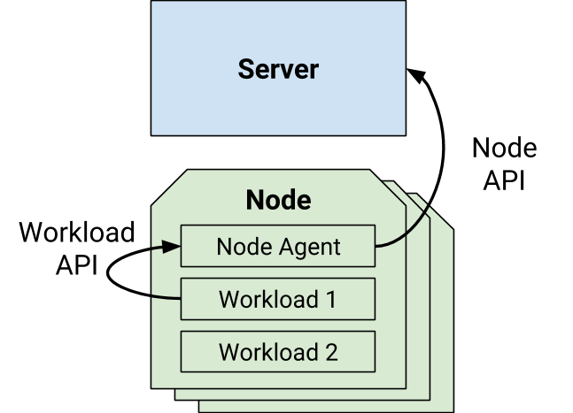
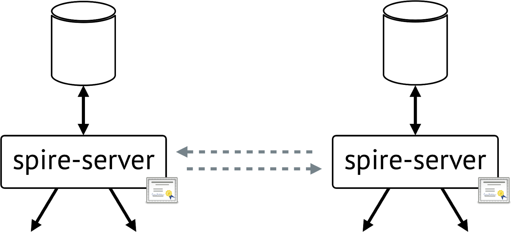
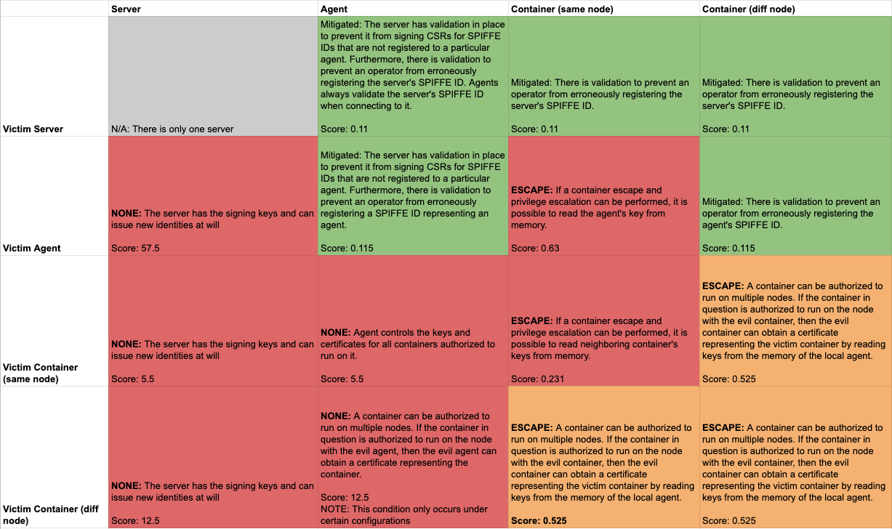
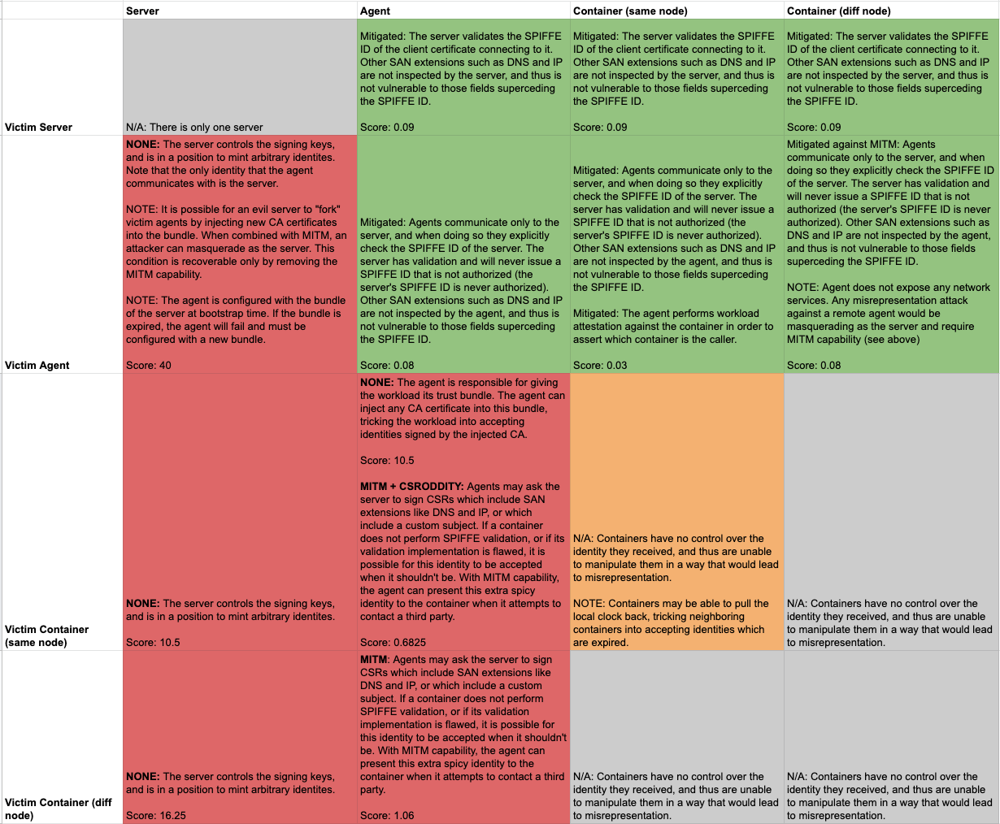
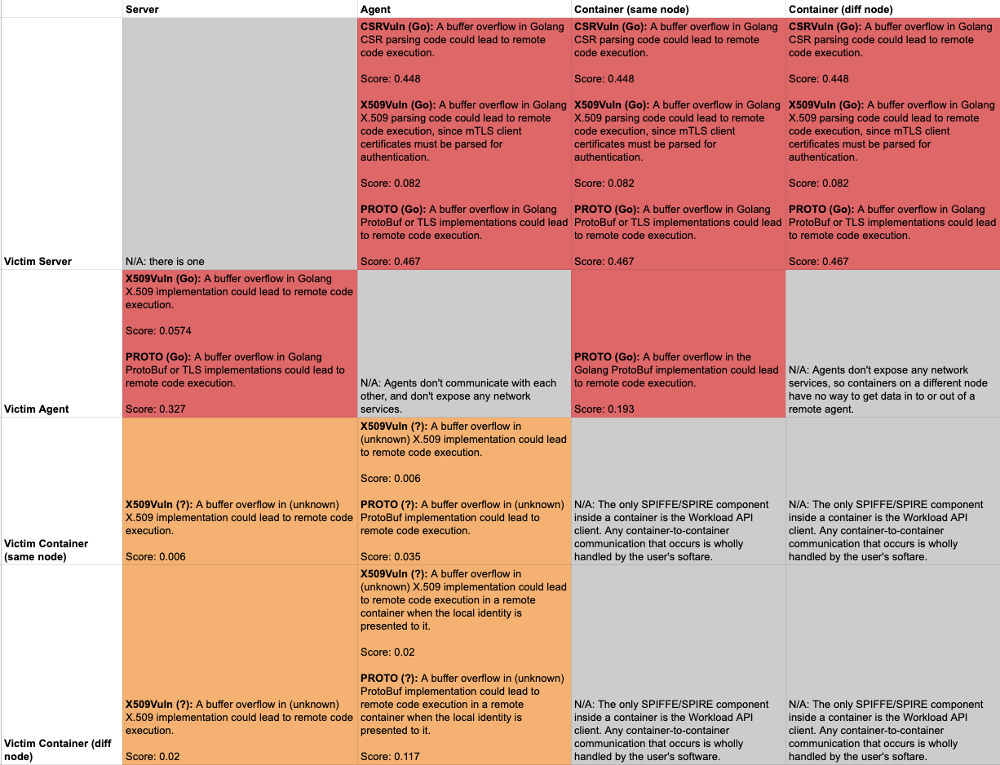
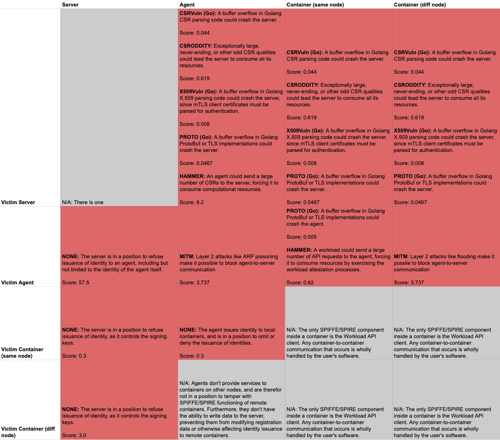

# SPIFFE/SPIRE Security Self-assessment

Jan 22nd 2020

Authored by: Andres Vega (@anvega)

Contributors: Evan Gilman (@evan2645), Andrew Jessup, Tyler Julian (@apty), Andrew Harding (@azdagron)

Security Reviewers: Brandon Lum (@lumjjb), Emily Fox (@TheFoxAtWork), Justin Cappos (@JustinCappos)

This document details the design goals and security implications of SPIFFE and SPIRE to aid in the security assessment by CNCF TAG-Security.

## Metadata

| Software | [https://github.com/spiffe/spiffe](https://github.com/spiffe/spiffe) |
| -------- | ------------------------------------------------------------ |
|          | [https://github.com/spiffe/spire](https://github.com/spiffe/spire) |
| Security Provider | Yes  |

## Overview

SPIFFE and SPIRE (the [SPIFFE](https://github.com/spiffe/spiffe) Runtime Environment) are a set of APIs and associated tooling that provides a uniform language for describing service identity in a wide range of workloads (including orchestration systems), verifying that identity, and providing a workload with documents that serve as proof of that identity. It is inspired in large part by Google's Low Overhead Authentication Service, Facebook's PrivateCore, and Netflix Metatron.

Historically, a "service identity" is defined differently depending on who is running the service and where the service is running . A "service," for example, may be an Apache web-server running on a set of Amazon EC2 VMs in an auto-scaling group, but might also be an application in Kubernetes running on Google Compute Engine, or a PostgreSQL database running on an on-premises bare-metal server.

SPIFFE provides a general purpose framework for defining and verifying service identity in a wide range of environments such as these, and ensuring services can easily and safely retrieve the identities that represent them. The verification SPIFFE performs is conducted both for the infrastructure the workload is running on (node level) and how that workload was provisioned onto the infrastructure (process level).

With SPIRE, this is achieved with a set of coupled API-driven components that vastly simplify and automate the process, ensuring an operator can employ industry best practices for establishing identity for a wide range of systems without needing to deal with the complexities of PKI infrastructure or node/process attestation.

### Background

For two software systems to establish trust between each other, they must be able to confirm each other's identity, *and* ensure that messages between each other have not been tampered with. Signing and verifying a JWT token, or mutual TLS, established with public and private keys allows SPIFFE to do this *without trusting the network*. But maintaining the integrity of these keys, like any password, becomes critical. If a key for a workload is stolen, then an attacker can impersonate that workload.

The solution to this is short lived keys and certificates. An attacker cannot reuse a stolen key after it expires. Here, short-lived means typically an hour or less (one hour by default, configurable on a per-identity basis). This eliminates a large range of exfiltration attacks. But how can new keys and certificates be delivered to every workload, every hour? What's more, in a cloud environment, machines may be created and destroyed dynamically in response to business demand.

The answer to this is automated delivery based on continuous assessment of many attributes of the workload and its environment, and issuance of short-lived keys based on a successful assessment. SPIFFE and SPIRE provide an automated, high velocity toolchain for establishing trust between software systems across a wide variety of hosting platforms.

Concretely, SPIRE exposes the [SPIFFE Workload API](https://github.com/spiffe/go-spiffe/blob/master/proto/spiffe/workload/workload.proto), which can attest running software systems and issue [*[SPIFFE]* *[IDs]*](#spiffe-id) [ ] and [*[SVIDs]*](#spiffe-verifiable-identity-document-svid) to them. This in turn allows two workloads to establish trust between each other, for example by establishing an mTLS connection or by signing and verifying a JWT token. Or it allows a workload to securely authenticate to a secret store, a database, or a cloud provider service.

### Goals

SPIFFE and SPIRE make a toolchain for establishing trust between software systems across a wide variety of hosting platforms.

With this design:

-   Every workload is continuously verified for integrity, even during deployment.

-   Every workload can be identified regardless of whether it is part of an elastic cloud, dynamically scheduled container environment, or running on a bare-metal server. If verified, workloads can establish trust and encrypt traffic to other workloads even in a compromised network.

-   These cryptographically verifiable identity documents should be made available to the workload on a just-in-time basis.

-   Services hold only short-lived identity documents that mitigate the risk of exfiltration by constraining the useful lifespan of the documents.

-   Enable communication between all services to be encrypted with mutual TLS, using short-lived, service-specific Elliptic-curve cryptography (ECC) keys.

-   Simplify access to secret stores by implementing recommended practices for "initializing the root of trust in a system", and provide developers a uniform mechanism to access secret stores, databases, or cloud provider services.

### Non-Goals

The focus of the SPIFFE and SPIRE projects is solely in authentication. Authorization is outside of the scope of the projects.

-   SPIFFE and SPIRE do not provide mechanisms to manage service-to-service access rights.

-   SPIFFE and SPIRE do not seek to address simplification of access control policies, nor policy enforcement.

-   SPIFFE and SPIRE operate at the application layer. The projects do not attempt to solve network layer identity, addressing, nor policy enforcement.

-   SPIFFE and SPIRE do not provide centralized management of entitlements.

## Intended Use

SPIFFE and SPIRE are intended to be used as the foundation for distributed identity and authentication that is consistent with cloud-native design architectures (i.e. systems that can be assumed to be highly distributed, elasticity scaled, and dynamic scheduled). SPIRE supports any 64-bit Linux or macOS environment and container orchestration platforms like Kubernetes. SPIRE is not supported on Windows today, though some early prototyping has been done in this area (e.g. hosting the workload API over a named pipe).

### Target Users

For **operators and security administrators** to define, manage and view identities driven by policy, as opposed to individual credentials. As well as to accelerate delivery of applications that may be blocked by onboarding related tasks. Additionally, reduce reliance on secrets or bootstrap credentials for the purpose of "initializing the root of trust in a system".

For **application developers*** to move away from manual tasks that pose a security risk, where practices may not adhere to standards or may vary depending on native platform controls, onto a model of authentication and encryption. The developer throughput may increase because they write less \"non-application logic\" code (such as authentication, etc.). By making functions like workload authentication and encryption a function of the infrastructure, developers no longer need to engineer those capabilities directly in software.

For **platform implementers*** to improve security by default, helping to provide defense in-depth as a function of the infrastructure, and building consistent authentication controls across hybrid, heterogeneous infrastructure.

For **third party security products and systems*** to establish trust with remote systems without exchanging secret keys through the use of SPIFFE federation.

For **compliance officers and auditors** to gain better accountability and tracking of inter-service communications through monitoring and tracing integrations.

### Use cases

Examples of common use cases for SPIFFE and SPIRE include:

#### Authenticating workloads in untrusted networks using mTLS:

When sending messages between distributed software systems, it is common to rely on the network to determine the identity of the system that sent a message, to ensure that messages can only be received by systems that are authorized to view them, and to ensure that the message has not been seen or modified in transit by a malicious party.

However, for complex distributed applications - which may span multiple networks that share many services deployed by different teams - it may be undesirable to rely on the network to protect communication. Mutual Transport Layer Security (mTLS) is a well established technology that relies on asymmetric cryptography to prove the identity of the sender and recipient of a message, as well as assert that the message has not been viewed or modified in transit by a third party. It is thus useful for establishing communication in potentially untrusted networks.

SPIRE is designed to enable widespread deployment of mTLS between workloads in distributed systems by:

1.  Attesting the identity of workloads in a distributed software system at runtime.

2.  Delivering workload-specific, short-lived, automatically rotated keys and certificates (X.509-SVIDs) suitable for establishing mTLS directly to workloads via the Workload API.

To use SPIRE to establish mTLS between a number of workloads requires the following:

1.  Install a SPIRE Server(s) into target environment.

2.  Install a SPIRE Agent on each physical or virtual machine running their target environment.

3.  Configure Node Attestation and Workload Attestation.

4.  Create registration entries on the SPIRE Server to identify specific workloads in the target environment.

5.  Configure each workload to use the keys and X.509 certificates delivered via the SPIFFE Workload API exposed by the SPIRE Agent to establish mTLS connections. This may be accomplished by having the workload retrieve and interact with these keys and certificates directly, OR using a proxy (such as Envoy, or other) to establish inbound or outbound mTLS connections on behalf of the workload.

#### Authenticating two workloads using JWT-based authentication:

While mTLS is useful for securing communication between workloads across untrusted networks, it is generally used to authenticate a channel between two specific workloads. A complementary means of authenticating a message is to use a JSON Web Token (JWT), which is a JSON payload structured in a particular manner and signed by the sender using a private key known only to them. The signature can then be verified by a receiving workload in possession of a corresponding public key.

Unlike mTLS, using JWTs does not normally provide a means to guarantee the integrity of a message sent and can, if used improperly, be subject to replay attacks if a malicious actor can obtain a valid JWT. But JWTs can be used to authenticate messages between workloads when direct mTLS may not be possible (for instance, if a Layer 7 load balancer is on the network path between them), or when several workloads may send messages over a single encrypted channel.

SPIRE supports a specific form of JWT that is specifically designed to encode SPIFFE IDs and avoid common security pitfalls, the JWT-SVID. SPIRE can simplify the widespread deployment of JWT-SVIDs between workloads in distributed systems by:

1.  Attesting the identity of a workload in a distributed software system at runtime.

2.  Generating JWT-SVIDs on behalf of a workload via the Workload API.

3.  Validating JWT-SVIDs on behalf of a workload via the Workload API.

Using SPIRE to authenticate workloads using JWTs requires the following:

1.  Install a SPIRE Server into target environment.

2.  Install a SPIRE Agent on each physical or virtual machine running their target environment.

3.  Configure Node Attestation and Workload Attestation.

4.  Create registration entries to identify specific workloads in the target environment.

5.  Configure each workload to generate or verify JWTs delivered via the SPIFFE Workload API exposed by the SPIRE Agent. This may be accomplished by having the workload retrieve and interact with these JWT-SVIDs directly, OR using a proxy (such as Envoy) to attach and verify JWTs to messages on behalf of the workload automatically.

Additional use cases include:

-   A SPIFFE-identified workload authenticating to a MySQL database using an SVID-X.509, and should assume a set of entitlements in MySQL when it does.

-   A SPIFFE-identified workload authenticating to Amazon Web Services (note: *not* a workload running on AWS), and should assume a specific AWS IAM role when it does.

-   Authenticating to a workload running in an Istio service mesh.

-   Issue SPIFFE identities to a container that has been signed with a binary signature that indicates it has been processed by a CI/CD system.

## Operation

SPIRE orchestrates an attestation process that can lean on a configurable union of trusted third parties (such as cloud provider control planes, container orchestrators, signatures from CI/CD pipelines, trusted OS kernels, Hardware Security Modules and existing machine identity frameworks) to provide a strongly attested platform-agnostic identity for cloud (and optionally, on-premises) workloads.

The server component of SPIRE maintains a list of identities along with conditions that must be matched by a service to be entitled to an identity.

> For example, to identify a service within a Kubernetes cluster running on Amazon EC2 instances, the service can be issued the ID spiffe://acme.com/billing/payments if it meets all of these conditions: 1. a service must run on an EC2 instance in the security group 'sg-edcd9784', 2. a service must run in a Kubernetes pod in the namespace 'payments', 3. a service must run in a Kubernetes pod associated with the service account 'pay-svc', 4. a service must run in a docker container started from image with the ID '442ca9'.
>
> In the same example, a SPIRE agent runs on each node in the Kubernetes cluster. Each node also has a kubelet. The workload is running in a container on the same node. On instance start, the agent authenticates to the server. Since the agent runs on the EC2 instance, it authenticates itself via the AWS Instance Identity Document from the AWS EC2 Instance Metadata API. The server verifies this to verify the instance and account ID.
>
> Next, the server, having validated the node's instance ID, calls AWS to retrieve additional instance metadata (e.g. security group membership). This process is called node resolution. After having verified the node, the server will return to the agent a list of SPIFFE IDs (and selectors) that are currently authorized to run on the EC2 instance.
>
> Then, at service start time, the service (running in a container that is part of a Kubernetes pod) requests identity from the agent (via the Workload API that's exposed as a Unix Domain Socket).The agent retrieves metadata from the kernel about the calling process, and against selectors in policies retrieved from the server. The agent also interrogates the local kubelet for Kubernetes-specific metadata about the process. The agent then correlates this against the policies it previously retrieved from the server. If the agent finds a match, it generates a key for the identity-requesting container. The agent generates a certificate signing request (CSR) based on that key, and sends it to the server. The server sends to the agent a SPIFFE Verifiable Identity Document and certificate bundles for other services that the container can authenticate with. In turn, the agent returns the SVID and certificate bundles to the container.

The verification of a server's identity happens by Agents configured with a CA certificate that can verify the validity of the certificate presented by the Server. Agents are also configured to know which trust domain they belong to, and can assert that the SPIFFE identity presented by the Server matches the expected trust domain (trust domains are defined under SPIFFE Architecture below). This form of Server identity validation is common to all attestation methods.

It is important to note that all communication between Agent and Server happens via TLS/mTLS. It is also worth noting that only the SPIRE server holds signing key material.

## Project Design

### SPIFFE Architecture

#### SPIFFE ID

A SPIFFE ID is a string that uniquely and specifically identifies a workload. SPIFFE IDs may also be assigned to intermediate systems that a workload runs on (such as a group of virtual machines). For example, *spiffe://acme.com/billing/payments* is a valid SPIFFE ID.

SPIFFE IDs are a Uniform Resource Identifier (URI) which takes the following format: spiffe://trust-domain/workload-identifier. The workload identifier uniquely identifies a specific workload within a *trust domain*.

#### Trust Domain

The trust domain corresponds to the trust root of a system. A trust domain could represent an individual, organization, environment, or department running their own independent SPIFFE infrastructure. All workloads identified in the same trust domain are issued identity documents that can be verified against the root keys of the trust domain.

The recommended practice is to keep workloads that are in either different physical locations (such as different data centers or cloud regions) or environments where different security practices are applied (such as a staging or lab environment compared to a production environment) in distinct trust domains.

#### SPIFFE Verifiable Identity Document (SVID)

An SVID is the document with which a workload proves its identity to a resource or caller. An SVID is considered valid if it has been signed by an authority within the SPIFFE ID's trust domain.

An SVID contains a single SPIFFE ID, which represents the identity of the service presenting it. It encodes the SPIFFE ID in a cryptographically-verifiable document, in one of two currently supported formats: an X.509 certificate or a JWT token.

As tokens are susceptible to replay attacks, in which an attacker that obtains the token in transit can use it to impersonate a workload, it is advised to use X.509-SVIDs whenever possible. However, there may be some situations in which the only option is the JWT token format, for example, when the environment has an L7 proxy or load balancer between two workloads.

#### SPIFFE Bundle

When authenticating a SPIFFE identity, a bundle is used by a destination workload to verify the identity of a source workload. A SPIFFE bundle is a collection of one or more public keys (and associated documents) that are considered authoritative for the trust domain that they represent. A SPIFFE bundle contains key material for both X.509 and JWT SVIDs, and its contents are frequently rotated. A workload receives this key material when it calls the Workload API.

#### SPIFFE Bundle Endpoint

It is often desirable to allow workloads in one trust domain to communicate with workloads in another. In order to accomplish this, it is necessary for the validator to possess the bundle of the foreign trust domain in which the remote workload (or identity) resides. As a result, a mechanism for transferring bundles is necessary.

The primary mechanism by which SPIFFE bundles are transferred is similar to, and fully compatible with, the jwks\_uri mechanism defined in the OpenID Connect specification, and is known as the \"bundle endpoint\". When used in conjunction with OpenID Connect Discovery, it MUST be a TLS-protected HTTP endpoint (i.e. with the https scheme set).

All bundle endpoint servers and clients SHOULD support TLS-protected HTTP transport in order to preserve interoperability between SPIFFE implementations and compatibility with OpenID Connect. In cases where public interoperability is not required, such as custom implementations meant for internal consumption, alternative secure transport mechanisms MAY be used.

When communicating with a bundle endpoint, it is critical to know the name of the trust domain that the endpoint represents. SPIFFE implementations MUST securely associate bundle endpoints with their respective trust domain, nominally through explicit configuration of a \<trust\_domain, endpoint\> tuple.

#### Workload API

The workload API provides for interaction between a workload and the system. The workload API provides for the following:

For identity documents in X.509 format (an X.509-SVID):

-   Its identity, described as a SPIFFE ID.

-   A private key tied to that ID that can be used to sign data on behalf of the workload. A corresponding short-lived X.509 certificate is also created, the X509-SVID. This can be used to establish TLS or otherwise authenticate to other workloads.

-   A set of CA certificates -- known as a trust bundle -- that a workload can use to verify an X.509-SVID presented by another workload.

For identity documents in JWT format (a JWT-SVID):

-   Its identity, described as a SPIFFE ID.

-   The JWT token.

-   A set of public keys -- known as a JWKS -- that a workload can use to verify the identity of other workloads.

In similar fashion to the AWS EC2 Instance Metadata API and the Google GCE Instance Metadata API, the Workload API does not require that a calling workload have any knowledge of its own identity, or possess any authentication token when calling the API. This means workloads do not require knowledge of secrets or bootstrap credentials.

Unlike these other APIs however, the Workload API is platform agnostic, and can identify running services at a process level as well as a kernel level -- which makes it suitable for use with container schedulers such as Kubernetes.

To minimize exposure from a key being leaked or compromised, all private keys (and corresponding certificates) are short-lived, rotated frequently and automatically. Private keys are never sent "over the wire", instead, keys are generated on-host by the SPIRE Agent and sent to the workload over a unix domain socket. Workloads are provided with new keys and trust bundles from the Workload API before the corresponding key(s) expire.

### SPIRE Architecture

A SPIRE deployment is composed of one or more SPIRE Servers (replicated with shared datastore) and one or more SPIRE Agents. A server acts as a signing authority for identities issued to a set of workloads via agents. It also maintains a registry of workload identities and the conditions that must be verified in order for those identities to be issued. Agents expose the SPIFFE Workload API locally to workloads, and must be installed on each node on which a workload is running.

#### SPIRE Server

A SPIRE Server is responsible for managing and issuing all identities in its configured SPIFFE trust domain. It stores [registration entries](https://spiffe.io/spire/concepts/#workload-registration) (which specify the [selectors](https://spiffe.io/spire/concepts/#selectors) that determine the conditions under which a particular SPIFFE ID should be issued) and signing keys, uses [node attestation](https://spiffe.io/spire/concepts/#node-attestation) to authenticate agents' identities automatically, and creates SVIDs for workloads when requested by an authenticated agent.

#### SPIRE Agent

A SPIRE Agent runs on every node on which an identified workload runs. The agent:

-   Requests SVIDs from the server and caches them until a workload requests its SVID

-   Exposes the SPIFFE Workload API to workloads on node and attests the identity of workloads that call it

-   Provides the identified workloads with their SVIDs

All agent communication is authenticated using mTLS client certificates. Each agent has a unique identity assigned to it by the server (SPIFFE identities, of course), and workloads can be scoped to a single agent instance if necessary.

Agents are issued their unique identity following successful node attestation. Some attestation methods are safe to use only once, and to accommodate these cases, agents are authorized to rotate their own client certificates in-place.

#### Workload Registration

For SPIRE to identify a workload, the workload has to be first registered with the SPIRE Server, via registration entries. Workload registration tells SPIRE how to identify the workload and which SPIFFE ID to give it.

A registration entry maps an identity -- in the form of a SPIFFE ID -- to a set of properties known as selectors that the workload must possess in order to be issued a particular identity. During workload attestation, the agent uses these selector values to verify the workload's identity.

#### Attestation

Attestation, in the context of SPIRE, is asserting the identity of a workload. SPIRE achieves this by gathering attributes of both the workload process itself and the node that the SPIRE Agent runs on from trusted third parties and comparing them to a set of selectors defined when the workload was registered.

The trusted third parties SPIRE queries in order to perform attestation are platform-specific.

SPIRE performs attestation in two phases: first node attestation (in which the identity of the node the workload is running on is verified) and then workload attestation (in which the workload on the node is verified).

SPIRE has a flexible architecture that allows it to use many different trusted third parties for both node and workload attestation, depending on the environment the workload is running in. SPIRE is told which trusted third parties to use via entries in agent and server configuration files and which types of information to use for attestation via the selector values specified when workloads were registered. Caution is to be exercised when running third party code to validate the provenance and integrity of the code.

## Configuration and Set-Up

The following links provide detailed steps on setting up and configuring the SPIFFE Runtime Environment:

-   [Install and Configure SPIRE Documentation](https://spiffe.io/spire/docs/)

-   [Getting Started Guide for Kubernetes](https://spiffe.io/spire/try/getting-started-k8s)

-   [Getting Started Guide for Linux](https://spiffe.io/spire/try/getting-started-linux/)

-   [Extend SPIRE](https://spiffe.io/spire/docs/extending/)

### Security Considerations when operating in Kubernetes

When installing for Kubernetes, if the Kubernetes cluster supports projected service account tokens, consider using the built-in Projected Service Account Token k8s Node Attestor for authenticating the SPIRE agent to the server. Projected Service Account Tokens are more tightly scoped than regular service account tokens, and thus more secure.

As configured, the SPIRE agent does not verify the identity of the Kubernetes kubelet when requesting metadata for workload attestation. For additional security, you may wish to configure the Kubernetes workload attestor to perform this verification on compatible Kubernetes distributions by setting skip\_kubelet\_verification to false.

### Considerations when using third party plugins

SPIRE can be extended to work with third party plugins. While third party plugins are not officially supported, caution should be exercised when using third party code to validate the provenance and integrity of the code.

### Considerations when using third party services

If using an upstream Certificate Authority (CA), the compromise of the CA represents a compromise of the entire trust domain. Configure multiple smaller trust domains as opposed to one big large trust domains with different upstream CAs can contain the impact potential compromise of a CA. The blast radius will be isolated to that of a single trust domain.

A compromise of the SPIRE server database can lead to 1) an attacker registering their own workloads, or 2) an attacker publishing their own keys into the trust bundle. Care should be taken to ensure protection of the database.

### Scaling SPIRE

With a single server handling the entire cluster, memory and CPU usage tends to grow proportionally with size/load on cluster. To support very large numbers of agents within a given trust domain (tens of thousands or hundreds of thousands of nodes), SPIRE servers can be scaled horizontally. With multiple servers, the load is distributed. In addition to capacity, the use of more than one SPIRE server also eliminates a single point of failure and attains high availability. In a configuration of two or more SPIRE servers, all servers share the same datastore, while each individual server maintains an independent root certificate/key.

With the goal to issue identities from a single Certificate Authority across the board, a common topology design in which to deploy SPIRE is for a trust domain to span regions and clouds. Managing a shared datastore across geographically dispersed locations or across cloud providers may represent a challenge. In such circumstances, a solution is to configure SPIRE servers can be configured in Nested topology.

### Nested SPIRE

Nested SPIRE allows SPIRE servers to be chained together, and for all servers to still issue identities in the same trust domain. It works by co-locating an agent with downstream servers. Each downstream server loads the CA credentials from the Workload API of the top or global SPIFFE implementation. The downstream node performs both node and workload attestation, which in turn allows automating the bring-up of new downstream servers.

This topology is best suited for multi-cloud deployments. It can be reasoned as the top server being a global server (or set of servers for high availability). The downstream servers may be deployed at either regional or cluster level. Due to the ability to mix and match node attestors, the downstream servers can reside in different clouds.

In this configuration, the top tier SPIRE servers hold the root certificate/key, and the downstream servers request an intermediate signing certificate to use as the server\'s X.509 signing authority. It provides for resilience as the top tier can go down, and intermediate certificates will continue to operate.

Complimentary to scaling SPIRE servers horizontally to deal with load, a nested topology helps to differentiate failure domains.

### Federated SPIRE

Many organizations have multiple roots of trust: perhaps because they have different organizational divisions with different administrators, or because they have separate staging and production environments that occasionally need to communicate. A similar use-case is SPIFFE interoperability between organizations, such as between a cloud provider and its customers. Both use-cases require a well-defined, interoperable method for a workload in one trust domain to authenticate a workload in a different trust domain.

Trust between the different trust domains is established by authenticating the respective Bundle Endpoint. For additional detail on how this is achieved, refer to the following SPIFFE spec that describe the mechanism:

<https://github.com/spiffe/spiffe/blob/master/standards/SPIFFE_Trust_Domain_and_Bundle.md#5-spiffe-bundle-endpoint>

## Project Compliance

SPIFFE and SPIRE do not currently document meeting particular compliance standards.

## Security Analysis

### Attacker Motivations

The identity layer provided by SPIFFE and SPIRE to distributed systems is critical to security because it constitutes the foundation for authentication, authorization decisions, as well as other functions like logging and billing. An attacker may be motivated to attack SPIRE or other SPIFFE implementation as identities are used to determine access to resources, or what resources can a service provide or consume.

An attacker may target various aspects of the identity layer depending on their goals. For example, if the goal is to make the system unavailable then disrupting any of the functions (identity generation, distribution, etc.) is enough to accomplish it. If the goal is to gain unauthorized access to resources, the attacker must find ways to steal the identities of legitimate workloads, trick the system into providing an identity to which it is not entitled, compromise one of the components (server, agent, workload), or compromise local security barriers such as network or file system namespaces.

Another option is to attack the identity verification function that the workloads perform. For example, an attacker that manages to tamper with the trust bundle a workload uses can mint arbitrary identities and trick the workload into accepting them as genuine.

For the purpose of the assessment, the list of attacks is grouped into categories based on attacker goals. Note that all attack types can be mounted against all components (server, agent, workloads) with different levels of difficulty and with different impact on the security of the system. Each of these attacks is the inverse of a security goal for SPIFFE. The goal of SPIFFE and SPIRE is to prevent or otherwise mitigate these attacks.

### Critical Functions

Some of the critical responsibilities of a SPIFFE implementation are:

-   Generation of workload identities based on workload attributes and system configuration.

-   Attestation of workloads to make sure that workloads can access only identities to which they are entitled.

-   Distribution of identities from the location where they are generated to the location where the workload can consume them over a secure channel.

-   Distribution of trust bundles to workloads, so that they can autonomously validate identities presented by other workloads without the need for an external service.

### Attacks

#### Misrepresentation of Identity

This type of attack tricks the system into issuing identities that exploit weaknesses in the syntax or semantics of the validation of corresponding identity documents. For example, attackers may try to generate certificates with invalid characters or unverified identity attributes, or trust bundles with rogue certificates.

#### Identity Theft

The purpose of this type of attack is to gain unauthorized access to the identity or key material of another component. For example, a malicious workload may try to impersonate another workload or a compromised SPIRE Agent may try to impersonate the server.

#### Compromise/Remote Code Execution (RCE)

In this type of attack, the attacker seeks to gain full control of one or more components. The victim component can be located on the same host or on another host with network access.

#### Denial Of Service (DoS)

These attacks disrupt system functionality by overloading or disabling one or more components. For example, a rogue entity could perform a SYN flood attack on the SPIRE server, or a compromised SPIRE Agent could inundate the SPIRE server with bogus certificate signing requests and prevent it from processing legitimate ones.

### Expected Attacker Capabilities

An attacker may need specific capabilities to mount attacks of a certain type. For example, an attack might require network access as well as an exploitable vulnerability in some system component. In some cases the required capabilities are already available to the attacker due to features of the design or of the deployment. In other cases, they must be gained through other means, for example by attacking an infrastructure component such as a network switch or a container execution environment.

The list below summarizes a subset of plausible capabilities that enable attacks on SPIRE. These are hypothetical classes of vulnerabilities in one or more SPIRE system components. They do not correspond to known vulnerabilities, but are based on our knowledge of the SPIRE codebase and possible attack surface.

- **None**: Capabilities that are available by design. These are inherent in the design and deployment of SPIFFE or SPIRE.

- **Hammer:** Generate very large asymmetric load on the victim component.

- **Escape:** Escape workload isolation boundaries within a node. For example, using a kernel privilege escalation or other container escape vulnerability.
- **MitM:** Intercept, eavesdrop, and possibly tamper with network communications between components.

- **PreAuthProto:** Gain remote code execution or cause a process to terminate unexpectedly by exploiting weaknesses in the pre-authenticated portion of the communication layer (e.g. TLS, Protobuf, gRPC).

- **X509Vuln:** Gain remote code execution or cause a crash using a vulnerability in X.509 certificate parsing code.

- **CSRVuln:** Gain remote code execution using a vulnerability in X.509 certificate signing request (CSR) parsing code.
- **CSROddity**: Break the X.509 certificate signing request (CSR) parser to cause a crash, produce a malformed result, or trigger excessive resource consumption on the processing side (for example, by sending an arbitrarily large CSR or a large number of extensions).

- **MitigationBypass:** Bypass a mitigating security control in some system component. This allows us to estimate the risk of mitigated vulnerabilities if there is some chance that the mitigation is flawed.

### Attack Risks and Effects

The results are organized in a set of matrices, one for each attack type. The rows and columns identify the victims and origination points, respectively. The content of the cell describes the threats that are applicable in that particular scenario.

These matrices can be used to rank threats to a SPIRE deployment (a set of one or more SPIRE servers and associated SPIRE agents in a trust domain). Specifically, an estimate can be made on the likelihood of an attacker possessing each capability, as well as estimating the relative severity of each attack. Joining these two estimates, a heuristically ranked list of potential risks to the system is produced. This list gives a better understanding of the overall security properties of the system and helps identify practical mitigations that could meaningfully improve its security.

In the following diagrams, a grey square represents an attack that is not applicable, and a green square one that is mitigated or otherwise not possible. Red squares indicate that an attack is possible and orange ones that an attack may be possible under certain conditions (e.g. a particular configuration). The "risk score" described above is included in each cell, and are set on a relative scale of 0.01 to 60.

For reviewers: the source of the following tables is accessible in the below link: [[https://docs.google.com/spreadsheets/d/1M2AgqBQTlZSfCL7La2Kz8KhD1M17rbV\_OJZN\_POQVGg]](https://docs.google.com/spreadsheets/d/1M2AgqBQTlZSfCL7La2Kz8KhD1M17rbV_OJZN_POQVGg/edit?usp=sharing)

#### IDENTITY THEFT

#### MISREPRESENTATION

#### COMPROMISE

#### DoS

## Secure Development Practices

SPIFFE and SPIRE have a documented development workflow which can be found [[here]](https://github.com/spiffe/spire/blob/master/CONTRIBUTING.md).

Some highlights:

-   All source code is checked into GitHub

-   Every pull request kicks off a build which performs unit tests, benchmark tests and language best practices enforcement

-   Each pull request requires an approval from a reviewer member before merging

    -   The reviewer makes sure all checks and tests are passing

    -   The reviewer pays close attention to any new exported methods or interface definitions

    -   Based on the changes made, reviewer sees that the docs are updated accordingly

-   Pushes to master are forbidden by convention.

-   SPIRE asserts that it meets the passing criteria in the Core Infrastructure Initiative (CII) badging process.

-   SPIRE Release process:

    -   SPIRE releases are numbered with the changelog and binaries published to [[https://github.com/spiffe/spire/releases]](https://github.com/spiffe/spire/releases)

    -   Release process is automated

    -   Checksum files for release artifacts are provided.

**CII Best Practices**

Currently, SPIRE is at the passing criteria in the Core Infrastructure Initiative (CII) best practices badging program.

## Communication Channels

Both new and experienced SPIRE users have multiple options to interact with the SPIRE community:

-   Slack - [[https://slack.spiffe.io/]](https://slack.spiffe.io/)

-   Meetings:

    -   The SPIFFE Spec TAG meets every Thursday. [[Meetings Notes]](https://docs.google.com/document/d/1p2BbRWN_7z6nkBMj-h1mAJAJxxKqNeFiV4IplZ_wU4c)

    -   The SPIFFE Technical Steering Committee (TSC) meets the first Wednesday of each month. [[Meeting Notes]](https://docs.google.com/document/d/14Kttz1g-S-DdK0i_0JTjr8LDEImlSvCPT2qRSf6zGSY/edit)

    -   A community day takes place every 6 months. The target audience of the event is the end user community. Attendees attend both in person as well as remotely.

Announcements about SPIFFE and SPIRE releases, new features, and general updates are shared through Slack and blog.

## Security Issue Resolution

Security vulnerabilities are reported by sending an email to security\@spiffe.io. The SPIFFE/SPIRE Response Team will send a confirmation message to acknowledge that they have received the report and then they will send additional messages to follow up once the issue has been investigated. The process is documented at the following link:

[[https://github.com/spiffe/spire/blob/master/CONTRIBUTING.md\#reporting-security-vulnerabilities]](https://github.com/spiffe/spire/blob/master/CONTRIBUTING.md#reporting-security-vulnerabilities)

SPIRE Response Team:

-   Evan Gilman

-   Andrew Harding

There are plans to expand the security response team to include participants outside of Scytale.

## Ecosystem

SPIFFE and SPIRE have integrations available with a number of open-source projects. The list includes:

-   Kubernetes

-   Docker

-   Envoy

-   Istio

-   NGINX

-   Ghosttunnel

-   Knox

-   Consul

## Roadmap

The SPIFFE and SPIRE roadmap are published and maintained at [[https://github.com/spiffe/spire/wiki/Roadmap]](https://github.com/spiffe/spire/wiki/Roadmap)

# Appendix

## Prior Security Assessment

A security assessment was performed by TAG Security at the request of the CNCF TOC. The information presented in the Security Analysis section of this document is almost in its entirety based on the prior assessment.

## Case Studies/User Stories

Matthew McPherrin from Square talks about how Square uses SPIFFE and SPIRE to secure communications across hybrid infrastructure services:

[[https://youtu.be/H5IlmYmEDKk?t=2585]](https://youtu.be/H5IlmYmEDKk?t=2585)

Tyler Dixon from Uber talks about integrating SPIRE with workload schedulers:

[[https://youtu.be/H5IlmYmEDKk?t=4703]](https://youtu.be/H5IlmYmEDKk?t=4703)

Spike Curtis from Tigera demonstrates how Calico, Envoy and SPIRE are used to deliver unified Layer 4 and Layer 7 authorization policies:

[[https://youtu.be/H5IlmYmEDKk?t=7812]](https://youtu.be/H5IlmYmEDKk?t=7812)

Peyton Walters from Bloomberg talks about TPM node attestation with SPIRE:

[[https://youtu.be/30S0sKRxzjM]](https://youtu.be/30S0sKRxzjM)

Faisal Memom from NGINX/F5 on how NGINX service mesh leverages SPIFFE and SPIRE

[[https://youtu.be/plRkDK5xFpM]](https://youtu.be/plRkDK5xFpM)

## Related Projects / Vendors

###    Secret Stores (e.g. Hashicorp Vault, Square Keywhiz)

Secrets managers typically control, audit, and securely store sensitive information (secrets, typically passwords) on behalf of a workload. Some secrets managers can perform additional functions such as encrypting and decrypting data. A common feature of many secrets managers is a central storage "vault" with data in the vault encrypted at rest. Workloads must individually authenticate to the vault before performing actions such as secret retrieval or data decryption.

A common architectural challenge in deploying secrets managers is how to securely store the credential that is used by the workload to access the secret store itself. This is sometimes called "credential zero", the "bootstrap credential", or more broadly, the process of "secure introduction".

By contrast, while SPIRE does generate SPIFFE identities that can be used to authenticate to other systems, SPIRE does not aim to store existing or arbitrary secrets (such as a database password) on behalf of a workload.

SPIRE's attestation policies provide a flexible and powerful solution for secure introduction to secrets managers. A common use of SPIRE-issued SVIDs is to authenticate to secret stores to allow an application to retrieve secrets.

###   Identity Providers (e.g. ory.sh, VMWare Lightwave, WS02 Identity Server)

Identity providers are typically responsible for generating short-lived identity documents in various formats for workloads when they interact with other systems. These may include, for example: SVIDs (for SPIFFE), access or refresh tokens (OAuth), or Service Tickets (Kerberos). If an identity provider implements the SPIFFE specification faithfully then it can be considered a SPIFFE Identity Provider. Since SPIRE implements the SPIFFE specification it may be considered a SPIFFE identity provider.

Most identity providers rely on a pre-existing identity document or secret to identify a workload, such an API key and secret or keytab. This is similar to the "bootstrap credential" described above. What distinguishes SPIRE from other identity providers is the attestation process by which it identifies the workload in the first place, before issuing it an identity document. This significantly improves security since no long-lived static credential needs to be co-deployed with the workload itself.

As with secret stores, SPIRE may be used to provide secure introduction to existing identity providers to provide backwards compatibility with existing identity infrastructure.

###   Authorization Policy Engines (e.g. Open Policy Agent)

SPIFFE and SPIRE provide a specification and toolchain respectively for distributed authentication - that is - allowing workloads distributed across distinct machines, teams and geographies to be able to trust messages sent between each other. To trust a message in broad terms means that a workload receiving the message can verify that the message was sent by the workload that claimed to send it, and that the message was not read or modified while in transit.

Typically when a workload receives a message from another workload, having authenticated that message using SPIFFE, it must then decide how to act on that message (authorization). SPIFFE and SPIRE do not provide a means to implement authorization policies, only authentication policies. For example, a workload that manages an internal room booking system may receive a request from a source workload to book a room. The decision to act on this request may depend on the identity of the source workload (not all software systems may be trusted to make room bookings, even if they are authenticated), as well as whether a room is available, and perhaps even the time of day.

Authorization policy engines typically aim to allow some of this decision making to be expressed in a single human readable policy outside of an application's source code, and have those systems consistently execute decisions based on that policy and relevant context.

As a more concrete example, an operations team might choose to deploy (1) SPIRE to identify all workloads and issue to them X.509-SVIDs, (2) the Envoy proxy adjacent to each workload to, using X.509-SVIDs, ensure all messages sent between workloads are authenticated and mTLS-encrypted and (3) an Envoy filter that, before passing an authenticated request through to the destination workload, first ensures the request matches an authorization policy that requires that only certain workloads are allowed to send and receive messages between each other.

###   Service Meshes (e.g. Istio, Open Service Mesh, Consul Connect, or Gray Matter)

A service mesh aims to simplify communication between workloads by providing features such as automatic authentication and authorization and enforcing mutual TLS between workloads. To provide these capabilities, a service mesh typically provides integrated tooling that: (1) identifies workloads, (2) mediates communication between workloads, usually through a proxy deployed adjacent to each workload, and (3) ensures each adjacent proxy enforces a consistent authentication and authorization policy (usually through an authorization policy engine).

Many service mesh implementations have adopted partial implementations of the SPIFFE specification (including Istio and Consul) and thus can be considered SPIFFE identity providers, and some (such as Gray Matter or Aspen Service Mesh) actually incorporate SPIRE as a component of their solution.

Service mesh solutions that specifically implement the SPIFFE Workload API should be able to support any software that expects this API to be available. Service mesh solutions that can deliver SVIDs to their workloads and support the SPIFFE Federation API can establish trust automatically between mesh-identified workloads and workloads running SPIRE, or running on different mesh implementations.

## References/links:

Cappos, Justin, and, Evan Gilman, Matt Moyer, Enrico Schiattarella. Scrutinizing SPIRE to Sensibly Strengthen SPIFFE Security. 2018. Part 1: [[https://blog.spiffe.io/scrutinizing-spire-security-9c82ba542019]](https://blog.spiffe.io/scrutinizing-spire-security-9c82ba542019) and Part 2: [[https://blog.spiffe.io/scrutinizing-spire-to-sensibly-strengthen-spiffe-security-part-two-b8351ee2ff79]](https://blog.spiffe.io/scrutinizing-spire-to-sensibly-strengthen-spiffe-security-part-two-b8351ee2ff79)

Kubecon NA 2018 - Scrutinizing SPIRE to Sensibly Strengthen SPIFFE Security- Matt Moyer, Heptio & Evan Gilman, Scytale [[https://www.youtube.com/watch?v=-yGWh\_YTUkw]](https://www.youtube.com/watch?v=-yGWh_YTUkw)

SPIFFE/SPIRE docs. [[https://spiffe.io/]](https://spiffe.io/)

