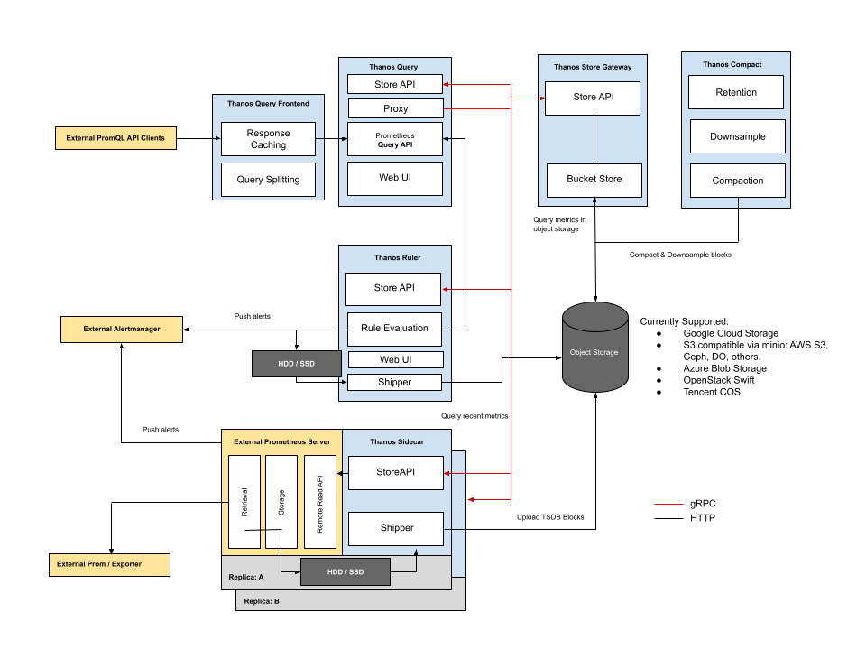
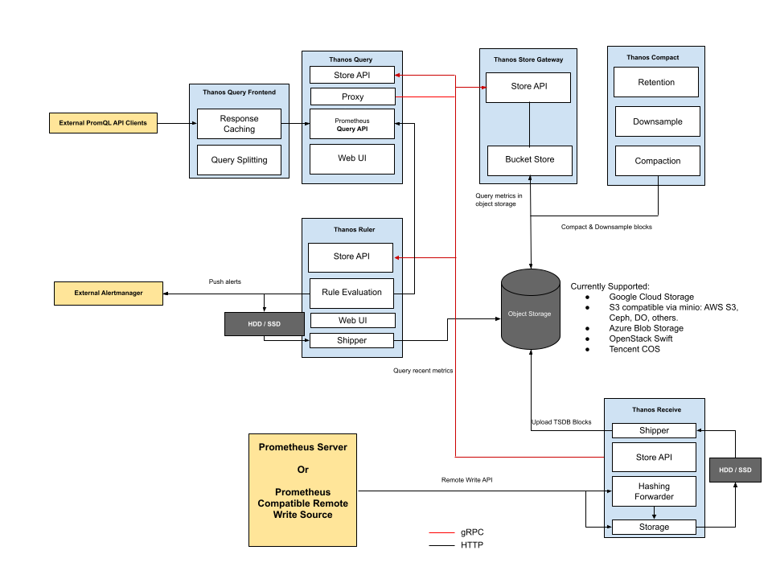
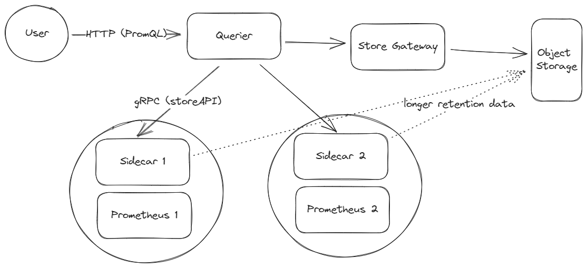
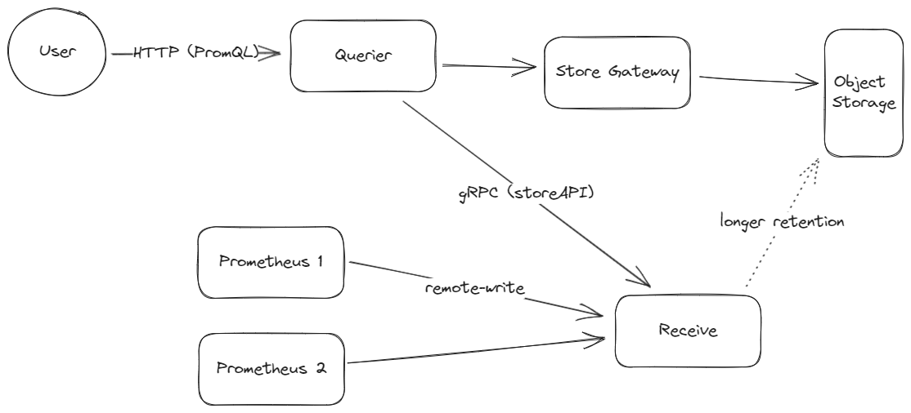

# Self-assessment
The Self-assessment is the initial document for projects to begin thinking about the
security of the project, determining gaps in their security, and preparing any security
documentation for their users. This document is ideal for projects currently in the
CNCF **sandbox** as well as projects that are looking to receive a joint assessment and
currently in CNCF **incubation**.

For a detailed guide with step-by-step discussion and examples, check out the free
Express Learning course provided by Linux Foundation Training & Certification:
[Security Assessments for Open Source Projects](https://training.linuxfoundation.org/express-learning/security-self-assessments-for-open-source-projects-lfel1005/).

# Self-assessment outline

## Table of contents

* [Metadata](#metadata)
  * [Security links](#security-links)
* [Overview](#overview)
  * [Actors](#actors)
  * [Actions](#actions)
  * [Background](#background)
  * [Goals](#goals)
  * [Non-goals](#non-goals)
* [Self-assessment use](#self-assessment-use)
* [Security functions and features](#security-functions-and-features)
* [Project compliance](#project-compliance)
* [Secure development practices](#secure-development-practices)
* [Security issue resolution](#security-issue-resolution)
* [Appendix](#appendix)
  * [Threat Modeling](#threat-modeling)

## Metadata

A table at the top for quick reference information, later used for indexing.

|   |  |
| -- | -- |
| Software | <https://github.com/thanos-io/thanos>  |
| Security Provider | No. |
| Languages | Golang |
| SBOM | SBOM generated using FOSSA-cli tool on the latest code base. [Link to SBOM](/assessments/projects/thanos/res/Thanos_SBOM_cyclonedx.bom.json) |
| | |

### Security links

The list of links to existing security relevant documentation for the project:
| Doc | url |
| -- | -- |
| Security file | <https://github.com/thanos-io/thanos/blob/main/SECURITY.md> |
| Multitenancy | <https://thanos.io/tip/operating/multi-tenancy.md/> |
| TLS for cross cluster communication | <https://thanos.io/tip/operating/cross-cluster-tls-communication.md/> |
| HTTPS and Basic authentication | <https://thanos.io/tip/operating/https.md/> |
| Audit logging (queries) (WIP) | <https://thanos.io/tip/proposals-done/202005-query-logging.md/> |
| mTLS for gRPC storeAPIs (roadmap) | <https://thanos.io/tip/proposals-accepted/202106-automated-per-endpoint-mtls.md/> |

## Overview

<!-- One or two sentences describing the project -- something memorable and accurate -->
<!-- that distinguishes your project to quickly orient readers who may be assessing -->
<!-- multiple projects. -->
#### Thanos
Highly available Prometheus setup with long term storage capabilities.

### Background

<!-- Provide information for reviewers who may not be familiar with your project's -->
<!-- domain or problem area. -->

Thanos as a tool extends the capabilities of the Prometheus monitoring tool.
It does so by providing:

* Global View: Thanos allows you to have a global view of your Prometheus metrics.
  It enables you to query metrics from multiple Prometheus instances across different clusters/systems.

* Long-Term Storage: Thanos provides a solution for long-term storage of Prometheus metrics.
  It can store historical data in object storage systems like Amazon S3, Google Cloud Storage,
  or any other compatible storage backend.

* High Availability: By distributing Prometheus data across multiple instances and using
  object storage for long-term storage, Thanos helps in achieving high availability and
  fault tolerance.

* Query Federation: Thanos supports query federation, which means you can run queries across
  multiple Prometheus instances and retrieve the aggregated results.

* Component Architecture: Thanos is composed of several components, including sidecar, querier,
  and store components, each serving a specific purpose in the overall architecture.

By using Thanos in conjunction with Prometheus, organizations can address the challenges of scaling Prometheus for larger deployments and retaining metrics data over longer periods. It's designed to provide a scalable and globally distributed solution for Prometheus monitoring.

Source:<https://github.com/thanos-io/thanos>

### Actors
Description of actors: These are the individual parts of our system that interact to provide the desired functionality.  
<!--Actors are only separated if they are isolated
in some way.  For example, if a service has a database and a front-end API, but
if a vulnerability in either one would compromise the other, then the distinction
between the database and front-end is not relevant. The means by which actors are isolated should also be described, as this is often what prevents an attacker from moving laterally after a compromise. -->

* Queriers: Stateless and horizontally scalable instances responsible for executing PromQL queries.
* Store Gateway: Act as gateways to block data stored in object storage.
* Rule/Ruler: Evaluate recording and alerting rules against data in Thanos.
* Metric Sources: Components that produce or collect metric data, such as Prometheus, Sidecar and Ruler.
* Users: Individuals or organizations utilizing Thanos for their metrics storage and querying needs. These can be individuals running direct queries on Thanos or other PromQL compatible tools for visualisation of the metrics provided by Thanos.
* Sidecar: Deployed along with Prometheus to fetch its metrics.
* Receive: Deployed as a separate component which can receive metrics from Prometheus.
* Compactor: The thanos compact command applies the compaction procedure of the Prometheus 2.0 storage engine to block data stored in object storage and is also responsible for downsampling of data.
* Object Storage: cheaper storage location for longer retention of metrics

Two types of deployment strategies are generally used:
1. Deployment with Thanos Sidecar for Kubernetes
   

3. Deployment via Receive in order to scale out or integrate with other remote write-compatible sources:
   
   
Source: <https://github.com/thanos-io/thanos/tree/main/docs/components>

### Actions
Description of actions: These are the steps that a project performs in order to provide some service 
<!-- These are the steps that a project performs in order to provide some service -->
<!-- or functionality.  These steps are performed by different actors in the system. -->
<!-- Note, that an action need not be overly descriptive at the function call level. -->
<!-- It is sufficient to focus on the security checks performed, use of sensitive -->
<!-- data, and interactions between actors to perform an action. -->
<!---->
<!-- For example, the access server receives the client request, checks the format, -->
<!-- validates that the request corresponds to a file the client is authorized to -->
<!-- access, and then returns a token to the client.  The client then transmits that -->
<!-- token to the file server, which, after confirming its validity, returns the file. -->

###### Actors:
**Metric Sources**  
Primarily Prometheus is used as the metrics source with Thanos.
The targets whose metrics have to be collected are configured in the Prometheus config file.
Prometheus scrapes these endpoints at regular intervals and stores metrics locally in persistent storage.

**User**  
Individual/Tool (like Grafana) sends a request to Thanos Querier for viewing the metrics.

**Sidecar**  
It is deployed along with the Prometheus container in the same pod.  
It queries Prometheus to fetch metrics using remote-read APIs of Prometheus.  
It also requires access to the admin API of Prometheus to fetch the external labels.  
If shipper feature of sidecar is used (for longer retention of Prometheus data in relatively cheaper object storage):  
* Sidecar has access to the Prometheus TSDB (Time series Databse).
* It ships the blocks to the object storage (It has access to the credentials for the object storage).
Optionally it can also watch for changes to the Prometheus configuration file and call the Prometheus reload API to reload its configuration in case of any changes.

**Receive**  
The Receive component exposes Prometheus compatible remote-write API that can be used by Prometheus to send its data.  
The Receive component is used in egress only environments (where Prometheus APIs can't be accessed using Sidecar).  
Similar to Sidecar it also has a shipper component which ships data to the object storage.

**Store Gateway**  
It exposes StoreAPI which can be used by the querier to fetch the historical metrics from the object storage.

**Querier**  
It takes queries from the user and translates it to StoreAPI requests for sidecar+prometheus, receive or the store gateway.  
It exposes the same API as Prometheus which takes queries in the PromQL (Prometheus Query Language). This makes it possible for the User to be a human running an individual query or a tool like Grafana that can use PromQL queries for different visualisations.  
There is no authentication or authorization done by the querier.

There are two types of deployment models as listed in Actors section:

**Pull mode**  
In pull mode (Sidecar pulls metrics from prometheus) the workflow is as follows:  

**Push mode**  
In push mode (Prometheus pushes metrics to Receive) the workflow is as follows:  

The above two deployment models can be used together to combine different environments where both these strategies are required.

There are other independent workflows that are running:  
Compactor -> Object Storage  
The compactor downsamples and aggregates data stored in object storage for faster retrieval of historical data.  
Compactor is the only component which should have delete rights to the object storage.

In addition Thanos Ruler could be deployed which would add another source for the querier to fetch from using the storeAPI exposed by Ruler.

###### Simplified Step-by-step description of how Thanos works:
* The user wants metrics.
* The user initiates a query to gather the metric data.
* Metric data is pulled from the Thanos store and Thanos sidecar. The querier performs mandatory operations such as filtering, aggregation and compaction.
    * The Thanos query uses the gRPC protocol to talk to Thanos store and the sidecar.
* The metrics are delivered to the user.

> Similar actions are done in push mode; except, querier pulls from Receive instead of sidecar.

###### Basic Deployment:
* Set up a Prometheus server instance.
* Have sidecar run alongside the Prometheus instance.
* Give the querier the ability to communicate with sidecar.
* Deploy Thanos store to fetch metrics stored in long term storage.
* Set up compactor for compaction and downsampling.
* Configure node exporter container to expose node metrics.
* Use Grafana for visualization.

**Sources:**  

<!-- [Maintaners.md](https://thanos.io/tip/thanos/maintainers.md) -->
<!--[Scaling Prometheus](https://blog.purestorage.com/purely-technical/scaling-prometheus-with-thanos-for-long-term-retention/) -->
<!-- [Prometheus and Thanos](https://medium.com/@sagivsza/prometheus-and-thanos-an-ultimate-alliance-for-scalable-metrics-9a1cb911abf5) -->
[Components](https://github.com/thanos-io/thanos/tree/main/docs/components)  
[Interactive Tutorials](https://killercoda.com/thanos/)
[Thanos-Monitoring ](https://thesaadahmed.medium.com/thanos-monitoring-with-prometheus-and-grafana-843ed231c8a6)

### Goals
Description of Goals: This are the intended goals of the project, including the security guarantees the project is meant to provide .
<!-- The intended goals of the projects including the security guarantees the project
 is meant to provide (e.g., Flibble only allows parties with an authorization
key to change data it stores).-->
General:
* Global Query View: Scaling Prometheus setups to allow querying across multiple servers and clusters.
* Unlimited Retention: Storing metrics for an unlimited time in the chosen object storage.
* Downsampling & Compaction: Downsampling historical data for faster query execution and configuring complex retention policies
* Prometheus compatible: Allowing you to use the same tools that support the Prometheus Query API.

Security:

These features and practices demonstrate Thanos's commitment to security within its scope of enhancing Prometheus's monitoring capabilities. However, it is important to note that the Thanos team does not consider themselves security experts and focuses on avoiding security concerns rather than implementing advanced security features.

* Best Programming Practices: The Thanos team emphasizes the use of best programming practices. This includes heavy testing, end-to-end tests against major object storages, using vetting and static analysis tools for every pull request, and employing secure protocols in their building processes, such as when producing Docker images.
Data Handling and Privacy: Thanos does not log or use instrumentation to record data stored in the TSDB (Time Series Database). This approach is crucial for ensuring the privacy and security of stored metrics data.
* Use of Cryptography Tools: Whenever cryptographic tools are utilized, Thanos relies on free, libre, open-source software (FLOSS) and standard libraries, such as the official Go cryptography library. This ensures the use of well-vetted and secure cryptographic methods.
* Transport Layer Security (TLS): TLS is used by default for communication with all object storages, providing an additional layer of security for data in transit.
* Secured delivery against man-in-the-middle (MITM) attacks
* Software Updates and Reliability: The team uses stable versions of Go for building their images and binaries and updates to new versions as soon as they are released. This practice helps in maintaining the security and reliability of the software.

Limitations:
* Currently, Thanos does not support encrypting metrics in local storage or client-side encryption for object storage. It is recommended to use server-side encryption for object storage. Additionally, authorization or TLS for Thanos server HTTP APIs is not yet specified.

Sources:  

[Security.MD](https://github.com/thanos-io/thanos/blob/main/SECURITY.md)

[Best Practices](https://www.bestpractices.dev/en/projects/3048#security)

[Thanos.io](https://thanos.io)

<!--* Global query view of metrics.
* Unlimited retention of metrics.
* High availability of components, including Prometheus.
* Deduplication and merging of metrics collected from Prometheus HA pairs
* Seamless integration with existing Prometheus setups
* Any object storage as its only, optional dependency
* Downsampling historical data for massive query speedup
* Cross-cluster federation
* Fault-tolerant query routing
* Simple gRPC "Store API" for unified data access across all metric data
* Easy integration points for custom metric providers -->

### Non-goals
Description of Non-goals: Non-goals that a reasonable reader of the project’s literature could believe may
be in scope.
<!--*Non-goals that a reasonable reader of the project’s literature could believe may
be in scope (e.g., Flibble does not intend to stop a party with a key from storing
an arbitrarily large amount of data, possibly incurring financial cost or overwhelming
 the servers) -->

* Security:
    * Although securing metrics is important for the sake of data privacy & integrity, security is not the reason for existence for the Thanos project.The project primarily aims to enable users to analyze historical data retrospectively, especially data that may not have been stored by Prometheus initially. This can be useful for purposes such as diagnosing security breaches or utilizing metric-like data over time. Additionally, Thanos aims to be a lightweight, highly available program to store metrics and crunch numbers, so it would be misinformed to assume data security is the priority in all components of their project. (i.e. lack of encryption of locally stored data).
    * Client-side encryption for local storage: Thanos does not support encrypting metrics in local storage or client-side encryption for object storage.
    * Authorization or TLS  for Thanos server HTTP APIs is not yet specified.
* Real-time monitoring and altering: Thanos does not provide real time monitoring. It simply extends Prometheus by providing long term, scalable storage and querying capabilities. For real time monitoring results, you have to use Prometheus directly. While Thanos integrates Prometheus, it does not contain built in alerting mechanisms.
* Thanos does not restrict a user from storing extremely large amounts of data, even when its costly for Thanos or challenges server capacity.
* Thanos does not guarantee that data never gets lost or is always consistent across all replicas and remote storage systems.

Source: <https://thanos.io/tip/thanos/maintainers.md>
<!--Other features:
*Seamless integration with Prometheus .
*Easy deployment model .
*Minimal baseline cost. -->

## Self-assessment use

This self-assessment is created by the Thanos team to perform an internal analysis of the
project's security.  It is not intended to provide a security audit of Thanos, or
function as an independent assessment or attestation of Thanos's security health.

This document serves to provide Thanos users with an initial understanding of
Thanos's security, where to find existing security documentation, Thanos plans for
security, and general overview of Thanos security practices, both for development of
Thanos  as well as security of Thanos.

This document provides the CNCF TAG-Security with an initial understanding of Thanos
to assist in a joint-assessment, necessary for projects under incubation.  Taken
together, this document and the joint-assessment serve as a cornerstone for if and when
Thanos seeks graduation and is preparing for a security audit.

## Security functions and features

**Critical:**
A listing of critical security components of the project with a brief description of their importance.  It is recommended these be used for threat modeling. These are considered critical design elements that make the product itself secure and are not configurable.  Projects are encouraged to track these as primary impact items for changes to the project.

* Components communicate securely with TLS. This prevents unauthorized modification of data in transit.
* High availability and fault tolerance is achieved by distributing Prometheus data across multiple instances and using object storage for long-term storage. Because of redundancy in multiple components, if one part of the system fails, the user can still perform certain actions.
* Thanos uses Prometheus built in authentication and authorization mechanisms. Users can leverage Prometheus to implement customizable authentication and authorization methods to meet their security needs.
* Thanos uses Prometheus Role Based Action control system. This means that access to certain functionalities can be prevented based on a user's role and permission.

**Security Relevant:**
A listing of security relevant components of the project wit a brief description.  These are considered important to enhance the overall security of the project, such as deployment configurations, settings, etc.  These should also be
included in threat modeling.

* Logging and monitoring of Thanos components to detect security breaches:
   * Make a log of what components were used, when, how by what user etc.
   * The log should keep track of authentication and authorization events within components.
      * Example: An unauthorized user tries to access Thanos Query APIs. A log entry is made for this request. The log entry might contain information such as the time the request was made, the user's IP address,  information about the requested API endpoint, the authentication status (failed/successful) etc. By regularly analyzing these logs, signs of a security breach could be detected. For example, multiple unsuccessful authentication attempts, unusual patterns in the timing or frequency of access attempts, weird or unathorized API endpoint request may indicate that a breach had occured. Security personnel would then investigate.    
* Properly configuring components to ensure a secure deployment.
   * For example, your Thanos deployment might use role-based access control policies to restrict what operations users with varying roles or permissions can perform.For instance, an administrator might have complete control of the query api, an operator might have the minimum necessary access to complete their duties, a viewer might only have read access.
* Securing data by setting up robust access control and encryption mechanism on the storage backend.

Source: <https://thanos.io/tip/thanos/maintainers.md>

## Project compliance

<!--* Compliance.  List any security standards or sub-sections the project is
  already documented as meeting (PCI-DSS, COBIT, ISO, GDPR, etc.). -->
*  Thanos does not currently document meeting particular compliance standards.
*  Although not meeting any particular standards, Thanos relies on FLOSS (Free/Libre Open-Source Software) libraries and TLS encryption to ensure robustness and security.

## Secure development practices
Thanos has achieved the passing level criteria in Open Source Security Foundation (OpenSSF) best practices.
<!--* Development Pipeline.  A description of the testing and assessment processes that
  the software undergoes as it is developed and built. Be sure to include specific
information such as if contributors are required to sign commits, if any container
images immutable and signed, how many reviewers before merging, any automated checks for
vulnerabilities, etc.
* Communication Channels. Reference where you document how to reach your team or
  describe in corresponding section.
  * Internal. How do team members communicate with each other?
  * Inbound. How do users or prospective users communicate with the team?
  * Outbound. How do you communicate with your users? (e.g. flibble-announce@
    mailing list)
* Ecosystem. How does your software fit into the cloud native ecosystem?  (e.g.
  Flibber is integrated with both Flocker and Noodles which covers
virtualization for 80% of cloud users. So, our small number of "users" actually
represents very wide usage across the ecosystem since every virtual instance uses
Flibber encryption by default.)-->

Signing Work - DCO Process: Contributors agree to the Developer Certificate of Origin (DCO) and must sign off their commits with their name and email. This ensures the legal right to make contributions.
Testing and Formatting: Various make commands are used to ensure the code and documentation adhere to standards. This includes make docs, make changed-docs, make check-docs, and make format for code formatting.
Testing Procedures: Thanos includes several testing commands such as make test for Go unit tests, make test-local excluding tests for object storage integrations, and make test-e2e for end-to-end docker-based tests.

#### Development Pipeline:

* Commit Signing: Contributors sign their commits as part of the DCO process.
Testing and Assessment: The code undergoes various tests including unit tests, local tests excluding certain integrations, and end-to-end tests.
* Code Review: While specific information on the number of reviewers required before merging isn't explicitly detailed, the use of GitHub for project hosting implies a collaborative review process. [we can see from approved PR’s that a good number of people review the PR before it merges]
* Automated Checks: Automated formatting checks and tests are part of the development process, ensuring code quality and standards.

#### Communication Channels:

* Internal Communication: Team members use tools like GitHub and Slack for internal communication, with dedicated channels for development discussions.
* Inbound Communication: Users or prospective users can interact with the team via the #thanos and #thanos-dev channels on Slack​​.
* Outbound Communication: Updates and announcements are shared on social media platforms like Twitter (@ThanosMetrics). The Thanos Community Office Hours serve as a forum for updates and discussions.
* Ecosystem Integration: Thanos, as an extension of Prometheus, fits into the cloud-native ecosystem by enhancing monitoring and long-term data storage. Its integration with Prometheus makes it a key component in the observability stack for cloud users, indirectly impacting a wide range of users relying on cloud services.

Source: <https://thanos.io/tip/contributing/contributing.md/>

## Security issue resolution

<!--* Responsible Disclosures Process. A outline of the project's responsible
  disclosures process should suspected security issues, incidents, or
vulnerabilities be discovered both external and internal to the project. The
outline should discuss communication methods/strategies.
  * Vulnerability Response Process. Who is responsible for responding to a
    report. What is the reporting process? How would you respond?
* Incident Response. A description of the defined procedures for triage,
  confirmation, notification of vulnerability or security incident, and
patching/update availability.-->
Responsible Disclosures Process

> * Security Policy Awareness: Thanos team acknowledges the importance of security and strives to avoid security concerns and sensitive data handling.
> *  Vulnerability Reporting: Suspected security issues or vulnerabilities should be reported privately via the Thanos Team email address: thanos-io@googlegroups.com.
> *  Data Sensitivity: Metric data is considered sensitive and important, while external labels and query API parameters are less sensitive.

Vulnerability Response Process
> * Responsibility: The Thanos team is responsible for responding to security vulnerability reports.
> * Reporting Process: Vulnerabilities are reported via email to the Thanos team thanos-io@googlegroups.com. The team likely follows internal procedures for validating and addressing these reports, although specific details of this process are not publicly documented.
> * Response Actions: The team investigates and works to resolve the reported vulnerabilities.

Incident Response
> * Triage and Confirmation: The team performs an initial assessment to confirm the validity of the reported vulnerability or security incident. [github issues]
> * Notification: All updates are shared on these social media channels: thanos.io / @ThanosMetrics / github repo
> * Patching/Update Availability: The team develops and releases patches or updates to address security issues. Information about supported versions indicates a commitment to maintaining security in newer versions of the software.  
    SOURCE: <https://github.com/thanos-io/thanos/security>

## Appendix

##### Known Issues Over Time.
No vulnerabilites have been disclosed in the Thanos project, but the project may still be impacted by vulnerabilities in Thanos' tools and underlying framework (for instance vulnerabilites in Golang). It is important to note that all of Thanos' security-related issues, including both fixes and enhancements, are not treated separately from other issues on the GitHub platform.

#### [CII Best Practices](https://www.coreinfrastructure.org/programs/best-practices-program/).

The Thanos project has achieved the passing level criteria and has also attained a silver badge in Open Source Security Foundation (OpenSSF) best practices badge.
 [Thanos openssf best practies](https://www.bestpractices.dev/en/projects/3048).

  <!--Best Practices. A brief discussion of where the project is at
  with respect to CII best practices and what it would need to
  achieve the badge.-->

#### Case Studies.
Many organisations have adopted Thanos and are using our project in production [[adopters-list](https://github.com/thanos-io/thanos/blob/main/website/data/adopters.yml)]. Here are few Case studies:

###### Aiven
Aiven is a cloud-native data infrastructure platform that provides fully managed open source database, streaming, and analytics services on 11 clouds and over 150 regions. Aiven offers open source products including PostgreSQL, MySQL, ClickHouse, Cassandra, M3, InfluxDB, along with streaming platforms such as Kafka and Flink. Aiven has a major investment in upstream contributions not altering the true open source solutions which are offered making Aiven the open source data platform for everyone. Aiven also provide ease of use, reliability, scalability, security, and cost-effectiveness for their users.

Initially, Aiven used InfluxDB but it was unable to handle their scale of fleet and variability of cloud infrasturcture.  M3 fit the bill, architecturally, at the time.  Fast forward to 2022, with the changes at Uber and Chronosphere , contibutions were no longer being made to M3DB.  M3DB was missing a lot of new functionality which were introduced to Prometheus over time. As a result, Aiven had to look for a replacement project.

After conducting their research, they saw that their main options were Cortex and Thanos. Cortex has similar problems to M3DB. Thanos was the better fit. It had a vibrant ecosystem, aligned with software foundations, and was Apache 2.0 licensed. Aiven tested Thanos by using proof of concept. After conducting the test, Aiven found that Thanos was feasible and its cost savings were pretty significant. Additionally, Thanos performed better than M3DB and Thanos' queries were faster.

Aiven is excited to offer a managed Thanos as a service as a product . They plan to continue contibuting to Thanos, and hope to have dedicated members of  their Open Source Program Office (OSPO) in the future working in the Thanos community.

To read more, see source [2023-06-08-thanos-at-aiven.md](https://github.com/thanos-io/thanos/blob/main/docs/blog/2023-06-08-thanos-at-aiven.md)

###### Medallia
Medallia successfully operates a hybrid architecture involving both federated queries and remote-write using Prometheus and Thanos components. This allows their users to experience high-performance queries of software and infrastructure metrics generated across 10 large colocation data centers and 30+ small virtual data centers via a single pane of glass.

In their observability journey, Medallia faced several issues such as a costly cloud based vendor solution to a self hosted open source solution with a limited scale. Medallia adopted Prometheus and Thanos to address these scalability issues.

Thanos addressed several problems by:
* Horizontally scaling their Prometheus.
* Retaining one year of metrics samples without vertically scaling their Prometheuses.
* Simplifying management by deploying identical architecture in each data center.
* Providing a global view of all metrics.
* Quick implentation of Thanos' components.

In early 2020, the SRE task force handed off their proof of concept to the newly-formed Performance and Observability (POE) team for hardening, widespread launch, and ongoing support. As Medallia expanded into public cloud providers, they faced dificulty with incorporating metrics from smaller virtual data centers.
Despite these challenges, the hybrid solution was able to meet their needs. It allowed them to mantain flexibility and stability while adapting to the changing infrastructure landscape.

For the past 3 years, the ability of Thanos components to play various roles within Medallia's architecture to support their ever-increasing scale of Prometheus-based metrics has been extremely valuable.

Medallia is now considering a shift to a 100% remote-write architecture with centralized storage to reduce overall complexity. However, they expect Thanos' components to remain a major part of their solution. They recommend Thanos to anyone facing a need to operate Prometheus metrics at any scale and the abilitiy to mantain flexibility in their architecture to accommodate change.

To read more, see source [2022-09-08-thanos-at-medallia.md](https://github.com/thanos-io/thanos/blob/main/docs/blog/2022-09-08-thanos-at-medallia.md)

#### Related Projects / Vendors.
Reflect on times prospective users have asked about the differences between your project and projectX. Reviewers will have
the same question.

###### Victoria Metrics
VictoriaMetrics is a fast, cost-effective and scalable monitoring solution and time series database.

Victoria Metrics, while maintaining a simpler architecture, also includes several core components:
* single-node- All-in-one binary, which is very easy to use and maintain. Single-server-VictoriaMetrics perfectly scales vertically and easily handles millions of metrics/s;
* cluster- Set of components for building horizontally scalable clusters. This version of Voctoria Metrics has extra components such as VMSelect, VMInsert and VMStorage nodes.
* vmagent- Data scraper than can pull data from a variety of sources and sends it to Victoria metrics or another remote storage that supports InfluxDB or Prometheus remote write protocol.
* vmalert- Executes a list of the given alerting or recording rules against configured -datasource.url compatible with Prometheus HTTP API.
* vmctl- The command line tool provides various useful actions with VictoriaMetrics components. It migrates data from different Timescale Dtabases (TSDBs) to Victoria Metrics.
* vmstorage- Where data is stored.
* vmui- Victoria Metrics' user interface.

Key differences:
* Purpose- Thanos was created to extend Prometheus by providing multi-cluster monitoring and long-term storage. Its main goals are a global query view, unlimited retention and downsampling. VictoriaMetrics began as an alternative long term remote storage TSDB for Prometheus.
* Architecture- Thanos has a modular system with several components that each have different functions. This system provides functionality. VictoriaMetrics has single node and cluster versions. Victoriametrics provide simplicity and ease of deployment.
* Storage- Thanos uses TSDB. VictoriaMetrics is morre storage effeicent due to having its own custom storage and compression algorithms.
*  Query language- Thanos uses PromQL just like Prometheus. VictoriaMetrics uses metricsQl which is baskwards compatible with PromQL.
* High Avaliability and Reliability: Thanos relies on  object storage for long term data and has replication features in other components; this provides high availability. VictoriaMetrics has a cluster version and stores its data on local storage which provides high availability and redundancy.
* Downsampling & retention: Both Thanos & VM has downsampling and customizable retention policies, the specifics of each may vary.
* Integration: Thanos integrates closely with Prometheus and can integrate with Grafana.VictoriaMetrics implements MetricsQL - query language inspired by PromQL. MetricsQL is backwards-compatible with PromQL, so Grafana dashboards backed by Prometheus data source should work the same after switching from Prometheus to VictoriaMetrics.
* Performance: Both Thanos and VictoriaMetrics handle large workloads seamlessly.  Some prefer Thanos since it has a modular architecture that can be customized for specific setups. Some prefer VictoriaMetrics and believe that it's faster, more resource-effecient and uses CPU and disk space better.

Sources:  
[Thanos vs. VictoriaMetrics](https://last9.io/blog/thanos-vs-victoriametrics/) 
[VictoriaMetrics documentation](https://docs.victoriametrics.com/Single-server-VictoriaMetrics.html)

<!--###### Mimir
Grafana Mimir is an open source software project that provides a scalable long-term storage for Prometheus. Some of the core strengths of Grafana Mimir include:
* Ease of installment and maintenance : Grafana Mimir’s extensive documentation, tutorials, and deployment tooling make it quick to get started. Using its monolithic mode, you can get Grafana Mimir up and running with just one binary and no additional dependencies. Once deployed, the best-practice dashboards, alerts, and runbooks packaged with Grafana Mimir make it easy to monitor the health of the system.
* Massive scalability: You can run Grafana Mimir's horizontally-scalable architecture across multiple machines, resulting in the ability to process orders of magnitude more time series than a single Prometheus instance.
* Global view of metrics: Grafana Mimir enables you to run queries that aggregate series from multiple Prometheus instances, giving you a global view of your systems.
* Cheap, durable metric storage: Grafana Mimir uses object storage for long-term data storage, allowing it to take advantage of this ubiquitous, cost-effective, high-durability technology. It is compatible with multiple object store implementations, including AWS S3, Google Cloud Storage, Azure Blob Storage, OpenStack Swift, as well as any S3-compatible object storage.
* High availability: Grafana Mimir replicates incoming metrics, ensuring that no data is lost in the event of machine failure. Its horizontally scalable architecture also means that it can be restarted, upgraded, or downgraded with zero downtime, which means no interruptions to metrics ingestion or querying.
* Natively multi-tenant: Grafana Mimir’s multi-tenant architecture enables you to isolate data and queries from independent teams or business units, making it possible for these groups to share the same cluster.

Key differences:  -->

###### Cortex
Cortex is a  horizontally scalable, highly available, multi-tenant, long term storage for Prometheus.

* Horizontally scalable: Cortex can run across multiple machines in a cluster, exceeding the throughput and storage of a single machine. This enables you to send the metrics from multiple Prometheus servers to a single Cortex cluster and run "globally aggregated" queries across all data in a single place.
* Highly available: When run in a cluster, Cortex can replicate data between machines. This allows you to survive machine failure without gaps in your graphs.
* Multi-tenant: Cortex can isolate data and queries from multiple different independent Prometheus sources in a single cluster, allowing untrusted parties to share the same cluster.
* Long term storage: Cortex supports S3, GCS, Swift and Microsoft Azure for long term storage of metric data. This allows you to durably store data for longer than the lifetime of any single machine, and use this data for long term capacity planning.

Key differences:
* Design:
  * Cortex: A horizontally scalable, highly available, multi-tenant, long term storage built on top of Prometheus. Cortex can run across multiple machines, allowing metrics from multiple Prometheus servers to be sent to a single Cortex cluster for a global view of the data.
  * Thanos: Thanos components can be set up into a Prometheus setup that allows reliable metrics, simple operations and long term storage capbilities.
  * Basically Cortex is a ready to use solution that gives you a complete view of the solution. Thanos does something similar but it gives you the flexibility to design and configure each part of your Prometheus server to meet your specific needs.

* Rollout
  * Cortex: Rolled out as a single binary or as multiple independent microservices. Single binery approach is simple and good for testing. Multiple independent approach is used for the prouction stage. It allows you to  scale services for storing and querying metrics as well as for isolating failures.
  * Thanos: Can be deployed independently enabling gradual rollouts and complex deployment scenarios. Thanos can also be rolled out incrementally along side a Prometheus deployment using the side car approach.

* Storage
   * Cortex: To store and query time series data, block storage (based on Prometheus TSDB) is used. Can also be configured to use local storage.
   * Thanos: Metrics stored in configurable object storage clients.

* Features
    *  Global Querying View: Thanos reuses existing Prometheus deployment servers to achieve a global querying view, while Cortex needs a separate central Cortex cluster and storage backend.
    *  Deduplication and Merging of Metrics: * Thanos querier reads from multiple replicas and merges the metrics collected from each pair into a single result. Cortex uses a push-based model. In this model, Cortex elects a leader replica for each Prometheus cluster and drops samples pushed by the other member in the pair. So technically, only samples form a single replica are accepted.
   *  Seamless Integration with Existing Prometheus Setups: Thanos integrates with a sidecar.  Cortex uses remote write to  push data to a central cluster.
   *  Query Optimization: To improve query speed, Thanos downsamples historical data. Cortex, on the other hand uses optimization techniques like batch iterators, caching indexes, HTTP response compression etc.
   * Data Format: With Thanos, data can be read and written as Prometheus TSDB blocks. Cortex is migrating individual Prometheus chunks to object storage for better scalability.

 Source: 
 
 [Thanos vs Cortex](https://last9.io/blog/thanos-vs-cortex/#:~:text=Thanos%20Querier%20can%20pull%20data,deduplicated%20into%20a%20single%20copy)

 [Cortex documentation](https://github.com/cortexproject/cortex)

###### Prometheus

Prometheus, a Cloud Native Computing Foundation project, is a systems and service monitoring system. It collects metrics from configured targets at given intervals, evaluates rule expressions, displays the results, and can trigger alerts when specified conditions are observed.

The features that distinguish Prometheus from other metrics and monitoring systems are:

A multi-dimensional data model (time series defined by metric name and set of key/value dimensions)
PromQL, a powerful and flexible query language to leverage this dimensionality
No dependency on distributed storage; single server nodes are autonomous
An HTTP pull model for time series collection
Pushing time series is supported via an intermediary gateway for batch jobs
Targets are discovered via service discovery or static configuration
Multiple modes of graphing and dashboarding support

Key differences:
* Storage & Scalability: Prometheus is designed for short term monitoring and can't handle large amounts of historical data. Thanos' distributed storage layer allows for scalable, long term storage and query capabilities.
* High availability: Prometheus operates in single server mode. Thanos has a distributed architecture and redundancy in many components . Therefore, even in the face of failures seamless querying and retrieval of data is possible.
* Querying and analysis: Prometheus uses PromQL for retrieve and analyzing time series data. Thanos extends PromQL to query data from multiple Prometheus instances. This enables cross instance aggregation and federation of metrics.
* Retention and downsampling: Prometheus uses local disk storage for short term solutions.  Thanos uses object storage solutions like (Amazon S3 or Google cloud Storage) for long-term data retention.
* Integration & Ecosystem: Prometheus has a rich ecosystem with many integrations and exporters available.  This makes it well suited for monitoring kubernetes and cloud-native environments.  Thanos inherits this integration and also provides scalability and long term storage.
* Recording rules: Prometheus uses recording rules to pre-calculate and store frequently used queries as a new time series. This helps to optimize query perfromance and simplify  complicated calculations. Thanos inherits this feature from Prometheus.
* Downsampling: Prometheus supports downsampling which involves combining data over large time intervals to minimize storage needs and simplify query processing. Thanos inherits this capability from Prometheus.

Source: 

[Prometheus vs. Thanos](https://last9.io/blog/prometheus-vs-thanos/)

[Prometheus documentation](https://github.com/prometheus/prometheus)

### Threat modeling

> STRIDE Model

Spoofing Identity
* Threat : An unknown source pretends to be a trusted source to gain access to Thanos components.
* Mitigation:
  * Authentication mechanisms for each component.
  * Frequently monitor authentication logs.
  * Access control policies to prevent unauthorized access to the system.
    
  (See Security Functions and Features for an example.)

Tampering with data
* Threat: Metrics can be tampered
* Mitigations:
   * TLS is used by default for communication with all object storages, providing an additional layer of security for data in transit.
  * Querier must check the integrity of the metrics received from object storage before delivering it back to the user.
  * If the integrity check fails then the metrics must be discarded and logged as a security event.
      * For example, when the Querier component receives metrics from storage , it can use a checksum or cryptographic method to generate a hash value. If the generated hash value does not match the expected hash value, or some other integrity verification values, the tampered metrics should be discarded.

Repudiation
* Threat: Repudiation of actions perfomed on the Thanos system
* Mitigations:
  * Implement centralized audit collection and alerting for any suspicious activity or security events. For example, a user deleting a metric should raise a security alert. This should be recorded in the audit log and flagged as suspsicious.
  * Implement auditing for actions performed by Thanos users and admin. Also, implement audit logging of components. For example, every time a user performs an action (such as querying or modifying metrics, for instance), their actions should be added to the audit log. The audit log can contain information such as timestamps, their identity, what actions they performed etc. This can help keep users accountable and prevent repudiation of their actions.

Information Disclosure
* Threat: Unauthorized access to sensitive information.
* Mitigation:
   * Server-side encryption must be used for storing data, and TLS encryption for data transmission. For example, the metric data can be stored in an encrypted database.
   * Implementation of proper access control mechanisms to restrict access to sensitive information (See Security Functions and Features).
   * Access of Thanos can be configured/limited to minimize potential attack surface. For example, access to Thanos can be resricted to specific networks or IP addresses. Additionally, unused features should be disabled.

Denial of Service

A malicious attacker can flood the network infrastructure, exhaust resources or conduct a distributed denial of service attack.
When we say conduct a denial of service attack, we do not mean innocent problems like misconfigurations, human errors, newtworking problems, capacity errors,and so forth (however, there should be little to no room for these kind of errors that an attacker can take advantage of). We also do not mean legitimate actions performed by Thanos, such as required maintenance etc.

What we are referrring to instead is bad actors who deliberately overwhelm the system with excessive requests.

* Threat: Disrupt the availability of Thanos services.
* Mitigation:
   * Use rate limiting and throttling mechanisms to prevent excessive consumption of resources. For example, consider using a token bucket algorithm to limit the number of requests a user can make per second.
   * Employ load balancing and redundancy mechanisms to distribute traffic effectively. If we have no load balancing, for example, an attacker may be able to access a component directly through the component's endpoint or IP address and send a high volume of requests to a specific component. Load balancers or technologies like Kubernetes Ingress may be used to distribute traffic more evenly among Thanos components. 
   * Monitor systems for a potential Denial of Service attack.
     * Track metrics such as system performance, resource consumption and network usage. Additionally, use alerting system to notify administrators of unusual spikes.

Elevation of Privilege:
* Threat: An attacker can gain access to private data or perform actions only meant for certain trusted users.
  * For example, if Thanos is not configured to have proper access control mechanisms, a user might be able to change authentication or authorization settings to elevate their access. By doing so, a user could possibly change their role or grant themselves extra permissions to perform sensitive actions.
* Mitigation:
   <!--* Secure communications via TLS encryption -->
   * Prometheus operates with minimum level of access rights necessary to function (principle of least privilege). Thanos can also be configured (via config flags) to minimize its access so that damage-potential is limited.
   * Prometheus is a monitoring tool, so it can be used to raise alerts upon suspicious activity that may coincide with attempts at privilege escalation within Thanos as well.
   * Thanos piggy-backs off of Prometheus's authentication and authorization mechanisms.
   * User permissions must be frequently reviewed.

Sources: 
[Thanos Maintainers](https://thanos.io/tip/thanos/maintainers.md)
[Guide](https://github.com/Rana-KV/tag-security/blob/main/assessments/projects/karmada/self-assessment.md#threat-modeling-with-stride)

