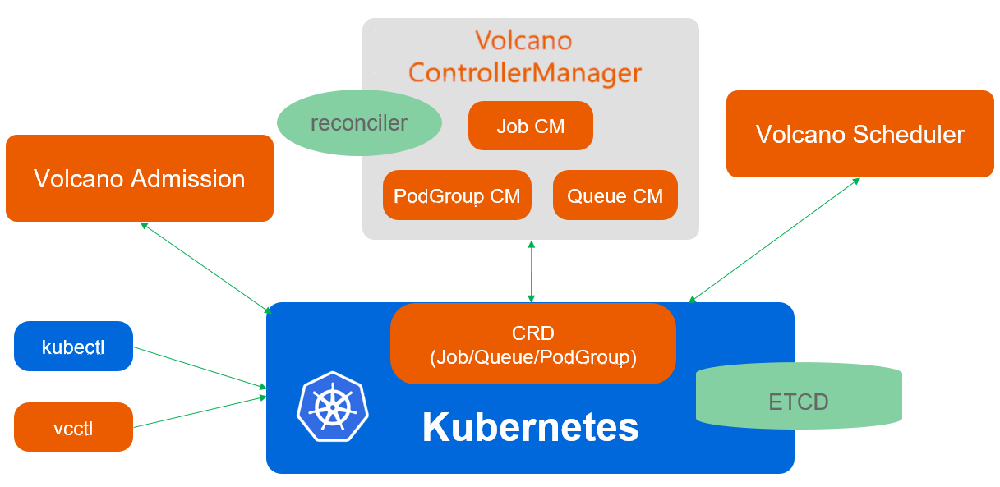

# Self-assessment

Authors: Mayank Ramnani (@mayank-ramnani), Anish Vempaty (@anish-vempaty), Francis Gabriel Delamerced (@fdg238), Ruthvik Akula, George Gonzalez
Contributors/Reviewers: Pranava Kumar Vemula (@Rana-KV)

The Self-assessment is the initial document for projects to begin thinking
about the security of the project, determining gaps in their security, and
preparing any security documentation for their users. This document is ideal
for projects currently in the CNCF **sandbox** as well as projects that are
looking to receive a joint assessment and currently in CNCF **incubation**.

For a detailed guide with step-by-step discussion and examples, check out the free Express Learning course provided by Linux Foundation Training & Certification:
[Security Assessments for Open Source Projects](https://training.linuxfoundation.org/express-learning/security-self-assessments-for-open-source-projects-lfel1005/).

# Self-assessment outline

## Table of contents

- [Metadata](#metadata)
  - [Security links](#security-links)
- [Overview](#overview)
  - [Actors](#actors)
  - [Actions](#actions)
  - [Background](#background)
  - [Goals](#goals)
  - [Non-goals](#non-goals)
- [Self-assessment use](#self-assessment-use)
- [Security functions and features](#security-functions-and-features)
- [Project compliance](#project-compliance)
- [Secure development practices](#secure-development-practices)
- [Security issue resolution](#security-issue-resolution)
- [Lightweight Threat Modelling](lightweight-threat-modelling)
  - [Threat Modelling Notes](threat-modelling-notes)
  - [Theoretical Threats](theoretical-threats)
  - [Potential Controls Summary](potential-controls-summary)
- [Appendix](#appendix)
  - [Badges](#badges)
  - [Links](#links)
  - [Case Studies](#case-studies)
  - [Related Talks](#related-talks)

## Metadata

| | |
|-------------------|----------------------------------------------------------------------------------------------------------------------------------|
| Software          | https://github.com/volcano-sh/volcano
| Security Provider | No
| Languages         | Go, Shell, Makefile, Dockerfile, Python, Smarty|
| SBOM              | [SBOM](SBOM.json)|

### Security links

| Document          | URL
|-------------------|----------------------------------------------------------------------------------------------------------------------------------|
| SECURITY.md | https://github.com/volcano-sh/volcano/blob/master/SECURITY.md|

## Overview

Volcano is a cloud native system for high-performance workloads, which has been accepted by Cloud Native Computing Foundation (CNCF) as its first and only official container batch scheduling project. Volcano supports popular computing frameworks such as Spark, TensorFlow, PyTorch, Flink, Argo, MindSpore, and PaddlePaddle. Volcano also supports scheduling of computing resources on different architectures such as x86, Arm, and Kunpeng.

### Background

Kubernetes is a portable, extensible, open source platform for managing containerized workloads and services, that facilitates both declarative configuration and automation. However, Kubernetes is insufficient with high-performance batch computing. High-performance batch computing requires complex job scheduling and management that is commonly required by many classes of high-performance workloads, including: machine learning/deep learning, bioinformatics/genomics and other big data applications. Volcano enables this requirement by providing powerful batch scheduling capability. It also enables other features such as:
- Support for a rich set of scheduling algorithms
- Enhanced job management using multi-pod jobs, improved error handling and indexed jobs
- Non-intrusive support for mainstream computing frameworks
- Support for multi-architecture computing
In addition, Volcano inherits the design of Kubernetes APIs, allowing you to easily run applications that require high-performance computing on Kubernetes.

### Actors

1. Users: Individuals or systems that interact with Volcano for job management. This could include administrators who configure the system, users who submit jobs, and any external systems that interface with Volcano.
2. Volcano Scheduler: The core component responsible for scheduling tasks. It makes decisions about job placement and resource allocation in the Kubernetes cluster.
3. Volcano API Server: Handles requests and responses between users and the Volcano scheduler. It's a critical interface and thus a separate actor due to its role in processing and validating job submissions.
4. Kubernetes Cluster: While Volcano operates within Kubernetes, the cluster itself can be considered a separate actor. It manages the resources that Volcano schedules jobs onto and enforces access controls.
5. Integrated Systems: Any external systems or tools that Volcano integrates with (e.g., TensorFlow, PyTorch, etc.). These are separate actors as they are external yet interact closely with Volcano.

### Actions

1. User Interaction with Volcano
  - Job Submission: Users submit batch processing jobs to Volcano via the API Server. This includes specifying job requirements, resources needed, and priorities.
  - Configuration and Management: Administrators configure Volcano settings, manage resource quotas, and set security policies.
2. Volcano Scheduler Operations
  - Job Scheduling: The scheduler decides how and when to allocate resources to jobs based on current cluster status, job priority, and resource requirements.
  - Resource Management: Manages the allocation and release of resources in the Kubernetes cluster for scheduled jobs.
3. Volcano API Server Functions
  - Request Processing: Handles and validates requests from users, ensuring they conform to defined schemas and security protocols.
  - Authentication and Authorization: Verifies user identities and checks whether they have sufficient permissions to perform requested actions.
4. Kubernetes Cluster Interactions
  - Resource Provisioning: Kubernetes cluster provides the necessary resources (like CPU, memory, and storage) as dictated by Volcano's scheduling decisions.
  - Enforcement of Security Policies: Kubernetes enforces security policies set by administrators, such as network policies and access controls, affecting how jobs are run and isolated.
5. Integration with External Systems
  - Data Exchange: Volcano may exchange data with integrated systems (like TensorFlow, PyTorch) for processing jobs. This includes sending job data and receiving results.
  - Security Protocol Compliance: Ensures that interactions with these external systems comply with security protocols, maintaining data integrity and confidentiality.

### Goals

- Efficient, optimized batch job scheduling in Kubernetes.
- Secure handling of jobs and data within Kubernetes.

### Non-goals

- Replacing core Kubernetes functionalities.
- Non-batch processing tasks (such as data-set processing/analysis, or machine learning).

## Self-assessment use

This self-assessment is created by the Volcano team to perform an internal analysis of the project's security. It is not intended to provide a security audit of Volcano, or function as an independent assessment or attestation of Volcano's security health.
This document serves to provide Volcano users with an initial understanding of Volcano's security, where to find existing security documentation, Volcano plans for security, and general overview of Volcano security practices, both for development of Volcano as well as security of Volcano.
This document provides the CNCF TAG-Security with an initial understanding of Volcano to assist in a joint-assessment, necessary for projects under incubation. Taken together, this document and the joint-assessment serve as a cornerstone for if and when Volcano seeks graduation and is preparing for a security audit.

## Security functions and features

- Critical:
    + Volcano Scheduler: The heart of Volcano, responsible for making scheduling decisions. Its algorithms and mechanisms are crucial for ensuring that jobs are allocated to the appropriate resources without compromising cluster security. It's non-configurable and central to the system's operation, directly impacting security by enforcing job isolation and resource controls.
    + API Server: Serves as the primary interface for user interactions with Volcano. It is critical for ensuring that all requests are authenticated and authorized, thus preventing unauthorized access and manipulation of job scheduling.
    + Admission Controllers: These play a key role in validating and mutating requests in Volcano. Their correct operation is essential to enforce security policies and prevent malicious or malformed job submissions from affecting the cluster.
- Security Relevant
    + Authentication Mechanisms: While not part of the core functionality, the authentication methods used by Volcano to interface with Kubernetes are vital for securing access. They ensure that only authorized users and systems can interact with Volcano.
    + Logging and Monitoring: These components are crucial for tracking the behavior of the system and identifying potential security incidents. They enable administrators to monitor job submissions, scheduling decisions, and system changes, providing visibility into the system's operation and aiding in incident detection and response.
    + Configuration Management: The way Volcano is configured can significantly impact its security. Secure default settings, proper configuration of resource limits, and job isolation parameters are important to prevent abuse and ensure the stable operation of the system within a Kubernetes cluster.
    + Network Policies: Network configurations within Volcano, especially how it communicates within the Kubernetes cluster and with external systems, are important for securing data in transit and ensuring that the network layer does not become a vector for attacks.

## Project compliance
Not Applicable.

## Secure development practices

- Development Pipeline
    + Contributor Sign-off: Contributors to Volcano are required to sign off on their commits as part of a [Developer Certificate of Origin](https://probot.github.io/apps/dco/) (DCO).
    + Code Review Process: Volcano employs a rigorous [code review process](https://github.com/volcano-sh/volcano/blob/master/contribute.md#code-review), with [multiple maintainers](https://github.com/volcano-sh/volcano/blob/master/MAINTAINERS.md) from different organizations and automated checks using [CodeQL](https://github.com/volcano-sh/volcano/actions/workflows/codeql-analysis.yml). This ensures high standards of code quality and security.
    + Automated Testing and CI/CD: The project utilizes continuous integration and deployment pipelines, including [automated testing](https://github.com/volcano-sh/volcano/blob/master/contribute.md#testing) for vulnerabilities and code quality checks.
    + Container Image Security: If Volcano uses containerized deployments, assess whether the container images are signed and immutable, which adds a layer of security against tampering.
    + Dependency Management: The project should regularly update its dependencies and check for vulnerabilities using tools like OWASP Dependency-Check or similar.
- Communication Channels
    + Internal: The development team uses platforms like GitHub, Slack, and email lists for internal communications.
    + Inbound: Users and prospective users can likely communicate with the Volcano team via GitHub issues, mailing lists, or a dedicated Slack channel.
    + Outbound: Updates and announcements are made through GitHub, mailing lists, blog posts, or social media channels.
- Ecosystem
    + Volcano is a CNCF Sandbox project and integrates with the larger cloud-native ecosystem, providing batch processing capabilities in Kubernetes environments. It is used by companies like Huawei, AWS, JD.com, OpenAI, Baidu, and Tencent, indicating a broad impact across different cloud environments.
    + Volcano [requires two-factor authentication](https://github.com/volcano-sh/volcano/blob/master/docs/development/prepare-for-development.md#setting-up-a-personal-access-token) to be part of the github organization and a personal access token to enable push via HTTPS.
    + Volcano has a defined community membership process that requires sponsorship from two approvers to become a member. [Link](https://github.com/volcano-sh/volcano/blob/master/community-membership.md)

## Security issue resolution

The Volcano project has a [Product Security Team (PST)](https://github.com/volcano-sh/volcano/security#product-security-team-pst) responsible for handling security vulnerabilities, coordinating responses, and organizing both internal communication and external disclosure.
- [Responsible Disclosures Process](https://github.com/volcano-sh/volcano/security#disclosures): Volcano encourages private reporting of security vulnerabilities to their dedicated security email (volcano-security@googlegroups.com). Public disclosure of vulnerabilities is discouraged until the PST has developed a fix or mitigation plan.
    + Vulnerability Response Process 
    + Report Handling: When a security vulnerability is reported to the Volcano security team (via volcano-security@googlegroups.com), the Product Security Team (PST) takes charge of the response.
    + Fix Lead Assignment: A member of the PST volunteers to lead the response, coordinating the development of a fix and communicating with the community.
    + Fix Development: The PST works with the relevant engineers to develop a fix, create a CVSS score, and review the fix in a private security repository.
    + Timeliness: The process is designed to handle disclosures quickly, with initial steps taken within the first 24 hours and the development of a fix within 1-7 days.
- Incident Response. The PST follows a structured process for patching, releasing, and publicly communicating about vulnerabilities. This includes creating a CVSS score, developing fixes, and coordinating with the community and distributors for patch releases and announcements.

## Lightweight Threat Modelling
### Threat Modelling Notes
- There are a total of 190 contributors and only 6 maintainers and owners thus there are 184 non-maintainer users who are in the working groups.

### Theoretical Threats
- Risks of Denial of Service (DoS) attacks that can overload the Volcano scheduler or controller components.
- Potential for unauthorized access or privelege esaclation if RBAC (Role-Based Access Control) policies are not properly configured (since default values for RBAC configuration are not present).
- The possibility of compromised jobs running malicious code if not adequately sandboxed.

1. Deployment Architecture (Pod and Namespace configuration)
  - Misconfigured network policies might allow unauthorized cross-pod or cross-namespace access.
  - Inadequate pod security policies could lead to privilege escalation.
  - Insufficient namespace isolation can result in unauthorized access to sensitive resources.

2. Networking (Internal and External)
  - Exposure of internal services to the public internet could lead to unauthorized access.
  - Lack of encrypted communication channels may allow interception of sensitive data.
  - Unauthorized access through compromised network policies.

3. Cryptography
  - Insufficient key management practices could lead to compromised encryption keys.
  - Use of outdated cryptographic standards may allow attackers to decrypt sensitive data.

4. Multi-Tenancy Isolation
  - Failure to enforce strict multi-tenancy controls can lead to cross-tenant data leakage.
  - Insufficient isolation on shared resources could allow one tenant to access another's data.

5. Secrets Management
  - Potential risks of secrets leakage if they are not stored securely or if they are transmitted over insecure channels.
  - The necessity of implementing a robust secret management system, possibly using Kubernetes Secrets, to handle API keys, passwords, and tokens securely.

6. Authentication
  - The risk of unauthorized access if strong authentication mechanisms are not in place.
  - Importance of implementing multi-factor authentication (MFA) to enhance the security of the system.

7. Authorization (Access Control)
  - The possibility of privilege escalation if Role-Based Access Control (RBAC) policies are not properly defined and enforced.
  - The need to implement the principle of least privilege, ensuring users have only the access they need.

8. Storage
  - Data-at-rest vulnerabilities, including inadequate encryption practices for sensitive data stored within the project’s resources.
  - Ensuring that data storage solutions comply with security best practices and are resilient against data breaches.

9. Audit and logging
  - Importance of maintaining comprehensive audit logs to enable the tracking of all user actions that could affect the security of the system.
  - Need for real-time alerting and monitoring systems to detect and respond to malicious activities quickly.

10. Security Tests
  - Implementation of automated security scanning in the CI/CD pipeline to catch security issues early in the development process.

### Potential Controls Summary
| Threat                  | Description                                             | Controls                                                                                                        | References                                                                                                              |
|-------------------------|---------------------------------------------------------|-----------------------------------------------------------------------------------------------------------------|--------------------------------------------------------------------------------------------------------------------------|
| Deployment Architecture | Configuration vulnerabilities.                          | Misconfigurations in deployment can lead to unauthorized access or privilege escalation.                    | Strict adherence to security best practices in deployment configurations, regular audits, and automated scanning for misconfigurations. Volcano documentation on secure deployment, Kubernetes best practices. Code references from the project repository where RBAC is used. |
| Networking              | Network eavesdropping and data breaches.                | Unsecured network traffic can be intercepted, leading to data leakage.                                       | Encryption of data in transit, use of network policies to restrict traffic flow. Implementation of TLS for all internal and external communications to ensure data confidentiality and integrity. Volcano security practices, Kubernetes network policies. Code references from the project repository where TLS configuration is specified. |
| Secrets Management      | Leakage of Sensitive Information.                       | Secrets such as passwords, tokens, and private keys, if not managed securely, could be exposed to unauthorized persons. | Use Kubernetes Secrets to manage sensitive information and restrict access using RBAC. Consider integrating a secrets management solution like HashiCorp Vault. Kubernetics Secrets Management Documentation, RBAC in Volcano, docs/design/Enhance-Generate-PodGroup-OwnerReferences-for-Normal-Pod.md |
| Application Vulnerabilities | Application Vulnerabilities.                           | Flaws in application code that may be exploited, such as code injection or unauthorized access.              | Regular code reviews, vulnerability scanning, and employing static and dynamic code analysis tools. Volcano contribution guidelines, DCO, .github/workflows/. |
| Generic                 | Inadequate logging.                                     | Insufficient logging may prevent the timely detection and response to security incidents.                    | Volcano implements logging mechanisms as evidenced by script functions to generate log files and code implementations for log handling. hack/run-e2e-kind.sh for script functions related to log generation, pkg/util/socket.go for code references to log handling. |

## Appendix
### Badges
- [Volcano has achieved an Open Source Security Foundation (OpenSSF) best practices badge at passing level.](https://www.bestpractices.dev/en/projects/3012)
- [Volcano has achieved A+ quality as an open source Go project.](https://goreportcard.com/report/github.com/volcano-sh/volcano)

### Links
- [Volcano Usage and Adopters](https://github.com/volcano-sh/volcano/blob/master/docs/community/adopters.md)
- [Volcano Bug Reporting Guidelines](https://github.com/volcano-sh/volcano/blob/master/docs/getting-started/reporting_bugs.md)

### Case Studies
- [Using Volcano in Large-Scale, Distributed Offline Computing](https://volcano.sh/en/blog/ruitian2-en/)
- [ING Bank: How Volcano Empowers Their Big Data Analytics Platform](https://volcano.sh/en/blog/ing_case-en/)
- [How Does Volcano Empower a Content Recommendation Engine in Xiaohongshu](https://volcano.sh/en/blog/xiaohongshu-en/)
- [How Ruitian Used Volcano to Run Large-Scale Offline HPC Jobs](https://volcano.sh/en/blog/ruitian-en/)

### Related Talks
- [The Linux Foundation Talk: Using Volcano and Kubernetes for Cutting-Edge AI Deployment](https://www.youtube.com/watch?v=hjfoEdMD3cI)
- [CNCF Talk (Chinese): Volcano Helps FinTech BigData on K8s](https://www.youtube.com/watch?v=wYEmjqPbjjY)

## Action Items
- Review priveleges of 184 non-maintainer users who are in the working groups.
- Discuss about the default pod security configuration used by Volcano. [Link](https://github.com/volcano-sh/volcano/tree/master/installer#configuration)
- Deployment Architecture: What safeguards are in place to prevent unauthorized access or changes to deployments?
- Networking: How does Volcano secure communication between its services?
- Networking: Are there any additional network security measures (e.g., firewalls, IDS/IPS systems) implemented in the default Volcano deployment?
- Networking: What is the process for updating network policies in Volcano?
- Cryptography: How does Volcano manage cryptographic keys and certificates?
- Multi-tenancy: How does Volcano handle resource isolation and security in a multi-tenant environment?
- Multi-tenancy: Can you describe any multi-tenancy security challenges that have been encountered and how they were resolved?
- Secrets Management: Is Kubernetes Secrets used for Secret Management? For securing daily release workflow and release chart workflow secrets. What is used for securing admission secret, image pull secret?
- Storage: Does Volcano store any sensitive job data? Is [CSCI Storage?](https://kubernetes.io/blog/2019/01/15/container-storage-interface-ga/) used? Is [Dedicated Volume?](https://github.com/volcano-sh/volcano/blob/master/docs/design/dedicated-volume.md) used?
- Logging: Is logging done only using kubectl logs? Is it sufficient to detect an attack or mis-behaviour of Volcano components?
- Security Testing: Other than CodeQL, is there any other security testing used in the development or deployment process?
- Discuss if there are any known security issues or limitations with the current version of Volcano.
- Improve OpenSSF best practices badge from 5/10 to 10/10 by implementing the following tasks:
  - Cryptographically signing release artifacts.
  - Having the project's workflows follow the principle of least privilege. (multiple GitHub workflow tokens were detected with excessive permissions)
  - Fuzzing the project
  - Checking all commits with static code analysis
  - Limiting the project's exposure to open, known unfixed vulnerabilities.
  - Having the project declare and pinned the dependencies of its build process by hash