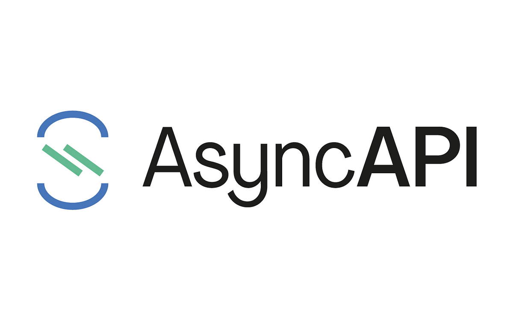

# CloudEvents self-assessment

This assessment was created by community members as part of the [Security Pals](https://github.com/cncf/tag-security/issues/1102) process and is currently pending changes from the maintainer team.

November 26, 2023

Authors: Igor Rodrigues (@Igor8mr), Matthew Gong (@MatthewZGong), Kushal Kothari
(@Kushal-kothari) and Devyani Bairagya (@devyani-14).

Contributors/Reviewers: Pranava Kumar Vemula (@Rana-KV), Doug Davis (@duglin),
Eddie Knight (@eddie-knight) and Ragashree (@ragashreeshekar).

This document was written to elaborate on and explore the design goals of
CloudEvents through a limited security assessment of the software in
collaboration with the project maintainer team. The information contained in
this assessment was extracted from the [CloudEvents GitHub
Repository](https://github.com/cloudevents/spec), and other channels maintained
by the project, such as its [website](https://cloudevents.io/) and [Slack
workspace](http://slack.cncf.io/).

## Table of contents

* [Table of contents](#table-of-contents)
* [Metadata](#metadata)
  * [Security links](#security-links)
* [Overview](#overview)
  * [Background](#background)
  * [Actors](#actors)
  * [Actions](#actions)
  * [Goals](#goals)
  * [Non-goals](#non-goals)
* [Self-assessment use](#self-assessment-use)
* [Security functions and features](#security-functions-and-features)
  * [Critical Security Components](#critical-security-components)
  * [Security Relevant Components](#security-relevant-components)
* [Project compliance](#project-compliance)
* [Secure development practices](#secure-development-practices)
  * [Development Pipeline](#development-pipeline)
  * [Communications Channels](#communications-channels)
  * [Ecosystem](#ecosystem)
* [Security Issue Resolution](#security-issue-resolution)
  * [CloudEvents Specification](#cloudevents-specification)
  * [CloudEvents SDKs](#cloudevents-sdks)
* [Lightweight Threat Modelling](#lightweight-threat-modelling)
  * [Threat Modelling Notes](#threat-modelling-notes)
  * [Threat Scenarios](#threat-scenarios)
  * [Theoretical Threats](#theoretical-threats)
  * [Potential threats](#potential-threats)
  * [Conclusion](#conclusion)
  * [Recommendations](#recommendations)
* [Appendix](#appendix)
  * [Known Issues Over Time](#known-issues-over-time)
  * [CII Best Practices](#cii-best-practices)
  * [Action Item: Setup a system for automatically reviewing
    SDKs](#action-item-setup-a-system-for-automatically-reviewing-sdks)
  * [Case Studies](#case-studies)
  * [Related Projects and Vendors](#related-projects-and-vendors)
  * [References](#references)

## Metadata

|   |  |
| -- | -- |
| Assessment Stage | Incomplete |
| Software | [CloudEvents Repository](https://github.com/cloudevents/spec)  |
| Security Provider | CloudEvents is not a security provider  |
| CloudEvents Specification Language | Markdown |
| CloudEvents SDK Languages | Python, C#/.NET, Go, Java, Javascript, PHP, PowerShell, Ruby and Rust |
| SBOM | CloudEvents does not generate an SBOM at build time |
| Technical Documents | [CloudEvents Documents](https://github.com/cloudevents/spec#cloudevents-documents) |
| | |

### Security links

| Doc | url |
| -- | -- |
| CloudEvents Security Assessment  | <https://github.com/cloudevents/spec/blob/main/docs/CE-SecurityAudit-2022-10.pdf> |
| CloudEvents Privacy and Security Specification | <https://github.com/cloudevents/spec/blob/130ba0d183f5e45c1d141f5c1f272cf71d898623/cloudevents/spec.md#privacy-and-security> |
| CloudEvents SDK Security Standards | <https://github.com/cloudevents/spec/blob/main/docs/SDK-GOVERNANCE.md#ensuring-projects-health> |

## Overview

[CloudEvents](https://cloudevents.io/) is an open-source
[specification](https://github.com/cloudevents/spec) designed to articulate data
events. While these events are widely employed in various industries, the
absence of standardized guidelines for their composition has led to significant
divergence among developers. This lack of uniformity makes programmers create
distinct event-handling logic for each event source, impeding seamless
communication between different systems. CloudEvents aims to streamline the
process of declaring and delivering events, improving simplicity and
interoperability across diverse services and platforms.

The project also provides [software development kits
(SDKs)](https://github.com/cloudevents/spec#sdks) for Go, JavaScript, Java, C#,
Ruby, PHP, PowerShell, Rust, and Python. These can be used to build event
routers, tracing systems, and other tools.

### Background

#### Event

An
[event](https://github.com/cloudevents/spec/blob/130ba0d183f5e45c1d141f5c1f272cf71d898623/cloudevents/spec.md#event)
is a data entry that conveys an occurrence along with its surrounding context.
Events are transmitted from an event producer (the origin) to interested event
consumers. The transmission process may consider the information within the
event, but the event itself does not specify a particular destination for
routing. Events comprise two categories of information: Event Data, which
represents the incident, and Context metadata, which furnishes additional
contextual details about the incident. A single incident can generate more than
one event.

There is no common language on events themselves. So when a new software is
created developers have to write new event handling processes for different
types of sources. This can become very chaotic and unorganized.

CloudEvents was developed to address the need for non-uniformity in event data
formats in cloud and microservices environments. CloudEvents adopts a pragmatic
approach instead of enforcing a universal event format. While it provides a
structured layout, it acknowledges the diverse preferences in the industry.
Users can include event data and context attributes in a single document, and
the support for a binary format seamlessly integrates with existing event
structures. Therefore, CloudEvents standardizes the location for retrieving
shared metadata about an event without the need to parse the specific business
logic of the event.

### Actors

#### Event Consumer

The [Event
Consumer](https://github.com/cloudevents/spec/blob/130ba0d183f5e45c1d141f5c1f272cf71d898623/cloudevents/spec.md#consumer)
is the entity or system interested in subscribing to different events. Receiving
Events from the producer will trigger further action that is up to the consumer.
A "consumer" receives the event and acts upon it, which might lead to the
occurrence of new events.

#### Event Producer

The [Event
Producer](https://github.com/cloudevents/spec/blob/130ba0d183f5e45c1d141f5c1f272cf71d898623/cloudevents/spec.md#producer)
is the entity or system that produces the "events". They are responsible for
wrapping event data in the CloudEvents specification.

#### Event Mediator or Intermediary

Depending on the architecture of the system, the [Event
Mediator](https://github.com/cloudevents/spec/blob/130ba0d183f5e45c1d141f5c1f272cf71d898623/cloudevents/spec.md#intermediary)
is the entity or system that is responsible for the distribution, processing and
routing of events to consumers. The event broker ensures reliable delivery and
may enforce security policies.

#### System Administrator

Responsible for incorporating CloudEvents support into their system to enable
interoperability with other services and applications. The developer can use one
of the CloudEvents SDKs to integrate CloudEvents functionality into their
applications. Developers also collaborate to ensure the proper functioning of
other actors within the CloudEvents ecosystem. They can also report issues they
find to the CloudEvents maintainers, helping improve the specification and/or
SDKs.

#### SDK Maintainers

Part of the CloudEvents ecosystem, they are responsible for the development,
maintenance, and enhancement of CloudEvents Software Development Kits (SDKs). As
stewards of the SDKs, their role is critical in ensuring that developers have
reliable, up-to-date and safe tools to work with. They must triage issues, find
and implement solutions to them and release security patches promptly.

#### CloudEvents Spec Maintainer

A CloudEvents specification maintainer is responsible for developing and
maintaining the CloudEvents standard, ensuring consistency and interoperability
for describing event data. They manage the roadmap, coordinate releases, and
collaborate with the community to implement changes, improving the CloudEvents
specification to facilitate event exchange in diverse cloud environments.

#### CloudEvents Administrator

These central figures in the ongoing development and governance of the
CloudEvents ecosystem and specification. They are responsible for the management
of critical aspects of the CloudEvents infrastructure. For example, the website,
GitHub repos and moderate the meetings.

### Actions

#### Event Formatting

Called by the producer and the consumer. An [Event
Format](https://github.com/cloudevents/spec/blob/130ba0d183f5e45c1d141f5c1f272cf71d898623/cloudevents/spec.md#event-format)
specifies how to serialize a CloudEvent as a sequence of bytes. Stand-alone
event formats, such as the JSON format, specify serialization independent of any
protocol or storage medium. The producer encodes the event, while the consumer
decodes the event.

#### Protocol Binding

A [protocol
binding](https://github.com/cloudevents/spec/blob/130ba0d183f5e45c1d141f5c1f272cf71d898623/cloudevents/spec.md#protocol-binding)
describes how events are sent and received over a given protocol. CloudEvents
defines encoding modes such as
[binary](https://github.com/cloudevents/spec/blob/main/cloudevents/bindings/kafka-protocol-binding.md#32-binary-content-mode)
and
[structured](https://github.com/cloudevents/spec/blob/main/cloudevents/bindings/kafka-protocol-binding.md#33-structured-content-mode)
for serializing a CloudEvent during transmission.

* **Binary Content Mode:** The event data is placed in the message body, while
  the event attributes (metadata) are included in the message's metadata. This
  mode is commonly employed when a CloudEvent producer wants to incorporate
  metadata into an existing event without affecting the message body. Binary
  encoding will maintain a receiver's event processing since the message's
  metadata often accommodates extension attributes.

* **Structured Content Mode:** The event data and attributes are encoded within
  the message body following a specific event format. This mode maintains event
  metadata and data in the payload, facilitating the straightforward forwarding
  of the same event across various routing hops and protocols.

Protocol bindings MAY choose to use an Event Format to map an event directly to
the transport envelope body, or MAY provide additional formatting and structure
to the envelope. For example, a wrapper around a structured-mode message might
be used, or several messages could be batched together into a transport envelope
body.

### Goals

Listed below are the main [goals of
CloudEvents](https://github.com/cloudevents/spec/blob/main/cloudevents/primer.md#design-goals).

* Simplify event declaration and delivery across services, platforms and
  systems.
* Define interoperability of event systems that allow services to produce or
  consume events, where the producer and consumer can be developed and deployed
  independently.
* Establish a structured framework for the exchange of event data among services
  by standardizing the location for storing and retrieving common metadata
  related to events.
* Provide specifications for serializing events in different formats and
  protocols.

### Non-goals

The following are considered as [non-goals of
CloudEvents](https://github.com/cloudevents/spec/blob/main/cloudevents/primer.md#non-goals):

* Function build and invocation process.
* Language-specific runtime APIs.
* Selecting a single identity/access control system.
* Inclusion of protocol-level routing information.
* Event persistence processes.
* Mechanism for Authorization, Data Integrity and Confidentiality.
* Change the implementation details of underlying communication protocols.
* Define the processing logic for events within different applications and
  systems.

## Self-assessment use

This security assessment was created by [Igor
Rodrigues](https://github.com/Igor8mr), [Matthew
Gong](https://github.com/MatthewZGong), [Kushal
Kothari](https://github.com/Kushal-kothari), and [Devyani
Bairagya](https://github.com/devyani-14) to perform an internal analysis of the
CloudEvents project. The document was also reviewed by CloudEvents maintainers
and members of the [CNCF Security Technical Advisory Group
(TAG)](https://github.com/cncf/tag-security). It is meant to provide a current
summary of the project and its security-related aspects. It is not intended to
provide a security audit of CloudEvents, or function as an independent
assessment or attestation of CloudEvents's security health. For the latest state
of the project please check the [CloudEvents GitHub
repository](https://github.com/cloudevents/spec).

This document serves to provide CloudEvents users with an initial understanding
of CloudEvents's security, where to find existing security documentation,
CloudEvents plans for security, and a general overview of CloudEvents security
practices, both for the development of CloudEvents as well as security of
CloudEvents.

This document provides the CNCF TAG-Security with an initial understanding of
CloudEvents to assist in a joint assessment, necessary for projects under
incubation.  Taken together, this document and the joint assessment serve as a
cornerstone as CloudEvents is under review for a Graduation status.

## Security functions and features

### Critical Security Components

Unlike similar projects in the past such as [Simple Object Access Protocol
(SOAP)](https://en.wikipedia.org/wiki/SOAP), CloudEvents does not attempt to
create new security protocols but relies on established, robust protocols. As
emphasized earlier, the Specification exclusively concentrates on standardizing
event creation and their representation across various protocols, avoiding
defining how exactly they should be transported.

#### Event Identification

Every event within CloudEvents is uniquely identified by a specific combination
of
[source](https://github.com/cloudevents/spec/blob/130ba0d183f5e45c1d141f5c1f272cf71d898623/cloudevents/spec.md#source-1)
and
[id](https://github.com/cloudevents/spec/blob/130ba0d183f5e45c1d141f5c1f272cf71d898623/cloudevents/spec.md#id).
Producers must guarantee that each unique event's concatenation of `source` and
`id` remains distinctive. This practice aids in distinguishing events and
preventing the processing of duplicate events.

#### Event Type

The
[type](https://github.com/cloudevents/spec/blob/130ba0d183f5e45c1d141f5c1f272cf71d898623/cloudevents/spec.md#type)
attribute holds a value that characterizes the nature of the event associated
with the initial incident. This attribute is frequently utilized for routing,
observability, policy enforcement, and similar purposes. The producer determines
the format, which may contain details such as the version of the `type`.

#### Event Subject

The
[subject](https://github.com/cloudevents/spec/blob/130ba0d183f5e45c1d141f5c1f272cf71d898623/cloudevents/spec.md#subject)
attribute explains the event's subject within the context of the event producer.
Clarifying the subject in contextual metadata proves particularly beneficial in
scenarios involving generic subscription filtering, where middleware may lack
the ability to interpret the content within the `data` attribute.

#### Event Data Integrity

CloudEvents does not focus on defining the methods for safeguarding data
integrity. Therefore, it is the choice of the user/developer to address this
aspect. One approach to enhance security is to apply encryption to event data
specific to the domain, restricting visibility to trusted entities. The choice
of the encryption mechanism is collaboratively determined by event producers and
consumers, which is an implementation detail defined by the user.

#### Privacy and Sensitive Information Handling

Context attributes should not carry or represent sensitive information.
CloudEvent producers, consumers, and intermediaries can inspect and log context
attributes.
  
### Security Relevant Components

#### Transport Security

Although CloudEvents does not prescribe specific transport security mechanisms,
it is typically conveyed over secure protocols such as HTTPS, ensuring integrity
and confidentiality.

#### Event Source Authentication

The `source` attribute within a CloudEvent provides context for the event
occurrence, establishing reliable and secure source identification.
  
#### Data Schema Verification

The `data` attribute in a CloudEvent contains the actual event data, and its
schema can be defined and validated for consistency and accuracy. This
verification process helps to prevent issues arising from malformed or
unexpected data.

## Project compliance

As of the latest security assessment, CloudEvents does not explicitly document
compliance with specific security standards such as PCI-DSS, COBIT, ISO, GDPR,
etc.

## Secure development practices

### Development Pipeline

#### CloudEvents Membership

There are three project [membership
categories](https://github.com/cloudevents/spec/blob/main/docs/GOVERNANCE.md#membership),
which make it harder for a single individual to make bad changes to the
repository.

* **Member**: Anyone participating in group activities across communication
  channels. No formal registration is required.
* **Voting Member**: Criteria for Voting Members are outlined in the [Voting
  section of the governance
  page](https://github.com/cloudevents/spec/blob/main/docs/GOVERNANCE.md#voting).
  They have equal influence as Members, with specific voting rights during
  formal processes.
* **Admin**: Members with extra privileges for administrative tasks like
  managing the website and GitHub repos. Admin actions require group knowledge
  and consent, including the ability to merge/close PRs, subject to group
  approval. Since the role of an 'Admin' is mainly administrative, the list of
  Members within this group should not need to change regularly but can be done
  with votes.

#### CloudEvents SDK Community

The CloudEvents SDK community is organized as follows:

* Every SDK has its own [Github Team](https://github.com/cloudevents).
* The union of all the SDK maintainers assembles the SDK maintainers group.
* To propose a new SDK for the community, a PR should be opened in the spec
  repository with the documentation changes necessary to point to the new
  repository.

CloudEvents defines an [SDK project as
healthy](https://github.com/cloudevents/spec/blob/main/docs/SDK-GOVERNANCE.md#ensuring-projects-health)
if it meets the criteria below.

* It works with the latest version of the programming language;
* It supports the latest versions of the integrated libraries/frameworks;
* It receives security patches regularly;
* It supports the last N-1 major versions of CloudEvents spec, as defined in;
  Contribution Acceptance;
* Issues and PRs are triaged (labeled, commented, reviewed, etc) regularly.

Moreover, CloudEvents defines an SDK as `not actively maintained` if:

* Issues and/or PRs have not been triaged from the SDK maintainers for 2 months
* Security patches have not been released from the SDK maintainers for 1 month
  from CVE disclosures

If a project does not meet the criteria above, the community can decide to [hand
over the
project](https://github.com/cloudevents/spec/blob/main/docs/SDK-GOVERNANCE.md#handover-to-a-new-maintainergroup-of-maintainers)
to a new group of maintainers through a voting process. In such cases, the
community may also decide to [archive the
project](https://github.com/cloudevents/spec/blob/main/docs/SDK-GOVERNANCE.md#archive-a-project)
instead.

#### Contributing to CloudEvents

##### General Instructions

* Developers can either report a change or create a Github Issue, checking for
  existing issues first.
* All Proposed changes will be done through Github Pull Requests (PRs).
* All patches must be signed by the author, with the sign-off being a simple
  line at the end of the explanation for the patch.
* All commits should use the [Conventional Commits
  Specification](https://www.conventionalcommits.org/en/v1.0.0/).
* Pull Requests will be reviewed during [official
  meetings](https://github.com/cloudevents/spec/blob/main/docs/GOVERNANCE.md#meetings).
  * Off-line reviews are recommended before meetings.
  * Meetings happen every Thursday at 9 AM PT.
* Pull Requests will be resolved and merged during official meetings as a result
  of a motion.
  * Pull Requests should not be merged if substantial changes have been made in
    the past 2 days.

##### Pull Request process

Usually, CloudEvents Pull Requests are expected to meet the following
[criteria](https://github.com/cloudevents/spec/blob/main/docs/SDK-PR-guidelines.md)
before being merged:

* The author of the PR asks for it to be discussed and reviewed in an upcoming
  meeting.
* All comments have been addressed.
* PRs that have objections/concerns will be discussed off-line by interested
  parties. A resolution and updated PR will be expected from those talks.

#### Versioning

The release process follows [Semantic Versioning (semver)](https://semver.org/),
grouping specifications for simultaneous release. Non-breaking changes use
"patch" updates while breaking changes follow `semver`. Tags are applied to the
main branch, and additional branches, like core-v2.0, may be created, and then
deleted post-merger. Creating a release involves updating versions via Pull
requests, merging, and announcing changes.

### Communications Channels

CloudEvents use different types of [communication
channels](https://github.com/cloudevents/spec#communications) for different
purposes.

* Internal communications channels:
  * [Meetings](https://docs.google.com/document/d/1OVF68rpuPK5shIHILK9JOqlZBbfe91RNzQ7u_P7YCDE/edit?usp=sharing)
  * Email
  * GitHub Issues
* Inbound communications channels:
  * [CloudEvents CNCF Email Address](cncf-cloudevents@lists.cncf.io)
  * [CNCF Slack workspace](http://slack.cncf.io/)
  * [CNCF Meeting Calendar](https://www.cncf.io/community/calendar/)
* Outgoing communications channels:
  * [CloudEvents CNCF
    Subscription](https://lists.cncf.io/g/cncf-cloudevents-sdk)

### Ecosystem

CloudEvents is integrated with different cloud-native technologies and services.
Its goal is to create interoperability in event-driven architecture.

CloudEvents has many
[adopters](https://cloudevents.io/#:~:text=CloudEvents%20Adopters), including:

* Adobe I/O Events
* Azure Event Grid
* European Commission
* Google Cloud Eventarc
* IBM Cloud Code Engine
* Oracle Cloud
* VMware Event Broker Appliance

## Security Issue Resolution

CloudEvents currently addresses the reporting of security issues and the
responsible parties for triaging and issuing security patches through documented
processes, such as [how to report issues](#responsible-disclosures-process) and
[who should triage and solve them](#vulnerability-response-process). The
CloudEvents specification does not have centralized documentation of the
Vulnerability and Issue Response Processes; instead, these processes are
currently distributed across different documents, such as the [SDK
Governance](https://github.com/cloudevents/spec/blob/main/docs/SDK-GOVERNANCE.md#ensuring-projects-health)
and
[Contributing](https://github.com/cloudevents/spec/blob/main/docs/CONTRIBUTING.md#reporting-an-issue)
documents.

### CloudEvents Specification

To [report an issue regarding
CloudEvents](https://github.com/cloudevents/spec/blob/main/docs/CONTRIBUTING.md#reporting-an-issue),
contributors can open a new issue on the GitHub repository. However, they should
check if a similar issue already exists.

CloudEvents also provides a dedicated [email
address](cncf-cloudevents-security@lists.cncf.io) and a [Security Mailing
List](https://lists.cncf.io/g/cncf-cloudevents-security/topics) for reporting
security concerns related to the specification or the SDKs.

### CloudEvents SDKs

#### Responsible Disclosures Process

Similarly to the CloudEvents specification, to report an issue about one of the
CloudEvents SDKs, contributors can open a new issue on the GitHub repository, as
well as using the dedicated [email
address](cncf-cloudevents-security@lists.cncf.io) and the [Security Mailing
List](https://lists.cncf.io/g/cncf-cloudevents-security/topics).

#### Vulnerability Response Process

CloudEvets does not specify a strict way on how issues should be handled, but it
defines that it is the [responsibility of the CloudEvents SDK
maintainers](https://github.com/cloudevents/spec/blob/main/docs/SDK-GOVERNANCE.md#security-patches)
to triage issues and PRs from their respective repositories, as well as
frequently release security patches to issues found. As mentioned in
[CloudEvents SDK Community](#cloudevents-sdk-community), the maintainers cannot
abstain from triaging issues and PRs for more than 2 months, or releasing
security patches for more than 1 month. Otherwise, their project will be marked
as `not actively maintained`, which can lead to them losing the management of
the SDK repository.

#### Incident Response

##### Discussing the Issue

After an issue is reported, the maintainers of the SDK will contact the author
of the issue, talking through it to understand whether it should be resolved,
its priority, how a solution could be implemented, and who will implement it,
which can be done through the GitHub issues page of the SDK, Slack, a meeting or
any other CloudEvents communication channel.

##### Solving the Issue

Once a security patch is written, the contributor should make a Pull Request and
mark it as ready to review. The PR will be reviewed, improved, and approved by
the other maintainers of the SDK. With that, a security patch is released by
following the process described in [Contributing to
CloudEvents](#contributing-to-cloudevents).

## Lightweight Threat Modelling

* Project data classification: Sensitive
* Owner(s) and/or maintainer(s):
  * Name: [CloudEvents administrators and
    members](https://github.com/cloudevents/spec/blob/main/docs/contributors.md)
  * Representation: [Cloud Native Computing Foundation
    (CNCF)](https://www.cncf.io/)
  * Contact: [CloudEvents Website](https://cloudevents.io/)

### Threat Modelling Notes

* Where does it store data?
  * CloudEvents primarily defines a specification and does not store data
    itself.
* Is encryption used for data in transit and at rest?
  * The specification recommends using secure protocols for data in transit.
* Is data from potentially untrusted sources subject to input validation?
  * Yes, validation is part of the SDK implementations.

### Threat Scenarios

* **An External Attacker:** Could potentially send malformed or malicious event
  data to disrupt services that consume CloudEvents.
* **An External Attacker with valid access:** Could potentially inject false
  events to lead to incorrect actions being taken by consumers.
* **An Internal Attacker:** Might be able to alter event definitions or
  intercept event data in transit within systems that utilize CloudEvents.
* **A Malicious Internal User:** Could misuse the event system to trigger
  unauthorized actions or services.

### Theoretical Threats

* **Deployment Architecture (pod and namespace configuration):** Not applicable
  to CloudEvents as a specification.

* **Networking (internal and external):** Networking controls are typically
  managed by the underlying infrastructure and transport protocols used for
  sending and receiving CloudEvents.

* **Cryptography:** CloudEvents does not provide encryption methods or
  cryptographic implementations, all implementations are left up to the users'
  choice.

* **Audit and logging:** This is typically handled by the platforms and services
  that implement CloudEvents.

### Potential threats

#### The SDK management teams may implement vulnerabilities while implementing SDKs

Trail Of Bits was able to identify [security concerns regarding the different
CloudEvents SDKs](#trail-of-bits-security-assessment). While these issues have
been addressed, the expanding number of SDKs raises the possibility of
introducing additional vulnerabilities. These vulnerabilities could serve as
potential weak points in systems utilizing CloudEvents.

Mitigations:

* Frequently triage and patch issues.
* Always check if the code can be trusted before merging a Pull Request.
* Perform security audits when possible.

#### Man in the middle acting as Event Mediator

If an attacker can act as a man in the middle for an event mediator, the
intruder may be able to read the events from the event generator or modify them
before they arrive at the event consumer.

Mitigations:

* Users should implement infrastructure around CloudEvents making it difficult
  for bad actors to get access to the systems using CloudEvents or the channels
  delivering the events.

#### CloudEvent Modification in Transit

If event data is not properly encrypted, it could be intercepted and modified by
an attacker, leading to misinformation or unauthorized actions.

Mitigations:

* Users should encrypt, validate, and monitor all important data to reduce the
  impact of modifications during transit.
* User permissions should be routinely checked to ensure that only the
  authorized users have the required capabilities.

#### Improper encoding and decoding of data

A bad actor can send malicious or faulty data with a CloudEvent wrapper to the
main producer. If the decoding of that data is not handled correctly it can lead
to the system crashing.

Mitigations:

* All actors (event producer, event mediator event consumer) should check if the
  data is correctly formatted to the CloudEvents Specification, not passing the
  data forward in such scenarios, but discarding or properly handling it.
* All SDKs should help in handling these scenarios.

#### Committing vulnerable code

Although there are many checks before a Pull Request is accepted, a developer
can still commit code to the source repository that has vulnerabilities if
nobody notices it. This can be either because of malicious intent or because of
mistakes like vulnerable libraries being used.

Mitigations:

* A risk assessment can be done to uncover any potential gaps in the security
  controls.
* All secure development practices established by CloudEvents and CNCF should be
  strictly followed to prevent vulnerabilities from being introduced.

#### Malicious CloudEvent Wrapper

An attacker could wrap malicious content in a CloudEvent to exploit
vulnerabilities in event consumers.

Mitigations:

* Users should check for malicious content when receiving CloudEvent data, not
  trusting the source whenever possible.

### Conclusion

Overall, CloudEvents has solid governance rules and management practices for the
[specification](https://github.com/cloudevents/spec/blob/main/docs/GOVERNANCE.md)
and the
[SDKs](https://github.com/cloudevents/spec/blob/main/docs/SDK-GOVERNANCE.md).
These rules delineate procedures that prioritize security patching, with strict
enforcement mechanisms. Clear articulation of goals and non-goals assists users
in discerning the aspects they need to self-enforce.

A notable challenge within the project revolves around the numerous SDKs
developed by the CloudEvents SDK communities. Certain SDKs, particularly the
newer ones, are susceptible to security vulnerabilities. While governance rules
play a crucial role in ensuring continuous patching and monitoring, some SDKs
have experienced vulnerabilities in the past, highlighting an ongoing concern.

During a [team meeting on November 30, 2023](https://youtu.be/2OZPTQOqFEw), a
CloudEvents administrator also mentioned plans to introduce [bots for regularly
assessing the health of each
SDK](https://github.com/cloudevents/spec/issues/1235). This proactive measure
aims to address potential security concerns that may arise in the future,
mitigating both technical and managerial aspects across various SDKs.

### Recommendations

As mentioned by CloudEvents, the maintainers of SDKs must release security
patches and fix issues frequently for the project to be marked as active. It is
essential for the maintainers of each SDK to frequently triage and release
patches to the security issues found, which can solve problems such as the ones
found by Trail Of Bits. Moreover, it is important for users to frequently check
and install updates to their CloudEvents SDK installation.

## Appendix

### Known Issues Over Time

#### Trail of Bits Security Assessment

CloudEvents underwent a [Security Audit performed by Trail of
Bits](https://github.com/cloudevents/spec/blob/main/docs/CE-SecurityAudit-2022-10.pdf)
released on October 26, 2022.

Trail of Bits is a cybersecurity company based in the United States that
specializes in various aspects of security services, including security
assessments, penetration testing, and software security.

The audit focused on various CloudEvents Software Development Kits (SDKs) rather
than the specification itself. All identified security issues have been
addressed. The report highlighted specific findings for different SDKs, such as
the Java SDK's reliance on default encoding or the outdated and vulnerable
dependencies in both Java and Go SDKs. All of the security issues found by Trail
of Bits have already been addressed.

### CII Best Practices

CloudEvents received a `passing` [CII Best Practices
badge](https://www.bestpractices.dev/en/projects/6770) on December 08, 2022, at
17:02:04.

The project aims to align with the Core Infrastructure Initiative (CII) Best
Practices, focusing on:

* **Security Response Process**: Establishing a comprehensive process for
reporting and addressing security vulnerabilities.
* **Automated Testing**: Implementing automated testing in the development
pipeline for consistent security and vulnerability checks.
* **Dependency Management**: Regular auditing and updating of third-party
dependencies to mitigate security risks.
* **Documentation**: Enhancing documentation to provide clear guidance on
security considerations for developers. These efforts are part of CloudEvents'
commitment to maintaining high standards in open-source software development.

### Action Item: Setup a system for automatically reviewing SDKs

* **GitHub Issue Link:** [Setup Snyk for
  SDKs](https://github.com/cloudevents/spec/issues/1235)

This is an action item that the Security Pals team discussed with CloudEvents,
which can help identify security issues on their repositories, especially those
similar to the [issues found by Trail of
Bits](#trail-of-bits-security-assessment).

#### Action Item Objective

Improve the security of CloudEvents SDKs by integrating [static application
security testing
(SAST)](https://en.wikipedia.org/wiki/Static_application_security_testing),
[Software composition analysis
(SCA)](https://www.synopsys.com/glossary/what-is-software-composition-analysis.html)
and/or [secret scanning
services](https://docs.github.com/en/code-security/secret-scanning/about-secret-scanning)
for automatic dependency assessments. This integration should both conduct
comprehensive scans for vulnerabilities within the SDK and systematically search
the internet for recently reported issues or vulnerabilities linked to the
library dependencies used in the development of CloudEvents SDKs. The automated
tool should alert the development team to threats, helping the implementation of
proactive measures for identifying, addressing, and mitigating potential risks.

#### Action Item Steps

Develop and deploy an automated system to monitor the health of various SDKs by
integrating a bot into the development workflow. Collaborate with the team to
conceptualize the bot's features, ensuring its capability to evaluate
maintenance status, address issues, and implement patch updates following the
rules outlined in the governance documents. Configure the bot to perform checks,
ensuring comprehensive analysis of SDK dependencies. Investigate the feasibility
and requirements for adding a dedicated security bot to scan for potential
security issues. Document the integration process and provide guidelines for
ongoing usage within the development environment.

The CloudEvents team created a [GitHub
Issue](https://github.com/cloudevents/spec/issues/1235) on October 10, 2023, to
implement the Snyk bot for CloudEvents, which is a possible bot that could solve
the issues mentioned above. The Security Pals team wrote a [comment on possible
steps to implement
Snyk](https://github.com/cloudevents/spec/issues/1235#issuecomment-1841532959)
under the issue.

### Case Studies

CloudEvents has the potential to revolutionize event-driven architectures in
various sectors. Below are a couple of enhanced case studies demonstrating its
applicability.

#### Healthcare Data Management

CloudEvents plays a pivotal role in a healthcare system for managing patient
data. In this scenario, it is used to track and route events such as patient
admissions, lab results, and medication orders. By standardizing event formats,
CloudEvents ensures seamless integration between different hospital systems,
including Electronic Health Records (EHRs) and Laboratory Information Management
Systems (LIMS), enhancing patient care and operational efficiency.

#### Smart City Infrastructure Monitoring

In a smart city environment, CloudEvents is employed to aggregate and analyze
data from a multitude of sensors and IoT devices across the city. This includes
traffic flow sensors, public transport updates, and utility usage meters. By
utilizing CloudEvents for real-time data processing and event routing, city
administrators can make informed decisions about traffic management, public
transport schedules, and resource allocation, leading to improved city services
and resident satisfaction.

### Related Projects and Vendors

#### OpenTelemetry

[OpenTelemetry](https://opentelemetry.io/) is a collection of APIs, SDKs, and
tools. It can be used to instrument, generate, collect, and export telemetry
data (metrics, logs, and traces) to help analyze software performance and
behavior.

CloudEvents and OpenTelemetry have different purposes. CloudEvents standardizes
event formats, making it easier for different services to communicate through
events, while OpenTelemetry focuses on observability, allowing developers to
collect and analyze traces and metrics consistently. It's also normal for
systems to use CloudEvents and OpenTelemetry together. Events generated by
CloudEvents could be traced and monitored using OpenTelemetry, providing a
comprehensive view of the system's behavior. Moreover, both projects are [CNCF
Incubating
projects](https://www.cncf.io/projects/#:~:text=Our%20Incubating%20Projects).

#### AsyncAPI

[AsyncAPI](https://www.asyncapi.com/) is an open-source initiative that seeks to
improve the current state of Event-Driven Architecture (EDA). Their long-term
goal is to make working with EDAs as easy as working with REST APIs. That goes
from documentation to code generation, and from discovery to event management.

CloudEvents and AsyncAPI are both specifications designed to facilitate
communication and interoperability in the realm of cloud computing, but they
focus on different aspects of the messaging process. CloudEvents is a standard
for commonly describing event data. It aims to provide a vendor-neutral format
for event data that can be understood across different cloud platforms. On the
other hand, AsyncAPI concentrates on defining standards for documenting
asynchronous APIs. While CloudEvents is focused on standardizing the payload
format of events, AsyncAPI is concerned with documenting the structure and
behavior of APIs in asynchronous systems, helping developers understand how to
interact with messaging services. Therefore, CloudEvents is about the format of
events, while AsyncAPI is about the documentation and specification of
asynchronous APIs.

#### Event-B

[Event-B](https://www.event-b.org/) is a formal method for system-level modeling
and analysis. Key features of Event-B are the use of set theory as a modeling
notation, the use of refinement to represent systems at different abstraction
levels and the use of mathematical proof to verify consistency between
refinement levels.

CloudEvents and Event-B have different uses in event-driven systems. Event-B is
a method designed for the modeling and analysis of systems. It operates at a
high level of abstraction, focusing on refining events and proving properties
about the modeled system. On the other hand, CloudEvents is a specification that
addresses the standardization of event data format in cloud-native environments.
Unlike Event-B, CloudEvents does not offer a formal method for system modeling
or verification. Instead, it concentrates on creating a common standard for
describing events. CloudEvents aims to improve interoperability among
distributed systems and services by providing a consistent structure for event
data.

#### Simple Object Access Protocol (SOAP)

[SOAP](https://en.wikipedia.org/wiki/SOAP) is a messaging protocol specification
designed for the exchange of structured information within the implementation of
web services on computer networks.

This protocol utilizes XML Information Set as its message format and depends on
application layer protocols, primarily Hypertext Transfer Protocol (HTTP),
though certain legacy systems may communicate using Simple Mail Transfer
Protocol (SMTP) for message negotiation and transmission.

According to a CloudEvents maintainer, one of the main distinctions between SOAP
and CloudEvents is the fact that the latter does not aim to develop new security
protocols. Instead, it relies on existing and resilient protocols. As mentioned
before, the CloudEvents Specification focuses solely on standardizing the
creation and representation of events across different protocols, intentionally
steering clear of specifying methods for their transportation. Moreover, while
CloudEvents is focused on lightweight and flexibility, SOAP is more associated
with traditional and heavyweight web services, emphasizing standards and strict
message formatting.

#### Apex Event Specification

The [Apex Event Specification Guide
(ESG)](https://insights.eventscouncil.org/Portals/0/APEX_Event_Specifications_Guide.pdf)
is a written document that contains all the details of an event. The ESG is used
by event organizers to communicate information to venues and suppliers. The ESG
is a three-part template that includes: Narrative, Schedule, and Function
orders.

This is an older document used across many engineering fields, which is not
restricted to computer science, making it different from the other examples.
However, it is an example of event specification being widely used in industry,
including more physical areas such as mechanical engineering and factories.

### References

* [CloudEvents Website](https://cloudevents.io/)
* [CloudEvents GitHub](https://github.com/cloudevents)
* [CloudEvents Security Assessment by Trail of
  Bits](https://github.com/cloudevents/spec/blob/main/docs/CE-SecurityAudit-2022-10.pdf)
* [Security Assessment Guide](https://github.com/Rana-KV/ISP)
* [Sample Security
  Assessment](https://github.com/Rana-KV/tag-security/blob/main/assessments/projects/karmada/self-assessment.md#threat-modeling-with-stride)
* [Open and Secure
  Book](/community/assessments/Open_and_Secure.pdf)
