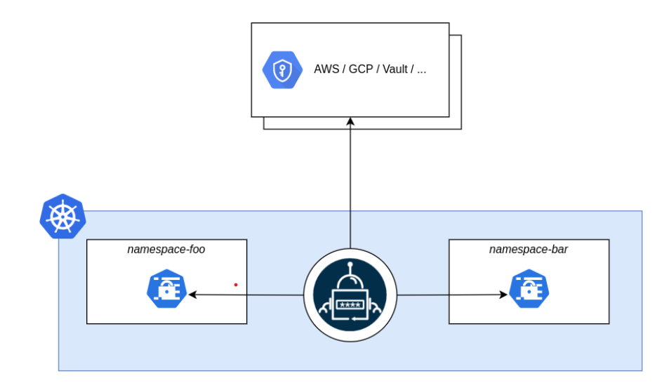
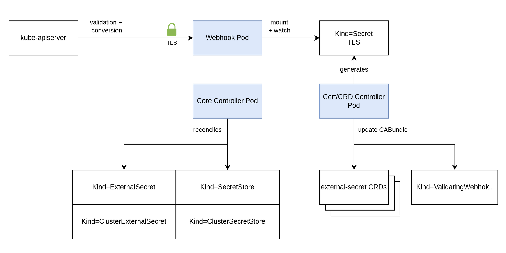

# Self-assessment for External Secrets Operator (ESO)

This assessment was created by community members as part of the [Security Pals](https://github.com/cncf/tag-security/issues/1102) process, and is currently pending changes from the maintainer team.

## Table of contents

* [Metadata](#metadata)
  * [Security links](#security-links)
* [Overview](#overview)
  * [Actors](#actors)
  * [Actions](#actions)
  * [Background](#background)
  * [Goals](#goals)
  * [Non-goals](#non-goals)
* [Self-assessment use](#self-assessment-use)
* [Security functions and features](#security-functions-and-features)
* [Project compliance](#project-compliance)
* [Secure development practices](#secure-development-practices)
* [Security issue resolution](#security-issue-resolution)
* [Appendix](#appendix)
* [Threat Modeling with STRIDE](#external-secrets-operator-threat-modeling)

## Metadata

|    |    |
| -- | -- |
| Assessment Stage | Incomplete |
| Software | A link to the External-Secret Operator's repository: [external-secrets](https://github.com/external-secrets/external-secrets) |
| Security Provider | No  - Primary function is to sync passwords from external secret store to k8 clusters.|
| Languages | Go, HCL, Makefile, Shell, Smarty, Dockerfile |
| SBOM | SBOM is attached to every GitHub release image (under Assets). [Link to latest release](https://github.com/external-secrets/external-secrets/releases) |
| | |

### Security links

| Doc | url |
| -- | -- |
| Security file | [Security.md](https://github.com/external-secrets/external-secrets/blob/main/SECURITY.md) |
| Default and optional configs | [Security Best Practices](https://external-secrets.io/latest/guides/security-best-practices)|

## Overview

External Secrets Operator (ESO) is a Kubernetes operator that integrates external secret management systems like AWS Secrets Manager, HashiCorp Vault, Google Secrets Manager, Azure Key Vault, IBM Cloud Secrets Manager, CyberArk Conjur and many more. The operator reads information from external APIs and automatically injects the values into a Kubernetes Secret.

### Background

The External Secrets Operator (ESO) is a tool designed for Kubernetes, a widely-used system for automating the deployment, scaling, and management of containerized applications. ESO addresses a key challenge in this domain: secure and efficient management of sensitive configuration data, known as "secrets" (like passwords, API keys, etc.).

Typically, managing these secrets within Kubernetes can be complex and risky if not handled properly. ESO simplifies this by integrating Kubernetes with external secret management services (such as AWS Secrets Manager or HashiCorp Vault), which specialize in securely storing and managing these secrets. This integration not only enhances security but also streamlines the process of injecting these secrets into Kubernetes applications.

### Actors

#### 1. External Secret Management Systems

* Examples: AWS Secrets Manager, HashiCorp Vault.
* Technical Details: These systems often employ hardware security modules (HSMs) for hardware-level encryption and secure key management. Utilize OAuth, JWT, or similar token-based authentication mechanisms, which provide robust and revocable access credentials. Feature dynamic secret creation, allowing secrets to be generated on-the-fly and automatically rotated, reducing the lifespan of any single secret.
* Isolation: Network boundaries and authentication mechanisms separate these from the Kubernetes cluster.

#### 2. Kubernetes Cluster (including ESO)

* Role: ESO bridges Kubernetes and external secret systems.
* Integration and Communication: ESO uses the Kubernetes API to interact with the cluster, making use of client certificates for authentication or leveraging service account tokens for more granular control.
* Employs custom resource definitions (CRDs) like ExternalSecret to define how external secrets should be fetched and synchronized.
* Isolation: Kubernetes Role-Based Access Control (RBAC) limits potential lateral movement in case of a compromise.
* For the External Secrets Operator (ESO), the key actors based on its [architecture](https://external-secrets.io/latest/api/components/), which includes the Core Controller, the Cert Controller, and the Webhook, can be described as follows:
  * Core Controller: The Core Controller is the primary component of ESO. It watches for `ExternalSecret` objects in Kubernetes and acts upon changes to these objects. It is responsible for fetching the secrets from external secret management systems and synchronizing them with Kubernetes Secrets.
  * Cert Controller: The Cert Controller is responsible for managing the TLS certificates that are used for secure communication within the Kubernetes cluster, particularly for the webhook service.
  * Webhook: The Webhook in ESO is used for various purposes, including mutating or validating `ExternalSecrets` and other related custom resources. It plays a critical role in ensuring the integrity and correctness of the `ExternalSecret` resources.

#### 3. Kubernetes Secrets

* Function: Store synchronized secrets within the cluster via ESO.
* Isolation: Kubernetes namespaces and access policies provide compartmentalization.
* Storage and Encryption: Kubernetes Secrets are, by default, stored in etcd, a distributed key-value store. Starting from Kubernetes v1.13, etcd data can be encrypted at rest. Integration with external KMS (Key Management Service) for enhanced encryption management of Secrets.
* Access Control:Secrets are often accessed via environment variables or volume mounts in Kubernetes pods, with access strictly controlled based on the pod's service account permissions.

### Actions

The actions performed by ESO to synchronize secrets from/to external sources from/into Kubernetes can be outlined focusing on security checks, data handling, and interactions:

#### 1. Client Request to External Secret Management System

ESO, acting as a client, sends a request to an external secret management system (like AWS Secrets Manager). This request includes authentication and authorization checks to ensure that ESO is permitted to access the requested secrets.

#### 2. Retrieval of Secrets

Upon successful authentication and authorization, the external system sends the requested secrets to ESO. These secrets are transmitted over secure, encrypted channels to ensure their confidentiality and integrity.

#### 3. Validation and Transformation

ESO validates the format and integrity of the received secrets. If necessary, it transforms the data to a format compatible with Kubernetes Secrets.

#### 4. Synchronization to Kubernetes Secrets

ESO then creates or updates Kubernetes Secret objects with the retrieved data. This step involves interacting with the Kubernetes API server, which includes RBAC checks to ensure that ESO has the necessary permissions to perform these operations.

#### 5. Synchronization to Remote Provider

ESO can synchronize secrets back to the provider using PushSecrets. It will keep the remote secret updated based on metadata provided by the user and information about the provider. Based on policy, if the local secret is deleted, remote secrets can either be orphaned or deleted completely.

#### 6. Use by Kubernetes Workloads

Applications or workloads running in Kubernetes can then access these secrets. Access to these secrets within Kubernetes is controlled by namespace-specific policies and RBAC, ensuring that only authorized workloads can retrieve them.

To outline the actions performed by different components of the External Secrets Operator (ESO) that enable its proper functioning, we can break it down as follows:

#### 1. Core Controller Actions

* Monitoring: Continuously watches for ExternalSecret objects within the Kubernetes cluster.
* Secret Retrieval: Fetches secrets from external secret management systems (like AWS Secrets Manager, HashiCorp Vault) based on the details specified in ExternalSecret objects.
* Data Transformation: Converts the fetched secrets into a format compatible with Kubernetes Secrets, if necessary.
* Secret Synchronization: Creates or updates corresponding Kubernetes Secret objects with the fetched data, ensuring they are in sync with the external source.
* Secret Push: Updates remote secrets at the provider based on the provided secret, transforming the secret if template data is provided by the user.

#### 2. Cert Controller Actions

* Certificate Generation: Automatically generates and renews TLS certificates needed for the secure functioning of webhooks.
* Certificate Management: Ensures the validity of certificates and manages their lifecycle, including storage, renewal, and revocation as required.

#### 3. Webhook Actions

* Request Interception: Intercepts requests related to ExternalSecret and other custom resources for validation or mutation before they are processed by the Kubernetes API server.
* Validation: Checks the integrity and correctness of ExternalSecret objects, ensuring they conform to the expected schema and standards.
* Mutation: Optionally modifies ExternalSecret objects as per predefined rules or logic to ensure they meet certain criteria or standards before processing.

### Goals

#### 1. Secure Secret Management

ESO's primary goal is to securely manage secrets within Kubernetes by leveraging external secret management systems. It ensures that sensitive information like API keys, passwords, and tokens are stored and managed in systems specifically designed for this purpose, offering robust security features.

#### 2. Automated Synchronization

ESO automates the synchronization of secrets from these external systems into Kubernetes, ensuring that applications always have access to the latest version of each secret.

#### 3. Automated Synchronization Back to the Provider

Using PushSecrets, ESO can synchronize secrets FROM the Kubernetes cluster TO the remote provider. This is useful for backing up keys, sharing secrets between multiple clusters, maintaining a central secret manager that operates as a single source of truth.

#### 4. Generate Temporary Secrets for Ephemeral usage

With Generators it's possible to create temporary credentials for various purposes such as: STS token for AWS, Random Password, ECR access token, vault token, various webhook and more. These can easily be regenerated on a timer or manually.

#### 5. Access Control

By integrating with external secret managers, ESO inherits and enforces their access control mechanisms. It guarantees that only authorized parties can retrieve or modify the secrets, both in the external systems and when they are injected into Kubernetes.

#### 6. Encryption and Integrity

ESO ensures that the transmission of secrets from external systems to Kubernetes is secure, maintaining the confidentiality and integrity of the data throughout the process.

### Non-goals

#### 1. Secret Data Encryption

While ESO manages encrypted secrets, it does not provide encryption services itself. The actual encryption and decryption are handled by the external secret management systems.

#### 2. Intrusion Detection or Prevention

ESO does not function as an intrusion detection or prevention system. It does not monitor or protect against unauthorized access within the Kubernetes cluster or the external secret systems.

#### 3. Full Lifecycle Management of Secrets

The primary role of ESO is to synchronize secrets from external systems to Kubernetes. It does not manage the full lifecycle (like creation, rotation, and deletion) of secrets within the external systems.

Caveat: With generators and PushSecrets managing the full lifecycle is possible, given that the external provider allows a mechanism to do that (like with vault dynamic secrets). Example: [True Secrets Auto Rotation with ESO and Vault](https://dev.to/canelasevero/true-secrets-auto-rotation-with-eso-and-vault-1g4o).

#### 4. Direct Security Auditing or Compliance Assurance

ESO does not perform security auditing or provide direct compliance assurance. It relies on the security and compliance features of the external secret management systems it integrates with.

## Self-assessment use

This self-assessment is not intended to provide a security audit of ESO, or function as an independent assessment or attestation of ESO's security health.

This document serves to provide ESO users with an initial understanding of ESO's security, where to find existing security documentation, ESO plans for security, and a general overview of ESO security practices, both for the development of ESO as well as the security of ESO.

This document provides the CNCF TAG-Security with an initial understanding of ESO to assist in a joint-assessment, necessary for projects under incubation. Taken together, this document and the joint-assessment serve as a cornerstone for if and when ESO seeks graduation and is preparing for a security audit.

## Security Functions and Features

### Critical Components

* Authentication and Authorization Interface: Connects with external secret management systems; ensures only authenticated and authorized access to secrets.
* Secret Synchronization Mechanism: Securely transfers secrets from/to external systems to/from Kubernetes, critical for maintaining the confidentiality and integrity of secret data.
* Kubernetes Secrets Management: Handles the creation and updating of Kubernetes Secrets, a fundamental aspect of ensuring that only authorized Kubernetes workloads can access the synchronized secrets.

### Security Relevant Components

* Configuration of Secret Stores: Involves setting up SecretStore and ClusterSecretStore resources, impacting how securely ESO interacts with external systems.
* Role-Based Access Control (RBAC) Configuration: Determines what resources within Kubernetes the ESO can access, significantly affecting the isolation and security of the secrets.
* Network Policies: Governs the network traffic to and from ESO, relevant for preventing unauthorized network access.

## Project Compliance

* Compliance - No specific compliance certifications or adherence to standards like PCI-DSS, COBIT, ISO, or GDPR have been documented.

## Secure Development Practices

### Development Pipeline

* All source code is publicly maintained in [GitHub](https://github.com/external-secrets/external-secrets).
* Code changes are submitted via Pull Requests (PRs) and must be reviewed and approved by at least one maintainer.
* Commits to the `main` branch are merged only when a PR is approved and passes all checks.
* Once a pull request has been opened it will be assigned to a reviewer from external-secrets/maintainers.
* Raising a PR triggers a series of GitHub actions and workflows whose component checks are broken down below:
  * [Sonar Cloud Quality Gate](https://sonarcloud.io/project/issues?id=external-secrets_external-secrets) check initiated by the SonarCloud bot which checks for bugs, vulnerabilities, security hotspots, code smells, code coverage and duplication
  * Developer Certificate of Origin (DCO) check to verify commits are signed correctly
  * Detect noop ([skip-duplicate-actions](https://github.com/fkirc/skip-duplicate-actions))
  * Linting check
  * Diff check
  * Unit tests
  * E2E tests
  * Dependency License Checks (FOSSA)
  * Building the image
  * Image scanning for vulnerabilities using Trivy
  * Create SBOM & provenance files and sign the image
  * Publish signed artifacts to Docker Hub

### Communication Channels

* Referenced in docs under [How to Get Involved](https://external-secrets.io/latest/#how-to-get-involved) and described below:
  * Internal:
    * Bi-weekly Development Meeting every odd week at 8:00 PM Berlin Time on Wednesday ([agenda](https://hackmd.io/GSGEpTVdRZCP6LDxV3FHJA), [jitsi call](https://meet.jit.si/eso-community-meeting))
    * [Kubernetes Slack: #external-secrets channel](https://kubernetes.slack.com/messages/external-secrets)
    * [Github Issues](https://github.com/external-secrets/external-secrets/issues)
    * [Github Discussions](https://github.com/external-secrets/external-secrets/discussions)
  * Inbound:
    * [Github Issues](https://github.com/external-secrets/external-secrets/issues)
    * [Github Discussions](https://github.com/external-secrets/external-secrets/discussions)
    * [Contributing Process](https://external-secrets.io/latest/contributing/process/)
    * Contact Email: <cncf-externalsecretsop-maintainers@lists.cncf.io>
  * Outbound:
    * [Twitter](https://twitter.com/ExtSecretsOptr)

### Ecosystem

* ESO has replaced the now deprecated and archived kubernetes-external-secrets as detailed in this [issue](https://github.com/external-secrets/kubernetes-external-secrets/issues/864). It can be expected that the services that used kubernetes-external-secrets will migrate to ESO in the future.
* ESO also maintains an official list of its [Adopters](https://github.com/external-secrets/external-secrets/blob/main/ADOPTERS.md).

## Security Issue Resolution

ESO's security policy can be found in [SECURITY.md](https://github.com/external-secrets/external-secrets/blob/main/SECURITY.md).

### Responsible Disclosures Process

* ESO specifies that any security vulnerability found should be sent as a confidential email to <cncf-externalsecretsop-maintainers@lists.cncf.io> and not be reported as an Issue.

### Vulnerability Management Plans

* ESO uses Github Security Alerts and Dependabot Dependency Updates to learn about critical software updates and security threats.

### Vulnerability Response Process

* No specific information on this is provided in the security file currently.
* Recommendation:
  * Dedicated email for reporting security bugs/vulnerabilities that is monitored 24x7.
  * Acknowledgement email to reporter within a reasonable time span once the process it started.
  * Information on maintainers who are charged with responding to security events (in case an immediate response is required).
  * Include a specific timeline/procedures to assign resources and fix a reported vulnerability.

### Incident Response

* Since this project does not directly handle any customer data, any users who experience an incident will report a vulnerability.

## Appendix

### Known Issues Over Time

* ESO tracks all bugs and issues publicly at external-secrets [Github Issues](https://github.com/external-secrets/external-secrets/issues).
* No major vulnerability has been documented or disclosed to the public.

### [CII Best Practices](https://www.bestpractices.dev/en/projects)

* ESO has achieved a "passing" Open Source Security Foundation (OpenSSF) best practices badge . The project is working on receiving a silver badge and is in the process of meeting the criteria for it.

### Case Studies

ESO provides a list of its official adopters in [Adopters.md](https://github.com/external-secrets/external-secrets/blob/main/ADOPTERS.md).

A few general use cases are available below followed by a case study:

* Use Case 1: Managing secrets for multiple environments

  A company has multiple environments for their applications, such as development, staging, and production. They use different credentials for each environment to access external resources, such as databases and cloud storage. ESO can be used to automatically synchronize these credentials to the appropriate Kubernetes secrets for each environment. This makes it easy to manage secrets and ensures that applications always have access to the correct credentials.

* Use Case 2: Rotating secrets for security

  It is important to rotate secrets regularly to prevent unauthorized access. However, manually rotating secrets can be time-consuming and error-prone. ESO can be used to automate the rotation of secrets. ESO can be configured to fetch secrets from an external source, such as AWS Secrets Manager or HashiCorp Vault, and then store them in Kubernetes secrets. ESO can also be configured to rotate secrets on a regular basis.

* Use Case 3: Accessing secrets from multiple sources

  A company may use multiple sources for their secrets, such as AWS Secrets Manager, HashiCorp Vault, and a custom secrets store. ESO can be used to access secrets from all of these sources. ESO can be configured to use different secret providers for different types of secrets. For example, ESO could be configured to use AWS Secrets Manager for database credentials and HashiCorp Vault for API keys.

* Case Study 1: Seamlessly distributing secrets in multiple labelled namespaces

  Open-source SAP uses ESO in its current offering for tools that use their new [OCM](https://ocm.software) specification to deliver software to various environments securely. The tools uses ESO in the following configuration: There are things called `Project`s that represent a single Namespace.

  This namespace further contains multiple items (read more [here](https://github.com/open-component-model/MPAS/tree/a9cfdd59d9819148022a0678b94c60839c632aaa/docs/concepts)). The namespace has a label such as `mpas.ocm.system/project`. These namespaces need access to certain things, for example, fetching components, images, etc. These secrets are provided by an operator defining a ClusterSecretStore.

  This ClusterSecretStore is restricted to work in a few namespaces only. To avoid having to manually repeat certain secrets to all namespaces all the time, this ClusterSecretStore is referenced by further ClusterExternalSecrets that are replicating secrets into these namespaces ( also using the label to identify `Project`s ).

  OCM's custom controllers then pick these secrets up ( also specially labelled by ExternalSecrets ) and add them to a Project ServiceAccount that is used to gather credentials. A sample project and a demo can be found here: [mpas-public-demo](https://github.com/open-component-model/mpas-public-demo).

### Related Projects / Vendors

* Kubernetes External Secrets (deprecated): [kubernetes-external-secrets](https://github.com/external-secrets/kubernetes-external-secrets) is the original project kicked off by GoDaddy while external-secrets is the newer one that replaced it. According to the team, KES does not have any dedicated or active maintainers at this time and is on limited life support.

* Kubernetes External Secrets (continued): There were tech debts in the project that were causing issues and some of the dependencies they depended on are no longer maintained. To replace them would have required a sizeable effort. Also, KES was originally written in Javascript and the newer ESO is written in the more Kubernetes-friendly Golang. There is a [tool](https://github.com/external-secrets/kes-to-eso) available to migrate from KES to ESO.

* CSI Secret Store - Integrates secrets stores with Kubernetes via a Container Storage Interface (CSI) volume. The Secrets Store CSI Driver `secrets-store.csi.k8s.io` allows Kubernetes to mount multiple secrets, keys, and certs stored in enterprise-grade external secrets stores into their pods as a volume. Once the Volume is attached, the data in it is mounted into the container’s file system. The differences between ESO and CSI Secret Store them are documented in this issue [comment](https://github.com/external-secrets/external-secrets/issues/478#issuecomment-964413129).

### External Secrets Operator Threat Modeling

ESO has a threat-model documented at [threat-model](https://external-secrets.io/latest/guides/threat-model/).

A separate threat modeling using STRIDE is provided [here](docs/stride-threat-model.md)
