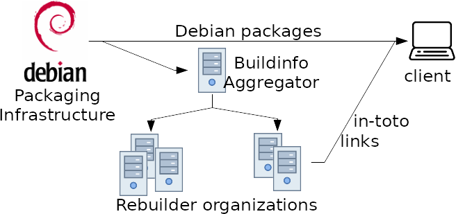
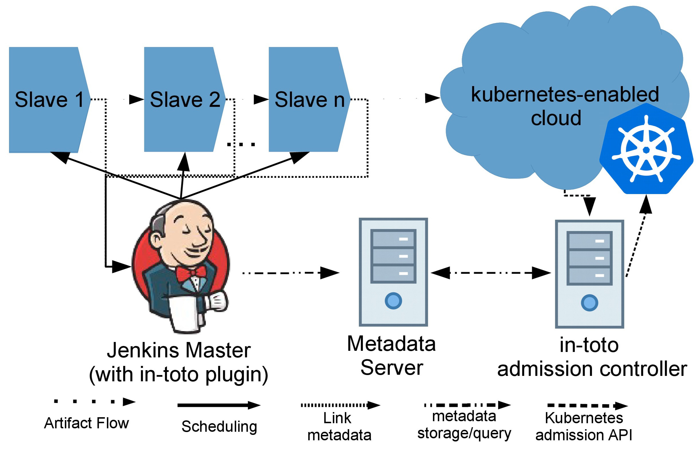

# in-toto security self-assessment 

June 5, 2019

*_Authors_*: Santiago Torres-Arias, Justin Cappos 

*_Contributors/Reviewers_*: Sarah Allen (@ultrasaurus),  Justin Cormack (@justinCormack),  Brandon Lum (@lumjjb)

This document elaborates and explores the design goals for in-toto as well as
it’s security analysis to aid in the security assessment by the CNCF.

## Overview
in-toto, Latin for "as a whole," is a framework that holistically enforces the
integrity of a software supply chain by gathering cryptographically verifiable
information about the chain itself.  

## Background 

Modern software is built through a complex series of steps called a _software
supply chain_. These steps are performed as the software is written, tested,
built, packaged, localized, obfuscated, optimized, and distributed.  In a
typical software supply chain, these steps are "chained" together to transform
(e.g., compilation) or verify the state (e.g., the code quality) of the project
in order to drive it into a _delivered product_, i.e., the finished software
that will be installed on a device. Usually, the software supply chain starts
with the inclusion of code and other assets (icons, documentation, etc.) in a
version control system. The software supply chain ends with the creation,
testing and distribution of a delivered product.

Securing the supply chain is crucial to the overall security of a software
product.  An attacker who is able to control any step in this chain may be able
to modify its output for malicious reasons that can range from introducing
backdoors in the source code to including vulnerable libraries in the delivered
product. Hence, attacks on the software supply chain are an impactful mechanism
for an attacker to affect many users at once. Moreover, attacks against steps
of the software supply chain are difficult to identify, as they misuse
processes that are normally trusted.

Unfortunately, such attacks are common occurrences, have high impact, and have
experienced a spike in recent years. Attackers have been able to infiltrate
version control systems, including getting commit access to the Linux kernel
and Gentoo Linux, stealing Google's search engine code, and putting a backdoor
in Juniper routers. Popular build systems, such as Fedora, have been breached
when attackers were able to sign backdoored versions of security packages on
two different occasions. In another prominent example, attackers infiltrated
the build environment of the free computer-cleanup tool CCleaner, and inserted
a backdoor into a build that was downloaded over 2 million times.

Furthermore, attackers have used software updaters to launch attacks, with
Microsoft, Adobe, Google, and Linux distributions all showing significant
vulnerabilities. Perhaps most troubling are several attacks in which nation
states have used software supply chain compromises to target their own citizens
and political enemies. There are dozens of other publicly disclosed instances
of such attacks.

Currently, supply chain security strategies are limited to securing each
individual step within it. For example, Git commit signing controls which
developers can modify a repository, reproducible builds enables multiple
parties to build software from source and verify they received the same result,
and there are a myriad of security systems that protect software delivery.
These building blocks help to secure an individual step in the process.

Although the security of each individual step is critical, such efforts can be
undone if attackers can modify the output of a step before it is fed to the
next one in the chain. These piecemeal measures by themselves can not stop
malicious actors because there is no mechanism to verify that: 

1. the correct steps were followed, and;
2. that tampering did not occur in between steps.

For example, a web server compromise was enough to allow hackers to redirect
user downloads to a modified Linux Mint disk image, even though every single
package in the image was signed and the image checksums on the site did not
match. Though this was a trivial compromise, it allowed attackers to build a
hundred-host botnet in a couple of hours due to the lack of verification on the
tampered image.

### Goals

in-toto is geared towards protecting the software supply chain _as a whole_. In
order to achieve this, in-toto provides a series of mechanisms to define:

* What steps are to be carried out in the supply chain
* Who can carry out each step
* How the artifacts between each step interconnect with each other

This way, in-toto can allow project owners to define (and update) the topology
of the supply chain in a file called a _software supply chain layout_ (or just
layout for short). In addition to this, in-toto provides a way for
_functionaries_ to provide cryptographically-signed attestations (or _link_
metadata) that can be used to verify that all steps within the supply chain
were carried out according to the specification.

### Non-Goals

in-toto is not meant to provide users with recommendations on how steps need be
performed. It will also not provide mechanisms to dictate best practices on the
security of each individual step. While the metadata collected using in-toto
can be used to introspect and verify that requirements were followed, the
specific requirements are up to each integrator to define.

### Intended Use

For a project that produces built artifacts (e.g. binary executable, container
image, website), in-toto can be used to ensure that the intended process is
carried out to integrate multiple sources and produce the desired artifact(s).
If a project is used as source code, then in-toto is less applicable (although
it could still be applied to ensure process compliance, such as accurate CI/CD
results, developer code review, etc.).

in-toto is better fit for projects in which documented or automated processes
are in place. That is, where secure development practices are in place and a
stronger, cryptographically verifiable paper trail is required to ensure these
practices were followed to the letter.

In cases when this is not the case, there may be more urgent requirements
(e.g., git commit signing) may be pursued first. While in-toto may help improve
the security standing of any project, the security guarantees provided by
in-toto are heavily dependent on the deployment’s practices. 

Required pre-conditions:
1. CI system or buildserver is in place to package releases
2. Written process document 

We also recommend considering the following, as to whether they will be
required as part of the pipeline:

1. Git (or any other VCS) commit/tag signing and verification is not in place
2. A secure software update system (e.g., TUF) is used
3. A mechanism for distributing package metadata to the end user is available

### Target users and use cases 

In-toto roles map to standard target users as described below. (End-users do
not directly interact with in-toto.)

* Administrators define the pipeline and who has access (“Project Owner”)
* Operators use produced artifacts (“Client”)
* Developers sign their work (“Functionaries”)

Use cases
* Automated Pipelines
* Source artifact signing 
* Build 
* Deploy

### Operation

A project owner declares and signs a layout of how the supply chain's steps
need to be carried out, and by whom. When these steps are performed, the
involved parties will record their actions and create a cryptographically
signed statement — called link metadata — for the step they performed. The link
metadata recorded from each step can be verified to ensure that all steps were
carried out appropriately and by the correct party in the manner specified by
the layout.

You can read on how to use the Python implementation to define layouts
[here](https://github.com/in-toto/in-toto/#layout) and how to produce signed
attestations
[here](https://github.com/in-toto/in-toto/#carrying-out-software-supply-chain-steps).
A full-fledged user-guide is scheduled to be released in readthedocs.io as part
of this year’s roadmap.

## Project Design

in-toto consists of two simple elements: 
1. a metadata format (software supply chain layout & link metadata) and 
2. roles (who will interact between each other by means of this metadata)
   1. Project Owners: define the supply chain (layout)
   2. Functionaries: sign their work: (producing link metadata)
   3. Clients: receive status & output, perform verification

#### The supply chain Layout and the Project Owner

The project owner is the role that will be in charge of defining the software
supply chain and encoding it in the Layout. The layout will contain information
about the steps to be carried out, as well as a list of the public keys of
functionaries that can perform operations in the supply chain. Finally, a
Layout will also contain a series of inspections that the Client should perform
to verify the delivered product.

Once the software supply chain layout is defined, the project owner will sign
it with their private key and publish it so clients can use it for verification.

#### Link metadata and Functionaries

Functionaries are the parties in charge of carrying out the steps within the
supply chain. When doing so, they will also generate an accompanying
attestation of their actions in the form of link metadata. The link metadata
will contain information such as the command ran, the artifacts used as input,
the artifacts produced (both with their hashes), as well as other environment
information (e.g., filesystem status, environment variables, standard streams,
etc.). The link metadata is signed with the private key of the functionary who
carried out the step.

#### Putting it all together by the Client

The Client is the party that will consume the final product and, as such, will
be in charge of verifying its correctness before consuming a potentially
harmful product. To do so, the Client will fetch the Layout file and all
corresponding pieces of link metadata. With this information, the Client will
perform verification as follows. Executing in-toto verification (i.e.,
in-toto-verify) will perform the following checks for the client:

1. Ensure that the layout file is signed by the right project owner and that it
   has not expired (layout files have an expiration date)
2. For each step defined in the layout there is at least one piece of link
   metadata signed by authorized functionaries (as described in the layout)
3. The artifacts produced and consumed within the supply chain flowed properly
   between all steps according to the artifact rules defined in the layout.
4. All inspections can be carried out successfully and their resulting piece of
   link metadata matches the rules described

If any of these four guarantees are not met, then in-toto blocks the installation
of software and describes the reason.

## Security analysis

The goal of in-toto is to minimize the impact of a party that attempts to
tamper with the software supply chain.  More specifically, the goal is to
ensure that if each step in the chain is conducted correctly, that the steps in
the chain will be executed as configured and result in the expected artifact.
Specifically, in-toto cryptographically validates the steps that occur when
software is built.  This cryptographic validation can detect many attacks,
including where an attacker adds, removes, or substitutes information at many
stages in the supply chain. The cryptographic evidence can be used by verifiers
to ensure strict compliance to the processes laid out. 

### Attacker Motivations
We consider a motivated attacker that intends to subvert the supply chain with
one of the following goals:

* Affect a large userbase of a certain software product (e.g., a watering-hole
  attack)
* Compromise the resources of a platform (e.g., a cryptojacker) to generate
  profit
* To disrupt the operations of a platform (e.g., to affect a competing product)

### Attacker Capabilities

Based off of historical supply chain attack patterns, we assume an attacker
that can:

* Interpose between two existing elements of the supply chain to change the
  input of a step. For example, an attacker may ask a hardware security module
  to sign a malicious copy of a package before it is added to the repository
  and signed repository metadata is created to index it.
* Act as a step (e.g., compilation), perhaps by compromising or coercing the
  party that usually performs that step. For example, a hacked compiler could
  insert malicious code into binaries it produces.
* Provide a delivered product for which not all steps have been performed. Note
  that this can also be a result of an honest mistake.
* Include outdated or vulnerable elements in the supply chain. For example, an
  attacker could bundle an outdated compression library that has many known
  exploits.                                                            
* Provide a counterfeit version of the delivered product to users.  This
  software product can come from any source and be signed by any keys.

Overall we assume that the basic actions of in-toto are carried out as
designed.  We assume that the code loaded on the client follows the in-toto
steps to validate the downloaded software and layout metadata.  We also assume
that a functionary signs the appropriate metadata and files using its keys
correctly, without leaking them.  If an attacker can cause keys to be leaked or
verification to be skipped (e.g., just avoiding using the in-toto software
altogether), then we cannot protect in these cases.

A more thorough dataset with taxonomic separation of these attacks can be
found in our Github repository under
https://github.com/in-toto/supply-chain-compromises/ 

### Attack Risks and Effects

in-toto overall substantially reduces the risk of supply chain compromises by
requiring all operations within the supply chain to be authenticated. This
means that, in order to compromise an in-toto secured supply chain, the
attacker must not only compromise supply chain infrastructure, but also the
keys used to authenticate in-toto link metadata, as well as the communication
channels in order to deliver the compromised pieces of metadata.

in-toto very slightly increases the risk of failure to install an “eventually
valid” piece of software, but only when the supply chain was not executed
correctly. In cases where a false-positive may occur, this will be due to a
badly configured in-toto layout. A consequence of this is that any attack with
substantial effect is reduced to a denial-of-service in absence of key
compromise.

in-toto’s implementations are all minimal with few dependencies and a tightly
constrained API. The goal behind this is to reduce misconfiguration risks due
to bad implementations. Cryptographic primitives are defined with safe defaults
and do not require manual configuration for integrators. “Crypto agility” is
considered, which allows integrators to change cryptographic primitives as soon
as any is deemed unsafe (e.g., if a hash function has been proven to be
broken).

### Security degradation and attack taxonomy

in-toto is not a “lose-one, lose-all'' solution, in that its security
properties only partially degrade with a key compromise. Depending on which key
the attacker has accessed, in-toto's security properties will vary. In the
event of a key compromise, we outline the following types of attacks where one
or more compromised keys can result in negative effects yet still retain some
supply chain integrity:

* Fake-check: a malicious party can provide evidence of a step taking place,
  but that step generates no products (it can still, however, generate
  byproducts). For example, an attacker could forge the results of a test suite
  being executed in order to trick other functionaries into releasing a
  delivered product with failing tests.
* Product Modification: a malicious party is able to provide a tampered
  artifact in a step to be used as material in subsequent steps. For example,
  an attacker could take over a buildfarm and create a backdoored binary that
  will be packaged into the delivered product.
* Unintended Retention: a malicious party does not destroy artifacts that were
  intended to be destroyed in a step. For example, an attacker that compromises
  a cleanup step before packaging can retain exploitable libraries that will be
  shipped along with the delivered product.
* Arbitrary Supply Chain Control: a malicious party is able to provide a
  tampered or counterfeit delivered product, effectively creating an alternate
  supply chain.

### Functionary key compromise           

A compromise on a threshold of keys held for any functionary role will only
affect a specific step in the supply chain to which that functionary is
assigned to. When this happens, the attacker can arbitrarily forge link
metadata that corresponds to that step.

The impact of this may vary depending on the specific link compromised. For
example, an attacker can fabricate an attestation for a step that does not
produce artifacts (i.e., a fake-check), or create malicious products (i.e., a
product modification), or pass along artifacts that should have been deleted
(i.e., an unintended retention). When an attacker creates malicious products or
fails to remove artifacts, the impact is limited by the usage of such products
in subsequent steps of the chain. The following table describes the impact of
these in detail from rows 2 to 5 (row 1 captures the case when the attacker
does not compromise enough keys to meet the threshold defined for a step). As a
recommended best practice, we assume there is a `DISALLOW *` rule at the end of
the rule list for each step.        

| *Impact* | *Type of key compromise* | *Compromised step rule* | *Subsequent step rule* |
| -------- | ------------------------ | ----------------------- | ---------------------- |
| None     |     Under threshold      |  Regardless of Rule     |  Regardless of Rule    |
| fake-check | Step                   |  None                   |  Regardless of Rule    |
| Unintended Retention |  Step        |  ALLOW pattern1   DELETE pattern2 |  MATCH pattern * |
| Product Modification | Step         |  ALLOW|CREATE|MODIFY pattern |  MATCH pattern    |
| Arbitrary Supply Chain  Control | Layout  |  N/A              |  N/A                   |

It is of note from the table above that an attacker who is able to compromise
crucial steps (e.g., a build step) will have a greater impact on the client
than one which, for example, can only alter localization files. Further, a
compromise in functionary keys that do not create a product is restricted to a
fake check attack (row two). To trigger an unintended retention, the first step
must also have rules that allow for some artifacts before the `DELETE` rule
(e.g., the `ALLOW` rule with a similar artifact pattern). This is because artifact rules
behave like firewall rules, and the attacker can leverage the ambiguity of the
wildcard patterns to register an artifact that was meant to be deleted.
Lastly, note that the effect of product modification and unintended retention
is limited by the namespace on such rules (i.e., the `artifact_pattern`).

The bar can be raised against an attacker if a role is required to have a
higher threshold. For example, two parties could be in charge of signing the
tag for a release, which would require the attacker to compromise two keys to
successfully subvert the step.

Finally, further steps and inspections can be added to the supply chain with
the intention of limiting the possible transformations on any step.  For
example, an inspection can be used to dive into a Python's wheel and ensure
that only Python sources in the tag release are contained in the package.

#### Project owner key compromise

A compromise of a threshold of keys belonging to the project owner role allows
the attacker to redefine the layout, and thereby subvert the supply chain
completely.  However, like with step-level compromises, an increased threshold
setting can be used to ensure an attacker needs to compromise many keys at
once. Further, given the way in-toto is designed, the layout key is designed to
be used rarely, and thus it should be kept offline.

### Metadata store requirements and security context

in-toto metadata needs to be aggregated and distributed for verification. Most
ways to store metadata -- even a filesystem -- are possible, but certain
additional features may be desirable. The first one is snapshotting (i.e., the
ability to group all metadata within a timeframe in a single bundle) which can
be useful to simplify operations.

The second desirable feature is network endpoints, as functionaries could post
their metadata as soon as it is ready. Likewise, verifiers could query metadata
on demand for out-of-band verification of artifacts as they flow throughout the
supply chain (e.g., to catch early failure). While the specification and
implementations do not mandate any specific mechanism to do so, there are many
viable alternatives for the cloud native ecosystem.

#### TUF
TUF/Notary can be used to aggregate in-toto metadata as part of a delegation,
or embed it in the custom field of the targets metadata. In fact, we are
formally adding recommendations (ITE and TAP) to the specifications about the
best practices to integrate in-toto and TUF.

#### Grafeas

Grafeas is also a natural alternative to store in-toto metadata for
verification. An immediate advantage of doing so is that the Grafeas metadata
can be thus secured using links so as to authenticate other types of
occurrences. There's ongoing work to provide a more natural way to integrate
both projects.

#### Other alternatives

Many other mechanisms have been used to store in-toto metadata. Other popular
mechanisms such as Redis and etcd are supported by our tooling (e.g., our
Jenkins plugin). Finally, [our admission
controller](https://github.com/in-toto/in-toto-webhook) allows for posting the
in-toto metadata using a very simple POST endpoint and filesystem namespacing
scheme.

#### Security implications of choosing a metadata store

in-toto was designed under the assumption that an attacker may affect the
storage or transmission of metadata. As such, the security requirements for a
metadata store are (rather lax). The main features that should be considered
are replay protection and mix-and-match attacks.

A complete, very slightly outdated supply chain could be replayed by an
attacker if there is no stronger replay protection, but this is bounded within
the expiration date. Stronger replay protection can be added on the metadata
store (e.g., TUF), to mitigate the concern.

Mix-and-match attacks can be performed by selectively replaying link metadata,
and will be caught by the artifact hash-chaining. Thus, mix-and-match attacks
are not a concern.

## Secure development practices

in-toto’s implementations are aimed to reduce their attack surface in the face
of untrusted input. Also, the development process is quite documented and
clear, in order to avoid software supply chain compromises on in-toto itself.
As such, close attention to its dependencies and their development is crucial.

In this section, we will explore the development ecosystem of the in-toto
project itself, as well as its subprojects and dependencies.

### Development Pipeline: main implementation

The main implementation is the one that’s subjected to the most stringent
security policies. In developing the in-toto Python implementation, we follow
these practices:

* all code is pushed into a feature branch and reviewed by at least one core
  member. Pushes to master (develop) are forbidden
* All pull-requests are run into travis-ci (linux, python 2.7, 3.5, 3.6, 3.7)
  and appveyor (windows) and more than 240+ unit tests are run
* Static analysis is performed using python-bandit
* Code style is performed using pylint following the lab’s canonical pylintrc
  file
* A coverage of 100% is required in order to merge any new feature
* When releasing new versions of the code:
   * a CHANGELOG.md file is created noting the new features included in this
     new version
   * A version bump commit is added
   * A signed tag is created
   * .zip and .tar.gz releases are generated and signed with the gpg keys:
     `"903BAB73640EB6D65533EFF3468F122CE8162295"`
     `"8BA69B87D43BE294F23E812089A2AD3C07D962E8"`
* The resulting releases and signatures are both uploaded to Github and PyPI,
  as well as other downstream distribution channels such as the Arch Linux
  repositories.

### Communication Channels

#### Internal
We have a semi-private (publicly-writable) mailing list as a google group at
in-toto-dev@googlegroups.com

#### Inbound

It is possible to reach out the in-toto team members at:

* [#in-toto@irc.freenode.net](http://webchat.freenode.net?channels=%23in-toto)
* The #in-toto channel at secure-systems-lab.slack.com (requires an invitation from a core member)

There is a bot linking both instances together

#### Outbound

Announcements and general discussion can be also done on the public mailing
list in-toto-public@googlegroups.com

#### Vulnerability Response Process
Response Team:
* Justin Cappos (@JustinCappos)
* Santiago Torres-Arias (@SantiagoTorres)
* Lukas Pühringer (@lukpueh)

Process:

The process is documented in the README.md of our implementations, and requires
sending an email to our security mailing list at ssl@nyu.edu which will forward
to our response team. When a vulnerability has been reported, our team will
discuss an embargo period with the reporter and a timeline for the fix, if a
CVE is required for the vulnerability we will use Mitre as our CNA. Once such a
vulnerability is fixed, we notify all users via our public mailing list
(in-toto-public@googlegroups.com).

### Ecosystem

At the time of writing, in-toto consists of three implementations and three
integration projects.

#### Implementations
Three in-toto implementations exist for Go, Python and Java. These three implementations are interoperable, and the Python implementation is the one that most closely follows the spec. As such, this is the one that’s intended to be adopted into the CNCF.

#### Integrations

Three integration projects exist: 
1. a [Jenkins plugin](https://plugins.jenkins.io/in-toto), hosted on their
   official plugin repository
2. a [kubectl plugin](https://github.com/in-toto/kubectl-in-toto), installable
   via github, and 
3. an [admission controller](https://github.com/in-toto/in-toto-webhook) for
   kubernetes.

## Roadmap

Project has an organizational roadmap and a roadmap for its python
implementation, next steps related to this security assessment are:

* Working towards the CII silver badge (currently 95% complete)
* Formalizing the library APIs between different implementations
* Standardize it’s RFC4880 (OpenPGP) key support as a standards track document
  within the in-toto organization

Additional requests/recommendations for CNCF where added resources/help will
improve the project or increase security of the ecosystem through other
activities:

1. The main drive behind the desire for adoption by the CNCF is visibility.
   Unfortunately, protecting the Supply Chain holistically requires every link
   within it to use in-toto in order to provide meaningful security guarantees.
2. We’d like to have more cross-organizational support within the development,
   as well as an official channel to listen to the needs of corporate users.
3. We’d hope that an external security audit of in-toto be in place to improve
   in-toto and drive confidence in the properties offered by the system.

## Appendix

### Known Issues over time

To this day in-toto has received no CVE or Vulnerability reports, yet this is
not completely indicative of its security standing. Due to the
secure-development practices of in-toto it’s been possible to identify issues
before they are merged or included in the codebase. Worthy of mention are the
following:

* During review of our support for [PGP key expiration
  checks](https://github.com/in-toto/in-toto/pull/245) it was found that key
  expiration computation was ambiguously described in RFC4880, and that other
  implementations had implemented the [wrong behavior](https://github.com/golang/go/issues/22312).
* A [bug](https://github.com/in-toto/in-toto/pull/201#discussion_r174275398) in
  which a key with multiple subkeys could count for the threshold was found
  during code review.

Other bugs found retroactively only resulted in, at the worst, a false positive
result when verifying:

* [One](https://github.com/in-toto/in-toto/pull/262) issue in which a certain
  set of artifact rules would fail verification (i.e., report an error) even on
  valid supply chains.
* [One](https://github.com/in-toto/in-toto/issues/171) issue in which signatures
  generated using gnupg would fail to verify using the openssl backend due to a
  mishandling of zero-padding.

While it’s hard to prove there are no vulnerabilities, our development process
has been very strict, with at least one other reviewer reviewing the PR and
approving since its inception (3 years ago). The only commits made directly to
master took place on the 24th of May of 2016, which was the repository
template. Ever since, everything has been added after review.

We also acknowledge that code coverage is not an ultimate indication of lack of
bugs, but we have reached 100% code coverage more than a year ago and kept a
99%+ requirement to merge any new feature.

Finally, our 2019 roadmap includes three periods of feature freeze, in which
only bugs and vulnerabilities are fixed. We introduced this new policy to err
on the side of a more robust, thoroughly vetted tool.

### CII Best Practices

Currently, in-toto is passing criteria in the Core Infrastructure Initiative
best practices badging program, yet it’s at 91% of the passing criteria. The
in-toto team aims to receive the silver badge as part of the goals outlined in
this year’s [ROADMAP.md](github.com/in-toto/in-toto/blob/develop/ROADMAP.md).

We are pursuing the portions of the CII Gold badging process that make sense
for our project.  Given the criteria are overly cumbersome (with only 3
projects total having a gold CII badge as of April 2019), we will prioritize
efforts that present appropriate benefit for the effort involved.  Notably,
github does not have good support for hardware tokens as 2FA for users without
a smartphone.  While all developers sign commits using a key protected by such
a token, it may not be possible to have github consider this a second form of
authentication (due to the SMS requirements).   

### Case Studies

in-toto is designed to be cloud-agnostic, which has resulted in deployments in
cloud-native, hybrid-cloud and cloud-edge deployments. We will use examples of
these deployments to exemplify its possible operational considerations. The
deployments described here are:

1. Reproducible Builds rebuilder constellation (Debian)
2. Cloud Native builds using Jenkins and Kubernetes

There is a third case study for the Datadog agent integrations downloader,
which is widely described on this [blog post](https://www.datadoghq.com/blog/engineering/secure-publication-of-datadog-agent-integrations-with-tuf-and-in-toto/).

#### Reproducible Builds rebuilder constellation

The [reproducible builds](https://reproducible-builds.org/) project is an
initiative by several open source providers to provide a verifiable path from
source code to binary by means of deterministic builds processes, regardless of
the build environment. in-toto is a great fit for this initiative because it
can be used to encode reproducibility requirements inside package distributions
by means of its thresholding mechanism.

##### The Debian setup

Within Debian, in-toto is used by a constellation of trusted rebuilders that
pull recently build package information (in form of .BUILDINFO files) and
attempt to rebuild packages. Once a package is rebuilt, a piece of link
metadata is published to show the results of the build process.

In parallel, an in-toto apt transport is available
[here](https://github.com/in-toto/apt-transport-in-toto/) (and will be
available as an apt installable package in the future), which can be used by
Debian users to verify that any installed package has been built by the right
parties multiple times and that a threshold of them agree on the resulting hash
of the package. The figure below shows this in a graphical way

##### Operations within the debian rebuilder constellation

Within the context of this project, the project owner role matches that of the
debian packagers, which define the layout and package in-toto as well as the
transport for their clients. The project owner public key is also part of the
debian keyring and is used to sign and verify package-specific layouts, as well
as a fallback layout for those packages that do not have a layout defined for
themselves yet.

Functionaries are the trusted rebuilders of the constellation, which may be
open source projects, for-profit organizations and not-for-profit/governmental
organizations that wish to independently rebuild packages and produce signed
attestations about the results. In order to have their attestations be trusted,
they need to request the Debian project owners to register their public keys
within the organization by submitting a ticket to the debian bug-tracking
system requesting to be added as a trusted rebuilder.

Finally, the verifier is apt, which will load the package to install, the
layout and all evidence and perform verification. The system administrator has
to enable the transport by changing the protocol from `https://` to
`https+in-toto://` in the `/etc/apt/sources.list` file. After doing this,
in-toto verification is performed every time a package is installed using `apt
install [package-name]`.

#### Cloud Native builds with Jenkins and Kubernetes

In the context of cloud native applications, in-toto is used by Control Plane to
track the build and quality-assurance steps on kubesec, a Kubernetes resource
and configuration static analyzer. In order to secure the kubesec supply chain,
we developed two in-toto components: a Jenkins plugin and a Kubernetes
admission controller. These two components, allow us to track all operations
within a distributed system, both of containers and aggregate in-toto link
metadata, to verify any container image before it is provisioned. The figure
below shows a (simplified) graphical depiction of their supply chain.        

This deployment exemplifies an architecture for the supply chains of cloud
native applications, in which new container images, serverless functions and
many types of deployments are quickly updated using highly-automated pipelines.
In this case, a pipeline serves as a coordinator, scheduling steps to worker
nodes that serve as functionaries. These functionaries then submit their
metadata to an in-toto metadata store. Once a new artifact is ready to be
promoted to a cloud environment, a container orchestration system queries an
in-toto admission controller. This admission controller ensures that every
operation on this delivered product has been performed by allowed nodes and
that all the artifacts were acted on according to the specification in the
in-toto layout.                                                                 

Future work on using configuration-as-code and pipeline languages to also
service in-toto layouts is ongoing. For example, a request we've received is to
be able to transpile Jenkinsfile nodes into in-toto layouts.      

##### Operations for Jenkins + K8s setup

The setup process for the kubernetes admission controller is similar to any
other. However, two in-toto-specific parameters are passed as part of its
configuration: the location of the root for all image layouts (i.e., the
file-backend for layouts) and the location of the project owner keys for each
project. We recommend both of these are mounted as read-only filesystems so as
to prevent runtime-tampering and to easily cycle keys.

Once the admission controller is set up, the Jenkins plugin can be installed
from the official repository using the plugin browser. The plugin provides you
a syntax element called in_toto_wrap to indicate the Jenkins master to collect
in-toto link metadata for this specific step. The parameters passed to this
syntax element include what key backend to use for the functionary keys, as
well as the storage backend for the resulting metadata (at the time of the
writing, a generic CRUD handler, as well as Redis and Etcd backends exist).

#### Related Projects / Vendors

In-toto is unique in its use of cryptographic validation while being metadata
neutral.  In part, in-toto is defined by its decision *not* to describe a rich
metadata format but instead to focus on the provenance, cryptographic
integrity, key management, and compromise resilience of the software supply
chain.  The following projects relate to in-toto or interact with it:

* [Cloud Native CI/CD landscape](https://landscape.cncf.io/category=continuous-integration-delivery&format=card-mode&grouping=category&license=apache-license-2-0,bsd-2-clause-simplified-license,bsd-3-clause-new-or-revised-license,gnu-affero-general-public-license-v3-0,gnu-general-public-license-v2-0,gnu-general-public-license-v3-0,gnu-lesser-general-public-license-v2-1,gnu-lesser-general-public-license-v3-0,mit-license,mozilla-public-license-2-0,other,unknown-license,zlib-license&project=hosted,graduated,incubating,sandbox,member,no)
* [Grafeas](https://grafeas.io) -- serves as a store for metadata related to
  supply chain steps but is not a security product.  In-toto serves an
  important role in securing the metadata necessary for validation.  There is
  an in-toto / Grafeas integration branch on the grafeas repository as
  well as issues on creating a tighter integration.
* [SPDX](https://spdx.org) -- describes a metadata format about the creation of
  a piece of software and its resulting properties.  In-toto could provide
  cryptographic validation of this metadata and the SPDX information can be
  used to enrich in-toto validation. 
* [SParts](https://github.com/hyperledger-labs/SParts) is a project that allows
  users to register software artifacts in a hyperledger-based supply chain. As
  such, it allows to register artifacts and track their provenance, but there
  is no permission model or semantics on what is the desired process to create
  these artifacts.
