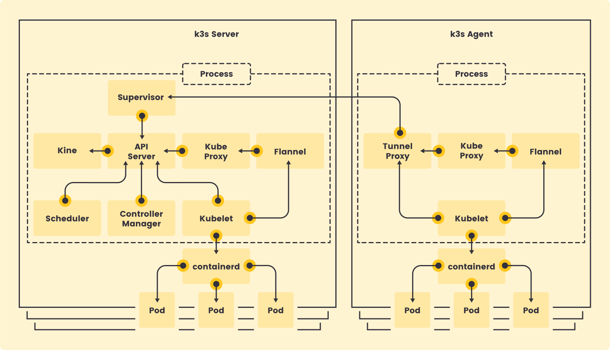

# K3s Security Self Assessment
Author: Orlin Vasilev @OrlinVasilev
Security reviewers:
 - Orlin Vasilev(@OrlinVasilev)
 - Manuel Buil(@manuelbuil)
 - Caroline O'Hara(@caroline-suse-rancher)
 - Vitor Andre Savian(@vitorsavian)
 - Brad Davidson(@brandond)
 - Derek Nola(@dereknola)
 - Chris Wayne(@cwayne18)

## Table of Contents

* [Metadata](#metadata)
  * [Security links](#security-links)
* [Overview](#overview)
  * [Actors](#actors)
  * [Actions](#actions)
  * [Background](#background)
  * [Goals](#goals)
  * [Non-goals](#non-goals)
* [Self-assessment use](#self-assessment-use)
* [Security functions and features](#security-functions-and-features)
* [Project compliance](#project-compliance)
* [Secure development practices](#secure-development-practices)
* [Security issue resolution](#security-issue-resolution)
* [Appendix](#appendix)

## Metadata
| | |
|-----------|------|
| Software | https://github.com/k3s-io/ https://github.com/k3s-io/k3s  https://github.com/k3s-io/kine https://github.com/k3s-io/helm-controller  https://github.com/k3s-io/klipper-lb |
| Security Provider? | No |
| Languages | Go |
| Software Bill of Materials | [go.mod](https://github.com/k3s-io/k3s/blob/main/go.mod) and [go.sum](https://github.com/k3s-io/k3s/blob/main/go.sum) contains the dependency information also via GitHub: https://github.com/k3s-io/k3s/dependency-graph/sbom |
| Security Links | https://github.com/k3s-io/k3s?tab=security-ov-file#security-policy |

## Security Links
| | |
|-----------|------|
| Security policy | https://github.com/k3s-io/k3s?tab=security-ov-file#security-policy |
| CVE scanning | https://scans.k3s.io/
## Overview

K3s is a lightweight and fully certified Kubernetes distribution that prioritizes a minimal footprint and simplified operations. This design offers inherent advantages for resource-constrained environments.

### Background

K3s is a lightweight, opinionated Kubernetes distribution optimized for edge, IoT, and CI/CD environments. It achieves its small binary size by removing legacy or unnecessary components and replacing more resource-intensive ones with lightweight alternatives. K3s is secure by default, and operation of all Kubernetes control plane components is encapsulated in a single binary and process. K3s easily allows automation and management of complex cluster operations like distributing certificates.

When considering using k3s, note that external dependencies have been minimized; the only requirements are a modern kernel and cgroup mounts. There are several packages included within the k3s binary that allow for quick and seamless cluster creation. Some of these packages include, containerd, Flannel CNI, Traefik Ingress Controller, Spegel, and more.

### Actors

- **K3s Server:** A cluster node that executes the `k3s server` command and runs control-plane components (API Server, Controller Manager, Scheduler), datastore components and the supervisor. It can optionally run K3s agent components as well, hence acting as both Server and Agent
- **K3s Agent:** A cluster node that executes the `k3s agent` command and runs typical agent components such as Kubelet and containerd. It requires a k3s server to be running in the cluster. 
- **Cluster Data Store:** As other Kubernetes distributions, K3s requires a datastore to function but it does not need to be etcd. By using the project [Kine](https://github.com/k3s-io/kine) k3s supports different datastores. K3s includes two embedded options: SQLite and etcd. It also supports [external databases](https://docs.k3s.io/datastore#external-datastore-configuration-parameters) 
- **Packaged Components:** Bundled components like containerd, Flannel, CoreDNS, and Traefik. The security of these components is crucial to the overall security posture.
- **Host OS:** K3s does not modify the host operating system, so host hardening is a manual, but critical, responsibility.
- **Supervisor:** It's an HTTPs server that sits in the server nodes and provider services for the cluster: distributing signed certificates, configuration for agent bootstrapping, websocket servers for agents to contact K3s server and so on.

### Actions

- **Installation:** K3s simplifies installation to a single command. The security assessment must evaluate how this process secures initial access and generates certificates.
- **Cluster Communication:** All communication within the cluster, including between the API server and worker nodes, relies on TLS certificates. The assessment should evaluate certificate management and rotation.
- **Workload Execution:** Evaluating the security of Pods, including Pod Security Admission (PSA) policies, is a key part of the assessment.
- **Network Communication:** K3s uses a built-in network policy controller(kube-router based) that enforces policies for controlling traffic between Pods. The default policy controller can be disabled in favour for CNI supplied one.
- **Upgrades:** K3s project provides extensive documentation on [K3s Upgrades](https://docs.k3s.io/upgrades) - You can upgrade K3s by using the installation script, or by manually installing the binary of the desired version.
Upgrades performed via the installation script or using our [automated upgrades feature](https://docs.k3s.io/upgrades/automated) can be tied to different release channels. The following channels are available: **stable**, **latest** or specific version i.e. **v1.33**.

### Goals

- Be lightweight - K3s is engineered to have a minimal footprint in terms of both memory and disk space. 
- Simplify installation and management - K3s makes Kubernetes more accessible to developers, hobbyists, and teams without deep Kubernetes expertise. 
- Be fully compliant and production-ready - Despite its small size, K3s provides all the functionality required to run containerized workloads in production. 
- Enable cloud-native adoption in new environments - K3s expands the reach of Kubernetes to use cases where standard Kubernetes is not a practical solution due to resource limitations.

### Non-Goals
- K3s does **not** aim to be replacement for full Kubernetes distributions - K3s isn’t meant to replace upstream Kubernetes or large-scale managed services like EKS, AKS, GKE.
- Not focused on complex multi-cluster or hybrid-cloud management
- Not trying to be minimal at the expense of compliance - K3s removes unneeded features (e.g., cloud provider integrations, legacy alpha APIs) but keeps full Kubernetes API compliance.

## Self-assessment Use

This self-assessment is created by the K3s team to perform an internal analysis of the project's security. It is not intended to provide a security audit of K3s, or function as an independent assessment or attestation of K3s's security health.

This document serves to provide K3s users with an initial understanding of K3s's security, where to find existing security documentation, K3s plans for security, and general overview of K3s security practices, both for development of K3s as well as security of K3s.

This document provides K3s maintainers and stakeholders with additional context to help inform the roadmap creation process, so that security and feature improvements can be prioritized accordingly.

## Security functions and features

| Component | Applicability | Description of Importance |
| --------- | ------------- | ------------------------- |
| Role-Based Access Control | Critical | RBAC is fundamental to Kubernetes security, enforcing the principle of least privilege. It strictly controls what users and service accounts can do, preventing unauthorized resource manipulation and reducing the blast radius of any compromised component. |
| Pod Security Admission (PSA) | Critical | PSA enforces policies that restrict the security context of Pods. This is crucial for maintaining the security integrity of the cluster by preventing privileged containers, restricting host namespace access, and blocking dangerous capabilities that could allow container escape. |
| Secrets encryption | Security relevant | K3s contains a CLI tool `k3s secrets-encrypt`, that enables/disables secrets encryption, rotates/deletes the keys and reencrypts secrets |
| NetworkPolicy | Security relevant | Network Policies are essential for implementing micro-segmentation within the cluster. They define rules for which Pods are allowed to communicate with which other Pods or external endpoints, effectively limiting lateral movement in case of a breach. K3s implemments this using the kube-router project. |
| ServiceAccount Tokens | Critical | Service accounts provide an identity for processes running in a Pod. Limiting token projection to bound ServiceAccount tokens with short expiration times prevents indefinite access and ensures that the identity of the Pod is tied to its current lifecycle. |
| Security Context | Security Relevant | Security Contexts allow users to define privilege and access controls (e.g., running as a non-root user, setting allowPrivilegeEscalation: false) at the Pod or Container level. This is a primary tool for users to voluntarily reduce the privileges granted to their workloads. |
| Certificate handling | Security relevant | K3s generates certificates and keys for the different Kubernetes components. They are valid for 365 days. It also implements a tool that allows rotating them and checking their expiration date: `k3s certificate` |
| K3s internal tokens | Security relevant | K3s uses tokens to secure the node join process and to encrypt confidential information that is persisted to the datastored. Tokens authenticate the cluster to the joining node, and the node to the cluster. K3s also supports [bootstrap tokens](https://kubernetes.io/docs/reference/access-authn-authz/bootstrap-tokens/) and a tool to manage tokens: `k3s token` |
| Flannel wireguard encapsulation | Security relevant | K3s supports the wireguard backend of Flannel, which allows to encrypt all cluster network traffic between nodes using authenticated peer-to-peer tunnels. Users can configure and enable this feature to prevent network eavesdropping and ensure data integrity within the CNI layer. |

## Project Compliance
K3s offers the option to follow the [CIS Benchmark assesment here](https://docs.k3s.io/security)

### Future State
Roadmap and future development can be found here at the [project board in GitHub](https://github.com/orgs/k3s-io/projects/6)

List of ADR (similiar to Kubernetes KEPs) here: https://github.com/k3s-io/k3s/tree/main/docs/adrs

## Secure Development Practices
Although the K3s project is still sandbox, we strive to implement the highest standard of secure development best practices, as noted below.

### Deployment Pipeline
In order to secure the SDLC from development to deployment, the following measures are in place. Please consult the roadmap for information about how this list is growing.
- All commiters are required to sign their commits and comply with the CNCF Developer Certificate of Origin (DCO)
- Branch protection on the default (`main`) branch:
  - Require signed commits
  - Required on pull request before merging
  - Require approvals: 2
  - Dismiss stale pull request approvals when new commits are pushed
  - Require review from Code Owners
  - Require approval of the most recent reviewable push
  - Require conversation resolution before merging
  - Require status checks to pass before merging
  - Require branches to be up to date before merging
- Branch protection for `release-1.XX` branches is the same as `main` except for:
  - Require approvals: 1

The release process is automated. Releases are triggered using the GitHub release action, which triggers the [release workflow](https://github.com/k3s-io/k3s/blob/main/.github/workflows/release.yml) to produce:
  - K3s binary and checksum artifacts
  - K3s airgap image tarballs
  - K3s images published to ghcr.io and docker.io

Releases are signed by GitHub's verified signature. All release artifacts are built using GitHub Actions using ephemeral GitHub Hosted Runners.

### Communication Channels

Communication happens in the public Slacks:
- CNCF Slack [#k3s channel](https://cloud-native.slack.com/archives/C0196ULKX8S ).
- Rancher-users Slack [#k3s channel ](https://rancher-users.slack.com/archives/CGGQEHPPW).
- Rancher-users Slack [#k3s-contrubutor channel](https://rancher-users.slack.com/archives/CGXR87T8B).

Mailing lists:
- [cncf-k3s-users@lists.cncf.io](https://lists.cncf.io/g/cncf-k3s-users)
- [cncf-k3s-dev@lists.cncf.io](https://lists.cncf.io/g/cncf-k3s-dev)
- [cncf-k3s-maintainers@lists.cncf.io](https://lists.cncf.io/g/cncf-k3s-maintainers)
-

Internal/External discssions and ideas: GitHub Discussions, GitHub Issues , GitHub PRs

Community Meeting:
Twice a month: AMS and APAC friendly - https://zoom-lfx.platform.linuxfoundation.org/meetings/k3s?view=week

## Security Issue Resolution

The K3s security policy can be quickly found through both the [README.md](https://github.com/k3s-io/k3s/blob/main/README.md#security) and the [GitHub Security Policy Document](https://github.com/k3s-io/k3s/blob/main/.github/SECURITY.md).

### Responsible Disclosure Practice

The K3s project does not accept vulnerability reports through the [GitHub Vulnerability Reporting](htt‌ps://docs.github.com/en/code-security/security-advisories/guidance-on-reporting-and-writing/privately-reporting-a-security-vulnerability) tool. Users attempting to report an security issue via the Create Issue or Vulnerability Reporting workflows will be redirected to our security policy document, which requests that they make contact via e-mail.

Anyone can make a report by going e-mailing security@k3s.io. In the event that a report is received, a maintainer will collaborate directly with the reporter until it is resolved.

### Incident Response

In the event that a vulnerability is reported, the maintainer team will collaborate to determine the validity and criticality of the report. Based on these findings, the fix will be triaged and, if necessary the maintainer team will work to issue a patch in a timely manner. If it is determined that the vulnerability is in a 3rd party component, and not code that is maintained as part of the K3s project, we will work with the reporter and correct external project to coordinate handoff of the report.

Patches will be made to all versions that are currently supported under the project's security policy. Information will be disseminated to the community through all appropriate outbound channels as soon as possible based on the circumstance.

## Appendix
FOSSA Badge - 
OpenSSF Best Practices - 
OpenSSF Scorecard
CLOMonitor - 