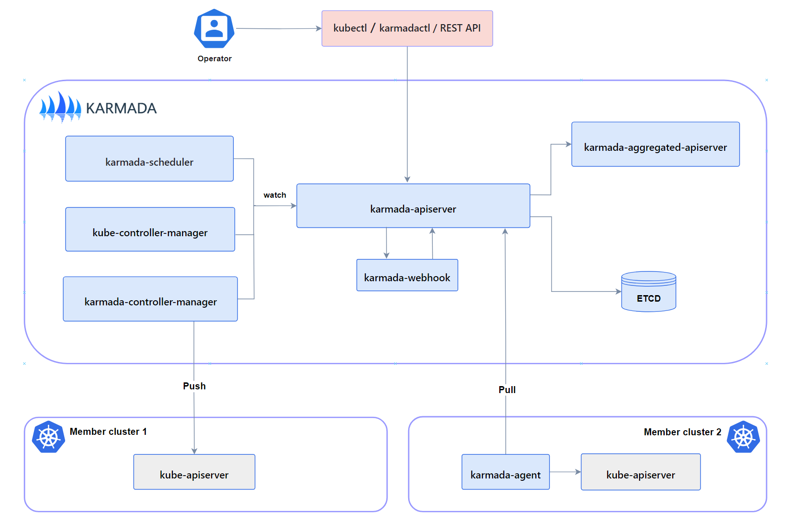

# Self-assessment for Karmada
This assessment was created by community members as part of the [Security Pals](https://github.com/cncf/tag-security/issues/1102) process, and is currently pending changes from the maintainer team.

Authors: Pranava Kumar Vemula (@Rana-KV)

Contributors/Reviewers:  Eddie Knight (@eddie-knight), Ragashree (@ragashreeshekar), @torinvdb

Project Maintainers: Hongcai Ren (@RainbowMango)

The Self-assessment is the initial document for Karmada to begin thinking about the security of the project, determining gaps in its security, and preparing any security documentation for their users.

## Table of contents

* [Metadata](#metadata)
  * [Security links](#security-links)
* [Overview](#overview)
  * [Actors](#actors)
  * [Actions](#actions)
  * [Background](#background)
  * [Goals](#goals)
  * [Non-goals](#non-goals)
* [Self-assessment use](#self-assessment-use)
* [Security functions and features](#security-functions-and-features)
* [Project compliance](#project-compliance)
* [Secure development practices](#secure-development-practices)
* [Security issue resolution](#security-issue-resolution)
* [Appendix](#appendix)
  * [Threat Modeling with STRIDE](#threat-modeling-with-stride)

## Metadata

A table at the top for quick reference information, later used for indexing.

|   |  |
| -- | -- |
| Assessment Stage | Incomplete | 
| **Software** | [A link to Karmada’s repository.](https://github.com/karmada-io/karmada)  |
| **Security Provider** | No. The primary function of the project is to run Kubernetes clusters across clouds. Security is not the primary objective. |
| **Languages** |<ul><li>Go</li><li>Shell</li><li>Smarty</li><li>Mustache</li><li>Makefile</li><li>Dockerfile</li></ul> |
| **SBOM** | [FOSSA Scan](https://app.fossa.com/projects/custom%2B28176%2Fgithub.com%2Fkarmada-io%2Fkarmada/refs/branch/master/65376b28d5037c27ff7ec0e56542c2a345d1a120/preview) |

### Security links

Provide the list of links to existing security documentation for the project. You may
use the table below as an example:
| Doc | url |
| -- | -- |
| Security file | [SECURITY.md](https://github.com/karmada-io/community/blob/main/security-team/SECURITY.md) |
| Default and optional configs | [Default Controllers and Configurations](https://karmada.io/docs/administrator/configuration/configure-controllers) |

## Overview
**Karmada (Kubernetes Armada)**  
Karmada is a Kubernetes clusters management system that enables you to run multiple Kubernetes clusters across clouds. It uses Kubernetes-native APIs and provides advanced scheduling capabilitie supports multi-cloud Kubernetes.

Karmada aims to provide turnkey automation for multi-cluster application management in multi-cloud and hybrid cloud scenarios, with key features such as centralized multi-cloud management, high availability, failure recovery, and traffic scheduling.

### Background
When a development team utilizes Kubernetes for cluster deployment, they often encounter limitations on the number of pods that can be effectively deployed and managed. These limitations can be imposed by the cloud platform's constraints or available resources. Consequently, the development team is compelled to set up and manage multiple Kubernetes clusters. These clusters may serve specific purposes, such as catering to different regions, accommodating various application versions, or handling load balancing requirements. There exist numerous motivations for scaling instances both horizontally and vertically. However, this scaling endeavor brings with it a set of challenges and complexities that must be addressed.

Karmada addresses the challenge of managing clusters across diverse platforms. It offers centralized management of Kubernetes clusters deployed across different cloud platforms and regions, streamlining the management process.
 

  

 

### Actors
These are the individual parts of your system that interact to provide the 
desired functionality.  Actors only need to be separate, if they are isolated
in some way.  For example, if a service has a database and a front-end API, but
if a vulnerability in either one would compromise the other, then the distinction
between the database and front-end is not relevant.

The means by which actors are isolated should also be described, as this is often
what prevents an attacker from moving laterally after a compromise.
 

  

 

The following are the different actors found in Karmada project:
* Host Cluster
  1. karmada-admin/karmada-operator
  2. karmada control plane
     * karmada-apiserver
     * karmada-aggregated-apiserver
     * kube-controller-manager
     * karmada-controller-manager
     * karmada-scheduler
     * karmada-webhook
     * etcd 
* Member Cluster
  1. karmada-agent
  2. kube-apiserver

#### Karmada API Server
The API server is a component of the Karmada control plane that exposes the Karmada API in addition to the Kubernetes API. The API server is the front end of the Karmada control plane.

Karmada API server directly uses the implementation of kube-apiserver from Kubernetes, which is the reason why Karmada is naturally compatible with Kubernetes API. That makes integration with the Kubernetes ecosystem very simple for Karmada, such as allowing users to use kubectl to operate Karmada, integrating with ArgoCD, integrating with Flux and so on.

#### Karmada Controller Manager
The karmada-controller-manager runs various controller processes.
The controllers watch Karmada objects and then talk to the underlying clusters' API servers to create regular Kubernetes resources.
The controllers are listed at Karmada Controllers.

#### Karmada Agent
Karmada has two Cluster Registration Mode such as Push and Pull, karmada-agent shall be deployed on each Pull mode member cluster. It can register a specific cluster to the Karmada control plane and sync manifests from the Karmada control plane to the member cluster. In addition, it also syncs the status of member cluster and manifests to the Karmada control plane.

#### Karmada Scheduler
The karmada-scheduler is responsible for scheduling k8s native API resource objects (including CRD resources) to member clusters.
The scheduler determines which clusters are valid placements for each resource in the scheduling queue according to constraints and available resources. The scheduler then ranks each valid cluster and binds the resource to the most suitable cluster.

### Actions
These are the steps that a project performs in order to provide some service
or functionality.  These steps are performed by different actors in the system.
Note, that an action need not be overly descriptive at the function call level.  
It is sufficient to focus on the security checks performed, use of sensitive 
data, and interactions between actors to perform an action.  

For example, the access server receives the client request, checks the format, 
validates that the request corresponds to a file the client is authorized to 
access, and then returns a token to the client.  The client then transmits that 
token to the file server, which, after confirming its validity, returns the file.

#### Push Mode
In Push mode, the Karmada control plane directly accesses the kube-apiserver of each member cluster to get status and deploy manifests. The karmada-agent is not required.

##### Actors
* User - Executes Karmada CLI to join/unregister clusters.
* Karmada CLI - CLI tool that calls Karmada control plane to join/unregister clusters.
* Karmada control plane - Creates/updates/deletes Cluster object representing the registered cluster.
* Member cluster - Its kube-apiserver is directly accessed by Karmada control plane (Karmada Controller Manager).

##### Workflow
1. User executes kubectl-karmada join to register a cluster.
2. The CLI calls Karmada control plane to create Cluster object.
3. Within Karmada control plane directly interacts with cluster's kube-apiserver for status and manifest deployment.
4. User executes kubectl-karmada unjoin to unregister the cluster.
5. The CLI calls Karmada control plane API to delete Cluster object.

In summary, Karmada control plane will access member cluster's kube-apiserver directly to get cluster status and deploy manifests.

#### Pull Mode
In Pull mode, the Karmada control plane (Karmada Controller Manager) does not directly access the member cluster. Instead, access is delegated to the Karmada Agent component deployed on each cluster.

##### Actors
* User - Executes Karmada CLI to join/unregister clusters.
* Karmada CLI - CLI tool that calls Karmada control plane API to register clusters. Also deploys karmada-agent.
* Karmada Controller Plane - Creates/deletes Cluster object representing registered cluster. Does not directly access cluster.
* Karmada Agent - Agent deployed on each cluster that handles communication with Karmada.
* Member Cluster - Its API server is accessed by the karmada-agent, not directly by Karmada.

##### Workflow
1. User executes karmadactl register to deploy karmada-agent and register a cluster.
2. CLI calls Karmada API to create Cluster object and deploy karmada-agent.
3. Agent creates ServiceAccount and RoleBinding for API access.
4. Agent watches karmada-es namespace and reports status to Karmada.
5. User executes karmadactl unregister to delete karmada-agent.
6. User manually deletes Cluster object from Karmada.

In summary, Karmada control plane will access Karmada Agent component deployed on each cluster to get cluster status and deploy manifests.

### Goals
The intended goals of the projects including the security guarantees the project
 is meant to provide (e.g., Flibble only allows parties with an authorization
key to change data it stores).

**General**

* Scalability: Support Horizontoal and vertical scaling of applications smoothly across clusters.
* Centralized Management: Provide a unified control plane to manage multiple Kubernetes clusters deployed across different platforms like on-prem, public clouds, edge, etc.
* Open and Neutral: Kubernetes native API compatible and integrates with mainstream cloud providers.

**Security**

* Karmada project elements should be protected and robust against tampering.
* Authenticating and authorizating access to karmada control plane components.
* Protect karmada control plane from being compromised.
* Protect karmada control plane's identity.

### Non-goals
Non-goals that a reasonable reader of the project’s literature could believe may
be in scope (e.g., Flibble does not intend to stop a party with a key from storing
an arbitrarily large amount of data, possibly incurring financial cost or overwhelming
 the servers)

**General**

* Maintaining and montioring the image registry.
* Managing and montioring Host Server and Host OS services.

**Security**
* Access control of image registry.
* Scanning images in image registry for vulnerabilites.
* Storage and access control of access tokens to karmada control plane.
* Stop anyone with valid access token from accessing karmada control plane.
* Address security issues of extensions or tools used with Karmada.

## Self-assessment use

This self-assessment is created by the NYU Graduate student with the help of project maintainers to perform an internal analysis of the
project's security.  It is not intended to provide a security audit of Karmada, or
function as an independent assessment or attestation of Karmada's security health.

This document serves to provide Karmada users with an initial understanding of
Karmada's security, where to find existing security documentation, Karmada plans for
security, and general overview of Karmada security practices, both for development of
Karmada as well as security of Karmada.

This document provides the CNCF TAG-Security with an initial understanding of Karmada
to assist in a joint-assessment, necessary for projects under incubation.  Taken
together, this document and the joint-assessment serve as a cornerstone for if and when
Karmada seeks graduation and is preparing for a security audit.

## Security functions and features

* **Critical:**    A listing critical security components of the project with a brief
description of their importance.  These are used for threat modeling.
These are considered critical design elements that make the product itself secure and
are not configurable.
  * Verification of checksum and signature of Karmada components during installation.
  * Mutual authentication of Karmada api-server and Karmada agent or kube-apiserver.
* **Security Relevant:**   A listing of security relevant components of the project with
  brief description.  These are considered important to enhance the overall security of
the project, such as deployment configurations, settings, etc.  These are also be
included in threat modeling.
  * Log all security events across Karmada components.
  * Encrypt sensitive information communicated between Karmada control plane and worker cluster.
  * Enforce separation of privileges across different components in the Karmada.

### [Threat Modeling with STRIDE](#threat-modeling-with-stride)

## Project compliance

* Karmada does not currently document meeting particular compliance standards.

## Secure development practices
Karmada has achieved the passing level criteria in Open Source Security Foundation (OpenSSF) best practices badge [Karmada's CII Best Practices assessment](https://www.bestpractices.dev/en/projects/5301).

### Development Pipeline

All code is maintained in [GitHub](https://github.com/kubeedge/kubeedge) and changes must be reviewed by maintainers.
* All source code is publicly available in Github.
* Code changes are submitted via Pull Requests (PRs).
* Commits to the `master` branch directly are via PRs.
* Once your pull request has been opened it will be assigned to one or more reviewers.
* Merging happens automatically after both a Reviewer and Approver have approved the PR. 
* Automated testing is employed extensively throughout all code bases.
* All pull requests trigger jobs that perform:
  * Linting
  * Unit tests
  * E2E tests
  * FOSSA
  * Image scanning for vulnerabilities
  * Push the latest code to Dockerhub
 

### Communication Channels

* **Internal**  
Team members communicate with each other through the [Karmada Community Slack](https://cloud-native.slack.com/archives/C02MUF8QXUN), [Github issues](https://github.com/karmada-io/karmada/issues) or [Zoom meetings](https://zoom.com/my/karmada).

* **Inbound**   
Users communicate with the team through the [Karmada Community Slack](https://cloud-native.slack.com/archives/C02MUF8QXUN), [Github issues](https://github.com/karmada-io/karmada/issues) or [Github discussions](https://github.com/karmada-io/karmada/discussions).

* **Outbound**  
Team members communicate with users through the [emailing list](https://groups.google.com/forum/#!forum/karmada).

## Security issue resolution

### Responsible Disclosures Process

* The Karmada project's responsible disclosures process is documented in [Karmada's Security Policy](https://github.com/karmada-io/community/blob/main/security-team/SECURITY.md)
* Security researchers can report vulnerabilities confidentially by emailing [cncf-karmada-security@lists.cncf.io](mailto:cncf-karmada-security@lists.cncf.io).
* Reporters can expect a response from Karmada project maintainers within 2 business days acknowledging receipt. It is the maintainers' responsibility to triage the severity of issues and determine remediation plans.
* The Karmada project maintains release branches for the most recent three minor releases. Applicable fixes, including security fixes, may be backported to those three release branches, depending on severity and feasibility.

### Incident Response Process

As data is not being collected from the users and the Incident Response process would be intiated only through a vulnerability disclosure and follows the [Responsible Disclosures Process](#responsible-disclosures-process)

## Appendix

* **Known Issues Over Time**  
There are no vulnerabilites disclosed for the Karmada project, but still the project is impacted by the vulnerabilites in the underlying frameworks and tools it uses (for instance vulnerabilites in Golang). All Karmada project security related issues (both fixes and enhancements) are not spearate from the other Github issues.
* **[CII Best Practices](https://www.coreinfrastructure.org/programs/best-practices-program/)**  
  The Karmada project has achieved the passing level criteria and is in the process of working towards attaining a silver badge in Open Source Security Foundation (OpenSSF) best practices badge [Karmada's openssf best practices](https://www.bestpractices.dev/en/projects/5301).
* **Case Studies**  
Many organisations have adopted Karmada and are using our project in production [[adopters-list](https://karmada.io/adopters)].  Here are few Case studies:
  * **VIPKID:** VIPKID is an online English education platform with more than 80,000 teachers and 1 million trainees. It has delivered 150 million training sessions across countries and regions. To provide better services, VIPKID deploys applications by region and close to teachers and trainees. Therefore, VIPKID purchased dozens of clusters from multiple cloud providers around the world to build its internal infrastructure.
    * VIPKID have built a multi-cloud PaaS using Karmada to simplify managing containers across regions and vendors.
    * Karmada provides application-centric control through override policies.
    * Karmada enables quick cluster startup and efficient deployments.
    * Karmada provides  easy integration into their platform and GitOps workflows.
    * Overall, Karmada helped VIPKID efficiently build a reliable multi-cloud PaaS for running containers globally.
    * [Full Details on VIPKID Case Study](https://karmada.io/docs/casestudies/vipkid/)
  * **AIML INSTITUTE:** AIML INSTITUTE helps enterprises build integrated cloud native solutions for digital transformation through their MSP platform. MSP focuses on cloud native, data intelligence, and strong application security/performance to provide tailored services covering development, operations and more on Kubernetes. The platform is cloud vendor independent to meet customer multi-cloud demands while managing increasing clusters and complexity.
    * Karmada enabled AIML Institute to manage 50+ heterogeneous clusters through unified APIs.
    * It automated cluster management and integration to reduce complexity.
    * Karmada provided advanced multi-cluster scheduling for resources.
    * It enabled config differentiation and state aggregation across clusters.
    * Karmada integration enabled pipeline inspection system and GPU management to span multiple clusters.
    * [Full Details on AIML Case Study](https://karmada.io/docs/casestudies/ci123/)
 

* **Related Projects / Vendors**  
  * **KubeFed** project allowed users to coordinate the configuration of multiple Kubernetes clusters from a single set of APIs in a hosting cluster.
    * **Impediments to wider KubeFed adoption:**
      * KubeFed was an early answer to the issue of centralized management of multiple Kubernetes clusters– but as community engagement has slowed with the project since 2020, it’s now reached its EOL, leaving many searching for alternatives.
      * Incompatibility of Kubernetes APIs – the federated-resources API results in extra learning and adoption efforts when users migrate from single cluster to multi-cluster architecture.
      * Lack of extensibility – users were unable to satisfy varying use cases with the rigid nature of KubeFed. This led to an explosion of highly diverged forks and made it hard to build a community around a standardized implementation.
  * **Open Cluster Management (OCM)** provides a framework to enable any capability within the Kubernetes ecosystem to orchestrate itself across multiple clusters and cloud providers. The built-in primitives allow an understanding of cluster inventory, cluster workload placement, and cluster workload distribution. The hub-agent model of OCM allows for new kinds of agent behavior to be injected into managed clusters easily. New behaviors can further configure clusters or collect information about clusters (such as observability data or search indexing). The project also provides two multicluster capabilities out of the box: application delivery, orchestration, and policy-based governance.
    * **Difference between OCM and Karmada:**
      * Both projects are ready to take up the challenge of managing fleets of clusters across the hybrid and multi-cloud landscape, but they have different philosophies when it comes to solving it.
      * Karmada provides a more complete full stack end to end solution.
      * OCM provides a robust modular framework and APIs that enable other Kubernetes ecosystem projects to integrate with it, to unlock multicluster capabilities.
    * In the future, there will be many use cases where both Karmada and OCM can be complementary to each other. There is already an ongoing collaboration between both project maintainers in the Kubernetes SIG-Multicluster community to standardize the Work API, which is a project that distributes Kubernetes objects between clusters.
  * **Istio**  
Istio is a service mesh that provides traffic management, security, and observability features for microservices. It focuses on connecting and managing networks between services. Where as Karmada is a Kubernetes multi-cluster orchestrator. It focuses on deploying and managing workloads across multiple Kubernetes clusters. Even if Karmada can manage several clusters, it does not provide any networking mechanism to make sure that the clusters are linked. In other words, Karmada is an excellent tool to orchestrate deployments across clusters, but you need something else to make sure those clusters can communicate with each other like Istio.
    * **Key Differences**  
    Istio operates at the network layer, managing traffic between services using sidecar proxies.  
    Karmada works at the workload layer, propagating apps and policies to clusters.

### [Threat Modeling with STRIDE](/assessments/projects/karmada/threatmodeling.md)
