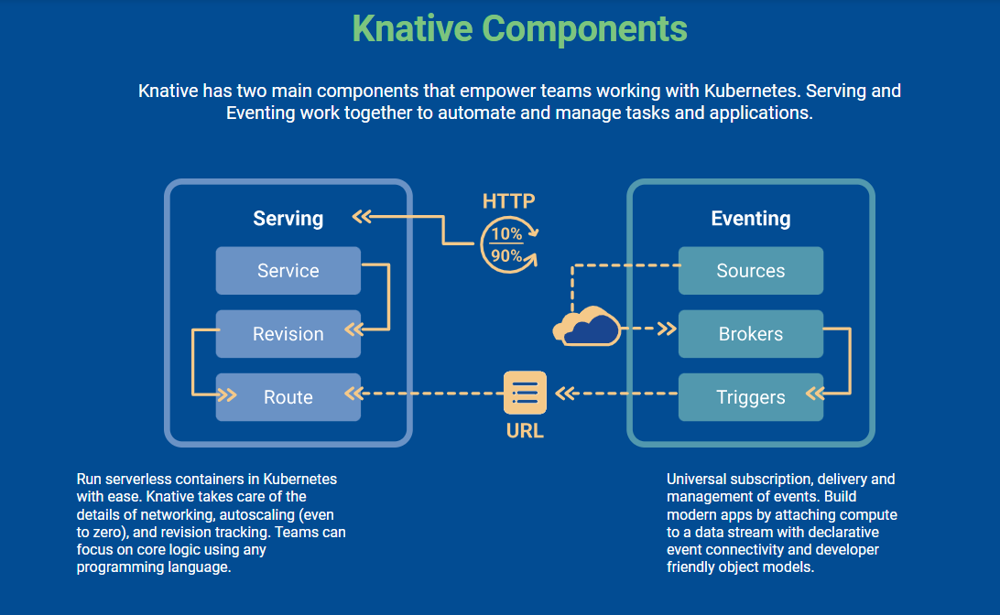

# Knative Self-Assessment

This assessment was created by community members as part of the [Security Pals](https://github.com/cncf/tag-security/issues/1102) process and is currently pending changes from the maintainer team.

Security reviewers: Maya Humston, Ethan Vazquez, Zhikang Xu, Shambhavi Seth
This document is intended to assess the current state of security for the Knative project.

## Table of Contents
* [Metadata](#metadata)
  * [Software Bill of Materials](#software-bill-of-materials)
  * [Security Links](#security-links)
* [Overview](#overview)
  * [Background](#background)
  * [Actors](#actors)
  * [Actions](#actions)
  * [Goals](#goals)
  * [Non-goals](#non-goals)
* [Self-assessment use](#self-assessment-use)
* [Security functions and features](#security-functions-and-features)
* [Project compliance](#project-compliance)
* [Secure development practices](#secure-development-practices)
  * [Deployment pipeline](#deployment-pipeline)
  * [Communication channels](#communication-channels)
  * [Ecosystem](#ecosystem)
* [Security issue resolution](#security-issue-resolution)
  * [Responsible disclosure practice](#responsible-disclosure-practice)
  * [Incident Response](#incident-response)
* [Appendix](#appendix)
* [Recommendations](#recommendations)

## Metadata
| | |
|-----------|------|
| Assessment Stage | Incomplete |
| Software | https://github.com/knative/serving https://github.com/knative/eventing https://github.com/knative/func |
| Security Provider? | No — the primary function of Knative is to provide a set of components and building blocks to extend Kubernetes functionality and should not be considered primarily a security provider. |
| Languages | Go |
| SBOM | [SBOM and SLSA verification described here](https://knative.dev/docs/reference/security/verifying-images/) |
| | |

### Security Links

There are a few places in the documentation where important security features and practices are discussed. This assessment goes into further detail at [Secure development practices](#secure-development-practices) and [Security issue resolution](#security-issue-resolution), but a few important pages are as follows:

- Knative security and disclosure information: https://knative.dev/docs/reference/security/
- Knative threat model: https://github.com/knative/community/blob/main/working-groups/security/threat-model.md
  - **note:** This threat model is a work in progress and is considered temporary by the knative security team.
- Response policy to security breach: https://github.com/knative/community/blob/main/working-groups/security/responding.md
- Configuration details for serving and eventing, including default configmaps:
  - https://github.com/knative/serving/blob/main/config/README.md
  - https://github.com/knative/eventing/tree/main/config

### Software Bill of Materials

- The go.mod files for each component can be found in the root directory of each repo, linked below. Knative-automation automatically updates the go.mod file with each deployment.
  - https://github.com/knative/serving/blob/main/go.mod
  - https://github.com/knative/func/blob/main/go.mod
  - https://github.com/knative/eventing/blob/main/go.mod
- The knative/pkg repository is a storage site for common Knative packages across all other Knative repositories for each component.
  - https://github.com/knative/pkg
- Additionally, each version contains a list of each added or modified dependency in the version release notes, so one can see a history of the dependencies.
  - https://github.com/knative/func/releases
  - https://github.com/knative/serving/releases
  - https://github.com/knative/eventing/releases
- Each release automatically generates the repository's Software Bill of Materials, which can then be fetched and downloaded using cosign. The instructions to generate the SBOM are as follows, using knative's "serving" repository as the example: 
    1. Determine the specific version of release that you are interested in using the release notes linked above and [here](https://github.com/knative/serving/releases/). Each release lists its assets, which include specific images.
    2. Run a curl command specifying the version number and image of interest. For example, to download the information for version 1.12.2 and the asset serving-core.yaml, run the following command: 
      - curl -L https://github.com/knative/serving/releases/download/knative-v1.12.2/serving-core.yaml | grep image:
    3. Find the images of interest in the returned file. For each, run the following command: 
      - cosign download sbom $IMAGE
    4. This then points you to the architecture-specific images. Running the cosign download sbom $IMAGE command for the version returns the first level of dependencies. 

---

## Overview
Knative is an open-source platform that enhances Kubernetes, focusing on the efficient deployment and management of serverless, cloud-native applications. It introduces two main components: Serving and Eventing. Serving automates the scaling and management of serverless workloads, while Eventing deals with event-driven architecture, managing and triggering serverless functions. This integration with Kubernetes not only streamlines the deployment process but also boosts developer productivity and reduces operational costs. Knative's cloud-agnostic nature and extensibility make it a versatile choice for diverse serverless computing environments.
Source: https://knative.dev/docs/
### Background
Historically, in the world of container orchestration and cloud-native development, managing and deploying serverless applications has been a complex task. Traditional methods often required developers to manually handle aspects like scaling, updating, and event management for each application separately. This approach was not only time-consuming but also prone to inconsistencies, especially in environments with a diverse set of applications and services.

In cloud-native ecosystems, especially those using Kubernetes, the management of serverless workloads presented unique challenges. Kubernetes, while powerful, did not natively offer specialized tools for serverless architecture, leading developers to either rely on external tools or build custom solutions. These methods, though effective, lacked uniformity and efficiency, especially in handling auto-scaling, rapid deployment, and event-driven architecture.

Knative emerged as a solution to these challenges. It was designed to simplify the process of deploying and managing serverless applications on Kubernetes. By providing middleware components, Knative enables developers to focus more on building their applications rather than worrying about the underlying infrastructure.

### Actors

The official Knative diagram of components, sourced from the [documentation](https://knative.dev/docs/):

**Serving Controller** (Service) (https://knative.dev/docs/serving/): This is a central component in Knative responsible for orchestrating the deployment and scaling of serverless workloads. It operates independently, managing the lifecycle of Knative services and their revisions. The Serving Controller is isolated in such a way that even if it encounters issues or vulnerabilities, these do not directly compromise the serverless workloads it manages.

1. Deployment and Management of Services: The Serving Controller is responsible for deploying Knative services. It manages the entire lifecycle of these services, from creation and updating to scaling and deletion.

2. Scaling: One of the key features of Knative is automatic scaling, including scaling to zero when a service is not in use. The Serving Controller manages this by monitoring traffic patterns and adjusting the number of active pods (instances of Revisions) accordingly.

3. Traffic Routing: The Serving Controller also plays a role in routing traffic to different Revisions. This is important for features like canary deployments or blue-green deployments, where traffic needs to be gradually shifted from one version of a service to another.
Isolation and Security: The Serving Controller is designed to be isolated in its operation. This means that issues or vulnerabilities within the Serving Controller do not directly compromise the serverless workloads it manages. This isolation is crucial for maintaining the security and integrity of the serverless applications running on Knative.
Integration with Kubernetes Knative Serving, and by extension the Serving Controller, is built on top of Kubernetes. It leverages Kubernetes features like custom resources and controllers, providing a familiar environment for those who are already experienced with Kubernetes.

4. Customization and Extensibility: The Serving Controller allows customization of serverless workloads. Users can specify various configurations like environment variables, resource limits, and request timeouts. This level of customization makes it flexible to cater to diverse application needs.

Kubernetes apiserver and ecosystem()(https://kubernetes.io/docs/reference/command-line-tools-reference/kube-apiserver/#:~:text=Synopsis,which%20all%20other%20components%20interact.):The API server in Kubernetes is responsible for verifying and setting up data for various API objects such as pods, services, replication controllers, and more. It handles RESTful operations and serves as the interface to the cluster's collective state, enabling interaction among all other components.

1. Rest operations and example API options, advertise-address string :The IP address on which to advertise the apiserver to members of the cluster. This address must be reachable by the rest of the cluster. If blank, the bind-address will be used. If bind-address is unspecified, the host's default interface will be used.

2. Kub Scheduler(https://kubernetes.io/docs/concepts/overview/components/#kube-scheduler):The control plane component monitors for new Pods that have not been allocated to a node and assigns a node for their execution.When deciding where to schedule these Pods, it considers various factors: the resource needs of both single and multiple Pods, constraints related to hardware, software, and policies, preferences for and against specific node affinities, the location of the required data, the potential for interference between different workloads, and any specific deadlines that need to be met.

3. kube-controller-manager(https://kubernetes.io/docs/concepts/overview/components/#kube-scheduler): Control plane component that runs controller processes.  Logically, each controller is a separate process, but to reduce complexity, they are all compiled into a single binary and run in a single process.

Knative networking extension controllers(https://knative.dev/docs/serving/architecture/#traffic-flow-and-dns): These components in Knative act as independent actors. The Route resource is responsible for managing the routing of traffic to different Revisions, while the Configuration resource maintains the desired state for the workloads. Both Route and Configuration operate independently and are isolated from each other and from the workloads they manage, ensuring that vulnerabilities or issues in one do not impact the other or the serverless applications.

1. Kingress: In Knative, each network layer features a controller tasked with monitoring KIngress resources and accordingly configuring the Ingress Gateway. This controller also provides status updates through the same resource.The Ingress Gateway plays a crucial role in directing requests either to the activator or straight to a Knative Service Pod, depending on whether it's in proxy or serve mode. It handles incoming requests from both inside and outside the cluster.

2. Gateway: To enable access to the Ingress Gateway from outside the cluster, it must be made accessible through a Kubernetes Service, either of the LoadBalancer or NodePort type. This setup is typically included in the installation process by the community-supported networking layers. Following this, DNS settings are adjusted to point to the IP address or name of the Ingress Gateway, ensuring its reachability.

3. Auto certificate renew: Enable Knative to automatically obtain and renew TLS certificates, Cert-manager can also be used to configure Knative to automatically obtain new TLS certificates and renew existing ones.

Auto-Scaling Actors(https://github.com/knative/serving/tree/main/docs/scaling): Auto-Scaling actors include 3 components: activator, autoscaler, and queue-proxy. These three have similar functions and thus are grouped together. 

Activator is the mainly involved actor. When a revision is scaled to zero instances, the activator will be put into the data path instead of revision's instances. If requests hit this revision, the activator buffers these requests, pokes the autoscaler with metrics and holds the requests until instances of the application appear.

Knative autoscaler (a low-latency request-based autoscaler). This is similar in concept to the Kubernetes HPA, but is specifically designed to gather scaling statistics by measuring application-level requests to Revisions, rather than generic CPU scaling. This adjusts the scale subresource on Deployments to accomplish scaling -- in turn, this feeds back into the generic Kubernetes scaling mechanisms.

Knative queue-proxy which is a Pod-level sidecar which measures incoming requests, assists with lifecycle start/stop, and enforces max-requests-in-flight for the user container.

1. Target-burst-capacity(Activator): The behavior of the activator changes based on the set configuration parameters: When Target Burst Capacity is set to 0: The activator is involved only when scaling up from zero, with ingress load balancing in effect. When Target Burst Capacity is set to -1: The activator remains a part of the request path at all times, independent of the size of the revision. When Target Burst Capacity is set to any other integer value: The activator becomes active in the request path specifically during the scaling up phase from zero.

2. Ring buffer: Knative stores request statistics in a ring buffer, where each entry corresponds to a specific time segment. This structure captures a fixed duration, known as the window length. When a new request comes in, its data and timestamp are added to the appropriate buffer element based on the "timeToIndex()" function.

3. Time Gap: If adding a new record results in a time gap (i.e., there were periods with no data between the last and current record), those periods are filled with zeros. If there's no data for the entire duration of the window, the buffer resets its start time ("firstWrite"). Consequently, the calculation of the WindowAverage will be based on a partial window until the buffer accumulates enough data to represent a full window again.

4. Average Window Gap: To calculate the average over the window, the system averages the values in the buffer elements. If the "firstWrite" happened less recently than the full window length, the average will only cover the time since "firstWrite". For instance, if "firstWrite" occurred 6 seconds ago and the window is 60 seconds, the average is calculated over the past 6 seconds. If a window period passes without any new data, the "firstWrite" time resets, and this method of calculation applies once more.

5. Sidecar(Proxy): The application architecture involves a queue-proxy that acts as an intermediary between incoming user requests and the application's user-container. This proxy not only routes requests to the user-container but also replaces any readiness and liveness probes defined by the user with its own, monitoring the user-container's probe endpoints internally. It plays a crucial role in managing load by ensuring that the number of simultaneous requests does not exceed the defined container concurrency limit. For instance, if a limit of 5 is set, the queue-proxy ensures that no more than 5 requests are processed at once, queuing additional requests locally if necessary. Additionally, the proxy is responsible for collecting and reporting metrics on the load of requests, including average concurrency and requests per second, through a separate port.

**Eventing Components** (https://knative.dev/docs/eventing/): Eventing is handled by independent components such as Brokers and Triggers. These actors manage the flow and filtering of events in the system. Their isolation is key, as it prevents a compromised event source or broker from affecting other parts of the system, thereby limiting the scope of potential security breaches. Knative Eventing is a key part of Knative's event-driven architecture, designed to manage the flow and filtering of events in serverless applications.

1. [Broker](https://knative.dev/docs/eventing/brokers/): Brokers, as custom resources within Kubernetes, establish an event mesh to aggregate various events. They offer an identifiable entry point for incoming events and employ Triggers to facilitate the delivery of these events. Event producers have the ability to dispatch events to a broker by executing a POST request with the event data.

2. Trigger: A trigger represents a desire to subscribe to events from a specific broker.Trigger filtering, which is an
exact match filtering on any number of CloudEvents attributes as well as extensions are supported. If your filter sets multiple attributes, an event must have all of the attributes for the trigger to filter it. Note that we only support exact matching on string values.

Controller (https://knative.dev/docs/eventing/):

1. API-Driven Event Handling: Knative Eventing uses a collection of APIs to enable event-driven architecture in applications. These APIs facilitate the routing of events from producers (sources) to consumers (sinks). Additionally, sinks can be configured to respond to HTTP requests by sending response events.

2. Standard Communication Protocol: Communication between event producers and sinks is handled through standard HTTP POST requests. These events adhere to the CloudEvents specifications, ensuring compatibility and ease of use across different programming languages.

3. Loosely Coupled Components: The components within Knative Eventing are loosely coupled, allowing them to be developed and deployed independently. This flexibility means that event producers can generate events even if there are no active consumers yet, and consumers can express interest in events even before they are produced.

4. Publishing and Consuming Events: Knative Eventing allows for the publication of events without the need for a specific consumer. Events can be sent to a broker via HTTP POST, with binding used to decouple the destination configuration from the event-producing application. Conversely, events can be consumed without a designated publisher, using triggers to consume events from a broker based on their attributes.

5. Isolation and Security: The isolation of components like Brokers and Triggers is crucial in Knative Eventing. It ensures that a compromised event source or broker does not affect other parts of the system. This design limits the scope of potential security breaches, maintaining the integrity and security of the entire event-driven system.

Ingress and Egress (https://knative.dev/docs/eventing/event-mesh/#knative-event-mesh): Knative Eventing incorporates a variety of resources into the Event Mesh through a flexible schema approach known as "duck typing". This method enables various resource types to showcase shared functionalities, like the ability to receive events at a specific URL or to send events to a designated destination. Utilizing these shared capabilities, Knative Eventing provides a diverse range of sources that can dispatch events to the Broker and serves as potential targets for events routed via Triggers. The Knative Eventing framework comprises three main categories of APIs.

1. Event Ingress: This feature enables the integration of event senders using the Source duck type and SinkBinding, making it straightforward for applications to route events to a Broker. This setup allows applications to participate in Eventing even without any sources installed.

2. Event Routing: The combination of Broker and Trigger objects facilitates the creation and management of the event mesh, as well as the routing of events. Notably, a Broker conforms to the Addressable event destination standard, allowing for the transfer of events from a Broker in one cluster to another. Similarly, Triggers utilize the Deliverable duck type, common in many sources, simplifying the replacement of direct event delivery with an event mesh system.

3. Event Egress: The Deliverable contract offers the flexibility to designate either a simple URL or a Kubernetes object adhering to the Addressable interface (identified by a status.address.url) as the event destination. All targets for events, termed "sinks", must adhere to the CloudEvents delivery standards. However, they aren't required to exhibit any specific Kubernetes behaviors. For instance, a basic virtual machine identified by a URL can serve as a valid event egress point.

Event Sources (https://knative.dev/docs/eventing/sources/):An event source is a Kubernetes custom resource (CR), created by a developer or cluster administrator, that acts as a link between an event producer and an event sink. A sink can be a k8s service, including Knative Services, a Channel, or a Broker that receives events from an event source.

Event sources are created by instantiating a CR from a Source object. The Source object defines the arguments and parameters needed to instantiate a CR.

**Knative Functions** (https://knative.dev/docs/functions/):

Knative Functions is an extension of the Knative ecosystem, designed to simplify the deployment and management of serverless functions. Similar to Knative Eventing, it has several key components and features that enable efficient and scalable function execution in a cloud-native environment.

1. Serverless Function Deployment: Knative Functions focuses on the deployment of serverless functions, allowing developers to write code in their language of choice. These functions are automatically scaled up or down based on demand, ensuring efficient resource utilization.

2. Integration with Knative Eventing: Functions in Knative can be triggered by events managed by Knative Eventing. This integration enables a seamless flow where functions are executed in response to various events, enhancing the event-driven architecture.

3. Simplified Function Management: The platform provides tools and APIs that simplify the process of deploying, updating, and managing functions. This includes straightforward CLI tools and declarative configurations, making it easier for developers to handle their serverless functions.

4. Support for Multiple Languages: Knative Functions supports a wide range of programming languages, allowing developers to write functions in the language they are most comfortable with. This flexibility facilitates the adoption of serverless architecture across different development teams.

5. Built-In Observability: Knative Functions come with built-in monitoring and logging capabilities. This allows developers to easily track the performance of their functions and diagnose issues, ensuring the reliability and stability of the functions.

6. Event Source Integration: Functions can be directly integrated with various event sources, allowing them to react to a wide range of events from different sources. This makes Knative Functions ideal for building complex, event-driven applications.

7. Container-Based Function Execution: Functions in Knative are executed in containers, leveraging Kubernetes' container orchestration capabilities. This approach ensures portability, scalability, and consistent execution environments for functions.
Further detailed Eventing components

### Actions
Configuration Reading by Serving Controller: The Serving Controller in Knative reads the user's configuration to determine the setup of serverless workloads. It customizes runtime behavior based on parameters like scaling options and traffic splitting.

Initialization of Revisions: Sequentially, Knative initiates Revisions, which are individual instances of serverless applications. Each Revision is independently initialized, where it reads its specific configuration detailing aspects like environment variables and resource limits. This process is driven by the Serving Controller based on user-defined specifications in the service configuration.

Log and Metrics Handling: Knative's integrated logging and monitoring framework enables each component, such as Revisions and Eventing Brokers, to generate and emit logs and metrics. These logs provide insights into the execution and performance of the serverless workloads and event flows.

Event Processing in Eventing Components: In the event-driven model, Eventing components like Brokers and Triggers process events independently. They handle event routing, filtering, and delivery to the appropriate services or Revisions, based on the eventing configuration specified by the user.

1. Services ("service.serving.knative.dev")
    - Purpose: Manages the entire lifecycle of your serverless workload.
    - Common Operations:
      - Create a Service: "kubectl apply -f service.yaml" where "service.yaml" defines the service.
      - Update a Service: Modify the "service.yaml" file and reapply it.
      - Delete a Service: "kubectl delete -f service.yaml".
    - Key Features:
      - Automatically manages related Routes, Configurations, and Revisions.
      - Supports both automatic routing to the latest revision and pinning to specific revisions.

2. Routes ("route.serving.knative.dev")
    - Purpose: Routes requests to different Revisions based on defined rules.
    - Common Operations:
      - Create a Route: Define the route in a YAML file and apply it using "kubectl apply -f route.yaml".
      - Update a Route: Modify the route configuration in the YAML file and reapply.
      - Delete a Route: "kubectl delete -f route.yaml".
    - Key Features:
      - Can split traffic between different revisions.
      - Supports named routes for customized URL paths.

3. Configurations ("configuration.serving.knative.dev")
    - Purpose: Maintains the desired state for deployments, separating code from configuration.
    - Common Operations:
      - Create a Configuration: "kubectl apply -f configuration.yaml" with the desired state.
      - Update a Configuration: Modify "configuration.yaml" and reapply.
      - Delete a Configuration: "kubectl delete -f configuration.yaml".
    - Key Features:
      - Changes trigger new revisions.
      - Follows Twelve-Factor App principles for cloud-native applications.

4. Revisions ("revision.serving.knative.dev")
    - Purpose: Immutable snapshots of application code and configuration at a point in time.
    - Common Operations:
      - View Revisions: "kubectl get revisions" to list all revisions.
      - Inspect a Revision: "kubectl describe revision <revision-name>".
      - Delete a Revision: Typically managed automatically, but can be manually deleted using "kubectl delete revision <revision-name>".
    - Key Features:
      - Automatically scaled based on traffic.
      - Direct creation by developers is restricted.

5. Event Sources ("source.eventing.knative.dev")
    - Purpose : Provides mechanisms to fetch events from various external systems and deliver them to event consumers in Knative.
    - Common Operations :
        -Create an Event Source : Use a YAML file to define the event source and apply it with "kubectl apply -f source.yaml".
        -Update an Event Source : Modify the "source.yaml" file and reapply it.
        -Delete an Event Source : Execute "kubectl delete -f source.yaml".
    - Key Features :
        -Supports various event sources like Kafka, GCP Pub/Sub, AWS SQS, etc.
        -Facilitates event-driven architecture by bringing external events into Knative.

6. Brokers ("broker.eventing.knative.dev")
    - Purpose : Acts as an event ingress and delivery point within a Knative Eventing system.
    - Common Operations :
        - Create a Broker : Define the broker in a YAML file and apply it using "kubectl apply -f broker.yaml".
        - Update a Broker : Modify the "broker.yaml" file and reapply.
        - Delete a Broker : Use "kubectl delete -f broker.yaml".
    - Key Features :
        - Provides event delivery, filtering, and retry logic.
        - Integrates with various Channels for event distribution.

7. Triggers ("trigger.eventing.knative.dev")
    - Purpose : Allows for subscribing to events from a specific Broker and filtering them based on event attributes.
    - Common Operations :
        - Create a Trigger : Define the trigger in a YAML file and apply it with "kubectl apply -f trigger.yaml".
        - Update a Trigger : Adjust the "trigger.yaml" file and reapply.
        - Delete a Trigger : Execute "kubectl delete -f trigger.yaml".
    - Key Features :
        - Enables event filtering at the source level, reducing unnecessary network traffic.
        - Simplifies the linkage between event producers and consumers.

8. Channels ("channel.messaging.knative.dev")
    - Purpose : Provides a durable event storage mechanism and ensures reliable delivery of events to multiple subscribers.
    - Common Operations :
        - Create a Channel : Use a YAML file to define the channel and apply it with "kubectl apply -f channel.yaml".
        - Update a Channel : Modify the "channel.yaml" file and reapply.
        - Delete a Channel : Perform "kubectl delete -f channel.yaml".
    - Key Features :
        - Ensures ordered, once-only delivery of events.
        - Can be backed by different messaging systems like Kafka, NATS, etc.

9. Creating a Function
    - Purpose : Allows developers to create a serverless function from a simple piece of code without worrying about the underlying infrastructure.
    - Common Operations :
        - Develop Function : Write the function code in a supported language.
        - Define Function Configuration : Specify the function's attributes, dependencies, and triggers in a configuration file.
        - Deploy Function : Use a command like "kn func deploy" to deploy the function to a Knative environment.

10. Updating a Function
    - Purpose : Modify existing serverless functions to adapt to new requirements or fix issues.
    - Common Operations :
        - Update Code : Modify the function code as needed.
        - Update Configuration : Adjust the function's configuration file to reflect any changes in dependencies, environment variables, etc.
        - Redeploy Function : Redeploy the function using the deployment command, which often automatically builds and updates the function in the Knative environment.

11. Deleting a Function
    - Purpose : Remove a function from the Knative environment when it is no longer needed.
    - Common Operations :
        - Delete Command : Execute a command like "kn func delete" to remove the function from the environment.

12. Monitoring and Logging
    - Purpose : Provide insights into the function's performance and issues.
    - Common Operations :
        - Access Logs : Retrieve logs generated by the function for debugging and monitoring purposes.
        - Performance Metrics : Utilize integrated monitoring tools to track various metrics such as invocation count, execution time, and resource usage.

13. Scaling
    - Purpose : Automatically scale function instances based on demand.
    - Common Operations :
        - Auto-Scaling : Functions are automatically scaled up or down based on the number of incoming requests or events, leveraging Knative's built-in scaling capabilities.
        - Manual Scaling : Optionally, developers can specify scaling parameters, like min and max number of instances, in the function configuration.

14. Event Binding
    - Purpose : Connect functions to various event sources for event-driven architectures.
    - Common Operations :
        - Define Event Sources : Specify event sources in the function configuration.
        - Event Processing : Write function logic to process incoming events from the defined sources.

15. Versioning and Revisions
    - Purpose : Manage different versions of a function.
    - Common Operations :
        - Create Revisions : Each update to a function can create a new immutable revision.
        - Rollback : Ability to roll back to a previous version of the function if needed.

### Goals

Knative is an open-source project that aims to provide a set of building blocks for creating serverless applications on Kubernetes. It simplifies the deployment and management of containerized applications, making it easier for developers to build, deploy, and scale serverless workloads on Kubernetes. The main goals of Knative include:

1. Abstracting Complexity: Knative abstracts away much of the underlying complexity of deploying and managing containerized applications on Kubernetes. Developers can focus more on writing code and less on the intricacies of container orchestration.
2. Serverless Experience: Knative provides a serverless computing experience on Kubernetes. It allows developers to run their applications without having to worry about the underlying infrastructure, scaling, or server management.
3. Auto-scaling: Knative supports auto-scaling of services based on demand. It automatically adjusts the number of instances of a service based on incoming traffic, ensuring optimal resource utilization and responsiveness.
4. Eventing: Knative includes an eventing system that enables the building of event-driven architectures. It allows services to consume and produce events, facilitating communication between different components of a system.
5. Build and Serving: Knative includes components for building container images from source code and serving those images in a scalable and efficient manner. It provides features like automatic scaling, traffic splitting, and canary releases.

Security-Specific Goals:

1. Secure Communication: Knative aims to ensure secure communication over the internet. This includes securing the communication channels through which end-users interact with serverless applications.

2. Role-Based Access Control (RBAC): Knative aims to nicely integrate with Kubernetes RBAC at the control-plane layer. This helps ensure that only authorized users and services can interact with and modify KNative deployments.

3. Container Image Security: Knative ships all of the manifests with content-digests of the image, as well as SBOMs stored in the container registry and keep the dependencies up to date. Knative Serving by default resolves image tags to digests on deployment of a revision.This avoids a number of failure modes when the resolution of an image tag changes after initial deployment.

### Non-Goals
- Long-Term Data Storage - KNative may not intend to provide a solution for long-term data storage. Users might be directed to leverage other storage solutions or databases that are better suited for persistent data.
- Direct Management of Kubernetes Resources - KNative might not aim to expose all the intricacies of Kubernetes resource management directly to end-users. The abstraction provided by KNative is designed to shield users from low-level Kubernetes operations.
- Fine-grained Network Security Policy - Knative may not aim to offer fine-grained network security policy management at the application level. Users are encouraged to leverage Kubernetes Network Policies or other networking solutions for such requirements.

---
 
## Self-assessment Use
This self-assessment is created by a team of cybersecurity students at NYU to perform an external analysis of the project's security. It is not intended to provide a security audit of Knative, or function as an independent assessment or attestation of Knative's security health.

This document serves to provide Knative users with an initial understanding of Knative's security, where to find existing security documentation, Knative plans for security, and general overview of Knative security practices, both for development of Knative as well as security of Knative.

This document provides the CNCF TAG-Security with an initial understanding of Knative to assist in a joint-assessment, necessary for projects under incubation. Taken together, this document and the joint-assessment serve as a cornerstone for if and when Knative seeks graduation and is preparing for a security audit.

---

## Security functions and features
| Component | Applicability | Description of Importance |
| --------- | ------------- | ------------------------- |
| Code Signature Verification | Security Relevant | Knative signs their releases with cosign to verify binaries, ensuring integrity and authenticity for users. |
| Kubernetes Infrastructure | Critical | Knative is built upon Kubernetes, which is configured with security tools like RBAC, network policies, and secrets. |

---

## Project Compliance
Not enough information could be gathered to determine exactly what regulatory standards Knative itself complies with.

---

## Secure Development Practices
The Knative project is still incubating. The security policies and development practices detailed below are based on open source guidelines and preliminary threat modeling.

### Deployment Pipeline

Knative’s release process is mostly automated. Following is a chronological description of the deployment, sourced from https://github.com/knative/release/blob/main/PROCEDURES.md

1. Open PR check  
    - Ensure there are no outstanding PRs for each repo
    - New checks are required for additional PRs merged during release process
2. Build health check
    - Verify that all builds on the main branch are passing
    - Repository must be in good shape, and builds should pass consistently
    - Fix any problems in a specific repo with help of Working Group leads.
3. Dependency check
    - Check that all dependencies for the repository are up-to-date and aligned with release version
    - Repos without dependencies can skip this step
    - Align dependencies before cutting the release branch
4. Releasability check
    - Check that the releasability test is passing.
    - Update releasability defaults for a release in the knative/release repo.
    - Reverify releasability, and start the release process if dependencies are properly aligned.
5. Cut a branch
    - Cut a release-x.y branch from main.
    - If any issues occur, mark the broken release as a pre-release and create a dot release.
6. Automation check
    - Verify that the release job succeeded.
    - Check the Prow dashboard for relevant repos to ensure the release automation is passing.
    - Manually trigger a release if necessary.
7. Release notes update
    - Create release notes for each repo using the Release Notes workflow.
    - Run the workflow to generate release note markdown.
8. Releasing a New Version of Knative Documentation
    - Check dependencies for client, eventing, operator, and serving.
    - Create a release branch using the GitHub UI.
    - Generate the new docs version by updating the hack/build.sh script in the main branch.
9. Homebrew Updates
    - Update the Homebrew tap for the client release.
    - Copy kn.rb to kn@${PREV_RELEASE}.rb and make necessary changes.
    - Open a PR and merge the changes manually.
10. Administrative work
    - Update permissions for release leads during a release.
    - Bump dependencies in the auto-update job in the knobots repo.
    - Update the release schedule in the Community repo.

*Additional details:*

- There are no additional security checks performed during deployment that are listed in the documentation. Any additional checks that are performed at this stage are not publicly posted.
- Committers are required to sign the CNCF EasyCLA.
  - https://github.com/knative/community/blob/21336731e0cbcca340a5560730ac28640460265f/CONTRIBUTING.md#contributor-license-agreements
- Knative does have fuzzing tests on every pull request
- At least one reviewer is required for a pull request to be approved
  - https://github.com/knative/community/blob/main/REVIEWING.md
- Code owners must have multiple contributions, have active participation in the project, and be subscribed to the Knative development mailing list. Additionally, one must be nominated by two Knative Members (at least one of whom does not work for the same employer) in order to become a member.
  - https://github.com/knative/community/blob/21336731e0cbcca340a5560730ac28640460265f/ROLES.md#member
- Releases are signed with cosign. Every release also includes an automatically generated SBOM that can be obtained using cosign.
  - https://knative.dev/docs/reference/security/

### Communication Channels

1. **Inbound:**
    - This is a private Google group that developers in the Knative community can request to join, used primarily for dev-to-dev communication in addition to developer-specific announcements: https://groups.google.com/g/knative-dev
2. **Internal:**
    - In addition to the knative-dev Google group, the CNCF Slack is a platform that developers, contributers, and users can use to communicate, discuss knative topics, and ask questions. 
    - The CNCF Slack has several dedicated Knative channels that developers can use for ease of communication. Slack guidelines and more information can be found here:  https://github.com/knative/community/blob/main/SLACK-GUIDELINES.md A few of the Knative-specific channels include the following:
        - **knative:** general discussion of knative usage
        - **knative-contributors:** used by contributors in the community to discuss contributions
        - **knative-documentation:** used to discuss the knative docs, including knative.dev
        - **knative-release:** used to coordinate/manage release
        - **knative-security:** used to discuss knative vulnerabilities and security bugs
        - **knative-toc-sc-questions:** open forum for questions and general discussion
        - **knative-eventing, knative-functions, knative-serving:** used to discuss items specific to each main component
    - Additional public Slack channels devoted to working groups, sub-projects, community topics, or related projects can be created upon request. Reach out to the admins at **slack-admins** to request the creation of a new channel with a documented purpose.
    - The Knative community has monthly meetings where development and project groups are discussed. A public calendar can be found here: https://github.com/knative/community/blob/main/CALENDAR.MD
3. **Outbound:**
    - This is a public Google group that Knative users can join for announcements and communication: https://groups.google.com/g/knative-users

### Ecosystem
Knative is built on the existing Kubernetes framework, another open source project hosted by CNCF, and provides components to build and run serverless applications on Kubernetes. For more information on Kubernetes see the documentation here https://kubernetes.io/docs/home/

Other projects have been built on Knative as well, including [OpenShift](https://www.redhat.com/en/technologies/cloud-computing/openshift), a Red Hat product; [IBM Cloud](https://cloud.ibm.com/docs); [Kserve](https://www.kubeflow.org/docs/external-add-ons/kserve/kserve/), a Kubeflow project; and [Direktiv](https://www.direktiv.io/).

---

## Security Issue Resolution
Official Knative security policy https://knative.dev/docs/reference/security/
### Responsible Disclosure Practice
Any user that finds a security issue can send a detailed email outlining the issue to security@knative.team. The team will respond within 3 business days and will determine whether the report constitutes a vulnerability, at which point they will open a security advisory.  (https://github.com/knative/community/blob/main/SECURITY.md) Certain parties can request to be notified of security vulnerabilities early. (https://github.com/knative/community/blob/main/SECURITY.md) However this is intended for close Knative partners, not individuals.
### Incident Response
The response policy is outlined here: https://github.com/knative/community/blob/main/working-groups/security/responding.md

A small team of Knative developers is included in the security@knative.team mailing. This team is kept small to avoid excessive disclosure of vulnerabilities. Each reported security issue is assigned a leader based on a rota that every team member must sign up for. This leader is responsible for determining whether the issue is indeed a vulnerability, in which case they will create a Github Security Advisory. All vulnerabilities are evaluated based on the Knative Threat Model, a work-in-progress model that can be viewed here: https://github.com/knative/community/blob/main/working-groups/security/threat-model.md The vulnerability is also given a Common Vulnerability Scoring System (CVSS) based on a calculator to help evaluate urgency.

---

## Appendix

*Known issues over time*

The dev team at Knative is continuously working towards making the platform better and more convenient for the end users. They have found certain issues which they are working on. Some of them include -

- Internal Encryption on/off requires the activator to be restarted - Service should continue to serve ingress traffic, however instead the client receives 503 and the service stops serving ingress traffic - https://github.com/knative/serving/issues/13754
- If k8s opens IPv4/IPv6 dual-stack feature, Knative returns error: "Service is invalid: spec.ipFamily: Required value" - https://github.com/knative/serving/issues/9045
- The conformance test ContainerExitingMsg is very flaky and currently dependant on a custom progressDeadline - https://github.com/knative/serving/issues/13465
- TestHTTPProbeAutoHTTP2 is quite flaky currently - https://github.com/knative/serving/issues/10962
multiple knative intermittents reconcile failure were observed, that is the controller met some problems in-middle, and mark the knative service status as "Failed". But given the controllers will do retry, so the knative service itself becomes "ready=true" in the end.- https://github.com/knative/serving/issues/10511

*CII Best Practices*

The Knative project has achieved the passing level criteria and is in the process of working towards attaining a silver badge in Open Source Security Foundation (OpenSSF) best practices badge - https://www.bestpractices.dev/en/projects/5913

*Case studies*

Knative has been adopted by multiple organizations. Some of the cases studies are as follows:  
- PNC Bank, one of the largest U.S. banks, faced a significant challenge with its manual 30-day compliance review process for new code, hindering efficient code deployment. Leveraging Knative, the cloud-native serverless and eventing framework, PNC developed internal tools, including the sophisticated Policy-as-Code service. This service, utilizing Knative's eventing and serverless capabilities, automates code compliance checks, providing an immediate pass/fail status for developers. By bridging processes between Apache Kafka and CI/CD toolchain events, PNC streamlined deployment, replacing a time-consuming manual process with near real-time compliance checks. The modular architecture enabled by Knative and TriggerMesh improved efficiency, allowing PNC to handle a vast technical infrastructure, with 6,000 application components benefiting from the automated compliance process. The result is faster code deployment, elimination of manual compliance delays, and enhanced productivity for PNC's large development teams.
https://www.cncf.io/case-studies/pnc-bank/
- Relay - Puppet, a software company specializing in infrastructure automation, utilized Knative to create Relay, a cloud-native workflow automation platform. Facing challenges in managing modern cloud-native applications due to manual workflows, Puppet leveraged Knative and Kubernetes to develop Relay, an event-driven DevOps tool. Knative Serving enabled Relay to incorporate serverless applications and functions, providing scalability and flexibility. Containers and webhooks are central to Relay's architecture, allowing businesses to deploy workflows as discrete, self-contained units. The platform's open architecture supports integration with various services and platforms. Relay functions as a comprehensive infrastructure management tool, offering a serverless microservice environment powered by Knative, resulting in efficient, cost-effective, and automated business processes for diverse workload management needs across multiple cloud service providers. The success of Relay's development and deployment in just three months underscores Knative's role in streamlining and enhancing Puppet's infrastructure automation capabilities. - https://github.com/knative/docs/blob/main/docs/about/case-studies/puppet.md

*Related projects/vendors*

- **Volcano** - Both Volcano and Knative are designed to work seamlessly with Kubernetes, leveraging its orchestration capabilities. But, Volcano is tailored for batch processing workloads, while Knative is focused on serverless workloads and event-driven architectures. Knative has gained broader adoption and has a more extensive scope, covering serverless application deployment and event-driven architectures, making it a more versatile choice for a variety of cloud-native applications.
- **Emissary-Ingress** - Emissary-Ingress primarily focuses on traffic management and routing within Kubernetes, with an emphasis on integrating with different service mesh solutions while Knative provides a broader set of features for serverless application deployment, event-driven architectures, and build automation.
- **OpenKruise** - OpenKruise is focused on providing additional controllers for Kubernetes to enhance resource management and application deployment. It provides controllers that offer more granular control over various aspects of application lifecycle management within Kubernetes. However, Knative is focused on providing a higher-level serverless platform on Kubernetes, abstracting away much of the infrastructure management. Knative abstracts away many of the complexities associated with deploying and managing serverless applications on Kubernetes.
- **Kubernetes-based Event-Driven Autoscaling (KEDA)** - KEDA, or Kubernetes-based Event-Driven Autoscaling, is an open-source project that enhances Kubernetes with event-driven autoscaling for container workloads. It allows developers to scale their applications dynamically based on various external events, such as message queues, streaming platforms, or custom metrics. KEDA simplifies the process of scaling containerized applications in response to changes in workload demand, enabling more efficient resource utilization in Kubernetes environments.KEDA is often used in conjunction with Knative. Knative provides a higher-level abstraction for serverless functions and event-driven applications, while KEDA specializes in dynamic autoscaling for container workloads within Kubernetes. Together, they empower developers to create scalable, event-driven serverless applications seamlessly integrated into Kubernetes environments, allowing for efficient resource utilization and responsiveness to varying workloads.
- **Distributed Application Runtime(DAPR)** - Dapr and Knative are complementary technologies that can be used together to build modern, event-driven, and serverless applications. Dapr provides a set of runtime building blocks for microservices, enabling developers to easily incorporate distributed systems patterns into their applications. It abstracts away the complexities of state management, service invocation, and messaging, allowing developers to focus on building features rather than dealing with the intricacies of distributed systems.
Knative, on the other hand, is a Kubernetes-based platform that extends Kubernetes to provide a set of higher-level abstractions for serverless workloads. It allows developers to deploy and run serverless functions, automatically scaling based on demand, and providing event-driven capabilities.
When used together, Dapr can handle the distributed systems concerns within the microservices, while Knative can orchestrate and scale serverless workloads. This integration allows developers to create resilient, scalable, and event-driven applications in a Kubernetes environment, leveraging the strengths of both Dapr and Knative.
- **CloudEvents** -  CloudEvents is a specification for describing event data in a common way, independent of the underlying infrastructure. It provides a standardized format for representing events, making it easier to build and connect event-driven systems. In the context of Knative, CloudEvents plays a crucial role in ensuring interoperability and portability across different event sources and event consumers.
Knative, being a Kubernetes-based platform for building serverless and event-driven applications, can benefit from CloudEvents as a common event format. CloudEvents allows Knative to handle events consistently, regardless of where they originate or where they are consumed. This interoperability simplifies the integration of various event sources and ensures that event-driven workflows within Knative can seamlessly interact with external systems that also adhere to the CloudEvents specification.In summary, CloudEvents enhances the interoperability and flexibility of event-driven architectures within Knative by providing a standard way to represent and exchange events across different components and external systems.

*Competitive projects*

- **OpenFaas** - OpenFaaS is an open-source, serverless computing platform that runs on top of Kubernetes. It abstracts away the complexities of deploying and managing serverless functions.
Unlike OpenFaas, Knative is not a full-fledged serverless platform, but it is better positioned as a platform for creating, deploying, and managing serverless workloads. However, from the point of view of configuration and maintenance, OpenFaas is simpler. With OpenFaas, there is no need to install all components separately as with Knative, and you don’t have to clear previous settings and resources for new developments if the required components have already been installed.
Still, as mentioned above, a significant drawback of OpenFaaS is that the container launch time depends on the provider, while Knative is not tied to any single cloud solution provider
- **Platform9's Fission** - Fission is defined as  "Serverless Functions as a Service for Kubernetes" which allows developer to write short-lived functions in any language, and map them to HTTP requests (or other event triggers) and deploy functions instantly with one command. There are no containers to build, and no Docker registries to manage.Fission is designed for simplicity and ease of use, making it a good choice for developers who want a straightforward serverless experience on Kubernetes. On the other hand, Knative is detailed as "Kubernetes-based platform for serverless workloads". Knative provides a set of middleware components that are essential to build modern, source-centric, and container-based applications that can run anywhere: on premises, in the cloud, or even in a third-party data center

## Recommendations

See our recommendation notes [here](recommendations.md). 
