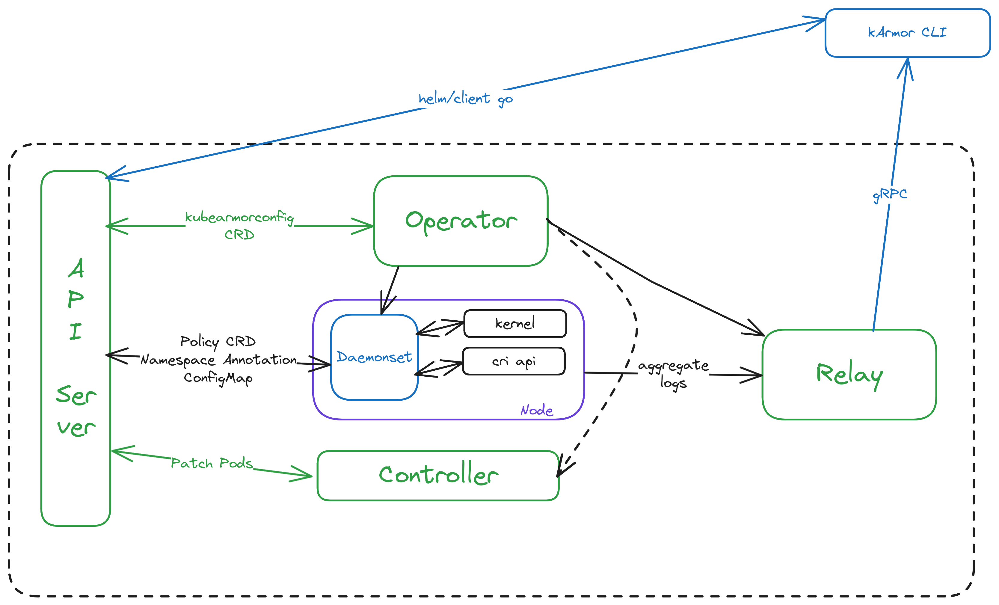

<!-- cSpell:ignore STIGs kubearmorconfig Accuknox Seccomp kubearmor Falco Nephio SIEM -->
# KubeArmor Security Self-assessment

## Table of contents

- [KubeArmor Security Self-assessment](#kubearmor-security-self-assessment)
  - [Table of contents](#table-of-contents)
  - [Metadata](#metadata)
    - [Security links](#security-links)
  - [Overview](#overview)
    - [Background](#background)
    - [Architecture](#architecture)
    - [Actors](#actors)
    - [Actions](#actions)
    - [Goals](#goals)
    - [Non-goals](#non-goals)
  - [Self-assessment use](#self-assessment-use)
  - [Security functions and features](#security-functions-and-features)
  - [Project compliance](#project-compliance)
  - [Secure development practices](#secure-development-practices)
  - [Security issue resolution](#security-issue-resolution)
  - [Appendix](#appendix)

## Metadata

A table at the top for quick reference information, later used for indexing.

|                   |                                                                                                                                                                |
| ----------------- | -------------------------------------------------------------------------------------------------------------------------------------------------------------- |
| Software          | <https://github.com/KubeArmor/KubeArmor>                                                                                                                       |
| Security Provider | Yes                                                                                                                                                            |
| Languages         | Go, C(eBPF), Shell                                                                                                                                             |
| SBOM              | [FOSSA](https://app.fossa.com/projects/git%2Bgithub.com%2Fkubearmor%2FKubeArmor/refs/branch/main/5476d3aa31df7f82c44a69e39eff4298037c9e34/browse/dependencies) |

### Security links

| Doc                                  | url                                                                                                   |
| ------------------------------------ | ----------------------------------------------------------------------------------------------------- |
| Security file                        | [SECURITY.md](https://github.com/kubearmor/KubeArmor/blob/main/SECURITY.md)                           |
| Security Considerations in KubeArmor | <https://github.com/kubearmor/KubeArmor/wiki/Security-Considerations-in-KubeArmor>                    |
| Optional Security Enhancements       | <https://github.com/kubearmor/KubeArmor/blob/main/getting-started/kubearmor-security-enhancements.md> |

## Overview

KubeArmor is a runtime Kubernetes security engine. It uses eBPF and Linux Security Modules(LSM) for fortifying workloads based on Cloud Containers, IoT/Edge, and 5G networks. It provides preemptive mitigation using policy-based controls.

### Background

[KubeArmor](https://kubearmor.io/) is a runtime security engine for kubernetes and other cloud workloads. Users can harden their workloads, create Zero Trust security posture i.e., allowing specific systems actions and denying rest using KubeArmor security policies.
KubeArmor supports [inline mitigation](https://github.com/kubearmor/KubeArmor/blob/main/getting-started/differentiation.md) for preventing attacks. Due to its versatility, KubeArmor has found its relevance in [Edge](https://open-horizon.github.io/docs/demos/kubearmor/) and [5G Control Plane security](https://www.5gsec.com/tech/tech-5g-kubearmor) scenarios as well.

KubeArmor primarily provides the following key features:

- [Workload Hardening](https://github.com/kubearmor/KubeArmor/blob/main/getting-started/hardening_guide.md)

    KubeArmor provides a set of hardening policies that are based on industry-leading compliance and attack frameworks such as CIS, MITRE, NIST-800-53, and STIGs. These policies are designed to help you secure your workloads in a way that is compliant with these frameworks and recommended best practices.

- [Zero Trust Policies](https://github.com/kubearmor/KubeArmor/blob/main/getting-started/least_permissive_access.md)

    KubeArmor is a tool that helps organizations enforce a zero trust posture within their Kubernetes clusters. It allows users to define an allow-based policy that specifies the specific system behavior that is allowed, and denies or audits all other behavior.

- [Network Visibility & Micro-segmentation](https://github.com/kubearmor/KubeArmor/blob/main/getting-started/network_segmentation.md)

    KubeArmor has visibility into the network connections made into or from the pods. It has visibility across socket(), bind(), connect(), accept() calls. KubeArmor can help auto-generate k8s network policy which are enforceable using most of the k8s CNIs (Container Network Interface).

- [Application Behavior](https://github.com/kubearmor/KubeArmor/blob/main/getting-started/workload_visibility.md)

    KubeArmor has visibility into systems and application behavior. KubeArmor summarizes/aggregates the information and provides a user-friendly view to figure out the application behavior.

### Architecture

The following diagram shows the logical architecture for KubeArmor. Each major component is described below:

### Actors

1. **API Server**  
   - Interacts with various components through CRDs (e.g., `kubearmorconfig` and Policy CRDs).  
   - Facilitates Namespace Annotations, ConfigMaps, and pod patching operations.

2. **Operator**  
   - Manages `kubearmorconfig` CRDs and orchestrates changes to the `Daemonsets` and Controller components.

3. **Daemonsets**  
   - Runs on **Nodes** and interacts directly with the kernel and CRI API.  
   - Collects logs and security telemetry for enforcement and analysis.

4. **Controller**  
   - Responsible for applying patches to pods as part of policy enforcement.

5. **Relay**  
   - Aggregates logs from `Daemonsets` and acts as a communication channel between `Daemonsets` and external tools.

6. **kArmor CLI**  
   - Client-side tool that communicates with the Relay via gRPC to interact with the system.  
   - Uses helm/client-go for deployments.

7. **Kernel**  
   - Interfaces with the Daemonsets to provide visibility and enforcement capabilities at the system level.

8. **CRI API**  
   - Exposes container runtime interactions to the Daemonsets for policy application and telemetry.

### Actions

1. **Policy Configuration**  
   - The API Server interacts with the Operator to manage `kubearmorconfig` CRDs and Policy CRDs.  
   - Policy changes are propagated to the `Daemonsets`, which applies the configuration on the nodes and containers on the respective nodes.

2. **Security Enforcement**  
   - The Daemonsets interacts with the **Kernel** through **Linux Security Modules** and **eBPF**, **CRI API** to enforce security policies on nodes and containers.  
   - It can monitor system-level activity, apply runtime restrictions, and collect telemetry logs.

3. **Log Aggregation**  
   - The Daemonsets sends logs and telemetry to the Relay, which aggregates this information for further use.  
   - These logs can be accessed via the `kArmor CLI`, OpenTelemetry or SIEM Integration for analysis.

4. **Pod Patching**  
   - The Controller, based on policies and configurations, patches pods as required for setting apparmor annotations.

5. **User Interaction**  
   - Users interact with the system using the `kArmor CLI` or kubernetes API.  
   - It communicates via **gRPC** with the Relay Service to fetch logs
   - Deployments and runtime configurations are managed using helm or client-go.

6. **Node-Level Enforcement**  
   - The Daemonsets ensures runtime security enforcement at the node level by interacting with the kernel and CRI API.

### Goals

The goal of the KubeArmor project is to help enforce mandatory access controls and provide observability on processes running inside containers or on host, be it Kubernetes or non orchestrated nodes and containers.

### Non-goals

KubeArmor is not a general purpose policy engine or a CNI.

## Self-assessment use

This self-assessment is created by the KubeArmor team to perform an internal analysis of the
project's security.  It is not intended to provide a security audit of KubeArmor, or
function as an independent assessment or attestation of KubeArmor's security health.

This document serves to provide KubeArmor users with an initial understanding of
KubeArmor's security, where to find existing security documentation, KubeArmor plans for
security, and general overview of KubeArmor security practices, both for development of
KubeArmor as well as security of KubeArmor.

This document provides the CNCF TAG-Security with an initial understanding of KubeArmor
to assist in a joint-assessment, necessary for projects under incubation.  Taken
together, this document and the joint-assessment serve as a cornerstone for if and when
KubeArmor seeks graduation and is preparing for a security audit.

## Security functions and features

KubeArmor helps enforce mandatory access control and directly interacts with kernel or apparmor subsystem to help achieve this. KubeArmor directly interacts with privileged entities like eBPF and CRI Socket and we have contained KubeArmor by adequate security measures.

- Threat Modelling
  - Accuknox - <https://github.com/accuknox/k8sthreatmodeling/blob/main/models/kubearmor/README.md>
  - Independently done by Accuknox Clients
- OpenSSF Best Practices (Score of 7.9 and Improving)
- Fuzz Testing
- Deployment Best Practices
  - Reduced Volume Mount Points
  - Reduced Capabilities
  - Component TLS Communication
  - Seccomp Profile
  - non root containers with supported deployment
- OCI Hooks
- Avoid usage of CRI Sockets
- WIP: Protecting KubeArmor through KubeArmor

## Project compliance

KubeArmor does not document meeting particular compliance standards.

## Secure development practices

- Development Pipeline.  
  - All code is maintained in [Git](https://github.com/kubearmor/kubearmor/) and changes must be reviewed by at least 2 maintainers and must pass all unit and e2e tests. Code changes are submitted via Pull Requests (PRs) and must be signed. Commits to the `main` branch are not allowed.
  - All code must pass snyk, CodeQL and go-sec scans

- Communication Channels. Reference where you document how to reach your team or
  describe in corresponding section.
  - Internal: Github Issue, Private Slack Channel and [#kubearmor-dev] on CNCF Slack
  - Inbound: [#kubearmor on CNCF Slack](https://cloud-native.slack.com/archives/C02R319HVL3)
  - Outbound: [#kubearmor on CNCF Slack](https://cloud-native.slack.com/archives/C02R319HVL3)

- Ecosystem. How does your software fit into the cloud native ecosystem?
  - KubeArmor provides a way to enforce security in k8s native way by leveraging k8s resource model.
  - KubeArmor has integrations with lots of CNCF and LF Projects including:
    - Helm (Installation)
    - OpenTelemetry
    - OpenHorizon
    - Kubernetes PolicyReported CRD
    - Nephio

## Security issue resolution

Security Processes are documented in [SECURITY.md](https://github.com/kubearmor/KubeArmor/blob/main/SECURITY.md)

## Appendix

- Known Issues Over Time
  - We make sure go-sec and snyk passes before merging any PRs and they run on each commit
  - <https://github.com/kubearmor/KubeArmor/actions/workflows/ci-test-go.yml>
- [OpenSSF Best Practices](https://bestpractices.coreinfrastructure.org/projects/5401).
- [OpenSSF Scorecard](https://securityscorecards.dev/viewer/?uri=github.com/kubearmor/KubeArmor).
- [CLOMonitor](https://clomonitor.io/projects/cncf/kubearmor).
- Case Studies
  - [Protecting Secrets Manager like Vault](https://help.accuknox.com/use-cases/hashicorp/?h=vault)
  - [Continuous Compliance](https://youtu.be/kZ5s9ob1VtE)
  - [Virtual Patching](https://youtu.be/FT1FnxsKFxg)
  - [AI Security](https://help.accuknox.com/use-cases/modelarmor/)
- Related Projects / Vendors
  - We have constant comparisons with Runtime Observability Engines like [Falco](https://github.com/falcosecurity/falco) and Detect and Respond models. We have documented fundamental differences about importance of enforcement, mandatory access control and preemptive mitigation in <https://github.com/kubearmor/KubeArmor/blob/main/getting-started/differentiation.md>  
