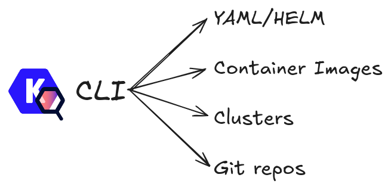
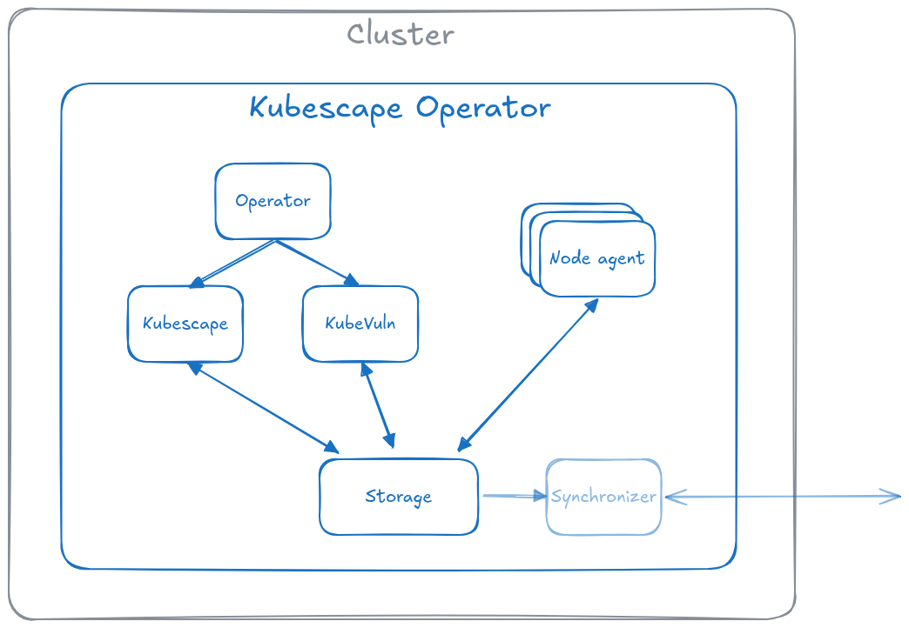

# Kubescape Self-assessment

This document is intended to aid the project's maintainers, contributors, and users understand the project's security status and help identify points of improvement.

## Table of contents

* [Metadata](#metadata)
  * [Security links](#security-links)
* [Overview](#overview)
  * [Actors](#actors)
  * [Actions](#actions)
  * [Background](#background)
  * [Goals](#goals)
  * [Non-goals](#non-goals)
* [Self-assessment use](#self-assessment-use)
* [Security functions and features](#security-functions-and-features)
* [Project compliance](#project-compliance)
* [Secure development practices](#secure-development-practices)
* [Security issue resolution](#security-issue-resolution)
* [Appendix](#appendix)

## Metadata

|   |  |
| -- | -- |
| Assessment Stage | Complete |
| Software |  [Kubescape](https://kubescape.io)  |
| Security Provider | Yes |
| Languages | Go |
| SBOM | Kubescape does not currently generate an SBOM on release|
| Security links | See below |

### Security links

| Doc | url |
| -- | -- |
| Reporting security issues | [here](https://github.com/kubescape/project-governance/blob/main/SECURITY.md) |

## Overview

Kubescape is an open-source Kubernetes security platform that provides comprehensive security coverage, from left to right across the entire development and deployment lifecycle. It offers hardening, posture management, and runtime security capabilities to ensure robust protection for Kubernetes environments.

### Background

The Kubescape project started as a CLI scanner testing Kubernetes configurations against the [NSA Hardening Guide](https://www.cisa.gov/news-events/alerts/2022/03/15/updated-kubernetes-hardening-guide). The original creators are [ARMO](https://armosec.io) employees who started this as a side project for Kubernetes security posture, while their main focus was workload runtime security.

The project enjoyed early popularity and adoption, which triggered more investment and a later contribution to CNCF by ARMO. The project developed a monitoring deployment called Kubescape Operator, which is installed on a cluster and enables constant monitoring. The project aims to be a comprehensive open-source security platform for Kubernetes, both for posture and runtime.

Key features of Kubescape include

* Kubernetes configuration scanning and monitoring
* Vulnerability scanning of images, monitoring vulnerabilities in a Kubernetes cluster
* IDE integration enabling users to find misconfigurations and vulnerabilities during development
* CI/CD integrations enabling users to build security gating in their processes
* Reachability analysis of vulnerabilities using eBPF
* Validating Admission Policy library
* Application security observability using eBPF
* Network and seccomp policy generation based on workload behavior
* Runtime attack detection based on predefined rules and anomalies

### Actors

#### Kubescape CLI

Kubescape CLI is a simple tool written in Go, built on [OPA engine](https://github.com/open-policy-agent/opa) and [Grype](https://github.com/anchore/grype). It downloads frameworks and controls written in Rego and a vulnerability database. Using that input it looks for potential security and compliance issues in YAML/Helm files and vulnerabilities in container images.

It can be used as an investigative tool for benchmarking Kubernetes security posture. In addition it can be planted in CI/CD processes for a security automation use case.

#### Kubescape Operator

Kubescape Operator gives multiple features that can be independently enabled. Its central design concept is to record scan results to a Kubernetes API object. The *Storage* component is a Kubernetes Aggregated API extension service, it stores the different results objects the Operator produces. The following main capabilities are available in the Operator:

* Configuration scanning
* Container image scanning and SBOM generation
* Host scanning
* Application security observability
* Runtime detection of malicious activities

##### Operator component

This component is in charge of commanding and controlling the scans in the cluster. There are multiple configuration options for when and what to scan in the cluster. This component orchestrates these activities by triggering the Kubescape and KubeVuln components.

##### Kubescape component

This component is responsible for  configuration and host scanning. Like the CLI, it uses the [OPA engine](https://github.com/open-policy-agent/opa) to run the project's own Rego library of rules. It also scans the Kubernetes host to validate their configurations. The output of the scans is stored in the *Storage* component via the Kubernetes API and optionally sent to external API endpoints.

##### KubeVuln component

This component is responsible for image vulnerability scanning. It can either produce an SBOM object in the *Storage* and match the SBOM entries with vulnerabilities or rely on the *Node agent* to generate SBOM objects on the nodes and produce vulnerability manifests and VEX documents. All the results are stored in the *Storage* component via the Kubernetes API and optionally sent to external API endpoints.

##### Node agent component

This component serves multiple purposes, all of which are related to information that is only available on Kubernetes nodes:

* Produces SBOMs from the images available on the node (used by *KubeVuln*)
* Produces information from the configurations of the Linux host of the Kubernetes node (used by *Kubescape*)
* Creates an ApplicationProfile using [Inspektor Gadget](https://inspektor-gadget.io) and eBPF. These profiles log the behavior of each container on the node (file access, processes launched, capabilities used, system calls made) into *ApplicationProfile* objects stored in the *Storage* component via the Kubernetes API and optionally sent to external API endpoints.
* Creates *NetworkNeighborhood* objects using [Inspektor Gadget](https://inspektor-gadget.io) and eBPF. These profiles log the network activity of each container, which is stored as an object in the *Storage* component via the Kubernetes API and optionally sent to external API endpoints.
* Monitors container activity via eBPF and evaluates it using its own rule engine, which combines static detection rules and anomaly detection to produce alerts that can be exported to AlertManager, Syslog, HTTP endpoints, STDOUT stream, and other destinations.

##### Storage component

This component is a Kubernetes [aggregated API extension](https://kubernetes.io/docs/concepts/extend-kubernetes/api-extension/apiserver-aggregation/) service. It stores the different objects produced by the other components on a volume as files and SQLite. In the current implementation, it is a singleton component and cannot be scaled horizontally, but it is running successfully in 10k node clusters.

##### Synchronizer component

This component is an optional part of the Kubescape Operator. It enables users to replicate the Kubernetes objects in the cluster (like `rsync`) to a remote service. Central services monitoring multiple clusters use it to collect the Kubescape Operator objects.

#### Detailed overview

A more detailed architectural representation, can be found [here](https://github.com/kubescape/helm-charts/tree/main/charts/kubescape-operator#in-cluster-components-overview)

#### Objects

* ApplicationProfile - storing workload-level information about container activities (file, process, system-call, capabilities)
* ConfigurationScanSummary - summary object containing results of configuration scanning
* GeneratedNetworkPolicy - object containing proposed network policies for each workload
* KnownServer - list of IP to host conversion
* NetworkNeighborhood - storing workload level information about network activities of each container
* OpenVulnerabilityExchangeContainer - [VEX](https://github.com/openvex) object that was built from the vulnerability scan together with reachability analysis
* SBOMSyftFiltered - SBOM of running containers filtered by only those that are in use
* SBOMSyft - SBOM of running containers
* SeccompProfile - Seccomp profile distribution helper object (converting it to JSON on each host)
* VulnerabilityManifest - vulnerability scan result object
* VulnerabilityManifestSummary - the summary object of the vulnerability scans
* WorkloadConfigurationScan -  workload level configuration scan output
* WorkloadConfigurationScanSummary - summary of the workload configuration scan

### Actions

#### Configuration scans

Configuration scans can be triggered in three ways:

* Continuous scanning: every new or updated object is scanned. This is achieved by "watching" Kubernetes API objects
* Scheduled scanning: using pre-configured recurring triggers to scan configurations in the cluster. This is achieved using CronJobs
* Triggered scanning: Kubescape Operator exposing API to trigger a scan of specific objects or the whole cluster

#### Vulnerability scans

Vulnerability scans can be triggered in three ways:

* Continuous scanning: every new image introduced to the cluster is scanned. This is achieved by "watching" Kubernetes API objects
* Scheduled scanning: using configurable scheduling to trigger periodic scans for vulnerabilities in the cluster. This is achieved using CronJobs
* Triggered scanning: Kubescape Operator exposing API to trigger scan of specific images and workloads in the cluster

#### Object storage

Full Kubernetes object API is supported with all the CRUD actions in the storage component.

#### Node agent

*Node agent* is completely event-driven and it does not expose a transactional API.

It responds to:

* Kubernetes API events: Pods that are created, removed on a node
* Container runtime events: Starting monitoring when a container starts and stopping it when it is stopped.
* *Node agent* lifecycle events: When the component starts, an automatic configuration scan of the node is triggered
* *OperatorCommand* objects: such objects convey command to the *Node agent* to delete pods/processes as a response to a detection
* *RuntimeRuleAlertBinding* objects: these objects define which detection rules should be applied to which Pods

##### Synchronizer

This component is also entirely event-driven, and two actors trigger its actions:

* Kubernetes API: *Synchronizer* responds to changes in the Kubernetes API objects - this triggers an action to send these objects to the connected Synchronizer server
* Synchronizer server: Synchronizer server can trigger the *Synchronizer* component to store objects in Kubernetes API (this is limited by the *ClusterRole* the *Synchronizer* is assigned with)

### Goals

* The Kubescape Operator automates scanning and monitoring of Kubernetes clusters
  * provides up-to-date security posture data
  * creates proposals on how to improve the security posture of the workload and the cluster
  * provides security observability data
  * alerts on potential breaches to workloads in the cluster
* Kubescape CLI scans pre-deployment and post-deployment configurations and images and provides actionable results

#### Security Goals

* All access to the data produced by Kubescape Operator should be only available to those subjects who have the proper RBAC authorizations
* Kubescape should only share information to מon-Kubernetes endpoints in cases when the user explicitly defined it
* Kubescape should only have access to objects it needs to complete its job
* Triggers should only come from authenticated and authorized sources

### Non-goals

* Kubescape is not meant to enforce access control beyond what the Kubernetes API already provides

## Self-assessment use

This self-assessment is not intended to provide a security audit of Kubescape or function as an independent assessment or attestation of Kubescape's security health.

This document provides Kubescape users with an initial understanding of Kubescape's security, where to find existing security documentation, Kubescape's plans for security, and a general overview of Kubescape's security practices, both for the development of Kubescape and its operational security.

## Security functions and features

In general, Kubescape is a security project; therefore, we do not list all the features here, only the "non-functional" security features.

### Critical

#### Kubernetes API server authentication

Since Kubescape is mainly driven and uses an API server to store objects, it is critical to validate the Kubernetes API server properly.
This is true for regular API server clients and even more crucial for the *Storage* component, which needs mTLS to function properly to prevent unwanted access.

#### Denial of events

Runtime detection relies heavily on eBPF and container runtime events. Allowing such inputs is critical to maintaining reliable detection capabilities.

#### Masking sensitive results

Since results can contain sensitive information (Kubernetes secrets, environment variables with keys) Kubescape masks these fields from the result objects

### Security Relevant

#### Kubernetes RBAC

It is important for users to understand Kubescape's access control and how it is reflected in Kubernetes RBAC settings.

## Project compliance

The project has no written record of complying with a well known security standard like FIPS.

## Secure development practices

### Development Pipeline

Kubescape's development pipeline ensures the software is robust, reliable, and secure. It involves several stages of peer reviews, testing, and assessment as the software is developed and built.

#### Contributor Requirements

Contributors to Kubescape are required to sign their commits, adhering to the Developer Certificate of Origin (DCO). This practice ensures the integrity of the code by verifying that the changes are made by the person who claims to have made them. Contributors use the Signed-off-by line in commit messages to signify their adherence to these requirements. Git has a -s command-line option to append this automatically to commit messages.
Contributors can start by forking the repository on GitHub, reading the installation document for build and test instructions, and playing with the project.

#### Container Images

The container images used in Kubescape are signed and should be verified by users.

#### Reviewers

Multiple reviewers review a commit before it is merged. This practice helps catch potential security issues early in the development process. The exact number of reviewers required before merging needs to be specified in the documentation.

#### Automated Checks

Kubescape includes automated checks for misconfigurations and vulnerabilities. These checks are part of Kubescape's continuous integration (CI) process and automatically run against every release request.

#### Integration Tests

Kubescape's upstream continuous integration (CI) tests will automatically run integration tests against proposed changes. Users are not required to run these tests locally, but they may.

### Communication Channels

  Kubescape Communication Channels

#### Internal Communication

* Slack: The kubescape and kubescape-dev slack channels in the [CNCF slack](https://communityinviter.com/apps/cloud-native/cncf)
* GitHub: [Discussion](https://github.com/kubescape/kubescape/discussions) or [issues](https://github.com/kubescape/kubescape/issues)
* Security topics: [cncf-kubescape-maintainers@lists.cncf.io](#reporting-security-vulnerabilities)

#### Inbound Communication

Users or prospective users communicate with the Kubescape team through GitHub issues and pull requests. GitHub is a platform that hosts the Kubescape project's codebase and provides features for tracking changes, managing versions, and collaborating on code. Users can submit pull requests to report issues, propose changes, or contribute to the project.

* GitHub:  [Discussion](https://github.com/kubescape/kubescape/discussions) or [issues](https://github.com/kubescape/kubescape/issues)

#### Outbound Communication

* Twitter: [@Kubescape](https://x.com/Kubescape)
* Kubescape site: [Kubescape.io](https://kubescape.io/)

##### Community meetings

Kubescape [community meetings](https://zoom.us/j/95174063585) are held on Zoom every other week at 15:00 CET. ([See that in your local time zone](https://time.is/compare/1500_in_CET). :headphones:

Community members are encouraged to join and add to the discussion via the [community meeting notes document](https://docs.google.com/document/d/1X_eyhPzJvb4ascVQ2e0jN87LAvq7lTuXT5d4gQxi8us/edit?usp=sharing) to add an item. You can also see the summary of previous discussions here. 🖥️

## Security issue resolution

For a complete list of closed security issues, please refer to [this link](https://github.com/kubescape/kubescape/issues?q=is%3Aissue+label%3Asecurity+is%3Aclosed)

### Responsible Disclosures Process

In case of suspected security issues, incidents, or vulnerabilities, both external and internal to the project, Kubescape has a responsible disclosure process in place. The process is designed to handle security vulnerabilities quickly and sometimes privately. The primary goal of this process is to reduce the time users are vulnerable to publicly known exploits. Follow [these communication channels](#reporting-security-vulnerabilities)

#### Vulnerability Response Process

Maintainers organize the entire response, including internal communication and external disclosure.

#### Reporting Security Vulnerabilities

If you find a vulnerability or a potential vulnerability in Kubescape, please let us know immediately at [cncf-kubescape-maintainers@lists.cncf.io](mailto:cncf-kubescape-maintainers@lists.cncf.io). We'll send a confirmation email to acknowledge your report and an additional email when we've identified the issues positively or negatively.
Please see the complete [security release process](https://github.com/kubescape/project-governance/blob/main/SECURITY.md) for further details.

#### Private Disclosure Processes

If a security vulnerability or any security-related issues are found, they should not be filed as a public or a GitHub issue. Instead, the report should be sent privately to [cncf-kubescape-maintainers@lists.cncf.io](mailto:cncf-kubescape-maintainers@lists.cncf.io)

#### Public Disclosure Processes

If a publicly disclosed security vulnerability is known, it should be reported immediately to [cncf-kubescape-maintainers@lists.cncf.io](mailto:cncf-kubescape-maintainers@lists.cncf.io) to inform the maintainers. This will initiate the patch, release, and communication process.

### Patch, Release, and Public Communication

For each vulnerability, a member of the maintainer team will coordinate with the "Fix Team" and send disclosure message to the rest of the community. This lead will be referred to as the "Fix Lead." The Fix Lead rotates between the maintainers.

### Patching/Update Availability

Once the vulnerability has been confirmed and the relevant parties have been notified, the next step is to make a patch or update available. This involves releasing a new version of the software that addresses the vulnerability. The patch or update is then made available to all users, who can update their systems to the latest version to protect against the vulnerability.
In addition, Kubescape has a Fix Disclosure Process that includes disclosing forthcoming fixes to users, completed within 1-7 days of disclosure. The Fix Lead will create a GitHub issue in the Kubescape project to inform users that a security vulnerability has been disclosed and that a fix will be made available, with an estimation of the release date.

## Incident Response

There is a template for incident response for reference [here](https://github.com/cncf/tag-security/blob/main/community/resources/project-resources/templates/incident-response.md)

## Appendix

### Known issues over time

* At the time of preparation, the project had not had a private disclosure of any kind
* Public issues can be found with the `security` label [here](https://github.com/kubescape/kubescape/labels/security)

### OpenSSF best practices

The Kubescape project is continuously improving its practices based on the OpenSSF recommendations, see [Scorecard Results](https://securityscorecards.dev/viewer/?uri=github.com/kubescape/kubescape) and [Best Practices Badge](https://www.bestpractices.dev/en/projects/6944)

<!-- cSpell:ignore Grype Inspektor -->