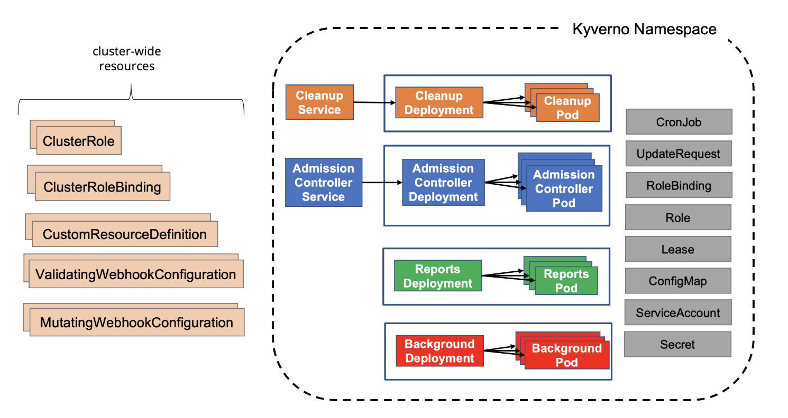

# CNCF TAG-Security Kyverno Security Self Assessment

|**Completed**:               | *tbd*                                 |
|-----------------------------|---------------------------------------|
|**Security reviewer(s)**:    | <!-- cspell:disable --> John Kinsella, Wesley Steehouwer (@dutchshark) |
|**Project security lead**:   | <!-- cspell:disable --> Jim Bugwadia  |
| **Source code**:            | https://github.com/kyverno/kyverno    |
| **Web site**:               | https://kyverno.io/                   |

# Table of contents

* [Metadata](#metadata)
  * [Security links](#security-links)
* [Overview](#overview)
  * [Background](#background)
  * [Goals](#goals)
  * [Non-goals](#non-goals)
* [Self-assessment use](#self-assessment-use)
* [Security functions and features](#security-functions-and-features)
* [Project compliance](#project-compliance)
* [Secure development practices](#secure-development-practices)
* [Security issue resolution](#security-issue-resolution)
* [Appendix](#appendix)

## Metadata

|   |  |
| -- | -- |
| Software | https://github.com/kyverno/kyverno  |
| Security Provider | Yes  |
| Languages | Go |
| SBOM | To download and verify the SBOM for a specific version, visit https://kyverno.io/docs/security/#fetching-the-sbom-for-kyverno |
| Compatibility | https://kyverno.io/docs/installation/#compatibility-matrix |
| | |

### Security links

| Doc | url |
| -- | -- |
| Kyverno Security Documentation | https://main.kyverno.io/docs/security/ |

## Overview

Kyverno helps secure and automates Kubernetes configurations using policies defined as Kubernetes custom resources. It operates as an Kubernetes admission controller and a command-line for off-cluster use.

### Background

Kubernetes has a declarative configuration management system that allows users to specify the desired state of resources which Kubernetes controllers continuously reconcile with the current system state. For flexibility, and to address a wide set of use cases, Kubernetes provides several configuration options for each resource. 

While this is powerful, it also creates a few challenges:
1. Only a small subset of configuration options are commonly used. 
2. Kubernetes configurations are not secure by default. Security and best practices need to be configured for workloads.
3. A resource's configurations is shared across organizational roles (dev-sec-ops) and chances of misconfigurations, or lack of proper configuration, increase as there is no clear ownership. Whether developers, operators, or security engineers are responsible for more `advanced` configuration settings may not be obvious.

### Goal

The goal of the Kyverno project is to simplify Kubernetes configuration security and automate processes that otherwise require manual handoffs and coordination across Kubernetes cluster operators and developers.

### Non-goals

Kyverno is not a general purpose policy engine i.e. it is not designed for use outside of Kubernetes.

## Self-assessment use

This self-assessment is created by the Kyverno team to perform an internal analysis of the
project's security.  It is not intended to provide a security audit of Kyverno, or
function as an independent assessment or attestation of Kyverno's security health.

This document serves to provide Kyverno users with an initial understanding of
Kyverno's security, where to find existing security documentation, Kyverno plans for
security, and general overview of Kyverno security practices, both for development of
Kyverno as well as security of Kyverno.

This document provides the CNCF SIG-Security with an initial understanding of Kyverno
to assist in a joint-review, necessary for projects under incubation.  Taken
together, this document and the joint-review serve as a cornerstone for if and when
Kyverno seeks graduation and is preparing for a security audit.

## Logical Architecture

The following diagram shows the logical architecture for Kyverno. Each major component is described below:

### Webhook

The `Webhook` component registers as a validating and mutating admission webhook and receives `AdmissionReview` requests from the API server to validate and mutate configuration changes, based on policies. Users can configure which namespaces and resources the webhooks will receive via command line options or the ConfigMap.

The `Webhook` also creates and updates `GenerateRequest` and `PolicyChangeRequest` resources to trigger updates via other Kyverno controllers.

### Webhook Monitor

On startup, Kyverno's `Webhook Monitor` component generates a self-signed certificate (or uses a user-provided certificate) and auto-creates the webhook configurations required to register Kyverno as an admission webhook. The component also periodically monitors if Kyverno is receiving webhook events and recreates the certificate and webhook configurations if needed.

### Generate Controller

The `Generate Controller` watches `GenerateRequest` resources and creates, updates, and deletes Kubernetes resources based on Kyverno [generate rules](https://kyverno.io/docs/writing-policies/generate/). The `Generate Controller` also watches for changes in policy definitions to update generated resources.

### Policy Controller

The `Policy Controller` performs periodic background scans on existing configurations and creates or updates policy reports based on changes and background scans. The `Policy Controller` watches `ReportChangeRequest` resources and creates, updates, and delete Kyverno [Policy Report](https://kyverno.io/docs/policy-reports/) resources. The `Policy Controller` also watches for changes in policies definitions to update policy reports.

## Physical Architecture

Kyverno can be installed using a [Helm chart](https://artifacthub.io/packages/helm/kyverno/kyverno) or YAML files (see [installation doc](https://kyverno.io/docs/installation/)).  

The Kyverno application consists of a:
1. Service
2. Deployment
3. Roles
4. Role Bindings
5. Custom Resource Definitions
6. Service account

When Kyverno runs, it will check for a named `Secret` with a certificate to use for webhook registration. If the secret does not exist, Kyverno will generate a self-signed certificate and store it in the secret. Kyverno will then generate or update the mutating and validating webhook configurations.

The diagram below shows the Kyverno physical architecture:

**NOTE:** Currently Kyverno runs as one multi-instance (HA) `Pod` managed by a single `Deployment`. In the future the different controllers may be packaged in separate deployments to allow flexibility in scaling and tuning each component.

## Security functions and features

Kyverno operates as an webhook admission controller. 

### Threat Modeling

A threat model for admission controllers is published and maintained by the Kubernetes SIG Security:
  * [Kubernetes Admission Controller Threat Model](https://github.com/kubernetes/sig-security/blob/main/sig-security-docs/papers/admission-control/kubernetes-admission-control-threat-model.md)
  * [Blog post](https://kubernetes.io/blog/2022/01/19/secure-your-admission-controllers-and-webhooks/)

The Kyverno security document references this threat model and discusses mitigations and best practices:

   https://main.kyverno.io/docs/security/#threat-model

## Project compliance

Kyverno does not currently document meeting particular compliance standards.

## Secure development practices

The Kyverno project follows established CNCF and OSS best practices for code development and delivery:

### Development Pipeline

All code is maintained in [Git](https://github.com/kyverno/kyverno/) and changes must be reviewed by maintainers and must pass all unit and e2e tests. Code changes are submitted via Pull Requests (PRs) and must be signed. Commits to the `main` branch are not allowed.

### Artifacts

The [Kyverno container images](https://github.com/orgs/kyverno/packages) are hosted in GitHub Container Registry (GHCR). Container images are signed using Sigstore Cosign (https://main.kyverno.io/docs/security/#verifying-kyverno-container-images.)

The [Kyverno Helm chart](https://artifacthub.io/packages/helm/kyverno/kyverno) is hosted in ArtifactHub. There is a pending issue to to sign the Helm Chart using Sigstore Cosign (https://github.com/kyverno/kyverno/issues/2758).

The [Kyverno installation YAMLs](https://github.com/kyverno/kyverno/blob/main/definitions/install.yaml) are hosted in the GitHub repository.

A Software Bill of Materials (SBOM) is produced and made available for each release (https://main.kyverno.io/docs/security/#fetching-the-sbom-for-kyverno).

### Communication Channels. 

  * Internal: [GitHub Discussions](https://github.com/kyverno/kyverno/discussions)
  * Inbound: [#kyverno slack channel](https://kubernetes.slack.com/archives/CLGR9BJU9), [mailing list](https://groups.google.com/g/kyverno)
  * Outbound: [#kyverno slack channel](https://kubernetes.slack.com/archives/CLGR9BJU9), [mailing list](https://groups.google.com/g/kyverno)
  * Security email group: [kyverno-security](mailto:kyverno-security@googlegroups.com)

## Security processes

Kyverno's processes for security issue resolution, responsible disclosure, vulnerability response, and incident response are documented at:

   https://main.kyverno.io/docs/security/

A security email alias [kyverno-security](mailto:kyverno-security@googlegroups.com) is available for security disclosures and related communications.

## Appendix

### Known Issues Over Time

All Kyverno security related issues (both fixes and enhancements) are labeled with "security" and can be queried using:

  https://github.com/kyverno/kyverno/labels/security

### [CII Best Practices](https://www.coreinfrastructure.org/programs/best-practices-program/)

The Kyverno project has adopted the OSSF/Scorecard and is tracking progress in [issue #2617](https://github.com/kyverno/kyverno/issues/2617).

### Related Projects / Vendors

[OPA/Gatekeeper](https://github.com/open-policy-agent/gatekeeper) is another CNCF project that acts as an admission controller and supports policy management. It uses [Rego](https://www.openpolicyagent.org/docs/latest/policy-language/) as its policy language. 

A detailed comparison is available at: https://neonmirrors.net/post/2021-02/kubernetes-policy-comparison-opa-gatekeeper-vs-kyverno/.

