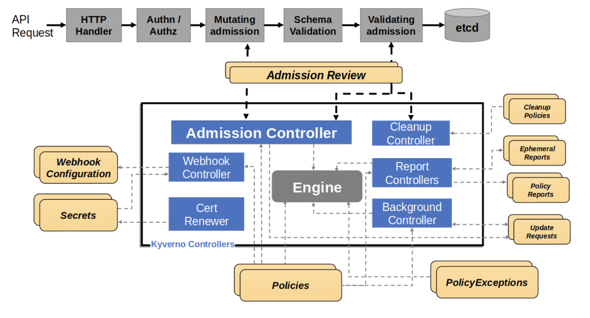

# CNCF TAG-Security Kyverno Security Self Assessment

|**Completed**:               | *tbd*                                 |
|-----------------------------|---------------------------------------|
|**Security reviewer(s)**:    | <!-- cspell:disable --> John Kinsella, Wesley Steehouwer (@dutchshark) |
|**Project security lead**:   | <!-- cspell:disable --> Jim Bugwadia, Shuting Zhao  |
| **Source code**:            | https://github.com/kyverno/kyverno    |
| **Web site**:               | https://kyverno.io/                   |

# Table of contents

* [Metadata](#metadata)
  * [Security links](#security-links)
* [Overview](#overview)
  * [Background](#background)
  * [Goals](#goals)
  * [Non-goals](#non-goals)
* [Self-assessment use](#self-assessment-use)
* [Security functions and features](#security-functions-and-features)
* [Project compliance](#project-compliance)
* [Secure development practices](#secure-development-practices)
* [Security issue resolution](#security-issue-resolution)
* [Appendix](#appendix)

## Metadata

|   |  |
| -- | -- |
| Software | https://github.com/kyverno/kyverno  |
| Security Provider | Yes  |
| Languages | Go |
| SBOM | To download and verify the SBOM for a specific version, visit https://kyverno.io/docs/security/#fetching-the-sbom-for-kyverno |
| Compatibility | https://kyverno.io/docs/installation/#compatibility-matrix |
| | |

### Security links

| Doc | url |
| -- | -- |
| Kyverno Security Documentation | https://main.kyverno.io/docs/security/ |

## Overview

Kyverno helps secure and automates configurations using policies defined as Kubernetes custom resources. It operates as a Kubernetes admission controller and provides command-line tools for off-cluster use. Additionally, Kyverno has been extended with new policy types (`ValidatingPolicy`, `ImageValidatingPolicy`, `MutatingPolicy`) that utilize CommonExpressionLanguage to support non-Kubernetes resources, enabling policy validation for any JSON or YAML payload including Terraform files, Dockerfiles, cloud configurations, and service authorization requests.

### Background

Kubernetes has a declarative configuration management system that allows users to specify the desired state of resources which Kubernetes controllers continuously reconcile with the current system state. For flexibility, and to address a wide set of use cases, Kubernetes provides several configuration options for each resource. 

While this is powerful, it also creates a few challenges:
1. Only a small subset of configuration options are commonly used. 
2. Kubernetes configurations are not secure by default. Security and best practices need to be configured for workloads.
3. A resource's configurations is shared across organizational roles (dev-sec-ops) and chances of misconfigurations, or lack of proper configuration, increase as there is no clear ownership. Whether developers, operators, or security engineers are responsible for more `advanced` configuration settings may not be obvious.

### Goals

The goal of the Kyverno project is to simplify configuration security and automate processes that otherwise require manual handoffs and coordination across operators and developers. While initially focused on Kubernetes, Kyverno has been extended to support non-Kubernetes resources through new policy types (`ValidatingPolicy`, `ImageValidatingPolicy`, `MutatingPolicy`) that utilize CommonExpressionLanguage, enabling validation of any JSON or YAML payload including Terraform files, Dockerfiles, cloud configurations, and service authorization requests.

### Non-goals

Kyverno is  designed for Kubernetes environments, and has been extended with additional tools and new policy types to support non-Kubernetes use cases. The default Kyverno installation operates as an admission controller and is optimized for Kubernetes resource management. The new CEL-based policy types provide a seamless approach to handling non-Kubernetes resources.

Kyverno complements and extends the Kubernetes' native ValidatingAdmissionPolicy and MutatingAdmissionPolicy types. Kyverno provides features such as comprehensive reporting, exception management, and periodic scanning, for the native policies. For more complex policy logic which cannot be handled by the native types, Kyverno offers custom policy types which cleanly extend the native types and provide additional attributes and extended custom CEL libraries. Kyverno also supports converting its own policy types, to the native types for fast execution in the API server, whenever possible.

## Self-assessment use

This self-assessment is created by the Kyverno team to perform an internal analysis of the project's security.  It is not intended to provide a security audit of Kyverno, or function as an independent assessment or attestation of Kyverno's security health.

This document serves to provide Kyverno users with an initial understanding of Kyverno's security, where to find existing security documentation, Kyverno plans for security, and general overview of Kyverno security practices, both for development of Kyverno as well as security of Kyverno.

This document provides the CNCF TAG-Security with an initial understanding of Kyverno to assist in a joint-review, necessary for projects under incubation.  Taken together, this document and the joint-review serve as a cornerstone for if and when Kyverno seeks graduation and is preparing for a security audit.

## Logical Architecture

The following diagram shows the logical architecture for Kyverno. Each major component is described below:

Kyverno consists of four main controllers that work together to provide comprehensive policy management capabilities. Each controller handles specific aspects of policy processing, from admission control to background operations and cleanup tasks.

### Admission Controller 

* Receives AdmissionReview requests from the Kubernetes API server through validating and mutating webhooks.
* Processes validate, mutate, and image validating rules.
* Manages and renews certificates as Kubernetes Secrets for webhook use through the embedded Cert Renewer.
* Manages and configures webhook rules dynamically based on installed policies through the embedded Webhook Controller.
* Performs policy validation for the `Policy`, `ClusterPolicy`, `ValidatingPolicy`, `ImageValidatingPolicy`, `MutatingPolicy`, `GeneratingPolicy`, `DeletingPolicy`, and `PolicyException` custom resources.
* Processes Policy Exceptions.
* Generates `EphemeralReport` and `ClusterEphemeralReport` intermediary resources for further processing by the Reports Controller.
* Generates `UpdateRequest` intermediary resources for further processing by the Background Controller.

### Reports Controller 

* Responsible for creation and reconciliation of the final `PolicyReport` and `ClusterPolicyReport` custom resources.
* Performs background scans and generates, processes, and converts `EphemeralReport` and `ClusterEphemeralReport` intermediary resources into the final policy report resources.

### Background Controller 

* Processes generate and mutate-existing rules of the `Policy` or `ClusterPolicy`, and the mutate-existing functionality of the `MutatingPolicy` and `GeneratingPolicy`.
* Processes policy add, update, and delete events.
* Processes and generates `UpdateRequest` intermediary resources to generate or mutate the final resource.
* Generates `EphemeralReport` and `ClusterEphemeralReport` intermediary resources for further processing by the Reports Controller.

### Cleanup Controller 

* Processes `CleanupPolicy` and `DeletingPolicy` resources.
* Performs policy validation for the CleanupPolicy and ClusterCleanupPolicy custom resources through a webhook server.
* Reconciles its webhook through a webhook controller.
* Manages and renews certificates as Kubernetes Secrets for use in the webhook.
* Creates and reconciles CronJobs used as the mechanism to trigger cleanup.
* Handles the cleanup by deleting resources from the Kubernetes API.

## Physical Architecture

Kyverno can be installed using a [Helm chart](https://artifacthub.io/packages/helm/kyverno/kyverno) or YAML files (see [installation doc](https://kyverno.io/docs/installation/)).

The diagram below shows the Kyverno physical architecture:

A standard Kyverno installation consists of a number of different components, some of which are optional:

**Deployments**
* Admission controller (required): The main component of Kyverno which handles webhook callbacks from the API server for verification, mutation, Policy Exceptions, and the processing engine.
* Background controller (optional): The component responsible for processing of generate and mutate-existing rules.
* Reports controller (optional): The component responsible for handling of Policy Reports.
* Cleanup controller (optional): The component responsible for processing of Cleanup Policies and Deleting Policies.

**Services**
* Services needed to receive webhook requests.
* Services needed for monitoring of metrics.

**ServiceAccounts**
* One ServiceAccount per controller to segregate and confine the permissions needed for each controller to operate on the resources for which it is responsible.

**ConfigMaps**
* ConfigMap for holding the main Kyverno configuration.
* ConfigMap for holding the metrics configuration.

**Secrets**
* Secrets for webhook registration and authentication with the API server.

**Roles and Bindings**
* Roles and ClusterRoles, Bindings and ClusterRoleBindings authorizing the various ServiceAccounts to act on the resources in their scope.

**Webhooks**
* ValidatingWebhookConfigurations for receiving both policy and resource validation requests.
* MutatingWebhookConfigurations for receiving both policy and resource mutating requests.

**CustomResourceDefinitions**
* CRDs which define the custom resources corresponding to policies, reports, and their intermediary resources.

## Security functions and features

Kyverno operates as an webhook admission controller. 

### Threat Modeling

A threat model for admission controllers is published and maintained by the Kubernetes SIG Security:
  * [Kubernetes Admission Controller Threat Model](https://github.com/kubernetes/sig-security/blob/main/sig-security-docs/papers/admission-control/kubernetes-admission-control-threat-model.md)
  * [Blog post](https://kubernetes.io/blog/2022/01/19/secure-your-admission-controllers-and-webhooks/)

The Kyverno security document references this threat model and discusses mitigations and best practices:

   https://main.kyverno.io/docs/security/#threat-model

## Project compliance

Kyverno does not currently document meeting particular compliance standards.

## Secure development practices

The Kyverno project follows established CNCF and OSS best practices for code development and delivery.

### Development Pipeline

All code is maintained in [Git](https://github.com/kyverno/kyverno/) and changes must be reviewed by maintainers and must pass all unit and e2e tests. Code changes are submitted via Pull Requests (PRs) and must be signed. Commits to the `main` branch are not allowed.

### Artifacts

The [Kyverno container images](https://github.com/orgs/kyverno/packages) are hosted in GitHub Container Registry (GHCR). Container images are signed using Sigstore Cosign (https://main.kyverno.io/docs/security/#verifying-kyverno-container-images.)

The [Kyverno Helm chart](https://artifacthub.io/packages/helm/kyverno/kyverno) is hosted in ArtifactHub. There is a pending issue to to sign the Helm Chart using Sigstore Cosign (https://github.com/kyverno/kyverno/issues/2758).

The [Kyverno installation YAMLs](https://github.com/kyverno/kyverno/blob/main/config/install-latest-testing.yaml) are hosted in the GitHub repository.

A Software Bill of Materials (SBOM) is produced and made available for each release (https://main.kyverno.io/docs/security/#fetching-the-sbom-for-kyverno).

### Communication Channels. 

  * Internal: [GitHub Discussions](https://github.com/kyverno/kyverno/discussions)
  * Inbound: [#kyverno slack channel](https://kubernetes.slack.com/archives/CLGR9BJU9), [mailing list](https://groups.google.com/g/kyverno)
  * Outbound: [#kyverno slack channel](https://kubernetes.slack.com/archives/CLGR9BJU9), [mailing list](https://groups.google.com/g/kyverno)
  * Security email group: [kyverno-security](mailto:kyverno-security@googlegroups.com)

## Security processes

Kyverno's processes for security issue resolution, responsible disclosure, vulnerability response, and incident response are documented at:

   https://main.kyverno.io/docs/security/

A security email alias [kyverno-security](mailto:kyverno-security@googlegroups.com) is available for security disclosures and related communications.

## Appendix

### Known Issues Over Time

All Kyverno security related issues (both fixes and enhancements) are labeled with "security" and can be queried using:

  https://github.com/kyverno/kyverno/labels/security

### [CII Best Practices](https://www.bestpractices.dev/)

The Kyverno project has passed the OpenSSF Scorecard check and is actively working towards achieving silver/gold level certification. Progress is being tracked via [issue 10908](https://github.com/kyverno/kyverno/issues/10908).

### Related Projects / Vendors

[OPA/Gatekeeper](https://github.com/open-policy-agent/gatekeeper) is another CNCF project that acts as an admission controller and supports policy management. It uses [Rego](https://www.openpolicyagent.org/docs/latest/policy-language/) as its policy language. 

A detailed comparison is available at: https://neonmirrors.net/post/2021-02/kubernetes-policy-comparison-opa-gatekeeper-vs-kyverno/.

