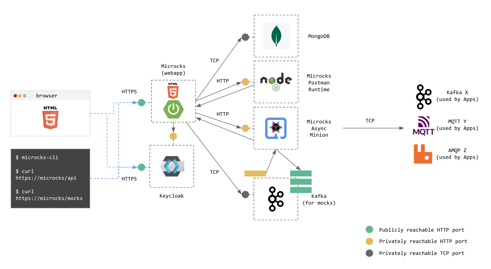
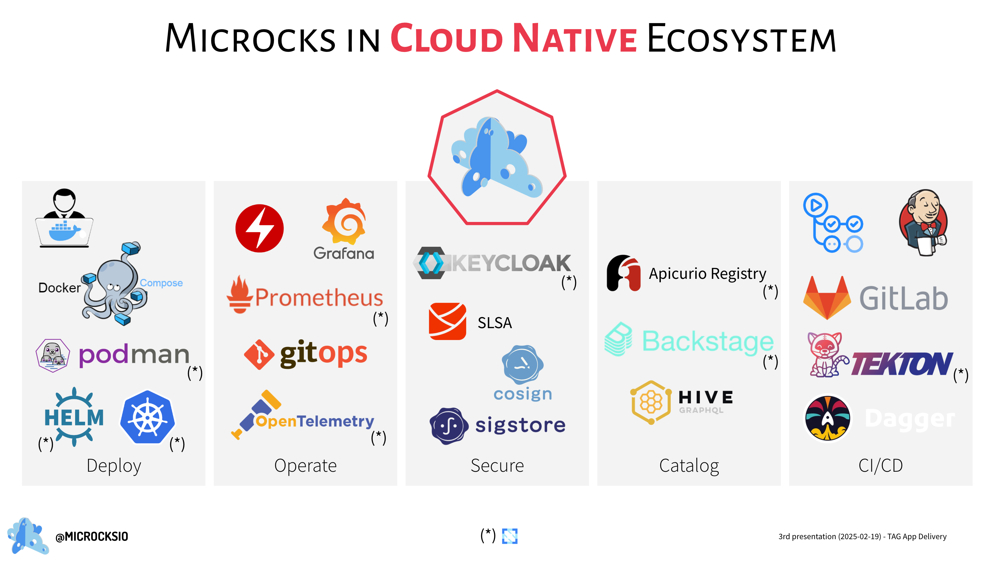

# Microcks Self-assessment

<!-- cSpell:ignore Microcks Yacine Kheddache yada Broudoux lbroudoux missings microcks Microcks's protos Devfile Strimzi Bengaluru Traefik Odier's Odier Ludovic Pourrat Gschwend -->

March 2025, written by Microcks [Maintainers](https://github.com/microcks/.github/blob/main/MAINTAINERS.md): Yacine Kheddache([@yada](https://github.com/yada)) & Laurent Broudoux([@lbroudoux](https://github.com/lbroudoux)).

## Self-assessment outline

### Table of contents

* [Metadata](#metadata)
  * [Security links](#security-links)
* [Overview](#overview)
  * [Actors](#actors)
  * [Actions](#actions)
  * [Background](#background)
  * [Goals](#goals)
  * [Non-goals](#non-goals)
* [Self-assessment use](#self-assessment-use)
* [Security functions and features](#security-functions-and-features)
* [Project compliance](#project-compliance)
* [Secure development practices](#secure-development-practices)
* [Security issue resolution](#security-issue-resolution)
* [Appendix](#appendix)

### Metadata

A table at the top for quick reference information, later used for indexing.

|||
| -- | -- |
| Assessment Stage | Complete |
| Software | [https://github.com/microcks/microcks](https://github.com/microcks/microcks) |
| Security Provider? | No. Microcks is not be considered a security provider |
| Languages | Java |
| SBOM | Known Weakness. Automated generation of each repo's SBOM is not yet complete for all repos (6 missings on 19, see [CLOMonitor](https://clomonitor.io/projects/cncf/microcks) checks) and should be added to the roadmap to reach 100% |

#### Security links

| Doc | url |
| -- | -- |
| Security Policy | [Microcks Security Policy](https://github.com/microcks/.github/blob/main/SECURITY.md) |
| Security Insights | [Microcks Security Insights main repo](https://github.com/microcks/microcks/blob/master/SECURITY-INSIGHTS.yml) but 100% present on our 19 repos, see [CLOMonitor](https://clomonitor.io/projects/cncf/microcks) checks. |

### Overview

Microcks is a tool for **mocking and testing** your APIs and microservices. It leverages **API standards** to provide a **uniform and multi-protocol approach** for simulating complex distributed environments and validating service components in isolation.

#### Background

Microcks facilitates **rapid simulation generation**, **automated API testing**, and **seamless CI/CD integration**, streamlining development and deployment processes. By reducing development time, minimizing errors, and ensuring consistent API behavior across environments, Microcks enables teams to optimize services, embrace cloud-native development, and accelerate product releases.

**The Problems**:

* API Dependencies in Development: When building or testing a system that relies on APIs (internal or external), those APIs might not always be available, might be slow, or might not exist yet. This makes development and testing difficult.
* Realistic API Testing: Traditional unit tests don’t fully test API interactions, and manually setting up API responses is time-consuming and error-prone.
* Consistency Across Environments:  Ensuring API behaviors are consistent across dev, test, and production environments is hard. Mocks can drift from reality, making tests unreliable.

**How Microcks Solves It**:

* API Mocking: It automatically generates realistic mock versions of APIs based on OpenAPI, AsyncAPI, or other API contracts. These mocks behave like the real API, so developers can work without waiting for an actual backend.
* Contract-Based Testing: It verifies that real APIs conform to their defined contract (e.g., OpenAPI spec) by running automated tests against them.
* Supports Multiple Protocols: Works with REST, GraphQL, gRPC, WebSockets, and event-driven APIs, making it useful for modern microservices.

**Competitive advantage**:

By streamlining API workflows and development life cycle, Microcks helps organizations stay ahead of competitors:

* Faster Time-to-Market: Releasing new features and products more quickly than competitors.
* Higher Reliability: Delivering stable and well-tested APIs, reducing downtime and post-release fixes.
* Improved Developer Efficiency: Allowing teams to focus on innovation rather than manually managing mocks and test environments.
* Better Customer Experience: Ensuring APIs work as expected, leading to higher user satisfaction and retention.

**The Core Value**:

Microcks helps developers and testers work independently, detect API issues early such as incorrect responses, contract violations, or unexpected changes (breaking changes or regressions) and ensure that APIs behave as expected across different environments without manually maintaining mocks or writing complex test scripts.

#### Actors

Microcks actors are:

* The Microcks main web application (also called webapp) that holds the UI front-end resources (HTML, JS, and CSS) as well as API endpoints. This component wraps a database for holding your data such as the repository of API simulations and Tests,

* The Microcks Postman runtime (microcks-postman-runtime) that allows the execution of Postman Collection tests and calls back Microcks for storing results,

* The Microcks Async Minion (microcks-async-minion) is a component responsible for publishing mock messages corresponding to AsyncAPI definitions as well as testing asynchronous endpoints. It retrieves these definitions from Microcks webapp at startup and then listens for changes on these definitions,
* A Keycloak instance that holds the authentication mechanisms and identity provider integration.

#### Actions

The schema below represents a full-featured architecture deployment with relations and actions between actors and connection to outer brokers. We represented Kafka ones (X broker) as well as brokers (Y and Z) from other protocols. Microcks users access the main webapp either from their browser to see the console or from the CLI or any other application using the API endpoints.

See the [Architecture & deployment options](https://microcks.io/documentation/explanations/deployment-options/) documentation for comprehensive details.

#### Goals

The goal of the Microcks project is to ease cloud native applications adoption by addressing the pains of dealing with complex, distributed, and multi-protocol applications:

* **Simplifying API Development & Testing:** Enabling teams to rapidly mock and test APIs, including REST, SOAP, GraphQL, gRPC, and AsyncAPI.  
* **Enhancing API-First Practices:** Supporting contract-driven development by leveraging API specifications. Microcks verifies that real APIs conform to their defined contract (e.g., OpenAPI spec) by running manual or automated tests against them.
* **Facilitating CI/CD Integration:** Automating API testing and validation within DevOps pipelines.
* **Bridging Business and Technical Stakeholders:** Connecting API producers and consumers by ensuring standardized API specifications and seamless collaboration.  

Microcks incorporates several security measures to ensure safe API testing and mocking:  

* **Access Control & Authentication:** Supports authentication mechanisms such as OAuth2 and OpenID Connect to secure API access. Microcks secures its services using OAuth2 and OpenID authentication with Keycloak, including support for role-based access control (RBAC). Learn more here: [Microcks Security Configuration](https://microcks.io/documentation/references/configuration/security-config/#identity-management).
* **Data Integrity & Confidentiality:** Ensures proper handling of API specifications and test data, preventing unauthorized modifications.  
* **Secure Deployment Options:** Can be deployed in isolated environments to restrict unauthorized access.

#### Non-goals

Microcks is not part of the production critical path. It is a tool designed to enhance an organization's development lifecycle and workflow.
While Microcks provides powerful API mocking, testing, and governance capabilities, there are certain aspects that are **not** within its intended scope:  

* **Not an API Gateway or Security Enforcement Tool:**  
  Microcks is designed for mocking and testing APIs but does not act as an API gateway, firewall, or security enforcement layer for live production traffic.  
* **Not a Load Testing or Performance Benchmarking Tool:**  
  While Microcks can simulate API responses for testing purposes, it is not built for large-scale load testing or performance benchmarking.
* **Not a Production API Management Platform:**  
  Microcks does not replace full-fledged API management solutions like Kong, Apigee, or Azure API Management. It focuses on contract-driven API development and testing rather than production traffic management.  
* **No Built-in Data Persistence Beyond Mocking Needs:**  
  Microcks does not function as a long-term API data store. While it can mock API responses, it does not store or manage large-scale application data.  
* **Not a Compliance or Security Auditing Tool:**  
  While Microcks supports API contract validation, it does not provide formal security audits, compliance enforcement, or penetration testing capabilities.  

### Self-assessment use

This self-assessment is created by the Microcks team to perform an internal analysis of the project's security. It is not intended to provide a security audit of Microcks, or function as an independent assessment or attestation of Microcks's security health.

This document serves to provide Microcks users with an initial understanding of
Microcks's security, where to find existing security documentation, Microcks plans for security, and general overview of Microcks security practices, both for development of Microcks as well as security of Microcks.

This document provides the CNCF TAG-Security with an initial understanding of Microcks to assist in a joint-assessment, necessary for projects under incubation.  Taken together, this document and the joint-assessment serve as a cornerstone for if and when Microcks seeks graduation and is preparing for a security audit.

### Security functions and features

#### Critical Security Components  

Below are the critical security components of the Microcks project that are essential for ensuring its security. These elements are part to the overall security design of the product:

1. **Authentication & Authorization Mechanisms**  
   * Microcks relies on secure authentication protocols such as OAuth2 and OpenID Connect to ensure that only authorized users have access to its features and data. These mechanisms are fundamental to protecting access to the system.

2. **API Contract Validation**  
   * The core feature of Microcks is validating API implementation against their contracts, ensuring that the API implementation is not drifting from the specification including security constraints.

3. **Secure Storage of API Specifications**  
   * Microcks securely stores API specifications (such as OpenAPI, AsyncAPI, gRPC protos,…) and test results. Proper handling of these files with a customizable RBAC system prevents unauthorized changes and ensures that they remain intact and secure for testing purposes.

4. **Encryption in Transit**  
   * All API endpoints exposed by Microcks components are encrypted using TLS. Microcks integrates smoothly with your KPI or other CNCF project like cert-manager. This protects sensitive information from being intercepted during communication and it is essential for some adopters since Microcks can expose API mocks with examples that may contain sensitive personal information or company data.

#### Security-Relevant Components  

These are important components of the project that contribute to enhancing the overall security of Microcks. These items should also be considered in threat modeling and can be configured or adjusted to improve the system’s security posture:

1. **Deployment Configurations**  
   * Microcks can be deployed in various environments, including on-premises and cloud-based systems. Configurations such as firewall rules, secure networking setups, and containerization (e.g., Docker or Kubernetes) are critical for maintaining a secure deployment.

2. **Access Control to connected Repositories**  
   * Proper access control to the repositories where Microcks is sourcing its content, particularly for those involving sensitive information, ensures that only trusted collaborators can contribute and make changes.

3. **Logging and Monitoring**  
   * Microcks include logging and observability mechanisms to track the activities of the system, thanks to Prometheus and OpenTelemetry. Monitoring these logs helps detect suspicious activities, unauthorized access, or security breaches early.

4. **API Mocking and Testing Environments**  
   * Microcks allows mocking and testing APIs in isolated environments. Configuring secure and properly isolated testing environments helps mitigate risks of testing on production systems or with untrusted data.

5. **Container Security**  
   * Microcks components are distributed as [OCI](https://opencontainers.org/) container images that can be executed using container runtimes such as [Docker](https://www.docker.com/) or [Podman](https://podman.io/).
   All our container images are scanned for vulnerabilities with both [Clair](https://www.redhat.com/en/topics/containers/what-is-clair) on  [Quay.io](https://quay.io/) and [Docker Scout](https://docs.docker.com/scout/) on  [Docker Hub](https://hub.docker.com/). Scanning reports are available for each image on every repository.
   Regular updates and patches to container images are crucial for protecting against known vulnerabilities.

The container images base layers as well as the Microcks application dependencies are regularly updated as per the SECURITY-INSIGHTS.yml and DEPENDENCY_POLICY.md file you may find in each GitHub source repository. See full details in our documentation: [Container Images](https://microcks.io/documentation/references/container-images/)

These security-relevant components are crucial for the overall security of Microcks and can be adjusted based on deployment needs to improve security posture.

### Project compliance

* Microcks does not comply with any specific security standards.

### Secure development practices

As a Github hosted project, we rely on the Github authentication mechanisms. All the maintainers and bots (GitHub Actions and Workflow) use two factor authentication and sign commits. The maintainers are responsible for regularly reviewing and updating the organization's membership and ensuring that 2FA and commit signature checks are enforced in GitHub.

#### Release, testing and assessment process

Microcks components are distributed as OCI container images for container runtimes such as Docker or Podman.
The Microcks container images adhere to a versioning scheme where the **x.y.z** or **x.y.z-fix-N** (for critical fixes) tag denotes a stable release from a GitHub repo tag and is immutable.
Additionally, there are mutable tags like `latest` and `nightly` that point to the most recent stable or potentially unstable build, respectively.

The project has fully [automated the build and release process](https://github.com/microcks/microcks/issues/1468) so all delivered components and their provenance attestations are signed using the GitHub Action provided identities (following the in-toto framework).

For a full description of [Microcks container images](https://microcks.io/documentation/references/container-images/ ), software supply chain security including SBOM and provenance attestations.
  
We have also made significant efforts to enhance our **overall security and compliance** across all **19 repositories** using **CLOMonitor checks** ([View CLOMonitor Report](https://clomonitor.io/projects/cncf/microcks)).
Currently, our **overall CLOMonitor score is 98**, rating Microcks at an **"A" grade**. This was a **long process initiated in June 2024** ([Issue #1201](https://github.com/microcks/microcks/issues/1201)), reflecting our continued commitment to improving project security and best practices.  

Microcks ranks **#8 among 205 CNCF projects** (including Incubating and Graduated projects!). Additionally, we hold the **top position** for the **most repositories and checks among all CNCF projects**.  

**Top 10 CNCF Projects** by Repositories Checked via CLOMonitor:

1. **Microcks** – 19 repositories  
2. **OpenEBS** – 10 repositories  
3. **Devfile & In-Toto** – 9 repositories each  
4. **Argo** – 7 repositories  
5. **etcd & gRPC** – 6 repositories each  
6. **CloudEvents** – 6 repositories (though not all require a code checks)  
7. **Metal3-io** – 5 repositories  
8. **Envoy** – 5 repositories  
9. **Cilium, Fluentd, Prometheus, and Strimzi** – 4 repositories each  

Microcks remains dedicated to maintaining and improving security and compliance across our projects!

Tools we use to secure our supply chain:

* Sonar Cloud,
* FOSSA,
* Cosign / Sigstore,
* Clair / Docker Scout,
* Syft

#### Communication Channels

If you want to report a vulnerability, please follow the guidelines in our [`SECURITY.md`](https://github.com/microcks/.github/blob/main/SECURITY.md) document to ensure responsible disclosure and prompt resolution.

| Platforms | Link |
|-----------|------|
| 💬 Discord (preferred) | [Discord](https://microcks.io/discord-invite) |
| 💬 Slack (alternate) | [Slack](https://cloud-native.slack.com/archives/C05BYHW1TNJ) |
| 💬 Discussions | [GitHub discussions](https://github.com/orgs/microcks/discussions) |

For private communications between maintainers and handling sensitive online topics, we use Discord DM (Direct Message).

In case of **emergencies** and **only if** maintainers are away from their keyboards, we use mobile phone numbers.

Microcks hosts two monthly community meetings (documented [here](https://github.com/microcks/community?tab=readme-ov-file#community-meetings)), tailored for different time zones. Here’s how to join and participate:

* APAC-friendly Meeting: Second Thursday of each month:
Time: 9–10 a.m. CET / 1–2 p.m. Bengaluru
* America-friendly Meeting: Fourth Thursday of each month: Time: 6–7 p.m. CET / 1–2 p.m. EST / 9–10 a.m. PST

The event is listed on the [CNCF calendar](https://www.cncf.io/calendar) and
[Microcks meetings](https://zoom-lfx.platform.linuxfoundation.org/meetings/microcks?view=month).

We have also created a guide titled "[Joining Microcks Community Meetings](https://github.com/microcks/community/blob/main/JOIN-OUR-MEETINGS.md)" to help newcomers join us with less friction.

#### Ecosystem

See, the big picture:
  

More details:

* [Helm](https://microcks.io/documentation/references/configuration/helm-chart-config/)
* [Kubernetes Operator](https://microcks.io/documentation/guides/installation/kubernetes-operator/)
* [OIDC](https://microcks.io/blog/mocking-oidc-redirect/)
* [Prometheus](https://microcks.io/documentation/explanations/monitoring/#technical-metrics)
* [Grafana](https://microcks.io/documentation/explanations/monitoring/#grafana-dashboard)
* [OpenTelemetry](https://microcks.io/blog/observability-for-microcks-at-scale/) & [Documentation](https://microcks.io/documentation/explanations/monitoring/#opentelemetry-support)
* [Keycloak](https://microcks.io/documentation/guides/administration/users/) & [Identity Management](https://microcks.io/documentation/references/configuration/security-config/#identity-management)
* [Cosign](https://microcks.io/documentation/references/container-images/#signatures)
* [SLSA](https://microcks.io/documentation/references/container-images/#provenance)
* [Podman](https://microcks.io/documentation/guides/installation/podman-compose/)
* [Backstage](https://microcks.io/blog/backstage-integration-launch/)
* [Traefik](https://doc.traefik.io/traefik-hub/api-mocking/on-premises-setup)
* [GitLab](https://about.gitlab.com/blog/2023/09/27/microcks-and-gitlab-part-one/)
* [Tekton](https://microcks.io/documentation/guides/automation/tekton/)
* [Jenkins](https://microcks.io/documentation/guides/automation/jenkins/)
* [GitHub Actions](https://microcks.io/documentation/guides/automation/github-actions/)
* [Dagger](https://daggerverse.dev/mod/github.com/fluent-ci-templatesmicrocks-pipeline@645fe89a0d2a46afbfb778a938cddc06d26b4c4c)
* [Testcontainers](https://microcks.io/documentation/guides/usage/developing-testcontainers/) & [Official modules](https://testcontainers.com/modules/microcks/)
* [Docker Extension](https://www.docker.com/blog/get-started-with-the-microcks-docker-extension-for-api-mocking-and-testing/)

### Security issue resolution

* Responsible Disclosures Process and Incident Response: Microcks Github org-wide [security policy](https://github.com/microcks/.github/blob/main/SECURITY.md) is available for each sub-project repository. It describes how the project vulnerabilities are reported, analyzed, patched, and informed.

### Appendix

* Known Issues Over Time:

    Microcks has promptly responded, fixed, and published one CVE so far. See: [CVE-2024-44076](https://vulners.com/cve/CVE-2024-44076).

* [Open SSF Best Practices](https://www.bestpractices.dev/en):

  Our current **Open Source Security Foundation (OpenSSF) score** for the main repository is **99%** ([View Score](https://www.bestpractices.dev/fr/projects/7513)).
  However, the Microcks team is committed to improving this score to **100%** and achieving the passing stage.

  Why Not 100%? We currently have a **temporary outstanding issue** with **Microcks UI-related dependencies** that we are unable to upgrade, preventing us from reaching **100%** compliance.
  This issue is specific to the **Microcks UI** and does not impact the **core services** of Microcks, which are typically used directly by applications relying on Microcks. To address this, we have initiated a **brainstorming session and action plan** with the community.
  You can follow the discussion and progress here: [GitHub Discussion #1458](https://github.com/orgs/microcks/discussions/1458). This is a **work in progress**, and we aim to resolve it in the coming months.

* Case Studies:
  * [Revolutionizing API Strategy: Lombard Odier's Success Story with Microcks](https://microcks.io/blog/lombard-odier-revolutionizing-api-strategy/)

    > [Ludovic Pourrat](https://www.linkedin.com/in/ludovic-pourrat/) - API Architect | Platform Architect at Lombard Odier Group:
    > Microcks is a robust open source tool that has become an essential solution for Lombard Odier. It enables us to manage, maintain, and automate the lifecycle of our extensive API ecosystem efficiently. At the heart of our remarkable journey, Microcks has become a key asset that achieves the right balance between innovation and stability, empowering developers with fast iterations of their APIs.
  * [J.B. Hunt: Mock It till You Make It with Microcks](https://microcks.io/blog/jb-hunt-mock-it-till-you-make-it/)

    > [Carol Gschwend](https://www.linkedin.com/in/carol-gschwend-207650134/) - Expert Software Engineer at J.B. Hunt Transport Services, Inc:
    > The developers of the project mentioned above saved at least 7 months using Microcks. They were not only able to work concurrently but also captured the exact business requirements specified by the product owner in the form of example request/response pairs. These persistent mocks can now be utilized in sandbox environments if needed.
  * [CNAM Partners with Microcks for Automated SOAP Service Mocking](https://microcks.io/blog/cnam-soap-service-mocking/)

* Related Projects / Vendors:

  We have addressed this common question in our overview documentation. See: [Overview - Alternatives](https://microcks.io/documentation/overview/alternatives/).

  We often receive questions about **Microcks vs Pact**. Here is our blog post discussing this topic: [Microcks and Pact for API Contract Testing](https://medium.com/@lbroudoux/microcks-and-pact-for-api-contract-testing-3e0e7d4516ca).
