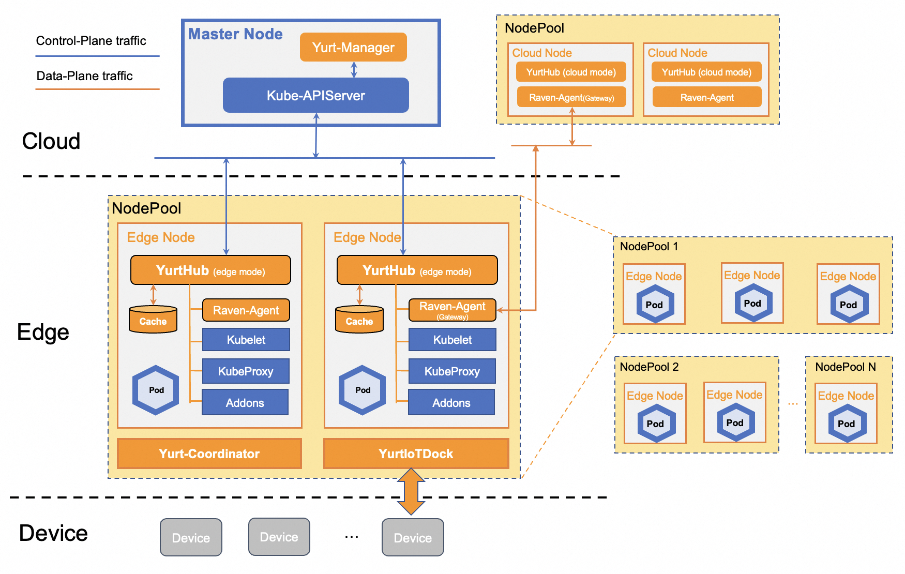

# OpenYurt Self-assessment

This assessment was created by community members as part of the [Security Pals](https://github.com/cncf/tag-security/issues/1102) process and is currently pending changes from the maintainer team.

Authors: Zeyu Zhao (@vie-serendipity), Lu Chen(@luc99hen)

Contributors/Reviewers: Linbo He (@rambohe-ch), Bingchang Tang (@zyjhtangtang)

The Self-assessment is the initial document for projects to begin thinking about the security of the project, determining gaps in their security, and preparing any security documentation for their users.

## Table of contents

- [Metadata](#metadata)
  - [Security Links](#security-links)
- [Overview](#overview)
- [Background](#background)
- [Actors](#actors)
- [Actions](#actions)
- [Goals](#goals)
- [Non-goals](#non-goals)
- [Self-assessment use](#self-assessment-use)
- [Security functions and features](#security-functions-and-features)
- [Project compliance](#project-compliance)
- [Secure development practices](#secure-development-practices)
- [Security issue resolution](#security-issue-resolution)
- [Appendix](#appendix)

## Metadata

|                   |                                        |
| ----------------- | -------------------------------------- |
| Assessment Stage  | Incomplete                             |
| Software          | <https://github.com/openyurtio/openyurt> |
| Security Provider | No.                                    |
| Languages         | Go, Shell, Dockerfile                  |
| SBOM              | OpenYurt does not currently generate SBOMs on release |
| | |

### Security Links

| DOC           | URL                                                            |
| ------------- | -------------------------------------------------------------- |
| Security file | <https://github.com/openyurtio/openyurt/blob/master/SECURITY.md> |

## Overview

OpenYurt is an open-source initiative built upon Kubernetes, dedicated to fostering seamless collaboration between cloud and edge computing paradigms.
It tackles distinctive hurdles in cloud-edge orchestration within the Kubernetes ecosystem, encompassing unreliable
or intermittent cloud-edge networking connectivity, edge autonomy, edge device management, region-aware deployment,
and various related intricacies.

## Background

In the contemporary landscape, a significant portion of computational power is decentralized, dispersed across various
edge computing platforms and IoT devices in diverse forms. These distributed, heterogeneous resources often incur
substantial human capital expenditure.

Kubernetes is an open-source system for automating the deployment, scaling, and management of containerized applications, which obscures
underlying heterogeneous computing resources and dramatically mitigates management complexity.
Nevertheless, due to the distinctive challenges inherent in cloud-edge scenarios, such as unstable
cloud-edge connectivity, disparities in multi-region application deployment, and inaccessible cloud-edge
operational management, direct utilization of Kubernetes in edge environments may result in unstable
edge-side applications and difficulties in troubleshooting.

By making non-intrusive enhancements, OpenYurt empowers customers to manage large-scale edge
computing workloads in different architectures (e.g., ARM and X86) in a native Kubernetes manner.

## Actors

### YurtManager

The yurt-manager consists of various controller and webhook processes to provide desired functionality in a cloud-edge collaboration scenario. The yurt-manager is deployed in kubernetes control plane, usually consists of two instances, one leader and one backup.

### YurtHub

YurtHub runs as a systemd service on the node, mainly responsible for proxying requests from pods and kubelet on the node, enabling node autonomy, multiplexing traffic on the node, and managing network topology.

### Raven

Raven enhances network capabilities. It provides L3 and L7 network connectivity among pods in different physical regions.
The Raven server, functioning as a controller within the YurtManager, is deployed in the cloud, while Raven agents are distributed as DaemonSets across edge nodes.

### YurtAdm

YurtAdm is CLI mainly to provide the ability of joining edge nodes to an OpenYurt cluster.

### YurtIotDock

Yurt-iot-dock enables seamless integration of EdgeX Foundry into cloud-native architecture for non-intrusive fusion in edge IoT solutions.

## Actions

### Edge Autonomy

1. Users utilize YurtAdm to join a node to an existing cluster, initiating a CSR request using a bootstrap token.
2. YurtManager validates and subsequently approves the CSR.
3. The YurtHub acquires the certificate from the CSR, successfully joining the cluster.
4. YurtHub functions as a proxy for system components on the node, facilitating communication with the apiserver while caching responses locally.
5. Upon cloud-edge network disconnection, YurtHub utilizes its local cache to serve as a server, responding to requests from kubelet and other system components.

### Cloud-Edge Operations

1. When users use kubectl exec or logs commands, requests are relayed from the apiserver to the Raven service.
2. The Raven server establishes a secure tunnel with the Raven agent residing on the elected gateway node at the edge. This tunnel employs a dual-layer encryption approach: the L7 utilizes gRPC with mutual TLS, while L3 is safeguarded through IPsec protocols.
3. The Raven agent on the node invokes kubelet to retrieve and return the requested information.

### IoT device management

1. When users manage edge devices using [Yurt-IoT-Dock](https://openyurt.io/docs/core-concepts/yurt-iot-dock/), they create or update a custom resource called [Device](https://github.com/openyurtio/openyurt/blob/master/pkg/apis/iot/v1alpha1/device_types.go#L144) in the OpenYurt cluster.
2. After Yurt-IoT-Dock lists/watches changes to the Device, it generates corresponding [EdgeX](https://www.edgexfoundry.org/) commands to control the device’s status.
3. Yurt-IoT-Dock retrieves the device status in real-time from EdgeX and synchronizes this status with the corresponding Device status.
4. Users can obtain the actual device status by querying the Device in the OpenYurt cluster.

## Goals

### General

- Edge Autonomy: Ensures stable application operation on edge nodes during unreliable cloud-edge network conditions.
- Cloud-Edge Operations: Provides operational channels for managing edge nodes efficiently.
- IoT Device Management: Integrates EdgeX to facilitate comprehensive management of IoT devices.
- Region-aware application deployment: customized deployment of multi-region applications.
- Traffic multiplexing: reuse traffic at both node and node-pool levels facilitates the integration of large-scale edge nodes.

### Security

- OpenYurt components should be protected and robust against tampering
- Authenticating and authorizing access OpenYurt to control plane components
- Protect the OpenYurt control plane from being compromised

## Non-goals

## Self-assessment use

This self-assessment is created by the OpenYurt team to perform an internal analysis of the project’s security. It is not intended to provide a security audit of OpenYurt, or function as an independent assessment or attestation of OpenYurt’s security health.

This document serves to provide OpenYurt users with an initial understanding of OpenYurt’s security, where to find existing security documentation, OpenYurt plans for security, and general overview of OpenYurt security practices, both for development of OpenYurt as well as security of OpenYurt.

This document provides the CNCF TAG-Security with an initial understanding of OpenYurt to assist in a joint-assessment, necessary for projects under incubation. Taken together, this document and the joint-assessment serve as a cornerstone for if and when OpenYurt seeks graduation and is preparing for a security audit.

## Security functions and features

### Critical

- In cloud-edge orchestration scenarios, edge node is vulnerable to security attacks. OpenYurt's design allows each node to use separate certificates and limited permissions, reducing the attack area.
- YurtManager [enforces the separation of RBAC](https://github.com/openyurtio/openyurt/blob/5cc4f7b0819bf5be2a4d235542d5b37fffd1b20c/docs/proposals/20240517-separate-yurtmanager-clients.md) for different controllers and webhooks. Following the principle of least authority, one controller or webhook in YurtManager will not be granted permissions it will not use.
- Raven uses TLS and VPN protocols to secure network connections across domains. All cloud-edge and edge-edge container network communications are encrypted through two-way TLS certificates and VPN.
- Security scanning of code and image artifacts is integrated into the CI process to ensure that they are free of known vulnerabilities.

### Security Relevant

- YurtAdm supports passing [bootstrap file](https://github.com/openyurtio/openyurt/issues/1290) instead of join token for node bootstrapping. In this way, join token will not be exposed to the user environment.

## Project compliance

OpenYurt does not document meeting particular compliance standards.

## Secure development practices

- The OpenYurt project has [clear contributing guidelines](https://github.com/openyurtio/openyurt/blob/master/CONTRIBUTING.md)
- Anyone is encouraged to submit an issue, code, or documentation change
- [Proposals](https://github.com/openyurtio/openyurt/tree/master/docs/proposals)
 should be submitted before making a significant change
- Decisions are made based on consensus between OpenYurt [community](https://github.com/openyurtio/community). Proposals and
 ideas can either be submitted for agreement via a Github issue or PR.

### Development Pipeline

The [Contributing document](https://github.com/openyurtio/openyurt/blob/master/CONTRIBUTING.md) contains details about development pipeline. The main points are summarized below.

- Contributions are made via GitHub pull requests
- Pull request will trigger a Github workflow including tests below
  - Type check and lint ci.
  - Trivy scan is adopted to scan vulnerabilities for every image.
  - Unit tests and e2e tests.
  - Automatic code coverage using [codecov.io](https://app.codecov.io/) is
 generated in the PR for each submitted
- Code Review
  - Changes must be reviewed and merged by the project [maintainers](https://github.com/openyurtio/community/blob/main/community-membership.md).
- Release
  - The release process of a new version of OpenYurt(involving changelog, documents, helm charts) is detailed in the [release process document](https://github.com/openyurtio/openyurt/blob/master/RELEASE-PROCESS.md).

### Communication Channels

#### Internal

- Team members use Github, [Ding Talk](https://github.com/openyurtio/openyurt/#Contact), and [OpenYurt Community Slack](https://join.slack.com/t/openyurt/shared_invite/zt-2ajsy47br-jl~zjumRsCAE~BlPRRsIvg) to communicate and discuss PRs.
- [Community meetings](https://github.com/openyurtio/openyurt?tab=readme-ov-file#meeting) are held biweekly on Wednesdays for team members to discuss releases, feature proposals, and user issues.
The minutes and recording for each meeting are openly available.

#### Inbound

- Users contact with the OpenYurt team through the [OpenYurt Community Slack](https://join.slack.com/t/openyurt/shared_invite/zt-2ajsy47br-jl~zjumRsCAE~BlPRRsIvg) and [Ding Talk](https://github.com/openyurtio/openyurt/#Contact).

- Users can post bug reports, feature requests, and support requests on [Github issues](https://github.com/openyurtio/openyurt/issues).

#### Outbound

- The team now uses [OpenYurt Community Slack](https://join.slack.com/t/openyurt/shared_invite/zt-2ajsy47br-jl~zjumRsCAE~BlPRRsIvg) and [Ding Talk](https://github.com/openyurtio/openyurt/#Contact) to send community meeting reminders, meeting agendas, and project announcements to the community.

- Team members communicate with users through the [emailing list](https://groups.google.com/g/openyurt/).

## Security issue resolution

OpenYurt has a responsible disclosure process for reporting security vulnerabilities. This process is designed to ensure that vulnerabilities are handled in a timely and effective manner. The process can be found here: <https://github.com/openyurtio/openyurt/security/policy>

- Security researchers can report vulnerabilities confidentially by emailing [security@mail.openyurt.io](mailto:security@mail.openyurt.io).
- Security-related issues can be reported through GitHub issues at <https://github.com/openyurtio/openyurt/issues>
- The maintainers will triage the vulnerability and determine the appropriate
remediation.
- Reporters can expect a response from OpenYurt project maintainers within 2 business days acknowledging receipt. It is the maintainers' responsibility to triage the severity of issues and determine remediation plans.
- Remediation: OpenYurt commits to supporting the n-2 version minor version of the current major release; as well as the last minor version of the previous major release.
- Disclosures: OpenYurt encourages the community to assist in identifying security breaches; in the event of a confirmed breach, reporters will receive full credit and have the option to stay informed and kept in the loop.

### Communication

[GitHub Security
Advisory](https://github.com/openyurtio/openyurt/security/advisories) will be
used to communicate during the identification, fixing, and shipping of
vulnerability mitigations.

The advisory becomes public only when the patched version is released to inform
the community about the breach and its potential security impact.

## Appendix

- **Known Issues Over Time**

 OpenYurt doesn't have any security vulnerabilities pointed out as of the
 tools and frameworks that it uses (for eg. Golang vulnerabilities).

- **[CII Best Practices](https://www.bestpractices.dev/projects)**
The OpenYurt project has got the passing badge in OpenSSF best practices in [PR #2208](https://github.com/openyurtio/openyurt/pull/2208).
- **Case Studies**
 Many organizations have adopted OpenYurt and are using our project
  - Alibaba Cloud: Using OpenYurt as base framework and integrated with other cloud services (like SLB etc.) to provide hosted edge kubernetes service.
  - Sangfor Technologies Inc: A company that focuses on providing security services, and uses OpenYurt for edge autonomy and operation and maintenance communication.
  - China Telecom: Using OpenYurt for managing edge nodes across different IDC region and network
  - Sony Group Corporation: Working on internal PoC for cloud and edge container orchestration.
  - Lixiang Auto Inc: A company that designs and produces new energy vehicles, and uses OpenYurt for managing edge nodes, and deploying edge applications.
  - Shanghai Cue Co., Ltd: Use OpenYurt to manage their retail edge AIBoxes.

- **Related Projects / Vendors**

| TECHNOLOGY               | INTEGRATION                                                                                                                                                             | DESCRIPTION                                                                                                                                                                        |
| ------------------------ | ----------------------------------------------------------------------------------------------------------------------------------------------------------------------- | ---------------------------------------------------------------------------------------------------------------------------------------------------------------------------------- |
| EdgeX Foundry                | [IoT Provider](https://openyurt.io/docs/user-manuals/iot/edgex-foundry/#1-add-device-virtual-components-manually) | Deploy the EdgeX system and YurtIoTDock component on an existing OpenYurt cluster using PlatformAdmin.                                                               |
| Calico                  | [Network Provider](https://github.com/openyurtio/openyurt/issues/857) | Use Calico to configure a layer 3 network fabric designed for Kubernetes.                                |
| eKuiper                | [Observability](https://ekuiper.org/docs/en/v1.13/) | Use eKuiper to provide a streaming software framework (similar to Apache Flink) on the edge side.                                                                                                                             |
| FabEdge                  | [Network Provider](https://juejin.cn/post/7028551925561819149) | Use FabEdge to provide a solution for edge-edge-cloud container network to communicate with host network In an OpenYurt cluster.|
| Flannel                  | [Network Provider](https://openyurt.io/docs/user-manuals/network/edge-pod-network) | Use Flannel to configure a layer 3 network fabric designed for Kubernetes.                                |
| Grafana                  | [Observability](https://openyurt.io/docs/user-manuals/monitoring/prometheus) | Use Grafana dashboards to visualize metrics from edge node.                                                                                                 |
| Helm                     | [Deploying OpenYurt on Kubernetes](https://openyurt.io/docs/installation/manually-setup) | Use Helm charts to deploy OpenYurt Control Plane.                              |
| Kubernetes               | [Deploying OpenYurt on Kubernetes](https://openyurt.io/docs/installation/manually-setup) | Run OpenYurt component workloads on Kubernetes and extend Kubernetes across regions, clouds, and edges.                                                                         |
| KubeVela                     | [Observability](https://kubevela.io/blog/2023/01/09/kubevela-openyurt-integration/) | Consume OpenTelemetry logging signals from the wasmCloud host.                                                                     |
| Prometheus               | [Observability](https://openyurt.io/docs/user-manuals/monitoring/prometheus) | Consume OpenTelemetry metrics signals from the wasmCloud host.                                         |
| Raven                    | [Network Provider](https://openyurt.io/docs/user-manuals/network/raven) | Use raven to enhance edge-edge and edge-cloud network communication in an edge cluster.                                                                       |
| Shifu                   | [IoT Provider](https://shifu.dev/technical-blogs/2022/06/17/openyurt/) | Be compatible with various IoT device protocols and abstract them into a microservice software object.                                                                       |
| WasmEdge                   | [WebAssembly Runtimes](https://www.cncf.io/blog/2022/02/07/wasmedge-and-openyurt-bring-cloud-computing-to-the-edge/) | Use OpenYurt to Manage WasmEdge. |
