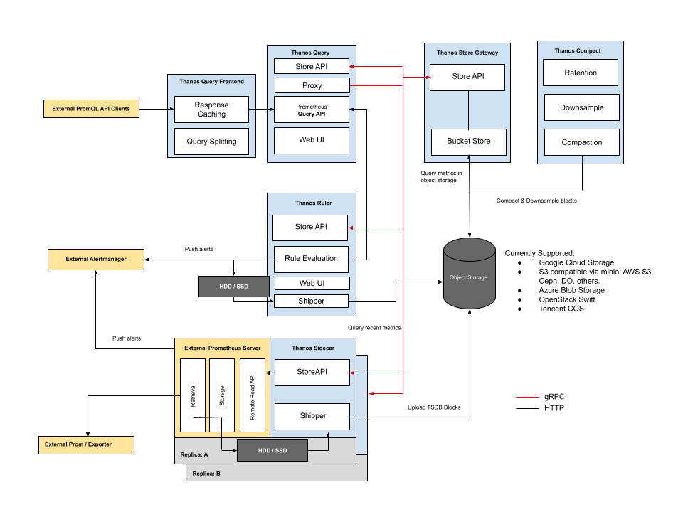
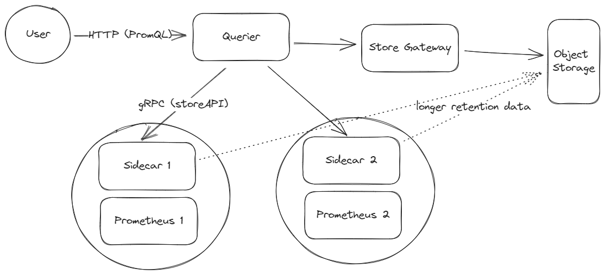
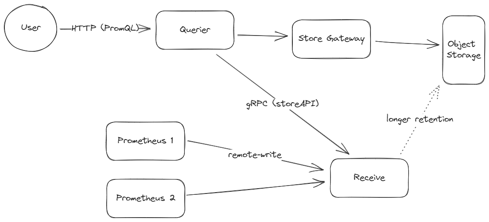

# Thanos Security Self-assessment

This assessment was created by community members as part of the [Security Pals](https://github.com/cncf/tag-security/issues/1102) process and is currently pending changes from the maintainer team.

## Table of contents

* [Metadata](#metadata)
  * [Security links](#security-links)
* [Overview](#overview)
  * [Actors](#actors)
  * [Actions](#actions)
  * [Background](#background)
  * [Goals](#goals)
  * [Non-goals](#non-goals)
* [Self-assessment use](#self-assessment-use)
* [Security functions and features](#security-functions-and-features)
* [Project compliance](#project-compliance)
* [Secure development practices](#secure-development-practices)
* [Security issue resolution](#security-issue-resolution)
* [Appendix](#appendix)
  * [Threat Modeling](#threat-modeling)
* [References](#references)

## Metadata

Quick reference information:

|   |  |
| -- | -- |
| Assessment Stage | Incomplete |
| Software | <https://github.com/thanos-io/thanos>  |
| Security Provider | No. |
| Languages | Golang |
| SBOM | Thanos does not currently generate an SBOM on release |
| | |

### Security links

The list of links to existing security relevant documentation for the project:
| Doc | url |
| -- | -- |
| Security file | <https://github.com/thanos-io/thanos/blob/main/SECURITY.md> |
| Multitenancy | <https://thanos.io/tip/operating/multi-tenancy.md/> |
| TLS for cross cluster communication | <https://thanos.io/tip/operating/cross-cluster-tls-communication.md/> |
| HTTPS and Basic authentication | <https://thanos.io/tip/operating/https.md/> |
| Audit logging (queries) (WIP) | <https://thanos.io/tip/proposals-done/202005-query-logging.md/> |
| mTLS for gRPC storeAPIs (roadmap) | <https://thanos.io/tip/proposals-accepted/202106-automated-per-endpoint-mtls.md/> |

## Overview

### Thanos
Highly available Prometheus setup with long term storage capabilities.

### Background

Thanos as a tool extends the capabilities of the Prometheus monitoring tool. Refer [[1]](#references)
It does so by providing:

* Global View: Thanos allows you to have a global view of your Prometheus metrics.
  It enables you to query metrics from multiple Prometheus instances across different clusters/systems.
* Long-Term Storage: Thanos provides a solution for long-term storage of Prometheus metrics.
  It can store historical data in object storage systems like Amazon S3, Google Cloud Storage,
  or any other compatible storage backend.
* High Availability: By distributing Prometheus data across multiple instances and using
  object storage for long-term storage, Thanos helps in achieving high availability and
  fault tolerance.
* Query Federation: Thanos supports query federation, which means you can run queries across
  multiple Prometheus instances and retrieve the aggregated results.
* Component Architecture: Thanos is composed of several components, including Sidecar, Querier,
  and Store components, each serving a specific purpose in the overall architecture.

By using Thanos in conjunction with Prometheus, organizations can address the challenges of scaling Prometheus for larger deployments and retaining metrics data over longer periods. It's designed to provide a scalable and globally distributed solution for Prometheus monitoring.

### Actors

> These are the individual parts of our system that interact to provide the desired functionality. Refer [[2]](#references) for description of various components.

* Queriers: Stateless and horizontally scalable instances responsible for executing PromQL queries.
* Store Gateway: Act as gateways to block data stored in object storage.
* Rule/Ruler: Evaluate recording and alerting rules against data in Thanos.
* Metric Sources: Components that produce or collect metric data, such as Prometheus, Sidecar and Ruler.
* Users: Individuals or organizations utilizing Thanos for their metrics storage and querying needs. These can be individuals running direct queries on Thanos or other PromQL compatible tools for visualization of the metrics provided by Thanos.
* Sidecar: Deployed along with Prometheus to fetch its metrics.
* Receive: Deployed as a separate component which can receive metrics from Prometheus.
* Compactor: The Thanos compact command applies the compaction procedure of the Prometheus 2.0 storage engine to block data stored in object storage and is also responsible for downsampling of data.
* Object Storage: Cheaper storage location for longer retention of metrics.

Two types of deployment strategies are generally used:
1. Deployment with Thanos Sidecar for Kubernetes
   

3. Deployment via Receive in order to scale out or integrate with other remote write-compatible sources:
   
   

### Actions

> These are the steps that a project performs in order to provide some service. Refer [[2]](#references), [[3]](#references) and [[4]](#references) for documentation and understanding.

**Metric Sources**  
Primarily Prometheus is used as the metrics source with Thanos.
The targets whose metrics have to be collected are configured in the Prometheus config file.
Prometheus scrapes these endpoints at regular intervals and stores metrics locally in persistent storage.

**User**  
Individual/Tool (like Grafana) sends a request to Thanos Querier for viewing the metrics.

**Sidecar**  
It is deployed along with the Prometheus container in the same pod.  
It queries Prometheus to fetch metrics using remote-read APIs of Prometheus.  
It also requires access to the admin API of Prometheus to fetch the external labels.  
If shipper feature of Sidecar is used (for longer retention of Prometheus data in relatively cheaper object storage):  
* Sidecar has access to the Prometheus TSDB (Time series Database).
* It ships the blocks to the object storage (it has access to the credentials for the object storage).
Optionally it can also watch for changes to the Prometheus configuration file and call the Prometheus reload API to reload its configuration in case of any changes.

**Receive**  
The Receive component exposes Prometheus compatible remote-write API that can be used by Prometheus to send its data.  
The Receive component is used in egress only environments (where Prometheus APIs can't be accessed using Sidecar).  
Similar to Sidecar it also has a shipper component which ships data to the object storage.

**Store Gateway**  
It exposes StoreAPI which can be used by the Querier to fetch the historical metrics from the object storage.

**Querier**  
It takes queries from the user and translates it to StoreAPI requests for Sidecar+Prometheus, Receive or the Store Gateway.  
It exposes the same API as Prometheus which takes queries in the PromQL (Prometheus Query Language). This makes it possible for the User to be a human running an individual query or a tool like Grafana that can use PromQL queries for different visualizations.  
There is no authentication or authorization done by the Querier.

There are two types of deployment models as listed in Actors section:

**Pull mode**  
In pull mode (Sidecar pulls metrics from prometheus) the workflow is as follows:  

**Push mode**  
In push mode (Prometheus pushes metrics to Receive) the workflow is as follows:  

The above two deployment models can be used together to combine different environments where both these strategies are required.

There are other independent workflows that are running:  
Compactor -> Object Storage  
The Compactor downsamples and aggregates data stored in object storage for faster retrieval of historical data.  
Compactor is the only component which should have delete rights to the object storage.

In addition, Thanos' Ruler could be deployed; this would add another source for the Querier to fetch from using the StoreAPI exposed by Ruler.

#### Simplified Step-by-step description of how Thanos works:
* The user wants metrics.
* The user initiates a query to gather the metric data.
* Metric data is pulled from the Thanos' Store and Thanos Sidecar. The Querier performs mandatory operations such as filtering, aggregation and compaction.
    * The Thanos query uses the gRPC protocol to talk to Thanos Store and the Sidecar.
* The metrics are delivered to the user.

> Similar actions are done in push mode; except, Querier pulls from Receive instead of Sidecar.

#### Basic Deployment:
* Set up a Prometheus server instance.
* Have the Sidecar run alongside the Prometheus instance.
* Give the Querier the ability to communicate with Sidecar.
* Deploy Thanos' Store to fetch metrics stored in long term storage.
* Set up the Compactor for compaction and downsampling.
* Configure node exporter container to expose node metrics.
* Use Grafana for visualization.

### Goals

> These are the intended goals of the project, including the security guarantees the project is meant to provide. Refer [[1]](#references)

General:
* Global Query View: Scaling Prometheus setups to allow querying across multiple servers and clusters.
* Unlimited Retention: Storing metrics for an unlimited time in the chosen object storage.
* Downsampling & Compaction: Downsampling historical data for faster query execution and configuring complex retention policies
* Prometheus compatible: Allowing you to use the same tools that support the Prometheus Query API.

Security:

These features and practices demonstrate Thanos's commitment to security within its scope of enhancing Prometheus's monitoring capabilities. However, it is important to note that the Thanos team does not consider themselves security experts and focuses on avoiding security concerns rather than implementing advanced security features. Refer [[5]](#references) and [[6]](#references).

* Data integrity: All our system components are strongly consistent unless explicitly configured not to be (e.g. Receiver replication turned off by user).
* Best Programming Practices: The Thanos team emphasizes the use of best programming practices. This includes heavy testing, end-to-end tests against major object storages, using vetting and static analysis tools for every pull request, and employing secure protocols in their building processes, such as when producing Docker images.
* Data Handling and Privacy: Thanos does not log or use instrumentation to record data stored in the TSDB (Time Series Database). This approach is crucial for ensuring the privacy and security of stored metrics data.
* Use of Cryptography Tools: Whenever cryptographic tools are utilized, Thanos relies on free, libre, open-source software (FLOSS) and standard libraries, such as the official Go cryptography library. This ensures the use of well-vetted and secure cryptographic methods.
* Transport Layer Security (TLS): TLS is used by default for communication with all object storages, providing an additional layer of security for data in transit.
* Secured delivery against man-in-the-middle (MITM) attacks
* Software Updates and Reliability: The team uses stable versions of Go for building their images and binaries and updates to new versions as soon as they are released. This practice helps in maintaining the security and reliability of the software.

Limitations:
* Currently, Thanos does not support encrypting metrics in local storage or client-side encryption for object storage. However, metric data is often considered non-sensitive (they do not contain PII information as that would have the cardinality implication). If encryption is mandatory, Thanos project recommends using server-side encryption for object storage.

### Non-goals

> Non-goals that a reasonable reader of the project’s literature could believe may be in scope but are not.

* Metric encryption security:
   Client-side encryption for local storage: Thanos does not support encrypting metrics in local storage or client-side   encryption for object storage.
* Operational DOS:
    Thanos does not restrict a user from storing extremely large amounts of data, even when it's costly for Thanos or     challenges server capacity.

## Self-assessment use

This self-assessment was created to perform an internal analysis of the
project's security.  It is not intended to provide a security audit of Thanos, or
function as an independent assessment or attestation of Thanos's security health.

This document serves to provide Thanos users with an initial understanding of
Thanos's security, where to find existing security documentation, Thanos plans for
security, and general overview of Thanos security practices, both for development of
Thanos as well as security of Thanos.

This document provides the CNCF TAG-Security with an initial understanding of Thanos
to assist in a joint-assessment, necessary for projects under incubation.  Taken
together, this document and the joint-assessment serve as a cornerstone for if and when
Thanos seeks graduation and is preparing for a security audit.

## Security functions and features

**Critical:**

* Components communicate securely with TLS. This prevents unauthorized modification of data in transit.
* High availability and fault tolerance is achieved by distributing Prometheus data across multiple instances and using object storage for long-term storage. Because of redundancy in multiple components, if one part of the system fails, the user can still perform certain actions.
* Thanos uses Prometheus built in authentication and authorization mechanisms. Users can leverage Prometheus to implement customizable authentication and authorization methods to meet their security needs.
* Thanos uses the Prometheus Role Based Action control system. This means that access to certain functionalities can be prevented based on a user's role and permission.

**Security Relevant:**

* Logging and monitoring of Thanos components to detect security breaches:
   * Make a log of what components were used, when, how by what user etc.
   * The log should keep track of authentication and authorization events within components.
      * Example: An unauthorized user tries to access Thanos Query APIs. A log entry is made for this request. The log entry might contain information such as the time the request was made, the user's IP address,  information about the requested API endpoint, the authentication status (failed/successful) etc. By regularly analyzing these logs, signs of a security breach could be detected. For example, multiple unsuccessful authentication attempts, unusual patterns in the timing or frequency of access attempts, weird or unauthorized API endpoint requests may indicate that a breach has occurred. Security personnel would then investigate.    
* Properly configuring components to ensure a secure deployment.
   * For example, your Thanos deployment might use role-based access control policies to restrict what operations users with varying roles or permissions can perform.For instance, an administrator might have complete control of the query api, an operator might have the minimum necessary access to complete their duties, a viewer might only have read access.
* Securing data by setting up robust access control and encryption mechanisms on the storage backend.

## Project compliance

*  Thanos does not currently document meeting particular compliance standards.

## Secure development practices
Thanos has achieved the passing level criteria in Open Source Security Foundation (OpenSSF) best practices.

* Signing Work - DCO Process: Contributors agree to the Developer Certificate of Origin (DCO) and must sign off their commits with their name and email. This ensures the legal right to make contributions.
* Testing and Formatting: Various make commands are used to ensure the code and documentation adhere to standards. This includes make docs, make changed-docs, make check-docs, and make format for code formatting.
Testing Procedures: Thanos includes several testing commands such as make test for Go unit tests, make test-local excluding tests for object storage integrations, and make test-e2e for end-to-end docker-based tests.

#### Development Pipeline:

Refer [CONTRIBUTING.md](https://github.com/thanos-io/thanos/blob/main/CONTRIBUTING.md) for more details on the highlights below.

**Highlights:**
* All source code is managed in Github
* The Thanos project [uses Go modules to manage dependencies on external packages](https://github.com/thanos-io/thanos/blob/main/CONTRIBUTING.md#dependency-management)
* [SCA](https://github.com/thanos-io/thanos/blob/main/.github/dependabot.yml) and [SAST](https://github.com/thanos-io/thanos/blob/main/.github/workflows/codeql-analysis.yml) tools are used on the `main` branch.

* For each pull request developers are required to follow [rules](https://github.com/thanos-io/thanos/blob/main/CONTRIBUTING.md#pull-request-process) as laid out 
  * Commits directly to the main branch are not allowed.
  * Commit Signing: Contributors sign their commits as part of the DCO process.
  * All the warnings from `go vet` and `golangci-lint` are checked. Refer [[14]](#references)
  * Custom linters have also been defined along with rules that developers are supposed to follow at [coding-style-guide.md](https://github.com/thanos-io/thanos/blob/main/docs/contributing/coding-style-guide.md)
  * The code has to be tested using unit tests, local tests excluding certain integrations, and end-to-end tests.
  * Any large new feature/component to Thanos is done by creating a [proposal](https://github.com/thanos-io/thanos/blob/main/docs/contributing/proposal-process.md) document outlining the design decisions of the change, motivations for the change, and any alternatives that might have been considered.
  * Every pull request kicks off a build which performs [unit tests](https://github.com/thanos-io/thanos/blob/main/.circleci/config.yml) , e2e tests and [linting](https://github.com/thanos-io/thanos/blob/main/.golangci.yml).
  * Each pull request requires an approval from a developer with write access before merging.
  * The reviewer makes sure all checks and tests are passing.
  * The reviewer pays close attention to any new exported methods or interface definitions.
  * Based on the changes made, reviewer sees that the docs are updated accordingly.

* [Thanos Release process](https://github.com/thanos-io/thanos/blob/main/docs/release-process.md):
  * Thanos releases are numbered with the changelog and binaries/images published to [CHANGELOG.md](https://github.com/thanos-io/thanos/blob/main/CHANGELOG.md).
  * Release process is done every 6 weeks with changes first being pushed to a separate release branch after performing all release checks. 
  * Thanos benchmarks its code every release. [Go benchmarks are used for dynamic analysis](https://www.bestpractices.dev/en/projects/3048#security)
  * [Checksum files](https://github.com/thanos-io/thanos/releases) for release artifacts are provided.

#### Communication Channels:

* Internal Communication: Team members use tools like GitHub and Slack for internal communication, with dedicated channels for development discussions.
* Inbound Communication: Users or prospective users can interact with the team via the #thanos and #thanos-dev channels on Slack.
* Outbound Communication: Updates and announcements are shared on social media platforms like Twitter (@ThanosMetrics). The Thanos Community Office Hours serve as a forum for updates and discussions.
* Ecosystem Integration: Thanos, as an extension of Prometheus, fits into the cloud-native ecosystem by enhancing monitoring and long-term data storage. Its integration with Prometheus makes it a key component in the observability stack for cloud users, indirectly impacting a wide range of users relying on cloud services.

Refer [[7]](#references)

## Security issue resolution

Responsible Disclosures Process:

* Security Policy Awareness: Thanos team acknowledges the importance of security and strives to avoid security concerns and improper data handling.
*  Vulnerability Reporting: Suspected security issues or vulnerabilities should be reported privately via the Thanos Team email address: thanos-io@googlegroups.com.
Data Sensitivity: While metric data often does not contain personally identifying information, it still contains valuable and private information that should be handled carefully. External labels and query API parameters may be approached with a lower level of caution.

Vulnerability Response Process
* Responsibility: The Thanos team is responsible for responding to security vulnerability reports.
* Reporting Process: Vulnerabilities are reported via email to the Thanos team: thanos-io@googlegroups.com. The team likely follows internal procedures for validating and addressing these reports, although specific details of this process are not publicly documented.
* Response Actions: The team investigates and works to resolve the reported vulnerabilities.

Incident Response
* Triage and Confirmation: The team performs an initial assessment to confirm the validity of the reported vulnerability or security incident. [github issues]
* Notification: All updates are shared on these social media channels: thanos.io / @ThanosMetrics / github repo
* Patching/Update Availability: The team develops and releases patches or updates to address security issues. Information about supported versions indicates a commitment to maintaining security in newer versions of the software.  

## Appendix

### Known Issues Over Time.
No vulnerabilities have been disclosed in the Thanos project, but the project may still be impacted by vulnerabilities in Thanos' tools and underlying framework (for instance vulnerabilities in Golang). It is important to note that all of Thanos' security-related issues, including both fixes and enhancements, are not treated separately from other issues on the GitHub platform.

### OpenSSF Best Practices

The Thanos project has achieved the passing level criteria and has also attained a silver badge in Open Source Security Foundation (OpenSSF) best practices badge.
 [Thanos OpenSSF best practices](https://www.bestpractices.dev/en/projects/3048).

### Case Studies.
Many organizations have adopted Thanos and are using our project in production [[adopters-list](https://github.com/thanos-io/thanos/blob/main/website/data/adopters.yml)]. Here are a few case studies:

#### Aiven
Aiven is a cloud-native data infrastructure platform that provides fully managed open source database, streaming, and analytics services on 11 clouds and over 150 regions. Aiven offers open source products including PostgreSQL, MySQL, ClickHouse, Cassandra, M3, InfluxDB, along with streaming platforms such as Kafka and Flink. Aiven has a major investment in upstream contributions not altering the true open source solutions which are offered making Aiven the open source data platform for everyone. Aiven also provides ease of use, reliability, scalability, security, and cost-effectiveness for their users.

Initially, Aiven used InfluxDB but it was unable to handle their scale of fleet and variability of cloud infrastructure.  M3 fit the bill, architecturally, at the time.  Fast forward to 2022, with the changes at Uber and Chronosphere , contributions were no longer being made to M3DB.  M3DB was missing a lot of new functionality which were introduced to Prometheus over time. As a result, Aiven had to look for a replacement project.

After conducting their research, they saw that their main options were Cortex and Thanos. Cortex has similar problems to M3DB. Thanos was the better fit. It had a vibrant ecosystem, aligned with software foundations, and was Apache 2.0 licensed. Aiven tested Thanos by using proof of concept. After conducting the test, Aiven found that Thanos was feasible and its cost savings were pretty significant. Additionally, Thanos performed better than M3DB and Thanos' queries were faster.

Aiven is excited to offer a managed Thanos as a service as a product . They plan to continue contributing to Thanos, and hope to have dedicated members of  their Open Source Program Office (OSPO) in the future working in the Thanos community.

To read more, see source [2023-06-08-thanos-at-aiven.md](https://github.com/thanos-io/thanos/blob/main/docs/blog/2023-06-08-thanos-at-aiven.md)

#### Medallia
Medallia successfully operates a hybrid architecture involving both federated queries and remote-write using Prometheus and Thanos components. This allows their users to experience high-performance queries of software and infrastructure metrics generated across 10 large colocation data centers and 30+ small virtual data centers via a single pane of glass.

In their observability journey, Medallia faced several issues such as a costly cloud based vendor solution to a self hosted open source solution with a limited scale. Medallia adopted Prometheus and Thanos to address these scalability issues.

Thanos addressed several problems by:
* Horizontally scaling their Prometheus.
* Retaining one year of metrics samples without vertically scaling their Prometheuses.
* Simplifying management by deploying identical architecture in each data center.
* Providing a global view of all metrics.
* Quick implementation of Thanos' components.

In early 2020, the SRE task force handed off their proof of concept to the newly-formed Performance and Observability (POE) team for hardening, widespread launch, and ongoing support. As Medallia expanded into public cloud providers, they faced difficulty with incorporating metrics from smaller virtual data centers.
Despite these challenges, the hybrid solution was able to meet their needs. It allowed them to maintain flexibility and stability while adapting to the changing infrastructure landscape.

For the past 3 years, the ability of Thanos components to play various roles within Medallia's architecture to support their ever-increasing scale of Prometheus-based metrics has been extremely valuable.

Medallia is now considering a shift to a 100% remote-write architecture with centralized storage to reduce overall complexity. However, they expect Thanos' components to remain a major part of their solution. They recommend Thanos to anyone facing a need to operate Prometheus metrics at any scale and the ability to maintain flexibility in their architecture to accommodate change.

To read more, see source [2022-09-08-thanos-at-medallia.md](https://github.com/thanos-io/thanos/blob/main/docs/blog/2022-09-08-thanos-at-medallia.md)

### Related Projects / Vendors.

#### Victoria Metrics

VictoriaMetrics is a fast, cost-effective and scalable monitoring solution and Time Series Database (TSDB). 

Key differences: 
VictoriaMetrics(VM) offers a single node and cluster version, which provides simplicity and ease of deployment, while Thanos has a modular system with  several distinct components. VM has its own custom storage and compression algorithms, while Thanos uses TSDB. VictoriaMetrics uses MetricsQL, while Thanos uses PromQL. Thanos relies on object storage and replication, while VictoriaMetrics has a cluster version and stores its data on local storage. Both systems offer downsampling and customizable retention policies. In terms of performance, both systems handle large workloads seamlessly; with Thanos being preferred by some for its modular and customizable features, and VictoriaMetrics being preferred by others for its speed, resource efficiency, and utilization of CPU and disk space.

Refer [[8]](#references) and [[9]](#references)

#### Cortex
Cortex is a ready-to-use, horizontally scalable, and highly available multi-tenant long-term storage solution that allows metrics from multiple Prometheus servers to be sent to a single machine.  Thanos offers more flexibility and allows users to design and configure each part of their Prometheus server to meet their specific needs. Cortex is rolled out as a single binary or as multiple independent microservices, while Thanos is rolled out independently or incrementally alongside the Prometheus server. Cortex uses block or local storage, while Thanos uses configurable object storage clients. They also have different features. Cortex uses a separate central cluster and storage backend for a global querying view, while Thanos uses Prometheus servers for this same reason. Cortex uses a push-based model in which only samples from a single replica are accepted, while Thanos reads from multiple replicas and merges metrics into a single result. Cortex uses remote write to push data to the central cluster, while Thanos integrates with Sidecar.  Both systems employ different optimization techniques. Cortex migrates individual Prometheus chunks to object storage, while Thanos reads and writes data as Prometheus TSDB blocks.

Refer [[10]](#references) and [[11]](#references)

#### Prometheus

Prometheus, a Cloud Native Computing Foundation project, is a systems and service monitoring system. It collects metrics from configured targets at given intervals, evaluates rule expressions, displays the results, and can trigger alerts when specific conditions are observed.

Key differences:
Prometheus is designed for short term monitoring, and not large scale or long term storage, while Thanos is designed for long term storage, scalability and querying capabilities. Prometheus operates in single server mode, while Thanos has a distributed architecture and redundancy in its components. Prometheus uses PromQL for retrieving and analyzing time series data, while Thanos extends PromQL to query data from multiple Prometheus instances.  Prometheus uses local disk storage for short term solutions while Thanos uses object storage solutions for long-term data retention.

Refer [[12]](#references) and [[13]](#references)

### Threat modeling

> STRIDE Model

Spoofing Identity
* Threat : An unknown source pretends to be a trusted source to gain access to Thanos components.
* Mitigations:
  * Authentication mechanisms for each component.
  * Frequently monitor authentication logs.
  * Access control policies to prevent unauthorized access to the system.
  (See Security Functions and Features for an example.)

Tampering with data
* Threat: Metrics can be tampered
* Mitigations:
   * TLS is used by default for communication with all object storages, providing an additional layer of security for data in transit.
  * Querier must check the integrity of the metrics received from object storage before delivering it back to the user.
  * If the integrity check fails then the metrics must be discarded and logged as a security event.
      * For example, when the Querier component receives metrics from storage , it can use a checksum or cryptographic method to generate a hash value. If the generated hash value does not match the expected hash value, or some other integrity verification values, the tampered metrics should be discarded.

Repudiation
* Threat: Repudiation of actions performed on the Thanos system
* Mitigations:
  * Implement centralized audit collection and alerting for any suspicious activity or security events. For example, a user deleting a metric should raise a security alert. This should be recorded in the audit log and flagged as suspicious.
  * Implement auditing for actions performed by Thanos users and admin. Also, implement audit logging of components. For example, every time a user performs an action (such as querying or modifying metrics, for instance), their actions should be added to the audit log. The audit log can contain information such as timestamps, their identity, what actions they performed etc. This can help keep users accountable and prevent repudiation of their actions.

Information Disclosure
* Threat: Unauthorized access to metric data.
* Mitigations:
   * Server-side encryption must be used for storing data, and TLS encryption for data transmission. For example, the metric data can be stored in an encrypted database.
   * Implementation of proper access control mechanisms to restrict access to metric data (see Security Functions and Features).
   * Access to Thanos can be configured/limited to minimize potential attack surface. For example, access to Thanos can be restricted to specific networks or IP addresses. Additionally, unused features should be disabled.

Denial of Service

A malicious attacker can flood the network infrastructure, exhaust resources or conduct a Distributed Denial of Service (DDoS) attack.
When we say conduct a DDoS attack, we do not mean innocent problems like misconfigurations, human errors, networking problems, capacity errors,and so forth (however, there should be little to no room for these kind of errors that an attacker can take advantage of). We also do not mean legitimate actions performed by Thanos, such as required maintenance, etc.

What we are referring to,instead, is bad actors who deliberately overwhelm the system with excessive requests.

* Threat: Disrupt the availability of Thanos services.
* Mitigations:
   * Use rate limiting and throttling mechanisms to prevent excessive consumption of resources. For example, consider using a token bucket algorithm to limit the number of requests a user can make per second.
   * Employ load balancing and redundancy mechanisms to distribute traffic effectively. If we have no load balancing, for example, an attacker may be able to access a component directly through the component's endpoint or IP address and send a high volume of requests to a specific component. Load balancers or technologies like Kubernetes Ingress may be used to distribute traffic more evenly among Thanos components. 
   * Monitor systems for a potential Denial of Service attack.
     * Track metrics such as system performance, resource consumption and network usage. Additionally, use an alerting system to notify administrators of unusual spikes.

Elevation of Privilege:
* Threat: An attacker can change their status to perform actions only meant for certain trusted users.
  * For example, if Thanos is not configured to have proper access control mechanisms, a user might be able to change authentication or authorization settings to elevate their access. By doing so, a user could possibly change their role or grant themselves extra privileges.
* Mitigation:
   * Prometheus operates with the minimum level of access rights necessary to function (principle of least privilege). Thanos can also be configured (via config flags) to minimize its access so that damage-potential is limited.
   * Prometheus is a monitoring tool, so it can be used to raise alerts upon suspicious activity that may coincide with attempts at privilege escalation within Thanos as well.
   * Thanos piggy-backs off of Prometheus's authentication and authorization mechanisms.
   * User permissions must be frequently reviewed.

## References

[1] <https://github.com/thanos-io/thanos> (Background; Goals)  
[2] <https://github.com/thanos-io/thanos/tree/main/docs/components> (Actors; Actions; Components)  
[3] <https://killercoda.com/thanos/> (Actions; Interactive Tutorials)  
[4] <https://thesaadahmed.medium.com/thanos-monitoring-with-prometheus-and-grafana-843ed231c8a6> (Actions; monitoring)  
[5] <https://github.com/thanos-io/thanos/blob/main/SECURITY.md> (Goals; SECURITY.md)  
[6] <https://www.bestpractices.dev/en/projects/3048#security> (Goals; best practices)  
[7] <https://github.com/cncf/tag-security/pull/1182#pullrequestreview-1773785821> (Communication channels)  
[8] <https://last9.io/blog/thanos-vs-victoriametrics/> (Thanos vs. VictoriaMetrics)  
[9] <https://docs.victoriametrics.com/Single-server-VictoriaMetrics.html> (VictoriaMetrics documentation)  
[10] <https://last9.io/blog/thanos-vs-cortex/#:~:text=Thanos%20Querier%20can%20pull%20data,deduplicated%20into%20a%20single%20copy> (Thanos vs Cortex)  
[11] <https://github.com/cortexproject/cortex> (Cortex documentation)  
[12] <https://last9.io/blog/prometheus-vs-thanos/> (Prometheus vs. Thanos)  
[13] <https://github.com/prometheus/prometheus> (Prometheus documentation)  
[14] <https://www.bestpractices.dev/en/projects/3048#security> (Development Practices)

