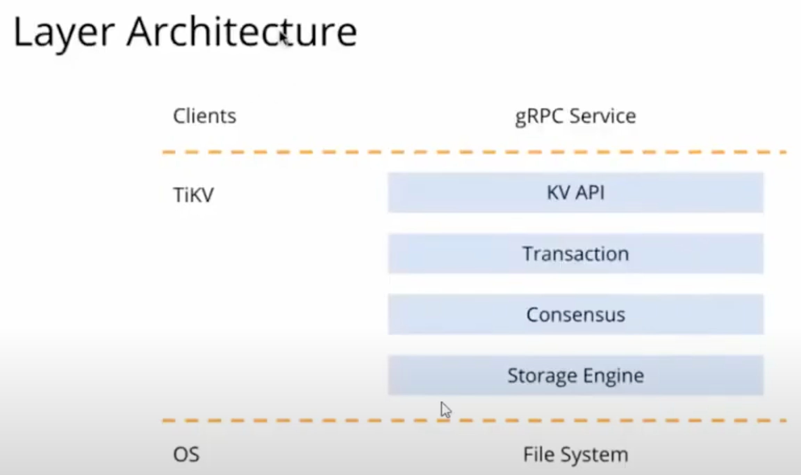
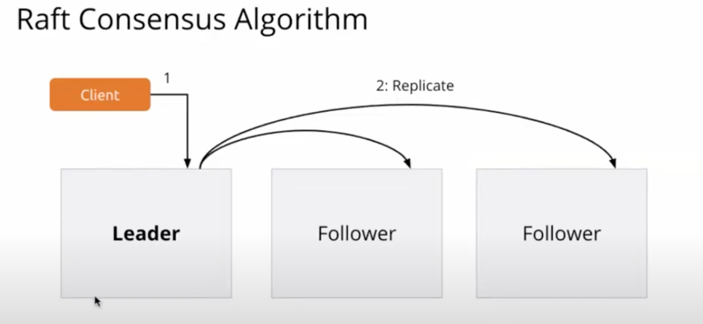
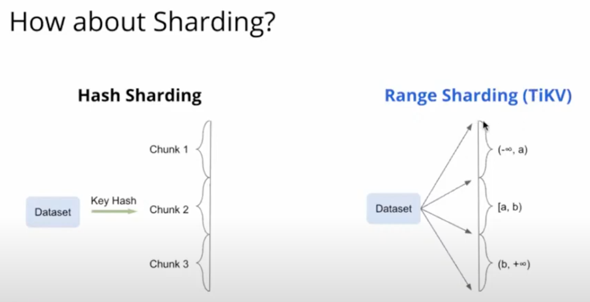
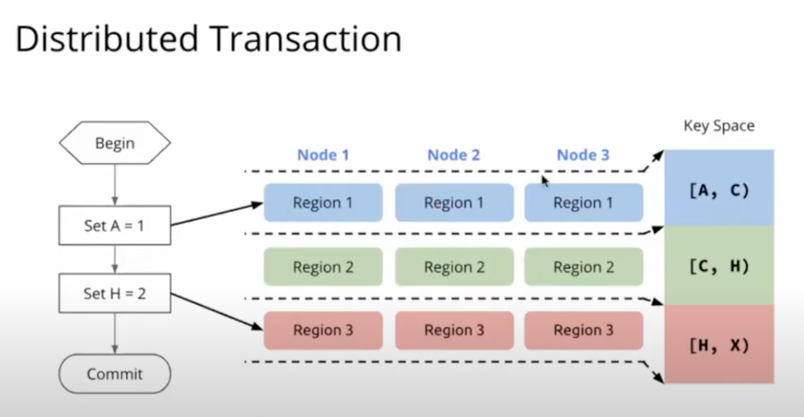
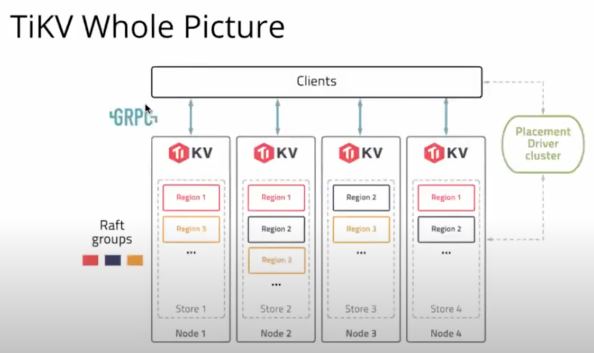

# TiKV Security Self-Assessment

This assessment was created by community members as part of the [Security Pals](https://github.com/cncf/tag-security/issues/1102) process and is currently pending changes from the maintainer team.

## Table of contents

* [Metadata](#metadata)
  * [Security links](#security-links)
* [Overview](#overview)
  * [Background](#background)
  * [Architecture](#architecture)
  * [Actors](#actors)
  * [Actions](#actions)
  * [Goals](#goals)
  * [Non-goals](#non-goals)
* [Self-assessment use](#self-assessment-use)
* [Security functions and features](#security-functions-and-features)
* [Project compliance](#project-compliance)
* [Secure development practices](#secure-development-practices)
* [Security issue resolution](#security-issue-resolution)
* [Appendix](#appendix)
* [Suggested action items](#suggested-action-items)

## Metadata

|   |  |
| -- | -- |
| Assessment Stage | Incomplete |
| Software | [TiKV](https://github.com/tikv/tikv/tree/master)  |
| Security Provider | No  |
| Languages | Rust, Java, Go, and C |
| SBOM |Link to the dependencies file: [Cargo.toml](https://github.com/tikv/tikv/blob/master/Cargo.toml) |
| | |

### Security links

| Doc | url |
| -- | -- |
| Security file |  https://github.com/tikv/tikv/blob/master/SECURITY.md |
| Security Audit Report | https://github.com/tikv/tikv/blob/master/security/Security-Audit.pdf |
| Default and optional configs | https://tikv.org/docs/3.0/tasks/configure/security/ |

## Overview
**TiKV (Ti Key-Value)**

TiKV is an open-source, distributed, and transactional key-value database designed without heavy dependencies on existing distributed file systems. TiKV is scalable, low latency, and an easy to use key-value database, and it is optimized for petabyte-scale deployments.

TiKV is inspired from Titanium (‘***Ti***’), as the creators kept the element’s property in mind. ‘***KV***’ stands for the ‘key-value’ combination in reference to the databases where it is primarily used. 

### Background

Key-value databases are optimized for fast data retrieval. They offer high performance for read/write operations, making them ideal for applications that require rapid access to data.

TiKV is part of the Cloud Native Computing Foundation and created by PingCAP; it features ACID-compliant transactional APIs and ensures data consistency and high availability through the Raft Consensus Algorithm. The aim of the project is to provide a solution similar to Google Spanner and HBase, but with a focus on simplicity and ease of use for massive datasets.

### Architecture

* **Layers**
  - OS Layer Storage Engine (RocksDB)
  - Consensus Model
  - Transaction (implements MVCC = multiversion concurrency control and distributed transactions)
  - KV API
  - Clients (using the gRPC protocol to connect to TiKV)

* **Storage Engine**
  - Uses [RocksDB](https://rocksdb.org/)
    - High Read/Write Performance
    - Easy to embed in Rust (TiKV is written in Rust)
    - Stable
  
* **Consensus Model**
  
  
  
  * Raft Consensus Algorithm
    - Client reads/writes to leader node
    - Leader node replicates client requests to follower nodes
    - The transaction is successful if the majority of the nodes (including leader and follower nodes) have fulfilled the client request
    - If the leader node fails, then the up-to-date follower node becomes the leader
      - There is a minimum of three nodes in a TiKV cluster
    - As long as the majority of nodes are alive, the whole cluster is available
  
  * TiKV uses Range Sharding as opposed to Hash Sharding, which is used by other systems
  
    
  
    * Range Sharding is better when scaling
  
  * TiKV brings together Replication (Raft Consensus Protocol) and Sharding (Range Sharding)
  
    
  
  * When Scaling (i.e. adding extra nodes), the nodes are balanced and the leader of one node, becomes the leader of the new node
  
* **The Placement Driver**
  - The Placement Driver Cluster stores “Region Information,” which the client can use to know which node to access
  - The Placement Driver is “Highly Available”

* **Client**
  - The client uses the [gRPC](https://grpc.io/) protocol to interface with Placements Drivers and TiKV nodes

### Actors

* **Clients**
* **TiKV Instance**
  - Data Regions (within TiKV Nodes)
* **Placement Driver**
    - TimeStamp Oracle (within Placement Driver)

### Actions

* **TiKV Recovery with Raft Consensus Algorithm:**
  - Essential for TiKV is the development of effective node recovery systems. The Raft Consensus Algorithm is central to this, appointing a primary leader within a peer network to manage client requests. This setup ensures data replication among follower nodes for consistency. If the leader node fails, a new leader is elected from the followers.
* **Ensuring Strong Consistency and Efficient Data Partitioning:**
  - During transactions, TiKV upholds strong consistency. It organizes transaction keys into batches for concurrent prewriting processes. Utilizing range partitioning, TiKV enhances the efficiency of scan operations and simplifies the process of splitting or merging data, thereby reducing unnecessary data movement.
* **Key-Value Storage and Management Using RocksDB:**
  - TiKV employs RocksDB for its key-value storage needs. This includes supporting Multi-Version Concurrency Control (MVCC) for each row and using Bloom Filters for quick key searches. For managing snapshots and garbage collection, it utilizes functionalities like Ingest External File and DeleteFilesInRange.
* **Transaction Management and Timestamp Allocation:**
  - TiKV adopts the Percolator model for transactions, which relies on optimistic locking and avoids using a single coordinating node, thereby increasing fault tolerance. The Placement Driver (PD), embedded within TiKV, is responsible for issuing timestamps crucial for keeping transaction order and also manages metadata and load balancing.
* **Distributed Execution of SQL Queries:**
  - TiKV handles queries in a distributed fashion, dividing tasks by geographical region and assigning them to various TiKV nodes. It is equipped with several executors to manage different operations, including table scans, index scans, selections, aggregations, and sorting.
* **Rigorous Testing and Simulation Procedures:**
  - TiKV undergoes thorough testing, encompassing both unit and integration tests. The PD component of TiKV includes a simulator tool designed for detecting and resolving scheduling conflicts within large-scale clusters.
* **Client-Server Communication via gRPC:**
  - For remote procedure calls, TiKV utilizes gRPC. This framework supports both standard and streaming modes, facilitating versatile and efficient communication between clients and servers.

### Goals

* TiKV clients let you connect to a TiKV cluster and use raw (simple get/put) API or transaction (with transactional consistency guarantees) API to access and update your data. TiKV clients interact with PD and TiKV through gRPC
* Scalability and consistency due to data being shared and replicated across multiple nodes (up to petabytes)
* Ensure data confidentiality and integrity in transit and at rest, using TLS
* Guarantee ACID properties for transactions to prevent data corruption
* Externally consistent distributed transactions to operate over multiple Key-Value Pairs
* Develop and maintain sophisticated access control systems to manage permissions effectively for different users and services interacting with TiKV
* Ensure compatibility and integration with widely used cloud-native security tools and platforms for seamless deployment in various environments 
* TiKV adopts MVCC (Multiversion Concurrency Control) which offers an extra layer of security in data management by maintaining multiple versions of data records. This approach helps to prevent conflicts and inconsistencies in a distributed environment where concurrent transactions occur 

### Non-goals
* Not supposed to be a relational database (No SQL)
* Does not specifically implement features which compromise performance without clear security benefits
* Perfect security is not a goal of TiKV; the aim should be to mitigate risk to acceptable levels as perfect security is unattainable
* Does not address end-user security, such as password manager or client side security, which are outside the database’s control
* Does not attempt to solve external network security issues that are beyond the scope of TiKV

## Self-assessment use

This self-assessment is not intended to provide a security audit of TiKV, or
function as an independent assessment or attestation of TiKV's security health.

This document serves to provide TiKV users with an initial understanding of
TiKV's security, where to find existing security documentation, TiKV plans for
security, and general overview of TiKV security practices, both for development of
TiKV as well as security of TiKV.

This document provides the CNCF TAG-Security with an initial understanding of TiKV
to assist in a joint-assessment, necessary for projects under incubation. Taken
together, this document and the joint-assessment serve as a cornerstone for if and when
TiKV seeks graduation and is preparing for a security audit.

## Security functions and features

* **Critical Security Functions and Features:**
   - ***Transport-Layer Security (TLS)***: This is necessary for encrypted communication between TiKV nodes. This ensures the integrity and confidentiality of data in transit. TiKV uses OpenSSL to implement its TLS encryption.
   - ***Programming Language (Rust)***: TiKV is written in Rust, a memory-safe language. This can be important to avoid memory leaks, buffer overflows, race conditions, etc.
   - ***Timestamps and MVCC (Multiversion Concurrency Control)***: While this may not necessarily be thought of as a security feature, this is important because it helps maintain data consistency and integrity in a distributed environment.
   - ***Raft Consensus Algorithm***: As with MVCC, although this may not necessarily be considered a security feature, this ensures fault tolerance and maintains availability of the data, in addition to consistency across distributed nodes.
   - ***Authentication***: This is a fundamental principle to control access to TiKV clusters. Without authentication, there is no way of ensuring that only authorized users are interacting with node clusters.

* **Relevant Security Functions and Features:**
   - ***Role-Based Access Control***: Although Role-Based Access Control (RBAC) itself can be considered a critical security feature, specific roles and associated privileges can be defined and configured based on the security policy and needs of the organization.
   - ***Encryption Configuration***: Although there is no built-in [on-disk encryption](https://tikv.org/docs/4.0/tasks/configure/security/), it is possible to pair TiKV with encryption at rest, which can provide an extra layer of security by protecting data on the disk.
   - ***Cluster Security***: Certain network security features, such as firewalls, can be configured by an organization depending on its security policies and needs in order to resrict access to TiKV nodes and ensure communication between trusted entities.
   - ***TLS Certificate Management***: Although TLS is a critical security feature, depending on the infrastructure of the organization, TiKV allows for the [configuration](https://tikv.org/docs/6.1/deploy/configure/security/) of TLS certificates and keys for TiKV services, Placement Driver Services, and/or TiKV Clients.
   - ***TiKV Backup and Restore Configurations***: TiKV Backup & Restore ([TiKV-BR](https://tikv.org/docs/dev/concepts/explore-tikv-features/backup-restore/)) is a command-line tool for distributed backup and restoration of TiKV cluster data. Certain aspects of a TiKV backup can be configured including use of a checksum and use of TLS.

## Project compliance

Although TiKV does not provide explicit documentation regarding its compliance with specific regulations, it adheres to general best practices in security as an open-source distributed database. Although initially developed for the Chinese market, TiKV's documentation does not explicitly address its compliance with Western regulations like GDPR and HIPAA. The documentation of project compliance can potentially expedite the process of adoption.

## Secure development practices

For testing, TiKV uses regression tests, performance tests, ChaosMesh, and models their algorithms utilizing TLA+. TiKV uses Cargo as a universal project tool, and split tests into test modules in respective code files. Among the fuzzing libraries used are LLVM's libfuzzer, AFL and Google's Honggfuzz; however, according to a [security audit](https://github.com/tikv/tikv/blob/master/security/Security-Audit.pdf) performed by Cure53, these tests do not run in an automated fashion.

The TiKV project utilizes persistent open groups which each focus on a part of the TiKV project; teams and members provided in the teams folder for each individual project. Each team consists of reviewers, committers, and maintainers:
* **Reviewers**: Responsible for contributions and code review 
* **Committees**: Granted write access and usually responsible for certain areas of the project
  - Each commit message must contain a “Signed-off-by” line for Developer Certificate of Origin
* **Maintainers**: Responsible for moderating the discussions, managing project release, and proposing new committers or maintainers

In addition, there is a separate infrastructure team, not responsible for the team decision-making process, but that helps on applying the decision. The current list of infrastructure members is provided with their emails and githubs on the TiKV Governance page.
* **Infrastructure team**: Responsible for setting administration, security, and supporting the existing teams

### Voting
* Decisions regarding the project are made by votes on the primary project community repository.
* Votes are indicated via pull requests under the votes folder.
* Positive votes require no explanation, while vetoes (negative votes) must have an explanation. 
* Required vote counts can vary based on the decision but typically require at least 2 positive votes.

### Communication Links

Reporting Issues:
* GitHub Issues: For reporting problems, suggesting features, or discussing enhancements related to TiKV. [TiKV GitHub Issues](https://github.com/tikv/tikv/issues).

Internal:
* TiKV team members collaborate primarily through Special Interest Groups (SIGs), with details available in their [community repository](https://github.com/tikv/community). Team members also communicate with each other through the TiKV Community [Slack](https://tikv-wg.slack.com/join/shared_invite/enQtNTUyODE4ODU2MzI0LWVlMWMzMDkyNWE5ZjY1ODAzMWUwZGVhNGNhYTc3MzJhYWE0Y2FjYjliYzY1OWJlYTc4OWVjZWM1NDkwN2QxNDE#/shared-invite/email) and discuss TiKV GitHub [Issues](https://github.com/tikv/tikv/issues) or [TiKV Pull Requests](https://github.com/tikv/tikv/pulls).

Inbound:
* Users communicate with the team through the TiKV Community [Slack](https://tikv-wg.slack.com/join/shared_invite/enQtNTUyODE4ODU2MzI0LWVlMWMzMDkyNWE5ZjY1ODAzMWUwZGVhNGNhYTc3MzJhYWE0Y2FjYjliYzY1OWJlYTc4OWVjZWM1NDkwN2QxNDE#/shared-invite/email) or through [TiKV GitHub Issues](https://github.com/tikv/tikv/issues)

Outbound:
* Team members communicate with users through the TiKV Community [Slack](https://tikv-wg.slack.com/join/shared_invite/enQtNTUyODE4ODU2MzI0LWVlMWMzMDkyNWE5ZjY1ODAzMWUwZGVhNGNhYTc3MzJhYWE0Y2FjYjliYzY1OWJlYTc4OWVjZWM1NDkwN2QxNDE#/shared-invite/email) or through [TiKV GitHub Issues](https://github.com/tikv/tikv/issues), [TiKV Pull Requests](https://github.com/tikv/tikv/pulls), [Twitter](https://twitter.com/i/flow/login?redirect_after_login=%2Ftikvproject), [Stack Overflow](https://stackoverflow.com/questions/tagged/tikv)

Security Email Group:
* Security Email: For reporting security vulnerabilities. Email: tikv-security@lists.cncf.io

### Ecosystem 

TiKV integrates smoothly into the cloud-native world, embracing scalability, resilience, and openness. TiKV, as part of a cloud-native ecosystem, is intended to be a distributed transactional key- value store that can dynamically adapt to cloud contexts. The adoption of the Raft Consensus Algorithm ensures strong consistency and fault tolerance, making it suitable for distributed storage.

TiKV is open standard-compliant and has well-defined APIs for simple integration with many CNCF projects, like gRPC. It is flexible and allows for simple integration with a diverse set of cloud- native technologies, while also supporting a variety of programming languages and machine architectures.

TiKV's distributed and decentralized architecture, along with its strong consistency methods (e.g. MVCC), address data integrity and trust concerns by reducing the possibility of data modification or forgery. This guarantees correct insights from observability and monitoring tools that rely on TiKV, enabling well-informed decision-making in cloud-native applications.

Finally, TiKV is an essential part of the TiDB ecosystem and helps to make cloud-native, distributed, and highly available database solutions possible. TiKV is positioned as a vital and dependable part of cloud-native environments, fulfilling the various needs of contemporary distributed applications thanks to its architecture, scalability, and compatibility with other cloud-native services.

## Security issue resolution

Security vulnerabilities should be reported to the TiKV-security group via email (tikv-security@lists.cncf.io) using their public PGP key. The security team manages these reports, coordinating repairs and creating a draft Security Advisory on GitHub. Fixes are developed in a private GitHub repository before being merged and publicly posted in the GitHub [Advisory Database](https://github.com/advisories).

## Appendix

***Known Issues Over Time***

All TiKV security related ongoing and fixed issues can be browsed through the various labels they use for categorizing issues to find ones that might pertain to security. You can access and search for these issues using the labels in the TiKV GitHub repository. Here's the link to the TiKV GitHub Labels page: [TiKV GitHub Labels](https://github.com/tikv/tikv/labels) e.g. issues labeled with “security” can be queried using https://github.com/tikv/tikv/labels?q=security. 

The review process involves making changes for adherence to code quality and performance with the project's standards by community members and maintainers. For more details, see their [development guide](https://tikv.github.io/tikv-dev-guide/contribute-to-tikv/review-a-pull-request.html). 

***CII Best Practices***

TiKV has achieved a badge from the Core Infrastructure Initiative (CII) Best Practices program, highlighting its commitment to high-quality standards in open-source software development. This achievement is a testament to TiKV's adherence to best practices in Free/Libre and Open Source Software (FLOSS). For more details on TiKV's recognition in this area, visit the [TiKV CII Best Practices](https://www.bestpractices.dev/zh-CN/projects/2574) page.
  
***Case Studies***

* **JD Cloud and AI** – A scalable database was required by cloud computing provider JD Cloud & AI to store metadata for its Object Storage Service (OSS). The metadata was exceeding the capacity of their MySQL database at an alarming rate. A globally ordered key-value store with the capacity to store enormous quantities of data was necessary. They decided to utilize TiKV following a scaled evaluation of their alternatives. TiKV is highly proficient in managing extensive datasets and offers support for petabyte-scale deployments. TiKV satisfied the performance, scalability, and defect tolerance criteria set forth by JD Cloud & AI after thorough testing. The application from TiKV has a latency of 10ms and a QPS of over 40,000. It has substituted MySQL as the metadata repository for their OSS. As of now, the principal database utilized by JD Cloud & AI for storing OSS metadata is TiKV.
  
* **SHAREit Group - SHAREit**, a widely used global content and advertising platform, aimed to improve their recommendation systems. Their focus was on achieving lower latency and an efficient SQL interface. The company chose to use TiKV for storing data online and interacting with their recommendation system. In addition, they have a plan to incorporate TiDB, which is an open-source HTAP database. This integration will allow them to use online machine learning, which means they can continuously enhance their recommendations by providing online training. TiKV and TiDB have successfully met their requirements for handling a large number of simultaneous write operations and providing a SQL interface. This has resulted in a simplified architecture for these systems. By adopting open source, engineers have been able to significantly decrease the amount of time they spend on feature engineering. For reference, this task took up around 50% of their time, but now it has been reduced to 25% or even less. SHAREit has improved its architecture and AI workflow for recommendations by adopting TiKV and TiDB and has resulted in a more efficient and streamlined process.
  

Deploys TiKV with TiDB:

* **Hulu** a popular video-streaming service, adopts TiKV with TiDB into their platform. There isn't a lot of detailed information about how Hulu specifically deploys TiKV and TiDB. However, based on the general understanding of TiKV, it is known that  TiKV is highly capable at managing distributed storage, while TiDB can handle SQL processing and transactions. Hulu could utilize it to store and organize large quantities of metadata associated with their video library and user interactions. TiKV lacks SQL interface and transactional support, so TiDB serves as a provider for these features. Hulu benefits from the combination of TiKV and TiDB because they provide a data infrastructure that is fast, scalable, and reliable. This enables Hulu to efficiently deliver content and recommendations to their audience.

***Related Projects / Vendors***

**Company: PingCAP; Offering: TiDB Cloud; Industry: DBaas.**
PingCAP is the company behind the open-source TiKV project and supplies continuous development of the project. TiDB Cloud is a database-as-a-service (DBaas) provided by PingCAP. It is built using TiKV and TiDB technologies. It offers fully-managed clusters of the open source TiKV database in the cloud. TiDB Cloud manages various operational tasks such as provisioning, upgrades, scaling, monitoring, and ensuring high availability. The main difference is that some users may prefer the convenience of TiDB Cloud as a service to the responsibility of administering their own TiKV environment. Overall, TiDB Cloud is intended for utilization by users who desire to operate it locally or as a service. Both projects give users the opportunity to leverage PingCAP's innovative technology. 

### Please refer to TiKV's STRIDE Thread Model following this [link](tikv-threat-model.md). 
### For more on TiKV's security policies, please refer to the following [link](https://github.com/tikv/tikv/blob/master/SECURITY.md).

## Suggested action items

Although we were not able to receive feedback from the TiKV project maintainers (at the time of writing), we have formulated several action items related to our understanding of TiKV and its potential vulnerabilities: 

**Access Controls for TiKV Nodes and Placement Drivers**
* Mutual TLS Authentication: Enforce mutual TLS (Transport Layer Security) for all communications between clients and TiKV nodes, ensuring that both parties are authenticated.

**Password Protection and Authentication**
* Adopt Advanced Authentication Mechanisms: Implement certificate-based authentication or integrate with identity providers that support OAuth2 or OpenID Connect, in addition to two-factor authentication.
* Automated Credential Rotation: Implement automated systems for rotating credentials and keys at regular intervals or in response to specific events.

**Raft Consensus Algorithm Security**
* Cryptographic Integrity Checks: Apply asymmetric key cryptography hash functions TiKV instance nodes to data being replicated via the Raft algorithm to ensure data integrity.
* Anomaly Detection in Raft Protocol: Develop anomaly detection systems that can identify unusual patterns in Raft elections or message flows, indicating a potential Byzantine attack. (Statistics Integration inside Placement Driver to search for anomalous behavior during Raft Consensus Algorithm)

**Security in Multiversion Concurrency Control (MVCC)**
* Timestamp Encryption and Validation: Encrypt timestamps and implement validation mechanisms to detect and prevent timestamp tampering.

**RocksDB and TiKV's Storage Engine**
* Implement Plugin-Based Encryption: Develop a plugin system for RocksDB to support Data-at-Rest encryption (DARE).
* Vulnerability Scanning and Patching Process: Regularly scan for vulnerabilities in RocksDB and its dependencies, and establish a quick patching process
(SBOMs, no detailed checkup system for open-source dependencies).

 **Placement Driver Security**
 * Distributed Trust and Consensus Mechanism: Implement a distributed trust and consensus mechanism for metadata changes in the Placement Driver.
 * Backup and Recovery Plans: Establish robust backup and recovery plans for the metadata and transaction logs stored in the Placement Driver (Store two extra redundant copies of meta-data for recovery against data corruption – similar to the Raft Consensus Algorithm).

**Timestamp Oracle Scalability and Security**
* High-Availability Setup for Timestamp Oracle: Implement a high-availability setup for the Timestamp Oracle with automatic failover capabilities.
* Rate Limiting and Queue Management: Introduce rate limiting and queue management to handle high demand without compromising security or performance.

