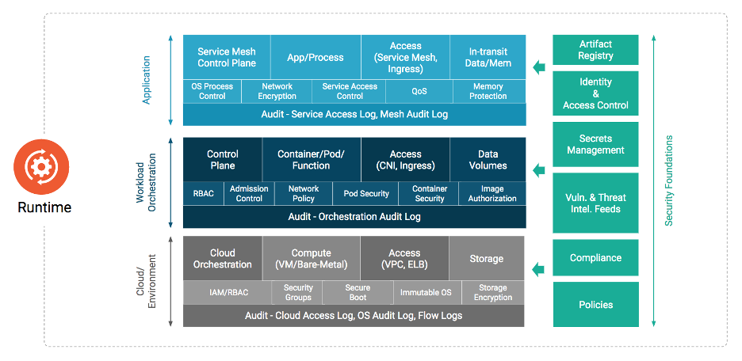

# **Traducción del Documento de Seguridad Nativa en la Nube**

<!-- cSpell:ignore markdownlint Microservices microservices ddos Microbusiness
microbusiness CISO lifecycles hotspots untrusted SAST DAST toolset cgroups
runtimes unencrypted untampered cryptomining iscsi hyperconverged ABAC
intercompatible antifragile exfiltrate seccomp cisecurity syscall DAAS usecase
-->
<!-- markdownlint-disable MD036 MD025 MD024 -->

Compartido con la Comunidad CNCF

## Metadata

| **Markdown** | | | |

| -- | -- | -- | -- |

| Original **Version in English** | **1.1** | 25 NOV 2020 | [Original working doc](https://tinyurl.com/CNCF-CNSWP) |
| **Status** | **WIP** | In Review | Approved |

| **PDF** | |
| -- | -- |
| **Created** | 2021-APR-09 |
| **Last Reviewed** | 2023-FEB-17 |
| **PDF Published** | 2023-FEB-23 |
| **Release Version** | 1.0 |
**Final PDF Approvers** [X] @TheFoxAtWork [X] @justincormack |

| **Originating Content and Review** | |
| -- | --|
| **Contributors** | [aradhna.chetal@gmail.com](mailto:aradhna.chetal@gmail.com), [@theFoxAtWork](mailto:themoxiefoxatwork@gmail.com), [jj@tetrate.io](mailto:jj@tetrate.io), gadi@alcide.io @lumjjb, @trishankatdatadog, [@vvenkatara@paloaltonetworks.com](mailto:vvenkatara@paloaltonetworks.com), @pushkarj, @whaber, @sublimino, @rowan-baker, [chase.pettet@gmail.com](mailto:chase.pettet@gmail.com), [harsingh@us.ibm.com](mailto:harsingh@us.ibm.com), jeff.lombardo@gmail.com |
| **Reviewers** | @justincappos, @lumjjb, @whaber, @craigbox, @anvega, @magnologan, @magnologan, alok@xenonstack.com, @nyrahul, @ranio1, Itay Shakury (@itaysk) |

| **Originating Content and Review in Spanish** | |

| -- | --|

| **Contributors** | Alba Ferri @Alba Ferri, Alfredo Pardo @Alfredo Pardo, Luis Cacho @luiscachog, Carolina Valencia @krol3, Rodolfo Vega @ramrodo, Victor Morales @electrocucaracha |

| **Reviewers** | Carolina Valencia @krol3, Rodolfo Vega @ramrodo, Vicente Jimenez Miras @Vicente, Victor Morales @electrocucaracha, Rael Garcia @raelga |

==========================================

## Índice 

- [**Traducción del Documento de Seguridad Nativa en la Nube**](#traducción-del-documento-de-seguridad-nativa-en-la-nube)
  - [Índice](#índice)
- [Resumen Ejecutivo](#resumen-ejecutivo)
  - [Propósito](#propósito)
    - [Análisis del problema](#análisis-del-problema)
  - [Fases del Ciclo de Vida](#fases-del-ciclo-de-vida)
    - [Desarrollo](#desarrollo)
    - [Distribución](#distribución)
    - [Despliegue](#despliegue)
    - [Tiempo de Ejecución](#tiempo-de-ejecución)
  - [Recomendaciones](#recomendaciones)
  - [Conclusión](#conclusión)
- [Introducción](#introducción)
  - [Público objetivo ](#público-objetivo)
  - [Objetivos Nativos de la Nube](#objetivos-nativos-de-la-nube)
  - [Suposiciones](#suposiciones)
- [Capas nativas de la nube](#capas-nativas-de-la-nube)
  - [Ciclo de Vida](#ciclo-de-vida)
    - [Procesos del Ciclo de Vida](#procesos-del-ciclo-de-vida)
      - [Cadena de Suministro](#cadena-de-suministro)
      - [Benchmarks de Seguridad](#benchmarks-de-seguridad)
  - [Desarrollo](#desarrollo-1)
      - [Controles de Seguridad en la etapa de Desarrollo](#controles-de-seguridad-en-la-etapa-de-desarrollo)
      - [Desarrollo de Pruebas](#desarrollo-de-pruebas)
      - [Revisión de Código ](#revisión-de-código)
  - [Distribuir](#disribuir)
      - [Construir el Pipeline](#construir-el-pipeline)
      - [Escaneo de la Imagen](#escaneo-de-la-imagen)
      - [Endurecimiento de la Imagen](#endurecimiento-de-la-imagen)
      - [Escaneo del Manifiesto de la Aplicación Contenerizada](#escaneo-del-manifiesto-de-la-aplicación-contenerizada)
      - [Endurecimiento del Manifiesto de la Aplicación Contenerizada](#endurecimiento-del-manifiesto-de-la-aplicación-contenerizada)
      - [Etapa de Pruebas ](#etapa-de-pruebas)
        - [Análisis Estático y Pruebas de Seguridad](#análisis-estático-y-pruebas-de-seguridad)
        - [Análisis Dinámico](#análisis-dinámico)
        - [Pruebas de Seguridad](#pruebas-de-seguridad)
      - [Artefactos e Imágenes](#artefactos-e-imágenes)
        - [Etapa de Preparación (staging) del registro](#etapa-de-preparación-staging-del-registro)
        - [Firma, Confianza e Integridad](#firma-confianza-e-integridad)
        - [Cifrado (Encryption)](#cifrado-encryption)
  - [Despliegue](#despliegue-1)
      - [Comprobaciones Previas al Despliegue](#comprobaciones-previas-al-despliegue)
      - [Observabilidad y Métricas](#observabilidad-y-métricas)
      - [Respuesta e Investigación ](#respuesta-e-investigación)
  - [Ambiente de Ejecución](#ambiente-de-ejecución)
    - [Computación](#computación)
      - [Orquestación](#orquestación)
        - [Políticas de Seguridad](#políticas-de-seguridad)
        - [Solicitudes de Recursos y Límites](#solicitudes-de-recursos-y-límites)
          - [Análisis de Registro de Auditoría](#análisis-de-registro-de-auditoría)
        - [Autenticación del Plano de Control y Certificado Raíz de Confianza](#autenticación-del-plano-de-control-y-certificado-raíz-de-confianza)
        - [Cifrado de Secretos](#cifrado-de-secretos)
      - [Contenedores](#contendores)
        - [Tiempo de Ejecución](#tiempo-de-ejecución)
        - [Microservicios y Eliminación de la Confianza Implícita](#microservicios-y-eliminación-de-la-confianza-implícita)
        - [Imagen de Confianza y Protección del Contenido](#imagen-de-confianza-y-protección-del-contenido)
      - [Malla de Servicio](#malla-de-servicio)
      - [Detección en Tiempo de Ejecución](#deteción-en-tiempo-de-ejecución)
      - [Funciones](#funciones)
      - [Bootstrapping](#bootstrapping)
    - [Almacenamiento](#almacenamiento)
        - [Pila de almacenamiento](#pila-de-almacenamiento)
          - [Orquestación](#orquestación-1)
          - [Topología del Sistema y Protección de Datos](#topología-del-sistema-y-protección-de-datos)
          - [Almacenamiento en Caché](#almacenamiento-en-caché)
          - [Servicios de Datos](#servicios-de-datos)
          - [Capa Física o No Volátil](#capa-física-o-no-volátil)
        - [Cifrado de Almacenamiento](#cipherdo-de-almacenamiento)
        - [Protección del Volumen Persistente](#protección-del-volumen-persistente)
        - [Registros de Artefactos](#registros-de-artefactos)
    - [Acceso](#acceso)
      - [Gestión de Identidades y Accesos](#gestión-de-identidades-y-accesos)
      - [Gestión de Credenciales](#gestión-de-credenciales)
        - [Módulos de Seguridad de Hardware (HSM)](#módulos-de-seguridad-de-hardware-hsm)
        - [Ciclo de Gestión de Credenciales](#ciclo-de-gestión-de-credenciales)
      - [Disponibilidad](#disponibilidad)
        - [Denegación de Servicio (DoS) y Denegación de Servicio Distribuida (DDoS)](#denegación-de-servicio-dos-y-denegación-de-servicio-distribuida-ddos)
  - [Garantía de Seguridad](#garantía-de-seguridad)
    - [Modelado de Amenazas](#modelado-de-amenazas)
      - [Arquitectura End-to-end](#arquitectura-end-to-end)
      - [Identificación de amenazas](#identificación-de-amenazas)
    - [Inteligencia de Amenazas](#inteligencia-de-amenazas)
    - [Respuesta al incidente](#respuesta-al-incidente)
    - [Pila de Seguridad](#pila-de-seguridad)
      - [Ambiente](#ambiente)
        - [Herramientas de Seguridad Previas (carga de trabajo)](#herramientas-de-seguridad-previas-carga-de-trabajo)
          - [Comprobaciones de Cómputo y Nodo](#comprobaciones-de-cómputo-y-nodo)
          - [Ejecutar Contextos](#ejecutar-contextos)
        - [Herramientas de Seguridad](#herramientas-de-seguridad)
          - [Seguridad de la carga de trabajo y del host en tiempo de ejecución](#seguridad-de-la-carga-de-trabajo-y-del-host-en-tiempo-de-ejecución)
      - [Arquitecturas de Confianza Cero](#arquitecturas-de-confianza-cero)
      - [Princípio del Privilégio Mínimo](#princípio-del-privilegio-mínimo)
      - [Roles y Responsabilidades](#roles-y-responsabilidades)
  - [Cumplimiento](#cumplimiento)
    - [Auditorías Regulatorias ](#auditorías-regulatorias)
      - [Personas y Casos de uso ](#personas-y-casos-de-uso)
    - [Industrias](#industrias)
      - [Microempresas](#microempresas)
      - [Finanzas](#finanzas)
      - [Salud](#salud)
      - [Ámbito Académico y Educación](#ámbito-académico-y-educación)
      - [Sector Público](#sector-público)
  - [Evolución de la Seguridad Nativa de la Nube](#evolución-de-la-seguridad-nativa-de-la-nube)
    - [Conclusión](#conclusión)
    - [Acrónimos y Glosario](#acrónimos-y-glosario)
- [Referencias](#referencias)
- [Agradecimientos](#agradecimientos)

<!-- markdownlint-enable MD007 -->

# Resumen Ejecutivo

## Propósito

La industria de la tecnología ha cambiado hacia patrones de desarrollo e implementación que se consideran "nativos para la nube". Al mismo tiempo, el ecosistema de tecnologías, productos, estándares y soluciones se está expandiendo, desafiando a los que toman las decisiones a mantenerse al tanto de diseños complejos. El rol de CISO en particular, tiene la responsabilidad evolutiva de resaltar las propuestas de valor empresarial en este ámbito dinámico. Mientras tanto, los patrones nativos para la nube también han fomentado cambios en los modelos de consumo y la adopción de flujos de trabajo modernos (por ejemplo, metodologías ágiles y procesos DevOps) que requieren prácticas de seguridad integradas.

### Análisis del problema

Las preocupaciones de seguridad dentro de este escenario son complejas dado el enfoque explícito al desarrollo y despliegue rápidos, además de la inviabilidad de la seguridad tradicional basada en el perímetro. Esta complejidad requiere un cambio de paradigma que protege las aplicaciones, dejando el enfoque basado en el perímetro para moverse más cerca a las cargas de trabajo dinámicas, identificándose en función de atributos y metadatos (por ejemplo, con etiquetas). Este enfoque identifica y protege las cargas de trabajo para satisfacer necesidades de escalado de las aplicaciones nativas para la nube, al mismo tiempo que se adapta a un flujo constante. Estos cambios de paradigma requieren la adopción de una mayor automatización en el ciclo de vida de la seguridad de las aplicaciones y arquitecturas de diseño seguro (por ejemplo, Zero Trust). 

La adopción de la tecnología de contenedores es una de las transformaciones centrales en el entorno nativo para la nube, que también requiere el uso de mejores prácticas. El balance para una implementación segura continúa involucrando a múltiples partes interesadas dentro de una organización e impacta significativamente en la productividad del desarrollador e ingeniero de operación  en la búsqueda de los objetivos comerciales. Las aplicaciones nativas para la nube aún requieren desarrollo, distribución, implementación y operación, pero el paradigma dicta nuevos mecanismos de seguridad mediante los cuales estos objetivos se logran de manera eficiente. El desarrollo nativo para la nube se puede modelar en distintas fases que constituyen el ciclo de vida de la aplicación: "Desarrollar", "Distribuir", "Implementar" y "Ejecutar". La seguridad nativa para la nube contrasta con los enfoques tradicionales, donde existe la gran oportunidad de garantizar que la seguridad se inyecte a lo largo de estas distintas fases en lugar de limitar el ciclo de vida con intervenciones de seguridad administradas por separado. Es fundamental tener en cuenta que sin educación y formación constante sobre el uso y la integración de estos conceptos, herramientas, y procesos, la adopción y la aplicación no persistirán y pueden revertirse.

## Fases del Ciclo de Vida

### Desarrollo

Lo nativo para la nube está conceptualmente ligado a las prácticas de Infraestructura como código (IaC) que están destinadas a garantizar que los controles funcionen según lo previsto con las primeras integraciones de verificación de seguridad. Estos controles e integraciones identifican configuraciones incorrectas e implementan las mejores prácticas en IaC y manifiestos de orquestación lo antes posible para reducir costos a largo plazo y aumentar el valor de la seguridad.

Las herramientas nativas de la nube están diseñadas para introducir la seguridad en las primeras etapas del ciclo de vida de la aplicación. Las pruebas de seguridad deben identificar las violaciones de cumplimiento y configuraciones incorrectas de manera temprana para crear ciclos de retroalimentación cortos y accionables para el mejoramiento continuo. Este enfoque permite que los fallos de seguridad sigan flujos de trabajo familiares generados por otros problemas en el pipeline (por ejemplo, correcciones de errores o fallos de CI), que ya requieren resolución antes de seguir con la siguiente etapa dentro del pipeline. El ciclo de vida de seguridad moderno para este modelo gira en torno al desarrollo de código que se adhiere a los patrones de diseño recomendados (por ejemplo, [12-factores](https://12factor.net/)) y garantiza la integridad de la carga de trabajo entregada. La nube nativa está vinculada conceptualmente a las prácticas de Infraestructura como código (IaC), que están destinadas a garantizar que los controles funcionen según lo previsto con integraciones de verificación de seguridad tempranas. Estos controles e integraciones identifican configuraciones incorrectas e implementan mejores prácticas en IaC y manifiestos de orquestación lo antes posible para reducir el costo a largo plazo y aumentar el valor de la seguridad.

### Distribución

La seguridad de la cadena de suministro de software es especialmente crítica en modelos que permiten la iteración de software más rápida. Los ciclos de vida de las aplicaciones nativas de la nube deben incluir métodos para verificar, no solo la integridad de la propia carga de trabajo, sino también el proceso de creación de dicha carga y las operaciones que hay sobre ella. Este desafío se intensifica por la necesidad, práctica y consistente del uso de software de código abierto e imágenes de ejecución de software de terceros, incluyendo las capas de dependencias "upstream". Los artefactos (por ejemplo, imágenes de contenedores) presentes durante el desarrollo del ciclo de vida requieren ser escaneados de manera automática y continua, así como recibir actualizaciones para garantizar la seguridad frente a vulnerabilidades, malware, prácticas de codificación inseguras y otras actividades ilícitas. Al completar estas comprobaciones, es importante firmar criptográficamente los artefactos para garantizar la integridad y hacer cumplir el no repudio.

### Despliegue

La seguridad integrada a través de las fases de desarrollo y distribución permite la validación continua y en tiempo real de los atributos de los candidatos de las cargas de trabajo (por ejemplo, que los artefactos firmados sean verificados, se garantizan las imágenes de contenedores y las políticas de seguridad en tiempo de ejecución y que la compatibilidad del host pueda ser validada.). Asegurar las capacidades de observabilidad de las cargas de trabajo, desplegadas junto a las cargas de trabajo, permiten monitorear los registros y métricas disponibles con un alto nivel de confianza, complementando la seguridad integrada. 

### Tiempo de Ejecución

Se espera que los entornos nativos de la nube proporcionen la aplicación de políticas y las capacidades de restricción de recursos por diseño. Las restricciones de recursos en tiempo de ejecución (p. ej., aislamiento de cgroup del kernel de Linux) para cargas de trabajo son un ejemplo de primitivas restrictivas y de observabilidad integradas en niveles superiores del ciclo de vida de la aplicación en un entorno nativo de la nube. El entorno de tiempo de ejecución nativo de la nube se puede dividir en capas de componentes interrelacionados con distintas preocupaciones de seguridad [^1] (p. ej., hardware, host, tiempo de ejecución de la imagen del contenedor, orquestación).

Dentro del entorno de ejecución en ambientes nativos de la nube, la arquitectura de microservicio para aplicaciones ha sido adoptada por las industrias y organizaciones de todo el mundo. Las aplicaciones a menudo se componen de varios microservicios independientes y de propósito único, las cuales se comunican entre sí a través de abstracciones en la capa de servicio, gracias a la capa de orquestación de contenedores. Las buenas prácticas para proteger esta arquitectura de componentes interrelacionados implican asegurar que solo los procesos autorizados operen dentro del "namespace" del contenedor, la prevención y notificación de acceso no autorizado a recursos y la supervisión del tráfico de la red para detectar cualquier actividad hostil. Una malla de servicio (service mesh) es otra abstracción común que proporciona funcionalidad consolidada y complementaria para servicios orquestados sin imponer cambios en la aplicación de software en sí (por ejemplo, monitoreo de tráfico de API, encriptación de transporte, observabilidad de etiquetado (tagging), autenticación y autorización).

## Recomendaciones

La seguridad nativa de la nube busca garantizar las mismas condiciones de diligencia, integridad, confianza y prevención de amenazas que los modelos de seguridad tradicionales, al tiempo que integra conceptos modernos de transitoriedad, distribución e inmutabilidad. En estos entornos que cambian rápidamente, propensos a fallar durante las iteraciones, se requiere la automatización en el desarrollo del flujo de trabajo CI/CD para obtener resultados seguros. Las organizaciones deben analizar y aplicar con seriedad estos conceptos básicos de seguridad para aliviar la demora en la aplicación de controles y en la protección del entorno, así como la necesidad de mantener los mismos estándares  sobre el software de terceros, mientras se busca un equilibrio entre la educación continua y la capacitación relevante en el uso de tecnologías de la nube y los encargados de la seguridad en la propia area de trabajo. Con capas adicionales de complejidad y un amplio rango de componentes de los que hacerse cargo, la protección contra el acceso no autorizado debe lograrse integrando la seguridad a lo largo del ciclo de vida y en el entorno de ejecución. Es muy recomendable que las organizaciones evalúen la pila de defensa de seguridad frente a los marcos relevantes de ataque [^2] para lograr claridad sobre las amenazas de la pila de defensa. Además, las organizaciones deben adoptar enfoques y metodologías que desplacen la seguridad a la izquierda [^3], potencien DevOps y vayan más allá del siguiente horizonte tecnológico, de manera que cualquier innovación introducida durante cualquier fase del flujo del ciclo CI/CD pueda ser verificada.

## Conclusión

La seguridad nativa de la nube, cuando se ejecuta estratégicamente en una organización, puede proporcionar alta disponibilidad, seguridad, resiliencia y redundancia a escala, lo que garantiza que los clientes y desarrolladores tengan acceso seguro a los recursos necesarios a la velocidad que esperan. La seguridad en sí misma sigue siendo un campo interdisciplinario que no puede aislarse del ciclo de vida del desarrollo o tratarse como un dominio puramente técnico. Los desarrolladores, operadores y personal de seguridad deben asociarse, intercambiar y colaborar para continuar haciendo avanzar la industria. Al igual que con cualquier innovación técnica, son las personas, su pasión y el camino transitado por la comunidad lo que hace posible la seguridad nativa de la nube.

# Introducción

El objetivo de este documento es proporcionar a las organizaciones y a sus líderes técnicos una comprensión clara de la seguridad nativa de la nube, su incorporación en los procesos del ciclo de vida y las consideraciones para determinar la aplicación más adecuada de la misma. La seguridad nativa de la nube es un conjunto de problemas con múltiples objetivos y restricciones que abarca muchas áreas de experiencia y práctica. Casi todas las operaciones del Día 1 y Día 2 se superponen en el dominio de seguridad, desde la gestión de identidades hasta las soluciones de almacenamiento. Sin embargo, la seguridad nativa de la nube cubre mucho más que estas áreas; también es un conjunto de problemas humanos, que incluye individuos, equipos y organizaciones. Son los mecanismos, los procesos y la intención mediante los cuales los seres humanos y los sistemas interactúan y realizan cambios en las aplicaciones nativas de la nube y la tecnología.

## Público objetivo 

Nuestro público objetivo es el director de Seguridad (Chief Security Officer), el director de Seguridad de la Información (Chief Information Security Officer) o el director de Tecnología (Chief Technology Officer) de una empresa privada, agencia gubernamental u organización sin fines de lucro que desean ofrecer un ecosistema seguro de tecnología nativa de la nube. Adicionalmente, partes interesadas de la organización pueden incluir gerentes de proyectos, productos, programas y arquitectos responsables de diseñar e implementar productos y servicios nativos de la nube seguros. Aparte de esto, cualquier persona con un gran interés en la seguridad nativa de la nube puede consultar este documento. 

## Objetivos Nativos de la Nube

La adopción e innovación que involucran arquitecturas de contenedores y microservicios ha traído consigo una buena cantidad de desafíos. La necesidad de mitigar las vulnerabilidades en ciberseguridad ha ascendido sistemáticamente en la escala de prioridades de las organizaciones modernas. A medida que se acelera la innovación en torno a la adopción de la nube, el panorama de amenazas también aumenta. Los líderes de seguridad tienen la tarea de proteger los activos, tanto humanos [^4] como no humanos, mediante la adopción de prácticas para prevenir, detectar y responder a las amenazas cibernéticas mientras cumplen estrictos requisitos de cumplimiento. Una narrativa común ha sido que las implementaciones de seguridad impiden la velocidad y agilidad de los equipos de DevOps. Por lo tanto, el liderazgo en seguridad debe implementar una integración más estrecha y un entendimiento bidireccional para empoderar a los equipos de DevOps para crear una propiedad compartida del riesgo cibernético. La adopción de patrones y arquitecturas seguras para cloud native que las organizaciones necesitan adoptar deben compartirse para garantizar que la industria aplique prácticas de seguridad con alta prioridad y las integre en todo el ciclo de vida del desarrollo de la aplicación. Lo más importante es destacar las sinergias de la arquitectura de seguridad con los líderes de seguridad y alinear los objetivos de las organizaciones con la seguridad en términos de gestión de vulnerabilidades, confianza cero, seguridad en la nube y DevSecOps deben ser una prioridad máxima. Los conceptos descritos en este documento no están diseñados para favorecer un servicio o producto componente sobre otro y se pueden aplicar independientemente de la selección del servicio.

Este documento no pretende proporcionar educación general sobre conceptos de seguridad o conceptos de computación en la nube. Tampoco recomienda tecnologías o herramientas específicas; sin embargo, puede citar ejemplos de tecnología o herramientas que abordan el tema discutido. Más allá de las recomendaciones de este documento, las prácticas específicas de manejo de seguridad de datos relacionadas con la protección de datos y los mandatos regulatorios de privacidad, p. Ej. GDPR, PCI DSS, puede necesitar una regulación adicional. Recomendamos a los lectores que consulten otros recursos independientes para obtener orientación sobre dichos controles técnicos y cumplimiento de los riesgos. 

## Suposiciones

El [CNCF](https://www.cncf.io/) define la [nube nativa](https://github.com/cncf/toc/blob/master/DEFINITION.md) dentro del repositorio de GitHub del Comité de Supervisión Técnica (TOC - Technical Oversight Committee’s ) del CNCF. Este artículo no pretende cambiar esta definición ni ampliarla.

La adopción nativa de la nube y las metodologías modernas de desarrollo de software continúan evolucionando, las tecnologías que componen una efectiva pila nativa de la nube seguirán cambiando con el tiempo. Las representaciones de estos cambios se incluyen en la [visión general de la nube nativa](https://landscape.cncf.io/) que incluye la representacion de las pilas.

El término "cargas de trabajo" dentro de este documento cubre cualquier producto, proyecto,
aplicaciones y sistemas que han o serán desarrollados, mantenidos,
distribuida o implementada en un entorno de tiempo de ejecución basado en la nube.

# Capas nativas de la nube

_Figura 1_

El stack de cloud native se compone de las capas de base, ciclo de vida y entorno. El stack de cloud native se puede adoptar utilizando diferentes modelos de implementación: IaaS, PaaS, CaaS y FaaS. Cada modelo de implementación proporciona abstracciones adicionales que facilitan la gestión y el funcionamiento de los entornos de cloud native. Dado que algunos de estos modelos se consideran bien conocidos y se han utilizado durante años, nos centraremos en los modelos específicos de cloud native.
El modelo de contenedores como servicio o Containers-as-a-Service (CaaS) permite a los usuarios orquestar y administrar contenedores, aplicaciones y clústeres aprovechando una plataforma de virtualización basada en contenedores, una interfaz de programación de aplicaciones (API) o una interfaz de administración de portal web. CaaS ayuda a los usuarios a construir aplicaciones en contenedores escalables con una política de seguridad integrada como código y ejecutarlas en una nube privada, centros de datos locales o una nube pública. CaaS ayuda a agilizar el proceso de creación de un contenedor. Con la orquestación y las implementaciones de microservicios, ayuda a las empresas a lanzar software más rápido y permite la portabilidad entre entornos híbridos y de múltiples nubes, lo que reduce la infraestructura y los costos operativos. El modelo CaaS ahorra costos, ya que ayuda a las empresas a simplificar la gestión de contenedores y les da la opción de pagar solo por los recursos de CaaS que desean y utilizan. CaaS tiene los contenedores como su recurso fundamental, mientras que para los entornos IaaS se utilizan máquinas virtuales (VM) y sistemas host de hardware bare metal.
Las funciones como servicio o Functions-as-a-Service (FaaS) es otro modelo de implementación cloud native, un tipo de servicio en la nube que permite a los usuarios empresariales ejecutar código en respuesta a eventos sin la infraestructura compleja típicamente asociada con la creación y el lanzamiento de microservicios. El alojamiento de una aplicación de software en la nube generalmente requiere el provisionamiento y la administración de un entorno virtual, la administración del sistema operativo y los componentes web, etc. Con FaaS, el proveedor de servicio de la nube maneja automáticamente el hardware físico, el sistema operativo de la máquina virtual y la administración del software del servidor web. Permitiendo así a los usuarios centrarse en funciones individuales en el código de microservicios mientras pagan por los recursos que se utilizan y aprovechan la elasticidad de los recursos que proporciona la nube.

## Ciclo de Vida

El ciclo de vida en un contexto cloud native son las tecnologías, las prácticas y los procesos que habilitan la resiliencia, manejo y observación de las cargas de trabajo ejecutadas dentro del contexto de la nube. Como se muestra en la Figura 1, el ciclo de vida se compone de cuatro fases continuas; Desarrollo, Distribución, Despliegue y Ejecución. Cada fase extiende y amplifica la anterior al mismo tiempo que permite y soporta la ejecución segura de la carga de trabajo.

### Procesos del Ciclo de Vida

​​La gestión de la cadena de suministro de software y la aplicación de los controles de referencia de seguridad son críticos para una implementación segura.

####  Cadena de Suministro

Las organizaciones son responsables de garantizar que la cadena de suministro para las cargas de trabajo que están desarrollando esté sujeta a un análisis de seguridad dentro del ciclo de vida de desarrollo. La seguridad de la cadena de suministro se puede dividir en dos partes: la seguridad de las herramientas y servicios que proporcionan un entorno para crear una carga de trabajo (por ejemplo, herramientas para desarrolladores) y los componentes que componen la carga de trabajo en sí (por ejemplo, bibliotecas, dependencias e imágenes). La cadena de suministro debe implementarse de tal manera que la integridad de la cadena de suministro en sí sea verificable y, por lo tanto, los artefactos producidos por la cadena de suministro de software puedan firmarse para la verificación de procedencia. Como tal, una organización debe tener cuidado al usar dependencias, tales como los paquetes dependientes de versiones superiores inevitablemente contendrán vulnerabilidades. Verificar la autenticidad e integridad de los paquetes de terceros utilizados es esencial para garantizar que las dependencias sean las previstas y no se vean comprometidas.
Una característica principal de las aplicaciones nativas de la nube es la reutilización de software que está disponible como código abierto e imágenes de contenedores que son construidas y distribuidas a través de registros de contenedores de código abierto. En consecuencia, es fundamental para el desarrollador, el operador y el personal de seguridad asegurarse de que los artefactos y las dependencias de sus aplicaciones no contengan malware y vulnerabilidades. La presencia de malware en las imágenes del contenedor es un vector de ataque importante en el ambiente de ejecución [^5]. Es esencial emplear escaneo de vulnerabilidades bajo demanda y periódico en las imágenes de contenedores y paquetes compuestos en el pipeline de CI, así como en los registros de contenedores.
Aprovechar estos métodos permite una distribución de software segura y verificable y una operación continua. La incorporación del análisis de vulnerabilidades en el pipeline permite que una organización amplifique la retroalimentación con los equipos de desarrollo y tiene el potencial adicional de bloquear códigos inseguros o vulnerables de la distribución y despliegue. El escaneo periódico del software también permitirá escalar las nuevas vulnerabilidades identificadas en el software existente.

####  Benchmarks de Seguridad

La utilización de referencias de seguridad (por ejemplo, [NIST Application Container Security
Guide](https://nvlpubs.nist.gov/nistpubs/SpecialPublications/NIST.SP.800-190.pdf),
[Center for Internet Security (CIS)](https://www.cisecurity.org/), [NIST
Security Strategies for Microservices-based Application
Systems](https://csrc.nist.gov/publications/detail/sp/800-204/final), y [OpenSCAP](https://www.open-scap.org/)) proporciona a los equipos de desarrollo y organizaciones una guía para crear cargas de trabajo "seguridad por defecto". La adopción e implementación de estas referencias permiten a los equipos probar una línea de base reforzada. Sin embargo, no pueden tener en cuenta los flujos de datos y el uso personalizado de las plataformas de prueba. Los profesionales de la seguridad deben implementarlo como una guía en lugar de una lista de verificación.
Las siguientes secciones proporcionan un análisis detallado de las implicaciones, herramientas, mecanismos y mejores prácticas para integrar la seguridad a lo largo del ciclo de vida de la aplicación.

## Desarrollo

_Figura 2_

La seguridad de las aplicaciones nativas de la nube debe implementarse durante todo el ciclo de vida de una aplicación. La fase de "Desarrollo" es la primera de este ciclo y tiene como resultado la creación de artefactos, tales como infraestructura como código, manifiestos de aplicaciones y contenedores, etc., que se utilizarán para implementar y configurar aplicaciones nativas de la nube. En consecuencia, estos artefactos han demostrado ser la fuente de numerosos vectores de ataque que pueden ser explotados en el tiempo de ejecución. En las siguientes secciones elaboramos las diversas herramientas de seguridad, procesos y verificaciones que deben instituirse en cada fase para reducir drásticamente la superficie de ataque de las aplicaciones desplegadas en el tiempo de ejecución.

#### Controles de Seguridad en la etapa de Desarrollo

El fortalecimiento de la seguridad durante la fase de desarrollo constituye un componente crítico en la implementación de aplicaciones. Esto significa que los requisitos de seguridad deben introducirse en las primeras etapas del desarrollo del software y deben tratarse de la misma manera que cualquier otro requisito. Estos requisitos generalmente se basan en las necesidades del negocio en torno al riesgo y el cumplimiento de los controles. Abordar estas necesidades en las primeras fases previene de rehacer el trabajo en ciclos posteriores, lo cual demora el pipeline de DevOps y aumenta los costos generales [^6]. Los equipos de DevOps también deben aprovechar las herramientas diseñadas para identificar errores de configuración de seguridad y vulnerabilidades antes del despliegue de estas aplicaciones. Igualmente, importante es que estas herramientas se integren a las herramientas existentes y familiares aprovechadas por los equipos de DevOps para ayudar con la agilidad con seguridad y no obstaculizarla. Por ejemplo, las herramientas que realizan el escaneo de la infraestructura como código, así como manifiestos de aplicaciones dentro del IDE del desarrollador o cuando se realiza el pull request, proporciona información de seguridad rica y contextual sobre la que se puede actuar de manera rápida, fácil y temprana en el pipeline de desarrollo. La adopción de estos pasos garantiza la ausencia de vulnerabilidades conocidas o configuraciones con alto riesgo. Los componentes nativos de la nube son manejados ​​por API, lo que permite que las herramientas de depuración complejas interactúen con las cargas de trabajo que dependen del orquestador.
Los equipos deben implementar ambientes dedicados de desarrollo, prueba y producción para proporcionar a los desarrolladores de infraestructura y aplicaciones ambientes aislados para desarrollar, probar e implementar sistemas y aplicaciones, imágenes base de contenedores, imágenes bases de VM y pruebas no funcionales. Algunas organizaciones pueden aprovechar las implementaciones canary, azul-verde o rojo-negro y otros modelos de implementación para agregar  eficiencia adicional para realizar pruebas y factibilidad dinámicas e interactivas.

#### Desarrollo de Pruebas

Los desarrolladores, ingenieros de operación y de seguridad deben crear pruebas para el código y la infraestructura que son críticos para el negocio, que tienen un alto perfil de amenazas, que están sujetos a cambios frecuentes o tienen un historial de errores en el código. El modelo de amenazas puede identificar puntos críticos y de alto riesgo en el código que proporcionan un alto retorno de la inversión (ROI) para desarrollar las pruebas. Las pruebas pueden incluir implementación, sistema operativo, infraestructura y robustecimiento de la base de datos, pruebas de aplicaciones (pruebas estáticas y dinámicas del código fuente, configuración de contenedores), pruebas de integración o sistema (aceptación de de aplicaciones y componentes de infraestructura y su interacción) y pruebas de humo (pruebas posteriores a la implementación de un sistema en vivo). Los autores de las pruebas deben tener acceso a entornos completos de desarrollo y prueba que les permitan realizar un desarrollo de pruebas rápido y reducir el circuito de retroalimentación de integración continua (CI). Las pruebas del sistema deben estar disponibles para ejecutarse localmente para los autores, así como dentro de un entorno de prueba compartido.

#### Revisión de Código 

Los cambios menores de una carga de trabajo o en la infraestructura donde se ha desplegado esa carga de trabajo pueden tener consecuencias de seguridad de gran calado. Para mitigar el riesgo de consecuencias no deseadas, se alienta a los equipos a utilizar el principio de los "[cuatro ojos](https://www.unido.org/overview/member-states/change-management/faq/what-four-eyes-principle)" para realizar la revisión de código y antes de que fusionen estos cambios con el código base (por ejemplo, implementando una pull request en el flujo de trabajo de git).

### Distribuir

_Figura 3_

La fase "Distribuir" se encarga de consumir las definiciones y especificaciones de las imágenes para construir la siguiente etapa de artefactos como imágenes de contenedores, imágenes de máquinas virtuales y otros. En los paradigmas modernos de integración continua y despliegue continuo, la fase "Distribuir" consiste en la comprobación sistemática de la aplicación para identificar errores y fallos en el software. Sin embargo, la adopción de paquetes de código abierto y reutilizables pueden dar lugar a la incorporación de vulnerabilidades y malware en las imágenes de contenedores. Por lo tanto, es imperativo incorporar pasos centrados en la seguridad, como el escaneo de las imágenes en busca de los vectores de amenaza antes mencionados, así como la validación de la integridad de las imágenes para protegerlas contra la manipulación. En los siguientes párrafos se detallan las mejores prácticas de seguridad que ayudan a los desarrolladores y operadores a identificar y proteger las imágenes de los contenedores de las amenazas, así como las técnicas y herramientas para asegurar todo el pipeline y la infraestructura de CI/CD. Además, las organizaciones pueden desear cifrar los artefactos de software si se desea o se necesita confidencialidad.

Si los artefactos de software dejan de ser de confianza debido a un compromiso u otro incidente, los equipos deben revocar las claves firmantes para garantizar el rechazo.

#### Construir el Pipeline

Los servidores de integración continua (CI) deben estar aislados y restringidos a proyectos de una clasificación de seguridad o sensibilidad similar. Las construcciones de la infraestructura que requieran privilegios elevados deben ejecutarse en servidores de CI dedicados por separado. Las políticas de construcción deben ser aplicadas en el pipeline de CI y por los controladores de admisión del orquestador.
Las herramientas de la cadena de suministro pueden recopilar y firmar los metadatos del pipeline de construcción. Las etapas posteriores pueden verificar las firmas para validar que se han ejecutado las etapas del pipeline de prerrequisitos.
El lector debe asegurarse de que la infraestructura de CI y de entrega continua (CD) sea lo más segura posible. Por ejemplo, se debe priorizar la instalación de las actualizaciones de seguridad, y las claves criptográficas deben protegerse de la exfiltración mediante el uso de módulos de seguridad de hardware (HSM) o gestores de credenciales.

#### Escaneo de la Imagen

​​El escaneo de imágenes de contenedores es un componente crítico para la seguridad de las aplicaciones en contenedores a lo largo del ciclo de vida. Es vital realizar el escaneo en el pipeline del CI antes de implementar la imagen en producción. La incorporación de esta capacidad garantiza que los desarrolladores, operadores y profesionales de la seguridad tengan información detallada sobre todas las vulnerabilidades conocidas y detalles como la severidad, el puntaje del CVSS ([Common Vulnerability Scoring System
(CVSS)](https://nvd.nist.gov/vuln-metrics/cvss)) y la disponibilidad de soluciones/mitigaciones. La combinación de escaneos de vulnerabilidad de imágenes de contenedores con reglas de cumplimiento en el pipeline garantiza que solo se implementen en producción las aplicaciones con parches, lo que reduce la superficie de ataque. El escaneo de imágenes de contenedores también ayuda a identificar la presencia de malware en paquetes de software de código abierto o en las capas de imágenes base incorporadas desde repositorios de código abierto. Si bien el escaneo de imágenes de contenedores puede proporcionar a los equipos evidencia de vulnerabilidades o malware, no corrige las vulnerabilidades ni previene el malware. Las organizaciones deben asegurarse de que se actúe sobre los hallazgos del escaneo de las imágenes de contenedores y que se apliquen las reglas de cumplimiento de la organización.

#### Endurecimiento de la Imagen

Las imágenes de contenedores constituyen el primer nivel de salida del pipeline de compilación. Como tales, deben incluir un proceso para asegurar la seguridad teniendo en cuenta las amenazas a mitigar y, al mismo tiempo, permitir algunas configuraciones en el momento adecuado de la fase de tiempo de ejecución para facilitar una integración más amplia con el ecosistema.

Con respecto a los objetivos de las garantías de seguridad, se deben evaluar las siguientes preguntas:

* ¿Debe restringirse el entorno de ejecución a un usuario específico?
* ¿Debería limitarse el acceso al recurso?
* ¿Debería restringirse la ejecución del proceso a nivel de kernel?

#### Escaneo del Manifiesto de la Aplicación Contenerizada

Los manifiestos de aplicaciones describen las configuraciones necesarias para la implementación de aplicaciones en contenedores. Como se mencionó en la sección de Puntos de Referencia de Seguridad, guías como la publicación [NIST
800-190](https://nvlpubs.nist.gov/nistpubs/SpecialPublications/NIST.SP.800-190.pdf) ofrecen prácticas y configuraciones de seguridad recomendadas para aplicaciones contenerizadas. Es vital escanear los manifiestos de aplicaciones en el flujo de trabajo de CI/CD para identificar configuraciones que potencialmente podrían resultar en una postura de despliegue insegura.

#### Endurecimiento del Manifiesto de la Aplicación Contenerizada

En cuanto a las imágenes de contenedores, se puede pensar en reforzar el manifiesto de la aplicación contenerizada tanto en la fase de compilación como en el tiempo de ejecución.
Con respecto a los objetivos de las garantías de seguridad, se deben evaluar las siguientes preguntas:

* ¿Cuáles son las restricciones mínimas con las que debería cumplir el ecosistema de ejecución en tiempo de ejecución?

#### Etapa de Pruebas 

Las aplicaciones nativas para la nube deben estar sujetas al mismo conjunto y estándar de pruebas de calidad que las aplicaciones tradicionales. Estos incluyen conceptos de código limpio, adhesión a la [Pirámide de Prueba](https://martinfowler.com/articles/practical-test-pyramid.html), escaneo de seguridad de aplicación y linting a través de pruebas de la seguridad de aplicaciones estáticas (SAST), análisis y escaneo de dependencias, pruebas de seguridad de aplicaciones dinámicas (DAST) (por ejemplo, mocking), instrumentación de aplicación e infraestructura completa con pruebas disponibles para los desarrolladores en flujos de trabajo locales. Los resultados de las pruebas automatizadas deben regresar a los requisitos para una comprobación dual (desarrollador y herramienta) para garantizar la seguridad en tiempo real a los equipos de seguridad y el cumplimiento normativo.
Una vez que se ha identificado un error de seguridad (por ejemplo, un firewall incorrecto o una regla de enrutamiento), si el análisis de la causa raíz determina que tiene una posibilidad razonable de recurrencia, los desarrolladores deben escribir una prueba automatizada para evitar la regresión del defecto. En la falla de la prueba, los equipos recibirán comentarios para corregir el error y con la próxima fusión, la prueba pasará (suponiendo que fue corregido). Hacer esto, defiende contra la regresión debido a los cambios futuros en ese código.

Las pruebas unitarias de la infraestructura es un control preventivo y se dirige a las entidades y entradas definidas en la configuración de infraestructura como código (IaC). Las pruebas de seguridad de la infraestructura construida son un control de detección y combinan garantía, regresiones históricas y detección de configuración inesperada (reglas de firewall abiertas al mundo, políticas de demasiado acceso privilegiado y manejo de acceso (IAM), endpoints no autenticados, etc.).

El endurecimiento de la infraestructura y las cargas de trabajo debe ser respaldado por conjuntos de pruebas integrales, lo que permite el endurecimiento incremental a medida que el sistema madura. Las pruebas para verificar el endurecimiento que se ha producido deben funcionar durante la construcción, pero también en el despliegue para evaluar cualquier cambio o regresión que pueda haber ocurrido durante todo el ciclo de vida.

##### Análisis Estático y Pruebas de Seguridad

El análisis estático de la infraestructura como código (IaC), los manifiestos de aplicaciones y el código de software puede cubrir la identificación de configuraciones erróneas y el análisis de vulnerabilidades. El código IaC debe estar sujeto a los mismos controles de políticas de canalización que las cargas de trabajo de las aplicaciones.
IaC está ganando popularidad y su implementación está aumentando rápidamente entre las organizaciones para implementar infraestructura de nube y contenedores. En consecuencia, las configuraciones inseguras en estas plantillas pueden exponer los vectores de ataque.

Estas plantillas deben escanearse en busca de configuraciones inseguras y otros controles de seguridad mediante herramientas automatizadas antes de implementar la aplicación y los artefactos de infraestructura. Las principales configuraciones erróneas a las que hay que prestar atención incluyen:

* Vulnerabilidades contenidas dentro de las imágenes especificadas en los manifiestos de la aplicación
* Ajustes de configuración, como contenedores que pueden escalar privilegios.
* Identificación de los contextos de seguridad y llamadas al sistema, que pueden comprometer al sistema.
* Configuración del límite de recursos

##### Análisis Dinámico

El análisis dinámico de la infraestructura implantada puede incluir la detección del control de acceso basado en roles (RBAC) y la desviación de la configuración de IAM, la validación de la superficie de ataque de la red y la garantía de que un SOC pueda detectar un comportamiento inusual en entornos de prueba dedicados para configurar las alertas para la producción. El análisis dinámico se considera parte de la etapa de pruebas; sin embargo, se espera que ocurra en un entorno de tiempo de ejecución que no sea de producción.

##### Pruebas de Seguridad

Las pruebas de seguridad automatizadas de aplicaciones e infraestructura deben tener un enfoque integral por parte de los equipos de seguridad. Los grupos de pruebas deben actualizarse continuamente para replicar amenazas en línea según el modelo de amenazas de la organización y pueden reutilizarse para pruebas de regresión de seguridad a medida que evoluciona el sistema. Las pruebas de seguridad automatizadas aumentan la seguridad y la velocidad de lanzamiento al eliminar las barreras de seguridad manuales, como la validación y la implementación del control manual en un solo punto de control, lo que consume mucho tiempo y es inadecuado. Las pruebas de seguridad automatizadas también demuestran la eficacia del control bajo demanda al intentar explícitamente llevar a cabo las amenazas, mejorando así la seguridad del sistema y el cumplimiento de los requisitos de cumplimiento integrados en tiempo real.

#### Artefactos e Imágenes

##### Etapa de Preparación (staging) del registro

Debido al uso de componentes de código abierto que a menudo se extraen de fuentes públicas, las organizaciones deben crear varios tipos de registros en sus pipelines. Solo los desarrolladores autorizados deberían poder acceder a los registros públicos y extraer imágenes base, luego estas se almacenan en un registro interno para su consumo masivo dentro de la organización. También se recomienda tener registros privados separados para mantener los artefactos de desarrollo por equipo o grupo y, finalmente, un registro de preparación o preproducción para las imágenes que están listas para pasar a producción. Esto permite un control más estricto sobre la procedencia y la seguridad de los componentes de código abierto, al tiempo que posibilita diferentes tipos de pruebas para las etapas de la cadena de CI/CD.

Para cualquier registro utilizado, se debe implementar un control de acceso a través de un modelo de autorización y autenticación dedicado. Use TLS autenticado mutuamente para todas las conexiones de registro (entre otras interacciones dentro de la arquitectura).

##### Firma, Confianza e Integridad

La firma digital del contenido de la imagen en el momento de la construcción y la validación de los datos firmados antes de su uso protegen los datos de la imagen de la manipulación entre las fases de construcción y tiempo de ejecución, lo que garantiza la integridad y la procedencia de un artefacto. La confirmación de confianza comienza con un proceso para indicar que un artefacto fue investigado y aprobado. La confirmación de confianza también incluye la verificación de que el artefacto tiene una firma válida. En el caso más simple, cada artefacto puede ser firmado por un firmante para indicar un único proceso de prueba y validación por el que ha pasado el artefacto. Sin embargo, la cadena de suministro de software es más compleja en la mayoría de los casos, y la creación de un solo artefacto depende de múltiples pasos de validación, por lo que depende de la confianza de un conglomerado de entidades. Ejemplos de esto son:

* Firma de una imagen de contenedor - el proceso de firma de un manifiesto de imagen de contenedor
* Firma de configuración - firma de un archivo de configuración, es decir, archivos de configuración de la aplicación: más habitual en el caso de un enfoque GitOps, donde puede haber un proceso para validar y verificar las configuraciones.
* Firma de paquetes - Firma de un paquete de artefactos, como paquetes de aplicaciones.

Para artefactos de software genéricos, como librerías o artefactos OCI, la firma de estos artefactos indica un origen conocido y la aprobación de su uso por parte de la organización. La verificación de estos artefactos es igualmente crucial para garantizar que solo se permitan los artefactos autorizados. Se recomienda encarecidamente que los repositorios requieran autenticación mutua para realizar cambios en las imágenes de los registros o para enviar código a los repositorios.

##### Cifrado (Encryption)

Container Image Encryption cifra una imagen de contenedor para que su contenido sea confidencial. Los contenidos de la imagen del contenedor están encriptados para garantizar que permanezcan confidenciales durante la promoción desde el momento de la compilación hasta el tiempo de ejecución. En el caso de una distribución comprometida, el contenido del registro de la imagen permanece en secreto, lo que puede ayudar en casos de uso como la protección de secretos comerciales u otro material confidencial.
Otro uso común de Container Image Encryption es hacer cumplir la autorización de imagen de contenedor. Cuando el cifrado de imágenes se combina con la certificación y/o autorización de gestión de claves y distribución de credenciales, es posible exigir que una imagen de contenedor solo se pueda ejecutar en plataformas específicas. La autorización de imágenes de contenedores es útil para casos de uso de cumplimiento normativo, como geo-defensa o control de exportaciones y la gestión de los derechos digitales sobre contenido.

### Despliegue

_Figura 4_

La fase de "Despliegue" es la responsable de incorporar una secuencia de comprobaciones "previas al despliegue" para garantizar que las aplicaciones que se van a desplegar en el entorno de producción se ajustan y cumplen con las políticas de cumplimiento normativo y de seguridad dictadas por la organización.

#### Comprobaciones Previas al Despliegue

Antes de la implementación, las organizaciones deben verificar la existencia, la aplicabilidad y el estado actual de:
* Firma e integridad de la imagen
* Políticas en tiempo de ejecución de imágenes (por ejemplo, inexistencia de malware o vulnerabilidades críticas)
* Políticas en tiempo de ejecución del contenedor (por ejemplo, inexistencia de exceso de privilegios)
* Controles de cumplimiento y vulnerabilidad del host
* Políticas de seguridad de carga de trabajo, aplicación y red

#### Observabilidad y Métricas

Instaurar la observabilidad y la obtención de métricas en arquitecturas nativas de la nube permite obtener información de seguridad, de este modo las partes interesadas pertinentes pueden resolver y mitigar anomalías que aparecen en los informes; Las herramientas que trabajan en esta área pueden ayudar a recopilar y visualizar esta información. Mediante el uso del análisis heurístico y de comportamiento, los equipos pueden detectar y escalar valores atípicos, eventos sospechosos y llamadas sin motivo, a las partes interesadas adecuadas. La inteligencia artificial (IA), el aprendizaje automático (ML) o el modelado estadístico son todos mecanismos que se fomentan para ayudar en el desarrollo de análisis heurístico y de comportamiento.

#### Respuesta e Investigación 

Una aplicación debe proporcionar registros sobre autenticación, autorización, acciones y errores. El desarrollador debe incluir esta capacidad como parte de las fases de planificación y diseño. Estos elementos proporcionan un rastro de evidencia a seguir cuando se lleva a cabo una investigación y es necesario establecer una causa origen.
Las capacidades forenses son parte integral de cualquier actividad de mitigación y respuesta a incidentes. Proporcionan evidencia para determinar la causa origen de un incidente y brindan retroalimentación para establecer medidas de mitigación. La naturaleza efímera del entorno de contenedores requiere un conjunto de herramientas más ágil para capturar y analizar evidencias. La integración de las capacidades forenses en un plan de respuesta a incidentes los procedimientos proporcionarán los medios para adquirir y procesar evidencia, reducir el tiempo para determinar la causa raíz y minimizar la superficie de exposición comprometida.

## Ambiente de Ejecución

_Figura 5_

La fase en tiempo de ejecución comprende tres áreas críticas: computación, acceso y almacenamiento. Mientras que el entorno de ejecución depende de que las fases de desarrollo, distribución y despliegue hayan terminado satisfactoriamente, la seguridad en tiempo de ejecución depende de la eficacia de las prácticas de seguridad de las fases anteriores. Los siguientes párrafos detallan los requisitos de seguridad y las implicaciones para cada uno de estos componentes críticos.

### Computación

La computación nativa en la Nube es muy compleja y está constantemente evolucionando. Sin los componentes centrales para hacer que ocurra la utilización de la computación, las organizaciones no pueden garantizar que las cargas de trabajo sean seguras.

Teniendo en cuenta que los contenedores brindan virtualización basada en software para aplicaciones multi-tenant en un host compartido, es importante utilizar un sistema operativo específico para el contenedor, que es un sistema operativo de solo lectura con otros servicios deshabilitados. Esto ayuda a reducir la superficie de ataque. Esto también proporciona aislamiento y confinamiento de recursos que permite a los desarrolladores ejecutar aplicaciones aisladas en un kernel de host compartido. Para permitir una defensa en profundidad, también se recomienda no permitir que se ejecuten cargas de trabajo confidenciales de datos dispares en el mismo kernel del sistema operativo.

Para que la seguridad abarque todas las capas de plataformas y servicios de los contenedores, se puede utilizar una raíz de confianza de hardware basada en un módulo de plataforma segura (TPM) o un TPM virtual (vTPM). La cadena de confianza arraigada en el hardware puede ser extendida al kernel del sistema operativo y sus componentes para permitir la verificación criptográfica del arranque confiable, las imágenes del sistema, los tiempos de ejecución del contenedor, las imágenes del contenedor, etc. 

Los sistemas operativos proporcionan componentes básicos del sistema, como bibliotecas criptográficas que se usan para conexiones remotas y funciones del kernel que se usan para iniciar procesos, administrar, etc. Estos pueden tener vulnerabilidades y, debido a que proporcionan una línea de base de cómputo subyacente para los contenedores, pueden afectar a todos los contenedores y aplicaciones que ejecutar en estos hosts. Al mismo tiempo, los contenedores configurados incorrectamente pueden afectar la seguridad del kernel del host y, por lo tanto, todos los servicios que se ejecutan en los contenedores que se ejecutan en ese host. Consulte los detalles dentro de la fase de Distribución para obtener más información. 

#### Orquestación 

Cualquier orquestador tiene varios componentes que están separados en diferentes planos, como el de control y los datos. A veces, existe la necesidad de tener una construcción de nivel superior para una administración de múltiples despliegues responsable de mantener el estado en varios planos de control diferentes que coexisten de forma independiente entre sí. 

Cualquier sistema de orquestación tiene una serie de amenazas que afectan la seguridad general del despliegue y la seguridad continua en el tiempo de ejecución. El acceso malicioso a la API de un orquestador, el acceso no autorizado y los cambios en el almacén de clave-valor, el dashboard del orquestador para controlar los clústeres, intercepción del tráfico del plano de control, el uso indebido de la API, intercepción el tráfico de aplicaciones, etc., son todas las áreas de amenaza potenciales. Es importante utilizar las mejores prácticas y el endurecimiento de la configuración para cualquier orquestador para evitar la exposición a estas amenazas, existen varias [^7]. También es importante monitorear y detectar cualquier cambio en las configuraciones iniciales realizadas en tiempo de ejecución para garantizar la postura de seguridad continua del clúster. Se deben aplicar otras mejores prácticas de seguridad, como minimizar el acceso administrativo al plano de control, la segregación de funciones y el principio de privilegio mínimo. 

##### Políticas de Seguridad

Es esencial tener en cuenta las características de seguridad y las diversas opciones de configuración de su orquestador para controlar los privilegios de seguridad que el container runtime puede usar para generar contenedores. El uso de estructuras de gobernanza y políticas de nivel superior puede hacer cumplir esas medidas de seguridad.

##### Solicitudes de Recursos y Límites 

Aplicar diferentes niveles a objetos, solicitudes de recursos y límites a través de cgroups ayuda a evitar que se agoten recursos a nivel de nodo y clúster por una carga de trabajo comprometida debido a un intento malintencionado (por ejemplo, ataque con bomba de bifurcación o minería de criptomonedas) o no intencionado (por ejemplo, leer un archivo grande en memoria sin validación de entrada, escalado automático horizontal para agotar los recursos informáticos).

###### Análisis de Registro de Auditoría 

El análisis de Registro de Auditoría es uno de los métodos más establecidos para identificar y correlacionar el compromiso del sistema, el abuso o la configuración errónea. La automatización continua del análisis y la correlación del registro de auditorías es de suma importancia para los equipos de seguridad, ya que las arquitecturas nativas de la nube son capaces de generar una configuración y filtrado de auditoría más granular que los sistemas heredados tradicionales para las cargas de trabajo. Además, la interoperabilidad de los registros nativos de la nube permite el filtrado avanzado para evitar sobrecargas en el procesamiento posterior. Lo que es crítico aquí, como con el análisis de registro tradicional, es la generación de eventos de auditoría procesables que correlacionan/contextualizan los datos de los registros en "información" que pueden impulsar los árboles de decisión o respuesta a incidentes.

Violaciones no conformes son detectadas con base en un conjunto de reglas preconfiguradas que filtran las violaciones de las políticas de la organización.

Para tener la capacidad de auditar acciones de entidades que usan el clúster, es vital habilitar la auditoría de API con un filtro para un conjunto específico de Grupos de API o verbos, ya sea de interés para un equipo de seguridad, administradores de clúster u otros equipos por campo de estudio. El reenvío inmediato de los registros a una ubicación inaccesible a través de credenciales a nivel de clúster también derrota el intento de un atacante de cubrir sus pistas deshabilitando los registros o eliminando sus registros de actividad. Las alertas de procesamiento de sistemas deben ajustarse periódicamente para falsos positivos para evitar inundaciones de alerta, fatiga y falsos negativos después de incidentes de seguridad que el sistema no detectó.

##### Autenticación del Plano de Control y Certificado Raíz de Confianza

Los administradores del orquestador deben configurar todos los componentes del plano de control del orquestador para comunicarse a través de la autenticación mutua y validación del certificado mediante un certificado que rote periódicamente además del refuerzo del plano de control existente. La autoridad certificadora (CA) emisora puede ser una CA orquestadora predeterminada o una CA externa. Los administradores deben prestar especial atención a la hora de proteger la clave privada de la CA. Para obtener más información sobre cómo extender o establecer confianza, consulte la sección Administración de acceso e identidad.

##### Cifrado de Secretos

Es posible administrar secretos en un entorno de orquestación o de implementación de contenedores mediante el uso de un administrador de secretos externos o utilizando de forma nativa los secretos del orquestador. Al usar un depósito nativo de secretos, es crucial tener en cuenta que hay varios métodos diferentes de protección disponibles:

* Cifrado con un Depósito Externo de Administración de Claves (KMS)
    * Aprovechar un KMS es una forma segura de proteger los secretos en un depósito secreto del orquestador donde el cifrado de claves en un KMS externo encripta la Clave de Cifrado de Datos (DEK) que encripta los secretos almacenados en reposo en etcd. Este método tiene la opción de almacenar en caché los DEKs en la memoria para reducir la dependencia de la disponibilidad de KMS externos y un descifrado más rápido de los secretos durante el tiempo de creación del pod.
* Cifrado totalmente administrado por el orquestador
    * Esta metodología encripta los secretos almacenados en el orquestador, pero la clave de cifrado también es administrada por el orquestador (es decir, un archivo de configuración del orquestador)
* Sin cifrado
* Por ejemplo, con algunos orquestadores, los secretos están codificados y almacenados en base64 en texto claro en el almacén de clave-valor de forma predeterminada

El uso de un administrador de secretos externos puede limitar los riesgos de usar secretos sin cifrar y aliviar la complejidad de la administración de claves. La mayoría de las veces esas herramientas se proporcionan como controladores u operadores que pueden inyectar secretos en tiempo de ejecución y manejar sus rotaciones de manera transparente.

#### Contenedores

##### Tiempo de ejecución

El entorno de tiempo de ejecución de un contenedor debe supervisarse y protegerse desde una perspectiva de proceso, archivo y red. Solo las capacidades sancionadas y las llamadas al sistema (por ejemplo, los filtros seccomp) deben poder ejecutarse o ser invocadas en un contenedor por el sistema operativo del anfitrión. Los cambios en los puntos de montaje y archivos críticos deben monitorearse y prevenirse. La configuración debe evitar cambios en binarios, certificados y configuraciones de acceso remoto. La configuración también debe evitar el acceso a la red de entrada y salida de los contenedores solo a lo que se requiere para operar. Además, el tráfico de red a dominios maliciosos debe detectarse y denegarse.

##### Microservicios y Eliminación de la Confianza Implícita

El perímetro de las aplicaciones contenerizadas desplegadas como microservicios es el propio microservicio. Por lo tanto, es necesario definir políticas que restrinjan la comunicación sólo entre pares de microservicios sancionados. La inclusión del modelo de seguridad de cero confianza en la arquitectura de microservicios reduce el radio de explosión al impedir el movimiento lateral en caso de que un microservicio se vea comprometido. Los operadores deben asegurarse de que utilizan capacidades como las políticas de red para garantizar que la comunicación de red de este-oeste dentro del despliegue de contenedores se limita sólo a lo que está autorizado para el acceso. Hay un trabajo inicial realizado para proporcionar estrategias para la seguridad de los microservicios a través del estándar [NIST SP
800-204](https://csrc.nist.gov/publications/detail/sp/800-204/final) y puede servir como guía para implementar arquitecturas de microservicios seguras.

##### Imagen de Confianza y Protección del Contenido

La utilización de un agente de políticas para hacer cumplir o controlar las imágenes de contenedores firmadas y autorizadas permite a las organizaciones garantizar la procedencia de la imagen en cargas de trabajo operativas. Además, la inclusión de contenedores cifrados permite la protección de fuentes, métodos o datos confidenciales que existen dentro del contenedor.

#### Malla de Servicio

Una malla de servicios proporciona conectividad entre los servicios que añade capacidades adicionales como el control del tráfico, el descubrimiento de servicios, el balanceo de carga, la resiliencia, la observabilidad, la seguridad, etc. Un service mesh permite a los microservicios descargar estas capacidades de las bibliotecas a nivel de aplicación y permite a los desarrolladores centrarse en la lógica empresarial diferenciada. Para garantizar eficazmente la seguridad de las comunicaciones entre los servicios en los entornos cloud native, las organizaciones deben implementar un service mesh para eliminar la confianza implícita dentro de sus pods y entre las cargas de trabajo, lo que se consigue mediante el cifrado de datos en tránsito. La utilización de un service mesh también resuelve los problemas de identidad cuando las identidades tradicionales de capa 3 y capa 4, las direcciones IP, ya no se asignan limpiamente a las cargas de trabajo. El service mesh no sólo proporciona aislamiento y seguridad a nivel de red, sino también capacidades de resiliencia a nivel de red, como reintentos, tiempos de espera e implementación de varias capacidades de interrupción de circuitos. Las plataformas de streaming pueden beneficiarse de un service mesh para aumentar la seguridad utilizando la autorización a nivel de carga de trabajo para establecer reglas de acceso para temas o agentes.

Es importante señalar que la implementación de un service mesh puede ayudar a reducir la superficie de ataque de un despliegue cloud-native, y proporcionar un marco clave para la construcción de redes de aplicaciones de confianza cero.

#### Detección en Tiempo de Ejecución

El monitoreo de las cargas de trabajo desplegadas debería proporcionar a los equipos la validación de que el verdadero estado operativo es el estado esperado. Las organizaciones no pueden renunciar a la supervisión y el análisis de seguridad periódicos dentro de sus entornos sin convertir sus cargas de trabajo en un patio de recreo no supervisado para los atacantes. Se debe aprovechar la utilización de componentes que detectan, rastrean, agregan e informan llamadas al sistema y tráfico de red desde un contenedor para buscar comportamientos inesperados o maliciosos.

Si bien las pruebas de regresión y las pruebas de seguridad pueden ayudar a evitar que problemas conocidos y esperados pasen a entornos de producción, no pueden detenerlo todo. Las cargas de trabajo se deben escanear dinámicamente para detectar comportamientos maliciosos o insidiosos para los que aún no existe ningún evento conocido. Los eventos como un comando de suspensión extendida que ejecuta la filtración de datos de "etcd" después de que la carga de trabajo se haya ejecutado durante X días no se esperan en la mayoría de los entornos y, por lo tanto, no se incluyen en las pruebas de seguridad. El aspecto de que las cargas de trabajo pueden tener caballos de Troya retrasados en el tiempo o en eventos solo se puede detectar al compararlos con el comportamiento base esperado, que a menudo se descubre durante la supervisión exhaustiva de la actividad y el análisis.

Además, las cargas de trabajo se volverán vulnerables en el momento de su implementación o después. Las organizaciones deben escanear continuamente sus entornos para detectar qué cargas de trabajo son ahora vulnerables. Comprender la composición o la lista de materiales del software o [SBOM - software bill
of materials](https://www.ntia.gov/SBOM) para cada carga de trabajo puede ayudar a las organizaciones a identificar rápidamente dónde se encuentran las vulnerabilidades. La información adicional sobre esas vulnerabilidades, como la madurez de la explotación y la ruta vulnerable en uso, es fundamental para determinar el riesgo real para las cargas de trabajo y puede ayudar a las organizaciones a priorizar las actualizaciones de las aplicaciones en riesgo.

#### Funciones 

Las funciones sin servidor son susceptibles a varios ataques y, por lo tanto, deben protegerse adecuadamente. Los procesos deben ejecutar solo funciones explícitamente definidas en una lista de permitidos. Además, las funciones no deben realizar cambios en los puntos de montaje críticos del sistema de archivos.
Las funciones deben tener restricciones que solo permitan el acceso a los servicios sancionados, ya sea a través de restricciones de red o privilegios mínimos en los modelos de permisos. Además, la conexión de red de salida debe ser monitoreada por los administradores para detectar y, cuando sea posible, evitar el acceso a C&C (comando y control) y otros dominios de red maliciosos. La inspección de la red de ingreso también se debe considerar para detectar y eliminar las cargas maliciosas y los comandos que se pueden usar en la exfiltración. Por ejemplo, los ataques de inyección SQL se pueden detectar mediante la inspección.
Las funciones sin servidor tienen una serie de amenazas y los controles disponibles para los inquilinos son limitados. La autenticación rota y las integraciones de API inseguras con servicios dependientes son algunos de estos problemas. Asegurarse de que todas las funciones sin servidor se ejecuten en un recurso basado en inquilinos o un aislamiento de rendimiento para clasificaciones de datos similares puede ayudar a resolver esto; sin embargo, pueden afectar el rendimiento debido a las limitaciones en el espacio de direcciones disponible para el entorno de aislamiento.

#### Bootstrapping

La confianza debe iniciarse en los nodos de cómputo para garantizar que las cargas de trabajo y las configuraciones se ejecuten en los nodos correctos. Bootstrapping garantiza que el cómputo se encuentre en la ubicación física y lógica correcta y que tenga la capacidad de autenticarse a sí mismo. Estos pasos suelen formar parte del aprovisionamiento del proveedor de la nube. Sin embargo, hay métodos disponibles para verificar la confianza confiando menos en un tercero.

### Almacenamiento

El almacenamiento cloud-native abarca un amplio conjunto de tecnologías que se dividen en almacenamiento presentado y almacenamiento accedido. El almacenamiento presentado es el que se pone a disposición de las cargas de trabajo, como los volúmenes, e incluye almacenes de bloques, sistemas de archivos y sistemas de archivos compartidos. El almacenamiento de acceso es el almacenamiento al que se accede a través de una API de aplicación, e incluye almacenes de objetos, almacenes de clave-valor y bases de datos.

Los sistemas de almacenamiento contienen una interfaz de acceso a los datos que define cómo las aplicaciones o las cargas de trabajo almacenan o consumen los datos que persisten en el sistema o servicio de almacenamiento. Esta interfaz puede protegerse mediante controles de acceso, autenticación, autorización y, potencialmente, cifrado en tránsito.

Los sistemas de almacenamiento también contienen una interfaz de gestión del plano de control que suele ser una API protegida por autenticación y TLS, aunque puede haber un acceso más fino. En general, sólo se accede a la interfaz de control a través de una cuenta de servicio por parte de un orquestador o agente de servicios.

##### Pila de almacenamiento

Cualquier solución de almacenamiento se compone de múltiples capas de funcionalidad que definen cómo se almacenan, recuperan y protegen los datos y cómo interactúan con una aplicación, un orquestador y/o un sistema operativo. Cada una de estas capas tiene el potencial de influir e impactar en la seguridad del sistema de almacenamiento. Un ejemplo común puede ser un sistema de archivos que guarda archivos o bloques a un almacén de objetos. Es igualmente importante proteger cada capa de la topología, y no sólo la capa superior donde se accede a los datos.

###### Orquestación

La mayoría de los sistemas orquestados implementarán una variedad de capas de abstracción y virtualización que pueden incluir sistemas de archivos (como montajes bind), gestores de volumen y la aplicación de permisos a nivel de usuario o grupo basados en las políticas del orquestador. Al igual que con muchos componentes de la contenerización y las arquitecturas de microservicios, la protección de los volúmenes y el almacenamiento siempre dependerá de las protecciones existentes de otros recursos. Si un usuario es capaz de escalar sus privilegios dentro del orquestador o del tiempo de ejecución del contenedor hasta llegar a ser root, puede causar estragos dentro del entorno. La implementación de  confianza cero, mínimo privilegio y control de acceso y su aplicación son los pilares para asegurar con éxito el almacenamiento en las arquitecturas cloud-native.

###### Topología del Sistema y Protección de Datos 

Entender la topología de almacenamiento de un sistema es clave para asegurar tanto la ruta de acceso a los datos al sistema de almacenamiento como la comunicación intra-nodo en topologías distribuidas.
Las topologías comunes incluyen modelos centralizados en los que todos los nodos de computación acceden a un servicio de almacenamiento central, modelos distribuidos que distribuyen la función en varios nodos y modelos hiper convergentes en los que las cargas de trabajo de aplicaciones y de almacenamiento se combinan en los mismos nodos. La selección de mecanismos específicos de seguridad por capas para proteger los datos almacenados y en tránsito entre las ubicaciones de almacenamiento depende de la topología que utilice el sistema.
Una función clave de cualquier sistema de almacenamiento es proporcionar protección a los datos que se mantienen en el sistema o servicio. Esta protección se implementa primero a través de la disponibilidad de los datos para los usuarios autorizados y debe existir como una capa transparente en el sistema. Puede incluir tecnologías como la paridad o la duplicación, la codificación de borrado o las réplicas. A continuación, se implementa la protección para la integridad, en la que los sistemas de almacenamiento añadirán hashing y sumas de comprobación a los bloques, objetos o archivos, principalmente diseñados para detectar y recuperar los datos corruptos, pero también pueden añadir una capa de protección contra la manipulación de los datos.

###### Almacenamiento en Caché 

Las capas de almacenamiento en caché, a menudo sistemas independientes completamente desarrollados, se implementan para mejorar el rendimiento de los sistemas de almacenamiento, especialmente los sistemas de archivos, los objetos y las bases de datos. Es necesario aplicar los controles de acceso y las políticas de seguridad apropiadas a la capa de almacenamiento en caché, ya que ésta será el frente de acceso al backend de almacenamiento real.

###### Servicios de Datos 

Los sistemas de almacenamiento a menudo implementan una serie de servicios de datos que complementan la función de almacenamiento principal al proporcionar funcionalidad adicional que puede implementarse en diferentes capas de la pila y puede incluir replicación y snapshots  (copias de datos en un momento dado). Estos servicios se utilizan frecuentemente para mover copias de datos a ubicaciones remotas, y es importante garantizar que se apliquen los mismos controles de acceso y políticas de seguridad a los datos en la ubicación remota.

###### Capa Física o No Volátil 

La seguridad del almacenamiento cloud-native no se limita a las arquitecturas nativas de la nube virtual, ya que las capacidades nativas de la nube se pueden implementar también en instalaciones locales del cliente, e incluso las ofertas virtuales tienen presencia física. Es importante recordar que, en última instancia, los sistemas de almacenamiento conservarán los datos en algún tipo de capa de almacenamiento físico que, por lo general, no es volátil. El almacenamiento físico moderno, como los SSD, a menudo admite funciones de seguridad como el auto cifrado, según los estándares [OPAL](https://trustedcomputinggroup.org/wp-content/uploads/TCG_Storage-Opal_SSC_v2.01_rev1.00.pdf), y funciones de borrado rápido/seguro. El borrado seguro es importante cuando los dispositivos que contienen datos deben abandonar una ubicación física segura (por ejemplo, para devolverlos a un proveedor luego de producir una falla).

##### Cifrado de Almacenamiento

Los sistemas de almacenamiento pueden proporcionar métodos para garantizar la confidencialidad de los datos mediante el cifrado. El cifrado de datos se puede implementar para datos en tránsito o datos en reposo y, cuando se aprovecha en el sistema de almacenamiento, puede garantizar que la función de cifrado se implemente independientemente de la aplicación.
El cifrado puede tener un impacto en el rendimiento, ya que implica una sobrecarga de cómputo, pero hay opciones de aceleración disponibles en muchos sistemas que pueden reducir la sobrecarga. Al seleccionar el tipo de cifrado para los datos, debe tenerse en cuenta la ruta de los datos, el tamaño y la frecuencia de acceso, así como cualquier normativa o protección de seguridad adicional que pueda requerir el uso de algoritmos más seguros. Además, los equipos no deben dejar de considerar el uso de cachés al considerar los requisitos de cifrado para sus arquitecturas.
Los servicios de cifrado se pueden implementar para datos en tránsito (protección de datos en la red) y para datos en reposo (protección de datos en disco). El cifrado se puede implementar en el cliente de almacenamiento o en el servidor de almacenamiento y la granularidad del cifrado variará según el sistema (por ejemplo, por volumen, por grupo o claves globales). En muchos sistemas, los datos en tránsito están protegidos con TLS (que tiene el beneficio adicional de proporcionar una capa de autenticación a través de certificados [^8]. Los protocolos más antiguos (como iscsi) pueden ser más difíciles de proteger en tránsito (aunque soluciones más complejas como IPsec o VPN cifradas se pueden usar [^9]). Los datos en reposo generalmente se protegen mediante algoritmos de cifrado simétrico estándar, como AES, y se pueden implementar con modos específicos de cifrado, como XTS para dispositivos de bloques.
La función de cifrado a menudo dependerá de la integración con un sistema de gestión de claves.

##### Protección del Volumen Persistente

Proteger el acceso a los volúmenes es fundamental para garantizar que sólo los contenedores y las cargas de trabajo autorizadas puedan aprovechar los volúmenes proporcionados. Es imperativo definir los límites de confianza para los "namespaces" para acordonar el acceso a los volúmenes. Aproveche las políticas de seguridad existentes o cree otras nuevas que impidan a los grupos de contenedores acceder a los montajes de volúmenes en los worker nodes y garantice que sólo los worker nodes adecuados tengan acceso a los volúmenes. Es especialmente crítico ya que los contenedores con privilegios pueden acceder a un volumen montado en un "namespace" diferente, por lo que se necesitan precauciones adicionales.

Especificar el UID o GID del volumen sigue permitiendo el acceso del contenedor en el mismo namespace y no proporcionará protección de datos. El sistema de archivos de red versión 3 (NFSv3) asume que el cliente ya ha realizado la autenticación y la autorización y no realiza la validación. Es fundamental tener en cuenta dónde se produce la autenticación y la autorización y si existe la validación de esa acción a la hora de implementar las protecciones.

##### Registros de Artefactos

Los registros deben incluir tecnologías para firmar y verificar los artefactos de OCI. También es importante asegurarse de que las herramientas de almacenamiento en caché y distribución también proporcionen la capacidad de firmar, cifrar y proporcionar sumas de comprobación para garantizar que la capa de caché pueda detectar manipulaciones o intentos de envenenar el conjunto de datos.
El documento técnico [v2](https://bit.ly/cncf-storage-whitepaperV2)) sobre almacenamiento de la CNCF proporciona información adicional sobre los conceptos, la terminología, los patrones de uso y las clases de tecnología del almacenamiento nativo en la nube.

### Acceso

#### Gestión de Identidades y Accesos

Una solución completa de gestión de identidades y accesos (IAM) para arquitecturas nativas de la nube requiere como mínimo la identidad de los servicios. Las organizaciones que mantienen u operan nubes locales o híbridas necesitan una gestión de identidades de usuarios y dispositivos. Para las aplicaciones y cargas de trabajo distribuidas en entornos multi-nube, la federación de identidades es fundamental para una implementación exitosa.
Las aplicaciones y las cargas de trabajo deben estar explícitamente autorizadas para comunicarse entre sí utilizando la autenticación mutua. Debido a la naturaleza efímera de la computación en la nube, la rotación y la vida útil de las claves deben ser frecuentes y cortas para mantener las demandas de capacidades y control de alta velocidad y limitar el radio de explosión de las credenciales comprometidas.
La utilización de los servicios de gestión de identidades de los proveedores de la nube depende de los casos de uso específicos del sector.
Para que el cliente y el servidor verifiquen la identidad bidireccionalmente a través de la criptografía, todas las cargas de trabajo deben aprovechar la autenticación de transporte mutua/bidireccional.

La autenticación y la autorización deben determinarse de forma independiente (punto de decisión) y aplicarse (punto de aplicación) dentro y a través del ambiente. Idealmente, el funcionamiento seguro de todas las cargas de trabajo debe confirmarse en tiempo real, verificando el control de acceso actualizado y los permisos de los archivos cuando sea posible, ya que el almacenamiento en caché puede permitir el acceso no autorizado (si el acceso fue revocado y nunca fue validado). La autorización para las cargas de trabajo se concede en función de los atributos y las funciones/permisos que se les hayan asignado. Se recomienda encarecidamente que las organizaciones utilicen tanto el control de acceso basado en atributos (ABAC) como el control de acceso basado en roles (RBAC) para proporcionar una aplicación de autorización granular en todos los entornos y a lo largo del ciclo de vida de las cargas de trabajo. Esta postura puede permitir la defensa en profundidad, donde todas las cargas de trabajo son capaces de aceptar, consumir y reenviar la identidad del usuario final para la autorización contextual o dinámica. Esto puede lograrse mediante el uso de documentos de identidad y tokens. No aplicar esto limita la capacidad de una organización para realizar realmente un control de acceso de mínimo privilegio en las llamadas de sistema a sistema y de servicio a servicio.

Es fundamental tener en cuenta que la identidad de la aplicación o del servicio también es esencial en el contexto de los microservicios, donde las identidades de las aplicaciones son principalmente susceptibles de ser falsificadas y suplantadas por un servicio malicioso. La utilización de un marco de identidad fuerte y una malla de servicios puede ayudar a superar estos problemas.
Todos los operadores de clústeres y cargas de trabajo, humanos y no humanos, deben ser autenticados y todas sus acciones deben ser evaluadas con respecto a las políticas de control de acceso que evaluarán el contexto, el propósito y el resultado de cada solicitud. Para simplificar el proceso de autenticación, la federación de identidades puede configurarse para permitir el uso de capacidades empresariales como la autenticación multifactor. A continuación, la autorización debe aplicarse con los mecanismos de control de acceso mencionados en esta sección.

#### Gestión de Credenciales 

##### Módulos de Seguridad de Hardware (HSM)

Siempre que sea posible, el lector debe usar tecnologías como HSM para proteger físicamente los secretos criptográficos con una Clave de Cifrado que no sale del HSM. Si esto no es posible, se deben utilizar administradores de credenciales basados en software.

##### Ciclo de Gestión de Credenciales

Los secretos criptográficos deben generarse de forma segura dentro de un HSM o un sistema de gestión de secretos basado en software.
Los secretos, siempre que sea posible, deben tener un breve período de caducidad o tiempo de vida después del cual se vuelven inútiles. La gestión de secretos debe tener una alta disponibilidad y una gran facilidad de generación, ya que estas características son requisitos previos para los secretos de corta duración. Si bien no se recomienda, si las organizaciones utilizan secretos de larga duración, se deben establecer procesos y orientación apropiados para la rotación o revocación periódica, especialmente en caso de divulgación accidental de un secreto. Todos los secretos deben distribuirse en tránsito a través de canales de comunicación seguros y deben protegerse de acuerdo con el nivel de acceso o los datos que están protegiendo.

En cualquier caso, los secretos deben inyectarse en el tiempo de ejecución dentro de las cargas de trabajo a través de mecanismos no persistentes que son inmunes a las fugas a través de registros, auditorías o volcados del sistema (es decir, volúmenes compartidos en memoria en lugar de variables de entorno).

#### Disponibilidad

##### Denegación de Servicio (DoS) y Denegación de Servicio Distribuida (DDoS)

Un ataque de denegación de servicio (ataque DoS) en el contexto de las aplicaciones nativas de la nube es una clase de ciberataque. El perpetrador busca hacer que la aplicación nativa de la nube no esté disponible de forma temporal o indefinida para sus usuarios previstos (humanos o automatizados).
El perpetrador puede hacer esto interrumpiendo componentes críticos de aplicaciones nativas de la nube (como microservicios), interrumpiendo la capa de orquestación responsable de mantener los microservicios en funcionamiento o interrumpiendo los sistemas de monitoreo de salud responsables de escalar la aplicación. Una denegación de servicio generalmente se logra inundando microservicios o recursos críticos con solicitudes superfluas para sobrecargar los sistemas y evitar que se cumplan algunas o todas las solicitudes legítimas.
Un ataque de denegación de servicio distribuido (ataque DDoS) generalmente involucra un gran volumen de tráfico entrante que inunda los servicios de aplicaciones nativas de la nube o las redes ascendentes de las que dependen. Por lo general, el ataque se monta desde muchas fuentes diferentes. Los ataques volumétricos se mitigan al detectar y desviar los ataques antes de que lleguen a la aplicación nativa de la nube.

### Garantía de Seguridad

La seguridad es fundamentalmente un proceso de gestión de riesgos que busca identificar y abordar los riesgos que plantea un sistema. El endurecimiento iterativo y perpetuo de los sistemas mitigará, reducirá o transferirá el riesgo en función de los perfiles y tolerancias de riesgo de los componentes o de la organización. Los conceptos predispuestos del endurecimiento, aunque son heredados en su núcleo, pueden seguir aplicándose a un equipo de avance de la seguridad mediante la evaluación de los componentes y su composición frente a una funcionalidad mínima, aunque flexible. Por ejemplo, a medida que los equipos determinan una imagen base actualizada, las consideraciones para los puertos, permisos y paquetes adicionales añadidos con una actualización deben ser revisados y aceptados, alterados o restringidos.

Por el contrario, las normas de cumplimiento forman principios de control para determinar o crear definiciones de requisitos con las que se evalúan los sistemas. Los resultados de la evaluación son binarios (aprobado o fallado), pero pueden contener errores de tipo 1 (falsos positivos) o de tipo 2 (falsos negativos) y deben ser evaluados como el resultado de las pruebas de un pipeline de CI/CD, de forma similar a los resultados de cualquier prueba en un pipeline. Por lo tanto, el cumplimiento y la garantía de seguridad son procesos complementarios, pero no son intercambiables. No se garantiza que un sistema conforme sea seguro, ni que un sistema seguro sea conforme.

## Modelado de Amenazas

Para las organizaciones que adoptan la nube nativa, un mecanismo principal para identificar riesgos, controles y mitigaciones es realizar modelos de amenazas. Si bien existen muchas técnicas de modelado de amenazas, comparten varias características principales. Todo comienza con la construcción de una representación de alcance de la arquitectura de un sistema. Este
comienza con la identificación de todos los procesos importantes, almacenes de datos y [seguridad
límites](https://www.oreilly.com/library/view/cissp-certified-information/9780470276884/9780470276884_security_boundaries.html).

Una vez que se han establecido los límites y los elementos relevantes del sistema se dividen dentro de ellos, el siguiente paso es modelar cómo interactúan estos elementos con especial atención a cualquier interacción que cruce los límites de seguridad.

La siguiente guía es una mejora de los cuatro pasos [Modelado de amenazas OWASP](https://owasp.org/www-community/Threat_Modeling) recomendados para las capacidades de la nube.

### Arquitectura End-to-end

Una comprensión clara de la arquitectura nativa para la nube de la organización o del individuo, debería resultar en una orientación y clasificación del impacto de los datos. Esto ayuda a los equipos a organizar la distribución de datos dentro de la arquitectura, así como los mecanismos de protección adicionales para ello más adelante. Los diagramas y la documentación nativos para la nube no solo deben incluir los componentes principales del diseño general del sistema, sino que también deben tener en cuenta la ubicación del código fuente, los cubos y otros mecanismos de almacenamiento en uso, y cualquier aspecto adicional del ciclo de desarrollo de software. Estas son todas las áreas que deben tenerse en cuenta al iniciar el modelado de amenazas para la nube nativa.

### Identificación de amenazas

Al considerar las amenazas específicas para las capacidades nativas de la nube de una organización, se recomienda aprovechar un modelo de amenazas maduro y bien utilizado, como [STRIDE](https://en.wikipedia.org/wiki/STRIDE_(security)) u [OCTAVE](https://www.pluralsight.com/guides/cybersecurity-threat-modeling-with-octave). Las amenazas comunes que las organizaciones pueden desear considerar para sus arquitecturas nativas de la nube incluyen, pero no se limitan a:

* Suplantación de un administrador de clúster robando las credenciales de autenticación mediante un ataque de ingeniería social
* La manipulación de un archivo de configuración del servidor de la API o de un certificado podría dar lugar a un reinicio fallido del servidor de la API o a fallos de autenticación TLS mutuos
* El repudio de las acciones de un atacante debido a una auditoría de la API deshabilitada o mal configurada podría resultar en una falta de evidencia de un potencial ataque
* La divulgación de información es posible si un atacante compromete una carga de trabajo en ejecución y es capaz de exfiltrar datos a una entidad externa
* Denegación de servicio (DoS) resultante de un pod que no tiene límites de recursos aplicados por lo tanto consume todo el nivel de CPU y memoria del nodo, el nodo trabajador se pierde entonces
* La elevación de privilegios podría ocurrir si un pod se ejecuta con una política de seguridad de pods sin restricciones o con mayores privilegios o modificando el contexto de seguridad de un pod o un contenedor

Los actores de las amenazas que hay que tener en cuenta para la seguridad nativa de la nube son coherentes con los modelos de amenazas existentes:

* Persona interna maliciosa
* Persona interna desinformada
* Persona externa maliciosa
* Persona externa desinformado

Se recomienda a las organizaciones que aprovechen los recursos existentes en el panorama de la nube nativa para obtener información adicional sobre las amenazas a la arquitectura de la nube nativa.

La utilización de pipelines e infraestructura como código (IaC) puede proporcionar controles compensatorios o mitigadores para algunas amenazas o reducir la probabilidad de que tengan éxito o se produzcan.

Al igual que con cualquier proceso nativo de la nube, es importante iterar y proporcionar retroalimentación. En el contexto del modelado de amenazas, esto significa reevaluar si las medidas, mecanismos y matrices existentes reflejan con precisión el estado operativo, dados los continuos cambios en la arquitectura.

## Inteligencia de amenazas

Las aplicaciones nativas de la nube, por su diseño y propósito, son una colección de múltiples componentes dinámicos comprometidos de código y herramientas de primera mano y de terceros, lo que significa que la inteligencia de amenazas debe aplicarse para la actividad de la red y los componentes de las aplicaciones nativas de la nube. La inteligencia sobre amenazas cibernéticas es información sobre amenazas y actores de amenazas que ayuda a mitigar los eventos dañinos. La inteligencia sobre amenazas en los sistemas nativos de la nube haría uso de indicadores observados en una red o un host, como direcciones IP, nombres de dominio, URL y hashes de archivos, que pueden utilizarse para ayudar a identificar las amenazas. Los indicadores de comportamiento, como las tácticas, técnicas y procedimientos de los actores de amenazas, también pueden utilizarse para identificar la actividad de los actores de amenazas en los componentes nativos de la nube. El marco ATT&CK de [MITRE ATT&CK framework for Cloud](https://attack.mitre.org/matrices/enterprise/cloud/) para la nube incluye tácticas y técnicas nativas de la nube que pueden aprovecharse como punto de partida para establecer y validar la observabilidad.

## Respuesta al incidente

Para una organización con un flujo de trabajo de respuesta a incidentes y triaje existente, se debe prestar especial atención a cómo se puede aplicar a las cargas de trabajo nativas de la nube que no siempre se ajustan a algunos supuestos subyacentes sobre el aislamiento de los nodos (las nuevas instancias de pods podrían ejecutarse en un servidor diferente), la red (por ejemplo, las direcciones IP se asignan dinámicamente) y la inmutabilidad (por ejemplo, los cambios en tiempo de ejecución del contenedor no persisten a través de reinicios). Por lo tanto, es importante revisar estas suposiciones y volver a aplicar o actualizar la lista de tareas de respuesta a incidentes según sea necesario. Las herramientas forenses y de observabilidad deben comprender las construcciones específicas de la nube, como los pods y los contenedores, para poder mantener o recrear el estado de un sistema comprometido. El mal manejo de las pruebas puede ser a veces involuntario en los orquestadores basados en la intención, que están construidos para tratar las cargas de trabajo como "ganado, no como mascotas". Como nota al margen, la construcción de una estrategia de respuesta a incidentes y triaje desde cero, aunque posible, está fuera del alcance de este documento.

## Pila de Seguridad

### Ambiente

#### Herramientas de Seguridad Previas (carga de trabajo)

Las herramientas de seguridad previas a la carga de trabajo deben maximizar el fortalecimiento y garantizar el cumplimiento de las mejores prácticas de seguridad al tiempo que minimizan los privilegios con respecto al entorno de alojamiento, la red y la capa de orquestación. Las herramientas también deben garantizar que el cumplimiento no se interrumpa durante el tiempo de ejecución.

##### Comprobaciones de Cómputo y Nodo

Las organizaciones deben aprovechar las herramientas que aseguran el fortalecimiento y la seguridad de la informática antes de que los recursos se marquen como listos para aceptar cargas de trabajo. Para esto, se recomiendan los escáneres de vulnerabilidad del anfitrión y los escáneres de referencia CIS.

##### Ejecutar contextos

Las herramientas de seguridad que cubren el área superficial de las comprobaciones de higiene de seguridad previas a la carga de trabajo son las más adecuadas para ejecutarse como parte de las canalizaciones de _CI_ para escanear archivos, artefactos como imágenes de contenedores e _IaC_. Las herramientas de seguridad que se ejecutan en canalizaciones de _CD_ son más adecuadas para ejecutarse en el contexto de un entorno específico y tienen en cuenta la configuración específica para el entorno especificado. Los orquestadores nativos de la nube que admiten el concepto de controles de tiempo de admisión permiten a las organizaciones aprovechar los ganchos de entrega de admisión para aplicar herramientas que complementan las etapas anteriores de la canalización.

#### Herramientas de Seguridad

##### Seguridad de la carga de trabajo y del host en tiempo de ejecución

Las herramientas de seguridad en tiempo de ejecución pueden dividirse en cuatro áreas clave de superficie de protección:

* Seguridad a nivel de proceso, contenedor o sistema
* seguridad de la red
* seguridad de los datos
* seguridad de las aplicaciones

Para cada área de superficie de protección aplicable al área de preocupación de una organización, se debe utilizar una combinación de herramientas. Las herramientas basadas en políticas implementan políticas basadas en reglas, ya sean creadas manualmente o a través de un sistema de recomendación. Una vez aplicadas, estas herramientas basadas en políticas proporcionan resultados predecibles y pueden aplicarse en modo de supervisión o de ejecución.

Los feeds de amenazas y vulnerabilidades permiten a las herramientas de seguridad interceptar comportamientos anómalos y eventos de seguridad de amenazas desconocidas e identificadas. Estos feeds se actualizan normalmente de forma regular y frecuente. El uso de feeds proporciona una capa de defensa para complementar las herramientas basadas en políticas y puede implementarse en herramientas que cubren la mayoría de las áreas de superficie de protección. Los equipos deben buscar en los feeds información sobre amenazas de red de servidores de comando y control (C&C) conocidos, dominios de cripto minería, sumas de comprobación de archivos de malware, etc. para ayudar a actualizar las herramientas de políticas.

Mientras que las herramientas existentes pueden proporcionar mecanismos para gestionar el ruido producido por los falsos positivos y los falsos negativos y hacer frente a las amenazas conocidas, así como regular las operaciones con barandillas impulsadas por políticas, las herramientas de seguridad basadas en el aprendizaje automático (ML) proporcionan una capa de detección de amenazas conocidas y desconocidas más allá de los límites que pueden establecer las herramientas predecibles. Por ejemplo, el análisis basado en el comportamiento de los registros de autorización de identidad para detectar amenazas internas y violaciones o el análisis adaptativo de los registros de auditoría del orquestador para detectar intentos de explotación o robo de cuentas de servicio. El análisis basado en ML de los patrones de syscall del host puede utilizarse para detectar intentos de fuga del contenedor o intentos de explotación del host.
Las herramientas de seguridad de orquestación que supervisan y rastrean la seguridad de las diversas orquestaciones nativas de la nube se ofrecen normalmente como ofertas comerciales específicas del dominio con una amplia gama de capacidades que abarcan controles de políticas granulares, comprobaciones de cumplimiento, detección de anomalías basada en IA/ML y superficie de integraciones decentes.
Al igual que con cualquier carga de trabajo nativa de la nube, las herramientas utilizadas para supervisar, informar o controlar la seguridad del entorno deben ser también nativas de la nube para facilitar su uso, gestión e implementación.

### Arquitecturas de Confianza Cero

Las arquitecturas de confianza cero mitigan las amenazas de movimiento lateral dentro de una red a través de una segmentación detallada, micro perímetros y eliminando la confianza implícita en los datos, activos, aplicaciones y servicios (DAAS) con políticas de verificación y cumplimiento. Las implementaciones más comunes de la arquitectura de confianza cero se basan en conceptos criptográficos para crear confianza cero. Esto se basa principalmente en la capacidad de tener material clave específico asegurado en hardware o tokens y administrado de manera que se pueda comunicar de manera segura a una plataforma.
El bloque de construcción fundamental de la arquitectura de confianza cero generalmente consta de varios aspectos:

* Cada entidad puede crear una prueba de quién es la identidad.
* Las entidades pueden autenticar de forma independiente otras identidades (por ejemplo, Infraestructura de Clave Pública)
* Las comunicaciones entre entidades permanecen confidenciales y sin alteraciones

El marco de confianza cero crea los bloques de construcción de confianza cero al aprovechar una raíz sólida de confianza: la capacidad de vincular una confianza resistente a la manipulación a una entidad o proceso es el bloque de construcción fundamental. Después éste requiere certificaciones: la capacidad de certificar, validar y probar la identidad de una entidad. Para el ejemplo de los servicios de contenedor, ¿cómo compruebo que este contenedor es quien dice ser? Esto debe verificarse con el orquestador, pero para confiar en el orquestador, debemos asegurarnos de que se esté ejecutando sin alteraciones, lo que solo se puede garantizar si estamos ejecutando un sistema operativo, BIOS, etc. de confianza. Las certificaciones también suelen ser una cadena.
La confianza cero también requiere una comunicación segura entre entidades. Si bien la segmentación de la red proporciona valor a las arquitecturas de confianza cero y debe tenerse en cuenta, no es una solución final para la implementación de confianza cero. Las políticas de red del orquestador, así como el uso de una red de servicios, son todos componentes de una solución integral de confianza cero. Hay más información disponible en línea sobre los conceptos de confianza cero.

### Princípio del Privilégio Mínimo 

El privilegio mínimo es igual de importante, o quizás el aspecto más importante de las arquitecturas nativas de la nube y debe tenerse en cuenta en todas las partes de la pila donde se toma una decisión de autenticación o autorización. Tradicionalmente, se ha pensado en el privilegio mínimo en la capa de la cuenta, ya sea que esa cuenta sea de un ser humano o de un servicio.
En la nube nativa, se debe aplicar el privilegio mínimo en cada capa de la pila. También debe ser considerado al momento de evaluar las herramientas específicas responsables de cumplir con la ejecución de cada capa. Las organizaciones pueden encontrar, mientras exploran varios productos y capacidades, que muchos contenedores tienen implementaciones privilegiadas por defecto o privilegios de administrador requeridos para operar. Como resultado, es posible que sea necesario tomar medidas adicionales para aislar esos privilegios elevados del resto de la carga de trabajo. Las organizaciones deben considerar todas las áreas para emplear aislamiento y privilegios mínimos en sus cargas de trabajo e implementaciones; desde cgroups y system calls en el entorno de tiempo de ejecución hasta la gestión de artefactos y contrucciones de imágenes rootless (sin permiso de administrador).

Para reducir constantemente la superficie de ataque potencial y el radio de explosión correspondiente, las organizaciones deben implementar el principio de privilegio mínimo en todos los niveles de su arquitectura. Esto no solo se aplica a las personas que realizan diversas funciones dentro de sus roles, sino también a los servicios y las cargas de trabajo que se ejecutan en un entorno determinado. Los servicios y contenedores rootless son vitales para garantizar que, si un atacante ingresa al entorno de una organización, no pueda pasar fácilmente entre el contenedor al que obtiene acceso y el host o contenedores subyacentes en otros hosts.
Las Implementaciones de control de acceso o Mandatory Access Control (MAC), (por ejemplo SELinux y AppArmor) pueden limitar los privilegios más allá de los establecidos para el contenedor o el namespace y proporcionar un aislamiento adicional al contenedor a nivel de host para evitar el escape del contenedor o pivotar de un contenedor a otro para aumentar los privilegios más allá de esos que permiten el control de acceso en el lugar en sí.

### Roles y Responsabilidades

Al pasar a arquitecturas y despliegues cloud-native, las organizaciones deben esperar ver ajustes en los roles y responsabilidades de seguridad heredadas y crear nuevos roles de seguridad específicos para la nube. Con la rápida aparición de metodologías de desarrollo modernas y una mejor alineación de las actividades de TI con las necesidades del negocio, la seguridad debe ser adaptable, aplicada de forma proporcional al riesgo real y transparente. No es razonable esperar que los desarrolladores y gente de operaciones se conviertan en expertos en seguridad. Los profesionales de seguridad deben asociarse con los desarrolladores, operaciones y otros elementos de la vida del proyecto para que la aplicación de la seguridad y el cumplimiento de las normativas se integren plenamente con los esfuerzos de modernización de los procesos y los ciclos de vida del desarrollo. Hacerlo significa que los hallazgos se comunican en tiempo real a través de las herramientas que utilizan los desarrolladores para su resolución habitual, de forma similar a como se resuelven los fallos de construcción cuando se notifican.
Las líneas borrosas que a menudo se producen en los entornos DevOps no deben sustituir a una clara separación de funciones (SoD) cuando se trata de gestionar la seguridad en entornos cloud-native. Aunque los desarrolladores estarán mucho más involucrados en la implementación y ejecución de medidas de seguridad, no establecen políticas, no necesitan obtener visibilidad en áreas que no son necesarias para su función, etc. - esta separación debe implementarse entre roles y entre equipos de productos y aplicaciones de acuerdo con la tolerancia al riesgo y las prácticas empresariales de la organización. Se entiende que esto se hace difícil en las organizaciones más pequeñas cuando los individuos realizan muchas tareas para mantener el negocio próspero. Sin embargo, la implementación de una alineación distinta de los roles a los permisos puede ayudar a hacer cumplir la SoD a medida que la organización sigue creciendo y obliga cognitivamente a un cambio mental en las actividades que realiza el individuo. En última instancia, permite que los roles de reorganización sean reasignados a nuevos individuos sin aumentar el alcance del acceso con la nueva asignación.

Las organizaciones tendrán que reevaluar los riesgos de sus activos a medida que los productos y servicios migren a la nube. Con los cambios de propiedad y gestión de la tecnología en uso y su pila de despliegue, los ejecutivos deben esperar cambios significativos en la postura de riesgo. La responsabilidad compartida entre los proveedores y los equipos requerirá cambios en los umbrales de aceptación y transferencia de riesgos, así como nuevos mecanismos de mitigación.

## Cumplimiento 

Diseñar un sistema con el conjunto adecuado de controles de seguridad que aborden las normativas y cumplimiento de directrices hace que los recursos nativos de la nube sean más seguros. Hacerlo también puede facilitar la certificación por parte de los organismos reguladores y auditores pertinentes, especialmente si el diseño y la planificación del sistema permiten automatizar el cumplimiento de varios organismos reguladores a través de un modelo de extensiones (plugin architecture). Si bien el cumplimiento a menudo requiere del uso de puntos de referencia para aumentar la seguridad y realizar la gestión de la configuración, tales como los puntos de referencia del Centro para la Seguridad de Internet (CIS), es importante tener en cuenta que se recomienda el uso de lenguajes y marcos de trabajo de cumplimiento normativo legibles por máquinas.

### Auditorías Regulatorias 

Muchas entidades financieras, de salud, gubernamentales y de otro tipo deben cumplir un conjunto específico de requisitos para proteger sus sistemas. Los usuarios confían en los sistemas para mantener sus interacciones privadas y seguras. Cada organización debe evaluar qué estándares regulatorios se aplican (por ejemplo, PCI-DSS, HIPAA, FedRAMP, GDPR, etc.). Luego, deben determinar cómo se aplican los requisitos específicos a sus sistemas nativos en la nube y cómo pondrán en práctica la implementación de esos estándares en el mundo real. Este mecanismo de recopilación de evidencias que respalde el cumplimiento de estándares específicos debe realizarse de forma automatizada con garantías de no repudio siempre que sea posible.

#### Personas y Casos de uso 

El foco está en la seguridad, la protección, la detección y la respuesta automática siempre que sea posible. No se trata necesariamente del desarrollo de herramientas en sí mismas, sino de herramientas de seguridad que se integren de forma transparente en el proceso de desarrollo para que se cumplan las políticas de seguridad donde la retroalimentación rápida y las acciones de remediación  puedan ocurrir más inmediatamente. Para obtener información específica sobre los casos de uso de seguridad nativa de la nube, consulte la [lista de casos de uso de SIG-Security.](https://github.com/cncf/sig-security/usecase-personas/) 

### Industrias 

#### Empresas

Las áreas principales de preocupación para las empresas a la hora de adoptar un modelo nativo de la nube son mantener los procesos y procedimientos actuales mientras se cumplen los objetivos comerciales. Mantener la interoperabilidad, la pérdida o fuga de datos y la exposición al riesgo de seguridad al mínimo cuando se introducen nuevos estándares y prácticas en toda la organización.

#### Microempresas

Las áreas principales de preocupación para que las pequeñas empresas adopten un modelo cloud-native son la capacidad de centrarse en objetivos a corto plazo y fomentar la innovación para hacer frente a una competencia intensa. La falta de recursos, presupuesto, especialización tecnológica y mejores prácticas dificulta su capacidad para adaptarse a las soluciones cloud-native. Las pequeñas empresas requieren patrones repetibles y una huella pequeña de TI que les permita resolver los desafíos.

#### Finanzas

Las áreas centrales de preocupación para el sector financiero que son esenciales para una adopción exitosa de soluciones nativas de la nube son la divulgación no autorizada de información, el fraude y la disponibilidad de fondos. El fraude puede tener un impacto directo en la disponibilidad de fondos, lo que hace que la integridad de las transacciones financieras sea de suma importancia.

#### Salud

Las principales áreas de preocupación para el sector sanitario que son esenciales para una adopción exitosa de soluciones cloud-native son la divulgación no autorizada de información, la puntualidad y la disponibilidad y precisión de expedientes. Debido a la naturaleza y las prácticas de la atención sanitaria, la disponibilidad de los expedientes y su contenido es la base por la cual se toman las decisiones médicas. En ausencia de dicha información, se desarrollan nuevos registros.

#### Ámbito Académico y Educación

Las principales áreas de preocupación para las instituciones educativas que permitan una adopción exitosa de soluciones cloud-native pueden depender del usuario final previsto. Las instituciones que atienden a menores pueden tener requisitos legales adicionales para proteger la confidencialidad de los menores y, por lo tanto, hacer que el control de acceso sea crítico. Más allá de esto, las instituciones deben centrarse en la disponibilidad de contenido educativo para los usuarios finales.

#### Sector Público

Las áreas centrales de preocupación para las organizaciones del sector público que son esenciales para el éxito de las soluciones nativas de la nube son la seguridad, la soberanía de los datos, el cumplimiento y la dependencia del proveedor. Las barreras surgen de las agencias que establecen regulaciones para proteger el interés público. En el sector público, es fundamental mantener la armonía y la confianza entre las entidades públicas y gubernamentales. Además, el momento oportuno de las implementaciones y las funciones también puede ser una consideración importante. La adopción de soluciones nativas de la nube, junto con las metodologías modernas, puede aumentar la velocidad organizacional, que es fundamental para muchas áreas del sector público.

### Evolución de la Seguridad Nativa de la Nube

Las tecnologías de contenedores son un espacio en continua evolución con una adopción desenfrenada. El panorama de amenazas para las tecnologías nativas de la nube y los desafíos de seguridad correspondientes para mitigar y resolver estas amenazas también evoluciona. Estos, además de tener un ecosistema complejo para plataformas de contenedores seguros, requieren una estrategia de seguridad completamente formulada y bien pensada, con controles técnicos y automatización de políticas de seguridad para la aplicación, la reacción y la disciplina operacional.

Los contenedores brindan enormes beneficios de seguridad cuando se implementan adecuadamente. Proporcionan mayor transparencia, modularidad, menor superficie de ataque, actualizaciones más fáciles de los componentes de la aplicación y un entorno consistente para que se ejecuten los componentes de la aplicación. Esta consistencia permite que la seguridad paralela prospere en entornos de ejecución de desarrollo, pruebas y producción. También reducen el impacto de los incidentes de seguridad en toda la empresa al habilitar el aislamiento adecuado entre aplicaciones (esencialmente permitiendo la microsegmentación en empresas que pueden tener una red plana) como parte de una estrategia de seguridad de defensa en profundidad en capas.

Con todos los desafíos actuales en seguridad, la cantidad de herramientas de seguridad necesarias y la escasez de habilidades y talento en el mercado, asegurar una plataforma de contenedores es un desafío monumental. Esperamos ver una mayor migración a la nube a medida que las ofertas de servicios de contenedores de los proveedores de la nube se vuelvan más maduras con más herramientas de inteligencia y seguridad nativas de la nube integradas sobre especificaciones compatibles entre sí. Estas ofertas reducen los gastos generales para las empresas como parte del modelo de responsabilidad compartida.

De este modo, la adopción de contenedores y, por lo tanto, la adopción nativa de la nube continuará impulsando la transformación digital de las empresas. Las empresas ya están aprovechando las arquitecturas y diseños sin servidor (_serverless_) para algunos servicios, pero la creación de una función completa de negocio utilizando soluciones serverless todavía está evolucionando, considerando los desafíos con visibilidad reducida cuando las funciones se orquestan para construir una función de negocio y una enorme nebulosa de desafíos de seguridad aún por conocer. En resumen, se espera que la adopción de serverless en arquitecturas nativas de la nube aumente con el tiempo a medida que los controles de seguridad del proveedor de servicios disminuyan la sobrecarga para los consumidores de una manera similar al ecosistema de contenedores existente.

Sin embargo, el panorama de las amenazas generalmente sigue siendo el mismo, y los mismos grupos de actores explotan constantemente las principales debilidades. Los cambios más importantes que vemos son la forma y los mecanismos mediante los cuales los atacantes atacan las organizaciones y aplicaciones nativas de la nube. Los ataques a los orquestadores de contenedores y las implementaciones están aumentando, como se observa con el aumento de los ataques de cripto minería a través de imágenes infiltradas o de troyanos. Al igual que con cualquier tecnología innovadora que comienza a alcanzar la saturación del mercado, era solo cuestión de tiempo para que los actores malintencionados explotaran cualquier fruto que estuviese al alcance de la mano.

A medida que estos ataques se vuelven más frecuentes, más complejos y se expanden, la seguridad nativa de la nube tiene que evolucionar para poner un enfoque más significativo para las empresas y los equipos de DevOps que donde reside actualmente. Estamos viendo un aumento en el uso de políticas de seguridad como código, pero hay mucho espacio para la evolución y una mayor automatización en la aplicación, detección y respuesta de las políticas de seguridad. Es evidente que la respuesta inmediata e inteligencia de seguridad automatizada serán esenciales para frustrar los ataques e incluso recuperarse de ellos. Quizás incluso adaptar e integrar § [^10] a medida que ocurren.

Las herramientas forenses y tecnologías de contenedores deberán evolucionar para mantenerse al día con el rumbo de las soluciones nativas de la nube. Esto es particularmente crítico ya que el número y la complejidad de los incidentes aumentan en el contexto de la infraestructura como servicio y otros modelos como servicio.

#### Conclusión

En los últimos quince años, la comunidad ha visto una rápida adopción de los servicios y la tecnología en la nube, con un reciente impulso significativo hacia los modelos nativos de la nube. Al igual que con cualquier producto nuevo en la industria de la seguridad, los innovadores están extendiendo y empujando la tecnología para su adopción y pruebas tempranas.

Es fundamental que las organizaciones que se encuentran al borde del abismo tecnológico, o en su mayoría inicial, analicen y apliquen seriamente los conceptos básicos de seguridad para mitigar el retraso en el endurecimiento y el control de los ambientes.

Si bien es posible que aún no existan guías y controles específicos de seguridad para la mayoría de las innovaciones que vemos hoy y que vendrán en el futuro, los conceptos básicos de seguridad en las arquitecturas nativas de la nube se pueden aplicar de manera consistente al diseñar, desarrollar e implementar nuevas capacidades.

Estos conceptos básicos de seguridad son:

* Protección contra el acceso no autorizado (entidades personales y no personales): lo efímero reduce la exposición de los activos a entidades no autorizadas al reajustar consistentemente a partir de un buen estado conocido.
* Inmutabilidad para preservar la integridad del contenido y el código.
* Disponibilidad de servicios, herramientas y contenido: la distribución proporciona resistencia y redundancia.
* Auditoría y rendición de cuentas: proporciona un mecanismo para garantizar que no se hayan producido irregularidades y realizar un seguimiento de los cambios autorizados.

#### Acrónimos y Glosario

ABAC - Attribute Based Access Control

IAM - Identity and Access Management

RBAC - Role Based Access Control

SOC - Security Operations Center

IaC - Infrastructure as Code

CI - Continuous Integration

CD - Continuous Deployment

HSM - Hardware Security Module

### Referencias

NIST 800-204 Security Strategies for Microservices-based Application Systems

NIST 800-190 Application Container Security Guide

https://www.cisecurity.org/benchmark/Kubernetes/

[Threat Modeling: 12 Available Methods](https://insights.sei.cmu.edu/sei_blog/2018/12/threat-modeling-12-available-methods.html)

[https://owasp.org/www-community/Application_Threat_Modeling](https://owasp.org/www-community/Application_Threat_Modeling)

[NIST Application Security Container Guide](https://nvlpubs.nist.gov/nistpubs/SpecialPublications/NIST.SP.800-190.pdf), [Center for Internet Security (CIS)](https://www.cisecurity.org/), [NIST Security Strategies for microservices](https://csrc.nist.gov/publications/detail/sp/800-204/final) and [OpenSCAP](https://www.open-scap.org/) benchmarks exist for [Docker](https://www.cisecurity.org/benchmark/docker/), [Kubernetes](https://www.cisecurity.org/benchmark/kubernetes/), and several managed Kubernetes distributions.

[MITRE ATT&CK Matrix For Kubernetes](https://www.darkreading.com/threat-intelligence/microsofts-kubernetes-threat-matrix-heres-whats-missing/a/d-id/1339106)

### Agradecimientos

Este libro blanco es un esfuerzo comunitario impulsado por los miembros de CNCF Security-SIG. Gracias a todos por sus destacadas contribuciones. Un agradecimiento especial a Emily Fox y Jeyappragash JJ.

Colaboradores:

* Aradhna Chetal - [TIAA](http://tiaa.org/)
* Brandon Lum - [IBM](https://www.ibm.com/)
* Chase Pettet - [Mirantis](https://www.mirantis.com/) (Chase.Pettet@mirantis.com)
* Emily Fox - [US National Security Agency (NSA)](https://www.nsa.gov/)
* Gadi Naor - [Alcide](http://www.alcide.io/)
* Harmeet Singh - [IBM](https://www.ibm.com/)
* Jeff Lombardo - Independent
* Jeyappragash JJ - [Tetrate IO](https://www.tetrate.io/)
* Pushkar Joglekar - [Visa](https://visa.com/)
* Rowan Baker - [ControlPlane](https://control-plane.io/)
* Andrew Martin - [ControlPlane](https://control-plane.io/)
* Trishank Karthik Kuppusamy - [Datadog](https://www.datadoghq.com/)
* Vinay Venkataraghavan -[Prisma Cloud (Palo Alto Networks)](https://www.paloaltonetworks.com/prisma/cloud)
* Wayne Haber - [GitLab](https://about.gitlab.com/)
* Mark Bower
* Alex Chircop - StorageOS

Revisores:

* @justincappos
* @lumjjb
* @whaber
* @craigbox
* @anvega
* @magnologan
* Alok Raj - [XenonStack](https://www.xenonstack.com/) ([alok@xenonstack.com](mailto:alok@xenonstack.com))
* @nyrahul
* @ranio1
* @lizrice
* @justincormack

[1^]: Another model to consider is Cloud, Clusters, Containers, and Code: [https://kubernetes.io/docs/concepts/security/overview/](https://kubernetes.io/docs/concepts/security/overview/)

[2^]: Example - [MITRE ATT&CK Framework for Kubernetes](https://www.darkreading.com/threat-intelligence/microsofts-kubernetes-threat-matrix-heres-whats-missing/a/d-id/1339106)

[3^]: [Shifting security
left](https://www.devsecops.org/blog/2016/5/20/-security) often leaves
organizations to lapse operational security monitoring. It is important that
security exists in all parts of the lifecycle and organizations continually
evaluate other aspects of their business and technology processes where they may
reach beyond modern security paradigms to embrace security as a culture and
habit.

[4^]: Human capital is a vital asset necessary to the success of any
organization, the corresponding intellectual property and relational capital
brought as a result is equally in need of protection.

[5^] <https://blog.aquasec.com/malicious-container-image-docker-container-host>

[6^]: According to Applied Software Measurement, Capers Jones, 1996 and
adjusting for inflation - 85% of defects are introduced during coding with a
cost of $41 to fix compared to a post release fix cost of $26,542.

[7^]: cisecurity.org maintains a listing of benchmarks for hardening

[8^] It is critical to note that while authentication is available for use,
[mutual authentication](#zero-trust-architecture) is the preferred mechanism to
not only verify the client but also the server (outsider versus insider).

[9^]: Utilization of a VPN does not guarantee encryption.

[10^]: The concept of regression proofing is best explained as a facet of
antifragile behaviors within technology environments. Instead of remaining
resilient and robust against adverse conditions and attacks, technology can
proactively adapt and thrive when subjected to them.
