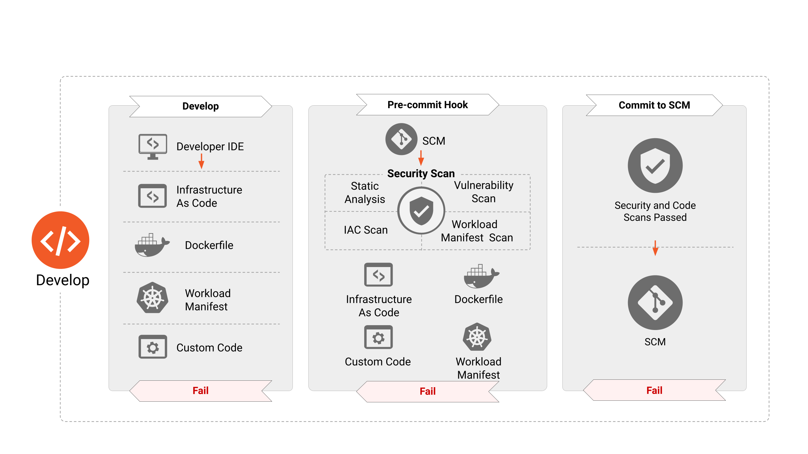
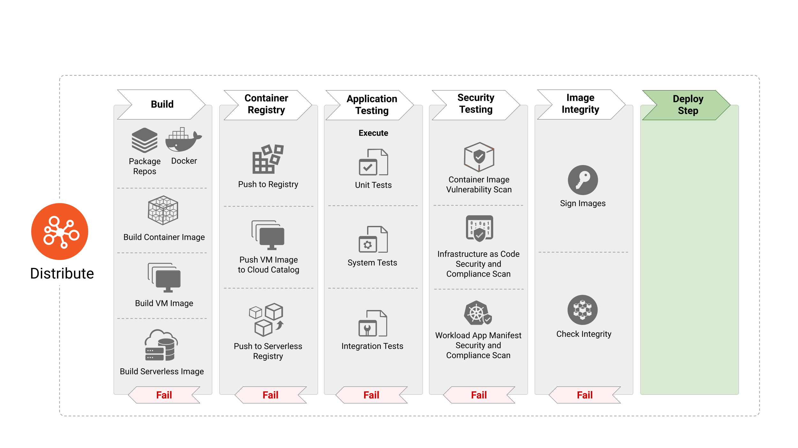
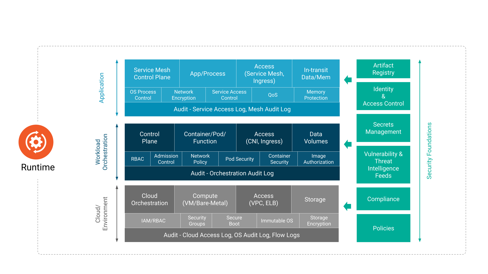

# CLOUD NATIVE SECURITY WHITEPAPER | Version 2 - Italian Issue
<!-- markdownlint-disable MD001 MD009 MD010 MD012 MD013 MD022 MD024 MD026 MD030 MD033 MD034 MD036 MD037 MD041 MD045 -->
<!-- cspell:disable -->

**Original Version in English**: 2.0 **Created**: 12 Jan 2022 **Status**: WIP | In Review | **Approved**

**Last Reviewed**: 16 May 2022, **PDF Published**: 17 May 2022 **Release Version**: 2.0

**Final PDF Approvers** [X] @TheFoxAtWork [X] @justincormack

**Version 2 (May 2022)**

- **Contributors**: Brandon Krieger, Cole Kennedy (TestifySec), Fatih Değirmenci (Ericsson Software Technology),Frederick Kautz , Joel Bork, Marina Moore (NYU), mateuszpruchniak@gmail.com, Pushkar JoglekarVMware),
  raja.faisal@gmail.com, Savitha Raghunathan (Red Hat), Sayantani Saha(Independent)

- **Reviewers**: Jon Zeolla, @nyrahul (Accuknox), Ragashree Shekar, Steven Hadfield, Kapil Bareja, Malini Bhandaru,Mikko Ylinen, Jonah Kowall (@jkowall), Kuang Dahu,Ariel Shuper, Eric Li (AlibabaCloud), Tanner Randolph (AppliedSystems), Mark Dalton Gray (Microsoft), Ciara Carey, Brandon Lum (TAG Security Chair), Emily Fox (TOC Liaison) and Justin Cormack (TOC liaison).

**Version 2 in Italian (December 2022)**

- **Translators and reviewers**: Paolo Mainardi (SparkFabrik, TAG Security), Daniele Monti (SparkFabrik), Andrea Panisson (SparkFabrik), Giuseppe Arancio (SparkFabrik), Filippo Merante Caparrotta (SparkFabrik), Marcello Testi (SparkFabrik, Cartografos), Annalisa Gennaro (SparkFabrik, Glossary, Cartografos, KCD), Luca Bandini (SIGHUP), Matteo Bisi (SIGHUP), Edoardo Vacchieri (SIGHUP), Marco De Benedictis (ControlPlane)

<!-- cspell:enable -->

## Executive Summary

### Obiettivo

L'industria tecnologica si è spostata verso modelli di sviluppo e distribuzione Cloud Native e, contestualmente, l'ecosistema di tecnologie, prodotti, standard e soluzioni di questa natura si sta espandendo rapidamente, sfidando i decisori a mantenere il passo sui progetti più complessi. In questo scenario tanto dinamico, il ruolo del CISO (Chief Information Security Officer) in particolare, ha la responsabilità in continua evoluzione di tenere le luci puntate sulla value proposition del business. Nel frattempo, anche i modelli Cloud Native hanno incoraggiato i cambiamenti nel consumo e nell'adozione di workflow moderni che spingano verso l'integrazione delle pratiche di sicurezza.

### Analisi del problema

I problemi di sicurezza all'interno di questo panorama sono complessi a causa dell'attenzione esplicita posta allo sviluppo e ad una distribuzione sempre più rapidi. Ad esempio, la dipendenza da identificatori statici come gli indirizzi IP, di un modello di sicurezza tradizionalmente basato sul perimetro, è impraticabile. Questa complessità richiede un cambio di paradigma per proteggere le applicazioni, che si realizza migrando da un approccio di sicurezza strettamente statico verso uno definito da workloads dinamici, identificati in base ad attributi e metadati, come ad esempio _labels_ e _tags_. Questo approccio identifica e protegge i workloads delle applicazioni Cloud Native, adattandosi al contempo al flusso costante.

Questi cambiamenti di paradigma richiedono l'adozione di una maggiore automazione dei controlli di sicurezza nel ciclo di vita dell'applicazione, e la messa in sicurezza attraverso architetture progettuali, quali il modello Zero Trust.
I compromessi per un'implementazione sicura continuano a coinvolgere molteplici attori all'interno di un'organizzazione e hanno un impatto significativo sulla produttività di sviluppatori e operatori che perseguono obiettivi di business. Le applicazioni Cloud Native richiedono ancora operazioni durante lo sviluppo, la distribuzione, il deployment e a runtime, ma il paradigma impone nuovi meccanismi di sicurezza attraverso cui raggiungere questi obiettivi. Lo sviluppo di applicazioni Cloud Native può essere modellato in fasi distinte che costituiscono il ciclo di vita dell'applicazione: "Sviluppo", "Distribuzione", "Deployment" e "Runtime". La sicurezza Cloud Native contrasta con gli approcci di sicurezza tradizionali per il fatto che offre l'enorme opportunità di poterla letteralmente iniettare in ognuna di queste fasi distinte, invece di relegarla alla fine del ciclo di vita, con interventi puntuali gestiti separatamente. L’apprendimento continuo di questi concetti, strumenti e processi è cruciale per l'adozione e l'applicazione di un approccio alla sicurezza a lungo termine.

### Fasi del ciclo di vita

#### Sviluppo

Gli strumenti Cloud Native sono pensati per introdurre la sicurezza già nelle prime fasi del ciclo di vita dell'applicazione. I test di sicurezza devono identificare quanto prima nel flusso, eventuali mancanze di conformità e/o configurazioni errate al fine di attuare tempestivi e rapidi processi correttivi, nell’ottica del costante miglioramento. Questo approccio consente agli errori di sicurezza di seguire workflow simili a quelli creati per altri processi correttivi all’interno della pipeline (ad es. correzioni di bug o errori di integrazione continua), che richiedono una risoluzione prima di passare alla fase successiva. Il moderno ciclo di vita della sicurezza in un contesto simile ruota attorno allo sviluppo di codice che aderisca ai modelli di progettazione (_design patterns_) consigliati ([12-factor principles](https://12factor.net), ad esempio) e garantisca l’integrità dell'ambiente di sviluppo.

#### Distribuzione

La sicurezza della supply chain del software è particolarmente critica nei modelli che consentono iterazioni sempre più rapide. I cicli di vita delle applicazioni Cloud Native devono includere metodi per verificare non solo l'integrità del workload stesso, ma anche del processo per la sua creazione e funzionamento. Questa sfida è amplificata dall’uso necessario, funzionale e coerente di software open source e runtime di terze parti, inclusi i livelli delle dipendenze a monte. Artefatti, come container images, presenti nella pipeline del ciclo di vita richiedono una scansione automatizzata continua e aggiornamenti per garantire la sicurezza da vulnerabilità, malware, pratiche di sviluppo non sicure e altri potenziali rischi. Dopo aver completato questi controlli, è importante firmare crittograficamente gli artefatti per garantirne l'integrità e imporre il non-ripudio. Degni di nota per una distribuzione sicura sono anche la creazione di binari immutabili e URL immutabili per le immagini.

#### Deployment

La sicurezza integrata lungo le fasi di sviluppo e distribuzione permette la validazione continua e in tempo reale degli attributi del workload.
Ad esempio la verifica degli artefatti firmati, il rispetto delle policy di sicurezza della container image e del runtime, la convalida tramite policy di binary authorization negli ambienti di staging e di produzione.
I controlli nella fase di deployment rappresentano l'ultima possibilità di convalidare, correggere e applicare queste verifiche, prima che il workload inizi a erogare il servizio per cui è stato concepito.
Funzionalità di osservabilità sicura del workload, implementate accanto al workload stesso, consentono di monitorare i log e le metriche disponibili con un elevato livello di fiducia, integrando la sicurezza.

#### Runtime

L'ambiente di runtime Cloud Native può essere esso stesso suddiviso in livelli di componenti correlati con distinti problemi di sicurezza[^1], ad es. hardware, provider, sistema operativo, rete, storage, container image runtime, orchestrazione. Il container runtime è costituito da diverse implementazioni per vari livelli di isolamento, ad es. kernel condiviso, micro-vm sandbox e trusted execution environment sandbox (sandbox dell'ambiente di esecuzione affidabile). È fondamentale scegliere un runtime che soddisfi i requisiti di sicurezza previsti. Ad esempio, per un workload inaffidabile in esecuzione in un ambiente multi-tenant, è possibile prendere in considerazione una sandbox basata su macchine virtuali. Per il trattamento di dati finanziari sensibili, potrebbe valere la pena considerare un ambiente di esecuzione affidabile (hardware dedicato alla crittografia per processo o per macchina virtuale) così come i Confidential Containers. All'interno del tipico ambiente di runtime Cloud Native, le applicazioni sono spesso composte da diversi microservizi indipendenti e dedicati a specifici scopi, che comunicano tra loro tramite il service layer reso possibile dall’orchestrazione dei container. Le best practice a protezione di questa architettura di componenti correlati garantiscono che solo i processi approvati operino all'interno di un _namespace_ del container, impediscono e alla peggio, allertano in caso di tentativi di accesso non autorizzato alle risorse, monitorando il traffico di rete, per rilevare l'attività di intrusi ostili. La Service Mesh è un'altra astrazione che fornisce funzionalità consolidate e complementari per servizi orchestrati, senza imporre modifiche al software del workload (ad es. logging del traffico API, crittografia del livello di trasporto, tagging dell’osservabilità, autenticazione e autorizzazione).

#### Raccomandazioni

La sicurezza Cloud Native cerca di garantire le stesse, se non superiori, condizioni di diligenza, integrità, affidabilità e prevenzione delle minacce dei modelli di sicurezza tradizionali, integrando al contempo i concetti moderni di volatilità, distribuzione e immutabilità. In questi ambienti in rapida evoluzione e soggetti ad altrettanto rapide iterazioni, è necessaria un'automazione in linea con la pipeline di sviluppo per ottenere risultati sicuri. Le organizzazioni dovrebbero adottare rapidamente questi concetti, per supportare la sicurezza orientata al valore durante la loro transizione al Cloud Native. Integrando la sicurezza il prima possibile durante tutto il ciclo di vita dello sviluppo, o anche prima con la formazione interattiva degli sviluppatori, le organizzazioni potrebbero attivare un approccio di sicurezza preventiva piuttosto che di sicurezza reattiva (vedi anche "[9 Box of Controls](https://blogs.blackberry.com/en/2016/03/the-9-box-of-controls)"). Si consiglia vivamente alle organizzazioni di valutare lo stack di sicurezza rispetto ai framework di attacco pertinenti[^2]per chiarire quali minacce siano coperte. Inoltre, le organizzazioni, devono adottare approcci e metodologie che permettano un _shift left[^3]_ della sicurezza, che abilitino DevOps e siano sufficientemente flessibili per lavorare con i futuri progressi tecnologici.

### Conclusione

La sicurezza Cloud Native, se affrontata strategicamente, può fornire disponibilità elevata, affidabilità, resilienza e ridondanza su larga scala per garantire a clienti e sviluppatori accesso sicuro alle risorse richieste, con la rapidità attesa. La sicurezza stessa rimane un campo interdisciplinare che non può essere isolato dal ciclo di vita dello sviluppo o essere trattato come un dominio puramente tecnico. Sviluppatori, operatori e personale di sicurezza devono collaborare, scambiare informazioni, e contribuire per far avanzare il campo specifico e la relativa industria. Come con qualsiasi innovazione tecnica, le persone che intraprendono questo viaggio guidate dalla loro passione sono quelle che rendono realmente possibili la community e la sicurezza Cloud Native.

## Introduzione

Questo documento intende fornire alle organizzazioni e alla loro leadership tecnica una chiara comprensione della sicurezza Cloud Native, la sua integrazione nei processi dei cicli di vita del software e considerazioni per determinarne l'implementazione più appropriata. La sicurezza Cloud Native si pone molteplici obiettivi ed impone molti vincoli, interessando diverse aree di competenza ed esperienza. Sostanzialmente tutte le operazioni iniziali si sovrappongono al dominio della sicurezza, dalla gestione dell'identità, alle soluzioni di storage. Tuttavia, la sicurezza Cloud Native copre molte più aree di queste; è anche un tema sociale, interpersonale, che incorpora individui, team e organizzazioni. Comprende meccanismi, processi e intenti attraverso i quali esseri umani e sistemi interagiscono e modificano applicazioni e tecnologie Cloud Native.

### A chi è rivolto il paper

Il nostro pubblico di riferimento è rappresentato da Chief (Information) Security Officer (CISO) o Chief Technology Officer (CTO) di un'impresa privata, agenzia governativa o organizzazione no-profit che desideri fornire un ecosistema tecnologico Cloud Native sicuro.

Ulteriori stakeholder organizzativi possono includere manager di Progetto, Prodotto, Program manager e Architetti responsabili della progettazione e dell'implementazione di prodotti e servizi Cloud Native sicuri. A parte questo, chiunque nutra un vivo interesse per la sicurezza Cloud Native può trovare il presente documento di qualche interesse o utilità.

### Obiettivi del Cloud Native

L’architettura cloud native è un insieme di modelli e pratiche che forniscono alle organizzazioni un astrazione architetturale, consistente e sostenibile, capace di funzionare su più instanze cloud e per rendere lo stack applicativo agnostico. L'adozione di e l'innovazione derivante da container e architetture a microservizi, hanno portato con sé una buona dose di sfide. I leader della sicurezza hanno il compito di proteggere le risorse, siano esse umane[^4] o meno, adottando pratiche per prevenire, rilevare e rispondere alle minacce informatiche, rispettando i severi requisiti di conformità.
Storicamente, una percezione diffusa è che le implementazioni di controlli e policy di sicurezza intralcino la velocità e l'agilità dei team DevOps. Pertanto, i responsabili della sicurezza devono prevedere un’integrazione più rigorosa e una comprensione bidirezionale, proprio potenziando i team DevOps, al fine di creare una ownership condivisa del rischio informatico.

Le organizzazioni devono essere sollecitate ad adottare modelli e architetture Cloud Native sicure durante il ciclo di vita dello sviluppo delle applicazioni moderne. La sinergia tra l’architettura degli aspetti di sicurezza e gli obiettivi della stessa a livello organizzativo, quali Zero Trust, Secure Software Supply Chain e DevSecOps, dovrebbe essere enfatizzata come priorità assoluta.

I concetti descritti in questo documento non sono progettati per favorire un servizio, una componente o un prodotto rispetto a un altro, e possono essere applicati indipendentemente dalle scelte dell’organizzazione.

Questo documento non intende fornire una formazione generale sui concetti di sicurezza o concetti di cloud computing. Neanche raccomandare tecnologie o strumenti specifici; tuttavia, può citarne alcuni esempi.

Al di là delle raccomandazioni in questo documento, il trattamento della sicurezza dei dati, relativo alla loro protezione e ai principi normativi sulla privacy, ad es. GDPR o PCI DSS, potrebbe richiedere ulteriori approfondimenti specifici. Si raccomanda che i lettori consultino risorse indipendenti, adeguate a tali controlli tecnici e alle questioni riguardanti il rischio di conformità.

### Presupposti

Tutti i termini, i concetti e i meccanismi utilizzati si basano sul [Lessico della Sicurezza Cloud Native](https://github.com/cncf/tag-security/blob/main/security-lexicon/cloud-native-security-lexicon.md) e sul [Glossario Cloud Native](https://glossary.cncf.io/). Questo documento non cerca di cambiare queste definizioni né di ampliarle.

Man mano che l'adozione del Cloud Native e le moderne metodologie di sviluppo software si evolveranno, lo faranno anche le tecnologie che ne compongono un stack efficace. Le rappresentazioni di questo stack mutevole sono incluse nell’onnicomprensivo [landscape della CNCF](https://landscape.cncf.io/).

## Cloud Native Layers

_Immagine 1_

Uno stack Cloud Native è composto da fondamenta, dal ciclo di vita dell'applicazione e dall’ambiente di runtime, e viene adattato a seconda del diverso modello di deployment: IaaS, PaaS, CaaS e FaaS. Ogni modello di distribuzione fornisce astrazioni aggiuntive che facilitano la gestione e il funzionamento di ambienti Cloud Native. Poiché alcuni di questi modelli sono ben noti e utilizzati da anni, ci concentreremo sui modelli esclusivamente Cloud Native.

Il modello Containers-as-a-Service (CaaS) consente agli utenti di orchestrare e gestire container, applicazioni e cluster sfruttando una piattaforma di virtualizzazione basata su container, in combinazione con una interfaccia di programmazione (API) o un'interfaccia di gestione web. CaaS aiuta gli utenti a costruire applicazioni containerizzate scalabili con criteri di sicurezza integrati come codice, eseguiti su cloud privato o pubblico o in data center on-premise. Insieme alla build, all’orchestrazione di microservizi e ai deployments indipendenti dalla piattaforma, supporta le aziende nella creazione e nel rilascio di software più rapidamente e consente la portabilità tra ambienti ibridi e multi-cloud, riducendo così i costi dell'infrastruttura e delle operations. Il modello CaaS consente di risparmiare sui costi, poiché aiuta le aziende a pagare solo per le risorse che desiderano e utilizzano. I container sono la risorsa su cui si fonda il modello CaaS, tanto quanto le macchine virtuali (VM) e gli host bare metal lo sono per il modello IaaS.

Functions-as-a-Service (FaaS) è ​​un altro modello di distribuzione Cloud Native, un servizio cloud che consente agli utenti di eseguire codice in risposta agli eventi, senza la complessa infrastruttura tipicamente associata alla costruzione e al lancio di microservizi. L'hosting di un'applicazione software nel cloud di solito richiede il provisioning e la gestione di un ambiente virtuale, comprensivo del sistema operativo e delle componenti web, ecc...
Con FaaS, l'hardware fisico, il sistema operativo della virtual machine, e la gestione del software del server web, sono tutti gestiti automaticamente dal fornitore di servizi cloud. Questo consente agli utenti di concentrarsi sulle singole funzioni nel codice dei microservizi, pagando solo per le risorse che vengono utilizzate e sfruttando l'elasticità fornita dal cloud.

### Ciclo di vita

Il _ciclo di vita_ in un contesto Cloud Native coinvolge la tecnologia, le pratiche e i processi che consentono l'esecuzione nativa in ambienti cloud di workloads resilienti, gestibili e osservabili. Come illustrato nella Immagine 1, il ciclo di vita è composto da quattro fasi continue; Sviluppo, Distribuzione, Deployment e Runtime. Ogni fase estende e amplifica le precedenti consentendo e supportando l’esecuzione in sicurezza di workload.

Le prossime sezioni forniscono un'analisi dettagliata delle implicazioni, degli strumenti, dei meccanismi, e delle best practice utilizzati per integrare la sicurezza durante tutto il ciclo di vita dell'applicazione.

### Sviluppo

_Immagine 2_

La sicurezza per le applicazioni Cloud Native deve essere perseguita lungo tutto il ciclo di vita di un'applicazione. Lo "Sviluppo" è la prima delle fasi di questo ciclo, risultante nella creazione degli artefatti, come Infrastructure as Code, container e _application manifest_, e così via, che verranno utilizzati per distribuire e configurare le applicazioni Cloud Native. Di conseguenza, questi artefatti hanno dimostrato di essere la fonte di numerosi vettori di attacco che possono essere sfruttati nel runtime. Le prossime sezioni sono dedicate ai vari strumenti, processi e controlli di sicurezza che è necessario prevedere in questa fase per ridurre drasticamente la superficie di attacco delle applicazioni eseguite.

#### Controlli di sicurezza in fase di sviluppo

Il rafforzamento della sicurezza durante la fase di sviluppo costituisce un componente critico per la distribuzione delle applicazioni. Ciò significa che i requisiti di sicurezza devono essere introdotti sin da subito in fase di sviluppo e devono essere trattati alla stessa stregua di qualsiasi altro requisito di progettazione. Questi ultimi sono in genere basati su bisogni di business relativi a rischio e conformità, e possono essere il risultato di un esercizio di [modellazione delle minacce](https://docs.google.com/document/d/1fftLBt3XjDzyYQisEKH3TZXL1QnT_cHIbBnFtW98UOs/edit#heading=h.l3poic1h7k63). Affrontare queste esigenze nelle prime fasi evita di eseguire nuovamente il lavoro più avanti nel ciclo di vita, un'eventualità che altrimenti rallenterebbe la pipeline DevOps, aumentando i costi complessivi[^6]. I team DevOps devono anche fare leva su strumenti appositamente creati per identificare le misconfigurazioni e le vulnerabilità della sicurezza prima che un’applicazione venga distribuita. Altrettanto importante è che questi strumenti si integrino perfettamente quelli esistenti e familiari già in uso dai team DevOps perché la sicurezza non interferisca con l’agilità, bensì la completi. Per fare un esempio, gli strumenti devono eseguire la scansione dei templates di Infrastructure as Code così come degli _application manifests_ all'interno dell’IDE dello sviluppatore o quando viene effettuata una pull request. Devono fornire informazioni relative alla sicurezza che siano esaustive e contestualizzate, sulle quali lo sviluppatore del codice o del componente dell’applicazione possa intervenire rapidamente, facilmente e a monte della pipeline di sviluppo. L'adozione di questi passaggi garantisce l'assenza di vulnerabilità note o di configurazioni ad alto rischio. I componenti Cloud Native dovrebbero essere basati su API, consentendo a strumenti di debug complessi di interagire con i workload fondamentali che fanno affidamento sull'orchestratore (e.g Kubernetes Control Plane).

I team dovrebbero rendere disponibili ambienti di test, sviluppo e produzione dedicati ed isolati, rendendo possibili test non funzionali dei sistemi, applicazioni, container images di base e virtual-machine golden images (immagine di base o template per virtual-machine).

##### Sviluppo di Test

Sviluppatori, operatori e personale di sicurezza dovrebbero collaborare nel creare test per codice e infrastruttura, che siano business-critical, che abbiano un profilo di minaccia elevato, che siano soggetti a frequenti cambiamenti, o che abbiano/siano fonte storica di bug. La modellazione delle minacce può identificare porzioni di codice ad alto rischio e ad alto impatto che forniscano un elevato ritorno sull'investimento (ROI) nello sviluppo di test. I test possono includere la distribuzione, il sistema operativo, l’infrastruttura e la messa in sicurezza del database, test applicativi (test statici e dinamici del codice sorgente, come fuzzing, configurazione del container), test di integrazione o di sistema (accettazione di componenti applicativi e infrastrutturali e loro interazione) e smoke test (controlli post-distribuzione rispetto a un sistema attivo).

Gli autori dei test dovrebbero avere accesso ad ambienti di sviluppo e test completi che consentano loro di eseguire un rapido sviluppo dei test stessi, riducendo al contempo i tempi di feedback della Continuous Integration (CI). Dovrebbero essere create suite di test di sistema disponibili per l'esecuzione in locale da parte degli autori e all'interno di un ambiente di test condiviso.

##### Code Review

Modifiche minori ad un workload o all'infrastruttura in cui è stato implementato possono avere conseguenze di grande portata sulla sicurezza. Per mitigare il rischio di conseguenze indesiderate, i team sono incoraggiati a utilizzare il principio dei "quattro occhi" ([four eyes](https://www.unido.org/overview/member-states/change-management/faq/what-four-eyes-principle)) quando si esegue la revisione del codice, prima che le modifiche vengano integrate (_merge_) nella codebase (ad esempio, creando una pull request nel flusso di lavoro su git).

### Distribuzione

_Immagine 3_

La fase "Distribuzione" è responsabile dell'elaborazione delle definizioni e delle specifiche dell'immagine per produrre lo step successivo degli artefatti, come container images, VM images e altro. Nelle moderne pipeline di CI/CD, la fase "Distribuzione" consiste in test sistematici dell’applicazione per identificare bug e anomalie nel software. Nonostante ciò, l'adozione di pacchetti open source e riutilizzabili può comportare l’introduzione di vulnerabilità e malware nelle container images. È quindi indispensabile incorporare passaggi incentrati sulla sicurezza come la scansione delle immagini per tali vettori pericolosi, così come per convalidare l'integrità delle immagini allo scopo di proteggerle da manomissione. Inoltre, le organizzazioni potrebbero voler crittografare gli artefatti software nel caso in cui lo reputino necessario o desiderino renderli confidenziali.

Se gli artefatti software diventassero inaffidabili a causa di una compromissione o di un altro incidente, i team dovrebbero revocare le chiavi di firma per garantire il ripudio.

#### Build Pipeline

I server di Continuous Integration (CI) dovrebbero essere isolati e ristretti a progetti con un grado di sicurezza o sensibilità simile. Build infrastrutturali che richiedono elevati privilegi dovrebbero essere eseguiti su server CI dedicati separati. Le policy di build dovrebbero essere applicate all’interno delle pipeline CI da parte degli Admission Controller dell'orchestratore. Gli strumenti della supply chain possono raccogliere e firmare metadati della pipeline di build, in modo tale che nelle fasi successive si possano verificare le firme per convalidare che i passaggi preliminari siano stati rispettati. Il lettore dovrebbe garantire che l'infrastruttura CI e di Continuous Delivery (CD) siano le più sicure possibile. Ad esempio, gli aggiornamenti di sicurezza dovrebbero avere priorità di installazione e le chiavi crittografiche dovrebbero essere protette dall'esfiltrazione tramite l'uso di HSM o di Credential Manager.

#### Image Scanning

La scansione delle immagini del container è uno dei metodi più comuni per proteggere applicazioni containerizzate durante tutto il ciclo di vita. È fondamentale eseguire la scansione nella pipeline di CI prima di implementare l'immagine in produzione. Inoltre, la scansione continua delle container images in esecuzione è altrettanto importante per identificare nuove vulnerabilità. L'integrazione di questa funzionalità garantisce che sviluppatori, operatori e professionisti della sicurezza dispongano di informazioni dettagliate su tutte le vulnerabilità note e di dettagli come la gravità, il punteggio del Common Vulnerability Scoring System (CVSS) e la disponibilità di mitigazione/correzioni. Il confronto delle scansioni di vulnerabilità delle container images con le regole di conformità della pipeline garantisce che solo le applicazioni sufficientemente patchate vengano implementate in produzione, riducendo la potenziale superficie di attacco. La scansione delle immagini dei container aiuta anche a identificare la presenza di malware all'interno dei pacchetti software open source o degli strati più bassi delle container images importate da repository open source. Mentre la scansione delle immagini del container può fornire ai team evidenza di vulnerabilità o malware, non risolve le vulnerabilità né previene il malware. Le organizzazioni devono garantire che i risultati della scansione del container vengano prese in carico e che le regole di conformità siano applicate.

#### Image hardening

Le container images devono includere un rafforzamento della sicurezza che tenga conto delle minacce da mitigare pur consentendo alcune configurazioni just-in-time per la fase runtime e facilitare l'integrazione con l'ecosistema più ampio.

Relativamente agli obiettivi per garantire sicurezza, dovrebbero essere affrontate le seguenti domande:

• Limitare l'ambiente di esecuzione a un utente specifico?

• Limitare l'accesso alle risorse?

• Restrizioni a livello di kernel sull'esecuzione dei processi?

#### Container Application Manifest Scanning

I _manifests_ dell'applicazione descrivono le configurazioni richieste per l’implementazione di applicazioni containerizzate. È fondamentale scansionare i _manifest_ dell'applicazione nelle pipeline CI/CD, per identificare le configurazioni che potrebbero potenzialmente risultare in un approccio al deploy non sicuro.

#### Container Application Manifest Hardening

Per quanto riguarda l’immagine del container, è possibile pensare che l’hardening dei _manifest_ dell'applicazione possa essere implementato sia in fase di compilazione sia in fase di esecuzione.

Per quanto riguarda gli obiettivi di sicurezza, la domanda principale a cui rispondere è: a quali vincoli minimi dovrebbe essere conforme l'ecosistema di esecuzione a runtime?

#### Test

Le applicazioni Cloud Native devono essere soggette alla stessa suite e standard dei test sulla qualità delle applicazioni tradizionali. Questi includono i concetti di codice pulito, aderenza alla Test Pyramid, scansione e linting attraverso test di sicurezza delle applicazioni statiche (SAST), analisi e scansione delle dipendenze, test di sicurezza delle applicazioni dinamiche (DAST), monitoring e diagnosi dell’applicazione e infrastruttura completa con test a disposizione degli sviluppatori per i workflow locali. I risultati dei test automatizzati dovrebbero essere mappati relativamente ai requisiti per la doppia attestazione (sviluppatore e strumento) per garantirne la sicurezza in tempo reale ai team di responsabili.

Una volta che è stata identificata una configurazione errata lato sicurezza (ad es. un firewall o una regola di routing errati), se l'analisi della causa principale determina l’eventualità che si reiteri, gli sviluppatori hanno il compito di scrivere un test automatico per prevenire la regressione del problema. Al fallimento del test, i team riceveranno un feedback per correggere il bug, e con il merge successivo, il test passerà (supponendo che venga, appunto, corretto). Così facendo ci si difende dalla regressione dovuta a modifiche future a tale codice.

Il test unitario dell'infrastruttura è un controllo preventivo e si rivolge a entità e input definiti nella configurazione della Infrastructure as Code (IaC). I test di sicurezza dell’infrastruttura buildata sono un controllo investigativo e combinano sicurezza, regressioni storiche, e rilevamento di configurazioni impreviste (regole del firewall aperte al pubblico, policy IAM (Identity & Access Management) con privilegi non stringenti, endpoints non autenticati, etc...).

Il rafforzamento dell'infrastruttura e dei workloads dovrebbe essere supportato da una suite completa di test che lo consentano in maniera incrementale lungo la maturazione del sistema. I test per verificare tale rafforzamento dovrebbero essere eseguiti durante la fase di build, ma anche durante la fase di deployment per valutare eventuali modifiche o regressioni durante tutto il ciclo di vita.

#### Analisi statica e test di sicurezza

L'analisi statica di IaC, _manifests_ dell'applicazione e codice software forniscono linting, identificazione di misconfigurazioni e vulnerabilità del componente specifico, ma non include il contesto dei componenti circostanti nell'analisi. È importante notare che l'analisi individuale è cruciale, ma non dovrebbe essere l'unica forma. Il codice IaC dovrebbe essere sottoposto ai controlli di policy nella pipeline simili a quelli delle applicazioni.

IaC è un modo sempre più popole per le organizzazioni di distribuire infrastrutture cloud e container. Configurazioni non sicure nei modelli IaC porteranno naturalmente a lacune di sicurezza nell'infrastruttura deployata. Questi modelli dovrebbero quindi essere scansionati alla ricerca di elementi che compromettano la sicurezza, prima di distribuire artefatti applicativi e infrastrutturali. Errori di configurazione chiave da tenere sotto controllo sono:

• Vulnerabilità contenute nelle immagini specificate nei _manifests_ dell'applicazione

• Impostazioni che non rispettano il principio del minimo privilegio, come container che possono aumentare i privilegi o regole firewall eccessivamente permissive

• Identificazione dei contesti di sicurezza e delle chiamate di sistema che possono comprometterlo

• Impostazioni dei limiti delle risorse

#### Analisi Dinamica

L'analisi dinamica dell'infrastruttura deployata può includere il rilevamento del controllo degli accessi basato sui ruoli (Role-based Access Control (RBAC) e la deriva della configurazione IAM, convalidando la superficie di attacco di rete prevista e garantire che un SOC possa rilevare comportamenti insoliti in ambienti di test dedicati alla configurazione degli alert in produzione. L'analisi dinamica è considerata parte delle attività di testing, ma viene prevista in un ambiente non produttivo.

#### Test di Sicurezza

I test di sicurezza automatizzati delle applicazioni e dell'infrastruttura dovrebbero essere parte integrante delle attività del team di sicurezza. Le suite di test dovrebbero essere continuamente aggiornate per replicare le minacce in linea con il modello di minaccia dell'organizzazione, possono anche essere riutilizzate per i test di regressione della sicurezza, man mano che il sistema si evolve. I test di sicurezza automatizzati aumentano la sicurezza e la velocità di rilascio rimuovendo i cancelli di sicurezza manuali, come validazione e implementazione del controllo manuale in un unico checkpoint, che è dispendioso in termini di tempo e inadeguato. I test di sicurezza automatizzati dimostrano anche l'efficacia del controllo su richiesta attraverso l’esplicito tentativo di riprodurre le minacce, migliorando così la sicurezza del sistema e l'aderenza a eventuali requisiti di conformità incorporati in tempo reale.

### Artefatti e immagini

#### Registry staging

A causa dell'uso di componenti open source che derivano spesso da fonti pubbliche, le organizzazioni dovrebbero creare diversi livelli di registri nelle loro pipeline.

Solo gli sviluppatori autorizzati dovrebbero essere in grado di scaricare le immagini di base dai registri pubblici e salvarle in un registro interno per un ampio utilizzo all'interno dell'organizzazione.

Si consiglia inoltre l’utilizzo di registri privati ​​separati per mantenere gli artefatti di sviluppo suddivisi per team o gruppo, e quindi un registro di staging o di pre-produzione per le immagini pronte per la produzione. Ciò consente un controllo più stretto sulla provenienza e la sicurezza dei componenti open source, consentendo al contempo differenti tipi di test nelle varie fasi della catena di CI/CD.

Per ciascun registro utilizzato, è opportuno implementare il controllo degli accessi attraverso un modello di autenticazione e di autorizzazione dedicato. Si consiglia di utilizzare un’autenticazione di tipo mutual TLS per tutte le connessioni al registro (insieme a tutte le altre interazioni all'interno dell'architettura).

#### Firma, affidabilità e integrità

La firma digitale del contenuto dell'immagine in fase di build e la convalida dei dati firmati prima dell'uso, proteggono i dati dell'immagine dalla manomissione tra la creazione e l’esecuzione, garantendo così l'integrità e la provenienza di un artefatto.
La conferma inizia con un processo che indica che un artefatto è stato controllato e approvato. La conferma dell’affidabilità include anche la verifica che l'artefatto abbia una firma valida. Nel caso più semplice, ogni artefatto può essere firmato da un solo firmatario per indicare un unico processo di verifica e convalida che l'artefatto ha attraversato. Tuttavia, nella maggior parte dei casi la supply chain del software è più complessa e la creazione di un singolo artefatto si basa su più fasi di convalida, dipendendo così da un conglomerato costituito dall’affidabilità delle diverse entità certificatrici.

Esempi di questo sono:

- Firma dell'immagine del container: il processo di firma del _manifest_ di una container image.

- Firma del file di configurazione: firma di un file di configurazione, quali i file di configurazione dell'applicazione.

- Firma del pacchetto: firma di un pacchetto di artefatti, come i pacchetti dell'applicazione.

Per gli artefatti software generici come le librerie o gli artefatti OCI, la firma ne indica l’approvazione all’utilizzo da parte dell’organizzazione. La verifica di questi artefatti è cruciale per garantire che solo quelli autorizzati siano ammessi. Si raccomanda vivamente che i repository prevedano l’autenticazione reciproca al fine di introdurre modifiche alle immagini nei registri o per eseguire il commit del codice nei repository stessi.

#### Crittografia

La Container Image Encryption cripta le immagini (container images) in modo che il suo contenuto sia confidenziale. I contenuti dell'immagine sono crittografati per garantire che rimangano riservati per la distribuzione a partire dalla creazione fino all’esecuzione. Nel caso di una distribuzione compromessa, il contenuto del registro delle immagini rimane secretato, il che può essere d'aiuto in situazioni quali la protezione di segreti commerciali o altro materiale riservato.

Un altro uso comune della Container Image Encryption consiste nell’imporre accesso su autorizzazione all’immagine del container. Quando la crittografia dell'immagine è abbinata alla gestione delle chiavi, all’attestazione e/o autorizzazione dell'ambiente di runtime e alla distribuzione delle credenziali, è possibile richiedere che una immagine possa essere eseguita solo su determinate piattaforme.

L'autorizzazione per le immagini è utile per casi in cui si richiede la conformità, quali il geo-fencing o il controllo delle esportazioni e la gestione dei diritti digitali sui supporti.

### Deploy

_Immagine 4_

La fase di Deploy (Distribuzione) è incaricata dell'integrazione di una sequenza di controlli "pre-flight" al fine di garantire che le applicazioni che verranno distribuite nell'ambiente di esecuzione siano in linea e soddisfino le politiche di sicurezza e conformità dell’organizzazione.

#### Pre-Flight Deployment Checks

Prima di distribuire l'immagine di un container, le organizzazioni devono verificare esistenza, applicabilità e stato corrente di:

• Firma e integrità dell'immagine

• Politiche di runtime dell’immagine (ad es. assenza di malware o vulnerabilità critiche)

• Politiche di runtime del container (ad es. assenza di privilegi eccessivi)

• Controllo di vulnerabilità e conformità dell'host

• Politiche di sicurezza dei workloads, delle applicazioni e della rete

#### Osservabilità e metriche

L'introduzione di osservabilità e metriche nelle architetture Cloud Native offre indicazioni sulla sicurezza, consentendo agli stakeholder appropriati di risolvere e mitigare le anomalie che compaiono nella reportistica; gli strumenti in quest'area possono aiutare a raccogliere e visualizzare queste informazioni.

Grazie all’uso di analisi comportamentali ed euristiche, i team possono individuare e segnalare agli stakeholder appropriati i valori anomali, gli eventi sospetti e le chiamate inspiegabili. L’utilizzo di tecniche avanzate di machine learning e modelli statistici che rientrano nell’ambito dell’intelligenza artificiale è incoraggiato come supporto allo sviluppo dell'analisi comportamentale ed euristica.

#### Risposta e mitigazione degli incidenti

Un'applicazione dovrebbe fornire log relativi all’autenticazione, all’autorizzazione, alle azioni eseguite e ai fallimenti. Lo sviluppatore dovrebbe includere questa funzionalità nelle fasi di pianificazione e progettazione. Questi elementi forniscono un percorso di verifica da seguire quando si sta svolgendo un'indagine ed è necessario stabilire la causa principale.

Le competenze forensi sono parte integrante di qualsiasi attività di risposta e mitigazione degli incidenti. Forniscono prove per determinare la causa principale di un incidente e offrono un riscontro per la messa in atto di eventuali misure di mitigazione. La natura effimera dell’ambiente dei container richiede un set di strumenti più agili per l'acquisizione e l'analisi di qualsiasi prova. Integrare delle competenze forensi in un piano e in procedure di risposta agli incidenti fornisce i mezzi per acquisire ed elaborare le prove, ridurre il tempo per determinare la causa principale e minimizzare l'esposizione a una compromissione.

### Ambiente di runtime

_Immagine 5_

La fase di runtime (esecuzione) comprende tre aree critiche: calcolo, accesso e archiviazione.

Sebbene l'ambiente di runtime dipenda dal corretto completamento delle fasi di sviluppo, distribuzione e deploy, la sicurezza del runtime dipende dall’efficacia delle pratiche di sicurezza delle fasi precedenti. I paragrafi seguenti dettagliano i requisiti di sicurezza e le implicazioni per ciascuno di questi componenti critici.

#### Calcolo

Il Cloud Native Computing è estremamente complesso e in continua evoluzione. Senza i componenti chiave che permettono l'utilizzo del calcolo, le organizzazioni non possono assicurarsi che i workloads siano sicuri.

Considerando che i container forniscono una virtualizzazione basata su software per applicazioni multi-tenant su un host condiviso, è importante utilizzare un sistema operativo specifico per i container, ovvero un sistema operativo di sola lettura con i servizi non necessari disabilitati. Questo contribuisce a ridurre la superficie di attacco. Inoltre, fornisce isolamento e confinamento delle risorse, consentendo agli sviluppatori di eseguire applicazioni isolate su di un kernel host condiviso. Per favorire una difesa più robusta, si raccomanda di non permettere l'esecuzione di multipli workloads contenenti dati sensibili sullo stesso kernel del sistema operativo.

Affinché la sicurezza si estenda a tutti i livelli delle piattaforme e dei servizi container, è possibile utilizzare una root-of-trust (RoT) basata su di un TPM (Trusted Platform Module) hardware o su di un TPM virtuale. La catena di sicurezza basata sull’hardware può essere estesa al kernel del sistema operativo e ai suoi componenti per consentire la verifica crittografica dell’avvio protetto, delle immagini di sistema, del runtime e delle immagini del container, e così via.

Le Secure Enclave o enclavi protette (note anche come _Trusted Execution Environments_ o TEE) sono al centro del confidential computing. Le Secure Enclave sono un insieme di istruzioni relative alla sicurezza integrate nelle nuove CPU. Proteggono i dati in uso, perché l'enclave viene decifrata in tempo reale solo all'interno della CPU e quindi solo per il codice e i dati in esecuzione all'interno dell'enclave stessa. L'elaborazione confidenziale basata su TEE garantisce la sicurezza, l'integrità e la riservatezza dei dati. I dati crittografati e il codice nel TEE non sono disponibili per altre applicazioni, BIOS, sistemi operativi, kernel, amministratori, fornitori cloud e componenti hardware ad eccezione delle stesse CPU. L'elaborazione confidenziale basata su TEE collabora con i container sandbox al fine di isolare le applicazioni dannose e proteggere i dati sensibili.

I sistemi operativi forniscono componenti di base del sistema come le librerie di crittografia utilizzate per le connessioni remote e le funzioni del kernel che vengono utilizzate per l'avvio, la gestione dei processi, ecc. Questi componenti possono presentare vulnerabilità e, poiché forniscono la piattaforma di calcolo sottostante ai container, possono avere un impatto su tutti i container e sulle applicazioni che vengono eseguiti su questi host. Allo stesso modo, i container non correttamente configurati possono avere un impatto sulla sicurezza del kernel dell'host e quindi su tutti i servizi in esecuzione nei container che girano sulo stesso host.

#### Orchestrazione

Ogni orchestratore ha diversi componenti che sono separati in control plane (piano di controllo) e data plane (piano dati). Occasionalmente, è necessario disporre di un piano di gestione multi distribuzione di livello superiore, responsabile del mantenimento dello stato attraverso diversi piani di controllo che coesistono in modo autonomo l'uno dall'altro.

Qualsiasi sistema di orchestrazione presenta numerosi rischi che influiscono sia sulla sicurezza della distribuzione applicativa che sulla sicurezza in fase di esecuzione. L’accesso malevolo alle API di un orchestratore, l’accesso non autorizzato e le modifiche all'archivio chiave-valore, la dashboard dell'agente di orchestrazione che controlla i cluster, l’intercettazione del traffico del control plane, l'uso improprio delle API, l'intercettazione del traffico delle applicazioni e così via, sono tutte potenziali aree di minaccia. È importante utilizzare le best practice e rafforzare la configurazione di qualsiasi orchestratore per prevenire l'esposizione a queste minacce[^7]. È inoltre essenziale monitorare e rilevare qualsiasi modifica alle configurazioni iniziali apportate a runtime per garantire la continuità della sicurezza del cluster. Dovrebbero poi essere applicate ulteriori pratiche di sicurezza quali ridurre al minimo l'accesso come amministratore al control plane, la segregazione dei compiti e il principio del minimo privilegio.

##### Politiche di sicurezza

È essenziale considerare le caratteristiche di sicurezza e le varie opzioni di configurazione dell’orchestratore per controllare i privilegi di accesso che il runtime può utilizzare per avviare i container. L'uso di policy di alto livello e di meccanismi di governance possono imporre tali barriere di sicurezza.

##### Richieste di risorse e limiti

Un singolo workload che presenti un comportamento anomalo, intenzionalmente (ad esempio a seguito di un attacco fork bomb o di mining di criptovaluta) o involontariamente (ad esempio per la lettura di un file di grandi dimensioni in memoria senza la convalida dell'input, l’autoscaling orizzontale), può causare l'esaurimento delle risorse a livello di nodo e di cluster. L'applicazione a livello di singolo oggetto di politiche di gestione di richieste risorse e limiti tramite i cgroup, aiuta a prevenire tale scenario.

##### Analisi dell’audit log

L'analisi dell’audit log o registro di controllo è uno dei metodi più consolidati per identificare e correlare la compromissione, l'abuso o la configurazione errata del sistema. L’automazione continua dell’analisi e della correlazione dell’audit log è di fondamentale importanza per i team di sicurezza, dato che le architetture Cloud Native consentono di avere una configurazione ed un filtraggio più granulare sull’audit rispetto ai tradizionali sistemi legacy relativamente ai workloads. In aggiunta, l'interoperabilità dei log cloud native consente un filtraggio avanzato atto a prevenire sovraccarichi nell'elaborazione a valle. Come per l'analisi tradizionale dei log, l'aspetto critico è la generazione di eventi di audit attivabili che correlano/contestualizzano i dati dei registri in "informazioni" che possono guidare gli schemi decisionali e la risposta agli incidenti.

Le violazioni di conformità vengono rilevate in base a una serie di regole preconfigurate che filtrano le infrazioni alle politiche dell'organizzazione. Per avere la possibilità di controllare le azioni delle entità che stanno utilizzando il cluster, è di fondamentale importanza abilitare l’auditing delle API filtrato per una specifica serie di API Groups o Verbs che siano di interesse per il team di sicurezza o per gli amministratori del cluster.

L'inoltro immediato dei log a una posizione inaccessibile tramite credenziali a livello di cluster vanifica anche l’eventuale tentativo da parte di un aggressore di coprire le proprie tracce disabilitando i log o eliminando eventuali tracce dagli stessi. Questi sistemi di elaborazione degli avvisi devono essere periodicamente ottimizzati al fine di evitare falsi positivi che provocano un eccessivo carico di allarmi e lavoro evitabile, e falsi negativi che possono non essere stati rilevati dal sistma anche dopo un incidente di sicurezza.

##### Autenticazione del control plane e Root of Trust del certificato

Gli amministratori dell'orchestratore devono configurarne tutti i componenti del control plane per comunicare tramite l'autenticazione reciproca e la convalida del certificato, con un certificato a rotazione periodica, oltre a rafforzare la sicurezza del control plane stesso.

L'autorità di certificazione emittente (CA) può essere una CA predefinita o una CA esterna. L'utilizzo di una CA esterna può comportare una quantità di lavoro non banale nella manutenzione dell'infrastruttura dell'autorità di certificazione, quindi questa opzione dovrebbe essere selezionata con cautela. Particolare attenzione dovrebbe essere prestata dagli amministratori per proteggere la chiave privata della CA. Per ulteriori informazioni sull'estensione o sulla creazione dell'attendibilità, fare riferimento alla sezione “Gestione dell'identità e dell'accesso”.

##### Crittografia dei segreti

È possibile gestire i segreti in un ambiente di orchestrazione o distribuzione del container tramite l'uso di un gestore di segreti esterno o in modo nativo utilizzando i segreti dell'orchestratore. Quando si utilizza un archivio dei segreti nativo, è fondamentale tenere presente che sono disponibili diversi metodi di protezione:

Crittografia con un KMS esterno

• L'utilizzo di un KMS è un modo sicuro per proteggere i segreti nell'apposito archivio dell’orchestratore, dove la chiave di un KMS esterno cifra la chiave dei dati (DEK) usata per cifrare i segreti archiviati inattivi. Questo metodo ha un'opzione per memorizzare nella cache i DEK e ridurre la dipendenza dalla disponibilità del KMS esterno e accelerare la decrittografia dei segreti durante il tempo di creazione del workload.

Crittografia completamente gestita dall'orchestratore:

• Questa metodologia crittografa i segreti archiviati nell'orchestratore, ma è lo stesso orchestratore a gestire anche la chiave di crittografia (ovvero un file di configurazione dell’orchestratore).

Nessuna crittografia

• Ad esempio, con alcuni orchestratore, i segreti sono codificati in base64 e archiviati come testo non crittografato nello storage valori-chiave di default.

L'utilizzo di un gestore di segreti esterno può limitare i rischi derivanti dall'utilizzo di segreti non crittografati e semplificare la complessità della gestione delle chiavi. In genere gli strumenti vengono forniti come controller, driver o operatori che possono inserire segreti in fase di esecuzione e gestire le loro rotazioni in modo trasparente.

##### Runtime

L'ambiente di runtime di un container deve essere monitorato e protetto in termini di processo, file e rete. Solo le funzionalità e le chiamate di sistema sanzionate (ad es. filtri seccomp) dovrebbero poter essere eseguite o invocate in un container dal sistema operativo dell’host. In alcuni casi, vale la pena considerare l'utilizzo dei runtime sandboxed per consentire un isolamento più rigoroso dell'host. Le modifiche ai punti di montaggio e ai file critici devono essere monitorate e possibilmente evitate. La configurazione deve impedire modifiche a file binari, certificati e configurazioni di accesso remoto. La configurazione deve anche permettere l'accesso alla rete in ingresso (ingress) e in uscita (egress) dai container solo a ciò che è necessario al funzionamento. Inoltre, il traffico di rete verso domini dannosi dovrebbe essere rilevato e negato.

Al contrario, i workloads completi o parti del workload che elaborano i dati sensibili per la privacy in memoria durante il runtime possono essere eseguiti in ambienti di esecuzione fidato. Ciò consente di processare i dati del workload in modo riservato e protetto dalle minacce esterne.

##### Microservizi ed eliminazione della fiducia implicita

Il perimetro per le applicazioni containerizzate distribuite come microservizi è il microservizio stesso. Pertanto, è necessario definire criteri che limitino la comunicazione solo tra coppie di microservizi autorizzati. L'inclusione di zero-trust nell'architettura del microservizio riduce l’onda d’urto impedendo escalation tramite movimento laterale (_Lateral Movement_) se un microservizio è compromesso. Gli operatori dovrebbero assicurarsi di utilizzare funzionalità come le politiche di rete per garantire che la comunicazione di rete est-ovest all'interno della distribuzione del container sia limitata solo a ciò a cui è autorizzato l'accesso. È stato svolto un lavoro iniziale per fornire strategie per la sicurezza dei microservizi tramite NIST SP 800-204 e può fungere da guida per l'implementazione di architetture di microservizi sicure.

##### Attendibilità delle immagini e protezione dei contenuti

L'utilizzo di un \_policy agent \_per imporre o controllare l'utilizzo di immagini di container firmate consente alle organizzazioni di garantire la provenienza delle immagini per i workloads operativi. Inoltre, l'inclusione di container crittografati consente la protezione di fonti, metodi o dati sensibili che si trovano al suo interno.

##### Service Mesh

Una Service Mesh fornisce connettività tra i servizi e fornisce funzionalità aggiuntive come controllo del traffico, rilevamento dei servizi, bilanciamento del carico, resilienza, osservabilità, sicurezza e così via. La Service Mesh consente ai microservizi di utilizzare queste funzionalità senza doverle re-implementare consentendo quindi agli sviluppatori di concentrarsi sulla differenziazione della logica di business. Per garantire in modo efficace comunicazioni sicure tra i servizi negli ambienti Cloud Native, le organizzazioni dovrebbero implementare la service mash per eliminare la fiducia implicita all'interno e tra i workloads, grazie alla crittografia garantita sulla trasmissione dati. L'utilizzo di una Service Mesh risolve anche i problemi di indirizzamento in cui le identità non sono piu statiche e non possono esser mappate più in modo univoco tramite indirizzi IP; garantisce noltre, non solo isolamento e sicurezza a livello di servizio, ma anche capacità di resilienza a livello di rete in termini di tentativi, timeout e implementazione di varie funzionalità di interruzione. Le piattaforme di streaming possono trarre vantaggio da una Service Mesh ottenendo maggiore sicurezza utilizzando l'autorizzazione a livello di workload per impostare regole di accesso a topics o broker.

È importante notare che l'implementazione di una Service Mesh può aiutare a ridurre la superficie di attacco di una distribuzione Cloud Native e può fornire un framework base per la creazione di reti di applicazioni zero-trust.

##### Runtime Detection

Il monitoraggio dei workloads distribuiti dovrebbe fornire ai team la convalida che il vero stato dei processi in esecuzione sia lo stato previsto. Le organizzazioni non possono rinunciare a scansioni e monitoraggio regolari della sicurezza all'interno dei propri ambienti per non trasformare i propri workloads in una superfice di attacco incontrollata. L'utilizzo di componenti che rilevano, tracciano, aggregano e segnalano le chiamate di sistema e il traffico di rete da un container è imprescindibile nella ricerca di comportamenti imprevisti o dannosi.

Sebbene i test di regressione e i test di sicurezza possano aiutare a impedire che problemi noti e previsti si presentino negli ambienti di produzione, essi non rappresentano una garanzia suffficente.

I workloads devono essere scansionati dinamicamente per rilevare comportamenti dannosi o imprevisti per i quali non esiste ancora un'occorrenza nota. Eventi come un comando di sospensione esteso che esegue l'esfiltrazione dei dati da un archivio dopo che il workload è stato in esecuzione per un numero di giorni X non sono previsti nella maggior parte degli ambienti e pertanto non sono inclusi nei test di sicurezza. Anomalie legate alla presenza di attacchi trojan possono essere rilevabili solo avendo una baseline dati con cui confrontare il comportamento attuale. Questo aspetto viene rilevato usualmente solo durante approfondite analisi della scansione del monitoraggio della sicurezza.

I workloads inoltre, diventano vulnerabili quando vengono deployati o subito dopo. Le organizzazioni dovrebbero scansionare continuamente i propri ambienti per rilevare quali workloads possano essere più vulnerabili in quel momento. Comprendere la composizione o la distinta base del software per ciascun workload può aiutare le organizzazioni a identificare rapidamente dove si trovano le vulnerabilità. Ulteriori informazioni su tali vulnerabilità, come la maturità dell'exploit e il percorso vulnerabile in uso, sono fondamentali per determinare il rischio effettivo a cui sono sottoposti i workloads e possono aiutare a stabilire la priorità degli aggiornamenti per le applicazioni a rischio.

##### Funzioni

Le funzioni serverless sono soggette a vari attacchi e pertanto devono essere adeguatamente protette. I processi devono eseguire solo le funzioni esplicitamente definite in un elenco di autorizzazioni che inoltre non dovrebbero essere autorizzate a modificare i punti di montaggio critici del file system.

Le funzioni devono avere restrizioni che consentano solo l'accesso ai servizi autorizzati, tramite restrizioni di rete o privilegi minimi nei modelli di autorizzazione.

Inoltre, la connessione di rete in uscita deve essere monitorata dagli amministratori per rilevare e, ove possibile, impedire l'accesso a C&C (comando e controllo) e altri domini di rete dannosi. È inoltre necessario considerare l'ispezione della rete in ingresso per rilevare e rimuovere payload e comandi dannosi che possono essere utilizzati nell'esfiltrazione di dati. Ad esempio, tramite l’ispezione possono essere rilevati gli attacchi _SQL injection._

Le funzioni serverless presentano numerose potenziali minacce e i controlli disponibili per i tenant sono limitati. Fenomeni come "broken authenticaton" o integrazioni API insicure con i servizi dipendenti rappresentano solo alcuni di questi problemi. Una via potenziale per mitigarli o risolverli, potrebbe essere quello di fare eseguire tutte le funzioni serverless in ambienti segregati per tenant ed tipologia di esecuzione, tuttavia questo tipo di gestione può avere un impatto sulle performance complessive per via del limitato spazio di indrizzamento disponibile per questi ambienti isolati.

##### Bootstrap

Il bootstrap dell’affidabilità deve avvenire nei nodi di calcolo per garantire che i workloads e le configurazioni vengano eseguiti sui nodi corretti. Il bootstrapping garantisce che il calcolo si trovi nella posizione fisica e logica corretta e dotato della capacità di autenticarsi. Questi passaggi di solito fanno parte del provisioning del provider di servizi cloud. Tuttavia, sono disponibili metodi per verificare la fiducia, concedendo una limitato dipendenza a una terza parte.

#### Storage

Il Cloud Native Storage copre un'ampia serie di tecnologie che sono catalogate nello storage presentato e nello storage a cui si accede. Lo storage presentato è lo spazio di archiviazione reso disponibile per workloads come i volumi e include block store, file system e file system condivisi. Lo storage a cui si accede è quello utilizzato tramite un'API dell'applicazione e include archivi di oggetti, database key value e comuni database.

I sistemi di archiviazione contengono un'interfaccia di accesso ai dati che definisce il modo in cui le applicazioni o i workloads salvano o utilizzano i dati resi persistenti dal sistema o dal servizio di archiviazione. Questa interfaccia può essere protetta da controlli di accesso, autenticazione, autorizzazione e potenzialmente crittografia in transito.

I sistemi di archiviazione contengono anche un control plane/interfaccia di gestione che è in genere un'API protetta da almeno da autenticazione e TLS; tuttavia è tipicamente possibile definire altre politiche di accesso in modo piu granulare. In generale, l'interfaccia di controllo è accessibile solo tramite un account di servizio da un orchestratore o da un broker di servizi.

##### Stack di Storage

Qualsiasi soluzione di archiviazione è composta da più livelli di funzionalità che definiscono il modo in cui i dati vengono archiviati, recuperati, protetti e interagiscono con un'applicazione, un orchestratore e/o un sistema operativo. Ciascuno di questi livelli ha il potenziale per influenzare e incidere sulla sicurezza del sistema di storage. Un esempio comune può essere un file system che mantiene file o blocchi in un archivio oggetti. È altrettanto importante proteggere ogni livello della topologia e non solo il livello più alto di accesso ai dati.

###### Orchestrazione

La maggior parte dei sistemi orchestrati implementa una varietà di livelli di astrazione e virtualizzazione che può includere file system (come i montaggi in binding), gestori di volumi e l'applicazione di autorizzazioni a livello di utente o gruppo in base alle politiche dell'orchestratore. Come per molti componenti della containerizzazione e delle architetture di microservizi, la protezione dei volumi e dello storage si baserà sempre sulle protezioni fornite da altre funzionalità in-cluster. Il fatto che un utente possa aumentare i propri privilegi all'interno dell'orchestratore o del runtime del container fino alla root, può causare il caos all'interno dell'ambiente e dei sistemi di storage sottostanti. L'implementazione di politica zero-trust, privilegio minimo e controllo degli accessi sono i cardini di una valida protezione dello storage nelle architetture Cloud Native.

###### Topologia del sistema e protezione dei dati

La comprensione della topologia di archiviazione di un sistema è fondamentale per proteggere sia il percorso di accesso dei dati verso il sistema di archiviazione sia la comunicazione intra-nodo nelle topologie distribuite.

Le topologie comuni includono:

- modelli centralizzati in cui tutti i nodi di calcolo accedono a un servizio di archiviazione centrale

- modelli distribuiti che distribuiscono la funzione su più nodi

- modelli iperconvergenti in cui i workloads dell'applicazione e dello storage vengono combinati sugli stessi nodi.

La selezione dei meccanismi di sicurezza specifici per ogni livello necessari per proteggere i dati in archiviazione, e in transito tra le posizioni di archiviazione, dipende dalla topologia in uso dal sistema.

Una funzione chiave di qualsiasi sistema di archiviazione è proteggere i dati che vengono mantenuti nel sistema o nel servizio. Questa protezione viene implementata in primo luogo attraverso la disponibilità dei dati agli utenti autorizzati e dovrebbe esistere come livello trasparente nel sistema. Ciò può includere tecnologie come la parità o il mirroring, il codice di cancellazione o le repliche. Successivamente viene implementata la protezione dell'integrità, in cui i sistemi di storage aggiungono funzioni di _hash_ e _checksum_ a blocchi, oggetti o file. Le funzioni di hash vengono utilizzate principalmente per rilevare e recuperare dati danneggiati, ma possono anche aggiungere un livello di protezione contro la manomissione dei dati.

###### Memorizzazione nella cache

I layer di memorizzazione nella cache, spesso sistemi completamente separati, vengono implementati per migliorare le prestazioni dei sistemi di archiviazione, in particolare file system, oggetti e database. I controlli di accesso e le politiche di sicurezza appropriate devono essere applicati al livello di memorizzazione nella cache, poiché la cache sarà in prima linea nell'accesso all'effettivo back-end di archiviazione.

###### Servizi Dati

I sistemi di archiviazione in genere implementano diversi servizi dati che completano la funzione di archiviazione principale fornendo funzionalità aggiuntive che possono essere implementate a diversi livelli dello stack e possono includere _replica_ e _snapshot_ (copie dei dati point-in-time). Questi servizi vengono regolarmente utilizzati per spostare copie di dati in posizioni remote ed è importante garantire che gli stessi controlli di accesso e le stesse politiche di sicurezza vengano applicati ai dati nella posizione remota.

###### Strato fisico o non volatile

La sicurezza dello storage in ambito Cloud Native non si limita alle architetture virtuali native dato che le funzionalità native possono essere deployate anche on-premise, e le offerte virtuali hanno una versione fisica. È bene ricordare che i sistemi di archiviazione alla fine persisteranno i dati su una qualche forma di supporto fisico che è generalmente non volatile. L'archiviazione fisica moderna come gli SSD spesso supporta funzioni di sicurezza come la crittografia automatica, secondo gli standard OPAL, e le funzioni di cancellazione rapida/sicura. La cancellazione sicura è importante quando i dispositivi che contengono dati devono lasciare una posizione fisica protetta (come ad esempio, per essere restituiti a un fornitore dopo un guasto).

##### Crittografia di archiviazione

I sistemi di archiviazione possono fornire metodi per garantire la riservatezza dei dati attraverso la crittografia dei dati, la quale può essere implementata per i dati in transito o inattivi. Una volta implementata, il sistema di archiviazione può garantire che la crittografia venga eseguita indipendentemente dall'applicazione. La funzionalità di crittografia dipende spesso dall'integrazione con un sistema di gestione delle chiavi.

La crittografia può avere un impatto sulle prestazioni in quanto implica un utilizzo di potenza di calcolo, ma su molti sistemi sono disponibili opzioni di accelerazione che possono ridurre il sovraccarico. Quando si seleziona il tipo di crittografia per i dati, è bene considerare il percorso dei dati, le dimensioni e la frequenza di accesso, nonché le normative, la conformità o le protezioni di sicurezza aggiuntive che potrebbero richiedere l'utilizzo di algoritmi di crittografia più sicuri. Inoltre, i team non dovrebbero trascurare l'uso delle cache quando considerano i requisiti di crittografia per la loro architettura.

I servizi di crittografia possono essere implementati per i dati in transito (protezione dei dati mentre attraversano la rete) e per i dati inattivi (protezione dei dati su disco). La crittografia può essere implementata nel client che accede allo storage o direttamente nel server dello storage di archiviazione; la granularità della crittografia varia in base al sistema (ad es. per volume, per gruppo o chiavi globali). In molti sistemi, i dati in transito sono protetti con TLS (che ha l'ulteriore vantaggio di fornire un livello di autenticazione tramite certificati[^8]. I protocolli meno recenti (come iscsi) possono essere più difficili da proteggere in transito (sebbene potrebbero essere adotatte soluzioni più complesse come IPsec o VPN crittografate[^9]). I dati inattivi sono generalmente protetti utilizzando algoritmi di crittografia simmetrica standard come AES e possono essere implementati con modalità di crittografia specifiche come XTS per dispositivi a blocchi. L'archiviazione su cloud pubblico ad esempio Block, Shared File System o Object Storage, può supportare la crittografia dei dati con CMK e BYOK in modo nativo.

##### Protezione dei Volumi Persistenti

Proteggere l’accesso ai volumi è fondamentale per garantire che solo i container e i workloads autorizzati possano sfruttare i volumi forniti. È necessario definire il perimetro logico necessario ai namespace per delimitare l'accesso ai volumi. Bisogna poi sfruttare le politiche di sicurezza esistenti, o crearne di nuove, in modo tale che impediscano ai gruppi di container di accedere ai montaggi dei volumi sui worker nodes e assicurino che solo i worker nodes appropriati abbiano accesso ai volumi. Si tratta di un aspetto particolarmente delicato poiché i container con privilegi elevati possono accedere a un volume montato in un namespace diverso, quindi sono necessarie ulteriori precauzioni.

La specifica dell'UID o del GID del volume garantisce l'accesso per container nello stesso namespace ma non fornisce la protezione dei dati. Il file system di rete versione 3 (NFSv3) suppone che il client abbia già eseguito l'autenticazione e l'autorizzazione e non esegue la convalida. Capire dove si verificano autenticazione e autorizzazione, e se ne esiste la convalida quando si implementano le protezioni, risulta quindi di sostanziale importanza.

##### Registri degli artefatti

I registri dovrebbero ospitare le tecnologie per firmare e verificare gli artefatti OCI. È anche importante garantire che gli strumenti di memorizzazione nella cache e di distribuzione permettano di firmare, crittografare e fornire _checksum_ per garantire che il layer di caching possa rilevare manomissioni o tentativi di inquinamento del set di dati. Il [whitepaper CNCF sullo Storage](https://docs.google.com/document/d/1ayeALoU5jrO5x96N7bqXmLx0O-rAIh2HllZBgtYwz3Q/edit#heading=h.uvwp1nxx8pio) fornisce ulteriori informazioni su concetti, terminologia, modelli di utilizzo e classi tecnologiche dello storage Cloud Native.

#### Accessi

##### Identità e gestione degli accessi

Una soluzione completa di Identity and Access Management (IAM) per architetture Cloud Native richiede almeno l'identità del servizio. Le organizzazioni che gestiscono o che operano su cloud on-premise o in un modello ibrido necessitano della gestione dell'identità di utenti e dispositivi.

Per le applicazioni e i workloads distribuiti in ambienti multi-cloud, la federazione delle identità è fondamentale per un'implementazione di successo.

Le applicazioni e i workloads devono essere esplicitamente autorizzati a comunicare tra loro utilizzando l'autenticazione reciproca. A causa della natura effimera del cloud computing, la rotazione delle chiavi deve essere frequente e la durata della validità breve per rispondere ai requisiti di velocità e controllo, e limitare l’onda d’urto in caso di compromissione delle credenziali. L'utilizzo dei servizi di gestione delle identità dei provider cloud dipende da casi d'uso specifici del settore. Gli utenti, indipendentemente dal provider di servizi cloud, dovrebbero generare e gestire credenziali e chiavi per workloads sensibili come informazioni sanitarie o finanziarie.

Affinché il client e il server possano verificare in modo bidirezionale l'identità tramite crittografia, tutti i workloads devono sfruttare l'autenticazione reciproca/bidirezionale. L'autenticazione e l'autorizzazione devono essere determinate in modo indipendente (punto decisionale) e applicate (punto di applicazione) all'interno e in tutto l'ambiente. Idealmente, il funzionamento sicuro di tutti i workloads dovrebbe essere verificato in tempo reale, verificando il controllo dell'accesso aggiornato e le autorizzazioni dei file, ove possibile, poiché la memorizzazione nella cache potrebbe consentire l'accesso non autorizzato (se l'accesso è stato revocato e non è mai stato convalidato).

L'autorizzazione per i workloads viene concessa in base agli attributi e ai ruoli/autorizzazioni per i quali sono stati assegnati. Si consiglia vivamente alle organizzazioni di utilizzare sia il controllo dell'accesso basato sugli attributi (ABAC) sia il controllo dell'accesso basato sui ruoli (RBAC) per fornire un'applicazione granulare dell'autorizzazione in tutti gli ambienti e durante tutto il ciclo di vita del workload. Tale atteggiamento può consentire una difesa approfondita, in cui tutti i workloads sono in grado di accettare, consumare e inoltrare l'identità dell'utente finale per un'autorizzazione contestuale o dinamica. Ciò può essere ottenuto attraverso l'uso di documenti di identità e _token_. Nel caso non si proceda in questa direzione, la capacità di un'organizzazione di eseguire realmente il controllo dell'accesso con privilegi minimi sulle chiamate da sistema a sistema e da servizio a servizio sarà fortemente limitata. È fondamentale notare che l'identità dell'applicazione o del servizio è essenziale anche nel contesto dei microservizi, in cui le identità delle app sono principalmente soggette a _spoofing_ e attacchi di impersonificazione da parte di un servizio malevolo. L'utilizzo di una solida struttura di identità e di _Service Mesh_ può aiutare a superare questi problemi.

Tutti gli operatori di cluster e workloads umani e non umani devono essere autenticati e tutte le loro azioni devono essere valutate rispetto alle politiche di controllo dell'accesso che valuteranno il contesto, lo scopo e l'output di ciascuna richiesta. Per semplificare il processo di autenticazione, la federazione delle identità può essere configurata per consentire l'utilizzo di funzionalità enterprise come l'autenticazione a più fattori. L'autorizzazione deve quindi essere applicata attivando i meccanismi di controllo degli accessi menzionati in questa sezione.

##### Gestione delle Credenziali

Una soluzione per la gestione delle credenziali offre alle organizzazioni il potere di gestire in modo efficiente le credenziali basate su hardware e software che accedono alle risorse digitali e fisiche. La distribuzione di un sistema di gestione delle credenziali sicuro è un passaggio fondamentale nel processo di protezione dei sistemi e delle informazioni.

###### Hardware Security Modules (HSM)

Quando possibile, il lettore dovrebbe utilizzare tecnologie come hardware HSM per proteggere i segreti crittografici con una chiave di crittografia che non lasci l'HSM stesso. Se questo non fosse possibile, si raccomanda almeno la gestione di credenziali basate su software.

###### Ciclo di gestione delle credenziali

I segreti crittografici devono essere generati in modo sicuro all'interno di un HSM o di un sistema di gestione dei segreti basato su software. I segreti, quando possibile, dovrebbero essere soggetti ad una scadenza breve o un periodo di vita minimale, dopo il quale concludono la validità. La gestione dei segreti dovrebbe essere in alta affidabilità ed avere un'elevata facilità di generazione, dato che queste caratteristiche sono prerequisiti dei segreti a breve durata. Sebbene non sia raccomandato, se le organizzazioni utilizzano segreti di lunga durata, dovrebbero essere stabiliti processi e linee guida appropriati per la rotazione o la revoca periodica, soprattutto in caso di divulgazione accidentale di un segreto.

Tutti i segreti devono essere distribuiti attraverso canali di comunicazione sicuri e dovrebbero essere protetti in modo commisurato al livello di accesso o ai dati che stanno proteggendo.

In ogni caso, i segreti dovrebbero essere iniettati in fase di esecuzione all'interno dei workloads tramite meccanismi non persistenti che sono immuni da compromissione attraverso l'adozione di log, audit o dump di sistema (ovvero volumi condivisi in memoria anziché variabili di ambiente).

#### Disponibilità

##### Denial of Service (DoS) e Distributed Denial of Service (DDoS)

Un attacco denial-of-service (attacco DoS)  è una casistica di attacchi informatici comune nel mondo Cloud Native. L'autore cerca di rendere l’applicazione temporaneamente o indefinitamente non disponibile per gli utenti destinatari (umani o automatizzati). Come avviene? Vengono interrotti i componenti critici delle applicazioni Cloud Native (come i microservizi), viene interrotto il livello di orchestrazione responsabile del mantenimento in esecuzione dei microservizi o interrotti i sistemi di monitoraggio dello stato, responsabili della scalabilità dell'applicazione. Un denial-of-service si ottiene in genere sottoponendo i microservizi o le risorse critiche a richieste superflue per sovraccaricare i sistemi ed impedire che alcune o tutte le richieste legittime vengano soddisfatte.

Un attacco denial-of-service distribuito (attacco DDoS) comporta in genere un volume elevato di traffico in entrata che invade i servizi applicativi Cloud Native o le reti a monte da cui dipendono. In genere, l'attacco è lanciato da molte sorgenti diverse. Gli attacchi volumetrici vengono mitigati rilevando e deviando gli attacchi prima che raggiungano l'applicazione.

### Garanzia di sicurezza

La sicurezza è fondamentalmente un processo di gestione del rischio che cerca di identificare e affrontare i rischi a cui un sistema è sottoposto. La messa in sicurezza (hardening) iterativa e continua dei sistemi mitigherà, ridurrà o trasferirà tale rischio a seconda dei profili individuati e delle tolleranze del componente o dell'organizzazione. I concetti che predispongono l’hardening, sebbene legacy nella loro essenza, possono essere applicati ad un team attento alla sicurezza, valutando i componenti e la loro composizione rispetto alle sue funzionalità di base. Ad esempio, quando i team definiscono un'immagine di base aggiornata, le considerazioni su porte, autorizzazioni e pacchetti aggiunti da un aggiornamento dovrebbero essere esaminate e accettate, modificate o limitate.

Gli standard di conformità costituiscono principi di controllo per accertare o creare la definizione di requisiti in base ai quali i sistemi vengono valutati. I risultati della valutazione sono binari (_pass-fail_) ma possono contenere errori di Tipo 1 (falso positivo) o di Tipo 2 (falso negativo) e dovrebbero essere valutati come risultato di test da una pipeline CI/CD, simile ai risultati di qualsiasi test in una pipeline. Pertanto, la conformità e la garanzia della sicurezza sono processi complementari ma non intercambiabili. Non è garantito che un sistema conforme sia sicuro, né che un sistema sicuro sia conforme.

#### Modellazione delle minacce

Per le organizzazioni che adottano un approccio Cloud Native, un meccanismo principale per identificare rischi, controlli e mitigazioni consiste nell'eseguire la modellazione delle minacce _(thread modeling)_. Sebbene esistano molte tecniche di thread modeling, esse condividono diverse caratteristiche fondamentali. Tutto inizia con la creazione di una rappresentazione dell'architettura di un sistema: si identificano tutti i processi importanti, gli archivi dati e i [confini della sicurezza](https://www.oreilly.com/library/view/cissp-certified-information/9780470276884/9780470276884_security_boundaries.html). Una volta che i confini sono stati stabiliti e gli elementi rilevanti del sistema sono stati suddivisi al loro interno, il passo successivo è modellare il modo in cui questi elementi interagiscono, con particolare attenzione a tutte le interazioni che attraversano i confini della sicurezza.

La guida qui di seguito vuole essere un miglioramento della [modellazione delle minacce OWASP](https://owasp.org/www-community/Threat_Modeling) a quattro fasi consigliata per le funzionalità Cloud Native.

##### Architettura End-to-end

Una chiara comprensione dell'architettura Cloud Native di un singolo progetto o dell’intera organizzazione dovrebbe tradursi in valutazioni e classificazioni dell’impatto dei dati. Ciò aiuta i team a organizzare la distribuzione dei dati all'interno dell'architettura, nonché i meccanismi di protezione aggiuntivi in un secondo momento. I diagrammi e la documentazione Cloud Native non dovrebbero includere solo i componenti principali della progettazione complessiva del sistema, bensì anche la posizione del codice sorgente, il meccanismo di archiviazione in uso e qualsiasi aspetto aggiuntivo del ciclo di sviluppo del software. Queste sono tutte aree che devono essere prese in analisi quando si avvia la modellazione delle minacce in ambito Cloud Native.

##### Identificazione delle minacce

Quando si valutano le minacce specifiche alle risorse di un'organizzazione, si consiglia di sfruttare un thread model maturo e ben utilizzato come STRIDE o OCTAVE.

Le minacce comuni che le organizzazioni dovrebbero prendere in considerazione per le loro architetture Cloud Native includono, ma non si limitano alle seguenti:

- **_Spoofing_** di un amministratore del cluster rubando le credenziali di autenticazione tramite un attacco di social engineering

- La **manomissione** di un file di configurazione del server API o di un certificato potrebbe comportare il mancato riavvio del server API o errori di autenticazione TLS reciproca

- Il **ripudio** delle azioni di un utente malintenzionato a causa dell'auditing API disabilitato o configurato in modo errato potrebbe comportare la mancanza di prove di un potenziale attacco

- La **divulgazione di informazioni** è possibile se un utente malintenzionato compromette un workload in esecuzione e può esfiltrare i dati a un'entità esterna

- **Denial of Service (DoS)** risultante da un workload a cui non sono applicati limiti di risorse, quindi consuma l'intera CPU e memoria a livello di nodo, il nodo di lavoro viene quindi perso

- L'**elevazione dei privilegi** potrebbe verificarsi se un workload è in esecuzione con privilegi illimitati o superiori o modificando il contesto di sicurezza di un workload o di un container

La tipologia delle figure che minacciano la sicurezza in ambito Cloud Native sono coerenti con le pratiche identificate dalla modellazione delle minacce:

- **Insider dannoso** - un attore con intento malevolo e autorizzato a eseguire azioni all'interno del sistema modellato.

- **Insider non informato** - Un attore autorizzato a compiere azioni all'interno del sistema modellato (supponendo che chiunque possa essere ingannato).

- **Outsider malevolo** - Un attore con intento malevolo ed esterno al sistema, in grado di lanciare attacchi tramite Internet, la supply chain, il perimetro fisico ecc., senza autorizzazione esplicita per eseguire azioni all'interno del sistema modellato.

Ci sono altri attori che possono interagire con il sistema modellato (es. estranei disinformati) e possono essere inclusi per completezza. È probabile che i controlli delle loro azioni siano un sottoinsieme di quelli degli attori primari sopra elencati.

Come con qualsiasi processo Cloud Native, l’iterazione dei controlli e i continui feedback sono cruciali. Nel contesto della modellazione delle minacce, ciò significa rivalutare se le misure, i meccanismi e le matrici esistenti riflettono accuratamente lo stato operativo, dati i continui cambiamenti all'architettura.

##### Threat Intelligence

Le applicazioni Cloud Native sono una raccolta di più componenti dinamici compresi di codice e strumenti proprietari e di terze parti, il che significa che le attività di Cyber Threat Intelligence devono interessare sia la rete sia i componenti delle applicazioni. Le informazioni derivate consentono di mitigare gli eventi dannosi. Nei sistemi Cloud Native gli indicatori utilizzati sono quelli osservati su una rete o un host, quali indirizzi IP, nomi di dominio, URL e hash di file, informazioni utili nell'identificazione delle minacce. Gli indicatori comportamentali, come le tattiche, le tecniche e le procedure degli attori delle minacce sono elementi aggiuntivi per identificare la tipologia degli aggressori. Il framework MITRE ATT&CK è un ottimo punto di partenza per stabilire e convalidare le attività correlate ad una possibile minaccia.

###### Matrice delle Minacce ai Container <em>(Novità nella v2)</em>

La matrice delle minacce per i container di ATT&CK è un eccellente punto di partenza per valutare e modellare le minacce ai tuoi sistemi. [ATT&CK’s Threat matrix for containers](https://medium.com/mitre-engenuity/att-ck-for-containers-now-available-4c2359654bf1)
Si concentra principalmente sui comportamenti contraddittori esposti durante un attacco riuscito ad un sistema.

È costituita da righe e colonne, dove le righe rappresentano le tecniche e le colonne rappresentano le tattiche. Comprendere quale potrebbe essere l'obiettivo finale per l'attaccante può aiutarci a costruire una migliore sicurezza e a difenderci da essa come sviluppatori e operatori della piattaforma. Diamo un'occhiata alle varie tecniche spiegate in Threat Matrix of Containers:

- **Accesso iniziale**: questo è il primo passo in assoluto per un utente malintenzionato per sfruttare con successo un ambiente container. Le applicazioni rivolte al pubblico presentano vulnerabilità che possono essere sfruttate dall'attaccante, il che potrebbe portare l'avversario ad ottenere l'accesso all'host. Pertanto, come sviluppatore, è importante implementare la [mutual authentication](https://en.wikipedia.org/wiki/Mutual_authentication) per i servizi rivolti verso l'esterno e limitare la condivisione delle risorse host, come ad esempio montare il filesystem dell’host, ove possibile.

- **Esecuzione e persistenza**: l'avversario che è riuscito a ottenere l'accesso iniziale all'ambiente continuerà a eseguire codice dannoso, per mantenere il controllo sui riavvii del sistema. Ciò può in genere accadere tramite un'immagine malevola di proprietà di un utente malintenzionato che viene distribuita come qualsiasi altro workload benigno per eludere il rilevamento. Pertanto, come operatore di piattaforma, è importante limitare i registri accessibili dal cluster, implementando un processo di promozione dell'immagine sicuro e controllando i pull di immagini nei cluster in modo che gli eventi anomali come il pull da un registro sconosciuto possano essere avvisati.

- **Scalare i privilegi**: questo è il momento in cui l'avversario tenterà di ottenere i privilegi di root o di amministratore. Gli avversari possono uscire da un ambiente containerizzato per ottenere l'accesso all'host sottostante. Pertanto, come sviluppatore, è utile seguire il principio del privilegio minimo quando si impostano le autorizzazioni per il workload, il che rende più difficile per un utente malintenzionato uscire dall'isolamento di runtime.

- **Eludere la difesa:** una volta che l'avversario ha stabilito il controllo nell'ambiente, cercherà di eludere attivamente le difese del sistema. Il controllo dell'operatore della piattaforma sui comandi della shell eseguiti sull'host o sulle chiamate exec del container consentirà il rilevamento di tali metodi.

- **Accesso alle credenziali**: se l'avversario è arrivato così lontano, utilizza un approccio "brute force" per ottenere l'accesso agli account dei container e di orchestrazione. Pertanto, come operatore di piattaforma, fornire agli sviluppatori l'accesso a credenziali di breve durata limiterà il valore di una credenziale compromessa poiché sarebbe inutile una volta scaduta.

- **Discovery**: l'avversario cerca di comprendere l'ambiente del container e scoprire le risorse disponibili come container stessi o componenti distribuiti su un cluster, e tenta di comprendere le autorizzazioni assegnate. Il controllo delle chiamate GET di un gateway/server API e dei comandi eseguiti da utenti sconosciuti sugli host è un'ottima funzionalità da fornire come operatore di piattaforma per rilevare gli attacchi nella fase di rilevamento.

- **Impatto**: in questa fase l'avversario esegue il suo obiettivo, che può comportare l'esecuzione di attacchi Denial of Service (DoS) per ridurre o bloccare la disponibilità di risorse mirate. Questo ha l'obiettivo di utilizzare sistemi cooptati per eseguire workloads ad alta intensità di risorse che possono influire sulla disponibilità del sistema o del servizio ospitato. Pertanto, come operatori di piattaforma, è importante disporre di playbook di risposta agli incidenti ben documentati e, per impostazione predefinita, applicare limiti di risorse soft e hard ai workloads che condividono le risorse host.

I metadati statici come IP, domini e valori hash cambieranno in ambienti diversi, ma difficilmente questo farà cambiare idea a un avversario; questa è la motivazione principale alla base della creazione della Matrice delle Minacce ai Container di MITRE ATT&CK. Diverse altre mitigazioni per le tecniche e le tattiche descritte nella matrice delle minacce sono spiegate in modo più approfondito in tutte e quattro [le fasi del ciclo di vita delle applicazioni Cloud Native in questo documento](https://docs.google.com/document/d/1fftLBt3XjDzyYQisEKH3TZXL1QnT_cHIbBnFtW98UOs/edit?usp=sharing).

##### Risposta all'incidente INIZIO QUI!!!

Le organizzazioni già in posseso di un workflow di risposta agli incidenti, dovrebbero prestare particolare attenzione a come applicarlo ai workloads tipici del mondo Cloud Native. Da considerare ad esempio sono: l'solamento dei nodi (le nuove istanze del workload potrebbero essere eseguite su un server diverso), il networking (gli indirizzi IP vengono assegnati in modo dinamico) e l'immutabilità (le modifiche dei container a runtime non vengono mantenute tra un riavvio e un altro). Pertanto, è importante rivedere questi presupposti e riapplicare o aggiornare i workflow di risposta agli incidenti a seconda del contesto.
Gli strumenti di osservabilità e forensi devono essere consapevoli dei costrutti Cloud Native, quali pod e container, in modo che lo stato di un sistema possa essere mantenuto o ricreato se compromesso. La gestione errata delle prove a volte può creare confusione negli orchestratori di tipo intent-based che sono creati per trattare i workloads “come animali da fattoria e non come animali domestici" (pets vs cattle).

Come nota a margine, costruire una risposta agli incidenti e una strategia di triage da zero, sebbene possibile, non rientra nell'ambito di questo documento.

#### Caso d'uso: ransomware <em>(nuovo in v2)</em>

Identificare, modellare e implementare mitigazioni per le minacce può essere un compito arduo. Per renderlo un po' più accessibile, diamo un'occhiata ad un esempio concreto della minaccia ransomware in un contesto Cloud Native. Il ransomware è un malware che utilizza la crittografia per trattenere le informazioni di una vittima a titolo di riscatto. I dati critici di un utente o di un'organizzazione vengono crittografati in modo che non possano accedere a file, database o applicazioni. Viene quindi richiesto un riscatto per riottenere l'accesso ai dati crittografati. Il ransomware è spesso progettato per diffondersi in una rete e prendere di mira database e file server e può paralizzare rapidamente un'intera organizzazione. È una minaccia crescente, che genera miliardi di dollari in pagamenti ai criminali informatici e infligge danni e spese significativi alle aziende e alle organizzazioni governative.

Anche se esistono numerosi tipi di ransomware, alcune caratteristiche rimangono le stesse. Come primo passo dopo la compromissione identificano e disabilitano quei processi sull'endpoint che gli operatori avrebbero potuto utilizzare per rilevarne e bloccarne l'esecuzione oppure per supportare il ripristino post-infezione. Un attacco ransomware in genere prende di mira logs di sistema, copie shadow e partizioni disco , per poi passare alla fase di crittografia in cui il malware viene in genere diretto verso specifiche directory del file system. 
Il ransomware cercherà quindi determinati tipi di file e directory locali per poi procedere su eventuali condivisioni di file remoti o altri endpoint che condividono risorse. Eseguirà quindi le sue funzioni di crittografia e consegnerà una richiesta di riscatto e il pagamento. 
_RansomCloud_ si riferisce a un particolare tipo di attacco ransomware che prende di mira i dati nel cloud. Tali dati sono sempre più preziosi poiché molte aziende trasferiscono le proprie operazioni su cloud pubblici e privati.

##### Prevenire gli attacchi ransomware

La prevenzione del ransomware inizia con il seguire best practices e lo sviluppo di competenze di sicurezza. Fondamentali per la prevenzione sono la creazione di baseline sicure, l'applicazione di patch a software vulnerabile e consolidare le pratiche di gestione della configurazioni. Le piattaforme di osservabilità e le funzionalità di ripristino di emergenza ben collaudate sono fondamentali per ridurre al minimo l'impatto e i tempi di ripristino. Avere regolari valutazioni della sicurezza, scansione delle vulnerabilità e penetration test come parte della strategia è essenziale per prevenire un attacco ransomware in modo proattivo. Comprendere il proprio atteggiamento nei confronti della sicurezza, ad es. essere consapevoli dei controlli in atto per limitare un attacco di social engineering, e mitigare le vulnerabilità critiche sarà fondamentale per evitare gli impatti peggiori di un attacco ransomware.

Quando il malware raggiunge la fase di crittografia, si può fare ben poco per evitare che i dispositivi vengano colpiti. Per evitare eventi ransomware è necessario il rilevamento del malware nelle fasi iniziali del framework MITRE ATT&CK. A tal fine, affidarsi esclusivamente alle capacità di rilevamento basate su firme e sugli indicatori della Threat Intelligence non è una soluzione esaustiva. Le aziende dovranno seguire strategie di difesa approfondite che prevedono la micro-segmentazione e l'analisi comportamentale per i segmenti di rete interni e cloud, e per qualsiasi traffico correlato esterno.

Sviluppare una pipeline di rilascio software sicura abbasserà significativamente il rischio di ransomware riducendo la superficie di attacco tramite controlli sul numero di vulnerabilità implementate e tramite la gestione del codice e delle configurazioni. Il processo di sviluppo software Cloud Native si presta bene all'implementazione di scansione e revisione del codice, scansione delle immagini e convalida della provenienza della supply chain.

Il rischio viene ulteriormente ridotto trattando le configurazioni "as a code" permettendo cioé anche a queste ultime di passare attraverso pipeline di sviluppo sicure ed essere incluse nella scansione e le revisione del codice. La gestione della configurazione può essere monitorata attraverso la pipeline e verificata da una piattaforma di osservabilità esterna.

Le anomalie, comprese le azioni amministrative raramente eseguite, devono essere identificate e tracciate. Le anomalie previste dovrebbero essere tracciate ed etichettate a scopo di controllo. La piattaforma di osservabilità dovrebbe contrassegnare le anomalie impreviste per un'ulteriore revisione. Rule engine software, Intelligenze artificiali e Machine Learning possono automatizzare il rilevamento di alcune anomalie per la scalabilità, senza peró sostituire completamente il controllo umano, la cui supervisione è fondamentale per i casi più complessi.

Lo sviluppo e il rilascio software deve seguire il "Principle Least Privileges" (principio del minimo provilegio). Questo principio è fondamentale per ridurre il raggio dell’onda d’urto di una distribuzione compromessa. Database e workloads dovrebbero essere isolati, con il minimo dei privilegi consentiti.
I backup devono essere mantenuti e testati regolarmente. Per una protezione più avanzata, abilitare le funzionalità avanzate dello storage e del database, come il controllo delle versioni degli oggetti.

Anche la protezione delle chiavi di crittografia dei dati è fondamentale. Una chiave crittografica compromessa da ransomware può essere devastante quanto i dati grezzi crittati. I sistemi di produzione con dati sensibili dovrebbero archiviare le loro chiavi in KMS o HSM. Gli ambienti cloud offrono servizi KMS di alta qualità certificati FIPS 140-2.

Infine, è fondamentale limitare i percorsi di comunicazione tra i sistemi e ci sono alcuni modi per farlo. Se stai praticando Zero Trust, puoi assicurarti che solo i sistemi con identità crittografiche approvate e valide siano in grado di comunicare attraverso canali crittografati come Mutual TLS. Per le applicazioni che non conoscono le identità crittografiche, è essenziale stabilire criteri di rete di tunnel crittografati e fornire firewall di nuova generazione per la protezione da attacchi dannosi.

Idealmente, se le misure adottate per prevenire un attacco ransomware funzionano come previsto, impediscono a un'organizzazione di essere vittima di un attacco. Tuttavia, queste misure richiedono tempo per essere implementate e, sebbene dovrebbero rendere un'organizzazione più difficile da compromettere e più in grado di riprendersi da un attacco, non sono mai una sicurezza assoluta e non ci sono garanzie certe.

##### Risposta all'incidente ransomware

Secondo la “[Guida alla Gestione degli Incidenti Informatici del NIST](https://nvlpubs.nist.gov/nistpubs/specialpublications/nist.sp.800-61r2.pdf)”, il National Institute of Standards and Technology statunitense, i passaggi previsti nella gestione di un incidente ransomware sono i seguenti:

###### Preparazione

Stabilisci un piano di risposta agli incidenti che sia stato sottoposto a diversi rigorosi esercizi pianificati con il tuo team, per capire come la tua organizzazione risponderà a un potenziale attacco ransomware. Ciò includerà chi contattare se la tua organizzazione è vittima di un attacco informatico. Se applicabile, questo includerà i numeri di contatto di emergenza nella tua organizzazione, vettore, coach delle violazioni, società DFIR e MSP/MSSP. Dovrai attivare il team il più rapidamente possibile per iniziare la fase successiva.

###### Rilevamento e analisi

In questa fase si prevede di rilevare in modo rapido ed efficiente l’elemento sospetto/malevolo per contenerlo e eradicarlo. In questo processo, dovrai fare del tuo meglio per mantenere il più possibile le prove digitali raccolte. In questo modo, puoi indagare sull'incidente per trovare artefatti che forniranno informazioni cruciali su come l'attore delle minacce ha compromesso la tua infrastruttura IT/ambiente cloud. Dovrai anche sapere se l'attacco si sia spostato lateralmente all'interno dell'ambiente e a quali dati abbia avuto accesso l'aggressore.

In questa fase, se non disponi già di una soluzione di rilevamento e di risposta, dovrai implementarne una il più rapidamente possibile. Ciò ti darà visibilità sui tuoi endpoint per rilevare, mettere in quarantena o eliminare qualsiasi attività sospetta o dannosa. In questo modo, puoi iniziare a lavorare per contenere le minacce attive.

###### Contenimento, eradicazione e ripristino

Lavorare sul contenimento è essenziale per sradicare le minacce attive in modo che il tuo team possa iniziare a lavorare per riprendersi dopo un attacco informatico. Il contenimento potrebbe significare disconnettere dalla rete gli endpoint che sono stati identificati come compromessi senza spegnere spegnerli. Ricorda, vogliamo preservare le prove digitali.

Il passo successivo è eliminare la minaccia attiva e confermare che il Threat Actor non è più nell'ambiente. Questo è essenziale perché è noto che i Threat Actors tengono le organizzazioni in ostaggio e aumentano il livello delle richieste quando si rendono conto che hanno ancora il controllo dell'ambiente.

Non appena ti senti confidente dell’avvenuto contenimento della minaccia attiva, quindi quando quest'ultima sembra essere stata eliminata dal tuo ambiente IT/cloud, inizierai a lavorare sul ripristino. Questo punto è fondamentale per rispondere a un attacco Ransomware e potrebbe farti risparmiare milioni di dollari.

È essenziale disporre di un piano di backup che sia stato testato e che protegga gli stessi backup. Si consiglia di disporre di una soluzione di backup remoto per tutti i sistemi e i dati critici e devono essere scansionati alla ricerca di malware e archiviati in un luogo sicuro. Saranno essenziali per ripristinare la continuità aziendale ed evitare potenzialmente di dover negoziare il pagamento con un Threat Actor per i tuoi dati.

###### Retrospettiva post-incidente

In questa fase il team si concentra su un debrief dell’attacco ransomware per comprendere i successi e le sfide che si sono verificati durante l'incidente. Questo è un ottimo momento per valutare il piano di risposta agli incidenti, i controlli amministrativi e tecnici, i piani di ripristino di emergenza, i backup, gli endpoint, la gestione del cambiamento, i piani di comunicazione esterna e interna in caso di violazione.

Avere questa nuova visione dopo aver subito un attacco ransomware cambierà il modo in cui un'azienda considera i suoi processi e attività quotidiane. E questa nuova comprensione deve essere lungimirante, resiliente e assorbita nelle pratiche di business esistenti oltreché nel programma di sicurezza.

#### Principi di Sicurezza

##### Impostazioni di Default sicure (Nuovo in v2)

Disporre di un forte sistema di sicurezza è possibile, conveniente e trasparente. La costruzione o la transizione verso un tale sistema implica il rispetto di queste linee guida nel contesto Cloud Native:

1. Rendi la sicurezza un requisito di progettazione

2. L'applicazione di una configurazione sicura offre la migliore esperienza utente

3. Selezionare una configurazione non sicura è una decisione consapevole

4. È possibile la transizione dallo stato insicuro allo stato sicuro

5. Le impostazioni di default sicure vengono ereditate

6. Gli elenchi di eccezioni vengono gestiti con grandissima attenzione

7. Le impostazioni predefinite sicure proteggono dagli exploit di vulnerabilità pervasivi

8. I limiti di sicurezza di un sistema sono descrivibili

Per maggiori dettagli su queste linee guida, fare riferimento a questa pagina: [Secure Default: Cloud Native 8](https://github.com/cncf/tag-security/blob/main/security-whitepaper/secure-defaults-cloud-native-8.md)

##### Privilegio minimo

Il privilegio minimo è un aspetto importante, o forse l'aspetto _più_ importante, delle architetture Cloud Native e deve essere considerato ovunque nello stack dove venga presa una decisione di autenticazione o autorizzazione. Tradizionalmente, il privilegio minimo è stato pensato a livello di account, indipendentemente dal fatto che l'account sia un essere umano o un servizio. Nel Cloud Native, il privilegio minimo deve essere applicato ad ogni livello dello stack. Dovrebbe anche essere anche tenuto ben a mente quando si valutano gli strumenti specifici responsabili dell’esecuzione di ogni layer. Le organizzazioni possono scoprire, mentre esplorano vari prodotti e funzionalità, che molti container hanno implementazioni con accesso privilegiato per impostazione predefinita o richiedono privilegi di root per funzionare. Di conseguenza, potrebbero essere necessarie misure aggiuntive per isolare quei privilegi elevati dal resto del workload. Le organizzazioni dovrebbero applicare isolamento e il privilegio minimo a tutte le aree dei loro workloads e deployment; dai cgroup e chiamate di sistema nell'ambiente di runtime alla gestione degli artefatti e alle build rootless.

Per ridurre costantemente la potenziale superficie di attacco e il corrispondente raggio di impatto, le organizzazioni devono implementare il principio del privilegio minimo a ogni livello della loro architettura. Ciò si applica non solo alle persone che svolgono varie funzioni all'interno dei loro ruoli, ma anche ai servizi e ai workloads eseguiti in un determinato ambiente. I servizi e i container rootless sono fondamentali per garantire che se un utente malintenzionato entra nell'ambiente di un'organizzazione, non possa attraversare facilmente il container a cui ha accesso né al sottostante host o a container su altri host.

L’implementazione del controllo di accesso obbligatorio (MAC - ad es. SELinux e AppArmor) può limitare i privilegi oltre a quelli impostati sul container o sul namespace. Inoltre, fornisce l'isolamento del container a livello di host per impedirne il breakout (l’accesso alle risorse dell’host) o il passaggio da un container all'altro per fare escalation di privilegi oltre quelli consentiti dal controllo di accesso in atto.

##### Ruoli e Responsabilità

Quando si passa ad architetture e deployment Cloud Native, le organizzazioni dovrebbero aspettarsi di vedere modifiche nei ruoli e responsabilità di sicurezza legacy e creare nuovi ruoli di sicurezza specifici per il cloud. Con la rapida introduzione delle moderne metodologie di sviluppo e un migliore allineamento delle attività IT con le esigenze aziendali, la sicurezza deve essere adattiva, applicata in modo proporzionato al rischio effettivo e trasparente. È irragionevole aspettarsi che sviluppatori e amministratori diventino esperti di sicurezza. I professionisti della sicurezza devono collaborare con sviluppatori, amministratori e altri elementi della vita del progetto per rendere la sicurezza e l'applicazione della conformità completamente integrate con gli sforzi di modernizzazione dei processi e i cicli di vita dello sviluppo. In questo modo i risultati vengono riportati in tempo reale attraverso gli strumenti utilizzati dagli sviluppatori, in maniera simile a come abitualmente gli errori di compilazione vengono risolti in seguito ad avvisi tempestivi.

I confini spesso non sono ben definiti negli ambienti DevOps, tuttavia  dovrebbe essere chiara la separazione dei compiti (SoD, _Separation of Duties_) quando si tratta di gestire la sicurezza negli ambienti Cloud Native. Sebbene gli sviluppatori saranno molto più coinvolti nell'implementazione e nell'esecuzione delle misure di sicurezza, questi non impostano policy ne hanno bisogno di ottenere visibilità in aree che non sono richieste per il loro ruolo. Questa separazione dovrebbe essere implementata tra i ruoli, tra i prodotti e tra i team di applicazione, in conformità con la tolleranza al rischio e le politiche aziendali dell'organizzazione. Resta inteso che questo diventa difficile con le organizzazioni più piccole quando gli individui svolgono molti compiti per mantenere l'attività fiorente. Tuttavia, l'implementazione di un ruolo distinto per l'allineamento dei permessi può aiutare a far rispettare la SoD mentre l'organizzazione continua a crescere e forza un cambiamento mentale nelle attività svolte dall'individuo. In definitiva, è possibile riorganizzare i ruoli assegnandoli a nuove persone, senza doverne necessariamente ampliare l'ambito di accesso con il nuovo incarico.

Le organizzazioni dovranno rivalutare i rischi dei propri asset man mano che prodotti e servizi migreranno al cloud. Con le modifiche alla titolarità e alla gestione della tecnologia in uso e del relativo stack di implementazione, i responsabili dovranno aspettarsi cambiamenti significativi nell’approccio al rischio. La responsabilità condivisa tra provider e team richiederà modifiche alle soglie di accettazione, trasferimento del rischio e nuovi meccanismi di mitigazione.

##### Sicurezza della Supply Chain (Novità nella v2)

La sicurezza di un sistema è tanto buona quanto quella della supply chain alla quale fa affidamento. La protezione della supply chain dipende molto dal modo in cui software e hardware sono progettati, implementati, distribuiti, configurati, archiviati e verificati. Un'efficace strategia si basa su policy e procedure mature per mitigare i rischi associati a software, system integrators e provider di software proprietari e di terze parti. Ciascuna parte deve comunicare le informazioni pertinenti in modo accurato ed efficace. Una policy corretta dovrebbe contenere diversi provider con controlli progettati per limitare i danni da una supply chain compromessa. Quest'ultima fornisce inoltre la provenienza di sistemi, software e configurazioni con la capacità di tracciare l'origine e convalidare l'integrità sia dell'artefatto sia della catena che lo ha prodotto.

La supply chain del software è costituita da codice sorgente, codice di seconda o terze parti, pipeline di build, artefatti e deployment. Ognuna di queste fasi deve essere eseguita da una parte fidata autenticata in modo che possa essere verificata crittograficamente e automatizzata ove possibile. Tutte le entità fidate dovrebbero avere un ambito di autorizzazione limitato per ridurre l'impatto di una compromissione.

La distinta base del software detto SBOM (_Software Bill of Materials_), è un primo passo fondamentale per scoprire quali componenti software hai in modo da poterli correlare con vulnerabilità note. Deve essere generata utilizzando formati standardizzati (come SPDX, Cyclone DX, SWID) in fase di compilazione dal codice sorgente e deve essere collegata allo SBOM di librerie e strumenti importati. Il codice sorgente e i metadati dei componenti inclusi nello SBOM possono essere utilizzati anche da sviluppatori e operatori per identificare manomissioni della filiera del software. Il sistema CI/CD dovrebbe firmare sia l'applicazione che le immagini del contenitore con firme riprodotte nello SBOM. Gli operatori possono utilizzare generatori di SBOM post-compilazione da file binari o immagini per convalidare l'accuratezza dello SBOM in fase di compilazione. Gli attestati end-to-end possono essere utilizzati per convalidare i processi utilizzati dai creatori e dai provider software. Questi attestati dovrebbero essere aggiunti a ogni fase della supply chain del software.

In alcuni casi, può essere difficile identificare il software interessato dai CVE e implementare correzioni poiché gli SBOM possono contenere migliaia di dipendenze e non essere in grado di identificare un CVE (se fuori dall'ambito dello SBOM). In questi tipi di situazioni la generazione di rapporti delta , cioé l'elenco dei componenti software modificati o aggiornati in uno specifico rilascio o una specifica build, può aiutare le organizzazioni a identificare il software vulnerabile effettivo (insieme alla sua versione) molto più velocemente e con meno sforzi o potenziali errori. Un ulteriore vantaggio dei rapporti delta è che possono aiutare a identificare con precisione anche il software non vulnerabile ma con impatto (dipendente).

Un sistema CI/CD sicuro dovrebbe generare SBOM e attestati che dovrebbero includere il processo, l'ambiente, i materiali e i prodotti della fase CI. Le prove dovrebbero essere verificate crittograficamente quando possibile. Il produttore del software dovrebbe utilizzare documenti affidabili come documenti di metadata e payload firmati per verificare l'autenticità e l'integrità dell'ambiente costruito.

È altrettanto importante tenere traccia delle dipendenze della supply chain di CI/CD in questo processo. I provider dovrebbero fornire la prova delle valutazioni e delle revisioni dei loro componenti e dipendenze, notifiche tempestive delle vulnerabilità, se soggetti a tali vulnerabilità o violazioni. I prossimi standard come VEX forniranno un quadro comune per lo scambio di informazioni sulle vulnerabilità.

Gli amministratori e i team di sicurezza dovrebbero archiviare tutte le informazioni di cui sopra in un inventario interrogabile per rilevare rapidamente sistemi vulnerabili o non conformi.

Un programma SBOM, CVE e VEX maturo e automatizzato può fornire informazioni rilevanti ad altri controlli di sicurezza e conformità. Ad esempio, l'infrastruttura può segnalare automaticamente i sistemi non conformi a una piattaforma di osservabilità o negare di fornire l'identità crittografica di un workload, mettendola effettivamente in quarantena da sistemi conformi in ambienti Zero-Trust.

La CNCF ha pubblicato il [Whitepaper sulle Best Practice nella Supply Chain](https://github.com/cncf/tag-security/blob/main/supply-chain-security/supply-chain-security-paper/CNCF_SSCP_v1.pdf) per fornire un supporto nella progettazione di un processo sicuro all’interno della supply chain. Questo whitepaper fornisce maggiori dettagli sulla protezione della supply chain del software e discute i progetti CNCF rilevanti che sviluppatori e operatori possono utilizzare per proteggerne le varie fasi.

##### GitOps (novità nella v2)

GitOps è un'infrastruttura basata su codice e procedure operative basata su Git come sistema di controllo del codice sorgente. È un'evoluzione di Infrastructure as Code (IaC) e una best practice DevOps che sfrutta Git come unica fonte di verità e gestione centralizzata del controllo per la creazione, l'aggiornamento e l'eliminazione dell'architettura dei sistemi IT.

GitOps consente di separare la messa in opera (deployment) dallo sviluppo e di sfruttare al meglio il concetto di infrastruttura dichiarativa immutabile. Ogni elemento dell'ambiente può essere distribuito tutte le volte che lo si desidera ottenendo sempre lo stesso risultato.

I processi tradizionali si basano principalmente su conoscenze operative umane, competenze e azioni eseguite manualmente, ma nel caso di GitOps tutte le modifiche vengono apportate come interazione con il repository Git. Pertanto, il repository Git e il processo GitOps diventano cruciali per la sicurezza e dovrebbero essere protetti in fase di progettazione. L'immutabilità dell'infrastruttura protegge da modifiche esterne al processo di distribuzione principale e facilita il rilevamento e l’annullamento di modifiche all'ambiente in base allo stato desiderato che é dichiarato nel repository Git.

L'utilizzo di IaC e GitOps aumenta la sicurezza complessiva dell'infrastruttura stessa limitando le operazioni manuali fornendo un controllo di tutte le modifiche, un'unica fonte di verità dichiarativa, l'applicazione delle policy tramite i controlli necessari e i controlli di accesso sui processi per garantire che i requisiti di sicurezza siano soddisfatti. Utilizzando gli strumenti e le tecnologie GitOps, le organizzazioni possono mitigare diversi vettori di attacco, per esempio riducendo il numero di persone e macchine che hanno accesso al sistema di destinazione.

I processi GitOps hanno la responsabilità di apportare modifiche all'ambiente di produzione, ma se tale processo venisse compromesso, l'attaccante potrebbe aprire backdoor nell'infrastruttura o introdurre software malevolo negli ambienti di produzione. Le seguenti sono alcune linee guida da seguire basate sul principio del privilegio minimo e sulla separazione dei doveri:

- Limitare l'accesso al repository e ai branch

- Non archiviare mai credenziali o secrets non crittografati nel repository Git e bloccare i dati sensibili inviati a Git

- Rafforzare il controllo di identità con commit firmati tramite GPG, per garantire responsabilità e tracciabilità

- Richiedere una cronologia lineare e mantenere una cronologia dei commit impedendo i push forzati.

- Applicare criteri di gestione dei branch, in particolare proteggere il branch principale e richiedere la revisione del codice prima del merge

- Monitorare le vulnerabilità e mantenere aggiornati gli strumenti Git e GitOps

- Ruotare le chiavi SSH e i token di accesso personale, bloccare l'accesso non autorizzato ai repository Git

- Utilizzare account tecnici dedicati ,non di tipo utente, per gli accessi in cui le credenziali vengono ruotate frequentemente

- Limitare gli utenti abilitati ad assegnare autorizzazioni capaci di rimuovere le funzionalità di sicurezza, permettendo quindi di coprire le proprie tracce negli audit e il silenziamento degli alert

In sintesi, GitOps può consentire l'eliminazione delle vulnerabilità molto prima che qualsiasi codice venga distribuito alla produzione attraverso barriere per la qualità e la sicurezza, quando necessario.

##### Architettura Zero Trust

Le architetture Zero Trust mitigano le minacce dei movimenti laterali all'interno di una rete attraverso la segmentazione fine-grained, i microperimetri e rimuovendo la fiducia implicita in dati, risorse, applicazioni e servizi (DAAS) con criteri di verifica e politiche di applicazione. 
Le implementazioni più comuni dell'architettura Zero Trust si basano su concetti crittografici che annullano la fiducia implicita.
Ovvero sulla capacità di avere specifici dati chiave protetti, in hardware o token, e gestiti in modo da poter essere trasmessi in modo sicuro alle piattaforme.

Gli elementi fondanti dell'architettura Zero Trust sono i seguenti:

- Ogni entità è in grado di provare a chi un’identità appartenga

- Le entità possono autenticare in modo indipendente altre identità (ad es. Infrastrutture a chiave pubblica)

- Le comunicazioni tra entità rimangono riservate e non manomesse

Il framework Zero Trust per funzionare fa leva su una forte _root-of-trust_, ossia la capacità di legare la fiducia ad una prova di non manomissione ad un'entità o un processo. Richiede quindi attestati: la capacità di attestare, convalidare e comprovare l'identità di un'entità. Nel caso dei container, la domanda è come sia possibile verificare che un determinato container sia chi afferma di essere, per esempio. Tale dichiarazione deve essere verificata tramite orchestratore, ma per fidarsi dell’orchestratore è necessario assicurarsi che funzioni senza manomissioni, il che può essere garantito solo se si esegue un sistema operativo, un BIOS e così via affidabili. Di solito anche gli attestati sono una catena. 
Zero Trust richiede anche una comunicazione sicura tra le entità. Sebbene la segmentazione della rete fornisca valore alle architetture Zero Trust e dovrebbe essere presa in considerazione, non è una soluzione definitiva per un tipo di implementazione simile. Le policy di rete dell'orchestratore e l'utilizzo di una Service Mesh sono tutti componenti di una soluzione a maggiore copertura. Maggiori informazioni sui concetti di Zero Trust sono ampiamente disponibili online.

#### Stack di Sicurezza <em>(Novità nella v2)</em>

L'implementazione di questi accorgimenti di sicurezza nelle quattro fasi del ciclo di vita è affrontata in modo approfondito nella mappatura della Cloud Native Security navigabile qui: [https://cnsmap.netlify.app](https://cnsmap.netlify.app), un panorama di strumenti che se presenti nello stack aiutano a soddisfare le esigenze di conformità di un ambiente Cloud Native.

#### Conformità

La progettazione di sistemi che includano controlli di sicurezza che rispettino la normativa e le linee guida di conformità rende le risorse Cloud Native più sicure. Inoltre rende più agile la certificazione da parte degli organismi di regolamentazione e dei revisori pertinenti, soprattutto se progettazione e pianificazione vengono eseguite per consentire l’automatizzazione della conformità presso vari organismi di regolamentazione adottando un modello a plug-in. Sebbene la conformità richieda spesso l'utilizzo di benchmark di sicurezza (ad es. [NIST Application Container Security Guide](https://nvlpubs.nist.gov/nistpubs/SpecialPublications/NIST.SP.800-190.pdf), [Center for Internet Security (CIS)](https://www.cisecurity.org/), [NIST Security Strategies for Microservices-based Application Systems](https://csrc.nist.gov/publications/detail/sp/800-204/final) e [OpenSCAP](https://www.open-scap.org/)), è consigliabile fare uso di framework e linguaggi machine-readable quando si parla di controllo della conformità.

L'adozione e l'implementazione di questi benchmark consentono ai team di testare una baseline rafforzata e distribuire workloads sicuri per impostazione predefinita. Tuttavia, non possono considerare i flussi dati e l'utilizzo personalizzato delle piattaforme in fase di test. I professionisti della sicurezza dovrebbero implementarli come guida piuttosto che come lista di controllo.

#### Audit regolamentari

Molte entità finanziarie, sanitarie, governative e di altro tipo devono rispettare una serie specifica di requisiti per proteggere il sistema. Gli utenti si fidano dei sistemi per mantenere le loro interazioni private e sicure. Ogni organizzazione dovrebbe valutare quali standard normativi si applicano a loro (ad es. PCI-DSS, HIPAA, FedRAMP, GDPR, ecc.). Dovrebbero quindi determinare in che modo i requisiti specifici si applicano ai loro sistemi e come si occuperanno dell’implementazione di tali standard nel mondo reale. Questo meccanismo di raccolta delle prove a sostegno dell'adesione a standard specifici dovrebbe essere automatizzato con garanzie di non ripudio, ove possibile.

##### Personas e Casi d’Uso

L'attenzione è concentrata su sicurezza, protezione, rilevamento e risposta automatica ove possibile. Non si tratta necessariamente solo di strumenti di sviluppo, ma di strumenti di sicurezza che si integrano in modo trasparente nel processo di sviluppo e per applicare policy di sicurezza che necessitano di feedback rapidi e azioni correttive più immediate. Per informazioni specifiche sui casi d'uso di Sicurezza Cloud Native, fare riferimento all'[elenco del TAG-Security](https://github.com/cncf/tag-security/blob/main/usecase-personas/README.md).

#### Industries

##### Enterprise

Le principali preoccupazioni di una realtà aziendale Cloud Native riguardano il mantenimento del processo e delle procedure in uso, rispetto al raggiungimento dell’obiettivo di business (business continuity). Questo mantenendo al minimo l’esposizione a rischi per l'interoperabilità, per la perdita di dati e per la sicurezza, introducendo nuovi standard e pratiche nell'intera organizzazione.

##### Microbusiness

Per quanto riguarda le piccole imprese, invece, le preoccupazioni nell'adozione di un modello Cloud Native convergono sulla capacità di focalizzarsi su obiettivi a breve termine e promuovere l'innovazione per far fronte all'intensificarsi della concorrenza.

La mancanza di risorse, budget, profondità tecnologica e best practice ostacola la loro capacità di adattarsi alle soluzioni Cloud Native più innovative. Le piccole imprese richiedono modelli ripetibili e una ridotta invadenza dell’IT per risolvere le sfide.

##### Finanza

Le principali aree di attenzione essenziali per un'adozione Cloud Native di successo per i settori finanziario e assicurativo sono la conformità al quadro giuridico, i requisiti di localizzazione dei dati, la registrazione immutabile degli audit , la divulgazione non autorizzata di informazioni e il rilevamento delle frodi. La frode, essendo in qualche modo specifica per questa industria, può avere un impatto diretto sulla disponibilità dei fondi, rendendo l'integrità delle transazioni finanziarie di fondamentale importanza.

##### Sanità

Le aziende che operano in ambito sanitario in fase di adozione del Cloud Native sono preoccupate dalla divulgazione non autorizzata delle informazioni, dalla tempestività e dalla disponibilità dei documenti, e dalla loro accuratezza, essendo la base su cui vengono prese le decisioni mediche.

##### Accademia ed Educazione

Le principali aree di attenzione per l’adozione del Cloud Native da parte delle istituzioni educative possono dipendere dall'utente finale previsto, al netto della centralità lapalissiana dei contenuti educativi. Le istituzioni che si occupano di minori possono avere requisiti legali aggiuntivi per proteggerne la privacy, rendendo così critico il controllo degli accessi.

##### Settore Pubblico

L’attenzione delle organizzazioni del settore pubblico che decidono di adottare il Cloud Native dovrebbero essere la sicurezza, la sovranità dei dati, la conformità e la questione del vendor lock-in. Gli ostacoli emergono per lo più dalle agenzie che emanano regolamenti per proteggere l'interesse pubblico, settore nel quale è essenziale mantenere l'armonia e la fiducia tra enti pubblici e governativi. Anche la tempestività delle implementazioni e delle funzionalità può essere un driver decisionale importante. Il Cloud Native, infatti, insieme alle metodologie moderne, può aumentare la velocità organizzativa, fondamentale per molte aree del settore pubblico.

#### Caso d'uso: protezione delle istituzioni finanziarie secondo i regolamenti dell'UE (Nuovo in v2)

Le architetture native su cloud pubblici e privati sono diventate la soluzione standard per l'IT moderno perché in grado di sostenere un processo di innovazione rapido e di offrire più valore con uno sforzo notevolmente inferiore. Questa è una grande sfida, soprattutto per i settori regolamentati come la finanza, a causa della complessità dei loro sistemi legacy e dei requisiti di conformità richiesti spesso strettamente correlati alle preoccupazioni sollevate nel tempo dalle istituzioni di regolamentazione. Diamo un'occhiata a tre autorità principali in ambito Europeo:

- **[ABE](https://www.eba.europa.eu/sites/default/documents/files/documents/10180/2170125/ca84f597-f930-4918-8ae8-a4c2bd441e8d/Recommendations%20on%20Cloud%20Outsourcing%20%28EBA-Rec-2017-03%29_IT.pdf)** - L'autorità Bancaria Europea, è un'autorità indipendente che opera per garantire una regolamentazione e una vigilanza prudenziali efficaci e coerenti in tutto il settore bancario dell'UE.

- **[EIOPA](https://www.eiopa.europa.eu/sites/default/files/publications/eiopa_guidelines/guidelines_on_outsourcing_to_cloud_service_providers_cor_it.pdf)** - L’autorità europea delle assicurazioni e delle pensioni aziendali o professionali, è un istituto di regolamentazione finanziaria dell'Unione Europea.

- **[ESMA](https://www.esma.europa.eu/sites/default/files/library/esma_cloud_guidelines_it.pdf)** - L'autorità europea degli strumenti finanziari e dei mercati, opera nel campo della legislazione e della regolamentazione dei titoli per migliorare il funzionamento dei mercati finanziari in Europa, rafforzando la tutela degli investitori e la cooperazione tra le autorità nazionali competenti.

Ciascuna delle suddette autorità presta particolare attenzione a:

- Strategia multi-cloud flessibile e sicura

- Solide basi per la portabilità e l'interoperabilità

- Diritto di accesso e diritto all'audit

- Sicurezza dei dati

- Strategia d'uscita

- Valutazione del rischio e rischio di concentrazione.

La valutazione del rischio dovrebbe essere condotta considerando i benefici attesi, la sicurezza, i costi, la continuità operativa, i rischi legali, di conformità, operativi e di concentrazione.

Quando eseguita, si presta ad una progettazione volta a mitigare i rischi e a rafforzare la resilienza operativa. Inoltre, le istituzioni finanziarie devono sviluppare piani di uscita completi che siano documentati e sufficientemente testati. Questi piani dovrebbero essere aggiornati secondo necessità, anche in caso di modifiche al servizio.

L'architettura Cloud Native aiuta a soddisfare le normative e i requisiti di cui sopra grazie a componenti quali microservizi, Service Mesh, design moderno, container, servizi di back-end e un elevato livello di automazione. L'architettura a microservizi ha consentito l'integrazione debolmente accoppiata di interfacce di servizio e sistemi interoperabili, creando uno strato di astrazione basato su tecnologie web. I container aiutano il software a funzionare in modo affidabile quando lo si sposta da un ambiente a un altro (crea una volta ed esegui ovunque!). Gli orchestratori hanno fornito astrazioni per creare un ambiente multi-cloud comune e una piattaforma di gestione dei container standard (conforme a CNCF) onde evitare qualsiasi lock-in di software proprietari nel cloud. Il riutilizzo degli stessi strumenti per la registrazione e il monitoraggio negli ambienti cloud esistenti è possibile anche con integrazioni native.

### Evoluzione della sicurezza Cloud Native

Le tecnologie basate sui container sono uno spazio in continua evoluzione con un tasso di adozione dilagante. Anche il panorama delle minacce per le tecnologie Cloud Native e le corrispondenti sfide di sicurezza nella mitigazione e nella risoluzione di queste minacce si evolve. Queste, oltre a un complesso ecosistema per piattaforme container sicure, richiedono una strategia di sicurezza ben formulata a tavolino e ben congegnata, con controlli tecnici e automazione per l'applicazione delle politiche di sicurezza, di risposta e di disciplina operativa.

I container offrono enormi vantaggi in termini di sicurezza se implementati in modo appropriato. Forniscono maggiore trasparenza, modularità, una superficie di attacco ridotta, aggiornamenti più semplici dei componenti dell'applicazione e un ambiente coerente per l'esecuzione dei suoi component. Una coerenza che consente alla sicurezza parallela di prosperare negli ambienti di runtime di sviluppo, test e produzione. I container riducono, inoltre, l'impatto degli incidenti di sicurezza a livello aziendale quando consentono un isolamento delle applicazioni adeguato (consentendo essenzialmnete la microsegmentazione nelle imprese che possono avere una rete piatta) come parte di una strategia di sicurezza di difesa profonda, a più livelli.

A fronte della pletora di sfide attuali in materia di sicurezza, il numero di strumenti necessari e la carenza di competenze e talento sul mercato, la sicurezza di una piattaforma container è una sfida monumentale. Prevediamo una maggiore migrazione al cloud man mano che le offerte di servizi basati su container da parte dei provider di servizi cloud diventeranno più mature, prevedendo l’integrazione di strumenti di sicurezza e intelligence Cloud Native integrati che bypasseranno l’incompatibilità di specifiche. Queste offerte ridurranno le spese generali per le imprese in un ambito di responsabilità condivisa.

Il panorama delle minacce, tuttavia, rimane generalmente lo stesso, con gli stessi punti deboli costantemente sfruttati dagli stessi gruppi di attori. I cambiamenti più significativi che vediamo sono il modo e i meccanismi con cui gli aggressori prendono di mira le organizzazioni e le applicazioni Cloud Native. Gli attacchi agli orchestratori e ai deployment sono in aumento, e avvengono, esattamente come sta accadendo in ambito di cryptomining, tramite l’impiego di immagini infiltrate o di cavalli di troia. Come con qualsiasi tecnologia innovativa che inizi a raggiungere la saturazione del mercato, era solo questione di tempo prima che gli attori malintenzionati iniziassero a sfruttare qualsiasi occasione a portata di mano si potesse presentare.

Man mano che questi attacchi diventano più diffusi, più complessi e si espandono, la sicurezza Cloud Native deve evolversi per concentrarsi in modo più significativo sulle aziende e sui team DevOps rispetto a dove risiede attualmente. Stiamo assistendo a un aumento dell'uso delle politiche di sicurezza come codice, ma c'è molto spazio per l'evoluzione e una maggiore automazione nel rilevamento e risposta delle politiche di sicurezza. È evidente che l'intelligence e le risposte di sicurezza immediate e automatizzate saranno essenziali per contrastare gli attacchi e persino per pensare a processi di self-healing post-aggressione Forse anche adattate e integra § [^10] mentre si verificano gli attacchi.

Gli strumenti e le tecnologie di _container forensics_ dovranno evolversi per stare al passo con la direzione verso cui si dirige il Cloud Native. Qualcosa di particolarmente critico poiché il numero e la complessità degli incidenti aumentano nel contesto dell'infrastruttura come servizio (_Infrastructure-as-a-Service_) e di altri modelli 'as a service'.

### Conclusione

Negli ultimi 15-20 anni, la comunità ha visto una crescente adozione dei servizi e della tecnologia cloud, con una recente spinta significativa verso modelli Cloud Native. È fondamentale che le organizzazioni in procinto di un’adozione matura, analizzino e applichino seriamente i concetti di sicurezza di base per ridurre il gap nel rafforzamento e controllo ambientale in modo da favorire il successivo step evolutivo.

I pilastri della sicurezza sono:

- Protezione dall'accesso non autorizzato (persona ed entità non-persona). La natura effimera riduce l'esposizione delle risorse a entità non autorizzate facendo rebase[^2] costantemente da uno stato noto e attendibile.

- Immutabilità per preservare l'integrità del contenuto e del codice.

- Disponibilità di servizi, strumenti e contenuti: la natura distribuita delle architetture Cloud Native fornisce resilienza e ridondanza.

- Auditing e responsabilità. Garantire che sia possibile rilevare le irregolarità e tenere traccia delle modifiche autorizzate.

### Appendice

#### Imparare dalla prima versione <em>(Novità nella v2)</em>

Ogni versione del white paper avvia un processo di retrospettiva che valuta ciò che ha funzionato bene, ciò che dovremmo di più e le opportunità di miglioramento.

La prima retrospettiva ha portato alla creazione di un sondaggio per valutare il successo del white paper attraverso le risposte a domande riguardanti il contenuto, il coinvolgimento, l'utilità, la pertinenza, la portata e la distribuzione del paper.

Un rapido riepilogo, dati grezzi e feedback del sondaggio sono documentati in [github.com/cncf/surveys/security](https://github.com/cncf/surveys/blob/main/security/README.md).

#### Modifiche rispetto alla prima versione

Sono state aggiunte diverse nuove sezioni in Stack di Sicurezza, Principi di sicurezza e Conformità. Il feedback derivato dalla prima retrospettiva è stato affrontato per tutta la lunghezza del documento.

#### Volete farci sapere cosa ne pensate? (Novità in v2)

Volete farci avere il vostro feedback? Aprite una issue qui:

[https://github.com/cncf/tag-security/issues/new?assignees=&labels=suggestion%2C+triage-required&template=suggestion.md&title=%5BSuggestion%5D+some+descriptive+title](https://github.com/cncf/tag-security/issues/new?assignees=&labels=suggestion%2C+triage-required&template=suggestion.md&title=%5BSuggestion%5D+some+descriptive+title)

Non scordate di indicare il titolo del white paper e la sua versione.

#### SSDF v1.1 Mapping<em>(New in v2)</em>

<table>
  <tr>
   <td><strong>Cloud Native Application Lifecycle</strong>
   </td>
   <td><strong>SSDF Practices/Tasks</strong>
   </td>
  </tr>
  <tr>
   <td colspan="2" >
<ol>

Develop

</ol>
   </td>
  </tr>
  <tr>
   <td>Security Checks in Development
   </td>
   <td>PO.3.1

PO.3.2

PO.3.3

PO.5.1

PS.1.1
   </td>
  </tr>
  <tr>
   <td>Development of Tests
   </td>
   <td>PO.5.2

PW.1.1

PW.8.1

PW.8.2
   </td>
  </tr>
  <tr>
   <td>Code Review
   </td>
   <td>PW.2.1

PW.7.1

PW.7.2

   </td>
  </tr>
  <tr>
   <td colspan="2" >
<ol>
Distribute
</ol>
   </td>
  </tr>
  <tr>
   <td>Build Pipeline
   </td>
   <td>PO.3.1

PO.3.2
   </td>
  </tr>
  <tr>
   <td>Container Image Scanning & Hardening
   </td>
   <td>RV.1.1

RV.1.2

RV.1.3

RV.3.1

RV.3.4
   </td>
  </tr>
  <tr>
   <td>Testing (SAST, DAST, Security Tests)
   </td>
   <td>PW.7.2

PW.8.1

PW.8.2

RV.1.2
   </td>
  </tr>
  <tr>
   <td>Artifacts Registry & Staging
   </td>
   <td>PW.1.3

PW.4.2

PS.3.1
   </td>
  </tr>
  <tr>
   <td>Signing, Trust & Integrity
   </td>
   <td>PS.1.1

PS.2.1
   </td>
  </tr>
  <tr>
   <td>Encryption
   </td>
   <td>PO.5.2
   </td>
  </tr>
  <tr>
   <td colspan="2" >
<ol>
Deploy
</ol>
   </td>
  </tr>
  <tr>
   <td>Pre-Flight Deployment Check
   </td>
   <td>PW.9.1

PW.9.2

PS.2.1
   </td>
  </tr>
  <tr>
   <td>Observability and Metrics
   </td>
   <td>PO.5.1

PW.1.3
   </td>
  </tr>
  <tr>
   <td>Incident Response and Mitigation
   </td>
   <td>PW.1.2

RV.1.3

RV.2.1

RV.2.2

RV.3.1

RV.3.2
   </td>
  </tr>
  <tr>
   <td colspan="2" >
<ol>
Runtime
</ol>
   </td>
  </tr>
  <tr>
   <td>Compute
   </td>
   <td>PO.5.1
   </td>
  </tr>
  <tr>
   <td>Storage
   </td>
   <td>PO.5.1
   </td>
  </tr>
  <tr>
   <td>Access
   </td>
   <td>PO.5.1
   </td>
  </tr>
</table>

#### References

1. NIST SP 800-204 Security Strategies for Microservices-based Application Systems - [https://nvlpubs.nist.gov/nistpubs/SpecialPublications/NIST.SP.800-204.pdf](https://nvlpubs.nist.gov/nistpubs/SpecialPublications/NIST.SP.800-204.pdf)

2. NIST SP800-190 Application Container Security Guide - [https://nvlpubs.nist.gov/nistpubs/SpecialPublications/NIST.SP.800-190.pdf](https://nvlpubs.nist.gov/nistpubs/SpecialPublications/NIST.SP.800-190.pdf)

3. NIST SP 800-218 Secure Software Development Framework (SSDF) Version 1.1: Recommendations for Mitigating the Risk of Software Vulnerabilities

4. [https://nvlpubs.nist.gov/nistpubs/SpecialPublications/NIST.SP.800-218.pdf](https://nvlpubs.nist.gov/nistpubs/SpecialPublications/NIST.SP.800-218.pdf)

5. [CIS Kubernetes Benchmark](https://www.cisecurity.org/benchmark/Kubernetes/)

6. [Threat Modeling: 12 Available Methods](https://insights.sei.cmu.edu/sei_blog/2018/12/threat-modeling-12-available-methods.html)

7. [https://owasp.org/www-community/Application_Threat_Modeling](https://owasp.org/www-community/Application_Threat_Modeling)

8. [MITRE ATT&CK Matrix For Kubernetes](https://www.microsoft.com/security/blog/2020/04/02/attack-matrix-kubernetes/)

9. [12-factor](https://12factor.net/)

10. [9 Box of Controls](https://blogs.blackberry.com/en/2016/03/the-9-box-of-controls)

11. [Cloud Native Security Lexicon](https://github.com/cncf/tag-security/blob/main/security-lexicon/cloud-native-security-lexicon.md)

12. [Cloud Native Glossary](https://glossary.cncf.io/)

13. [CNCF landscape](https://landscape.cncf.io/)

14. [Four eyes principle](https://www.unido.org/overview/member-states/change-management/faq/what-four-eyes-principle)

15. [Common Vulnerability Scoring System](https://nvd.nist.gov/vuln-metrics/cvss)

16. [Test Pyramid](https://martinfowler.com/articles/practical-test-pyramid.html)

17. [software bill of materials](https://www.ntia.gov/SBOM)

18. OPAL - [https://trustedcomputinggroup.org/wp-content/uploads/TCG_Storage-Opal_SSC_v2.01_rev1.00.pdf](https://trustedcomputinggroup.org/wp-content/uploads/TCG_Storage-Opal_SSC_v2.01_rev1.00.pdf)

19. [CNCF Storage Whitepaper](https://bit.ly/cncf-storage-whitepaperV2)

20. security boundaries - [https://www.oreilly.com/library/view/cissp-certified-information/9780470276884/9780470276884_security_boundaries.html](https://www.oreilly.com/library/view/cissp-certified-information/9780470276884/9780470276884_security_boundaries.html)

21. [OWASP threat modeling](https://owasp.org/www-community/Threat_Modeling)

22. [STRIDE](<https://en.wikipedia.org/wiki/STRIDE_(security)>)

23. [OCTAVE](https://www.pluralsight.com/guides/cybersecurity-threat-modeling-with-octave)

24. [ATT&CK’s Threat matrix for containers](https://medium.com/mitre-engenuity/att-ck-for-containers-now-available-4c2359654bf1)

25. [NIST Incident Response Guide](https://nvlpubs.nist.gov/nistpubs/specialpublications/nist.sp.800-61r2.pdf)

26. [Secure Defaults: Cloud Native 8](https://github.com/cncf/tag-security/blob/main/security-whitepaper/secure-defaults-cloud-native-8.md)

27. [Software Supply Chain Best Practices White Paper](https://github.com/cncf/tag-security/blob/main/supply-chain-security/supply-chain-security-paper/CNCF_SSCP_v1.pdf)

28. Cloud Native Security Map - [https://cnsmap.netlify.app](https://cnsmap.netlify.app)

29. [Center for Internet Security (CIS)](https://www.cisecurity.org/)

30. [OpenSCAP](https://www.open-scap.org/)

31. [TAG-Security’s use cases listing](https://github.com/cncf/tag-security/blob/main/usecase-personas/README.md)

32. European Banking Authority - [https://www.eba.europa.eu/regulation-and-policy/internal-governance/recommendations-on-outsourcing-to-cloud-service-providers)

33. [European Insurance and Occupational Pensions Authority - Guidelines on outsourcing to cloud service providers](https://www.eiopa.europa.eu/sites/default/files/publications/eiopa_guidelines/guidelines_on_outsourcing_to_cloud_service_providers_en.pdf)

34. [European Securities and Markets Authority - CLOUD OUTSOURCING GUIDELINES](https://www.esma.europa.eu/press-news/esma-news/esma-publishes-cloud-outsourcing-guidelines)

35. [github.com/cncf/surveys/security](https://github.com/cncf/surveys/blob/master/security/README.md)

36. [Feedback](https://github.com/cncf/tag-security/issues/new?assignees=&labels=suggestion%2C+triage-required&template=suggestion.md&title=%5BSuggestion%5D+some+descriptive+title)

37. [https://techmonitor.ai/technology/cybersecurity/ransomcloud](https://techmonitor.ai/technology/cybersecurity/ransomcloud)

38. [https://www.mcafee.com/enterprise/en-ca/security-awareness/ransomware.html](https://www.mcafee.com/enterprise/en-ca/security-awareness/ransomware.html)

39. [https://nvlpubs.nist.gov/nistpubs/specialpublications/nist.sp.800-61r2.pdf](https://nvlpubs.nist.gov/nistpubs/specialpublications/nist.sp.800-61r2.pdf)

#### Citazioni

[^1]: Un ulteriori modello da prendere in considerazione è Cloud, Clusters, Containers e Code: [https://kubernetes.io/docs/concepts/security/overview/](https://kubernetes.io/docs/concepts/security/overview/)

[^2]: Esempio - [MITRE ATT&CK Framework for Kubernetes](https://www.darkreading.com/threat-intelligence/microsofts-kubernetes-threat-matrix-heres-whats-missing/a/d-id/1339106)

[^3]: [Shifting security left](https://www.devsecops.org/blog/2016/5/20/-security) spesso porta le organizzazioni a perdere di vista il monitoraggio della sicurezza operativa. È importante che la sicurezza esista in tutte le parti del ciclo di vita e che le organizzazioni valutino continuamente altri aspetti dei loro processi aziendali e tecnologici per abbracciare la sicurezza in quanto elemento culturale e buona abitudine.

[^4]: Il capitale umano è un asset vitale e necessario per il successo di qualsiasi organizzazione, la corrispondente proprietà intellettuale e il capitale relazionale devono essere protetti.

[^5]: [https://blog.aquasec.com/malicious-container-image-docker-container-host](https://blog.aquasec.com/malicious-container-image-docker-container-host)

[^6]: Secondo Applied Software Measurement, Capers Jones, 1996 e tenendo conto dell'inflazione, l'85% dei difetti viene introdotto durante la scrittura del codice con un costo di correzione di $ 41 rispetto a un costo di correzione post rilascio di $ 26.542.

[^7]: cisecurity.org maintains a listing of benchmarks for hardening

[^8]: È fondamentale notare che mentre l'autenticazione è disponibile per l'uso, la [mutual authentication](https://github.com/PushkarJ/tag-security/blob/cnswpv2/security-whitepaper/v1/cloud-native-security-whitepaper.md#zero-trust-architecture) è il meccanismo preferito non solo per verificare il client ma anche il server (outsider contro insider).

[^9]: L'utilizzo di una VPN non garantisce la crittografia.

[^10]: Il concetto di prova di regressione è meglio spiegato come un aspetto dei comportamenti antifragili all'interno degli ambienti tecnologici. Invece di rimanere resiliente e robusta contro condizioni e attacchi avversi, la tecnologia può adattarsi in modo proattivo e prosperare se sottoposta a tali condizioni.

#### Riconoscimenti

<!-- cspell:disable -->

Questo white paper è uno sforzo della comunità guidato dai membri del CNCF Security TAG. Grazie a tutti per il loro contributi eccezionali.

<!-- cspell:enable -->
