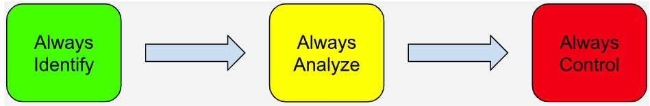
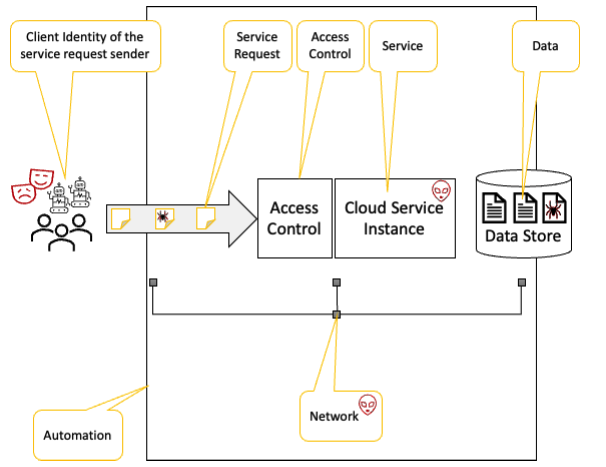
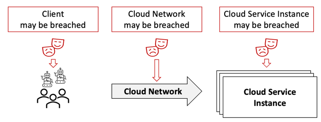
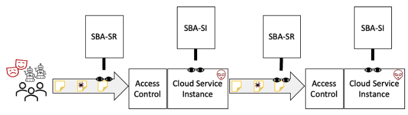

# Cloud Native Zero Trust Whitepaper

## **CNCF -  TAG Security: Designing Zero Trust Using Cloud Native Platforms**

<!-- markdownlint-disable MD036 MD025 MD024 MD033 MD013 -->
<!-- cSpell:ignore markdownlint Microservices microservices microsegment microsegments Microsegmentation microsegmentation Knative Knative's Linkerd Kindervag Forrester operationalized GCHQ UEBA apriori permissioning Coraza Curiefense Dapr Falco CISA -->
<!-- cspell:disable -->

TAG Security issue: [https://github.com/cncf/tag-security/issues/950](https://github.com/cncf/tag-security/issues/950)

**Version**: 1.0 **Created**: 30 Nov 2024 **Status**: WIP | **In Review** | Approved

**Last Reviewed**: DD MMM 2024, **PDF Published**: DD MMM 2024 **Release Version**: 1.0

**TAG Sponsor Approver** [X] @eddie-knight
**TOC Liaison Approvers** [] @TheFoxAtWork [] $GITHUBHANDLE

* **Project Lead**: @mrsabath, @davidhadas
* **Contributors** (in alphabetical order): Aradhna Chetal, Asad Faizi, David Hadas, Eddie Knight, Kishore Nadendla, Mariusz Sabath, Philip Griffiths, Victor Lu
* **Reviewers**: Pushkar Joglekar, Nate Waddington, Andrés Vega, Valerie Silverthorne, Yoshiyuki Tabata

<!-- cspell:enable -->

## Table of Contents

- [Abstract](#abstract)

1. [The Philosophy of Zero Trust](#1-the-philosophy-of-zero-trust)
   - [Cloud Native Principles of Zero Trust](#cloud-native-principles-of-zero-trust)
2. [Modeling a Cloud Native Zero Trust Architecture](#2-modeling-a-cloud-native-zero-trust-architecture)
   - [Foundational Terms](#foundational-terms)
   - [The Zero Trust Process](#the-zero-trust-process)
   - [Cloud Native Zero Trust Architectural Elements](#cloud-native-zero-trust-architectural-elements)
   - [New Proposal for Confidence Levels](#cloud-native-zero-trust-architectural-elements)
3. [Cloud Native Zero Trust Architecture Design](#3-cloud-native-zero-trust-architecture-design)
   - [Peer Identities](#peer-identities)
   - [Secure Communication](#secure-communication)
   - [Behavior Verification](#behavior-verification)
   - [Access Control](#access-control)
   - [Instance Confidence Automation](#instance-confidence-automation)
4. [Techniques and Best Practices](#4-techniques-and-best-practices)
   - [Protect Data Confidentiality and Integrity](#protect-data-confidentiality-and-integrity)
   - [Prevent Unauthorized System Use](#prevent-unauthorized-system-use)
   - [Establish Limited Trust](#establish-limited-trust)

- [Conclusion](#conclusion)
- [Appendix](#appendix)
  - [Glossary](#glossary)
  - [References and Citations](#references-and-citations)
  - [Contributors](#contributors)
  - [Reviewers](#reviewers)
  - [Acknowledgments](#acknowledgments)
  - [Helpful Links](#helpful-links)

**Note**: All tools, projects, libraries mentioned in the paper are mentioned as examples when describing a relevant section. Hence, such mention **should not be** taken as an official recommendation by TAG Security or CNCF. Readers should evaluate adoption of such tools, projects or libraries based on their own understanding and threat model of the system under review.

# Abstract

Contrary to what the name might suggest, the real world application of “Zero Trust” is far more nuanced than simply *trusting nothing*. The Zero Trust defense strategy considers an internal network and its components to potentially be compromised and therefore must have there trustworthiness asserted at every connection. Without this assertion and verification, it cannot be trusted. This contrasts with a perimeter-based defense, which is designed to provide sufficient protections at the boundary such that the internal network is implicitly secure because nothing could possibly get in from the outside that is unauthorized. Zero Trust principles allow organizations and technologists to introduce measures that evaluate and verify trustworthiness, enabling the output of these evaluations to direct and enforce communications and activity within a network by the connected devices.

While many of the well-worn concepts behind Zero Trust apply to *any* system, there remains a gap with regards to discussing Zero Trust from a Cloud Native perspective. This document seeks to codify the philosophy alongside an ideal design for implementing it in a Cloud Native system.

The authors have compiled their experience and research findings into a set of principles and approaches. Many of the concepts herein such as “Confidence Levels” are a distillation of past publications. Confidence Levels quantify the trustworthiness of entities within a system, allowing for more dynamic and responsive security measures. Extending those findings has led to a new proposal to standardize the generation and utilization of “Confidence Levels” as a data type.

Confidence Levels can be produced by “Active Observers,” a previously unnamed category of tools. Active Observers continuously monitor and analyze the security-related attributes and behaviors of entities in the system to quantify trustworthiness.

By applying the philosophy of Zero Trust to an entire Cloud Native system with consideration paid to the unique context, this paper crafts a Cloud Native Zero Trust Architecture design. Using the latest technologies, it is becoming possible to build a system in such a way that Active Observers assign Confidence Levels to every entity in the system. This enables the architecture to adapt in real-time to emerging threats and anomalies, reinforcing the Zero Trust stance.

By incorporating the concepts of Confidence Levels and Active Observers, a cloud architect may come closer to true *Zero Trust* than previously imagined.

# 1. The Philosophy of Zero Trust

The concept of Zero Trust has undergone significant evolution, transitioning from a philosophical notion to a foundational cybersecurity model. The term "Zero Trust" was first coined by [Stephen Paul Marsh in his 1994 doctoral thesis at the University of Stirling](https://www.cs.stir.ac.uk/~kjt/techreps/pdf/TR133.pdf).
In this work, titled "Formalizing Trust as a Computational Concept," Marsh introduced the idea that trust could be mathematically quantified, separate from human moral and ethical considerations. This theoretical framework established the groundwork for what would later become known as the Zero Trust philosophy.

The practical application of Zero Trust coalesced in 2010 when John Kindervag, an analyst at Forrester Research, introduced a model that operationalized these principles. In his paper, ["No More Chewy Centers: Introducing the Zero Trust Model of Information Security,"](https://media.paloaltonetworks.com/documents/Forrester-No-More-Chewy-Centers.pdf) Kindervag proposed a security architecture where trust is never assumed and must be continually verified.
This model, which segmented networks into zones with varying levels of trust, aimed to eliminate the vulnerabilities of traditional perimeter-based security systems, where internal networks were often overly trusted.

The implementation of Zero Trust principles was notably advanced by [Google's BeyondCorp initiative in 2009](https://www.beyondcorp.com/#:~:text=The%20BeyondCorp%20Story,and%20devices%20access%20internal%20applications.). BeyondCorp shifted security focus from the perimeter to individual users and devices, emphasizing continuous verification and least-privilege access.

The proliferation of open source projects such as Istio, Knative, SPIFFE, and OpenFGA has also played a crucial role in advancing Zero Trust. These projects provide robust frameworks for identity management, policy enforcement, Security Behavior Analytics, and secure communication within cloud native environments.

The National Institute of Standards and Technology (NIST) has been pivotal in formalizing the Zero Trust model. [NIST's guidelines on Zero Trust Architecture](https://csrc.nist.gov/pubs/sp/800/207/final) outline key tenets and principles to help build systems that follow the model.

The history of Zero Trust started as a theoretical concept and evolved into a practical, essential cybersecurity framework. The contributions of early theorists, pioneering implementations by industry leaders, and the formalization by standardization bodies like NIST have collectively shaped the Zero Trust model, making it a cornerstone of modern cybersecurity strategies in cloud native environments.

## Cloud Native Principles of Zero Trust

Building on the extensive discourse surrounding Zero Trust principles over the years, two foundational tenets have been established: *Assume a Breach* and *Always Verify*. When applying these tenets to cloud native environments, we have delineated eleven governing principles.

To follow the tenet of *Assume a Breach*, organizations must operate as if their systems are already hacked. This mindset encourages the development and implementation of security strategies that are inherently resilient and capable of detecting, containing, and mitigating threats in real time.

The tenet of *Always Verify* emphasizes the necessity of continuous authentication, authorization, and monitoring for every interaction within the system, regardless of its origin. This tenet rejects the notion of implicit trust, instead insisting on rigorous verification of all entities — users and services, internal and external. In practice, this involves the actions of eliminating implicit trust, minimizing explicit trust, and monitoring behavior to verify trustworthiness.

The following table summarizes the Cloud Native principles of Zero Trust as detailed in the remainder of this chapter.
The evidence for the principles below is discussed in **[NIST SP 800-207](https://csrc.nist.gov/pubs/sp/800/207/final)** chapter 2 *“Zero trust Basics”* with further details in chapter 3 “*Logical Components of Zero Trust Architecture*”*.* While the NIST paper discusses all kinds of systems, in generic terms such as assets and resources, here we focus solely on Cloud Native systems with a higher level of nuance.

<table>
  <tr>
   <td>
   </td>
   <td><strong>Tenet</strong>
   </td>
   <td><strong>Cloud Native Principle</strong>
   </td>
  </tr>
  <tr>
   <td>1
   </td>
   <td>Assume a Breach
   </td>
   <td>Every Image Includes Vulnerabilities
   </td>
  </tr>
  <tr>
   <td>2
   </td>
   <td>Assume a Breach
   </td>
   <td>Every Service is Vulnerable
   </td>
  </tr>
  <tr>
   <td>3
   </td>
   <td>Assume a Breach
   </td>
   <td>Every Service will be Exploited
   </td>
  </tr>
  <tr>
   <td>4
   </td>
   <td>Assume a Breach
   </td>
   <td>The Cluster Network is Hostile
   </td>
  </tr>
  <tr>
   <td>5
   </td>
   <td>Assume a Breach
   </td>
   <td>Clients will Send Malicious Requests
   </td>
  </tr>
  <tr>
   <td>6
   </td>
   <td>Always Verify - Eliminate Implicit Trust
   </td>
   <td>Authenticate the Service
   </td>
  </tr>
  <tr>
   <td>7
   </td>
   <td>Always Verify - Eliminate Implicit Trust
   </td>
   <td>Authenticate Service Request Senders
   </td>
  </tr>
  <tr>
   <td>8
   </td>
   <td>Always Verify - Monitor Behavior
   </td>
   <td>Verify the Service Instance Behavior
   </td>
  </tr>
  <tr>
   <td>9
   </td>
   <td>Always Verify - Monitor Behavior
   </td>
   <td>Verify Service Request Behavior
   </td>
  </tr>
  <tr>
   <td>10
   </td>
   <td>Always Verify - Monitor Behavior
   </td>
   <td>Verify the Client Behavior
   </td>
  </tr>
  <tr>
   <td>11
   </td>
   <td>Always Verify - Minimize Explicit Trust
   </td>
   <td>Enforce Least Privilege Universally
   </td>
  </tr>
</table>

### 1. Every Image Includes Vulnerabilities

Organizations must recognize that all cloud native images inherently contain vulnerabilities. It is imperative to understand that no image is free from potential security flaws. Dependencies, base images, development tools, repositories, and continuous integration/continuous deployment (CI/CD) tools are all susceptible to exploitation, leading to vulnerable images. The extensive amount of code and complexity in how that code is introduced in the build systems or final image built presents numerous opportunities for threat actors to compromise target application and environments throughout their lifecycle.

### 2. Every Service is Vulnerable

Organizations must acknowledge that all deployed services are inherently vulnerable. This assumption should guide the planning and implementation of security measures. Any service deployed within a cloud native environment should be presumed to operate based on a vulnerable image and/or vulnerable configuration and that it will expose those vulnerabilities through its service API.

It is common for organizations to become aware of vulnerabilities when Common Vulnerabilities and Exposures (CVEs) related to their services are published. However, this awareness often comes after a period during which the services were susceptible to attack.
The absence of a known vulnerability does not mean a system is secure; vulnerabilities may exist that have yet to be discovered or disclosed. CVEs are typically published following the detection and reporting by white hat security researchers, but malicious actors may exploit these vulnerabilities long before they are publicly known.

### 3. Every Service Will be Exploited

Organizations must adopt the perspective that any cloud native deployed service is susceptible to exploitation at some point. When deploying a service, it is essential to assume that it may be exploited through various vectors, including internal malware infiltration, insider misuse, or unauthorized access to credentials or control systems.

This assumption necessitates a comprehensive and proactive approach to security, wherein continuous monitoring and rapid response mechanisms are integral components. By acknowledging the inevitability of exploitation attempts, organizations can better prepare to detect and mitigate threats promptly, minimizing potential damage.

### 4. The Cluster Network is Hostile

Organizations should treat the internal cluster network as inherently hostile and untrusted. This assumption is critical for developing a robust security posture. It is essential to recognize that the cluster network can be compromised, and malicious entities may have the capability to inject and extract traffic within it.

Treating the cluster network with the same level of suspicion as external networks necessitates the implementation of stringent security measures. These measures include robust network segmentation, continuous monitoring, and the application of advanced security protocols to detect and mitigate potential threats.

### 5. Clients Will Send Malicious Requests

Organizations should operate under the assumption that clients may send malicious requests — even those presenting valid credentials and exhibiting consistent behavior over time.

Credentials can be stolen, and users may intentionally or unintentionally abuse their access rights. Legitimate user accounts, or seemingly benign machines, can be appropriated by malicious actors to send hostile service requests. Therefore, it is imperative to monitor and scrutinize each request thoroughly to identify and mitigate potential exploitation attempts.

### 6. Authenticate the Service

Organizations must ensure that clients verify the identity of any service before initiating a service request. This authentication process is crucial for both internal and external clients interacting with services within the cloud native environment.

This action necessitates the implementation of robust identity verification mechanisms to confirm that the service being approached is legitimate and not a fraudulent entity. Such measures are essential to prevent impersonation attacks and to maintain the integrity of service interactions.

### 7. Authenticate Service Request Senders

Organizations must ensure the identity verification of all service request senders before processing their requests. This verification process applies to both internal and external senders, including users and machines interacting with cloud native services.

Implementing robust identity verification mechanisms is essential to confirm the legitimacy of each request sender. This includes verifying credentials and continuously monitoring the behavior of request senders to detect any anomalies that might indicate a compromised identity or malicious intent.

### 8. Verify the Service Instance Behavior

Organizations must continuously monitor and verify the behavior of service instances to ensure they are not being exploited. This necessitates the implementation of dynamic, per-instance evaluation processes that assess whether service instances are operating as expected.

Organizations should promptly identify and mitigate misused service instances — restoring expected behavior and removing malicious actors — while maintaining overall service stability. The faster a compromised service instance is terminated, the lower the gain obtained by the attacker, resulting in a reduced overall value to attackers.

### 9. Verify Service Request Behavior

Organizations must operate under the assumption that even clients providing credible credentials may exhibit malicious behavior, such as when an offender has stolen client credentials. Furthermore, organizations should consider that a client with a history of good behavior might attempt to compromise the system in future requests. An attacker might leverage a legitimate user’s credentials or embed malicious code within a legitimate machine to send service requests.

Therefore, it is crucial to always assume that any request made to a service API could potentially contain an exploit. Requests should be regarded as potential vectors for exploiting vulnerabilities within the service API. Relying on the implied trustworthiness of requests from authenticated senders is insufficient. Instead, a dynamic, per-request evaluation process must be employed.
Each request should be meticulously assessed and assigned an appropriate Confidence Level, based on its potential to be an exploit. This continuous scrutiny ensures that organizations can effectively mitigate risks associated with seemingly legitimate but potentially harmful requests.

This principle is discussed in NIST 800-207 Section 3.3: “Trust Algorithms.”

### 10. Verify the Client Behavior

Organizations must not assume that a duly authenticated service client is not a potential attacker. Trustworthiness should not be inferred based on authentication alone, as credentials can be stolen, insiders may become malicious, and attackers might be present within the sender’s system. Consequently, a dynamic, per-client evaluation process is necessary.

This evaluation should consider the client's past behavior, including both its normal activities and the historical activities. Additionally, any external information about the client’s identity should be considered. For instance, if the identity is another service, this information may encompass the service's behavior, as outlined in the principle of monitoring service behavior.

### 11. Enforce Least Privilege Universally

Despite being discussed for twice as long as the concept of Zero Trust, the enforcement of least privilege remains an area of significant vulnerability in many systems. Organizations must implement dynamic and fine-grained access control to ensure that verified identities are only permitted to perform operations that align with their role and trustworthiness.

Access to services should be evaluated and granted on a per-request basis, taking into account various parameters to make informed access decisions. These parameters include assessing whether the requested operation is appropriate for the identity in question, evaluating the Confidence Level of the sender's true identity, determining the likelihood that the request is not an exploit, and considering the overall context of the request.
This context might include factors such as whether the sender is expected to make requests at that particular time of day, from a specific IP range, or in a certain sequence.

# 2. Modeling a Cloud Native Zero Trust Architecture

Having established the foundational philosophy of Zero Trust, we now turn our attention to the concepts and approaches necessary for building Cloud Native systems that adhere to these principles. First we will outline a three-step Zero Trust process where entities are identified, verified, and controlled. We will then define what we consider as key elements for constructing a Zero Trust Architecture (ZTA) within a cloud native environment, in-line with the principles as described above.

We remind readers that the architectural elements outlined here are the result of one way to adhere to the principles as a whole— and there are cases where not all architectural elements may be required.

## Foundational Terms

Before we go deeper, we must first establish some key terms: Confidence Levels, Active Observers, and Security Behavior Analytics.

As discussed in [NIST SP 800-207 Chapter 2: “Zero Trust Basics”](https://csrc.nist.gov/pubs/sp/800/207/final), a **Confidence Level** refers to the dynamically calculated level of trust, based on the assessment of a subject and its context. At the end of this chapter, we will discuss an opportunity to enhance the use of Confidence Levels across the cybersecurity ecosystem.

**Security Behavior Analytics (SBA)** refers to the field of Machine Learning and associated data analytics technologies that analyze entity behavior to inform security and confidence decisions. SBA compares an entity's security-related behavior to its norm or other predefined known criteria. The entity’s standard behavior is first examined through security glasses, and the behavior exposed is recorded.
Once standard behavior is recorded, *Confidence Levels* can be deducted by evaluating the changes in the security-related behavior of the entity. SBA is a superset of traditional data analytics such as User-Entity Behavior Analytics (UEBA).

According to [NIST SP 800-207](https://csrc.nist.gov/pubs/sp/800/207/final), the policy decision/enforcement point “passes proper judgment to allow the subject to access the resource.” In this paper we name this essential functionality “Active Observer” while discussing its use and implementation. An **Active Observer** is a process that continuously monitors factors which influence an entity's Confidence Level within the system by collecting comprehensive Security Behavior Analytics.

## The Zero Trust Process

In ZTA, authentication and authorization are managed on a per-request basis rather than per session. Every action is either authorized or restricted, and every behavior is monitored. This rigorous approach ensures that even if credentials are compromised, malicious actions can be blocked.

The Zero Trust process can be distilled into three fundamental steps.

*Image 1. Three steps of the Zero Trust process*

### Step 1: Identify

Regardless of the client’s location, whenever a client tries to access a resource, their identity must be validated. Clients should never be trusted based on other attributes, such as their location within the network. It is also essential to maintain an auditable record of all clients based on their individual identities, and to periodically revalidate their credentials (*see [NIST SP 800-63](https://pages.nist.gov/800-63-3/)*).

### Step 2: Analyze

Successful client identification should not lead us to fully trust a client’s requests. All internal or external traffic should be evaluated to ensure it is not malicious. Bad actors may gain access to secure areas or valid credentials, and legitimate clients may be compromised to act maliciously.

Continuous analysis of clients, client requests, and services should compare actual behavior to an expected criteria. Organizations must regularly analyze all network and system activity to evaluate the actions and reassess the Confidence Level for each entity.

### Step 3: Control

Restricting access to resources based on client identity, client behavior, request behavior, device posture, and other contextual factors is essential for maintaining security. Specific controls and checks should be applied in front of every service, governing each action of every client.
This includes avoiding long sessions based on previous credential validations to limit the impact of potential compromises.

The principle of least privilege must be strictly enforced, ensuring that clients have access only to the minimal resources necessary for their tasks. Unnecessary access should be eliminated, even if the associated risk is perceived as low.

Zero Trust advocates for network segmentation into smaller, isolated segments or microsegments. Each service should be treated as a microsegment, with dedicated access controls to contain breaches and limit lateral movement within the network. By dividing the network into small segments, each containing a single microservice, more granular access controls can be applied, thereby reducing the attack surface.
This approach prevents lateral movement between microservices, as each microservice operates with its own access control and is safeguarded from neighboring services.

## Cloud Native Zero Trust Architectural Elements

To build a robust ZTA for cloud native environments, we draw inspiration from established frameworks, such as the [US Department of Defense Reference Architecture](https://dodcio.defense.gov/Portals/0/Documents/Library/(U)ZT_RA_v2.0(U)_Sep22.pdf), which identifies seven core pillars essential for securing modern systems.

In alignment with these pillars, we identify seven key elements of a Cloud Native ZTA.

**Service Instances** are the individual services offered using containers on cloud native clusters. Securing these includes implementing DevSecOps practices to secure applications from inception through production. Adopting secure-by-design practices, robust image build methodologies, comprehensive image scanning, and secure storage are critical. Service runtime protection methods, such as behavioral monitoring, help establish Confidence Levels for services.

**Client Identities** refer to the unique identifiers of clients sending service requests, whether external or internal. Ensuring the security of these identities involves verifying and monitoring their behavior to form Confidence Levels. Continuous monitoring helps detect and mitigate potential threats from compromised or malicious clients.

**Service Requests** are the interactions initiated by clients to access services. Securing these requests involves monitoring the risks they pose and forming Confidence Levels to assess their trustworthiness. Each request must be scrutinized to prevent exploits and ensure safe interactions.

**Data** encompasses all the information that services handle and store. Effective data security requires categorizing data to apply appropriate security measures based on data types. This ensures that sensitive information is adequately protected. Data classification helps in enforcing policies tailored to the sensitivity and importance of the data.

The **Network** comprises the communication channels between clients and services. Securing the network involves protecting service requests and responses through encryption and other measures to prevent unauthorized access and data breaches. Network security encompasses measures to protect data in transit and to monitor for any suspicious activities.

**Access Control** refers to the policies and mechanisms that govern who can access what resources. Implementing comprehensive access control policies is essential for securing services. This includes enforcing micro-segmentation within clusters and applying granular access controls using gates in front of services. Access control decisions should consider the Confidence Levels of identities and requests, as well as the data types of both requests and responses.

**Automation** involves using tools and processes to manage the deployment, configuration, and auditing of cloud native components. Ensuring that zero trust principles are followed throughout these automated processes is essential. Automated removal of suspected service instances based on their Confidence Levels further enhances security.

*Image 2. Note that the service request sender (aka client) may be malicious.  \
The Network and Data may also be compromised.*

In cloud native environments, client identities may be malicious, service requests may include exploits, service instances may be compromised, data may contain vulnerabilities, and the network may be hostile. Given these potential threats, it is imperative to deploy an "Active Observer" to continuously assess the Confidence Levels of these entities.

Cloud Native Zero Trust extends access control to include the assessment of Confidence Levels for client identities and service requests. Additionally, Zero Trust extends automation processes to consider the Confidence Levels of service instances. This comprehensive approach ensures that security measures are dynamically adjusted based on real-time assessments, maintaining the integrity and security of the cloud native environment.

## New Proposal for Confidence Levels

Confidence Levels have been an integral component of the discussion in this chapter, and their proper implementation is crucial to the success of modern ZTAs. However, as previously mentioned, there is a notable deficiency in the technical ecosystem regarding the generation and utilization of Confidence Levels as a data type.

While many types of services can function as an Active Observer or Security Behavior Analytics platform, the ability to rapidly interpret and respond to Confidence Levels depends on a system designer's ability to effectively integrate disparate tools.

This presents a significant opportunity: if the community were to rally around a centralized standard for communicating Confidence Levels, it would enable tools to speak a shared language, facilitating easier integration and more precise responses across the board.

Adopting a centralized standard for Confidence Levels would not only enhance integration and precision across security tools but also pave the way for developing advanced tooling solutions that can fully leverage these improvements.

However, this level of maturity is not required to make early strides incorporating Confidence Levels, and is simply proposed here as the logical next step for gaining the highest value from the technologies in a ZTA.

# 3. Cloud Native Zero Trust Architecture Design

With the key elements of Cloud Native Zero Trust Architecture (ZTA) now established, we turn to the process of translating these concepts into a cohesive, practical design. The strength of any Zero Trust system lies in its ability to continuously verify and control every entity interacting within the environment. This chapter focuses on how to build such a Cloud Native system and cope with the different potential breaches as shown in Image 3.

*Image 3. All potential breaches in a Cloud Native system should be addressed as part of a  \
Zero Trust Architecture design*

To deal with a breached cloud network, we introduce Peer Identities and Secure Communication. Then, to handle breached clients, we introduce Behavior Verification enhanced Access Control. Last, to mitigate the impact of breached cloud service instances, we introduce Behavior Verification enhanced Instance Confidence Automation. Together, this creates a robust system that aims to cope with the different potential breaches.

At the heart of Cloud Native ZTA is the concept of identity—every ZTA entity must have a unique, verifiable identity. Traffic from unknown entities, lacking an identity which cannot be traced to its source, leaves us unable to track and control the entity in question. In this chapter, we will explain how to establish these identities, secure their communications, and ensure that the behavior of all entities is constantly scrutinized and verified.

## Peer Identities

In a Cloud Native Zero Trust Architecture (ZTA), every entity—whether acting as a client, a service, or peer in a peer to peer network—must be uniquely identifiable. This identity forms the foundation of all security mechanisms, enabling the system to trace actions, control access, and verify trustworthiness in real-time.

Cloud Native applications typically consist of multiple **microservices**, each composed of **Pods** that handle specific requests from internal or external clients. These Pods may also serve as clients themselves, sending requests to other microservices or external cloud services. When designing a cloud native ZTA, each microservice must be assigned a unique and verifiable identity, allowing us to track their behavior and enforce security policies.

Assigning a single identity to all Pods within a microservice could limit visibility and control. When pods of a microservice send requests to other services, it is recommended to enable tracing the requests back to a specific Pod. This can allow identifying misbehaving, potentially rogue Pods. Depending on policy, such Pods may be restarted without affecting other pods of the microservice.

**Hierarchical identities** for Pods within microservices therefore may offer us the ability both to associate all behaviors of a microservice to the microservice identity; And, at the same time, the ability to associate all behaviors of a specific Pod in a microservice, to the Pod identity, allowing us to perform an appropriate policy based action.

Note that **containerized environments** such as Kubernetes may group multiple containers within a Pod. Under Kubernetes, all containers in the same Pod are managed as one unit and therefore may share the same identity. The Pod's identity can be used to represent both the service it provides and its interactions as a client to other services.

External client entities— whether human users or external systems— must also be uniquely identified to ensure traceability and control over their actions.

After identities are assigned to all clients and services, the next step is to ensure that communication between these entities is secure.

## Secure Communication

Zero Trust operates under the assumption that offenders may already have control over the cloud network. Therefore, a Zero Trust Architecture (ZTA) must ensure data confidentiality for communication between microservices, or between microservices and external entities. As discussed below, to achieve data confidentiality, we must verify the identity of every service and encrypt all communications.
However, a ZTA requires not only data confidentiality, but also fine grained access control as well as behavior monitoring. To achieve either, we are also required to verify the identity of every client.

### Data Confidentiality

Every Cloud Native request, whether initiated by an internal microservice or an external client, must be performed using Transport Layer Security (TLS) to encrypt the channel. This guarantees that even if an offender intercepts the data between the client and server from the internal network, it will not gain access to the request and response data.
However, to encrypt the data, the client and server must first agree on encryption keys. An offender may redirect the client traffic to a fake server and gain access to the pre-agreed upon encryption keys.

Such an attack can be part of a full fledged man-in-the-middle attack or may be used to obtain the Request data without involving the true server. To protect against offenders introducing fake servers, the client must first verify the identity of the service before sending the Request.
Therefore, the microservice or external service must present a **certificate** signed by an entity that the client trusts apriori. Clients should only send requests to a service after verifying the authenticity of the certificate and verifying that the certificate was indeed provided to the identity of the service being approached.

Combining service certificate verification with encryption suffice for achieving data confidentiality, protecting against data leakage in a cloud native environment under the control of potential offenders. However, a Zero Trust Architecture requires more than data confidentiality.
It requires fine grained access controls, allowing each client to access only the subset of services as may be needed. It also requires monitoring the behavior of each client. We are therefore required to also verify the identity of every internal or external client.

### Client Credentials

Clients, whether embedded in a microservice or any external systems, must present credentials that are verified by the receiving service. This can be done through tokens—such as JWT (JSON Web Tokens)—or by presenting client certificates that are verified by service instances using mutual Transport Layer Security (mTLS).
Note that verifying the identity of clients or servers only ensures that the peer has the necessary client credentials and is not indicative of whether the peer is offensive or benign.

As will be discussed further in the following sections, once a client identity is verified, active observers should evaluate the confidence level of the specific client request behavior and the confidence level of the overall accumulative client behavior. The client identity and the respective confidence levels then need to be considered as part of Access Control to check whether the identity in question with the confidence levels in question, should be allowed.

Identity management in a cloud native environment is further detailed in the [Identity and Access Management section of tag-security whitepaper](https://github.com/cncf/tag-security/blob/main/community/resources/security-whitepaper/v2/cloud-native-security-whitepaper.md#access).

Now that all communications are peer authenticated and offer data confidentiality, the next step is to verify the behavior of all entities such that we may identify compromised authenticated clients, malicious client requests, and compromised service instances.

## Behavior Verification

In a Zero Trust Architecture (ZTA), identity verification alone is not enough to ensure security. Even if credentials are verified, they can be stolen or compromised. Further, an offender may be co-residing as part of a true client, using a communication channel established by the benign client to send malicious requests. To truly establish trust, continuous behavior verification is required. This is where *Active Observers* play a central role.

An **Active Observer** continuously monitors the behavior of clients, services, and interactions within the system, providing insights into potential anomalies that may indicate malicious activity. By analyzing the behavior of these entities, the Active Observer helps determine their **Confidence Level**, a dynamic metric that quantifies the trustworthiness of a given entity based on observed behavior.

*Image 4. Active Observers in a Cloud Native system*

In a Cloud Native environment, behavior verification focuses on three key entities:

1. **Service Requests**: Requests made by clients to services must be monitored to detect irregularities.  \
See Security Behavior Analytics for Service Requests (SBA-SR) in image 6. \

2. **Service Instances**: The behavior of individual service instances should be tracked for signs of compromise. \
See Security Behavior Analytics for Service Instances (SBA-SI) in image 6. \

3. **Client Identities**: Both internal and external client behaviors are evaluated based on the requests they generate. The behavior of external clients is evaluated through their stream of **Service Requests**. For internal clients, their behavior is derived by combining the Confidence Level of the associated **Service Instance** with the behavior exposed by their respective **Service Requests**.

### Input from Continuous Monitoring and Logging

To enable effective behavior verification, **continuous monitoring and logging** are essential. By collecting and analyzing logs in real-time, organizations can detect unusual activities and trigger alerts for potential security incidents.
These logs provide valuable input to Active Observers, enabling them to detect compromised clients or service instances. It also allows them to observe deviations from normal patterns that may indicate exploitation.

### Security Behavior Analytics for Service Requests (SBA-SR)

A common attack vector on services involves manipulating requests sent to service APIs. Such an attack may include reconnaissance  - surveying the service to identify potential weaknesses, or it may include an actual attempt to exploit the service either through known or unknown vulnerabilities.  Security Behavior Analytics for Service Requests (SBA-SR) is designed to detect irregularities in the communications between clients and services.
SBA-SR distinguishes between benign requests and those that are potentially malicious. It analyzes request patterns to identify deviations from expected behavior which may signal dubious intentions by the sender. It consequently assigns a Confidence Level to each request.

Requests flagged as suspicious should be handled by **Access Control** mechanisms (discussed later), ensuring that any potential threats are mitigated before they can exploit vulnerabilities or offer the offender more information to further the attack.

### Security Behavior Analytics for Service Instances (SBA-SI)

Cloud Native often uses horizontal scaling such that every microservice is offered from a set of interchangeable Pods, each offering the service and each sharing the overall service load. Each pod is therefore an instance of the same service. A service instance may be compromised in advance and include malware that is triggered by some event or by the passage of time after the deployment.
A service instance may also include a backdoor or may be ill configured or otherwise vulnerable allowing an offender to run malware as part of the service instance following some sequence of events. An exploited service may therefore include one or more exploited instances, while others instances may continue to behave as expected. Monitoring the behavior of instances is key to identify occurrences where an instance is being exploited.

SBA-SI monitors service instance behavior to detect irregularities indicating that a given instance is compromised, by discerning normal service behavior from malicious activity. When suspicious irregular behavior is detected, the Confidence Level of the service instance is adjusted. As discussed below, an **Instance Confidence Automation** should monitor service instance Confidence Levels to facilitate automated response, when a service instance is suspected as being exploited.

## Access Control {#access-control}

Given the harsh assumption that all systems including all clients and services may be breached, Zero Trust introduces new and more stringent requirements for Access Control compared to traditional models. It mandates continuous per request verification, fine-grained authorization, and dynamic responses to emerging threats based on real-time behavior analysis.

### Fine-Grained Authorization

Access Control policies under a ZTA must ensure **least privilege access**. This means clients are granted only the minimum permissions necessary to perform their specific role or task—nothing more. Fine-grained authorization applies to individual entities, whether they are human users, machines, or services. For instance, rather than granting access to a broad group of clients or services, Access Control policies should consider the unique identity of each client and the specific resource being requested.

Each client must be authorized not just for the resource they are requesting, but for the specific action they wish to take. For example, an access control policy should define the specific APIs a client is allowed to access, or if the client is merely allowed to read a specific resource type or also to modify resources of this type. This prevents "over-permissioning" and enforces least-privilege principles.

### Microsegmentation and Service-Level Access Control

Every service in the architecture must be protected by an Access Control layer. This layer regulates the flow of incoming requests and determines whether a request should be processed or rejected. Note that each service maintains its own access control policy. Access decisions depend on the permission granted to a specific client identity to perform specific actions against a specific service.

This approach of dividing the service network into small segments, is also known as **microsegmentation.** Microsegmentation is a key ZTA strategy for limiting the impact of potential breaches and controlling traffic between services. We first divide the network into smaller, isolated segments. Then, we introduce access control in front of every segment which allows for more granular security controls and reduces the risk of lateral movement during an attack.

While implementing a ZTA under Cloud Native, we introduce a segment per microservice. All instances (pods) of the same microservice use the same segment, while being separated from other pods of other microservices. As a result, any microservice to microservice communication is controlled using Access Control and a set of policy rules dedicated for that service.

### Per-Request Access Control

Unlike traditional perimeter-based models, where trust is typically established once, followed by a stream of service-requests sent by the client, Zero Trust requires that every single request is evaluated independently **in real-time**, regardless of whether the client was previously verified. This allows access control decisions to factor the updated Confidence Levels calculated by **Active Observers**, as well as other per request attributes.

The access control decision, taken per request, considers not only  the updated accumulated client confidence level, but also the request specific confidence level. As indicated earlier, the access control decision is also based on the specific action being made by the client, as part of the request.
Additionally, the decision takes into account other contextual attributes of the request such as the time of day, day of week, source IP, etc..

For example, even if a client’s credentials are valid, its access may be restricted if recent behavior suggests a potential compromise, or if its current request is suspected as being an exploitation or reconnaissance attempt, or if it is made from a peculiar source or at a peculiar time, or if the service being approached is considered potentially compromised
or any combination of the above raised to the level justifying to block the request from this specific client to this specific service, given the action requested. All as defined by the service access control policy for this client identity.

Secure Communication as described earlier, protects the Cloud Native system against offenders controlling the internal system network. The addition of Access Control utilizing Behavior Verification, further protects the system from offenders controlling legitimate clients or using legitimate client credentials to send traffic on behalf of some client identity.
The next step is to utilize Behavior Verification to also consider the case of offenders controlling the service instances.

## Instance Confidence Automation

A foundational tenet of Zero Trust is that all services may be breached. Offenders may have different incentives to breach a service. For example to gather information about requests made to the service or the responses provided; Or to use the service to access data sources that the service has access to; Or to perform lateral movement and breach other target services;
Or to use the service as a jumping stone in a covert, potentially distributed attack on other systems; Or even to mine cryptocurrency. In all such cases, a quick and immediate response of shutting down or limiting the breached service, can help curb the attack and prevent further damage.

We therefore need to introduce Instance Confidence Automation as part of the ZTA. Instance Confidence Automation leverages the continuously updated Confidence Levels provided by Service Instance Active Observers. When the Confidence Level of a Service Instance falls below a certain threshold—indicating potential compromise—automated systems can immediately take corrective actions, for example by shutting down compromised service instances.
Under Cloud Native, if an instance is deemed compromised, automation can trigger the deletion of the compromised instance, replacing it with a clean, well-behaving instance. Note that when replacing compromised instances, automation tools must also consider the overall availability of the service.

The combined introduction of Peer Identities, Secure Communication, Behavior Verification, Access Control and Instance Confidence Automation, allows us to construct a cohesive, practical design for a Cloud Native ZTA and concludes the primary contribution of this paper. Next we collected techniques of best practices that can be helpful for implementing the Cloud Native ZTA design discussed above.

# 4. Techniques and Best Practices

The Cloud Native Zero Trust Architecture (ZTA) design described in the previous section gives an overview for how organizations deploying Cloud Native systems can effectively follow Zero Trust principles. This chapter increases the level of detail to discuss techniques, best practices, and specific CNCF solutions that can help construct a Cloud Native ZTA.

## Protect Data Confidentiality and Integrity

Ensuring the security of Service Requests is paramount in Zero Trust. Any request from one entity to another must be encrypted, as the network cannot be trusted.

Additionally, requests must be monitored by an Active Observer utilizing Security Behavior Analytics for Service Requests (SBA-SR) to assess the risk associated with servicing the request through a service instance and to identify compromised client identities from which the request originated.

Service instances must also be continuously monitored by an Active Observer utilizing Security Behavior Analytics for Service Instances (SBA-SI) to assess the risk from allowing the service instance to continue running within the system. This monitoring enables the identification and replacement of compromised instances, prevents the spread of breaches when affected instances act as clients to other services, and facilitates forensic analysis of ongoing attacks.

We assume all services may have vulnerabilities and classify them based on their known status:

1. **Not Known to be Compromised Service:** The service is intact, with no foothold for an offender. An attacker must exploit a vulnerability in the service API to compromise the service.
2. **Compromised Service:** The attacker has a foothold in the service or infrastructure through an exploitable vulnerability or dormant malware that activates at some stage of the service lifecycle.
3. **Exploited Service**: At least one service instance is under an attacker's control, with active malware running as part of the deployment.

Organizations should identify and immediately stop exploited service instances that are being misused. Depending on the use case, organizations may or may not shutdown an entire service when an exploited service instance is detected. Offenders should not be allowed to maintain a presence in clusters after detection.

### Verify Service Requests

Ensuring the security of service requests is a critical aspect of ZTA. An essential component of this is the use of Security Behavior Analytics for Service Requests (SBA-SR). For instance, the Knative project from CNCF has a [Security-Guard](https://knative.dev/docs/serving/app-security/security-guard-about/#security-guard-profile-and-criteria) extension (Guard), which serves as an SBA-SR tool.

Guard can be deployed independently from Knative in various cloud native orchestration systems, including vanilla Kubernetes, where it will use machine-learning-based criteria synthesis to identify standard patterns used by service clients. Additionally, Guard supports the setting of manual criteria to enhance its flexibility.

Guard’s SBA-SR identifies changes in service requests made by clients, calculates a Confidence Level for these requests, and integrates with Access Control to remove any requests suspected of being exploits.
It also allows for the detection of unknown exploits targeting unknown vulnerabilities without relying on signatures, thus providing a layer of protection that preempts the usual race between the identification of CVEs, exploits, and the release of patches.

SBA-SR functionalities can also be integrated into Web Application Firewalls (WAFs) that maintain per-service state, capable of analyzing incoming and outgoing traffic to detect threats and ongoing attacks.

Solutions like <!-- cspell:disable -->[Coraza](https://coraza.io) or [Curiefense](https://www.curiefense.io/)<!-- cspell:enable --> offer anomaly scoring for requests, making decisions to block them based on predefined thresholds. These anomaly scores can be developed further to incorporate SBA-SR features, enhancing their effectiveness.

To ensure all communications in-transit are encrypted, all services should use TLS v1.2 or higher, and all clients must verify the certificates presented by the server. CNCF projects <!-- cspell:disable -->[Istio](https://istio.io/), [Linkerd](https://linkerd.io/), [Dapr](https://dapr.io/), and [Knative](https://knative.dev/)<!-- cspell:enable --> provide robust TLS and certificate management solutions to secure inter-service communication.

### Verify Service Instances

Profiling the behavior of service instances and evaluating Confidence Levels can leverage <!-- cspell:disable -->[eBPF](https://ebpf.io/) technology. Several CNCF projects use eBPF-based technology in observability, networking, and security ([Falco](https://falco.org/),
[Cilium](https://cilium.io/), [Pixie](https://docs.px.dev/), and [KubeArmor](https://kubearmor.io/)). eBPF<!-- cspell:enable --> can be used to synthesize criteria describing standard service instance patterns, which can then evaluate the Confidence Level of running service instances.

An Active Observer can also identify changes in the external communication performed by service instances using a network tap, as exemplified by the Knative [Security-Guard](https://knative.dev/docs/serving/app-security/security-guard-about/#security-guard-profile-and-criteria). Regardless of how the Active Observer calculates the Confidence Level of service instances, it should be integrated with automation to delete suspected compromised service instances.

Another source for determining the Confidence Level of service instances is intelligence information about CVEs included in the service image, obtainable through image scanning before or during service orchestration.

## Prevent Unauthorized System Use

In ZTA, preventing unauthorized system use is crucial for maintaining the security and integrity of the network. This objective is achieved through techniques such as micro-segmentation and fine-grained access control, which are essential for limiting the reach and impact of potential attackers.
By applying these methods, organizations can reduce the likelihood of a breach, and ensure that even if one segment is compromised, the attacker’s movement within the network is restricted, thus protecting the overall system.

### Fine-grained Access Control

Service mesh based solutions such as <!-- cspell:disable -->[Istio](https://istio.io/) and [Linkerd](https://linkerd.io/) offer opportunities to implement a gate in front of every service instance and support fine-grained access policies. Some tools, such as [Dapr](https://dapr.io/)<!-- cspell:enable -->, have built-in access control.

### Dynamic Access Control

This type of Access Control can be configured to block service requests based on the request Confidence Level. Tools like [Security-Guard](https://knative.dev/docs/serving/app-security/security-guard-about/) implement dynamic access control by introducing a gate in front of every Service Instance.

### Micro-Segmentation

Micro-segmentation allows for the division of a network into smaller, isolated segments. Access control gates must be implemented within the cloud cluster network, ideally in front of every service or service instance. Such gates should support fine-grained access control ensuring access is given to specific client identities approaching specific services.
Such gates should also support dynamic access control ensuring that access is granted based on Confidence Levels of the client, the client request, and the service.

Using this approach, the attack surface is significantly reduced by implementing strict access controls and separating resources into smaller compartments. Even if an attacker manages to compromise one microsegment, their lateral movement is limited, preventing them from accessing other parts of the network.

## Establish Limited Trust

Identity verification can be based on either client-sent tokens, mTLS client certificates, or both. Typically, the identity of the workload or service is represented by an Identity Token or Access Token, which is included with every request.
This token can be inspected by Policy Enforcement Points to control access. Certificates, on the other hand, are designed to encrypt the connection between two points and can guarantee the identity of one or both access points (via TLS or mTLS).

Identity verification is the first step in confirming the client’s identity. Verified identities must also be monitored by an Active Observer to ensure credentials are not misused for malicious activity.

### Token-Based Identity

With tokens such as [JSON Web Tokens (JWT)](https://jwt.io), the client obtains a token from a trusted third party, included in service requests to verify identity. As the request with the Identity Token travels across the endpoints, the identity attributes can be easily read by Policy Enforcement Points, allowing them to control access along the way.

CNCF projects related to token-based identity include <!-- cspell:disable -->[Dex](https://dexidp.io/) (an OIDC identity and OAuth 2.0 provider), [Keycloak](https://www.keycloak.org/) (Identity and Access Management), and [SPIFFE and SPIRE](https://spiffe.io/)<!-- cspell:enable --> (a universal identity control plane suitable for managing identities in a multi-cloud environment).

Best practices for JWT Tokens include verifying the signature, expiration, issuer, audience, and scope claims.

### Certificate-Based Identity

Identity may alternatively be established by the client presenting a client certificate using mutual TLS (mTLS). mTLS allows bi-directional, certificate-based verification between server and client. mTLS uses certificates for hop-by-hop identity verification, which allows a service to verify the identity of a directly connected client co-located on the cloud cluster network.

CNCF projects for managing certificates include [cert-manager](https://cert-manager.io/) (cloud native certificate management).

Making mTLS standard for all communications in a cloud cluster is often achieved by deploying a service mesh. CNCF Service mesh projects <!-- cspell:disable -->[Istio](https://istio.io/), [SPIFFE](https://spiffe.io/), and [Linkerd](https://linkerd.io/) offer service-to-service identity verification mTLS. [Dapr](https://dapr.io/) also offers mTLS.<!-- cspell:enable -->

### Active Observer for Client Identities

The Confidence Level of local clients within cloud clusters can be aggregated from the Confidence Levels of their respective service instances. However, inputs about external clients may or may not be obtainable.

Additional Confidence Level data can be aggregated from all service requests emitted by the client identity, available for both local and external clients.

# Conclusion

While the philosophy behind Zero Trust has been around for decades, its application in cloud native environments introduces unique challenges and opportunities. Protecting data confidentiality and integrity is a paramount in these dynamic and distributed systems.
Every service request and instance must be continuously verified to ensure that only authorized entities gain access to sensitive data. Such verification includes both identity verification and behavioral verification using Security Behavior Analytics. This approach helps cloud systems cope with threats while assuming cyber breaches are unavoidable.

Defining fine-grain access controls becomes critical in this context, allowing for more precise adjustments to who or what can access specific resources. To further enhance security, dynamic access controls based on the Confidence Level of requests should be introduced, adjusting access privileges in real-time according to the trustworthiness of each interaction.

Promoting micro-segmentation is another essential strategy, effectively reducing the attack surface by isolating workloads and limiting the potential impact of a breach. In line with the principle of least privilege, resources should only be granted the minimal access necessary for their function, reducing the risk of lateral movement within the network.

Moreover, establishing limited trust through mTLS and the use of certificate-based short-lived identities ensures that trust is not static but continuously verified. This is vital in cloud native environments where services and workloads are highly dynamic. Active observability is also crucial, with real-time monitoring to detect, respond to, and mitigate potential threats as they arise.

The next volume of this paper will delve deeper into specific concepts that comprise the ideal state presented in this document, offering comprehensive insights and practical applications.

The lessons outlined in this document, while particularly relevant to cloud native environments, underscore the importance of these principles across any Zero Trust Architecture. The cloud native context may present new challenges, but it also offers innovative tools and strategies to strengthen security and trust.

If this article introduced new or challenging concepts, please refer to the Appendix, which contains a glossary of *technologies* related to Cloud Native Zero Trust and a glossary of *terms* used in this paper.

Together, let’s build a future where trust is earned, verified, and continually reassessed, ensuring the highest standards of security in our cloud native environments.

# Appendix

## Glossary

### Technologies

#### **[Cert-manager](https://cert-manager.io/)**

A cloud-native certificate management controller for Kubernetes, which automates the creation, renewal, and management of SSL/TLS certificates within Kubernetes clusters, ensuring secure communication between services.

#### **[Cilium](https://cilium.io/)**

An open source software that provides networking, security, and observability for cloud-native environments using the Linux kernel's extended Berkeley Packet Filter (eBPF) technology. Cilium enables fine-grained security policies and high-performance networking for Kubernetes clusters.

#### **[CNCF Knative’s Security-Guard](https://knative.dev/docs/serving/app-security/security-guard-about/)**

A security extension developed as part of Knative. Security-Guard provides capabilities for protecting microservices by monitoring, detecting, and mitigating security threats in real-time. Security-Guard may protect both Kubernetes microservice applications and Knative Serverless applications.

#### **[Curiefense](https://www.curiefense.io/)**

An open source, cloud-native application security platform that integrates a Web Application Firewall (WAF), API security, and bot management. Curiefense provides comprehensive protection for web applications and APIs against a wide range of threats, including injection attacks, cross-site scripting (XSS), and denial-of-service (DoS) attacks.

#### **[Dapr](https://dapr.io/)**

Distributed Application Runtime, an open source project that provides APIs and runtime support for building resilient, stateless, and stateful microservices. Dapr simplifies the development of microservices by providing building blocks for common capabilities such as service invocation, state management, and pub/sub messaging.

#### **[Dex](https://dexidp.io/)**

An OpenID Connect (OIDC) identity provider and OAuth 2.0 provider that provides federated authentication for various systems, enabling single sign-on (SSO) and multi-factor authentication (MFA) across multiple platforms. Dex is used for managing user identities and access control in cloud-native environments.

#### **[Falco](https://falco.org/)**

An open source runtime security tool for Kubernetes that uses eBPF and system call monitoring to detect anomalous behavior, threats, and security events in real-time. Falco helps in enforcing security policies and responding to incidents by integrating with various alerting and incident response systems.

#### **[Istio](https://istio.io/)**

An open source service mesh that provides traffic management, security, and observability for microservices. Istio enables secure service-to-service communication, fine-grained access control, and detailed monitoring and tracing of application traffic within Kubernetes clusters.

#### **[JSON Web Tokens (JWT)](https://datatracker.ietf.org/doc/rfc7519/)**

A compact, URL-safe means of representing claims to be transferred between two parties. JWTs are commonly used for authentication and authorization in web applications, enabling secure transmission of user identity and access rights information.

#### **[Keycloak](https://www.keycloak.org/)**

An open source Identity and Access Management (IAM) solution that provides single sign-on (SSO), user federation, and fine-grained access control. Keycloak supports various authentication protocols and integrates with numerous applications and services to manage user identities and permissions.

#### **[KubeArmor](https://kubearmor.io/)**

A runtime security enforcement system for Kubernetes that provides fine-grained control over the behavior of containerized workloads. KubeArmor uses security policies to restrict system calls, network access, and file operations, helping to prevent security breaches and unauthorized access.

#### **[Kubernetes Network Policies](https://kubernetes.io/docs/concepts/services-networking/network-policies/)**

A set of rules that define how groups of pods can communicate with each other and with other network endpoints. Network policies provide fine-grained control over network traffic within Kubernetes clusters, enhancing security by restricting access to sensitive resources.

#### **[Knative](https://knative.dev/)**

An open source platform built on Kubernetes that provides components for deploying, managing, and running serverless workloads. Knative abstracts the complexity of Kubernetes, enabling developers to focus on writing code without worrying about infrastructure management.

#### **[Linkerd](https://linkerd.io/)**

An open source service mesh that provides observability, security, and reliability for Kubernetes applications. Linkerd offers features such as automatic mTLS, traffic splitting, and detailed metrics to help manage and secure microservices.

#### **[Pixie](https://docs.px.dev/)**

An open source observability platform for Kubernetes that uses eBPF to collect and analyze performance, debugging, and security data from running applications. Pixie provides real-time insights into the health and performance of cloud-native applications, enabling developers to troubleshoot issues quickly.

#### **[SPIFFE and SPIRE](https://spiffe.io/)**

The Secure Production Identity Framework for Everyone (SPIFFE) is a set of open source standards for securely identifying and authenticating services in dynamic and heterogeneous environments. SPIRE (SPIFFE Runtime Environment) is the reference implementation of SPIFFE, providing tools to manage and distribute service identities across cloud-native platforms.

### Terms

#### **Access Control**

Policies and mechanisms that govern who can access what resources. This includes Role-Based Access Control (RBAC), Attribute-Based Access Control (ABAC), and Relationship-Based Access Control (ReBAC), with decisions made in real-time based on Confidence Levels.

#### **Active Observer**

An observer function used in a Zero Trust Architecture to continuously evaluate the Confidence Level of a specific entity, monitoring behavior to verify trustworthiness.

#### **Attribute-Based Access Control (ABAC)**

An access control method that evaluates attributes (such as user attributes, resource attributes, and environmental attributes) to determine access permissions.

#### **Behavioral Monitoring**

The process of continuously observing and analyzing the behavior of systems, services, and users to detect anomalies and potential security incidents.

#### **Certificate**

A digital document used to verify the ownership of a public key in cryptographic communications. Certificates contain the public key and identity information about the entity associated with the key. They are issued and digitally signed by a trusted authority known as a Certificate Authority (CA). Certificates enable secure, encrypted communication and are fundamental in protocols like TLS and mTLS, ensuring that entities can authenticate each other over untrusted networks.

#### **Certificate-Based Identity**

Identity verification method where the client presents a client certificate using mutual TLS (mTLS), allowing bi-directional certificate-based verification between server and client.

#### **Cloud Native**

Applications and services designed to leverage cloud environments, focusing on scalability, resilience, and dynamic management.

#### **Common Vulnerabilities and Exposures (CVEs)**

A publicly disclosed list of security vulnerabilities and exposures that provides common identifiers for publicly known cybersecurity vulnerabilities.

#### **Compute Resources**

The computing power, memory, storage, and other hardware resources used by cloud services and applications.

#### **Confidence Automation**

Automated processes to manage the deployment, configuration, and auditing of cloud native components, ensuring security measures are dynamically adjusted based on real-time assessments.

#### **Confidence Levels**

Quantitative measures of the trustworthiness of an entity within a Zero Trust Architecture, determined by evaluating various factors such as behavior, identity, and service request patterns.

#### **Continuous Integration/Continuous Deployment (CI/CD)**

A set of practices and tools used in software development to automate the processes of building, testing, and deploying code changes.

#### **Continuous Monitoring and Logging**

The process of collecting and analyzing logs to detect unusual activities and set up alerts for potential security incidents, providing valuable input to Active Observers.

#### **Containerized Environments**

Computing environments that utilize container technology to package applications and their dependencies into lightweight, standalone units called containers. These environments enable consistent and efficient deployment across different infrastructures, supporting scalability and agility in cloud native applications.

#### **Containers**

Smallest unit associated with a workload or a service in cloud environments. Ensuring container security involves secure configuration, vulnerability scanning, and runtime security.

#### **Data Classification**

The process of organizing data into categories that make it easier to manage and protect, typically based on the sensitivity and criticality of the data.

#### **DevSecOps**

A practice that integrates security measures within the DevOps process, ensuring that security is incorporated at every stage of application development and deployment.

#### **Entity**

An object within a Zero Trust Architecture that can be authenticated, authorized, and monitored. Entities can include users, devices, services, applications, and any other component that interacts within the system. In the context of Zero Trust, each entity is continually verified and assigned a Confidence Level to determine its trustworthiness at any given time.

#### **Hierarchical Identities**

An identity management approach where identities are organized in a hierarchical structure, often mirroring organizational charts or relationships between entities. In this model, permissions and attributes can be inherited from parent identities to child identities, simplifying the management of access controls and policies.

#### **Identity Management**

Verification of every client's identity attempting to access resources, using tokens or certificates to ensure the legitimacy of each request sender.

#### **Identity Token**

A token used to verify the identity of a client or service, often included in service requests to ensure that the requesting entity is authenticated.

#### **IP-Based Identity**

A method of identifying and verifying entities based on their IP addresses, which is becoming obsolete in dynamic, cloud native environments.

#### **JSON Web Tokens (JWT)**

A token format used for identity verification, where the client obtains a token from a trusted third party included in service requests to verify identity.

#### **Kubernetes Ingress Isolation**

A network policy in Kubernetes that controls the traffic allowed to enter the Kubernetes cluster, helping to secure communication between services.

#### **Micro-segmentation**

A security technique that divides a network into smaller isolated segments to limit the spread of breaches and enhance access control.

#### **Mutual TLS (mTLS)**

A security protocol that uses certificates for hop-by-hop identity verification, ensuring both the server and client authenticate each other.

#### **Perimeter Security**

Traditional security approach focusing on protecting the boundary of a network, which is less effective in dynamic and cloud native environments.

#### **Policy Enforcement Points (PEPs)**

Components in a Zero Trust Architecture that enforce security policies and make access control decisions based on identity, context, and Confidence Levels.

#### **Principle of Least Privilege**

A security principle ensuring that clients have only the minimal necessary access to perform their tasks, reducing the risk of unauthorized access.

#### **Role-Based Access Control (RBAC)**

An access control method where permissions are assigned to roles, and users are granted roles based on their job responsibilities.

#### **Relationship-Based Access Control (ReBAC)**

An access control model that evaluates relationships between entities to determine access permissions, often used in complex environments where relationships play a significant role in defining access.

#### **Runtime Security**

The practice of monitoring and protecting applications and services while they are running, to detect and respond to potential security threats.

#### **Secure-By-Design**

A development approach that incorporates security considerations from the beginning of the software development lifecycle, ensuring that security is an integral part of the design and implementation.

#### **Secure Configuration**

The practice of setting up systems and applications in a secure manner by following best practices and guidelines to minimize vulnerabilities.

#### **Security Behavior Analytics (SBA)**

Technology that analyzes entity behavior to inform security decisions, evaluating Confidence Levels based on deviations from normal behavior. Includes behavior analytics for service requests (SBA-SR) and for Service Instances (SBA-SI).

#### **Service API**

An interface provided by a service that allows other services or clients to interact with it, often targeted by attackers to exploit vulnerabilities.

#### **Service Instance**

An individual instance of a service running in a cloud environment, which can be scaled up or down based on demand.

#### **Service Mesh**

A dedicated infrastructure layer for managing service-to-service communication, ensuring secure and reliable interactions between microservices.

#### **Service Requests**

Interactions initiated by clients to access services, which must be monitored and verified to ensure they are not malicious.

#### **Transport Layer Security (TLS)**

A cryptographic protocol designed to provide secure communication over a network. It ensures that data transmitted between two parties, such as a client and a server, is encrypted, preventing eavesdropping, tampering, or message forgery.

#### **Token-Based Identity**

Identity verification method using tokens such as JWT, which are obtained from a trusted third party and included in service requests to verify identity.

#### **Vulnerability Scanning**

Automated process to identify security weaknesses in containers, images, and dependencies to prevent introducing known issues.

#### **Zero Trust Architecture (ZTA)**

A security model that follows the Principles of Zero Trust, eliminating implicit trust and ensuring continuous verification and least-privilege access.

#### **Zero Trust Principles**

Fundamental ideas and concepts that underpin the Zero Trust security model, including the assumptions of breach and continuous verification.

#### **Zero Trust Process**

A structured approach to implementing Zero Trust principles, involving the continuous identification, analysis, and control of entities and interactions within the environment.

## References and Citations

## Contributors

(in alphabetical order):
<!-- cspell:disable -->
    Aradhna Chetal
    Asad Faizi
    David Hadas
    Eddie Knight
    Kishore Nadendla
    Mariusz Sabath
    Philip Griffiths
    Victor Lu
<!-- cspell:enable -->

## Reviewers

The successful completion of this technical white paper would not have been possible without the invaluable contributions and insights of our esteemed reviewers. We extend our sincere appreciation to:
<!-- cspell:disable -->
    Pushkar Joglekar
    Nate Waddington
    Andrés Vega
    Valerie Silverthorne
    Yoshiyuki Tabata
<!-- cspell:enable -->

## Acknowledgments

We want to thank several contributors from whom we had excellent input and feedback and, as leading practitioners in the field, did much of the work that we write about in this document:
<!-- cspell:disable -->
    José Carlos Chávez
    Matt Flannery
    Sundar Nadathur
    Andrew Martin
    Matteo Bisi
    Fabian Kammel
    Yaron Schneider
<!-- cspell:enable -->

For anyone involved in creating this paper, we express our heartfelt gratitude for your time, dedication, and professionalism. Your contributions have undoubtedly elevated the standard of our research, and we are immensely grateful for your collaboration.

Thank you for being an integral part of this endeavor!

## Helpful Links

- Internet Crime Complaint Center (IC3) Annual report:  [https://www.ic3.gov/AnnualReport/Reports/2022_IC3Report.pdf](https://www.ic3.gov/AnnualReport/Reports/2022_IC3Report.pdf)
- President Biden’s Zero Trust Mandate: [https://www.whitehouse.gov/wp-content/uploads/2022/01/M-22-09.pdf](https://www.whitehouse.gov/wp-content/uploads/2022/01/M-22-09.pdf)
- NIST SP 800-190, Application Container Security Guide: [https://nvlpubs.nist.gov/nistpubs/specialpublications/nist.sp.800-190.pdf](https://nvlpubs.nist.gov/nistpubs/specialpublications/nist.sp.800-190.pdf)
- NIST SP 800-63, Digital Identity Guidelines, [https://pages.nist.gov/800-63-3/](https://pages.nist.gov/800-63-3/)
- NIST SP 800-207, Zero Trust Architecture: [https://csrc.nist.gov/publications/detail/sp/800-207/final](https://csrc.nist.gov/publications/detail/sp/800-207/final)
- CISA Zero Trust Maturity Model: [https://www.cisa.gov/zero-trust-maturity-model](https://www.cisa.gov/zero-trust-maturity-model)
- Department of Defense (DoD) Zero Trust Reference Architecture: [https://dodcio.defense.gov/Portals/0/Documents/Library/(U)ZT_RA_v2.0(U)_Sep22.pdf](https://dodcio.defense.gov/Portals/0/Documents/Library/(U)ZT_RA_v2.0(U)_Sep22.pdf)
- DoD Zero Trust Strategy (defense.gov): [https://dodcio.defense.gov/Portals/0/Documents/Library/DoD-ZTStrategy.pdf](https://dodcio.defense.gov/Portals/0/Documents/Library/DoD-ZTStrategy.pdf)
- DoD Enterprise DevSecOps Reference Design: [https://dodcio.defense.gov/Portals/0/Documents/DoD%20Enterprise%20DevSecOps%20Reference%20Design%20v1.0_Public%20Release.pdf](https://dodcio.defense.gov/Portals/0/Documents/DoD%20Enterprise%20DevSecOps%20Reference%20Design%20v1.0_Public%20Release.pdf)
- Dorothy Denning- A New Paradigm for Trusted Systems, 1993: [https://dl.acm.org/doi/pdf/10.1145/283751.283772](https://dl.acm.org/doi/pdf/10.1145/283751.283772)
- *A Zero Trust Architecture Model for Access Control in Cloud Native Applications in Multi-Location Environments*: [https://csrc.nist.gov/publications/detail/sp/800-207a/draft](https://csrc.nist.gov/publications/detail/sp/800-207a/draft)
- Identity and Access Management section of tag-security whitepaper: [https://github.com/cncf/tag-security/blob/main/community/resources/security-whitepaper/v2/cloud-native-security-whitepaper.md#access](https://github.com/cncf/tag-security/blob/main/community/resources/security-whitepaper/v2/cloud-native-security-whitepaper.md#access)
- Help implementing zero trust architecture (UK): [https://www.ncsc.gov.uk/collection/zero-trust-architecture/implementing-zta](https://www.ncsc.gov.uk/collection/zero-trust-architecture/implementing-zta)
- Zero Trust Security Model (Canada): [https://www.cyber.gc.ca/en/guidance/zero-trust-security-model-itsap10008](https://www.cyber.gc.ca/en/guidance/zero-trust-security-model-itsap10008)
- Cybersecurity Policies (Europe): [https://digital-strategy.ec.europa.eu/en/policies/cybersecurity-policies](https://digital-strategy.ec.europa.eu/en/policies/cybersecurity-policies)
- Success Story: Israel National Cyber Directorate Version 2.0 | NIST: [https://www.nist.gov/cyberframework/success-stories/israel-national-cyber-directorate-version-20](https://www.nist.gov/cyberframework/success-stories/israel-national-cyber-directorate-version-20)
- Government Zero Trust Architecture (GovZTA) | Singapore Government Developer Portal (tech.gov.sg): [https://www.developer.tech.gov.sg/guidelines/standards-and-best-practices/government-zero-trust-architecture](https://www.developer.tech.gov.sg/guidelines/standards-and-best-practices/government-zero-trust-architecture)
