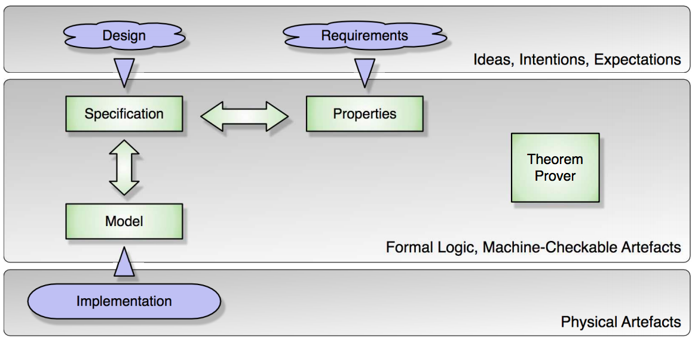

# Formal Verification for Policy Configurations

## Overview
To borrow from an AWS paper [[0]], the origin of this discussion is:

> The security challenge for many ... is becoming one of reasoning about
> static policies for their dynamic systems. Cloud [users] want a tool that
> allows them to check policy configurations based on their security
> requirements.

Let's first define what I mean by "verification". In simplest terms it is a
means to tell that a program was built as _intended_. To say if the
appropriate program was built for a particular job requires "validation".
Verification is what I attempt to formalize, whereas validation relies on
testing and review. In short, I can formally verify whether a security policy
does what I intended; I still must validate whether what I intended in the
context of all possible attacks stops attackers. For example, I might
construct and formally verify a bucket access policy that restricts access to
data, but then put the access token in a public github repo for anyone to use.

OVERVIEW DIAGRAM [[2]] 

## Definitions and Terms

"Formal" means I have something symbolic, i.e. mathematical formulae. Of
course, using human prose, or diagrams, or pictures, I can do both
verification and validation of a sort today, but machines cannot completly
automate the proof of correctness from these less specific notations (not yet).
It is assumed that machine proofs are more reliable than manual processes,
especially when such manual processes are ad hoc and the proofs are highly
complex. Even if/when AI exists where diagrams go in and proof comes out, it
would probably convert diagrams to intermediate symbolic formulae.

Formal verification is discussed here in the context of security policy
(formal verification could be used to verify other types of security
properties). A "security policy" is the statement of human _intent_ for a
system that constraints:

* who can use it (human or machine actors)
* what operations are allowed by those actors
* what resources can be accessed or modified by those operations (leaving
resources undefined, could be services, VMs, data)
* which capabilities are required by those operations

As such, a security policy is simply a collection of intended constraints on
the above that can be expressed in human language (possibly supplemented by
diagrams and other notation), ignoring any particular format or framework. We
haven't bound the intent to any particular software implementation yet.

Next we need a "specification" that refines this intent (security policy
constraints) into something machine readable, but not yet as specific as a
logic language.  I like specification here instead of model, since I think
model is overloaded with myriad meanings to practitioners of different
methodologies. I've seen "contract" also used.

The specification encodes the desired constraints as properties that can be
evaluated to make a decision about a given behavior/operation in the cloud
native system.

A "specification parameter" is a variable declared in the specification.

"Context" are inputs to the policy used during policy evaluation; context
binds specification parameters to particular values. For example AWS considers
the Context to be "the principal making the request, the resource being
requested, and the specific action being requested." [[0]]. Another
example might be a snapshot of the network. Or an API call with the values
passed
into the API.

With a policy intent, the specification, and context defined we can now
construct an actual security policy "encoding". This is probably what most
devops users would imagine when talking about a _security policy_.  It's a
specific language expression, e.g. JSON or Rego or yaml, that encodes the
desired system properties in expressions that software can process and make
_allow_ or _deny_ or other types of decisions.

A "policy configuration" is a combination of a policy encoding (e.g. a
particular set of parameterized expressions to be validated) combined with the
context/inputs fulfilling the parameters that the specification allows.

ASIDE: the specification can be distinct and separate from the policy encoding
itself, though some like AWS Zelkova seem to use the policy language itself
_as_ the specification language: "The property to be verified is specified in
the policy language itself, eliminating the need for a different specification
or formalism for properties." [[0]]

## Policy Formal Verification

Once we define the intent, the specification and parameters, the policy
encoding, and context/inputs, we now desire a tool that can query the policy
configurations (policy+context) with respect to a parameterized specification
(intent expressed as properties) so we can verify whether the policy
configurations meet the specified security requirements for a particular
system state. In other words, can we _prove_ that the constraint(s),
specification(s), encoded properties, and input(s) for a given decision(s) are
consistent and valid, ie correct, with respect to the intent(s)? And do it at
scale, reliably, in a protean operating environment?

This is where formal verification helps. To quote[[2]]:
> "With the translations from ideal concepts and from the physical world into
formal logic, that we can use the tool of formal proof ... we are able to make
formal correctness guarantees with an absolute degree of assurance. Even in
the less than perfect real world, with machine-checked proof we can achieve a
level of assurance about our formal statements that surpasses our confidence
in mathematical theorems which we base all of physics and engineering on."

As others have observed [[4]], there exist several formal methods
to prove the correctness with respect to constraints, specification,
properties and inputs. _The trade-off is between the expressiveness of the
logic and the degree of automation_. For example it is difficult to write the
required logical formulae for SAT solvers, and difficult to understand the
resulting formalisations, but SAT solvers provide a high degree of automation
[[10]]. SMT solvers provide a good balance between speed and
expressiveness, providing decision procedures for bitvectors, arithmetic, and
arrays, though SMT solvers have limitations [[11]],[[12]].
Zermelo-Fraenkel Set Theory (e.g. [Z notation](https://en.wikipedia.org/wiki/Z_notation) )
or Higher-Order Logic[[13]] make it easier to express properties
and specifications precisely and in a readable way, but they require human
effort and expertise in performing the interactive, machine-assisted and
machine-checked proof. Intermediate examples include model checking
(algorithmic verifcation) [[14]] and automated first-order theorem
proving (deductive verifcation)[[15]],[[16]],[[17]],[[18]].

### Trivial Example

Let's consider a hypothetical trivial use case: a Kubernetes operator has an
Admission Control policy intent, e.g. don't allow pods with label "foo" in
namespace "bar", and wants to reliably verify their encoded policy does that
(and also ensure it _does_ allow a "foo" pod to deploy into other namespaces,
eg "baz").

This is expressed in our specification as something like:

"foo" in pod.labels & node.namespace = "bar" =>
node.namespace = "bar" | ( "bar" not in node.namespaces & node.namespace = Nil)

This is translated to boolean variables:

~p1 | ~p2 | p3 | (p4 & p5)

A theory solver checks its satisfiability given values for the context of the
system with its existing policies and labels and namespaces:

UNSAT

* pod.labels: "foo,baz"
* pod.node.namespace = "bar"

UNSAT

* pod.labels: "baz"
* "bar" in node.namespaces
* pod.node.namespace = Nil

In the above example, the parameterized specification describes how the
kubernetes pod and namespace topology must be constrained. Using this, the
desired tool can answer yes/no questions about specific inputs, or perhaps
provide an list answer of all pod-namespace combinations allowed or denied by
the policy. As the scale and complexity of the Kubernetes cluster(s) grows,
with dozens/hundreds of labels and namespaces and many possibly conflicting
policies deployed by other users for pod admission control, these questions
become increasingly more difficult to process manually, with any confidence.

## More Use Cases/Stories

These are some example ideas I've heard in various calls and threads that the
tool should improve if not completely automate:

* Human operator wants to ask questions about users and resources under a
policy or set of policies:
  * Is resource X accessible by a particular user Alice?
  * Can any user deploy to this namespace?
  * is one policy less-or-equally permissive than another? put another way,
  check whether a policy is over or under-constrained with respect to another
  one.
  *  Did I deny access to authorized users unintentionally? If so which ones?
  Which policy did that?
* Operator wants to ask questions about the network:
  * Is access to a resource allowed from a certain set (or all, or empty set)
  of IP addresses? If so which? If not which policy is granting access to
  which IPs? Which are blocking access?
  * Are there any NetworkPolicies, Endpoints, or Pods in namespace ‘Web’ that
  are labeled as ‘Bastion’?
  * All nodes/pods in the subnet “Web” can access all network nodes in the
  subnet “Database”?
  * only nodes/pods that have the label "dmz" have port 22 (SSH) accessible
  from the internet.
* Human needs to show a reviewer/auditor that there are no missing or
superfluous policies.
* Human gets a particular response from the combined set of policies (or one
very large policy) under test (ACCEPT/DENY) and wants to see the particular
policies or policy rules responsible for the response.
* Human wants to understand the impact of changing policy P to P'. Enumerate
the users or resources that will be affected and how.
* CI/CD or daemon running software wants to continuously monitor a stream of
configuration changes and validate the updated configurations against their
respective specifications,
  * report and alert on the validation
  * Alerts raised should contains detailed difference info that can be used to
  deduce the changes needed to correct the policy configuration
* "return to the user a concrete request context using the model generated by
the SMT solver when performing the check. The concrete request context will
provide information to the user on why a certain check passed or failed." [[0]]
* "support for recommending policy repairs in cases when the policy fails a
certain check." [[0]]
* provide a "defense-in-depth-o-meter"

Considering the above "policy" examples:
* it might be a policy to grant or deny user access to a resource in a multi-tenant
cluster,
* or it might be a policy that requires certain syscall activity to be
monitored on some pods with certain labels,
* or it might be a policy that says network traffic that is regulated by PCI
or HIPAA should be read-only to some microservices but writeable by others,
* or it might be a policy that specifies some alert action to be triggered
when a given audit event occurs;
* deny microservices granting unrestricted access to data stores
* deny write requests to data stores that do not have encryption configured
* deny deployments of load balancers that do not use https traffic
* check compliance whenever a new resource is created or the policy attached
to it is changed.

An ongoing task in this effort is to catalog the fuller set of interesting use
cases/stories and map the enumeration of those to specific features of the
verification tool.

## What Can I Do Today?

As a devops person responsible for answering the question "are we secure?"
today, there are some things one can do today given  time, money, people, and
focus. These have been built in some form or another already, so I could
modify or improve existing examples:

* look for patterns in policies, e.g., the use of a wildcard that makes
resources publicly accessible.
* attempt to explicitly enumerate all possible requests to a policy (test
generator, record/playback)
* use commercial tools or cloud-specific tools provided by my public cloud
host (Zelkova, SecGuru)
* define a mapping/translation from a given policy to a logic notation and
then convert that to boolean (SAT) or more complex formulas (SMT) and then
check if the formulas are satisfiable.
  * eg encode policies as bit vectors and use [Z3 solver](https://rise4fun.com/z3/) [[1]]
  * eg use FormuLog as the specification and use [Z3 solver](https://rise4fun.com/z3/) [[6]]
  * eg use Souffle to evaluate a Datalog specification as discussed in [[5]]
* model policy as a workflow, automata, or FSM (e.g. PrT nets) and use
temporal logic [[24]], [[25]], [[26]], [[27]], [[28]], [[29]]
* use graph algorithms [[22]]
* read review papers [[23]]
* write up GHIs on Formal Verification, and hope smarter people jump in and
magically make the world a better place :)

## Possible Action Items and Next Steps
* We could collect real world policy examples and/or generate test policies to
reverse engineer the requirements for policy configuration.
* We could create de novo the security policy requirements by reviewing
existing code and design notes and extracting a more thorough requirements
document that can be translated into some form of a machine readable
specification.
* Once we have a solid requirements document, we can create a formal
specification for various facets of kubernetes and other CNCF projects and
encode the security specification in some symbolic language.
  * admission control policy
  * RBAC policy
  * network policy eg Tiros [[3]]
* We can use Z, TLA+, Alloy, Souffle [[4]], Scheme[[20]], [[21]],
Rego, (modified) datalog, or come up with something new as the specification language
* The human operator can then write a new policy and run a tool that uses the
specifications for various parameterized operations to verify the policy
* Human operator or a tool would somehow need to collect, enumerate, generate,
or in some way bind inputs to the parameters of a specification:
  * eg. LDAP data, namespace list, IP addresses, buckets, keys, CIDRs, etc

## Open Questions, Challenges

* To bootstrap, it is sufficient to formally verify the policy only, or must we first
formally verify the policy enforcement software (e.g. OPA, CNI plugins, etc)? Or can
we "compose" a formal structure within an unverified environment akin to UC [[30]] ?
* bounded or unbounded analysis? unbounded is NP-complete or maybe NP-hard.
Using wildcards is PSPACE-complete but practical [[0]].
* ordering constraints on statements in a policy, eg. firewall rules
* policy language constructs such as loops or dynamically allocated arrays
* per AWS: solvers seem very sensitive to small changes in the input encoding,
where a quickly solved problem in our domain becomes non-terminating. Yet, the
theory of regular expressions is decidable. how current is this observation?
Zelkova "solves regular expression problems using the
standard translation to deterministic finite automata (DFAs) via
non-deterministic finite automata (NFAs). It uses Hopcroft’s algorithm for DFA
minimization...treats each regular expression match as an atom...how to
integrate this into the traditional Nelson-Oppen framework?"
* Consider Z3 string support and CVC4 compatible[[7]],[[8]] string
solvers?
* Can we combine theorem provers with symbolic execution techniques [[19]]?

## Author: [@rficcaglia](https://github.com/rficcaglia)

## Thanks To Feedback From:

* [@copumpkin](https://github.com/copumpkin)
* [@ericavonb](https://github.com/ericavonb)
* [@hannibalhuang](https://github.com/hannibalhuang)
* [@justincormack](https://github.com/justincormack)
* [@timothyhinrichs](https://github.com/timothyhinrichs)
* [@tsandall](https://github.com/tsandall)

[0]: https://d1.awsstatic.com/Security/pdfs/Semantic_Based_Automated_Reasoning_for_AWS_Access_Policies_Using_SMT.pdf
[1]: https://sites.cs.ucsb.edu/~bultan/publications/sttt08.pdf
[2]: http://ts.data61.csiro.au/publications/nicta_full_text/955.pdf
[3]: https://d1.awsstatic.com/whitepapers/Security/Reachability_Analysis_for_AWS-based_Networks.pdf
[4]: https://souffle-lang.github.io/docs.html
[5]: http://discovery.ucl.ac.uk/10067190/1/Subotic_10067190_thesis.pdf
[6]: https://github.com/HarvardPL/formulog
[7]: http://theory.stanford.edu/~barrett/pubs/LRT+16.pdf
[8]: https://www.cs.utexas.edu/users/hunt/FMCAD/FMCAD18/papers/paper27.pdf
[9]: https://pdfs.semanticscholar.org/5988/5d51177d628565c94542373aba78debe89bc.pdf
[10]: https://resources.mpi-inf.mpg.de/departments/rg1/conferences/vtsa09/slides/schulz.pdf
[11]: http://www.it.uu.se/research/group/astra/CPmeetsCAV/slides/piskac.pdf
[12]: https://stackoverflow.com/questions/11592472/limits-of-smt-solvers
[13]: http://www.cse.unsw.edu.au/~kleing/papers/sosp09.pdf
[14]: https://www.cl.cam.ac.uk/techreports/UCAM-CL-TR-601.pdf
[15]: http://theory.stanford.edu/~zm/papers/cav96dmc.ps.Z
[16]: https://crypto.stanford.edu/~uribe/papers/frocos2000.pdf.gz
[17]: https://pdfs.semanticscholar.org/5988/5d51177d628565c94542373aba78debe89bc.pdf
[18]: http://theory.stanford.edu/~barrett/pubs/MRT+17.pdf
[19]: http://klee.github.io/publications/
[20]: https://ws680.nist.gov/publication/get_pdf.cfm?pub_id=921189
[21]: https://lmeyerov.github.io/projects/margrave/paper.pdf
[22]: https://ws680.nist.gov/publication/get_pdf.cfm?pub_id=922390
[23]: https://pdfs.semanticscholar.org/810e/a64193f974f3cb4e9a2a1a93e4e975c41e1f.pdf
[24]: https://www.mouelhi.com/uploads/1/8/2/6/1826097/sacmat12-xu.pdf
[25]: https://ksiresearchorg.ipage.com/seke/seke17paper/seke17paper_162.pdf
[26]: https://en.wikipedia.org/wiki/Promela
[27]: https://en.wikipedia.org/wiki/SPIN_model_checker
[28]: https://www.researchgate.net/publication/221585943_Conformance_Checking_of_RBAC_Policies_in_Process-Aware_Information_Systems/link/02e7e51cea9031151c000000/download
[29]: http://www.sis.pitt.edu/jjoshi/courses/IS2620/Spring11/reading_files/04385334.pdf
[30]: https://eprint.iacr.org/2000/067.pdf

### Historical Note

This started with a Policy-WG call on 6/5/2019 where we discussed how/if
policies might be formally verified, and then subsequent comment and
discussion on https://github.com/cncf/tag-security/issues/196 .

### Post-Script
Since the start of this discussion, the [CapitalOne data loss incident](https://news.ycombinator.com/item?id=20565014)
[concretely demonstrates](https://krebsonsecurity.com/2019/08/what-we-can-learn-from-the-capital-one-hack/)
how relatively simple policies...e.g. assign only the minimally necessary
permissions to components ... are [not being adequately enforced in real
world, industrial scale environments](https://news.ycombinator.com/item?id=20568708).
It would be great to have a tool to automate policy proofs when someone wants
a "temporary" monkey patch policy to circumvent the
expected/intended/reviewed/approved policies, both when the change is
proposed, and even if/when it is jammed in for "agile" reasons, to continually
alert of its continued presence so it can be removed in a
timely manner. Say for example an overly permissive WAF policy?
¯\_(ツ)_/¯
