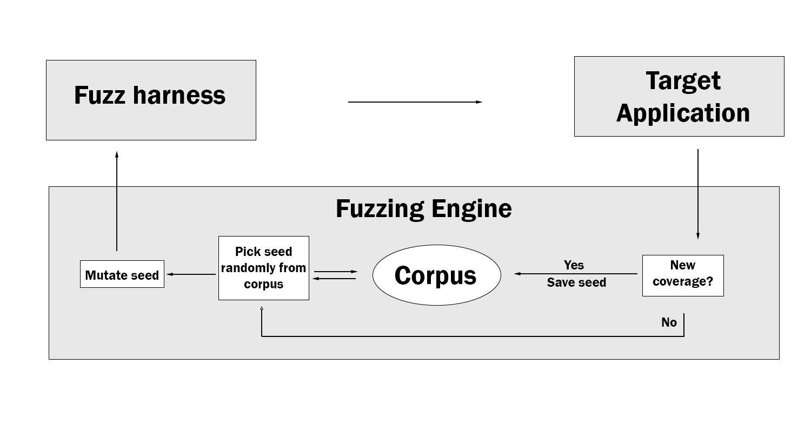
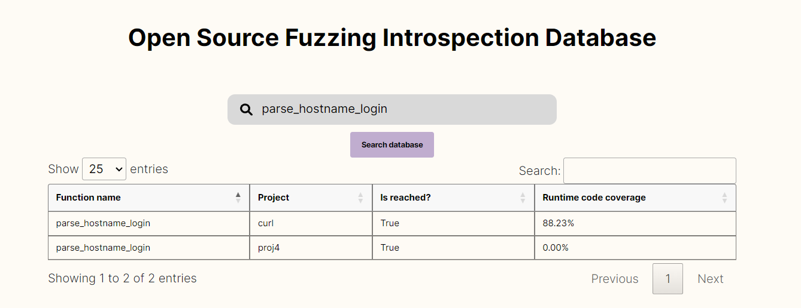
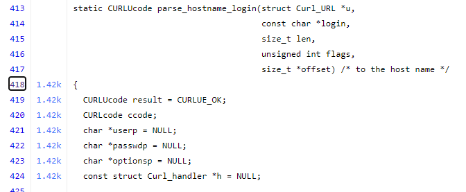
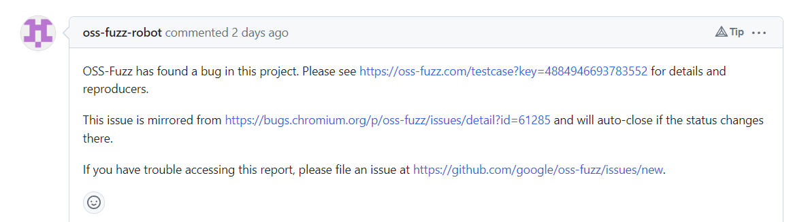
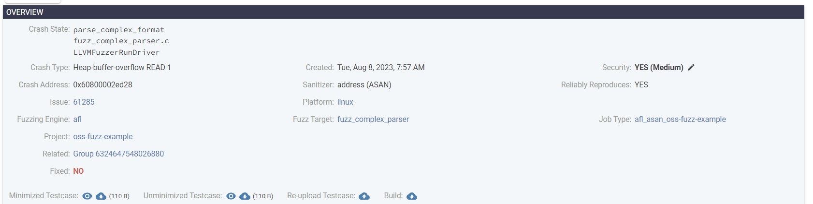
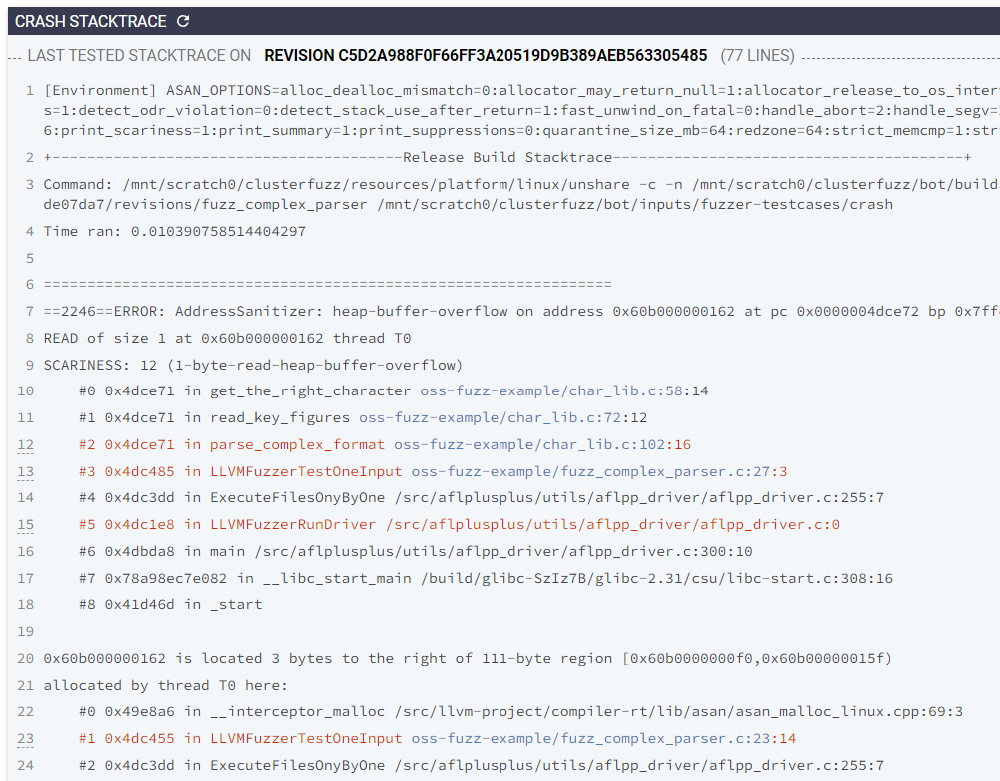
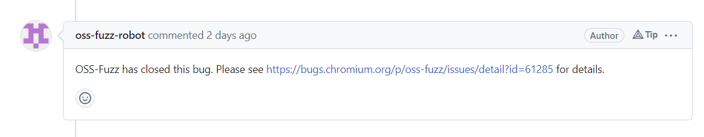
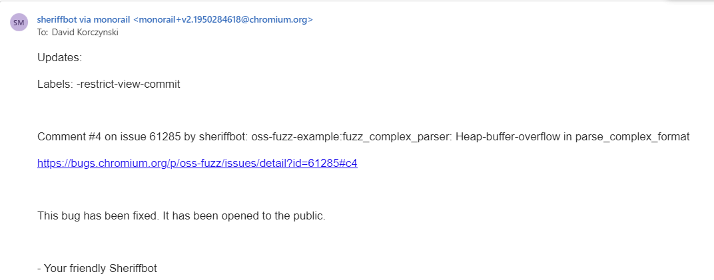
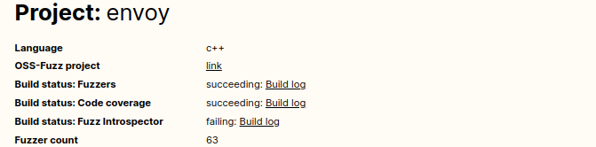

---
title: "CNCF Fuzzing handbook"
author: [David Korczynski, Adam Korczynski]
date: "2023-10-18"
subject: "Markdown"
keywords: [Markdown, Example]
subtitle: "A handbook for fuzzing open source software"
lang: "en"
book: false
titlepage: true
colorlinks: true
titlepage-color: "8545AF"
titlepage-text-color: "FFFFFF"
titlepage-rule-color: "FFFFFF"
titlepage-rule-height: 2
toc: true
toc-own-page: true
footer-left: "\\thetitle"
footer-center: ""
titlepage-logo: "imgs/cncf-stacked-color.png"
...

# Introduction

This paper introduces fuzzing to provide developers and security researchers a technical reference on navigating the open source fuzzing ecosystem. The paper introduces how to get started with fuzzing, how fuzzing is used by CNCF projects and how to establish a continuous, long-term fuzzing effort using open source frameworks. The goal is to provide a paper outlining the connection between several open source projects that together can be used in a modern software development cycle to provide continuous software security assurance.

The paper is primarily focused on technical concepts. However, it has sections throughout that outline higher-level concepts and provide guidance on how to set up fuzzing into the development workflow without digging into lower-level technical details. This information can be useful for project leaders as a reference for navigating fuzzing and directing a wider fuzzing effort.

Fuzzing is a tool used for finding security and reliability issues in software. In other words, fuzzing is a helpful way to find bugs in software and some of these bugs also constitute vulnerabilities that can be exploited by an attacker. In fact, fuzzing is a commonly used technique for offensive operations for the purposes of finding vulnerabilities that can be exploited, and to this end a motivator for why developers should fuzz is because “otherwise the attackers will”.

Fuzzing has had a significant increase in use since the early 2010s. However, fuzzing is a concept that has been around for more than thirty years that  originates from academic literature and has also been a recommended practice in professional software development for many years. For example, fuzzing is a recommended practice in Microsoft’s secure development lifecycle since 2004. As such, fuzzing is a concept that has been known and used for a long time and is becoming increasingly ubiquitous.

Today, fuzzing is found in many modern software development workflows and a large set of open source software uses fuzzing. For example, the open source fuzzing service [OSS-Fuzz](https://github.com/google/oss-fuzz) is currently fuzzing more than 1000 open source projects continuously. It is also integrated into the continuous integration lifecycle with, for example, many software projects using fuzzing to analyze commits and pull requests before they land in a given project. OSS-Fuzz is an example of how successful fuzzing is, having found more than 5000 security issues in open source projects and tens of thousands of reliability issues.

The focus of this handbook is to gather a collective approach to modern day source code fuzzing. The aim of the handbook is to provide the necessary information for developers to integrate fuzzing into their development processes to find security and reliability bugs continuously.

## Audience
The primary audience for this handbook are developers, software engineers and security engineers interested in using fuzzing to secure an open source project. More broadly the handbook is also relevant for project leaders and managers aiming to set up a strategy to enable fuzzing into the software development lifecycle of a given open source project. Finally, the handbook is also relevant for the equivalent audience interested in fuzzing closed source fuzzing, although some topics that will be discussed throughout the book are not as easily accessible in the closed source world as they require setting up custom infrastructures which may not be trivial.

## Scope
The goal of the book is to enable the reader to set up continuous fuzzing for their open source project. As such, the book is focused on:
- Introducing the foundations of fuzzing
- Introducing the first steps for programmatically setting up fuzzing
- Introduce the steps for setting up continuous fuzzing using open source services
- Introduce case studies and references to where further information can be found, focusing on where to find mature open source projects that heavily use fuzzing.

## Non-goals
Fuzzing is a technique that has many faces and can be performed in a myriad of ways. In fact, researchers are constantly finding new ways of applying fuzzing and new ways of adjusting core fuzzing concepts to improve bug finding capabilities. This handbook will not exhaustively cover fuzzing, and there are many more avenues to explore besides those mentioned in this book.

## Assumptions
The handbook assumes the reader has practical experience with programming, managing a linux command line and experience with handling containers. Throughout the handbook we have a lot of examples that can be replicated on a recent Ubuntu machine and in order to get most out of this handbook it’s necessary to replicate some of these examples to get first hand practice.


\newpage

# Fuzzing introduction
This chapter goes over background concepts of fuzzing and gives a practical demonstration of these concepts. It also introduces specific open source tools that are heavily used by CNCF projects to manage large scale fuzzing efforts. The chapter aims to gently introduce technical aspects that lay the ground for further studies on fuzzing, as well as provide concept descriptions that can be used to further discuss fuzzing.

## Fuzzing foundations
Fuzzing is a program analysis technique closely connected to testing. In testing, a common practice is to execute code using a fixed input setting. In fuzzing, the testing is done using pseudo-random data as input to a target piece of code, meaning the target code is run over and over again with pseudo-random data as input. The goal of fuzzing is to discover if any arbitrary input can lead to a bug in the target code. For example, a simple way to fuzz a modern browser is to generate random files and then open each file in the browser with the goal of identifying potential patterns that can cause issues in the browser.

The common set up when fuzzing a piece of software is to construct a fuzzing set up for the code and then run this fuzzer for an extended period of time, and monitor if any bugs occur in the target code during the process. The fuzzer can be run in many settings, including running it locally locally, as part of a CI/CD pipeline or part of a larger management framework for handling the running of fuzzers. The specific time run for the fuzzer ranges from a few minutes to hundreds or even thousands of hours.

The core technique of fuzzing is simple in that it executes target code indefinitely using pseudo-random input. However, fuzzing comes in many flavors and in this handbook we will be concerned with the concert of coverage-guided fuzzing. This is a technique that relies on monitoring the target code under to extract the specific code executed by a given input, and use this to improve generation of pseudo-random input to increase likelihood of generating new inputs that trigger unique code paths. Coverage-guided fuzzing has had a significant impact on fuzzing in the last 15 years and is the most common fuzzing technique used in modern software development.

 As a technical concept, fuzzing a given software package is closely related to testing the software. Specifically, the code to write to enable fuzzing is closely related to how a test looks like. However, under the hood fuzzing often relies on advanced program analysis techniques to instrument the target code, techniques for improved bug-finding capabilities and may need adjustments to the way a given software is built, e.g. by using specific compilers and compiler flags. The technical details further depend on the language the target software is written in, and in this handbook we will cover fuzzing for C/C++/Golang and Python.

The reason why fuzzing is highly advocated is because it is a proven technique for finding security and reliability issues in software and the following list is a small list of many success stories from fuzzing:

- The trophies of OSS-Fuzz as of August 2023 lists that more than 36,000 bugs across 1,000 projects have been found.
- Fuzzing has helped uncover more than 1200 issues in CNCF projects as detailed here.
- Mozilla has found more than 6450 Firefox bugs using fuzzing as detailed here.
- Fuzzing helped uncover a bug in Golang that could take down the entire Ethereum network as detailed here.
- Fuzzing has helped uncover 4 CVEs in Helm as detailed here.
- The Android Open Source Project is heavily relying on fuzzing to detect code bugs as detailed here.
- Istio found a high severity CVE and more than 40 crashes using fuzzing as detailed here.
- Golang supports fuzzing natively as of Go 1.18.

## Fuzzing core components

To describe the foundations of fuzzing from an applied perspective the fuzzing process can be divided into three software compartments that each have a logical separation from a fuzzing perspective:

1. **The target application:** This is the software package that is intended to be analyzed for bugs.
2. **The fuzzing engine:** This is a general purpose fuzzing library. Likely, there will be no need to know much about these libraries for the majority of use cases.
3. **The fuzzing harness:** A small code stub that connects the fuzzing engine and the target application. Fuzzing harness is sometimes called Fuzzing driver, and we will use the two interchangeably. This is the code where the one applying fuzzing to analyze a codebase will do most, if not all, the work.

The relationship between the three components can, from a simplified perspective, be visualized as follows:


### Example of fuzzing core components
The following example illustrates the three core components in a concrete manner. Suppose there is a library called parseHelpersLib and this library has an API called parseUntrustedBuffer which takes as input a buffer of data and does some processing on the data. Now, the developer of parseHelpersLib would like to analyze parseUntrustedBuffer for security and reliability issues and decides to use fuzzing for this. The target application in this case is parseHelpersLib. To do the fuzzing, the developer creates a fuzzing harness, which is a small code stub that takes as input a raw byte buffer and parses this raw byte buffer directly into the parseUntrustedBuffer API. At this point, the remaining piece that the developer needs is a fuzzing engine that can combine the developed harness with the target application.

In order to make the fuzzing work the developer compiles the fuzzing harness and the target application using a compiler that has a built-in fuzzing engine, meaning, the fuzzing engine is simply something the compiler provides. In this example the compiler is clang. After compilation, the produced executable will, when run, execute the code stub of the harness over and over again with pseudo-random input. In the following we use a simple C-language set up to show this example:

*parseHelpersLib.h*:

```c
#include <stdint.h>
#include <assert.h>
#include <stdlib.h>

int parseUntrustedBuffer(const uint8_t *buffer, size_t size) {
        if (size < 2) {
                return -1;
        }
        if (buffer[0] == 'A') {
                if (buffer[1] == 'B') {
                        assert(0);
                }
        }
    return 0;
}
```

The question in place for the fuzzer in this case is whether it will come up with a buffer that triggers the `assert(0)` statement. Consider the harness:

```c
#include <stdlib.h>
#include <stdint.h>
#include "parseHelpersLib.h"

extern int parseUntrustedBuffer(const uint8_t *buffer, size_t size);

int LLVMFuzzerTestOneInput(const uint8_t *data, size_t size) {
        parseUntrustedBuffer(data, size);
    return 0;
}
```

Then, to compile the harness with a fuzz engine we use the following commands:

```bash
clang -fsanitize=fuzzer-no-link,address -c ./parseHelpersLib.c -o parseHelpersLib.o
clang -fsanitize=fuzzer-no-link,address -c ./fuzzHarness.c -o fuzzHarness.o
clang -fsanitize=fuzzer,address fuzzHarness.o parseHelpersLib.o -o fuzzHarness
```

Finally, we can run the produced executable, which in this case engages the fuzzing:

```bash
./fuzzHarness
#2      INITED cov: 3 ft: 4 corp: 1/1b exec/s: 0 rss: 30Mb
#4      NEW    cov: 4 ft: 5 corp: 2/3b lim: 4 exec/s: 0 rss: 30Mb L: 2/2 MS: 2 ChangeByte-InsertByte-

#138    NEW    cov: 5 ft: 6 corp: 3/7b lim: 4 exec/s: 0 rss: 31Mb L: 4/4 MS: 4 ChangeASCIIInt-InsertByte-CrossOver-InsertByte-
#252    REDUCE cov: 5 ft: 6 corp: 3/6b lim: 4 exec/s: 0 rss: 31Mb L: 3/3 MS: 4 ShuffleBytes-ChangeBinInt-ChangeByte-EraseBytes-
#276    REDUCE cov: 5 ft: 6 corp: 3/5b lim: 4 exec/s: 0 rss: 31Mb L: 2/2 MS: 4 CopyPart-CrossOver-CopyPart-EraseBytes-
fuzzHarness: ./parseHelpersLib.c:11: int parseUntrustedBuffer(const uint8_t *, size_t): Assertion `0' failed.
==6747== ERROR: libFuzzer: deadly signal
    #0 0x563a9e1e8ae1 in __sanitizer_print_stack_trace (/home/dav/code/fuzzing-handbook-2023/fuzzHarness+0xe4ae1) (BuildId: f722a2a8046c764bff01ed2b86617cab07e7f185)
    #1 0x563a9e15b378 in fuzzer::PrintStackTrace() (/home/dav/code/fuzzing-handbook-2023/fuzzHarness+0x57378) (BuildId: f722a2a8046c764bff01ed2b86617cab07e7f185)
    #2 0x563a9e140df3 in fuzzer::Fuzzer::CrashCallback() (/home/dav/code/fuzzing-handbook-2023/fuzzHarness+0x3cdf3) (BuildId: f722a2a8046c764bff01ed2b86617cab07e7f185)
    #3 0x7fc8a044251f  (/lib/x86_64-linux-gnu/libc.so.6+0x4251f) (BuildId: 69389d485a9793dbe873f0ea2c93e02efaa9aa3d)
    #4 0x7fc8a0496a7b in __pthread_kill_implementation nptl/./nptl/pthread_kill.c:43:17
    #5 0x7fc8a0496a7b in __pthread_kill_internal nptl/./nptl/pthread_kill.c:78:10
    #6 0x7fc8a0496a7b in pthread_kill nptl/./nptl/pthread_kill.c:89:10
    #7 0x7fc8a0442475 in gsignal signal/../sysdeps/posix/raise.c:26:13
    #8 0x7fc8a04287f2 in abort stdlib/./stdlib/abort.c:79:7
    #9 0x7fc8a042871a in __assert_fail_base assert/./assert/assert.c:92:3
    #10 0x7fc8a0439e95 in __assert_fail assert/./assert/assert.c:101:3
    #11 0x563a9e21996c in parseUntrustedBuffer (/home/dav/code/fuzzing-handbook-2023/fuzzHarness+0x11596c) (BuildId: f722a2a8046c764bff01ed2b86617cab07e7f185)
    #12 0x563a9e219794 in LLVMFuzzerTestOneInput …
```

The running of the fuzzer quickly found a way to trigger the `assert(0)` in the target library, meaning it found input that passed the relevant conditions. In this example the three fuzzing components are:

- **The target application:** `parseHelpersLib.h`
- **The fuzzing engine:** libFuzzer, which is part of clang.
- **The fuzzing harness:** `fuzzHarness.c`

It is common for the fuzzing harnesses to be less than 100 lines of code, although in general harnesses can be arbitrarily large. The size of the harness often comes down to how much data needs to be constructed based on the raw buffer provided by the fuzzing engine. In many cases the raw buffer can be used to directly pass it through to the target application, although in other scenarios the harness will be constructed so the buffer is used as a seed to create complex data objects. An example highlighting this contrast is fuzzing an image parser versus a micro service. In the case of an image parser it’s likely possible to use the raw buffer as “the image” whereas in order to fuzz a micro service the raw fuzzer buffer has to be transformed into higher level data formats that the micro service can understand.

## Fuzzing lifecycle

The fuzz harness runs from a code perspective in an infinite loop. For example, consider the following simple fuzzing harness:

```c
#include <stdlib.h>
#include <stdint.h>

int LLVMFuzzerTestOneInput(const uint8_t *data, size_t size) {
    if (size == 123) {
    	printf("Size 123\n");
    }
    else {
    	printf("Not size 123\n");
    }
    return 0;
}
```

ompiling this and launching the fuzzer in a manner similar to Example 1 will result in the binary running forever. In each iteration of the fuzzer it will either print “Size 123” or “Not size 123”, however, by default it will never stop. This can seem counterintuitive at first, partly because it signals that there is no notion of “completeness” when fuzzing, as opposed to testing. This is correct in the sense there is no single truth value denoting if the fuzzing is complete or not, it is by nature an infinite while loop. To this end, a harness is generally run until either one of the conditions hold:

1. A timeout has been reached;
2. The fuzzer found a bug and, therefore, exits.

The goal of the fuzzing harness, from a simplified perspective, is to explore as much of the code in the target application as possible and it does this by executing the target application with semi-random data buffers over and over again. Therefore, it is up to the fuzzing engine to provide different values to the fuzzing harness and measure the success of the exploration, whereas it is the responsibility of the fuzzing harness to transform this data buffer into something that is digestible by the target application.

In order to measure the code exploration, the fuzz engine relies on measuring code coverage of the target application when executing the fuzzing harness with a given data buffer. As such, after each execution of the fuzzing harness the fuzz engine will measure what code was executed in the target application and if the code executed is unique/different to the code covered by previous harness runs, the fuzz engine will save the data buffer into its corpus set. In this sense, the corpus set will grow continuously over time the more code is explored. We can visualize this using an adjusted figure of the fuzzing harness lifecycle:



### Continuous fuzzing

The fuzzing harness will run forever if no bug is found or timer is set. In practice, a harness is always run with some form of timer. In addition to this, in practice it’s not the same harness that is run each time but rather the result of building all of the fuzzing components and in particular:

- When changes in the target application happen, the harness should be rebuilt and run.
- When changes in the harness happen, the fuzzing harness should be rebuilt and run.

For this reason, the management of a fuzzer often involves both the rebuilding of the fuzzer as well as running. Furthermore, there are many more tasks that occur than simply running the fuzzers and continuous fuzzing frameworks perform a myriad of tasks, including:

- **Crash management:** when a fuzzer finds a bug, this bug needs to be presented and handled by the developers. There are various tasks involved here, such as accurately creating a minimized reproducer testcase, sharing the details with the developers, following-up if issues are fixed and so on.
- **Multiple environments:** fuzzing is by nature a dynamic analysis technique, meaning code is built and executed. However, many software packages support diverse architectures, maybe diverse configurations and fuzzing itself can come in different environments, e.g. diverse fuzzing engines and sanitizers. Ideally the code should be fuzzed in each of the various combinations.
- **Fuzzer execution prioritization:** when a project has developed many different fuzzers there is a difference between how successful each fuzzer is. For example, some fuzzers may explore more code than others. Ideally the fuzzing infrastructure should prioritize running fuzzing harnesses that have a higher chance of discovering issues or perhaps target more severe code.
- **Handling of various languages:** fuzzing can be applied against software in many different languages, however, each of these languages have differences in them and sometimes the runtime environment is quite different between them. Ideally the fuzzing infrastructure should support managing fuzzing harnesses from different languages.
- **Authentication, authorisation and permissions:** issues found by fuzzing harnesses in a large-scale fuzzing solution should not be viewable by all. In fact, it’s likely there needs to be a lot of separation between the information available in the fuzzing infrastructure and it should handle this in a secure manner.
- **Introspection capabilities:** fuzzing is difficult to assess in terms of how well it’s doing and the options for improvements. It is crucial for a fuzzing infrastructure to provide optimal insights into the status of the fuzzing for each individual package being fuzzed.

For these reasons, there are modern infrastructures in place that offer many of these features. Two of the most well-known include [Clusterfuzz](https://github.com/google/clusterfuzz) and [OneFuzz](https://github.com/microsoft/onefuzz). This course will focus on the OSS-Fuzz platform since this is a front-end to Clusterfuzz and offers freely available fuzzing infrastructure for open source projects.


## Open source software for fuzzing
This handbook is focused on fuzzing open source space. In practice, the concepts apply equally to fuzzing closed source software, however, some of the tools may not be as well suited for closed source software as they are tailored to the open source ecosystem, such as the use of publicly available source code control systems. This section will introduce several open source projects that focus on fuzzing and that will be referenced through the handbook.


### Fuzzing engines
Fuzzing engines are at the core of open source fuzzing. The engines are what enables us to fuzz in the first place and there are many great open source fuzzing engines available. The following is a non-exhaustive list of open source fuzz engines.

Fuzzing Engine | Target Language | URL |
|---|---|---|
libFuzzer      | C/C++           | https://llvm.org/docs/LibFuzzer.html |
AFL++          | C/C++           | https://github.com/AFLplusplus/AFLplusplus |

We will not go into detail with the individual engines as such, but rather point out that there are engines available for a variety of languages. There are more engines available for analyzing C/C++ code as this is where the majority of fuzzing research efforts are placed. However, in recent years a handful of novel engines for memory safe languages have appeared. Most of these engines rely on the C/C++ engines under the hood, and in particular rely on libFuzzer, as a way of utilizing well-understood and proven tools for new codebases.

### OSS-Fuzz
The open source ecosystem for fuzzing is vast. This is true for both fuzzing engines, fuzzing harnesses and also infrastructures for managing large-scale fuzzing efforts. A central piece of open source fuzzing is the [OSS-Fuzz service](https://github.com/google/oss-fuzz), which is a free online service run by Google where open source projects can integrate a fuzzing set up to OSS-Fuzz, and OSS-Fuzz will then continuously build, run and manage the fuzzing itself.

In order to integrate with OSS-Fuzz the primary task at hand is to set up a small shim that makes it possible for OSS-Fuzz to build a given project and also develop a set of fuzzers for the given project. Once this has been achieved, then OSS-Fuzz will build and run fuzzers continuously, as well as provide analyses and data on how to improve the fuzzing set up. We will go into details with OSS-Fuzz in a later chapter.

### CNCF-Fuzzing
The CNCF maintains a repository related to fuzzing CNCF projects [here](https://github.com/cncf/cncf-fuzzing). It generally follows a set up similar to OSS-Fuzz with a /projects folder holding fuzzers for a set of CNCF projects, where each folder holds a set of fuzzers for the given project as well as a build script. The idea behind the repository is to use it as a storage place where security researchers and maintainers can contribute fuzzers, without introducing the fuzzers into the upstream repository first. This makes fuzzing more approachable for many projects as setting up an initial infrastructure in the primary upstream repositories can carry a large effort.

CNCF-Fuzzing also holds links to various resources including:

- Reports from CNCF fuzzing audits where projects have undergone a third-party security engagement.
- Conference talks from CNCF events, e.g. Kubecon, related to fuzzing.
- Blog post going into details with fuzzing experiences.

A large set of CNCF projects maintain a continuous fuzzing setup. In mid 2022 this number was around 20 and more than a thousand issues had been reported and closed by OSS-Fuzz for CNCF as described in the [2022 CNCF fuzzing review](https://www.cncf.io/blog/2022/06/28/improving-security-by-fuzzing-the-cncf-landscape/). An interesting perspective from this blog post is responses from maintainers across the CNCF landscape on how they use fuzzing. Envoy Proxy is one of the most prominent users of fuzzing and Envoy maintainer Harvey Tuch writes: *Fuzzing is foundational to Envoy’s security and reliability posture – we have invested heavily in developing and improving dozens of fuzzers across the data and control plane. We have realized the benefits via proactive discovery of CVEs and many non-security related improvements that harden the reliability of Envoy. Fuzzing is not a write-once exercise for Envoy, with continual monitoring of the performance and effectiveness of fuzzers.*


### OpenSSF Fuzz Introspector

The unpredictable and random nature of fuzzing harnesses makes it difficult to measure their effectiveness. Furthermore, it can be a complicated task to assess what parts of a software package are good targets for fuzzing. In general, there is a lot of analysis required when evaluating fuzzing queries about a given software package. Fuzz Introspector is a tool designed to assist in the endeavors and is openly developed by the OpenSSF at [https://github.com/ossf/fuzz-introspector](https://github.com/ossf/fuzz-introspector).

Fuzz Introspector performs program analysis on the target software to assist in the fuzzing process. It highlights important parts of the code that are suitable for fuzzing, identifies if there are runtime bottlenecks in the fuzzers and can also perform auto fuzzing generation in certain cases. Interestingly, Fuzz Introspector also performs a lot of the analysis that occurs in the backend for enabling https://introspector.oss-fuzz.com. 


\newpage

# Fuzzing across languages

This chapter introduces the first practical steps for fuzzing in the languages C, C++, Go, and Python. This section will be the most technical heavy in that it contains a lot of code snippets and command line logs. It is meant to be a practical chapter that can be used as a hands on artifact and reference on how to get started with fuzzing. In this handbook we are concerned with source-level fuzzing and the harnesses that we write will be written in the language of the target code.


## C and C++
This section introduces fuzzing for C and C++ applications. It will focus on the use of libFuzzer as a fuzzing engine and also the use of sanitizers for enhanced bug finding. In general, memory unsafe languages is where fuzzing has found most of its success and also where most effort has been put for making fuzzing infrastructure optimal. This is primarily because the severity of the bugs found in memory unsafe languages are more security relevant than those found by fuzzers in memory safe languages.

The infrastructure for fuzzing memory unsafe languages is more mature in comparison to fuzzing memory safe languages and is usually wider-deployed across projects. Furthermore, much of the infrastructure for fuzzing memory safe languages are either projects built on top of engines for C/C++, or are heavily inspired by C/C++ fuzzing engines. For this reason, once familiar with C/C++ fuzzers you will likely be able to grasp newer fuzzers as they are heavily influenced by the C/C++ fuzzers.

### libFuzzer
LibFuzzer is a source-based fuzzer integrated into the Clang and LLVM compiler infrastructure. This means in order to fuzz using libFuzzer you only need to have the source code of the target application as well as being able to compile it with the Clang compiler.

The benefit of using LibFuzzer is that it provides a lot of the machinery necessary to fuzz an application and essentially the only thing we need to construct as fuzzing harness developers are the parts of fuzzing that is specific to the application we are targeting. In technical terms LibFuzzer is a code library that is used to fuzz other code libraries, and we have to provide the interface between the LibFuzzer library and the library we are targeting. The following figure visualizes this in more concrete detail relative to our previous fuzzing overview illustration:


Since LibFuzzer relies on the Clang and LLVM infrastructure we need to have Clang installed with the necessary LLVM extensions. LibFuzzer has been part of every major release of LLVM since version 5.0.0 which dates back to September 2017, and before then it was released as an external extension. In most cases acquiring LibFuzzer is therefore done simply by acquiring the Clang compiler.

### LibFuzzer in Docker
To make using LibFuzzer easier and not break compiler chains on your host system it is convenient to operate within a Docker environment. For this purpose we have created a Docker image that makes it convenient to work with the fuzzers and it looks as follows:

```bash
# Install basic Ubuntu dependencies
FROM ubuntu:20.04
ENV DEBIAN_FRONTEND noninteractive
RUN apt-get update && \
    apt-get upgrade -y && \
    apt-get install -y libc6-dev binutils && \
    apt-get autoremove -y

# Now install basic setup.
RUN dpkg --add-architecture i386 && \
    apt-get update && \
    apt-get install -y software-properties-common && \
    add-apt-repository ppa:git-core/ppa && \
    apt-get update && \
    apt-get install -y \
        binutils-dev \
        build-essential \
        curl \
        git \
        jq \
        libc6-dev-i386 \
        subversion \
        zip

# Install our pythons
RUN apt-get install python -y

# Install clang
RUN apt-get install clang-8 -y

# Create symbolic links for the tools that we will often use.
RUN ln -s /usr/bin/clang-8 /usr/bin/clang
RUN ln -s /usr/bin/clang++-8 /usr/bin/clang++
RUN ln -s /usr/bin/llvm-profdata-8 /usr/bin/llvm-profdata
RUN ln -s /usr/bin/llvm-cov-8 /usr/bin/llvm-cov

# Install the bsdmainutils for tools like hexdump
RUN apt-get install bsdmainutils

# Install VIM for easy editing
RUN apt-get update
RUN apt-get install vim -y

# Setup directory where we can work
ENV WORK=/work
ENV MISC=/misc
RUN mkdir -p $WORK $MISC && chmod a+rwx $WORK $MISC
```

The following command builds the Docker image:

```bash
sudo docker build --tag libfuzzer_1 .
```

The above command assumes you are in the folder with the docker image.
The following command launches the Docker image:

```bash
sudo docker run -it libfuzzer_1 /bin/bash
```

### LibFuzzer harness

The core task that we have to do in order to use LibFuzzer to fuzz a target application is writing the fuzz harness that connects the LibFuzzer driver to the target application. Ths fuzz harness is simply a single function that the LibFuzzer core will call over and over again with different buffers of random data. An empty fuzz harness looks is written as follows:

```c
#include <stdio.h>
#include <stdint.h>

int LLVMFuzzerTestOneInput(const uint8_t *Data, size_t Size) {
	/* Fuzz driver implementation */
}
```

The function named `LLVMFuzzerTestOneInput` is the entry point of the fuzzer harness, and this is the function that the LibFuzzer core engine calls with the random data. It is, thus, our responsibility to implement the body of this function.

In order to compile the harness we need to give the flag `-fsanitize=fuzzer` to the clang compiler. This will then produce an executable that is simply our fuzzer, which means that the fuzzer is a standalone executable:

```bash
$ clang -fsanitize=fuzzer ./empty_driver.c
$ ./a.out 
INFO: Seed: 4014941138
INFO: Loaded 1 modules   (1 inline 8-bit counters): 1 [0x665f30, 0x665f31), 
INFO: Loaded 1 PC tables (1 PCs): 1 [0x457b90,0x457ba0), 
INFO: -max_len is not provided; libFuzzer will not generate inputs larger than 4096 bytes
INFO: A corpus is not provided, starting from an empty corpus
#2      INITED cov: 1 ft: 1 corp: 1/1b exec/s: 0 rss: 32Mb
#8388608        pulse  cov: 1 ft: 1 corp: 1/1b exec/s: 4194304 rss: 32Mb
#16777216       pulse  cov: 1 ft: 1 corp: 1/1b exec/s: 4194304 rss: 32Mb
#33554432       pulse  cov: 1 ft: 1 corp: 1/1b exec/s: 3728270 rss: 32Mb
```

The output of the fuzzer shows us:
- `cov:` is the coverage that the fuzzer has explored in the target program. This roughly corresponds to the number of basic blocks that the seeds of the fuzzer have executed. This is the total set of unique basic blocks of all runs, so cov will only increase or stay the same, but never decrease, during a fuzzer run. In the above example the output means that the fuzzer has only observed a single basic block, which is correct since the LLVMFuzzerTestOneInput only exhibits a single return statement.
- `exec/s` is the number of fuzz iterations per second. In the above example this means that the fuzzer executes roughly 4 million iterations per second.

The above example shows how we connect the LibFuzzer core to the fuzz driver. Namely the LibFuzzer core contains the main function and then the LibFuzzer core will call into the function named LLVMFUzzerTestOneInput. The next question is how do we connect the fuzz driver to the target application. To show a simple case of how this happens, consider the following small C program:

```c
#include <stdio.h>

int attack_me(char *buffer, int size)
{
    if (size != 4)
        return 0;

    if (buffer[0] != 'A')
        return 1;
    if (buffer[1] != 'B')
        return 2;
    if (buffer[2] != 'C')
        return 3;
    if (buffer[3] != 'D')
        return 4;

    return 0;
}

int LLVMFuzzerTestOneInput(const uint8_t *Data, size_t Size) {
    /* Fuzz driver implementation */
    attack_me((char*)Data, Size);
    return 0;
}
```

In the above source code, we consider the function `attack_me` to be the target code that we intend to fuzz. The function takes two parameters, a char buffer and a size indicating the number of elements in the buffer. It then checks whether the size is 4 and if not returns 0. Following this it goes through the first four characters of the buffer to observe whether they consist of the characters `ABCD`.

The fuzz driver itself simply passes the data from the LibFuzzer core directly to the `attack_me` function. Compiling and running the above source code gives us the following results:

```bash
$ clang -fsanitize=fuzzer simple_driver2.c 
simple_driver2.c:18:1: warning: control may reach end of non-void function [-Wreturn-type]
}
^
1 warning generated.
$ ./a.out 
INFO: Seed: 1843085011
INFO: Loaded 1 modules   (8 inline 8-bit counters): 8 [0x665f30, 0x665f38), 
INFO: Loaded 1 PC tables (8 PCs): 8 [0x457d50,0x457dd0), 
INFO: -max_len is not provided; libFuzzer will not generate inputs larger than 4096 bytes
INFO: A corpus is not provided, starting from an empty corpus
#2      INITED cov: 3 ft: 4 corp: 1/1b exec/s: 0 rss: 32Mb
#122    NEW    cov: 4 ft: 5 corp: 2/5b exec/s: 0 rss: 32Mb L: 4/4 MS: 5 ChangeByte-ChangeBinInt-CopyPart-CopyPart-InsertByte-
#363    NEW    cov: 5 ft: 6 corp: 3/9b exec/s: 0 rss: 32Mb L: 4/4 MS: 1 ChangeBit-
#5107   NEW    cov: 6 ft: 7 corp: 4/13b exec/s: 0 rss: 32Mb L: 4/4 MS: 4 ChangeByte-EraseBytes-CMP-CMP- DE: "\xff\x05"-"C\x00"-
#6809   NEW    cov: 7 ft: 8 corp: 5/17b exec/s: 0 rss: 32Mb L: 4/4 MS: 2 CopyPart-ChangeBit-
#15533  NEW    cov: 8 ft: 9 corp: 6/21b exec/s: 0 rss: 32Mb L: 4/4 MS: 4 ShuffleBytes-ChangeBit-ShuffleBytes-ChangeBit-
#8388608        pulse  cov: 8 ft: 9 corp: 6/21b exec/s: 2796202 rss: 32Mb
#16777216       pulse  cov: 8 ft: 9 corp: 6/21b exec/s: 2396745 rss: 32Mb
```

In this case we can see a bunch of new content in the output. First and foremost we can see the cov variable increasing up to 8, and it stops increasing after it has reached 8. However, it also reaches 8 within a few split seconds, which means it explores all the different blocks of code with no problems.


### LibFuzzer Corpus

LibFuzzer has the ability to save each of the test cases that explores a new part of the program, and we call this the fuzzing corpus. Keeping the corpus is highly useful as it can be used to resume the fuzzing campaign at a later stage in case the fuzzing campaign is stopped. In addition to this, the corpus can sometimes reveal interesting bits about the program, since each of the test-cases in the corpus shows an input to the program that forces the program to execute in a slightly different way to the other test-cases.

To show the usefulness of the fuzzing corpus, consider the following C code which includes a fuzzer:


```c
#include <stdio.h>
#include <stdlib.h>
#include <stdint.h>

int magic_check(char *buf) {
    if (buf[0] != 'F')
        return 1;
    if (buf[1] != 'U')
        return 1;
    if (buf[2] != 'Z')
        return 1;
    if (buf[3] != 'Z')
        return 1;
    return 0;
}

int
consistency_check(char *buf, int size)
{
   if (size < 30)
       return 1;

   int consistency_val = 0;
   for (int i = 0; i < size; i++)
   {
       consistency_val += (int)buf[i];
   }
   if (consistency_val != 0x1443)
       return 1;
   return 0;
}

int final_check(char *buffer)
{
    buffer += 4;
    int buffer_val = *(int*)buffer;
    if (buffer_val != 0xaabbccdd)
        return 1;
    return 0;
}

int
attack_me(char *buffer, int size)
{
    if (size < 4)
        return 1;
    if (magic_check(buffer) != 0)
        return 1;
    if (consistency_check(buffer, size) != 0)
        return 1;
    if (final_check(buffer) != 0)
        return 1;
    return 0;
}

int LLVMFuzzerTestOneInput(const uint8_t *data, size_t size)
{
    attack_me((char*)data, size);
    return 0;
} 
```

The above fuzzer targets the `attack_me` function and the `attack_me` function itself calls three different functions, and each of these has the purpose of doing validation checks on the input. For each function, if the input validation is successful the given function will return `0`.

The first input validation check `magic_check` simply checks if the first four characters of the buffer correspond to "FUZZ". The second input validation function consistency_check validations if all the characters of the buffer added up equals 0x1443 and the third validation function final_check checks whether the first four bytes of the input buffer correspond to the integer 0xaabbccdd. Each of these checks are increasingly difficult, and we would like to identify what parts of the code our fuzzer will be able to execute using coverage visualization.

To run the fuzzer against it we first compile it with clang:

```bash
$ clang -fsanitize=fuzzer target.c -o fuzzer
```

Then we can simply run it as we usually do with ./fuzzer. However, this time we will first create a separate directory which will contain all of the test-cases that each explored a new part of the program when fuzzing. Then, we will give the path of that directory as the first argument to the fuzzer:

```bash
$ mkdir Corpus
$ ./fuzzer Corpus
INFO: Seed: 474488874
INFO: Loaded 1 modules   (21 inline 8-bit counters): 21 [0x470f60, 0x470f75),
INFO: Loaded 1 PC tables (21 PCs): 21 [0x45ef80,0x45f0d0),
INFO:        0 files found in Corpus
INFO: -max_len is not provided; libFuzzer will not generate inputs larger than 4096 bytes
INFO: A corpus is not provided, starting from an empty corpus
#2      INITED cov: 3 ft: 4 corp: 1/1b lim: 4 exec/s: 0 rss: 23Mb
        NEW_FUNC[1/1]: 0x4521b0 in magic_check (/work/fuzzer+0x4521b0)
#37     NEW    cov: 6 ft: 7 corp: 2/5b lim: 4 exec/s: 0 rss: 26Mb L: 4/4 MS: 5 CopyPart-ChangeByte-InsertByte-InsertByte-InsertByte-
#3153   NEW    cov: 7 ft: 8 corp: 3/28b lim: 33 exec/s: 0 rss: 26Mb L: 23/23 MS: 1 InsertRepeatedBytes-
#3154   REDUCE cov: 7 ft: 8 corp: 3/20b lim: 33 exec/s: 0 rss: 26Mb L: 15/15 MS: 1 EraseBytes-
#3215   REDUCE cov: 7 ft: 8 corp: 3/14b lim: 33 exec/s: 0 rss: 26Mb L: 9/9 MS: 1 EraseBytes-
#3222   REDUCE cov: 7 ft: 8 corp: 3/10b lim: 33 exec/s: 0 rss: 26Mb L: 5/5 MS: 2 ChangeBit-EraseBytes-
#3304   REDUCE cov: 7 ft: 8 corp: 3/9b lim: 33 exec/s: 0 rss: 26Mb L: 4/4 MS: 2 EraseBytes-CopyPart-
#61400  REDUCE cov: 8 ft: 9 corp: 4/13b lim: 607 exec/s: 0 rss: 26Mb L: 4/4 MS: 1 ChangeByte-
#93996  NEW    cov: 9 ft: 10 corp: 5/21b lim: 931 exec/s: 0 rss: 26Mb L: 8/8 MS: 1 CMP- DE: "Z\x00\x00\x00"-
#94057  REDUCE cov: 9 ft: 10 corp: 5/19b lim: 931 exec/s: 0 rss: 26Mb L: 6/6 MS: 1 EraseBytes-
        NEW_FUNC[1/1]: 0x4522f0 in consistency_check (/work/fuzzer+0x4522f0)
#94293  REDUCE cov: 13 ft: 14 corp: 6/27b lim: 931 exec/s: 0 rss: 26Mb L: 8/8 MS: 1 CopyPart-
#94480  NEW    cov: 15 ft: 16 corp: 7/84b lim: 931 exec/s: 0 rss: 26Mb L: 57/57 MS: 2 PersAutoDict-InsertRepeatedBytes- DE: "Z\x00\x00\x00"-
#94516  NEW    cov: 15 ft: 17 corp: 8/254b lim: 931 exec/s: 0 rss: 26Mb L: 170/170 MS: 1 InsertRepeatedBytes-
#94523  REDUCE cov: 15 ft: 17 corp: 8/252b lim: 931 exec/s: 0 rss: 26Mb L: 4/170 MS: 2 ChangeBinInt-EraseBytes-
#94679  REDUCE cov: 15 ft: 17 corp: 8/239b lim: 931 exec/s: 0 rss: 26Mb L: 157/157 MS: 1 EraseBytes-
#94755  REDUCE cov: 15 ft: 17 corp: 8/238b lim: 931 exec/s: 0 rss: 26Mb L: 7/157 MS: 1 EraseBytes-
#94766  REDUCE cov: 15 ft: 17 corp: 8/209b lim: 931 exec/s: 0 rss: 26Mb L: 128/128 MS: 1 EraseBytes-
#94817  REDUCE cov: 15 ft: 17 corp: 8/185b lim: 931 exec/s: 0 rss: 26Mb L: 33/128 MS: 1 EraseBytes-
#94830  REDUCE cov: 15 ft: 18 corp: 9/472b lim: 931 exec/s: 0 rss: 26Mb L: 287/287 MS: 3 ChangeBinInt-InsertRepeatedBytes-CopyPart-
#95004  REDUCE cov: 15 ft: 18 corp: 9/216b lim: 931 exec/s: 0 rss: 26Mb L: 31/128 MS: 4 ChangeByte-CopyPart-CrossOver-EraseBytes-
#95423  REDUCE cov: 15 ft: 19 corp: 10/478b lim: 931 exec/s: 0 rss: 26Mb L: 262/262 MS: 4 ShuffleBytes-InsertRepeatedBytes-ChangeBinInt-CrossOver-
#95665  NEW    cov: 15 ft: 20 corp: 11/744b lim: 931 exec/s: 0 rss: 26Mb L: 266/266 MS: 2 ChangeBinInt-PersAutoDict- DE: "Z\x00\x00\x00"-
```

The Corpus directory contains a set of files where each of the files represent an input that explored a new part of the program:

```bash
$  ls ./Corpus/
0935728a989300c1e67dfbfcf9751cd95b11a0a1
428a9b178a97245cbc3bdb1c84779c189366b02e  
a1fd91d57e66cd3302bbea255305d4817ba1aebf
276b424b2dafa7809a2a0cf090897f07fe966dc8  
450193cc1215604f9d309807cb1ec14f163d7b39
aea2e3923af219a8956f626558ef32f30a914ebc
2b3608e7cfe0bba1a24a40aa9b9b67fd0b82d5a3
7d70ff98a08b049accf103f8e237694b76e658dc  
b45db0052708d2e90a2a4e98ba3ffc104af56b98
2c032d26098b56787c3a58bc5d4865fb22b0cbcd  
8d58bfc8cbf4e7b4656c833b9f0a10ffa24584b8
bf3fe9e77cfeb6358e86b3a16c771a1fde68dc44
```

We can now resume the fuzzing campaign from the set of corpus that we have, by providing similarly the directory as the first argument of the fuzzing campaign:

```bash
$ ./fuzzer ./Corpus/
INFO: Seed: 1147279170
INFO: Loaded 1 modules   (21 inline 8-bit counters): 21 [0x470f60, 0x470f75), 
INFO: Loaded 1 PC tables (21 PCs): 21 [0x45ef80,0x45f0d0), 
INFO:       13 files found in ./Corpus/
INFO: -max_len is not provided; libFuzzer will not generate inputs larger than 4096 bytes
INFO: seed corpus: files: 13 min: 4b max: 264b total: 1508b rss: 23Mb
#14     INITED cov: 14 ft: 22 corp: 13/1508b lim: 4 exec/s: 0 rss: 24Mb
#20     NEW    cov: 15 ft: 23 corp: 14/1511b lim: 4 exec/s: 0 rss: 24Mb L: 3/264 MS: 1 CrossOver-
#123    REDUCE cov: 15 ft: 23 corp: 14/1510b lim: 4 exec/s: 0 rss: 24Mb L: 2/264 MS: 3 InsertByte-ChangeBit-EraseBytes-
#175    REDUCE cov: 15 ft: 23 corp: 14/1509b lim: 4 exec/s: 0 rss: 24Mb L: 1/264 MS: 2 CopyPart-EraseBytes-
        NEW_FUNC[1/1]: 0x452410 in final_check (/work/fuzzer+0x452410)
#160441 NEW    cov: 19 ft: 27 corp: 15/1877b lim: 1590 exec/s: 0 rss: 26Mb L: 368/368 MS: 1 InsertRepeatedBytes-
#172552 REDUCE cov: 19 ft: 27 corp: 15/1806b lim: 1710 exec/s: 0 rss: 26Mb L: 297/297 MS: 1 EraseBytes-
#230680 REDUCE cov: 19 ft: 27 corp: 15/1805b lim: 2281 exec/s: 0 rss: 26Mb L: 296/296 MS: 3 ChangeASCIIInt-ShuffleBytes-EraseBytes-
#501023 REDUCE cov: 19 ft: 27 corp: 15/1673b lim: 4096 exec/s: 501023 rss: 26Mb L: 164/264 MS: 3 EraseBytes-ChangeASCIIInt-EraseBytes-
#538169 REDUCE cov: 19 ft: 27 corp: 15/1671b lim: 4096 exec/s: 538169 rss: 26Mb L: 162/264 MS: 1 EraseBytes-
#608921 REDUCE cov: 19 ft: 27 corp: 15/1663b lim: 4096 exec/s: 608921 rss: 26Mb L: 154/264 MS: 2 EraseBytes-ChangeBit-
```

### Sanitizers

Traditionally, fuzzers have been used to find application bugs that result in a target application crashing. However, many bugs do not cause a crash to happen unconditionally, and often-times it takes a special sequence of events to actually make a bug crash the system. Most importantly, the bug can still be triggered without any crash happening. Consider for example the case of a heap-based buffer overflow. A heap-based buffer overflow where it is possible to access an index 1 byte off a given buffer on the heap is very unlikely to cause a crash to happen, because, in general, the first byte following the buffer on the heap is still a valid address in memory. So even though we can naturally access the memory without the application crashing, an overflow still exists and this could in some cases lead to devastating results and full remote code execution. In this section we will study the concept of Sanitizers, which are techniques that enable us to catch bugs the instant the bug happens.

Sanitizers consist of additional instrumentation at compile-time and the complexity of the logic varies significantly from sanitizer to sanitizer. Some non-crashing bugs are relatively easy to catch, e.g. signed integer overflows, whereas other bugs are far more complex such as buffer overflows since these require more understanding of the application, such as understanding of the memory layout and variables of the program. To enable the sanitizers, we simply give additional command line flags to Clang when compiling our code.


LLVM comes with the following set of sanitizers:

- Address sanitizer
- Undefinied behavior sanitizer
- Memory sanitizer
- Leak sanitizer
- Thread sanitizer
- Data-flow sanitizer

In the following we will cover the first four of these as they are the ones most relevant when fuzzing.

#### Address sanitizer

Address sanitizers detect bugs related to memory objects and invalid use of such objects. This includes the following bug classes:

- Out-of-bounds memory accesses on heap, stack and globals.
- Use-after-free
- Use-after-return
- Use-after-scope
- Double-free
- Memory leaks

To compile address sanitizer into a target, we need to include -fsanitize=address as a command line flag during compilation.

##### ASan example 1 - memory-out-of-bounds read

Consider the following source code:

```c
int attack_me(char *buf, int buf_size)
{
    if (buf_size < 5)
    {   
        return 0;
    }
    if (buf[0] != 'S') return 0;
    if (buf[1] != 'U') return 0;
    if (buf[2] != 'C') return 0;
    if (buf[3] != 'C') return 0;
    if (buf[4] != '!') return 0;
    if (buf[5] != '!') return 0;

    return 1;
}
```

The `attack_me` function accepts a pointer to a string as well as an integer argument indicating the size of the string, which is a common function interface for many C functions. The function first checks if the size of the buffer is less than five, and if it is then it returns 0. However, if the size of the buffer is equal to or more than five, then the function proceeds to check the characters of the string up to index number 5, and if the first characters of the string are equal to SUCC!! then the function returns 1 and otherwise 0.

However, there is a bug in this code, and it is a memory-out-of-bounds read. We can find this bug with a combination of a fuzzer and address sanitizer, however, not without the use of address sanitizer. Consider the following fuzzer that targets the above function:

```c
#include <stdio.h>
#include <stdlib.h>
#include <stdint.h>

#include "target.h"

int LLVMFuzzerTestOneInput(const uint8_t *data, size_t size){
    attack_me((char*)data, size);
    return 0;
}
```

Compiling this code and fuzzing it in our regular manner, i.e. compiling without sanitizers, we get the following result:

```bash
$ clang -fsanitize=fuzzer fuzz.c -o fuzz
$ ./fuzz 
INFO: Seed: 1095260086
INFO: Loaded 1 modules   (10 inline 8-bit counters): 10 [0x470f60, 0x470f6a), 
INFO: Loaded 1 PC tables (10 PCs): 10 [0x45ef80,0x45f020), 
INFO: -max_len is not provided; libFuzzer will not generate inputs larger than 4096 bytes
INFO: A corpus is not provided, starting from an empty corpus
#2      INITED cov: 3 ft: 4 corp: 1/1b lim: 4 exec/s: 0 rss: 23Mb
#210    NEW    cov: 4 ft: 5 corp: 2/7b lim: 6 exec/s: 0 rss: 23Mb L: 6/6 MS: 3 ShuffleBytes-ShuffleBytes-InsertRepeatedBytes-
#253    REDUCE cov: 4 ft: 5 corp: 2/6b lim: 6 exec/s: 0 rss: 23Mb L: 5/5 MS: 3 CrossOver-ChangeBit-EraseBytes-
#571    REDUCE cov: 5 ft: 6 corp: 3/11b lim: 8 exec/s: 0 rss: 23Mb L: 5/5 MS: 3 ChangeBit-ChangeByte-ChangeByte-
#15193  NEW    cov: 6 ft: 7 corp: 4/16b lim: 149 exec/s: 0 rss: 23Mb L: 5/5 MS: 2 ShuffleBytes-ChangeBinInt-
#16955  NEW    cov: 7 ft: 8 corp: 5/21b lim: 163 exec/s: 0 rss: 23Mb L: 5/5 MS: 2 CopyPart-ChangeBit-
#17536  NEW    cov: 8 ft: 9 corp: 6/26b lim: 163 exec/s: 0 rss: 23Mb L: 5/5 MS: 1 CopyPart-
#26847  NEW    cov: 9 ft: 10 corp: 7/32b lim: 254 exec/s: 0 rss: 23Mb L: 6/6 MS: 1 InsertByte-
#27693  NEW    cov: 10 ft: 11 corp: 8/38b lim: 261 exec/s: 0 rss: 23Mb L: 6/6 MS: 1 CopyPart-
#30994  REDUCE cov: 10 ft: 11 corp: 8/37b lim: 293 exec/s: 0 rss: 23Mb L: 5/6 MS: 1 EraseBytes-
#4194304        pulse  cov: 10 ft: 11 corp: 8/37b lim: 4096 exec/s: 2097152 rss: 24Mb
^C==1925== libFuzzer: run interrupted; exiting
```

The fuzzer continues to run and detects no crashes or similar, thus giving us confidence that the source code is bug free. However, if we run the same experiment but compile the target source code with address sanitizer enabled, then we get the following result:

```bash
$ clang -fsanitize=fuzzer,address -g fuzz.c -o fuzz
$ ./fuzz
INFO: Seed: 1008171345       
INFO: Loaded 1 modules   (10 inline 8-bit counters): 10 [0x566e90, 0x566e9a),
INFO: Loaded 1 PC tables (10 PCs): 10 [0x5429c0,0x542a60),
INFO: -max_len is not provided; libFuzzer will not generate inputs larger than 4096 bytes
INFO: A corpus is not provided, starting from an empty corpus
#2      INITED cov: 3 ft: 4 corp: 1/1b lim: 4 exec/s: 0 rss: 27Mb
#215    NEW    cov: 4 ft: 5 corp: 2/6b lim: 6 exec/s: 0 rss: 27Mb L: 5/5 MS: 3 ChangeByte-InsertRepeatedBytes-InsertByte-
#1416   NEW    cov: 5 ft: 6 corp: 3/13b lim: 17 exec/s: 0 rss: 27Mb L: 7/7 MS: 1 CMP- DE: "S\x00"-
#1462   REDUCE cov: 5 ft: 6 corp: 3/12b lim: 17 exec/s: 0 rss: 27Mb L: 6/6 MS: 1 EraseBytes-
#1528   REDUCE cov: 5 ft: 6 corp: 3/11b lim: 17 exec/s: 0 rss: 27Mb L: 5/5 MS: 1 EraseBytes-
#34231  REDUCE cov: 6 ft: 7 corp: 4/17b lim: 341 exec/s: 0 rss: 31Mb L: 6/6 MS: 3 EraseBytes-PersAutoDict-InsertByte- DE: "S\x00"-
#34337  REDUCE cov: 6 ft: 7 corp: 4/16b lim: 341 exec/s: 0 rss: 31Mb L: 5/5 MS: 1 EraseBytes-
#100449 REDUCE cov: 7 ft: 8 corp: 5/21b lim: 994 exec/s: 0 rss: 45Mb L: 5/5 MS: 2 PersAutoDict-ChangeBit- DE: "S\x00"-
#101425 NEW    cov: 8 ft: 9 corp: 6/27b lim: 1003 exec/s: 0 rss: 46Mb L: 6/6 MS: 1 CopyPart-
#102381 REDUCE cov: 8 ft: 9 corp: 6/26b lim: 1012 exec/s: 0 rss: 46Mb L: 5/5 MS: 1 EraseBytes-
#122323 REDUCE cov: 9 ft: 10 corp: 7/32b lim: 1210 exec/s: 0 rss: 52Mb L: 6/6 MS: 2 ChangeBinInt-InsertByte-
#122345 NEW    cov: 10 ft: 11 corp: 8/38b lim: 1210 exec/s: 0 rss: 52Mb L: 6/6 MS: 2 ChangeByte-CopyPart-
=================================================================
==1936==ERROR: AddressSanitizer: heap-buffer-overflow on address 0x602000258ad5 at pc 0x00000052632e bp 0x7ffffde85520 sp 0x7ffffde85518
READ of size 1 at 0x602000258ad5 thread T0
    #0 0x52632d in attack_me /work/sanitizers/asan1/./target.h:12:9
    #1 0x5263f6 in LLVMFuzzerTestOneInput /work/sanitizers/asan1/fuzz.c:8:2
    #2 0x430d3a in fuzzer::Fuzzer::ExecuteCallback(unsigned char const*, unsigned long) (/work/sanitizers/asan1/fuzz+0x430d3a)
    #3 0x430505 in fuzzer::Fuzzer::RunOne(unsigned char const*, unsigned long, bool, fuzzer::InputInfo*, bool*) (/work/sanitizers/asan1/fuzz+0x43050
5)
    #4 0x432529 in fuzzer::Fuzzer::MutateAndTestOne() (/work/sanitizers/asan1/fuzz+0x432529)
    #5 0x433205 in fuzzer::Fuzzer::Loop(std::vector, std::allocator >, fuzzer::fuzzer_
allocator, std::allocator > > > const&) (/work/sanitizers/asan1/fuzz+0x433205)
    #6 0x427b98 in fuzzer::FuzzerDriver(int*, char***, int (*)(unsigned char const*, unsigned long)) (/work/sanitizers/asan1/fuzz+0x427b98)
    #7 0x44b282 in main (/work/sanitizers/asan1/fuzz+0x44b282)
    #8 0x7f1fc19500b2 in __libc_start_main (/lib/x86_64-linux-gnu/libc.so.6+0x270b2)
    #9 0x4208fd in _start (/work/sanitizers/asan1/fuzz+0x4208fd)

0x602000258ad5 is located 0 bytes to the right of 5-byte region [0x602000258ad0,0x602000258ad5)
allocated by thread T0 here:
    #0 0x4f6b73 in __interceptor_malloc (/work/sanitizers/asan1/fuzz+0x4f6b73)
    #1 0x7f1fc1d65c28 in operator new(unsigned long) (/lib/x86_64-linux-gnu/libstdc++.so.6+0xaac28)
    #2 0x430505 in fuzzer::Fuzzer::RunOne(unsigned char const*, unsigned long, bool, fuzzer::InputInfo*, bool*) (/work/sanitizers/asan1/fuzz+0x43050
5)
    #3 0x432529 in fuzzer::Fuzzer::MutateAndTestOne() (/work/sanitizers/asan1/fuzz+0x432529)
    #4 0x433205 in fuzzer::Fuzzer::Loop(std::vector, std::allocator >, fuzzer::fuzzer_
allocator, std::allocator > > > const&) (/work/sanitizers/asan1/fuzz+0x433205)
    #5 0x427b98 in fuzzer::FuzzerDriver(int*, char***, int (*)(unsigned char const*, unsigned long)) (/work/sanitizers/asan1/fuzz+0x427b98)
    #6 0x44b282 in main (/work/sanitizers/asan1/fuzz+0x44b282)
    #7 0x7f1fc19500b2 in __libc_start_main (/lib/x86_64-linux-gnu/libc.so.6+0x270b2)

SUMMARY: AddressSanitizer: heap-buffer-overflow /work/sanitizers/asan1/./target.h:12:9 in attack_me
Shadow bytes around the buggy address:
  0x0c0480043100: fa fa fd fa fa fa fd fa fa fa fd fa fa fa fd fa
  0x0c0480043110: fa fa fd fa fa fa fd fa fa fa fd fa fa fa fd fa
  0x0c0480043120: fa fa fd fa fa fa fd fa fa fa fd fa fa fa fd fa
  0x0c0480043130: fa fa fd fa fa fa fd fa fa fa fd fa fa fa fd fa
  0x0c0480043140: fa fa fd fa fa fa fd fa fa fa fd fa fa fa fd fa
=>0x0c0480043150: fa fa fd fa fa fa fd fa fa fa[05]fa fa fa fa fa
  0x0c0480043160: fa fa fa fa fa fa fa fa fa fa fa fa fa fa fa fa
  0x0c0480043170: fa fa fa fa fa fa fa fa fa fa fa fa fa fa fa fa
  0x0c0480043180: fa fa fa fa fa fa fa fa fa fa fa fa fa fa fa fa
  0x0c0480043190: fa fa fa fa fa fa fa fa fa fa fa fa fa fa fa fa
  0x0c04800431a0: fa fa fa fa fa fa fa fa fa fa fa fa fa fa fa fa
Shadow byte legend (one shadow byte represents 8 application bytes):
  Addressable:           00
  Partially addressable: 01 02 03 04 05 06 07
  Heap left redzone:       fa
  Freed heap region:       fd
  Stack left redzone:      f1
  Stack mid redzone:       f2
  Stack right redzone:     f3
  Stack after return:      f5
  Stack use after scope:   f8
  Global redzone:          f9
  Global init order:       f6
  Poisoned by user:        f7
  Container overflow:      fc
  Array cookie:            ac
  Intra object redzone:    bb
  ASan internal:           fe
  Left alloca redzone:     ca
  Right alloca redzone:    cb
  Shadow gap:              cc
==1936==ABORTING

MS: 1 EraseBytes-; base unit: 8643ab79735d8a87ac75d753a9457c89a0efc17f
0x53,0x55,0x43,0x43,0x21,
SUCC!
artifact_prefix='./'; Test unit written to ./crash-0cf263ddbca0ba02d88d6f4ed7c731b2dd088e24
Base64: U1VDQyE=
```

In this run a very different behavior occurred! We get a message from Address Sanitizer describing that a bug has occurred and the first part of the message indicates the specific error:

```bash
==8307==ERROR: AddressSanitizer: heap-buffer-overflow on address 0x60200008a2f5 at pc 0x000000512d91 bp 0x7ffca36da4c0 sp 0x7ffca36da4b8
READ of size 1 at 0x60200008a2f5 thread T0
```

#### Undefined Behavior Sanitizer

The next sanitizer is undefined behavior sanitizer. This sanitizer detects the following types of bugs:

- Using misaligned or null pointer
- Signed integer overflow
- Conversion to, from, or between floating-point types which would overflow the destination

To compile undefined behavior sanitizer into our target, we need to use the -fsanitize=undefined compiler flag.

##### UBSan example - signed integer overflow

To observe the behavior of UBSan consider the following piece of code:

```c
#include <string.h>
  
// Expects null-terminated string
int attack_me(char *buf)
{
    int val = 0x7fffffff;

    if (strlen(buf) != 4) {
        return 0;
    }

    if (buf[0] == 'B' &&
        buf[1] == 'U' &&
        buf[2] == 'G') {

        val += (int)strlen(buf);
        return val;
    }
    return val;
}
```
The above function accepts a null-terminated string as input and if the string is equivalent to "BUG" then the length of the string will be added to the local `val` variable. However, the `val` variable is a signed integer initialized to `0x7fffffff`, which means if a number greater than zero is added to the variable then the variable will result in a signed integer overflow. Signed integer overflows themselves do not cause any bugs, however, they are often the reason why bugs happen later in the execution and throughout history signed integer overflows have caused some of the nastiest bugs around.

We can use the following fuzzer to attack this code:

```c
int LLVMFuzzerTestOneInput(const uint8_t *data, size_t size){
	char *new_str = (char *)malloc(size+1);
	if (new_str == NULL){
		return 0;
	}
	memcpy(new_str, data, size);
	new_str[size] = '\0';
	
	attack_me(new_str);
	
	free(new_str);
	return 0;
}
```

Compiling the code without sanitizer and running the fuzzer produces the following result:

```bash
$ clang++ -fsanitize=fuzzer -g fuzz.cc -o fuzz
$ ./fuzz 
INFO: Seed: 2389008230
INFO: Loaded 1 modules   (9 inline 8-bit counters): 9 [0x471f70, 0x471f79), 
INFO: Loaded 1 PC tables (9 PCs): 9 [0x460198,0x460228), 
INFO: -max_len is not provided; libFuzzer will not generate inputs larger than 4096 bytes
INFO: A corpus is not provided, starting from an empty corpus
#2      INITED cov: 4 ft: 5 corp: 1/1b lim: 4 exec/s: 0 rss: 23Mb
#11     NEW    cov: 5 ft: 6 corp: 2/5b lim: 4 exec/s: 0 rss: 23Mb L: 4/4 MS: 4 ChangeBit-ChangeByte-CopyPart-CopyPart-
#6154   NEW    cov: 6 ft: 7 corp: 3/9b lim: 63 exec/s: 0 rss: 23Mb L: 4/4 MS: 3 ChangeByte-ChangeByte-ChangeByte-
#46996  NEW    cov: 7 ft: 8 corp: 4/13b lim: 461 exec/s: 0 rss: 23Mb L: 4/4 MS: 2 CMP-ChangeByte- DE: "U\x00"-
#57562  NEW    cov: 8 ft: 9 corp: 5/17b lim: 562 exec/s: 0 rss: 23Mb L: 4/4 MS: 1 ChangeBinInt-
#4194304        pulse  cov: 8 ft: 9 corp: 5/17b lim: 4096 exec/s: 2097152 rss: 24Mb
#8388608        pulse  cov: 8 ft: 9 corp: 5/17b lim: 4096 exec/s: 2097152 rss: 24Mb
^C==2056== libFuzzer: run interrupted; exiting
```

Compiling the code with sanitizer and running the fuzzer produces the following result:

```bash
$ clang++ -fsanitize=fuzzer,undefined -g fuzz.cc -o fuzz
$ ./fuzz
INFO: Seed: 639564568
INFO: Loaded 1 modules   (31 inline 8-bit counters): 31 [0x472100, 0x47211f),
INFO: Loaded 1 PC tables (31 PCs): 31 [0x460228,0x460418),
INFO: -max_len is not provided; libFuzzer will not generate inputs larger than 4096 bytes
INFO: A corpus is not provided, starting from an empty corpus
#2      INITED cov: 8 ft: 9 corp: 1/1b lim: 4 exec/s: 0 rss: 23Mb
#72     NEW    cov: 10 ft: 11 corp: 2/5b lim: 4 exec/s: 0 rss: 23Mb L: 4/4 MS: 5 ShuffleBytes-InsertByte-InsertByte-CopyPart-InsertByte-
#452    NEW    cov: 13 ft: 14 corp: 3/9b lim: 6 exec/s: 0 rss: 23Mb L: 4/4 MS: 5 CopyPart-ChangeBit-InsertByte-ChangeASCIIInt-EraseBytes-
#4992   NEW    cov: 16 ft: 17 corp: 4/13b lim: 48 exec/s: 0 rss: 23Mb L: 4/4 MS: 5 ChangeByte-ChangeBinInt-ChangeBit-ShuffleBytes-CopyPart-
target.h:16:6: runtime error: signed integer overflow: 2147483647 + 4 cannot be represented in type 'int'
#110061 NEW    cov: 18 ft: 19 corp: 5/17b lim: 1090 exec/s: 0 rss: 24Mb L: 4/4 MS: 4 InsertByte-EraseBytes-InsertByte-ChangeBinInt-
^C==2050== libFuzzer: run interrupted; exiting
```

## Golang fuzzing

This section introduces fuzzing of source code in the Golang programming language.

### Fuzzing engine

Golang integrates fuzzing as a first class citizen in the sense that it has its own fuzzing integrated in the standard library testing packages. As such, the same package that offers the mechanics for running Golang unit tests also offers a built-in fuzzing engine and the ability to run fuzzers using the same CLI as unit tests. Besides this unique aspect of Golang, the fundamentals of fuzzing still apply, in that you need the target software package, a fuzzing harness and the fuzzing engine. 

The addition of fuzzing to the standard library came relatively recently, and if you browse around the open source landscape and find projects that adopted fuzzing prior to the introduction of fuzzing into the standard library, you may see different types of Golang fuzzing harnesses. Projects with harnesses from before the release of native golang fuzzing are likely adopters of the go-fuzz fuzzing engine which was the standard fuzzing engine before Golang introduced its own fuzzing engine. The standard library fuzzing engine is now the commonly used fuzzing engine and go-fuzz is deprecated.

In the remaining section covering Golang fuzzing, we will focus on the standard library fuzzing engine.


### How to use

In this section we cover how to write a fuzzing harness in Golang and how to run it. We will be fuzzing two APIs from the standard library package `encoding/json`:

1. `encoding/json.Valid()`
2. `encoding/json.Unmarshal()`

`encoding/json.Valid()` takes a byte slice as input and returns a boolean depending on whether the input data is valid. To fuzz this API, we can invoke `encoding/json.Valid()` with a byte slice and ignore the return value. This gives us a fuzzer that tests whether any input to `encoding/json.Valid()` can result in an unintended crash.

The Go standard library fuzzing engine allows us to get any Golang primitive as input, so we can set up the harness to request a byte slice from the fuzzing engine. We don’t need to modify the byte slice before passing it onto the target API, since the target API takes a byte slice as its input.

First, we set up a test project locally:

```bash
cd /tmp
mkdir testfuzzing
cd testfuzzing
go mod init testfuzzing
```

create the following file named `fuzz_test.go:`

```golang
package testfuzzing

import (
        "encoding/json"
        "testing"
)

func FuzzJsonIsValid(f *testing.F) {
        f.Fuzz(func(t *testing.T, data []byte) {
                json.Valid(data)
        })
}
```


Now run the fuzzer with `go test -fuzz=FuzzJsonIsValid`. You should see output similar to the following in your own terminal:

```bash
fuzz: elapsed: 0s, execs: 0 (0/sec), new interesting: 0 (total: 0)                   
fuzz: elapsed: 3s, execs: 466694 (155526/sec), new interesting: 132 (total: 132)     
fuzz: elapsed: 6s, execs: 983545 (172292/sec), new interesting: 163 (total: 163)     
fuzz: elapsed: 9s, execs: 1482386 (166306/sec), new interesting: 176 (total: 176)    
fuzz: elapsed: 12s, execs: 1977879 (165126/sec), new interesting: 183 (total: 183)   
fuzz: elapsed: 15s, execs: 2503864 (175376/sec), new interesting: 188 (total: 188)   
fuzz: elapsed: 18s, execs: 3030560 (175518/sec), new interesting: 197 (total: 197)   
fuzz: elapsed: 21s, execs: 3539312 (169629/sec), new interesting: 206 (total: 206)   
fuzz: elapsed: 24s, execs: 4055223 (171913/sec), new interesting: 210 (total: 210)   
fuzz: elapsed: 27s, execs: 4562170 (169018/sec), new interesting: 212 (total: 212)   
fuzz: elapsed: 30s, execs: 5006653 (148153/sec), new interesting: 215 (total: 215)   
fuzz: elapsed: 33s, execs: 5471536 (154961/sec), new interesting: 218 (total: 218)   
fuzz: elapsed: 36s, execs: 5940362 (156266/sec), new interesting: 218 (total: 218)   
fuzz: elapsed: 39s, execs: 6317996 (125884/sec), new interesting: 222 (total: 222)   
fuzz: elapsed: 42s, execs: 6725854 (135933/sec), new interesting: 223 (total: 223)   
fuzz: elapsed: 45s, execs: 7108731 (127643/sec), new interesting: 227 (total: 227)   
fuzz: elapsed: 48s, execs: 7477095 (122786/sec), new interesting: 229 (total: 229)   
fuzz: elapsed: 51s, execs: 7813814 (112246/sec), new interesting: 233 (total: 233)   
fuzz: elapsed: 54s, execs: 8067190 (84467/sec), new interesting: 235 (total: 235)    
fuzz: elapsed: 57s, execs: 8351068 (94423/sec), new interesting: 239 (total: 239)    
fuzz: elapsed: 1m0s, execs: 8607471 (85539/sec), new interesting: 239 (total: 239)   
fuzz: elapsed: 1m3s, execs: 8884971 (92601/sec), new interesting: 242 (total: 242)   
fuzz: elapsed: 1m6s, execs: 9150657 (88575/sec), new interesting: 242 (total: 242)   
fuzz: elapsed: 1m9s, execs: 9418681 (89326/sec), new interesting: 242 (total: 242)   
fuzz: elapsed: 1m12s, execs: 9693119 (91495/sec), new interesting: 242 (total: 242)  
```

This means that the fuzzer is running as intended. 

While this fuzzer seems simple, it is valid and useful. Simple fuzzers like this one have found security issues in Golang projects in the past.

Next, let’s try and fuzz the encoding/json.Unmarshal API in the standard library. This API takes a byte slice and an any, parses the byte slice and stores it in the any value. Let’s try by using a string map:

We can have multiple harnesses in the same file, so add the following harness to `fuzz_test.go`:

```go
func FuzzJsonUnmarshal(f *testing.F) {
        f.Fuzz(func(t *testing.T, data []byte) {
                m := make(map[string]string)
                json.Unmarshal(data, &m)
        })
}
```

And run it with `go test -fuzz=FuzzJsonUnmarshal`. You should see a similar output in the console to the one below:

```bash
fuzz: elapsed: 0s, execs: 0 (0/sec), new interesting: 0 (total: 0)
fuzz: elapsed: 3s, execs: 433694 (144542/sec), new interesting: 174 (total: 174)
fuzz: elapsed: 6s, execs: 961197 (175828/sec), new interesting: 227 (total: 227)
fuzz: elapsed: 9s, execs: 1469145 (169306/sec), new interesting: 249 (total: 249)
fuzz: elapsed: 12s, execs: 1971216 (167295/sec), new interesting: 261 (total: 261)
fuzz: elapsed: 15s, execs: 2484522 (171156/sec), new interesting: 272 (total: 272)
fuzz: elapsed: 18s, execs: 2976568 (164020/sec), new interesting: 278 (total: 278)
fuzz: elapsed: 21s, execs: 3486178 (169884/sec), new interesting: 286 (total: 286)
fuzz: elapsed: 24s, execs: 3998725 (170870/sec), new interesting: 293 (total: 293)
fuzz: elapsed: 27s, execs: 4478750 (159995/sec), new interesting: 294 (total: 294)
fuzz: elapsed: 30s, execs: 4968100 (163138/sec), new interesting: 300 (total: 300)
fuzz: elapsed: 33s, execs: 5475802 (169182/sec), new interesting: 303 (total: 303)
fuzz: elapsed: 36s, execs: 5977930 (167385/sec), new interesting: 308 (total: 308)
fuzz: elapsed: 39s, execs: 6436316 (152785/sec), new interesting: 313 (total: 313)
fuzz: elapsed: 42s, execs: 6965041 (176253/sec), new interesting: 315 (total: 315)
fuzz: elapsed: 45s, execs: 7487476 (174176/sec), new interesting: 319 (total: 319)
fuzz: elapsed: 48s, execs: 8006357 (172950/sec), new interesting: 321 (total: 321)
```

This fuzzer is running as intended.

We may want to provide these two fuzzers with a seed to help them get started. In both cases, the fuzzing engine will generate json-structured byte arrays, since the input APIs expect valid json. We will therefore add a seed of valid json to both harnesses. In Golang fuzzing harnesses we do this in the test itself, before the `*testing.F.Fuzz()` call using the `*testing.F.Add()` method:

```golang
package testfuzzing

import (
        "encoding/json"
        "testing"
)

func FuzzJsonIsValid(f *testing.F) {
        f.Add([]byte(`{"foo":"bar"}`))
        f.Fuzz(func(t *testing.T, data []byte) {
                json.Valid(data)
        })
}

func FuzzJsonUnmarshal(f *testing.F) {
        f.Add([]byte(`{"foo":"bar"}`))
        f.Fuzz(func(t *testing.T, data []byte) {
                m := make(map[string]string)
                json.Unmarshal(data, &m)
        })
}
```

At this point we have written two simple fuzzers that are valid and are able to find issues in our application. It is worth adding these to our OSS-Fuzz integration and letting them run continuously. Say that we do that, and they find a couple of bugs over the next few weeks or months but then start to not report crashes; At this time we can consider testing the deeper logic of our target APIs. For the purpose of demonstrating this, we consider that we are maintainers of the Golang standard library, and that we agree with other maintainers that the encoding/json.Unmarshal() API should:

1. Only throw an error if the particular input cannot be parsed into the `any` type.
2. Never throw any other error besides #1 if the input is already valid json.

We can ensure that encoding/json.Unmarshal() keeps this contract with a fuzzer that tests these constraints. The fuzzer should first validate the data and then only check for errors that we don’t expect in case the data cannot be parsed to the particular type:

```golang
package testfuzzing

import (
        "encoding/json"
        "strings"
        "testing"
)

func FuzzJsonUnmarshal(f *testing.F) {
        f.Add([]byte(`{"foo":"bar"}`))
        f.Fuzz(func(t *testing.T, data []byte) {
                if !json.Valid(data) {
                        t.Skip()
                }
                m := make(map[string]string)
                err := json.Unmarshal(data, &m)
                if err != nil {
                        t.Fatal(err)
                }
        })
}
```

This fuzzer first validates the input data for whether it is valid JSON format, and then parses it by way of `encoding/json.Unmarhal()`. If `encoding/json.Unmarshal()` fails, we terminate the fuzzer and return the error. Running this fuzzer gives us the following output in the terminal:

```bash
fuzz: elapsed: 0s, gathering baseline coverage: 0/434 completed
--- FAIL: FuzzJsonUnmarshal (0.04s)
    --- FAIL: FuzzJsonUnmarshal (0.00s)
        fuzz_test.go:26: json: cannot unmarshal string into Go value of type map[string]string
    
FAIL
exit status 1
```

This is the expected error in case the input to `encoding/json.Unmarshal()` is valid json but cannot be parsed, so let’s ignore that:

```golang
package testfuzzing

import (
        "encoding/json"
        "strings"
        "testing"
)

func FuzzJsonUnmarshal(f *testing.F) {
        f.Add([]byte(`{"foo":"bar"}`))
        f.Fuzz(func(t *testing.T, data []byte) {
                if !json.Valid(data) {
                        t.Skip()
                }
                m := make(map[string]string)
                err := json.Unmarshal(data, &m)
                if err != nil {
                        if !strings.Contains(err.Error(), "into Go value of type") {
                                t.Fatal(err)
                        }
                }
        })
}
```

Now when we run it again, we see that it runs without throwing a fatal error:

```bash
fuzz: elapsed: 0s, gathering baseline coverage: 0/434 completed
fuzz: elapsed: 0s, gathering baseline coverage: 434/434 completed, now fuzzing with 8 workers
fuzz: elapsed: 3s, execs: 363435 (121114/sec), new interesting: 0 (total: 434)
fuzz: elapsed: 6s, execs: 813593 (150060/sec), new interesting: 0 (total: 434)
fuzz: elapsed: 9s, execs: 1270779 (152423/sec), new interesting: 1 (total: 435)
fuzz: elapsed: 12s, execs: 1696551 (141835/sec), new interesting: 1 (total: 435)
fuzz: elapsed: 15s, execs: 2115315 (139603/sec), new interesting: 1 (total: 435)
fuzz: elapsed: 18s, execs: 2621051 (168623/sec), new interesting: 1 (total: 435)
fuzz: elapsed: 21s, execs: 3060560 (146528/sec), new interesting: 1 (total: 435)
fuzz: elapsed: 24s, execs: 3446854 (128750/sec), new interesting: 1 (total: 435)
fuzz: elapsed: 27s, execs: 3842040 (131743/sec), new interesting: 2 (total: 436)
fuzz: elapsed: 30s, execs: 4246125 (134683/sec), new interesting: 2 (total: 436)
```

### Bugs to find

Fuzzing in Golang can be useful to find both coding issues and logical errors. Both of these types of bugs can be reliability issues and security issues dependending on the context and prerequisites for triggering the bug. In general, with coding issues we think about panics which include:

- Index out of range.
- Slice bounds out of bounds.
- Nil-dereference
- Out of memory
- Interface conversion

Logic bugs require the developers to formalize high-level assumptions about the code; If the code does not conform to these assumptions, then it has a logical bug. This can be both easy and hard to do, and often, developers will do this without thinking much about it. Some systems have clear assumptions. Take for example an authorization system which involves verifying that a username/password combination is correct. The code should only return “true” if that is the case, and if an untrusted user can make the code return “true” when passing a username/password combination that is incorrect, then the system is likely to have a logical bug.

Fuzzing has found bugs from both categories in production-level open source projects, and some of these bugs have had security implications.


### Structured Go Fuzzing

Often, when fuzzing, we want to fuzz an API or method that takes as input a struct rather than a primitive, and our job is to transform the primitive data into a struct. This can be trivial if the struct is small. Consider the following fuzzer:

```golang
package main

import (
        "testing"
)

type User struct {
        Name string
        Password string
}

func FuzzUserAuth(f *testing.F) {
        f.Fuzz(func(t *testing.T, name, password string) {
                user := &User{
                        Name: name,
                        Password: password,
                }
                // test authentication with the user:
                authenticate(user)
        })
}
```

This is simple because we can pass the values directly to the struct fields when `creating &User{}`. This is a rare example, and often structs - especially in cloud-native applications - contain much more information that makes it tedious to manually specify every field. For that purpose you can use the `go-fuzz-headers` library with your fuzzers. `go-fuzz-headers` has an API called `GenerateStruct()` which does the heavy lifting of adding values to a struct based on the input from the fuzzing engine.

Let’s demonstrate that with a more complex struct. Say we want to create and randomize the User struct again, but now it is a bit more complex:


```golang
type User struct {
        Name string
        Password string
        Family []*User
        Education *Education
}

type School struct {
        Name string
        Address string
        City string
}

type SchoolAttendance struct {
        School *School
        YearStart int
        YearEnd int
}

type Education struct {
        Schools []*SchoolAttendance
        CurrentlyStudying bool
}
```

`go-fuzz-headers.GenerateStruct` can do the heavy lifting for us with just a few lines of code:


```golang
package main

import (
        "testing"
        fuzz "github.com/AdamKorcz/go-fuzz-headers-1"
)

type User struct {
        Name string
        Password string
        Family []*User
        Education *Education
}

type School struct {
        Name string
        Address string
        City string
}

type SchoolAttendance struct {
        School *School
        YearStart int
        YearEnd int
}

type Education struct {
        Schools []*SchoolAttendance
        CurrentlyStudying bool
}

func FuzzUserAuth(f *testing.F) {
        f.Fuzz(func(t *testing.T, data []byte) {
                user := &User{}
                c := fuzz.NewConsumer(data)
                c.GenerateStruct(user)
        })
}
```

The fuzzer may take a few minutes to generate meaningful Users, but it will then start to transform the `data` parameter into structs like this one:

```json
{
  "Name": "0",
  "Password": "000000000000000000000000000000000000000000000000",
  "Family": [
        {
            "Name": "000",
            "Password": "0000",
            "Family": [],
            "Education": {
                "Schools": [],
                "CurrentlyStudying": false
            }
        },
        {
            "Name": "00--0--000",
            "Password": "0=-=000",
            "Family": [],
            "Education": {
                "Schools": [
                    {
                        "Name": "AS{P",
                        "Address": "NBAJHSD",
                        "City": "00",
                    }
                ],
                "CurrentlyStudying": false
            }
        }
    ],
    "Education": {
        "Schools": [
            {
            "Name": "BBBB",
            "Address": "BBB",
            "City": "CCC",
            }
        ],
        "CurrentlyStudying": false
    }
}
```


## Python fuzzing

This section introduces fuzzing for Python projects. 

### Atheris fuzzing engine

The most popular fuzzing engine for Python is the Atheris fuzzer developed by Google [https://github.com/google/atheris](https://github.com/google/atheris). This fuzzer is built on top of libFuzzer, and, therefore, has a lot of similarities to libFuzzer. For example, the common set of command line arguments to libFuzzer also applies to Atheris.

#### Example: python hello-world fuzzing

The following example illustrates an initial set up of Atheris and a complete run for finding a bug.

```python
import sys
import atheris

@atheris.instrument_func
def fuzz_hello_world(str1):
    if len(str1) < 5:
        return
    if str1[0] != 'H':
        return
    if str1[1] != 'I':
        return
    if str1[2] != 'T':
        return
    if str1[3] != '!':
        return
    if str1[4] != '!':
        return


    raise Exception("Fuzz success")

def TestOneInput(fuzz_bytes):
    fdp = atheris.FuzzedDataProvider(fuzz_bytes)
    s1 = fdp.ConsumeUnicodeNoSurrogates(10)
    fuzz_hello_world(s1)

def main():
    atheris.Setup(sys.argv, TestOneInput)
    atheris.Fuzz()

if __name__ == "__main__":
    main()
```

In order to install Atheris we can simply use `pip` as Atheris is published as a pypi package [here](https://pypi.org/project/atheris/). Once installed, we have all that is ready to build and run Python fuzzers.

```bash
$ python3 -m virtualenv .venv
$ . .venv/bin/activate
$ (.venv) python3 -m pip install atheris
$ (.venv) python3 ./helloworld.py 
INFO: Using built-in libfuzzer
WARNING: Failed to find function "__sanitizer_acquire_crash_state".
WARNING: Failed to find function "__sanitizer_print_stack_trace".
WARNING: Failed to find function "__sanitizer_set_death_callback".
INFO: Running with entropic power schedule (0xFF, 100).
INFO: Seed: 810532610
INFO: -max_len is not provided; libFuzzer will not generate inputs larger than 4096 bytes
INFO: A corpus is not provided, starting from an empty corpus
#2      INITED cov: 2 ft: 2 corp: 1/1b exec/s: 0 rss: 36Mb
#211    NEW    cov: 4 ft: 4 corp: 2/7b lim: 6 exec/s: 0 rss: 36Mb L: 6/6 MS: 4 ChangeBit-ShuffleBytes-InsertByte-InsertRepeatedBytes-
#2750   NEW    cov: 6 ft: 6 corp: 3/13b lim: 29 exec/s: 0 rss: 36Mb L: 6/6 MS: 4 CopyPart-ShuffleBytes-CopyPart-ChangeBinInt-
#3672   NEW    cov: 8 ft: 8 corp: 4/19b lim: 38 exec/s: 0 rss: 36Mb L: 6/6 MS: 2 ChangeByte-ChangeBinInt-
#21188  NEW    cov: 10 ft: 10 corp: 5/26b lim: 205 exec/s: 0 rss: 36Mb L: 7/7 MS: 1 InsertByte-
#22169  REDUCE cov: 10 ft: 10 corp: 5/25b lim: 212 exec/s: 0 rss: 36Mb L: 6/6 MS: 1 EraseBytes-
#24377  REDUCE cov: 12 ft: 12 corp: 6/32b lim: 233 exec/s: 0 rss: 36Mb L: 7/7 MS: 3 ChangeBit-CopyPart-InsertByte-
#26743  REDUCE cov: 12 ft: 12 corp: 6/31b lim: 254 exec/s: 0 rss: 36Mb L: 6/6 MS: 1 EraseBytes-

 === Uncaught Python exception: ===
Exception: Fuzz success
Traceback (most recent call last):
  File "/home/dav/atheris-example/./helloworld.py", line 25, in TestOneInput
    fuzz_hello_world(s1)
  File "/home/dav/atheris-example/./helloworld.py", line 18, in fuzz_hello_world
Exception: Fuzz success

==164529== ERROR: libFuzzer: fuzz target exited
SUMMARY: libFuzzer: fuzz target exited
MS: 3 CopyPart-ChangeByte-CopyPart-; base unit: 86c0d496ba0c76e9c196190433f7b393973deaa4
0x59,0x48,0x49,0xd4,0x21,0x21,
YHI\324!!
artifact_prefix='./'; Test unit written to ./crash-042ee5ba3acacff40f24201d69df2931ff92a0c7
Base64: WUhJ1CEh
```

n this case, we can see from the stack trace that Atheris ran into an issue that was an uncaught exception. Furthermore, we see the exception message itself which is the one from our Python module “Fuzz success”. It took Atheris a second or two to find the exception, meaning it generated a string that has the first five characters equals to `HIT!!`.

##### Example: pyyaml fuzzing

Consider the popular Python library PyYAML [https://pypi.org/project/PyYAML](https://pypi.org/project/PyYAML) used for parsing and serialising YAML files. This is an ideal target for fuzzing in that parsers and serializers are traditionally good targets for code exploration techniques. Following the official pyyaml documentation we can see the `load` function is used for serialising, and this function accepts two parameters: the stream used for serialisation (which can be a buffer of bytes) and a Loader object, which is a type defined in pyyaml itself. This is an ideal target for fuzzing since the binary buffer is well correlated with what the fuzz engine itself provides. In order to fuzz this code we would write our fuzzer as follows:

```python
import sys
import atheris

with atheris.instrument_imports():
  import yaml


@atheris.instrument_func
def TestOneInput(input_bytes):
  try:
    context = yaml.load(input_bytes, Loader=yaml.FullLoader)
  except yaml.YAMLError:
    return


def main():
  atheris.Setup(sys.argv, TestOneInput)
  atheris.Fuzz()

if __name__ == "__main__":
  main()
```

We can dissect the source code as follows:

```python
with atheris.instrument_imports():
  import yaml
```

Is used to import the target library `yaml` in a manner where the fuzzing engine Atheris instruments the underlying Python code, indicated by the `with atheris.instrument_imports()`. The effect of importing `yaml` in this manner is coverage-feedback instrumentation will be added to the `yaml` module. Effectively, this makes the fuzzing much more efficient than if we were to not import `yaml` in the same way.

The code at the bottom of the fuzz harness initiates the fuzzing:

```python
def main():
  atheris.Setup(sys.argv, TestOneInput)
  atheris.Fuzz()
if __name__ == "__main__":
  main()
```

`atheris.Setup` specifies the fuzz harness entrypoint, which in this case is `TestOneInput` and then `atheris.Fuzz()` launches the fuzzing. `atheris.Fuzz()` will never return, rather, it launches the regular libFuzzer fuzzing engine behind the scenes which will run the infinite fuzzing loop.

The fuzzing entrypoint itself is the `TestOneInput` function:

```python
@atheris.instrument_func
def TestOneInput(input_bytes):
  try:
    context = yaml.load(input_bytes, Loader=yaml.FullLoader)
  except yaml.YAMLError:
    return
```

The `input_bytes` argument corresponds to the raw buffer provided by the fuzzing engine. In this case it’s a bytes type. The fuzzer passes this object directly to the yaml.load function, together with a second argument specific to `yaml.load`.

The harness itself wraps the call to `yaml.load` in a try-except where the exception caught is `yaml.YAMLError`, which is an exception thrown by the yaml library in the event an error happens in the serialization logic. The idea behind this is that the bugs we are looking to find are those that exhibit odd behaviour, and throwing a controlled exception is considered within the scope of the library. However, if the function can throw an exception that has not been specified, then that can be a problem.

### Structured python fuzzing

The Atheris Python provides a helper module for extracting higher level data types that are related to fuzzing. This comes from the `FuzzedDataProvider` class and the documentation is [here](https://github.com/google/atheris#fuzzeddataprovider). We will not go in detail with the module but refer to the documentation instead, but rather give a short introduction to it and highlight why it’s important.

To initialise the `FuzzedDataProvider` class you provide it a list of bytes, which in most cases is just the buffer provided by the fuzzing engine:

```bash
fdp = atheris.FuzzedDataProvider(bytes)
```

We can now use `fdp` to create higher level types seeded by the fuzz data, e.g. in order to extract a Unicode string that has no surrogate pairs we can simply:

```python
unicode_string = fdp.ConsumeUnicodeNoSurrogates(10)
```

This produces a string with random characters of length 10, and if we want to generate a string of random characters and random length, we can use an additional function from `FuzzedDataProvider`:

```python
string_length = fdp.ConsumeIntInRange(1, 100000)
unicode_string = fdp.ConsumeUnicodeNoSurrogates(string_length)
```

In this case, `unicode_string` will be a string of length 1-100000 with arbitrary characters.

The `FuzzedDataProvider` class has around 20 functions that each offer generation of some type of data. They are often used in combination with each other to construct a more complex way of interacting with the target application, but are all deterministic so they ensure reproducibility.

A fuzzer for the Python package [markdown-it-py](https://pypi.org/project/markdown-it-py/) and that uses `FuzzedDataProvider` is available [here](https://github.com/executablebooks/markdown-it-py/blob/3613e8016ecafe21709471ee0032a90a4157c2d1/tests/fuzz/fuzz_markdown.py):

```python
import sys
import atheris
from markdown_it import MarkdownIt


def TestOneInput(data):
    fdp = atheris.FuzzedDataProvider(data)
    md = MarkdownIt()
    raw_markdown = fdp.ConsumeUnicodeNoSurrogates(sys.maxsize)
    md.parse(raw_markdown)
    md.render(raw_markdown)


def main():
    atheris.instrument_all()
    atheris.Setup(sys.argv, TestOneInput)
    atheris.Fuzz()


if __name__ == "__main__":
    main()
```

The fuzzer uses `ConsumeUnicodeNoSurrogates` to construct a string that should be acceptable to `MarkdownIt.parse` and `MarkdownIt.render` in a manner where no exception is thrown.

### Bugs to find

In Python fuzzing the general bug that is being found by fuzzing is uncaught exceptions. Another common type of bug to find from Python fuzzing includes memory safety bugs in native fuzzing modules. It’s a perfectly viable case to build native modules with sanitizers, including bug-finding sanitizers and code coverage feedback sanitizers, and then fuzz the native module by way of Python. Atheris holds a list, albeit bit outdated, of trophies found from fuzzing by way of Python: [https://github.com/google/atheris/blob/master/hall_of_fame.md](https://github.com/google/atheris/blob/master/hall_of_fame.md). 


\newpage

# OSS-Fuzz: continuous Open Source Fuzzing

In this section we will go into details with the open source fuzzing service OSS-Fuzz. This is a cornerstone in open source fuzzing in that it manages fuzzing for more than a thousand critical open source packages. Many of the CNCF projects that use fuzzing also run on OSS-Fuzz and in general CNCF projects are encouraged to submit an OSS-Fuzz integration. However, OSS-Fuzz itself has a learning curve, and, when first integrating into OSS-Fuzz it can be difficult to understand what to do and what to expect from it. This is in part because some pieces of OSS-Fuzz are only available to the user once their project has integrated into OSS-Fuzz and fuzzers are running continuously. This section aims to highlight in detail OSS-Fuzz from a user experience perspective and will be going through a complete end-to-end OSS-Fuzz integration.


## Introduction

OSS-Fuzz itself comes in the form of a GitHub repository available at [https://github.com/google/oss-fuzz](https://github.com/google/oss-fuzz
). The [projects](https://github.com/google/oss-fuzz/tree/master/projects) folder of this repository holds the list of projects integrated into OSS-Fuzz and at the time of writing there are more than 1100 projects integrated. 

In order to have your open source project running on OSS-Fuzz you need to add a folder in the projects directory with the name of your project. Each project folder is organized into three primary files:

- `Dockerfile`: specifies the container that will be used for building your fuzzers.
- `build.sh`: a script for building the fuzzers of your project. This will be run several times with various environment variables specifying which compiler to use.
- `project.yaml`: holds metadata for your project, including emails that will be receiving bug reports and access to the OSS-Fuzz dashboards.

As such, the high-level process of integrating an open source project with OSS-Fuzz is to:

1. Develop a set of fuzzers in your repository.
2. Create the relevant build.sh, Dockerfile and project.yaml and submit these to [https://github.com/google/oss-fuzz](https://github.com/google/oss-fuzz) in a pull request.
3. If the pull request is accepted, OSS-Fuzz will use the `Dockerfile` and `build.sh` to build your fuzzers and run them continuously in a daily cycle, and will notify the emails listed in project.yaml when a bug is found, and if set also make a public GitHub issue with notification of the finding.


OSS-Fuzz provides a lot of features other than building and running fuzzers. Specifically, it provides features such as:

- Generating code coverage reports
- Bug triaging capabilities
- Extensive build and runtime features, including running fuzzers with various different fuzzing engines
- Introspection capabilities to make it easier to spot new areas of code to fuzz
- Visual Studio Code extension to make development easier.

In addition to providing project-level features for continuous fuzzing, OSS-Fuzz publishes a macro-level overview of its open source fuzzing on [https://introspector.oss-fuzz.com](https://introspector.oss-fuzz.com). This website shows various high level statistics, as well as offering various search functionalities such as searching about whether a function is analyzed [https://introspector.oss-fuzz.com/function-search](https://introspector.oss-fuzz.com/function-search). For example, if we wanted to search if [parse_hostname_login](https://github.com/curl/curl/blob/fbacb14c4c0fbb31bde308c8878c6b694b6043c6/lib/urlapi.c#L413C18-L413C38) from the CURL application was being fuzzed we can simply search [https://introspector.oss-fuzz.com/function-search?q=parse_hostname_login](https://introspector.oss-fuzz.com/function-search?q=parse_hostname_login) and we get:



In this case, we can see that the function is indeed covered in the Curl project and has 88.23% code coverage. Furthermore, clicking the name of the functions gives us more specific details, such as which fuzzer covers it, and, ultimately a link to the code coverage report where this function is covered: [https://storage.googleapis.com/oss-fuzz-coverage/curl/reports/20230804/linux/src/curl/lib/urlapi.c.html#L418](https://storage.googleapis.com/oss-fuzz-coverage/curl/reports/20230804/linux/src/curl/lib/urlapi.c.html#L418)



## OSS-Fuzz example: end-to-end walkthrough

The OSS-Fuzz project is well-documented with extensive information on how to navigate the project in the document [here](https://google.github.io/oss-fuzz), and this section will not attempt to address the information laid out in the doc. Instead this section will go through a practical end-to-end OSS-Fuzz and will touch upon topics that we often receive as feedback from CNCF project maintainers. The project that will be used is a toy project that has been through the whole process and is indeed running on OSS-Fuzz and in particular, this section will based on a practical example go in detail with:

1. How to set up an initial OSS-Fuzz project from scratch.
2. Receive bug reports from OSS-Fuzz, including details that are normally private to maintainers.
3. Fixing a bug report and going through the steps of how OSS-Fuzz handles this.
4. Using the tools provided by OSS-Fuzz to visualize how much code coverage our fuzzers have and identify where there is missing code coverage.

### Preparing target library

The project that we will integrate is [oss-fuzz-example](https://github.com/AdaLogics/oss-fuzz-example). It is a small C library with a single header file `char_lib.h` that exposes the functions:

```c
int count_lowercase_letters(char *input);
int parse_complex_format(char *input);
int parse_complex_format_second(char *input);
```

The project has two fuzzers `fuzz_complex_parser.c:`

```c
#include <stdio.h>
#include <stdlib.h>
#include <string.h>
#include <stdint.h>

#include "char_lib.h"

int LLVMFuzzerTestOneInput(const uint8_t *data, size_t size) {
  char *ns = malloc(size+1);
  memcpy(ns, data, size);
  ns[size] = '\0';
  
  count_lowercase_letters(ns);
  
  free(ns);
  return 0;
}
```

and `fuzz_char_lib.c`

```c
#include <stdio.h>
#include <stdlib.h>
#include <string.h>
#include <stdint.h>

#include "char_lib.h"

int LLVMFuzzerTestOneInput(const uint8_t *data, size_t size) {
  char *ns = malloc(size+1);
  memcpy(ns, data, size);
  ns[size] = '\0';
  
  parse_complex_format(ns);
  
  free(ns);
  return 0;
}
```

Each of the fuzzers create a null-terminated string that is passed to two of the functions exposed by `char_lib.h`. The implementation of `count_lowercase_letters` and `parse_complex_format` are some sample parsing routines that have various checks on the provided buffers. The details of their implementation are not important at this stage, the only thing that is important to verify is whether the fuzzers are using the APIs in a correct manner. Given the simplicity of the library we can assume the functions simply accept a null-terminated string and require no setup/teardown. As such, the fuzzers are providing data within the scope of what is considered an acceptable input that the library should be able to handle without fault.

At this stage we have the source code ready for building fuzzers against our library, and the next stage is to ensure we can build them. In this case we can build the fuzzers with a few commands:

```bash
git clone https://github.com/AdaLogics/oss-fuzz-example
cd oss-fuzz-example
clang -fsanitize=fuzzer-no-link,address -c char_lib.c -o char_lib.o
clang -fsanitize=fuzzer-no-link,address -c fuzz_char_lib.c -o fuzz_char_lib.o
clang -fsanitize=fuzzer,address fuzz_char_lib.o char_lib.o -o fuzz_char_lib
```

The above commands will build the `fuzz_char_lib.c` fuzzer against the library and compiled with address sanitizer as well. The final binary `fuzz_char_lib` is runnable in the expected fuzzing manner. We can perform the same set of operations with `fuzz_complex_parser.c` to build this respective fuzzer.

At this stage we have the necessary components of setting up an OSS-Fuzz integration, namely a target library as well as a set of fuzzers for this library that we know how to build and run.

### Initial OSS-Fuzz set up

In order to create an OSS-Fuzz integration we must do two things:

1. Create the relevant OSS-Fuzz artifacts.
2. Make a pull request on OSS-Fuzz for the OSS-Fuzz maintainers to review.

The two primary artifacts we need to make are `Dockerfile` and `build.sh`. The `build.sh` will build our code in a way that allows OSS-Fuzz to use relevant sanitizers and compilers, and the `Dockerfile` will download all the relevant repositories and packages needed for the building.

The `Dockerfile` we use is as follows:

```bash
FROM gcr.io/oss-fuzz-base/base-builder
# Install the packages needed for building the project
RUN apt-get update && apt-get install -y make autoconf automake libtool

# Clone the relevant project
RUN git clone --depth 1 https://github.com/AdaLogics/oss-fuzz-example oss-fuzz-example
WORKDIR oss-fuzz-example
COPY build.sh $SRC/
```

The `Dockerfile` inherits from the `gcr.io/oss-fuzz-base/base-builder` image, which is an image provided by OSS-Fuzz. This image contains relevant compilers, helper tools and more to make the fuzzing process smooth. The `Dockerfile` also makes a clone of our oss-fuzz-example repository and copies that `build.sh` (which we are about to create) into the container.

The `build.sh` we will be using is as follows:

```bash
# Build project using the OSS-Fuzz environment flags.
$CC $CFLAGS -c char_lib.c -o char_lib.o

# Build the fuzzers. We must ensure we link with $CXX to support Centipede.
# Fuzzers must be placed in $OUT/
$CC $CFLAGS -c fuzz_char_lib.c -o fuzz_char_lib.o
$CXX $CXXFLAGS $LIB_FUZZING_ENGINE fuzz_char_lib.o char_lib.o -o $OUT/fuzz_char_lib

$CC $CFLAGS -c fuzz_complex_parser.c -o fuzz_complex_parser.o
$CXX $CXXFLAGS $LIB_FUZZING_ENGINE fuzz_complex_parser.o char_lib.o -o $OUT/fuzz_complex_parser
```

The build files simply build the `char_lib.c` file of the library as well as the fuzzers. The most important pieces of the build.sh file which is different to a non-OSS-Fuzz build are:

- Use of `CC`, `CFLAGS`, `CXXFLAGS` and `LIB_FUZZING_ENGINE` for compiling and linking.
    - `CC` flags represent the C compiler used by OSS-Fuzz. In general, this is clang although for some fuzzing engines it’s a different compiler.
    - `CXX` flags represent the C++ compiler used by OSS-Fuzz. In general this is clang++ although for some fuzzing engines it’s a different compiler.
    - `CFLAGS` and `CXXFLAGS` hold the command line flag that OSS-Fuzz uses to instrument the code for fuzzing purposes. This includes, e.g. -fsanitize=fuzzer-nolink and -fsanitize=address.
    - `LIB_FUZZING_ENGINE` is a flag needed during the linking stage of building a fuzzer. This environment variable includes, e.g. the clang command line flag -fsanitize=fuzzer. 
- Playing the final binaries in the folder defined by the OUT environment variable.

This is a rather simple build script and quite verbose. The important thing to notice is that we need to use certain environment variables provided by OSS-Fuzz to control the compilation and linking process. This can become more complicated for certain build systems, and will often require a deeper integration with relevant build files.

The process for creating build.sh and Dockerfile differs for which language the project is targeted. OSS-Fuzz has guides on how to do this in the guide for setting up a new project here.

Finally, we need to create a project.yaml file that holds metadata and contact information to the people involved in the OSS-Fuzz integration. The contact information is also used for authentication purposes when accessing fuzzing details provided by OSS-Fuzz, such as detailed bug reports. In the case of our example, the project.yaml looks as follows:


```yaml
homepage: "https://github.com/AdaLogics/oss-fuzz-example"
language: c
primary_contact: "david@adalogics.com"
main_repo: "https://github.com/AdaLogics/oss-fuzz-example"
file_github_issue: true
# Add emails here for any contacts that should receive emails with bugs found.
auto_ccs:
- adam@adalogics.com
```

These three files will then constitute our OSS-Fuzz integration and the next step is to make a pull request on the OSS-Fuzz repository with our artifacts in the folder `projects/oss-fuzz-example`. However, before we make a pull request we will test the set up using OSS-Fuzz-provided helper scripts, specifically `infra/helper.py`. This script is the central helper for running OSS-Fuzz tasks locally.

First, we test the the set up actually builds from the root of the OSS-Fuzz repository:

```bash
$ python3 infra/helper.py build_fuzzers oss-fuzz-example

INFO:__main__:Running: docker build -t gcr.io/oss-fuzz/oss-fuzz-example --file /home/oss-fuzz/projects/oss-fuzz-example/Dockerfile ...
...
...
---------------------------------------------------------------
Compiling libFuzzer to /usr/lib/libFuzzingEngine.a...  done.
---------------------------------------------------------------
CC=clang
CXX=clang++
CFLAGS=-O1 -fno-omit-frame-pointer -gline-tables-only -DFUZZING_BUILD_MODE_UNSAFE_FOR_PRODUCTION -fsanitize=address -fsanitize-address-use-after-scope -fsanitize=fuzzer-no-link
CXXFLAGS=-O1 -fno-omit-frame-pointer -gline-tables-only -DFUZZING_BUILD_MODE_UNSAFE_FOR_PRODUCTION -fsanitize=address -fsanitize-address-use-after-scope -fsanitize=fuzzer-no-link -stdlib=libc++
RUSTFLAGS=--cfg fuzzing -Zsanitizer=address -Cdebuginfo=1 -Cforce-frame-pointers
---------------------------------------------------------------
+ clang -O1 -fno-omit-frame-pointer -gline-tables-only -DFUZZING_BUILD_MODE_UNSAFE_FOR_PRODUCTION -fsanitize=address -fsanitize-address-use-after-scope -fsanitize=fuzzer-no-link -c char_lib.c -o char_lib.o
+ clang -O1 -fno-omit-frame-pointer -gline-tables-only -DFUZZING_BUILD_MODE_UNSAFE_FOR_PRODUCTION -fsanitize=address -fsanitize-address-use-after-scope -fsanitize=fuzzer-no-link -c fuzz_char_lib.c -o fuzz_char_lib.o
+ clang++ -O1 -fno-omit-frame-pointer -gline-tables-only -DFUZZING_BUILD_MODE_UNSAFE_FOR_PRODUCTION -fsanitize=address -fsanitize-address-use-after-scope -fsanitize=fuzzer-no-link -stdlib=libc++ -fsanitize=fuzzer fuzz_char_lib.o char_lib.o -o /out/fuzz_char_lib
+ clang -O1 -fno-omit-frame-pointer -gline-tables-only -DFUZZING_BUILD_MODE_UNSAFE_FOR_PRODUCTION -fsanitize=address -fsanitize-address-use-after-scope -fsanitize=fuzzer-no-link -c fuzz_complex_parser.c -o fuzz_complex_parser.o
+ clang++ -O1 -fno-omit-frame-pointer -gline-tables-only -DFUZZING_BUILD_MODE_UNSAFE_FOR_PRODUCTION -fsanitize=address -fsanitize-address-use-after-scope -fsanitize=fuzzer-no-link -stdlib=libc++ -fsanitize=fuzzer fuzz_complex_parser.o char_lib.o -o /out/fuzz_complex_parser
```

We can see the build commands of our `build.sh` script and verify the commands run with proper sanitizer flags. The artifacts from our build is now located in `build/out/oss-fuzz-example`:

```bash
$ ls build/out/oss-fuzz-example/
fuzz_char_lib  fuzz_complex_parser  llvm-symbolizer
```

Finally, we can verify that our fuzzers are runnable using the `helper.py`:

```bash
$ python3 infra/helper.py run_fuzzer oss-fuzz-example fuzz_char_lib
/out/fuzz_char_lib -rss_limit_mb=2560 -timeout=25 /tmp/fuzz_char_lib_corpus < /dev/null
INFO: Running with entropic power schedule (0xFF, 100).
INFO: Seed: 4203223377
INFO: Loaded 1 modules   (59 inline 8-bit counters): 59 [0x5eaf80, 0x5eafbb), 
INFO: Loaded 1 PC tables (59 PCs): 59 [0x5a7b40,0x5a7ef0), 
INFO:        0 files found in /tmp/fuzz_char_lib_corpus
INFO: -max_len is not provided; libFuzzer will not generate inputs larger than 4096 bytes
INFO: A corpus is not provided, starting from an empty corpus
#2      INITED cov: 6 ft: 7 corp: 1/1b exec/s: 0 rss: 29Mb
#4      NEW    cov: 7 ft: 10 corp: 2/3b lim: 4 exec/s: 0 rss: 29Mb L: 2/2 MS: 2 ShuffleBytes-InsertByte-
#10     NEW    cov: 7 ft: 13 corp: 3/6b lim: 4 exec/s: 0 rss: 30Mb L: 3/3 MS: 1 CrossOver-
#19     NEW    cov: 8 ft: 14 corp: 4/9b lim: 4 exec/s: 0 rss: 30Mb L: 3/3 MS: 4 InsertByte-ChangeBit-CopyPart-CMP- DE: "\000\000"-
#32     NEW    cov: 8 ft: 17 corp: 5/13b lim: 4 exec/s: 0 rss: 30Mb L: 4/4 MS: 3 ShuffleBytes-CopyPart-InsertByte-
#46     NEW    cov: 9 ft: 18 corp: 6/17b lim: 4 exec/s: 0 rss: 30Mb L: 4/4 MS: 4 ShuffleBytes-ChangeBit-ChangeBit-InsertByte-
#58     NEW    cov: 9 ft: 19 corp: 7/21b lim: 4 exec/s: 0 rss: 30Mb L: 4/4 MS: 2 CrossOver-CopyPart-
#64     REDUCE cov: 9 ft: 19 corp: 7/20b lim: 4 exec/s: 0 rss: 30Mb L: 2/4 MS: 1 EraseBytes-
#143    NEW    cov: 10 ft: 20 corp: 8/24b lim: 4 exec/s: 0 rss: 30Mb L: 4/4 MS: 4 ChangeByte-InsertByte-ChangeByte-InsertByte-
#154    REDUCE cov: 10 ft: 20 corp: 8/22b lim: 4 exec/s: 0 rss: 30Mb L: 2/4 MS: 1 EraseBytes-
#161    REDUCE cov: 10 ft: 20 corp: 8/21b lim: 4 exec/s: 0 rss: 30Mb L: 1/4 MS: 2 PersAutoDict-EraseBytes- DE: "\000\000"-
#164    NEW    cov: 10 ft: 21 corp: 9/25b lim: 4 exec/s: 0 rss: 30Mb L: 4/4 MS: 3 ChangeBinInt-CrossOver-CrossOver-
#175    NEW    cov: 10 ft: 22 corp: 10/29b lim: 4 exec/s: 0 rss: 30Mb L: 4/4 MS: 1 CopyPart-
#219    REDUCE cov: 10 ft: 22 corp: 10/28b lim: 4 exec/s: 0 rss: 30Mb L: 3/4 MS: 4 ShuffleBytes-ChangeBit-EraseBytes-CopyPart-
#223    REDUCE cov: 10 ft: 22 corp: 10/27b lim: 4 exec/s: 0 rss: 30Mb L: 2/4 MS: 4 CrossOver-CopyPart-ShuffleBytes-CrossOver-
#395    REDUCE cov: 10 ft: 22 corp: 10/26b lim: 4 exec/s: 0 rss: 30Mb L: 1/4 MS: 2 ShuffleBytes-EraseBytes-
```
The run was successful and we can see the usual fuzzer output showing it is indeed exploring code. Finally, we can run a check provided by OSS-Fuzz that verifies if the set up passes the build checks OSS-Fuzz requires:

```bash
$ python3 infra/helper.py check_build oss-fuzz-example
...
INFO: performing bad build checks for /tmp/not-out/tmppjsl7bmd/fuzz_char_lib
INFO: performing bad build checks for /tmp/not-out/tmppjsl7bmd/fuzz_complex_parser
INFO:__main__:Check build passed.
```

### Submitting the project for integration

At this point we are ready to proceed with a pull request on OSS-Fuzz with our set up. In general, when making a pull request for OSS-Fuzz with an initial integration of a project, the OSS-Fuzz reviewers will seek information about the importance of a project. This is primarily to ensure that bugs found will be fixed and also have impact, and also because OSS-Fuzz itself offers some lighter versions of fuzzing infrastructure that can be used in the CI without OSS-Fuzz integration, such as [ClusterFuzzLite](https://google.github.io/clusterfuzzlite/). To simulate the process of an initial integration we made a pull request displaying this here: [https://github.com/google/oss-fuzz/pull/10807](https://github.com/google/oss-fuzz/pull/10807).


The pull request with our initial integration was accepted and merged in [https://github.com/google/oss-fuzz/pull/10807](https://github.com/google/oss-fuzz/pull/10807). In the following sections we will go through commonly happens after a project has integration, such as when issues are found.

### Receiving bug reports

In our [sample library](https://github.com/AdaLogics/oss-fuzz-example) we injected synthetic bugs and OSS-Fuzz found and reported this. OSS-Fuzz has two primary ways of notifying users that a bug was found: through GitHub issues and by way of email.

In the `project.yaml` we enabled issue reporting via GitHub, specifically `file_github_issue: true`. The consequence of this is that issues found by OSS-Fuzz will also be reported by an OSS-Fuzz bot using GitHub issue and the issue for our example project is found here: [https://github.com/AdaLogics/oss-fuzz-example/issues/2](https://github.com/AdaLogics/oss-fuzz-example/issues/2)



In addition to the GitHub issue we also received an email notification at the same time, with the exact same content as in the GitHub issue. This email was sent out to all emails listed in the project.yaml. The content of the text is scarce and to extract more insights we need to follow the links in the description to bug reports. There are two links to further details about the issue, one for https://bugs.chromium.org/… and one for https://oss-fuzz.com/… The bug report on https://oss-fuzz.com/… has the most details and will always remain only visible to the emails listed in project.yaml and the details listed on https://bugs.chromium.org/… has slightly more information about the bug report than the GitHub issue and this report will remain private until the bug disclosure deadlines has passed, which is 90 days, or until the issue is fixed.


### Viewing detailed bug reports

The detailed bug report by OSS-Fuzz gives a lot of information for locating the issue as well as reproducing it. The overview page of the detailed issue looks as follows:



The overview gives us insight into specific high-level parts of the bug:

- The bug was found by the `fuzz_complex_parser` fuzzer
- The bug was found using Address Sanitizer (ASAN)
- The bug is a heap overflow
- The bug reliably reproduces
- Link to a minimized test case, which we can use for reproducing the bug.

The detailed bug report then continues with further information, specifically including the stack trace:



The stack trace gives us the exact location where the heap overflow occur, and even provides us with a link in the GitHub source that we can use for easy tracing: [https://github.com/AdaLogics/oss-fuzz-example/blob/c5d2a988f0f66ff3a20519d9b389aeb563305485/char_lib.c#L58](https://github.com/AdaLogics/oss-fuzz-example/blob/c5d2a988f0f66ff3a20519d9b389aeb563305485/char_lib.c#L58)

### Reproducing and fixing a bug

The step after having identified and analyzed a bug from a high-level perspective is to fix the issue. OSS-Fuzz will daily triage which bugs are reproducible, and if a bug is no longer reproducible will declare it as fixed.

The first step in fixing the bug is to reproduce it. Once we have reproduced it we will come up with a fix and test the issue no longer reproduces against our fix. Once that is achieved then we will push our fix.


The detailed bug report from OSS-Fuzz gives us a minimized testcase:


This testcase is specifically a file that we can give as input when running our fuzzer, and the fuzzer will then use that as its seed. As such, reproducing issues found by a fuzzer is simply running a single iteration of the fuzzer using a specific buffer as input.

To reproduce the issue we download the minimized testcase provided by OSS-Fuzz which in this case is a file called clusterfuzz-testcase-minimized-fuzz_complex_parser-4884946693783552. We place this file in our root OSS-Fuzz folder and then run the commands:

```bash
$ python3 infra/helper.py build_fuzzers oss-fuzz-example
...
$ python3 infra/helper.py reproduce oss-fuzz-example fuzz_complex_parser ./clusterfuzz-testcase-minimized-fuzz_complex_parser-4884946693783552
...
/out/fuzz_complex_parser: Running 1 inputs 100 time(s) each.
Running: /testcase
=================================================================
==13==ERROR: AddressSanitizer: heap-buffer-overflow on address 0x60b0000002c2 at pc 0x00000056cb1d bp 0x7fff49b80f40 sp 0x7fff49b80f38
READ of size 1 at 0x60b0000002c2 thread T0
SCARINESS: 12 (1-byte-read-heap-buffer-overflow)
    #0 0x56cb1c in get_the_right_character /src/oss-fuzz-example/char_lib.c:58:14
    #1 0x56cb1c in read_key_figures /src/oss-fuzz-example/char_lib.c:72:12
    #2 0x56cb1c in parse_complex_format /src/oss-fuzz-example/char_lib.c:102:16
    #3 0x56c3df in LLVMFuzzerTestOneInput /src/oss-fuzz-example/fuzz_complex_parser.c:27:3
    #4 0x43ddb3 in fuzzer::Fuzzer::ExecuteCallback(unsigned char const*, unsigned long) /src/llvm-project/compiler-rt/lib/fuzzer/FuzzerLoop.cpp:611:15
    #5 0x429512 in fuzzer::RunOneTest(fuzzer::Fuzzer*, char const*, unsigned long) /src/llvm-project/compiler-rt/lib/fuzzer/FuzzerDriver.cpp:324:6
    #6 0x42edbc in fuzzer::FuzzerDriver(int*, char***, int (*)(unsigned char const*, unsigned long)) /src/llvm-project/compiler-rt/lib/fuzzer/FuzzerDriver.cpp:860:9
    #7 0x4582f2 in main /src/llvm-project/compiler-rt/lib/fuzzer/FuzzerMain.cpp:20:10
    #8 0x7f91067ef082 in __libc_start_main (/lib/x86_64-linux-gnu/libc.so.6+0x24082) (BuildId: 1878e6b475720c7c51969e69ab2d276fae6d1dee)
    #9 0x41f6dd in _start (/out/fuzz_complex_parser+0x41f6dd)
```


We reproduced the issue successfully! First, we built the project from new and then we used the reproduce command from `infra/helper.py` to perform the reproduction task.

Now, the next stage is to fix the issue at hand. To do this in a way where we can verify our fix before pushing our fix to the main repository we need to have OSS-Fuzz use a local version of our oss-fuzz-example project. There are various ways we can do this, OSS-Fuzz supports mounting a local folder to a project folder inside the container. Instead of mounting, we could also make a temporary OSS-Fuzz set up where, instead of having the OSS-Fuzz Dockerfile clone our repository from GItHub, we could simply have it copy a local folder into the container. In this example we will go for the latter.

To get our local copy of oss-fuzz-example into the folder we change the following line of the Dockerfile:

```bash
RUN git clone --depth 1 https://github.com/AdaLogics/oss-fuzz-example oss-fuzz-example
```

To

```bash
COPY oss-fuzz-example oss-fuzz-example
```

Then, we place a local version of our oss-fuzz-example repository inside the `projects/oss-fuzz-example` folder. To test our set up works we run the `build_fuzzers` and reproduce commands again

We now have the artifacts available from OSS-Fuzz to fix our crash and it’s up to us to do the necessary analysis for fixing it. After having done some analysis we realise the issue is because the following [line](https://github.com/AdaLogics/oss-fuzz-example/blob/c5d2a988f0f66ff3a20519d9b389aeb563305485/char_lib.c#L102C35-L102C35):

```c
return read_key_figures(input, length);
```

Expects the second argument of the function to be half the length, and the entire length. So we change this argument in our local oss-fuzz-example report to:

```c
return read_key_figures(input, length/2);
```

We then run the same commands for building our project and reproducing the issue:

```bash
$ python3 infra/helper.py build_fuzzers oss-fuzz-example
...
+ clang -O1 -fno-omit-frame-pointer -gline-tables-only -DFUZZING_BUILD_MODE_UNSAFE_FOR_PRODUCTION -fsanitize=address -fsanitize-address-use-after-scope -fsanitize=fuzzer-no-link -c char_lib.c -o char_lib.o
+ clang -O1 -fno-omit-frame-pointer -gline-tables-only -DFUZZING_BUILD_MODE_UNSAFE_FOR_PRODUCTION -fsanitize=address -fsanitize-address-use-after-scope -fsanitize=fuzzer-no-link -c fuzz_char_lib.c -o fuzz_char_lib.o
+ clang++ -O1 -fno-omit-frame-pointer -gline-tables-only -DFUZZING_BUILD_MODE_UNSAFE_FOR_PRODUCTION -fsanitize=address -fsanitize-address-use-after-scope -fsanitize=fuzzer-no-link -stdlib=libc++ -fsanitize=fuzzer fuzz_char_lib.o char_lib.o -o /out/fuzz_char_lib
+ clang -O1 -fno-omit-frame-pointer -gline-tables-only -DFUZZING_BUILD_MODE_UNSAFE_FOR_PRODUCTION -fsanitize=address -fsanitize-address-use-after-scope -fsanitize=fuzzer-no-link -c fuzz_complex_parser.c -o fuzz_complex_parser.o
+ clang++ -O1 -fno-omit-frame-pointer -gline-tables-only -DFUZZING_BUILD_MODE_UNSAFE_FOR_PRODUCTION -fsanitize=address -fsanitize-address-use-after-scope -fsanitize=fuzzer-no-link -stdlib=libc++ -fsanitize=fuzzer fuzz_complex_parser.o char_lib.o -o /out/fuzz_complex_parser

$ python3 infra/helper.py reproduce oss-fuzz-example fuzz_complex_parser ./clusterfuzz-testcase-minimized-fuzz_complex_parser-4884946693783552
...
/out/fuzz_complex_parser: Running 1 inputs 100 time(s) each.
Running: /testcase
Executed /testcase in 0 ms
***
*** NOTE: fuzzing was not performed, you have only
***       executed the target code on a fixed set of inputs.
***
```

In this instance we observe that the crash is no longer happening when we run `reproduce` and we, therefore, declare that the issue is fixed and for good measure we can also run the fuzzer for a couple of minutes to verify that we did not introduce a new crash. We then proceed to submit our patch upstream. At this point, we will wait up to 24 hours for OSS-Fuzz to verify that our bug has been fixed.

Having waited the 24 hours we receive an email as well as [GitHub notification](https://github.com/AdaLogics/oss-fuzz-example/issues/2#issuecomment-1675383857) with information that the bug is fixed:





Furthermore, following the [link](https://bugs.chromium.org/p/oss-fuzz/issues/detail?id=61285#c4) to the monorail report also shows the bug report has now been marked as fixed, as well as opened to the public. That is, the detailed report and the reproducer sample has not been made available to the public, however, the overview report has been made publicly available, as visible [here](https://bugs.chromium.org/p/oss-fuzz/issues/detail?id=61285).

### Viewing code coverage

The next stage in a continuous fuzzing setup is making sure we can use introspection tools provided by OSS-Fuzz to assess how well our fuzzing is going. We are particularly interested in extracting how much code is covered by our fuzzers and, in a more pragmatic sense, identify the code that is not yet covered by our fuzzers and adjust so we can adjust our set up to cover these areas.

OSS-Fuzz makes coverage reports accessible at https://oss-fuzz.com with the same login as you used in your project.yaml. In general, on https://oss-fuzz.com a myriad of information is accessible, also including bug reports and other private data. However, OSS-Fuzz makes all coverage reports publicly available by way of [https://introspector.oss-fuzz.com](https://introspector.oss-fuzz.com/) and we can find the one for our sample project [here](https://introspector.oss-fuzz.com/project-profile?project=oss-fuzz-example).

We both get access to an overview of the project:

](imgs/Open-source-fuzz-introspection-overview.png)

And we also get access to statistics showing a historical progression and how coverage has evolved over time.

](imgs/Historical-progession-of-example-project.png)

Interestingly, we can see that our code coverage percentage actually fell after we introduced the fix.

Following the link to the code coverage report we observe an overview of the files involved and how much code coverage are in them:

](imgs/Code-coverage-of-example-project.png)

The missing coverage is within the `char_lib.c` file itself and following the link to the file we can identify the exact functions that are missing coverage:

](imgs/Source-level-code-coverage.png)


It is worth noting that in this example the whole process of integrating into OSS-Fuzz,
finding issues and observing limitations in the coverage was drastically
minimized relative to the efforts it takes for a real-world project. As such,
this example should be considered a reference for minimum-viable example
and when integrating a mature CNCF project it will likely take much more
efforts.

The OSS-Fuzz team responds to questions and answers about the infrastructure
on the [GitHub issue tracker](https://github.com/google/oss-fuzz/issues). As such,
it is advised to use this while running into problems during the integrations.
Furthermore, OSS-Fuzz provides specific documentation on how to get started
with [integrating a new project](https://google.github.io/oss-fuzz/getting-started/new-project-guide/).

\newpage


# CNCF fuzzing

In this chapter we will introduce how fuzzing is used by CNCF projects
and where to find further references that may be relevant to your project.
There is a significant variety, from a code-perspective, amongst the
projects in the CNCF landscape. As such, projects will often apply fuzzing
in ways that are tailored their projects, which requires hands-on efforts
often by security researchers or maintainers of the relevant projects.


## CNCF fuzzing resources

CNCF maintains the [CNCF-fuzzing]() repository which contains a myriad of
information regarding fuzzing CNCF projects. This includes a placeholder
for fuzzing source code that projects can use either for a complete OSS-Fuzz
fuzzing integration or as a placeholder while developing a more mature fuzzing
set up.

In addition to holding resources for guiding on how to fuzz, the repository
also holds a lot of fuzzer-related source code for many CNCF projects. This
can be used either to study how existing projects use fuzzing or to add additional
fuzzing capabilities to a given project.

## CNCF fuzzing audits

CNCF regularly performs fuzzing audits of projects in the CNCF landscape. The goal
of these audits is to assist projects in setting up continuous fuzzing efforts
by way of OSS-Fuzz and collaborate with maintainers on how to adopt fuzzing. The
output of the audits is most often:

1. A set of fuzzers developed for the CNCF project.
2. An OSS-Fuzz integration ensuring the fuzzers continue to run post-audit.
3. A report that outlines the efforts, including bugs found during the process, fuzzers developed and more.

The audits are done in collaboration with the maintainers and can take everything
from a few weeks to several months depending on the scope and maintainer availability.

The reports from the fuzzing audits are available in several places. First, all
audit reports (including both security and fuzzing audits) can be viewed on the
CNCF landscape:


It is also commonplace for security audits to involve some kind of fuzzing, thus,
looking at the security-audit reports will often provide deatils of how a given
CNCF project has applied fuzzing.

### Sample CNCF projects using fuzzing 

There are many projects in the CNCF landscape that have adopted fuzzing. Some
of these projects have applied fuzzing for several years whereas for some
it's a more recent effort.

[Envoy](https://github.com/envoyproxy/envoy) integrated
into OSS-Fuzz in [early 2018](https://github.com/google/oss-fuzz/pull/1130), meaning
it has fuzzed been for almost six years at the time of writing. Furthermore, inspecting the
[introspector.oss-fuzz.com profile](https://introspector.oss-fuzz.com/project-profile?project=envoy) we can observe
that Envoy has a total of 63 fuzzers running continuously:



In terms of source code, the Envoy project has its fuzzers spread [across the codebase](https://github.com/search?q=repo%3Aenvoyproxy%2Fenvoy%20DEFINE_PROTO_FUZZER&type=code).
However, they have a central directory [here](https://github.com/envoyproxy/envoy/tree/main/test/fuzz) containing
multiple helper utilities for writing fuzzers. The Envoy fuzzing set up is an example of a project with a lot
of person-hours devoted to it, and is a representation of a mature fuzzing set up. It is worth in this context
to refer to Harvey Tuch's (Envoy maintainer) from the 
 [2022 CNCF fuzzing review](https://www.cncf.io/blog/2022/06/28/improving-security-by-fuzzing-the-cncf-landscape/)
on the impact of fuzzing on Envoy: *Fuzzing is foundational to Envoy’s security
and reliability posture – we have invested heavily in developing and improving
dozens of fuzzers across the data and control plane. We have realized the benefits
via proactive discovery of CVEs and many non-security related improvements that
harden the reliability of Envoy. Fuzzing is not a write-once exercise for Envoy,
with continual monitoring of the performance and effectiveness of fuzzers.*

The significant efforts put in place by the Envoy team has also paid off. Following the
bug tracker of OSS-Fuzz there are more than [1200 issues reported](https://bugs.chromium.org/p/oss-fuzz/issues/list?q=proj%3Denvoy&can=1) to the Envoy team by OSS-Fuzz.
This includes, however, many issues that may be false positives or were issues in testing or build
infrastructure.


[Istio](https://github.com/istio/istio) integrated into OSS-Fuzz in [late 2020](https://github.com/google/oss-fuzz/pull/4762) and has been running continuously since then. From the profile we can observe they currently have [69 fuzzers](https://introspector.oss-fuzz.com/project-profile?project=istio) running on OSS-Fuzz, and from the historical tracking we can see there hasn't been new fuzzers added in the last 4 months. A [blog post](https://adalogics.com/blog/fuzzing-istio-cve-CVE-2022-23635) from early 2022 by security researchers and Istio maintainers covers some of the findings from the Istio fuzzers, including how fuzzing was used to find high severity [CVE-2022-23635](https://github.com/istio/istio/security/advisories/GHSA-856q-xv3c-7f2f). In contrast to Envoy, Istio maintainers a lot of its fuzzers in [one location](https://github.com/istio/istio/tree/master/tests/fuzz) in the Istio source code repository.


[Fluent-bit](https://github.com/fluent/fluent-bit) has been integrated into OSS-Fuzz since [April 2020](https://github.com/google/oss-fuzz/pull/3593) and the introspection profile shows Fluent-Bit has [28 fuzzers](https://introspector.oss-fuzz.com/project-profile?project=fluent-bit) currently running, having added a handful of fuzzers in recent months. Similarly to Istio, Fluent-Bit maintains
all fuzzers in a [single folder](https://github.com/fluent/fluent-bit/tree/master/tests/internal/fuzzers) making it
easy for third-parties to go through the relevant code.


\newpage


# Conclusion

Fuzzing is a proven technique for finding security and reliability issues in software. It
can be time-consuming to integrate fuzzing into a codebase, and even more so of maintaining
the fuzzing set up afterwards. Fuzzing is a complex task to control and
it can be difficult to assess where to start and how to proceed.

In this handbook we have provided introductions and examples to overcome the initial barrier
of setting up fuzzing for a given open source project. We have provided an introduction to
the concepts behind fuzzing, introductions on how to apply fuzzing in a variety of
languages, how to set up a continuous fuzzing workflow using mature open source fuzzing
frameworks as well as given reference points to how CNCF projects use fuzzing.
