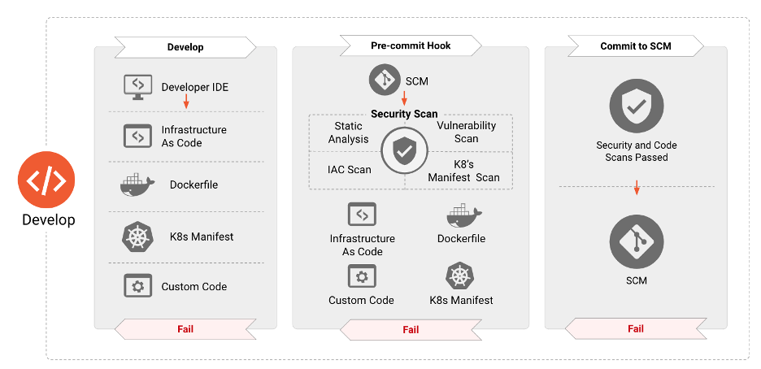
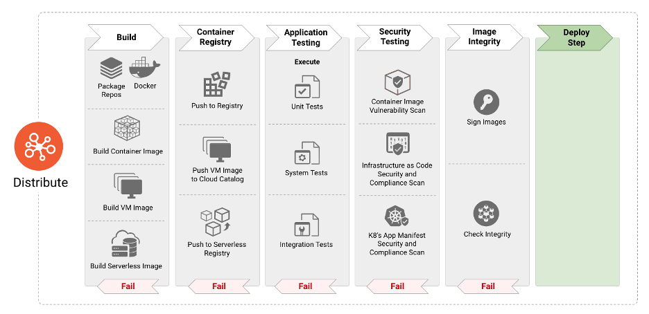

Shared with CNCF Community

# **Cloud Native Security Whitepaper**

## Metadata

| **Markdown** | | | |
| -- | -- | -- | -- |
| **Version** | **1.1** | 25 NOV 2020 | [Original working doc](https://tinyurl.com/CNCF-CNSWP) |
| **Status** | **WIP** | In Review | Approved |

| **PDF** | |
| -- | -- |
| **Created** | 2020-FEB-01 |
| **Last Reviewed** | 2020-OCT-27 |
| **PDF Published** | 2020-NOV-18 |
| **Release Version** | 1.0 |
| **Final PDF Approvers** | [x] @lizrice [x] @justincormack  |

| **Originating Content and Review** | |
| -- | --|
| **Contributors** | [aradhna.chetal@gmail.com](mailto:aradhna.chetal@gmail.com), [@theFoxAtWork](mailto:themoxiefoxatwork@gmail.com), [jj@tetrate.io](mailto:jj@tetrate.io), gadi@alcide.io @lumjjb, @trishankatdatadog, [@vvenkatara@paloaltonetworks.com](mailto:vvenkatara@paloaltonetworks.com), @pushkarj, @whaber, @sublimino, @rowan-baker, [chase.pettet@gmail.com](mailto:chase.pettet@gmail.com), [harsingh@us.ibm.com](mailto:harsingh@us.ibm.com), jeff.lombardo@gmail.com |
| **Reviewers** | @justincappos, @lumjjb, @whaber, @craigbox, @anvega, @magnologan, @magnologan, alok@xenonstack.com, @nyrahul, @ranio1, Itay Shakury (@itaysk) |

## Index
- [**Cloud Native Security Whitepaper**](#cloud-native-security-whitepaper)
  - [Index](#index)
- [Executive Summary](#executive-summary)
  - [Purpose](#purpose)
    - [Problem Analysis](#problem-analysis)
  - [Lifecycle Phases](#lifecycle-phases)
    - [Develop](#develop)
    - [Distribute](#distribute)
    - [Deploy](#deploy)
    - [Runtime](#runtime)
  - [Recommendations](#recommendations)
  - [Conclusion](#conclusion)
- [Introduction](#introduction)
  - [Target Audience](#target-audience)
  - [Cloud Native Goals](#cloud-native-goals)
  - [Assumptions](#assumptions)
- [Cloud Native Layers](#cloud-native-layers)
  - [Lifecycle](#lifecycle)
    - [Lifecycle Processes](#lifecycle-processes)
      - [Supply Chain](#supply-chain)
      - [Security Benchmarks](#security-benchmarks)
  - [Develop](#develop-1)
      - [Security Checks in Development](#security-checks-in-development)
      - [Development of Tests](#development-of-tests)
      - [Code Review](#code-review)
  - [Distribute](#distribute-1)
      - [Build Pipeline](#build-pipeline)
      - [Image Scanning](#image-scanning)
      - [Image hardening](#image-hardening)
      - [Container Application Manifest Scanning](#container-application-manifest-scanning)
      - [Container application manifest hardening](#container-application-manifest-hardening)
      - [Testing](#testing)
        - [Static Analysis and Security Testing](#static-analysis-and-security-testing)
        - [Dynamic Analysis](#dynamic-analysis)
        - [Security Tests](#security-tests)
      - [Artifacts & Images](#artifacts--images)
        - [Registry Staging](#registry-staging)
        - [Signing, Trust, and Integrity](#signing-trust-and-integrity)
        - [Encryption](#encryption)
  - [Deploy](#deploy-1)
      - [Pre-Flight Deployment Checks](#pre-flight-deployment-checks)
      - [Observability & Metrics](#observability--metrics)
      - [Response & Investigation](#response--investigation)
  - [Runtime Environment](#runtime-environment)
    - [Compute](#compute)
      - [Orchestration](#orchestration)
        - [Security Policies](#security-policies)
        - [Resource Requests and Limits](#resource-requests-and-limits)
          - [Audit Log Analysis](#audit-log-analysis)
        - [Control Plane Authentication and Certificate Root of Trust](#control-plane-authentication-and-certificate-root-of-trust)
        - [Secrets Encryption](#secrets-encryption)
      - [Containers](#containers)
        - [Runtime](#runtime-1)
        - [Microservices and Eliminating Implicit Trust](#microservices-and-eliminating-implicit-trust)
        - [Image Trust & Content Protection](#image-trust--content-protection)
      - [Service Mesh](#service-mesh)
      - [Detection at Runtime](#detection-at-runtime)
      - [Functions](#functions)
      - [Bootstrapping](#bootstrapping)
    - [Storage](#storage)
        - [Storage Stack](#storage-stack)
          - [Orchestration](#orchestration-1)
          - [System Topology & Data Protection](#system-topology--data-protection)
          - [Caching](#caching)
          - [Data Services](#data-services)
          - [Physical or Non-Volatile Layer](#physical-or-non-volatile-layer)
        - [Storage Encryption](#storage-encryption)
        - [Persistent Volume Protection](#persistent-volume-protection)
        - [Artifact Registries](#artifact-registries)
    - [Access](#access)
      - [Identity and Access Management](#identity-and-access-management)
      - [Credential Management](#credential-management)
        - [Hardware Security Modules (HSM)](#hardware-security-modules-hsm)
        - [Credential Management Cycle](#credential-management-cycle)
      - [Availability](#availability)
        - [Denial of Service (DoS) & Distributed Denial of Service (DDoS)](#denial-of-service-dos--distributed-denial-of-service-ddos)
  - [Security Assurance](#security-assurance)
    - [Threat Modeling](#threat-modeling)
      - [End-to-end architecture](#end-to-end-architecture)
      - [Threat Identification](#threat-identification)
    - [Threat Intelligence](#threat-intelligence)
    - [Incident Response](#incident-response)
    - [Security Stack](#security-stack)
      - [Environment](#environment)
        - [Pre (Workload) Flight Security Tools](#pre-workload-flight-security-tools)
          - [Compute & Node Checks](#compute--node-checks)
          - [Run Contexts](#run-contexts)
        - [In-Flight Security Tools](#in-flight-security-tools)
          - [Workload & Host Runtime Security](#workload--host-runtime-security)
      - [Zero Trust Architecture](#zero-trust-architecture)
      - [Least Privilege](#least-privilege)
      - [Roles and Responsibilities](#roles-and-responsibilities)
  - [Compliance](#compliance)
    - [Regulatory Audits](#regulatory-audits)
      - [Personas and Use Cases](#personas-and-use-cases)
    - [Industries](#industries)
      - [Enterprise](#enterprise)
      - [Microbusiness](#microbusiness)
      - [Finance](#finance)
      - [Healthcare](#healthcare)
      - [Academia and Education](#academia-and-education)
      - [Public Sector](#public-sector)
      - [Evolution of Cloud Native Security](#evolution-of-cloud-native-security)
      - [Conclusion](#conclusion-1)
      - [Acronyms and Glossary](#acronyms-and-glossary)
- [References](#references)
- [Acknowledgements](#acknowledgements)

# Executive Summary

## Purpose

The technology industry has shifted towards patterns of development and deployment that are seen as "cloud native". Simultaneously, the ecosystem of technologies, products, standards, and solutions is expanding, challenging decision makers to remain abreast of complex designs. The CISO role in particular, has the evolving responsibility of illuminating business value propositions in this dynamic arena. Meanwhile, cloud native patterns have also encouraged changes in consumption models and the adoption of modern workflows (e.g. agile methodologies and DevOps processes) requiring integrated security practices.

### Problem Analysis

Security concerns within this landscape are complex because of the explicit focus on rapid development and deployment in addition to impracticality of traditional perimeter-based security. This complexity requires a paradigm shift to protect applications by migrating from a perimeter based approach to one where security moves closer to dynamic workloads that are identified based on attributes and metadata (e.g. labels and tags). This approach identifies and secures workloads to meet the scale needs of cloud native applications while accommodating constant flux. These paradigm shifts require the adoption of increased automation in the application security lifecycle and secure by design architectures (e.g. Zero Trust). The embrace of containerization as one of the central transformations in the cloud native environment also requires new best practices. The tradeoffs for a secure implementation continue to involve multiple stakeholders within an organization, and significantly impacts developer and operator productivity in pursuit of business objectives. Cloud native applications still require development, distribution, deployment, and operation but the paradigm dictates new security mechanisms by which these objectives are efficiently achieved. Cloud native development can be modeled in distinct phases that constitute the application lifecycle: "Develop," "Distribute," "Deploy," and "Runtime." Cloud native security contrasts with traditional security approaches in that there is a tremendous opportunity to ensure that security is injected throughout these distinct phases instead of bookending the lifecycle with separately managed security informed interventions.It is critical to note that without perpetual education and training on use and integration of these concepts, tools, and processes, adoption and application will not persist and may revert.

## Lifecycle Phases

### Develop

Cloud native tools are meant to introduce security early in the application lifecycle. Security testing needs to identify compliance violations and misconfigurations early in order to create short and actionable feedback cycles for continuous improvement. This approach enables security failures to follow familiar workflows raised for other issues in the pipeline (e.g. bug fixes or CI failures), which already require resolution prior to moving software further in the pipeline. The modern security lifecycle for this model revolves around the development of code that adheres to recommended design patterns (e.g. [12-factor](https://12factor.net/)) and ensures the integrity of the workload delivered. Cloud native is conceptually tied to Infrastructure as Code (IaC) practices which are meant to ensure controls are operating as intended with early security check integrations. These controls and integrations identify misconfigurations and implement best practices in IaC and orchestration manifests as early to reduce long-term cost and increase security value.

### Distribute

Software supply chain safety is especially critical in models that enable faster software iteration. Cloud native application lifecycles need to include methods for verifying not only the integrity of the workload itself but also the process for workload creation and means of operation. This challenge is amplified by the necessary, practical, and consistent use of open source software and third party runtime images, including layers of upstream dependencies. Artifacts (e.g container images) present in the lifecycle pipeline require continual automated scanning and updates to ensure safety from vulnerabilities, malware, insecure coding practices, and other malfeasance. Upon completing these checks, it is important to cryptographically sign artifacts to ensure integrity and enforce non-repudiation.

### Deploy

Security integrated throughout the development and distribution phases allows for the real-time and continuous validation of candidate workload attributes (e.g. signed artifacts are verified, container image and runtime security policies are ensured, and host suitability can be validated). Secure workload observability capabilities, deployed alongside the workload, allow for logs and available metrics to be monitored with a high level of trust, complementing integrated security.

### Runtime

Cloud native environments are expected to provide policy enforcement and resource restrictive capabilities by design. Runtime resource constraints (e.g. Linux kernel cgroup isolation) for workloads are an example of restrictive and observability primitives integrated into higher levels of the application lifecycle in a cloud native environment. The cloud native runtime environment can itself be broken down into layers of interrelated components with distinct security concerns [^1] (e.g. hardware, host, container image runtime, orchestration).

Within the cloud native runtime environment, the microservice architecture for applications has been adopted by industries and organizations worldwide. Applications are often composed of several independent and single purpose microservices which communicate with each other via service layer abstractions which the container orchestration layer makes possible. Best practices to secure this interrelated component architecture involves ensuring that only sanctioned processes operate within a container namespace, prevention and notification of unauthorized resource access, and network traffic monitoring to detect hostile tooling activity. Service Mesh is another common abstraction that provides consolidated and complementary functionality for orchestrated services without imposing changes on the workload software itself (e.g. logging of API traffic, transport encryption, observability tagging, authentication, and authorization).

## Recommendations

Cloud native security seeks to ensure the same conditions of diligence, integrity, trust, and threat prevention as traditional security models while integrating modern concepts of ephemerality, distribution, and immutability. In these rapidly changing environments, prone to fail-forward for iteration, automation inline with the development pipeline is required for secure outcomes. Organizations must earnestly analyze and apply these core security concepts to alleviate delay in applying hardening and environmental controls, and need to hold engaged third parties to the same standard while balancing perpetual education and training relevant to the cloud capabilities and security proponents for their own workforce.With additional layers of complexity and a broad mesh of components to care for, protection from unauthorized access must be accomplished by integrating security throughout the lifecycle and into the runtime environment. It is highly recommended organizations evaluate the security defense stack against the relevant attack frameworks [^2] to achieve clarity about which threats a defense stack covers. Additionally, organizations need to adopt approaches and methodologies that shift security left [^3], amplify DevOps, and reach beyond to the next technology horizon so continued, proper checks of all components before, within, and after the pipeline are verified with any innovation brought into the lifecycle.

## Conclusion

Cloud native security, when executed strategically across an organization, can provide high availability, assurance, resilience, and redundancy at scale ensuring customers and developers have secure access to required resources at the velocity they expect. Security itself remains an interdisciplinary field that cannot be isolated from the development lifecycle or treated as a purely technical domain. Developers, operators, and security personnel must all partner, exchange, and collaborate to continue to move the field and industry forward. As with any technical innovation, it is the people, their passion, and the journey that genuinely make the community and cloud native security possible.

# Introduction

This paper intends to provide organizations and their technical leadership with a clear understanding of cloud native security, its incorporation in their lifecycle processes, and considerations for determining the most appropriate application thereof. Cloud native security is a multi-objective and multi-constrained problem space spanning many areas of expertise and practice. Nearly all Day 1 and Day 2 operations overlap with the security domain, ranging from identity management to storage solutions. However, cloud native security covers much more than these areas; it is also a human problem space, incorporating individuals, teams, and organizations. It is the mechanisms, processes, and intent by which humans and systems interact with and make changes to cloud native applications and technology.

## Target Audience

Our target audience is the Chief Security Officer (CSO), Chief Information Security Officer (CISO), or Chief Technology Officer (CTO) of a private enterprise, government agency, or non-profit organization who wishes to deliver a secure cloud native technology ecosystem. Additional organizational stakeholders may include Project, Product, Program managers, and Architects responsible for designing and implementing secure, cloud native products and services. Apart from this, anyone with a keen interest in cloud native security can refer to this document.

## Cloud Native Goals

The adoption and innovation involving containers and microservices architectures have brought with it its fair share of challenges. The need to mitigate cybersecurity vulnerabilities has systematically climbed the priority ladder in modern organizations. As innovation around cloud adoption accelerates, the threat landscape also increases. Security leaders are tasked with protecting assets, both human [^4] and non-human, by adopting practices to prevent, detect, and respond to cyber threats while meeting strict compliance requirements. A common historical narrative has been that security implementations impede the speed and agility of DevOps teams. Therefore, security leadership must implement tighter integration and bidirectional understanding to empower DevOps teams to create shared cyber risk ownership.

Secure cloud native adoption patterns and architectures that the organizations need to adopt must be shared to ensure that the industry is enforcing security practices with high priority and integrating it throughout the modern application development lifecycle. Most importantly, highlighting the synergies of security architecture with the security leaders and aligning organizations objectives towards security in terms of Vulnerability Management, Zero Trust, Cloud Security, and DevSecOps should be a top priority.

The concepts described throughout this paper are not designed to favor one service or component product over another and can be applied regardless of service selection.

This document does not intend to provide general education on security concepts or cloud computing concepts. It also does not recommend specific technologies or tools; however, it may cite examples of technology or tools that address the topic discussed.

Beyond the recommendations in this document, specific data security handling practices related to data protection and privacy regulatory mandates, e.g. GDPR, PCI DSS, may need additional regulatory-specific consideration. We recommend readers consult appropriate independent resources for guidance on any such technical controls and compliance risk matters.

## Assumptions

The [CNCF](https://www.cncf.io/) defines [cloud native](https://github.com/cncf/toc/blob/master/DEFINITION.md) within the CNCF Technical Oversight Committee's (TOC) GitHub repository. This paper does not seek to change this definition or expand upon it.

As cloud native adoption and modern software development methodologies continue to evolve, the technologies that comprise an effective cloud native stack will continue to shift over time. Representations of this shifting stack are included in the all encompassing [cloud native landscape](https://landscape.cncf.io/).

The term 'workloads' within this document covers any products, projects, applications, and systems that have or will be developed, maintained, distributed, or deployed to a cloud-based runtime environment.

# Cloud Native Layers

_Figure 1_

##

The cloud native stack is composed of the layers of the foundation, lifecycle, and environment. The cloud native stack can be adopted using different deployment models: IaaS, PaaS, CaaS, and FaaS. Each deployment model provides additional abstractions that ease the management and operation of cloud native environments. As some of these models are considered well known and in use for years, we will focus on models specific to cloud native.

The Containers-as-a-Service (CaaS) model allows users to orchestrate and otherwise manage containers, applications and clusters by leveraging a container-based virtualization platform, an application programming interface (API), or a web portal management interface. CaaS helps users construct scalable containerized applications with security policy embedded as code and run them on private cloud, on-premises data centers or public cloud. CaaS helps streamline the process of building a container. With microservice orchestration and deployments, it helps enterprises release software faster and allows portability between hybrid and multi-cloud environments, thus reducing infrastructure as well as operating costs. The CaaS model is cost saving as it helps enterprises simplify container management while giving them a choice to only pay for the CaaS resources they want and use. CaaS has containers as its fundamental resource, while for IaaS environments, virtual machines (VMs) and bare metal hardware host systems are used.

The Functions-as-a-Service (FaaS) is another cloud native deployment model, a type of cloud service that allows enterprise users to execute code in response to events without the complex infrastructure typically associated with building and launching micro-services. Hosting a software application in the cloud usually requires provisioning and managing a virtual environment, managing the operating system and web components, etc. With FaaS, the physical hardware, virtual machine operating system, and web server software management are all handled automatically by the cloud service provider. Thus allowing users to focus on individual functions in the microservices code while paying for resources that are used and taking advantage of the elasticity of resources that the cloud provides.

## Lifecycle

_Lifecycle_ in a cloud native context is the technology, practices, and processes that enable resilient, manageable, and observable workloads to run within the context of a cloud environment. As depicted in Figure 1, lifecycle is composed of four continuous phases; Develop, Distribute, Deploy, and Runtime. Each phase extends and amplifies the previous while permitting and supporting secure workload execution.

### Lifecycle Processes

Management of the supply chain and the curation of applicable security benchmarks are critical to a secure implementation.

#### Supply Chain

Organizations are responsible for ensuring that the supply chain for workloads they are developing are subjected to actionable security analysis within the lifecycle process. Supply Chain security can be broken into two parts: the security of the tools and services that provide an environment to create a workload (e.g. developer tooling) and the components that make up the workload itself (e.g. libraries, dependencies, and images). The supply chain needs to be implemented in such a way that the integrity of the supply chain itself is verifiable, and artifacts produced by the software supply chain can therefore be signed for verification of provenance. As such, an organization must exercise caution when using dependencies as upstream dependent packages will inevitably contain security vulnerabilities. Verifying the authenticity and integrity of third-party packages used is essential to ensure that the dependencies are as intended and not compromised.

A primary characteristic of cloud native applications is the reuse of software that is available as open source packages and container images that are built and distributed through open source container registries. Consequently, it is critical for developer, operator, and security personnel to ensure that artifacts and dependencies in their applications do not contain known sources of malware and vulnerabilities. The presence of malware in container images is a significant attack vector in the runtime environment [^5]. It is essential to employ on-demand and periodic vulnerability scanning of container images and composite packages in the [CI pipeline](#CI_pipeline) as well as in the container registries.

Leveraging these methods permits verifiable, secure software distribution and ongoing operation. Incorporating vulnerability scanning in the workload generation pipeline allows an organization to amplify feedback for development teams and has the further potential to block insecure or vulnerable updates from being distributed and deployed. Periodically scanning software will also allow for escalation of newly identified vulnerabilities in existing software.

#### Security Benchmarks

Utilization of security benchmarks (e.g. [NIST Application Container Security Guide](https://nvlpubs.nist.gov/nistpubs/SpecialPublications/NIST.SP.800-190.pdf), [Center for Internet Security (CIS)](https://www.cisecurity.org/), [NIST Security Strategies for Microservices-based Application Systems](https://csrc.nist.gov/publications/detail/sp/800-204/final), and [OpenSCAP](https://www.open-scap.org/)) provides development teams and organizations with a guide to create "secure-by-default" workloads. Adoption and implementation of these benchmarks enable teams to test for a hardened baseline. However, they cannot take into account data flows and custom usage of the platforms under testing. Security practitioners should implement them as a guide rather than a checklist.

The next few sections provide a detailed analysis of the implications, tools, mechanisms and best practices to integrate security throughout the application lifecycle.

## Develop

_Figure 2_

Security for cloud native applications needs to be deployed throughout the entire lifecycle of an application. The "Develop" phase is the first in this cycle, resulting in the creation of the artifacts, such as Infrastructure as Code, application and container manifests, etc., that will be used to deploy and configure cloud native applications. Consequently, these artifacts have proven to be the source for numerous attack vectors that can be exploited in the runtime. The next few sections elaborate on the various security tools, processes, and checks that need to be instituted in this phase to dramatically reduce the attack surface of applications deployed in the runtime.

#### Security Checks in Development

Security hardening during the development phase forms a critical component in the deployment of applications. This means that security requirements must be introduced early in software development and treated in the same manner as any other requirement. These requirements are typically based on business needs around risk and compliance. Addressing these needs in the early phases prevents redoing work later in the lifecycle which slows down the DevOps pipeline, and increases overall costs. DevOps teams must also leverage purpose-built tools to identify security misconfigurations and vulnerabilities prior to the deployment of these applications. Equally important is that these tools integrate seamlessly into existing and familiar tools leveraged by DevOps teams to compliment agility with security and not impede it. For example, tools need to perform the scanning of Infrastructure as Code templates as well as application manifests within the developer IDE or when a pull request is made, and provide rich and contextual security information which can be acted upon rapidly, easily, and early in the development pipeline. Adopting these steps ensures the absence of known vulnerabilities or high-risk configurations. Cloud native components should be API driven, allowing for complex debugging tools to interact with the deployed primitive workloads that rely on the orchestrator.

Teams should deploy dedicated development, testing, and production environments to provide infrastructure and application developers with isolated environments to develop, test, and deploy systems and applications, container base images, VM golden images, and non-functional tests. Some organizations may find leveraging canary deployments, blue-green or red-black deployments, and other deployment models to be an added efficiency for fielding dynamic and interactive testing and feasibility.

#### Development of Tests

Developers, operators, and security personnel should build tests for code and infrastructure that is business-critical, has a high threat-profile, is subject to frequent change, or has/is a historical source of bugs. Threat modeling can identify high-risk and high-impact code hotspots that provide a high return on investment (ROI) for developing tests. Tests may include deployment, operating system, infrastructure and database hardening, application testing (static and dynamic source code testing, container configuration), integration or system testing (acceptance of application and infrastructure components and their interaction), and smoke testing (post-deployment checks against a live system). Test authors should have access to comprehensive development and test environments that enable them to perform rapid test development while reducing continuous integration (CI) feedback loops. System test suites should be made available to run locally for authors as well as within a shared testing environment.

#### Code Review

Minor changes to a workload, or the infrastructure where the workload has been deployed, may have far-reaching security consequences. To mitigate the risk of unintended consequences, teams are encouraged to use the "[four eyes](https://www.unido.org/overview/member-states/change-management/faq/what-four-eyes-principle)" principle when conducting code review before prior changes are merged into the codebase (e.g. implementing a pull request in git workflow).

### Distribute

_Figure 3_

The "Distribute" phase is responsible for consuming image definitions and specifications to build the next stage of artifacts such as container images, VM images and others. In modern continuous integration and continuous deployment paradigms, the "Distribute" phase consists of systematic application testing to identify bugs and faults in the software. However, the adoption of Open Source and reusable packages can result in the incorporation of vulnerabilities and malware into container images. It is therefore imperative to incorporate security-focused steps such as scanning the images for the aforementioned threat vectors as well as for validating the integrity of the images to protect against tampering. The next paragraphs elaborate on security best practices that help developers and operators to identify and protect container images from threats as well as techniques and tools to secure the entire CI/CD pipeline and infrastructure. Furthermore, organizations may wish to encrypt software artifacts if confidentiality is desired or needed.

Should software artifacts become untrusted due to compromise or other incident, teams should revoke signing keys to ensure repudiation.

#### Build Pipeline

Continuous Integration (CI) servers should be isolated and restricted to projects of a similar security classification or sensitivity. Infrastructure builds which require elevated privileges should run on separate dedicated CI servers. Build policies should be enforced in the CI pipeline and by the orchestrator's admission controllers.

Supply chain tools can gather and sign build pipeline metadata. Later stages can then verify the signatures to validate that the prerequisite pipeline stages have run.

The reader should ensure that the CI and Continuous Delivery (CD) infrastructure is as secure as possible. For example, security updates should be prioritized to be installed, and cryptographic keys should be protected from exfiltration via the use of Hardware Security Modules (HSM) or Credential Managers.

#### Image Scanning

Scanning container images is a critical component of securing container applications throughout the lifecycle. It is vital to do the scanning in the CI pipeline before deploying the image to production. Incorporating this capability ensures that developers, operators, and security professionals have detailed information on all known vulnerabilities and details such as the severity, the [Common Vulnerability Scoring System (CVSS)](https://nvd.nist.gov/vuln-metrics/cvss) score, and availability of mitigation/fixes. Coupling vulnerability scans of container images with pipeline compliance rules ensures that only sufficiently patched applications are deployed to production, reducing the potential attack surface. Scanning of container images also helps to identify the presence of malware in open source software packages or base image layers incorporated from open source image repositories. While container image scanning can provide teams with evidence of vulnerabilities or malware, it does not remediate vulnerabilities or prevent malware. Organizations need to ensure that container scanning findings are acted upon, and that organizational compliance rules are enforced.

#### Image hardening

Container images constitute the first level of output from the build pipeline. As such, they must include security hardening that takes into consideration the threats to be mitigated while allowing some just-in-time configurations at the runtime phase to facilitate integration with the broader ecosystem.

With respect to the [security assurance objectives](#security-assurance), the following questions should be evaluated:

- Should the execution environment be restricted to a specific user?
- Should the resource's access be limited?
- Should process execution be restricted at kernel level?

#### Container Application Manifest Scanning

Application manifests describe the configurations required for the deployment of containerized applications. As mentioned in the [Security Benchmarks](#security-benchmarks) section, guides such as the [NIST 800-190](https://nvlpubs.nist.gov/nistpubs/SpecialPublications/NIST.SP.800-190.pdf) publication offer recommended security practices and configurations for application containers. It is vital to scan application manifests in the CI/CD pipeline in order to identify configurations that could potentially result in an insecure deployment posture.

#### Container application manifest hardening

As for container images, container application manifest hardening can be thought of and be implemented at build- as well as runtime.

With respect to security assurance objectives, the following questions should be evaluated:

- What minimal constraints should the runtime execution ecosystem comply with?

#### Testing

Cloud native applications should be subjected to the same suite and standard of quality testing as traditional applications. These include the concepts of clean code, adherence to the [Test Pyramid](https://martinfowler.com/articles/practical-test-pyramid.html), application security scanning and linting through static application security testing (SAST), dependency analysis and scanning, dynamic application security testing (DAST) (e.g. mocking), application instrumentation, and full infrastructure with tests available to developers in local workflows. Automated test results should map back to requirements for dual attestation (developer and tool) for real-time security assurance to security and compliance teams.

Once a security bug has been identified (e.g. an incorrect firewall or routing rule), if root cause analysis determines that it has a reasonable chance of recurring, the developers should write an automated test to prevent regression of the defect. At the test failure, teams will receive feedback to correct the bug, and with the next merge, the test will pass (assuming it was corrected). Doing so defends against regression due to future changes to that code.

Unit testing of infrastructure is a preventative control, and targets entities and inputs defined in Infrastructure as Code (IaC) configuration. Security testing of built infrastructure is a detective control and combines assurance, historical regressions, and unexpected configuration detection (firewall rules open to the world, overprivileged Identity & Access Management (IAM) policies, unauthenticated endpoints, etc.)

Hardening of infrastructure and workloads should be supported by comprehensive test suites, which allows for incremental hardening as the system matures. Tests to verify hardening has occurred should run during the build but also at deployment to evaluate any changes or regressions that may have occurred throughout the lifecycle.

##### Static Analysis and Security Testing

Static analysis of IaC, application manifests, and software code may cover linting, identifying misconfigurations and vulnerability scanning. IaC code should be subject to the same pipeline policy controls as are application workloads.

IaC is gaining popularity, and its implementation is rapidly increasing among organizations to deploy cloud and container infrastructure. Consequently, insecure configurations in these templates can result in exposing attack vectors.

These templates should be scanned for insecure configurations and other security controls using automated tools before deploying the application and infrastructure artifacts. Key misconfigurations to keep an eye out for include:

- Vulnerabilities contained within images specified in the application manifests
- Configuration settings, such as containers that can escalate privileges.
- Identification of the security contexts and system calls, which can compromise a system.
- Resource limit settings

##### Dynamic Analysis

Dynamic analysis of deployed infrastructure may include detecting Role-based Access Control (RBAC) and IAM configuration drift, validating the expected network attack surface, and ensuring that a SOC can detect unusual behavior in dedicated test environments to configure alerting for production. Dynamic analysis is considered to be a part of testing however, it is expected to occur in a non-production runtime environment.

##### Security Tests

Automated security testing of applications and infrastructure should be an integral focus within security teams. Test suites should be continuously updated to replicate threats in-line with the organizational threat model and can be reused for security regression testing as the system evolves. Automated security tests increase security and release velocity by removing manual security gates, such as validation and manual control implementation at a single checkpoint, which is time-consuming and inadequate. Automated security testing also demonstrates control efficacy on demand by explicitly attempting to carry out the threats, thus improving the system's security and adherence to any embedded compliance requirements in real-time.

#### Artifacts & Images

##### Registry Staging

Due to the use of open source components that are often pulled from public sources, organizations should create several stages of registries in their pipelines. Only authorized developers should be able to access public registries and pull base images, which are then stored in an internal registry for wide consumption within the organization. It is also advised to have separate private registries for keeping development artifacts per team or group, and finally a staging or pre-production registry for images ready for production. This enables tighter control over the provenance and security of open source components, while enabling different types of testing for stages in the CI/CD chain.

For any registry used, access control through a dedicated authentication and permission model must be implemented. Use mutually-authenticated TLS for all registry connections (among other interactions within the architecture).

##### Signing, Trust, and Integrity

Digital signing of image content at build time and validation of the signed data before use protects that image data from tampering between build and runtime, thus ensuring the integrity and provenance of an artifact. Confirmation starts with a process to indicate that an artifact was vetted and approved. The trust confirmation also includes verifying that the artifact has a valid signature. In the simplest case, each artifact can be signed by one signer to indicate a single testing and validation process that the artifact has gone through. However, the software supply chain is more complex in most cases, and creating a single artifact relies on multiple validation steps, thus depending on a conglomerate of entities' trust. Examples of this are:

- Container image signing - the process of signing a container image manifest
- Configuration signing - signing of a config file, i.e. application config files: most common in the case of a GitOps approach, where there can be a process to validate and check configurations.
- Package signing - Signing of a package of artifacts, like application packages.

For generic software artifacts such as libraries or OCI artifacts, signing these artifacts indicates their provenance of approved usage by the organization. Verification of these artifacts is equally crucial in ensuring that only the authorized artifacts are allowed. It is strongly recommended that repositories require mutual authentication to make changes to images in registries or to commit code to repositories.

##### Encryption

Container Image Encryption encrypts a container image so that its contents are confidential. The container image contents are encrypted to ensure that they remain confidential for promotion from build time through runtime. In the event of a compromised distribution, the image's registry contents remain secret, which can help for use cases such as protecting trade secrets or other confidential material.

Another common use of Container Image Encryption is to enforce container image authorization. When image encryption is coupled with key management attestation and/or authorization and credential distribution, it is possible to require that a container image can only run on particular platforms. Container image authorization is useful for compliance use cases such as geo-fencing or export control and digital rights media management.

### Deploy

_Figure 4_

The "Deploy" phase is responsible for incorporating a sequence of 'pre-flight' checks in order to ensure that the applications that are going to be deployed in the runtime environment conform and comply with organization wide security and compliance policies.

#### Pre-Flight Deployment Checks

Prior to deployment, organizations should verify the existence, applicability, and current state of:

- Image signature and integrity
- Image runtime policies (e.g absence of malware or critical vulnerabilities)
- Container runtime policies (e.g absence of excessive privileges)
- Host vulnerability and compliance controls
- Workload, application, and network security policies

#### Observability & Metrics

Instituting observability and metrics into cloud native architectures delivers security insights so appropriate stakeholders can resolve and mitigate anomalies appearing in reporting; tools in this area can help collect and visualize this information. Through the use of behavioral and heuristic analysis teams can detect and escalate outliers, suspicious events, and unexplained calls to appropriate stakeholders. Artificial intelligence (AI), [machine learning (ML)](#workload--host-runtime-security), or statistical modeling are all mechanisms that are encouraged to assist in behavioral and heuristic analysis development.

#### Response & Investigation

An application should provide logs regarding authentication, authorization, actions, and failures. The developer should include this capability as part of planning and design phases. These elements provide a trail of evidence to follow when an investigation takes place and a root cause needs to be established.

Forensics capabilities are integral part of any incident response and mitigation activity. They provide evidence to determine the root cause of an incident and provide feedback for any mitigation to be put in place. The short lived nature of the container environment requires a more agile toolset to capture and analyze any evidence. Integrating forensics capabilities into an incident response plan and procedures will provide the means to acquire and process evidence, decrease the time to determine root cause, and minimize exposure to a compromise.

## Runtime Environment

_Figure 5_

The Runtime phase comprises three critical areas: compute, access, and storage. While the runtime environment is dependent on the successful completion of the develop, distribute, and deploy phases, the security of the runtime is dependent on the efficacy of the security practices of the prior phases. The following paragraphs detail the security requirements and implications for each of these critical components.

### Compute

Cloud native compute is a highly complex and continually evolving construct. Without core components to make compute utilization occur, organizations cannot ensure workloads are secure.

Considering that containers provide software based virtualization for multi-tenant applications on a shared host, it is important to use a container specific operating system, which is a read-only OS with other services disabled. This helps in reducing the attack surface. This also provides isolation and resource confinement that enables developers to run isolated applications on a shared host kernel. To allow defense in depth it's also recommended to not allow disparate data sensitive workloads be run on the same OS kernel.

In order for security to span all layers of container platforms and services, a hardware root of trust based in a Trusted Platform Module (TPM) or virtual TPM (vTPM) can be used. The chain of trust rooted in hardware can be extended to the OS kernel and its components to enable cryptographic verification of trusted boot, system images, container runtimes, and container images, and so on.

Operating systems provide basic system components like crypto libraries used for remote connections and kernel functions that are used for process initiation, management etc. These can have vulnerabilities and, because they provide underlying compute baseline for the containers they can impact all the containers and apps that run on these hosts. At the same time improperly configured containers can impact the host kernel security and hence all the services running in containers running on that host. Refer the details within the [Distribute phase](#distibute-1) for more information.

#### Orchestration

Any orchestrator has several components that are separated into different planes, such as control and data. Sometimes, there is a need to have a higher-level construct of multi-deployment management responsible for maintaining state across several different control planes that co-exist independently of each other.

Any orchestration system has a number of threats that impact the overall security of the deployment and continued security at runtime. Malicious access to an orchestrator's API, unauthorized access and changes to the key-value store, orchestrator dashboard to control clusters, intercept control plane traffic, API misuse, intercepting application traffic, and so on are all potential threat areas. It is important to use best practices and configuration hardening for any orchestrator to prevent exposure to these threats, several exist [^7]. It is also important to monitor and detect any changes to the initial configurations made in runtime to ensure the continued security posture of the cluster. Other security best practices such as minimizing administrative access to the control plane, segregation of duties and principle of least privilege should be enforced.

##### Security Policies

It is essential to consider the security features and various configuration options of your orchestrator to control the security privileges the container runtime can use to spawn containers. The use of higher level policy and governance constructs may enforce those security guardrails).

##### Resource Requests and Limits

Applying different object level and resource requests and limits via cgroups helps prevent exhaustion of node and cluster level resources by one misbehaving workload due to an intentional (e.g., fork bomb attack or cryptocurrency mining) or unintentional (e.g., reading a large file in memory without input validation, horizontal autoscaling to exhaust compute resources) issue.

###### Audit Log Analysis

Audit Log analysis is one of the most established methods to identify and correlate system compromise, abuse, or misconfiguration. Continued automation of audit log analysis and correlation is of paramount importance to security teams as cloud native architectures are capable of generating more granular audit configuration and filtering than traditional legacy systems for workloads. Additionally, the interoperability of cloud native logs allows for advanced filtering to prevent overloads in downstream processing. What is critical here, as with traditional log analysis, is the generation of actionable audit events that correlate/contextualize data from logs into "information" that can drive decision trees/incident response.

Non-compliant violations are detected based on a pre-configured set of rules that filter violations of the organization's policies.

To have the ability to audit actions of entities using the cluster, it is vital to enable API auditing with a filter for a specific set of API Groups or verbs, either of interest to a security team, cluster administrators, or other teams by field of study. Immediate forwarding of logs to a location inaccessible via cluster-level credentials also defeats an attacker's attempt to cover their tracks by disabling logs or deleting their activity logs. The systems processing alerts should be periodically tuned for false positives to avoid alert flooding, fatigue, and false negatives after security incidents that were not detected by the system.

##### Control Plane Authentication and Certificate Root of Trust

The orchestrator administrators should configure all orchestrator control plane components to communicate via mutual authentication and certificate validation with a periodically rotated certificate in addition to existing control plane hardening. The issuing Certificate Authority (CA) can be a default orchestrator CA or an external CA. Particular attention should be given by the administrators to protect the CA's private key. For more information on extending or establishing trust, refer to the [Identity and Access Management](#identity-and-access-management) section.

##### Secrets Encryption

It is possible to manage secrets in a container orchestration or deployment environment through use of an external secrets manager or natively using the orchestrator's secrets. When using a native secret store, it is crucial to be aware that several different protection methods are available:

- Encryption with an external Key Management Store (KMS)
  - Leveraging a KMS is a secure way to protect secrets in the orchestrator secret store where key encryption in an external KMS encrypts the Data Encryption Key (DEK) that encrypts the secrets stored at rest in etcd. This method does have an option to cache DEKs in memory to reduce the dependency on the availability of the external KMS and faster decryption of secrets during pod creation time.
- Encryption fully managed by the orchestrator
  - This methodology encrypts the secrets stored in the orchestrator, but the encryption key is also managed by the orchestrator (i.e. a config file of the orchestrator)
- No encryption
  - For example, with some orchestrators, secrets are base64 encoded and stored in clear-text in the key-value store by default

Using an external secrets manager can limit the risks of using unencrypted secrets and ease the complexity of key management. Most of the time those tools are provided as controllers or operators that can inject secrets at runtime and handle their rotations transparently.

#### Containers

##### Runtime

The runtime environment of a container needs to be monitored and secured from a process, file, and network perspective. Only sanctioned capabilities and system calls (e.g. seccomp filters), should be allowed to execute or be invoked in a container by the host operating system. Changes to critical mount points and files should be monitored and prevented. Configuration must prevent changes to binaries, certificates, and remote access configurations. The configuration must also prevent ingress and egress network access for containers to only what is required to operate. Additionally, network traffic to malicious domains should be detected and denied.

##### Microservices and Eliminating Implicit Trust

The perimeter for containerized applications deployed as microservices is the microservice itself. Therefore, it is necessary to define policies that restrict communication only between sanctioned microservice pairs. The inclusion of [zero trust](#zero-trust-architecture) in the microservice architecture reduces the blast radius by preventing lateral movement should a microservice be compromised. Operators should ensure that they are using capabilities such as network policies to ensure that east-west network communication within the container deployment is limited to only that which is authorized for access. There is some initial work done to provide strategies for microservices security through [NIST SP 800-204](https://csrc.nist.gov/publications/detail/sp/800-204/final) and may serve as a guide for implementing secure microservice architectures.

##### Image Trust & Content Protection

Utilization of a policy agent to enforce or control authorized, [signed container images](#signing-trust-and-integrity) allows organizations to provide assurance of the image provenance for operational workloads. Further, inclusion of [encrypted containers](#encryption) allows for the protection of sensitive sources, methods, or data that exist within the container.

#### Service Mesh

A service mesh provides connectivity between the services that adds additional capabilities like traffic control, service discovery, load balancing, resilience, observability, security, and so on. A service mesh allows microservices to offload these capabilities from application-level libraries and allows developers to focus on differentiating business logic. In order to effectively ensure secure communications between services in cloud native environments, organizations should implement a service mesh to [eliminate implicit trust](#zero-trust-architecture) within their pods and across workloads, achieved through data-in-motion encryption. Utilization of a service mesh also resolves identity issues where traditional layer 3 and layer 4 identities, IP addresses, no longer cleanly map to workloads. Service mesh provides not only network level isolation and security but also network-level resiliency capabilities such as retry, timeout, and implementing various circuit-breaker capabilities. Streaming platforms can benefit from a service mesh for added security by using workload level authorization to set access rules for topics or brokers.

It is important to note that implementation of a [service mesh](#service-mesh) can help reduce the attack surface of a cloud native deployment, and provide a key framework for building [zero trust](#zero-trust-architecture) application networks.

#### Detection at Runtime

Monitoring deployed workloads should provide teams with validation that the true operational state is the expected state. Organizations cannot forgo periodic security scanning and monitoring within their environments without turning their workloads into an unsupervised playground for attackers. Utilization of components that detect, track, aggregate and report system calls and network traffic from a container should be leveraged to look for unexpected or malicious behavior.

While regression testing and security tests can help prevent known, expected issues from moving to production environments, they cannot stop everything. Workloads should be dynamically scanned to detect malicious or insidious behavior for which no known occurrence yet exists. Events such as an extended sleep command that executes data exfiltration from etcd after the workload has been running for X amount of days are not expected in the majority of environments and therefore are not included in security tests. The aspect that workloads can have time or event delayed trojan horses is only detectable by comparing to baseline expected behavior, often discovered during thorough activity and scan monitoring.

Further, workloads will become vulnerable at the time of or after they are deployed. Organizations should continuously scan their environments to detect which workloads are now vulnerable. Understanding the make-up or [software bill of materials](https://www.ntia.gov/SBOM) for each workload can help organizations quickly identify where vulnerabilities lie. Additional information about those vulnerabilities, such as exploit maturity, and vulnerable path in use are critical to determining the actual risk to workloads and can help organizations prioritize updates to at-risk applications.

#### Functions

Serverless functions are susceptible to various attacks and therefore need to be appropriately protected. Processes must execute only functions explicitly defined in an allow list. Additionally, functions should not be allowed to make changes to critical file system mount points.

The functions must have restrictions that only allow access to sanctioned services, either through networking restrictions or least privilege in permission models. Additionally, the egress network connection must be monitored by administrators to detect and, where possible, prevent access to C&C (command and control) and other malicious network domains. Ingress network inspection must also be considered in order to detect and remove malicious payloads and commands that can be used in exfiltration. For instance, SQL injection attacks can be detected using inspection.

Serverless functions have a number of threats and controls available for tenants are limited. Broken authentication and insecure API integrations with dependent services are some of these issues. Ensuring all serverless functions are run in tenant-based resource or performance isolation for similar data classifications may assist in resolving this, however, they can impact the performance due to limitations in the address space available to the isolation environment.

#### Bootstrapping

[Trust](#zero-trust-architecture) needs to be bootstrapped in the compute nodes to ensure that workloads and configurations are run on the correct nodes. Bootstrapping ensures that the compute is in the correct physical and logical location and provided with the ability to authenticate itself. These steps are usually part of the cloud provider's provisioning. However, methods are available to verify trust, relying less on a third party.

### Storage

Cloud Native Storage covers a broad set of technologies that are bucketed into presented storage and accessed storage. Presented storage is storage made available to workloads such as volumes and includes block stores, filesystems and shared file systems. Access storage is storage that is accessed via an application API, and includes object stores, key value stores, and databases.

Storage systems contain a data access interface that defines how applications or workloads store or consume data that is persisted by the storage system or service. This interface can be protected by access controls, authentication, authorization, and potentially encryption in transit.

Storage systems also contain a control plane management interface which is typically an API protected by authentication and TLS, although finer grained access may be available. In general the control interface is only accessed via a service account by an orchestrator or service broker.

##### Storage Stack

Any storage solution is composed of multiple layers of functionality that define how data is stored, retrieved, protected and interacts with an application, orchestrator and/or operating system. Each of these layers has the potential to influence and impact the security of the storage system. A common example may be a filesystem that persists files or blocks to an object store. It is equally important to protect every layer in the topology, and not just the top layer where data is accessed.

###### Orchestration

Most orchestrated systems will implement a variety of abstraction and virtualization layers that may include filesystems (such as bind mounts), volume managers, and the application of permissions at a user or group level based on orchestrator policies. As with many components of containerization and microservice architectures, protecting volumes and storage will always rely on the protections in place from other capabilities. If a user is able to escalate their privileges within the orchestrator or container runtime to root they can wreak havoc within the environment. The implementation of [zero trust](#zero-trust-architecture), [least privilege](#least-privilege), and [access control](#access) and enforcement are linchpins in successfully securing storage in cloud native architectures.

###### System Topology & Data Protection

Understanding a system's storage topology is key in order to secure both the data access path to the storage system and the intra-node communication in distributed topologies.

Common topologies include centralized models where all compute nodes access a central storage service, distributed models that distribute the function over a number of nodes, and hyperconverged models where application and storage workloads are combined on the same nodes. The selection of specific, layered security mechanisms to protect data in storage and in transit between storage locations is driven on the topology in use by the system.

A key function of any storage system is to provide protection of the data that is being persisted in the system or service. This protection is implemented first through availability of the data to authorized users and should exist as a transparent layer in the system. This can include technologies such as parity or mirroring, erasure coding or replicas. Protection is next implemented for integrity, in which storage systems will add hashing and checksums to blocks, objects or files primarily designed to detect and recover from corrupted data, but can also add a layer of protection against the tampering of data.

###### Caching

Caching layers, often fully fledged separate systems, are implemented to improve the performance of storage systems, especially filesystems, objects and databases. The appropriate access controls and security policies need to be applied to the caching layer as the cache will be fronting the access to the actual storage back-end.

###### Data Services

Storage systems often implement a number of data services which complement the core storage function by providing additional functionality that may be implemented at different layers of the stack and may include replication and snapshots (point-in-time copies of data). These services are often used to move copies of data to remote locations, and it is important to ensure that the same access controls and security policies are applied to the data at the remote location.

###### Physical or Non-Volatile Layer

Cloud native storage security is not restricted to virtual cloud native architectures as cloud native capabilities can be deployed on-prem, and even virtual offerings have a physical presence. It is important to remember that storage systems will ultimately persist data on some form of physical storage layer which is generally non-volatile. Modern physical storage such as SSDs often support security functions such as self encryption, as per the [OPAL](https://trustedcomputinggroup.org/wp-content/uploads/TCG_Storage-Opal_SSC_v2.01_rev1.00.pdf) standards, and rapid/secure erasure functions. Secure erasure is important when devices that contain data need to leave a secure physical location (e.g. to be returned to a vendor after developing a fault).

##### Storage Encryption

Storage systems can provide methods to ensure confidentiality of data through data encryption. Data encryption can be implemented for data in transit or data at rest, and when leveraged at the storage system can ensure that the encryption function is implemented independently to the application.

Encryption can have an impact on performance as it implies a compute overhead, but acceleration options are available on many systems which can reduce the overhead. When selecting the kind of encryption for data, consider the data path, size, and frequency of access as well any regulations or additional security protections that may require more secure algorithms to be used. Additionally, teams should not neglect to consider the use of caches when considering encryption requirements for their architectures.

Encryption services can be implemented for data in transit (protecting data in the network) and for data at rest (protecting data on disk). The encryption may be implemented in the storage client or storage server and granularity of the encryption will vary by system (e.g. per volume, per group or global keys). In many systems, data in transit is protected with TLS (which has the added benefit of providing an authentication layer via certificates [^8]. Older protocols (such as iscsi) may be harder to secure in transit (although more complex solutions such as IPsec or encrypted VPNs [^9] can be used). Data at rest is generally protected using standard symmetric encryption algorithms such as AES, and may be deployed with specific modes of encryption such as XTS for block devices.

The encryption function will often depend on integration with a [key management](#secrets-encryption)system.

##### Persistent Volume Protection

Protecting access to volumes is critical to ensure only authorized containers and workloads may leverage volumes provided. It is imperative to define trust boundaries for namespaces to cordon access to volumes. Leverage existing or create new security policies that prevent groups of containers from accessing volume mounts on worker nodes and ensure only appropriate worker nodes have access to volumes. It is especially critical as privileged containers _can_ gain access to a mounted volume in a different namespace, so additional precautions are needed.

Specifying the UID or GID of the volume still permits access by container in the same namespace and will not provide data protection. Network file system version 3 (NFSv3) assumes the client has already performed authentication and authorization and does not perform validation. It is critical to consider where authentication and authorization occur and whether validation of that action exists when implementing protections.

##### Artifact Registries

Registries should accommodate technologies to sign and verify OCI artifacts. It is also important to ensure that the caching and distribution tools also provide the capability to sign, encrypt and provide checksums to ensure that the caching layer can detect tampering or attempts to poison the dataset.

The [CNCF Storage Whitepaper](https://bit.ly/cncf-storage-whitepaperV2) provides additional background on the concepts, terminology, usage patterns and technology classes of cloud native storage.

### Access

#### Identity and Access Management

A comprehensive identity and access management (IAM) solution for cloud native architectures requires service identity at a minimum. Organizations maintaining or operating on-premise or hybrid clouds need user and device identity management. For applications and workloads distributed across multi-cloud environments, identity federation is critical to a successful implementation.

Applications and workloads should be explicitly authorized to communicate with each other using mutual authentication. Due to the ephemeral nature of cloud computing, key rotation and lifespan need to be frequent and short to maintain the demands of high-velocity capabilities and control and limit the blast radius of credential compromise.

The utilization of identity management services from cloud providers is dependent on industry-specific use cases. Users, independent from the cloud-provider, should generate and manage credentials and keys for sensitive workloads such as health or finance information.

For the client and server to bi-directionally verify identity via cryptography, all workloads must leverage mutual/two-way transport authentication.

Authentication and authorization must be determined independently (decision point) and enforced (enforcement point) within and across the environment. Ideally, secure operation for all workloads should be confirmed in real-time, verifying updated access control and file permissions where possible as caching may permit unauthorized access (if access was revoked and never validated). Authorization for workloads are granted based on attributes and roles/permissions for which they have been assigned. It is strongly recommended organizations use both Attribute-Based Access Control (ABAC) and Role-Based Access Control (RBAC) to provide granular authorization enforcement in all environments and throughout their workload lifecycle. Such posture can enable defense-in-depth, where all workloads are able to accept, to consume, and to forward the identity of the end user for contextual or dynamic authorization. This can be achieved through the use of identity documents and tokens. Not enforcing this limits an organization's ability to truly perform [least privilege](#least-privilege) access control on system-to-system and service-to-service calls.

It is critical to note, application or service identity is also essential in the context of microservices, where the identities for apps are primarily subject to be spoofed and impersonated by a malicious service. Utilization of a strong identity framework and service mesh can help overcome these issues.

All human and non-human cluster and workload operators must be authenticated and all their actions must be evaluated against access control policies that will evaluate the context, purpose, and output of each request. In order to simplify the authentication process, identity federation can be configured to allow usage of enterprise capabilities such as multi-factor authentication. Authorization must then be enforced with access control mechanisms mentioned in this section.

#### Credential Management

##### Hardware Security Modules (HSM)

Whenever possible, the reader should use technologies such as HSMs to physically protect cryptographic secrets with an Encryption Key that does not leave the HSM. If this is not possible, software-based credential managers should be used.

##### Credential Management Cycle

Cryptographic secrets should be generated securely within either an HSM or a software-based secrets management system.

Secrets, whenever possible, should have a short expiration period or time to live after which they become useless. Secret management should be highly available and have high ease of generation as these characteristics are prerequisites for the short-lived secrets. While not recommended, if organizations are using long-lived secrets, appropriate processes and guidance should be established for periodic rotation or revocation, especially in case of accidental disclosure of a secret. All secrets must be distributed in transit through secure communication channels and should be protected commensurate with the level of access or data they are protecting.

In any case, secrets should be injected at runtime within the workloads through non persistent mechanisms that are immune to leaks via logs, audit, or system dumps (i.e. in-memory shared volumes instead of environment variables).

#### Availability

##### Denial of Service (DoS) & Distributed Denial of Service (DDoS)

A denial-of-service attack (DoS attack) in the context of cloud native applications is a class of cyber-attacks. The perpetrator seeks to temporarily or indefinitely make the cloud native application unavailable to its intended users (human or automated). The perpetrator may do this via disrupting critical cloud native application components (such as microservices), disrupting the orchestration layer responsible for keeping the microservices running, or disrupting health monitoring systems responsible for scaling the application. A denial of service is typically accomplished by flooding critical microservices or resources with superfluous requests to overload systems and prevent some or all legitimate requests from being fulfilled.

A distributed denial-of-service attack (DDoS attack) typically involves a high volume of incoming traffic flooding the cloud native application services or the upstream networks to which they depend. Typically the attack is mounted from many different sources. Volumetric attacks are mitigated by detecting and deflecting the attacks before they reach the cloud native application.

### Security Assurance

Security is fundamentally a risk management process that seeks to identify and address risks posed to a system. The iterative and perpetual hardening of systems will mitigate, reduce, or transfer risk depending on component's or organization risk profiles and tolerances. The predisposing concepts of hardening, while legacy at their core, can still be applied to a security forward team by evaluating components and their make up against minimal, yet flexible, functionality. For instance, as teams determine an updated base image, considerations for additional ports, permissions, and packages added with an update should be reviewed and either accepted, altered, or restricted.

In contrast, compliance standards form principles of controls to ascertain or create requirements definitions by which systems are assessed against. The outcomes of the assessment are binary (pass or fail) but may contain Type 1 (false positive) or Type 2 (false negative) errors and should be evaluated as the result of tests from a CI/CD pipeline, akin to the results of any testing in a pipeline. Thus, compliance and security assurance are complementary processes but are not interchangeable. A compliant system is not guaranteed to be secure, nor a secure system guaranteed to be compliant.

## Threat Modeling

For organizations adopting cloud native, a primary mechanism for identifying risks, controls and mitigations is to perform threat modeling. While there are many threat modeling techniques they share several core characteristics. All start with building a scoped representation of a system's architecture. This begins with identifying all important processes, data stores, and [security boundaries](https://www.oreilly.com/library/view/cissp-certified-information/9780470276884/9780470276884_security_boundaries.html). Once boundaries have been established and the relevant elements of the system are partitioned within them, the next step is to model how these elements interact with special attention paid to any interactions that cross security boundaries.

The below guidance is an enhancement of the four step [OWASP threat modeling](https://owasp.org/www-community/Threat_Modeling) recommended for cloud native capabilities.

### End-to-end architecture

A clear understanding of the organization's or individual's cloud native architecture should result in data impact guidance and classifications. This helps teams organize data distribution within the architecture as well as the additional protection mechanisms for it later on. cloud native diagrams and documentation should not only include the core components of the overall system design but should also take into consideration the location of the source code, the buckets and other storage mechanisms in use, and any additional aspects of the software development cycle. These are all areas that must be considered when initiating threat modeling for cloud native.

### Threat Identification

When considering threats specific to an organization's cloud native capabilities, it is recommended to leverage a mature, well-used model of threats such as [STRIDE](https://en.wikipedia.org/wiki/STRIDE_(security)) or [OCTAVE](https://www.pluralsight.com/guides/cybersecurity-threat-modeling-with-octave). Common threats organizations may wish to consider for their cloud native architectures includes, but is not limited to:

- Spoofing a cluster admin by stealing the authentication credentials via a social engineering attack
- Tampering of an API server config file or certificate could result in failed API server restart or mutual TLS authentication failures
- Repudiation of actions of an attacker because of disabled or misconfigured API auditing could result in a lack of evidence of a potential attack
- Information disclosure is possible if an attacker compromises a running workload and is able to exfiltrate data to an external entity
- Denial of Service (DoS) resulting from a pod that does not have resource limits applied therefore consumes the entire node level CPU and memory, worker node is then lost
- Elevation of privilege could happen if a pod is running with unrestricted or higher privileged pod security policy or by modifying the security context of a pod or a container

Threat actors to consider for cloud native security are consistent with existing threat modeling practices:

- Malicious insider - An actor with malicious intent and with authorization to perform actions within the modeled system.
- Uninformed insider - An actor with authorization to perform actions within the modeled system (assuming anyone can be duped).
- Malicious outsider - An actor with malicious intent and outside of the system, able to launch attacks via the internet, supply chain, physical perimeter etc. without explicit authorization to perform actions within the modeled system.

There are other actors that may interact with the modeled system (e.g uninformed outsiders) and they can be included for completeness. It's likely that controls for their actions will be a subset of those for the primary actors listed above.

Organizations are recommended to leverage the existing resources available in the cloud native landscape for additional information on threats to cloud native architecture.

The utilization of pipelines and infrastructure as code (IaC) may provide compensating or mitigating controls for some threats or reduce likelihood of their success or occurrence.

As with any cloud native process, it is important to iterate and provide feedback. In the context of threat modeling, this means re-evaluating if the existing measures, mechanisms, and matrices accurately reflect the operational state given the continual changes to the architecture.

## Threat Intelligence

Cloud native applications by design and purpose are a collection of multiple dynamic components compromised from first-party and third-party code and tools, which means threat intelligence must be applied for network activity and cloud native application components. Cyber threat intelligence is information about threats and threat actors that helps mitigate harmful events. Threat intelligence in cloud native systems would make use of indicators observed on a network or host such as IP addresses, domain names, URLs, and file hashes which can be used to assist in the identification of threats. Behavioral indicators, such as threat actor tactics, techniques, and procedures can also be used to identify threat actor activity in cloud native components. The [MITRE ATT&CK framework for Cloud](https://attack.mitre.org/matrices/enterprise/cloud/) includes cloud native tactics and techniques that can be leveraged as a starting point for establishing and validating observability.

## Incident Response

For an organization with existing incident response and triaging workflow, special attention should be paid to how that can be applied to cloud native workloads which may not always conform with some underlying assumptions about node isolation (new pod instances could run on a different server), networking (e.g. IP addresses are assigned dynamically) and immutability (e.g. runtime changes to container are not persisted across restarts). Hence, it's important to revisit these assumptions and reapply or update the incident response playbook as needed. Observability and forensic tools need to understand cloud native specific constructs such as pods and containers so that the state of a compromised system can be maintained or recreated. Evidence mishandling can sometimes be unintentional in intent-based orchestrators, which are built to treat workloads as "cattle, not pets". As a side note, building an incident response and triaging strategy from the ground up, although possible, is out of scope for this document.

## Security Stack

### Environment

#### Pre (Workload) Flight Security Tools

Pre-workload security tools should maximize hardening and ensure adherence to security best practices while minimizing privileges with respect to the hosting environment, network, and the orchestration layer. Tools should also ensure compliance will not break at runtime.

##### Compute & Node Checks

Organizations should leverage tooling that assert hardening and security of compute before resources are marked as ready to accept workloads. Host Vulnerability Scanners and CIS benchmark scanners are recommended for this.

##### Run Contexts

Security tools that cover the surface area of pre-workload security hygiene checks are best suited to run as part of CI pipelines to scan files, artifacts such as container images, and IaC. Security tools that run in CD pipelines are more suitable to run in the context of a specific environment and take into consideration the specific configuration for the specified environment. Cloud native orchestrators that support the concept of admission time checks, permit organizations to leverage admission delivery hooks to apply tools that complement earlier stages of the pipeline.

#### In-Flight Security Tools

##### Workload & Host Runtime Security

Runtime security tools can be broken into four key protection surface areas:

- process, container, or system level security
- network security
- data security
- application security

For each protection surface area applicable to an organization's area of concern, a combination of tools should be used. Policy driven tools implement rule based policies, whether authored manually or through a recommendation system. Once applied, these policy driven tools provide predictable results and can be applied in monitor-only or enforcement-mode.

Threats and vulnerability feeds enable security tools to intercept anomalous behavior and security events from unknown and identified threats. These feeds are normally updated on a regular and frequent basis. The use of feeds provide a defense layer to complement policy driven tools and can be implemented into tools that cover most protection surface areas. Teams should look to network threat intelligence of known command & control (C&C) servers, cryptomining domains, malware file checksums, etc. within feeds to assist in updating policy tools.

While the existing tools can provide mechanisms to manage noise produced from false positive and false negative issues and deal with known threats as well as regulating operations with policy driven guardrails, machine learning (ML) based security tools provide a detection layer of known and unknown threats beyond the boundaries predictable tools can establish. For example, behavior based analysis of identity authorization logs to detect insider threats and breaches or adaptive analysis of orchestrator audit logs to detect exploit attempts or service account theft. ML driven analysis of host syscall patterns can be used to detect container escape attempts or host exploit attempts.

Orchestration security tools that monitor and track security of the various cloud native orchestration are normally offered as domain specific commercial offerings with a wide range of capabilities spanning granular policy controls, compliance checks, AI/ML based anomaly detection and decent integrations surface.

As with any cloud native workload, the tools used to monitor, report, or control the security of the environment should be cloud native as well for ease of use, management, and deployment.

### Zero Trust Architecture

Zero trust architectures mitigate the threats of lateral movement within a network through fine grained segmentation, micro-perimeters, and removing implicit trust to data, assets, applications, and services (DAAS) with verification and enforcement policies. Most common implementations of zero-trust architecture rely on cryptographic concepts to create zero trust. This is primarily based on the ability to have specific key material secured in hardware or tokens and managed in a way where they can be securely communicated to a platform.

The foundational building block that zero trust architecture usually consists of several aspects:

- Each entity can create proof of who the identity is
- Entities are able to independently authenticate other identities (i.e. Public Key Infrastructure)
- Communications between entities remain confidential and untampered

The zero trust framework creates the zero trust building blocks by leveraging a strong root of trust: the ability to tie a tamper-resistant trust to an entity or process is the foundational building block. It then requires attestations: the ability to attest, validate, and prove the identity of an entity. For the example of container services, how do I check that this container is who it claims to be. This needs to be verified with the orchestrator, but to trust the orchestrator, we need to ensure it is running untampered, which can only be ensured if we are running a trusted OS, BIOS, etc. Attestations are usually a chain as well.

Zero trust also requires secure communication between entities. While network segmentation provides value to zero trust architectures and should be considered, is not an end all solution to zero trust implementation. Orchestrator network policies as well as use of a service mesh are all components of a comprehensive zero trust solution. More information on zero trust concepts is available widely online.

### Least Privilege

Least privilege is just as important, or perhaps the most important aspect of cloud native architectures, and must be considered at all parts of the stack where an authentication or authorization decision is made. Traditionally Least Privilege has been thought of at the account layer whether that account is a human or a service.

In cloud native, least privilege must be applied at every layer of the stack. It should also be considered when evaluating the specific tooling responsible for fulfilling each layer's execution. Organizations may find, as they explore various products and capabilities, that many containers have privileged-by-default deployments or required root privileges to operate. As a result, additional measures may need to be taken to isolate those elevated privileges from the rest of the workload. Organizations should consider all areas to employ isolation and least privilege in their workloads and deployments; from cgroups and system calls in the runtime environment to artifact management and rootless builds.

To consistently reduce the potential attack surface and corresponding blast radius, organizations need to implement the principle of least privilege at every level of their architecture. This not only applies to the individuals performing various functions within their roles but also to the services and workloads executing in a given environment. Rootless services and containers are vital to ensuring that if an attacker does get into an organization's environment, they cannot easily traverse between the container they gain access to and the underlying host or containers on other hosts.

Mandatory Access Control (MAC) implementations (e.g. SELinux and AppArmor) can limit the privileges beyond those set to the container or namespace and provide additional container isolation at the host level to prevent container breakout or pivoting from one container to another to escalate privileges beyond those permitted by the access control in place.

### Roles and Responsibilities

When moving to cloud native architectures and deployments, organizations should expect to see adjustments in legacy security roles and responsibilities and create new security roles specific to the cloud. With the rapid onset of modern development methodologies and better alignment of IT activities with business needs, security must be adaptive, commensurately applied with actual risk, and transparent. It is unreasonable to expect developers and operations to become security experts. Security practitioners need to partner with developers, operations, and other project life elements to make security and compliance enforcement fully integrated with process modernization efforts and development lifecycles. Doing so means findings are reported in real-time through the tools in use by developers for habitual resolution, akin to how build failures are resolved at notice.

The blurred lines that often occur in DevOps environments should not replace clear separation of duties (SoD) when it comes to managing security in cloud native environments. While developers will be a lot more involved in implementing and executing security measures, they do not set policy, need not gain visibility into areas that aren't required for their role, etc. - this separation should be implemented between roles and across product and application teams in accordance with the organization's risk tolerance and business practices. It is understood this becomes difficult with smaller organizations when individuals perform many duties to keep the business thriving. Nevertheless, implementing a distinct role to permission alignment can assist in enforcing SoD as the organization continues to grow and cognitively forces a mental switch in the activities being performed by the individual. Ultimately, allowing for reorganization roles to be reassigned to new individuals without increasing scope of access with the new assignment.

Organizations will need to reevaluate their asset risks as products and services migrate to the cloud. With ownership and management changes of the technology in use and its deployment stack, executives should expect significant risk posture changes. Shared responsibility between providers and teams will require changes to thresholds in risk acceptance, transference, and new mechanisms for mitigation.

### Compliance

Designing a system with the appropriate set of security controls that address regulatory and compliance guidance makes cloud native resources more secure. Doing so may also make certification by relevant regulatory bodies and auditors easier, particularly if the system design and planning is done to allow automated compliance to various regulatory bodies through a plugin model. While compliance often requires utilization of security benchmarks for increased security and configuration management enforcement, such as the Center for Internet Security (CIS) benchmarks, it is important to note that utilization of machine readable compliance control frameworks and languages are recommended.

## Regulatory Audits

Many financial, health, government, and other entities need to comply with a specific set of requirements to protect the system. The users trust the systems to keep their interactions private and secure. Every organization should evaluate which regulatory standards apply to them (e.g., PCI-DSS, HIPAA, FedRAMP, GDPR, etc.). They should then determine how specific requirements apply to their cloud native systems and how they will implement those standards' real-world implementation. This evidence-gathering mechanism supporting adherence to specific standards should be automated with non-repudiation guarantees whenever possible.

### Personas and Use Cases

The focus is on security, protection, detection, and auto-response where ever possible.
It is not necessarily development tooling alone, but security tooling that integrates
transparently into the development process to enforce security policies where fast
feedback and most immediate actions to remediate can occur. For specific information
 on cloud native security use cases refer to the [TAG-Security's use cases listing](https://github.com/cncf/tag-security/usecase-personas/).

## Industries

### Enterprise

Core areas of concern for Enterprise to adopt a cloud native model are maintaining the current process and procedures while meeting the business objective. Keeping the interoperability, data loss or leakage, and security risk exposure at a minimum when new standards and practices are introduced throughout the organization.

### Microbusiness

Core areas of concern for Small businesses to adopt a cloud native model are the ability to focus on short term goals and foster innovation to meet intense competition. The lack of resources, budget, technology depth, and best practice hinders their ability to adapt to cloud native solutions. Small business requires repeatable patterns and a small IT footprint to solve the challenges.

### Finance

Core areas of concern for financial industries that are essential to successful cloud native adoption are unauthorized disclosure of information, fraud, and fund availability. Fraud can have a direct impact on fund availability, making the integrity of financial transactions of paramount importance.

### Healthcare

Core areas of concern for healthcare industries that are essential to successful cloud native adoption are unauthorized disclosure of information, timeliness, and availability of records, and accuracy of records. Due to the nature and practices of the healthcare industry, the availability of records and their associated content is the basis by which medical decisions are made. In the absence of such information, new records are developed.

### Academia and Education

Core areas of concern for educational institutions for successful cloud native adoption can be dependent upon the intended end user. Institutions catering to minors may have additional legal requirements to protect the confidentiality of minors, and thereby making access control critical. Beyond this, institutions should focus on the availability of educational content to end users.

### Public Sector

Core areas of concern for Public Sector organizations that are essential to successful cloud native are security, data sovereignty, compliances, and vendor lock-in. The barriers emerge from agencies placing regulations to protect the public interest. In the public sector, it is essential to maintain harmony and trust between public and government entities. Additionally, timeliness of deployments and features may also be a strong consideration. The adoption of cloud native, along with modern methodologies, can increase organizational velocity, which is critical to many areas of the public sector.

### Evolution of Cloud Native Security

Container technologies are a continuously evolving space with rampant adoption. The threat landscape for cloud native technologies and the corresponding security challenges in mitigating and resolving these threats evolves as well. These, in addition to a complex ecosystem for secure container platforms, require a fully formulated, well thought-out security strategy, with technical controls and automation for security policy enforcement, response, and operational discipline.

Containers provide enormous security benefits when appropriately implemented. They provide greater transparency, modularity, reduced attack surface, easier application components updates, and a consistent environment for application components to run. This consistency allows for parallel security to thrive in development, test, and production runtime environments. They also reduce the impact of enterprise wide security incidents when enabling proper isolation built between applications (essentially enabling micro segmentation in enterprises which may have a flat network) as part of a layered defense-in-depth security strategy.

With all the current challenges in security, the number of security tools needed, and the shortage of skills and talent in the market, securing a container platform is a monumental challenge. We expect to see increased migration to the cloud as container service offerings by cloud providers become more mature with more cloud native security & intelligence tooling integrated over intercompatible specifications. These offerings reduce the overhead for enterprises as part of the shared responsibility model.

Thus container adoption, and thereby cloud native adoption, will continue to fuel the digital transformation for enterprises. Enterprises are already leveraging serverless architectures and designs for some services, but building a whole business function using serverless still is evolving, considering the challenges with reduced visibility when functions are orchestrated to build a business function and an existing nebulous plethora of yet to be known security challenges. In short, serverless adoption in cloud native architectures is expected to increase over time as service provider security controls decrease overhead for consumers in a fashion similar to the existing container ecosystem.

The threat landscape, however, generally remains the same, with top weaknesses consistently being exploited by the same sets of actors. The most significant changes we see are the manner and mechanisms by which attackers target cloud native organizations and applications. Any attacks on container orchestrators and deployments are increasing, as seen with the increase in cryptomining attacks through infiltrated or trojan horse images. As with any innovative technology beginning to reach market saturation, it was only a matter of time for malicious actors to exploit any low hanging fruit.

As these attacks become more prevalent, more intricate, and expand, cloud native security has to evolve to put a more significant focus for enterprises and DevOps teams than where it currently resides. We are seeing an increase in the use of security policies as code but there is a lot of room for evolution and increased automation in security policy enforcement, detection and response. It's evident that immediate and automated security intelligence and responses will be essential to thwart the attacks, and even self-heal from them. Perhaps even adapt and integrate § [^10] as they occur.

Container forensics tools and technologies will need to evolve to keep pace with where cloud native is headed. This is particularly critical as the number and complexity of incidents increase in the context of infrastructure-as-a-service and other as-a-service models.

### Conclusion

In the past fifteen years, the community has seen rapid adoption in cloud services and technology, with a recent significant push towards cloud native models. As with any new commodity in the security industry, innovators are poking and pushing technology forward for early adoption and testing.

It is critical that organizations at the brink of the technology chasm, or in the early majority, earnestly analyze and apply core security concepts to alleviate the lag in hardening and environmental control.

While security-specific guidance and controls may not yet exist for most innovations we see today and coming in the future, core security concepts in cloud native architectures can be consistently applied while designing, developing, and deploying new capabilities.

These core security concepts are:

- Protection from unauthorized access (person and non-person entities) - Ephemerality reduces asset exposure to unauthorized entities by consistently rebasing from a known good state.
- Immutability to preserve the integrity of content and code.
- Availability of services, tooling, and content - Distribution provides resilience and redundancy.
- Auditing and Accountability - Provides a mechanism to ensure that no irregularities have occurred and to keep track of authorized changes.

### Acronyms and Glossary

ABAC - Attribute Based Access Control

IAM - Identity and Access Management

RBAC - Role Based Access Control

SOC - Security Operations Center

IaC - Infrastructure as Code

CI - Continuous Integration

CD - Continuous Deployment

HSM - Hardware Security Module

### References

NIST 800-204 Security Strategies for Microservices-based Application Systems

NIST 800-190 Application Container Security Guide

https://www.cisecurity.org/benchmark/Kubernetes/

[Threat Modeling: 12 Available Methods](https://insights.sei.cmu.edu/sei_blog/2018/12/threat-modeling-12-available-methods.html)

[https://owasp.org/www-community/Application_Threat_Modeling](https://owasp.org/www-community/Application_Threat_Modeling)

[NIST Application Security Container Guide](https://nvlpubs.nist.gov/nistpubs/SpecialPublications/NIST.SP.800-190.pdf), [Center for Internet Security (CIS)](https://www.cisecurity.org/), [NIST Security Strategies for microservices](https://csrc.nist.gov/publications/detail/sp/800-204/final) and [OpenSCAP](https://www.open-scap.org/) benchmarks exist for [Docker](https://www.cisecurity.org/benchmark/docker/), [Kubernetes](https://www.cisecurity.org/benchmark/kubernetes/), and several managed Kubernetes distributions.

[MITRE ATT&CK Matrix For Kubernetes](https://www.darkreading.com/threat-intelligence/microsofts-kubernetes-threat-matrix-heres-whats-missing/a/d-id/1339106)

### Acknowledgements

This white paper is a community effort driven by the members of the CNCF Security-TAG. Thank you to everyone for their outstanding contributions. Special thanks to Emily Fox and Jeyappragash JJ.

Contributors:

- Aradhna Chetal - [TIAA](http://tiaa.org/)
- Brandon Lum - [IBM](https://www.ibm.com/)
- Chase Pettet - [Mirantis](https://www.mirantis.com/) (Chase.Pettet@mirantis.com)
- Emily Fox - [US National Security Agency (NSA)](https://www.nsa.gov/)
- Gadi Naor - [Alcide](http://www.alcide.io/)
- Harmeet Singh - [IBM](https://www.ibm.com/)
- Jeff Lombardo - Independent
- Jeyappragash JJ - [Tetrate IO](https://www.tetrate.io/)
- Pushkar Joglekar - [Visa](https://visa.com/)
- Rowan Baker - [ControlPlane](https://control-plane.io/)
- Andrew Martin - [ControlPlane](https://control-plane.io/)
- Trishank Karthik Kuppusamy - [Datadog](https://www.datadoghq.com/)
- Vinay Venkataraghavan -[Prisma Cloud (Palo Alto Networks)](https://www.paloaltonetworks.com/prisma/cloud)
- Wayne Haber - [GitLab](https://about.gitlab.com/)
- Mark Bower
- Alex Chircop - StorageOS

Reviewers:

- @justincappos
- @lumjjb
- @whaber
- @craigbox
- @anvega
- @magnologan
- Alok Raj - [XenonStack](https://www.xenonstack.com/) ([alok@xenonstack.com](mailto:alok@xenonstack.com))
- @nyrahul
- @ranio1
- @lizrice
- @justincormack

[1^]: Another model to consider is Cloud, Clusters, Containers, and Code: [https://kubernetes.io/docs/concepts/security/overview/](https://kubernetes.io/docs/concepts/security/overview/)

[2^]: Example - [MITRE ATT&CK Framework for Kubernetes](https://www.darkreading.com/threat-intelligence/microsofts-kubernetes-threat-matrix-heres-whats-missing/a/d-id/1339106)

[3^]: [Shifting security left](https://www.devsecops.org/blog/2016/5/20/-security) often leaves organizations to lapse operational security monitoring. It is important that security exists in all parts of the lifecycle and organizations continually evaluate other aspects of their business and technology processes where they may reach beyond modern security paradigms to embrace security as a culture and habit.

[4^]: Human capital is a vital asset necessary to the success of any organization, the corresponding intellectual property and relational capital brought as a result is equally in need of protection.

[5^] <https://blog.aquasec.com/malicious-container-image-docker-container-host>

[6^]: According to Applied Software Measurement, Capers Jones, 1996 and adjusting for inflation - 85% of defects are introduced during coding with a cost of $41 to fix compared to a post release fix cost of $26,542.

[7^]: cisecurity.org maintains a listing of benchmarks for hardening

[8^] It is critical to note that while authentication is available for use, [mutual authentication](#zero-trust-architecture) is the preferred mechanism to not only verify the client but also the server (outsider versus insider).

[9^]: Utilization of a VPN does not guarantee encryption.

[10^]: The concept of regression proofing is best explained as a facet of antifragile behaviors within technology environments. Instead of remaining resilient and robust against adverse conditions and attacks, technology can proactively adapt and thrive when subjected to them.
