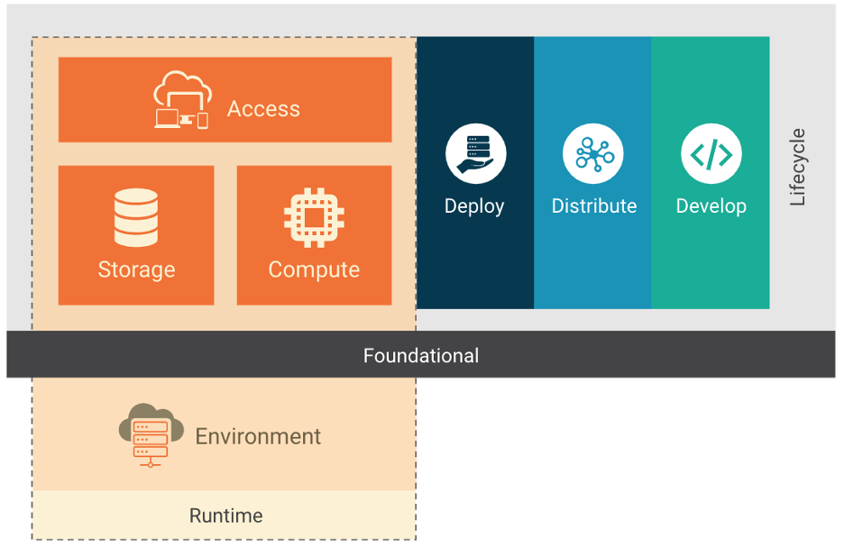
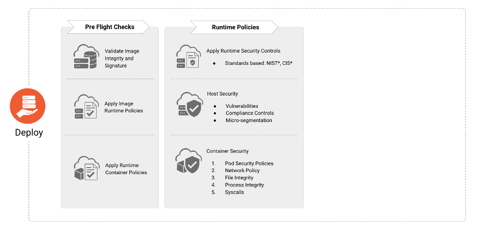
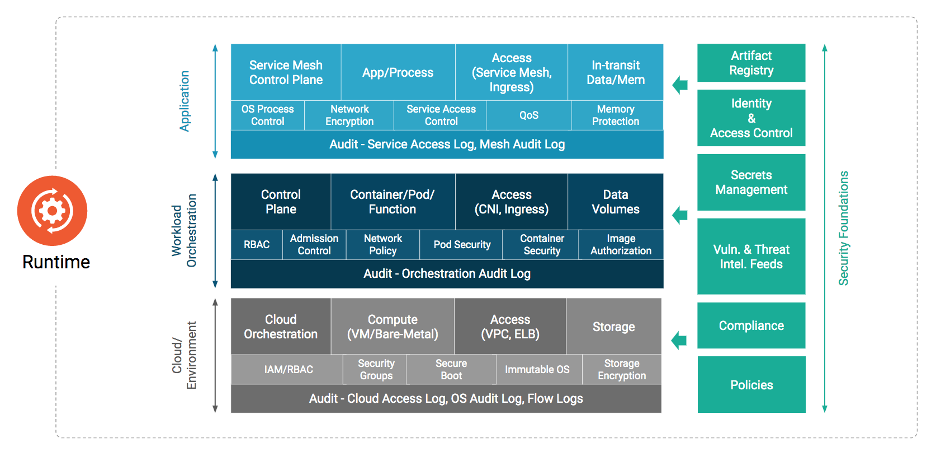

<!-- markdownlint-disable MD013 MD012 MD019 MD024 MD025 MD036 MD041 -->
<!-- cspell:disable -->

## Compartilhado com a comunidade da CNCF  

# **Artigo sobre Segurança em Cloud Native**

==========================================

Versão traduzida do Cloud Native Security Whitepaper

**Grupo de Trabalho:** Security TAG

**Link:** [https://tinyurl.com/CNSWP-ptBR](https://tinyurl.com/CNSWP-ptBR)

**Status Atual**: **WIP** | In Review | Approved | Obsolete \\ **Criado em**: 2021-FEV-26

**Revisado em**: 2021-MAY-26

**Versão Atual:** 0.0.1

**Aprovadores**: \[x\]

**Contribuidores (versão original):** [aradhna.chetal@gmail.com](mailto:aradhna.chetal@gmail.com), [themoxiefoxatwork@gmail.com](mailto:themoxiefoxatwork@gmail.com), [jj@tetrate.io](mailto:jj@tetrate.io), gadi@alcide.io [@lumjjb](https://github.com/lumjjb), @trishankatdatadog, [@vvenkatara@paloaltonetworks.com](mailto:vvenkatara@paloaltonetworks.com), @pushkarj-v, @whaber, @sublimino, @rowan-baker, [chase.pettet@gmail.com](mailto:chase.pettet@gmail.com), [harsingh@us.ibm.com](mailto:harsingh@us.ibm.com), jeff.lombardo@gmail.com

**Contribuidores (versão pt-BR): @**magnologan**,** @koelhosec**,** @julianocosta89**,** @yuriolisa, @imfvieira, @damelo, @silva-andrre

**Revisores (versão original)**: @justincappos, @lumjjb, @whaber, @craigbox, @anvega, @magnologan, alok@xenonstack.com, @nyrahul @ranio1

**Revisores (versão pt-BR)**: @magnologan, @koelhosec

Segurança cloud native, quando executada estrategicamente em uma organização, pode prover alta disponibilidade, garantia, resiliência, e redundância em escala assegurando-se que clientes e desenvolvedores tenham acesso seguro aos recursos necessários na velocidade que eles esperam. A segurança em si permanece um campo interdisciplinar que não pode ser isolada do ciclo de vida de desenvolvimento ou tratada como um domínio puramente técnico. Desenvolvedores, operadores e o pessoal de segurança precisam agir em parceria, troca e colaboração para continuar movendo a indústria adiante. Como qualquer inovação técnica, são as pessoas, sua paixão e a jornada que genuinamente torna a comunidade e a segurança cloud native possível.

# Introdução

Este artigo propõe disponibilizar para as organizações e suas lideranças técnicas um claro entendimento da segurança em ambientes cloud native, sua incorporação aos ciclos de desenvolvimento e considerações para determinar a melhor aplicação deste entendimento. A segurança nativa em ambientes de nuvem é um problema composto de diversos objetivos e restrições que abrange várias áreas de conhecimento e prática. Praticamente todas as operações de desenvolvimento e disponibilização de uma aplicação (Operações Dia 1 e Dia 2) se sobrepõem com algum domínio de segurança que abrangem desde a gestão de identidades a soluções de armazenamento. Entretanto, a segurança de ambientes cloud native aborda diversas outras áreas; sendo também um problema a gestão de pessoas, times e organizações. São os mecanismos, processos e intenções pelas quais as pessoas e os sistemas vão interagir entre si para realizar mudanças nas aplicações cloud native e suas tecnologias.

## Público Alvo

O público alvo deste artigo são as lideranças das áreas de tecnologia (C-Level: Chief Security Officer (CSO), Chief Information Security Officer (CISO), or Chief Technology Officer (CTO) de grandes empresas, agências governamentais ou organizações sem fins lucrativos que desejam prover um ecossistema em um ambiente de nuvem de forma segura. Outras partes interessadas incluem Gerentes de projeto, produto e programas, arquitetos responsáveis pelo design e implantação de produtos e serviços cloud native seguros. Além destes, qualquer um com grande interesse no tópico de segurança para ambientes cloud native podem utilizar este documento como referência.

## Objetivos do Modelo Cloud Native

A adoção e a inovação envolvendo as arquiteturas de containers e micro serviços trouxeram também seus desafios. A necessidade de mitigar as vulnerabilidades de cibersegurança está no topo das prioridades das organizações modernas. Os líderes de segurança receberam as tarefas de proteger os ativos, tanto humanos como não humanos, adotando práticas para prevenir, detectar e responder às ameaças enquanto atendem os requisitos de conformidade. Uma crença antiga é que as implementações de segurança são impeditivos a velocidade e agilidade dos times baseados em DevOps. Entretanto, a liderança deve implementar uma estreita integração e um entendimento bidirecional para empoderar os times de DevOps e assim compartilhar com todos a responsabilidade sobre os riscos cibernéticos.

Os padrões e arquiteturas seguras para ambientes cloud native a serem adotados pelas organizações devem ser compartilhados para garantir que a indústria está impondo práticas de segurança com alta prioridade e integrando com o ciclo de desenvolvimento de aplicações modernas. Ainda mais importante, destacando a sinergia entre arquitetura segura e os líderes de segurança e alinhados com os objetivos de segurança das organizações em termos de Gestão de Vulnerabilidades, Zero Trust, Segurança em Nuvem e DevSecOps como prioridades máximas.

Os conceitos descritos neste artigo não foram desenhados em favor de um ou outro produto e podem ser aplicados independentemente do tipo de serviço selecionado.

Este documento não se propõe em prover ensinamentos em conceitos de segurança ou de nuvem. Também não recomenda tecnologias específicas ou ferramentas; entretanto, pode citar exemplos de tecnologias ou ferramentas que atendam o tópico em discussão.

Além das recomendações existentes neste documento, práticas específicas relacionadas a recomendações regulatórias de proteção de dados e privacidade, como GDPR, PCI DSS, podem necessitar de considerações extras relacionadas à regulação. Nós recomendamos aos leitores que consultem outros recursos  para direcionamento dos assuntos de controles técnicos e riscos de conformidade.

## Premissas

A CNCF define cloud native dentro do repositório Github do Comitê de Supervisão Técnica (TOC) da CNCF. Este documento não busca mudar esta definição ou expandir a mesma.  

Com a evolução da adoção de soluções cloud native e das práticas modernas de desenvolvimento de software, as tecnologias que compõem um stack cloud native continuarão a mudar com o passar do tempo. Representações deste stack mutável estão inclusas no completo [cloud native interactive landscape](https://landscape.cncf.io/).

O termo carga de workload neste documento se refere a quaisquer produtos, projetos, aplicações e sistemas que foram ou serão desenvolvidos, mantidos, distribuídos ou implantados em um ambiente baseado em nuvem. \

# Camadas Cloud Native

O stack de uma implementação cloud native é composto das camadas de fundação, ciclo de vida e ambiente. O stack cloud native pode ser adotado em diversos modelos de implementação: Infraestrutura como serviço (IaaS), Plataforma como serviço (Paas), Container como Serviço (CaaS) e Função como serviço (FaaS). Cada modelo de implementação fornece abstrações adicionais que são fáceis de gerenciar e operar nos ambientes cloud native. Como alguns desses modelos são já bem conhecidos e estão em uso há anos, vamos focar nos modelos específicos para cloud native.

O modelo de container como serviço (CaaS) permite que os usuários orquestrem e gerenciem containers, aplicações e clusters através de uma plataforma virtualizada baseada em containers, interface de programação de aplicação (API) ou um portal WEB. CaaS ajuda os usuários a construir aplicações em container com políticas de segurança embarcadas como código e executá-las em nuvens privadas, on premises ou nuvens públicas. CaaS ajuda o fluxo do processo de construção do container. Com a orquestração dos micro serviços e suas implantações, ajuda as empresas a lançar aplicativos mais rapidamente e permite a portabilidade entre os ambientes híbridos e multi-nuvem, portanto reduzindo a infraestrutura e também os custos operacionais. O modelo CaaS é financeiramente vantajoso pois permite às empresas simplificar o gerenciamento dos containers enquanto dão a possibilidade de se pagar apenas pelos recursos que querem usar. CaaS tem os containers como recurso fundamental, enquanto no IaaS as máquinas virtuais e servidores físicos são usados como recursos.

Função como Serviço (FaaS) é outro modelo de implementação cloud native, um tipo de serviço que permite os usuários das empresas executar códigos em resposta a um evento sem a típica e complexa infraestrutura associada com a construção e utilização de micro serviços. Hospedar uma aplicação na nuvem normalmente requer provisionar e gerenciar um ambiente virtualizado, gerenciando o sistema operacional, os componentes WEB e etc. Com o FaaS, a gerência do hardware, do sistema operacional e do servidor WEB são todos executados automaticamente pelo provedor de nuvem. Assim os usuários podem focar nas funções individuais dos código dos micro serviços enquanto pagam pelos recursos que são utilizados com a vantagem da elasticidade dos recursos providos pela nuvem.

## Ciclo de Vida

Ciclo de Vida em um contexto cloud native reúne os processos, práticas e a tecnologia que permitem workloads observáveis, gerenciáveis e resilientes, executados no contexto de um ambiente de nuvem. Como representado na Figura 1, o ciclo de vida é composto de 4 fases contínuas: Desenvolver, Distribuir, Implantar e Executar. Cada fase estende e amplifica a anterior, permitindo e suportando a execução de workloads seguros.

### Processos de Ciclo de Vida

O gerenciamento da cadeia de suprimentos e a curadoria de benchmarks de segurança aplicáveis são críticos para uma implementação segura.  

#### Cadeia de Suprimentos (Supply Chain)

As organizações são encarregadas de assegurar com que a cadeia de suprimentos para o workload que estiverem desenvolvendo está sujeita a análise segurança dentro do ciclo de vida do processo. A segurança da cadeia de suprimentos pode ser dividida em duas partes: a segurança das ferramentas e serviços que proporcionam o ambiente para  a criação de um workload (ex: ferramentas de desenvolvimento) e os componentes do próprio workload (ex: bibliotecas, dependências, e imagens). A cadeia de suprimentos precisa ser implementada de tal maneira que a integridade da própria cadeia pode ser verificada, e os artefatos produzidos pelo software da cadeia de suprimentos podem desta forma ser assinados para verificação de origem.

Assim sendo, a organização precisa exercer cautela ao usar dependências, pois os pacotes dependentes do upstream irão inevitavelmente conter vulnerabilidades de segurança. Verificar a autenticidade e integridades dos pacotes usados por terceiros é essencial para assegurar que as dependências são como devem ser e não estão comprometidas.

Uma característica primária das aplicações cloud native é a reutilização de software que está disponível via pacotes open source e imagens de containers que são construídas e distribuídas através de registros de containers open source. Consequentemente, é crítico para um desenvolvedor, operador e a equipe de segurança assegurar que os artefatos e dependências em suas aplicações não contém fontes conhecidas de vulnerabilidades e malware. A presença de malware em imagens de container é um vetor de ataque significativo em ambientes de execução[^1]. É essencial a aplicação periódica e sob demanda do escaneamento de vulnerabilidades nas imagens de container e pacotes compostos na pipeline assim como nos registros dos containers.

A alavancagem destes métodos permite a verificação da distribuição de software seguro e uma operação constante. Incorporar o escaneamento de vulnerabilidades no pipeline de geração de workload possibilita a organização amplificar o feedback para as equipes de desenvolvimento e tem um maior potencial de bloquear versões inseguras ou vulneráveis de serem distribuídas e implementadas. O escaneamento de software periódico também permite o escalonamento de novas vulnerabilidades em softwares existentes.

#### Benchmarks de Segurança

A utilização de benchmarks de segurança (ex. [Guia de Segurança para aplicações em Container NIST](https://nvlpubs.nist.gov/nistpubs/SpecialPublications/NIST.SP.800-190.pdf), [Centro para Segurança de Internet (CIS)](https://www.cisecurity.org/), [Estratégias de Segurança para microserviços NIST](https://csrc.nist.gov/publications/detail/sp/800-204/final), e [OpenSCAP](https://www.open-scap.org/)) proporciona a equipes de desenvolvimento e organizações, um guia de criação de workloads "seguras-por-padrão". A adoção e implementação destas benchmarks proporciona às equipes realizarem testes com bases mais sólidas. Entretanto, eles não podem  levar em consideração fluxos de dados e o uso customizado das plataformas em teste. Profissionais de segurança devem implementá-los como um guia ao invés de uma checklist.

As próximas seções trazem uma análise detalhada das implicações, ferramentas e melhores práticas para integrar a segurança no ciclo de vida da aplicação.

### Desenvolver

Segurança para aplicações Cloud Native deve ser aplicada durante todo o ciclo de vida de uma aplicação. A fase "Desenvolver" é a primeira neste ciclo, resultando na criação de artefatos como Infraestrutura, manifestos de aplicação e container, etc., que serão usados para implementar e configurar aplicações Cloud Native. Consequentemente, estes artefatos provaram ser fonte de numerosos vetores de ataque que podem ser explorados no ambiente de execução. As próximas seções elaboram as variadas ferramentas de segurança, processos, e verificações que devem ser instituídas nesta fase para reduzir dramaticamente a superfície de ataque de aplicações inseridas em ambiente de produção.

#### Verificações de Segurança no Desenvolvimento

O hardening de segurança durante a fase de desenvolvimento é um componente crítico na implementação de aplicações. Isso significa que os requerimentos de segurança devem ser introduzidos cedo no desenvolvimento de software e tratados da mesma maneira como qualquer outro requerimento. Estes requisitos são tipicamente baseados em necessidades do negócio em risco e compliance. Atender estas necessidades nas primeiras fases, previne refazer o trabalho em estágios futuros do ciclo de vida, o que deixa a pipeline de DevOps mais lenta e aumenta os custos em geral [^2]. Equipes de DevOps precisam se aproveitar também de ferramentas específicas em identificação de má configuração de segurança e vulnerabilidades, antes do desenvolvimento final destas aplicações. É igualmente importante que essas ferramentas se integrem perfeitamente com as ferramentas existentes utilizadas pelas equipes de DevOps para complementar e não impedir a agilidade com a segurança. Por exemplo, as ferramentas precisam realizar o scan de templates de Infraestrutura como Código bem como manifestos da aplicação dentro da IDE do desenvolvedor ou quando um Pull Request é feito, e contém informações ricas no contexto de segurança, que podem ser aplicadas cedo, de maneira rápida e fácil no pipeline de desenvolvimento. A adoção destas etapas asseguram a falta de vulnerabilidades conhecidas ou configurações de alto risco. Os componentes Cloud Native devem ser movidos por API, proporcionando a interação de ferramentas complexas de debug com os workloads primários que contam com o orquestrador.

As equipes devem implementar ambientes dedicados a desenvolvimento, testes e produção para prover aos desenvolvedores de aplicação e infraestrutura um ambiente isolado para desenvolver, testar e implementar sistemas e aplicações, imagens padrão de container, imagens douradas de VM, e testes não funcionais.

Algumas organizações podem se utilizar de implementações canário, azul-verde ou vermelho-preto, e outros modelos de implementação para adicionar eficiência para usabilidade e testes dinâmicos e interativos.

##### Desenvolvimento De Testes

Desenvolvedores, operadores e a equipe de segurança devem realizar testes para o código e infraestrutura que são críticos para o negócio, contém um alto perfil de ameaças, são sujeitos a frequentes mudanças, ou contém um fonte histórica de falhas. A modelagem de ameaças pode identificar focos de alto risco e alto impacto no código que proporcionam um alto retorno sobre o investimento (ROI) para o desenvolvimento de testes. Testes podem incluir desdobramento, sistema operacional, infraestrutura e solidez da base de dados, teste de aplicações (teste estático e dinâmico do código fonte, configuração de container) integração ou teste do sistema (aceitação da aplicação e componentes de infraestrutura e a sua interação), e teste de fumaça (checagem pós-implementação com um sistema funcional). Os autores dos testes devem ter acesso a ambientes completos de teste e desenvolvimento que proporcionem a eles a capacidade de desenvolvimento rápido de testes, reduzindo integração contínua e loops de feedback. Versões de teste do sistema devem estar disponíveis para os autores para utilização local  bem como em ambiente compartilhado de testes.

#### Revisão de Código

Pequenas mudanças no workload, ou na infraestrutura que foi implementada, podem ter consequências de segurança com um alcance bem maior. Para mitigar os riscos de consequências indesejadas, as equipes são encorajadas a usar o princípio de "[quatro olhos (four eyes)](https://www.unido.org/overview/member-states/change-management/faq/what-four-eyes-principle)" ao conduzir a revisão do código antes de mudanças serem submetidas a base do código (ex. implementação de um pull request no git workflow).

### Distribuir

A fase de distribuição é responsável por consumir definições de imagem e especificações para construir o próximo estágio de artefatos, bem como imagens de container, imagens de máquinas virtuais e outras. Em paradigmas modernos de integração contínua e implementação contínua, a fase de distribuição consiste de testes de aplicação sistemática para identificação de bugs e falhas no software. Contudo, a adoção de código aberto e pacotes reutilizáveis resulta na incorporação de vulnerabilidades e de malware em imagens de container. É então imperativo incorporar passos focados em segurança bem como o escaneamento da imagem para os vetores de ameaça mencionados anteriormente, bem como validar a integridade das imagens para proteção contra falsificação. Os próximos parágrafos elaboram as melhores práticas de segurança que ajudam desenvolvedores e operadores a identificar e proteger imagens de container de ameaças, bem como as técnicas e ferramentas para proteger a pipeline (CI/CD) e infraestrutura. Além disso, organizações podem querer criptografar artefatos de software se a confidencialidade for desejada ou necessária.

Caso os artefatos do software sejam comprometidos e se tornem não confiáveis devido a algum incidente, as equipes devem revogar as chaves de sessão para assegurar a rejeição.

#### Construção da Pipeline

A integração contínua (IC) dos servidores deve ser isolada e restrita a projetos com uma classificação semelhante de segurança e sensibilidade. Projetos de infraestrutura que têm o requerimento de privilégios elevados devem rodar em servidores separados dedicados a IC. Políticas de construção devem ser policiadas na pipeline de IC e pelos controladores de admissão do orquestrador.

Ferramentas de cadeia de suprimentos podem coletar e assinar  a construção de metadata na pipeline. Os últimos estágios podem então verificar as assinaturas para validar que os estágios requisitados pela pipeline estão rodando.

O leitor deve assegurar-se que a infraestrutura de integração contínua (IC) e entrega contínua (EC) é tão segura quanto possível. Por exemplo, atualizações de segurança devem ser priorizadas para instalação assim que possível, e chaves de criptografia devem ser protegidas contra exfiltração via uso de Módulos de Segurança de Hardware (MSH) ou Gerenciadores de Credencial.

#### Scan de Imagens

O escaneamento de imagens de container é um componente crítico para segurança de aplicações em container em todo o ciclo de vida. É vital que o scan seja feito na pipeline de CI antes da implementação da imagem na produção. Incorporar esta capacidade assegura que os desenvolvedores, operadores, e profissionais de segurança tenham informações detalhadas sobre todas as vulnerabilidades conhecidas e detalhes como severidade, a pontuação do CVSS, a disponibilidade de mitigação/correções.

A incorporação de scans de vulnerabilidades em imagens de container junto com regras de compliance na pipeline, asseguram que somente as aplicações suficientemente corrigidas serão implementadas na produção, reduzindo a potencial superfície de ataque. O escaneamento das imagens de container também ajuda a identificar a presença de malware em pacotes de software open source ou camadas base na imagem incorporadas de repositórios de imagem open source. O uso de escaneamento de imagens de container proporciona às equipes fatos sobre vulnerabilidades ou malware e não proporciona a prevenção contras estas vulnerabilidades ou malware. As organizações devem ser prudentes ao escolher o scan de imagens, colocando mecanismos para o uso dos fatos e informações práticas, bem como policiando as regras de compliance corporativas.

#### Hardening de Imagens

Imagens de container constituem o primeiro nível de output da construção da pipeline. Sendo assim, eles devem incluir hardening de segurança que leve em consideração as ameaças a serem mitigadas, enquanto permitem algumas configurações just-in-time rodarem junto com a grande parte do ecossistema.

No que diz respeito a objetivos de garantia de segurança, as seguintes questões devem ser avaliadas:

* Deve o ambiente de execução ser restrito a um usuário específico?
* O acesso aos recursos devem ser limitados?
* A execução de processos deve ser restrita a nível do kernel?

#### Manifesto de Scan de Aplicações em Container

Manifestos de aplicação descrevem as configurações requisitadas para implementação de aplicações em container. Como mencionado anteriormente na seção de Benchmarks, guias e recomendações como a publicação [NIST 800-190](https://nvlpubs.nist.gov/nistpubs/SpecialPublications/NIST.SP.800-190.pdf) recomendam as melhores práticas de segurança e configurações para aplicação em containers. Consequentemente, é vital utilizar ferramentas para o escaneamento destes manifestos de aplicação na pipeline de CI/CD para que sejam identificadas configurações que podem resultar potencialmente em um postura de implementação não segura.

#### Hardening do manifesto de Aplicações em Container

Assim como imagens de container, o hardening do manifesto de aplicações em container pode ser pensado e implementado tanto na construção da aplicação quanto se ela já estiver rodando.

No que diz respeito a objetivos de garantia de segurança, as seguintes questões devem ser avaliadas:

* Quais restrições mínimas o ecossistema de execução deve estar cumprindo?

#### Testes

Aplicações Cloud Native devem estar sujeitas aos mesmos padrões de testes de qualidade de aplicações tradicionais. Isto inclui os conceitos de código limpo, aderência ao [Teste Pirâmide](https://martinfowler.com/articles/practical-test-pyramid.html), escaneamento de segurança da aplicação através de testes de segurança de aplicação estático (SAST), análise e escaneamento de dependências, testes de segurança de aplicação dinâmico (DAST) (Ex. mocking), instrumentação da aplicação, e total infraestrutura com testes disponíveis para desenvolvedores nas cargas de trabalho locais. Resultados de testes automatizados devem mapear baseados nos requerimentos para dupla atestação (desenvolvedor e ferramenta) para garantia de segurança em tempo real para as equipes de segurança e compliance.

Uma vez que uma falha de segurança for identificada (Ex. um regra incorreta de firewall ou roteamento), se a análise da causa raiz determinar que existe uma chance razoável de se repetir, os desenvolvedores devem escrever um teste automatizado para prevenir esta regressão de se repetir. Na falha do teste, as equipes recebem feedback para corrigir a falha, e no próximo “merge”, o teste irá passar (assumindo que a falha foi corrigida). Desta maneira se defende contra a regressão nas futuras modificações ao código.

Testes de infraestrutura são controles preventivos e focam entidades e dados definidos como configuração de Infraestrutura-como-código (IaC). Testes de segurança de infraestrutura já construída são controles de detecção e combinam garantias, regressões históricas, e detecção de de configurações inesperadas (regras de firewall abertas para o mundo, políticas de IAM com privilégios demais, pontos de extremidade não autenticados, etc.)

Hardening de infraestrutura e cargas de trabalho deve ser suportado por testes compreensivos, que permitem a incrementação do hardening a medida que o sistema amadurece. Testes para verificar que o hardening ocorreu devem existir durante a construção do projeto mas também para serem executados na implementação para avaliar qualquer mudança ou regressão que pode haver ocorrido durante o ciclo de vida.

##### Análise Estática e Testes de Segurança

Análise estática de IaC, manifestos de aplicação, e software pode incluir a identificação de más configurações e scan de vulnerabilidade. O código em IaC deve estar sujeito a mesma política de controle de pipeline como as cargas de trabalho de aplicações.

IaC está ganhando popularidade e sua implementação vem crescendo rapidamente em organizações para implementação de infraestrutura de nuvem e containers. Consequentemente, configurações inseguras nesses templates podem resultar em exposição de vetores de ataque.

Estes templates devem ser escaneados para configurações inseguras e outros controles de segurança usando ferramentas automatizadas antes da implementação da aplicação e artefatos de infraestrutura. Más configurações chave para se atentar incluem:

* Vulnerabilidades contidas em imagens especificadas no manifesto de aplicação.
* Ajustes de configuração em containers que possibilitam escalar privilégios.
* Identificação de contexto de segurança e chamadas que podem comprometer o sistema.
* Configurações de limite de recursos.

##### Análise dinâmica

Análise dinâmica da infraestrutura existente pode incluir a detecção de desvios na configuração do RBAC e IAM, validando a superfície de ataque de rede esperada, e assegurando que um SOC possa detectar comportamentos estranhos em ambientes de teste dedicados para configuração de alertas para produção. Análise dinâmica é considerada como parte dos testes, contudo é esperado que ocorra em um ambiente executado fora da produção.

##### Testes de Segurança

Testes automatizados de segurança de aplicações e infraestrutura devem ser foco integral nas equipes de segurança. Plataformas de teste devem ser continuamente atualizadas para replicar ameaças de acordo com o modelo de risco organizacional e podem ser reutilizadas para testes de regressão de segurança à medida que o sistema evolui. Testes automatizados de segurança aumentam a segurança e velocidade das atualizações removendo checagens manuais, como a validação e controles manuais de implementação em um único ponto, o que leva bastante tempo e é inadequado. Testes automatizados de segurança também demonstram eficácia no controle sob demanda ao tentar agir explicitamente sobre os ameaças, melhorando a segurança do sistema e a aderência a qualquer requerimento de compliance em tempo real.

#### Artefatos e Imagens

##### Preparação dos Registros

Devido ao uso de componentes de código aberto que vêm normalmente de fontes públicas, as organizações devem criar diversos estágios de registros em suas pipelines. Somente desenvolvedores autorizados devem ser capazes de acessar os registros públicos e fazer o pull de imagens base, que são então armazenadas em um registro interno, para serem utilizadas dentro da organização. Também é recomendado que se tenham, registros privados separados para armazenamento de artefatos de desenvolvimento por equipe ou por grupo, e finalmente um estágio ou registro pré-produção para imagens prontas para produção. Isso possibilita um maior controle sobre a proveniência e a segurança dos componentes de código aberto, ao habilitar diferentes tipos de testes para estágios na cadeia de CI/CD.

Para qualquer registro usado, controles de acesso devem ser implementados através de um modelo dedicado de autenticação e permissões. Usando-se TLS mutuamente autenticado para todas as conexões do registro (bem como outras interações dentro da arquitetura).

##### Assinatura, Confiança e Integridade

A assinatura digital do conteúdo da imagem no momento de sua construção e a validade de dados assinados antes do uso, protege os dados da imagem serem alterados entre a construção e ao estarem rodando, com isso assegura-se a integridade e a proveniência de um artefato. A confirmação inicia com um processo para indicar que um artefato foi vetado e aprovado. A confirmação da confiança também inclui verificar que o artefato possui uma assinatura válida. No caso mais simples, cada artefato pode ser assinado por um signatário para indicar um único processo de teste e validação que o artefato realizou. Contudo a cadeia de supply chain de software é mais complexa na maioria dos casos, e a criação de um único artefato reside na validação de múltiplos passos, dependendo da confiança de um conglomerado de entidades. Exemplos disso são:

* Assinatura de imagem de container - o processo de assinatura de manifesto de imagem de container
* Assinatura da configuração - Assinatura de um arquivo de configuração, ex. aplicação de arquivos de configuração: mais comum no caso de GitOps, onde pode existir um processo para validar e checar configurações.
* Assinatura de Pacotes - Assinatura de um pacote de artefatos, como pacotes de aplicação.

Para artefatos de software genéricos como bibliotecas ou artefatos OCI, a assinatura destes artefatos indica a proveniência de uso aprovado pela organização. A verificação destes artefatos é igualmente crucial para assegurar que somente os artefatos autorizados são permitidos. É fortemente recomendável que os repositórios façam a requisição de autenticação mútua para realização de mudanças nas imagens dos registros ou para fazer o commit do código nos repositórios.

##### Criptografia

A criptografia de imagem de container criptografa uma imagem para que seu conteúdo seja confidencial. O conteúdo da imagem é criptografado para assegurar que permaneça confidencial para promoção desde a construção até estarem em produção. No evento de uma distribuição comprometida, o conteúdo do registro da imagem permanece secreto, o que pode ajudar em casos de proteção de segredos de comércio ou outros materiais confidenciais.

Outro uso comum de encriptação de imagem de container é para reforçar a autorização da imagem. Quando a encriptação da imagem é associada com a atestação e/ou autorização de gerenciamento de chaves e distribuição de credenciais, é possível requisitar que a imagem de container rode somente em plataformas específicas. Autorização de imagem de container é útil para uso de compliance bem como geo-fencing ou controle de exportação e gerenciamento de direitos de mídia digital.

### Implantar

A fase “Implantar” é responsável por incorporar a sequência de verificações "pré-implementação" para assegurar que as aplicações que serão implantadas no ambiente de execução estejam em conformidade com as políticas de compliance e segurança da organização.

#### Checagem Pré-implementação

Antes da implantação, as organizações devem verificar a existência, aplicabilidade e o estado de:

* Assinatura de imagem e integridade
* Políticas de execução de imagem (ex. ausência de malware ou vulnerabilidades críticas)
* Políticas de execução de Container (ex. ausência de privilégios excessivos)
* Vulnerabilidade do Host e controles de compliance
* Workload, aplicação, e políticas de segurança de rede

#### Observação e Métricas

Instituir observação e métricas em arquiteturas Cloud Native proporciona idéias de segurança para que os stakeholders apropriados possam resolver e mitigar anomalias que aparecem nos relatórios; ferramentas desta área podem ajudar a coletar e visualizar essa informação. Através do uso de análise comportamental e heurística, equipes podem detectar e escalar eventos fora do comum ou suspeitos, e chamadas inexplicadas para os apropriados stakeholders. Inteligência artificial (IA), machine learning (ML), ou modelagem estatística, são todos mecanismos encorajados para assistência no desenvolvimento de análise comportamental e heurística.

#### Resposta e Investigação

Uma aplicação deveria prover logs referentes à autenticação, autorização, ações e falhas. O desenvolvedor deveria incluir essa função como parte das fases de planejamento e design. Esses elementos fornecem uma trilha de evidências a serem seguidas quando uma investigação está em curso e por conseguinte a causa raiz precisa ser confirmada.

Capacidades forenses são parte integral de qualquer resposta a incidentes e atividades de mitigação. Sendo assim, eles fornecem evidências para determinar a causa raiz daquele incidente em curso e prover feedbacks para a mitigação que será aplicada. A natureza de curta duração de ambientes de containers requer um conjunto de ferramentas ágeis para capturar e analisar qualquer evidência. Integrando capacidades forenses em um plano ou procedimentos de resposta a incidentes proverá os meios para adquirir e processar evidências, diminuir o tempo que é empreendido para determinar a causa raiz, e minimizar a exposição de uma invasão.

## Ambiente de execução

A fase de execução compreende três áreas críticas: computação, acesso e armazenamento. Como a fase de execução é dependente da conclusão com sucesso das fases anteriores de desenvolvimento, distribuição e implantação, a segurança da execução é dependente da eficácia das práticas de segurança adotadas em cada fase anterior. Os parágrafos seguintes detalham os requerimentos de segurança e as implicações para cada um dos componentes críticos.

### Computação

A computação cloud native é altamente complexa e sua construção está em constante evolução. Sem os componentes principais para que a computação ocorra, as organizações não podem garantir que os workloads estão seguros.  

Considerando que os containers provêm virtualização baseada em software para aplicações multi-tenant em um equipamento compartilhado, é importante utilizar um sistema operacional específico, que é apenas leitura e possui outros serviços desativados. Isto ajuda a reduzir a superfície de ataque. Também possibilita o isolamento e o confinamento de recursos que permite aos desenvolvedores executar aplicações isoladas em um kernel compartilhado. Para permitir a defesa em camadas é também recomendado que não se utilize o mesmo kernel de sistema operacional para processar dados sensíveis e não relacionados entre si.

Para que a segurança esteja presente em todas as camadas de containers e serviços, uma raiz de hardware de confiança baseado no Módulo de Plataforma de Confiança (TPM) ou vTPM pode ser usado. A cadeia de confiança enraizada no hardware, pode ser estendida para o kernel do sistema operacional e seus componentes, para habilitar a verificação criptográfica de boot de confiança, imagem de sistema, tempo de execução e container, imagens e container e assim por diante.

Sistemas operacionais proporcionam componentes básicos de sistema como bibliotecas de criptografia usadas para conexões remotas e funções de kernel que são usadas para iniciação de processos, gerenciamento, etc. Estes, podem conter vulnerabilidades e porque eles providenciam a base computacional para os containers eles podem impactar todos os containers e apps que executam nestes hosts. Ao mesmo tempo, containers mal configurados podem impactar a segurança do kernel do host e então todos os serviços executando em containers neste host. Refira aos detalhes na seção da fase de Distribuir para mais informações.

#### Orquestração

Qualquer orquestrador possui diversos componentes que são separados em diferentes camadas, mais conhecidos como planos, como o plano de controle e o plano de dados. Algumas vezes há a necessidade de construir uma camada superior de gerenciamento de multi-implantação que seja responsável por manter o estado através de diferentes camadas de controle e que possam coexistir de forma independente.

Qualquer sistema de orquestração tem uma série de ameaças que impactam a segurança geral da implantação e a segurança contínua da execução. Acessos maliciosos para a API do orquestrador, acessos não autorizados e mudanças no par chave-valor (key-value), no painel de controle dos clusters, interceptação do tráfego do plano de controle, mal uso da API, interceptação do tráfego da aplicação,  entre outros, são todas áreas com potenciais ameaças. É importante usar as melhores práticas e hardening de configurações em qualquer orquestrador para evitar a exposição a estas ameaças. É também importante monitorar e detectar quaisquer mudanças nas configurações iniciais realizadas em execução para garantir continuamente a postura de segurança do cluster. Outras boas práticas como minimizar o acesso administrativo ao plano de controle, segregação de tarefas e o princípio do mínimo privilégio devem ser aplicados.

##### Políticas de Segurança

É essencial considerar as funcionalidades de segurança e várias opções de configurações do seu orquestrador para controlar os privilégios de segurança de execução do  container que podem ser utilizados para criar outros containers. O uso de políticas de alto nível e a criação de governança ajudam a aplicar estas práticas sugeridas.

##### Requisições e limites de recursos

Aplicar diferentes níveis de objetos e requisições de recursos e limites através de cgroups ajudam a prevenir a exaustão dos recursos nos níveis do node e do cluster causada por um comportamento anormal de um  processamento devido a um problema intencional (um ataque de fork bomb ou mineração de criptomoedas) ou erro não intencional (leitura de um grande arquivo na memória sem validação de entrada, escalonamento horizontal para esgotar os recursos de computação).

###### Análise de Logs de Auditoria

A análise dos logs de auditoria é um dos métodos mais utilizados para identificar e correlacionar comprometimento, abuso ou erros de configuração de sistemas. Automação contínua da análise e correlação dos logs de auditoria é de suma importância para os times de segurança pois as arquiteturas cloud native são capazes de gerar configurações e filtros mais granulares de auditoria que os sistemas legado. Adicionalmente, a interoperabilidade dos logs cloud native permite filtros avançados para prevenir sobrecarga no processamento. O que é crítico aqui, como na análise tradicional de logs, é a geração de eventos de auditoria acionáveis que relacionam/contextualizam os dados dos logs gerando informação que pode ser usada na tomada de decisão e em resposta a incidentes.

As violações de conformidade são detectadas com base no conjunto de regras pré-configuradas que filtram as violações existentes na política das organizações.

Ter a possibilidade de auditar as ações das entidades utilizando o cluster é vital para possibilitar a auditoria de API com um filtro específico para alguns grupos ou verbos de API, sejam eles de interesse do time de segurança, dos administradores do cluster ou qualquer outro time de acordo com o campo de estudo. O encaminhamento imediato dos logs para um local inacessível utilizando as credenciais do cluster também evita a tentativa de um atacante de esconder suas ações através da exclusão ou desativação dos logs. Os sistemas responsáveis pelo processamento dos alertas  devem ser constantemente refinados baseados nos falso positivos a fim de evitar enxurrada de alertas,  fadiga e falsos negativos após a ocorrência de um incidente que não foi  detectado.

##### Autenticação de Plano de Controle e raiz de confiança de certificados

Os administradores do orquestrador devem configurar todos os componente do plano de controle como a gerência de controle (controller-manager), agendador (scheduler), servidor de API, e o kubelet (se aplicável) para se comunicar utilizando autenticação mútua e validação de certificados periodicamente rotacionados em adição ao hardening existente no plano de controle. A CA emissora pode ser a CA padrão do orquestrador ou uma CA externa. Uma atenção extra deve ser dada pelos administradores à proteção da chave privada da CA. Para mais informações na extensão ou estabelecimento de confiança, verifique o tópico de identidade deste artigo.

##### Criptografia de Segredos

É possível gerenciar segredos em uma orquestração de container ou em um ambiente já implantado através do uso de um gerenciador de segredos ou nativamente utilizando os segredos do próprio orquestrador. Quando utilizar um armazenamento nativo de segredos é crucial ficar atento aos diferentes métodos de proteção que estão disponíveis:

* Criptografia com um gerenciador de chaves criptográficas externo. (KMS)
  * A utilização de um KMS é uma maneira segura para proteger segredos no orquestrador quando a criptografia de chaves em um KMS externo criptografa a chave de encriptação de dados (DEK) que criptografa os segredos armazenados _at rest_. Esse método possui uma opção para salvar DEKs na memória para reduzir a dependência na disponibilidade do KMS externo e uma criptografia de segredos mais rápida durante a criação do pod.
* Criptografia gerenciada pelo orquestrador
  * Esta metodologia criptografa os segredos armazenados no orquestrador, mas a chave de criptografia também é gerenciada pelo orquestrador (Ex. arquivo de configuração do orquestrador).
* Sem criptografia
  * Por exemplo, com alguns orquestradores, os segredos são codificados em base64 e guardados em texto no local valor-chave por padrão.

Usando um gerenciador de segredos externo pode limitar os riscos de se usar segredos não criptografados e diminuir a complexidade no gerenciamento de chaves. A maioria das vezes estas ferramentas são providenciadas como controles ou operadores que podem injetar segredos em execução e gerenciar sua rotação transparentemente.

#### Containers

##### Tempo de Execução

O ambiente em tempo de execução de um container necessita de uma perspectiva de monitoramento e segurança sob processos, arquivos e redes. Somente funcionalidades sancionadas e System Call, como: Seccomp Filters, devem ser permitidas para executar ou invocar um container a partir do sistema operacional.

Mudanças em arquivos e pontos de montagem críticos devem ser monitoradas e prevenidas. Configurações devem agir como prevenção à mudanças em binários,  certificados e permissões de acesso remoto. Além disso, a configuração irá prevenir que acesso interno e externo aos containers, limitados somente ao que eles necessitam para operar. Adicionalmente, isso fará com que algum tráfego de rede malicioso seja detectado e negado.

##### Micro Serviços e eliminando a verdade implícita

O perímetro para aplicações em containers que são implementadas como micro-serviço é o próprio micro-serviço em si. Portanto, faz-se necessário a definição de políticas para restringir a comunicação somente entre pares de micro-serviços sancionados. A inclusão de zero trust na arquitetura de micro-serviços reduz o raio de impacto sobre micro-serviços que poderiam ser atingidos.

Operadores devem garantir que estão usando funcionalidades, como políticas de segurança para assegurar que a comunicação de rede de Leste à Oeste dentro da implementação do container é limitada somente para acesso autorizado. Existe um trabalho inicial sendo feito para proporcionar estratégias de segurança de micro serviços através do[NIST SP 800-204](https://csrc.nist.gov/publications/detail/sp/800-204/final) e pode servir de guia para implementação de arquiteturas de micro-serviços.

##### Confiança da Imagem e Proteção de Conteúdo

A utilização de um agente de políticas para assegurar ou controlar as imagens de container autorizadas e com assinaturas, permite às organizações providenciarem garantia da proveniência da imagem para workloads operacionais. Além disso, a inclusão de containers criptografados possibilita a proteção de fontes sensíveis, métodos, ou dados que existem no container.

#### Malha de Serviço

Uma malha de serviço proporciona conectividade com os serviços que somam capacidades adicionais como controle de tráfego, descoberta de serviços, balanceamento de carga, resiliência, capacidade de observação, segurança e assim por diante. Uma malha de serviço possibilita aos micro serviços utilizarem estas capacidades de bibliotecas a nível de aplicação e permite que desenvolvedores foquem na diferenciação da lógica de serviço.   Para que se possa efetivamente assegurar comunicações seguras entre serviços em ambientes cloud native, as organizações devem implementar uma malha de serviço para eliminar confiança implícita entre os pods e entre os workloads, atingidos pela criptografia de dados em trânsito. Utilização de uma malha de serviço também resolve problemas de identidade onde identidades tradicionais de terceira e quarta camada, e endereços de IP, não mais mapeiam os workloads claramente. A Malha de serviço não somente proporciona o isolamento e segurança a nível de rede mas também resiliência e capacidades como retry, timeout e implementar várias capacidades de "quebrar o circuito". Plataformas de streaming podem se beneficiar de uma malha de serviço pela segurança adicional ao usar autorização a nível de workload para definir regras de acesso para tópicos ou plataformas.

É importante ressaltar que a implementação de uma malha de serviço pode reduzir a superfície de ataque de uma implantação cloud native, e prover uma framework de chaves para construir aplicações zero trust em rede.

#### Detecção na Execução

Monitorar workloads em execução deve proporcionar às equipes a validação que o verdadeiro estado operacional e o estado esperado. Organizações não podem deixar de lado o escaneamento periódico e a monitoração dentro de seus ambientes sem tornar seus workloads em um playground para atacantes, sem supervisão. A utilização de componentes que detectam, rastreiam, agregam e reportam chamadas de sistema e tráfego de rede de um container deve ser usada para procurar comportamentos maliciosos ou não esperados.  

Enquanto testes de regressão e testes de segurança podem prevenir erros conhecidos ao se mover para ambientes de produção, estes não podem resolver tudo. Os workloads devem ser escaneados dinamicamente para detectar comportamento malicioso para qual nenhuma ocorrência anterior ainda exista. Eventos como um comando de suspender por tempo demasiado que executa exfiltração de dados do etcd após o workload estar em execução por um período X de dias, não são esperados na maioria dos ambientes e portanto não são incluídos em testes de segurança. O aspecto que os workloads podem ter cavalos de troia (trojan) atrasados por tempo ou eventos, somente são detectados ao se comparar o comportamento básico esperado, normalmente o que é descoberto durante as atividades e monitoramento dos scans.

Além disso, os workloads se tornam vulneráveis na mesma hora ou logo depois que estão em execução. As organizações devem continuamente escanear seus ambientes para detectar quais workloads são vulneráveis. Compreender a lista de materiais para cada workload pode ajudar as organizações a rapidamente identificar onde as vulnerabilidades estão. Informações adicionais sobre estas vulnerabilidades, bem como maturidade dos exploits, e o caminho vulnerável em uso, são críticos para determinar o atual risco para os workloads e pode ajudar organizações a priorizar atualizações para as aplicações em risco.

#### Funções

Funções serverless são suscetíveis a vários ataques e por isso devem ser apropriadamente protegidas. Processos devem executar somente as funções explicitamente permitidas em uma lista de permissões. Adicionalmente, as funções não devem poder fazer mudanças a pontos críticos de montagem do sistema.

As funções devem conter restrições que somente permitem acesso a serviços permitidos, tanto quanto a restrições de rede ou menor privilégio em modelos de permissão. Adicionalmente, a conexão de rede de egresso deve ser monitorada por administradores para detectar e, quando possível, prevenir o acesso a C&C (comando e controle) e outros domínios maliciosos. A inspeção de rede de ingresso deve também ser considerada para se detectar e remover de payloads maliciosos e comandos que podem ser usados na exfiltração de dados. Por exemplo, ataques de injeção de SQL que podem ser detectados durante a inspeção.

Funções serverless possuem um número de ameaças e controles disponíveis para tenants que são limitados. Autenticação falha e integração de API inseguras com serviços dependentes são alguns destes problemas. Assegurar que todas as funções serverless sejam executadas em recursos baseados no usuário ou isolamento de performance para classificações de dados semelhantes, podem ajudar a resolver isso, porém eles podem impactar a performance devido às limitações no espaço do endereço disponível no ambiente isolado.

#### Inicialização (Bootstrapping)

É necessária confiança entre os recursos computacionais para inicializar as cargas de trabalho corretamente e que as configurações estejam executando nos nós corretos. A inicialização (bootstrapping) garante que o recurso computacional esteja física e logicamente alocado corretamente e provisionado com permissão de auto autenticação. Estes passos são normalmente parte do provisionamento e responsabilidade do provedor de nuvem. Contudo, existem métodos para validar a confiança dos recursos e confiar menos em uma terceira parte.

### Armazenamento

Armazenamento Cloud Native cobre um amplo conjunto de tecnologias que são agrupadas no armazenamento apresentado e no armazenamento acessado. O armazenamento apresentado é o armazenamento disponibilizado para workloads, como volumes, e inclui armazenamentos de blocos, sistemas de arquivos e sistemas de arquivos compartilhados. Armazenamento acessado é o armazenamento que é acessado por meio de uma API de aplicativo e inclui armazenamentos de objetos, armazenamentos de valores de chave e bancos de dados.

Os sistemas de armazenamento contém uma interface de acesso a dados que define como os aplicativos ou cargas de trabalho armazenam ou consomem dados que são persistidos pelo sistema ou serviço de armazenamento. Essa interface pode ser protegida por controles de acesso, autenticação, autorização e, eventualmente, criptografia em trânsito.

Os sistemas de armazenamento também contém uma interface de gestão do plano de controle (control plane), que é normalmente uma API protegida por autenticação e TLS, entretanto o controle de acesso fino pode estar disponível. Em geral, a interface de controle só é acessada através de uma conta de serviço, por um orquestrador ou service broker.

#### Pilha de Armazenamento

Qualquer solução de armazenamento é composta de múltiplas camadas de funcionalidade que definem como os dados são armazenados, resgatados, protegidos e interagem com uma aplicação, orquestrador ou sistema operacional. Cada uma destas camadas tem o potencial para influenciar e impactar a segurança do sistema de armazenamento. Um exemplo comum pode ser um sistema de arquivos que persiste ou que bloqueiam o arquivo de blocos. É igualmente importante proteger todas as camadas na topologia, e não somente a camada superior onde os dados são acessados.

##### Orquestração

A maioria dos sistemas orquestrados implementam uma variedade de camadas de abstração e virtualização que podem incluir sistemas de arquivos (como bind mounts), gerenciadores de volumes, e a aplicação de permissões de um usuário ou grupo baseado em políticas do orquestrador.

Assim como muitos componentes de arquiteturas de container e micro serviços, proteger volumes e armazenamento sempre irá confiar na proteção por outras capacidades. Se um usuário é capaz de escalar seus privilégios para root no orquestrador ou container em execução eles podem causar muitos problemas dentro do ambiente. A implementação de zero trust, menor privilégio, e controle de acesso e monitoramento são fundamentais para manter o armazenamento seguro em arquiteturas cloud native.

###### Topologia de Sistema e Proteção de dados

Compreender a topologia de armazenamento do sistema é chave para manter o caminho de acesso dos dados de armazenamento seguro e o node interno de comunicação em topologias distribuídas.  

Topologias comuns incluem modelos centralizados onde todos os nodes de computação acessam um serviço central de armazenamento, modelos distribuídos que distribuem a função através de um número de nodes, e modelos hiper convergidos onde workloads de aplicação e armazenamento são combinados nos mesmos nodes.

A seleção de mecanismos de camadas específicas para proteger dados armazenados e em trânsito entre locais de armazenamento, são guiados pela topologia em uso pelo sistema.  

Uma função chave de qualquer sistema de armazenamento é proporcionar proteção dos dados que persistem no sistema ou serviço. Esta proteção é implementada primeiro através da disponibilidade dos dados para usuários autorizados e deve existir como uma camada transparente no sistema. Isto pode incluir tecnologias como a paridade ou o espelhamento, apagamento de código ou replicas. A proteção é em seguida implementada para integridade, em quais os sistemas de armazenamento irão adicionar o _hashing_ e _checksums_ para os blocos, objetos ou arquivos primariamente designados para detectar e recuperar dados corrompidos, mas também podem adicionar uma camada de proteção contra a alteração de dados.

###### Caching

O cache de camadas, normalmente de sistemas totalmente separados, são implementados para melhoria da performance dos sistemas de armazenamento, especialmente sistemas de arquivos, objetos e banco de dados. Os controles de acesso e políticas de segurança apropriados precisam ser aplicados na camada de cache, pois o cache estará permitindo o acesso para o atual armazenamento no back-end.

###### Data Services

Sistemas de armazenamento normalmente implementam uma variedade de serviços de dados que complementam a função básica de armazenamento ao providenciar funcionalidades adicionais que podem ser implementadas em diferentes camadas do stack e podem incluir a réplica e imagens de cópias dos dados em determinados pontos do tempo. Estes serviços são normalmente usados para mover cópias de dados para locais remotos, e é importante assegurar que o mesmo controle de acesso e políticas de segurança são aplicados para os dados nestes locais remotos.

###### Physical  or Non-Volatile Layer

O armazenamento seguro Cloud Native não é restrito às arquiteturas cloud native virtuais, pois as capacidades cloud native podem ser implementadas nas premissas e até produtos virtuais têm uma presença física.

É importante se lembrar que sistemas de armazenamento irão ultimamente persistir os dados em alguma forma de armazenamento físico que são normalmente não-voláteis.

Armazenamentos físicos modernos como os SSDs comumente suportam funções de segurança como auto-criptografia, seguindo os regulamentos OPAL, e rápidas e seguras funções de apagamento. O apagamento seguro é importante quando aparelhos que contém dados precisam

O apagamento seguro é importante quando aparelhos que contém dados precisam deixar um local físico protegido (Ex. para serem retornados ao fabricante após um defeito).

##### Criptografia de Armazenamento

Sistemas de Armazenamento podem prover métodos para assegurar a confidencialidade dos dados através de criptografia. A criptografia de dados pode ser implementada para dados em trânsito ou dados parados, e quando alavancados no sistema de armazenamento, podem assegurar que a função de criptografia seja implementada independentemente da aplicação.  

A criptografia pode ter um impacto na performance visto que implica  na sobrecarga da computação,  mas opções de aceleramento estão disponíveis em muitos sistemas que podem reduzir esta sobrecarga. Quando selecionando o tipo de criptografia para os dados, considere o caminho, tamanho e frequência de acesso dos dados, bem como quaisquer regulamentos ou proteções adicionais de segurança que possam requerer que algoritmos mais seguros sejam utilizados. Adicionalmente, as equipes não devem negligenciar a consideração de caches quando considerando os requerimentos de criptografia para suas arquiteturas.

Serviços de criptografia podem ser implementados para dados em trânsito (proteção de dados na rede) e para dados em armazenamento (proteção de dados em disco).  A criptografia pode ser implementada no cliente de armazenamento ou no servidor de armazenamento e a granularidade da criptografia irá variar de acordo com o sistema (Ex. por volume, por grupo ou chaves globais). Em muitos sistemas, dados em trânsito são protegidos com TLS (que tem o benefício de providenciar uma camada de autenticação via certificadoscertificates[^3]. Protocolos mais antigos (como o iscsi) podem ser mais difíceis de se manter seguros em trânsito  (apesar disto soluções mais complexas como IPsec ou VPNsVPNs[^4] criptografados podem ser utilizados). Dados armazenados são protegidos geralmente usando algoritmos de criptografia simétrica padrão como AES, e podem ser implementados com modos específicos de criptografia como o XTS para aparelhos em bloco.

A função de criptografia irá normalmente depender da integração com um sistema de gerenciamento de chaves.

##### Proteção de Volume Persistente

Proteger o acesso a volumes é crítico para assegurar que somente containers e workloads autorizados podem se utilizar dos volumes providos. É imperativo definir limites de confiança para limitar o acesso a volumes. Se utilizar das políticas de segurança existentes ou criar novas que previnem grupos de containers de acessar volumes  montados em nodes de trabalho e se assegurar que somente os nodes de trabalho apropriados tenham acesso aos volumes. É especificamente crítico que containers com acesso privilegiado possam ter acesso aos volumes montados em uma nomenclatura separada, para isto devem ser tomadas as devidas precauções.

Especificar o UID ou o GID do volume ainda permite o acesso por container com o mesmo nome e não irá proporcionar proteção de dados.  O sistema de arquivos de rede V3 (NFSv3) assume que o cliente já realizou autenticação e autorização e não efetua a validação. É crítico considerar onde a autorização e autenticação ocorrem e se a validação desta ação existe quando se implementam proteções.

Registros de Artefatos

Os registros devem acomodar tecnologias para assinar e verificar artefatos OCI.  Também é importante garantir que as ferramentas de cache e distribuição também forneçam a capacidade de assinar, criptografar e fornecer somas de verificação para garantir que a camada de cache possa detectar adulterações ou tentativas de adulterar o conjunto de dados.

O whitepaper de armazenamento CNCF fornece informações adicionais sobre os conceitos, terminologia, padrões de uso e classes de tecnologia de armazenamento cloud native.

### Acesso

#### Gerenciamento de Identidade e Acesso

Uma solução abrangente de gerenciamento de identidade e acesso (IAM) para arquiteturas cloud native requer, no mínimo, identidade de serviço.  As organizações que mantêm ou operam nuvens híbridas ou no local precisam de gerenciamento de identidade de usuários e dispositivos.  Para aplicativos e cargas de trabalho distribuídos em ambientes de várias nuvens, a federação de identidades é fundamental para uma implementação bem-sucedida.

Aplicativos e cargas de trabalho devem ser explicitamente autorizados a se comunicar uns com os outros usando autenticação mútua.  Devido à natureza efêmera da computação em nuvem, a rotação de chaves e a vida útil precisam ser frequentes e curtas para manter as demandas de recursos de alta velocidade e controlar e limitar o raio de explosão do comprometimento de credenciais.

A utilização de serviços de gerenciamento de identidade de provedores de nuvem depende de casos de uso específicos do setor.  Os usuários, independentes do provedor de nuvem, devem gerar e gerenciar credenciais e chaves para cargas de trabalho confidenciais, como informações financeiras ou de saúde.

Para que o cliente e o servidor verifiquem bidirecionalmente a identidade por meio de criptografia, todas as cargas de trabalho devem aproveitar a autenticação de transporte mútua/bidirecional.

A autenticação e a autorização devem ser determinadas de forma independente (ponto de decisão) e aplicadas (ponto de aplicação) dentro e através do ambiente.  Idealmente, a operação segura para todas as cargas de trabalho deve ser confirmada em tempo real, verificando o controle de acesso atualizado e as permissões de arquivo sempre que possível, pois o cache pode permitir acesso não autorizado (se o acesso foi revogado e nunca validado).  A autorização para cargas de trabalho é concedida com base em atributos e funções/permissões para as quais foram atribuídas.  É altamente recomendável que as organizações usem o controle de acesso baseado em atributo (ABAC) e o controle de acesso baseado em função (RBAC) para fornecer aplicação de autorização granular em todos os ambientes e em todo o ciclo de vida da carga de trabalho.  Essa postura pode permitir a defesa em profundidade, onde todas as cargas de trabalho são capazes de aceitar, consumir e encaminhar a identidade do usuário final para autorização contextual ou dinâmica.  Isso pode ser alcançado através do uso de documentos de identidade e tokens.  Não aplicar isso limita a capacidade de uma organização de realmente realizar o controle de acesso com privilégios mínimos em chamadas de sistema para sistema e de serviço para serviço.

É fundamental observar que a identidade do aplicativo ou serviço também é essencial no contexto de microsserviços, onde as identidades dos aplicativos estão sujeitas principalmente a serem falsificadas e representadas por um serviço malicioso.  A utilização de uma estrutura de identidade forte e malha de serviço pode ajudar a superar esses problemas.

Todos os operadores de cluster e carga de trabalho humanos e não humanos devem ser autenticados e todas as suas ações devem ser avaliadas em relação às políticas de controle de acesso que avaliarão o contexto, a finalidade e a saída de cada solicitação.  Para simplificar o processo de autenticação, a federação de identidades pode ser configurada para permitir o uso de recursos corporativos, como autenticação multifator.  A autorização deve então ser aplicada com os mecanismos de controle de acesso mencionados nesta seção.

#### Gerenciamento de Credenciais

##### Módulos de Segurança de Hardware (MSH)

Quando possível, o leitor deve utilizar tecnologias como os MSHs para proteger fisicamente segredos criptografados com uma chave de encriptação que não sai do MSH. Se isso não for possível, gerenciadores de credencial baseados em software devem ser utilizados.

##### Ciclo de gerenciamento de Credenciais

Segredos criptografados devem ser gerados seguramente ou com um MSH ou um sistema de gerenciamento baseado em software.

Segredos, sempre que possível, devem ter um curto prazo de expiração ou tempo de sobrevivência, e após estes se tornam inúteis. Gerenciamento de segredos deve ter alta disponibilidade e facilidade na geração de segredos, como essas características são pré-requisitos para os segredos de curta duração. Mesmo que não recomendado, se as organizações estiverem usando segredos de longa duração, processos e guias apropriados devem ser estabelecidos para rotação ou revocação periódica, especialmente em caso de uma divulgação acidental de um segredo. Todos os segredos devem ser distribuídos em trânsito através de canais de comunicação seguros e devem ser protegidos de acordo com o nível de acesso que eles estiverem protegendo.

Em qualquer caso, segredos devem ser injetados na execução dos workloads através de mecanismos não persistentes que são imunes a vazamentos através de logs, auditorias, ou dumps do sistema (Ex. em volumes de memória compartilhada ao invés de variáveis do ambiente).

#### Disponibilidade

##### Negação de Serviço (DoS) e Negação de Serviço Distribuído (DDos)

Um ataque de negação de serviço (ataque Dos) no contexto de aplicações cloud native é uma classe de ciberataques. O perpetuador busca tornar a aplicação indisponível temporariamente ou indefinidamente para seus usuários (humanos ou automatizados). O perpetuador pode fazer isso através da interrupção de componentes críticos da aplicação cloud native (como os micro serviços), interrompendo a camada de orquestração responsável por manter os micro serviços rodando, ou interrompendo os sistemas de monitoração responsáveis por escalar a aplicação. Uma negação de serviço é tipicamente atingida sobrecarregando micro serviços ou recursos críticos com requisições supérfluas sobrecarregando sistemas e prevenindo algumas ou todas as requisições legítimas de serem cumpridas.

Um ataque de negação de serviço distribuído (ataque DDos) tipicamente envolve um alto volume de tráfego sobrecarregando os serviços da aplicação cloud native ou as redes a quem elas dependem. Tipicamente o ataque é montado de diversas fontes. Ataques volumétricos são mitigados pela detecção e ao se defletir estes ataques antes que eles atinjam a aplicação cloud native.

# Garantia de Segurança

Segurança é fundamentalmente um processo de gerenciamento de risco que busca identificar e mitigar os riscos de um sistema. O hardening de sistemas perpétuo e iterativo irá mitigar, reduzir ou transferir o risco dependendo dos componentes ou perfis de risco e tolerância organizacional. Os conceitos de hardening predispostos, sendo legado em sua raiz, ainda podem ser aplicados adiante uma equipe de segurança, avaliando-se os componentes e como se comportam com funcionalidades mínimas, porém flexíveis. Por exemplo, como as equipes determinam uma imagem base atualizada, considerações para portas adicionais, permissões, e pacotes adicionados com uma atualização devem ser revisados e/ou aprovados, alterados ou restritos.

Em contrapartida, padrões de compliance formam princípios de controle para assegurar ou criar definições de requerimentos pelas quais sistemas são testados. Os resultados destes testes são binários (passar ou falhar) mas podem conter erros Tipo 1 (falso positivo) ou Tipo 2 (falso negativo) e devem ser avaliados como o resultado de testes de uma pipeline CI/CD, bem como os resultados de qualquer teste em uma pipeline. Então, garantia de compliance e segurança , são processos complementares porém não podem ser trocados. Um sistema de acordo com o compliance não é garantido estar seguro, nem um sistema seguro está garantido de estar em compliance.

## Modelagem de Ameaças

Para as organizações adotando o Cloud Native, o mecanismo primário de identificação de risco e controles resultantes e mitigações é para utilização de de modelagem de ameaças de aplicações, fluxo de dados, e processos de suporte e infraestrutura. O método pelo qual isso é atingido é minimamente diferente da modelagem de ameaças típica. O guia abaixo é uma melhoria da [modelagem de ameaças em quatro passos da OWASP](https://owasp.org/www-community/Threat_Modeling), recomendada para capacidades cloud native.

### Arquitetura de ponto-a-ponto

Um entendimento claro da arquitetura cloud native individual ou organizacional deve resultar na direção do impacto de dados e classificações. Isso ajuda equipes a organizar a distribuição de dados dentro da arquitetura, bem como mecanismos adicionais de proteção para depois. Diagramas e documentação cloud native não devem somente incluir os componentes principais do design geral do sistema, mas também deve levar em consideração a localização do código fonte, os buckets e outros mecanismos de armazenamento em uso, e qualquer aspecto adicional do ciclo de desenvolvimento de software. Todas essas são áreas que devem ser consideradas quando se inicia a modelagem de ameaças para cloud native.

### Identificação de Ameaças

Quando considerando ameaças específicas às capacidades cloud native de uma organização, é recomendado a utilização de um modelo maduro, bem utilizado como o STRIDE ou OCTAVE. Ameaças comuns que uma organização pode desejar considerar para suas arquiteturas cloud native podem incluir, mas não estão limitadas a:

* Realizar Spoofing de cluster de administradores furtando credenciais de autenticação através de ataque de engenharia social
* Adulteração de arquivo de configuração ou certificado de um servidor de API pode resultar em uma falha do servidor ao reiniciar ou falha de autenticação TLS mútua
* Repúdio de ações de um atacante devido a uma auditoria de API desativada ou desconfigurada o que pode resultar em falta de evidências de um potencial ataque
* O vazamento de informações é possível se um atacante compromete um workload em execução e consegue exfiltrar dados para uma entidade externa
* Denial of Service (DoS) resultante de um ponto que não têm limite de recursos aplicados sendo assim consome todo o CPU e memória do node, então se perde o node de trabalho
* Elevação de privilégios pode acontecer se um pod estiver rodando com políticas de segurança não restritas ou de alto privilégio ou pela modificação do contexto de segurança de um pod ou container

Agentes de ameaça a se considerar para segurança cloud native são consistentes com a modelagem de ameaça existente:

* Agente interno malicioso
* Agente interno desinformado
* Agente externo malicioso
* Agente externo desinformado

As organizações são recomendadas a aproveitar dos recursos existentes disponíveis no ambiente cloud native para informações adicionais sobre ameaças a arquitetura cloud native.

A utilização de pipelines e infraestrutura como código (IaC) pode proporcionar controles de mitigação e compensação para algumas ameaças, ou reduzir a possibilidade de seu sucesso ou ocorrência.

Bem como qualquer processo cloud native é importante a iteração e utilização de feedback. No contexto de modelagem de ameaças, isso significa reavaliar se as medidas, mecanismos e matrizes existentes, refletem com clareza o estado operacional dadas as mudanças contínuas à arquitetura.

## Inteligência de Ameaças

Aplicações cloud native por design e propósito são um coleção de múltiplos componentes dinâmicos comprometidos de código e ferramentas primárias e de terceiros, o que significa que inteligência de ameaças deve ser aplicada a atividade de rede e componentes de aplicação cloud native.

Inteligência sobre ameaças cibernéticas é a informação de ameaças e agentes de risco que ajudam a mitigar eventos que podem causar danos. Inteligência de ameaças em sistemas cloud native podem utilizar indicadores observados em uma rede ou host como endereço de IP, domínio, URLs, e hashes de arquivos que podem ser usados para assistência na identificação de ameaças.

Indicadores de comportamento, como táticas, técnicas e procedimentos utilizados também podem ser usados para identificar a atividade de atores de ameaça nos componentes cloud native. A [framework MITRE ATT&CK para Cloud](https://attack.mitre.org/matrices/enterprise/cloud/) inclui táticas e técnicas cloud native que podem ser aproveitadas como um ponto de partida para estabelecer e validar a observabilidade.

## Resposta a incidentes

Para uma organização que já possua um fluxo de triagem e resposta a incidentes deve ser dada uma atenção especial de como este fluxo pode ser aplicado aos componentes cloud native. Estes podem nem sempre estar em conformidade com as suposições de isolamento de nós (novas instâncias de pods podem executar em diferentes servidores), rede (IPs são alocados dinamicamente) e imutabilidade (mudanças em execução não são persistentes após as reinicializações). Consequentemente, é importante revisitar estas suposições e reaplicar ou atualizar os playbooks de resposta a incidentes conforme a necessidade. Ferramentas forenses e de monitoração precisam entender as características do ambiente cloud native como os pods e containers, assim o estado de um sistema comprometido pode ser mantido ou recriado. A manipulação de evidências incorretas podem ser não intencionais em orquestradores "intent-based", que são configurados para tratar as cargas computacionais de forma não granular. Como nota, a criação de uma nova estratégia de triagem e resposta a incidentes está fora do escopo deste documento.

## Pilha de Segurança

### Ambiente

#### Ferramentas de segurança pré implementação (Workload)

As ferramentas de segurança pré-implantação devem maximizar as configurações de segurança e assegurar a aderência às melhores práticas enquanto minimizam os privilégios respeitando os ambientes de hospedagem, rede e a camada de orquestração. As ferramentas devem inclusive assegurar que a conformidade (compliance) não será comprometida com o passar do tempo.

##### Verificações dos nós e processamento

As organizações devem utilizar ferramentas que garantam proteção e segurança antes que os recursos sejam marcados como disponíveis para produção. Scans de vulnerabilidades de hosts e o scan de benchmark do CIS são recomendados para estas verificações.

##### Contextos de execução

Ferramentas de segurança que contemplam a área de verificações de segurança para a fase de pré-implantação são as mais recomendadas para execução como parte dos pipelines de integração contínua (CI) a fim de varrer arquivos, artefatos como imagens de containers e infraestrutura como código (IaC).  Ferramentas de segurança que são executadas no pipeline de entrega contínua (CD) são mais recomendadas para utilização no contexto de um ambiente específico e levam em consideração as configurações deste ambiente. Orquestradores cloud native que suportem o conceito de verificações de admissão temporais, permitem que as organizações aproveitem os ganchos de admissão para aplicar ferramentas que complementam os estágios iniciais do pipeline.

#### Ferramentas de Segurança

##### Workload e Segurança de Execução do Host

Ferramentas de tempo de execução e workload podem ser divididas em 4 áreas de proteção:

* Segurança de processo, container ou nível de sistema
* Segurança de rede
* Segurança de dados
* Segurança de aplicação

Para cada área de proteção aplicável a uma organização, uma combinação de ferramentas deve ser utilizada. Ferramentas baseadas em políticas implementam políticas baseadas em regras, sendo criadas manualmente ou através de um sistema de recomendação. Uma vez aplicadas, estas ferramentas baseadas em políticas fornecem resultados previsíveis e podem ser aplicadas em modo de apenas monitoração ou modo de cumprimento (aplicação).

Fontes de informações de ameaças e vulnerabilidades possibilitam as ferramentas de segurança interceptar comportamentos anômalos e eventos de segurança de ameaças tanto conhecidas como desconhecidas. Estas fontes são normalmente atualizadas constantemente. O uso destas fontes proporciona uma camada de defesa para complementar as proteções das ferramentas baseadas em política e podem ser implementadas em ferramentas de diversas áreas. Os times devem buscar informações sobre ameaças conhecidas de rede e de servidores de comando e controle (C&C), de domínios relacionados à mineração de criptomoedas, de arquivos relacionados a malwares e etc., auxiliando assim a atualização das políticas das ferramentas.

Enquanto as ferramentas existentes fornecem mecanismos para gerenciar o barulho gerado pelos problemas de falsos positivos e falsos negativos e também lidam com ameaças conhecidas, como também regulam as operações com proteções baseadas em políticas, as ferramentas baseadas em machine learning (ML) proporcionam a detecção de ameaças conhecidas e desconhecidas além dos limites que as ferramentas previsíveis podem proporcionar. Por exemplo, a análise baseada em comportamento dos logs de autorização de identidades para detectar ameaças internas e violações ou análise adaptativa dos logs de auditoria do orquestrador para detectar tentativas de exploração ou roubo de credenciais. A análise baseada em machine learning dos padrões de chamadas de sistema executadas pelo host podem ser usadas para detectar tentativas de extrapolação dos limites do container ou mesmo tentativas de exploração.

Ferramentas de orquestração de segurança que monitorem e rastreiam a segurança de várias orquestrações cloud native são normalmente oferecidas comercialmente para nichos/domínios específicos e contam com vários recursos que abrangem controle de políticas granulares, verificações de compliance, detecção de anomalias baseado em  AI/ML e integrações de superfície satisfatória.

Como qualquer workload nativo, as ferramentas usadas para monitorar, reportar ou controlar a segurança do ambiente devem também ser classificadas como cloud native para facilidade de uso, gerenciamento e implantação.  

### Arquitetura Zero Trust

A arquitetura Zero Trust mitiga as ameaças de movimentação lateral dentro da rede através de uma segmentação granular, micro perímetros e removendo a confiança implícita nos dados, dispositivos, aplicações e serviços (DAAS) com verificações e políticas de controle. A implementação mais comum da arquitetura zero-trust depende de conceitos de criptografia para criar a “zero trust”. Isso se baseia primariamente na habilidade de ter chaves específicas protegidas em hardwares ou tokens e gerenciadas de uma forma que eles possam se comunicar de forma segura com a plataforma.

Os blocos básicos para a construção da arquitetura zero trust normalmente consiste em vários aspectos:

* Cada entidade pode criar provas de quem é a identidade
* Entidades têm a habilidade de autenticar independentemente outras identidades (Por exemplo: A infraestrutura de Chave Pública)
* Comunicações entre entidades permanecem confidenciais e sem alterações.

O framework zero trust cria os blocos de zero trust alavancando uma forte base de confiança: a habilidade de vincular uma confiança resistente à adulteração com uma entidade ou processo é a base fundamental.

Em seguida requer atestados: a habilidade de atestar, validar e provar a identidade de uma entidade. Por exemplo, um container de serviços: como eu verifico que este container é quem realmente fala que é. Isto precisa ser verificado com o orquestrador, mas para confiar no orquestrador temos que garantir que ele não foi adulterado, o que apenas pode ser confirmado se estivermos utilizando um Sistema Operacional confiável, uma BIOS confiável e etc. Atestados podem ser em cadeia também.

A arquitetura Zero Trust requer comunicação segura entre as entidades. Enquanto a segmentação de rede contribui para a arquitetura zero trust e deve ser considerada, não deve ser considerada como a única solução na implantação do zero trust. Políticas de rede do orquestrador bem como a utilização da malha de serviços são todos componentes de uma solução zero trust completa. Mais informações sobre os conceitos de zero trust estão amplamente disponíveis online.

### Privilégio Mínimo

O privilégio mínimo é tão importante, ou talvez o aspecto mais importante da arquitetura Cloud Native, e deve ser considerado em todas as partes da pilha onde uma decisão de autenticação ou autorização é tomada. Tradicionalmente, o Mínimo Privilégio tem sido considerado na camada da conta, seja ela um usuário ou um serviço.

Em Cloud Native o menor privilégio deve ser aplicado em todas as camadas da pilha. Também deve ser considerado ao avaliar as ferramentas responsáveis pelo cumprimento da execução de cada camada. As organizações podem descobrir, ao explorarem vários produtos e capacidades, que muitos containers têm implantações privilegiadas por padrão ou requerem privilégios de root para operar. Como resultado, pode ser necessário tomar medidas adicionais para isolar esses privilégios elevados do resto do workload. As organizações devem considerar todas as áreas para empregar isolamento e  privilégio mínimo em seus workloads e deployments; desde cgroups e chamadas de sistema em tempo de execução, até gerenciamento de artefatos e builds sem permissões de root.

Para reduzir significativamente o potencial de ataque e consequentemente seu impacto, as organizações precisam implementar o princípio de privilégio mínimo em todos os níveis de sua arquitetura. Isto não se aplica apenas aos indivíduos que desempenham vários papéis dentro de suas funções, mas também aos serviços e workloads executadas em um determinado ambiente. Serviços e contêineres sem permissões de root são vitais para garantir que, se um hacker entrar no ambiente de uma organização, ele não consiga estender facilmente esse acesso para o host no qual o container está rodando ou até para outros containers em outros hosts.

Implementações de Controle de Acesso Obrigatório (MAC) (ex. SELinux e AppArmor) podem limitar os privilégios, além daqueles definidos para o container ou namespace, e fornecer isolamento adicional de contêineres a nível de host, para evitar a fuga, ou o pivotamento de um container para outro para aumentar os privilégios para além daqueles permitidos pelo controle de acesso em vigor.  

### Funções e Responsabilidades

Ao mudar para arquiteturas e implementações Cloud Native, as organizações devem esperar ver ajustes nas funções e responsabilidades legado de segurança e criar novas funções de segurança específicas para a nuvem. Com o rápido início das modernas metodologias de desenvolvimento e um melhor alinhamento das atividades de TI com as necessidades comerciais, a segurança deve ser adaptável, aplicada de forma proporcional ao risco real e transparente. Não é sensato esperar que desenvolvedores e operações se tornem especialistas em segurança. Os profissionais de segurança precisam trabalhar em conjunto com desenvolvedores, operações e outros elementos envolvidos no projeto para tornar a segurança e a fiscalização de conformidade totalmente integradas com os esforços de modernização de processos e ciclos de desenvolvimento. Fazendo isso, as descobertas são relatadas em tempo real por meio das ferramentas em uso pelos desenvolvedores para a resolução habitual, semelhante à forma como as falhas de construção são resolvidas quando identificadas.

Ambientes DevOps geralmente possuem algumas áreas incertas, mas estas não devem substituir a clara separação de funções (SoD) quando se trata de gerenciar a segurança em ambientes Cloud Native. Embora os desenvolvedores estarão muito mais envolvidos na implementação e execução de medidas de segurança, eles não estabelecem as políticas, não precisam ganhar visibilidade em áreas que não são necessárias para seu papel, etc. - esta separação deve ser implementada entre as funções e entre as equipes de produto e aplicação, de acordo com a tolerância ao risco e as práticas comerciais da organização. Entende-se que isto se torna difícil com organizações menores quando o mesmo indivíduo desempenha muitas tarefas para manter o negócio próspero. No entanto, a implementação de um papel distinto para o alinhamento das permissões pode ajudar na aplicação da SoD à medida que a organização continua a crescer e força cognitivamente uma mudança mental nas atividades que estão sendo executadas pelo indivíduo. Por fim, permitindo que as funções de reorganização sejam atribuídas a novos indivíduos sem aumentar o escopo de acesso com a nova atribuição.

As organizações precisarão reavaliar seus riscos à medida que os produtos e serviços migram para a nuvem. Com as mudanças de posse e gerenciamento da tecnologia em uso e sua pilha de implantação, executivos devem esperar mudanças significativas na postura de risco. A responsabilidade compartilhada entre fornecedores e equipes exigirá mudanças nos limites de aceitação de riscos, transferência e novos mecanismos de mitigação.

# Compliance

Projetar um sistema com o conjunto apropriado de controles de segurança que abordam as diretrizes regulatórias e de conformidade torna os recursos Cloud Native mais seguros. Fazendo isso, pode-se também facilitar a certificação pelos relevantes órgãos regulatórios e auditores, particularmente se o design e planejamento do projeto é feito para permitir conformidade automatizada a vários órgãos regulatórios por meio de um modelo de plugin. Embora muitas vezes a conformidade exija a utilização de benchmarks de segurança para aumentar a segurança e a imposição do gerenciamento de configuração, como os benchmarks do Center for Internet Security (CIS), é importante observar que a utilização de linguagens e frameworks de controle de conformidade legíveis por máquina são recomendados.

## Auditorias Regulatórias

Muitas entidades financeiras, de saúde, governamentais dentre outras precisam cumprir com um conjunto específico de requisitos para proteger seu sistema. Os usuários confiam nos sistemas para manter suas transações privadas e seguras. Cada organização deve avaliar quais normas regulatórias se aplicam a eles (ex. PCI-DSS, HIPAA, FedRAMP, GDPR, etc.). Elas devem então determinar como específicos requisitos se aplicam a seus sistemas Cloud Native e como implementarão essas normas em suas aplicações no mundo real. Este mecanismo de coleta de provas que apóia a adesão a padrões específicos deve ser automatizado com garantias de não repúdio sempre que possível.

# Personas e Casos de Uso

O foco está na segurança, proteção, detecção e auto-resposta sempre que possível. Não é necessariamente um conjunto de ferramentas de desenvolvimento por si só, mas um conjunto de ferramentas de segurança que se integram de forma transparente no processo de desenvolvimento para reforçar as políticas de segurança onde o feedback rápido e remediação imediata podem ocorrer. Para informações específicas sobre casos de uso de segurança Cloud Native, consulte a [lista de casos de uso da SIG-Security](https://github.com/cncf/tag-security/tree/main/usecase-personas).

## Indústrias

### Empresas

As principais áreas de preocupação das grandes empresas para adotar um modelo Cloud Native são manter o atual processo e procedimentos enquanto cumprem o objetivo comercial. Manter a interoperabilidade, perda ou vazamento de dados e exposição a riscos de segurança ao mínimo quando novos padrões e práticas são introduzidos em toda a organização.

### Microempresas

As principais áreas de preocupação das pequenas empresas para adotar um modelo Cloud Native são a capacidade de focar em metas de curto prazo e fomentar a inovação para atender à intensa concorrência. A falta de recursos, orçamento, aprofundamento tecnológico e melhores práticas impedem sua capacidade de se adaptar às soluções Cloud Native. As pequenas empresas exigem padrões reproduzíveis e uma pequena estrutura de TI para resolver os desafios.

### Finanças

As principais áreas de preocupação das indústrias financeiras que são essenciais para o sucesso na adoção de um modelo Cloud Native são a divulgação não autorizada de informações, a fraude e a disponibilidade de fundos. A fraude pode ter um impacto direto na disponibilidade de fundos, tornando a integridade das transações financeiras de suma importância.

### Saúde

As principais áreas de preocupação das indústrias de saúde que são essenciais para o sucesso na adoção de um modelo Cloud Native são a divulgação não autorizada de informações, a pontualidade e a disponibilidade de registros assim como a precisão dos mesmos. Devido à natureza e às práticas da indústria da saúde, a disponibilidade de registros e seu conteúdo é a base pela qual as decisões médicas são tomadas. Na ausência de tais informações, novos registros serão desenvolvidos.

### Área Acadêmica e Educacional

As principais áreas de preocupação das instituições educacionais para a adoção bem-sucedida de um modelo Cloud Native podem ser dependentes do usuário final pretendido. As instituições que atendem menores de idade podem ter requisitos legais adicionais para proteger a confidencialidade dos menores e, assim, tornar crítico o controle de acesso. Além disso, as instituições devem se concentrar na disponibilidade de conteúdo educacional para os usuários finais.

### Setor Público

As principais áreas de preocupação das organizações do setor público que são essenciais para o sucesso de um modelo Cloud Native são segurança, soberania de dados, conformidade e bloqueio de fornecedores. As barreiras surgem de agências que colocam regulamentações para proteger o interesse público. No setor público, é essencial manter a harmonia e a confiança entre as entidades públicas e governamentais. Além disso, a oportunidade de implantações e funcionalidades também pode ser uma forte consideração. A adoção de metodologias Cloud Native, juntamente com metodologias modernas, pode aumentar a velocidade organizacional, o que é crítico para muitas áreas do setor público.

# Evolução da Segurança Cloud Native

Tecnologias de container estão em constante evolução com uma grande adoção. O panorama de ameaças para tecnologias cloud native e os correspondentes desafios de segurança em mitigação e resolução dessas ameaças também evolui. Estes, somados a um complexo ecossistema para plataformas de container seguras, requer uma estratégia de segurança totalmente formulada e planejada, com controles técnicos e automação das políticas de segurança, seu policiamento, reação, e disciplina operacional.

Containers proporcionam enormes benefícios de segurança quando propriamente implementados. Eles proporcionam maior transparência, modularidade, e superfície de ataque reduzida, atualizações mais fáceis de componentes da aplicação, e um ambiente consistente para os componentes da aplicação rodar. Esta consistência proporciona a segurança paralela para crescer nos ambientes de desenvolvimento, teste e produção. Eles também reduzem o impacto de incidentes de segurança que atingem toda organização, quando proporcionando o isolamento devido entre aplicações (essencialmente trazendo micro segmentação em empresas que tem uma rede contínua) como parte de uma estratégia de segurança em camadas de defesa em profundidade.

Com todos os desafios atuais em segurança, o número de ferramentas de segurança necessárias, e a falta de mão de obra qualificada no mercado, proteger uma plataforma de container é um desafio monumental. Esperamos ver um aumento na migração para a nuvem com a oferta de serviços de container pelos provedores da nuvem se tornarem mais maduros com mais ferramentas de segurança e inteligência cloud native integradas com especificações compatíveis entre si. Estas ofertas reduzem o custo para as organizações como parte de um modelo de responsabilidade compartilhada.

Então a adoção dos containers, e sendo assim a adoção cloud native, irá continuar a fomentar a transformação digital para empresas. Organizações já estão aproveitando de arquiteturas e designs serverless para alguns serviços, mas construir uma função de negócios inteira usando serverless ainda está em evolução, considerando os desafios com visibilidade reduzida quando funções são orquestradas para construir uma função de negócios e uma abundância nebulosa de desafios de segurança ainda desconhecidos. Resumindo, é esperado o aumento no decorrer do tempo da adoção serverless em arquiteturas cloud native assim que os provedores de serviço de controles de segurança reduzirem os custos para os consumidores de maneira similar ao ecossistema existente de containers.

O panorama de ameaças, contudo, geralmente permanece o mesmo, com as maiores fraquezas constantemente sendo exploradas pelos mesmos grupos de atores. As maiores mudanças que vemos são as maneiras e mecanismos pelas quais os atacantes focam organizações e aplicações cloud native. Qualquer tipo de ataque em orquestradores e implementações de container estão aumentando, bem como o aumento em ataques de mineração crypto através de imagens de trojan infiltradas. Assim como qualquer tecnologia inovadora começando a atingir saturação de mercado, seria somente uma questão de tempo para atores maliciosos explorarem qualquer alvo mais fácil.

Com estes ataques se tornando mais comuns, mais complexos e em expansão, a segurança cloud native deve evoluir para colocar um foco maior do que possui agora nas empresas e equipes de DevOps. Estamos vendo um aumento no uso de políticas de segurança como código, mas existe bastante espaço para evolução e uma maior automação em policiamento, detecção e resposta às políticas de segurança. É evidente que inteligência e responsividade de segurança imediata e automatizada serão essenciais para proteger dos ataques, e até se auto recuperar deles. Possivelmente até mesmo adaptar e integrar provas de regressão[^5] assim que elas ocorram.

Ferramentas e tecnologias forenses de container precisarão evoluir para manter o ritmo a qual cloud native está seguindo. Isso é particularmente crítico com o número e complexidade de incidentes aumentando no contexto de infraestrutura-como-serviço e outros modelos “como-serviço”.

# Conclusão

Nos últimos quinze anos, a comunidade viu uma adoção rápida nos serviços de nuvem e tecnologia, com um avanço significativo recentemente na direção de modelos cloud native. Como qualquer nova commodity na indústria de segurança, inovadores estão testando e levando adiante a tecnologia para fomentar sua adoção e testes.

É crítico que as organizações que estão à frente da tecnologia, ou antes em sua maioria, façam a análise e apliquem conceitos base de segurança para aliviar a defasagem no hardening e no controle do ambiente.

Enquanto guias específicos de segurança e controle ainda não existem para a maioria das inovações que vemos hoje e no futuro, conceitos base de segurança em arquiteturas cloud native podem ser constantemente aplicados quando desenvolvendo, desenhando e implementando novas capacidades.

Estes conceitos base de segurança são:

* Proteção de acesso não-autorizado (entidades pessoais e não-pessoais) - Efemeridade reduz a exposição do ativo para entidades não-autorizadas ao constantemente se basear através de um bom estado já conhecido.
* Imutabilidade para preservar a integridade do conteúdo e código
* Disponibilidade de serviços, ferramentas e conteúdo - Distribuição providencia resiliência e redundância.
* Auditoria e Responsabilidade - Providencia um mecanismo para assegurar que nenhuma irregularidade tenha ocorrido e para rastrear as mudanças autorizadas.

# Acrônimos e Glossário

ABAC - Attribute Based Access Control (Controles de Acesso Baseado em Atributos)

IAM - Identity and Access Management (Gerenciamento de Identidade e Acesso)

RBAC - Role Based Access Control (Controle de acesso baseado em função)

SOC - Security Operations Center (Centro de Operações de Segurança)

IaC - Infrastructure as Code (Infraestrutura como Código)

CI - Continuous Integration (Integração Contínua)

CD - Continuous Deployment (Implementação contínua)

HSM - Hardware Security Module (Módulo de Segurança de Hardware)

# Referências

NIST 800-204  Security Strategies for Microservices-based Application Systems

NIST 800-190 Application Container Security Guide

<https://www.cisecurity.org/benchmark/Kubernetes/>

[Threat Modeling: 12 Available Methods](https://insights.sei.cmu.edu/sei_blog/2018/12/threat-modeling-12-available-methods.html)

[https://owasp.org/www-community/Application_Threat_Modeling](https://owasp.org/www-community/Application_Threat_Modeling)

[NIST Application Security Container Guide](https://nvlpubs.nist.gov/nistpubs/SpecialPublications/NIST.SP.800-190.pdf), [Center for Internet Security (CIS)](https://www.cisecurity.org/), [NIST Security Strategies for microservices](https://csrc.nist.gov/publications/detail/sp/800-204/final) and [OpenSCAP](https://www.open-scap.org/) benchmarks exist for [Docker](https://www.cisecurity.org/benchmark/docker/), [Kubernetes](https://www.cisecurity.org/benchmark/kubernetes/), and several managed Kubernetes distributions.  

[MITRE ATT&CK Matrix For Kubernetes](https://www.darkreading.com/threat-intelligence/microsofts-kubernetes-threat-matrix-heres-whats-missing/a/d-id/1339106)

# Reconhecimentos

Este white paper é um esforço movido pelos membros da comunidade CNCF Security-SIG. Agradecemos a todos pelas grandes contribuições. Agradecimentos especiais a Emily Fox e Jeyappragash JJ.

Contribuidores:

* Aradhna Chetal - [TIAA](http://tiaa.org)
* Brandon Lum - [IBM](https://www.ibm.com/)
* Chase Pettet - [Mirantis](https://www.mirantis.com/) (Chase.Pettet@mirantis.com)
* Emily Fox - [US National Security Agency (NSA)](https://www.nsa.gov/)
* Gadi Naor - Alcide
* Harmeet Singh - [IBM](https://www.ibm.com/)
* Jeff Lombardo - Independent
* Jeyappragash JJ - [Tetrate IO](https://www.tetrate.io/)
* Pushkar Joglekar - [Visa](https://visa.com/)
* Rowan Baker - [ControlPlane](https://control-plane.io/)
* Andrew Martin - [ControlPlane](https://control-plane.io/)
* Trishank Karthik Kuppusamy - [Datadog](https://www.datadoghq.com/)
* Vinay Venkataraghavan -[Prisma Cloud (Palo Alto Networks)](https://www.paloaltonetworks.com/prisma/cloud)
* Wayne Haber - [GitLab](https://about.gitlab.com)
* Mark Bower
* Alex Chircop - StorageOS

Revisores:

* @justincappos
* @lumjjb
* @whaber
* @craigbox
* @anvega
* @magnologan
* Alok Raj - [XenonStack](https://www.xenonstack.com/) ([alok@xenonstack.com](mailto:alok@xenonstack.com))
* @nyrahul
* @ranio1

<!-- Footnotes themselves at the bottom. -->
## Notes

[^1]:
     https://blog.aquasec.com/malicious-container-image-docker-container-host

[^2]:
    De acordo com a Applied Software Measurement, Capers Jones, 1996 e ajustado para a inflação - 85% das falhas são introduzidas durante o código com um custo de $41 para a resolução comparado com uma resolução de $26.542 para um código já publicado.

[^3]:
     It is critical to note that while authentication is available for use, [mutual authentication](#arquitetura-zero-trust) is the preferred mechanism to not only verify the client but also the server (outsider versus insider).

[^4]:
     Utilization of a VPN does not guarantee encryption.

[^5]:
     O conceito de prova de regressão é melhor explicado como uma faceta de comportamentos anti-fragilidade em ambientes de tecnologia. Ao invés de permanecer robusta e resiliente contra condições adversas e ataques, a tecnologia pode se adaptar pró-ativamente e florescer quando sujeita a estas
