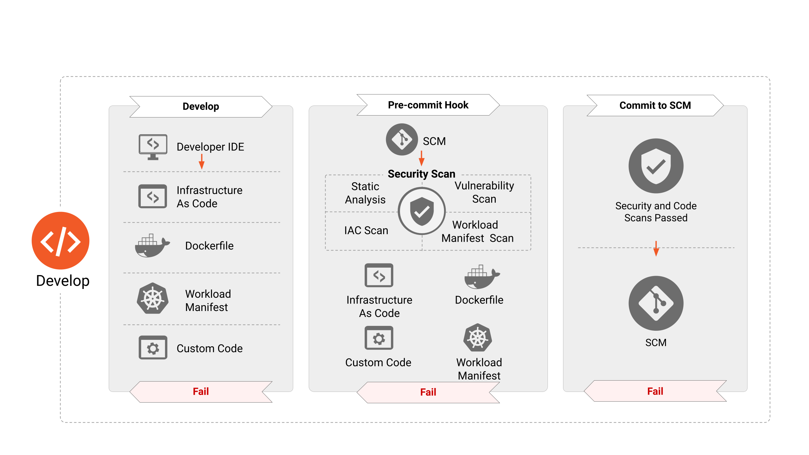
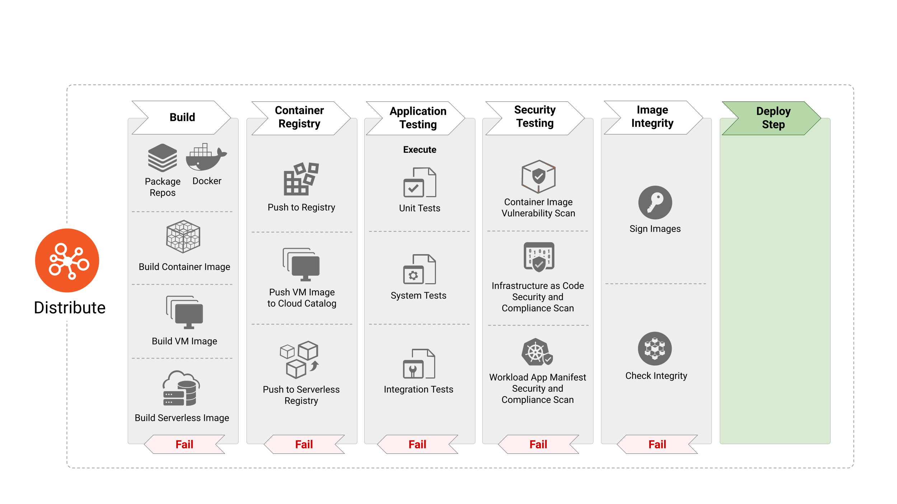
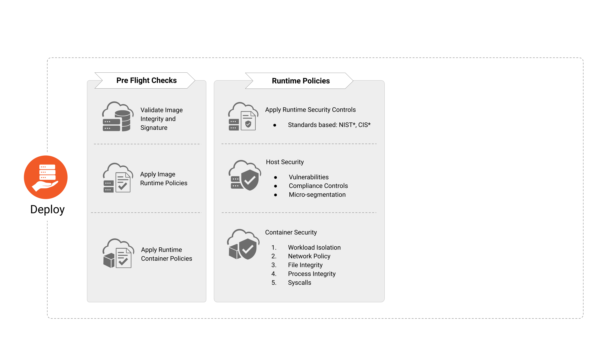

# クラウドネイティブセキュリティ白書
<!-- markdownlint-disable MD001 MD009 MD010 MD012 MD013 MD022 MD024 MD026 MD030 MD033 MD034 MD036 MD037 MD041 MD045 -->
<!-- cspell:disable -->
**バージョン**: 2.0 **作成**: 2022/01/12 **ステータス**: 作業中 | レビュー中 | **承認**

**最終レビュー**: 2022/05/16, **PDF発行**: 2022/05/17 **リリースバージョン**: 2.0

**最終PDF承認者** [X] @TheFoxAtWork [X] @justincormack

**バージョン2 (2022/5)**

* **貢献者**: Brandon Krieger, Cole Kennedy (TestifySec), Fatih Değirmenci (Ericsson Software Technology), Frederick Kautz , Joel Bork, Marina Moore (NYU), mateuszpruchniak@gmail.com, Pushkar Joglekar (VMware), raja.faisal@gmail.com, Savitha Raghunathan (Red Hat), Sayantani Saha (Independent)

* **レビュアー**: Jon Zeolla, @nyrahul (Accuknox), Ragashree Shekar, Steven Hadfield, Kapil Bareja, Malini Bhandaru, Mikko Ylinen, Jonah Kowall (@jkowall), Kuang Dahu,Ariel Shuper, Eric Li (AlibabaCloud), Tanner Randolph (Applied Systems), Mark Dalton Gray (Microsoft), Ciara Carey, Brandon Lum (TAG Security Chair), Emily Fox (TOC Liaison) and Justin Cormack (TOC liaison).

**バージョン1 (2020/11)**

* **貢献者**: Aradhna Chetal ([TIAA](http://tiaa.org/)), Brandon Lum ([IBM](https://www.ibm.com/)) , Chase Pettet ([Mirantis](https://www.mirantis.com/) (Chase.Pettet@mirantis.com)), Emily Fox ([US National Security Agency (NSA)](https://www.nsa.gov/)), Gadi Naor (Alcide), Harmeet Singh ([IBM](https://www.ibm.com/)), Jeff Lombardo (Independent), Jeyappragash JJ ([Tetrate IO](https://www.tetrate.io/)), Pushkar Joglekar ([Visa](https://visa.com/)), Rowan Baker & Andrew Martin ([ControlPlane](https://control-plane.io/)), Trishank Karthik Kuppusamy ([Datadog](https://www.datadoghq.com/)), Vinay Venkataraghavan ([Prisma Cloud (Palo Alto Networks)](https://www.paloaltonetworks.com/prisma/cloud)), Wayne Haber ([GitLab](https://about.gitlab.com/)), Mark Bower, Alex Chircop (StorageOS)

* **レビュアー**: @justincappos, @lumjjb, @whaber, @craigbox, @anvega, @magnologan, Alok Raj - [XenonStack](https://www.xenonstack.com/) (alok@xenonstack.com), @nyrahul(Accuknox), @ranio1, @lizrice,
  @justincormack

<!-- cspell:enable -->

## エグゼクティブサマリ

### 目的

テクノロジー業界は、クラウドネイティブなスタイルの開発やデプロイメントにシフトしています。同時に、技術、製品、標準、ソリューションのエコシステムも拡大し、意思決定者は複雑な設計に遅れを取らないようにすることが求められています。特にCISOは、このダイナミックな領域におけるビジネスの提供価値を明らかにするという、進化した責任を担っています。一方、クラウドネイティブパターンは、統合されたセキュリティプラクティスを促進する最新のワークフローを導入し使いこなす、という形への変化を促進しました。

#### 問題分析

このような状況下でのセキュリティ上の懸念は、迅速な開発とデプロイメントにはっきりと焦点を当てているため、複雑なものとなっています。さらに、従来の境界ベースのセキュリティモデルで行われていたような、ネットワークIPアドレスのような静的識別子への依存は非実用的です。この複雑さにより、アプリケーションを保護する際のパラダイムシフトが必要となります。つまり純粋な境界ベースのアプローチから、セキュリティが属性やメタデータ(ラベルやタグなど)に基づいて識別される動的なワークロードに緊密なアプローチへの移行です。このアプローチでは、クラウドネイティブアプリケーションの規模に合わせてワークロードを特定し、セキュリティを確保しながら常に変化するアプリケーションに対応します。このようなパラダイムシフトは、アプリケーションライフサイクルにおけるセキュリティコントロールの自動化を進め、セキュア・バイ・デザインアーキテクチャ(例：ゼロトラスト)を採用することを必要としています。セキュアな実装のためのトレードオフは、組織内の複数のステークホルダーが関与し続け、開発者の生産性やビジネスの目標を追求するオペレーターに大きく影響します。クラウドネイティブアプリケーションは、依然として開発、配布、デプロイメント、およびランタイムの操作が必要ですが、このパラダイムは、これらの目的を効率的に達成するための新しいセキュリティメカニズムを指示しています。クラウドネイティブの開発は、アプリケーションのライフサイクルを構成する明確なフェーズでモデル化することができます。「開発」「配布」「デプロイ」「ランタイム」です。クラウドネイティブセキュリティは、従来のセキュリティアプローチとは異なり、個別に管理されたセキュリティ情報に基づく介入でライフサイクルを終わらせるのではなく、これらの明確なフェーズを通してセキュリティを導入することを確実にする絶好の機会があるという点で対照的です。これらの概念、ツール、およびプロセスを継続的に学習することは、長期的な採用と適用に不可欠です。

### ライフサイクルフェーズ

#### 開発

クラウドネイティブツールは、アプリケーションライフサイクルの早い段階でセキュリティを導入することを目的としています。セキュリティテストは、コンプライアンス違反や設定ミスを早期に特定し、継続的な改善のための短期間で実行可能なフィードバックサイクルを構築する必要があります。このアプローチは、セキュリティ障害をパイプライン上で発生する他の問題(バグ修正や継続的インテグレーションの失敗など)と同じく馴染みのあるワークフローに従い、パイプラインを進める前に解決が必要です。このモデルの最新のセキュリティライフサイクルは、推奨されるデザインパターン(例、[12-factor](https://12factor.net/))を遵守し、開発環境の完全性を保証するコード開発を中心に回ります。

#### 配布

ソフトウェアのサプライチェーンの安全性は、高速なソフトウェアの反復を可能にするモデルにおいて特に重要です。クラウドネイティブアプリケーションのライフサイクルには、ワークロード自体の完全性だけでなく、ワークロードの作成プロセスや運用手段も検証する方法が必要です。この課題は、アップストリームに依存するレイヤーも含めて、オープンソースソフトウェアやサードパーティのランタイムイメージを、必要かつ実用的で一貫して使用することによってさらに拡大されます。ライフサイクルパイプラインに存在する成果物(コンテナイメージなど)は、脆弱性やマルウェア、安全でないコーディング手法、その他の不正行為から安全を確保するために、継続的な自動スキャンと更新が必要です。これらのチェックが完了したら、完全性を確保し否認防止を実施するために成果物に暗号署名を行うことが重要です。イメージバイナリが不変であること、イメージのURLが不変であることも、安全な配布のために注目すべき点です。

#### デプロイ

開発と配布の段階を通じて統合されたセキュリティは、ワークロードの属性をリアルタイムかつ継続的に検証することができます。例えば、署名された成果物の検証、コンテナイメージとランタイムのセキュリティポリシーの確保、ホストの適合性と信頼性は、ステージング環境と本番環境のバイナリ認証ポリシーによって検証することができます。デプロイ時のチェックは、意図したビジネスニーズに応えるワークロードを実行する前に、検証や修正を実施する最後の機会を提供します。ワークロードと一緒に展開されるセキュアなワークロード監視機能により、ログや利用可能なメトリクスを高い信頼性で監視することができ、統合セキュリティを補完することができます。

#### ランタイム

クラウドネイティブランタイム環境それ自体が、異なるセキュリティ上の懸念を持つ相互に関連するコンポーネントのレイヤーに分解することができます[^1]。例えば、ハードウェア、ホスト、オペレーティングシステム、ネットワーク、ストレージ、コンテナイメージランタイム、オーケストレーションなどです。コンテナランタイムは、さまざまなレベルの分離境界があるため、いろいろな実装で構成されています。例えば、共有カーネル、マイクロVMのサンドボックス、信頼された実行環境のサンドボックスなどです。期待されるセキュリティ要件を満たすランタイムを選択することが重要です。例えば、マルチテナント環境で実行される信頼できないワークロードは、VMベースのサンドボックスが考えられます。プライバシーに配慮した金融データの処理には、機密コンテナのような信頼できる実行環境(プロセスまたはVMごとにメモリが暗号化されたハードウェア)を検討する価値があるかもしれません。典型的なクラウドネイティブのランタイム環境では、アプリケーションは多くの場合、複数の独立した単一目的のマイクロサービスで構成され、コンテナオーケストレーションレイヤーが抽象化したサービスレイヤーを介して互いに通信します。この相互に関連するコンポーネントアーキテクチャをセキュアにするためのベストプラクティスには、許可されたプロセスのみがコンテナの名前空間内で動作することを保証し、不正なリソースアクセスを警告し、ネットワークトラフィックを監視して敵対的な侵入者の活動を検出することが含まれます。サービスメッシュは、ソフトウェアのワークロードを変更することなく、オーケストレーションされたサービスに、統合された補完機能を提供するもう一つの抽象化です。(例えばAPIトラフィックのロギング、トランスポートの暗号化、観測可能性のタグ付け、認証、認可)。

### 推奨事項

クラウドネイティブセキュリティは、一過性、分散、不変性といったモダンなコンセプトを統合しながら、従来のセキュリティモデルと同等以上の精緻さ、完全性、信頼性、脅威の防止を確保することを目指します。このような変化の激しい環境では、迅速な反復が行われるため、開発パイプラインに沿った自動化が安全な成果を得るために必要です。組織は、クラウドネイティブの旅において、価値主導のセキュリティ成果を生み出すために、このようなクラウドネイティブの概念をいち早く採用するべきです。開発ライフサイクル全体を通してできるだけ早い段階で、あるいは開発者向けの対話形式のトレーニングによってさらに早く、セキュリティを統合することで、セキュリティ組織は事後的なセキュリティではなく、予防的なセキュリティを実現することができます。(こちらもご参照ください [9 Box of Controls](https://blogs.blackberry.com/en/2016/03/the-9-box-of-controls))。組織は、防御スタックがカバーする脅威を明確にするために、関連する攻撃フレームワーク[^2]に対してセキュリティスタックを評価することが強く推奨されます。さらに、組織は、上流工程でセキュリティ対策を講じるように変え[^3]、DevOpsを可能にし、将来のテクノロジーの進歩に対応できる柔軟性を備えたアプローチと方法論を採用する必要があります。

### 結論

クラウドネイティブセキュリティは、組織全体で戦略的に実行することで、高可用性、保証、弾力性、冗長性を大規模に提供し、顧客と開発者が期待する速度で必要なリソースに安全にアクセスできるようにすることができます。セキュリティは、開発ライフサイクルから切り離すことも、純粋な技術領域として扱うこともできない学際的な分野であることに変わりはありません。開発者、オペレーター、セキュリティ担当者のすべてが、この分野と業界を前進させ続けるために、交流し、協力し合う必要があります。どの技術革新でも情熱を持ってこの旅に出る人たちが、コミュニティとクラウドネイティブセキュリティを実現する人たちです。

## イントロダクション

この白書では、クラウドネイティブセキュリティの明確な理解やライフサイクルプロセスへの組み込み、および最適に適用するための考慮事項を、組織とその技術リーダーに提供することを目的としています。クラウドネイティブセキュリティは、多くの専門分野と実務にまたがる多目的で多制約の問題空間です。ID管理からストレージソリューションまで、ほぼすべてのDay1およびDay2の業務はセキュリティ領域と重なります。しかし、クラウドネイティブセキュリティは、これらの領域以上に、個人やチーム、組織を含む人間の問題空間でもあります。それはメカニズムやプロセス、人間とシステムがクラウドネイティブアプリケーションやテクノロジーと相互作用し変更を加えるための意図です。

### 対象者

対象者は、安全なクラウドネイティブテクノロジーのエコシステムを提供したいと考える民間企業、政府機関、非営利団体の最高(情報)セキュリティ責任者(CISO)または最高技術責任者(CTO)です。さらに、プロジェクトマネージャー、プロダクトマネージャー、プログラムマネージャー、アーキテクトなど、安全なクラウドネイティブ製品やサービスの設計と実装を担当する組織関係者も含まれます。このほかにも、クラウドネイティブセキュリティに関心のある方であれば、どなたでもこのドキュメントを参照することで利益を得ることができます。

### クラウドネイティブのゴール

クラウドネイティブアーキテクチャは、異なるクラウドインスタンスにまたがって動作するアプリケーションスタックをクラウドに依存しないものにするための、効果的で持続可能な、シームレスな抽象化を組織に提供するパターンやデザインのセットです。コンテナやマイクロサービスアーキテクチャの導入と革新は、それなりの課題をもたらします。セキュリティリーダーは、厳格なコンプライアンス要件を満たしながら、サイバーの脅威を予防、検出、対応するための手法を採用することで、人間[^4]と非人間の両方の資産を保護する任務を負っています。セキュリティの実装がDevOpsチームのスピードと俊敏性を阻害するというのが一般的な歴史の物語です。それゆえに、セキュリティリーダーはより強固な統合と双方向の理解を実施し、DevOpsチームに権限を与えてサイバーリスクのオーナーシップを共有できるようにする必要があります。

組織は、最新のアプリケーション開発ライフサイクルを通じて、安全なクラウドネイティブパターンとアーキテクチャを採用するように促さなければなりません。最も重要なことは、クラウドインフラストラクチャ全体で、ゼロトラスト、安全なソフトウェアサプライチェーン、DevSecOpsといった組織のセキュリティ目標とのセキュリティアーキテクチャの相乗効果を強調することです。

この白書で紹介するコンセプトは、あるサービスやコンポーネント、製品を優遇するためのものではなく、サービスの選択に関係なく適用できるものです。

この白書では、セキュリティの概念やクラウドコンピューティングの概念に関する一般的な教育を提供することを意図していません。また、特定の技術やツールを推奨するものではありませんが、取り上げたトピックに対応する技術やツールの例を引用することがあります。

この白書に記載されている推奨事項以外にも、GDPRやPCI DSSなどのデータ保護やプライバシー規制の義務に関連するデータセキュリティの取り扱いについて、規制ごとに追加の検討が必要な場合があります。このような技術管理およびコンプライアンスリスクに関するガイダンスについては、適切なリソースを参照することをお勧めします。

### 前提

使用しているすべての用語、概念、およびメカニズムは、[クラウドネイティブセキュリティ辞書](https://github.com/cncf/tag-security/blob/main/security-lexicon/cloud-native-security-lexicon.md)や[クラウドネイティブ用語](https://glossary.cncf.io/)に従って定義されています。この白書では、これらの定義を変更したり拡張したりすることはしません。

クラウドネイティブの導入と最新のソフトウェア開発手法の進化に伴い、効果的なクラウドネイティブスタックを構成するテクノロジーは、時間の経過とともに変化し続けます。このように移り変わるスタックの表現は、包括的な[CNCFランドスケープ](https://landscape.cncf.io/)に含まれています。

## クラウドネイティブレイヤー

_図1_

クラウドネイティブスタックは、基礎レイヤー、アプリケーションライフサイクル、実行環境から構成されています。クラウドネイティブスタックは、さまざまなデプロイメントモデル(IaaS、PaaS、CaaS、FaaS)を使用して導入することができます。各デプロイメントモデルは、クラウドネイティブ環境の管理と運用を容易にする抽象化を提供します。これらのモデルのいくつかはよく知られており、何年も使用されていると考えられるため、ここではクラウドネイティブモデルにのみ焦点を当てることにします。

コンテナ・アズ・ア・サービス(CaaS)モデルは、コンテナベースの仮想化プラットフォームを活用し、アプリケーションプログラミングインターフェース(API)やウェブポータル管理インターフェースと組み合わせて、コンテナやアプリケーション、クラスターのオーケストレーション、その他の管理を行うことができるモデルです。CaaSは、セキュリティポリシーをコードとして組み込んだスケーラブルなコンテナ型アプリケーションを構築し、プライベートクラウド、オンプレミスデータセンター、パブリッククラウド上で実行することができます。プラットフォームにとらわれない構築、マイクロサービスのオーケストレーション、デプロイメントにより、企業はソフトウェアの構築とリリースを迅速に行うことができ、ハイブリッド環境やマルチクラウド環境間での移植が可能になるため、インフラストラクチャだけでなく運用コストも削減できます。CaaSモデルは、企業が必要とし、使用するCaaSリソースに対してのみ支払いを行うため、コスト削減が可能です。IaaS環境では仮想マシン(VM)やベアメタルホストが重要な役割を果たすのに対し、CaaSではコンテナを基本的なリソースとしています。

ファンクション・アズ・ア・サービス(FaaS)もクラウドネイティブのデプロイメントモデルで、マイクロサービスの構築や起動に伴う複雑なインフラストラクチャを一般的に必要とせず、ユーザーがイベントに応じてコードを実行できるクラウドサービスの一種です。クラウドでソフトウェアアプリケーションをホストする場合、通常は仮想環境のプロビジョニングと管理、オペレーティングシステムとWebコンポーネントの管理などが必要です。FaaSでは、物理的なハードウェア、仮想マシンのオペレーティングシステム、Webサーバーソフトウェアの管理は、すべてクラウドサービスプロバイダーが自動的に処理します。そうすることで、クラウドが提供するリソースの弾力性を活用しながら、使用したリソースに対してのみ支払いを行い、マイクロサービスコード内の個々の機能に集中することができます。

### ライフサイクル

クラウドネイティブのコンテキストにおける _ライフサイクル_ には、弾力性があり、管理可能で、観測可能なワークロードをクラウド環境でネイティブに実行できるようにする技術、実践、およびプロセスが含まれています。図1が示すように、ライフサイクルは、開発、配布、デプロイ、ランタイムという4つの連続したフェーズで構成されています。各フェーズは、安全なワークロードの実行をサポートしながら、前のフェーズを拡張します。

次の数セクションでは、アプリケーションのライフサイクル全体を通してセキュリティを統合するための詳細な分析、ツール、メカニズム、ベストプラクティスを提供します。

### 開発

_図2_

クラウドネイティブアプリケーションのセキュリティは、アプリケーションのライフサイクル全体を通して適用する必要があります。開発フェーズはこのサイクルの最初であり、クラウドネイティブアプリケーションのデプロイと構成に使用されるインフラストラクチャ・アズ・コードやアプリケーション、コンテナマニフェストなどの成果物を作成します。それ故に、これらの成果物はランタイムで悪用可能な数多くの攻撃ベクトルの出所となると言われています。次のいくつかのセクションでは、ランタイムにデプロイされるアプリケーションの攻撃対象領域を劇的に減らすために、このフェーズで制定する必要があるさまざまなセキュリティツール、プロセス、およびチェックについて詳しく説明します。

#### 開発におけるセキュリティチェック

開発段階でのセキュリティハードニングは、アプリケーションのデプロイメントにおいて重要な要素です。つまり、セキュリティ要件はソフトウェア開発の初期に導入し、他の設計要件と同じように扱わなければなりません。これらの要件は、通常、リスクとコンプライアンスに関するビジネスニーズに基づいています。また、脅威モデリングの結果の場合もあります。初期段階でこれらのニーズに対処することで、ライフサイクルの後半で作業のやり直しを防ぎます。そうしなければ、DevOpsパイプラインを遅らせ、全体的なコストを増加させることになります[^5]。DevOpsチームは、アプリケーションのデプロイ前にセキュリティの設定ミスや脆弱性を特定するために、専用のツールを活用することも必要です。同様に重要なのは、これらのツールが、DevOpsチームが活用する既存の使い慣れたツールとシームレスに統合され、セキュリティと共に俊敏性を補完し、遅らせないようにすることです。例えば、ツールは、インフラストラクチャ・アズ・コードのテンプレートや、開発者のIDE内またはプルリクエスト時にアプリケーションマニフェストのスキャンを実行する必要があります。また、コードやアプリケーションコンポーネントの所有者が開発パイプラインの初期段階で迅速かつ容易に対応できる、豊富で文脈のあるセキュリティ情報を提供する必要があります。これらの手順を採用することで、既知の脆弱性やリスクの高い構成が存在しないことを保証します。クラウドネイティブコンポーネントはAPI駆動型にすることで、複雑なデバッグツールがオーケストレーターに依存するデプロイされた初期のワークロードと対話することができます（例えば、Kubernetesのコントロールプレーンと対話するツール、またはenvoyのようなネットワークサイドカープロキシ）。

チームは、専用の開発環境、テスト環境、本番環境を導入し、インフラストラクチャとアプリケーションの開発者に、システムやアプリケーション、コンテナベースイメージ、VMゴールデンイメージの開発、テスト、デプロイ、非機能テストの立ち上げのための分離した環境を提供しなければなりません。

##### テストの開発

開発者、運用者、セキュリティ担当者は、業務上不可欠で脅威プロファイルが高く、頻繁に変更される、あるいは過去にバグの原因となったコードやインフラストラクチャのテストを構築すべきです。脅威モデリングにより、高リスクかつ高影響を与えるコードのホットスポットを特定することができ、テスト開発の投資対効果(ROI)が高くなります。テストには、デプロイメント、オペレーティングシステム、インフラストラクチャ、データベースのハードニング、アプリケーションテスト(静的および動的ソースコードテスト、ファジング、コンテナ構成)、統合またはシステムテスト(アプリケーションおよびインフラストラクチャコンポーネントの受け入れとそれらの相互作用)、スモークテスト(ライブシステムに対するデプロイ後のチェック)などがあります。テスト作成者は、継続的インテグレーション(CI)のフィードバックループを減らしながら、迅速なテスト開発を行うことができる包括的な開発環境とテスト環境へのアクセスを持つべきです。システムテストスイートは、共有テスト環境内だけでなく、テスト作成者がローカルで実行できるようするべきです。

##### コードレビュー

小さな変更を加えたワークロード、もしくはワークロードがデプロイされたインフラストラクチャは、セキュリティに多大な影響を及ぼす可能性があります。意図しない結果を招くリスクを軽減するために、チームは、コードベースに変更をマージする前にコードレビューを行う場合、[４つの目](https://www.unido.org/overview/member-states/change-management/faq/what-four-eyes-principle)の原則を使用することが推奨されます(例：gitワークフローでpull requestを実装)。

### 配布

_図3_

配布フェーズでは、イメージの定義や仕様を使い、コンテナイメージやVMイメージなどの次の段階の成果物を構築する責任があります。最新のCI/CDパイプラインでは、配布フェーズはソフトウェアのバグや不具合を特定するための体系的なアプリケーションテストから構成されています。しかし、オープンソースや再利用可能なパッケージを採用することで、コンテナイメージに脆弱性やマルウェアが組み込まれることがあります。そのため、このような脅威ベクトルに対してイメージをスキャンしたり、イメージの完全性を検証したりするなど、セキュリティに特化したステップを組み込むことが必要不可欠です。さらに、組織は機密保持が必要な場合は、ソフトウェアの成果物を暗号化することもできます。

ソフトウェアの成果物が侵害やその他の事故により信頼できなくなった場合、チームはその成果物を拒否するために署名鍵を失効させる必要があります。

#### ビルドパイプライン

継続的インテグレーション(CI)サーバーは、同様のセキュリティ区分または機密性のプロジェクトに隔離され、制限されるべきです。昇格特権を必要とするインフラストラクチャの構築は、別の専用CIサーバーで実行されるべきです。構築のポリシーは、CIパイプラインおよびオーケストレーターのアドミッションコントローラーで実施する必要があります。

サプライチェーンツールは、ビルドパイプラインのメタデータを収集し署名することができます。後のステージでは、署名を検証して前提条件のパイプラインステージが実行されたことを確認することができます。

読者は、CIおよび継続的デリバリー(CD)インフラストラクチャが可能な限り安全であることを確認する必要があります。例えば、セキュリティアップデートは優先的にインストールし、暗号鍵はHSMやクレデンシャルマネージャーを使い、流出から保護する必要があります。

#### イメージスキャニング

コンテナイメージのスキャンは、ライフサイクルを通じてコンテナアプリケーションを保護する最も一般的な方法の1つです。本番環境にイメージをデプロイする前に、CIパイプラインでスキャンを行うことが重要です。さらに、実行中のコンテナイメージを継続的にスキャンすることも、新たに見つかった脆弱性を特定するため同様に重要です。この機能を組み込むことで、開発者、オペレーター、セキュリティ専門家は、すべての既知の脆弱性と、深刻度、[共通脆弱性評価システム(CVSS)](https://nvd.nist.gov/vuln-metrics/cvss)スコア、緩和策/修正策の有無などの詳細な情報を確実に入手できます。コンテナイメージの脆弱性スキャンとパイプラインのコンプライアンスルールを組み合わせることで、十分にパッチが適用されたアプリケーションのみが本番環境に導入され、潜在的な攻撃対象が減少します。コンテナイメージのスキャンは、オープンソースソフトウェアパッケージや、オープンソースイメージリポジトリから取り込んだベースイメージレイヤーにマルウェアが存在することを特定するのにも役立ちます。コンテナイメージのスキャンは、脆弱性やマルウェアの証拠をチームに提供することはできますが、脆弱性を修復したりマルウェアを防止したりするものではありません。組織は、コンテナスキャンの発見を確実に実行し、組織のコンプライアンスルールを実施する必要があります。

#### イメージのハードニング

コンテナイメージには、軽減すべき脅威を考慮したセキュリティハードニングを含めると同時に、より広範なエコシステムとの統合を促進するために、ランタイム段階でのジャストインタイムの設定を許可する必要があります。

セキュリティ保証の目標については、以下の質問を評価する必要があります：

* 実行環境を特定のユーザーに制限していますか？

* リソースへのアクセスを制限していますか？

* カーネルレベルでのプロセス実行の制限をしていますか？

#### コンテナアプリケーションマニフェストの走査

アプリケーションマニフェストには、コンテナ化されたアプリケーションのデプロイに必要な設定が記述されています。CI/CDパイプラインでアプリケーションマニフェストを走査して、潜在的に安全でないデプロイメントの配置をもたらす可能性のある構成を特定することが重要です。

#### コンテナアプリケーションマニフェストのハードニング

コンテナイメージについては、コンテナアプリケーションマニフェストのハードニングは、実行時だけでなく構築時にも実施することが考えられます。

セキュリティ保証の目標に関して、答えるべき主な質問は次の通りです： _ランタイム実行エコシステムが遵守すべき最小限の制約とは何か?_

#### テスト

クラウドネイティブアプリケーションは、従来のアプリケーションと同じスイートと品質検査の基準に従わなければなりません。これには、クリーンコードの概念、[テストピラミッド](https://martinfowler.com/articles/practical-test-pyramid.html)の遵守、静的アプリケーションセキュリティテスト(SAST)によるアプリケーションセキュリティのスキャンとリント、依存関係の解析とスキャン、動的アプリケーションセキュリティテスト(DAST)、アプリケーションの計測、ローカルワークフローで開発者がテストを利用できる完全なインフラストラクチャがあります。自動化されたテスト結果は、セキュリティ及びコンプライアンスチームがリアルタイムでセキュリティを保証できるように、二重認証(開発者とツール)の要件に対応させるべきです。

セキュリティの設定ミス(例：不正なファイアウォールやルーティングルール)が特定された後、根本原因の分析で再発の可能性が高いと判断された場合、開発者は欠陥の回帰を防ぐために自動テストを書くべきです。テストが失敗した時点で、チームはバグを修正するためのフィードバックを受け、次のマージでテストはパスします(修正されたと仮定して)。そうすることで、将来そのコードが変更されることによる回帰を防ぐことができます。

インフラストラクチャの単体テストは予防的な管理であり、インフラストラクチャ・アズ・コード(IaC)構成で定義されたエンティティおよび入力を対象とします。構築されたインフラストラクチャのセキュリティテストは、検出型の管理であり、保証、過去の回帰、および予期せぬ構成の検出(世界に公開されたファイアウォールのルール、緩い特権のアイデンティティ＆アクセス管理(IAM)ポリシー、未認証のエンドポイントなど)を組み合わせています。

インフラストラクチャのハードニングとワークロードは、包括的なテストスイートによってサポートされるべきであり、これによってシステムの成熟に伴ってハードニングを段階的に進めることができます。ハードニングが行われたことを確認するためのテストは、構築時に実行されるべきですが、ライフサイクルを通じて発生した可能性のある変更または回帰を評価するために、デプロイ時にも実行されるべきです。

##### 静的解析とセキュリティテスト

IaCやアプリケーションマニフェスト、ソフトウェアコードの静的解析は、リントや設定ミスの特定、特定のコンポーネントの脆弱性を提供し、解析にコンテキストの周囲のコンポーネントを含めることはありません。個々の解析は重要ですが、唯一の解析形態であってはならないことに留意する必要があります。IaCコードは、アプリケーションのワークロードと同様のパイプラインポリシー制御の対象となるべきです。

IaCは、組織がクラウドやコンテナインフラを展開するための方法として、ますます普及しています。IaCテンプレートの安全でない設定は、当然ながら、デプロイされたインフラストラクチャのセキュリティギャップにつながります。そのため、これらのテンプレートは、アプリケーションやインフラの成果物をデプロイする前に、セキュリティ違反の特徴がないかスキャンする必要があります。注意すべき主な設定ミスは以下の通りです：

* アプリケーションマニフェストで指定されたイメージに含まれている脆弱性

* 特権をエスカレートさせることができるコンテナや、過度に緩いファイアウォールのルールなど、最小特権の原則を尊重しないような設定

* システムを危険にさらす可能性のあるセキュリティコンテキストとシステムコールの識別

* リソース制限の設定

##### 動的解析

デプロイされたインフラストラクチャの動的解析には、ロールベースアクセスコントロール(RBAC)およびIAMの構成ドリフトの検出、想定されるネットワーク攻撃範囲の検証、SOCが専用のテスト環境で異常な動作を検出して本番用の警告を構成できるようにすることなどが含まれます。動的解析はテストの一部であると考えられますが、本番環境ではない実行環境で行われることが想定されます。

##### セキュリティテスト

アプリケーションとインフラストラクチャの自動化されたセキュリティテストは、セキュリティチームにとって不可欠な中心となります。テストスイートは、組織の脅威モデルに沿った脅威を再現するために継続的に更新されるべきであり、システムの進化に伴ってセキュリティ回帰テストに再利用できるようにします。自動化されたセキュリティテストは、検証や単一のチェックポイントで手動制御するような、時間がかかり不十分な手動のセキュリティゲートを取り除くことができ、セキュリティとリリース速度を向上させます。また、自動化されたセキュリティテストは、サイバー攻撃を実行してみることで、オンデマンドで制御の有効性を実証します。これにより、システムのセキュリティが向上し、組み込まれたコンプライアンス要件がリアルタイムで遵守されるようになります。

#### 成果物とイメージ
##### レジストリのステージング　

オープンソースのコンポーネントは公開されているソースから取得することが多いため、組織はパイプラインのいくつかの段階でレジストリを作成する必要があります。権限を与えられた開発者だけが、パブリックレジストリからベースイメージを取得し、組織内で広く利用できるように内部レジストリに保存できるようにします。また、チームやグループごとに開発成果物を保管するプライベートレジストリを別に用意し、最後に本番用のイメージを保管するステージングレジストリまたはプリプロダクションレジストリを用意することをお勧めします。これにより、オープンソースコンポーネントの出所とセキュリティをより厳密に管理することができ、CI/CDの各段階で異なるタイプのテストを行うことができます。

どのようなレジストリであれ、専用の認証と許可モデルによるアクセス制御を実装しなければなりません。すべてのレジストリ接続に、相互認証されたTLSを使用します(アーキテクチャ内の他の相互作用も含む)。

##### 署名、信頼、完全性

ビルド時に行うイメージコンテンツへのデジタル署名と、使用前に署名されたデータを検証することは、ビルド時とランタイム時の間の改ざんからイメージデータを保護し、成果物の完全性と来歴を保証します。確認は、成果物が検査され承認されたことを示すプロセスから始まります。信頼の確認には、成果物に有効な署名があることを確認することも含まれます。最も単純なケースでは、各成果物に1人の署名者が署名することで、その成果物が通過した1つのテストと検証プロセスを示すことができます。しかし、ソフトウェアのサプライチェーンはほとんどの場合より複雑であり、1つの成果物を作成するにも複数の検証ステップに依存するため、エンティティ複合体の信頼に依存します。その例として、以下のようなものがあります：

* コンテナイメージの署名 - コンテナイメージのマニフェストに署名するプロセス

* 設定ファイルの署名 - コンフィグファイルの署名、すなわちアプリケーションのコンフィグファイルの署名

* パッケージの署名 - アプリケーションパッケージのような成果物のパッケージへの署名

ライブラリやOCI成果物のような一般的なソフトウェア成果物の場合、これらの成果物に署名することで、組織による利用が承認されているという証明になります。これらの成果物の検証は、認可された成果物のみが許可されることを保証する上で同様に重要です。リポジトリでは、レジストリのイメージに変更を加えたり、コードをリポジトリにコミットしたりする際に、相互認証を必要とすることが強く推奨されます。

##### 暗号化

コンテナイメージの暗号化は、コンテナイメージを暗号化しその内容を機密にします。コンテナイメージのコンテンツは、ビルド時からランタイムまで昇格しても機密性を保つように暗号化されます。配布物が漏洩した場合でも、イメージのレジストリ内容は秘匿されるため、企業秘密や機密資料の保護などのユースケースに役立ちます。

コンテナイメージの暗号化のもう一つの用途は、コンテナイメージの認可を強制することです。イメージの暗号化が、鍵管理とランタイム環境の認証、および/または認証とクレデンシャルの配布と連動している場合、コンテナイメージが特定のプラットフォーム上でのみ実行できることを要求することができます。コンテナイメージの認可は、ジオフェンシングや輸出管理、デジタル著作権メディア管理などのコンプライアンスユースケースに有効です。

### デプロイ

_図4_

デプロイフェーズでは、ランタイム環境にデプロイされるアプリケーションが、組織全体のセキュリティおよびコンプライアンスポリシーに適合し、準拠していることを確認するための一連のプリフライトチェックを組み込む責任があります。

#### デプロイメントのプリフライトチェック

コンテナイメージをデプロイする前に、組織はコンテナイメージの存在、妥当性、および現在の状態を確認する必要があります：

* イメージの署名と完全性

* イメージランタイムのポリシー(例：マルウェアや重要な脆弱性がないこと)

* コンテナランタイムのポリシー(例：過度な特権がないこと)

* ホストの脆弱性とコンプライアンスの管理

* ワークロード、アプリケーション、ネットワークセキュリティのポリシー

#### 観測可能性とメトリクス

クラウドネイティブアーキテクチャに観測可能性とメトリクスを導入することで、セキュリティに関する洞察が得られ、ステークホルダーはレポートに現れる異常を解決し緩和することができます。この分野のツールは、情報収集と可視化に役立ちます。行動分析およびヒューリスティック分析により、異常値や疑わしいイベントおよび説明のつかない呼び出しを検出し、ステークホルダーにエスカレーションすることができます。行動分析およびヒューリスティック分析の開発を支援するために、人工知能に該当する高度な機械学習および統計モデリング技術の使用が推奨されます。

#### インシデントレスポンスと軽減

アプリケーションは、認証、認可、アクション、および失敗に関するログを提供する必要があります。開発者は、計画および設計段階の一部としてこの機能を含めるべきです。これらの要素は、調査が行われ根本的な原因を確立する必要がある場合に、追跡できる証拠の痕跡を提供します。

フォレンジック機能は、あらゆるインシデントレスポンスと軽減活動において必要不可欠な要素です。フォレンジック機能は、インシデントの根本原因を特定するための証拠を提供し、軽減するためのフィードバックを提供します。コンテナ環境は短命であるため、あらゆる証拠を捕捉し分析するために、より俊敏なツールセットが必要です。フォレンジック機能をインシデント対応計画と手順に組み込むことで、証拠を取得し処理する手段を提供し、根本的な原因を特定する時間を短縮し、情報漏洩にさらされることを最小限に抑えます。

### ランタイム環境

_図5_

ランタイムフェーズは、コンピュート、アクセス、ストレージという3つの重要な領域から構成されます。ランタイム環境は、開発、配布、デプロイの各フェーズの正常終了に依存しますが、ランタイムのセキュリティは、それ以前のフェーズのセキュリティ対策の有効性に依存します。次の段落では、これらの重要な構成要素について、セキュリティ要件とその意味を詳しく説明します。

#### コンピュート

クラウドネイティブコンピューティングは非常に複雑で、継続的に進化しています。コンピュートの利用を実現するためのコアコンポーネントがないと、組織はワークロードの安全性を確保することができません。

コンテナが、共有ホスト上のマルチテナントアプリケーションのために、ソフトウェアベースの仮想化を提供することを考慮すると、他のサービスを無効にした読み取り専用のOSであるコンテナ専用のOSを使うことが重要です。これは、攻撃対象の領域を減らすのに役立ちます。これはまた、開発者が、共有ホストのカーネル上で分離されたアプリケーションを実行できるようにするための、分離とリソース制限を提供します。多層防御を可能にするために、異なるデータ機密性の高いワークロードを同じOSカーネル上で実行させないことが推奨されています。

コンテナプラットフォームやサービスの全レイヤーにまたがるセキュリティを実現するために、TPM(Trusted Platform Module)や仮想TPMに基づく、ハードウェアの信頼の基点を利用することができます。ハードウェアに根ざした信頼の連鎖をOSカーネルとそのコンポーネントに拡張することで、信頼できるブート、システムイメージ、コンテナランタイム、コンテナイメージなどを暗号的に検証することができます。

セキュアエンクレーブ(Trusted Execution EnvironmentsまたはTEEとも呼ばれる)は、機密コンピューティングの中核をなすものです。セキュアエンクレーブとは、新しいCPUに組み込まれたセキュリティ関連の命令コードのセットのことです。エンクレーブはCPU内でしかその場で復号化されず、エンクレーブ内で実行されるコードとデータに対してのみ復号化されるため、使用中のデータを保護することができます。TEEベースの機密コンピューティングは、データのセキュリティ、完全性、機密性を保証します。TEEで暗号化されたデータとコードは、他のアプリケーション、BIOS、オペレーティングシステム、カーネル、管理者、クラウドベンダー、CPU以外のハードウェアコンポーネントからは利用できません。TEEベースの機密コンピューティングは、サンドボックス化されたコンテナと連携し、悪意のあるアプリケーションを隔離して機密データを保護します。

オペレーティングシステムは、リモート接続に使用される暗号ライブラリや、プロセスの開始や管理などに使用されるカーネル機能などの基本システムコンポーネントを提供します。これらは脆弱性を持つ可能性があり、コンテナの基礎となる能力のベースラインを提供するため、これらのホスト上で実行されるすべてのコンテナやアプリに影響を与える可能性があります。同時に、不適切に設定されたコンテナは、ホストカーネルのセキュリティに影響を与え、その結果、そのホスト上で動作するコンテナで動作するすべてのサービスに影響を与える可能性があります。

#### オーケストレーション

オーケストレーターには、コントロールプレーンとデータプレーンに分かれた複数のコンポーネントがあります。時には、互いに独立して共存する複数のコントロールプレーンにまたがって状態を維持する責任を負う、より高いレベルのマルチデプロイメント管理プレーンが必要になることがあります。

どのようなオーケストレーションシステムにも、デプロイ全体のセキュリティと実行時の継続的なセキュリティに影響を与える数多くの脅威があります。オーケストレータのAPIへの悪意あるアクセス、キーバリューストアへの不正なアクセスや変更、オーケストレータのダッシュボードによるクラスターの制御、コントロールプレーンのトラフィックの傍受、APIの悪用、アプリケーションのトラフィックの傍受などは、すべて潜在的な脅威の領域です。このような脅威にさらされないようにするためには、オーケストレーターのベストプラクティスとコンフィギュレーションのハードニングを使用することが重要です [^6]。また、クラスターの継続的なセキュリティ体制を確保するために、実行時に行われる初期設定の変更を監視し、検出することも必要不可欠です。コントロールプレーンへの管理者アクセスの最小化、職務の分離、最小特権の原則など、その他のセキュリティのベストプラクティスを実施する必要があります。

##### セキュリティポリシー

コンテナランタイムが、コンテナ生成に利用するセキュリティ特権を制御するために、オーケストレーターのセキュリティ機能とさまざまな構成オプションを考慮することが必要不可欠です。より高いレベルのポリシーとガバナンス構成を使用することで、セキュリティガードレールを強制することができます。

##### リソースの要求と制限

意図的に(フォークボム攻撃や暗号通貨のマイニングなど)、あるいは意図せずに(入力検証を行わずにメモリ内の大きなファイルを読み込んだり、水平自動スケーリングを行ったりするなど)、単独で誤動作したワークロードがノードやクラスターレベルのリソース枯渇を引き起こす可能性があります。cgroupsを介して異なるオブジェクトレベルのリソース要求と制限を適用することで、このようなシナリオを防ぐことができます。

##### 監査ログ分析

監査ログ分析は、システムの侵害や不正使用または設定ミスを特定し、関連付けるための最も確立された方法の1つです。クラウドネイティブアーキテクチャは、ワークロードに対して従来のレガシーシステムよりも詳細な監査構成とフィルタリングを生成できるため、監査ログ分析と相関関係の自動化を継続することは、セキュリティチームにとって最も重要です。さらに、クラウドネイティブログの相互運用性により、高度なフィルタリングが可能になり、ダウンストリーム処理の過負荷を防ぐことができます。ここで重要なのは、従来のログ分析と同様に、ログからのデータを関連付け／文脈化して、意思決定ツリー／インシデント対応を推進できる情報に変換し、実用的な監査イベントを生成することです。

コンプライアンス違反は、事前に設定された組織のポリシー違反をフィルタリングするルールセットに基づいて検出されます。クラスターを使用するエンティティの行動を監査する機能を持つにために、特定のAPIグループのセットまたはセキュリティチームやクラスター管理者が関心を持つキーワードをフィルタリングする、API監査を有効にすることが必要不可欠です。また、クラスターレベルの認証情報を介してアクセスできない場所にログをすぐに転送することで、ログを無効化したりアクティビティログを削除したりして攻撃者の痕跡を消そうとする試みを阻止することができます。アラートを処理するこれらのシステムは、アラートのフラッディングやアラートによる疲弊を避けようと正常な事象だが誤って有害と判定するフォールスポジティブや、検出されなかったセキュリティインシデントの不正や異常を見過ごすフォールネガティブを定期的に調整する必要があります。

##### コントロールプレーンの認証と証明書の信頼の基点

オーケストレーターの管理者は、既存のコントロールプレーンのハードニングに加えて、定期的にローテーションされる証明書による相互認証と証明書の検証を介して通信するように、すべてのオーケストレーターのコントロールプレーンコンポーネントを設定する必要があります。発行する認証局(CA)は、デフォルトのオーケストレータ認証局もしくは外部認証局の場合があります。外部認証局を使用する場合、認証局インフラストラクチャの維持管理に少なからぬ労力を要する可能性があるため、このオプションを選択する際には注意が必要です。CAの秘密鍵を保護するために、管理者は特に注意を払うべきです。信頼の拡張または確立の詳細については、アイデンティティとアクセス管理のセクションを参照してください。

##### 機密データの暗号化

コンテナのオーケストレーションやデプロイメント環境では、外部のシークレットマネージャを使用するか、オーケストレータのシークレットをネイティブに使用して機密データを管理することができます。ネイティブのシークレットストアを使用する場合は、いくつかの保護方法があることを知っておくことが重要です：

外部KMSによる暗号化

* KMSを活用することは、オーケストレータのシークレットストアの機密データを保護する安全な方法あり、外部のKMSがデータ暗号化キー(DEK)を暗号化し、保存されている機密データを暗号化します。この方法には、DEKをメモリにキャッシュして外部KMSの稼働率への依存を減らし、ワークロード作成時に機密データの復号化を高速化するオプションがあります。

オーケストレーターによるフルマネージド暗号化

* この方法は、オーケストレーターに保存された機密データを暗号化しますが、暗号化キーもオーケストレーターによって管理されます(つまり、オーケストレーターの設定ファイル)。

暗号化なし

* たとえば、いくつかのオーケストレータでは、機密データはbase64でエンコードされ、デフォルトではキーバリューストアに平文で格納されます。

外部のシークレットマネージャーを使うことで、暗号化されていない機密データを使うリスクを制限し、鍵管理の複雑さを緩和することができます。一般的に、ツールはコントローラやドライバまたは実行時に機密データを差し込み、それらを透過的にローテーション処理することができるオペレータとして提供されます。

##### ランタイム

コンテナランタイム環境は、プロセスやファイル、ネットワークの観点から監視し保護する必要があります。許可された機能およびシステムコール(seccompフィルタなど)のみが、ホストOSによってコンテナ内で実行または呼び出されることを許可されるべきです。場合によっては、より厳密なホスト分離を可能にするために、コンテナランタイムのサンドボックス化を検討する価値があります。重要なマウントポイントやファイルの変更を監視し、防止する必要があります。コンフィギュレーションは、バイナリや証明書、リモートアクセス設定の変更を防止しなければなりません。また、コンフィギュレーションによって、コンテナのネットワークへの入出力を、動作に必要なものだけに制限しなければなりません。さらに、悪意のあるドメインへのネットワークトラフィックを検出して拒否する必要があります。

逆に、ランタイム中にプライバシーに関わるデータをメモリ上で処理するワークロード全体またはワークロードの一部は、信頼された実行環境で実行することができます。これにより、機密性の高い計算が可能になり、ワークロードのデータを外部の脅威から保護することができます。

##### マイクロサービスと絶対的な信頼の排除

マイクロサービスとしてデプロイされたコンテナ型アプリケーションの境界は、マイクロサービスそのものです。したがって、マイクロサービスのペア間で認可された通信を制限するポリシーを定義する必要があります。マイクロサービスアーキテクチャにゼロトラストを含めることで、マイクロサービスが侵害された場合、攻撃者の横展開を防止することで影響範囲を小さくすることができます。オペレータは、コンテナデプロイメント内の東西ネットワーク通信が、アクセスを許可されたものだけに制限されるように、ネットワークポリシーなどの機能を確認する必要があります。[NIST SP 800-204](https://csrc.nist.gov/publications/detail/sp/800-204/final)を通じて、マイクロサービスのセキュリティ戦略を提供するための初期作業があり、安全なマイクロサービスアーキテクチャを実装するためのガイドとして役立つ可能性があります。

##### イメージの信頼とコンテンツ保護

コンテナイメージの署名や権限付与を実施または管理するポリシーエージェントの利用は、運用ワークロードのイメージ出自を保証することができます。さらに、暗号化コンテナを含めることで、コンテナ内に存在する機密性の高いソース、メソッド、データを保護することができます。

##### サービスメッシュ

サービスメッシュはサービス間の接続性を提供し、トラフィック制御、サービスディスカバリー、ロードバランシング、弾力性、観測可能性、セキュリティなどの機能を追加します。サービスメッシュにより、マイクロサービスはアプリケーションレベルのライブラリからこれらの機能をオフロードすることができ、開発者はビジネスロジックの差別化に集中することができます。クラウドネイティブ環境におけるサービス間のセキュアな通信を効果的に確保するために、組織はサービスメッシュを実装し、転送中のデータの暗号化によってワークロード内およびワークロード間の暗黙の信頼を排除する必要があります。サービスメッシュを利用することで、IPアドレスのような従来の静的IDがワークロードにきれいにマッピングされなくなるID問題も解決されます。サービスメッシュは、サービスレベルの分離とセキュリティだけでなく、リトライ、タイムアウト、様々なサーキットブレーカー機能の実装など、ネットワークレベルの弾力性も提供します。ストリーミングプラットフォームは、ワークロードレベルの認可を使用してトピックやブローカーのアクセスルールを設定することで、サービスメッシュによるセキュリティハードニングの恩恵を受けることができます。

サービスメッシュを実装することで、クラウドネイティブのデプロイメントの攻撃対象領域を縮小し、ゼロトラストのアプリケーションネットワークを構築するための重要なフレームワークを提供できることに注目することが重要です。

##### ランタイム検出

デプロイされたワークロードを監視することで、実際の運用状態が期待されている状態か検証できます。ワークロードを攻撃者の監視されていない遊び場にしないよう、環境内の定期的なセキュリティスキャンと監視を忘れてはいけません。コンテナのシステムコールやネットワークトラフィックの検出、追跡、集計、レポートするコンポーネントを活用して、予期しない動作や悪意のある動作を探す必要があります。

回帰テストとセキュリティテストは、既知の問題を本番環境で実行することを防ぐのに役に立ちますが、すべてを阻止することはできません。ワークロードを動的にスキャンして、まだ既知の事象が存在しない悪意のある、あるいは予期しない動作を検出する必要があります。ワークロードがX日間実行された後に、データストアからデータ流出を実行する拡張スリープコマンドのような事象は、大多数の環境では予期されないので、セキュリティテストに含まれません。ワークロードに時間がかかるまたはイベント遅延のトロイの木馬に関しては、ベースラインの予期される動作と比較することで検出が可能であり、多くの場合、徹底的なアクティビティとスキャンの監視中に発見されます。

さらに、ワークロードはデプロイ時またはデプロイ後に脆弱になります。組織は継続的に環境をスキャンし、どのワークロードが現在脆弱であるかを検出すべきです。各ワークロードの構成または[ソフトウェア部品表](https://ntia.gov/page/software-bill-materials)を理解することは、組織がどこに脆弱性があるかを迅速に特定するのに役立ちます。実際に攻撃される可能性や使用中の脆弱パスなどの脆弱性に関する追加情報は、ワークロードに対する実際のリスクを判断するために重要であり、組織がリスクのあるアプリケーションのアップデートに優先順位をつけるのに役立ちます。

##### 関数

サーバーレス関数は様々な攻撃を受けやすいため、適切に保護する必要があります。プロセスは、許可リストで明示的に定義された関数だけを実行しなければなりません。さらに、関数がクリティカルなファイルシステムのマウントポイントを変更することは許されません。関数には、ネットワーク制限や権限モデルにおける最小権限によって、許可されたサービスへのアクセスのみを許可する制限が必要です。

さらに、C&C(コマンドとコントロール)やその他の悪意のあるネットワークドメインへのアクセスを検知し可能であれば防止するために、管理者がネットワークの出口を監視しなければなりません。また、流出に使用される可能性のある悪意のあるペイロードやコマンドを検出して除去するために、ネットワークの入口検査も考慮する必要があります。例えば、SQLインジェクション攻撃は、検査によって検出することができます。

サーバーレス関数には多くの脅威があり、テナントが利用できるコントロールは限られています。認証の失敗や依存サービスとの安全でないAPIの統合は、これらの問題の一部です。すべてのサーバーレス機能が、同様のデータ分類に対して、テナントベースのリソースまたはパフォーマンス分離で実行されことは、その解決に役立つかもしれませんが、これらは分離環境で利用可能なアドレス空間の制限により、パフォーマンスに影響を与える可能性があります。

##### ブートストラップ

ワークロードとコンフィギュレーションが正しいノードで実行されるように、信頼性はコンピュートノードでブートストラップされる必要があります。ブートストラップは、コンピュートが物理的にも論理的にも正しい場所にあり、自身を認証する機能を備えていることを保証します。これらのステップは通常、クラウドプロバイダーのプロビジョニングの一部です。しかし、第三者への依存を限定して、信頼を検証する方法が利用可能です。

#### ストレージ

クラウドネイティブストレージは、提示型ストレージとアクセス型ストレージに分類される幅広いテクノロジーをカバーしています。提示型ストレージは、ボリュームなどのワークロードが利用できるストレージで、ブロックストア、ファイルシステム、共有ファイルシステムが含まれます。アクセス型ストレージは、アプリケーションAPIを介してアクセスされるストレージで、オブジェクトストア、キーバリューストア、データベースが含まれます。

ストレージシステムは、アプリケーションやワークロードがストレージシステムやサービスによって永続化されたデータをどのように保存したり消費したりするかを定義するデータアクセスインターフェースを含まれています。このインターフェイスは、アクセス制御、認証、認可、場合によっては転送中の暗号化によって保護することができます。

ストレージシステムには、コントロールプレーンや管理インターフェースを含まれており、きめ細やかなアクセスが可能かもしれないが、これは通常、認証とTLSで保護されたAPIです。一般的に、コントロールインターフェースは、オーケストレーターやサービスブローカーによるサービスアカウントを介してのみアクセスされます。

##### ストレージスタック

どのようなストレージソリューションも、データの保存、取得、保護、およびアプリケーション、オーケストレーター、オペレーティングシステムとのやり取りの方法を定義する複数の機能レイヤーで構成されています。これらの各レイヤーは、ストレージシステムのセキュリティに影響を与える可能性があります。よくある例は、ファイルやブロックをオブジェクトストアに永続化するファイルシステムが挙げられます。データがアクセスされる最上位レイヤーだけでなく、トポロジー内のすべてのレイヤーを保護することも同様に重要です。

###### オーケストレーション

ほとんどのオーケストレーションシステムは、ファイルシステム(バインドマウントなど)、ボリュームマネージャ、オーケストレータポリシーに基づくユーザまたはグループレベルでのパーミッションの適用など、さまざまな抽象化レイヤと仮想化レイヤを実装しています。コンテナ化の多くのコンポーネントやマイクロサービスアーキテクチャと同様に、ボリュームとストレージの保護は、常に他のクラスター内機能による保護に依存します。もしユーザーがオーケストレーターやコンテナーランタイム内で権限をルートに昇格させることができれば、下層のストレージシステムを含む環境内で大混乱を引き起こす可能性があります。ゼロトラストや最小特権、アクセス制御と強制は、クラウドネイティブアーキテクチャでストレージのセキュリティを成功させるための要です。

###### システムトポロジーとデータ保護

システムのストレージトポロジーを理解することは、ストレージシステムへのデータアクセスパスと分散トポロジーにおけるノード内通信の両方をセキュアにするための鍵となります。

一般的なトポロジーには、すべてのコンピュートノードが中央のストレージサービスにアクセスする集中型モデル、機能を多数のノードに分散する分散型モデル、アプリケーションとストレージのワークロードが同じノード上で結合されるハイパーコンバージドモデルなどが含まれます。ストレージ内およびストレージロケーション間の転送中のデータを保護するために、階層化したセキュリティメカニズムの選択は、システムで使用されるトポロジーに基づいて行われます。

ストレージシステムの重要な機能は、システムやサービスで永続化されるデータの保護を提供することです。この保護は、許可されたユーザーがデータを利用できるように実装され、システムの透過的なレイヤーとして存在する必要があります。これには、パリティやミラーリング、消去符号化、レプリカなどの技術が含まれます。次に、保護は完全性を実装するために、ストレージシステムはブロック、オブジェクト、ファイルにハッシュとチェックサムを追加します。ハッシュは主に破損したデータの検出と復旧に使用されますが、データの改ざんに対する保護レイヤーを追加することもできます。

###### キャッシング

キャッシュレイヤーは、多くの場合、完全に独立したシステムであり、ストレージシステム、特にファイルシステム、オブジェクト、データベースのパフォーマンスを向上させるために実装されます。キャッシュは実際のストレージバックエンドへのアクセスの前面にあるため、適切なアクセス制御とセキュリティポリシーをキャッシュレイヤーに適用する必要があります。

###### データサービス

ストレージシステムは通常、スタックの異なるレイヤーで実装され、レプリケーションやスナップショット(データの特定時点のコピー)を含む追加機能を提供することで、コアストレージ機能を補完するいくつかのデータサービスを実装しています。これらのサービスは、データのコピーをリモートロケーションに移動するために定期的に使用され、同じアクセス制御とセキュリティポリシーがリモートロケーションのデータに適用されることを保証することが重要です。

###### 物理層または不揮発性層

クラウドネイティブのストレージセキュリティは、オンプレミスにデプロイすることができるクラウドネイティブの機能のような、仮想のクラウドネイティブアーキテクチャに限定するものではありません。仮想で提供されるものでさえ物理的な存在感はあります。ストレージシステムは最終的に、一般的に不揮発性である何らかの物理的な記憶媒体にデータを保存することを忘れてはいけません。SSDのような最新の物理ストレージは、多くの場合、[OPAL](https://trustedcomputinggroup.org/wp-content/uploads/TCG_Storage-Opal_SSC_v2.01_rev1.00.pdf)規格に準拠した自己暗号化や、高速で安全な消去機能などのセキュリティ機能をサポートしています。安全な消去は、データを含むデバイスが安全な物理的場所から離れる必要がある場合に重要です。(例えば、故障が発生した後にベンダーに返却する場合など)

##### ストレージの暗号化

ストレージシステムは、データ暗号化によってデータの機密性を確保する方法を提供できます。データ暗号化は、転送中のデータまたは保存中のデータに対して実装することができ、実装された場合、ストレージシステムは暗号化がアプリケーションから独立して行われることを保証することができます。暗号化機能は多くの場合、鍵管理システムとの統合に依存します。

暗号化は計算のオーバーヘッドを意味するためパフォーマンスに影響を与える可能性はあります、しかしオーバーヘッドを削減できるアクセラレーションオプションが多くのシステムで利用可能です。データの暗号化の種類を選択する際には、データのパス、サイズ、アクセス頻度、さらに規制、コンプライアンス、もしくはより安全な暗号化アルゴリズムを使用する必要がある追加のセキュリティ保護を検討します。さらに、各チームは、アーキテクチャの暗号化要件を検討する際に、キャッシュの使用を軽視してはいけません。

暗号化サービスは、転送中のデータ(ネットワークを通過するデータを保護する)および保存中のデータ(ディスク上のデータを保護する)に対して実装することができます。暗号化はストレージクライアントまたはストレージサーバーに実装され、暗号化の粒度はシステムによって異なります(ボリュームごと、グループごと、グローバルキーなど)。多くのシステムでは、転送中のデータはTLSで保護されます(証明書[^7]を介した認証レイヤーを提供するという利点もあります)。古いプロトコル(iscsiなど)は、転送中の安全性を確保するのが難しいかもしれません(IPsecや暗号化VPN[^8]など、より複雑なソリューションを使用することができます)。保存中のデータは、一般にAESのような標準的な対称暗号化アルゴリズムを使って保護され、ブロック・デバイス用のXTSのような特定の暗号化モードで展開されることもあります。

ブロックストレージ、共有ファイルシステムストレージ、オブジェクトストレージを含むパブリッククラウドストレージは、CMKとBYOKによるデータ暗号化をネイティブにサポートする場合があります。

##### 永続的ボリューム保護

ボリュームへのアクセスを保護することは、許可されたコンテナやワークロードだけが提供されたボリュームを利用できるようにするために非常に重要です。ボリュームへのアクセスを制限するために、ネームスペースの信頼境界を定義することが不可欠です。ワーカーノードのボリュームマウントにコンテナグループがアクセスできないようにする既存のセキュリティポリシーを活用するか、新しいセキュリティポリシーを作成し、適切なワーカーノードだけがボリュームにアクセスできるようにします。特権を持つコンテナは、別のネームスペースにマウントされたボリュームにアクセスできるため、特に注意が必要です。

ボリュームのUIDまたはGIDを指定しても、同じネームスペース内のコンテナによるアクセスは許可されますがデータ保護は行われません。ネットワークファイルシステムバージョン3(NFSv3)は、クライアントがすでに認証と認可を実行していると仮定しており検証を行いません。保護機能を実装する際には、認証と認可がどこで行われるのか、そのアクションのバリデーションが存在するかどうかを考慮することが重要です。

##### 成果物のレジストリ

レジストリは、OCI成果物に署名し検証する技術に対応する必要があります。また、キャッシュレイヤーがデータセットの改ざんや不正利用の試みを検知できるように、キャッシュや配布ツールが署名、暗号化、チェックサムの機能を提供することも重要です。

[CNCFストレージ白書](https://bit.ly/cncf-storage-whitepaperV2)は、概念、用語、利用パターン、クラウドネイティブストレージの技術クラスに関する追加の背景を提供しています。

#### アクセス
##### アイデンティティとアクセス管理

クラウドネイティブアーキテクチャ向けの包括的なアイデンティティアクセス管理(IAM)ソリューションには、最低限サービスアイデンティティが必要です。オンプレミスまたはハイブリッドクラウドを維持または運用する組織では、ユーザーとデバイスのID管理が必要です。マルチクラウド環境に分散されたアプリケーションとワークロードの場合、IDフェデレーションの導入は成功に必要不可欠です。

アプリケーションとワークロードは、相互認証を使用して通信することを明示的に許可されなければなりません。クラウドコンピューティングの短命な性質のため、鍵のローテーションと存在期間は、高速能力と制御の要求や、クレデンシャルが漏洩した場合に備えて影響範囲を制限するために、頻繁かつ短くする必要があります。

クラウドプロバイダーによるID管理サービスの利用は、業界固有のユースケースに依存します。ユーザーは、クラウドプロバイダーとは無関係に、健康情報や財務情報などの機密性の高いワークロードのためのクレデンシャルとキーを生成し、管理する必要があります。

クライアントとサーバーが暗号を介して双方向にIDを検証するためには、すべてのワークロードが相互／双方向トランスポート認証を活用しなければなりません。

認証と認可は、環境内および環境全体で、独立して決定され(決定点)実施されなければならなりません(実施点)。キャッシュは不正アクセスを許す可能性があるため、理想的には、すべてのワークロードの安全な運用をリアルタイムで確認し、可能であれば更新されたアクセス制御とファイルパーミッションを検証します。ワークロードの権限は、割り当てられた属性と役割／権限に基づいて付与されます。組織は、すべての環境とワークロードのライフサイクルを通じてきめ細かな権限付与を行うために、属性ベースのアクセス制御(ABAC)と役割ベースのアクセス制御(RBAC)の両方を使用することを強く推奨します。このような態勢は多層防御を可能にし、全てのワークロードがコンテキスト認可または動的認可のために、エンドユーザーのアイデンティティを受け入れ、使用し、転送することができます。これは身分証明書とトークンを使用することで実現できます。これを実施しないと、システム間およびサービス間の呼び出しで最小特権アクセス制御を正確に実行する組織の能力が制限されます。

アプリケーションやサービスのアイデンティティは、マイクロサービスのコンテキストでも必要不可欠であることに特に注意してください。アプリのアイデンティティが悪意のあるサービスによってなりすましや偽造される可能性があります。強力なアイデンティティフレームワークとサービスメッシュを活用することで、これらの問題を克服することができます。

すべての人間および非人間の、クラスターやワークロードオペレータは認証されなければならず、そのすべてのアクションは、各リクエストのコンテキスト、目的、および出力を評価するアクセス制御ポリシーに照らして評価する必要があります。認証プロセスを簡素化するために、アイデンティティフェデレーションは、多要素認証のようなエンタープライズ機能の使用を許可するように構成することができます。認証は、このセクションで述べたアクセス制御メカニズムで実施されなければなりません。

##### クレデンシャルの管理

クレデンシャル管理ソリューションは、デジタルおよび物理リソースにアクセスするハードウェアおよびソフトウェアベースのクレデンシャルを効率的に管理する力を組織に与えます。安全なクレデンシャル管理システムの導入は、システムと情報を保護するプロセスの重要なステップです。

###### ハードウェアセキュリティモジュール (HSM)

可能な場合、読者はHSMなどの技術を使用して、HSMに残したままの暗号化鍵で機密データの暗号化を物理的に保護する必要があります。これが不可能な場合は、ソフトウェアベースのクレデンシャルマネージャを使用してください。

###### クレデンシャルの管理サイクル

機密データの暗号化は、HSMまたはソフトウェアベースの機密管理システム内で安全に生成されるべきです。機密データは、可能な限り、短い有効期限または生存時間を持つべきです。機密データの管理は、可用性が高く、生成しやすいものでなければなりません。これらの特性は、短命な機密データが前提条件だからです。推奨はしませんが、組織が長期間の機密データを使用する場合、定期的なローテーションまたは失効、特に機密データが誤って開示された場合の適切なプロセスと指針を確立すべきです。すべての機密データは、安全な通信チャネルを通じて転送中に配布されなければならず、また、保護するアクセス又はデータのレベルに相応して保護されなければなりません。

いずれにせよ、機密データは、ログ、監査、システムダンプによるリークを免れる非永続的なメカニズム(すなわち、環境変数の代わりにメモリ内共有ボリューム)を通じて、ワークロード内に実行時に導入されるべきです。

#### 可用性
##### サービス拒否(DoS)と分散型サービス拒否(DDoS) 

クラウドネイティブアプリケーションのコンテキストにおけるサービス拒否攻撃(DoS攻撃)は、サイバー攻撃の一種です。加害者は、クラウドネイティブアプリケーションを意図したユーザー(人間または自動化されたユーザー)が一時的または無期限に利用できないようにしようとします。加害者は、重要なクラウドネイティブアプリケーションのコンポーネント(マイクロサービスなど)を妨害したり、マイクロサービスの実行を維持するオーケストレーションレイヤーを妨害したり、アプリケーションのスケーリングを担当するヘルスモニタリングシステムを妨害したりする可能性があります。サービス拒否攻撃は通常、重要なマイクロサービスやリソースに余計なリクエストを殺到させてシステムを過負荷にし、一部またはすべての正当なリクエストが満たされないようにすることで達成されます。 

分散型サービス拒否攻撃(DDoS攻撃)は通常、大量の受信トラフィックがクラウドネイティブアプリケーションサービスまたはそれらが依存するアップストリームネットワークに殺到します。通常、攻撃は多くのソースから行われます。ボリューメトリック攻撃は、攻撃がクラウドネイティブアプリケーションに到達する前に検知してそらすことで軽減されます。 

### セキュリティ保証 

セキュリティは基本的に、システムにもたらされるリスクを特定し、対処しようとするリスク管理プロセスです。反復的かつ永続的なシステムのハードニングは、コンポーネントまたは組織のリスクプロファイルと許容範囲に応じて、リスクを軽減、低減、または移転します。ハードニングの元となる概念は、その中核は従来のものですが、最小限のしかも柔軟な機能に対してコンポーネントとその構成を評価することによって、セキュリティ意識の高いチームに適用することができます。例えば、チームがベースイメージの更新を決定する際には、更新に伴って追加されるポート、パーミッション、パッケージについて検討し、承認、変更、制限のいずれかを行うべきです。

対照的に、コンプライアンス標準は、システムを評価するための要件定義を確認または作成するための管理原則を形成します。評価の結果はバイナリ(合格または不合格)ですが、タイプ1(偽陽性)またはタイプ2(偽陰性)のエラーを含む可能性があり、CI/CDパイプラインのテストの結果として評価されるべきです。このように、コンプライアンスとセキュリティ保証は補完的なプロセスですが互換性はありません。準拠したシステムが安全であることは保証されないし、安全なシステムが準拠していることも保証されません。

#### 脅威モデリング 

クラウドネイティブを採用する組織にとって、リスク、コントロール、および緩和策を特定するための主要なメカニズムは、脅威モデリングを実行することです。脅威モデリング技法は数多くありますが、いくつかの核となる特徴があります。いずれも、システムのアーキテクチャをスコープで表現することから始めます。これは、すべての重要なプロセス、データストア、[セキュリティ境界](https://www.oreilly.com/library/view/cissp-certified-information/9780470276884/9780470276884_security_boundaries.html)を特定することから始まります。境界が確立され、システムの関連要素がその中で分割されると、次のステップは、セキュリティ境界を越える相互作用に特別な注意を払いながら、これらの要素がどのように相互作用するかをモデル化することです。

以下のガイダンスは、クラウドネイティブ機能に推奨される4つのステップ[OWASP脅威モデリング](https://owasp.org/www-community/Threat_Modeling)を強化したものです。

##### エンドツーエンドのアーキテクチャ 

組織または個人のクラウドネイティブアーキテクチャを明確に理解することで、データの影響に関するガイダンスと分類が得られるはずです。これによりチームは、アーキテクチャ内でのデータ分散を整理しやすくなり、後々追加する保護メカニズムも整理しやすくなります。クラウドネイティブのダイアグラムとドキュメンテーションには、システム設計全体のコアコンポーネントだけを含めるべきではありません。これには、ソースコードの場所や使用中のストレージメカニズム、ソフトウェア開発サイクルにおけるその他の側面も含まれます。これらはすべて、クラウドネイティブの脅威モデリングを開始する際に考慮しなければならない領域です。

##### 脅威の特定

組織のクラウドネイティブ機能に特化した脅威を検討する場合、[STRIDE](https://en.wikipedia.org/wiki/STRIDE_(security))や[OCTAVE](https://www.pluralsight.com/guides/cybersecurity-threat-modeling-with-octave)のような、成熟し、よく使用されている脅威モデルを活用することが推奨されます。組織がクラウドネイティブアーキテクチャのために考慮すべき一般的な脅威には、以下のようなものがありますが、これらに限定されるものではありません： 

* ソーシャルエンジニアリング攻撃によって認証情報を盗むことによるクラスター管理者の**なりすまし**

* APIサーバーの設定ファイルや証明書の**改ざん**により、APIサーバーの再起動に失敗したり、相互のTLS認証に失敗したりする可能性があります

* API監査が無効であったり、設定ミスになっていることで、攻撃者の行動を**否認**することは、潜在的な攻撃の証拠を欠くことになりかねません

* 攻撃者が実行中のワークロードを侵害し、データを外部に流出させることができる場合、**情報漏えい**の可能性があります

* リソース制限が適用されていないワークロードがノード全体のCPUとメモリを消費した結果、**サービス拒否(DoS)**が発生し、ワーカーノードが失われます

* **特権の昇格**は、ワークロードが無制限あるいはそれ以上の特権で実行されている場合、またはワークロードやコンテナのセキュリティコンテキストを変更した場合に発生する可能性があります

クラウドネイティブセキュリティのために考慮すべき脅威アクターは、既存の脅威モデリング手法と一致しています：

* **悪意のある内部者** - 悪意を持ち、モデル化されたシステム内で行動を実行する権限を持つ行為者

* **非情報インサイダー** - モデル化されたシステム内でアクションを実行する権限を持つ行為者(誰でも騙される可能性があると仮定)。

* **悪意のある部外者** - システムの外部にいる悪意のある行為者で、モデル化されたシステム内でアクションを実行するための明示的な権限を持たずに、インターネット、サプライチェーン、物理的な境界などを介して攻撃を仕掛けることができる

モデル化されたシステムと対話する可能性のある他のアクター(例えば、情報を持たない部外者)を、完全性を期すためにそれらを含めることができます。これらのアクターのアクションに対する制御は、上記の主要なアクターに対する制御のサブセットになる可能性が高いです。 

他のクラウドネイティブプロセスと同様、反復してフィードバックを行うことが重要です。脅威モデリングの文脈では、これは、アーキテクチャの継続的な変更に伴い、既存の対策、メカニズム、マトリックスが運用状態を正確に反映しているかどうかを再評価することを意味します。

##### 脅威インテリジェンス 

クラウドネイティブアプリケーションは、ファーストパーティやサードパーティのコードとツールから侵害された複数の動的コンポーネントの集合体です。つまり、ネットワークアクティビティとクラウドネイティブアプリケーションのコンポーネントに対して脅威インテリジェンスを適用する必要があります。サイバー脅威インテリジェンスとは、脅威と脅威アクターに関する情報であり、有害なイベントを軽減するのに役立ちます。

クラウドネイティブシステムにおける脅威インテリジェンスは、IPアドレス、ドメイン名、URL、ファイルハッシュなど、ネットワークやホスト上で観測された指標を活用することで、脅威の特定を支援することができます。脅威アクターの戦術、技術、手順などの行動指標も、クラウドネイティブコンポーネントにおける脅威アクターの活動を特定するために使用することができます。[MITRE ATT&CK フレームワーク](https://attack.mitre.org/matrices/enterprise/cloud/) は、脅威活動を確立し検証するための出発点として活用することができます。 

###### コンテナ向け脅威マトリックス<em>(v2で追記)</em> 

ATT&CKによるコンテナの脅威マトリックスは、システムの脅威を評価しモデル化する際の優れた出発点です。[ATT&CKのコンテナ脅威マトリクス](https://medium.com/mitre-engenuity/att-ck-for-containers-now-available-4c2359654bf1)は、主にシステムに対する攻撃が成功した際に示す敵対的な振る舞いに焦点を当てています。 

ATT&CKの脅威マトリックスには行と列があり、行はテクニック、列は戦術で構成されています。攻撃者の最終的な目標が何であるかを理解することは、開発者やプラットフォーム運営者として、より良いセキュリティを構築し、それに対して防御するのに役立ちます。このレンズを通して、コンテナの脅威マトリックスで説明されている様々な技術を見てみましょう： 

* **初期アクセス**：これは、攻撃者がコンテナ環境の悪用を成功させるための最初のステップです。外部向けアプリケーションには、攻撃者に悪用される可能性のある脆弱性があり、敵がホストにアクセスできるようになる可能性があります。そのため開発者としては、外部向けのサービスには相互認証を実装し、ホストのファイルシステムをマウントするなどのホストリソースの共有を可能な限り制限することが重要です。 

* **実行と永続性**：環境への最初のアクセスに成功した敵は、システムのリブートを超えて制御を維持するために、悪意のあるコードを実行し続けます。これは通常、攻撃者が所有する悪意のあるイメージによって起こる可能性があり、検出を回避するために他の良性ワークロードと同じようにデプロイされます。そのため、プラットフォーム運用者としては、クラスターからアクセス可能なレジストリを制限し、安全なイメージの昇格プロセスを実装し、クラスター内のイメージ取得を監査して、未知のレジストリからの取得などの異常なイベントを警告できるようにすることが重要です。

* **特権の昇格**：これは、敵がルート権限や管理者権限を取得しようとする場合です。攻撃者はコンテナ化された環境から抜け出して、基盤となるホストにアクセスしようとするかもしれません。そのため開発者としては、ワークロードの権限を設定する際に最小権限の原則に従うことが有効であり、これによって攻撃者がランタイムの分離から抜け出すことが難しくなります。  

* **防御の回避**：一旦敵が環境内の制御を確立すると、システムの防御を積極的に回避しようとします。そのため、プラットフォーム運用者はホスト上で実行されたシェルコマンドやコンテナのexecの呼び出しを監査することで、そのような手法を検知できるようになります。 

* **クレデンシャルアクセス**：もし敵がここまで来れば、コンテナやコンテナオーケストレーションのアカウントにアクセスするために、総当たり的なアプローチを使用します。したがって、プラットフォーム運用者として開発者に有効期限の短いクレデンシャルへのアクセス権を与えることで、期限が切れると役に立たなくなるため、漏洩したクレデンシャルの価値を制限することになります。

* **発見**： 敵はコンテナ環境を理解しようとし、クラスターにデプロイされたコンテナやコンポーネントなどの利用可能なリソースを発見し、割り当てられた権限を理解しようとします。APIゲートウェイ/サーバーのGETコールや、ホスト上で未知のユーザーによって実行されたコマンドを監査することは、発見フェーズで攻撃を検出するためのプラットフォームオペレーターとして提供すべき素晴らしい機能です。

* **インパクト**：この段階で、敵は、標的のリソースの可用性を低下させたりブロックしたりするサービス拒否(DoS)攻撃を含む可能性のある目的を実行します。これは、システムまたはホストされたサービスの可用性に影響を与える可能性のあるリソースを大量に消費する問題を解決するために、システムを共同利用することを目的としています。従って、プラットフォーム運用者として重要なのは、インシデント対応のプレイブックをきちんと文書化し、ホストリソースを共有するワークロードにソフトリソースとハードリソースの制限をデフォルトで適用することです。

IP、ドメイン、ハッシュ値などの静的なメタデータは異なる環境間で変化しますが、敵の考えを変えることは困難です。これがMITRE ATT&CKのコンテナ脅威マトリクスを構築した主な動機です。この脅威マトリックスに記載されている技術や戦術に対するその他のいくつかの緩和策は、この白書の[クラウドネイティブアプリのライフサイクル](#ライフサイクルフェーズ)の4つのフェーズすべてを通してより深く説明されています。

##### インシデント対応

インシデントレスポンスやトリアージワークフローがある組織では、そのワークフローをどのようにクラウドネイティブワークロードに適用できるかに特別な注意を払う必要があります。これには、ノードの分離(新しいワークロードインスタンスが別のサーバーで実行される可能性がある)、ネットワーキング(IPアドレスが動的に割り当てられるなど)、不変性(コンテナに対するランタイムの変更が再起動にわたって永続化されないなど)などが含まれます。したがって、これらの前提を再検討し、必要に応じてインシデント対応のプレイブックを再適用または更新することが重要です。観測可能性とフォレンジックツールは、侵害されたシステムの状態を維持または再現できるように、ポッドやコンテナなどのクラウドネイティブ特有の構造を理解する必要があります。ワークロードを「ペットではなく家畜」として扱うように構築されているインテントベースのオーケストレーターでは、エビデンスの取り扱いミスは時に意図的でないことがあります。余談ですが、インシデントレスポンスとトリアージ戦略を一から構築することは、可能ですが、この白書の範囲外です。

#### ユースケース: ランサムウェア <em>(v2で追記)</em>

脅威を特定し、モデル化し、緩和策を実施することは、大変な作業になりかねません。もう少し分かりやすくするために、クラウドネイティブのコンテキストにおけるランサムウェアの脅威の具体例を見てみます。

ランサムウェアは、被害者の情報を暗号化して身代金を要求するマルウェアです。ユーザーや組織の重要なデータが暗号化され、ファイル、データベース、アプリケーションにアクセスできなくなります。そして、暗号化されたデータへのアクセスを取り戻すために身代金が要求されます。ランサムウェアは多くの場合、ネットワーク全体に拡散し、データベースやファイルサーバーを標的にするように設計されており、組織全体を急速に麻痺させる可能性があります。ランサムウェアは、サイバー犯罪者に何十億ドルもの金銭を支払い企業や政府組織に多大な損害と費用を与えるといった、増大している脅威となっています。

多くの種類のランサムウェアが存在するにもかかわらず、これらの攻撃には一貫したいくつかのアクションが存在します。このようなランサムウェア攻撃では、マルウェアを使用して、エンドポイント上の複数のプロセスを識別し、無効化または削除します。このようなプロセスは、感染後の最初のステップとして、オペレータが実行を検出したり、感染後の回復を支援したりするために使用される可能性があります。ランサムウェア攻撃は通常、暗号化フェーズが発生する前に、システムイベントログが無効化され、ボリュームシャドウコピーやリカバリパーティション、あらゆるシステムのバックアップとともに削除されるように見えます。その後、暗号化フェーズと呼ばれるものが発生し、マルウェアは通常、特定のファイルシステムディレクトリに向かいます。その後、ランサムウェアの株は特定のファイルタイプを探し、システムを列挙し、リモートファイル共有やリソースを共有する他のエンドポイントを探します。その後、ランサムウェアは暗号化機能を実行し、通信と支払いのための後続手段とともにランサムノートを配信します。

_ランサムクラウド_ とは、クラウド上のデータを狙う特定のタイプのランサムウェア攻撃を指します。多くの企業が業務をパブリッククラウドやプライベートクラウドに移行するにつれ、そのデータの価値はますます高まっています。

##### ランサムウェア攻撃を防ぐ

ランサムウェアの予防は、ベストプラクティスに従うことと、成熟したセキュリティ能力を開発することから始まります。セキュアなベースラインの確立、脆弱なソフトウェアへのパッチ適用、成熟した構成管理の実践といった基礎的な能力は、予防にとって極めて重要です。監視可能なプラットフォームと十分にテストされた災害復旧能力は、影響と復旧時間を最小限に抑えるために必要不可欠です。

ランサムウェア攻撃を未然に防ぐには、継続的な戦略の一環として、定期的なセキュリティ評価、脆弱性スキャン、侵入テストを実施することが必要不可欠です。例えば、ソーシャルエンジニアリング攻撃の成功を制限するためのコントロールや、侵害される可能性のある重要な未パッチの脆弱性の緩和など、現在のセキュリティ体制を理解することは、ランサムウェア攻撃による最悪の影響を回避するために極めて重要です。

マルウェアが暗号化の段階に達すると、デバイスが影響を受けるのを防ぐためにできることはほとんどなくなります。ランサムウェアの発生を未然に防ぐには、MITRE ATT&CKフレームワークの早い段階でマルウェアを検知する必要があります。これを達成するためには、シグネチャベースの検出機能とインジケータベースの脅威インテリジェンスのみに依存することは完全な解決策ではありません。企業は、内部およびクラウドのネットワークセグメントと外部関連トラフィックに対するマイクロセグメンテーションと行動分析を含む、多層防御戦略を実行する必要があります。

セキュアなソフトウェアファクトリーとデプロイメントパイプラインを開発することは、デプロイされた脆弱性の数を制御し、コード／構成管理を義務付けることで攻撃対象領域を減らしランサムウェアのリスクを大幅に低減します。ソフトウェアファクトリーは、コードスキャン、イメージスキャン、コードレビュー、サプライチェーンの実証性の検証を実施するのに理想的です。

スキャンやコードレビューなど、安全なソフトウェアファクトリーを通過しなければならないコードとして構成変更を扱うことで、リスクはさらに低減されます。構成管理はパイプラインを通して追跡でき、外部の観測可能なプラットフォームによって監査できます。

めったに実行されない管理上の作を含む異常は、特定され追跡されなければなりません。予期される異常は、監査目的のために追跡され、ラベル付けされるべきです。観測可能なプラットフォームは、追加レビューのために予期せぬ異常に対してタグを付けるべきです。ルールエンジンとAI/MLは、スケーラビリティのために一部の異常検知を自動化するかもしれませんが、自動化された検知は、より複雑なシナリオを推論できる人間に取って代わるものではありません。

デプロイメントは最小特権の原則に従わなければなりません。この原則は、侵害されたデプロイメントの影響範囲を小さくするために非常に重要です。オペレータは、ワークロードからデータベースを分離し、最小限の権限しか許可しないようにする必要があります。ベストプラクティスには、ビューの使用、プリペアドステートメント、不要な場合の更新/削除の無効化などが含まれます。バックアップを維持し、定期的にテストすること。より高度に保護するためには、オブジェクトのバージョニングなど、基礎となるストレージとデータベースの台帳機能を有効にします。

データ暗号化キーの保護も必要不可欠です。暗号鍵の身代金は、生データの身代金と同様に壊滅的な打撃を与える可能性があります。機密データを扱うプロダクションシステムは、KMSまたはHSMに鍵を保管すべきです。クラウド環境では、FIPS 140-2認証を受けた高品質のKMSサービスが提供されています。

最後に、システム間の通信経路を制限することも重要です。これにはいくつかの方法があります。ゼロトラストを実践している場合、承認された有効な暗号IDを持つシステムだけが、相互TLSのような暗号化チャネルを通じて通信できるようにすることができます。暗号IDを知らないアプリケーションに対しては、暗号化されたトンネルネットワークポリシーを確立し、悪意のある攻撃から保護するために次世代ファイアウォールを用意することが必要不可欠です。

理想的には、ランサムウェア攻撃を防ぐための対策が期待通りに機能し、組織が犠牲者にならないようにすることです。しかし、これらの対策は実施に時間がかかり、組織を侵害しにくくし攻撃から回復しやすくするものではあるが、確実なものではなく、保証は決してありません。

##### ランサムウェアインシデント対応

[NISTインシデントレスポンスガイド](https://nvlpubs.nist.gov/nistpubs/specialpublications/nist.sp.800-61r2.pdf)によると、ランサムウェアのインシデントを管理するには、以下の手順が必要となります：

###### 準備

ランサムウェア攻撃の可能性がある場合、組織がどのように対応するかを理解するために、チームと何度か厳しい卓上演習を行ったインシデント対応計画を策定します。これには、あなたの組織がサイバー攻撃の被害に遭った場合の連絡先も含まれます。該当する場合は、組織内の緊急連絡先、キャリア、ブリーチコーチ（法律事務所など、サイバー侵害を受けた場合の相談先）、DFIR会社、MSP/MSSPが含まれます。ライフサイクルの次の段階を開始するために、できるだけ早くチームを活性化する必要があります。

###### 検出と分析

この段階では、迅速かつ効率的に疑わしい／悪質なものを検出し、封じ込め、根絶したいと考えるでしょう。このプロセスでは、可能な限りデジタル・フォレンジックの証拠を維持するために最善を尽くす必要があります。そうすれば、インシデントを調査して、脅威アクターがどのようにITインフラ／クラウド環境を侵害したかについて重要な情報を見つけることができます。また、敵が環境全体を水平方向に移動したかどうかや、敵がどのようなデータにアクセスしたのかも知りたいでしょう。

この段階で、まだエンドポイント検出や対応ソリューションを導入していない場合は、できるだけ早く導入することをお勧めします。これにより、エンドポイントを可視化し、疑わしい活動や悪意のある活動を検出、隔離、または駆除することができるようになります。こうすることで、アクティブな脅威の封じ込めに着手することができます。

###### 封じ込め、根絶、回復

封じ込め作業は、アクティブな脅威を根絶し、チームがサイバー攻撃からの復旧作業を開始できるようにするために重要です。封じ込めとは、侵害されたと特定されたエンドポイントを、これらのシステムをシャットダウンすることなくネットワークから切り離すことです。デジタルフォレンジックの証拠を保全することを忘れないでください。

次に、アクティブな脅威を根絶し、脅威アクターが環境にいないことを確認します。敵は、自分たちがまだ環境をコントロールしていることに気づくと、組織を人質に取ってより大きな要求をすることが知られているためこれは重要です。

アクティブな脅威を封じ込め、IT/クラウド環境から根絶できたと確信したら、すぐに復旧作業に取りかかります。このポイントは、ランサムウェア攻撃に対応する上で非常に重要であり、数百万ドルを節約できる可能性があります。

バックアップを保護するテストされたバックアッププログラムを持つことが重要です。すべての重要なシステムとデータのために、オフサイトバックアップソリューションを持つことをお勧めします。これらのバックアップはマルウェアのスキャンを行い、安全な場所に保管する必要があります。これらのバックアップは、ビジネスの継続性を回復し、潜在的にあなたのデータのために敵と支払いを交渉する必要がないようにするために重要です。

###### インシデント後の振り返り

ここでは、ランサムウェア攻撃の後、チームがインシデントを通じて発生した成功と課題を理解するために報告会を行います。この機会に、インシデント対応計画、管理や技術統制、災害復旧計画、バックアップ、エンドポイント、変更管理、侵入時の外部や内部コミュニケーション計画などを評価します。

ランサムウェア攻撃を経験したという新たな洞察を得ることで、企業の業務や日々の活動に対する考え方が変わるでしょう。これは一過性のものであってはならず、この新たな理解を既存のビジネス慣行やセキュリティ・プログラムに導入する必要があります。

#### セキュリティの原則
##### 安全なデフォルト(v2で追記)

デフォルトの状態で強力なセキュリティシステムは可能であり、費用対効果が高く、透明性があります。このようなシステムの構築や移行には、クラウドネイティブのコンテキストにおいて、以下のガイドラインに従うことが必要です：

1. セキュリティを設計要件にします

2. 安全な設定を適用することは最高のユーザー体験です

3. 安全でない構成を選択することは意識的な決定です

4. 安全でない状態から安全な状態への移行は可能です

5. 安全なデフォルトは継承されます

6. 例外リストは最高レベルのサポートを持ちます

7. セキュアなデフォルトは、蔓延する脆弱性の悪用から保護します

8. システムのセキュリティ限界は説明可能です

これらのガイドラインの詳細については、こちらのページを参照してください： [セキュアデフォルト：クラウドネイティブ8](https://github.com/cncf/tag-security/blob/main/security-whitepaper/secure-defaults-cloud-native-8.md)

##### 最小特権

最小特権は、クラウドネイティブアーキテクチャの重要な側面であり、認証や認可が決定されるスタックのすべての部分で考慮されなければなりません。従来、最小特権は、アカウントが人間であれサービスであれ、アカウントレイヤーで考えられてきました。

クラウドネイティブでは、スタックの各レイヤーで最小特権を適用しなければなりません。また、各レイヤーの実行に責任を持つ特定のツールを評価する際にも考慮する必要があります。組織は、さまざまな製品や機能を調査しているうちに、多くのコンテナが特権をデフォルトでデプロイしていたり、操作にルート特権が必要だったりすることに気づくかもしれません。その結果、昇格した特権をワークロードの残りの部分から分離するために、追加の対策を講じる必要が生じるかもしれません。組織は、ワークロードとデプロイメントにおいて分離と最小特権を採用するために、ランタイム環境におけるcgroupsやシステムコールから、成果物の管理やルートレスのビルドに至るまで、あらゆる領域を考慮する必要があります。

潜在的な攻撃対象領域とそれに対応する影響範囲を一貫して縮小するために、組織はアーキテクチャのあらゆるレベルで最小特権の原則を実装する必要があります。これは、役割の中でさまざまな機能を実行する個人だけでなく、特定の環境で実行されるサービスやワークロードにも適用されます。ルートレスのサービスとコンテナは、攻撃者が組織の環境に侵入した場合に、アクセスしたコンテナと、その基盤となるホストや他のホスト上のコンテナとの間を容易に行き来できないようにするために重要です。

強制アクセス制御(MAC)の実装(SELinuxやAppArmorなど)は、コンテナやネームスペースに設定された以上の権限を制限することができます。さらに、コンテナの脱獄や、アクセスコントロールで許可された以上の権利をエスカレートさせるためにあるコンテナから別のコンテナへの移動を防ぐために、ホストレベルでのコンテナの分離を提供します。

##### 役割と責任

クラウドネイティブアーキテクチャとデプロイメントに移行する場合、組織は従来のセキュリティの役割と責任を調整するべきであり、クラウドに特化した新しいセキュリティの役割を創出する必要があります。最新の開発方法論が急速に導入され、IT活動とビジネスニーズとの整合性が向上しているため、セキュリティは適応性があり、実際のリスクに見合った適用がなされ、透明性が確保されていなければなりません。開発者や運用担当者がセキュリティの専門家になることを期待するのは無理があります。セキュリティ担当者は、開発者、運用担当者、その他のプロジェクトライフサイクルの各要素とパートナーになって、セキュリティとコンプライアンスの実施をプロセス近代化の取り組みや開発ライフサイクルと完全に統合する必要があります。そうすることで、開発者が使用しているツールを通じて発見がリアルタイムで報告され、ビルドの失敗が通知時に解決されるのと同じように、習慣的に解決されるようになります。

DevOps環境でしばしば発生する境界線の曖昧さは、クラウドネイティブ環境におけるセキュリティ管理に関して明確な職務分掌(SoD)に取って代わるものではありません。開発者は、セキュリティ対策の実装と実行により多く関与することになりますが、ポリシーを設定したり、自分の役割に必要でない領域を可視化したりする必要はありません。このような分離は、組織のリスク許容度とビジネス慣行に従って、役割間、製品チームとアプリケーションチーム間で実施する必要があります。ビジネスの繁栄を維持するために個人が多くの職務を遂行する場合、小規模な組織ではこれが困難になることは理解できます。とはいえ、許可に対する明確な役割分担を実施することで、組織が成長し続け、個人が行っている活動において認知的に精神的な切り替えを余儀なくされる中で、SoDを実施する助けとなります。最終的には、新しい割り当てによってアクセス範囲を拡大することなく、新しい個人に再編成ロールを割り当てることができます。

製品やサービスのクラウドへの移行に伴い、企業は資産リスクを再評価する必要があります。使用中のテクノロジーやそのデプロイメントスタックの所有権や管理者が変わることで、経営幹部はリスク態勢が大きく変化することを予期しておく必要があります。プロバイダーとチーム間の責任分担により、リスクの受容、移転、緩和のための新たなメカニズムにおける閾値の変更が必要となります。

##### サプライチェーンのセキュリティ(v2で追記)

システムのセキュリティは、そのシステムが依存するサプライチェーンと同程度のものです。サプライチェーンを守るには、ソフトウェアとハードウェアの設計、実装、配布、設定、保管、検証の方法を確保する必要があります。

効果的なサプライチェーン戦略は、ファーストおよびサードパーティのソフトウェア作成者、インテグレーター、ディストリビューターに関連するリスクを軽減するための成熟したポリシーと手順に依存しています。各当事者は、関連情報を正確かつ効果的に伝達しなければなりません。サプライチェーンポリシーには、欠陥のあるサプライチェーンからの被害を制限するように設計されたコントロールを持つ多様なプロバイダを含めるべきです。システムやソフトウェア、コンフィギュレーションの出自を追跡できる機能と、成果物とそれを生み出した連鎖の両方の起源を追跡し完全性を検証する機能を提供します。

ソフトウェアのサプライチェーンは、ソースコード、セカンドまたはサードパーティのコード、ビルドパイプライン、成果物、デプロイメントで構成されます。これらの各段階は、暗号的に検証でき、可能であれば自動化できるような、認証された信頼される当事者によって実行されなければなりません。すべての信頼されるエンティティは、漏洩の影響を低減するために、認証範囲を限定すべきです。

ソフトウェア部品表(SBOM)は、どのようなソフトウェア部品があるかを発見するための重要な第一歩であり、それによって既知の脆弱性と関連付けることができます。SBOMは、ソースコードからビルド時に SPDXやCyclone DX、SWID などの標準化されたフォーマットを使用して生成されるべきであり、インポートされたライブラリやツールのSBOMにリンクされるべきです。SBOMに含まれるソースコードとコンポーネントのメタデータは、ソフトウェアサプライチェーンの改ざんを特定するために開発者や運用者が使用することもできます。CI/CDシステムは、SBOMで再現された署名でアプリケーションとコンテナイメージの両方に署名すべきです。運用者は、バイナリまたはイメージからビルド後のSBOM生成ツールを使用して、ビルド時のSBOMの正確性を検証することができます。ソフトウェアの作成者および供給者が使用するプロセスを検証するために、エンドツーエンドの証明書を使用することができます。これらの証明は、ソフトウェアサプライチェーンの各段階に追加する必要があります。

SBOMには何千もの依存関係が含まれていることがあり、それらがCVEを持っているかどうかを特定できない(SBOMの範囲外)ため、CVEの影響を受けているソフトウェアを特定し、修正を実施することが困難な場合もあります。このような状況では、ビルドプロセス中に差分レポートを生成し、対応するSBOMと共に保存することで、組織は実際の脆弱なソフトウェア(バージョンと共に)を、より迅速に、より少ない労力や潜在的なエラーで特定することができます。差分レポートのさらなる利点は、脆弱性はないが影響を受ける(依存する)ソフトウェアを正確に特定するのに役立つことです。

安全なCI/CDシステムは、SBOMと証明書を生成すべきです。証明書は、CIステップのプロセスや環境、材料、および製品を含むべきです。証明書は可能な限り暗号的に検証されるべきです。ソフトウェア製作者は、署名されたメタデータ文書や署名されたペイロードなどの信頼された文書を使用して、構築環境の真正性と完全性を検証すべきです。

このプロセスにおいて、CI/CDのサプライチェーンの依存関係を追跡することも同様に重要です。サプライヤーは、そのコンポーネントと依存関係の評価とレビューの証拠を提供すべきです。サプライヤーは、脆弱性や侵害の影響を受けるかどうかにかかわらず、脆弱性に関する通知をタイムリーに提供すべきです。VEXのような今後の標準は、脆弱性に関する情報を交換するための共通の枠組みを提供します。

オペレーターとセキュリティチームは、脆弱なシステムやコンプライアンス違反のシステムを迅速に発見するために、上記のすべての情報を照会可能なインベントリシステムに保存する必要があります。

成熟し自動化されたSBOMやCVEおよびVEXプログラムは、他のセキュリティおよびコンプライアンス管理に関連情報を提供する可能性があります。例えば、インフラストラクチャは、非準拠のシステムを観測可能性プラットフォームに自動的に報告したり、必要な暗号化ワークロードのID提供を拒否したりして、ゼロトラスト環境において準拠システムから効果的に隔離することができます。

CNCFは、安全なサプライチェーンプロセスの設計を支援するために、[ソフトウェアサプライチェーンのベストプラクティス白書](https://github.com/cncf/tag-security/blob/main/supply-chain-security/supply-chain-security-paper/CNCF_SSCP_v1.pdf)を作成しました。この白書は、ソフトウェアサプライチェーンのセキュリティ確保に関する詳細を提供し、開発者とオペレータがサプライチェーンの様々な段階でのセキュリティ確保に利用できるCNCFの関連プロジェクトについて説明しています。

##### GitOps(v2で追記)

GitOpsは、ソースコントロールシステムとしてのGitに依存するコードベースのインフラと運用手順です。これは、インフラストラクチャ・アズ・コード(IaC)を進化させたものであり、ITシステムアーキテクチャの作成、更新、削除のための信頼できる唯一の情報源と集中管理管理としてGitを活用するDevOpsのベストプラクティスです。GitOpsは、デプロイメントを開発から分離し、不変の宣言的インフラストラクチャを最大限に活用することを可能にします。環境の各要素は同じ結果で何度でもデプロイすることができ、インスタンスは複数の固有の構成やバージョンからリストアする代わりに再デプロイされます。

従来のプロセスは、ほとんどが人間の運用知識、専門知識、手作業によるアクションに依存していましたが、GitOpsの場合、すべての変更はGitリポジトリとのやり取りとして行われます。そのため、GitリポジトリとGitOpsプロセスはセキュリティにとって極めて重要であり、設計上安全でなければなりません。インフラストラクチャの不変性は、メインのデプロイメントプロセスの外側から変更を加えることを防ぎ、Gitリポジトリの宣言的な状態に基づく環境の変更を検知し、元に戻すことを容易にします。

IaCとGitOpsの利用は、手作業を制限し、すべての変更点を監査し、宣言的な唯一の情報源、必要なコントロールを通じたポリシーの強制、セキュリティ要件が満たされていることを保証するプロセス上のゲートを提供することで、インフラストラクチャ自体の全体的なセキュリティを向上させます。GitOpsのツールとテクノロジーを使うことで、つまり、ターゲットシステムにアクセスできる人やマシンの数を減らすことによって、組織は攻撃のさまざまなベクトルを軽減することができます。

GitOpsのプロセスは本番環境に変更を提供する責任があり、そのプロセスが侵害された場合、敵はインフラのバックドアを開いたり、本番環境に有害なソフトウェアを導入したりする可能性があります。最小特権の原則と職務分掌に基づいて従うべき注目すべきガイドラインがいくつかあります：

* リポジトリやブランチへのアクセスを制限します

* 暗号化されていない認証情報や秘密をGitリポジトリに保存せず、機密データがGitにプッシュされるのをブロックします

* GPG署名付きコミットで強固なアイデンティティを強制し、説明責任とトレーサビリティを実現します

* 直線状の履歴を要求し、強制プッシュを禁止してコミット履歴を維持します

* ブランチポリシーを強制します。特にメインブランチを保護し、マージする前にコードレビューを要求します

* 脆弱性を監視し、GitとGitOpsツールを常に最新の状態に保ちます

* SSHキーとパーソナルアクセストークンを定期的に交換し、Gitリポジトリへの不正アクセスをブロックします

* 認証情報が頻繁に交換され、短期間で終了するようなアクセスには、専用の非ユーザ技術アカウントを利用します

* 監査証跡の削除やアラートの無音化で痕跡を消すことによって、セキュリティ機能を解除できる権限に昇格できるユーザーを制限します
  
まとめると、GitOpsは、必要に応じて品質とセキュリティポリシーのゲートを設けることで、コードが本番環境にデプロイされるずっと前に脆弱性を排除することができます。

##### ゼロトラストアーキテクチャ

ゼロトラストアーキテクチャは、きめ細かな分割、極小の境界、検証と実施ポリシーによるデータ、アセット、アプリケーション、サービス(DAAS)に対する暗黙の信頼を取り除くことで、ネットワーク内の水平移動の脅威を軽減します。ゼロトラストアーキテクチャの一般的な実装のほとんどは、ゼロトラストを実現するために暗号の概念に依存しています。これは主に、ハードウェアやトークンで保護され、プラットフォームと安全に通信できる方法で管理される、特定のキーマテリアルを保護する能力に基づいています。

ゼロトラストアーキテクチャの基礎となる構成要素は通常、いくつかの側面から構成されています：

* 各エンティティは、IDが誰であるかの証明を作成できます

* 各エンティティは、他のアイデンティティを独立して認証できます(公開鍵基盤など)

* エンティティ間の通信は機密性を保ち、改ざんされません

ゼロトラストフレームワークは、強力な信頼の基点を活用することで、ゼロトラストの構成要素を構築します。耐改ざん性のある信頼をエンティティやプロセスに結びつける能力は、基礎的な構成要素です。そして、エンティティのアイデンティティを証明し、検証し、正しさを示す能力の認証を必要とします。コンテナサービスの例では、このコンテナがそのコンテナであると主張する人物であることを、どのように確認すればよいのでしょうか。これはオーケストレーターに確認する必要がありますが、オーケストレーターを信頼するには、それが改ざんされずに実行されていることを確認する必要があります。これは、信頼できるOSやBIOSなどを使用している場合にのみ保証されます。証明も一般的に連鎖です。

ゼロトラストはまた、エンティティ間の安全な通信を必要とします。ネットワークセグメンテーションはゼロトラストアーキテクチャに価値を提供するものであり考慮されるべきですが、ゼロトラストの実装をすべて解決するものではありません。オーケストレーターのネットワークポリシーやサービスメッシュの利用は、包括的なゼロトラストソリューションのすべての構成要素です。ゼロトラストの概念に関する詳しい情報は、オンラインで広く入手可能です。

#### セキュリティスタック<em>(v2で追記)</em>

ライフサイクルの４つの段階にわたるこれらのセキュリティ保証の実装については、クラウドネイティブセキュリティマップで詳しく説明しています： [https://cnsmap.netlify.app](https://cnsmap.netlify.app) 。スタック全体でこれらのツールを使って実装されたセキュリティの副次的な効果は、クラウドネイティブ環境のコンプライアンスニーズに役立ちます。

### コンプライアンス

規制やコンプライアンスに関するガイダンスに対応した、適切な一連のセキュリティ制御を備えたシステムを設計することで、クラウドネイティブのリソースを安全にすることができます。そうすることで、関連する規制当局や監査人による認証も容易になります。特に、プラグインモデルによってさまざまな規制当局へのコンプライアンスを自動化できるようなシステム設計と計画がなされている場合はなおさらです。

コンプライアンスでは、セキュリティベンチマーク(たとえば[NISTのアプリケーションコンテナセキュリティガイド](https://nvlpubs.nist.gov/nistpubs/SpecialPublications/NIST.SP.800-190.pdf)、[インターネットセキュリティセンター(CIS)](https://www.cisecurity.org/)、[NISTのマイクロサービスベースのアプリケーションシステムのセキュリティ戦略](https://csrc.nist.gov/publications/detail/sp/800-204/final)、[OpenSCAP](https://www.open-scap.org/)など)の活用が求められることが多いですが、機械的に読み取り可能なコンプライアンス制御フレームワークと言語の活用が推奨されることに注意することが重要です。

これらのベンチマークを採用し実施することで、チームはハード化されたベースラインをテストし、セキュア・バイ・デフォルトのワークロードを展開することができます。しかし、これらのベンチマークでは、データフローやテスト対象のプラットフォームのカスタム使用法を考慮することはできません。セキュリティ担当者は、チェックリストではなく、ガイドとしてこれらのベンチマークを実施すべきです。

#### 規制監査

多くの金融、医療、政府、その他の機関は、システムを保護するために特定の要件に準拠する必要があります。ユーザは、自分たちのやり取りをプライベートかつセキュアに保つシステムを信頼しています。各組織は、自社に適用される規制基準(PCI-DSS、HIPAA、FedRAMP、GDPRなど)を評価する必要があります。そして、具体的な要件が自社のクラウドネイティブシステムにどのように適用されるのか、また、それらの規格を実世界でどのように実装するのかを決める必要があります。特定の規格への準拠を裏付ける証拠収集メカニズムは、可能な限り否認防止保証付きで自動化すべきです。

##### ペルソナとユースケース

可能な限り、セキュリティ、保護、検知、自動応答に重点を置きます。必ずしも開発ツール単独ではなく、開発プロセスに透過的に統合され、迅速なフィードバックと最も迅速な是正措置が可能なセキュリティポリシーを実施するセキュリティツールも必要です。クラウドネイティブセキュリティのユースケースに関する具体的な情報については、[TAG-Securityのユースケース一覧](https://github.com/cncf/tag-security/blob/main/usecase-personas/README.md)を参照してください。

#### 産業
##### 企業

企業がクラウドネイティブモデルを導入する際の主な懸念事項は、ビジネス目標を達成しながら現行のプロセスや手順を維持することです。新しい標準やプラクティスを組織全体に導入する際、相互運用性、データの損失や漏えい、セキュリティリスクの露出を最小限に抑えることです。

##### マイクロビジネス

中小企業がクラウドネイティブの導入する際の主な懸念事項は、短期的な目標に集中する能力と、激しい競争に対応するためのイノベーションの育成です。リソース、予算、技術の深さ、ベストプラクティスの不足が、クラウドネイティブソリューションへの適応を妨げています。中小企業が課題を解決するには、反復可能なパターンと小規模なITフットプリントが必要です。

##### 金融

クラウドネイティブの導入を成功させるために不可欠な、金融や保険業界の主要な懸念事項は、法的枠組みのコンプライアンス、データのローカライゼーション要件、不変の監査ロギング、不正な情報開示、不正行為の検出です。不正行為は、この分野特有のものであり、資金の可用性に直接的な影響を与える可能性があるため、金融取引の完全性が最も重要になります。

##### 医療

クラウドネイティブの導入を成功させるために不可欠な、医療業界の主要な懸念事項は、情報の不正開示、記録の適時性、可用性、記録の正確性です。医療業界の性質と慣行上、記録とその関連コンテンツが利用可能であることが、医療上の意思決定の基礎となります。

##### 学術と教育

クラウドネイティブの導入を成功させるために不可欠な、教育機関の主要な懸念事項は、想定されるエンドユーザーによって異なります。未成年者を対象とする教育機関では、未成年者の機密データを保護するための法的要件が追加される可能性があり、アクセス制御が重要になります。それ以上に、教育機関はエンドユーザーに対する教育コンテンツの可用性に重点を置く必要があります。

##### 公共部門

クラウドネイティブの導入を成功させるために不可欠な、公共部門の主要な懸念事項は、セキュリティ、データ主権、コンプライアンス、ベンダーのロックインです。これらの障壁は、公益を保護するために各省庁が規制を設けていることから生じています。公共部門では、公共団体と政府機関の間の調和と信頼を維持することが重要です。さらに、デプロイと機能の適時性も強く考慮される可能性があります。最新の方法論とともにクラウドネイティブを導入することは、公共部門の多くの分野で重要とされる組織の速度を向上させることができます。

#### ユースケース： EU規制下における金融機関のセキュリティ確保(v2で追記)

パブリッククラウドやプライベートクラウドのクラウドネイティブアーキテクチャは、迅速なイノベーションを実現し、劇的に労力を削減することでより多くの価値を顧客に提供する現代のITの標準的なソリューションとなっています。これは、特に金融のような規制部門にとっては、レガシーシステムの複雑さや規制当局による懸念を含むコンプライアンス上の課題から、大きな課題となっています。EUの場合、3つの主な当局を見てみます：

* [EBA](https://www.eba.europa.eu/sites/default/documents/files/documents/10180/2170121/5fa5cdde-3219-4e95-946d-0c0d05494362/Final%20draft%20Recommendations%20on%20Cloud%20Outsourcing%20%28EBA-Rec-2017-03%29.pdf?retry=1) - 欧州銀行監督機構(European Banking Authority)は、EUの銀行部門全体で効果的かつ一貫性のあるプルデンシャル規制と監督を確保するために活動する独立機関です
* [EIOPA](https://www.eiopa.europa.eu/sites/default/files/publications/eiopa_guidelines/guidelines_on_outsourcing_to_cloud_service_providers_en.pdf) - 欧州保険と職業年金機構(European Insurance and Occupational Pensions Authority)は、欧州連合(EU)の金融規制機関です
* [ESMA](https://www.esma.europa.eu/press-news/esma-news/esma-publishes-cloud-outsourcing-guidelines) - 欧州証券市場庁は、欧州における金融市場の機能向上、投資家保護の強化、各国当局間の協力のため、証券法および規制の分野で活動しています

上記の各当局は、特に以下の点に注意を払っています：

* 柔軟で安全なマルチクラウド戦略

* ポータビリティと相互運用性のための強固な基盤

* アクセス権と監査権

* データの安全性

* 出口戦略

* リスク評価と集中リスク

リスク評価は、期待される利益、セキュリティ、コスト、事業継続性、法務、コンプライアンス、運用のリスク、集中リスクを考慮して実施されるべきです。リスク評価を実施すると、リスクを軽減し、運用の弾力性を強化するためのソリューション設計に役立ちます。さらに、金融機関は、文書化され、十分にテストされた包括的な撤退計画を策定する必要があります。これらの計画は、サービスが変更された場合を含め、必要に応じて更新されるべきです。

クラウドネイティブアーキテクチャは、マイクロサービスアーキテクチャ、サービスメッシュ、モダンデザイン、コンテナ、バックエンドサービス、高度な自動化によって、上記の規制や要件を満たすのに役立ちます。マイクロサービスアーキテクチャは、ウェブ技術に基づく抽象化レイヤーを作成することで、サービスインターフェースの疎結合の統合と相互運用可能なシステムを実現しました。コンテナは、ソフトウェアをある環境から別の環境に移行する際に、確実に実行するのに役立ちます(一度ビルドすればどこでも実行できます！)。コンテナオーケストレーターは、共通のマルチクラウド環境と業界標準(CNCF準拠)のコンテナ管理プラットフォームを作るための抽象化機能を提供し、クラウドにおけるプロプライエタリなソフトウェアレイヤーのロックインを回避しています。また、既存のクラウド環境にまたがって、ロギングやモニタリングのために同じツールを再利用することも、ネイティブな統合によって可能です。

### クラウドネイティブセキュリティの進化

コンテナテクノロジーは、急速な普及とともに進化し続けています。クラウドネイティブテクノロジーに対する脅威と、これらの脅威を緩和し解決するためのセキュリティ上の課題も同様に進化しています。これらには、安全なコンテナプラットフォームのための複雑なエコシステムに加え、セキュリティポリシーの実施、対応、運用規律のための技術的な制御と自動化を備えた、十分に策定され、考え抜かれたセキュリティ戦略が必要です。

コンテナは、適切に実装すれば、非常に大きなセキュリティ上の利点をもたらします。より高い透明性、モジュール性、攻撃対象の減少、アプリケーションコンポーネントの容易な更新、アプリケーションコンポーネントの一貫した実行環境を提供します。この一貫性により、開発環境、テスト環境、本番稼働環境において、並列的なセキュリティの強固が可能になります。また、多層防御のセキュリティ戦略の一環として、アプリケーション間の適切な分離(基本的に、フラットなネットワークを持つ企業ではマイクロセグメンテーションを可能にする)を可能にすることで、企業全体のセキュリティインシデントの影響を軽減します。

セキュリティにおける現在のあらゆる課題、必要とされるセキュリティツールの数、市場におけるスキルと人材の不足を考えると、コンテナプラットフォームのセキュリティ確保は途方もない挑戦です。クラウドプロバイダーによるコンテナサービスの提供が成熟し、互換性のない仕様の上に統合されたクラウドネイティブのセキュリティとインテリジェンスツールが増えるにつれて、クラウドへの移行が進むと予想されます。これらのサービスは、責任共有モデルの一環として、企業のオーバーヘッドを削減します。

しかし、脅威の状況は概して変わらず、トップクラスの弱点は常に同じ攻撃者に悪用されています。私たちが目にする最も大きな変化は、攻撃者がクラウドネイティブな組織やアプリケーションを標的にする方法とメカニズムです。コンテナのオーケストレーターやデプロイメントに対する攻撃は、侵入されたイメージやトロイの木馬を介したクリプトマイニング攻撃の増加に見られるように、増加の一途をたどっています。革新的なテクノロジーが市場飽和状態に達し始めたと同様に、悪意のあるアクターが簡単に悪用するのは時間の問題でした。

このような攻撃がより蔓延し、より複雑になり、拡大するにつれて、クラウドネイティブセキュリティは、現在よりも企業とDevOpsチームに重点を置くように進化しなければなりません。コードとしてのセキュリティポリシーの使用は増加していますが、セキュリティポリシーの実施、検出、対応には、進化の余地と自動化の余地が大きいです。攻撃を阻止し、さらには攻撃から自己回復するためには、即時かつ自動化されたセキュリティインテリジェンスと対応が重要になることは明らかです。おそらく、その都度適応し、統合[^9]していくのでしょう。

コンテナのフォレンジックツールとテクノロジーは、クラウドネイティブの方向性に合わせて進化する必要があります。これは、インフラストラクチャ・アズ・ア・サービスやその他のアズ・ア・サービスモデルの文脈でインシデントの数と複雑さが増加するにつれて、特に重要です。

### 結論

過去15年から20年の間に、コミュニティはクラウドサービスやテクノロジーの導入が増加しており、最近ではクラウドネイティブモデルへの移行が進んでいます。イノベーターたちは、成熟した導入とテストのために、このテクノロジーを突き進め、押し進め続けています。

成熟した導入の間際にある組織は、核となるセキュリティコンセプトを真剣に分析して適用し、Day2運用のハードニングと環境制御の遅れを軽減することが重要です。

現在、そして将来、私たちが目にするイノベーションのほとんどには、セキュリティに特化したガイダンスや制御はまだ存在しないかもしれませんが、クラウドネイティブアーキテクチャにおける中核的なセキュリティコンセプトは、新機能の設計、開発、導入時に一貫して適用することができます。

これらの核となるセキュリティコンセプトは以下の通りです：

* 無許可のアクセス(個人および非個人のエンティティ)からの保護 - 非常に短い間続く特性は、既知の良好な状態から一貫してリベースすることにより、不正なエンティティへの資産の流出を低減します

* コンテンツとコードの完全性を維持するための不変性

* サービス、ツール、コンテンツの可用性 - クラウドネイティブアーキテクチャの分散型の性質は、弾力性と冗長性を提供します

* 監査と説明責任 - 不正の検出と許可された変更の追跡が可能であることを保証します

### 付録

#### 初版から学び<em>(v2で追記)</em>

白書を発表するたびに、うまくいったこと、もっとやるべきこと、改善できる機会を評価する回顧プロセスが行われています。最初の振り返りでは、白書の内容、エンゲージメント、有用性、関連性、リーチ、配布に関する質問への回答を通じて、白書の成功を測るためのアンケートを作成しました。

調査の概要、生データ、フィードバックは以下の通りです。

[github.com/cncf/surveys/security](https://github.com/cncf/surveys/blob/master/security/README.md)

#### 初版からの変更点

セキュリティ保証、セキュリティ原則、コンプライアンスにおいて、いくつかの新しいセクションが追加されました。最初のバージョンの回顧からのフィードバックは、この白書全体を通して行われました。

#### フィードバックをお寄せください<em>(v2で追記)</em>

我々にフィードバックがありましたら、ここにissueを立ててください：[https://github.com/cncf/tag-security/issues/new?assignees=&labels=suggestion%2C+triage-required&template=suggestion.md&title=%5BSuggestion%5D+some+descriptive+title](https://github.com/cncf/tag-security/issues/new?assignees=&labels=suggestion%2C+triage-required&template=suggestion.md&title=%5BSuggestion%5D+some+descriptive+title)。白書の名前とバージョン番号を忘れずに触れてください。

#### SSDF v1.1 マッピング<em>(v2で追記)</em>
<table>
  <tr>
   <td><strong>クラウドネイティブアプリケーションのライフサイクル</strong>
   </td>
   <td><strong>SSDF 訓練/タスク</strong>
   </td>
  </tr>
  <tr>
   <td colspan="2" >
<ol>

開発
</ol>
   </td>
  </tr>
  <tr>
   <td>開発におけるセキュリティチェック
   </td>
   <td>PO.3.1

PO.3.2

PO.3.3

PO.5.1

PS.1.1
   </td>
  </tr>
  <tr>
   <td>テストの開発
   </td>
   <td>PO.5.2

PW.1.1

PW.8.1

PW.8.2
   </td>
  </tr>
  <tr>
   <td>コードレビュー
   </td>
   <td>PW.2.1

PW.7.1

PW.7.2

   </td>
  </tr>
  <tr>
   <td colspan="2" >
<ol>
配布
</ol>
   </td>
  </tr>
  <tr>
   <td>ビルドパイプライン
   </td>
   <td>PO.3.1

PO.3.2
   </td>
  </tr>
  <tr>
   <td>コンテナイメージのスキャニングとハードにング
   </td>
   <td>RV.1.1

RV.1.2

RV.1.3

RV.3.1

RV.3.4
   </td>
  </tr>
  <tr>
   <td>テスト (SAST, DAST, セキュリティテスト)
   </td>
   <td>PW.7.2

PW.8.1

PW.8.2

RV.1.2
   </td>
  </tr>
  <tr>
   <td>成果物の登録とステージング
   </td>
   <td>PW.1.3

PW.4.2

PS.3.1
   </td>
  </tr>
  <tr>
   <td>署名, 信頼 & 完全生
   </td>
   <td>PS.1.1

PS.2.1
   </td>
  </tr>
  <tr>
   <td>暗号化
   </td>
   <td>PO.5.2
   </td>
  </tr>
  <tr>
   <td colspan="2" >
<ol>
デプロイ
</ol>
   </td>
  </tr>
  <tr>
   <td>デプロイメントのプリフライトチェック
   </td>
   <td>PW.9.1

PW.9.2

PS.2.1
   </td>
  </tr>
  <tr>
   <td>観測可能性とメトリクス
   </td>
   <td>PO.5.1

PW.1.3
   </td>
  </tr>
  <tr>
   <td>インシデントレスポンスと緩和
   </td>
   <td>PW.1.2

RV.1.3

RV.2.1

RV.2.2

RV.3.1

RV.3.2
   </td>
  </tr>
  <tr>
   <td colspan="2" >
<ol>
ランタイム
</ol>
   </td>
  </tr>
  <tr>
   <td>コンピュート
   </td>
   <td>PO.5.1
   </td>
  </tr>
  <tr>
   <td>ストレージ
   </td>
   <td>PO.5.1
   </td>
  </tr>
  <tr>
   <td>アクセス
   </td>
   <td>PO.5.1
   </td>
  </tr>
</table>

#### リファレンス

1. NIST SP 800-204 Security Strategies for Microservices-based Application Systems - [https://nvlpubs.nist.gov/nistpubs/SpecialPublications/NIST.SP.800-204.pdf](https://nvlpubs.nist.gov/nistpubs/SpecialPublications/NIST.SP.800-204.pdf)
2. NIST SP800-190 Application Container Security Guide - [https://nvlpubs.nist.gov/nistpubs/SpecialPublications/NIST.SP.800-190.pdf](https://nvlpubs.nist.gov/nistpubs/SpecialPublications/NIST.SP.800-190.pdf)
3. NIST SP 800-218 Secure Software Development Framework (SSDF) Version 1.1: Recommendations for Mitigating the Risk of Software Vulnerabilities
4. [https://nvlpubs.nist.gov/nistpubs/SpecialPublications/NIST.SP.800-218.pdf](https://nvlpubs.nist.gov/nistpubs/SpecialPublications/NIST.SP.800-218.pdf)
5. [CIS Kubernetes Benchmark](https://www.cisecurity.org/benchmark/Kubernetes/)
6. [Threat Modeling: 12 Available Methods](https://insights.sei.cmu.edu/sei_blog/2018/12/threat-modeling-12-available-methods.html)
7. [https://owasp.org/www-community/Application_Threat_Modeling](https://owasp.org/www-community/Application_Threat_Modeling)
8. [MITRE ATT&CK Matrix For Kubernetes](https://www.microsoft.com/security/blog/2020/04/02/attack-matrix-kubernetes/)
9. [12-factor](https://12factor.net/)
10. [9 Box of Controls](https://blogs.blackberry.com/en/2016/03/the-9-box-of-controls)
11. [Cloud Native Security Lexicon](https://github.com/cncf/tag-security/blob/main/security-lexicon/cloud-native-security-lexicon.md)
12. [Cloud Native Glossary](https://glossary.cncf.io/)
13. [CNCF landscape](https://landscape.cncf.io/)
14. [Four eyes principle](https://www.unido.org/overview/member-states/change-management/faq/what-four-eyes-principle)
15. [Common Vulnerability Scoring System](https://nvd.nist.gov/vuln-metrics/cvss)
16. [Test Pyramid](https://martinfowler.com/articles/practical-test-pyramid.html)
17. [software bill of materials](https://ntia.gov/page/software-bill-materials)
18. OPAL - [https://trustedcomputinggroup.org/wp-content/uploads/TCG_Storage-Opal_SSC_v2.01_rev1.00.pdf](https://trustedcomputinggroup.org/wp-content/uploads/TCG_Storage-Opal_SSC_v2.01_rev1.00.pdf)
19. [CNCF Storage Whitepaper](https://bit.ly/cncf-storage-whitepaperV2)
20. security boundaries - [https://www.oreilly.com/library/view/cissp-certified-information/9780470276884/9780470276884_security_boundaries.html](https://www.oreilly.com/library/view/cissp-certified-information/9780470276884/9780470276884_security_boundaries.html)
21. [OWASP threat modeling](https://owasp.org/www-community/Threat_Modeling)
22. [STRIDE](https://en.wikipedia.org/wiki/STRIDE_(security))
23. [OCTAVE](https://www.pluralsight.com/guides/cybersecurity-threat-modeling-with-octave)
24. [ATT&CK’s Threat matrix for containers](https://medium.com/mitre-engenuity/att-ck-for-containers-now-available-4c2359654bf1)
25. [NIST Incident Response Guide](https://nvlpubs.nist.gov/nistpubs/specialpublications/nist.sp.800-61r2.pdf)
26. [Secure Defaults: Cloud Native 8](https://github.com/cncf/tag-security/blob/main/security-whitepaper/secure-defaults-cloud-native-8.md)
27. [Software Supply Chain Best Practices White Paper](https://github.com/cncf/tag-security/blob/main/supply-chain-security/supply-chain-security-paper/CNCF_SSCP_v1.pdf)
28. Cloud Native Security Map - [https://cnsmap.netlify.app](https://cnsmap.netlify.app)
29. [Center for Internet Security (CIS)](https://www.cisecurity.org/)
30. [OpenSCAP](https://www.open-scap.org/)
31. [TAG-Security’s use cases listing](https://github.com/cncf/tag-security/blob/main/usecase-personas/README.md)
32. European Banking Authority - [https://www.eba.europa.eu/regulation-and-policy/internal-governance/recommendations-on-outsourcing-to-cloud-service-providers)
33. [European Insurance and Occupational Pensions Authority - Guidelines on outsourcing to cloud service providers](https://www.eiopa.europa.eu/sites/default/files/publications/eiopa_guidelines/guidelines_on_outsourcing_to_cloud_service_providers_en.pdf)
34. [European Securities and Markets Authority -  CLOUD OUTSOURCING GUIDELINES](https://www.esma.europa.eu/press-news/esma-news/esma-publishes-cloud-outsourcing-guidelines)
35. [github.com/cncf/surveys/security](https://github.com/cncf/surveys/blob/master/security/README.md)
36. [Feedback](https://github.com/cncf/tag-security/issues/new?assignees=&labels=suggestion%2C+triage-required&template=suggestion.md&title=%5BSuggestion%5D+some+descriptive+title)
37. [https://techmonitor.ai/technology/cybersecurity/ransomcloud](https://techmonitor.ai/technology/cybersecurity/ransomcloud)
38. [https://www.mcafee.com/enterprise/en-ca/security-awareness/ransomware.html](https://www.mcafee.com/enterprise/en-ca/security-awareness/ransomware.html)
39. [https://nvlpubs.nist.gov/nistpubs/specialpublications/nist.sp.800-61r2.pdf](https://nvlpubs.nist.gov/nistpubs/specialpublications/nist.sp.800-61r2.pdf)

#### 引用

[^1]: クラウド、クラスター、コンテナ、コードも検討すべきモデルです：[https://kubernetes.io/docs/concepts/security/overview/](https://kubernetes.io/docs/concepts/security/overview/)

[^2]: サンプル - [MITRE ATT&CK Framework for Kubernetes](https://www.darkreading.com/threat-intelligence/microsofts-kubernetes-threat-matrix-heres-whats-missing/a/d-id/1339106)

[^3]: [セキュリティの移り変わりが激しい](https://www.devsecops.org/blog/2016/5/20/-security)と、組織は運用上のセキュリティ監視を怠りがちになります。セキュリティがライフサイクルのあらゆる部分に存在することが重要であり、組織はビジネスやテクノロジープロセスの他の側面を継続的に評価することで、現代のセキュリティパラダイムを超えて、セキュリティを文化や習慣として受け入れることができます。

[^4]: 人的資本はあらゆる組織の成功に必要不可欠な資産であり、その結果としてもたらされる知的財産や関係資本も同様に保護が必要です。

[^5]: Applied Software Measurement(Capers Jones、1996年)によると、インフレを調整した場合、不具合の85％はコーディング中に発生し、修正コストは41ドルであるのに対し、リリース後の修正コストは26,542ドルです。

[^6]: cisecurity.orgは、ハードニングのためのベンチマークのリストを管理しています。

[^7]: 認証が使用可能である一方で、以下の点に注意することが重要です。[相互認証](https://github.com/PushkarJ/tag-security/blob/cnswpv2/security-whitepaper/v1/cloud-native-security-whitepaper.md#zero-trust-architecture)は、クライアントだけでなくサーバーも検証する(アウトサイダー対インサイダー)望ましいメカニズムです。

[^8]: VPNの利用は暗号化を保証するものではありません

[^9]: リグレッションプルーフィングの概念は、テクノロジー環境における壊れにくい振る舞いの一面として説明するのが最も適切です。不利な条件や攻撃に対して弾力的で強固である代わりに、テクノロジーは不利な条件や攻撃を受けたときに積極的に適応し、成功することができます。

#### 謝辞
<!-- cspell:disable -->
この白書は、CNCFセキュリティTAGのメンバーによって推進されたコミュニティの取り組みです。優れた貢献をしてくれた皆さんに感謝します。特にEmily FoxとJeyappragash JJに感謝します。
<!-- cspell:enable -->