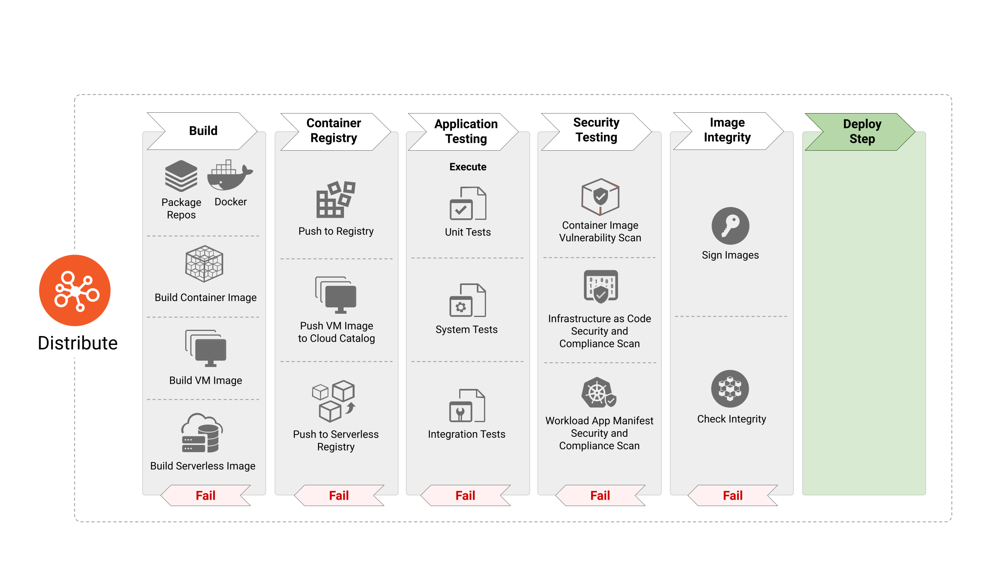

# 云原生安全白皮书中文版

<!-- markdownlint-disable MD001 MD009 MD010 MD012 MD013 MD022 MD024 MD026 MD030 MD033 MD034 MD036 MD037 MD041 MD045 -->
<!-- cspell:disable -->
**Version**: 2.0 **Created**: 12 Jan 2022 **Status**: WIP | In Review | **Approved**

**Last Reviewed**: 16 May 2022, **PDF Published**: 17 May 2022 **Release Version**: 2.0

**Final PDF Approvers** [X] @TheFoxAtWork [X] @justincormack

**Version 2 (May 2022)**

* **Contributors**: Brandon Krieger, Cole Kennedy (TestifySec), Fatih Değirmenci (Ericsson Software Technology),
  Frederick Kautz , Joel Bork, Marina Moore (NYU), mateuszpruchniak@gmail.com, Pushkar Joglekar (VMware),
  raja.faisal@gmail.com, Savitha Raghunathan (Red Hat), Sayantani Saha (Independent)

* **Reviewers**: Jon Zeolla, @nyrahul (Accuknox), Ragashree Shekar, Steven Hadfield, Kapil Bareja, Malini Bhandaru,
  Mikko Ylinen, Jonah Kowall (@jkowall), Kuang Dahu,Ariel Shuper, Eric Li (AlibabaCloud), Tanner Randolph (Applied
  Systems), Mark Dalton Gray (Microsoft), Ciara Carey, Brandon Lum (TAG Security Chair), Emily Fox (TOC Liaison) and
  Justin Cormack (TOC liaison).

**Version 1 (Nov 2020)**

* **Contributors**: Aradhna Chetal ([TIAA](http://tiaa.org/)), Brandon Lum ([IBM](https://www.ibm.com/)) , Chase Pettet ([Mirantis](https://www.mirantis.com/) (Chase.Pettet@mirantis.com)), Emily Fox ([US National Security Agency (NSA)](https://www.nsa.gov/)), Gadi Naor (Alcide), Harmeet Singh ([IBM](https://www.ibm.com/)), Jeff Lombardo (Independent), Jeyappragash JJ ([Tetrate IO](https://www.tetrate.io/)), Pushkar Joglekar ([Visa](https://visa.com/)), Rowan Baker & Andrew Martin ([ControlPlane](https://control-plane.io/)), Trishank Karthik Kuppusamy ([Datadog](https://www.datadoghq.com/)), Vinay Venkataraghavan ([Prisma Cloud (Palo Alto Networks)](https://www.paloaltonetworks.com/prisma/cloud)), Wayne Haber ([GitLab](https://about.gitlab.com/)), Mark Bower, Alex Chircop (StorageOS)

* **Reviewers**: @justincappos, @lumjjb, @whaber, @craigbox, @anvega, @magnologan, Alok Raj
  - [XenonStack](https://www.xenonstack.com/) (alok@xenonstack.com), @nyrahul(Accuknox), @ranio1, @lizrice,
  @justincormack

<!-- cspell:enable -->

## 执行摘要

### 宗旨

技术行业已经转向被看作“云原生”的开发和部署模式。与此同时，技术、产品、标准和解决方案的生态系统正在扩展，促使决策者及时了解最新的复杂设计。特别是 CISO 的角色，需要在这个动态的领域中阐明业务价值主张。与此同时，云原生模式也推动了消费模型的转变，促进了现代工作流程的应用。现代工作流程要求集成安全实践，例如敏捷方法论和 DevOps 流程。

#### 问题分析

由于明确关注快速开发和部署，因此该领域内的安全问题很复杂。此外，在传统的基于边界的安全模型中，依赖于网络 IP 地址等静态标识符是不切实际的。这种复杂性要求我们进行范式转变以保护应用程序安全，放弃基于边界的传统方式，让安全和工作负载（基于标签和标记等属性和元数据进行标识）的联系更加紧密。这种方法可以识别和保护负载，满足云原生应用程序对规模的要求，同时适应不断的变化。这些范式转变需要在应用程序生命周期中增加安全控制的自动化和安全设计架构（例如，零信任）。安全实现的权衡仍然涉及组织内的多个利益相关者，并且显著影响开发人员和运营人员追求业务目标的生产力。云原生应用程序仍然需要开发、分发、部署和运行时操作，但是这种范式指定了新的安全机制，通过这些机制可以高效地实现这些目标。云原生开发可以建模为构成应用程序生命周期的不同阶段：“开发”、“分发”、“部署”和“运行时”。“云原生安全”与传统的安全方法不同，因为有一个巨大的机会，可以确保安全贯穿于这些不同阶段，而不是通过独立的安全管理干预来结束生命周期。这些概念、工具和过程的持续学习对长期采用和应用至关重要。

### 生命周期阶段

#### 开发

云原生工具旨在在应用程序生命周期的早期引入安全性。安全测试需要尽早识别合规性违规和错误配置，以创建短且可行的反馈循环，以实现持续改进。这种方法可以使安全故障遵循熟悉的工作流程，在管道中解决其他问题（例如错误修复或连续集成故障），然后才能将软件推向更深入的管道。这种模型的现代安全生命周期围绕遵循推荐设计模式的代码开发（例如 [12 因素](https://12factor.net/)），并确保开发环境的完整性。

#### 分发

软件供应链安全在支持更快软件迭代的模型中尤为重要。云原生应用程序生命周期需要包括验证工作负载本身的完整性以及工作负载创建和操作方式的方法。这个挑战被必要的、实际的和一致的使用开源软件和第三方运行时镜像（包括上游依赖的层）所放大。生命周期管道中存在的工件（例如容器镜像）需要持续自动扫描和更新，以确保免受漏洞、恶意软件、不安全的编码实践和其他不良行为的影响。完成这些检查后，将工件进行加密签名以确保完整性并强制执行不可否认性非常重要。值得注意的是，不可变的镜像二进制和镜像的不可变 URL 也非常适合于安全分发。

#### 部署

在整个开发和集成发布阶段，应对候选工作负载的安全性进行实时和持续的验证，如，对签名的工件进行校验，确保容器镜像安全和运行时安全，并可验证主机的适用性。安全工作负载的监控能力，应以可信的方式监控日志和可用指标，与工作负载一同部署来完善整体的安全性。

#### 运行时

云原生运行环境本身可以分解为一系列相互关联的具有独特安全问题[^1]的组件层次结构，例如硬件、主机、操作系统、网络、存储、容器镜像运行时和编排。容器运行时由不同的实现组成，用于各种隔离边界级别，例如共享内核、微型虚拟机沙盒和可信执行环境沙盒。选择满足预期安全要求的运行时非常关键。例如，对于在多租户环境中运行的不受信任的工作负载，可以考虑基于虚拟机的沙盒。对于隐私敏感的金融数据处理，像机密容器这样的可信执行环境（每个进程或虚拟机的内存加密硬件）可能值得考虑。在典型的云原生运行环境中，应用程序通常由几个独立的且单一用途的微服务组成，它们通过服务层抽象相互通信，容器编排层使其成为可能。保护这种相互关联的组件体系结构的最佳实践包括确保只有经过授权的进程在容器命名空间内运行，防止和警报未经授权的资源访问尝试，以及监控网络流量以检测敌对入侵活动。服务网格是另一种抽象，提供了合并和补充有序服务的功能，而无需对工作负载软件本身进行更改（例如，API 流量记录、传输加密、可观察性标记、身份验证和授权）。

### 推荐做法

云原生安全旨在确保与传统安全模型相同或更高的勤勉、诚信、信任和威胁预防条件，同时融合了瞬息万变、分布式和不可变性的现代概念。在这些快速变化的环境中，为了确保安全结果，需要与开发流水线保持一致的自动化。组织应快速采用这些云原生概念，以帮助在其云原生旅程中创造价值驱动的安全结果。通过尽早将安全整合到开发生命周期中，甚至是通过互动式开发者培训更早地进行整合，安全组织可以实现预防性安全，而不是反应性安全（也可参见“[9 Box of Controls](https://blogs.blackberry.com/en/2016/03/the-9-box-of-controls)”）。强烈建议组织根据相关攻击框架[^2]对安全堆栈进行评估，以明确防御堆栈涵盖哪些威胁。此外，组织需要采用能够左移安全[^3]的方法和方法论，实现 DevOps，并具有足够的灵活性以适应未来的技术进步。

### 结论

在组织中战略性地实施云原生安全时，可以在规模上为客户和开发人员提供高可用性、保证性、弹性和冗余性，以确保他们以预期的速度安全地访问所需资源。安全本身仍然是一个跨学科的领域，不能被隔离出来，也不能被视为纯粹的技术领域。开发人员、运维人员和安全人员必须合作、交流和协作，以继续推动该领域和行业的发展。与任何技术创新一样，真正推动社区和云原生安全发展的是那些充满激情踏上这一旅程的人们。

## 介绍

本文旨在为组织和其技术领导层提供云原生安全的简明解释，以及帮助他们将其融入生命周期过程并考虑最适用的应用。云原生安全是一个多目标且多限制的问题领域，涵盖了许多专业和实践领域。从身份管理到存储解决方案，几乎所有的 Day 1 和 Day 2 的操作都与安全领域有关。然而，云原生安全涵盖的领域不止于此；它也是一个涉及个人、团队和组织的人类问题领域。它涉及人类和系统与云原生应用和技术进行交互、更改的机制、过程和意图。

### 目标受众

我们的目标受众是私营企业、政府机构或非营利组织的首席（信息）安全官（CISO）或首席技术官（CTO），他们希望提供一个安全的云原生技术生态系统。除此之外，其他组织利益相关者可能包括负责设计和实施安全的云原生产品和服务的项目、产品和方案经理以及架构师。此外，任何对云原生安全有浓厚兴趣的人都可以从参考本文中受益。

### 云原生目标

云原生架构是一组模式和设计，为组织提供了一种有效、可持续的无缝抽象，可跨不同的云实例工作，使应用程序栈成为云无关的。容器和微服务架构的采用和创新带来了许多挑战。安全领导人的任务是通过采用预防、检测和应对网络威胁的最佳实践来保护人类[^4]和非人类的资产，同时满足严格的合规要求。一个常见的历史叙事是，安全实施妨碍了 DevOps 团队的速度和敏捷性。因此，安全领导必须实现更紧密的集成和双向理解，赋予 DevOps 团队创建共享的网络风险所有权的能力。

组织应该在现代应用程序开发生命周期中采用安全的云原生模式和架构。特别强调安全架构与组织安全目标之间的协同作用，如零信任、安全软件供应链和 DevSecOps，在云基础设施方面应该优先考虑安全。

本文所描述的概念并不旨在偏袒一种服务、组件或产品，而是可以应用于任何服务选择。

本文档不会提供关于安全或云计算的概念方面的一般教育。也不推荐使用特定的技术或工具。但可能会引用一些解决所讨论主题的技术或工具的示例。

除了本文中的建议外，与数据保护和隐私监管法规要求相关的特定数据安全处理实践，如 GDPR、PCI DSS，可能需要额外的监管特定考虑因素。我们建议读者通过其他适当的专业咨询资源，以获取有关任何此类技术控制和合规风险事项的指导。

### 文档前提

本文档中的术语“工作负载 Workload”涵盖了已经或将要开发、维护、分发或部署到基于云的运行时环境的任何产品、项目、应用和系统。

所有使用的术语、概念和机制都按照《[云原生安全词汇表](https://github.com/cncf/tag-security/blob/main/security-lexicon/cloud-native-security-lexicon.md)》和《[云原生词汇表](https://glossary.cncf.io/)》的定义。本文不旨在改变这些定义或扩展它。

随着云原生采用和现代软件开发方法的不断发展，构成有效云原生栈的技术将继续随着时间的推移而变化。这种变化栈的表现包含在全面的 [CNCF 景观](https://landscape.cncf.io/)中。

## 云原生层次模型

*图 1*

云原生技术栈由基础设施层、全生命周期管理、运行环境组成。云原生技术栈可以适用于不同的云计算服务模式：IaaS、PaaS、CaaS 和 FaaS。每种服务部署模式都提供了额外的抽象，以简化云原生环境的管理和操作。由于这些服务模式中的一些模型是众所周知的，并已使用多年，我们将重点关注云原生特有的模型。

CaaS（容器即服务，Containers-as-a-Service）模式允许用户通过利用基于容器的虚拟化平台、应用编程接口 (API) 或管理页面来管理容器、应用和集群。CaaS 帮助用户构建可扩展的容器化应用，将安全策略嵌入到配置文件中，并在私有云、企业内部数据中心或公有云平台上运行。CaaS 有助于简化构建容器的过程。通过微服务编排和部署，它帮助企业更快地发布软件，并允许在混合云环境之间进行移植，从而降低基础设施投入以及运营成本。CaaS 模式可以帮助企业简化容器管理，同时让企业可以选择只为自己想要和使用的 CaaS 资源付费，从而节约成本。CaaS 以容器为基本资源，而对于 IaaS 环境，则使用虚拟机（VM）和裸金属主机。

FaaS（函数即服务，Functions-as-a-Service）是另一种云原生部署模式，是一种允许企业用户通过可执行代码来响应事件的云服务，这种模式用户无需构建和启动微服务相关的复杂基础设施。在云端托管一个软件应用，通常需要配置和管理一个虚拟环境，管理操作系统和网络组件等。通过 FaaS，物理硬件、虚拟机操作系统和 Web 服务器软件管理都由云服务提供商自动处理。从而使用户能够专注于微服务代码中的各个功能，同时为使用的资源付费，并利用云计算提供的资源进行弹性伸缩。

### 生命周期

在云原生环境中，*生命周期* 涉及到技术、实践和流程，以便在云环境中本地运行弹性、可管理和可观察的工作负载。生命周期包括四个连续的阶段：开发、分发、部署和运行，如图 1 所示。每个阶段都扩展和增强了前一阶段，同时允许和支持安全的工作负载执行。

下面的部分提供了详细的分析、工具、机制和最佳实践，以整合安全性贯穿应用程序的整个生命周期。

### 开发

*图 2*

云原生应用程序的安全性需要在整个生命周期中应用。 "开发"是这个周期中的第一步，它导致创建基础设施即代码、应用程序和容器清单等工件，这些工件将用于部署和配置云原生应用程序。因此，这些工件已被证明是许多攻击向量的来源，并且可以在运行时中被利用。下面的部分详细说明了需要在此阶段实施的各种安全工具、流程和检查，以显著减少在运行时部署的应用程序的攻击面。

#### 开发阶段的安全检查

在开发应用的过程中，安全加固是非常重要的。这意味着安全要求必须在软件开发的早期引入，并像其他设计要求一样对待。这些要求通常是基于围绕风险和合规性的业务需求的，可能是威胁建模练习的结果。在早期阶段解决这些需求可以避免在后续生命周期中重新做工作，否则会减慢 DevOps 管道的速度并增加总体成本。DevOps 团队还必须利用专门的工具在这些应用程序部署之前识别安全配置错误和漏洞。这些工具必须可以与 DevOps 团队使用的现有和熟悉的工具无缝集成，以在敏捷与安全之间实现协同而不是阻碍协同。例如，工具需要在开发人员 IDE 或提交拉取请求时执行基础设施即代码模板和应用程序清单的扫描。它们必须提供丰富和上下文的安全信息，可以由代码或应用程序组件的所有者在开发管道的早期快速，轻松地采取行动。采用这些步骤可以确保没有已知的漏洞或高风险配置。

团队应该部署专用的开发，测试和生产环境，为基础设施和应用程序开发人员提供隔离环境来开发，测试和部署系统和应用程序，容器基础映像，虚拟机黄金映像和启动非功能测试。

##### 测试开发

为了针对业务关键、威胁较高、历史遗留问题的代码和基础设施进行测试，开发人员、运维人员和安全人员应该建立测试流程。使用威胁建模可以识别代码中高风险和高影响力的部分，为测试流程提供高回报率的投资（ROI）。测试流程包括部署、操作系统、基础设施和数据库加固、应用程序测试（静态和动态源代码测试，如模糊测试、容器配置）、集成或系统测试（接受应用程序和基础设施组件及其交互）和冒烟测试（针对实时系统进行部署后检查）。测试作者应该可以访问全面的开发和测试环境，使他们能够在减少持续集成（CI）反馈循环的同时进行快速测试开发。系统测试套件应该在本地运行，并在共享测试环境内提供。

##### 代码审查

即使是对工作负载进行微小修改或对已部署的基础架构进行更改，也可能导致严重的安全问题。为了减轻此类意外后果的风险，团队应该在进行代码审查之前使用“[四眼原则](https://www.unido.org/overview/member-states/change-management/faq/what-four-eyes-principle)”（即在 git 工作流程中使用拉取请求）。

### 分发

*图 3*

“分发”阶段负责消耗镜像定义和规范以构建下一阶段的工件，例如容器镜像、VM 镜像和其他工件。在现代的 CI/CD 管道中，“分发”阶段包括系统化的应用测试，以识别软件中的错误和故障。然而，采用开源和可重用的包可能会导致漏洞和恶意软件被纳入容器镜像中。因此，必须采取针对安全的步骤，例如扫描镜像以查找威胁向量，以及验证镜像的完整性以防止篡改。此外，如果需要保密，组织可能希望对软件工件进行加密。

如果软件工件由于妥协或其他事件而变得不可信，团队应该撤销签名密钥以确保否认。

#### 构建管道

持续集成（CI）服务器应该被隔离并限制在相似安全分类或敏感性的项目中。需要提升权限的基础设施构建应该在单独的专用 CI 服务器上运行。构建策略应该在 CI 管道和编排器的准入控制器中执行。

供应链工具可以收集并签署构建管道元数据。随后阶段可以验证签名以确认先决条件管道阶段已运行。

读者应确保 CI 和持续交付（CD）基础设施尽可能安全。例如，应优先安装安全更新，并通过使用 HSM 或凭证管理器来保护加密密钥免受外泄。

#### 镜像扫描

扫描容器镜像是保护容器应用程序整个生命周期中最常见的安全方式之一。在将镜像部署到生产环境之前，在 CI 流水线中进行扫描非常重要。此外，持续扫描正在运行的容器镜像同样重要，以识别新发现的漏洞。整合此功能可确保开发人员、运营商和安全专家拥有所有已知漏洞和详细信息，例如严重性、[通用漏洞评分系统（CVSS）](https://nvd.nist.gov/vuln-metrics/cvss)评分和可用的缓解/修复措施。将容器镜像的漏洞扫描与流水线合规规则相结合，可确保只部署已充分修补的应用程序，从而减少潜在攻击面。容器镜像扫描还有助于识别开源软件包或从开源镜像库中获取的基础镜像层中的恶意软件存在。虽然容器镜像扫描可以为团队提供漏洞或恶意软件的证据，但它并不能修复漏洞或防止恶意软件。组织需要确保采取行动来解决容器扫描发现，并执行组织合规规则。

#### 镜像强化

容器镜像必须包含安全强化措施，以减轻威胁，同时允许在运行时进行实时配置，以便更好地集成到生态系统中。

在考虑安全保证目标时，应评估以下问题：

- 是否将执行环境限制为特定用户？
- 是否限制对资源的访问？
- 是否对进程执行进行内核级别的限制？

#### 容器应用清单扫描

应用程序清单描述了容器化应用程序所需的配置。在 CI/CD 管道中扫描应用程序清单以识别可能导致不安全部署的配置至关重要。

#### 容器应用清单强化

与容器镜像一样，容器应用程序清单加固可以考虑并且可以在构建和运行时实现。

对于安全保证目标，主要问题是：*要满足哪些最小限制来执行生态系统？*

#### 测试

云原生应用程序应该接受与传统应用程序相同的质量测试套件和标准。这些包括干净代码的概念，遵循[测试金字塔](https://martinfowler.com/articles/practical-test-pyramid.html)，通过静态应用程序安全测试（SAST）进行应用程序安全扫描和代码检查，依赖性分析和扫描，动态应用程序安全测试（DAST），应用程序仪表化以及完整的基础架构，并在本地工作流中向开发人员提供测试。自动化测试结果应映射回双重认证（开发人员和工具）的要求，以实时安全保证提供给安全和合规团队。

一旦发现安全配置错误（例如不正确的防火墙或路由规则），如果根本原因分析确定其有合理的重现机会，则开发人员应编写自动化测试以防止缺陷的回归。在测试失败时，团队将收到反馈以纠正错误，并在下一次合并时，测试将通过（假设已经纠正）。这样做可以防止由于将来对该代码的更改而导致的回归。

基础架构的单元测试是一种预防性控制，目标是在基础架构作为代码（IaC）配置中定义的实体和输入。构建的基础架构的安全测试是一种探测性控制，它结合了保证、历史回归和意外配置检测（面向全球开放的防火墙规则、松散权限的身份和访问管理（IAM）策略、未经身份验证的端点等）。

基础架构和工作负载的硬化应该得到全面的测试套件的支持，这允许系统逐渐硬化。测试以验证硬化是否发生应该在构建期间运行，但也应在部署时运行，以评估可能在整个生命周期中发生的任何更改或回归。

##### 静态分析和安全测试

静态分析是指对 IaC、应用程序清单和软件代码进行代码检查、错误配置的识别和特定组件的漏洞分析。但需要注意的是，个别分析很重要，但不应该是唯一的分析形式。IaC 代码应该受到与应用工作负载相同的管道策略控制。

IaC 是组织部署云和容器基础设施的越来越流行的方式。在 IaC 模板中，不安全的配置会自然地导致基础设施中的安全漏洞。因此，在部署应用程序和基础结构工件之前，应该扫描这些模板以寻找威胁安全的特征。需要注意的关键错误配置包括：

- 应用程序清单中指定的镜像中包含的漏洞
- 不遵守最小权限原则的设置，例如可以升级权限或过于宽松的防火墙规则的容器
- 安全上下文和系统调用的识别，可能会危及系统
- 资源限制设置

##### 动态分析

部署基础架构的动态分析可能包括检测基于角色的访问控制（RBAC）和 IAM 配置漂移，验证期望的网络攻击面，并确保 SOC 可以检测专用测试环境中的异常行为以配置生产警报。动态分析是测试的一部分，但预计会在非生产运行时环境中发生。

##### 安全测试

应将应用程序和基础架构的自动化安全测试作为安全团队的重点。测试套件应持续更新，以与组织的威胁模型相一致地复制威胁，并可用于安全回归测试，因为系统不断发展。自动化安全测试通过消除手动安全门（例如在单个检查点处实施验证和手动控制）来提高安全性和发布速度，这是耗时且不足够的。自动化安全测试还通过明确尝试执行威胁来随时展示控制效能，从而实时提高系统的安全性和遵守任何嵌入式合规要求。

#### 工件和镜像

##### 注册表暂存

由于组织经常从公共来源中提取开源组件，因此应该在管道中创建几个注册表（镜像仓库）阶段。只有经过授权的开发人员才能从公共注册表中提取基本镜像并将其存储在内部注册表中以供组织范围内广泛使用。另外，建议为每个团队或组保留单独的私有注册表，以保留开发工件，并为准备生产的镜像保留一个分段或预生产注册表。这可以在 CI/CD 链的不同阶段为类型不同的测试提供更严格的开源组件来源和安全性控制。

对于所有使用的注册表，必须通过专用的身份验证和权限模型进行访问控制。在架构内的其他交互之间，应该使用互相认证的 TLS 来保护所有注册表连接。

##### 签名、信任和完整性

为了确保构建的完整性和来源，可以在构建时对镜像内容进行数字签名，并在使用前验证签名数据。这个过程通常开始于确认构件已经过审查和批准，以及验证构件具有有效签名的过程。

对于软件供应链更为复杂的情况，需要创建单个构件依赖于多个验证步骤，因此需要一组实体的信任。以下是一些示例：

- 容器镜像签名 - 签署容器镜像清单的过程
- 配置文件签名 - 签署配置文件，例如应用程序配置文件
- 包签名 - 签署包含构件的软件包，例如应用程序包

对于通用软件构件，例如库或 OCI 构件，签名这些构件表示组织批准使用它们的来源。同样重要的是验证这些构件，以确保只允许授权的构件。强烈建议仓库需要相互验证身份，以向注册表中的镜像引入更改或向仓库提交代码。

##### 加密

容器镜像加密可以保护容器镜像中的内容，确保其在构建和运行时都是保密的。即使被攻击，镜像的注册表内容也可以保密，这对于保护商业秘密或其他机密材料等用例非常有帮助。

另一个常见的容器镜像加密用途是强制执行授权。当镜像加密与密钥管理、运行时环境的证明和/或授权和凭据分发相结合时，可以要求容器镜像只能在特定平台上运行。容器镜像授权对于合规用例（如地理围栏或出口控制和数字版权媒体管理）非常有用。

### 部署

*图 4*

”部署“阶段负责安排一系列的"执行前"检查，以确保即将部署的应用程序在运行时能符合并遵守本组织的安全和合规性策略。

#### 执行前部署检查

在部署之前，各组织应核实以下几方面是否到位、适用性以及当前状况：

- 镜像签名及完整性
- 镜像运行策略（如没有恶意软件或严重的漏洞）
- 容器运行策略（如无过度权限）
- 主机安全漏洞和合规性控制
- 工作负载、应用程序和网络安全策略

#### 可观测性和度量指标

将可观测性和度量指标引入云原生架构可以提供安全洞察，因此相关的负责人可以解决和减轻报告中出现的异常；这个领域的工具可以帮助收集和可视化这些信息。通过行为和启发式分析，团队可以检测和升级异常值、可疑事件和未解释的调用，以便通知适当的利益相关者。鼓励使用属于人工智能范畴的高级机器学习和统计建模技术来协助行为和启发式分析的开发。

#### 事件响应和缓解

应用程序应提供有关身份验证、授权、操作和失败的日志记录。开发人员应将此功能作为规划和设计阶段的一部分包括在内。这些元素提供了一条证据链，在进行调查并需要确定根本原因时进行跟踪。

取证能力是任何事件响应和缓解活动的重要组成部分。它们提供证据以确定事件的根本原因，并为任何缓解提供反馈。容器环境的短暂性质需要一组更敏捷的工具来捕获和分析任何证据。将取证能力整合到事件响应计划和程序中将提供获取和处理证据的手段，缩短确定根本原因的时间，并最小化暴露风险。

### 运行时环境

*图五*

运行时（Runtime）阶段包括三个关键领域：计算、访问和存储。虽然运行时环境取决于开发、分发和部署阶段的成功完成，但运行时的安全性取决于前几个阶段的安全实践的效力。以下段落详细介绍了每个关键组件的安全要求和影响。

#### 计算

云原生计算具有高度复杂性和不断发展的特点。如果没有核心组件来实现计算利用，组织就无法确保工作负载的安全性。

考虑到容器为共享主机上的多租户应用程序提供基于软件的虚拟化，因此使用容器特定操作系统非常重要。这是一个只读操作系统，其他服务已被禁用。这有助于减少攻击面，并提供隔离和资源限制，使开发人员能够在共享主机内运行隔离的应用程序。为了实现防御深度，建议不要让不同的数据敏感工作负载运行在同一个操作系统内核上。

为了让安全覆盖容器平台和服务的所有层面，可以使用基于可信平台模块（TPM）或虚拟 TPM 的硬件信任链。基于硬件的信任链可以扩展到操作系统内核及其组件，以实现对受信启动、系统镜像、容器运行时和容器镜像等的加密验证。

安全隔离区（也称为可信执行环境或 TEE）是机密计算的核心。安全隔离区是内置于新型 CPU 中的一组安全相关指令代码。它们保护数据在使用时的安全性，因为隔离区仅在 CPU 内部动态解密，并且仅为运行在隔离区内部的代码和数据服务。基于 TEE 的机密计算确保数据安全性、完整性和机密性。隔离区中的加密数据和代码对其他应用程序、BIOS、操作系统、内核、管理员、云供应商和硬件组件不可用，除了 CPU。基于 TEE 的机密计算与沙箱容器协同工作，以隔离恶意应用程序并保护敏感数据。

操作系统提供基本的系统组件，例如用于远程连接的加密库和用于进程启动、管理等的内核函数。它们可能存在漏洞，因为它们为容器提供了基础计算基线，因此可能会影响运行在这些主机上的所有容器和应用程序。同时，配置不当的容器可能会影响主机内核安全性，从而影响在该主机上运行的所有服务。

#### 编排

任何一个编排系统都有多个组件，这些组件被分为控制平面和数据平面。有时需要具有更高层次的多部署管理平面，负责在相互独立的几个控制平面之间维护状态。

任何编排系统都会受到一些攻击，这些攻击会影响部署的整体安全性和运行时的持续安全性。恶意访问编排系统的 API、未经授权访问和更改 key-value 存储、通过仪表板控制集群、拦截控制平面数据、滥用 API、拦截应用程序数据等都是潜在的威胁领域。对于任何编排系统来说，采用最佳实践和配置强化是很重要的方法来防止其成为被攻击的目标，实例可参考文献[^6]。同样重要的是监控和检测在运行时对初始配置的任何更改，以确保集群的持续安全运行。其他安全最佳实践，如尽量减少对控制平面的管理访问、职责分离和最低特权等原则，都应该确保贯彻实施。

##### 安全策略

必须考虑你的编排系统的安全特性和各种配置选项，以控制容器运行时可以用来建立容器的安全权限。使用更高层次的策略和监管可以强制执行这些安全防护措施。

##### 资源请求和限制

通过 cgroups 对不同的对象和资源请求进行限制，这有助于防止有意（如 fork 炸弹攻击或加密货币挖矿）或无意（如在内存中读取大文件而不进行输入验证，水平自动缩放以耗尽计算资源）的导致节点和集群的资源被不当的工作负载耗尽。

##### 审计日志分析

审计日志分析是识别和关联系统被攻击、滥用或配置错误的最成熟方法之一。持续自动化审计日志分析和关联对于安全团队非常重要，因为云原生架构能够为工作负载生成比传统遗留系统更细粒度的审计配置和过滤。此外，云原生日志的互操作性允许进行高级过滤，以防止下游处理的负荷过载。在这里，与传统日志分析一样，关键是生成可操作的审计事件，将日志中的数据相关/上下文化成能够驱动决策树/事件响应的“信息”。

非合规违规行为是基于一组预先配置的规则进行检测的，这些规则过滤组织策略的违规行为。要能够审计使用集群的实体的操作，启用 API 审计并过滤一组特定的 API 组或动词对于安全团队或集群管理员是非常重要的。将日志立即转发到无法通过集群级凭据访问的位置也能够防止攻击者通过禁用日志或删除其活动日志来掩盖其踪迹。这些处理警报的系统应定期进行误报调整，以避免警报泛滥、疲劳和在系统未检测到的安全事件之后发生虚报阴性。

##### 控制平面认证和根证书

系统管理员应配置所有控制平面组件之间的通信使用相互认证和证书验证。安全证书也需要定期轮换以强化系统安全。安全证书颁发机构 CA 可以是默认的编排系统 CA，也可以是外部 CA。使用外部 CA 可能涉及到维护证书颁发机构基础设施的大量工作，因此应谨慎选择此选项。管理员应特别注意保护 CA 的私钥。有关扩展或建立信任的更多信息，请参考本文的鉴权和访问管理部分。

##### 凭证（如密钥）加密

在容器编排或部署时可以使用外部密钥管理系统来管理密钥，也可以直接使用编排系统本地的密钥。当使用本地密钥时，关键是要知道有几种不同的保护方法。

使用外部密钥管理存储 (KMS) 加密

- 利用 KMS 是保护编排系统数据秘密一种安全方式，外部的 KMS 将对数据加密密钥（DEK）进行加密，然后使用 DEK 对保存在 etcd 中的数据进行加密。这种方法还可以将 DEK 缓存在内存中，以减少对外部 KMS 的依赖，并可在创建 pod 时加快解密速度。

编排系统加密管理

- 由编排系统用数据加密密钥来加密秘密，同时加密密钥也由编排系统管理（如采用配置文件）。

不加密

- 有些编排系统采用 base64 编码，默认情况下，数据实际以明文保存在 key-value 存储中。

使用外部密钥管理系统可以降低使用明文的风险，并降低密钥管理的复杂性。大多数情况下，这些工具都是作为 controller,driver 或 operator 使用，可以在运行时注入密钥，并定期自动轮换而无需人工干预。

##### 运行时

容器的运行时环境需要从进程、文件和网络的角度被监控和保护。在容器中，只有那些得到许可的功能或系统调用（如 seccomp 过滤器）才能被允许执行或被宿主机操作系统调用。容器运行时应该监控和防止对关键挂载点和文件的改变，且对它的配置必须能够防止更改二进制文件、证书和远程访问配置。这种配置还必须限制容器只能进行为完成操作所必须的入口和出口网络访问。此外，那些访问恶意域名的网络流量应该被检测并阻止。

相反，完整的工作负载或在运行时处理隐私敏感数据的部分工作负载可以在受信任的执行环境中执行。这可以实现保密计算并保护工作负载数据免受外部威胁。

##### 微服务和消除隐性信任

作为微服务部署的容器化应用程序的边界是微服务本身，因此，有必要设定策略，只允许在得到许可的微服务间进行通信。在微服务架构中引入零信任，可以在一个微服务被攻陷时阻止其横向移动，从而缩小影响范围。运维人员应确保他们正在用网络策略等功能，确保一个容器部署内的东西向网络通信只限于授权网络。在 [NIST SP 800-204](https://csrc.nist.gov/publications/detail/sp/800-204/final) 中初步提供了一些用于微服务的策略，这些之后可能会成为实现安全微服务架构的指南。

##### 对镜像的信任和内容保护

组织可以使用策略代理来强制或控制经过认证和签名的容器镜像，从而能够为运维工作提供映像出处的保证。除此之外，引入加密容器可以保护容器内的敏感源码、方法或数据。

##### 服务网格

服务网格提供服务之间的连通性，并增加了流量控制、服务发现、负载均衡、弹性、可观测性、安全等额外功能。服务网格可以让微服务把这些功能从应用层软件库中剥离，让开发者专注于差异化的业务逻辑。为了有效地确保云原生环境中服务之间的安全通信，组织应该部署服务网格来消除其工作负载内部和不同工作负载之间的隐性信任，这些可以通过数据传输时加密来实现。使用服务网格也可以解决身份问题，传统的静态身份（如 IP 地址）不再与工作负载清晰地对应。服务网格不仅提供服务层的隔离和安全，还提供网络层的弹性功能，例如重试、超时和实施各种断路器功能。流媒体平台可以通过使用工作负载层的授权来设置主题或代理的访问规则来提高安全性，从而从服务网格中获益。

值得注意的是，部署服务网格有助于缩小云原生部署的攻击面，并为构建零信任应用网络提供关键框架。

##### 运行时检测

监控已部署的工作负载能够帮助团队验证当前真实的运行状态达到了预期状态。组织不能放弃在环境中进行定期的安全扫描和监控，否则就会使他们的工作负载变成攻击者不受限制的游乐场。应利用那些可以检测、跟踪、汇总和报告来自容器的系统调用和网络流量的工具，来发现非预期或恶意行为。

虽然回归测试和安全测试可以帮助防止已知的、预期的问题转移到生产环境中，但它们不能阻止所有问题。我们应该对工作负载进行动态扫描，以检测尚未发生过的恶意行为或非预期行为。在工作负载运行了 X 天之后，延长休眠命令将数据存储中的数据外泄之类的事件，在大多数环境中是不被考虑到的，因此不会包括在安全测试中。对于工作负载中可能存在时间或事件延迟木马的问题，只有通过与基线预期行为进行比较才能检测到，这通常是在彻底的活动监控和扫描中发现的。

此外，工作负载在部署时或之后可能会变得容易受攻击。组织应持续扫描其环境，以检测哪些工作负载现在容易受攻击。了解每个工作负载的组成或[材料清单](https://ntia.gov/page/software-bill-materials)可以帮助组织快速识别漏洞所在。有关这些漏洞的其他信息，如漏洞成熟度和漏洞利用路径，对于确定工作负载的实际风险至关重要，并可帮助组织优先更新有风险的应用程序。

##### 函数

无服务器函数容易受到各种攻击，因此需要适当保护。进程必须只执行在允许列表中明确定义的函数。此外，不应允许函数对关键的文件系统挂载点进行修改。

这些函数必须被限制只能访问被认可的服务，这种限制可以通过网络限制或权限模型中的最低权限来实现。此外，出站网络连接必须由管理员监控，以便检测并在可能的情况下阻止其访问 C&C（指令和控制）和其他恶意网络域。还必须考虑监控入站网络，以便检测和删除可能用于数据外泄的恶意负载和命令。例如，可以通过网络监控来检测 SQL 注入攻击。

无服务器函数中存在一些安全威胁，但可供租户使用的控制措施是有限的。这些问题包括无效身份认证和与依赖服务之间不安全的 API 集成等。有一些措施有助于解决这类问题，如确保所有无服务器函数在基于租户的资源隔离环境中或相似的数据类型的性能隔离环境中运行。然而，由于隔离环境中可用的地址空间有限，这些措施会对性能造成影响。

##### 启动引导

信任需要被引导入计算节点中，以确保工作负载和配置运行在正确的节点上。启动引导确保计算节点处于正确的物理和逻辑位置，并能够进行自我认证。这些步骤通常是云服务提供商服务开通的一部分。但是也有一些方法可以在减少对第三方的依赖情况下进行信任验证。

#### 存储

云原生存储涵盖了一系列广泛的技术，可分为提供类存储和访问类存储两类。提供类存储是提供给工作负载使用的存储，例如卷（volumes），包括块存储、文件系统和共享文件系统。访问类存储是通过应用程序接口访问的存储，包括对象存储、键值存储和数据库。

存储系统包含一个数据访问接口，定义了应用程序或工作负载如何存储或使用由存储系统或服务持久化的数据。该接口可以通过访问控制、身份验证、授权以及可能的传输加密来进行保护。

存储系统还包含一个控制面板/管理接口，通常是受身份验证和TLS保护的API，尽管可能提供更精细的访问控制，通常情况下，控制接口仅由编排器或服务代理通过服务账户进行访问。

##### 存储栈

任何存储解决方案都由多个功能层组成，这些功能层定义了数据的存储、检索、保护和与应用程序、编排器或操作系统的交互方式。每个层都有可能影响存储系统的安全性。一个常见的例子是将文件或块持久化到对象存储的文件系统。不仅仅需要保护访问数据的顶层，保护拓扑结构中的每一层同样重要。

###### 编排

大多数编排系统将实现多种抽象和虚拟化层，其中可能包括文件系统（例如绑定挂载）、卷管理器，并根据编排器策略在用户或组级别应用权限。与容器化和微服务架构的许多组件一样，保护卷和存储始终依赖于集群中其他功能的保护措施。如果用户能够在编排器或容器运行时中提升其特权至 root 级别，他们可能会对环境以及底层存储系统造成严重破坏。在成功保护云原生架构中的存储方面，实施零信任、最小特权、访问控制并强制执行是关键。

###### 系统拓扑和数据保护

理解系统的存储拓扑对于确保数据访问路径和分布式拓扑中的节点内通信的安全至关重要。

常见的拓扑模型包括集中式模型，其中所有计算节点都访问一个中央存储服务；分布式模型，将功能分布在多个节点上；以及超融合模型，将应用程序和存储工作负载合并在同一节点上。根据系统使用的拓扑结构，选择特定的分层安全机制来保护存储中的数据以及存储位置之间的传输数据。

任何存储系统的关键功能之一是对持久化在系统或服务中的数据进行保护。首先，这种保护通过确保数据对授权用户的可用性来实现，并且应作为系统中的透明层存在。这可能包括奇偶校验或镜像、纠删码或副本等技术。其次，保护数据的完整性，存储系统会对块、对象或文件添加哈希和校验和。哈希主要用于检测和恢复损坏的数据，同时也可以提供一层保护，防止数据篡改的发生。

###### 缓存

缓存层，通常是完全独立的系统，被实施用来提升存储系统（尤其是文件系统、对象和数据库）的性能。对于缓存层，需要应用适当的访问控制和安全策略，因为缓存将作为实际存储后端的访问前端。

###### 数据服务

存储系统通常实现多个数据服务 (Data Services)，这些服务在核心存储功能的基础上提供额外的功能，可以在不同的层次上实现，包括复制和快照 (数据的时间点副本)。这些服务通常用于将数据副本移动到远程位置，因此需要确保在远程位置应用相同的访问控制和安全策略来保护数据。

###### 物理层或非易失性层

云原生存储安全性不仅限于虚拟云原生架构，因为云原生能力可以在本地部署，甚至虚拟化解决方案也具有物理存在。重要的是要记住，存储系统最终会将数据保存在某种形式的物理存储介质上，通常是非易失性存储。现代物理存储介质（如固态硬盘）通常支持安全功能，如自加密，遵循[OPAL](https://trustedcomputinggroup.org/wp-content/uploads/TCG_Storage-Opal_SSC_v2.01_rev1.00.pdf)标准，并提供快速和安全的擦除功能。安全擦除在包含数据的设备需要离开安全的物理位置时非常重要，例如设备出现故障需要退还给供应商。

##### 存储加密

存储系统可以通过数据加密提供数据的机密性保护。数据加密可以应用于数据传输过程中的数据或静态存储的数据，在实施时存储系统可以确保独立于应用程序进行加密。加密功能通常依赖于与密钥管理系统的集成。

加密会对性能产生影响，因为它涉及计算开销，但许多系统提供了加速选项，可以减少开销。在选择数据加密类型时，需要考虑数据路径、大小和访问频率，以及法规、合规性或其他需要使用更安全加密算法的附加安全保护措施。此外，在考虑体系结构的加密要求时，团队不应忽视缓存的使用。

加密服务可用于数据传输过程中的数据（保护数据在网络中传输时）和静态存储的数据（保护数据在磁盘上）。加密可以在存储客户端或存储服务器中实现，加密的粒度会因系统而异（例如，按卷、按组或全局密钥）。在许多系统中，传输过程中的数据会使用 TLS 进行保护通过证书[^7]提供身份验证层。较旧的协议（如 iSCSI）在传输过程中可能较难进行安全保护（虽然可以使用更复杂的解决方案，如 IPsec 或加密 VPN[^8]）。静态存储的数据通常使用标准对称加密算法（如 AES）进行保护，并且可以使用特定的加密模式（例如，面向块设备的 XTS 模式）进行部署。

包括块存储、共享文件系统和对象存储在内的公共云存储可能原生支持使用 CMK 和 BYOK 进行数据加密。

##### 持久卷保护

保护对卷的访问是确保只有经授权的容器和工作负载能够使用提供的卷的关键。定义命名空间的信任边界，以限制对卷的访问至关重要。利用现有的或创建新的安全策略，防止一组容器在工作节点上访问卷挂载点，并确保只有适当的工作节点能够访问卷。这一点尤其重要，因为特权容器可以在不同命名空间中访问已挂载的卷，因此需要采取额外的预防措施。

指定卷的 UID 或 GID 仍然允许同一命名空间中的容器访问该卷，并不能提供数据保护。V3 版本的网络文件系统（NFSv3）假设客户端已经执行了身份验证和授权，并不进行验证。在实施保护措施时，需要考虑身份验证和授权发生的位置以及是否存在对该操作的验证。

##### 组件注册表（仓库）

注册表应该适应用于签名和验证 OCI（Open Container Initiative）制品的技术。同时，确保缓存和分发工具提供签名、加密和校验和的功能，以确保缓存层能够检测到篡改或试图破坏数据集的行为。

可以通过访问[CNCF 存储白皮书](https://bit.ly/cncf-storage-whitepaperV2)获取有关云原生存储的概念、术语、使用模式和技术类别的额外背景信息。

#### 访问

##### 身份和访问管理（IAM）

云原生架构中，一个全面的身份和访问管理 (IAM) 解决方案至少需要服务身份。维护或操作本地或混合云的组织需要用户和设备身份管理。对于分布在多云环境中的应用程序和工作负载，身份联合对于成功实现至关重要。

应用程序和工作负载应使用相互认证明确授权彼此通信。由于云计算的短暂特性，密钥的轮换和生命周期需要频繁且短暂，以维护高速能力的要求，并在凭据泄露时控制和限制影响范围。

从云提供商获取身份管理服务的利用，取决于特定于行业的用例。用户应该为敏感工作负载（如健康或财务信息）生成和管理凭据和密钥，与云提供商无关。

为了使客户端和服务器通过密码学双向验证身份，所有工作负载必须利用相互/双向传输身份验证。

为了使客户端和服务器通过密码学双向验证身份，所有工作负载必须利用相互/双向传输身份验证。身份验证和授权必须在环境内部和跨环境独立确定（决策点）并执行（执行点）。理想情况下，所有工作负载的安全操作都应在实时中得到确认，并在可能的情况下验证更新的访问控制和文件权限，因为缓存可能允许未经授权的访问（如果访问被撤销并且从未得到验证）。工作负载的授权是基于其被分配的属性和角色/权限授予的。强烈建议组织在所有环境中和整个工作负载生命周期中使用基于属性的访问控制（ABAC）和基于角色的访问控制（RBAC），以提供粒度授权强制执行。这种姿态可以实现深度防御，在此姿态下，所有工作负载都能接受、消费和转发终端用户的身份，以获得上下文或动态授权。这可以通过使用身份文件和令牌来实现。如果未强制执行此限制，组织将无法真正执行系统对系统和服务对服务调用的最小特权访问控制。

需要注意的是，应用程序或服务身份在微服务的背景下也是至关重要的，因为应用程序的身份很可能会受到恶意服务的欺骗和冒充。使用强大的身份框架和服务网格可以帮助解决这些问题。

所有的人类和非人类的群集和工作负载操作者都必须进行身份验证，并且他们的所有操作都必须根据访问控制策略进行评估，这些策略将评估每个请求的上下文，目的和输出。为了简化身份验证过程，可以配置身份联合以允许使用企业能力，如 MFA 多因素身份验证。然后必须使用本节提到的访问控制机制强制执行授权。

##### 凭据管理

###### 硬件安全模块 (HSM)

凭证管理解决方案赋予组织有效管理访问数字和物理资源的硬件和软件凭证的能力。部署安全的凭证管理系统是确保系统和信息安全的关键步骤。

###### 凭据管理周期

加密密钥应该在 HSM（Hardware Security Module）或基于软件的密钥管理系统中安全地生成。

密钥（Secrets）应尽可能具有较短的过期时间或生命周期，超过该时间后密钥将失效。密钥管理应具备高可用性和高易用性，这些特征是短期密钥的先决条件。如果组织不得不使用长期密钥，应建立适当的流程和指导，定期进行密钥轮换或撤销，特别是当出现意外泄露密钥的时候。所有密钥在传输过程中必须通过安全的通信渠道进行分发，并应根据所保护的访问级别或数据的重要性相应地进行保护。

无论如何，密钥（Secrets）应该通过非持久性机制在工作负载的运行时注入，以免通过日志、审计或系统转储泄露。这意味着可以使用非持久性的机制，如内存中的共享卷，来存储密钥，而不是使用环境变量。这样可以确保密钥不会在日志、审计或系统转储中被泄露出去。

#### 可用性

##### 拒绝服务（DoS）和分布式拒绝服务（DDoS）

云原生应用中的拒绝服务攻击（DoS 攻击）是一类网络攻击。攻击者试图通过暂时或长时间让云原生应用对其原本正常用户不可用，包括人类用户和自动化系统。攻击者可能通过干扰关键的云原生应用组件（如微服务），干扰负责保持微服务运行的编排层，或干扰负责应用扩展的健康监控系统来实施攻击。拒绝服务通常是通过向关键微服务或资源发送大量无用请求，以超载系统并阻止部分或全部合法请求得到满足。分布式拒绝服务攻击（DDoS 攻击）通常涉及大量的流量涌入云原生应用服务或其所依赖的上游网络。攻击通常来自多个源头。在攻击达到云原生应用之前，可以通过检测和遏制这些攻击来减轻其影响。

为了应对拒绝服务攻击和分布式拒绝服务攻击，通常需要采取多种防御措施。这包括使用网络防火墙、入侵检测系统、负载均衡器等技术来识别和阻止恶意流量，以及实施合适的访问控制策略和限制资源使用。此外，定期进行安全审计和漏洞修复也是重要的措施，以确保云原生应用的安全和可用性。

### 安全保障

安全是一个基于风险管理的过程，旨在识别和解决系统面临的风险。对系统的迭代和持续加固将根据组件或组织的风险概况和容忍度来减轻、降低或转移风险。加固的概念虽然在其核心上是传统的，但仍可应用于具有安全意识的团队，通过评估组件及其构成与最小功能的一致性来实施。例如，当团队确定更新基础镜像时，应审查新增端口、权限和软件包，并对其进行接受、修改或限制。

相比之下，合规标准形成了一套控制原则，通过评估系统与这些要求定义相符或创造性地满足这些要求。评估结果是二进制的（合格或不合格），但可能包含第一类错误（假阳性）或第二类错误（假阴性），应将其视为 CI/CD 流水线测试的结果，类似于流水线中的任何其他测试结果。因此，合规和安全保障是相互补充的过程，但它们并不可互换。合规的系统不能保证安全，同样，安全的系统也不能保证合规。

#### 威胁建模

对于采用云原生的组织来说，进行威胁建模是识别风险、控制措施和缓解措施的主要方法之一。虽然有许多威胁建模技术，但它们都具有一些共同的特点。首先，需要构建系统架构的范围表示。这从识别所有重要的流程、数据存储和[安全边界](https://www.oreilly.com/library/view/cissp-certified-information/9780470276884/9780470276884_security_boundaries.html)开始。一旦建立了边界，并在其中对系统的相关元素进行了划分，下一步是对这些元素如何进行交互进行建模，特别关注跨越安全边界的任何交互。

以下指南是对[OWASP threat modeling](https://owasp.org/www-community/Threat_Modeling) 提供的四步威胁建模方法的增强，适用于云原生能力。

##### 端到端架构

对组织或个人的云原生架构有清晰的理解应该导致数据影响指导和分类。这有助于团队在架构中组织数据分发，并为其提供额外的保护机制。云原生的图表和文档不仅应包括整体系统设计的核心组件，还应包括源代码的位置、使用的存储机制以及软件开发周期的其他方面。这些都是在进行云原生威胁建模时必须考虑的领域。

##### 威胁识别

在考虑与组织的云原生能力相关的威胁时，建议利用成熟且广泛使用的威胁模型，例如 STRIDE 或 OCTAVE。组织可能希望考虑的云原生架构的常见威胁包括但不限于：

- **冒充**：通过社交工程攻击窃取认证凭据来冒充集群管理员。
- **篡改：**篡改 API 服务器配置文件或证书可能导致 API 服务器重新启动失败或互相 TLS 身份验证失败。
- **否认**：由于禁用或配置错误的 API 审计，攻击者的行动可能被否认，导致缺乏潜在攻击的证据。
- **信息泄露**：如果攻击者入侵正在运行的工作负载并能将数据外泄到外部实体，可能会导致信息泄露。
- **DoS**：由于未对工作负载应用资源限制，可能导致拒绝服务（DoS），从而消耗整个节点级的 CPU 和内存，导致工作节点丢失。
- **权限提升**：如果工作负载以无限制或更高权限运行，或者通过修改工作负载或容器的安全上下文，可能会提升权限。

在云原生安全中要考虑的威胁行为与现有的威胁建模实践一致：

- **恶意内部人员** - 具有恶意意图并具有在建模系统内执行操作的授权的参与者。
- **无知内部人员** - 具有在建模系统内执行操作的授权（假设任何人都可能被欺骗）的参与者。
- **恶意外部人员** - 拥有恶意意图且位于系统外部的参与者，能够通过互联网、供应链、物理边界等方式发动攻击，而无需明确授权来执行建模系统内的操作。

还有其他可能与建模系统进行交互的参与者（例如，无知的外部人员），为了完整起见，可以将它们包括在内。对于它们的行为，控制措施很可能是上述主要参与者的子集。

与任何云原生流程一样，迭代和提供反馈是很重要的。在威胁建模的背景下，这意味着重新评估现有的措施、机制和矩阵是否准确反映了由于架构的持续变化而产生的操作状态。

##### 威胁情报

云原生应用是由第一方和第三方代码和工具组成的多个动态组件的集合，这意味着威胁情报必须应用于网络活动和云原生应用组件。网络威胁情报是有关威胁和威胁行为者的信息，有助于减轻有害事件的发生。在云原生系统中，威胁情报利用在网络或主机上观察到的指标，如 IP 地址、域名、URL 和文件哈希，用于辅助识别威胁。行为指标，如威胁行为者的战术、技术和程序，也可用于识别云原生组件中的威胁行为者活动。[MITRE ATT&CK 框架](https://attack.mitre.org/matrices/enterprise/cloud/)可作为建立和验证威胁活动的起点。

##### 容器威胁矩阵（v2 新增）

ATT&CK 的容器威胁矩阵是评估和建模系统威胁的绝佳起点。[ATT&CK 的容器威胁矩阵](https://medium.com/mitre-engenuity/att-ck-for-containers-now-available-4c2359654bf1)主要关注攻击者在成功攻击系统时展示的对抗行为。

ATT&CK 的威胁矩阵由行和列组成，行表示技术，列表示战术。了解攻击者可能的最终目标可以帮助我们作为开发人员和平台运营商构建更好的安全性并进行防御。让我们通过这个角度来看待威胁矩阵中的各种技术。

- **初始访问（Initial Access）**：这是攻击者成功利用容器环境的第一步。公开面向的应用程序可能存在可以被攻击者利用的漏洞，从而导致对手获得主机访问权限。因此，作为开发人员，实施外部服务的互相认证并尽可能限制共享主机资源（例如挂载主机文件系统）非常重要。
- **执行和持久化（Execution & Persistence）**：成功获得初始访问权限的攻击者将继续运行恶意代码，以在系统重新启动后保持对系统的控制。通常情况下，这可以通过攻击者拥有的恶意镜像来实现，该镜像会像其他正常工作负载一样部署，以逃避检测。因此，作为平台运营商，限制集群可访问的注册表、实施安全的镜像推广流程并审计集群中的镜像拉取操作是非常重要的，这样可以及时发现异常事件，例如从未知的注册表拉取镜像。
- **权限提升（Privilege Escalation）**：在这个阶段，攻击者将尝试获得根或管理员权限。攻击者可能会逃离容器化环境以访问底层主机。因此，作为开发人员，在为工作负载设置权限时遵循最小权限原则，这样可以增加攻击者突破运行时隔离的难度。
- **防御规避（Defense Evasion）**：一旦攻击者在环境中建立了控制权，它将尝试主动规避系统的防御措施。因此，作为平台运营商，审计在主机上执行的 Shell 命令或容器执行调用，可以检测到此类方法。
- **凭证访问（Credential Access）**：如果攻击者在攻击中取得了进展，它将使用暴力破解的方式获取容器和容器编排账户的访问权限。因此，作为平台运营商，为开发人员提供临时凭证将限制被攻击凭证的价值，因为一旦凭证过期，它将变得无用。
- **发现（Discovery）**：攻击者试图了解容器环境，并发现可用资源，例如集群上部署的容器或组件，并尝试了解其分配的权限。作为平台运营商，为 API 网关/服务器的 GET 调用和未知用户在主机上执行的命令进行审计是一个很好的功能，可以用于检测发现阶段的攻击。
- **影响（Impact）**：在这个阶段，攻击者执行其目标，可能包括执行拒绝服务（DoS）攻击，以降低或阻断目标资源的可用性。这旨在利用被攻陷的系统解决资源密集型问题，可能影响系统或托管服务的可用性。因此，作为平台操作员，拥有完善的事件响应手册并默认应用软限制和硬限制，以限制共享主机资源的工作负载非常重要。

静态元数据，例如 IP、域名和哈希值，将在不同环境中发生变化，但很难改变攻击者的想法，这是构建 MITRE ATT＆CK 容器威胁矩阵的核心动机。在本文中，通过云原生应用生命周期中的四个阶段详细解释了威胁矩阵中描述的技术和策略的其他缓解措施。

##### 事件响应

对于已有事件响应和分级工作流程的组织，应特别关注如何将其应用于可能不符合某些基本假设的云原生工作负载。这些假设包括节点隔离（新的工作负载实例可以在不同的服务器上运行）、网络（例如，IP 地址是动态分配的）和不可变性（例如，容器的运行时更改在重新启动后不会保留）。因此，重要的是重新审查这些假设，并根据需要重新应用或更新事件响应手册。可观察性和取证工具需要理解云原生的特定结构，如 Pod 和容器，以便能够维护或重建被入侵系统的状态。在面向意图的编排器中，有时会无意中处理证据不当，因为这些编排器将工作负载视为“牲畜而非宠物”。需要注意的是，从零开始构建事件响应和分级策略虽然可行，但不在本文档讨论的范围之内。

#### 用例：勒索软件（v2 新增）

识别、建模和实施威胁缓解措施可能是一项艰巨的任务。为了让它更容易理解，让我们来看看云原生环境中勒索软件威胁的一个具体示例。

勒索软件是一种恶意软件，它采用加密来控制受害者的信息以勒索赎金。对用户或组织的关键数据进行加密，使其无法访问文件、数据库或应用程序。然后要求支付赎金以重新获得对加密数据的访问权限。勒索软件通常被设计为在网络上传播，并以数据库和文件服务器为目标，可以迅速使整个组织瘫痪。这是一个不断增长的威胁，给网络罪犯带来了数十亿美元的报酬，并给企业和政府组织造成了巨大的损失和开支。

尽管存在许多类型的勒索软件，但这些攻击的一些行为是一致的。我们看到这些勒索软件攻击使用恶意软件识别、禁用或删除终端上的多个进程，运营人员可以使用这些进程来检测执行情况，甚至可以帮助在感染后恢复，作为妥协后的第一步。勒索软件攻击通常表现为系统事件日志被禁用和删除，以及卷影副本、恢复分区和任何系统备份在加密阶段发生之前被删除。然后发生的是所谓的加密阶段，即恶意软件通常指向特定文件系统目录的阶段。然后，勒索软件将查找某些文件类型并枚举系统，查找任何远程文件共享或其他共享资源的端点。然后，勒索软件将执行其加密功能，并通过后续通信和支付方式发送勒索信。

*RansomCloud* 是指针对云中数据的特定类型的勒索软件攻击。随着许多企业将其运营转移到公共云和私有云中，这些数据的价值越来越高。

##### 防范勒索软件攻击

防范勒索软件应从遵循最佳实践和开发成熟的安全能力开始。诸如建立安全基线、为易受攻击的软件打补丁和成熟的配置管理实践等基础能力对于预防至关重要。可观测性平台和经过良好测试的灾难恢复能力对于最小化影响和恢复时间至关重要。

将定期的安全评估、漏洞扫描和渗透测试作为正在进行的策略的一部分，对于主动预防勒索软件攻击至关重要。了解您当前的安全状况，例如适当控制以限制成功的社会工程攻击，并减轻可能被攻破的关键未修补漏洞，这对于避免勒索软件攻击的最坏影响至关重要。

当恶意软件达到加密阶段时，几乎无法阻止你的设备受到影响。为了避免勒索软件事件的发生，需要在 MITRE ATT&CK 框架的早期阶段进行恶意软件检测。要实现这一点，仅依靠基于特征的检测能力和基于指标的威胁情报并不是一个完整的解决方案。企业将需要执行深度防御策略，包括对内部和云网络段以及任何外部相关流量的微观细分和行为分析。

开发安全的软件工厂和部署流水线可以通过控制部署的漏洞数量和强制代码/配置管理来减少攻击面，从而显著降低勒索软件的风险。软件工厂是实现代码扫描、图像扫描、代码审查和验证供应链起源的理想选择。

通过将配置更改视为必须通过安全软件工厂 (包括扫描和代码审查) 的代码，可以进一步降低风险。配置管理可以通过管道进行跟踪，并由外部可观测平台进行审计。

必须识别和跟踪异常情况，包括很少执行的管理操作。处于审计的目的，应该应对预期异常进行跟踪和标记。可观测平台应标记意外异常以进行额外审查。规则引擎和 AI/ML 可能会为可扩展性自动化一些异常检测，但自动化检测还不应该取代能够推理更复杂场景的人类。

部署必须遵循最小特权原则。这一原则对于减少被破坏部署的爆炸半径至关重要。经营人员应该将数据库与工作负载隔离开来，并允许最少的权限。最佳实践包括使用视图、预编译语句、在不需要的时候禁用更新/删除。应该维护备份并定期测试。对于更高级的保护，请启用底层存储和数据库的分类账功能，例如对象版本化。

保护数据加密密钥也至关重要。赎回的加密密钥和赎回的原始数据一样具有破坏性。具有敏感数据的生产系统应该将密钥存储在 KMS 或 HSM 中。云环境提供经过 FIPS 140-2 认证的高质量 KMS 服务。

最后，必须限制系统之间的通信路径。操作符有几种方式可以做到这一点。如果你实行零信任，你可以确保只有具有经过批准和有效加密身份的系统才能通过加密通道 (如相互 TLS) 进行通信。对于不知道加密身份的应用程序，建立加密隧道网络策略和配置下一代防火墙以抵御恶意攻击至关重要。

理想情况下，防止勒索软件攻击的措施会按预期发挥作用，使组织免于成为成功攻击的受害者。然而，这些措施需要时间来实施，虽然它们应该使一个组织更难妥协，更有能力从攻击中恢复，但它不是万无一失的，从来没有任何保证。

##### 勒索软件事件响应

根据 [NIST 事件响应指南](https://nvlpubs.nist.gov/nistpubs/specialpublications/nist.sp.800-61r2.pdf) ，管理勒索软件事件涉及以下步骤：

###### 准备

制定事件响应计划，该计划已与您的团队进行了多次严格的桌面练习，以了解您的组织将如何应对潜在的勒索软件攻击。如果您的组织是网络攻击的受害者，这将包括与谁联系。如果适用，这将包括您的组织、运营商、Breach Coach、DFIR 公司和 MSP/MSSP 的紧急联系电话。您需要尽快激活团队，以开始生命周期的下一个阶段。

###### 检测 & 分析

在此阶段，您将需要快速有效地检测可疑/恶意代码，以遏制和根除它。在此过程中，您需要尽最大努力尽可能多地维护数字取证证据。通过这种方式，您可以调查事件以查找工件，这些工件将提供有关威胁参与者如何危害您的 IT 基础架构/云环境的关键信息。您还需要了解他们是否在整个环境中横向移动，以及威胁参与者访问了哪些数据。

在此阶段，如果您还没有端点检测和响应解决方案，您将需要尽快部署一个。这将为您提供对端点的可见性，以检测、隔离或终止任何可疑或恶意活动。通过这种方式，您可以开始遏制活动威胁。

###### 遏制，根除 & 恢复

遏制工作对于根除活跃威胁至关重要，这样您的团队就可以开始从网络攻击中恢复。遏制措施可以是在不关闭这些系统的情况下，从网络中断开已被确定为受到危害的端点。请记住，我们希望保留数字取证证据。

下一步是消除活跃威胁，并确认威胁参与者不再存在于环境中。这一点至关重要，因为众所周知，当威胁参与者意识到他们仍然控制着环境时，他们会挟持组织，并提出更高的要求。

一旦您确信您已经控制了活跃威胁，并且它似乎已从您的 IT/云环境中根除，您现在就可以开始恢复工作。下一点是应对勒索软件攻击的关键，可以为您节省数百万美元。拥有经过测试的备份程序并保护您的备份是至关重要的。建议您为所有关键系统和数据提供异地备份解决方案。

应对这些备份进行恶意软件扫描，并将其存储在安全位置。这些备份对于恢复业务连续性至关重要，并且可能不必与威胁参与者就您的数据进行付款谈判。

###### 事后复盘

这里是团队在勒索软件攻击后进行汇报的地方，以了解事件中发生的成功和挑战。这是评估事件响应计划、管理和技术控制、灾难恢复计划、备份、端点、变更管理、外部和内部沟通计划的最佳时机。对经历勒索软件攻击的新见解将改变企业对其运营和日常活动的看法。这不应该是短期的，这种新的理解需要落实到现有的业务实践和安全计划中。

#### 安全原则

##### 安全默认值（v2 新增）

一个强大的安全系统在其默认状态下是可能的，具有成本效益和透明。构建或过渡到这样的系统需要在云原生环境中遵循以下指导方针：

1. 将安全性作为设计要求
2. 应用安全配置具有最好的用户体验
3. 选择不安全的配置是一个有意识的决定
4. 从不安全状态转换到安全状态是可能的
5. 继承安全的默认值
6. 例外列表具有一等支持
7. 安全的默认值可以防止普遍的漏洞利用
8. 系统的安全限制是可以解释的

有关这些指引的详情，请参阅此网页：[Secure Defaults: Cloud Native 8](https://github.com/cncf/tag-security/blob/main/security-whitepaper/secure-defaults-cloud-native-8.md)。

##### 最小特权

最小特权与云原生架构同样重要，或者可能是最重要的方面，必须在做出身份验证或授权决策的堆栈的所有部分考虑。传统上，最小特权是在帐户层考虑的，无论帐户是人还是服务。

在云原生中，最小特权必须应用于堆栈的每一层。在评估负责实现每个层执行的特定工具时，还应该考虑它。在探索各种产品和功能时，组织可能会发现许多容器具有特权——默认部署或需要 root 权限才能操作。因此，可能需要采取额外的措施，将提升的特权与其他工作隔离开来。组织应该考虑在其工作负载和部署中采用隔离和最小特权的所有领域;从运行时环境中的 cgroups 和系统调用到工件管理和无根构建。

为了持续减少潜在的攻击面和相应的爆炸半径，组织需要在其架构的每一层实施最小特权原则。这不仅适用于在其角色中执行各种功能的个人，而且也适用于在给定环境中执行的服务和工作负载。无根服务和容器对于确保攻击者在进入组织环境时，不能轻易地在其访问的容器和底层主机或其他主机上的容器之间遍历至关重要。

强制访问控制 (MAC) 实现 (例如 SELinux 和 AppArmor) 可以限制容器或命名空间之外的权限。此外，它们还提供主机级别的容器隔离，以防止容器断裂或从一个容器转向另一个容器，从而将权限提升到访问控制所允许的权限之外。

##### 角色和职责

在迁移到云原生架构和部署时，组织应期望看到传统安全角色和职责的调整，并创建特定于云的新安全角色。随着现代开发方法的快速发展以及 IT 活动与业务需求的更好结合，安全性必须是自适应的，与实际风险相称地应用，并且是透明的。期望开发人员和运营人员成为安全专家是不合理的。安全从业人员需要与开发人员、运营人员和其他项目生命周期要素合作，以使安全性和法规遵从性实施与流程现代化工作和开发生命周期完全集成。这样做意味着通过开发人员用于习惯性解决的工具来实时报告发现，类似于如何在通知时解决构建失败。

在云原生环境中管理安全时，DevOps 环境中经常出现的模糊界限不应取代明确的职责分离（SOD）。虽然开发人员将更多地参与实施和执行安全措施，但他们不制定策略，不需要了解其角色不需要的领域，等等。这种分离应根据组织的风险承受能力和业务实践在角色之间以及产品和应用程序团队之间实施。可以理解的是，对于较小的组织，当个人履行许多职责以保持业务蓬勃发展时，这就变得很困难。然而，随着组织的不断发展，对权限调整实施不同的角色可以帮助执行 SOD，并在认知上迫使个人在正在执行的活动中进行心理转换。最终，允许将重组角色重新分配给新的个人，而不会增加新分配的访问范围。

随着产品和服务迁移到云，组织将需要重新评估其资产风险。随着正在使用的技术及其部署堆栈的所有权和管理发生变化，管理人员应该预料到风险状况会发生重大变化。供应商和团队之间的共同责任将需要改变风险接受、转移和新的缓解机制的阈值。

##### 供应链安全（v2 新增）

系统的安全性取决于其所依赖的供应链。保护供应链需要确保软件和硬件的设计、实施、分发、配置、存储和验证。

有效的供应链战略依赖于成熟的政策和程序，以降低与第一和第三方软件创建者、集成商和分销商相关的风险。各方必须准确有效地传达相关信息。供应链政策应包含不同的供应商，其控制措施旨在限制受损供应链的危害。它为系统、软件和配置的起源提供了追踪来源和验证工件及其生产链的完整性的能力。

软件供应链由源代码、第二或第三方代码、构建管道、工件和部署组成。这些阶段中的每一个阶段都必须由经过认证的可信方执行，以便在可能的情况下进行加密验证和自动化。所有受信任的实体都应具有有限的授权范围，以减少危害的影响。 

软件物料清单（SBOM）是发现您所拥有的软件组件的关键第一步，因此您可以将它们与已知漏洞相关联。SBOM 应使用标准化格式（例如但不限于 SPDX、Cyclone DX、SWID）在构建时从源代码生成，并应链接到导入的库和工具的 SBOM。SBOM 中包含的源代码和组件元数据也可由开发人员和操作人员用于识别软件供应链的篡改。CI/CD 系统应使用 SBOM 中复制的签名对应用程序和容器图像进行签名。操作员可以使用来自二进制文件或映像的构建后 SBOM 生成器来验证构建时 SBOM 的准确性。端到端证明可用于验证软件创建者和供应商所使用的流程。这些证明应该添加到软件供应链的每个步骤中。

在某些情况下，识别受 CVE 影响的软件并实施修复可能具有挑战性，因为 SBOM 可能包含数千个依赖项，并且无法识别它们是否具有 CVE（超出 SBOM 的范围）。在这些类型的情况下，在构建过程中生成增量报告并将其与相应的 SBOM 一起存储，可以帮助组织更快地识别实际的易受攻击的软件（及其版本），并减少工作量或潜在错误。增量报告的另一个好处是，它们还可以帮助准确识别无漏洞但受影响的（相关）软件。

安全的CI/CD系统应生成SBOM和证明。证明应包括CI步骤的过程、环境、材料和产品。在可能的情况下，应对证据进行加密验证。软件生产商应使用可信文档（如已签名的元数据文档和已签名的有效载荷）来验证构建环境的真实性和完整性。

在此过程中，跟踪 CI/CD 供应链的依赖性同样重要。供应商应提供对其组件和依赖项进行评估和审查的证据。供应商应及时提供漏洞通知，无论他们是否受到这些漏洞或违规的影响。即将推出的标准（如 VEX）将为交换有关漏洞的信息提供一个通用框架。

运营人员和安全团队应将上述所有信息存储在可查询的库存系统中，以快速发现易受攻击或不合规的系统。

成熟和自动化的 SBOM、CVE 和 VEX 程序可为其他安全和合规控制提供相关信息。例如，基础设施可能会自动向可观察平台报告不符合要求的系统，或拒绝提供必要的加密工作负载身份，从而在零信任环境中有效地将其与符合要求的系统隔离开来。

CNCF 制作了[软件供应链最佳实践白皮书](https://github.com/cncf/tag-security/blob/main/supply-chain-security/supply-chain-security-paper/CNCF_SSCP_v1.pdf)，以帮助您设计安全的供应链流程。本白皮书提供了有关保护软件供应链的更多详细信息，并讨论了开发人员和运营商可用于保护供应链各个阶段的相关 CNCF 项目。

##### GitOps（v2 新增）

GitOps 是一个基于代码的基础设施和操作程序，它依赖于 Git 作为源代码控制系统。它是基础架构即代码（IAC）和 DevOps 最佳实践的演变，利用 Git 作为创建、更新和删除 IT 系统架构的唯一事实来源和集中控制管理。GitOps 允许将部署从开发中分离出来，并充分利用其不可变的声明性基础设施。环境的每个元素都可以根据需要随时部署，结果相同，并且实例可以重新部署，而不是从多个独特的配置和版本中恢复。

传统流程主要依赖于人工操作知识、专业技能和手动执行的操作，但在 GitOps 的情况下，所有更改都是在与 Git 存储库交互时进行的。因此，Git 存储库和 GitOps 进程对于安全性至关重要，并且应该通过设计来确保安全。基础设施的不变性可以防止在主部署过程之外进行更改，并使基于 Git 存储库中的声明性状态检测和反转环境更改变得更加容易。

IAC 和 GITOPS 的使用通过限制手动操作、提供对所有更改的审核、声明性的单一事实来源、通过必要的控制和流程门执行策略来确保满足安全要求，从而提高了基础架构本身的整体安全性。使用 GitOps 工具和技术，组织可以缓解不同的攻击载体，即通过减少访问目标系统的人员和机器的数量。

GitOps 流程负责向生产环境提供更改，如果该流程受到危害，则对手可能会打开基础架构后门或将有害软件引入生产环境。根据最小特权原则和职责分离，应遵循的一些值得注意的准则是：

- 限制对存储库和分支的访问
- 切勿将未加密的凭据或机密存储在 Git 存储库中，并阻止将敏感数据推送到 Git
- 通过 GPG 签名的提交强制执行强身份，以提供可问责性和可追溯性
- 要求线性历史记录，并通过禁止强制推送来维护提交历史记录
- 强制执行分支策略。特别是保护主要分支，并要求在合并前进行代码审查
- 监控漏洞，并使 Git 和 GitOps 工具保持最新
- 轮换 SSH 密钥和个人访问令牌，阻止对 Git 存储库的未经授权的访问
- 利用专用的非用户技术帐户进行访问，其中凭据经常轮换且寿命很短
- 限制可以提升权限以删除安全功能的用户，以通过删除审计跟踪和屏蔽警报来掩盖其踪迹

总之，GitOps 可以在需要时通过质量和安全策略门在任何代码部署到生产环境之前消除漏洞。

##### 零信任架构

零信任体系结构通过细粒度分割、微边界以及使用验证和执行策略消除对数据、资产、应用程序和服务（Daas）的隐式信任来缓解网络内横向移动的威胁。

零信任体系结构的大多数常见实现都依赖于加密概念来创建零信任。这主要是基于在硬件或令牌中保护特定密钥材料的能力，并以一种可以安全地将其传输到平台的方式进行管理。

零信任体系结构的基本构建模块通常由几个方面组成：

- 每个实体可以创建身份的证明
- 实体可以独立验证其他身份（即公钥基础设施）
- 实体之间的通信保持保密和不被篡改

零信任框架通过以下方式创建零信任构建模块利用强大的信任根：将防篡改信任绑定到实体或流程的能力是基础构建块。然后，它需要证明：证明、验证和证明实体身份的能力。对于容器服务的例子，我如何检查这个容器是它声称的那个人。这需要与 Orchestrator 进行验证，但要信任 Orchestrator，我们需要确保其运行未被篡改，这只有在我们运行受信任的操作系统、BIOS 等时才能确保。证明通常也是一个链。

零信任也需要实体之间的安全通信。虽然网络分段为零信任体系结构提供了价值，并应予以考虑，但它并不是零信任实施的最终解决方案。Orchestrator 网络策略以及服务网格的使用都是全面的零信任解决方案的组成部分。有关零信任概念的更多信息可在网上广泛获得。 

#### 安全栈（v2 新增）

在云原生安全地图中深入探讨了跨四个生命周期阶段的这些安全保证的实现，可以在以下位置找到：[https://cnsmap.netlify.app](https://cnsmap.netlify.app)。通过这些工具跨堆栈实现安全性的一个副作用是，它们有助于满足云原生环境的合规需求。

### 合规

依照监管和合规的指导设计一个具有适当安全控制措施的系统，保障了云原生资源的安全性。这样做也可以使得相关监管机构和审计人员的认证更加容易，尤其是如果在系统设计和规划中采用了插件模式来实现对各类监管的自动合规。虽然合规性通常需要使用安全基准（例如 NIST 应用容器安全指南，互联网安全中心（CIS），NIST 基于微服务的应用系统安全策略和 OpenSCAP），但需要注意的是，建议使用机器可读的合规性控制框架和语言。

采用和实施这些基准，使团队能够对使用安全基线进行加固的工作负载进行测试并且部署默认安全的工作负载。然而，这些安全基线没有考虑到正在测试平台的数据流和自定义使用情况，安全从业人员应将这些基线作为指南而不是清单来执行。

#### 监管审计

许多金融、卫生、政府和其他实体需要遵守一套特定的系统保护要求。用户信任系统能保证他们的交互的私密性和安全性。每个组织都应该评估哪些监管标准适用于他们（例如 PCI-DSS、HIPAA、FedRAMP、GDPR 等）。然后，他们应决定监管标准如何适用于他们的云原生系统，以及他们将如何在根据实际情况实施这些标准。这种支持遵守特定标准的证据收集机制应尽可能通过不可抵赖性保证自动化。

#### 角色和用例

重点是安全、保护、检测和尽可能的自动响应。它不仅仅是一个开发工具，还是一个透明地集成到开发流程中的安全工具，使得开发过程中就能够执行安全策略、快速反馈和直接补救。有关云原生安全用例的具体信息，请参考 [TAG-Security 的用例列表](https://github.com/cncf/tag-security/blob/main/usecase-personas)。

#### 行业

##### 企业

企业成功采用云原生模式的核心关注点是，在满足业务目标的同时，保持当前的流程和程序。当整个组织引入新的标准和实践时，保持互通性，将数据丢失、泄漏或其它安全风险控制在最低限度。

##### 小微企业

小微企业成功采用云原生模式的核心关注点是，能否专注于短期目标，能否促进创新以应对激烈的竞争。资源、预算、技术深度和缺乏最佳实践阻碍了他们采用云原生解决方案的能力。小微企业需要可复制的模式和小步快跑的 IT 计划来解决这些挑战。

##### 金融

金融行业成功采用云原生技术的核心关注点是，未经授权的信息泄露，欺诈和资金可用性。欺诈会直接影响到资金的可用性，而金融交易的完整性至关重要。

##### 医疗保健

医疗保健行业成功采用云原生技术的核心关注点是，未经授权的信息泄露，记录的及时性、可用性以及准确性。根据医疗行业的性质和实践经验，记录及其相关内容的可用性是做出医疗决策的基础。在缺少这些信息的情况下，就需要发掘新的记录。

##### 学术界和教育界

教育机构成功采用云原生技术的核心关注点是，可能的终端用户的需求。面向未成年人的机构有额外的法律要求以保护隐私，因此访问控制就非常重要。除此以外，各机构还会关注教育内容对终端用户的可用性。

##### 公共部门

公共部门成功采用云原生技术的核心关注点是，安全、数据主权、合规性和供应商锁定。它们的阻碍来自机构为保护公共利益而制定的法规。对公共部门而言，维持公众和政府之间的和谐、信任是重中之重。此外，部署和功能的及时性也是一个重要的考虑因素。采用云原生，加上现代方法论，可以提高组织效率，这对公共部门的许多领域都非常重要。

#### 用例：在欧盟法规下安全的保障金融机构运行v2 新增

云原生架构在公有云和私有云中已成为现代 IT 的标准解决方案，可以快速创新、大幅减少工作量为客户提供更多价值。对于金融等受监管行业而言，由于其遗留系统的复杂性以及监管机构提出的合规要求，这是一个巨大的挑战。让我们看看欧盟的三个主要机构：

- [EBA](https://www.eba.europa.eu/sites/default/documents/files/documents/10180/2170121/5fa5cdde-3219-4e95-946d-0c0d05494362/Final%20draft%20Recommendations%20on%20Cloud%20Outsourcing%20%28EBA-Rec-2017-03%29.pdf?retry=1)：“欧洲银行管理局”是一家独立机构，旨在确保欧盟银行领域的有效的、一致的审慎监管和监督。

- [EIOPA](https://www.eiopa.europa.eu/sites/default/files/publications/eiopa_guidelines/guidelines_on_outsourcing_to_cloud_service_providers_en.pdf)：“欧洲保险和职业养老金管理局”是欧盟金融监管机构。

- [ESMA](https://www.esma.europa.eu/press-news/esma-news/esma-publishes-cloud-outsourcing-guidelines)：“欧洲证券和市场管理局”致力于证券法规和监管，以改善欧洲金融市场的运作，加强投资者的保护以及国家当局之间的合作。

以上各机构特别注意：

- 灵活且安全的多云策略，
- 具有可移植性和互操作性的坚实基础，
- 访问权和审计权，
- 数据安全，
- 退出策略，
- 风险评估和集中风险。

风险评估应考虑预期收益、安全、成本、业务连续性、法律、合规、运营和集中风险。执行风险评估非常适合设计合理的解决方案，以降低风险并增强运营弹性。此外，金融机构需要制定全面的退出计划，并将计划记录在案且经过充分测试。这些计划应按需进行更新，例如，当有任何服务进行了更改。

云原生架构通过微服务架构、服务网格、现代设计、容器、后端服务和高度自动化来满足上述法规和要求。微服务架构基于 Web 技术，创建抽象层实现了服务接口和可互操作系统的松耦合集成。当软件在从一个环境移动到另一个环境时，容器实现软件的可靠运行（一次构建，到处运行！）。容器编排通过抽象来构建通用的多云环境和行业标准（符合 CNCF）的容器管理平台，以避免云环境中的任何专有软件锁定。通过云原生集成，可以在现有云环境中复用相同的工具进行日志记录和监控。

### 云原生安全的演变

随着容器技术的不断发展，得到了广泛的应用。于此同时，云原生技术的威胁场景也在不断增加，应对和解决这些威胁的安全挑战也在不断变化。再考虑到安全容器平台所处的复杂生态系统，这些都需要一个整体规划的、深思熟虑的安全策略，并对安全策略的执行、响应和操作制度进行技术控制及自动化。

如果容器技术实施得当，容器化可以为安全带来巨大的收益。它能提供更大的透明度、模块化，减少了攻击面，使得应用升级更方便，并保证了应用运行环境的一致性。这种一致性使得安全策略能够在开发、测试和生产环境中并行实施。如果实施了分层深度防御安全策略，并在应用间建立了适当的隔离（采用扁平网络的企业中基本上都会实施微分组），可以减轻发生企业范围安全事件时产生的影响。

鉴于当下面临的各种安全挑战，安全工具的需求巨大，而市场上技能和人才短缺，如何确保容器平台的安全将是一个巨大的挑战。我们预计，随着云服务商提供的容器产品越来越成熟，也会有越来越多的云原生的安全和智能的工具集成进来，解决种种兼容规格问题，促进更多的服务迁移到云端。这些产品将会是共享责任模型的一部分，从而减少了企业的开销。

威胁发生的场景总体而言保持不变，攻击者始终在不断发觉和利用高危漏洞。我们能观察到的最显著的变化是攻击手段和机制开始针对云原生组织和应用。针对容器编排和部署的攻击都在增加，这一点从通过渗透或特洛伊木马病毒进行挖矿攻击的增加就可以看出。如同其它创新技术从新兴到繁荣的发展历程一样，恶意攻击者对唾手可得的利益产生兴趣只是时间问题。

随着这些攻击变得更普遍、更错综复杂、范围越广，云原生安全技术必须不断发展，也需要让企业和 DevOps 团队提升目前的重视程度。我们看到安全策略即代码的使用越来越多，但在安全策略的执行、检测和响应方面，还有很大的演进和自动化的空间。很明显，即时、自动化的安全情报和响应将是阻碍攻击乃至自我修复的关键。甚至可能在攻击发生时自行调整和整合 [^9]。

容器取证工具和技术也需要不断发展，以跟上云原生的步伐。这一点尤为重要，因为在 IaaS 和其它 -aaS 的场景下，事件的数量和复杂性都在增加。

### 结论

在过去的 15 到 20 年中，社区见证了云服务和技术的快速应用，最近更是大力推动云原生模型的发展。创新者们都在持续摸索和推动云原生技术的成熟应用和测试。

至关重要的是，处于成熟采用边缘的组织，认真分析和应用核心安全概念，针对维护和改进产品方面，可以减轻缓解加固和环境控制带来的滞后性。

虽然对于我们今天看到的和未来即将到来的大多数创新来说，可能还不存在针对性的安全指导和控制，但在设计、开发和部署新功能时，应当时刻遵守云原生架构中的核心安全概念。

这些核心安全概念是：

- 防范未经授权的访问（包括人的操作和非人实体的操作） - 资源的生命周期应当尽量短暂，只能实时从已知的授权状态上派生出来，这样会降低被暴露给未经授权实体的机率。
- 不可更改，以保持内容和代码的完整性。
- 服务、工具和内容的可用性 - 通过云原生架构的分布式特性提供弹性和冗余。
- 审计和问责 - 确保检测违规操作，并能跟踪经授权的变更。

### 附录

#### 版本一总结v2 新增

白皮书的每次发布都会有一个复盘过程，评估哪些工作做得好，我们应该做哪些更多的事情以及我们在什么地方可以改进。第一次复盘创建了一个调查问卷，通过回答有关白皮书的内容、参与度、有用性、相关性、影响范围和分布的问题来衡量白皮书的成功。

调查问卷的摘要、原始数据和反馈记录可以在下面链接找到 [github.com/cncf/surveys/security](https://github.com/cncf/surveys/blob/master/security/README.md)。

#### 新版本变化

添加了安全保证、安全原则和合规性的几个新章节。该白皮书解决了第一版中通过复盘收集到的反馈。

#### 反馈v2 新增

如果你有任何的反馈，请在下面链接中打开一个 issue：https://github.com/cncf/tag-security/issues/new?assignees=&labels=suggestion%2C+triage-required&template=suggestion.md&title=%5BSuggestion%5D+some+descriptive+title 一定要提及白皮书的名字和版本号。

#### 安全软件开发框架（SSDF）v1.1 参考（v2 新增）

| 云原生应用生命周期           | 安全软件开发框架实践 (SSDF)/任务      |
| ---------------------------- | ------------------------------------ |
| 开发                         |                                      |
| 开发阶段的安全检查           | PO.3.1PO.3.2PO.3.3PO.5.1PS.1.1       |
| 测试工具的开发               | PO.5.2PW.1.1PW.8.1PW.8.2             |
| 代码审查                     | PW.2.1PW.7.1PW.7.2                   |
| 发行                         |                                      |
| 构建流水线                   | PO.3.1PO.3.2                         |
| 容器镜像扫描加固             | RV.1.1RV.1.2RV.1.3RV.3.1RV.3.4       |
| 测试（SAST、DAST、安全测试） | PW.7.2PW.8.1PW.8.2RV.1.2             |
| 构建物仓库 & 暂存处          | PW.1.3PW.4.2PS.3.1                   |
| 签名，信任 & 完整性          | PS.1.1PS.2.1                         |
| 加密                         | PO.5.2                               |
| 部署                         |                                      |
| 事先部署检查                 | PW.9.1PW.9.2PS.2.1                   |
| 可观测性和度量指标           | PO.5.1PW.1.3                         |
| 事件响应和缓解               | PW.1.2RV.1.3RV.2.1RV.2.2RV.3.1RV.3.2 |
| 运行时                       |                                      |
| 计算                         | PO.5.1                               |
| 存储                         | PO.5.1                               |
| 访问                         | PO.5.1                               |

#### 参考文献

1. NIST SP 800-204 Security Strategies for Microservices-based Application Systems - [https://nvlpubs.nist.gov/nistpubs/SpecialPublications/NIST.SP.800-204.pdf](https://nvlpubs.nist.gov/nistpubs/SpecialPublications/NIST.SP.800-204.pdf)
2. NIST SP800-190 Application Container Security Guide - [https://nvlpubs.nist.gov/nistpubs/SpecialPublications/NIST.SP.800-190.pdf](https://nvlpubs.nist.gov/nistpubs/SpecialPublications/NIST.SP.800-190.pdf)
3. NIST SP 800-218 Secure Software Development Framework (SSDF) Version 1.1: Recommendations for Mitigating the Risk of Software Vulnerabilities
4. [https://nvlpubs.nist.gov/nistpubs/SpecialPublications/NIST.SP.800-218.pdf](https://nvlpubs.nist.gov/nistpubs/SpecialPublications/NIST.SP.800-218.pdf)
5. [CIS Kubernetes Benchmark](https://www.cisecurity.org/benchmark/Kubernetes/)
6. [Threat Modeling: 12 Available Methods](https://insights.sei.cmu.edu/sei_blog/2018/12/threat-modeling-12-available-methods.html)
7. [https://owasp.org/www-community/Application_Threat_Modeling](https://owasp.org/www-community/Application_Threat_Modeling)
8. [MITRE ATT&CK Matrix For Kubernetes](https://www.microsoft.com/security/blog/2020/04/02/attack-matrix-kubernetes/)
9. [12-factor](https://12factor.net/)
10. [9 Box of Controls](https://blogs.blackberry.com/en/2016/03/the-9-box-of-controls)
11. [Cloud Native Security Lexicon](https://github.com/cncf/tag-security/blob/main/security-lexicon/cloud-native-security-lexicon.md)
12. [Cloud Native Glossary](https://glossary.cncf.io/)
13. [CNCF landscape](https://landscape.cncf.io/)
14. [Four eyes principle](https://www.unido.org/overview/member-states/change-management/faq/what-four-eyes-principle)
15. [Common Vulnerability Scoring System](https://nvd.nist.gov/vuln-metrics/cvss)
16. [Test Pyramid](https://martinfowler.com/articles/practical-test-pyramid.html)
17. [software bill of materials](https://ntia.gov/page/software-bill-materials)
18. OPAL - [https://trustedcomputinggroup.org/wp-content/uploads/TCG_Storage-Opal_SSC_v2.01_rev1.00.pdf](https://trustedcomputinggroup.org/wp-content/uploads/TCG_Storage-Opal_SSC_v2.01_rev1.00.pdf)
19. [CNCF Storage Whitepaper](https://bit.ly/cncf-storage-whitepaperV2)
20. security boundaries - [https://www.oreilly.com/library/view/cissp-certified-information/9780470276884/9780470276884_security_boundaries.html](https://www.oreilly.com/library/view/cissp-certified-information/9780470276884/9780470276884_security_boundaries.html)
21. [OWASP threat modeling](https://owasp.org/www-community/Threat_Modeling)
22. [STRIDE](https://en.wikipedia.org/wiki/STRIDE_(security))
23. [OCTAVE](https://www.pluralsight.com/guides/cybersecurity-threat-modeling-with-octave)
24. [ATT&CK’s Threat matrix for containers](https://medium.com/mitre-engenuity/att-ck-for-containers-now-available-4c2359654bf1)
25. [NIST Incident Response Guide](https://nvlpubs.nist.gov/nistpubs/specialpublications/nist.sp.800-61r2.pdf)
26. [Secure Defaults: Cloud Native 8](https://github.com/cncf/tag-security/blob/main/security-whitepaper/secure-defaults-cloud-native-8.md)
27. [Software Supply Chain Best Practices White Paper](https://github.com/cncf/tag-security/blob/main/supply-chain-security/supply-chain-security-paper/CNCF_SSCP_v1.pdf)
28. Cloud Native Security Map - [https://cnsmap.netlify.app](https://cnsmap.netlify.app)
29. [Center for Internet Security (CIS)](https://www.cisecurity.org/)
30. [OpenSCAP](https://www.open-scap.org/)
31. [TAG-Security’s use cases listing](https://github.com/cncf/tag-security/blob/main/usecase-personas/README.md)
32. European Banking Authority - [https://www.eba.europa.eu/regulation-and-policy/internal-governance/recommendations-on-outsourcing-to-cloud-service-providers)
33. [European Insurance and Occupational Pensions Authority - Guidelines on outsourcing to cloud service providers](https://www.eiopa.europa.eu/sites/default/files/publications/eiopa_guidelines/guidelines_on_outsourcing_to_cloud_service_providers_en.pdf)
34. [European Securities and Markets Authority -  CLOUD OUTSOURCING GUIDELINES](https://www.esma.europa.eu/press-news/esma-news/esma-publishes-cloud-outsourcing-guidelines)
35. [github.com/cncf/surveys/security](https://github.com/cncf/surveys/blob/master/security/README.md)
36. [Feedback](https://github.com/cncf/tag-security/issues/new?assignees=&labels=suggestion%2C+triage-required&template=suggestion.md&title=%5BSuggestion%5D+some+descriptive+title)
37. [https://techmonitor.ai/technology/cybersecurity/ransomcloud](https://techmonitor.ai/technology/cybersecurity/ransomcloud)
38. [https://www.mcafee.com/enterprise/en-ca/security-awareness/ransomware.html](https://www.mcafee.com/enterprise/en-ca/security-awareness/ransomware.html)
39. [https://nvlpubs.nist.gov/nistpubs/specialpublications/nist.sp.800-61r2.pdf](https://nvlpubs.nist.gov/nistpubs/specialpublications/nist.sp.800-61r2.pdf)

#### 引用

[^1]: 另一个要考虑的模型是，云、集群、容器和代码：https://kubernetes.io/docs/concepts/security/overview/
[^2]: 例子 - [MITRE ATT&CK Framework for Kubernetes](https://www.darkreading.com/threat-intelligence/microsofts-kubernetes-threat-matrix-heres-whats-missing/a/d-id/1339106)
[^3]: [安全左移](https://www.devsecops.org/blog/2016/5/20/-security)通常会使组织失去操作安全监控。重要的是，安全贯穿于整个生命周期，组织不断评估其业务和技术流程的其他方面，在这些方面他们可能超越现代安全范式，将安全作为一种文化和习惯。
[^4]: 人力资本是任何组织成功所必需的重要资产，由此带来的相应知识产权和关系资本同样需要保护。
[^5]: 根据在 1996 年，Capers Jones 写的《应用软件测量》，并针对通货膨胀进行调整 - 85% 的缺陷是在编码期间引入的，修复成本为 41 美元，而发布后修复成本为 26,542 美元。
[^6]: cisecurity.org 维护了一个加固基准列表。
[^7]: 非常重要的是，虽然认证是可以使用的，但是[双向认证](https://github.com/cncf/tag-security/blob/main/security-whitepaper/v2/cloud-native-security-whitepaper.md#zero-trust-architecture)) 是更适合的机制，因为它不仅可以验证客户端也可以验证服务端（外部人员 vs 内部人员）。
[^8]: 使用 VPN 不保证加密。
[^9]: 技术环境中反脆弱行为的一个方面可以最好的解释回归证明的概念。技术不是在不利条件和攻击下保持弹性和健壮性，而是在受到不利条件和攻击时可以主动适应和蓬勃发展。

#### 致谢

<!-- cSpell:disable -->
本白皮书是由 CNCF Security-TAG 成员推动的社区工作。感谢大家的杰出贡献。特别感谢 Emily Fox 和 Jeyappragash JJ。
<!-- cspell:enable -->

中文译者（按字母顺序排列）：

- [@aiaicaow](https://github.com/aiaicaow)
- [@babysor](https://github.com/babysor)
- [@cafra](https://github.com/cafra)
- [@dwctua](https://github.com/dwctua)
- [@gtb-togerther](https://github.com/gtb-togerther)
- [@hbrls](https://github.com/hbrls)
- [@jinjia](https://github.com/jinjiakarl)
- [@knwng](https://github.com/knwng)
- [@losery](https://github.com/losery)
- [@lovepoem](https://github.com/lovepoem)
- [@n3erox0](https://github.com/n3erox0)
- [@rootsongjc](https://github.com/rootsongjc)
- [@victorjunlu](https://github.com/victorjunlu)
- [@yzyunzhang](https://github.com/yzyunzhang)