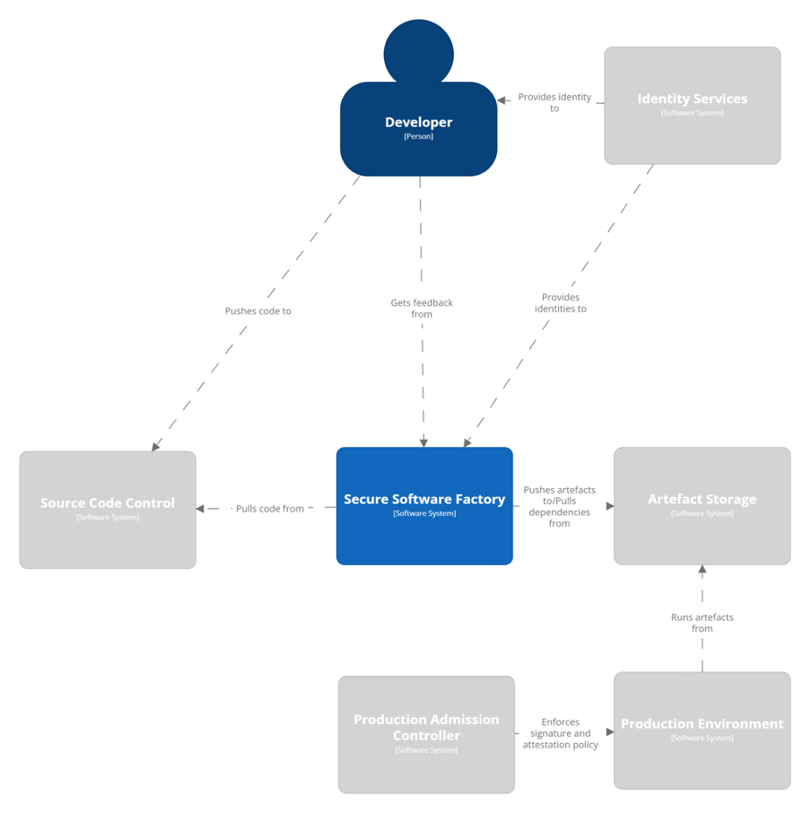
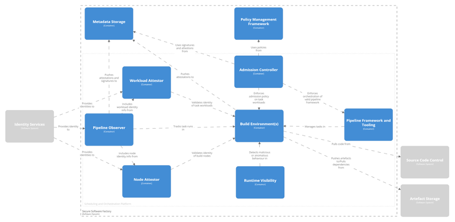
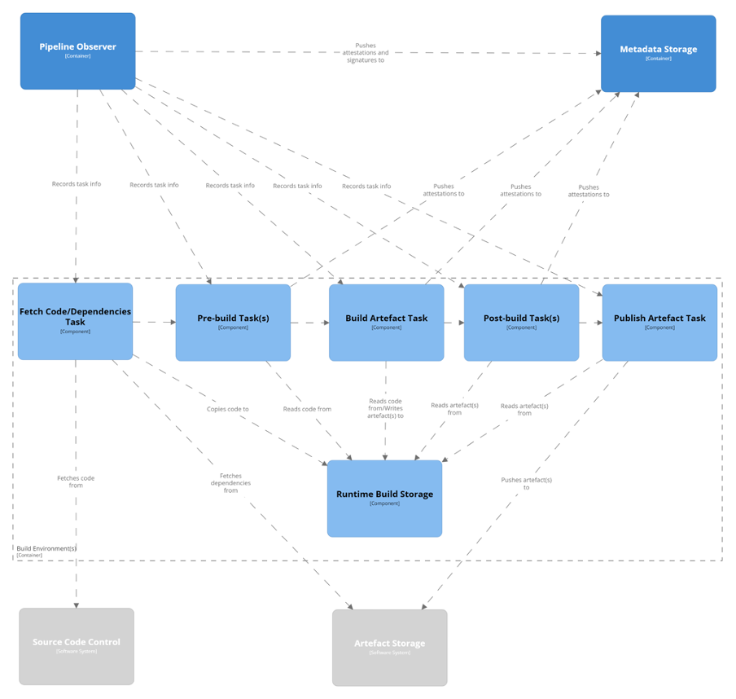
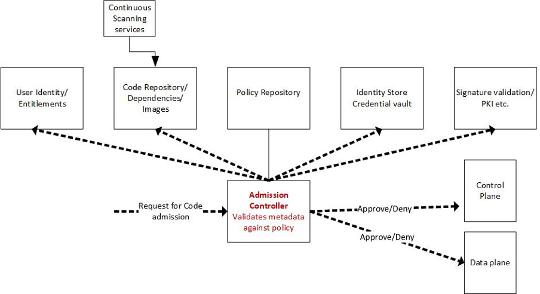
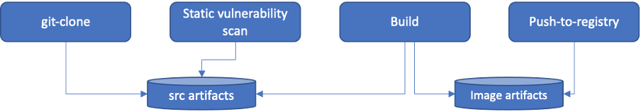

# Introduction 

A software supply chain is the series of steps performed when writing, testing, packaging, and distributing application software to end consumers. Given the increased prominence of software supply chain exploits and attacks, the [Cloud Native Computing Foundation (CNCF) Technical Advisory Group for Security](https://github.com/cncf/tag-security) published a whitepaper titled [“Software Supply Chain Best Practices”](https://github.com/cncf/tag-security/blob/main/supply-chain-security/supply-chain-security-paper/CNCF_SSCP_v1.pdf), which captures over 50 recommended practices to securing the software supply chain. That document is considered a prerequisite for the content described in this reference architecture.

This publication is a follow-up to that paper, targeted at system architects, developers, operators, and engineers in the areas of software development, security and compliance. This reference architecture adopts the “Software Factory” model[^1] for designing a secure software supply chain.

This reference architecture and accompanying prototype have been produced after a thorough evaluation of available tooling as of early 2022. The components selected  are open source, cloud native, and prioritise security. 

## Problem Scope: Software Supply Chain Security

The practices that the “Software Supply Chain Best Practices” whitepaper captures are predicated on four overarching principles: 

* Defence in depth (Layered end-to-end security controls)
* Signing and Verification 
* Artefact Metadata Analytics 
* Automation 

Those four principles are in turn applied and organised around five functional areas deemed as the entities in a software factory: 

When thinking about how to secure those entities, there are two broad ways of organising security controls:

1. Around three critical concerns:
    1. **Provenance verification**: assurance that existing evidence assumptions of where and how an artefact originates from are true and that the artefact or its accompanying metadata have not been tampered with during the build or delivery processes. 
    2. **Trustworthiness**: assurance that a given artefact and its contents can be trusted to do what it is purported to do (ie, is suitable for a purpose). This involves judgement on whether the code is safe to execute and making an informed decision about accepting the risk that executing the code presents. 
    3. **Dependencies**: recursive checking of an artefact’s dependency tree for trustworthiness and provenance of the artefacts it uses.
2. By stages of activity (see diagram):
    4. **Pre-Build**: principally concerned with development and handling of the source code and with the collection and storage of dependencies.
    5. **Build**: the process of building, testing, and packaging an artefact according to its build specifications.
    6. **Post-Build**: principally concerned with the storage, delivery, deployment, continuous verification~~.~~

In the matrix below, we attempt to overlay these entities, concerns, and activity stages with one another:

<table>
  <tr>
   <td><strong>Stages:</strong>
   </td>
   <td><strong>Pre-Build</strong>
   </td>
   <td><strong>Build</strong>
   </td>
   <td><strong>Post-Build</strong>
   </td>
  </tr>
  <tr>
   <td><strong>Entities:</strong>
   </td>
   <td>
<ul>

<li><strong>Source Code: </strong>Development and Handling

<li><strong>Materials: </strong>Selection, Collection, and Storage
</li>
</ul>
   </td>
   <td>
<ul>

<li><strong>Source Code and Dependencies: </strong>As Inputs

<li><strong>Build Pipelines: </strong>Components performing the build

<li><strong>Artefacts: </strong>As outputs
</li>
</ul>
   </td>
   <td>
<ul>

<li><strong>Artefacts: </strong>Storage and Verification

<li><strong>Deployments:</strong> Verification of artefacts
</li>
</ul>
   </td>
  </tr>
  <tr>
   <td><strong>Concerns:</strong>
   </td>
   <td>
<ul>

<li><strong>Provenance: </strong>Developer Contributions, Dependency Definitions

<li><strong>Trustworthiness: </strong>Developer Contributions

<li><strong>Dependencies:</strong> Dependency provenance and trustworthiness 
</li>
</ul>
   </td>
   <td>
<ul>

<li><strong>Provenance: </strong>Integrity of the build, collection of metadata and attestations, signing of artefacts
</li>
</ul>
   </td>
   <td>
<ul>

<li><strong>Provenance: </strong>Verification of Attested Metadata

<li><strong>Trustworthiness:</strong> Consumer judgement of artefact’s worth

<li><strong>Dependencies: </strong>Recursive analysis of both Provenance and Trustworthiness by consumers
</li>
</ul>
   </td>
  </tr>
</table>

This reference architecture focuses specifically on the critical concern of provenance and primarily on the activity stage of the “build.” There are numerous other publications and guides which address issues around trustworthiness, including practices like SAST/DAST scanning, code signing, etc, including the [CNCF Software Supply Chain Best Practices Paper](https://github.com/cncf/tag-security/blob/main/supply-chain-security/supply-chain-security-paper/CNCF_SSCP_v1.pdf). We direct readers to these documents for more information on those facets of supply chain security.

Our decision to emphasize provenance and the build pipeline in this paper is based on the foundational role provenance verification plays in other supply chain security concerns. Provenance provides the evidence, for example, that SAST/DAST scanning was completed as claimed. If you are relying on the results of SAST/DAST scans of a software artefact to inform your decision on its trustworthiness, you need to know that those claims are accurate. Provenance provides that assurance. It also provides assurance that an artefact which claims to be the product of a specific codebase and a specific build process is in fact the product it claims to be or that the artefact downloaded from a remote source is the same one you expected to receive. All of these claims are foundational to being able to make informed decisions about an artefact's trustworthiness: you must be able to trust the evidence presented about an artefact’s trustworthiness is valid evidence before you can trust the claims that evidence makes about the artefact.

## How to read this document

This paper offers a  high level treatment of a secure software factory. This is designed to explain the necessary interfaces and control structures for each component of a software factory to generate verifiable provenance. Throughout the document, we make reference to specific recommended tools, listed in Appendix B. These tools reflect our reference implementation/prototype, which can be found at [https://github.com/thesecuresoftwarefactory/ssf](https://github.com/thesecuresoftwarefactory/ssf). While these tools are what the writers and designers of this reference architecture have chosen to recommend, the intention of this architecture is to be adaptable to other tools. The theoretical treatment in this architecture should provide guidance on what features and/or configurations are required to substitute your own tool choices.

As the tools we recommend are all under active development, the reader must keep in mind that these details are valid only as of the time of publication, MM/YYYY. We provide versioning information for your reference. Upon implementation, consult the official documentation for each tool for the appropriate version to make use of.

### A Word About the Prototype

The CNCF Security TAG supply chain working group is working on a prototype of the architecture as presented in this document. This prototype acts as a proof of concept to help illustrate the architecture put forward and to exercise the several integration points of the secure software factory.

The source can be found here: [https://github.com/thesecuresoftwarefactory/](https://github.com/thesecuresoftwarefactory/ssf)

# The Secure Software Factory 

_“Architects look at thousands of buildings during their training, and study critiques of those buildings written by masters. In contrast, most software developers only ever get to know a handful of large programs well—usually programs they wrote themselves—and never study the great programs of history. As a result, they repeat one another's mistakes rather than building on one another's successes.” _- The Architecture of Open Source Applications

The subsequent sections detail how a Secure Software Factory ought to be structured and how its different parts interact.

### Key Diagrams

### Secure Software Factory Landscape

The Secure Software Factory sits in a larger System Delivery Lifecycle process. Within that process, the SSF has both upstream and downstream dependencies. Upstream, the SSF depends on Identity and Access Management for both human users and other software services. During a pipeline run the SSF relies on Source Code Control for fetching the code to be built and on Artefact Storage for dependencies required for the build. Downstream, the SSF is depended on for providing attestations and signatures regarding artefacts which can be used by production systems to determine artefact provenance and make policy decisions about artefact deployment.

### Secure Software Factory Components/Elements

The above diagram shows how the various services running inside of the Secure Software Factory interact with each other, and a portion of the external services they depend on. The diagram is simplified, and doesn’t show every interaction between each tool. For example, in a real environment, Runtime Visibility monitors more than just the Build Environment. The remainder of this document illustrates how the services interact and function in further detail. 

### Pipeline Run Example

This diagram is intended to show an example Pipeline Run inside the SSF. Some tasks might interact with other external services outside the scope of the SSF. The exact number of tasks depends on the requirements of your project.

There are a few important takeaways from the above diagram.

* The Pipeline Observer records what Tasks occur in what order.
* The Tasks interact with some type of Runtime Build Storage during normal operation. The storage in some cases might be shared between tasks, while in other cases it might not. Other areas of this architecture document go into further detail on shared storage.

Not every task will provide attestation or additional metadata, but those that do support this capability should be signed and securely stored in a source of truth.

## Components of the SSF

The SSF that manufactures secure software can be broken down into several categories of components, like that of a regular factory. These are the core components, the management components and the distribution components. The core components are responsible for the central task of the Secure Software Factory: taking the inputs of the factory and processing them to create the output artefacts. The management components ensure that the factory runs in accordance with policy. It ensures that the processes of the factory are validated in the right way, and provides evidence and documentation of the outputs of the factory. The distribution components are in charge of moving the products of the factory to where they can be made available for usage, as well as to provide guidance and tools to ensure that outputs of the factory are consumed safely.

### The “Core” Components

The core components can further be classified into 3 stages: the Scheduling and Orchestration Platform, which runs all the other components, the Pipeline Framework, which details the basic layout of the build pipeline, and the Build Environments, which perform the actions defined in the pipeline.

#### Scheduling and Orchestration Platform

A Secure Software Factory seeks to run its components in the most minimal and isolated way possible. All other components of the SSF leverage this platform to schedule their jobs to perform their respective actions. The prototype relies on Kubernetes as its Scheduling and Orchestration platform. 

See &lt;kubernetes hardening guide> for best security practises for Kubernetes. Follow similar guides for a different scheduling and orchestration platform.

#### Pipeline Framework and Tooling

Pipelines are a core part of the SSF as they encode the concrete workflow for building  the software artefacts. This typically follows a Continuous Integration (CI) workflow, i.e. repeatable sets of tasks intended to download, build, and test code. In a cloud native context, the pipeline tooling can use the scheduling and orchestration platform to run each task in a container. For the prototype, we are using Tekton Pipelines to fill this role, which leverages Kubernetes as its scheduling platform

Given that the pipeline is running on the scheduling and orchestration platform, it should be considered/treated as any other workload the platform manages, including being subject to the same security requirements and measures. At minimum, all container images used in the pipeline should be subject to signature verification and scanned for any known vulnerabilities. 

#### Build Environments

The build environment is the actual container(s) or worker(s) where the source code is turned into a machine-usable software product, which we refer to as an artefact. Existing CI frameworks typically follow ephemeral execution patterns, wherein they create a new instance for every execution job. This pattern may even be extended to create a new instance of the scheduling platform to host every new build pipeline. The build environment should generate evidence and an automated attestation about the input parameters, actions and tools used during the build, such that they can be independently validated to provide assurance for build security. 

### The “Management” Components

A SSF will use a Policy Management Framework to enforce various controls and gates. This may include policies around identities of users who may invoke the pipeline, worker nodes where pipeline should be executed and container images that can be used in the pipeline. It will then utilise a series of monitoring components to verify conformity with these policies: Node Attestors, Workload Attestors, and Pipeline Observers.

#### Policy Management Framework

A SSF needs policies that define the actors for each step in the build process. For example, a policy might define the actor (human or otherwise) authorized to sign metadata for a particular task. These policies are important at the time of verification within, for example, an admission controller, where they are used to validate that the right actors performed the respective tasks.

Policies should follow cloud native and supply chain security best practises: &lt;insert best practises docs>

For more information on Policy Management see: [https://github.com/kubernetes/sig-security/blob/main/sig-security-docs/papers/policy/CNCF_Kubernetes_Policy_Management_WhitePaper_v1.pdf](https://github.com/kubernetes/sig-security/blob/main/sig-security-docs/papers/policy/CNCF_Kubernetes_Policy_Management_WhitePaper_v1.pdf)

#### Attestors and Observers

There are three basic components of the SSF which monitor or attest to policy adherence:

* Node Attestors, which certify the identity of nodes
* Workload Attestors, which certify the identity of workload processes
* Pipeline Observers, which capture the verifiable metadata from pipeline processes.

Node attestors and workload attestors work in conjunction to ensure the node selected for running the work is authorised to host that workload and it is not compromised. Pipeline observers then build upon this evidence by generating additional metadata about individual tasks executed in the pipeline to provide comprehensive assurance across the build process. This synthesis allows later steps to validate that previous steps were completed as expected and a level of guarantee around the provenance and legitimacy of the final artefacts from the SSF.

All metadata from Node Attestors, Workload Attestors and the Pipeline Observer should be signed and included as part of the metadata documents output from the SSF.

### The “Distribution” Components

Upon completion of a pipeline run, the SSF outputs several artefacts. Artefacts must be available to downstream consumers and securely stored. Signatures for artefacts should also be stored such that they can easily be found and verified. These signatures can be stored alongside the artefact for convenient discoverability and distribution or in a separate location. 

#### Artefact Repository

The Artefact Repository stores artefacts the SSF outputs. This repository should be accessible from both the build and deploy environments. The stored artefacts may include container images, Helm charts, SBoMs, and their corresponding signatures. In some cases, the artefact repository can also serve as the storage location for metadata, such as SBoMs, attestations, and signatures. In other cases, users may prefer to store these items separately or in multiple locations.

#### Admission Controller

An Admission Controller in the SSF limits what artefacts can be deployed on a Scheduling and Orchestration Platform. “Admission control”, in a general sense, is the act of enforcing policies around the consumption of components in a system.

In the SSF, there are multiple levels at which admission control must occur:

* **Enforcing policies on the sources and packages pulled into a build**, including “intermediate artefacts” passed between steps in the build pipeline. For example, evaluating whether these objects have been properly signed or came from a known and trusted party.
* **Enforcing policies around the components of the factory itself.** The scheduling and orchestration platform should perform admission checks to ensure all such components are trusted and verifiable. 

**Enforcing policies on the build steps.** This typically includes verifying pipeline definitions and all the referenced images to be used during execution.  

In order of execution, admission control proceeds as follows:

1. When admitting the build request, the Admissions Controller validates that steps satisfy defined policies.
2. When steps that fetch dependencies are executed, the Admission Controller must enforce policies on the dependencies that are sourced into the environment (e.g. source, binary dependencies, base images).
3. When steps execute user-provided code, the Admission Controller uses a network jail to enforce an “admit nothing” policy because we do not trust that code to self-regulate.
4. When steps that publish artefacts are executed, they must produce attestations to satisfy the Admission Controllers that may be encountered downstream.

Outside of simple build execution, relevant areas to admission control include:

* The components that are “admitted” to the node host environments
* Policy enforcement on the build control plane (incl. admission control), which recurses (who watches the watchers?).

In addition to the above inputs, it is assumed that the following checks are being handled when deploying to production.

1. Security controls for admission controller itself (identity of the controller and validation)
2. Metadata inputs for different policies
3. Diff signatures or policies validation (interface with CA’s for validating certs), Notary services
4. Enforcement points
5. Interfaces with Signing services/notary service/signature validation services
6. Mutating the definition of workloads to include additional metadata
7. Outputs or error messages after enforcement/blocking admission
8. Signing check as a label that could be used by a workload attestor to grant access to signing keys.

Note: Artefact signatures should be verified against the associated public keys before deployment. Any generated provenance information should also be verified.

## The variables - Inputs and Outputs to and from the SSF

### Inputs

### Source Code

Source code encompasses the human readable representation of applications being built by the Secure Software Factory, associated dependencies being built from source or that are interpreted instead of compiled, code for the build pipelines (Pipeline-as-Code) and infrastructure (Infrastructure-as-Code). Source code is the primary input for the SSF. The users and operators of the SSF must decide  what programming languages they support, where to host source code, and what tools to integrate for testing and scanning. The SSF assumes that source code uses version control systems like Git, which have a preserved history, and that the repository has an appropriate regime for review and testing in place that is appropriate for the needs and use cases of the repository. For securing the source code see recommendations that can be found in the “Source Code” section of the _Software Supply Chain Best Practices_ paper.

#### Software Dependencies

Almost all software depends on other software which needs to be collected prior to building the target software. These dependencies should be validated against a security policy. It is recommended to pin to validate attestations or signatures of any dependencies if available. In addition it is recommended to pin to the checksum of upstream dependencies.

For both security and availability, it's recommended to maintain a local mirror of any external dependencies. This mirror may be limited to only dependencies that have passed a security scan or trusted source of truth. The mirror also prevents downtime if the upstream repository becomes unavailable.

More recommendations and specifics on securing dependencies can be found in the “Materials” section of the “Software Supply Chain Best Practices” paper.

#### User Credentials

User credentials are identifiers for both human users and services (e.g. automation agents), and can authenticate these actors at multiple points in the SSF and its supporting services. Credentials should meet baseline security requirements as defined in Software Supply Chain Best Practices.

#### Cryptographic Material

Cryptographic material input into the SSF fall into two categories:

1. Materials used for identification of a particular entity. 
2. Materials used for attestation/verification of a particular activity.

The first category includes certificates, tokens, and keys used for authenticating nodes, scheduling and orchestration platforms, workloads, services, and users. It might also include certificates corresponding with recognized Certificate Authorities and trust bundles for validating and cross-authenticating all of these materials.

The second category includes material such as signing keys deployed by users or services to attest to the work they have performed. Unlike traditional signing architectures, the modern software factory doesn’t directly use a single signing key. Multiple signing keys  have trust delegated to specific domain, processes/users/services.

All cryptographic material must conform and comply with standards for their type and purpose and are generated in a cryptographically secure manner. We assume that they are securely distributed to the necessary entities and are properly configured for use by those entities. The specific mechanisms for producing, signing, and distributing these certificates will be left to the user to implement. 

#### Pipeline Definitions

CI/CD pipelines define the steps in the application build process. The specific implementation of a pipeline will vary from organization to organization. However, all pipeline definitions should follow security best-practices that include:

1. **Persistence & Source Control:** Pipeline definitions should be defined as “code” (Pipeline-as-Code) in a declarative fashion, and as such, should meet all the security expectations for source code defined above. Additionally, pipeline definitions should be managed through a source control process (ie, git)  that limits changes to only authorized users following standard protocols (ie, submitting changes via a pull request) and code reviews which include at least one security engineer who is experienced in Continuous Integration (CI) security best practices along with the particular tools being used. Once your pipeline assembly is complete, make sure to persist all relevant artefacts. 
2. **Sign Pipeline Definitions: **Sign your pipeline definitions to ensure non-repudiation. During signing, sign pipeline specifications including all the images used for execution.
3. **Pipeline Audit: **Perform regular audits of your pipeline definitions to ensure the integrity of the pipeline is maintained.
4. **Static Scan: **Pipelines typically need access to various user credentials that are provided to the pipeline at runtime (e.g. git-token, OCI-registry-token, etc.). Make sure these credentials are not hard-coded in the definitions. In general, limit the use of hard-coded configurations in the definitions. 

### Outputs

#### Artefacts

A software artefact is the principal output of the Secure Software Factory. Artefacts may include binaries, software packages, container images, signatures, and attestations. They are what will be consumed by downstream users. Artefacts should be accompanied by the appropriate metadata to demonstrate their provenance (described below), stored in a secure artefact repository, and distributed through secured and well understood mechanisms. The exact nature of the artefact itself and the implementation of these requirements will vary depending on factors like language, package type, and target platform(s). Therefore, these implementation details are beyond the scope of the Secure Software Factory.

#### Public Signing Keys

In order to verify the signatures included in a software factory’s metadata, downstream consumers will need the public keys associated with those signatures.[^2] The root certificates may be included as an output from the SSF, but they should be distributed separately from the artefact and the metadata itself to allow additional verification of the certificate authenticity. Certificate chains linking the signing key to a root certificate should be included as an output from the SSF, and they should be distributed with the artefact being signed, allowing verifiers to validate a signature is trusted by an approved root certificate. As these keys should be identical to the cryptographic material used as an input to the pipeline, the security considerations already discussed for cryptographic material as inputs apply.

#### Metadata Documents

Throughout execution of the pipeline, a number of metadata documents are generated. Examples include test reports, vulnerability reports, and Software Bills of Material (SBOMs). These documents are a snapshot of the build that produced them. For example, a vulnerability report reflects CVEs known at the time of the build, but might become outdated as new vulnerabilities are discovered and shared. Similarly, an SBOM reflects what is in a particular build. It will always be valid for that build, but future builds with slightly different dependencies/version constraints must generate a new/updated SBOM. The following practices are recommended for managing metadata documents:

1. **Timestamp inclusion**: Always explicitly include a timestamp associated with the document.[^3] 

2. **Persistence**: Make sure when stored that documents are immutable, version controlled and signed.
3. **Metadata Links**: Link all metadata documents to the final deliverable artefact. For example, for a microservice application build pipeline, link the test, vulnerability, and SBOM record to the particular container image they are generated from.

## Secure Software Factory Functionality

This section goes through the primary actions that the SSF performs in normal operation. It describes how a project runs through the SSF and how the SSF helps secure the supply chain by establishing and tracing provenance through the build pipeline.

### All Stages: Attesting Identity of Nodes, Pipeline orchestration, Tasks and Workloads and Establishing Provenance

Actors:

* Scheduling and Orchestration Platform
* Pipeline
* Pipeline Observer
* Node Attestor
* Workload Attestor
* Metadata Storage

It is important to call out this sub-action as it happens in most other actions of the SSF. This is the key piece of the SSF in establishing and tracing provenance from source code to artefact of a given project. This provenance can then be used in conjunction with other tooling and auditing to better make claims on the veracity of software.

In general the following is how the action works though there might be a few caveats specified in the other actions:

Initial Setup:

1. Spin up a node
2. Node Attestor establishes identity of node.

Action Steps:

1. Pipeline or Pipeline task is triggered/orchestrated
2. Workload Attestor establishes identity of Pipeline or task
3. Pipeline Observer captures metadata for Pipeline or task.
    1. This includes inputs, timestamps, outputs, as well as other metadata
4. Pipeline Observer signs metadata with key or cert based on identity provided by Workload Attestor

### All Stages: Admissions Control for the SSF itself

Actors:

* Scheduling and Orchestration Platform
* Pipeline
* Pipeline Observer
* Node Attestor
* Workload Attestor
* Metadata Storage
* Admission Controller
* Artefact Storage

As noted in the discussion of the Admissions Controller above, both build workers (the containers performing pipeline steps) and intermediate artefacts (the outputs of previous steps passed along to the next steps in a build) should be verified before they are admitted into the SSF. This should be part of every stage in the pipeline. 

### Stage 1: Secure the data flow in the pipeline

As tasks execute inside a pipeline, they typically produce some new artefacts like an image, binary or evidence report. These artefacts are then consumed by subsequent tasks to perform their respective functions. Such sharing of artefacts between tasks normally achieved through shared storage resources. It is important to regulate access to these shared resources across tasks. 

To achieve this objective, avoid using a single storage workspace across all tasks in the pipeline. Create multiple storage workspaces that are exclusively shared between the tasks that need to communicate some data/results. For instance, for a simple pipeline shown below, avoid using a single shared storage for all tasks and use exclusive storage sharing. And when possible set access-policies (RW, RO) while mounting these storage in the tasks.

### Stage 2: Configuration of Pipeline

Actors:

* Developer
* Tech Lead
* Security Engineer
* Scheduling and Orchestration Platform
* Pipeline Platform

The primary component configured as part of normal operation of the SSF is the Pipeline. Both creation of a new Pipeline as well as modification of an existing Pipeline have similar modes of operation and so this section represents both.

The secure software factory expects that you store pipeline configuration as code and that the code is stored in a secure source code repository with adequate controls.See  both “Source Code” and “Pipeline Definitions” in the inputs section above for more information about the SSF’s expectations regarding both of these types of inputs. The goal of these controls is to make sure that the pipeline definition itself has trustworthy provenance. In a cloud native context, these components are often deployed as containers and treated as artefacts in their own right. Ensuring we have adequate provenance for those components increases our assurance about the provenance of the artefacts they build.

When configuring and designing the pipeline, there consider that: 

* Individual tasks and steps should have limited in scope and are well defined. sing templates and linting rules during the development of the pipeline itself aids this.
* Configuring the pipeline to respond automatically to well-defined triggers in the Software Development Life Cycle.

### Stage 3: Trigger Pipeline

Actors:

* Developer
* Scheduling and Orchestration Platform
* Pipeline Platform
* Pipeline Observer
* Node Attestor
* Workload Attestor
* Metadata Storage

The first step in the SSF is that something triggers a build. This can be a manual, event-driven, or timed trigger. Common triggers are web hooks and manual triggering through an API call or dashboard.

The SSF secures this by capturing and validating the inputs and other metadata like timestamps through the Pipeline Observer. This is then signed by a key or certificate provided by the Workload Attestor that is associated with the identity of the workload. The Workload Attestor then has its  identity attested to by the Node Attestor. This signed metadata is then pushed to Metadata Storage where it becomes a supply chain link that other parts of the SSF can link to and can later be used to validate and audit veracity of the artefact(s) built in the SSF.

### Stage 4: Ingest Source for Project

Actors:

* Scheduling and Orchestration Platform
* Pipeline Platform
* Pipeline Observer
* Node Attestor
* Workload Attestor
* Metadata Storage
* External Source Code Control

After a build is triggered, the next step is ingesting the code for the project. This is usually something like a call to a source code control system to pull down a specific commit. It then hands the code over to downstream pipeline tasks via shared storage for things like the build stage.

### Stage 5: Ingest Dependencies for Project

Actors:

* Scheduling and Orchestration Platform
* Pipeline Platform
* Pipeline Observer
* Node Attestor
* Workload Attestor
* Metadata Storage
* Internal/External dependency repos

After ingesting source code, the next step is to download the dependencies for the artefact you are building. This is a separate step from the ingestion of the source for a couple of reasons. In line with the build best practices in this document(reference here) and the CNCF Supply Chain Security whitepaper, the pipeline steps should be kept as minimal and atomic as possible. In the case of this step it allows you to download the source and sign it as a single atomic action. Then you can validate after downloading dependencies that the source code wasn’t changed by a compromised dependency install. Some package managers can run arbitrary execution actions on the system without adequate controls.

Once dependencies are installed on shared storage they are hashed and that metadata is signed and pushed to Metadata Storage.

### Stage 6: Run Build for Project

Actors:

* Scheduling and Orchestration Platform
* Pipeline Platform
* Pipeline Observer
* Node Attestor
* Workload Attestor
* Metadata Storage

This is arguably the most critical step of the Pipeline. This step is the one that performs common “build” actions to generate an artefact such as compilation, building an image, etc. The build is a common attack vector in supply chain attacks, therefore it is crucial to keep this step atomic, minimal and, most importantly, hermetic. When available you should strive for reproducible builds.

The build process performs code compilation or transformation (e.g. source code to byte code for compiled languages). Leverage pipeline observers to record the command, options and parameters used during compilation.

 

Given the need for the build to be hermetic the task running the build should have no network or most other external capabilities and have build parameters pushed at the task level. (Cite build best practice from white paper that explains that the more branching the logic of your build script has the harder it is to reason about what your build is doing.) The only external access the task should have is to shared storage containing the source and dependencies required.The build must write the artefact to new shared storage explicitly for the artefact

After the operation of the build the metadata associated with the build, e.g. input parameters, hash of produced artefact, etc. are signed and pushed to Metadata Storage.

### Stage 7: Publish Artefact

Actors:

* Scheduling and Orchestration Platform
* Pipeline Platform
* Pipeline Observer
* Node Attestor
* Workload Attestor
* Metadata Storage
* Artefact Storage

In the final build stage, compiled artefacts are packaged into appropriate distribution format (container image, rpm, tar.gz, etc.). As these new artefacts are produced, they should be signed. 

Signed artefacts are  published to an artefact store, external from the SSF. They are then hashed and signed along with any applicable metadata that can be pulled from the artefact. That signed metadata is then stored in Metadata Storage.

# 

# Appendix A: Inputs and Outputs Summary

## Inputs

<table>
  <tr>
   <td><strong>Inputs of the SSF</strong>
   </td>
   <td><strong>Assumptions/Recommendations About those Inputs</strong>
   </td>
   <td><strong>What We’re Not Specifying in this Version</strong>
   </td>
  </tr>
  <tr>
   <td>Source Code
   </td>
   <td>
<ul>

<li>Version controlled with stored history

<li>Commits are signed

<li>History cannot be overwritten (no force merges)

<li>Has an appropriate testing and code review regime in place
</li>
</ul>
   </td>
   <td>
<ul>

<li>Where code is hosted

<li>Specific test types or tooling to use
</li>
</ul>
   </td>
  </tr>
  <tr>
   <td>Dependencies
   </td>
   <td>
<ul>

<li>Defined with version and immutable reference (e.g. hash) constraints

<li>(ideally) something approximating an SBOM and/or source of provenance

<li>Have appropriate update and review procedures in place
</li>
</ul>
   </td>
   <td>
<ul>

<li>Format of SBOM/Provenance for dependencies

<li>Types of testing to perform on dependencies

<li>Source repositories allowed for dependencies 
</li>
</ul>
   </td>
  </tr>
  <tr>
   <td>User Credentials
   </td>
   <td>
<ul>

<li>Users use MFA

<li>Users use SSH or PATs for repository access

<li>Users have signing certificates
</li>
</ul>
   </td>
   <td>
<ul>

<li>User roles/permissions

<li>Key/Certificate Rotation Policy

<li>How users are authenticated
</li>
</ul>
   </td>
  </tr>
  <tr>
   <td>Machine/Workload Credentials 
   </td>
   <td>
<ul>

<li>Automatically rotated short-lived credentials to identity application services
</li>
</ul>
   </td>
   <td>
   </td>
  </tr>
  <tr>
   <td>Signing keys
   </td>
   <td>
<ul>

<li>Meet or exceed current NIST guidelines for the type of key/certificate with regards to length, randomness, etc.
</li>
</ul>
   </td>
   <td>
<ul>

<li>How keys/certificates are generated and by whom?

<li>How keys/certificates are distributed and by whom?
</li>
</ul>
   </td>
  </tr>
  <tr>
   <td>Pipeline Definitions
   </td>
   <td>
<ul>

<li>Maintained as Infrastructure-as-Code/Pipeline-as-Code meeting all the above specs for Source Code, Dependencies, User Credentials, etc.

<li>Builds task definitions
</li>
</ul>
   </td>
   <td>
   </td>
  </tr>
  <tr>
   <td>Build Images
   </td>
   <td>
<ul>

<li>Either bootstrapped or created by the SSF

<li>Signatures are verified by the SSF Admission Controller
</li>
</ul>
   </td>
   <td>
   </td>
  </tr>
</table>

## Outputs

<table>
  <tr>
   <td><strong>Ouputs of the SSF</strong>
   </td>
   <td><strong>Assumptions/Reccomendations About those Inputs</strong>
   </td>
   <td><strong>What We’re Not Specifying in this Version</strong>
   </td>
  </tr>
  <tr>
   <td>Artefacts

(Requires addition)
   </td>
   <td>
<ul>

<li>Includes signed and validated metadata in an appropriate storage mechanism
</li>
</ul>
   </td>
   <td>
<ul>

<li>What storage mechanism to use (unless we find there are really good reasons to recommend one)
</li>
</ul>
   </td>
  </tr>
  <tr>
   <td>Public Signing Keys
   </td>
   <td>
<ul>

<li>Meet or exceed current NIST guidelines for the type of key/certificate with regards to length, randomness, etc.
</li>
</ul>
   </td>
   <td>
<ul>

<li>How keys/certificates are generated and by whom?

<li>How keys/certificates are distributed and by whom?
</li>
</ul>
   </td>
  </tr>
  <tr>
   <td>Metadata Documents

(Requires addition)
   </td>
   <td>
   </td>
   <td>
   </td>
  </tr>
  <tr>
   <td>Metadata Chain

(Requires addition)
   </td>
   <td>
   </td>
   <td>
   </td>
  </tr>
</table>

## 

# Appendix B: Mapping of entities to projects/technologies

In accordance with CNCF guidelines, we prioritize our recommendations as follows: first, CNCF tools when they fit the need and are of sufficient maturity; second, well known and mature open source tools; and finally, in the absence of either CNCF or open source options, commercial offerings. In the event that we name commercial offerings, the reader should understand that this does not reflect an endorsement by CNCF. Instead, these offerings should be taken merely as an example and point of reference so that you can see potential paths for real world implementation.

<table>
  <tr>
   <td><strong>Secure Supply Chain Rec Arc Requirement</strong>
   </td>
   <td><strong>Reference Architecture Component</strong>
   </td>
   <td><strong>Alternate Component(s)</strong>
   </td>
  </tr>
  <tr>
   <td colspan="3" ><strong>Components</strong>
   </td>
  </tr>
  <tr>
   <td>Scheduling and orchestration platform (CRDs + Controllers)
   </td>
   <td>Kubernetes
   </td>
   <td>Nomad, Your own orchestrator
   </td>
  </tr>
  <tr>
   <td>Pipeline Framework And Tooling
   </td>
   <td>Tekton Pipelines
   </td>
   <td>
   </td>
  </tr>
  <tr>
   <td>Policy Management Framework
   </td>
   <td>In-toto (and other?) policies distributed via TUF
   </td>
   <td>
   </td>
  </tr>
  <tr>
   <td>Identity Attestation for nodes and workloads
   </td>
   <td>SPIRE
   </td>
   <td>
   </td>
  </tr>
  <tr>
   <td>Pipeline Observer
   </td>
   <td>Tekton Chains + in-toto
   </td>
   <td>In-toto + Custom Code?
   </td>
  </tr>
  <tr>
   <td>Metadata Storage
   </td>
   <td>OCI registry, Rekor, Docdn
   </td>
   <td>Grafeas
   </td>
  </tr>
  <tr>
   <td>Admission Controller
   </td>
   <td>OPA/Gatekeeper
   </td>
   <td>Kyverno (for some pieces)
   </td>
  </tr>
  <tr>
   <td>Runtime Visibility
   </td>
   <td>Falco
   </td>
   <td>Tracee, openbpf tools (misc)
   </td>
  </tr>
</table>

# Appendix C: Best practices x Reference Architecture

<table>
  <tr>
   <td><strong>Stage</strong>
   </td>
   <td><strong>Practice</strong>
   </td>
   <td><strong>Categories</strong>
   </td>
   <td><strong>Reference Architecture</strong>
   </td>
  </tr>
  <tr>
   <td><strong>Securing the Source Code</strong>
   </td>
   <td>Verification: Require signed commits
   </td>
   <td><strong>Assurance</strong>: Moderate to high

<strong>Risk</strong>: Moderate to high
   </td>
   <td>
   </td>
  </tr>
  <tr>
   <td>
   </td>
   <td>Verification: Enforce full attestation and verification for protected branches
   </td>
   <td><strong>Assurance</strong>: High

<strong>Risk</strong>: High
   </td>
   <td>
   </td>
  </tr>
  <tr>
   <td>
   </td>
   <td>Automation: Prevent committing secrets to the source code repository
   </td>
   <td><strong>Assurance</strong>: Moderate to high

<strong>Risk</strong>: Moderate to high
   </td>
   <td>
   </td>
  </tr>
  <tr>
   <td>
   </td>
   <td>Automation: Define individuals/teams that are responsible for code in a repository

and associated coding conventions
   </td>
   <td><strong>Assurance</strong>: High

<strong>Risk</strong>: High
   </td>
   <td>
   </td>
  </tr>
  <tr>
   <td>
   </td>
   <td>Automation:Automate software security scanning and testing
   </td>
   <td><strong>Assurance</strong>: Moderate to high

<strong>Risk</strong>: Moderate to high
   </td>
   <td>
   </td>
  </tr>
  <tr>
   <td>
   </td>
   <td>Controlled Environments: Establish and adhere to contribution policies
   </td>
   <td><strong>Assurance</strong>: Moderate to high

<strong>Risk</strong>: Moderate to high
   </td>
   <td>
   </td>
  </tr>
  <tr>
   <td>
   </td>
   <td>Controlled Environments: Define roles aligned to functional responsibilities
   </td>
   <td><strong>Assurance</strong>: Moderate to high

<strong>Risk</strong>: Moderate to high
   </td>
   <td>
   </td>
  </tr>
  <tr>
   <td>
   </td>
   <td>Controlled Environments: Enforce an independent four-eyes principle
   </td>
   <td><strong>Assurance</strong>: Moderate to high

<strong>Risk</strong>: Moderate to high
   </td>
   <td>
   </td>
  </tr>
  <tr>
   <td>
   </td>
   <td>Controlled Environments: Use branch protection rules
   </td>
   <td><strong>Assurance</strong>: Moderate to high

<strong>Risk</strong>: Moderate to high
   </td>
   <td>
   </td>
  </tr>
  <tr>
   <td>
   </td>
   <td>Secure Authentication: Enforce MFA for accessing source code repositories
   </td>
   <td><strong>Assurance</strong>: Moderate to high

<strong>Risk</strong>: Moderate to high
   </td>
   <td>
   </td>
  </tr>
  <tr>
   <td>
   </td>
   <td>Secure Authentication: Use SSH keys to provide developers access to source code repositories
   </td>
   <td><strong>Assurance</strong>: Moderate to high

<strong>Risk</strong>: Moderate to high
   </td>
   <td>
   </td>
  </tr>
  <tr>
   <td>
   </td>
   <td>Secure Authentication: Have a Key Rotation Policy
   </td>
   <td><strong>Assurance</strong>: Moderate to high

<strong>Risk</strong>: Moderate to high
   </td>
   <td>
   </td>
  </tr>
  <tr>
   <td>
   </td>
   <td>Secure Authentication: Use short-lived/ephemeral credentials for machine/service access
   </td>
   <td><strong>Assurance</strong>: Moderate to high

<strong>Risk</strong>: Moderate to high
   </td>
   <td>
   </td>
  </tr>
  <tr>
   <td><strong>Securing the Materials</strong>
   </td>
   <td>Verification:

Verify third party artefacts and open source libraries
   </td>
   <td><strong>Assurance</strong>: Moderate to high

<strong>Risk</strong>: Moderate to high
   </td>
   <td>
   </td>
  </tr>
  <tr>
   <td>
   </td>
   <td>Verification:Require SBOM from third party supplier
   </td>
   <td><strong>Assurance</strong>: Moderate to high

<strong>Risk</strong>: High
   </td>
   <td>
   </td>
  </tr>
  <tr>
   <td>
   </td>
   <td>Verification: Track dependencies between open source components
   </td>
   <td><strong>Assurance</strong>: Moderate to high

<strong>Risk</strong>: Moderate to high
   </td>
   <td>
   </td>
  </tr>
  <tr>
   <td>
   </td>
   <td>Verification: Build libraries based upon source code
   </td>
   <td><strong>Assurance</strong>: High

<strong>Risk</strong>: High
   </td>
   <td>
   </td>
  </tr>
  <tr>
   <td>
   </td>
   <td>Verification: Define and prioritize trusted package managers and repositories
   </td>
   <td><strong>Assurance</strong>: High

<strong>Risk</strong>: High
   </td>
   <td>
   </td>
  </tr>
  <tr>
   <td>
   </td>
   <td>Verification: Generate an immutable SBOM of the code
   </td>
   <td><strong>Assurance</strong>: Moderate to high

<strong>Risk</strong>: Moderate to high
   </td>
   <td>
   </td>
  </tr>
  <tr>
   <td>
   </td>
   <td>Automation:

Scan software for vulnerabilities
   </td>
   <td><strong>Assurance</strong>: Moderate to high

<strong>Risk</strong>: Moderate to high
   </td>
   <td>
   </td>
  </tr>
  <tr>
   <td>
   </td>
   <td>Automation: Scan software for license implications
   </td>
   <td><strong>Assurance</strong>: Moderate to high

<strong>Risk</strong>: Moderate to high
   </td>
   <td>
   </td>
  </tr>
  <tr>
   <td>
   </td>
   <td>Automation: Run software composition analysis on ingested software
   </td>
   <td><strong>Assurance</strong>: Moderate to high

<strong>Risk</strong>: Moderate to high
   </td>
   <td>
   </td>
  </tr>
  <tr>
   <td><strong>Securing the Build Pipelines</strong>
   </td>
   <td>Verification: Cryptographically guarantee policy adherence
   </td>
   <td><strong>Assurance</strong>: High

<strong>Risk</strong>: High
   </td>
   <td>
   </td>
  </tr>
  <tr>
   <td>
   </td>
   <td>Verification: Validate environments and dependencies before usage
   </td>
   <td><strong>Assurance</strong>: Moderate to high

<strong>Risk</strong>: Moderate to high
   </td>
   <td>
   </td>
  </tr>
  <tr>
   <td>
   </td>
   <td>Verification: Validate runtime security of build workers
   </td>
   <td><strong>Assurance</strong>: Moderate to high

<strong>Risk</strong>: Moderate to high
   </td>
   <td>
   </td>
  </tr>
  <tr>
   <td>
   </td>
   <td>Verification: Validate Build artefacts through verifiably reproducible builds
   </td>
   <td><strong>Assurance</strong>: High

<strong>Risk</strong>: High
   </td>
   <td>
   </td>
  </tr>
  <tr>
   <td>
   </td>
   <td>Reproducible Builds: Lock and Verify External Requirements From The Build Process
   </td>
   <td><strong>Assurance</strong>: Moderate to high

<strong>Risk</strong>: Moderate to high
   </td>
   <td>
   </td>
  </tr>
  <tr>
   <td>
   </td>
   <td>Reproducible Builds: Find and Eliminate Sources Of Non-Determinism
   </td>
   <td><strong>Assurance</strong>: Moderate to high

<strong>Risk</strong>: Moderate to high
   </td>
   <td>
   </td>
  </tr>
  <tr>
   <td>
   </td>
   <td>Reproducible Builds:.Record The Build Environment
   </td>
   <td><strong>Assurance</strong>: High

<strong>Risk</strong>: High
   </td>
   <td>
   </td>
  </tr>
  <tr>
   <td>
   </td>
   <td>Reproducible Builds:Automate Creation Of The Build Environment
   </td>
   <td><strong>Assurance</strong>: High

<strong>Risk</strong>: High
   </td>
   <td>
   </td>
  </tr>
  <tr>
   <td>
   </td>
   <td>Reproducible Builds: Distribute Builds Across Different Infrastructure
   </td>
   <td><strong>Assurance</strong>: High

<strong>Risk</strong>: High
   </td>
   <td>
   </td>
  </tr>
  <tr>
   <td>
   </td>
   <td>Automation: Build and related continuous integration/continuous delivery steps

should all be automated through a pipeline defined as code
   </td>
   <td><strong>Assurance</strong>: Moderate to high

<strong>Risk</strong>: Moderate to high
   </td>
   <td>
   </td>
  </tr>
  <tr>
   <td>
   </td>
   <td>Automation: Standardize pipelines across projects
   </td>
   <td><strong>Assurance</strong>: Moderate to high

<strong>Risk</strong>: Moderate to high
   </td>
   <td>
   </td>
  </tr>
  <tr>
   <td>
   </td>
   <td>Automation: Provision a secured orchestration platform to host software factory
   </td>
   <td><strong>Assurance</strong>: Moderate to high

<strong>Risk</strong>: Moderate to high
   </td>
   <td>
   </td>
  </tr>
  <tr>
   <td>
   </td>
   <td>Automation: Build Workers Should be Single Use
   </td>
   <td><strong>Assurance</strong>: High

<strong>Risk</strong>: Moderate
   </td>
   <td>
   </td>
  </tr>
  <tr>
   <td>
   </td>
   <td>Controlled Environments: Ensure Software Factory has minimal network connectivity 
   </td>
   <td><strong>Assurance</strong>: High

<strong>Risk</strong>: High
   </td>
   <td>
   </td>
  </tr>
  <tr>
   <td>
   </td>
   <td>Controlled Environments: Segregate the Duties of Each Build Worker
   </td>
   <td><strong>Assurance</strong>: High

<strong>Risk</strong>: High
   </td>
   <td>
   </td>
  </tr>
  <tr>
   <td>
   </td>
   <td>Controlled Environments: Pass in Build Worker Environment and Commands
   </td>
   <td><strong>Assurance</strong>: High

<strong>Risk</strong>: High
   </td>
   <td>
   </td>
  </tr>
  <tr>
   <td>
   </td>
   <td>Controlled Environments: Write Output to a Separate Secured Storage Repo 
   </td>
   <td><strong>Assurance</strong>: High

<strong>Risk</strong>: High
   </td>
   <td>
   </td>
  </tr>
  <tr>
   <td>
   </td>
   <td>Secure Authentication/Access:

Only allow pipeline modifications through “pipeline as code”
   </td>
   <td><strong>Assurance</strong>: Moderate to high

<strong>Risk</strong>: Moderate to high
   </td>
   <td>
   </td>
  </tr>
  <tr>
   <td>
   </td>
   <td>Secure Authentication/Access: Define user roles
   </td>
   <td><strong>Assurance</strong>: Moderate to high

<strong>Risk</strong>: Moderate to high
   </td>
   <td>
   </td>
  </tr>
  <tr>
   <td>
   </td>
   <td>Secure Authentication/Access: Follow established practices for establishing a root of trust from

an offline source
   </td>
   <td><strong>Assurance</strong>: High

<strong>Risk</strong>: High
   </td>
   <td>
   </td>
  </tr>
  <tr>
   <td>
   </td>
   <td>Secure Authentication/Access: Use short-lived Workload Certificates
   </td>
   <td><strong>Assurance</strong>: High

<strong>Risk</strong>: High
   </td>
   <td>
   </td>
  </tr>
  <tr>
   <td><strong>Securing the Artefacts</strong>
   </td>
   <td>Verification:

Sign Every Step in the Build Process
   </td>
   <td><strong>Assurance</strong>: Moderate to high

<strong>Risk</strong>: Moderate to high
   </td>
   <td>
   </td>
  </tr>
  <tr>
   <td>
   </td>
   <td>Verification:Validate the Signatures Generated at Each Step
   </td>
   <td><strong>Assurance</strong>: Moderate to high

<strong>Risk</strong>: Moderate to high
   </td>
   <td>
   </td>
  </tr>
  <tr>
   <td>
   </td>
   <td>Automation:

Use TUF/Notary to manage signing of artefacts
   </td>
   <td><strong>Assurance</strong>: Moderate to high

<strong>Risk</strong>: Moderate to high
   </td>
   <td>
   </td>
  </tr>
  <tr>
   <td>
   </td>
   <td>Automation: Use a store to manage metadata from in-toto
   </td>
   <td><strong>Assurance</strong>: Moderate to high

<strong>Risk</strong>: Moderate to high
   </td>
   <td>
   </td>
  </tr>
  <tr>
   <td>
   </td>
   <td>Controlled Environments:

Limit which artefacts any given party is authorized to certify
   </td>
   <td><strong>Assurance</strong>: High

<strong>Risk</strong>: High
   </td>
   <td>
   </td>
  </tr>
  <tr>
   <td>
   </td>
   <td>Controlled Environments:Build in a system for rotating and revoking private keys
   </td>
   <td><strong>Assurance</strong>: High

<strong>Risk</strong>: High
   </td>
   <td>
   </td>
  </tr>
  <tr>
   <td>
   </td>
   <td>Controlled Environments: Use a container registry that supports OCI image-spec images 
   </td>
   <td><strong>Assurance</strong>: High

<strong>Risk</strong>: High
   </td>
   <td>
   </td>
  </tr>
  <tr>
   <td>
   </td>
   <td>Encryption:

Encrypt artefacts before distribution & ensure only authorized platforms

have decryption capabilities
   </td>
   <td><strong>Assurance</strong>: High

<strong>Risk</strong>: High
   </td>
   <td>
   </td>
  </tr>
  <tr>
   <td><strong>Securing Deployments</strong>
   </td>
   <td>Verification:

Ensure clients can perform Verification of Artefacts and

associated metadata
   </td>
   <td><strong>Assurance</strong>: Moderate to high

<strong>Risk</strong>: Moderate to high
   </td>
   <td>
   </td>
  </tr>
  <tr>
   <td>
   </td>
   <td>Verification: Ensure clients can verify the “freshness” of files
   </td>
   <td><strong>Assurance</strong>: Moderate to high

<strong>Risk</strong>: Moderate to high
   </td>
   <td>
   </td>
  </tr>
  <tr>
   <td>
   </td>
   <td>Automation: Use The Update Framework
   </td>
   <td><strong>Assurance</strong>: High

<strong>Risk</strong>: High
   </td>
   <td>
   </td>
  </tr>
</table>

# Authors

Aditya Sirish A Yelgundhalli (NYU)

Alexander Floyd Marshall (Raft)

Andres Vega (VMware)

Aradhna Chetal (TIAA)

Axel Simon (Red Hat)

Brandon Lum (Google)

Brandon Mitchell (IBM)

Cole Kennedy (TestifySec)

Dan Papandrea (Sysdig)

Glaicimar Aguiar (Hewlett Packard Enterprise)

Jason Hall (Red Hat)

John Kjell (VMware)

Marina Moore (NYU)

Matt Moore (Chainguard)

Michael Lieberman (Citi)

Priya Wadhwa (Chainguard)

Shripad Nadgowda (IBM T.J. Watson Research Center)

# Acknowledgements

The Cloud Native Computing Foundation supported the creation of this reference architecture. As with the “Best Practices for Supply Chain Security”, the authors followed a “collaborative knowledge production” methodology. This effort took place over the span of five months of weekly online meetings. The majority of authors are members of the CNCF Technical Advisory Group for Security, which you can join. Go to the TAG repository site. 

This was a remarkable collaboration between large technology companies and startups. 

The coordination and facilitation was provided by Andres Vega (VMware),  Brandon Lum (Google), Dan “Pop” Papandrea (Sysdig) and Michael Liebermann (Citi).

We’d also like to thank a number of contributors from whom we had excellent input and feedback and as leading practitioners in the field did much of the work that we write about in this document:

Aeva Black

Allan Friedman

Andrew Block

Dan Lorenc

David Wheeler

Ed Warnicke

Emily Fox

Frederick Kautz

Jacques Chester

Jonathan Meadows

Remy Greinhofer

Tiffany Jordan

# References:

<!-- Footnotes themselves at the bottom. -->
## Notes

[^1]:
    [https://en.wikipedia.org/wiki/Software_factory](https://en.wikipedia.org/wiki/Software_factory) 

[^2]:
     By using identity federation, it is possible for verification to be achieved without actual proof of possession of the keys. In cases where this is the method of choice, public signing keys will not need to be provided.

[^3]:

     Note that for Reproducible Builds, the timestamp may be extra metadata included alongside the document so that the content can be checked for reproducibility.
