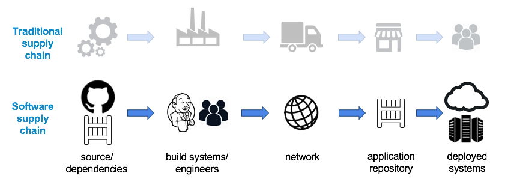
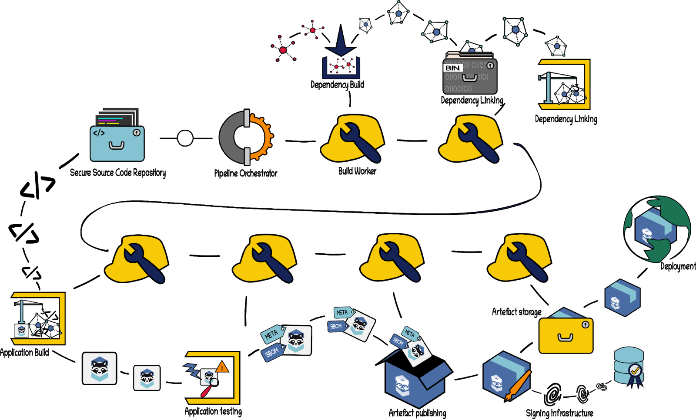
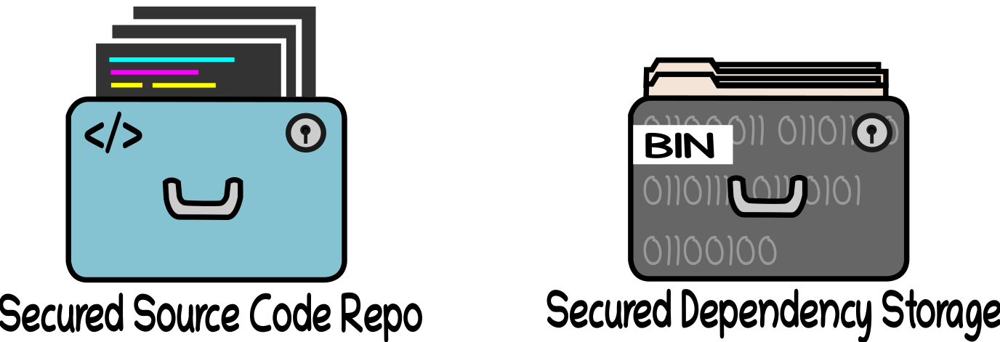
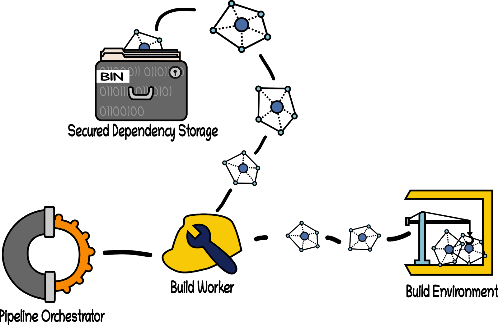
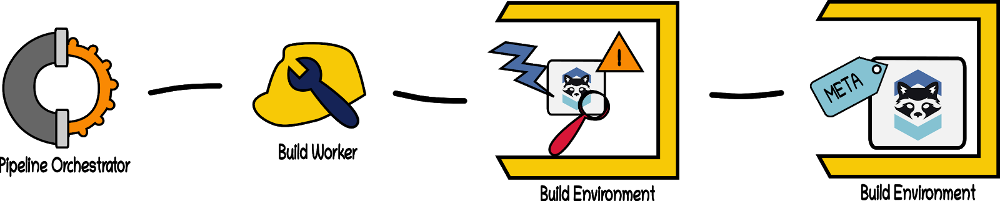
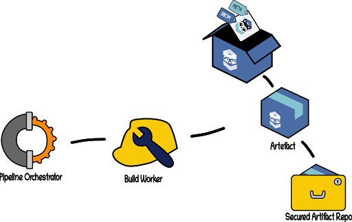
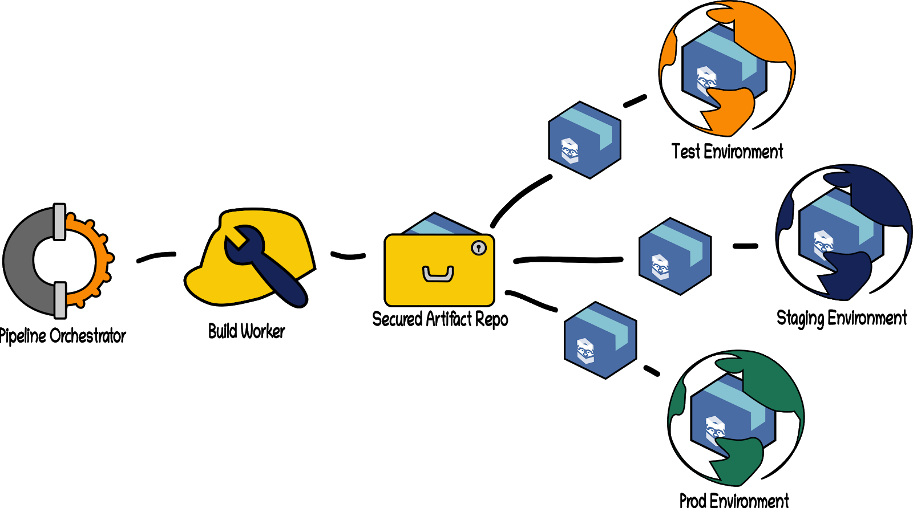

<!-- cspell:disable -->
<!-- markdownlint-disable MD001 MD009 MD010 MD012 MD013 MD024 MD026 MD030 MD033 MD034 MD036 MD037 MD041 MD045 -->

Shared with the CNCF community

# Software Supply Chain Best Practices

## Metadata

| **Markdown** | | | |
| -- | -- | -- | -- |
| **Version** | **1.0** (Commit 5c1b842626f6e2bfff70be1a3f96203ce5dfa642) | 13 MAY 2021 | [Original working doc](https://docs.google.com/document/d/1VURD9rdEhiuqPdixhEozkHw01Tk6e2AaJVjBK3pK6Zc) |
| **Status** | WIP | In Review | **Approved** |

| **PDF** | |
| -- | -- |
| **Created** | 14 MAY 2021 |
| **Last Reviewed** | 14 MAY 2021 |
| **PDF Published** | 14 MAY 2021 |
| **Release Version** | 1.0 |
| **Final PDF Approvers** | [ ] @lizrice [X] @justincormack  |

| **Originating Content and Review** | |
| -- | --|
| **Contributors** | Andres Vega @anvega, Emily Fox @TheFoxAtWork, Faisal Razzak @faisalrazzak, @apmarshall, Cole Kennedy @colek42,Mikhail Swift @mikhailswift, Jon Meadows @jonmuk, Aditya Sirish A Yelgundhalli @adityasaky, Nisha Kumar @nishakm, Joshua Lock @joshuagl, Andrew Martin @sublimino, @mnm678 , Vinod Anandan @VinodAnandan, Magno Logan @magnologan, @rjulian @lumjjb @mlieberman85 @garrying |
| **Reviewers** | @aspanner @mike-ensor @timfong888 @alexbarbato @voor, Alok Raj @ak-secops |

## Index

- [Executive Summary](#executive-summary)
- [Introduction](#introduction)
- [Securing the Source Code](#securing-the-source-code)
- [Securing Materials](#securing-materials)
- [Securing Build Pipelines](#securing-build-pipelines)
- [Securing Artefacts](#securing-artefacts)
- [Securing Deployments](#securing-deployments)
- [Prior Art and References](#prior-art-and-references)
- [Appendix I - Containers](#appendix-i---containers)
- [Appendix II - Software Groups](#appendix-ii---software-groups)

# Executive Summary

High-profile SUNBURST supply chain attacks in 2020[^1] grabbed headlines and directed attention to the importance of how software is built, and what vulnerabilities are left open by that process. Supply chains require more than one linked process, and supply chain security relies on the validation and verification of each process. While software supply chains grow increasingly complex, consensus on "best practices" and security has been lacking. This paper aims to offer the community a holistic approach to supply chain security by highlighting the importance of layered defensive practices. It draws recommendations and insights from the collective knowledge and experience of security practitioners in industry, state-of-the-art academic research, and the work of the United States Air Force[^2] (most notably, the "software factory" approach). It provides  a reference on how to design a secure software supply chain, and provides insight into commonly used tooling.

This paper puts forth four key principles crucial to supply chain security:

First, every step in a supply chain should be "trustworthy" as a result of a combination of cryptographic attestation and verification.  No step in the supply chain should rely on assumptions about the trustworthiness of any previous steps or outputs — trust relationships must be explicitly defined.

Second, automation is critical to supply chain security. Automating as much of the software supply chain as possible can significantly reduce the possibility of human error and configuration drift.

Third, the build environments used in a supply chain should be clearly defined, with limited scope.  The human and machine identities operating in those environments should be granted only the minimum permissions required to complete their assigned tasks.

Fourth, all entities operating in the supply chain environment must be required to mutually authenticate using hardened authentication mechanisms with regular key rotation.

To operationalize these principles in a secure software factory several stages are needed. The software factory must ensure that internal, first party source code repositories and the entities associated with them are protected and secured through commit signing, vulnerability scanning, contribution rules, and policy enforcement. Then it must critically examine all ingested second and third party materials, verify their contents, scan them for security issues, evaluate material trustworthiness, and material immutability. The validated materials should then be stored in a secure, internal repository from which all dependencies in the build process will be drawn.  To further harden these materials for high assurance systems it is suggested they should be built directly from source.

Additionally, the build pipeline itself must be secured, requiring the "separation of concerns" between individual build steps and workers, each of which are concerned with a separate stage in the build process.  Build Workers should consider hardened inputs, validation, and reproducibility at each build. Finally, the artefacts produced by the supply chain must be accompanied by signed metadata which attests to their contents and can be verified independently, as well as revalidated at consumption and deployment. Each of these stages will be explored in the document that follows, with an overarching introduction to each stage and detailed recommendations for best practices. A detailed evaluation model for these four principles can be found in the CNCF Security TAG's supply chain repository[^3].

# Introduction

Software supply chain attacks occur when the materials or processes of producing software are themselves compromised, resulting in vulnerabilities targeting downstream consumers of the software produced. Although the number of known, successful exploits remains comparatively small, the impact of these attacks has been extensive, as evidenced by NotPetya[^4] and Solarwinds[^5]. The CNCF Technical Advisory Group (TAG) for Security maintains a detailed catalogue[^6] of known supply chain attacks to raise awareness of increased occurrences coupled with lower barriers to success. Aggregated risk from software supply chain compromises continues to grow[^7] as the relative ease of exploitation and exponential network effects of compromise have been demonstrated, and entice further attackers.

Despite increased awareness and research into supply chain attacks, there is limited information available on mitigating or architecting for these risks, and existing information is focused on singular and independent elements of the supply chain. As the field matures in response to adversarial tactics, a more holistic approach is needed. This paper details the security best practices and references to help mitigate and reduce the impact of a supply chain attack.

## Audience

Our target audience are any members of organizations building software including but not limited to Architects, Developers, Project/Product/Program Managers, and all those who are responsible for designing and implementing secure, cloud native products and services. These individuals may work for private enterprise, government agencies, or non-profit organizations. Additionally, anyone with an interest in supply chain security can refer to this paper.

## Scope

This paper provides the community with a series of recommended practices, tooling options, and design considerations that can reduce the likelihood and overall impact of a successful supply chain attack. It provides a holistic, end to end guide for organizations and teams to build a resilient and verifiable supply chain. As the field of cyber supply chain management is relatively nascent, several recommendations require bespoke development at this time as solutions are not yet available off the shelf. We expect this to improve and look forward to continuing to provide guidance and architectures to simplify these tasks.

### Non-Goals

This paper will not detail tool-specific configurations, but it will refer to existing documentation where it is reasonable and appropriate to ensure the reader has the most recent information.

This paper will not provide instructions on assessing existing supply chains for security risk.

This paper is not an end-all solution for resolving or stopping supply chain attacks.  The components of this paper must be evaluated by the reader for usability and applicability against their organization's risk tolerance and environmental requirements.

## Assumptions

This paper assumes that the audience is already familiar with general security concepts, DevOps or DevSecOps principles, and supply chain concepts.

### Shared Responsibility

This paper does not detail recommendations to protect against supply chain attacks and backdoors in hardware or operating system components. These concerns represent a shared responsibility between the developer, build team, infrastructure/cloud provider, and operating system provider. For details of techniques to harden these capabilities see Appendix I.

### Projects and Products

Where possible the authors strive to provide the readers with CNCF open source projects as examples. However, we recognize that some of these projects may not yet be productized or available "off-the-shelf". As a result, we may also refer to other projects, including both open source and commercial products. All such references, including references to existing documentation, are given as examples to the reader in an effort to provide real-world relatability. Readers should understand that these references are not an endorsement of any project or product by the CNCF or the paper's authors and reviewers.

## Assurance Personas and Risk Appetite

Not all software has the same spread or impact. For example some software may be distributed across an enterprise and require root privileges to run, while other software may only be used in a compartmentalised fashion with a low level of access. Software producers and consumers should perform threat modeling of their systems to assess their needs and make conscious decisions about risk appetite and security controls.

For consumers of open source software, analysis must be conducted to ensure the level of assurance provided by an open source producer matches the required level of the consumer. As open source software is often implemented by volunteers, they may not share the same assurance level required by the consumer. This will result in a situation where the consumer must work to fill in control or security gaps, such as finding and patching security vulnerabilities.

Throughout the document, references are made to two security levels: moderate, and high. This allows the reader to tailor their implementations based on their own needs and requirements. These security levels can be delineated along two axes: assurance requirements, and risk environments. When determining a suitable pipeline or option, either as accidental raw supplier[^8] or purposeful software producer, the readers should consider their anticipated assurance needs in all target environments.

### Assurance Requirements

Low assurance products are software produced with little development time assigned towards safeguarding the integrity and security of the product.  These are often early stage prototypes, alpha releases or products targeting innovators. We do not provide any "low assurance" recommendations in this paper.

Moderate assurance products are software produced with reasonable assurance requirements as expected for the majority of potential "enterprise ready" deployments.  A moderate level of assurance forms the baseline for the recommendations made in this paper.

High assurance products stipulate that the product is untampered and resistant to unauthorized changes, employing high fidelity attestation and verification. These software products may be used in healthcare, financial services, critical infrastructure, and national security systems or services.

The assurance categories provided alongside the recommendations in this paper should be thought of this way: entities seeking to provide X (moderate or high) level of assurance about the contents of the products they produce should include the X-marked recommendations in their software supply chain design.

### Risk Environments

Exploits of vulnerabilities in low risk environments are inconvenient with minimal or negligible impact to the mission or goals of the organization. We do not consider recommendations relevant to low risk environments in this paper.

Moderate risk environments include those that do not store, process, or transmit personally identifying information or personal health information (PII/PHI) or life threatening information, and are not critical infrastructure (life sustainment systems[^9], financial services, etc.).  Exploits of vulnerabilities in these environments may have a serious impact on part of the business but not its entirety, and allow the core business to continue to function. Exploits to moderate risk environments are deemed serious but not catastrophic. Practices appropriate for a moderate risk environment form the baseline for all recommendations made in this paper.

High risk environments may deal with national security, life threatening information, critical/national/state/municipal infrastructure, PII/PHI, and financial services. Exploits of vulnerabilities in these environments have the potential to result in loss of life or cause catastrophic impact from which the organization fails to recover.

The risk environment categories provided alongside recommendations in this paper should be thought of this way: entities operating within a risk environment of X (moderate or high) should (a) incorporate the X-marked recommendations in their software supply chain design, and (b) choose software vendors who similarly incorporate X-marked recommendations in their software supply chains.

## Securing the Software Supply Chain

A supply chain is "a process of getting a product to the customer." In the software domain, we will focus on the software development process itself. Software delivered to a consumer may contain malicious code or an active exploit prior to or upon installation or use, and these vulnerabilities may be inserted or exploited at any stage in the development process, from early development to the post-delivery phase.

Existing research comparing open source or first party products with closed source[^10] software indicates that a major threat vector is organizations' lacking visibility into closed source products, to independently scrutinize the risk presented to a consumer. Ironically, cybersecurity companies are also subject to supply chain attacks and should be duly considered a source of supply chain risk alongside other products. Cybersecurity companies are just as susceptible to breaches[^11] as any other organization.

As with the manufacturing industry's workflow changes in the 1980s[^12] and technology's subsequent adoption of this streamlining through Agile and DevOps, technology may once again look to manufacturing supply chain practices to learn and convert existing principles to software lifecycles, cloud and cloud native design, and general software health.  The ‘securing the supply chain' problem is extensive, thus making it difficult to protect an organization's supply chain.

Fig. 1:  [https://blog.convisoappsec.com/en/is-your-software-supply-chain-secure/](https://blog.convisoappsec.com/en/is-your-software-supply-chain-secure/)

The above diagram illustrates how the software supply chain closely mirrors a traditional manufacturing supply chain, with several notable differences:

*   Intangible - the software supply chain is an intangible object made up of a series of virtual and digital components that make it extremely difficult to count, discover, and understand their operation end-to-end.[^13]
*   Mercurial - as more teams reduce their time to market, it is reasonable to expect the shape and structure of a software supply chain to continue to change.
*   Iterative reuse - one product's supply chain, is _n_ number of products and _nn_ supply chains, an endless supply of turtles all the way down[^14].

These differences aside, the industry has come to  refer to the discrete set of steps to secure software supply chains as a "Software Factory".[^15]

Every step of the supply chain diagram above has multiple security risks and impacts. For example, some security breaches start with malicious users accessing the organization's issue-tracking software either by compromising a vulnerability present on the system or gaining access to a developer's credential. An additional threat may be a malicious insider taking advantage of sensitive information.

A supply chain's security is defined by its weakest link. Ignoring the minimalist baseline security best practices, such as strong authentication and authorization mechanisms, preferably with two-factor authentication, means that malicious users can get access to these systems with ease and cause greater damage upon compromise.

## General Guidance

Throughout the best practice recommendations provided in this paper, there are a number of themes that are repeated:

*   Verification - This is the heart of the software factory methodology outlined in this paper. Confidence in the software production process should result in verification at each stage in that process. Metadata from each stage of the build process should be attested. During the deployment or distribution stage of the process the build metadata must be verified.
*   Automation - Contemporary software development relies on numerous automated processes, such as Continuous Integration/Continuous Delivery (CI/CD) and DevOps pipelines. Leveraging automation helps to ensure that processes are deterministic, bolstering the attestation and verification mechanisms we rely on for supply chain security. Infrastructure and its security controls should be defined as Infrastructure as Code (IaC) and deployed in an automated fashion. IaC allows system changes to be governed by source code management tools that integrate into enterprise identity management solutions. This further reduces the likelihood of varying configurations across environments through "write once, deploy many".
*   Authorization in Controlled Environments - To reduce the impact of compromise, the entities (human or software) and environments involved in the software production lifecycle should be clearly defined and limited in scope. Permissions for human or software operators should be granted on a "least privilege" basis to ensure that roles have the minimum permissions required and are periodically re-evaluated. This guidance is valid at all stages of the supply chain from source code identity and access management to the deployment process.
*   Secure Authentication - Identities are to be determined with certainty.  For interacting at any stage of the supply chain, entities should mutually authenticate their identities prior to interaction[^16]. Such authentication methods should be "hardened" beyond standard password authentication by either (a) a public key infrastructure (ie, public private SSH key pairs), (b) multi-factor authentication (MFA), or (c) explicit limiting of an authentication mechanism to particular activities (i.e. through a secondary "app password" or personal access token). Post authentication, the activities of entities should be monitored to detect suspicious or unauthorized activities.
The software factory creates multiple pipelines configured to build a software artefact. It is composed of individual build stages chained together to retrieve the source code and dependencies, then scan, test, build and deploy the final artefact. The software factory relies heavily upon infrastructure and security-as-code to allow automated instantiation of pipelines, leading to the creation of multiple immutable pipelines. To eliminate the chance of error or misconfiguration there should be no manual configuration in place.  This also leads to a system that is capable of performing a high level of automated security testing to validate its configuration and verify its products.

In this paper, we explore this methodology for securing a software supply chain in five stages:

*   Securing the Source Code: securing code produced by software producers (the internal or first party code)
*   Securing the Materials: hardening the "raw materials" of second and third party code incorporated in builds,
*   Securing the Build Pipelines: securing the build and infrastructure
*   Securing the Artefacts: attesting the security and trustworthiness of artefacts produced by these build pipelines
*   Securing Deployments: verifying the attestations during the deployment stage

Each of these stages are designed to complement one another for a comprehensive and holistic approach. Implementing all or portions of these should be evaluated against an organization's assurance requirements and environment risk appetite[^17].

# Securing the Source Code

The foundational construct of any software supply chain is the source code. The initial step in securing a supply chain is establishing and ensuring the integrity of the source code. "Integrity" in this context means that the source code and tags found in the repository have not changed or altered from the code created by the developer. This includes potential malicious changes introduced by a local compromise on the developers machine. To maintain integrity, organizations must take steps to verify the source of the code added to their first party products and libraries.

It is fundamental to the supply chain that the development activity employs software development best practices. Agile methodologies of "continuous improvement" have been embraced in the industry and enabled through CI/CD pipelines and automated testing. These pipelines must be properly configured to access source code on-demand in order to build, deploy, and release artefacts at the cadence the organization needs.

Identity and Access management (IAM) is the biggest attack vector, regardless of platform or vendor, and it is critical to carefully manage IAM policies to provide both developers and agents secure access to source code. Pipeline agents and human developers must have their access and privileges calibrated to their roles within the organization and be given secure means to authenticate to those roles.

## Verification:

#### Require signed commits

_Assurance categories: Moderate to high and risk categories: Moderate to high_

Signing source code[^18] (commits and tags) ensures integrity and non-repudiation of source code by enabling out-of-band verification of the code.  An attack on the source code management system would be mitigated by automatically verifying the presence of valid signed commit records. GPG keys or S/MIME certificates are used to sign the source code, with GPG key based signing being the more common practice among most developers. The discussion on technical aspects of both techniques is beyond the scope of this paper, however, different Source Code Management (SCM) and DevOps platforms provide documentation on configuring GPG or S/MIME certificate based signing[^19] and integration with hardware tokens.

#### Enforce full attestation and verification for protected branches

_Assurance category: High and risk category: high_

In high assurance, high risk environments attribution of changes to the source code via an out-of-band mechanism is essential for detecting complex attacks. Organizations with High Assurance requirements should require commit signing for protected branches as well as full attestation[^20].

## Automation:

#### Prevent committing secrets to the source code repository

_Assurance categories: Moderate to high and risk categories: moderate to high_

Secrets such as credential files, SSH keys and access tokens or API keys should not be committed to the source code repository unless encrypted prior to placement[^21].  Tooling exists to detect secret key leaks, such as trufflehog[^22], which can be implemented using either a client-side hook (pre-commit), server-side hook (pre-receive or update), and as a step in the CI process.

Some DevOps platforms and integrations provide a default list of files which cannot be pushed to the repository[^23]. These base lists of files can be extended to include more domain specific files which may contain sensitive materials.

#### Define individuals/teams that are responsible for code in a repository and associated coding conventions

_Assurance category: High and risk category: high_

Repository administrators should define who has write permissions to a code repository.

In addition, administrators should define the tests and policies for coding conventions and practices. Such policies can then be implemented using a combination of client-side (pre-commit) and server-side hooks (pre-receive or update). In addition project codeowners, templates, .gitignore, .gitattributes and denylist files can help mitigate injection risks and provide higher assurance.

#### Automate software security scanning and testing

_Assurance categories: Moderate to high and risk categories: moderate to high_

Software best practices include the use of unit, functional, and end-to-end testing to identify bugs and errors in the code before release. In addition, security specific scans should be performed, including Static Application Security Tests (SAST) and Dynamic Application Security Tests (DAST). Static scan tooling should be integrated as early in the development process as possible, including integration into the IDE. For more details on application security best practices refer to the OWASP standards and tools[^24].

During the build process the metadata from security tooling such as SAST tooling should be recorded and linked to a hash of the build artefact to provide chain of custody and provenance. Both the coverage and results of these tests should be published as part of the repository information to help downstream consumers of software better assess the stability, reliability, and/or suitability of a product or library.

## Controlled Environments:

#### Establish and adhere to contribution policies

_Assurance categories: Moderate to high and risk categories: moderate to high_

Modern SCM platforms allow repository administrators to define configuration options or configuration rules to enforce security, hygiene and operational policies. These rules can help enforce policies during different stages of software development allowing standardization across different team members. For example, automated deletion of branches, policies for code reviews, role based contribution and automated checks can be performed. It is recommended that repository administrators define a baseline of these rules by working with Software Development Managers. General contribution policies should also define what is and is not considered an acceptable contribution so that potential contributors are advised in advance.

#### Define roles aligned to functional responsibilities

_Assurance categories: Moderate to high and risk categories: moderate to high_

Define roles and associated access controls based upon the different personas interacting with the source code repositories. The roles should be assigned least privilege on a need-to-know basis based on their assigned responsibilities. For example,  roles may include Developer, Maintainer, Owner, Reviewer, Approver, and Guest. Each role should then be given fine-grained permissions with regards to repository access control.

#### Enforce an independent four-eyes principle[^25].

_Assurance categories: Moderate to high and risk categories: moderate to high_

The author(s) of a request may not also be the approver of the request.  At least two individuals, of which one should have write access to the branch, that are independent of the request must review and approve the request.  Some organizations may find an engineering manager or a lead engineer, who is an informed security practitioner to be sufficient for this role.  Reviewers should have a similar level of knowledge as the author(s), implying equal or greater expertise to provide informed review.

#### Use branch protection rules

_Assurance categories: Moderate to high and risk categories: moderate to high_

Modern SCM platforms allow the configuration and restriction of source code operations on individual branches. Often specific branches of a repository will be more strongly restricted or protected in order to enforce adherence to software development processes and policies before code is introduced into a CI/CD system. Protection rules can be used to enforce the usage of pull requests with specified precondition and approval rules, ensuring that a human code review process is followed or an automated status checking of a branch occurs. Additionally, protected branches can be used to disallow dangerous use of force pushes[^26], preventing the overwrite of commit histories and potential obfuscation of code changes.

## Secure Authentication

#### Enforce MFA for accessing source code repositories

_Assurance categories: Moderate to high and risk categories: moderate to high_

Multi-factor authentication (MFA) should be mandated and enforced at the source code repository level for any software project. MFA provides an additional layer of security by requiring a soft or physical token in addition to traditional credentials, thus requiring direct credential compromise in addition to a more traditional password/key in order to be successful.

#### Use SSH keys to provide developers access to source code repositories

_Assurance categories: Moderate to high and risk categories: moderate to high_

Developers contributing source code require a non-interactive way to access source code repositories from their development tools. Instead of using password credentials which are prone to common hacking techniques like brute force, password guessing and password spraying, SSH keys[^27] or SSH certificates[^28] should be used. Agents in CI/CD pipelines may also be configured to access repositories using SSH Keys. All modern platforms like Github, Gitlab, BitBucket provide guidance on configuring access using SSH keys[^29].

There are environments where SSH keys may not be a viable authentication mechanism due to network policies. A contested option of varying security concern is frequently rotated Access Tokens, which should be scoped to only the necessary functions for the particular task (i.e. read only for pipelines or write/read for developer work, etc.). It is important to note that the problem with tokens is the required distribution of the secret, exposing credentials to MITM and other classes of attack. Tokens, in this context, should only be used if they are short lived and issued with an out-of-band identity management system such as SPIRE.  More details are discussed further in the document.

#### Have a Key Rotation Policy

_Assurance categories: Moderate to high and risk categories: moderate to high_

Properly generated SSH keys are secured against common password attacks like brute forcing. If a private key is compromised it is likely to grant access to all git-related operations on a SCM or DevOps platform. Further, since keys do not expire, such access will remain in effect for as long as that public/private key pair is active. Therefore, it is recommended to implement a key rotation policy to ensure that compromised keys will cease to be usable after a certain period of time. When a private key is known to have been compromised, it should be revoked and replaced immediately to shut off access for any unauthorized user. Organizations may also consider using short lived certificates or keys, which reduces the reliance on certificate revocation systems.

#### Use short-lived/ephemeral credentials for machine/service access

_Assurance categories: Moderate to high and risk categories: moderate to high_

Modern SCM platforms allow the use of randomly generated short lived tokens for the access management of machines and services such as CI/CD pipeline agents. The short lived access tokens can be used to authenticate over HTTPS. Short-life credential issuance encourages the use of fine grained permissions and automation in provisioning access tokens. These permissions further restrict the type of operation that can be performed at the repository level.

For CI/CD pipeline agents, short-lived access tokens should be considered instead of password-based credentials. The use of very short-lived tokens like OAuth 2.0, OpenID Connect, etc., will help to implement more secure access and increase the security assurance. These tokens shouldn't be confused with the long-lived/non-refreshable personal access tokens (PAT) such as those [available on GitHub](https://docs.github.com/en/github/authenticating-to-github/creating-a-personal-access-token) , as these PATs will have similar security properties as a shared secret/password type credentials.

# Securing Materials

Overall quality and consistency of any "manufacturing" process is largely dependent on the quality and consistency of the goods used as inputs.  Therefore, care must be taken to validate the quality of these raw materials. For software pipelines this concerns the quality of the dependent libraries, be they direct or transitive dependencies. A key part of the software factory process is to ensure dependencies are drawn from a trusted source and have not been tampered with. Depending upon the required risk profile it may be appropriate to identify trusted repositories and rely directly upon them, in addition to disabling access to all other repositories.

## Second and Third-Party Risk Management

When making determinations on accepting, limiting, or denying the use of second and third party software, it is imperative organizations leverage risk management processes in order to understand the risk presented by these materials. Not all software an organization may intend to use has the same level of support behind it, which may reflect significant differences in the overall level of quality, security, or responsiveness to issues across dependencies. Particularly from the perspective of security, organizations should consider whether proposed dependencies have mechanisms for managing external reported vulnerabilities.

Most foundation or corporate supported open source projects make it standard practice to report Common Vulnerabilities and Exposures (CVEs) and patch affected code.  However, a CVE is a trailing metric. It requires a significant effort to establish and publish a CVE. A series of continual "operational health" metrics should be used to evaluate the true state of security for a project. The Open Source Security Foundation (OSSF) has produced the OSSF scorecard project[^30] aimed at providing a rubric to evaluate the security posture and operational health of open source projects. In addition projects should be evaluated to determine whether they adhere to the best practices documented in this paper.

Additionally, organizations should always monitor changes to second and third party software or services. Your software or service provider should list any changes to their Service Level Agreement (SLA) for the service or changes to the software (for example, maintaining a changelog).  It is incumbent on the organization to review and understand these changes and to analyze how these changes will impact their supply chain.

## Verification:

#### Verify third party artefacts and open source libraries

_Assurance categories: Moderate to high and risk categories: moderate to high_

Third party artefacts need to be validated using a range of approaches. All third party artefacts, open source libraries and any other dependencies should be verified as part of the continuous integration pipeline by validating their checksums against a known good source and validating any cryptographic signatures. At a very basic level, any software ingested must be scanned using Software Composition Analysis (SCA) tools to detect whether any vulnerable open-source software is used in the final product. If possible, for high assurance categories any 3rd party artefacts should be pen tested to ensure that the software is resistant to standard attacks and no basic security errors or loopholes exist.

#### Require SBOM from third party supplier

_Assurance categories: High and risk categories: high_

Where possible, vendors should be required to provide Software Bills of Materials (SBOMs) containing the explicit details of the software and versions used within the supplied product. This provides a clear and direct link to the dependencies, removing doubt on the version of dependencies that are used and thus removing the requirement of using heuristics via SCA tools. Ideally this should also be provided with signed metadata from the build process.

#### Track dependencies between open source components

_Assurance categories: Moderate to high and risk categories: moderate to high_

A register should be maintained of a project's open source components, dependencies and vulnerabilities to help trace any deployed artefacts with new vulnerabilities. One of the most popular open source inventory implementations is OWASP Dependency-Track. Generating, receiving, or maintaining a supply chain inventory will help identify the software vendors, suppliers, and sources used in an organization with the associated software and versions. Cataloguing this inventory into a human and machine readable mechanism allows organizations to correlate vulnerabilities as they are published against known in-use or to-be-used software and to ascertain impact.

#### Build libraries based upon source code

_Assurance category: High and risk category: high_

Software dependencies are often distributed in a compiled form as compiled binaries, tarballs or stored in a package manager. However there is no explicit connection between the binary in a package manager and the source code itself. It is entirely possible that the compiled version uploaded to a package manager contains additional software beyond the expected compiled source code. This often happens, for example, when developers add debugging capabilities to their compiled code. However, this lack of a one-to-one correlation between source code and compiled binaries also opens up the possibility of malicious additions to the package manager version of a dependency. Consequently, when possible, it is safer and more reliable to build the binaries yourself directly from the source code. This provides a clear link between the library source code and the compiled binary. However, because this process is time consuming and resource intensive, it may only be possible for higher risk/assurance categories.

If a source code build is not an option across all layers of your software it is recommended to use components from a verifiable source which regularly maintains and updates those binary components in a backwards compatible way, has publicly accessible documentation on their processes, and has a security incident response team with stated SLAs.

#### Define and prioritize trusted package managers and repositories

_Assurance category: High and risk category: high_

While there are public repositories and package managers that sign packages and provide the means to verify those signatures, high assurance environments should minimize ingesting

from public repositories. Moderate assurance environments should only ingest public packages if they can assess the risk level with techniques such as CVE scanning. High assurance environments may potentially leverage verification by reproducibility[^31]. Organizations should host their own package managers and artefact repositories, and restrict build machines to pull from only those sources. When this is not possible, the organization should employ compensating mechanisms, such as defensive programming[^32], to reduce the potential impact of compromised packages ingested from untrusted repositories.

#### Generate an immutable SBOM of the code

_Assurance categories: Moderate to high and risk categories: moderate to high_

While rebuilding a software artefact, it is best practice to also generate an SBOM[^33] for the software. A generated SBOM provides a clear list of the contents within the final software package. Consumers of the software will then be able to analyse the SBOM, aligning it with vulnerability data to directly identify vulnerabilities based upon the exact package contents.

There are currently two well known SBOM specifications: SPDX[^34] and CycloneDX[^35]. A SBOM is preferably generated during the build process. For third party software, a SBOM can be generated using software composition analysis. The SBOM data generated by using the build time data will be more accurate as the build process has visibility of the dependencies used to generate the software.  A SBOM generated through scanning isn't likely to capture issues such as the toolchain introducing a bug. SBOMs may also be generated manually.

## Automation:

#### Scan software for vulnerabilities

_Assurance categories: Moderate to high and risk categories: moderate to high_

Before allowing software dependencies into the system they should be scanned and evaluated to ensure the vulnerabilities they bring are within the risk limits of the product's assurance level. If the dependency is outside the risk limits it should be evaluated by a vulnerability management process in order to assess whether the defined risks are accurate, whether other mitigations may be applied to reduce risk, or whether the software or update cannot be allowed into the system.

It should be noted that instances may exist where the specific usage of the software does not expose or utilise the specific code containing the vulnerability. For these occurrences, compensating controls may be provided to mitigate the vulnerability.

#### Scan software for license implications

_Assurance categories: Moderate to high and risk categories: moderate to high_

Licensing obligations must also be factored into the ingestion process.  The Linux Foundation maintains the Open Compliance Program[^36] which hosts several tools to ensure released software meets legal and regulatory compliance requirements.  Licensing metadata should be recorded during the build process and distributed with the artefact SBOM.

#### Run software composition analysis on ingested software

_Assurance categories: Moderate to high and risk categories: moderate to high_

At a minimum a SCA tool should be run against any dependencies used within the program being built. The SCA tool will attempt to use heuristics to identify the direct and transitive dependencies, and can also serve as verification of SBOM content. This data will then be matched against data from a number of data feeds containing vulnerability data to highlight any vulnerabilities in the dependent packages. There are several nuances with this approach that may lead to false positives. Issues may arise in correctly identifying the dependent package. Mapping errors may occur as the libraries are mapped against the vulnerability feed and the identifying data within the vulnerability feeds often does not accurately map to the library identifiers.  Validation of the security of the open source modules should occur before the build process and can complement a range of tests aligned to the documented risk posture.

# Securing Build Pipelines

When thinking of an industrial factory, we often think of the assembly line itself. Similarly, the heart of a software factory is the actual build pipeline. Drawing from the first, second, and third party materials already discussed, the build pipeline "assembles" the completed software artefacts that will be made available to downstream software consumers.

Securing the build pipelines must be considered as an interconnected system, with defense-in-depth in mind. The following primary components should be secured:

*   Build steps: The function or task to be performed at any point in the "assembly line." A build step should have a single responsibility which may be, for example, to retrieve sources, compile an artefact, or run tests.
*   Build workers: The machinery or infrastructure carrying out the task. Historically, a single server might have completed all the steps, but in a cloud native environment the build worker is typically a container which has a 1:1 correlation with a particular step.
*   Build tools: Any software dependencies required to generate and ensure the integrity of the final artefact(s).
*   Pipeline orchestrator: The overall build pipeline managing the CI/CD workflow. Deploys build steps and workers to complete the stages of that pipeline.

Additionally, build metadata produced by these components must be signed and recorded externally in order to facilitate out-of-band verification.

The pipeline is created by joining together a series of hardened build steps. Each build step should be implemented through a hardened container image stored within a secured repository, and should be deployed to a hardened orchestration platform such as Kubernetes. As an example, the US Air Force's Platform One is an implementation of this concept, which leverages hardened containers from the Platform One centralized artefact repository called "Iron Bank". This repository contains signed container images hardened according to the DoD Container Hardening Guide[^37].

By building the pipeline from hardened components, the software factory reduces the likelihood of successful compromise of any build step. The pipeline orchestrator controls exactly what each stage is able to perform, implementing the required build step without additional software, reducing the attack surface of each component in the pipeline. The entire software factory should be designed such that the compromise of an individual build step (or even multiple build steps) is contained and does not compromise the entire pipeline. Out-of-band verification provides defense in depth and mitigates against software factory's root credential loss.

Guiding principles for securing the build include:

*   Each component in the build, from infrastructure to code, should have a single responsibility. This division of labour must support least privilege authorisation.
*   Steps should have clearly defined build stage inputs and outputs (artefacts) to allow greater control over data flow.
*   Clearly defined output parameters enable signing of data to provide non-repudiation of artefacts and metadata.
*   All aspects of the pipeline infrastructure and configuration must be immutable.
*   Pipeline steps themselves should be subject to automated testing to validate the efficacy of the security controls within the pipeline.
*   Pipeline steps should produce a signed SBOM for out-of-band verification of the build process.

## Build Infrastructure

Build infrastructure should have the same level of security configuration as its generated artefacts' target runtime environment. This section focuses on the core build infrastructure itself: the build step and its associated worker, and the pipeline orchestrator.

### Build Step and Worker

A build step is a particular task to be completed in a build pipeline (such as collecting sources, compiling binaries, or running tests). A build worker is the underlying infrastructure on which a build step is run. Historically this has been a shared server with the build tools for multiple projects (e.g. different languages and libraries). In the event of compromise all the shared server's builds and their secrets are potentially exposed. This legacy model does not encourage resilience or provide security, and is likely to allow myriad complex escalation paths with the various secrets made available to the server's builds.

Running a worker as a container or VM are the most common ways to handle the build. Other options include serverless, sandboxes (such as gVisor and Firecracker), and secure enclaves. For the purposes of this paper, we will only focus on containers. Using containers as build workers allows pipelines to treat them as "microservices," assigning a unique build worker (container) to each build step. Therefore, at a high level, build workers and build steps may seem interchangeable in a cloud native software factory because they exist in a 1:1 relationship.

Build steps and workers take, as inputs, (1) a worker base image" (the base container image on which the build worker is based), (2) a build environment consisting of sources and dependencies, and (3) a build command. The worker should verify its inputs, run its designated build command, and generate output consisting of an artefact and any metadata. That artefact may be a binary, test evidence, or an input to a subsequent stage, and should include separate, signed metadata (hashes, signatures, or build evidence).

The build environment consists of all the content required for the build including the sources for the build and any of its dependencies, excluding any tooling provided by the worker base image as this tooling is not part of the end product being built. It is imperative that no other source material is fetched at build time outside of the provided parameters. The build environment is a temporary storage capability which is encrypted and secured.

### Build Pipeline to Create Build Stage Images

Software factory components should be built from source and applied to a worker base image through a highly secured pipeline. This does present a potential self referential issue as it would be prudent to build the hardened build worker images on a secured software factory.

During the bootstrapping phase of the software factory project the build stage images must be built on secured build infrastructure and hardware. This provides a minimal image that undergoes extensive security validation and testing, before producing an image to be used by the build workers. Build metadata from this process should be examined for compliance.

A hardened Open Container Initiative (OCI) container should descend from a minimal image running with least privilege[^38]. Each added application, configuration, or data file should be configured with least privilege, avoiding obvious impediments to security such as SETUID[^39]/GUID binaries, and any build-specific tooling (such as the shell required to execute RUN commands in a Dockerfile) removed as the final stage of the build. Additionally, tools, such as OpenSCAP, should be used to validate that an image's contents meet organizational policy or security best practice.

To secure build stages, their images should only contain the tools and binaries necessary for the specific step of the build or pipeline it is responsible for. This means removing unnecessary binaries from the worker base image that might be included in an image by default, e.g. "vi", and any shell (often "sh" or "bash") used to construct the image. A compromised build worker with an expansive set of capabilities could be able to significantly compromise the artefacts it produces, resulting in a fundamentally untrustworthy build.  By restricting what a build can do through its environment and code you can have reasonable guarantees that the only operations it runs are the ones you allow it to run and better detect if it tries to perform operations it's not permitted to.

### Pipeline Orchestrator

The pipeline orchestrator is the part of the CI/CD pipeline that decides which steps in the pipeline should run and on what infrastructure. Legacy build architectures don't make much of a distinction between the orchestrator and the build workers but for a secure cloud native pipeline and supply chain the differences must be clear. The orchestrator stands up an immutable** **pipeline leveraging infrastructure-as-code.

The pipeline orchestrator should never share the same execution environment (for example, the infrastructure or container) as the build worker nor should the pipeline orchestrator build anything itself. Build workers may run arbitrary code and thus are hard to secure. As a result, they should be isolated from other infrastructure and have as least privilege as possible. The pipeline orchestrator requires some privileges (triggering build steps, perhaps collecting artefacts, etc.) but should have no unneeded privileges.

The orchestrator will need to integrate with other components of the pipeline and supply chain. However, the orchestrator should not integrate with these components arbitrarily. These integrations must be defined in code and validated. The orchestrator should operate with the minimum privileges needed to perform the required actions on other components of the infrastructure. For example, this means pipeline steps that require fetching or pushing of artefacts or code should be limited in scope to just the repositories and projects necessary.

### A Sample Build Pipeline

To illustrate how all of these pieces fit together, we will now walk through a high level, hypothetical build of a fictitious application. This sample pipeline does not contain any code or specific implementation details. The next sections of this paper will contain numerous recommendations for hardening Build Steps/Workers and pipeline orchestrators. These are mostly glossed over here so that the overall architecture of the pipeline can be more clearly seen.

For the purposes of our illustration, we assume that we already possess a secured source code repository for the first party code in our application by following the recommendations in the "Securing Source Code" section of this paper. We are also assuming that we already have secured storage facilities for second and third party dependency code, as outlined in the section "Securing Materials."

Our app has three dependencies, A, B, and C. Dependency A itself has two dependencies, D and E. Dependency C shares the secondary (or "transitive") dependency of D and also has a dependency F. All of these dependencies have been vetted and approved following the recommendations in the "Securing Materials" section. The source code for all direct and secondary dependencies has been collected in a secure repository, but the source code is not yet built.

When a  developer pushes new code to our first party repository it triggers build. Here is how our software factory might progress:

**Step 1: Dependency Building** For each dependency in the application, the pipeline orchestrator will create a pipeline to build the dependent artefact. This small pipeline will consist of a Build Step to clone the code and store it in a secure temporary location. Subsequent stages will run static security scans over the source code before the third step would build the code. The assigned Build Workers build the dependencies and output the compiled binaries or libraries into a secure storage facility. These stages are completed first for dependencies B, D, E, and F, then repeated for dependencies A and C, ingesting their respective sub-dependencies from the secure storage facility.

**Step 2: Dependency Linking** The Pipeline Orchestrator now triggers a new Build Step, giving it the appropriate build environment for our application and the necessary tools to install all our dependencies. It then commands the Build Worker for this stage to install/link the dependencies. The assigned Build Worker ingests the dependencies from our secure repository and installs them. It outputs a new build environment with all dependencies installed and linked.

**Step 3: Build Application** The Pipeline Orchestrator now triggers another new Build Step, using the environment output from the previous stage with all dependencies installed and linked, the first party source code of our application, and the tools necessary to build it. The assigned Build Worker builds our application and outputs a new environment containing the built application.

**Step 4: Application Testing** For brevity, we are treating several test steps together. An application's source code and resultant artefacts may be tested in parallel: static security and policy testing (linting and SAST) on source code; unit testing of the application (either outside or inside the built container artefact); and acceptance, composition, and security testing of built container images. Some systems scan a container image at this stage before pushing it to a registry, while others rely on the registry to perform the scan and promote the artefact if it passes. Whether the acceptance testing of the container image will be done in the CI stage depends on the target deployment, and the CD system's ability to verify details later in the pipeline. The Workers complete these tests and return the environment containing the built application, plus new metadata attesting to the results of the tests performed.

**Step 5: Artefact Publishing** Upon successful completion of testing, linting, and scanning, the Pipeline Orchestrator triggers a new Build Step, giving it the latest environment containing our built application, the metadata attesting to the results of our testing, and whatever additional tools are needed for publishing the artefact (including generation of  the SBOM). It then commands the assigned Build Worker to publish our application as an artefact (e.g. container image). The Worker publishes the artefact to a secure storage repository.

**Step 6: Artefact Deployment** Finally, the Pipeline Orchestrator directs yet another Build Step to deploy the artefact to some environment. This may be a testing, staging, or production environment (depending on progression through the process). This stage may be repeated for each of those deployment environments, and in between there may be additional testing stages.

The above process may contain loops and repetitions (as illustrated in Step 1 regarding sub-dependencies) depending on the particular dependency tree of our application, our testing process, and the methods of packaging the artefact and deployment that we use.

In the sections that follow, you will find numerous best practices for hardening the containers used as the build workers described above, how to architect the relationship between Build Steps, their corresponding Build Workers, and the Orchestration Pipeline, and guidance on how to sign and secure the artefacts produced at each stage in the build process.

## Verification:

#### Cryptographically guarantee policy adherence

_Assurance category: High and risk category: high_

Project and organizational release policy should be maintained as a policy template.  Metadata produced during the build process must be analyzed to ensure that the products, materials, and processes used during the build pipeline fall within controls set in the policy template.  Verification of the build policy should be performed in a cryptographically provable way. The CNCF maintains the in-toto project that can be used to secure a chain of pipeline stages end-to-end with cryptographic guarantees. It enables supply chain owners to define a "layout" of the software supply chain, and includes a workflow to produce metadata files, or "links", by hashing and signing the inputs and output of the steps in the pipeline. The presence and output of each build step should be attested during the build. Finally, in-toto includes a verification workflow that analyzes the links to ensure that they meet the constraints set in the layout. Build metadata should be evaluated against the policy template by using tools such as Open Policy Agent.  Open Policy Agent provides a language to enforce policy on JSON data derived from any source, such as Terraform or SPDX.

#### Validate environments and dependencies before usage

_Assurance categories: Moderate to high and risk categories: moderate to high_

The build environment's sources and dependencies must come from a secure, trusted source of truth. Checksums and any signatures should be validated both in the downloading or ingestion process, and again by the build worker. This should include validating package manager signatures, checking out specific Git commit hashes, and verifying SHA sums of input sources and binaries. After completing this validation, the downloading process should sign all binaries or libraries it is adding to the secure source.

#### Validate runtime security of build workers

_Assurance categories: Moderate to high and risk categories: moderate to high_

Out-of-band verification of runtime environment security, as defined by execution of policies using tools such as seccomp, AppArmor, and SELinux, provides defense in depth against attacks on build infrastructure.  Policy rule sets should be created and applied to build infrastructure. High privilege kernel capabilities such as debugger, device, and network attachments should be restricted and monitored.  Findings should be forwarded to organizational Security Information and Event Management (SIEM) systems for remediation.

#### Validate Build artefacts through verifiably reproducible builds

_Assurance category: High and risk category: high_

A deterministic build produces equivalent outputs when given the same inputs and enables us to detect unintended changes (whether malicious, such as malware and backdoors, or accidental). Verifiably reproducible builds improve on this by enabling us to cryptographically attest that the given inputs produce the same output.  A verifiably reproducible build is a build process where, given a source code commit hash and a set of build instructions, an end user should be able to reproduce the built artefact bit for bit.  We can build on these cryptographic assertions to provide additional security properties, such as artefact flow integrity. Assurance of the build is obtained when multiple builders, on separate infrastructure, achieve consensus of the build artefact signature.

The ability to build software in a verifiably reproducible manner is of growing importance as the software industry sees more attacks on build infrastructure. Building software in a reproducible way is not a trivial task, however, and care needs to be taken to capture the required build environment and remove non-determinism from all aspects of the build process. In what follows we will give several recommendations specific to the production of reproducible builds.[^40]

##### Recommendations For Reproducible Builds

##### Lock and Verify External Requirements From The Build Process

_Assurance categories: Moderate to high and risk categories: moderate to high_

External resources introduce a source of risk into systems.  Verification by reproducibility gives security administrators the assurances that external software has not been trojanized.  Reaching out to external sources at build time can be a challenge when trying to make builds reproducible.  External resources can change or disappear unexpectedly.  Third party packages that are part of your build process can be vendored (included in your revision control system alongside the code ingesting the dependency).  If this is not feasible, hashes should be recorded of any remote data for verification during the build process. Pinning specific versions of external requirements increases the consistency and ability to verify build assets throughout a project's lifecycle. However, if pinned versions are not regularly updated, vital bug fixes and security patches may be missed. Therefore, it is important to use tools like dependabot or renovatebot to track and update dependency versions regularly. If you are unable to verify an external requirement, you should consider replacing or removing it.

##### Find and Eliminate Sources Of Non-Determinism

_Assurance categories: Moderate to high and risk categories: moderate to high_

Timestamps, locale differences, and embedded version information are just a few of the things that may affect determinism in the build process.  A compiler may produce different output if source files are passed in differing orders.  Some compilers may embed build information such as build time.  A number of things that may affect determinism in a project's build vary depending on the tools and compilers being used.  Reproducible-builds.org documents and offers solutions for many of these things. Diffoscope[^41] can be used to dig in and find the cause of differences when tracking down sources of non-determinism.

##### Record The Build Environment

_Assurance category: High and risk category: high_

In order to reproduce a build environment, the versions of all tools and required configurations should be recorded and distributed with the software's source.  Compilers, system libraries, build paths, and operating systems are some of the items that are required to be recorded to properly reproduce a build environment.  Debian has created a .buildinfo[^42] file format that they use for this purpose, however generally storing historic build environments in containers at least allows some forensic analysis and may be more achievable for some teams.

##### Automate Creation Of The Build Environment

_Assurance category: High and risk category: high_

Other developers or verifiers who wish to build your software need to be able to recreate the build environment with minimum effort.  A project may use scripts to quickly retrieve and set up the required tools in a virtual environment. For example, tools like Vagrant[^43] can be used to declaratively create a virtual machine, or Dockerfiles and container images.

##### Distribute Builds Across Different Infrastructure

_Assurance category: High and risk category: high_

To detect potential attacks on the build infrastructure an architecture can be deployed to distribute the builds in multiple instances. Each instance independently and deterministically builds the same component. A hash of each resulting build can then be verified to ensure that the results are the same, and any divergence should be examined. To successfully attack such an architecture, the attacker must compromise multiple disparate infrastructures.  Rebuilderd[^44] is an example of a system that can be used to set up independent rebuilder environments on different infrastructure. It currently supports rebuilding Arch Linux packages, with support for Debian packages planned for the future.

## Automation:

#### Build and related continuous integration/continuous delivery steps should all be automated through a pipeline defined as code

_Assurance categories: Moderate to high and risk category: Moderate to high_

Steps such as build, linting, scanning, and validation should be clearly defined in code that describes a pipeline. This means that all steps from code checkout, to checksum and signature validation, to building and compilation, to publishing, and eventually to deployment should be automated. The only manual steps during this process should be any code reviews or sign offs.

#### Standardize pipelines across projects

_Assurance categories: Moderate to high and risk categories: moderate to high_

CI/CD processes should be standardized across the enterprise.  This process should be enforced by templating CI/CD pipelines and verifying that pipelines meet organizational standards. Open source tools like Jenkins, Tekton, Argo, and Gitlab provide the ability to template build pipelines for enforcing organizational release processes. Organizations must take care that release pipelines can not be circumvented by developers.

For high assurance environments, verification of pipelines should occur before release or distribution. The CNCF project in-toto provides a layout specification enabling out-of-band verification of CI/CD pipelines.

#### Provision a secured orchestration platform to host software factory

_Assurance categories: Moderate to high and risk categories: moderate to high_

Kubernetes should be deployed as the orchestration layer for the software factory.  During the initialization phase of the platform trust should be bootstrapped in the system.  Methods to bootstrap trust vary by installation type. The best practices described in the cloud native security whitepaper (including protection from unauthorized access, immutability, availability, auditing and accountability) must be followed during the platform hardening process. The CNCF provides the Cloud Native Trail Map[^45] as a starting point for architecting a secure application platform. Additionally storage and network access must be provisioned.  The provisioning process should be described as IaC and happen through an automated and audited process. Cluster administrative credentials should be secured with a hardware token. The use of GitOps as a deployment methodology ensures all changes to the system are tracked and can be integrated with organizational identity management systems.

#### Build Workers Should be Single Use

_Assurance category: High and risk category: moderate_

Build Workers, the containers which perform the Build Steps, should be single use. This lowers the blast radius and limits the attack surface by keeping the lifespan of a build worker to a single build operation. Long lived build workers are prone to config drift and can lead to increased risk of attack. Shorter build worker uptime makes it easier to reason about all operations performed during its lifecycle. For use cases where you might want to eventually audit the build worker for forensics purposes, it is prudent to either snapshot the build worker or to quarantine it after its build.

## Controlled Environments:

#### Ensure Software Factory has minimal network connectivity.

_Assurance category: High and risk category: high_

The software factory should have no network connectivity other than to connect to the trusted sources of hardened source code, the dependency repository and code signing infrastructure.The build workers will require a secure shared storage capability to pass data between each worker. This prevents the workers from repeatedly retrieving remote data for the build and thus improves performance. This storage must be encrypted and secured.

#### Segregate the Duties of Each Build Worker

_Assurance category: High and risk category: high_

When planning what the build worker will be responsible for, consider segregation of duties within the domain of a particular build. It is generally better to have specific build workers handle specific parts of a build as opposed to having a single worker handle all steps in a build, e.g. lint, compile, submit for remote scanning, push artefact etc. Splitting the build between workers allows users to attest each step of the build process.

#### Pass in Build Worker Environment and Commands

_Assurance category: High and risk category: high_

A Build Worker should have a hermetic (e.g. isolated and sealed) environment given to it from the broader pipeline, and no capability to pull in its own environment. This is because a compromised Build Worker can potentially pull in an environment of the attacker's choosing, including hostile tooling and persistent implants to pivot or retain access. In addition to the build environment, the Build Worker's commands or actions should be passed in explicitly at worker provisioning. There should be minimal decision logic in the Build Worker itself. One method of doing this might be to use Kubernetes pod or job objects to deploy the Build Workers for each step in your pipeline. The object definitions can be used to specify the environmental variables, commands, and volumes relevant to that particular Build Step, while the base image itself remains minimal[^46]. For environments which do not use Kubernetes as an orchestrator, other methods exist for externally declaring the environment and commands that a container should execute.

It is best practice to keep the build logic as simple and clear as possible so that it is easier to reason about. A complicated, opaque build process will make it hard to detect a potential compromise. A build command should only consist of a clear command around what it's building as well as any inputs it needs to validate the signature(s) for its input build environment.

#### Write Output to a Separate Secured Storage Repo

_Assurance category: High and risk category: high_

The output artefacts of Build Workers require similar security considerations as the inputs and working environment. The output artefact should be written to a separate shared storage from the inputs. A process separate from the Build Worker should then upload that artefact to an appropriate repository.

## Secure Authentication/Access:

#### Only allow pipeline modifications through "pipeline as code"

_Assurance categories: Moderate to high and risk categories: moderate to high_

The pipeline configuration should be deployed through the pipeline as code and should be immutable. It should not be possible for an administrator to modify an instantiated pipeline to ensure an attacker can not interact directly with a pipeline. This model then requires appropriate authentication and authorisation to be in place for the software and configuration of the pipeline.

#### Define user roles

_Assurance categories: Moderate to high and risk categories: moderate to high_

Organizations must define user roles in a software factory which should be used to define permission boundaries.  In high security environments no single user should be able to attest the validity of a software release. For example, Policy Administrators are responsible for ensuring organizational policy is encoded into software pipelines and attestation gates. Developers are the end-users of the software factory.  Factory Administrators are responsible for the maintenance and innovation of a software factory. Inevitably there will be shared responsibilities across these roles. Teams should carefully define the boundaries and delineate expectations around those shared responsibilities, especially when it comes to security concerns. For example: how much responsibility do application developers have for security within the pipeline? What are they not responsible for?

#### Follow established practices for establishing a root of trust from an offline source

_Assurance categories: High and risk categories: High_

Root of trust for a software factory must follow standardized methods for establishing root of trust from an offline source. An organizational Key Ceremony must be developed to sign a Certificate Signing Request (CSR) with an offline key held in trust.

#### Use short-lived** **Workload Certificates

_Assurance categories: High and risk categories: High_

Workloads should be issued short lived credentials with automated rotation. The CNCF maintained SPIFFE/SPIRE project provides a robust identity and certificate orchestration system. The publication "[Solving The Bottom Turtle](https://spiffe.io/book/)"[^47] is an excellent resource to consider when designing an organizational identity system. Certificate rotation policy is a decision based on the trade-off of system availability and the security impact of a lost key.  In situations where the use of long-lived certificates is required, a robust certificate revocation system must be implemented.

#### Deploy monitoring tools to software factory to detect malicious behaviour

_Assurance categories: Moderate to high and risk categories: moderate to high_

Additional security techniques should be integrated into the software factory itself to monitor for suspicious or unexpected activity such as attempts to connect out to suspicious endpoints during the build process. It is especially valuable to provide enhanced monitoring around stages within the pipeline that add to the resulting software artefact (as opposed to stages performing testing on the artefact) as any deviations from their normal process may be a signal of compromise.

# Securing Artefacts

An artefact is the output of the build phase. Software artefacts, along with corresponding build metadata, must be hashed and signed by authorized entities. The signing of software artefacts describes the process ensuring the integrity and provenance of the artefact at build time, helping to establish trust. The signing of an artefact is a method of indicating that an artefact has been vetted and approved to be used in a given environment and authorized for use by a trusted authority. Trust is generated through cryptographically generated signatures at build time based on a secure hash of the artefact and, in more complex scenarios, whether the artefact has been signed by another process in the supply chain. For example, consider a scenario where the artefact is signed at build time and the resulting signature is verified before the artefact is scanned for compliance and security.

The signing of artefacts should be  performed at each stage of its life cycle, along with the verification of signatures from prior stages, to ensure end-to-end trust. For added protection, encryption can be used to protect the confidentiality of the artefact, and ensure only authorized parties are able to use the artefact.

## Verification:

#### Sign Every Step in the Build Process

_Assurance categories: Moderate to high and risk categories: moderate to high_

Individual steps in the build process should be attested for process integrity.  As discussed in the "Securing Build Pipelines" section, build step inputs, outputs, and process traces should be collected and evaluated as part of the software release and distribution process. The final artefact bundle should include these collective signatures and itself be signed to give integrity to the completed artefact and all its associated metadata. The CNCF sponsors in-toto, The Update Framework (TUF), and the SPIFFE/SPIRE projects, each of which support the framework for such an attestation/control system.

#### Validate the Signatures Generated at Each Step

_Assurance categories: Moderate to high and risk categories: moderate to high_

The integrity and provenance of images, deployment configuration, and application packages included in artefacts should all be validated using the signatures generated by each step in its build process to ensure compliance with the organization's requirements. Additionally, software metadata, such as SBOMs, should have validated signatures to ensure objects in an artefact's manifest or dependency metadata store have not been tampered with between build and runtime.

## Automation:

#### Use TUF/Notary to manage signing of artefacts

_Assurance categories: Moderate to high and risk categories: moderate to high_

The CNCF maintains the Notary project, based on TUF, to enable the creation and interaction of trusted collections. Signatures and metadata about artefacts are stored, often adjacent to an OCI registry. Notary makes use of a "root-of-trust" model to delegate trust from a single root to the individual teams or developers who sign artefacts. It uses additional metadata to allow clients to verify the freshness of content in a repository and protect against common attacks on update systems[^48]. Clients can make use of public keys to verify the contents of the repository.

#### Use a store to manage metadata from in-toto

_Assurance categories: Moderate to high and risk categories: moderate to high_

Organizations that generate in-toto metadata need a way to track and store this metadata. This may be a database or a dedicated solution such as Grafeas. Grafeas is an open source artefact metadata API supporting in-toto link attestations as a type, and has a supporting Kubernetes admission controller called Kritis[^49].

## Controlled Environments:

#### Limit which artefacts any given party is authorized to certify

_Assurance category: High and risk category: high_

It is important that a software delivery and update system must not grant trust universally or indefinitely. The system must make it clear which artefacts or metadata a given party is trusted to certify using selective trust delegations. Trust must expire at predefined intervals, unless renewed. Finally, the idea of trust must be compartmentalized -- a party must only be trusted to perform the tasks assigned to it.

#### Build in a system for rotating and revoking private keys

_Assurance category: High and risk category: high_

It is insufficient to cryptographically sign components being distributed and assume they're protected. Instead, the system must be prepared for _when, not if,_ its private keys are compromised. The ability to rotate and revoke private keys must be built into the distribution mechanism. This distribution mechanism must allow users to ensure that they are using a currently trusted set of keys, and not keys that have previously been revoked. This requires a notion of timeliness, similar to the one used by TUF. Additionally, multiple keys must be used, especially for different tasks or roles, and a threshold of keys must be required for important roles. Finally, minimal trust must be placed in high-risk keys like those that are stored online or used in automated roles.

#### Use a container registry that supports OCI image-spec images

_Assurance category: High and risk category: high_

An internal image registry should be deployed and configured to support internal artefact distribution with the security properties described in this section. This might be accomplished by distributing metadata using the proposed OCI artefact manifest[^50].

## Encryption:

#### Encrypt artefacts before distribution & ensure only authorized platforms have decryption capabilities

_Assurance category:  High and risk category: high_

The confidentiality of the image and its contents can be protected by encrypting it. This ensures that the contents of the artefact remain confidential in transit and at rest, until it is consumed. These artefacts can be encrypted so that they are accessible by authorized parties, such as the clusters, vulnerability scanners, etc. OCI image encryption is implemented via the ocicrypt library, supported by CNCF projects containerd and cri-o runtimes, as well as build tools such as buildah and skopeo.

Encrypting artefacts allows its view or use to be tied to a key relying less on the trust of the distribution infrastructure (e.g. registries). It is recommended organizations use key management and distribution systems with identity and attestation mechanisms (e.g. SPIFFE/SPIRE) to accomplish this.

# Securing Deployments

Software delivery systems have been historically prone to several types of attacks. The Update Framework (TUF)[^51] has been designed to be resistant to these attacks. Therefore, any system designed to distribute software artefacts and their corresponding metadata must have several properties that enable them to counter the attacks defined in the TUF spec: Trust, Compromise Resilience, Integrity, and Freshness. In addition the system must contain preventive and detective capabilities to monitor its security posture and report if attempts to compromise are discovered.

## Verification:

#### Ensure clients can perform Verification of Artefacts and associated metadata

_Assurance categories: Moderate to high and risk categories: Moderate to high_

Clients receiving software artefacts from the distribution mechanism must be able to verify the integrity of the downloaded files. It's also vital that the view a client has of the repository is consistent and up to date so the client sees the latest version of all the files it has access to. This is especially necessary for highly volatile repositories.

Clients must verify the metadata associated with the artefacts. If an SBOM is created, its signatures must be verified, and the associated keys must be validated as belonging to an authorized party. When in-toto metadata is generated, the corresponding verification workflow[^52] must be executed, which, apart from verifying the signatures of each metadata file, also matches the metadata from each step in the pipeline to the layout of the full supply chain. Adopters can use the reference implementations written in Python[^53] or Go[^54] to execute this workflow.

#### Ensure clients can verify the "freshness" of files

_Assurance categories: Moderate to high and risk categories: Moderate to high_

Since software updates are used to deliver bug fixes and security patches, it is important for clients to have access to the latest available versions. Clients must be in a position to recognize when they are being provided files that are out of date. Clients must also recognize if they are unable to obtain updates that exist on the repository.

## Automation:

#### Use The Update Framework

_Assurance categories: High and risk categories: High_

TUF is a specification[^55] for securely delivering software artefacts by combining trust, compromise resilience, integrity, and freshness. It is a graduated CNCF project and has been deployed in various contexts — PyPI, Datadog, Amazon Web Services for Bottlerocket, Notary, Google Fuchsia, and IBM cloud.

Several TUF implementations exist that can be leveraged by new adopters. The reference implementation[^56] is written in Python, and is maintained by the core TUF team. Notary, another CNCF project, implements TUF for its underlying security framework. Finally, there are implementations written in Go, go-tuf[^57], Rust, tough[^58], and PHP php-tuf[^59].

TUF has also been used to bootstrap trust in delivering software supply chain metadata, specifically those pertaining to in-toto. The Datadog model combines TUF and in-toto to provide end-to-end guarantees to the consumer. This model has been documented in a blog post[^60] and two in-toto Enhancements (ITEs), ITE-2[^61] and ITE-3[^62].

# Prior Art and References:

**CISQ Tool to Tool Software Bill of Materials Exchange -** https://www.it-cisq.org/software-bill-of-materials/

**SCVS OWASP Software Component Verification Standard -** [https://owasp.org/www-project-software-component-verification-standard/](https://owasp.org/www-project-software-component-verification-standard/)

**Vulnerabilities in the Core - Preliminary Report and Census II -** [https://www.coreinfrastructure.org/wp-content/uploads/sites/6/2020/02/census_ii_vulnerabilities_in_the_core.pdf](https://www.coreinfrastructure.org/wp-content/uploads/sites/6/2020/02/census_ii_vulnerabilities_in_the_core.pdf)

**OWASP Packman**

[https://github.com/OWASP/packman](https://github.com/OWASP/packman)

**CII Best Practices Badge Program**

[https://bestpractices.coreinfrastructure.org/en](https://bestpractices.coreinfrastructure.org/en)

**OSSF Scorecard**

[https://github.com/ossf/scorecard](https://github.com/ossf/scorecard)

**OSSF Open Source Project Criticality Score**

[https://github.com/ossf/criticality_score](https://github.com/ossf/criticality_score)

**CycloneDX Specification**

[https://cyclonedx.org/docs/1.2/](https://cyclonedx.org/docs/1.2/)

**CycloneDX Tools**

[https://cyclonedx.org/tool-center/](https://cyclonedx.org/tool-center/)

**SPDX Specification**

[https://spdx.github.io/spdx-spec/](https://spdx.github.io/spdx-spec/)

**OWASP Dependency-Track**

[https://dependencytrack.org/](https://dependencytrack.org/)

**What is sigstore?**

[https://docs.sigstore.dev/](https://docs.sigstore.dev/)

**Google Binary Authorization/SLSA**

[https://github.com/slsa-framework/slsa](https://github.com/slsa-framework/slsa)

[https://cloud.google.com/binary-authorization](https://cloud.google.com/binary-authorization)

[https://cloud.google.com/security/binary-authorization-for-borg](https://cloud.google.com/security/binary-authorization-for-borg)

[https://aws.amazon.com/blogs/aws/new-code-signing-a-trust-and-integrity-control-for-aws-lambda/](https://aws.amazon.com/blogs/aws/new-code-signing-a-trust-and-integrity-control-for-aws-lambda/)

[https://patentimages.storage.googleapis.com/ae/e4/9b/92cf7c83be565a/US20200201620A1.pdf](https://patentimages.storage.googleapis.com/ae/e4/9b/92cf7c83be565a/US20200201620A1.pdf)

**Red Hat SORD and Trusted Supply Chain reference implementation - software factory operator**

[https://github.com/ploigos/ploigos-software-factory-operator](https://github.com/ploigos/ploigos-software-factory-operator)

[https://blog.autsoft.hu/a-confusing-dependency/](https://blog.autsoft.hu/a-confusing-dependency/)

[https://dwheeler.com/trusting-trust/dissertation/wheeler-trusting-trust-ddc.pdf](https://dwheeler.com/trusting-trust/dissertation/wheeler-trusting-trust-ddc.pdf)

**DevOps Automated Governance Reference Architecture**

[https://itrevolution.com/book/devops-automated-governance-reference-architecture/](https://itrevolution.com/book/devops-automated-governance-reference-architecture/)

**Reproducible builds organisation**

[https://reproducible-builds.org/](https://reproducible-builds.org/)

**Security Consideration for Code Signing (Reference for key management aspect)**

[https://nvlpubs.nist.gov/nistpubs/CSWP/NIST.CSWP.01262018.pdf](https://nvlpubs.nist.gov/nistpubs/CSWP/NIST.CSWP.01262018.pdf)

**2020 data-breach investigation report**

[https://enterprise.verizon.com/resources/reports/2020-data-breach-investigations-report.pdf](https://enterprise.verizon.com/resources/reports/2020-data-breach-investigations-report.pdf)

**Policy-driven continuous integration with Open Policy Agent**

[https://blog.openpolicyagent.org/policy-driven-continuous-integration-with-open-policy-agent-b98a8748e536](https://blog.openpolicyagent.org/policy-driven-continuous-integration-with-open-policy-agent-b98a8748e536)

**Snyk Best Practices** ([https://res.cloudinary.com/snyk/image/upload/v1535626770/blog/10_GitHub_Security_Best_Practices_cheat_sheet.pdf](https://res.cloudinary.com/snyk/image/upload/v1535626770/blog/10_GitHub_Security_Best_Practices_cheat_sheet.pdf))

**Infosec Institute security best practices** [https://resources.infosecinstitute.com/topic/security-best-practices-for-git-users/](https://resources.infosecinstitute.com/topic/security-best-practices-for-git-users/)

**DoD Enterprise DevSecOps Reference Design:** [https://dodcio.defense.gov/Portals/0/Documents/DoD%20Enterprise%20DevSecOps%20Reference%20Design%20v1.0_Public%20Release.pdf?ver=2019-09-26-115824-583](https://dodcio.defense.gov/Portals/0/Documents/DoD%20Enterprise%20DevSecOps%20Reference%20Design%20v1.0_Public%20Release.pdf?ver=2019-09-26-115824-583)

# Appendix I - Containers

## Base Container Images

A container build starts with a base container image: effectively the filesystem from which a derived container is built (e.g. the "FROM" directive in a Dockerfile). The base container image might also be derived from another container with its own Dockerfile.

A base container image is often only a small Linux userspace (a minimal number of binaries, their supporting files, locale information, and public certificate authority keys). Organisations may add their own public keys. Public images are often tuned for particular use cases. For example, the "golang:alpine" image is  an Alpine OS with system dependencies required to build Go applications. Similar container images exist for other languages and many common architectures (for example, LAMP or LEMP).

Only signed images (for example, with Notary or cosign) have a guaranteed publisher. Most distributions sign their official Docker Hub images with Notary. Poisoned container images on public repositories are problematic, as intentionally malicious code in the image or the supply chain of a package it installs may not be detected by CVE scanning. These recommendations do not cover the evaluation of the Base OS of a container image, which is typically built as part of a distro supplier's build and release pipeline. Each distro supplier follows their own standards and processes with regards to build reproducibility and security. The Core Infrastructure Initiative provides guidance and badges (awarded to Linux, Kubernetes, Curl, and OpenSSL) which can increase trust in some components. Development teams should investigate a distro supplier's processes and uniformly implement a Base OS for all  containers.

Developer teams should evaluate any additional dependencies that may be installed into a container using the system and language package manager, binaries downloaded from the internet or from a personal repository, and dependencies copied from the host machine. Be skeptical of unknown binaries in pre-existing container images that are not accounted for by the supplier. Tools like tern[^63] and syft[^64] can be used to identify the Base OS of the image and the dependencies installed on top of them.

Never pull from the "latest" tag and do not assume that a versioned tag will be patched. Only container SHA hashes and notary-signed tags are cryptographically guaranteed to be the same artefact. To maintain build repeatability throughout the container build pipeline, pull only by digest. There is currently no way of polling a container registry to see if an update has shown up. In lieu of this, a pre-evaluation step can be used to inspect a certain tag for a new digest before the container image gets promoted to be used further down the pipeline.

## Containers as Build Workers

*   Containers are ubiquitously used as build workers in CI/CD pipelines and Kubernetes environments. Cloud Native Buildpacks use build "stacks" which are made of the "build image" and a "run image". Consider container images as controlled environments and  ensure that all worker base images are derived from trusted sources, ending with a signed container or scratch filesystem. Container build tools can take build arguments and introduce them as environment variables into the build. When doing so, make sure to record these environment variables either in a file or in the deployed container's label or both.
*   Build worker hosts should also be controlled and audited following this whitepaper's recommendations on controlled environments. This avoids malicious files on the host from being introduced into the container filesystem.

## Dockerfiles

Dockerfiles are easy to write, but the current development guidelines[^65] do not produce containers that are repeatable and hardened. The following recommendations show how  to write Dockerfiles that will produce container images that are easier to reason about.

*   FROM lines should have the image name and its digest.
*   Do not run an OS upgrade (like apt-get upgrade) as it will change the state of the base OS, making it harder to reason about. Pull a newer image instead.
*   When using COPY, record metadata for users of the deployed image, for example, git repo and commit, artefact name and download location, roles and signatures, and other build pipeline information. Never put secrets in an image's label or Dockerfile.
*   Do not pass immutable build metadata via docker build arguments. Record them in container image labels instead. Immutable metadata can be a version number, a hash, or build numbers. If you must pass build metadata via build arguments, record them in the container image label.
*   Be cognizant of build caching. By default, Docker will cache image layers created by the RUN instruction if the RUN instruction itself does not change. For example, if the RUN instruction is "apk add --no-cache", even though the intention is to not use the package manager's  cache when installing a package, Docker will just retrieve the data from it's image layer cache. To avoid using stale data, run docker build --no-cache.

### Multistage Docker Builds

The most common pattern for reducing the attack surface of a deployed container is to use Multistage docker builds[^66]. Teams should use trusted and verified images as their build images or else build their own images. Multistage builds are very common in development ecosystems like the Go programming language. In such environments, teams should maintain a Software Bill of Materials for each of their build containers to keep track of system level dependencies those build containers provide such as the build toolchain and compiler or interpreter. Teams should follow container hardening best practices as described in Containers as Build Workers above. Metadata should be propagated across build stages so as to be available in the deployed container's label. In this way, even if the intermediate build stages are thrown away, information about the build pipeline will persist.

## Slimming Container Images

_Assurance categories: Moderate to high and risk categories: moderate to high_

Open Source tools like DockerSlim[^67] and MiniCon[^68] can be used to limit the number of files in the container image that are only used by the container runtime process, thus limiting the attack surface to that process. However, slimming techniques remove a good deal of metadata describing the final container image thus invalidating a consumer's ability to inspect and verify the supply chain. Container scanners often rely on standard OS files and package manifests for programming language ecosystems to determine package names and versions. If you choose to use these slimming techniques, make sure to store and publish all the metadata using the recommendations in this whitepaper.  It should be noted that complications can arise from use of container slimming which impact the information necessary to produce content leveraged later in the supply chain[^69].  For organizations considering this, be sure to weigh this impact into your overall supply chain security strategy.

## Configuration Files and Build Scripts

Many projects rely on pre-existing container images to build software. It may look like you are just invoking an install script, but the script itself may invoke a container build command as a build environment. Kubernetes deployments and Helm charts also use pre-existing container images that may be deployed and maintained by third parties. Before building artefacts from this source code, inspect the source code for these patterns:

*   Makefiles and install scripts containing docker commands to pull and build container images. Evaluate Makefiles and install scripts for software build and installation before invoking them.
*   Configuration files (frequently a part of Infrastructure as Code) often point to pre-existing container images. These configuration files should be source controlled and updated with container images pointing to the most updated digest. Do not use mutable tags to refer to images.

# Appendix II - Software Groups

## Software Sources

For the purposes of this paper the following lexicon is used to establish a common understanding of key concepts.

*   Raw Supplier - developer or development team which creates a raw ‘material' (core library) used in the manufacturing of other software by Software Makers. Effectively the start of the supply chain.
*   Software Producer - developer or development team which uses materials from Raw Suppliers and other Software Makers to a software product or service
*   Software Consumer - end consumer of software from the supply chain. Effectively the end of the supply chain.

## Software Groups

There is a distinction between direct work product of developers (i.e. the code they produce as software producers) and the dependencies they leverage (i.e. open source from raw suppliers) as they build products. This can be further broken down into identifying groups of software based on the level of implicit trust, or lack thereof, established through employment, contracts, or license-for-use.

*   1st Party Software - software created in house for internal use.  May be raw materials for consumption by internal software producers, or be the product of internal software producers.  Typically this software is used in house.
*   2nd Party Software - services and software leveraged from contracted providers.  The configuration, operation, and maintenance of which is controlled by the contracted entity.  The source of this software is often closed, or masqued, indicating a significant level of trust by the consumer on the contracted entity to ensure its security.
*   3rd Party Software - software purchased or brought in from an independent software entity such as a vendor or community where the configuration, operation, and maintenance is within the control and responsibility of the organization to execute.

Often, 2nd party and 3rd party software providers leverage and integrate software components and raw materials from other software sources.  This means any consumer of these software products is entirely reliant on the trust and rigor within that provider's supply chain, or the due diligence to determine such.

It is critical to note, however, that organizations are entirely responsible for performing their own due diligence, regardless if the source is 1st, 2nd, or 3rd party, to the extent practical and commensurate with the risk appetite of the organization.

<!-- Footnotes themselves at the bottom. -->
## Notes

[^1]:
      Targets include governments and industry: Solarwinds, Fireeye, Microsoft, VMWare, NATO, the US and UK governments, EU parliament, and many others are known to have been affected

[^2]:
     The CNCF and Cloud Native Security provide no endorsement of the United States Air Force, the US Department of Defense, or its partner organizations. The reference of the USAFSoftware Factory is from the perspective of good security implemented in a base framework, and the intent is to build on top of this work.

[^3]:
     https://github.com/cncf/tag-security/blob/main/supply-chain-security/supply-chain-security-paper/secure-supply-chain-assessment.md

[^4]:
     https://www.wired.com/story/notpetya-cyberattack-ukraine-russia-code-crashed-the-world/

[^5]:
     https://www.fireeye.com/blog/threat-research/2020/12/evasive-attacker-leverages-solarwinds-supply-chain-compromises-with-sunburst-backdoor.html

[^6]:
     https://github.com/cncf/tag-security/tree/main/supply-chain-security/compromises

[^7]:
     See, for example: https://www.atlanticcouncil.org/in-depth-research-reports/report/breaking-trust-shades-of-crisis-across-an-insecure-software-supply-chain/

[^8]:
     Often developers create snippets of code or small libraries to create simple solutions to common problems and make them available to the community.  These may end up being foundational to modern software even though they are not usually re-evaluated and corrected once written.

[^9]:
     Life sustainment systems may include, but are not limited to power grids and water treatment facilities.

[^10]:
     https://www.csoonline.com/article/3191947/supply-chain-attacks-show-why-you-should-be-wary-of-third-party-providers.html

[^11]:
     https://www.immuniweb.com/blog/state-cybersecurity-dark-web-exposure.html

[^12]:
    See, for example: Ohno, T., 1988 _Toyota Production System_.

[^13]:

     John Allspaw, "How to keep your systems running day after day": https://youtu.be/xA5U85LSk0M?t=295

[^14]:
     https://en.wikipedia.org/wiki/Turtles_all_the_way_down

[^15]:
     https://en.wikipedia.org/wiki/Software_factory#History

[^16]:
     Distinctions among user and software entities and circumstances of mutual authentication are discussed further in the paper.  Please refer to those sections with more information.

[^17]:
     The US National Institute of Standards and Technology (NIST) has a number of documented suggestions for software supply chain risk management within "[Key Practices in Cyber Supply Chain Risk Management: Observations from Industry](https://csrc.nist.gov/publications/detail/nistir/8276/final)". Readers are recommended to explore this document and refer to Appendix C for a simplified view across recommendations mapped to government and industry resources.

[^18]:
     Full attestation is the signature of the final commit once all signatures are verified. _git merge -S --verify-signatures_.  It is important this be performed with all merges and only performed by a trusted, verified source.

[^19]:
     See, for example: GitLab: [https://docs.gitlab.com/ee/user/project/repository/gpg_signed_commits/](https://docs.gitlab.com/ee/user/project/repository/gpg_signed_commits/) or GitHub: [https://docs.github.com/en/github/authenticating-to-github/telling-git-about-your-signing-key](https://docs.github.com/en/github/authenticating-to-github/telling-git-about-your-signing-key)

[^20]:
     Full attestation is the signature of the final commit once all signatures are verified. _git merge -S --verify-signatures_.  It is important this be performed with all merges and only performed by a trusted, verified source.

[^21]:
     Tooling includes sealed secrets [https://github.com/bitnami-labs/sealed-secrets](https://github.com/bitnami-labs/sealed-secrets) and https://github.com/mozilla/sops

[^22]:
     https://github.com/dxa4481/truffleHog

[^23]:
     See, for example: [https://docs.gitlab.com/ee/push_rules/push_rules.html#prevent-pushing-secrets-to-the-repository](https://docs.gitlab.com/ee/push_rules/push_rules.html#prevent-pushing-secrets-to-the-repository) or [https://github.com/awslabs/git-secrets](https://github.com/awslabs/git-secrets)

[^24]:
     https://owasp.org/www-project-application-security-verification-standard/ and https://owasp.org/www-community/Source_Code_Analysis_Tools

[^25]:
     https://dzone.com/articles/devops-guide-implementing-four-eyes-principle-with

[^26]:
     `git push --force`

[^27]:
     Guidance should be provided to developers on passphrase protection of SSH keys. Without that SSH keys are susceptible to theft and misuse. One of the challenges of SSH key authentication is that it's hard to centrally mandate passphrases but advice should be provided at a minimum if SSH certificates cannot be used.

[^28]:
     https://smallstep.com/blog/use-ssh-certificates/

[^29]:
     https://docs.github.com/en/github/authenticating-to-github/connecting-to-github-with-ssh
     https://docs.gitlab.com/ee/ssh/
     https://support.atlassian.com/bitbucket-cloud/docs/set-up-an-ssh-key/

[^30]:
     https://github.com/ossf/scorecard

[^31]:
     https://salsa.debian.org/reproducible-builds/debian-rebuilder-setup

[^32]:
     https://www.cs.cornell.edu/courses/cs3110/2019sp/textbook/basics/defensive.html or https://github.com/tc39/proposal-compartments or https://levelup.gitconnected.com/javascript-best-practices-defensive-programming-9592a9329787 as a few examples of this practice

[^33]:
     https://www.ntia.gov/SBOM

[^34]:
     https://github.com/spdx/spdx-spec

[^35]:
    https://github.com/CycloneDX/specification

[^36]:
     https://compliance.linuxfoundation.org/references/tools/

[^37]:
    https://software.af.mil/wp-content/uploads/2020/10/Final-DevSecOps-Enterprise-Container-Hardening-Guide-1.1-Public-Release.pdf

[^38]:
     https://rootlesscontaine.rs

[^39]:
    Generally suid should be disabled in a high assurance build environment

[^40]:
    For more on this: [Reproducible-builds.org](https://reproducible-builds.org) is a great resource with details on many of the considerations and changes necessary to accomplish reproducible builds. Debian ([https://wiki.debian.org/ReproducibleBuilds](https://wiki.debian.org/ReproducibleBuilds)) and Arch Linux ([https://wiki.archlinux.org/index.php/Reproducible_Builds](https://wiki.archlinux.org/index.php/Reproducible_Builds)) also maintain documentation on how they are working to make every package they maintain reproducible.

[^41]:
     https://diffoscope.org/

[^42]:
     https://wiki.debian.org/ReproducibleBuilds/BuildinfoFiles

[^43]:
     https://www.vagrantup.com/

[^44]:
     https://github.com/kpcyrd/rebuilderd

[^45]:
     https://raw.githubusercontent.com/cncf/trailmap/master/CNCF_TrailMap_latest.png

[^46]:
     Where possible, use immutable Kubernetes objects (ie, immutable ConfigMaps).

[^47]:
    https://spiffe.io/book/

[^48]:
     https://theupdateframework.io/security/

[^49]:
     https://github.com/grafeas/kritis

[^50]:
     https://github.com/opencontainers/artifacts/blob/a56aaad3afb5bab321644e3508f76d915031b3da/artifact-manifest/artifact-manifest.md

[^51]:
     https://theupdateframework.io/security/#attacks-and-weaknesses

[^52]:
     https://github.com/in-toto/docs/blob/master/in-toto-spec.md#52-verifying-the-final-product

[^53]:
     https://github.com/in-toto/in-toto

[^54]:
     https://github.com/in-toto/in-toto-golang

[^55]:
     https://theupdateframework.github.io/specification/latest/index.html

[^56]:
     https://github.com/theupdateframework/tuf

[^57]:
     https://github.com/theupdateframework/go-tuf

[^58]:
     https://github.com/awslabs/tough

[^59]:
     https://github.com/php-tuf/php-tuf

[^60]:
     https://www.datadoghq.com/blog/engineering/secure-publication-of-datadog-agent-integrations-with-tuf-and-in-toto/

[^61]:
     https://github.com/in-toto/ITE/blob/master/ITE/2/README.adoc

[^62]:
     https://github.com/in-toto/ITE/blob/master/ITE/3/README.adoc

[^63]:
     https://github.com/tern-tools/tern

[^64]:
     https://github.com/anchore/syft

[^65]:
     https://docs.docker.com/develop/develop-images/dockerfile_best-practices/

[^66]:
     https://sysdig.com/blog/dockerfile-best-practices/#4-2

[^67]:
     https://dockersl.im/

[^68]:
     https://github.com/grycap/minicon

[^69]:
     Scanning results may be impacted if information is stripped and therefore difficult to replicate container image scanning.
