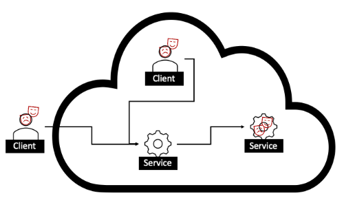

# CNCF TAG Security: Cloud Native Zero Trust White Paper

## Designing Zero Trust Using Cloud Native Platforms (Part 1)

```text
[*** Document locked for review by CNCF TAG Security community
     Suggestions and comments only *** ]
```

<!-- markdownlint-disable MD001 MD009 MD010 MD012 MD013 MD022 MD024 MD026 MD030 MD033 MD034 MD036 MD037 MD041 MD045 -->
<!-- cspell:disable -->
**Version**: 1.0 **Created**: _Date_ **Status**: WIP | In Review | **Not Approved**

**Last Reviewed**: _Date_, **PDF Published**: _Date_ **Release Version**: 1.0

**Final PDF Approvers** [X] _USERID_ [X] _USERID_

**STAG Sponsor**: Aradhna Chetal

**Project Lead**: Mariusz Sabath, Kishore Nadendla

**CNCF issue**: [https://github.com/cncf/tag-security/issues/950](https://github.com/cncf/tag-security/issues/950)

**Version 1 (_Date_)**

* **Contributors** (in alphabetical order):
  * Aradhna Chetal ([TIAA](http://tiaa.org/)), Asad Faizi, David Hadas ([IBM](https://www.ibm.com/)), Kishore Nadendla ([TIAA](http://tiaa.org/)), Mariusz Sabath ([IBM](https://www.ibm.com/)), Philip Griffiths ([NetFoundry](https://netfoundry.io/)), Victor Lu

* **Reviewers**:
  * Pushkar Joglekar, Nate Waddington, Andrés Vega

<!-- cspell:enable -->

<span style="text-decoration:underline;">Table of Contents</span>

[TOC]

**Note**: All tools, projects, libraries mentioned in the paper are mentioned as examples when describing a relevant section. Hence, such mention **should not** be taken as an official recommendation by TAG Security or CNCF. Readers should evaluate adoption of such tools, projects or libraries based on their own understanding and threat model of the system under review.

## Executive Summary

The continual cat-and-mouse game between organizations seeking to protect their distributed cloud services (through perimeter security) and offenders seeking to punch holes in such a perimeter (by exploiting new weaknesses in deployed cloud services and their underlying cloud native platforms) intensifies annually. As the [number of incidents](https://www.ic3.gov/Media/PDF/AnnualReport/2022_IC3Report.pdf) [^1] continues to show steep annual growth, some organizations try to keep up with the pace and variety of attacks by adopting secure-by-design practices and improving their ability to detect cyber weaknesses. Nevertheless, offenders seem to always have the upper hand. As organizations continue to use the common practice of perimeter defenses, offenders find new innovative ways to overcome the perimeter, place a first foothold within the organization, and carry on attacks deeper into the network from within. The practice of perimeter defenses is further weakened by organizations moving workloads to the cloud; a multi-cloud strategy makes these efforts even more fraught and less likely to succeed. In any cloud environment, the concept of perimeter becomes blurry as organizations lose control over the network and much of the inner services.

Zero Trust revolutionizes cyber defenses by replacing the core security principles. It considers any client a suspect that may be used to commence attacks against the organization. It considers the internal network as hostile as the external network. It takes into account that good citizens of the organization's network may get hacked and become a stepping stone for offenders to further their attacks. It assumes everyone is a suspect, any message sent can be an exploit, and any cloud service will at some point get hacked. Therefore, the Zero Trust cyber approach is especially suitable for cloud services where the perimeter is blurry.

In a cloud environment, the scope and complexity of services are dynamic. Further, any client or service entity may change its location between hosts, clusters, regions, and sometimes clouds. This overview begins by outlining the fundamental Zero Trust principles in cloud native environments. It identifies key cloud native elements that serve as the foundation for implementing Zero Trust effectively. Furthermore, we present a comprehensive overview of the essential components required to establish a Zero Trust Architecture (ZTA) within a cloud native context.

As a testament to the commitment of the CNCF community to address this critical challenge, we showcase existing systems and solutions within CNCF that can support and accelerate the journey toward a ZTA (See “Best Practices” chapter). Embracing these solutions empowers the Cloud Native Community to fortify its defenses and stay ahead of the threats posed by cyber offenders.

By leveraging the insights and guidelines presented in this white paper, organizations can bolster their security measures, adapt to the dynamic threat landscape, and establish a more robust security posture within their cloud native environments. The journey towards a Zero Trust approach represents a pivotal step in safeguarding critical services and data, ensuring a safer and more resilient digital future.

In this paper, _Part 1 “Designing Zero Trust Using Cloud Native Platforms”_, our primary objective is to provide a foundational understanding of the key principles, bedrock components, and best practices that form the backbone of this security model. _Please note, there is a forthcoming follow-up paper, which will explore far deeper into the subject matter. In the upcoming part 2 “Implementing Zero Trust using Cloud Native Platforms,” we will provide an extensive overview of detailed technologies, offer practical examples, and analyze advanced use cases, focusing on integrating Zero Trust principles with CNCF components and tools._

We intend to equip organizations with comprehensive knowledge to implement Zero Trust security within their cloud native environments successfully. This multi-part approach ensures that readers will thoroughly understand the topic and be well-prepared to enhance their cybersecurity defenses effectively.

## Introduction

Before going further, we need to define Zero Trust. The concept of Zero Trust was first introduced by John Kindervag, then an analyst at Forrester Research, in 2010. It has evolved since then as a security framework to help reduce implicit trust in systems - not ensure there is no trust at all. All systems have ‘trust’; but trust “is not a property, but rather an assessment based on experience…. [It is] a declaration made by an observer [not] a property of the observed.” [^4] Resultantly, Zero Trust is about not giving implicit trust but rather keeping trust in the system and its components to the bare minimum necessary (the well-known principle of least privilege) and ensuring it’s enforced - ideally automatically - while ensuring continual assessment. When implementing Zero Trust, perimeter security is no longer enough; you must treat users, systems, and networks as untrusted. The DoD’s Reference Architecture sums it up nicely: “The foundational tenet of the Zero Trust Model is that no actor, system, network, or service operating outside or within the security perimeter is trusted. It is a dramatic paradigm shift in [the] philosophy of how we secure our infrastructure, networks, and data, from verify once at the perimeter to continual verification of each user, device, application, and transaction.”

In the context of cloud systems, Zero Trust is a collection of concepts and architectures to secure cloud services. **Zero Trust assumes that protecting the cloud system perimeter does not suffice, and offenders may find ways to attack cloud services from within the cloud network. This calls for protecting cloud services in an environment where offenders have a foothold inside the cloud systems and at clients approaching the cloud services.** Zero Trust is a cyber approach in which everything needs to be suspected; no trust should be given implicitly, and minimal trust should be given explicitly to those showing good conduct to do their specific tasks. The Zero Trust approach aims to enforce accurate, least privileged, behavior-based, per-request access decisions to every cloud service, regardless of whether the service request is sourced from a client within the cloud or from an external client.



_Image 1._

In recent years, Zero Trust has gained significant attention, propelled by the efforts of the US Government after President Biden’s[Zero Trust Mandate](https://www.whitehouse.gov/wp-content/uploads/2022/01/M-22-09.pdf) [^2]. A few recent codification efforts include<!-- cspell:disable -->
[NIST SP 800-207, Zero Trust Architecture](https://csrc.nist.gov/publications/detail/sp/800-207/final),
[CISA’s Zero Trust Maturity Model](https://www.cisa.gov/sites/default/files/2023-04/zero_trust_maturity_model_v2_508.pdf),
[Department of Defense (DoD) Zero Trust Reference Architecture](https://dodcio.defense.gov/Portals/0/Documents/Library/(U)ZT_RA_v2.0(U)_Sep22.pdf) [^3], and
[NIST SP 800-207A](https://csrc.nist.gov/pubs/sp/800/207/a/final),
[A Zero Trust Architecture Model for Access Control in Cloud Native Applications in Multi-Location Environments](https://csrc.nist.gov/publications/detail/sp/800-207a/draft).
<!-- cspell:enable -->
Zero Trust is in many ways a revolution in cyber security practices, and since codification, papers aiming to offer concrete, practical recommendations often limit the scope and seek a more evolutionary approach, sometimes deviating from the Zero Trust methodology. Different standards seem to legitimize other deviations. Therefore, it is no surprise that none of these analyses agree. For example, a paper focused on the required evolution of identity management may leave out controls needed to protect against a compromised client or stolen credentials.

Into all this confusion we offer our take: ZTA is a holistic approach to security required when abandoning the assumption that the perimeter is defendable. It affects all aspects of cyber security and changes everything. We aim in this whitepaper to provide initial thoughts and positioning of Zero Trust for cloud native architectures and platforms. This provides a baseline for conversation and iterative upgrades to our recommendations and guidance as the field inevitably matures.

This paper will examine several critical aspects of Zero Trust security, guiding organizations in designing and implementing robust strategies for safeguarding their ecosystems. These principles serve as high-level guidelines that steer the direction of Zero Trust initiatives, ensuring that security remains at the forefront of every decision and action.

A solid foundation is essential for any security strategy in a cloud native environment. We will explore the bedrock of Zero Trust, which is the key foundational element underpinning the implementation of this security model in cloud native architecture. Understanding these foundational principles is critical to constructing a resilient security strategy.

Organizations must leverage specific technologies, tools, and solutions to implement Zero Trust effectively. These components are pivotal in creating a Zero Trust architecture that  responds to evolving threats. We will dissect various Zero Trust components, shedding light on how they contribute to a comprehensive security framework.

Achieving Zero Trust is not just about implementing technologies but also about adopting the right practices. This paper will discuss best practices organizations should adopt to implement and maintain a Zero Trust security model successfully. These recommended approaches and strategies serve as valuable insights for organizations seeking to strengthen their security defenses.

Additionally, a list of references for further exploration and research on topics discussed in this paper can be found at the bottom of the document.

We hope that the cloud native community, CNCF members, and other interested parties will use this whitepaper as a baseline for conversation and implementation of Zero Trust principles into their deployments while engaging in [feedback](https://github.com/cncf/tag-security/issues/950) to help evolve this paper.

## Principles of Zero Trust

### General Principles

Principles allow the reader to understand the fundamental ideas and beliefs that shape the rest of the paper's content. Principles serve as a reference point and help readers contextualize the information presented throughout the paper. They provide a logical and conceptual framework that supports the arguments, strategies, and recommendations discussed later.


_Image 2. In the context of Zero Trust, we model cloud native as an environment where “Service Request Senders” (users or machines from within the cloud or from outside the cloud) send “Service Requests” to Services implementing specific functions or features._

Principles of Zero Trust:

* **Assume a breach**.  Plan for systems and elements getting compromised.
    1. **Assume every image includes vulnerabilities** - there is no such thing as a vulnerability-free image. _Dependencies are vulnerable, development tools get hacked, repositories get hacked, and CI/CD tools get hacked. The mountain of code we all use is vulnerable._
    2. **Assume every service is vulnerable** - there is no such thing as a vulnerability-free service. _Services are vulnerable as they use images with vulnerabilities and exchange data that may be under an offender’s control._
    3. **Assume every service will be exploited sometime** - services are never air-gapped, and a determined offender will find a way in. _Yes, every service needs to be monitored and have a plan for when they are being exploited._
    4. **Assume the cluster network is hostile and untrusted** - Assume injection and extraction of cluster network data. Never trust internal cluster traffic more than you trust ingress traffic. _Cluster networks do get hacked. Services on clusters do get hacked, and lateral movement is a thing._
    5. **Assume request senders (aka clients) may potentially send malicious requests** - Even when presenting valid credentials, a request may still be hostile. Credentials get stolen, clients get hacked, users may seek to abuse their access rights, etc.
* **Always verify, never trust.** This Zero Trust tenet translates into three aspects:
  * (a) **Eliminate implicit trust**
  * (b) **Continually monitor actual behavior to verify trustworthiness**
  * (c) **Minimize explicit trust**

    In the context of cloud native:
    * (a) **Eliminate implicit trust**
      * **Always authenticate the service** - internal and external clients need to verify the identity of any service approached.
        * The internal cluster network can also be hostile; hence, even internal clients must authenticate the services and protect against Man-in-the-Middle attacks on the internal network.
      * **Always authenticate service request senders** - verify the identity of any request sender (aka client), either cluster internal or external to any service. This includes both users as well as machines sending requests.
        * We should assume the internal cluster network is also hostile, and offenders may send requests from within the internal cluster network.
    * (b) **Continually monitor actual behavior to verify  trustworthiness**
      * **Always monitor and verify the service instance behavior** - verify that the service instances are not being exploited. Services do get hacked.
        * Data does get stolen.
        * Offenders do use services to advance sinister intentions.
      * **Always monitor and verify service request behavior** - verify, per request, that the request behaves as expected.
        * Requests are being used to exploit vulnerabilities in services.
      * **Always monitor and verify the client behavior** - observe the behavior of the identities of request senders (aka clients), -either users or machines- and verify that such identities behave as expected over time.
        * Identities do get hacked, credentials do get stolen, and insiders may misbehave.
        * Has the geo-location changed?
        * Does the amount of requests make sense?
        * Has this identity sent suspicious or non-permitted requests recently?
    * (c) **Minimize explicit trust**
      * **Always grant minimal permissions to service requests and permit the minimal required behaviors** - explicitly verify that _this client_ is allowed to perform _this operation_ against _this service_ in view of the observed behaviors of the client, the service request, and the service.
        For example, you could ask questions such as:
        * _Do we allow any trusted identity to access all data and do anything?_
        * _Do we allow this identity, given its past behavior, to make this request?_
        * _Do we allow this request, given that we suspect it is an exploit?_

Additionally, the following general principle applies:

* **A Principle of the least privilege** - by default, it grants no access or minimal access, then elevates the privilege only when needed, and only to specific clients needing such access. It refrains from assuming such access is granted and doesn't assume it is forever. Instead, such access is subject to the actual behaviors observed in the system and may be revoked if the behavior indicates a breach. When access is given, it is granted. Also, ensure permissions grant access to a deterministic list of subjects and resources - not to all owners of specific roles. Access is granted for specific operations, not for any operation. Access to use an operation is granted for specific services, not a group of services. Overall, this results in privileges given in the form of: X client, if it behaves, can do Y operation, if the operation request looks legit, at Z service, as long as Z is not shown to be compromised.

Overall, Zero Trust aims for the **right user to have access to the right data, for the right reason, at the right time**.

### Cloud Native Principles of Zero Trust

The main approach of Zero Trust is to “Trust nothing by default”. Ever. When you trust nothing, you are forced to seek relevant security measures wherever there is a risk. Consequently, we should “Verify Everything.” Do not assume that passing a check naturally affords trust. Having credentials doesn’t mean you are trustable -It just means you have credentials. And credentials can be stolen. We discuss here the cloud native principles derived from the Zero Trust approach.

#### Assume every image includes vulnerabilities

Organizations should always assume all cloud native images are vulnerable and plan accordingly. Organizations should assume that all bespoke software and applications they develop, distribute, and deploy, as well as any third-party software, are vulnerable to various attacks and plan accordingly.

Just as container images are responsible for runtime binaries like Java or Go are assumed to be vulnerable, similar assumptions should be made regarding the specific business logic within an application and the open source software used as dependencies for rapid development. Frequently, vulnerabilities are exploited through these same libraries or business logic, particularly when exposed through an API.

This harsh reality should be clear when taking into account that any deployed services rely not only on the organization's own code but also on:

 1. Imported codes in the form of different library dependencies.
 1. Base images.
 1. A large set of tools used during development and ci/cd processes.
 1. Repositories for code and code artifacts

Such dependencies, tools, and repositories all rely on a tremendous amount of code and were built by an endless number of developers over a long period. This “_mountain of code”_ is a vast resource for offenders. As past experiences teach us time and time again, new weaknesses are repeatedly discovered in widely used code.

#### Assume every service is vulnerable

Organizations should always assume that all deployed services are vulnerable and plan accordingly. Any service deployed should be assumed to run based on a vulnerable image and expose vulnerabilities via its service API.

Many organizations discover that CVEs related to services they have in production become published, and at this point, become aware that their services are vulnerable to a particular type of attack. But how long was this attack possible before the vulnerability was published? Not knowing about a vulnerability does not mean such a vulnerability does not exist. CVEs are published because a white hat security researcher detects and publishes a vulnerability. Blackhat hackers and cyber-criminals would not be so inclined. Assuming services without current CVEs are non-vulnerable is similar to walking in complete darkness and assuming no harm will come simply because one can't see the obstacles ahead.

An important observation is that vulnerability does not necessarily mean services will be exploited. Though services are vulnerable, in some ways unknown to the organization, offenders still need to identify these vulnerabilities to exploit them. A vulnerability that can’t be exploited represents a risk that can’t be realized.

#### Assume every service will be exploited sometime

Organizations need to adopt the mindset that any cloud native deployed service is susceptible to exploitation at some point. When deploying a service, it is crucial to assume that it can be exploited in various ways, such as internal malware infiltration, misuse by insiders, or unauthorized access to credentials or control systems.

#### Assume the cluster network is hostile and untrusted

Organizations should always assume that the cluster network is compromised and that hostile entities have access to the network, can inject traffic, and can extract traffic from the cluster network.

#### Assume request senders (aka clients) may potentially send malicious requests

Organizations should assume that even after a client provides credible credentials and shows good behavior over time, the next request sent by the client may be an attempt to attack the service. An offender may tag along a legitimate user using the same client or embed malicious code as part of a legitimate machine sending service requests.

#### Always authenticate the service
Organizations should ensure that the client verifies the identity of any service before the client sends a service request. This includes internal and external clients sending requests to internal and external services.

#### Always authenticate service request senders

Organizations should ensure that the identity of any service request sender sending requests to a cloud native service is verified before allowing the service to be processed. This includes verifying the identity of both internal and external request senders. When anonymous service is to be allowed, the sender’s identity should be considered as one that may come from any sender, both benign and malicious.

#### Always monitor and verify the service instance behavior

Organizations should always assume that a service may be misused. Organizations should avoid a false sense of security when assuming that well-designed services by well-trained teams will behave as designed from a security standpoint. Instead, dynamic per-service-instance evaluation is required. Any service instance should be evaluated based on actual behavior and tagged with a proper **confidence level**, given how it acts in practice. Note that when one service instance is misused, other instances may remain intact. The evaluation of the **confidence level** may be based on parameters such as:

1. Expected behavior of the service includes:
    * Expected requests that the service should or should not make to other services
    * Expected responses that the service should make
    * Service instance behavior as an executable (use of compute resources, system calls, logs, metrics, etc.)
2. Past behavior of the service instance - both its normal behavior and the past **confidence level** of the service.

Organizations should identify and stop service instances that are being misused while maintaining a stable overall service. Offenders should not be allowed to maintain a presence in clusters after detection. Cyber attacks are often governed by the concept of Return On Investment (ROI). The sooner a misused service instance is terminated, the lower the gain obtained by the offender. This results in a lower overall ROI for offenders from attacks. When detection and termination can be achieved before any offender gains, the incentive is nullified. Organizations should consider reducing ROI to offenders in the context of service continuity and the effect of terminating service instances given a certain **confidence level** that a service instance is misused.

Throughout this paper, we distinguish between the main service states:

1. **Not Known to be Compromised Service:** A service is intact and includes no ready-made foothold for an offender. An offender wishing to misuse the service must use a vulnerability in the service API to first compromise the service.
2. **Compromised Service:** The attacker has a foothold at the service or the infrastructure, e.g., an exploitable vulnerability or malware triggered to become active at some stage of the service life after deployment.
3. **Exploited Service**: The service is taken and under an attacker’s control. The attacker has active malware running as part of the deployment.

    _Note that we never assume any service can never be exploited. We assume all services may have vulnerabilities in their code, their configuration, etc. We distinguish between services suspected to have such vulnerabilities but are not known to be compromised, services suspected to be compromised, and services actively being exploited._

#### Always monitor and verify service request behavior

Organizations should always assume that a request made to a service API may include an exploit. Requests should be considered a potential delivery mechanism for an effective exploit against a vulnerability in the service API. Organizations should not rely on the implied trustworthiness of the request from an authenticated trusted sender. Instead, dynamic per-request evaluation is required. Given its content, any request should be evaluated and tagged with a proper **confidence level** after being assessed as a potential exploit.

#### Always monitor and verify the client behavior

Organizations should not assume that a service client, duly authenticated, is not a disguised attacker. Organizations should not rely on implied trustworthiness and always assume credentials may be stolen, insiders may become offensive, and attackers may reside in the sender’s system. Instead, dynamic per-client evaluation is required. Such evaluation may rely on:

1. Past behavior of the client - both its normal behavior and the past **confidence level** of its requests.
2. External information about the identity - e.g., When the identity is another service, such information may include the service behavior as discussed in “**Always monitor the service behavior**”

Always grant minimal permissions to service requests and permit the minimal required behaviors

Organizations should use dynamic and fine-grain access control to ensure that the sender whose identity is verified is allowed to perform the operation required in the given context. Such access control includes:

1. The operation required by the identity - is it one that the identity should be allowed to make?
1. The **confidence level** of the true identity of the sender
1. The **confidence level** of the request not being an exploit
1. The overall context - are we expecting requests at this time of day? From this IP-range? Etc.

### Summary

Zero Trust is a security framework and assumes that all service requests, both from internal and external sources, are potentially untrustworthy. It emphasizes the importance of strict access controls, continuous monitoring, and a holistic approach to security.

Authentication and authorization are handled on a per-request basis rather than on a per-session basis. Every action is either authorized or restricted. Every behavior is monitored. This helps block offenders even if credentials were leaked or intercepted.

We can break this into three simple steps to keep in mind.


_Image 3._

#### Always identify

No matter where the client is, whenever a client tries to access, validate that the client has proper credentials. Never trust a client based on other attributes, such as their location. Keep track of all clients based on their individual identities. Make sure to periodically revalidate the client credentials to detect clients with invalidated credentials. Avoid long sessions based on past credential validations.

#### Always analyze

Just because a client authentication was successful, it doesn’t mean the client is trustworthy. All service request traffic, whether internal or external, is treated as potentially malicious  - analyze it and verify it is not an attack. Insider threats and malicious actors may gain access to valid credentials. Legitimate clients with proper credentials may be compromised and act maliciously.

Clients, client requests, and services need to be continuously analyzed and based on their behavior compared to expected criteria. Continuously record all network and system activity and regularly analyze and inspect it to verify what occurs. Make sure you can replay decisions for audit purposes.

#### Always control

Restrict access to resources based on client identity, device posture, and other contextual factors. Apply specific controls and checks in front of every service, controlling every action of every client. Adopt and strictly enforce the principle of least privilege – clients should only have access to the absolute minimum they need to perform their job. No client should have unneeded access, even if the risk of having such access is deemed low.

Combine the analysis results of the behavior of services, service clients, and service requests as part of the access control in front of every service. Factoring behavioral analysis results as part of access control ensures that access privileges are adjusted dynamically based on the information gathered regarding the specific request, its sender, and the service being approached.

Zero Trust promotes the implementation of network segmentation into smaller, isolated segments or microsegments. Here, we identify each service as a micro segment. Separating access control per service helps to contain breaches and limit lateral movement within the network. By dividing the network into small segments  containing a single microservice, access controls can be applied more granularly, reducing the attack surface. Lateral movement between microservices is prevented as each microservice uses its access control and is protected from neighboring services.

## Bedrocks of Zero Trust

The following Bedrocks of Zero Trust represent the key elements that define and support the implementation of a Zero Trust architecture. By addressing these bedrocks, we provide a comprehensive understanding of the concept and its practical implications. This helps to ensure greater longevity and flexibility of the advice, even as technologies change.

### Cloud Native Zero Trust Core Elements

The [DoD Reference Architecture](https://dodcio.defense.gov/Portals/0/Documents/Library/(U)ZT_RA_v2.0(U)_Sep22.pdf) identifies seven core pillars: Users, Devices, Networking, Applications and Workloads, Data, and Automation and Orchestration. We identify the following as the Bedrocks of cloud native Zero Trust:


_Image 4. Note that the service request sender (aka client) may be malicious. The Network and Data may also be compromised._

* **Service Instances** - Securing services offered using containers on cloud native clusters. DevSecOps practices to secure applications from inception till production. Secure by design practices, image build methodologies, image scanning, and storage. Service runtime protection methods include behavioral monitoring methods of services to form **confidence levels** in services.
* **Clients Identities** - Securing the identity of clients sending service requests, either external or internal, monitoring their behavior to form a **confidence level** in identities.
* **Service requests** - Securing the requests sent by clients and processed by services. Monitoring the risks posed by requests to form **confidence levels** in risks from requests.
* **Data** - Categorization of data to enable securing data by data types.
* **Network** - Securing service requests and responses sent between Clients and Services, including encryption mechanisms.
* **Access Control** - Implementation of policies governing controls to secure access to services. Implementation of micro-segmentation in a cluster and enforcing granular access controls using gates in front of services. Considering the **confidence level** of identities and requests as part of access control. Considering Data types of both requests and responses as part of access control.
* **Automation** - Automation involves using tools and processes to automate the deployment, configuration, management, and audit of cloud native components while ensuring zero trust principles are followed. Automated removal of suspected service instances based on the service **confidence level**.

We identify that **Client Identities** may be malicious, **Service Requests** may include exploits, **Service Instances** may be exploited, **Data** may include exploits, and the **Network** may be hostile. Since we can no longer trust such fundamental entities in our cloud native systems, we require an _“Active Observer”_ to continually assess the _“Confidence Level”_ we have for such entities.

Cloud Native Zero Trust extends **Access Control** to consider the _Confidence Level_ assessment of the **Client Identity** and the **Service requests**. Zero Trust extends **Automation** to consider the **Service Instances**’ _Confidence Level_ assessment.

#### _Active Observer_ evaluating _Confidence Levels_

Security Behavior Analytics (SBA) is a technology that serves as an _Active Observer_ to evaluate the _Confidence Levels_ of an entity based on the entity's security-related behavior compared to its norm or other predefined known criteria. The entity’s standard behavior is first examined through security glasses, and the behavior exposed is recorded. Once standard behavior is recorded, _Confidence Levels_ can be deducted by changes in the security-related behavior of the entity.

Under Cloud Native Zero Trust, SBA enables the monitoring of **services**, **client identities**, and **service requests.**


_Image 5._

In the context of Cloud Services, we identify between:

* **Security Behavior Analytics for Service Requests (SBA-SR)** - the use of SBA for analyzing the behavior exposed by **service requests** before they arrive at a vulnerable service.
* **Security Behavior Analytics for Service Instances (SBA-SI)** - the use of SBA for analyzing the behavior exposed by cloud **service.**
* The behavior of **client identities** may be deduced from the behavior of requests emitted by such clients. When the client is a Cloud native service, its behavior is also deduced from the behavior of the service.

By applying zero trust principles to the Bedrocks of Zero Trust, we have a structured framework to operationalize the key components required when applying it to cloud native architectures to ensure comprehensive coverage across different dimensions of zero trust.

## Zero Trust Components

### Trust in a Zero Trust Cloud Native Platform

When applying Zero Trust principles to cloud native platforms, we need to consider what Zero Trust is, why we need it, the components of these platforms, and how our principles should be applied to each.

The elephant in the room is that the "zero" in Zero Trust does not mean we trust nothing. All systems require “trust;” it is how that trust is obtained that changes. With Zero Trust, trust is not a given; it is not enough to be inside the cloud native platform to be trusted. Perimeter security is no longer enough; we must treat cloud native **clients**, **service instances**, **service requests**, **data**, and **networks** as untrusted. Zero Trust requires continual and dynamic assessment to evaluate if trust is to be given at any given moment to any given entity. We no longer trust “by design;” we trust after making a specific assessment given all the information we can collect at any given moment.

As Dorothy Denning highlights in “A New Paradigm for Trusted Systems":

>_"trust is not a property but rather an assessment based on experience! It is a declaration made by an observer, not a property of the observed."_

Resultantly, under Zero Trust, we are required to introduce to our systems an _Active Observer_ that will make **automated assessments based on experience and declare the trust level we should have in the observed entities**. In other words, such an _Active Observer_ will continuously make trust assessments on our behalf in real-time to determine our current _Confidence Level_ - how sure we are right now that we may trust the observed entity.

Our confidence in an entity must be considered when making granular real-time decisions regarding who and what to trust. This helps us keep trust in system components to the bare minimum necessary (the well-known principle of least privilege) and make sure it’s enforced - ideally automatically - while ensuring continual assessment. To implement such granular real-time decisions, we need an enhanced Access Control.

The DoD’s Reference Architecture sums it up nicely:
>_“[No] actor, system, network, or service operating outside or within the security perimeter is trusted. Instead, we must verify anything and everything attempting to establish access. It is a dramatic paradigm shift in [the] philosophy of how we secure our infrastructure, networks, and data, from verify once at the perimeter to continual verification of each user, device, application, and transaction.”_

Cloud native platforms and systems epitomize the increasing complexity of securing infrastructure, data, and access. Cloud native platforms are inherently scalable, dynamic, and increasingly distributed with expansion into use cases such as edge computing and IoT. IP-based identity and perimeter security have become obsolete in a world of ephemeral IP addresses and constantly changing resources.

### Container Platform and Orchestration

Zero Trust is a cybersecurity strategy based on the "never trust, always verify" principle. In the context of a Container Platform and Orchestration system, it implies that all interactions (within the system and with external systems) should be authenticated, authorized, and validated. This concept can be broken down into several components:

#### Identity Management

One of the most critical components of a Zero Trust approach is strong Identity Management. This involves verifying the identity of every **client** that tries to access resources in your container platform. The identity management may rely on a token presented by the client and verified by the **service instance** or on **client** certificates verified by **service instances** using _mTLS_ (mutual Transport Layer Security).

Identity management in a cloud native environment is described in the [Identity and Access Management section of tag-security whitepaper](https://github.com/cncf/tag-security/blob/main/security-whitepaper/v2/cloud-native-security-whitepaper.md#access).

Note that under Zero Trust, once we verify a client's identity, we are still required to verify that the requested operation is authorized and evaluate our confidence level that the client behaves as expected (e.g., client credentials were not being misused).

#### Network Security

In a Zero Trust model, the network is always considered untrustworthy. This means applying security measures such as micro-segmentation, which involves dividing the network into secure zones and enforcing rules -using Access Control - about the traffic that can flow between them. This helps limit the spread of breaches and makes it easier to manage traffic and monitor suspicious behavior.

#### Encryption

Zero Trust assumes that offenders may reside inside cloud clusters, stage attacks on the cluster network, and attempt to access any data stored in the cloud. Therefore, all data, at rest and in transit, should be encrypted under Zero Trust. This protects sensitive data if it falls into the wrong hands and forms part of the process of authenticating and verifying interactions.

#### Container Security

Container security should follow security best practices by applying security measures at the container level. This includes secure configuration (ensuring containers are set up securely) and vulnerability scanning (checking for known vulnerabilities in your container images).

Additionally, under Zero Trust, runtime security is required to monitor suspicious activity while containers are running.

### The _Active Observer_

Under cloud native Zero Trust, we require an _Active Observer_ to establish trust. It is not enough to verify the **client’s** identity using Identity Management; we need to consider that credentials may be stolen and the **client** may be compromised. An _Active Observer_ should be in place to observe that client’s activities and decide on the _Confidence Level_ assigned to that identity - how sure are we that the **client** is not compromised and that the entity presenting the credentials is indeed the **client**?

Similarly, an _Active Observer_ is required to verify that the client is sending legitimate **service requests** rather than malicious ones. And that the **Service Instances** processing such requests are not compromised.

#### Continuous Monitoring and Logging

Continuous monitoring is crucial for a Zero Trust approach. This involves collecting and analyzing logs to detect unusual activity and setting up alerts for possible security incidents. Security monitoring plays an important role as an input to an _Active Observer_. It may be used to detect compromised **Clients** and **Service Instances**.

#### Security Behavior Analytics for Service request (SBA-SR)

When an offender aims to gain an initial foothold in a vulnerable service, the offender needs to manipulate the request sent to the service API such that it may exploit it. Using the exploit, the offender seeks to trigger some unplanned behavior of the service. The offender is, therefore, required to send an irregular sequence of characters or/and an irregular sequence of requests. (Note that benign users will not be sending such irregular sequences.)

Detecting such irregularities is a key element in protecting vulnerable cloud services. Organizations should deploy Security Behavior Analytics for Service Requests (SBA-SR) for detecting security-related irregularities in any communications between clients and the Service API. The deployed SBA-SR should be capable of discerning regular requests of benign users from manipulated requests made by offenders.  The outcome of this component is a _Confidence Level_ of a **Service Request** that should be handled by **Access Control,** as discussed below.

#### Security Behavior Analytics for Service Instances (SBA-SI)

A compromised service will not exhibit any behavioral changes unless exploited. Malware residing in a service can not be traced by observing the service behavior before the malware is activated. Once activated, the behavior induced by the malware is added to the one intended by the organization. This produces irregular service behaviors. Note that when using the common practice of cloud native scale-out, some service instances may be exploited while others are not. Therefore, some instances may exhibit irregular behavior while others exhibit regular ones.

Detecting such irregularities is a key element in detecting exploited cloud service instances. The deployed SBA-SI should be capable of discerning regular service behavior intended by the organization from the composite behavior affected by the malware. The outcome of this component is a _Confidence Level_ of a **Service Instance** that should be handled by **Automation**, as discussed below.

### Access Control

Under Zero Trust, **Access Control** takes new roles in several dimensions:

* Access control should be applied for specific **client identities** rather than for “all clients” or groups of clients.
* Access control should be applied per **Service** rather than for “all services” or groups of services. All Service Instances should naturally have the same access control.
* Access control should be considered per **Service Request** rather than being applied once for a client and applied for all the client requests.
  * When access control is considered for a **Service Request**, it should consider the following:
    * The _Confidence Level_ of the **Service Requests** (how sure are we that this is not an exploit or part of an attack)
    * The _Confidence Level_ of the **Client identity** (how sure are we that this client is not compromised)

Combined, Zero Trust **Access Control** apply

1. The principle of least privilege (PoLP) gives a **client** connecting to a **service** only the privileges the client needs to perform their job as part of the service and nothing more. This can be achieved by a Role-Based Access Control (RBAC)  that will be correctly used to ensure each client is authorized based on its identity and the identity of a specific cloud service being approached. Other options include ABAC (Attribute-Based Access Control) and ReBAC (Relationship-Based Access Control).
2. Dynamic and context-aware access control, taking real-time access decisions on a per-request basis. Decisions are based on the _Confidence Levels_ evaluated by an _Active Observer_. This can be achieved by introducing SBA technology and enhancing Access Control to enable the introduction of dynamic access rules and policies.

### Automation

Given containerized environments’ complexity and dynamic nature, automation is crucial for maintaining a Zero Trust posture. This could include automated security scans, automated policy enforcement, and automated responses to security incidents.

Consider a case where the _Confidence Level_ of a **Service Instance** suggests that the instance is compromised as an example of an automated response to a security incident. Automation is needed to consider the **Service Instance’s** deletion and allow a new, fresh **Service Instance** to replace it. Such a decision should consider several factors, including service availability.

## Best Practices to Achieve Zero Trust

>“A guiding policy can be an advantage in and of itself if it _anticipates_ actions and reactions of others, _reduces the complexity and ambiguity_ of a situation, by exploiting _leverage_, and by creating policies and actions that are _coherent_.” - <!-- cspell:disable -->[Good Strategy, Bad Strategy by Richard Rumelt](https://youexec.com/book-summaries/good-strategy-bad-strategy)<!-- cspell:enable -->

|Topic   | Key concept |
|--------|-------------|
| Service Instances | Use <em>Active Observer</em> to monitor and verify the activity of service instances to find compromised instances using Security Behavior Analytics of Service Instances (SBA-SI). Flag or auto-delete suspected instances.|
| Service Requests | Use <em>Active Observer</em> to monitor and verify service requests sent from senders to services. Identify requests suspected as exploits using Security Behavior Analytics of Service Requests (SBA-SR). Flag or auto-delete suspected requests. Make sure all Service requests are encrypted in transit.|
| Client Identities | Verify the identity of every service request sender (client). Use <em>Active Observer</em> to monitor and verify client behavior over time. Flag or auto-block suspected clients.|
| Access Control | Use fine-grained access control in front of every service. Control which client identities can send service requests while considering their confidence level. Control which service requests these clients are allowed to send while considering the service requests' confidence level.|
-----

_A summary of the best practice topics to support ZTA principles using CNCF technologies_

### Service Instances

**Service instances** under CNCF Zero Trust need to be monitored using an _Active Observer_ to achieve two goals:

* Identifying compromised instances that can be stopped and  non-compromised instances started to replace them.
* Helping to identify compromised client identities when the affected service instance is also a client of other cloud services.
* Allowing to run forensic analysis to identify the kind of ongoing attack

#### Security Behavior Analytics for Service Instances (SBA-SI)

CNCF Knative’s [Security-Guard](https://knative.dev/docs/serving/app-security/security-guard-about/) (Guard) offers support as an SBA-SI. Like other Knative components, Guard can be used separately from Knative and be deployed as part of vanilla Kubernetes or other cloud native orchestration systems. Guard uses machine-learning-based criteria synthesis to identify the standard patterns service clients use. Guard also supports setting manual criteria. Guard’s SBA-SI identifies changes in the external communication performed by service instances. It calculates a **confidence level** of **service instances** and is integrated with **Automation**, which optionally allows deleting service instances suspected as being exploited.

Profiling the behavior of **service instances** and evaluating **confidence levels** may also take advantage of eBPF technology. Several CNCF projects use eBPF-based technology in observability, networking, and security ([Falco](https://falco.org/), [Cilium](https://cilium.io/), [Pixie](https://docs.px.dev/), and [KubeArmor](https://kubearmor.io/)). eBPF may be used to synthesize criteria describing the standard patterns used by **service instances.** Such criteria can later be used to evaluate the **confidence level** of running **service instances**.

An additional source of information that can be used to determine the **confidence level** of **Service Instances** is intelligence information about CVEs included in the service image. Such information may be obtained by scanning images before or during service orchestration.

### Service Requests

**Service Requests** security takes an important role in Zero Trust. First and foremost, any transmission of Service Requests over the wire must be encrypted, as the network cannot be trusted. Additionally, requests need to be monitored by an _Active Observer_ using SBA-SR  to achieve two goals:

* to determine the risk of servicing the request using a **Service Instance**
* to help identify compromised client identities from which the request originated and take action accordingly.

#### Security Behavior Analytics for Service Requests (SBA-SR)

CNCF Knative offers the [Security-Guard](https://knative.dev/docs/serving/app-security/security-guard-about/#security-guard-profile-and-criteria) extension (Guard for short) main function is to serve as an SBA-SR. As indicated above, Guard can be used separately from Knative and be deployed as part of vanilla Kubernetes. Guard maintains machine-learning-based criteria synthesis to identify the standard patterns used by service requests. It also supports manual criteria. Guard’s SBA-SR identifies changes in service requests performed by clients. It calculates a **confidence level** of **service requests** and is integrated with Access Control, which optionally allows removing service requests suspected as exploits.

Guard’s SBA-SR offers the added benefit of being able to detect unknown exploits to unknown vulnerabilities without the use of signatures. It can help protect services without the usual race between CVEs, Exploits, and Patches.

SBA-SR may also be embedded in Web Application Firewall (WAF) that maintains per service state and is capable of analyzing incoming/ongoing traffic and detecting threads and ongoing attacks. Solutions like <!-- cspell:disable --> [Coraza](https://coraza.io) or [Curiefense](https://www.curiefense.io/) <!-- cspell:enable --> and many others provide anomaly scores for requests and decide whether to block them based on predefined thresholds. Such anomaly scores can evolve to offer SBA-SR features.

#### Data in Transit

To ensure all communications in-transit are encrypted, all services should be using TLS (at least a version 1.2), and all clients need to verify the certificates presented by the server. CNCF projects offering TLS and certificates to protect inter-service communication include [Istio](https://istio.io/), [Linkerd](https://linkerd.io/), [Dapr](https://dapr.io/), and [Knative](https://knative.dev/).

### Client Identities

Identity verification can be based on either client-sent tokens, mTLS client certificates, or a combination of both. Typically, the identity of the workload or service is represented by an Identity Token, also known as an Access Token, included with every request. This token can be inspected by a chain of Policy Enforcement Points to control access. Certificates, on the other hand, are designed to encrypt the connection between two points and guarantee the identity of one (TLS) or both (mTLS) access points.

It's important to note that identity verification is only the first step in confirming the client’s identity. Verified identities under Zero Trust also need to be monitored by an _Active Observer_ to ensure that credentials are not being misused for malicious activity.


#### Token-Based Identity

When using Tokens such as [JSON Web Tokens (JWT)](https://datatracker.ietf.org/doc/rfc7519/) to establish identity, the client obtains a token from a trusted third party. The token is then sent as part of the service request, enabling the service to verify the client’s identity using the trusted third party. Tokens, preferably short-lived, are often used for authentication, allowing a service to verify a client’s identity even when the service request is sent via intermediate proxies. As the request with the Identity Token travels across the endpoints, the identity attributes can be easily read by Policy Enforcement Points, or a chain of them, allowing them to accept or deny access to various resources along the way while preserving the integrity of the token (it cannot be modified).

In adherence to current best practices for utilizing JWT Tokens, it is recommended to perform the following checks:

* **Signature**: Verify if the token has not been tampered with.
* **exp** and **nbf** Claims: Validate the expiration time of the token.
* **iss** Claim: Confirm the issuer's identity.
* **aud** Claim: Check if the audience includes the workload itself.
* **scope** Claim (if exists): For example, ensure that the resource owner authorizes access to the resource.

Related CNCF token-based projects include [Dex](https://dexidp.io/) - an OpenID Connect (OIDC) identity and OAuth 2.0 provider, [Keycloak](https://www.keycloak.org/) - Identity and Access Management, and [SPIFFE and SPIRE](https://spiffe.io/) - A Universal identity control plane for distributed systems, suitable for managing identities in a multi-cloud environment.


#### Certificate-Based Identity

Identity may alternatively be established by the client presenting a client certificate using mutual TLS (mTLS). mTLS allows bi-directional, certificate-based verification. The client can verify the Server, and the Server can verify the client. mTLS uses certificates for hop-by-hop identity verification, which allows a service to verify the identity of a directly connected client co-located on the cloud cluster network. CNCF projects for managing certificates include [cert-manager](https://cert-manager.io/) - cloud native certificate management.

Making mTLS standard for all communications in a cloud cluster is often achieved by deploying a service mesh. CNCF Service mesh projects [Istio](https://istio.io/), [SPIFFE](https://spiffe.io/), and [Linkerd](https://linkerd.io/) offer service-to-service identity verification mTLS.  [Dapr](https://dapr.io/) also offers mTLS.


#### _Active Observer_ for Client Identities

**Confidence level** of local clients embedded in cloud clusters may be evaluated by aggregating the **confidence level** of the respective **service instances** that embed such local clients. Inputs about external clients may or may not be obtainable.

An additional source of client identity **confidence level** can be achieved by aggregating the **confidence level** of all **service requests** emitted by the said client identity. Such information is available for both local and external clients.


### Access Control

Under Zero Trust, we aim to improve the control over the network in several ways. First, by micro-segmentation of the cloud cluster network and placing access control in front of every micro-segment. Second by applying fine-grained access control where every operation by any client is controlled. Lastly, by applying dynamic access control that considers the **confidence level** we have in both the **client identity** and the **service request**.


#### Micro-Segmentation

Since offenders are assumed to be inside the cloud cluster perimeter, access control gates need to be implemented inside the cloud cluster network and ideally in front of every service or service instance.

Under Kubernetes, ingress isolation [Network Policies](https://kubernetes.io/docs/concepts/services-networking/network-policies/) may be used for basic layer 3-4 network control by limiting access to a service to a defined set of other cloud services. Similar control can also be achieved by using mTLS, which would then verify the client’s identity. Note that such mechanisms do not support the required fine-grained access control or dynamic access control and are not suitable for controlling access based on client identities in a multi-hop interaction. Micro-segmentation allows for the division of a network into smaller, isolated segments or microsegments. The attack surface is significantly reduced by implementing strict access controls and separating resources into smaller compartments. Even if an attacker manages to compromise one microsegment, their lateral movement is limited, preventing them from accessing other parts of the network.


#### Fine-grained Access Control

Service mesh based solutions ([Istio](https://istio.io/), [Linkerd](https://linkerd.io/)) offer opportunities to implement a gate in front of every service instance and support fine-grained access policies. Alternatively, when using [Dapr](https://dapr.io/), you may use the Dapr access control.


#### Dynamic access control

[Security-Guard](https://knative.dev/docs/serving/app-security/security-guard-about/) implements dynamic access control by introducing an Access Control gate in front of every **Service Instance**. The Access Control can be configured to block **service requests** based on the request **confidence level**.


## References

<!-- cspell:disable -->
* NIST SP 800-207, Zero Trust Architecture: [https://csrc.nist.gov/publications/detail/sp/800-207/final](https://csrc.nist.gov/publications/detail/sp/800-207/final)
* NIST SP 800-207A, A Zero Trust Architecture Model for Access Control in Cloud-Native Applications in Multi-Cloud Environments: [https://csrc.nist.gov/pubs/sp/800/207/a/final](https://csrc.nist.gov/pubs/sp/800/207/a/final)
* CISA Zero Trust Maturity Model: [https://www.cisa.gov/zero-trust-maturity-model](https://www.cisa.gov/zero-trust-maturity-model)
* Department of Defense (DoD) Zero Trust Reference Architecture: [https://dodcio.defense.gov/Portals/0/Documents/Library/(U)ZT_RA_v2.0(U)_Sep22.pdf](https://dodcio.defense.gov/Portals/0/Documents/Library/(U)ZT_RA_v2.0(U)_Sep22.pdf)
* DoD Zero Trust Strategy (defense.gov): [https://dodcio.defense.gov/Portals/0/Documents/Library/DoD-ZTStrategy.pdf](https://dodcio.defense.gov/Portals/0/Documents/Library/DoD-ZTStrategy.pdf)
* DoD Enterprise DevSecOps Reference Design: [https://dodcio.defense.gov/Portals/0/Documents/DoD%20Enterprise%20DevSecOps%20Reference%20Design%20v1.0_Public%20Release.pdf](https://dodcio.defense.gov/Portals/0/Documents/DoD%20Enterprise%20DevSecOps%20Reference%20Design%20v1.0_Public%20Release.pdf)
* A Zero Trust Architecture Model for Access Control in Cloud Native Applications in Multi-Location Environments: [https://csrc.nist.gov/publications/detail/sp/800-207a/draft](https://csrc.nist.gov/publications/detail/sp/800-207a/draft)
* Identity and Access Management section of tag-security whitepaper: [https://github.com/cncf/tag-security/blob/main/security-whitepaper/v2/cloud-native-security-whitepaper.md#access](https://github.com/cncf/tag-security/blob/main/security-whitepaper/v2/cloud-native-security-whitepaper.md#access)
* Help implementing zero trust architecture (UK): [https://www.ncsc.gov.uk/collection/zero-trust-architecture/implementing-zta](https://www.ncsc.gov.uk/collection/zero-trust-architecture/implementing-zta)
* Zero Trust Thought Paper (Canada): [https://www2.gov.bc.ca/assets/gov/british-columbians-our-governments/services-policies-for-government/information-management-technology/information-security/information-security-awareness/zero_trust_thought_paper.pdf](https://www2.gov.bc.ca/assets/gov/british-columbians-our-governments/services-policies-for-government/information-management-technology/information-security/information-security-awareness/zero_trust_thought_paper.pdf)
* Essential Eight Maturity Model (beyondtrust.com): [https://www.beyondtrust.com/blog/entry/essential-eight-maturity-model-updates](https://www.beyondtrust.com/blog/entry/essential-eight-maturity-model-updates)
* Cybersecurity Policies (Europe): [https://digital-strategy.ec.europa.eu/en/policies/cybersecurity-policies](https://digital-strategy.ec.europa.eu/en/policies/cybersecurity-policies)
* Success Story: Israel National Cyber Directorate Version 2.0 | NIST: [https://www.nist.gov/cyberframework/success-stories/israel-national-cyber-directorate-version-20](https://www.nist.gov/cyberframework/success-stories/israel-national-cyber-directorate-version-20)
* Government Zero Trust Architecture (GovZTA) | Singapore Government Developer Portal (tech.gov.sg): [https://www.developer.tech.gov.sg/guidelines/standards-and-best-practices/government-zero-trust-architecture](https://www.developer.tech.gov.sg/guidelines/standards-and-best-practices/government-zero-trust-architecture)
* 2022-2023 Best Undergraduate Cybersecurity Programs - US News Rankings: [https://www.usnews.com/best-colleges/rankings/computer-science/cybersecurity](https://www.usnews.com/best-colleges/rankings/computer-science/cybersecurity)
* Referenced Projects:
  * CNCF Knative’s Security-Guard: [https://knative.dev/docs/serving/app-security/security-guard-about/](https://knative.dev/docs/serving/app-security/security-guard-about/)
  * Falco: [https://falco.org/](https://falco.org/)
  * Cilium: [https://cilium.io/](https://cilium.io/)
  * Pixie: [https://docs.px.dev/](https://docs.px.dev/)
  * KubeArmor: [https://kubearmor.io/](https://kubearmor.io/)
  * Curiefense: [https://www.curiefense.io/](https://www.curiefense.io/)
  * Istio: [https://istio.io/](https://istio.io/)
  * Linkerd: [https://linkerd.io/](https://linkerd.io/)
  * Dapr: [https://dapr.io/](https://dapr.io/)
  * Knative: [https://knative.dev/](https://knative.dev/)
  * Dex: [https://dexidp.io/](https://dexidp.io/)
  * Keycloak: [https://www.keycloak.org/](https://www.keycloak.org/)
  * SPIFFE and SPIRE: [https://spiffe.io/](https://spiffe.io/)
  * JSON Web Tokens (JWT): [https://datatracker.ietf.org/doc/rfc7519/](https://datatracker.ietf.org/doc/rfc7519/)
  * Cert-manager: [https://cert-manager.io/](https://cert-manager.io/)
  * Kubernetes Network Policies: [https://kubernetes.io/docs/concepts/services-networking/network-policies/](https://kubernetes.io/docs/concepts/services-networking/network-policies/)

### History of Zero Trust:

* [https://infraon.io/blog/history-of-zero-trust-security/](https://infraon.io/blog/history-of-zero-trust-security/) <!-- cspell:enable -->

    In April 1994, the term "zero trust" was coined by Stephen Paul Marsh in his doctoral thesis on computer security at the University of Stirling. Marsh's work studied trust as something finite that can be described mathematically, asserting that the concept of trust transcends human factors such as morality, ethics, lawfulness, justice, and judgment.

* [Formalising Trust as a Computational Concept (stir.ac.uk)](https://www.cs.stir.ac.uk/~kjt/techreps/pdf/TR133.pdf)

    <!-- cspell:disable -->
    John Kindervag, a former analyst at Forrester Research, in 2010. John Kindervag <!-- cspell:enable --> published a research paper titled "No More Chewy Centers: Introducing the Zero Trust Model of Information Security," in which he introduced the concept of zero trust as a new approach to cybersecurity.

   <!-- cspell:disable -->
* [Forrester-No-More-Chewy-Centers.pdf (crystaltechnologies.com)](https://crystaltechnologies.com/wp-content/uploads/2017/12/forrester-zero-trust-model-information-security.pdf)

    The concept of Zero Trust was first introduced by
    John Kindervag, a former analyst at Forrester Research, <!-- cspell:enable --> in 2010. In his model, a network is divided into “zones” with varying levels of trust. The innermost zone, known as the “inner circle,” is the most trusted and contains the organization’s most sensitive data and resources. As you move outward from the inner circle, the level of trust decreases, with the outermost zone being the least trusted.

* [Zero Trust (techskillnation.com)](https://techskillnation.com/2022/12/zero-trust/)

    Google was one of the first companies to take the cue from the potentialities of the Zero Trust architecture. The initiative was called BeyondCorp, and in 2009, Google implemented a de-parameterized framework based on the Zero Trust Architecture.
<!-- cspell:disable -->
* [Zero Trust Network Architecture the Best Fit for Your Use Cases | 2022 | Infraon](https://infraon.io/blog/zero-trust-network-access-use-cases/)<!-- cspell:enable -->

    NIST played a significant role in popularizing and formalizing the zero trust security model

* [https://nvlpubs.nist.gov/nistpubs/SpecialPublications/NIST.SP.800-207.pdf](https://nvlpubs.nist.gov/nistpubs/SpecialPublications/NIST.SP.800-207.pdf)

    A zero trust architecture is designed and deployed with adherence to the following zero trust
basic tenets….

## Acknowledgments

We want to thank several contributors from whom we had excellent input and feedback and, as leading practitioners in the field, did much of the work that we write about in this document:
<!-- cspell:disable -->
* José Carlos Chávez (Tetrate)
* Matt Flannery
* Sundar Nadathur (Intel NEX)
* Andrew Martin
* Matteo Bisi
* Fabian Kammel
* Yaron Schneider
* Yoshiyuki Tabata
* Valerie Silverthorne
<!-- cspell:enable -->

For anyone involved in creating this paper, we express our heartfelt gratitude for your time, dedication, and professionalism. Your contributions have undoubtedly elevated the standard of our research, and we are immensely grateful for your collaboration.

Thank you for being an integral part of this endeavor.

## Footnotes and Citations

[^1]:
    Internet Crime Complaint Center (IC3) Annual report:  [https://www.ic3.gov/Media/PDF/AnnualReport/2022_IC3Report.pdf](https://www.ic3.gov/Media/PDF/AnnualReport/2022_IC3Report.pdf)
[^2]:
    President Biden’s Zero Trust Mandate: [https://www.whitehouse.gov/wp-content/uploads/2022/01/M-22-09.pdf](https://www.whitehouse.gov/wp-content/uploads/2022/01/M-22-09.pdf)
[^3]:
    Department of Defense (DoD) Zero Trust Reference Architecture: [https://dodcio.defense.gov/Portals/0/Documents/Library/(U)ZT_RA_v2.0(U)_Sep22.pdf](https://dodcio.defense.gov/Portals/0/Documents/Library/(U)ZT_RA_v2.0(U)_Sep22.pdf)
[^4]:
    Dorothy Denning- A New Paradigm for Trusted Systems, 1993: [https://dl.acm.org/doi/pdf/10.1145/283751.283772](https://dl.acm.org/doi/pdf/10.1145/283751.283772)
